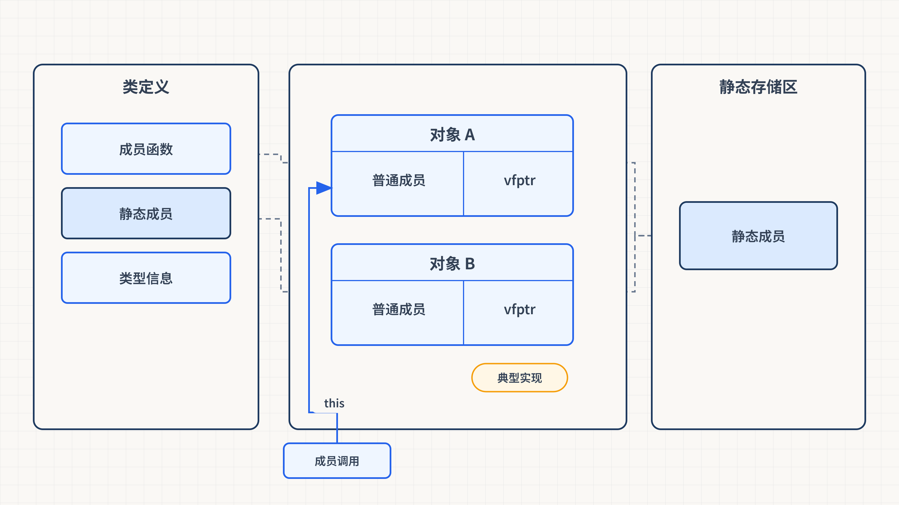
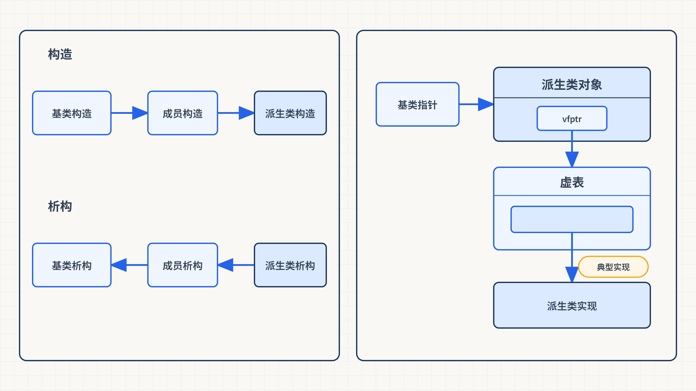
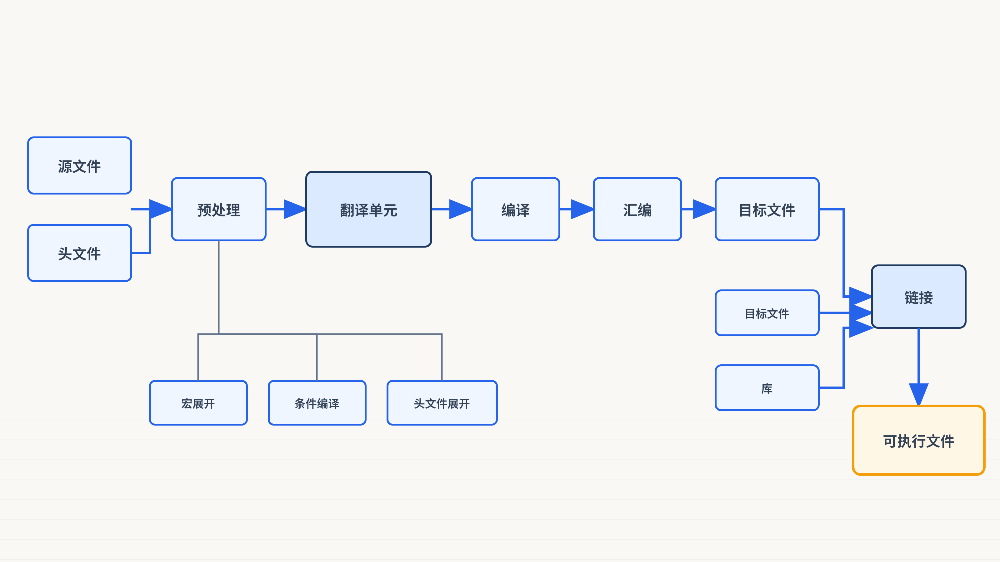
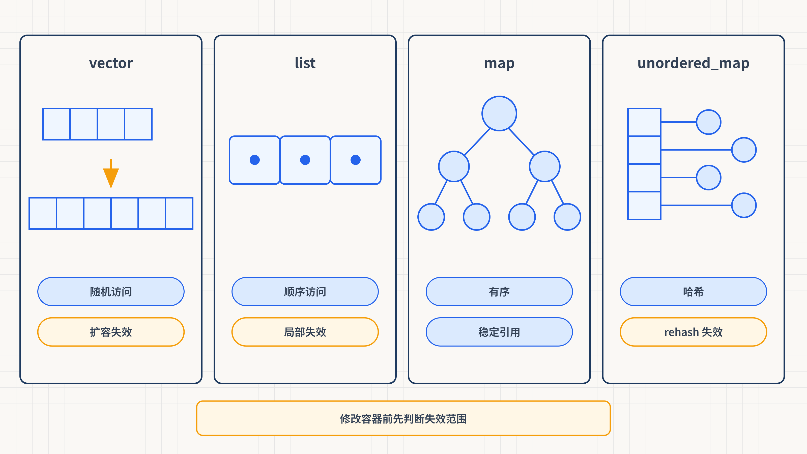
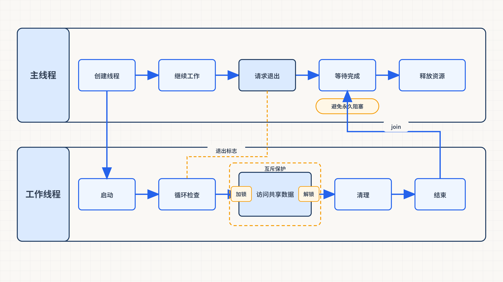

# 第一章 C++ 与 STL 基础

## 1.1 C++ 基础
### 1.1.1 输入与输出
#### （1） C 语言风格
输入：`scanf_s()`  
输出：`printf()`

```cpp
int num1, num2;
scanf_s("%d %d", &num1, &num2);
printf("%05d %05d\n", num1, num2);  // printf的优点：可以格式化输出
```

#### （2） C++ 风格
输入：`cin>>`  
输出：`cout<<`

```cpp
int num1, num2;
cin >> num1 >> num2;
cout << num1 << " " << num2 << endl;  // endl 换行符

const char* str = "hello world";
cout << str << endl;
cout << (void*)str << endl;  // 输出地址需要强制转换为void*
```

*注：`cin/cout`统一化处理，无类型区分。弊端是无法区分输出字符串还是地址，默认输出字符串，地址需强制转换为 `void*` 类型。*

### 1.1.2 命名空间
+ **作用**：划分区域，区域内可定义函数、变量
+ **关键字**：`namespace`

```cpp
namespace 名称 {
    // 任意函数、变量的定义
};
```

+ **作用域运算符**：`::`
    - 作用域（命名空间）:: 变量名（访问指定命名空间的变量）
    - 作用域运算符前面为空，默认全局作用域
    - 无作用域运算符且函数内有局部变量时，优先使用函数内局部变量

### 1.1.3 动态内存管理
#### （1） 堆区与栈区
| 特性 | 堆区 | 栈区 |
| --- | --- | --- |
| 申请方式 | 程序员手动申请释放 | 系统自动分配释放 |
| 生命周期 | 直到手动释放（free()）为止，若不回收，程序结束会自动回收（但会导致内存泄漏） | 出了作用域（函数{}）自动释放 |
| 分配效率 | 低（需要维护内存管理） | 高（系统自动分配） |
| 存储方式 | 无序存储 | 连续存储 |
| 生长方向 | 从低地址到高地址分配 | 从高地址到低地址分配（数组：从低地址到高地址分配） |
| 存储内容 | 存储对象数据 | 存储函数调用信息（返回地址、参数、局部变量等） |


#### （2） C 语言内存管理：`malloc` 与 `free`
```c
类型名 *变量名=(类型名*)malloc(空间大小)
free(变量名)
```

```c
// 申请单个数据
int* p = (int*)malloc(sizeof(int));
free(p);
p = NULL;

// 申请数组
int* parr = (int*)malloc(sizeof(int) * 5);
free(parr);
parr = NULL;
```

+ 需要计算空间大小
+ 强制类型转换（malloc返回void*类型指针变量）
+ 不能申请时初始化
+ 无构造析构函数调用

#### （3） C++ 内存管理：`new` 与 `delete`
```cpp
类型名 *变量名 = new 类型名; 
delete 变量名; 
delete[] 数组名//数组用delete[]释放
```

**申请单个数据**

```cpp
int* p = new int;
delete p;
p = NULL;
```

**申请数组**

```cpp
int* parr = new int[5];  // []代表申请数组，[]里面放数组大小
delete[] parr;           // 数组用delete[]释放
parr = NULL;
```

**申请其它类型**

```cpp
//基本类型
char* p = new char('a');
delete p;
p = NULL;
// 指针数组
int** parr = new int*[5];
delete[] parr;
parr = NULL;
// 数组指针
int(*parr)[5] = new int[1][5];
delete[] parr;
parr = NULL;
```

+ 无需计算空间大小
+ 不需要强制类型转换
+ 可以申请时初始化单个数据

```cpp
int* p3 = new int(10);  // ()代表单个数据初始化
```

申请时初始化数组

```cpp
int* parr3 = new int[5]{1, 2, 3, 4, 5};  // {}代表数组初始化，{}里面放初始化列表
```

+ 定义类、对象时自动调用构造函数，删除时调用析构函数

### 1.1.4 布尔类型
#### （1） `BOOL`（Windows API）
+ 特点：宏定义，4字节
+ TRUE=1，FALSE=0（注意全大写）
+ 头文件：`#include <Windows.h>`

```cpp
BOOL a = TRUE;
BOOL b = FALSE;
```

#### （2） `bool`（C++ 布尔类型）
+ 特点：关键字，1字节
+ true=1，false=0（注意全小写）

```cpp
bool c = true;
bool d = false;
```

### 1.1.5 `std::string`
#### （1） C 语言字符串
**`char*` 与 `char[]` 区别**

+ `char* str`：指针指向常量区，大小为4/8字节（32/64位系统），指针变量可修改指向地址，但指向的字符串常量内容不可修改
+ `char str[]`：数组，大小为数组大小（含'\0'），数组名表示首地址不可修改，栈区分配可修改内容

**使用示例**：

**初始化**

```cpp
char str1[20] = "hello";
const char* str2 = "world";
```

**长度**

```cpp
cout << strlen(str1) << endl;
cout << strlen(str2) << endl;
```

**字节大小**

```cpp
cout << sizeof(str1) << endl;  // 与数组大小有关
cout << sizeof(str2) << endl;  // 与指针大小有关，x86:4字节
```

**拷贝（注意str1空间容量）**

```cpp
strcpy_s(str1, 20, str2);
```

**追加（注意str1空间容量）**

```cpp
strcat_s(str1, 20, str2);
```

**比较：相等返回0，小于返回负数，大于返回正数**

```cpp
strcmp(str1, str2);
```

#### （2） C++ 字符串（`std::string`）
**特点**

+ 本质是类

**基于运算符重载**

**初始化**

```cpp
string str1 = "hello";
string str2 = "world";
```

**拷贝**

```plain
str1 = str2;
```

**追加**

```plain
str1 += str2;  // 效率高于 str1 = str1 + str2
```

**比较**

```plain
str1 == str2;
str1 > str2;
str1 < str2;
```

**调用类的成员函数**

**长度**

```plain
cout << str1.size() << endl;
cout << str1.length() << endl;
```

**字节大小（类对象大小，与内容无关）**

```plain
cout << sizeof(str1) << endl;  // x86下28字节
```

**截断**

```plain
str1.substr(5);      // 从下标5开始截断到末尾
str1.substr(5, 5);   // 从下标5开始截断5个字符
```

**查找**

```plain
str1.find('o');      // 查找字符，返回第一个下标，找不到返回string::npos
str1.find("ld");     // 查找字符串，返回第一个下标
```


### 1.1.6 范围 `for` 循环（C++11）
#### （1） 传统 `for` 循环
```cpp
int nums[] = {0,1,2,3,4,5,6,7,8,9};
for (int i = 0; i < 10; i++) {
    cout << nums[i] << " ";
}
```

**”原始“for循环特点**

1. 可以遍历任意类型的容器或数组（遍历对象要求少）
2. 可以修改遍历对象的值 
3. 可以灵活控制遍历过程

#### （2） 范围 `for` 循环
```cpp
int nums[] = {0,1,2,3,4,5,6,7,8,9};
// 语法：for (数据类型 变量名 : 容器或数组名)
for (int num : nums) {
    cout << num << " ";
}

string str = "hello world";
for (char c : str) {
    cout << c;
}
```

**范围for特点**：

1. 要求遍历对象有begin()和end()方法或支持下标访问（系统知道容器或数组的开始和结束），因此无法用指针变量遍历数组
2. 无法修改遍历对象的值（除非使用引用：`for(int& num : nums)`）
3. 无法手动控制迭代步进（如一次跳过多个元素），但可用break/continue提前结束或跳过当前轮次

### 1.1.7 函数重载
**作用**：允许在同一作用域内，函数名相同但参数不同

**重载条件**（满足其一即可）：

1. 参数个数不同
2. 参数类型不同
3. 参数顺序不同

**注意事项**：

1. 函数返回值不作为重载条件
2. 形参中的数组和指针不作为重载条件（`int*`与`int[]`不能构成重载，因为形参中`int[]`等同于`int*`）
3. 形参中的const不作为重载条件（`int`与`const int`不能构成重载，因为形参类型相同）
4. `int*`与`const int*`可以构成重载（因为指向的内容权限不同、形参类型不同，int* 可以修改指向的值，const int* 只能读取指向的值，不能修改）
5. 函数参数默认值不能作为函数重载条件
6. 引用与非引用可以构成重载，但需通过函数声明局部化区分

```cpp
void fun(int& num) {
    cout << "fun(int& num)" << endl;
}
void fun(int num) {
    cout << "fun(int num)" << endl;
}
int main() {
    int a = 10;
    fun(50);  // 调用fun(int num)
    void fun(int& num);  // 函数声明局部化
    fun(a);   // 调用fun(int& num)
    return 0;
}
```

### 1.1.8 函数默认参数
**注意事项**

**1. 默认参数的顺序规则**

+ **核心原则**：**有默认值的参数必须全部位于无默认值参数的右侧**（即默认参数需从右向左连续设置）。  
+ **原因**：函数调用时参数按从左到右顺序匹配，若省略参数，必须省略右侧连续的参数。  
+ **示例**：  

```cpp
void func(int a, int b = 10, int c = 20); // 合法（默认值右连续）
void func(int a = 10, int b, int c = 20); // 错误（b 无默认值但 c 有）
```

---

**2. 声明与定义中的默认值位置**

+ **规则**：当函数存在**独立的声明和定义**时，默认参数值**仅应在声明处指定**（定义处不指定）。  
+ **原因**：避免重复定义错误，且编译器以声明处的默认值为准。  
+ **示例**：  

```cpp
// 声明（指定默认值）
void func(int a, int b = 10); 
// 定义（不指定默认值）
void func(int a, int b) { /* ... */ }
```

---

**3. 默认参数的唯一性限制**

+ **规则**：**同一作用域内**，函数的默认参数值只能指定一次（声明或定义中选其一）。  
+ **例外**：函数内部（局部作用域）声明的函数，其默认参数可在**局部声明与局部定义中同时指定**（因局部作用域隔离，属于“函数声明局部化”）。  
+ **关键点**：  
    - 外层作用域的函数声明与定义不能同时指定默认值。  
    - 局部作用域内可多次声明同名函数，**以最近的局部声明为准**。

---

**4. 函数内声明的特殊性（局部作用域）**

+ **规则**：  
    - 函数内部声明的函数，其默认参数可在**局部声明和局部定义中同时指定**。  
    - 局部作用域的声明会覆盖外层作用域的同名函数声明（包括默认参数）。
+ **示例**：  

```cpp
void outer() {
    // 局部声明（默认值 456）
    void fun(int a = 456); 
    fun(); // 输出 456
    
    // 局部重新声明（覆盖默认值为 789）
    void fun(int a = 789); 
    fun(); // 输出 789
    
    // 局部定义（可同时指定默认值）
    void fun(int a = 123456789) { 
        cout << a; 
    }
    fun(); // 输出 123456789
}
```

### 1.1.9 `nullptr`
**NULL**：宏定义，代表空指针，等同于0

**nullptr**：C++11关键字，类型安全的空指针

```cpp
int* q = nullptr;
int num = nullptr;  // 错误，nullptr只能赋值给指针类型
```

**重载区分示例**：

```cpp
void fun(int* p) {
    cout << "void fun(int* p)" << endl;
}
void fun(int num) {
    cout << "void fun(int num)" << endl;
}
int main() {
    fun(NULL);    // 调用fun(int num)，因为NULL被宏定义为0
    fun(nullptr); // 调用fun(int* p)，因为nullptr只匹配指针类型
    return 0;
}
```

### 1.1.10 引用
**引用**：对变量的重命名，与原变量共享内存空间，声明时必须初始化且不可重新绑定

**指针与引用对比**：

| 特性 | 指针 | 引用 |
| --- | --- | --- |
| 空间消耗 | 消耗空间（4/8字节） | 不消耗额外空间 |
| 初始化 | 可以不初始化 | 必须初始化 |
| 空值 | 可以指向nullptr | 不存在对nullptr的引用 |
| 重定向 | 可以修改指向的地址 | 初始化后不可修改指向 |
| 多级 | 可以有多级指针 | 没有多级引用 |


#### （1） 函数参数传递方式
1. 值传递：将实参的值传递给形参，形参在函数内改变不会影响实参

```cpp
void fun(int a) {
    a = 1024;
}
```

2. 地址传递（指针）：将实参的地址传递给形参，形参在函数内改变会影响实参

```cpp
void fun(int* p) {
    *p = 2048;
}
```

3. 引用传递：将实参的别名传递给形参，形参在函数内改变会影响实参(复合类型传递时通常用引用方式)

```cpp
void fun(int& num) {
    num = 4096;
}
```

#### （2） 引用的使用
**1. 普通变量的引用**

+ **核心原则**：引用是变量的**别名**，与原变量**共享同一内存地址**，声明时必须初始化且不可重新绑定。  
+ **语法规范**：  

```cpp
类型 &引用名 = 原变量名;
```

+ **关键特性**：  
    - **不可为空**：引用必须绑定有效变量（无 `NULL` 状态）。  
    - **无拷贝开销**：传递引用参数时避免值拷贝，提升性能（尤其大对象）。  
    - **修改同步**：通过引用修改值，原变量同步更新。
+ **示例**：  

```cpp
int x = 10;
int &ref = x;  // ref 是 x 的别名
ref = 20;       // x 的值同步变为 20
cout << x;      // 输出 20
```

**2. 指针的引用**

+ **核心原则**：引用**指向指针变量本身**（而非指针指向的内容），用于修改指针的指向。  
+ **语法规范**：  

```cpp
类型 *&引用名 = 指针变量名;
```

+ **关键场景**：  
    - 函数内修改指针指向（如链表头指针操作）。  
    - 避免使用双重指针（`**`）的复杂语法。
+ **示例**：  

```cpp
int a = 10, b = 20;
int *p = &a;
int *&ref = p;  // ref 是 p 的别名
ref = &b;       // p 的指向变为 &b
cout << *p;     // 输出 20
```

**3. 数组的引用**

+ **核心原则**：引用**绑定整个数组**（含大小），**非数组首地址**。  
+ **语法规范**：  

```cpp
类型 (&引用名)[数组大小] = 数组名;
```

+ **关键特性**：  
    - **保留数组大小信息**：传递数组引用时，`sizeof` 可获取真实长度。  
    - **避免退化为指针**：普通数组参数会退化为指针，丢失长度信息。
+ **示例**：  

```cpp
int nums[] = {1, 2, 3, 4, 5};
int (&arr)[5] = nums;  // arr 是 nums 的别名（长度为5）
cout << sizeof(arr);   // 输出 20（5 * sizeof(int)）
```

_注：不存在指向引用的指针，不存在引用的数组（因为引用不消耗空间）_

### 1.1.11 类与对象
**类定义**：

```cpp
class 类名{
    // 访问修饰符
    public:    // 公共，类内类外均可访问
    protected: // 受保护，只有父类和子类可访问
    private:   // 私有，只有类自己的函数可访问
};
```

_注：未定义访问修饰符默认为private；c++的struct与类很像，struct默认访问属性是public_

**C++ 访问修饰符**

| **访问修饰符** | **访问权限范围** |
| --- | --- |
| `public` | **类内、类外均可访问**（包括其他类、派生类、全局函数等） |
| `protected` | **类内、派生类（子类）可访问**（类外不可访问） |
| `private` | **仅类内可访问**（类外和派生类均不可访问） |


**构造函数**：

+ 与类同名，无返回值，传入参数按需求定义（可有可无）
+ 功能：为成员属性初始化
+ 类定义时由系统自动调用
+ 允许重载
+ 未写构造函数时，系统自动提供空构造函数（无参、无内容的）；若类内有构造函数则系统将不再提供空构造函数，以类内为主

**初始化列表**（只有构造函数能用）：

```cpp
类名():成员属性1(初始值),成员属性2(初始值),...{函数其他功能(可以为空)}
```

等价于                                  

```cpp
Robot(int s, string n, int c) {    
    成员属性1=初始值              
    成员属性2=初始值              
    .......                                         
    函数其他功能 
}
```

**示例**

```cpp
class Robot {
    int speed;
    string name;
    int color;
public:
    // 初始化列表方式
    Robot(int s, string n, int c) : speed(s), name(n), color(c) {
        // 其他功能
    }
    
    // 等价于
    Robot(int s, string n, int c) {
        speed = s;
        name = n;
        color = c;
    }
};
```

**析构函数**：

+ 作用：释放对象额外申请的空间（防止内存泄漏），因为对象本身的空间被释放，但由对象函数申请的空间不会被释放
+ 释放对象空间时由系统自动调用：
    - 栈区对象：所在{}结束时调用（先定义后回收）
    - 堆区对象：delete时调用
+ 格式：`~类名()`，无参数无返回值
+ `new`会调用构造函数，`delete`会调用析构函数

**成员**：

+ 成员变量（attribute）：类内变量
+ 成员函数（method）：类内函数

**对象类型**：

+ 栈区对象：主函数中直接定义的对象
+ 堆区对象：new申请的对象

```cpp
Robot r1;           // 栈区对象
Robot* r2 = new Robot();  // 堆区对象
delete r2;          // 释放堆区对象，自动调用析构函数
```

## 1.2 STL 基础
### 1.2.1 `vector` 容器
#### （1） 初始化
**初始化列表**

```cpp
vector<类型> 名 = { 元素1, 元素2, ... };
```

**示例**

```cpp
vector<int> nums = {1,2,3,4,5};
```

**指定长度**

```cpp
vector<类型> 名(长度);
```

**示例**

```cpp
vector<int> nums(5);        // 5个元素，值为0
```

**指定长度和初始值**

```cpp
vector<类型> 名(长度, 初始值);
```

**示例**

```cpp
vector<int> nums(5, 10);    // 5个元素，值均为10
```

#### （2） 二维 `vector`
```cpp
vector<vector<类型>> 名(长度, vector<类型>(长度, 初始值)); 
```

**示例**

```cpp
vector<vector<int>> nums(5, vector<int>(5, 20));  // 5x5矩阵，初始值20
```

**注意**

+ 类或结构体内定义的二维vector需在构造函数中初始化

#### （3） 常用操作
**尾部追加**

```cpp
容器名.push_back();    
容器名.emplace_back(); // 高效构造并添加元素,避免拷贝（效率更高）
```

**尾部删除**

```cpp
容器名.pop_back();      
```

**获取长度**

```cpp
容器名.size();       
```


### 1.2.2 `stack`（栈）
#### （1） 初始化
```cpp
stack<类型> 名;
```

**示例**

```cpp
stack<int> nums;
```

#### （2） 操作
**在栈顶添加元素**

```cpp
栈名.push(number); 
```

**移除栈顶元素（不返回值）**

```cpp
栈名.pop(); 
```

**返回栈顶元素（不移除）**

```cpp
栈名.top(); 
```

**判空（0非空，1空）**

```cpp
栈名.empty(); 
```

**长度（返回当前栈中元素个数）**

```cpp
栈名.size();  
```


### 1.2.3 `queue`（队列）
#### （1） 初始化
```cpp
queue<类型> 名;
```

**示例**

```cpp
queue<int> nums;
```

#### （2） 操作
**在队尾添加元素**

```cpp
队列名.push(number);    
```

**移除队首元素（不返回值）**

```cpp
队列名.pop();      
```

**访问队首元素**

```cpp
队列名.front();    
```

**判空（`0` 表示非空，`1` 表示空）**

```cpp
队列名.empty();    
```

**长度（ 返回当前队列中元素个数）**

```cpp
队列名.size(); 
```


# 第二章 类与对象基础
## 2.1 类与对象（Class and Object）
### 2.1.1 核心定义
**类 (Class)**

```cpp
class 类名 {
    //成员函数
    
    //成员属性
};
```

类是对一类对象的**抽象描述**：它把状态（数据）与操作状态的行为（函数）组织在同一个类型中；对象则是该类型在运行时的具体实例。

**基本思想**：数据抽象 (Data Abstraction) 和 封装 (Encapsulation)

**结构**：

+ **数据成员 (Data Members)**
    - **数据成员**通常被称为**成员属性**、**成员变量**，是类类型对象组成部分的变量。它们定义了对象的**状态 (State)**，占据对象的内存，描述对象“是什么”
        * **非静态数据成员**：每个类对象（实例）都拥有自己独立的一份拷贝。
        * **静态数据成员**：属于类本身，所有对象共享同一份拷贝。
    - _存储布局_：非静态数据成员构成对象状态，成员之间可能因内存对齐插入填充字节。继承、虚函数、访问控制和 ABI 都可能影响具体布局，因此不能把“对象地址等于第一个成员地址”当作所有类型都成立的通用规则。
    - _注意：_
        1. **初始化规则**：没有类内初始化器且未在构造函数初始化列表中初始化的内置类型成员，其值可能不确定；类类型成员会按其构造规则初始化。应优先使用类内初始化器或构造函数初始化列表明确初值。
        2. 裸指针不会自动变成 `nullptr`，需要显式初始化，例如 `char* m_p = nullptr;`。
+ **成员函数 (Member Functions)**
    - **成员函数**通常被称为**成员方法**，是定义在类作用域内的函数。它们定义了对象的**行为 (Behavior)** 或对对象状态的操作，存在于代码区，通过 `this` 指针操作数据成员，描述对象“能做什么”
    - 成员函数的特性
        1. **隐式 `this` 指针**：**非静态成员函数**拥有一个指向当前对象的隐含指针。**静态成员函数**没有 `this`，因此不能直接访问非静态成员。
        2. **Const 成员函数**：在参数列表后加 `const`（如 `void show() const;`）。承诺不修改对象的任何非静态数据成员（除非成员被声明为 `mutable`）。`const` 对象只能调用 `const` 成员函数。
        3. **隐式 inline**：在类定义内部定义的成员函数具有 `inline` 语义，允许相同定义出现在多个翻译单元中；是否真正内联展开仍由编译器优化器决定。
        4. **特殊成员函数 (Special Member Functions)**：编译器可能隐式声明默认构造、析构、拷贝构造、拷贝赋值，以及 C++11 起的移动构造和移动赋值；它们是否生成、删除或被其他声明抑制，要结合类的成员和用户声明判断。

| 特性 | 数据成员 (Data Members) | 成员函数 (Member Functions) |
| :--- | :--- | :--- |
| **本质** | 变量 (存储状态) | 函数 (执行逻辑) |
| **内存归属** | 非静态成员占用对象内存空间 | 代码存储在代码区，不占用对象内存空间 |
| **This 指针** | 不适用 | 非静态函数有 `this`，静态函数无 `this` |
| **访问权限** | `public`/`private`/`protected` | `public`/`private`/`protected` |
| **初始化** | 构造函数初始化列表 / 类内初始化 | 无需初始化，直接定义实现 |
| **Const 修饰** | 可被 `mutable` 修饰 (在 const 函数中可变) | 函数本身可被 `const` 修饰 (承诺不修改对象) |
| **Static 修饰** | 属于类，共享内存 | 属于类，无 `this` 指针 |


**对象 (Object)**

对象是类的**具体实例**，是真正存在于内存中的实体。

**代码示例**

```cpp
class People {
public:
    //成员属性
    //类成员属性无默认初始化值
    string m_name;//姓名
    int m_age;//年龄
    bool m_sex;//性别
    char* m_p;//指针成员属性，默认值为nullptr

    //成员函数
    void walk() {
        cout << m_name << "正在走路" << endl;
    }

    void show() {
        cout << "name:" << m_name << ",age:" << m_age << ",sex:" << m_sex << endl;
    }
};

People peo;//实例化对象（栈区），自动调用构造函数
```

> **注意**：示例注释中的“指针成员默认值为 `nullptr`”不是语言规则。若构造函数没有为 `m_p` 赋值，它可能保存不确定值；可靠写法是类内初始化 `char* m_p = nullptr;`，或在每个构造函数的初始化列表中初始化它。

### 2.1.2 封装的优点
1. 确保不会无意间破坏封装对象的状态（通过 `private` 保护）。
2. 类的具体实现细节可以随时改变，无需调整使用者代码（接口不变，内部实现可变）。

---

## 2.2 类成员访问控制（Access Control）
### 2.2.1 类与结构体的区别
在 C++ 中，`class`（类）和 `struct`（结构体）非常相似，主要区别在于**默认的访问权限**。

+ **类（`class`）**：默认访问权限是 `private`。
+ **结构体（`struct`）**：默认访问权限是 `public`。

| 特性 | class (类) | struct (结构体) |
| :--- | :--- | :--- |
| **默认访问权限** | **private** (私有) | **public** (公有) |
| **用途倾向** | 常用于强调封装的数据与行为 | 常用于默认公开的数据结构；同样可以拥有构造、继承和虚函数，并不天然等于 POD |


### 2.2.2 三种访问权限
| 修饰符 | 权限范围 | **用途** |
| :--- | :--- | :--- |
| `private` | 成员只能在**类内部**使用 (私有)（_注：_`class`_ 默认即为 `private`。_） | 隐藏内部实现细节，保护数据不被外部随意修改 |
| `protected` | 成员只能在**类内部**和**子类**中使用 (受保护) | 用于继承体系，允许子类访问父类成员，但对外部隐藏 |
| `public` | 成员可以在**任何地方**使用 (类内、类外、子类) | 提供对外的接口（如成员函数） |


---

## 2.3 构造函数（Constructor）
### 2.3.1 作用
+ **给定初始化值**：在对象创建时，自动给成员属性赋初值。

```cpp
类名 对象名;//自动调用无参构造函数
```

### 2.3.2 语法规则
1. **函数名**：必须与**类名完全相同**。
2. **返回值**：**没有返回值**（连 `void` 都不能写）。
3. **调用时机**：定义对象时**自动调用**，无需手动调用。
4. **重载**：一个类中可以定义**多个**构造函数（参数列表不同），形成函数重载。

```cpp
类名()
{
    //函数体
}
```

### 2.3.3 编译器的默认行为
+ **隐式默认构造**：如果类没有声明任何构造函数，编译器会隐式声明默认构造函数；在真正需要时，它才会被定义。该函数仍需按规则构造基类和类类型成员，不应简单理解为“永远是空函数”。
+ **自定义后**：如果类中声明了任意构造函数，编译器就**不再隐式声明**无参默认构造函数。
    - _影响_：如果定义了有参构造，想使用无参构造，必须手动定义无参构造函数。
    - _代码体现_：代码中定义了 `People()` 和 `People(string, int)`，因此编译器不再生成额外的默认构造。

### 2.3.4 构造函数重载
一个类中可以定义**多个**构造函数，关系为**函数重载**。

+ _代码体现_：

```cpp
//无参构造
People() {
    m_name = "张三";
    m_age = 20;
    m_sex = true;//男

    m_p = new char[10] {"123"};
}
//有参构造
People(const string &name,const int age) {
    m_name = name;
    m_age = age;
    m_sex = true;//男

    m_p = new char[10] {"abc"};
}
```

---

## 2.4 析构函数（Destructor）
### 2.4.1 作用
+ **自动调用**：对象生命周期结束时，析构函数负责完成该对象拥有资源的清理。
+ **资源职责**：如果类直接拥有 `new` 得到的资源，就必须确保资源最终只释放一次；现代 C++ 更推荐用 `std::string`、`std::vector`、`std::unique_ptr` 等 RAII 类型，让成员自己的析构函数完成清理。
+ **销毁顺序**：先执行当前类析构函数体，再按构造的逆序销毁成员和基类子对象，最后释放对象自身的存储。对象不一定在栈上，也可能位于动态存储区、静态存储区或另一个对象内部。
    - _代码体现_：上述构造函数代码中的`m_p` 是 `new` 出来的堆区内存，必须在析构中 `delete[]`

### 2.4.2 语法规则
1. **函数名**：类名相同，前面加上 `~`
2. **参数**：**无参数**
3. **返回值**：没有返回类型，连 `void` 也不能写
4. **不能重载**，一个类中只有一个析构函数
5. **调用时机**：对象销毁前**自动调用**

```cpp
~类名(){
    //函数体
}
```

**代码例子：**

```cpp
~People() {
    if (m_p) {
        delete[] m_p;
        m_p = nullptr;
    }
}
```

### 2.4.3 编译器的默认行为
+ **未声明析构时**：编译器会隐式声明析构函数；即使函数体看起来为空，它仍会依次销毁基类和类类型成员。
+ **自定义后**：一旦用户声明析构函数，编译器不会再隐式生成另一份析构函数；同时还会影响移动操作的隐式生成规则。

### 2.4.4 析构顺序（重点）
**栈区对象**

在 `main` 函数中定义的对象（如 `People peo;`）通常分配在**栈区（Stack）**。

+ **创建**：执行到定义语句时，调用构造函数。
+ **销毁**：超出作用域（如 `main` 函数结束）时，自动调用析构函数。

**销毁顺序 (LIFO)**

栈区对象的销毁遵循 **后进先出 (Last In First Out)** 原则。

+ 后定义的对象位于栈顶，先被销毁。
+ 先定义的对象位于栈底，后被销毁。

_代码分析_：

```cpp
int main() {
    People peo;      // 1. 调用 peo 的无参构造 (栈底)
    // ... 使用 peo
    
    People peo2("李四", 25); // 2. 调用 peo2 的有参构造 (栈顶)
    // ... 使用 peo2
    
    return 0;        // 3. main 结束，开始销毁
                     // 3.1 先调用 peo2 的析构 (栈顶)
                     // 3.2 后调用 peo 的析构 (栈底)
}
```

从更完整的对象生命周期看，可以按以下步骤理解：

1. **准备存储**：为对象准备满足其大小和对齐要求的存储空间。
2. **构造对象**：依次构造基类和成员，再执行当前类的构造函数体；完成后对象进入可用期。
3. **使用对象**：在对象的有效生命周期内，通过成员函数等方式安全访问对象。
4. **析构并释放存储**：生命周期结束时，先执行当前类的析构函数体，再按构造的逆序析构成员和基类，最后释放对象占用的存储。

上面的真实 C++ 示例中，这些步骤由对象定义和作用域自动触发，不需要手动调用构造函数或析构函数。

### 2.4.5 全局回收
+ 全局区定义的对象在程序退出时回收对象（调用析构），发生在主函数返回之后

---

## 2.5 完整代码解析
以下是基于示例代码的语法结构总结：

```cpp
#include<iostream>
using namespace std;

// 1. 类定义
class 类名 {
    // 2. 访问控制
public: 
    // 3. 成员属性
    数据类型 属性名; 

    // 4. 构造函数 (初始化)
    类名 (参数列表) {
        // 初始化代码
        // 堆区内存分配：new
    }

    // 5. 析构函数 (清理)
    ~类名 () {
        // 清理代码
        // 堆区内存释放：delete
    }

    // 6. 成员函数 (行为)
    返回值类型 函数名 (参数) {
        // 功能实现
    }
};

// 7. 主函数
int main() {
    // 8. 对象实例化 (自动调用构造)
    类名 对象名;//调用无参构造
    类名 对象名(参数);//调用有参构造

    // 9. 成员访问
    对象名.属性 = 值;
    对象名.函数名();

    return 0; // 超出作用域，自动调用析构
}
```

---

## 2.6 注意事项
1. **内存配对**：`new` 必须对应 `delete`，`new[]` 必须对应 `delete[]`。示例中 `m_p = new char[10]` 对应 `delete[] m_p`。
2. **深拷贝问题**：示例代码中包含了裸指针 `char* m_p`。如果发生对象拷贝（如 `People p3 = p1;`），默认的拷贝构造函数会进行**浅拷贝**（只复制指针地址）。当两个对象析构时，会对同一块内存释放两次，导致程序崩溃。
    - _建议_：如果类管理了堆区资源，需要手动重写**拷贝构造函数**和**拷贝赋值运算符**（即 C++ 中的 "Rule of Three"）。
3. **初始化列表**：虽然示例中使用赋值初始化（`m_name = "张三"`），但在 C++ 中更推荐使用**成员初始化列表**，效率更高。
    - _优化写法_：`People() : m_name("张三"), m_age(20) {}`
4. **指针置空**：释放内存后，习惯将指针赋值为 `nullptr`，防止后续误用成为悬空指针。

---

## 2.7 面向过程与面向对象
### 2.7.1 面向过程编程（POP）
#### （1） 核心定义
**面向过程编程**：以过程为中心，强调功能和步骤，程序由一系列函数组成，每个函数完成特定的任务，函数之间通过参数传递数据，程序的执行流程由函数调用决定

+ **定义**：一种以**过程 (Process)** 为中心的编程模型
+ **思想**：将问题分解为一系列要执行的计算步骤（流程），用函数封装好形成一个一个的模块
+ **主体**：**函数 (模块)**。始终关注“怎么一步一步解决问题”，实现函数的顺序执行
+ **流程**：自上向下，顺序执行，逐步细化。在主流程中按照具体步骤调用相应的函数

#### （2） 代码实现分析
下面通过独立函数与全局/局部变量的分离，观察面向过程写法的组织方式。

+ **数据与行为分离**：
    - 数据（大象高度 `heightEle`、冰箱高度 `heightRefrig`）定义在 `main` 函数中。
    - 行为（打开、装象、关闭）定义为独立的 `void` 函数。
+ **数据传递**：
    - 函数之间通过**参数传递**数据。例如 `PushElephant` 需要接收冰箱高度、大象高度和指针。
+ **流程控制**：
    - `main` 函数像剧本一样，按顺序调用 `Open` -> `Push` -> `Close`。

**代码片段 (POP)：**

```cpp
// 数据定义在外部
int heightEle = 10;//大象的高度
int heightRefrig = 10;//冰箱的高度
int* pEle = nullptr;//冰箱装的东西

//打开冰箱
void OpenRefrigerator() {
    cout << "用手抓住冰箱门把手" << endl;
    cout << "缓慢打开门" << endl;
    cout << "拉到一定大的角度" << endl;
}

//装大象
//参数1： 指向大象的指针，参数2：冰箱的高度，参数3：大象的高度
void PushElephant(int* pEle, int& heightRefrig, int& heightEle) {
    cout << "找到冰箱的最大格子" << endl;
    if (heightRefrig < heightEle) {    //比较高度，如果冰箱高度小于大象高度，则压缩大象
        cout << "压缩一下大象" << endl;
        heightEle = 5;   //大象高度压缩到5
    }
    pEle = &heightEle;   //冰箱中指向大象的指针，指向了大象
    cout << "大象放到冰箱里" << endl;
}

//关冰箱
void CloseRefrigerator() {
    cout << "开始推动冰箱门" << endl;
    cout << "继续推动冰箱门" << endl;
    cout << "冰箱门严丝合缝" << endl;
}

int main() {
    // 主流程控制步骤
    
    //开始打开冰箱
    OpenRefrigerator();
    //结束打开冰箱
    
    //开始装大象
    PushElephant(pEle, heightRefrig, heightEle);
    //结束装大象
    
    //--开始关闭冰箱I
    CloseRefrigerator();
    //结束关闭冰箱
    
    return 0;
}
```

---

### 2.7.2 面向对象编程（OOP）
#### （1） 核心定义
+ **定义**：一种以**对象 (Object/数据)** 为中心的编程模型。
+ **思想**：将问题分解成各个**对象**（实体），而不是流程步骤。
+ **主体**：**对象**。每个事物都可以是一个独立的对象，其都有自己的属性和行为，专注于对象与对象之间（通过方法）的**交互**（而不是数据和方法、方法与方法）
+ **目的**：对象的目的不是为了完成一个步骤，而是为了描述某个对象在解决整个问题步骤中的属性和行为
+ **封装**：涉及到的属性（数据）和方法（行为）都被**封装**到一起包含在其内部。
+ **分析步骤**：
    1. 分析问题中有哪些**实体** (如：大象、冰箱)。
    2. 确定实体有什么**属性**和**方法**。
    3. 通过调用实体的方法解决问题。
    4. **核心理念**：实体是动作的支配者，没有实体就没有动作发生。

#### （2） 代码实现分析
下面通过 `class` 定义和对象间的消息传递，观察面向对象写法的组织方式。

+ **抽象类 (Class)**：
    - `class Ele`：抽象出“大象”实体，包含属性 `heightEle`。
    - `class Refrig`：抽象出“冰箱”实体，包含属性 `heightRefrig` 和行为 `Open`, `Push`, `Close`。
+ **封装 (Encapsulation)**：
    - 冰箱的高度 `heightRefrig` 和操作冰箱的方法 `OpenRefrigerator` 被封装在 `Refrig` 类内部。
+ **对象交互**：
    - `main` 函数不再关注具体步骤细节，而是指挥对象。
    - `ref.PushElephant(ele)`：冰箱对象接收大象对象，内部自行处理逻辑（如判断高度、压缩大象）。

**代码片段 (OOP)：**

```cpp
// 1. 抽象实体 (类)
class Ele{
public:
    int heightEle;

    Ele() {
        heightEle = 10;
    }
};
//抽离出来的冰箱类
class Refrig {
public:
    int heightRefrig;
    Ele * pEle;

    // 2. 封装行为 (方法)
    //打开冰箱
    void OpenRefrigerator() {
        cout << "用手抓住冰箱门把手" << endl;
        cout << "缓慢打开门" << endl;
        cout << "拉到一定大的角度" << endl;
    }

    //装大象
    //参数1： 指向大象的指针，参数2：冰箱的高度，参数3：大象的高度
    void PushElephant(Ele& ele) {
        cout << "找到冰箱的最大格子" << endl;
        if (heightRefrig < ele.heightEle) {    //比较高度，如果冰箱高度小于大象高度，则压缩大象
            cout << "压缩一下大象" << endl;
            ele.heightEle = 5;   //大象高度压缩到5
        }
        pEle = &ele;   //冰箱中指向大象的指针，指向了大象
        cout << "大象放到冰箱里" << endl;
    }

    //关冰箱
    void CloseRefrigerator() {
        cout << "开始推动冰箱门" << endl;
        cout << "继续推动冰箱门" << endl;
        cout << "冰箱门严丝合缝" << endl;
    }
};

int main() {
    //面向对象思想
    // 3. 实例化对象
    Ele ele;
    Refrig ref;

    // 4. 对象交互 (消息传递)
    ref.OpenRefrigerator();
    ref.PushElephant(ele); // 冰箱对象“吃进”大象对象
    ref.CloseRefrigerator();
    return 0;
}
```

---

### 2.7.3 面向过程与面向对象对比
| 维度 | 面向过程 (POP) | 面向对象 (OOP) |
| :--- | :--- | :--- |
| **核心关注点** | **过程/步骤** (怎么做) | **对象/实体** (谁来做) |
| **基本单元** | 函数 (Function) | 类/对象 (Class/Object) |
| **数据与行为** | **分离**。数据作为参数传递给函数。 | **封装**。数据和方法绑定在类内部。 |
| **思维模式** | 线性思维，按步骤执行。 | 模拟现实世界，实体间交互。 |
| **代码耦合度** | **高**。函数依赖具体的数据结构，数据结构变化需修改所有相关函数。 | **低**。对象内部实现改变不影响外部调用 (只要接口不变)。 |
| **扩展性** | 较难。增加新功能可能需要修改多个函数。 | 较易。通过继承、多态或新增类来扩展。 |
| **适用场景** | 嵌入式、脚本、简单任务、性能极度敏感场景。 | 大型系统、复杂业务逻辑、GUI 开发、游戏开发。 |


---

### 2.7.4 案例：“把大象装进冰箱”
#### （1） 步骤分解
无论是 POP 还是 OOP，解决问题的逻辑步骤是一致的：

1. **打开冰箱**
2. **装大象** (涉及逻辑判断：如果大象太高，需要压缩)
3. **关闭冰箱**

#### （2） 实现差异
+ **POP 实现**：
    - `main` 函数知道所有细节。它知道要传 `heightEle` 给 `PushElephant` 函数。
    - 如果冰箱增加了“温度”属性，所有操作冰箱的函数签名都需要修改。
+ **OOP 实现**：
    - `main` 函数只知道 `ref` 是一个冰箱，可以 `Open` 和 `Push`。
    - `ref` 内部如何存储大象（指针 `pEle`），如何判断高度，对外部透明。
    - 如果冰箱增加“温度”属性，只需修改 `Refrig` 类内部，`main` 函数无需改动。

#### （3） 代码中的关键细节
+ **指针与引用**：
    - POP 中：`void PushElephant(int* pEle, int& heightRefrig, int& heightEle)`，参数列表长，容易出错。
    - OOP 中：`void PushElephant(Ele& ele)`，直接传递对象引用，语义清晰（把大象装进去）。
+ **状态维护**：
    - OOP 中 `Refrig` 类内部有 `Ele * pEle`，冰箱对象自己“记住”了里面装了什么。
    - POP 中 `pEle` 定义在 `main` 中，冰箱函数本身不保存状态，依赖外部变量。

---

# 第三章 类成员进阶
## 3.1 类成员
### 3.1.1 成员变量（Member Variables）
+ **归属**：属于**对象 (Object)**。
+ **存在时机**：包含在对象之中，**定义对象时才会存在**。
+ **内存分布**：定义多个对象时，属性存在**多份**，彼此互不干扰。
+ **代码体现**：

```cpp
class A {
public:
    // 成员属性，每个 A 的对象都有独立的 m_a
    int m_a; 
};
```

### 3.1.2 成员函数（Member Functions）
+ **归属**：属于**类 (Class)**。
+ **存在时机**：在**编译期**函数代码就存在了，存在与否与是否定义对象无关。
+ **内存分布**：代码存储在代码区，**所有对象共享一份**函数代码，不占用对象的内存空间。
+ **代码体现**：

```cpp
class A {
public:
    // 成员函数，所有 A 的对象共用这段代码
    void fun() { 
        cout << "fun" << endl;
    }
};
```

---

### 3.1.3 对象的内存占用
计算类对象的大小时，只考虑成员属性，不考虑成员函数。

#### （1） `sizeof` 规则
+ **含义**：`sizeof(对象名)` 和 `sizeof(类名)` 含义一样，指用这个类型定义的变量所占用空间的大小。
+ **计算公式**：**对象大小 = 所有非静态成员属性大小之和**（需考虑内存对齐）。
+ **不包含函数**：成员函数不占用对象内存空间。

#### （2） 空类特殊情况
+ **规则**：当类为空类时（即类内无成员函数与成员变量），`sizeof()` 的结果是 **1**。
+ **原因**：
    1. **占位**：表明对象真实存在于内存空间。
    2. **区分标识**：为了区分各个不同的对象（每个对象必须有唯一的地址）。

#### （3） 代码示例分析
```cpp
class A {
public:
    int m_a; // 4 字节
    void fun(); // 不占空间
};

class B{
    
};

int main() {
    A a;
    // 输出 4，只需要计算成员属性的大小即可，计算对象大小，不包含函数
    cout << sizeof(A) << endl; 
    cout << sizeof(a) << endl; 
    
    cout << sizeof(B) << endl;//1 
    
    return 0;
}
```

---

### 3.1.4 成员函数地址
非静态成员函数的地址是**成员函数指针**，它不仅描述函数入口，还要配合具体对象调用，因此不同于普通函数指针。

+ **语法**：`&类名::函数名`
+ **调用方式**：`(对象.*成员函数指针)(参数...)` 或 `(对象指针->*成员函数指针)(参数...)`。
+ **实现边界**：成员函数指针的表示可能包含函数地址之外的信息，不能可移植地当作 `void*` 用 `%p` 打印。下面的打印语句只适合作为特定编译器环境中的观察代码。

**代码示例**

```cpp
// 取成员函数的地址
// &类名::函数名;
printf("%p\n", A::fun); // 打印函数在代码区的地址
```

---

### 3.1.5 完整代码解析
```cpp
#include<iostream>
using namespace std;

class A {
public:
    int m_a;      // [成员属性] 属于对象，占 4 字节
    void fun() {  // [成员函数] 属于类，不占对象空间
        // 概念模型：编译器隐式传入指向当前对象的 A* this_ptr
        // 访问 m_a 实际是访问 this->m_a
        cout << "fun" << endl;
    }
};

int main() {
    A a; 
    // [类空间占用] 只计算属性 int (4 字节)
    cout << sizeof(A) << endl; // 4
    cout << sizeof(a) << endl; // 4

    // [取成员函数地址] 函数代码在代码区，地址固定
    printf("%p\n", A::fun); 

    return 0;
}
```

`this` 指针是 C++ 面向对象编程的核心机制，用于区分同一个类的不同对象。

## 3.2 `this` 指针
### 3.2.1 `this` 指针的本质
**定义与类型**

+ **隐藏参数**：在**非静态成员函数**的参数列表中，隐藏着一个 `this` 指针，由编译器默认添加。
    - **特例**：**静态成员函数（`static`）没有隐藏的 `this` 指针**，因此静态函数不能直接访问非静态成员。
+ **概念模型**：可以把 `this` 理解为编译器传入且不能改指向的隐藏对象指针。
    - 在普通成员函数中，`this` 表达式指向当前 `A` 对象，类型为 `A*`；不能给关键字 `this` 重新赋值。
    - 在 `const` 成员函数中，`this` 指向常量对象，类型为 `const A*`，因此不能借它修改普通数据成员。

**存在范围**

+ **非静态成员函数**：包括构造函数、析构函数、普通成员函数，**都有** `this` 指针。
+ **静态成员函数（`static`）**：**没有**隐藏的 `this` 指针。
    - _原因_：静态函数属于类，不属于具体对象，无法区分是哪个对象调用的。
    - _限制_：静态函数不能直接访问非静态成员属性或函数。

**代码例子**

```cpp
class A {
public:
    // 普通成员函数，隐含 this
    void show(/* 概念参数：A* this_ptr */) { 
        cout << "show" << endl;
    }

    // 构造函数，隐含 this
    A(int m_a) {
        this; // this 指针存在，可作为表达式
    }
};
```

---

### 3.2.2 `this` 指针的作用
**指向当前对象**

```plain
**区分对象**：`this`指针指向的是**当前的对象**（即调用这个函数的对象），因此可以用于区分不同对象对函数的调用。当多个对象调用同一个成员函数代码时，编译器通过传入不同的 `this` 指针值，确保函数操作的是正确的对象数据。
```

**对象与成员的桥梁**

+ **隐式调用**：在类中使用成员（成员函数、成员变量）都是通过 `this` 指针隐式调用
+ **机制**：`this` 作为对象和成员之间的桥梁，通过它找到成员在内存中的位置

---

### 3.2.3 `this` 指针的隐式与显式使用
编译器会自动加上 `this` 指针，以下写法是等价的：

| 隐式写法 (编译器自动补全) | 显式写法 (等价) | 说明 |
| :--- | :--- | :--- |
| `m_a` | `this->m_a` | 访问成员属性 |
| `m_a` | `this->A::m_a` | 访问成员属性 (带类名) |
| `show()` | `this->show()` | 调用成员函数 |



*图：普通数据成员随对象分别保存；成员函数、类型信息与静态成员由对象共享。`vfptr` 仅表示常见多态实现，不是标准规定的成员名。*

**代码例子**

```cpp
class A
{
public:
    int m_a;

    void fun() {
    // 以下写法等价，编译器会自动加上 this
    m_a;            // 隐式：this->m_a
    this->m_a;      // 显式
    this->A::m_a;   // 显式带类名

    show();         // 隐式：this->show()
    this->show();   // 显式
    }

    void show(/* 概念参数：A* this_ptr */)
    {
        cout << "show" << endl;
    }
};
```

---

### 3.2.4 常见应用场景
多数情况下无需显式写出 `this` 指针，编译器会自动处理，以下为显示写出的场景

#### （1） 解决名称冲突（Name Collision）
当成员函数的**形参名**与**成员属性名**相同时，直接赋值会导致“形参自己给自己赋值”。此时必须使用 `this` 指针区分。

+ **错误写法**：`m_a = m_a;` （形参赋值给形参，成员未变）
+ **正确写法**：`this->m_a = m_a;` （形参赋值给成员属性）

```cpp
A(int m_a) {
    // m_a = m_a; // 形参自己给自己赋值，无意义
    this->m_a = m_a; // 形参给成员函数赋值，正确
}
```

#### （2） 返回当前对象（`*this`）
+ **用途**：支持**链式调用**（如 `cout << a << b` 或 `obj.setA(1).setB(2)`）。
+ **语法**：`return *this;`

```cpp
return *this; // 作为对象的角色补全语法，补全表达式
```

+ **含义**：`this` 是指针，`*this` 是解引用后的对象本身。

#### （3） 检查对象有效性
不要用 `if (this == nullptr)` 作为成员函数的自救逻辑。通过空指针调用非静态成员函数时，未定义行为在进入函数体之前就已经发生；即使某次运行恰好执行到这条判断，也不能据此认为调用安全。应在调用端验证对象指针，或改用引用、智能指针表达更明确的非空与所有权约束。

---

### 3.2.5 完整代码解析
```cpp
class A {
public:
    int m_a; // 成员属性

    // 1. 普通成员函数
    void fun() {
        // 编译器自动补充 this 指针
        // 等价于：this->m_a;
        m_a; 
        
        // 显式使用 this
        this->m_a;
        this->A::m_a; // 带类名限定，完全等价

        // 函数调用同理
        show();        // 等价于 this->show()
        this->show();  // 显式调用
    }

    // 2. 成员函数定义
    // 概念模型约为：void show(A* this_ptr)
    void show(/* 概念参数：A* this_ptr */) {
        cout << "show" << endl;
    }

    // 3. 构造函数
    // 概念模型约为：A(A* this_ptr, int m_a)
    A(int m_a) {
        this; // 语句合法，表示 this 指针存在，但无实际操作

        // 名称冲突场景
        m_a = m_a;          // 【错误逻辑】形参 shadowing 成员，成员 m_a 未初始化
        this->m_a = m_a;    // 【正确逻辑】通过 this 明确指定左侧为成员属性

        // this 作为表达式
        // 可用于返回 *this 实现链式调用，此处仅演示存在性
    }

    // 4. 析构函数
    // 也有 this 指针，用于清理当前对象资源
    ~A() {
        this; // 演示 this 在析构中依然存在
    }
};

int main() {
    // 实例化对象时，构造函数自动传入对象地址作为 this
    A a(10); 
    a.fun(); // 调用 fun 时，a 的地址作为 this 传入
    return 0;
}
```

---

### 3.2.6 特殊情况与注意事项
**静态成员函数 (Static Member Functions)**

+ **规则**：静态成员函数**没有**隐藏的 `this` 指针。
+ **后果**：
    - 不能访问非静态成员属性（因为没有 `this` 找不到对象）。
    - 不能调用非静态成员函数。
    - 不能被声明为 `const`。

**Const 成员函数 (Const Member Functions)**

+ **规则**：如果成员函数声明为 `void fun() const`。
+ **this 类型变化**：`this` 表达式指向 `const ClassName`，概念上可理解为 `const ClassName*`。
+ **限制**：不能通过 `this` 修改对象的任何非静态成员属性（除非属性被 `mutable` 修饰）。

**构造函数与析构函数**

+ **存在性**：都有 `this` 指针。
+ **显式使用**：多数情况下无需显式写出 `this` 指针，但在初始化列表或名称冲突时需要。
+ **注意**：在构造函数 body 执行前，对象尚未完全构建，此时调用虚函数等行为需谨慎（但 `this` 指针本身是有效的）。

---

### 3.2.7 总结
| 特性 | 说明 |
| :--- | :--- |
| **本质** | 指向当前对象的隐含指针；“隐藏参数”是便于理解的实现模型 |
| **指向** | 调用该成员函数的**当前对象** |
| **作用** | 区分不同对象，作为对象与成员之间的桥梁 |
| **隐式调用** | 成员访问默认通过 `this`，如 `m_a` 等价于 `this->m_a` |
| **显式调用** | 用于解决名称冲突 (`this->m_a = m_a`) 或链式调用 (`return *this`) |
| **静态函数** | **没有** `this` 指针 |
| **Const 函数** | `this` 变为指向常量的指针常量，不可修改成员 |
| **构造/析构** | 拥有 `this` 指针，用于初始化和清理当前对象 |


---

## 3.3 静态成员
### 3.3.1 静态变量
#### （1） 静态成员概述
静态成员（包括静态变量和静态函数）属于**类 (Class)** 本身，而不是属于某个具体的**对象 (Object)**。

+ **内存归属**：不包含在对象的内存空间中。
+ **存在时机**：在**编译期**就已经存在，程序运行前分配内存。
+ **内存区域**：分配在**静态全局区** (Static Global Area)。
+ **共享性**：一个类中只会有一份，所有对象**共享使用**该静态成员。

---

#### （2） 静态成员变量
**声明方式**

```cpp
static 类型 变量名; 
```

**核心特点**

1. **类属性质**：属于类，所有对象共享同一份数据。修改其中一个对象的静态变量，其他对象看到的也会改变。
2. **独立于对象**：即使没有定义任何对象，静态变量依然存在（只要程序运行）。
3. **访问权限**：
    - **类外访问**：可以通过**类名作用域**直接调用（`A::m_b`），无需对象。
    - **对象访问**：也可以通过对象调用（`a1.m_b`），但本质仍是访问同一块内存。
    - **对比**：非静态变量无法通过类直接调用，只能通过对象调用。

**初始化规则 (重要)**

+ **类内声明**：在类内部使用 `static` 关键字声明。
+ **传统类外定义**：非 `inline` 静态数据成员通常在类外提供一次定义，且定义处不再写 `static`。C++17 起可使用 `inline static` 在类内直接定义并初始化。
+ **构造函数限制**：静态属性**不能**在构造函数中初始化/定义。在构造函数中只能进行**赋值**操作。

**类内访问等价写法**

在类内部访问静态成员变量，以下写法等价：

```cpp
this->m_b;      // 通过 this 指针（虽然静态成员不依赖 this）
A::m_b;         // 通过类名作用域
m_b;            // 直接访问（编译器自动补全）
this->A::m_b;   // 完整写法
```

**代码示例**

```cpp
class A {
public:
    static int m_b; // 1. 类内声明
};

// 2. 类外定义、初始化 (无 static)
int A::m_b = 20; 

int main() {
    A a1, a2;
    a2.m_b = 100;      // 修改共享数据
    cout << a1.m_b;    // 输出 100 (共享性)
    cout << A::m_b;    // 输出 100 (类名直接访问)
    return 0;
}
```

---

### 3.3.2 静态成员函数
#### （1） 核心特点
1. **有范围的静态全局函数**：相当于限定在类作用域内的全局函数。
2. **无 `this` 指针**：静态函数没有隐藏的 `this` 指针参数。
    - 概念上可理解为编译器为非静态函数传入当前对象地址；这不是可在源码中写出的正式参数
    - 静态函数隐含参数：`void funStatic()`
3. **访问限制**：
    - **只能使用静态成员**（静态变量、静态函数）。
    - **无法使用非静态成员**（因为非静态成员需要 `this` 指针来区分属于哪个对象，而静态函数没有 `this`）。

#### （2） 调用方式
静态函数支持**两种**调用方式，而非静态函数只能通过对象调用。

1. **类名调用**：`A::funStatic();` (推荐，体现静态特性)
2. **对象调用**：`a1.funStatic();` (合法，但可能误导认为与对象有关)

#### （3） 代码示例
```cpp
class A {
public:
    static void funStatic() { 
        // this; // 错误！无隐藏 this 指针
        cout << "funStatic" << endl; 
    }
    
    void fun() { 
        // 非静态函数，有 this
    }
};

int main() {
    A::funStatic(); // 合法，类名调用
    a1.funStatic(); // 合法，对象调用
    
    // A::fun();    // 非法！非静态函数缺少 this 实参
    a1.fun();       // 合法，对象调用
    return 0;
}
```

---

### 3.3.3 代码解析
```cpp
#include<iostream>
using namespace std;

static int c; // 全局静态变量，仅限本文件可见

class A {
public:
    int m_a;          // 非静态成员，每个对象独立
    static int m_b;   // 静态成员声明，所有对象共享

    // 构造函数
    A() {
        m_a = 10;     
        // m_b = 20;  // 合法，但这是【赋值】不是【初始化】
                      // 静态变量必须在类外初始化，这里只是修改共享值
    }

    // 非静态成员函数
    void fun(/* 概念参数：A* this_ptr */) {
        // 类内调用静态成员，等价写法
        this->m_b;    // 虽然通过 this，但 m_b 不依赖 this 偏移
        A::m_b;       
        m_b;          
        this->A::m_b; 
    }

    // 静态成员函数
    static void funStatic(/*无隐藏的 this 指针*/) {
        // this;      // 错误！静态函数没有 this 指针
        cout << "funStatic" << endl;
    }
};

// 类外定义、初始化（无 static）
int A::m_b = 20; 

int main() {
    A a1;
    A a2;

    // 1. 共享性验证
    cout << a1.m_b << endl; // 输出 20
    a2.m_b = 100;           // 通过 a2 修改
    cout << a1.m_b << endl; // 输出 100 (a1 也变了)

    // 2. 访问权限验证
    cout << A::m_b << endl; // 合法：类名直接访问静态成员
    // cout << A::m_a << endl; // 非法：非静态成员必须通过对象访问

    // 3. 函数调用验证
    A::funStatic();   // 合法：静态函数可通过类名调用
    a1.funStatic();   // 合法：静态函数可通过对象调用
    
    // A::fun();       // 非法：非静态函数缺少 this 实参
    a1.fun();         // 合法：非静态函数通过对象调用（传入 this）

    // 4. 空指针调用风险 (危险操作)
    A* pa = nullptr;
    pa->fun();        
    // 解析：
    // 1. 语法上合法：函数代码存在，与对象无关。
    // 2. 运行时风险：this 指针为 nullptr。
    // 3. 后果：如果 fun 内部访问了非静态成员 (如 m_a)，相当于访问 nullptr->m_a，程序崩溃。
    //          如果只访问静态成员或局部变量，可能不会崩溃，但仍是不推荐的行为。

    return 0;
}
```

---

### 3.3.4 静态成员与非静态成员对比
| 特性 | 静态成员 (Static) | 非静态成员 (Non-Static) |
| :--- | :--- | :--- |
| **归属** | 属于**类** | 属于**对象** |
| **内存空间** | 静态全局区，**不占对象大小** | 包含在对象内存空间中 |
| **存在时机** | 编译期存在，程序结束销毁 | 对象创建时存在，对象销毁销毁 |
| **份数** | 全程序只有**一份**，共享 | 每个对象**独立一份** |
| **this 指针** | **无** | **有**（普通成员函数中指向当前 `ClassName` 对象） |
| **访问非静态** | **不能** (因为没有 this) | 可以 |
| **访问静态** | 可以 | 可以 |
| **类外访问** | `类名::成员` 或 `对象。成员` | 只能 `对象。成员` |
| **初始化** | 类外定义初始化 (无 static) | 构造函数初始化列表或类内初始化 |


---

### 3.3.5 特殊场景与风险
#### （1） 空指针调用成员函数
+ **现象**：`A* pa = nullptr; pa->fun();` 编译通过。
+ **原因**：非静态成员函数的机器代码通常存放在代码区，调用时会隐式传入 `this` 指针；在这个例子中，传入的 `this` 是空指针。但“函数代码独立存在”只解释了代码为什么可能成功编译，不能说明这次调用是合法的。
+ **风险**：
    - 即使函数体没有访问数据成员，某次运行看起来能够正常结束，通过空指针调用**非静态成员函数**仍属于未定义行为，不能依赖这种偶然表现。
    - 如果函数体通过 `this` 访问 `m_a` 等非静态成员，通常会因访问无效地址而触发段错误或访问冲突；未定义行为也不保证一定以崩溃的形式出现。
+ **规则补充**：成员函数是否实际使用 `this`，不会改变上述语言规则。编译通过、没有警告或某次运行没有崩溃，都不代表调用合法。
+ **建议**：严禁通过空指针调用非静态成员函数。静态成员函数没有 `this`、不依赖对象，应统一写成 `类名::静态函数()`，既清楚又避免制造“依赖对象”的错觉。

#### （2） 构造函数中的静态变量
+ **误区**：把构造函数体内的 `static int m_b = 20;` 理解成“初始化类的静态数据成员”。
+ **事实**：这条语句定义的是一个与同名类成员相互遮蔽的**函数局部静态变量**，不是赋值操作，也不是在初始化静态数据成员。它在程序生命周期内只有一份，并在第一次执行到该声明时初始化。
+ **静态数据成员**：类中的 `static int m_b;` 才是静态数据成员。传统写法需要在类外提供一次定义并初始化；C++17 起也可写成 `inline static int m_b = 20;`，直接在类内定义并初始化。
+ **普通赋值**：如果构造函数中没有同名局部变量，写 `m_b = 20;` 或 `A::m_b = 20;` 只是每次构造对象时重设共享值，通常不适合承担“一次初始化”的职责。

下面用接近类定义的语法示例区分三种写法：

```cpp
class A
{
public:
    A()
    {
        static int value = 20; // 函数局部静态变量：第一次执行到这里时初始化
        m_b = 20;              // 普通赋值：每次构造 A 对象时都会执行
    }

    static int m_b;            // 只在类内声明静态数据成员
};

int A::m_b = 20;               // 传统写法：在类外定义并初始化一次

// C++17 起也可在类内写：
// inline static int m_b = 20;
```

---

### 3.3.6 静态成员的使用场景
1. **统计对象数量**：
    - 定义一个静态变量 `static int count;`。
    - 在构造函数中 `count++`，析构函数中 `count--`。
    - 所有对象共享这个计数器。
2. **无需对象即可使用的工具函数**：
    - 定义静态成员函数返回计数器的值。
    - 可以在不创建任何对象的情况下查看类的使用情况（`A::getCount()`）。
3. **单例模式 (Singleton)**：
    - 利用静态成员保存唯一的实例指针，确保全局只有一个对象。

### 3.3.7 临时对象
**临时对象**是 C++ 中"即用即弃"的匿名对象，没有名字，在表达式求值过程中创建，在表达式结束时（或语句结束时）自动销毁。

**创建时机**

+ **函数值传递**：`void fun(A a)` 调用时，实参会拷贝构造一个临时对象作为形参
+ **函数值返回**：`A fun()` 返回局部对象时，会创建临时对象返回给调用者
+ **显式创建**：`A()` 或 `A(10)` 直接用类型名加括号创建临时对象
+ **类型转换**：某些隐式类型转换会创建临时对象

**生命周期**

+ **默认规则**：临时对象在创建它的**完整表达式结束时**销毁（通常是语句末尾的分号处）
+ **延长生命周期**：将临时对象绑定到 `const` 引用可以延长其生命周期至引用的作用域结束

```cpp
// 临时对象示例
A();                    // 即用即创建，下一行就销毁
A().fun();              // 调用方式：临时对象.成员
cout << A().getcount() << endl;  // 临时对象调用成员函数后销毁

// 通过类名直接访问静态成员（不涉及临时对象）
cout << A::getcount() << endl;   // 直接通过类名访问，无临时对象

// 延长临时对象生命周期
const A& ref = A(10);   // 临时对象生命周期延长到 ref 作用域结束
A& ref2 = A(10);        // 错误！非 const 引用不能绑定临时对象
```

**临时对象与拷贝构造**

+ 临时对象作为右值，可以触发**移动构造**（C++11）而非拷贝构造，提升性能
+ 函数传参时尽量使用 `const A&` 接收临时对象，避免不必要的拷贝

```cpp
void fun(const A& a);   // 推荐：可以接收临时对象，无拷贝
void fun(A a);          // 不推荐：会触发拷贝构造

fun(A(10));             // 调用 const A& 版本，高效
fun(A());               // 创建临时对象，通过引用传递
```

**注意事项**

+ 临时对象是**右值**，不能修改（除非使用 `mutable`）
+ 不要返回局部对象的引用，因为局部对象销毁后引用失效
+ 编译器可能会进行**返回值优化（RVO）**，省略临时对象的创建

---

### 3.3.8 总结
1. **内存模型**：静态成员存储在静态全局区，不占用对象内存 (`sizeof` 不计算静态成员)。
2. **生命周期**：静态成员生命周期贯穿整个程序运行期，早于对象创建，晚于对象销毁。
3. **this 指针**：静态函数没有 `this` 指针，因此不能访问非静态成员。这是区分静态与非静态的关键。
4. **访问方式**：静态成员推荐使用 `类名::成员` 方式访问，以体现其类属性质。
5. **初始化**：静态成员变量必须在类外定义并初始化（C++17 内联变量除外）。
6. **安全性**：避免通过空指针调用成员函数，即使编译通过，运行时也可能崩溃。

## 3.4 常量成员
### 3.4.1 `const` 数据成员
+ **定义**：类中被 `const` 修饰的成员变量。
+ **特性**：一旦初始化，**不可修改**（包括在普通成员函数中也不可赋值）。
+ **初始化要求**：必须通过**构造函数的初始化列表**进行初始化，不能在函数体内赋值。

```cpp
class A {
public:
    const int m_b;        // 常量成员
    //常量成员只能在初始化列表中初始化
};
```

+ **错误示范**（函数体内赋值是“赋值”，不是“初始化”）：

```cpp
A() {
    m_b = 20;   //错误！const 成员不能被赋值
}
```

+ **正确做法**：

```cpp
A() : m_b(20) { }   //在初始化列表中初始化
```

---

### 3.4.2 成员初始化列表
#### （1） 成员初始化列表的作用
+ 初始化参数列表是构造函数的一部分，**写在函数头与函数体之间**，以冒号 `:` 开始。
+ 它是**真正初始化成员的地方**，执行顺序**早于构造函数体内的代码**。

```cpp
A() : m_b(20), m_a{10}  // 等价写法 m_a(10) 或 m_a{10}
{
    // 此时成员已经初始化完毕
}
```

#### （2） 初始化顺序
+ **初始化顺序取决于成员在类中声明的先后顺序，而不是初始化列表中的书写顺序**。

```cpp
class A {
public:
    const int m_b;   // 声明顺序：1
    mutable int m_a; // 声明顺序：2
};
```

因此，即使在初始化列表中写成 `: m_a(10), m_b(20)`，`m_b` 依然先于 `m_a` 初始化。

#### （3） 成员初始化顺序与依赖风险
+ 在初始化一个成员时，尽量避免使用**另一个成员的值**（初始化顺序可能导致未定义行为）。

```cpp
A(int val) : m_b(val), m_a(m_b)  // m_b 先初始化，这条可以工作
{ }
```

虽然此处 `m_b` 先于 `m_a` 初始化，看不出错误，但**依赖初始化顺序的代码非常脆弱**，建议直接用构造函数参数：

```cpp
A(int val) : m_b(val), m_a(val) { }
```

---

### 3.4.3 `const` 成员函数
#### （1） `this` 指针的类型变化
+ 普通成员函数中的 `this` 表达式类型为 `类名*`；关键字 `this` 不能被重新赋值。
+ 常成员函数中的 `this` 表达式指向 `const 类名`，可理解为 `const 类名*`：不能通过它修改普通非静态数据成员。

```cpp
void funConst(/* 概念参数：const A* this_ptr */) const
{ }
```

#### （2） `const` 成员函数的特性
1. **不能修改对象状态**  
常函数内，不允许修改对象中任何非 `mutable` 成员变量。

```cpp
void funConst() const {
    // m_a = 12;       // 错误，m_a 非 mutable
    // this->m_a = 12; // 同样是错误
}
```

2. **每个对象共享同一份常函数代码**  
常函数属于类，在编译期就已存在，与是否创建对象无关。

#### （3） 在 `const` 成员函数中修改数据
+ **方法一（不推荐）**：通过强制类型转换绕过 `const`。

```cpp
int* p = (int*)&this->m_a;
*p = 12;   // 可以修改，但破坏了 const 语义，危险！
```

+ **方法二（推荐）**：使用 `mutable` 关键字。

```cpp
mutable int m_a;

void funConst() const {
    this->m_a = 13;   // mutable 变量可在常函数中修改
}
```

---

### 3.4.4 `mutable` 关键字
+ **作用**：允许该成员在 `const` 成员函数中被修改；即使当前对象是 `const`，`mutable` 成员也不参与这部分逻辑常量性约束。
+ **典型应用场景**：缓存、引用计数、互斥锁等逻辑上不影响对象“语义状态”的变量。

```cpp
mutable int m_a;
```

---

### 3.4.5 `const` 成员函数与普通成员函数的调用关系
#### （1） 普通成员函数调用 `const` 成员函数
**原因**：this: A* const → const A* const 是安全的（增加 const 限定）

```cpp
void f() {
    fConst();   // 普通函数可以调用常函数
}
```

#### （2） `const` 成员函数不能调用普通成员函数
**原因**：this指针需要传递，const A* const → A* const 丢弃了 const 限定，不安全

```cpp
void fConst() const {
    // f();     // 常函数不能调用普通函数
}
```

---

### 3.4.6 静态成员与 `const` 成员函数
+ **静态成员函数**没有 `this` 指针，因此可以在常函数或普通函数中**直接调用**。
+ 静态成员变量不属于某个对象，因此不受 `const` 成员函数对当前对象状态的限制。

```cpp
void fConst() const {
    fStatic();   // 直接调用静态函数，无需 this
    m_c = 456;   // 修改静态成员变量，const 无法约束
}
```

+ 构造函数和析构函数**不能是常函数，也不能是静态成员函数**。
    - 构造/析构的本职工作就是修改对象状态（或释放资源），`const` 禁止修改，二者矛盾。
    - `static` 成员函数不属于任何对象，而构造/析构必须与具体对象绑定。

---

### 3.4.7 `const` 成员函数重载
+ 一个类中可以同时存在**同名的普通成员函数与常成员函数**，它们构成函数重载（类比：int _const和int __不能够成重载，const int__和int_ 可以）
+ 编译器根据对象的 `const` 属性决定调用哪一个：
    - 非 `const` 对象 → 优先调用普通成员函数。
    - `const` 对象 → 只能调用常成员函数。

```cpp
void ff() { 
    cout << "ff" << endl; 
}
void ff() const { 
    cout << "ff const" << endl; 
}

A a4;
a4.ff();          // 调用普通版本
const A a5;
a5.ff();          // 调用 const 版本
```

> **注意**：如果只有 `const` 版本，非 `const` 对象也能调用它（`A*` 可转换为 `const A*`）；但仅有普通版本时，`const` 对象无法调用。
>

+ **静态与非静态成员函数不能形成重载**（即使参数类型列表不同，编译器无法区分调用方式）。

#### （1） 同名同参成员函数的区分方式
在 C++ 中，**同一作用域内**不能存在两个签名完全相同的函数（函数名和参数列表都相同）。但可以通过以下方式区分同名同参函数：

**方法一：利用 const 修饰符（成员函数重载）**

+ 普通成员函数和 const 成员函数可以构成重载，因为它们的 `this` 指针类型不同
+ 普通成员函数：`this` 指向可修改的 `A` 对象
+ `const` 成员函数：`this` 指向 `const A` 对象

```cpp
class A {
public:
    void fun() { 
        cout << "普通版本" << endl; 
    }
    void fun() const { 
        cout << "const版本" << endl; 
    }
};

A a1;
a1.fun();           // 调用普通版本
const A a2;
a2.fun();           // 调用 const 版本
```

**方法二：利用作用域隔离**

+ 不同作用域内的同名同参函数不会冲突，通过**作用域解析运算符** `::` 可以指定调用哪个版本
+ 全局函数和类成员函数即使签名相同也不会冲突，因为作用域不同

```cpp
// 全局函数
void fun(A a4) { 
    cout << "全局 fun(A)" << endl; 
}

class A {
public:
    // 类成员函数
    void fun(A& a5) { 
        cout << "成员 fun(A&)" << endl; 
    }
};

int main() {
    A a1;
    
    // 调用全局函数
    ::fun(a1);      // 显式指定全局作用域
    
    // 调用成员函数
    a1.fun(a1);     // 通过对象调用
    
    return 0;
}
```

**方法三：利用命名空间**

+ 不同命名空间中的同名同参函数不会冲突
+ 通过**命名空间限定符**可以指定调用哪个版本

```cpp
namespace NS1 {
    void fun(A a) { 
        cout << "NS1::fun" << endl; 
    }
}

namespace NS2 {
    void fun(A a) { 
        cout << "NS2::fun" << endl; 
    }
}

int main() {
    A a1;
    NS1::fun(a1);   // 调用 NS1 中的版本
    NS2::fun(a1);   // 调用 NS2 中的版本
    return 0;
}
```

**方法四：利用默认参数（不构成重载）**

+ 注意：默认参数**不能**用于区分重载函数，因为调用时会产生二义性

```cpp
// 错误示例：不能通过默认参数区分重载
void fun(int a);
void fun(int a = 10);  // 错误！调用 fun() 时编译器无法确定调用哪个版本

// 正确做法：使用不同的参数类型或数量
void fun(int a);
void fun(double a);     // 合法：参数类型不同
void fun(int a, int b); // 合法：参数数量不同
```

**总结**

+ **同一作用域内**：只能通过 `const` 修饰符区分（成员函数的 `this` 指针类型不同）
+ **不同作用域**：通过作用域解析运算符 `::` 或命名空间限定符区分
+ **函数签名**：函数名 + 参数列表（不包括返回类型）必须不同才能构成重载

---

### 3.4.8 完整示例
```cpp
#include<iostream>
using namespace std;

class A {
public:
    const int m_b;        // 常量成员
    mutable int m_a;      // mutable 成员，常函数可改
    static int m_c;       // 静态成员

    A() : m_b(20), m_a{10} {}
    A(int val) : m_b(val), m_a(m_b) {}  // 谨慎：利用 m_b 初始化 m_a

    void fun() {
        m_a = 11;
    }

    void funConst() const {
        int* p = (int*)&this->m_a; 
        *p = 12;  // 强制修改（不推荐）
        
        this->m_a = 13; // mutable 修改（推荐）
    }

    static void fStatic() {}

    void f() { 
        // 普通 → const/static
        fConst(); 
        fStatic(); 
    }         
    void fConst() const { 
         // const 可调 static、改 static 变量
        fStatic(); 
        m_c = 456; 
    }

    void ff() { 
        cout << "ff" << endl; 
    }
    void ff() const { 
        cout << "ff const" << endl; 
    }
};

int A::m_c = 0;  // 静态成员类外定义

int main() {
    A a1;
    A a2(3);
    a1.fun();
    a1.funConst();
    a4.ff();      // 普通版本
    const A a5;
    a5.ff();      // const 版本
    
    return 0;
}
```

## 3.5 拷贝构造函数与赋值运算符
### 3.5.1 拷贝构造函数
#### （1） 作用与调用时机
+ **作用**：用同一个类的另一个对象来**初始化**当前正在创建的对象。
+ **调用时机**：
    - 用一个对象去初始化另一个对象时（如 `A b(a);` 或 `A b = a;`）
    - 函数按值传递对象参数时
    - 函数按值返回对象时

```cpp
A a(10);
A b(a);    // 调用拷贝构造函数
A c = a;   // 也调用拷贝构造函数（注意：这是初始化，不是赋值）
```

#### （2） 默认拷贝构造函数（浅拷贝）
函数体代码：用形参对象中的成员依次给this对象中的成员初始化

```cpp
类名(const 类名& 对象名) :成员变量1(对象名.成员变量1), 成员变量2(对象名.成员变量2)…… {}
```

如果我们没有手动提供拷贝构造函数，编译器会自动生成一个**默认的拷贝构造函数**（手动重构了拷贝构造函数，编译器就不会提供默认的拷贝构造函数）。其行为是：

+ 将源对象的所有成员**逐一复制**给新对象的对应成员（即所谓的“成员逐个初始化”）。
+ 对于指针成员，只复制指针本身的值（地址），而**不复制指针所指向的数据**。

```cpp
class A {
public:
    int m_a;
    int* m_p;
    A(int a) :m_a(a), m_p(new int(a + 10)) {}
    // 编译器生成的默认拷贝构造函数相当于：
    // A(const A& aa) : m_a(aa.m_a), m_p(aa.m_p) {}
};
```

#### （3） 浅拷贝的问题
当类中包含**指向动态分配内存的指针**时，默认的浅拷贝会直接复制地址，导致两个对象的指针指向同一块内存：

```cpp
A a(10);     // a.m_p 指向 new int(20)
A b(a);      // b.m_p 指向和 a.m_p 完全相同的内存
```

+ 当 `a` 和 `b` 销毁时，它们的析构函数都会执行 `delete m_p`，同一块内存被**释放两次**，引发未定义行为（通常是析构时报错即运行时崩溃）。
+ 一个对象修改指针指向的内容，会影响另一个对象，这通常不是我们想要的独立状态。

**示例代码中的浅拷贝构造函数**：

```cpp
// 浅拷贝 —— 不推荐
A(const A& aa) : m_a(aa.m_a), m_p(aa.m_p) {
    cout << "A(const A&)" << endl;
}
```

#### （4） 深拷贝的实现
要解决浅拷贝问题，必须**手动重构拷贝构造函数**，为指针成员**分配新的内存**，并复制源对象指针所指向的值。

```cpp
// 深拷贝 —— 推荐
A(const A& aa) : m_a(aa.m_a), m_p(nullptr) {
    // 直接为新对象分配新内存，并拷贝源对象的值
    m_p = new int(*aa.m_p);   
}
```

---

### 3.5.2 赋值运算符重载（`operator=`）
#### （1） 作用与调用时机
+ **作用**：用同一个类的另一个对象，对**已经存在**的对象进行赋值。
+ **调用时机**：两个对象都已经构造完成，出现 `对象1 = 对象2;` 的表达式时。

```cpp
A a(10);
A b(20);
a = b;   // 调用 operator=，而不是拷贝构造函数
```

#### （2） 默认的 `operator=`
如果未手动定义，编译器也会自动生成一个**默认的赋值运算符重载**，其行为同样是**浅拷贝**——直接逐个成员赋值。对于指针成员，仍然只复制地址，造成与默认拷贝构造函数完全相同的问题。

**语法模板（用于说明格式，不是完整实现）：**

```cpp
类名& operator=(const 类名& other) {
    成员变量1 = other.成员变量1;
    成员变量2 = other.成员变量2;  
    return *this;
}
```

#### （3） 深拷贝版本的 `operator=`
手动实现赋值运算符时需要考虑以下几点：

1. **自赋值安全**：判断是否为自己给自己赋值（`if (this == &other) return *this;`）
2. **先准备新资源**：根据源对象的状态创建独立副本；分配失败时，目标对象应保持原状
3. **成功后再替换旧资源**：新资源准备完成后，才释放目标对象原有资源并更新成员
4. **返回当前对象的引用**：`return *this;`，以支持连续赋值（如 `a = b = c;`）

下面给出一个同时处理自赋值、空指针状态和分配失败的深拷贝赋值运算符：

```cpp
A& operator=(const A& bb)
{
    // 1. 判断自赋值
    if (this == &bb)
    {
        return *this;
    }

    // 2. 先根据源对象准备新资源
    // 如果 new 抛出异常，当前对象的 m_a 和 m_p 都还没有改变
    int* new_p = nullptr;
    if (bb.m_p)
    {
        new_p = new int(*bb.m_p);
    }

    // 3. 新资源准备成功后，再释放旧资源并更新状态
    delete this->m_p;
    this->m_p = new_p;       // bb.m_p 为空时，new_p 也为 nullptr
    this->m_a = bb.m_a;

    // 4. 返回当前对象引用
    return *this;
}
```

**参数说明**：

+ 形参类型 `const A& bb`：避免修改源对象，且用引用防止不必要的拷贝构造。
+ 顺序对应运算符用法：`a = b;` 中 `a` 对应 `this`，`b` 对应形参 `bb`。
+ 赋值操作采用“先准备、后替换”的执行顺序：

1. **检查自赋值**：如果 `this == &bb`，直接返回 `*this`。
2. **准备新资源**：根据 `bb.m_p` 创建独立副本；如果分配失败，异常会向上传递，目标对象仍保持原状态。
3. **替换旧状态**：新资源准备成功后，释放目标对象原有资源，再更新 `m_p` 和普通成员 `m_a`。
4. **返回当前对象**：返回 `*this`，以支持 `a = b = c;` 这样的连续赋值。

---

### 3.5.3 空类中的默认成员函数
一个空类（如 `class A {};`）没有数据成员，但编译器仍会根据语言规则隐式声明特殊成员函数。传统上重点介绍以下四个函数：

1. **默认无参构造函数**：类中没有用户声明的构造函数时，编译器才会隐式声明。
2. **析构函数**：负责对象销毁；即使空类没有数据成员，对象生命周期结束时仍有析构过程。
3. **拷贝构造函数**：执行逐基类、逐成员的复制。空类没有数据成员可复制；对含裸指针成员的类，编译器生成的逐成员复制会表现为“浅拷贝”。
4. **拷贝赋值运算符 `operator=`**：执行逐基类、逐成员的赋值；对裸指针成员同样只复制指针值。

C++11 起还需要考虑另外两个函数：

5. **移动构造函数**。
6. **移动赋值运算符 `operator=`**。

可以用下面的类定义形式记忆这些函数的签名：

```cpp
class A
{
public:
    A();                         // 默认构造
    ~A();                        // 析构
    A(const A& other);           // 拷贝构造
    A& operator=(const A& other);// 拷贝赋值
    A(A&& other);                // 移动构造（C++11 起）
    A& operator=(A&& other);     // 移动赋值（C++11 起）
};
```

这些签名只是帮助理解的语法模板，并不表示编译器会无条件生成六个始终可调用的函数。隐式声明的特殊成员函数通常是 `public inline` 成员，但是否会被声明、是否被定义为删除函数，以及是否在使用时生成定义，仍受用户声明、基类和成员类型的可构造、可析构、可复制及可移动条件影响。

---

### 3.5.4 函数传参与返回的优化
**值传递**会调用拷贝构造函数，生成实参的**局部副本（即形参）**。对于包含大量数据或动态分配资源的复杂对象，这会引发不必要的深拷贝与内存分配，导致效率低下。

因此，在函数传参时，应根据语义选择引用或指针。特别是对于较大的只读对象，使用常量引用 `const T&` 可以避免不必要的拷贝开销；需要修改实参时可使用 `T&`，需要表达“可空”时可使用指针，需要表达所有权时再选择合适的智能指针。

函数返回值需要单独判断，不能简单套用“尽量返回引用或指针”的规则。**按值返回局部对象通常是正确且高效的写法**：C++17 的某些场景保证复制消除，其他场景中编译器通常可进行 RVO/NRVO；不能消除时还可使用移动语义。因此，无需刻意把局部对象改成引用返回，更不能返回局部变量的引用或指针，否则对象销毁后会形成悬垂引用或悬垂指针。

```cpp
// 值传递：调用拷贝构造，生成实参的局部副本（形参），开销大
void fun(A a) { ... }

// 非常量引用传递：零拷贝，高效，且允许修改实参
void fun(A& a) { ... }

// 常量引用传递：零拷贝，高效，且保护实参不被修改（最推荐的传参方式）
void func(const A& a){ ... }  

// 返回引用：避免返回时产生副本拷贝（注意：切勿返回局部变量的引用，会导致悬垂引用）
A& fun(A& a) { return a; }
```

---

### 3.5.5 三法则与五法则（Rule of Three and Rule of Five）
+ **三法则**：如果一个类需要自定义**析构函数**、**拷贝构造函数**或**拷贝赋值运算符**中的几乎任何一个，那么它多半需要三者全部自定义。
+ **五法则（C++11 起）**：在三法则基础上增加**移动构造函数**和**移动赋值运算符**，以实现资源移动，避免不必要的深拷贝。

### 3.5.6 移动语义
当源对象是**即将销毁的右值（如无名临时对象）** 时，我们无需进行深拷贝，而是可以直接“窃取”（转移）其底层资源，并将源对象置于有效但安全可析构的状态（例如将指针置空）。

**移动构造函数代码示例：**

```cpp
A(A&& other) noexcept : m_a(other.m_a), m_p(other.m_p) {
    other.m_p = nullptr;   // 剥夺 other 对资源的管理权，防止其析构时释放资源
}
```

**移动赋值运算符代码示例：**

```cpp
A& operator=(A&& other) noexcept {
    if (this == &other) return *this;
    delete m_p;            // 1. 释放自己旧的资源
    m_a = other.m_a;       // 2. 拷贝基础数据
    m_p = other.m_p;       // 3. 窃取对方的堆内存资源
    other.m_p = nullptr;   // 4. 将对方置为空，使其安全析构
    return *this;
}
```

**总结**：有了移动操作，在处理大型容器传递，或显式使用 `std::move` 将左值强制转换为右值引用时，可大幅避免深拷贝，极大提升程序效率。

### 3.5.7 使用 `= default` 和 `= delete`
C++11 允许显式要求编译器生成默认版本，或禁止某个函数。

```cpp
class A {
public:
    A() = default;                        // 强制使用编译器生成的无参构造
    A(const A&) = default;                // 使用默认拷贝构造（浅拷贝）
    A& operator=(const A&) = delete;      // 禁止拷贝赋值
};
```

如果你不希望对象被拷贝，可以直接 `= delete` 拷贝构造和拷贝赋值，这样从语法层面避免了浅/深拷贝问题。

### 3.5.8 `explicit` 与隐式转换
单参数构造函数以及所有其余参数都有默认值的构造函数，可能被用于隐式类型转换。使用 `explicit` 可禁止这种隐式转换，要求调用者明确构造目标类型；它限制的是**转换构造**，不是“拷贝构造”。

```cpp
explicit A(int a);   // 禁止隐式转换：A a = 10; 将报错，必须显式使用 A a(10);
```

这能提高代码安全性，尤其在容器和函数重载的场景下。

### 3.5.9 完整代码示例
#### （1） 拷贝构造函数示例（含深拷贝）
```cpp
#include<iostream>
using namespace std;

class A {
public:
    int m_a;
    int* m_p;

    A(int a) : m_a(a), m_p(new int(a + 10)) {
        cout << "A(int)" << endl;
    }

    ~A() {
        if (m_p) {
            delete m_p;
            m_p = nullptr;
        }
    }

    // 深拷贝构造
    A(const A& aa) : m_a(aa.m_a), m_p(nullptr) {
        cout << "A(const A&)" << endl;
        m_p = new int(*aa.m_p);   // 开辟新空间并拷贝内容
    }
};

A& fun(A& a) {
    cout << a.m_a << " " << *a.m_p << endl;
    return a;
}

int main() {
    A a(10);
    A b(a);           // 拷贝构造
    A c(10);
    fun(c);           // 引用传递，无拷贝
    return 0;
}
```

#### （2） 赋值运算符重载示例（深拷贝）
```cpp
#include<iostream>
using namespace std;

class A {
public:
    int m_a;
    int* m_p;

    A(int a) : m_a(a), m_p(new int(a + 20)) {}
    ~A() {
        if (m_p) { delete m_p; m_p = nullptr; }
    }

    // 深拷贝赋值运算符
    A& operator=(const A& bb) {
        if (this == &bb) return *this;
        m_a = bb.m_a;
        if (bb.m_p) {
            if (m_p) *m_p = *bb.m_p;
            else m_p = new int(*bb.m_p);
        } else {
            if (m_p) { delete m_p; m_p = nullptr; }
        }
        return *this;
    }
};

int main() {
    A a(10);
    A b(20);
    a = b;   // 调用 operator=
    cout << a.m_a << " " << *a.m_p << endl;
    return 0;
}
```

---

### 3.5.10 总结
+ 当类中包含**动态资源**（如用 `new` 分配的堆内存）时，必须注意**深拷贝**（拷贝构造函数和赋值运算符都要实现深拷贝），否则会导致**双重释放**或对象间意外共享数据。
+ **拷贝构造函数**用于初始化新对象，`operator=` 用于已存在对象的赋值。两者虽相似但职责不同，实现细节也略有区别（赋值需处理已有资源）。
+ 遵循 **Rule of Three**：如果一个类需要自定义析构函数、拷贝构造函数或赋值运算符中的任意一个，那么通常三者都需要自定义。
+ 函数传参和返回时尽量用**引用**，能提高效率并避免不必要的拷贝。

---

# 第四章 类之间的关系
类与类之间并不是孤立存在的，它们可以通过不同的方式建立联系。根据耦合程度由强到弱，常见的横向关系有：**组合**、**聚合**、**关联**、**依赖**。

## 4.1 组合、依赖、关联与聚合
### 4.1.1 组合（Composition）
#### （1） 核心定义
+ **定义**：一个类中包含另一个类的**对象**（而非指针或引用），称为组合关系。
+ **特点**：组合是一种**强拥有**关系（"has-a"），整体负责部分的生命周期。当整体销毁时，部分也随之销毁。
+ **代码体现**：成员属性是另一个类的**对象**（值类型），而非指针。

```cpp
class Hand {
public:
    void move() {
        cout << "我的大手正在挥舞移动" << endl;
    }
};

class People {
public:
    Hand m_hand;  // 组合关系：People "拥有" Hand 对象
    // People 创建时，m_hand 自动构造
    // People 销毁时，m_hand 自动析构
};
```

#### （2） 内存布局
+ 组合的对象**嵌入**在外部对象的内存空间中（占据对象的一部分内存）。
+ `sizeof(People)` 包含了 `Hand` 对象的大小。

---

### 4.1.2 依赖（Dependency）
#### （1） 核心定义
+ **定义**：一个对象的某种行为（成员函数）**依赖于**另一个类的对象，但这种关系是**临时的、局部的**。
+ **特点**：依赖是一种**弱关系**（"uses-a"），通常表现为函数参数中传入另一个类的对象（指针或引用）。不存在从属关系，只在某个函数调用期间产生联系。
+ **代码体现**：另一个类的对象作为**函数参数**传入。

```cpp
class Computer {
public:
    void compile() {
        cout << "编译代码……生成可执行程序" << endl;
    }
};

class People {
public:
    // 依赖关系：writecode 这个行为依赖 Computer 对象
    void writecode(Computer* pcomp) {
        if (pcomp == nullptr) {
            cout << "电脑为空，没法写代码" << endl;
            return;
        }
        cout << "写出了一行行代码" << endl;
        pcomp->compile();
    }
};

int main() {
    People peo;
    peo.writecode(nullptr);    // 没有电脑，无法写代码

    Computer comp;
    peo.writecode(&comp);      // 依赖 comp 对象完成行为
    return 0;
}
```

---

### 4.1.3 关联（Association）
#### （1） 核心定义
+ **定义**：关联不是从属关系，而是**平等关系**。一个类持有另一个类对象的**指针或引用**，可以拥有对方，但**不可占有**对方（不负责对方的生命周期）。
+ **特点**：关联是一种"knows-a"关系，比依赖更持久（成员级别的指针），但比组合更松散（不负责对方的生死）。
+ **代码体现**：成员属性是另一个类的**指针或引用**。

```cpp
class Friend {
public:
    void play() {
        cout << "我的朋友正在玩" << endl;
    }
};

class People {
public:
    Friend* m_pfri;  // 关联关系：People "认识" Friend，但不负责其生命周期

    void playGame() {
        if (m_pfri) {
            m_pfri->play();
            cout << "我和朋友一起玩" << endl;
        } else {
            cout << "我自己一个人也能玩" << endl;
        }
    }
};

int main() {
    People peo;
    peo.playGame();          // m_pfri 为空，自己玩

    Friend fri;
    peo.m_pfri = &fri;      // 建立关联
    peo.playGame();          // 和朋友一起玩
    return 0;
}
```

---

### 4.1.4 聚合（Aggregation）
#### （1） 核心定义
+ **定义**：多个被聚合的对象**聚集**起来形成一个大的整体。聚合的目的是为了**统一管理**同类型的对象。
+ **特点**：聚合是一种"contains-a"关系，整体由多个部分组成，但部分可以独立于整体存在。整体负责管理（如统一遍历、统一操作），但不负责部分的生命周期（虽然实践中常常在析构中清理）。
+ **代码体现**：用**数组或容器**存储多个同类对象的指针。

```cpp
class Family {
public:
    People* arr[10];  // 聚合关系：Family "包含" 多个 People

    Family() : arr{nullptr} {
        arr[0] = new People;
        arr[1] = new People;
        arr[2] = new People;
    }

    ~Family() {
        // 统一管理：逐个释放
        for (People* p : arr) {
            if (p) {
                delete p;
                // p = nullptr;  // 注意：此处 p 是局部变量，赋值无意义
            }
        }
    }

    void jucan() {
        for (People*& p : arr) {
            if (p) {
                p->eat();
            }
        }
    }
};
```

---

### 4.1.5 四种关系对比表
| 关系 | 英文 | 语义 | 代码体现 | 生命周期 | 耦合度 |
| :--- | :--- | :--- | :--- | :--- | :--- |
| **组合** | Composition | has-a（强拥有） | 成员为**对象**（值类型） | 整体销毁 → 部分销毁 | 最强 |
| **聚合** | Aggregation | contains-a（管理） | 成员为**容器/数组**（存储指针） | 部分可独立存在 | 较强 |
| **关联** | Association | knows-a（认识） | 成员为**指针/引用** | 彼此独立 | 中等 |
| **依赖** | Dependency | uses-a（使用） | **函数参数**传入 | 临时，函数结束即断开 | 最弱 |


---

## 4.2 继承关系
### 4.2.1 继承的概念与基本用法
#### （1） 核心定义
+ **继承 (Inheritance)**：某个类通过某种手段能使用另一个类的成员，子类是父类的延续或派生，子类也会包含父类（从内存的角度看）。
+ **目的**：实现**代码复用**和**层次化设计**。子类自动拥有父类的所有非私有成员，并可在此基础上扩展新功能。
+ **术语**：
    - **父类 / 基类 (Base Class)**：被继承的类。
    - **子类 / 派生类 (Derived Class)**：继承别人的类。

```cpp
// 父类 / 基类
class Father {
public:
    int m_fa;
    void funFather() {
        cout << "funFather" << endl;
    }
};

// 子类 / 派生类
class Son : public Father {
public:
    int m_son;

    Son() {
        m_son = 10;
        m_fa = 20;    // 可以直接调用父类的公有成员
    }

    void funSon() {
        cout << "funSon" << endl;
    }
};
```

#### （2） 对象大小与内存布局
+ **对象大小**：派生类对象包含其基类子对象与派生类自己的非静态数据成员，还可能包含对齐填充、虚函数相关指针等实现数据，不能只做成员字节数的简单相加。
+ **内存布局**：常见 ABI 会把主要基类子对象放在派生类成员之前，但具体偏移取决于编译器、ABI、继承方式和虚函数布局。下面的地址关系是当前简单示例中的观察结果，不是所有继承体系的标准保证。

```cpp
Son son;
cout << son.m_fa << " " << son.m_son << endl;  // 20 10
sizeof(Son);  // 8（int 4 + int 4）

// 内存布局验证：
cout << &son << endl;         // 对象首地址 == 父类成员地址
cout << &son.m_fa << endl;    // 父类成员在前，地址与对象首地址相同
cout << &son.m_son << endl;   // 子类成员在后，地址 = 对象首地址 + 4
```

---

### 4.2.2 继承中的构造与析构
#### （1） 构造函数调用顺序
+ **顺序**：**先父类，后子类**。
+ **机制**：创建派生类对象时，先按规则构造基类子对象，再按**成员声明顺序**构造成员，最后执行派生类构造函数体。初始化列表中的书写顺序不会改变实际构造顺序。
+ **无参构造**：如果调用的是父类的**无参构造**，编译器默认执行（无需在子类初始化列表中写出）。
+ **有参构造**：如果调用父类**带参数的构造函数**，**必须**手动在子类初始化列表中显式指定。

```cpp
class Father {
public:
    int m_fa;
    // 构造函数的函数体是赋值，初始化列表才是真正的初始化
    Father(int fa) : m_fa(fa) {
        cout << "Father(int)" << endl;
    }
    ~Father() {
        cout << "~Father()" << endl;
    }
};

class Son : public Father {
public:
    int m_son;

    // 显式调用父类有参构造
    Son() : m_son(10), Father(20) {
        cout << "Son()" << endl;
    }

    ~Son() {
        cout << "~Son()" << endl;
        // 编译器在此处自动安插 ~Father() 的调用
    }
};
```

+ **初始化原则**：一个类中属性的初始化由自己类的构造函数完成。父类的属性**只能**在父类的构造函数中初始化（通过初始化列表），子类构造函数中只能对父类属性**赋值**，不能**初始化**。

#### （2） 析构函数调用顺序
+ **顺序**：**先子类，后父类**（与构造相反）。
+ **机制**：子类析构函数执行完毕后，编译器在子类析构的结尾**自动安插**父类析构函数的调用。

```plain
执行流程：
Son son;
→ Father(int)     // 1. 先执行父类构造
→ Son()           // 2. 再执行子类构造

son.~Son();
→ ~Son()          // 3. 先执行子类析构
→ ~Father()       // 4. 后执行父类析构（编译器自动安插）
```



*图：构造顺序由“基类 → 成员 → 派生类”推进，析构顺序完全相反；右侧虚表仅表示常见 ABI 的动态分派模型。*

---

### 4.2.3 继承访问方式
继承方式描述了**父类成员在子类中的访问属性**。规则：**子类中的访问权限不会比继承方式更高**。

| 父类成员 | public 公有继承 | protected 保护继承 | private 私有继承 |
| :--- | :--- | :--- | :--- |
| `public` | `public` | `protected` | `private` |
| `protected` | `protected` | `protected` | `private` |
| `private` | **无法访问** | **无法访问** | **无法访问** |


#### （1） `public` 公有继承（最常用）
+ **语义**：遵循父类的意愿，父类的 `public` 还是 `public`，`protected` 还是 `protected`。
+ **口诀**："public 公有继承：遵循父类的意愿"

#### （2） `protected` 保护继承
+ **语义**：家族之内，代代相传。父类的 `public` 和 `protected` 都变成 `protected`。
+ **效果**：外部无法直接访问父类的任何成员，但子类及其后代可以。

#### （3） `private` 私有继承
+ **语义**：家族之内，一代传递。父类的 `public` 和 `protected` 都变成 `private`。
+ **效果**：只有直接子类可以访问，子类的子类无法访问。

#### （4） 代码示例
```cpp
class father {
public:
    int pub;
protected:
    int pro;
private:
    int pri;    // 私有成员只能在类内使用
public:
    father() : pub(1), pro(2), pri(3) {}
    // 访问父类私有成员的方式：
    // 1. 通过接口（函数）间接访问（推荐）
    // 2. 父类公共指针
    // 3. 友元 friend
    int getpri() { return pri; }
};

class son : public father {
public:
    void funpublic() {
        cout << pub << endl;         // 可访问 public
        cout << pro << endl;         // 可访问 protected
        // cout << pri << endl;      // 无法直接调用 private
        cout << getpri() << endl;    // 通过接口间接访问
    }
};

int main() {
    son s;
    s.funpublic();
    cout << s.pub << endl;    // 类外可访问 public 继承的 public 成员
    // cout << s.pro << endl; // 类外无法访问 protected 成员
    return 0;
}
```

---

### 4.2.4 名称隐藏（Hiding）
#### （1） 核心定义
+ **定义**：子类和父类中允许存在**同名成员**（包括属性和函数），它们之间是**隐藏关系**。子类成员默认会隐藏父类的同名成员。
+ **与重载的区别**：继承构成不了函数重载，因为作用域不同。重载要求在同一作用域内。

#### （2） 访问被隐藏的基类成员
通过**指定父类的类名作用域**可以使用父类的同名成员：`对象.父类名::成员`

```cpp
class A {
public:
    int m_a;
    A() : m_a(1) {}
    void fun() { cout << "A::fun()" << endl; }
};

class B : public A {
public:
    int m_a;  // 隐藏了父类的 m_a
    B() : m_a(2) {}

    void fun(int num) {  // 隐藏了父类的 fun()（即使参数不同）
        cout << "B::fun() " << num << endl;
    }
};

int main() {
    B b;

    // 同名成员，默认使用子类中的
    b.fun(10);            // B::fun() 10
    cout << b.m_a << endl; // 2

    // 通过类名作用域访问父类被隐藏的成员
    b.A::fun();           // A::fun()
    cout << b.A::m_a << endl; // 1
    b.B::fun(10);         // B::fun() 10
    cout << b.B::m_a << endl; // 2

    // b.fun();  // 报错！父类的 fun() 被隐藏，即使参数列表不同
    return 0;
}
```

+ **注意**：只要子类定义了与父类同名的成员（无论参数是否相同），父类的同名成员就会被隐藏。这不是重载！

---

### 4.2.5 基类指针指向派生类对象
#### （1） 核心规则
+ **父类指针**可以指向任何继承于该类的子类对象（无需强制类型转换）。
+ **子类指针****不能**指向父类对象。

```cpp
class A {
public:
    void fun(/* const A* this */) {
        cout << "A::fun()" << " " << this << endl;
    }
};

class B : public A {};

int main() {
    B b;
    b.fun();
    cout << "&b: " << &b << endl;

    // 父类指针直接指向子类对象（无需强制转换）
    A* pthis = &b;  // 合法

    // 子类指针不能指向父类对象
    A a;
    // B* pb = &a;  // 非法！
    return 0;
}
```

#### （2） 作用与意义
+ **统一接口**：父类指针可以**统一管理**所有子类对象，是多态的基础。
+ **参数传递**：函数参数使用父类指针，可以接收任何子类对象，避免为每个子类写一个重载函数。

```cpp
class People {
public:
    int m_money;
    People() : m_money(100) {}
    void cost(int n) { m_money -= n; cout << "花钱买衣服" << endl; }
    void run() { cout << "狂飙10km" << endl; }
};

class White : public People {
public:
    void eat() { cout << "吃黑巧克力" << endl; }
};

class Yellow : public People {
public:
    void eat() { cout << "吃大巧克力" << endl; }
};

class Black : public People {
public:
    void eat() { cout << "吃白巧克力" << endl; }
};

// 一个函数即可处理所有子类
void fun(People* p) {
    p->cost(10);
    p->run();
}

int main() {
    fun(new White);   // 父类指针接收 White 对象
    fun(new Yellow);  // 父类指针接收 Yellow 对象
    fun(new Black);   // 父类指针接收 Black 对象
    return 0;
}
```

+ **限制**：通过父类指针只能调用父类的成员，无法直接调用子类独有的成员（如 `eat()`）。要实现根据对象类型调用对应函数，需要借助**多态（虚函数）****或****类成员函数指针**。

---

### 4.2.6 成员函数指针
#### （1） 与普通函数指针的区别
+ **作用域不同**：类成员函数在类作用域内。
+ **隐藏 `this` 指针**：非静态成员函数存在指向当前对象的隐含指针，普通函数没有。
+ **调用约定不同**：因此不能用普通函数指针接收类成员函数地址。

```cpp
void fun() { cout << "fun()" << endl; }

// 普通函数指针
void (*pfun)() = &fun;   // 定义
(*pfun)();                // 调用（间接调用）
```

#### （2） 定义语法
```cpp
// 返回类型 (类名::*指针名)(参数类型) = &类名::函数名;
void (A::*pfun2)() = &A::fun;
```

+ `::*` 是 C++ 中**不可分割的操作符**，专门用来定义类成员函数指针。

#### （3） 调用语法
```cpp
// 通过对象调用：  (对象.*指针名)(参数)
// 通过对象指针调用：(对象指针->*指针名)(参数)

A a;
(a.*pfun2)();       // 通过对象调用

A* p = &a;
(p->*pfun2)();      // 通过对象指针调用
```

+ `.*` 和 `->*` 也是 C++ 中**不可分割的操作符**。

#### （4） 在构造函数中使用
```cpp
class A {
public:
    void fun(/* const A* this */) {
        cout << "A::fun()" << endl;
    }
    A() {
        void (A::*pfun3)() = &A::fun;
        (this->*pfun3)();  // 在构造函数中通过 this 调用
    }
};
```

#### （5） 使用成员函数指针实现多态
通过父类指针 + 类成员函数指针（强制类型转换），可以调用子类独有的成员：

```cpp
using P_FUN = void (People::*)();

void fun(People* p, P_FUN pfun) {
    (p->*pfun)();    // 调用子类特有的行为
    p->cost(10);     // 调用父类通用行为
    p->run();
}

int main() {
    fun(new White, (P_FUN)&White::eat);
    fun(new Yellow, (P_FUN)&Yellow::eat);
    fun(new Black, (P_FUN)&Black::eat);
    return 0;
}
```

+ **注意**：需要**强制类型转换** `(P_FUN)&子类::函数`，因为子类成员函数指针类型与父类不同。这种方式虽然可行，但不够优雅——C++ 提供了更标准的多态机制：**虚函数**。

---

# 第五章 多态
## 5.1 多态的概念与实现条件
### 5.1.1 核心定义
+ **多态 (Polymorphism)**：相同的行为方式导致不同的行为结果，同一行语句展现出不同的表现形态，称之为多态。
+ **C++ 多态**：在继承的条件下，父类的指针可以指向任何继承于该类的子类对象，具有多个子类（不同的子类具有不同的形态），由父类的指针进行统一管理。通过父类指针调用虚函数时，运行时根据对象的**实际类型**决定调用哪个版本的函数。

### 5.1.2 多态发生的条件（缺一不可）
1. **继承**：存在父类与子类的继承关系。
2. **父类指针（或引用）指向子类对象**。
3. **通过基类指针或引用调用虚函数**。如果派生类提供了覆盖版本，就分派到该版本；即使没有覆盖，调用仍是虚调用，只是最终落到继承来的实现。
+ **重写 (Override)**：派生类重新定义基类虚函数。函数名和参数列表必须匹配，`const`、引用限定符等也属于签名约束；返回类型通常相同，类类型的指针或引用还允许满足规则的协变返回。建议显式写 `override` 让编译器检查。

```cpp
class father {
public:
    // virtual 关键字：声明虚函数
    virtual void fun() {
        cout << "father::fun()" << endl;
    }
};

class son : public father {
public:
    // 重写父类的虚函数（一旦重写了父类的虚函数，也会被认为是虚函数，即使没有 virtual 关键字）
    void fun() {
        cout << "son::fun()" << endl;
    }
};

int main() {
    father* pfa = new son;
    pfa->fun();   // 输出 son::fun() —— 多态！运行时根据对象类型调用

    son* p = new son;
    p->fun();     // 输出 son::fun()

    father& fa = *p;
    fa.fun();     // 输出 son::fun() —— 引用也能实现多态

    return 0;
}
```

---

## 5.2 虚函数（Virtual Function）
### 5.2.1 虚函数的定义
+ **虚函数**是在基类中使用 `virtual` 关键字声明的成员函数。它允许在派生类中被"重写"，从而在运行时根据对象的实际类型决定调用哪个函数版本。

```cpp
class A {
public:
    virtual void virtualFun1() {
        cout << "virtualFun1()" << endl;
    }
    virtual void virtualFun2() {
        cout << "virtualFun2()" << endl;
    }
    void fun() {  // 非虚函数
        cout << "fun()" << endl;
    }
};
```

### 5.2.2 虚函数指针（`__vfptr`）
+ **典型实现**：主流编译器通常在多态对象中保存一个虚表指针，MSVC 的调试视图常显示为 `__vfptr`。该名称、类型、数量与位置均由编译器 ABI 决定，不是标准 C++ 的显式成员。
+ **对象与类的关系**：同一动态类型的多个对象通常各自保存虚表指针，并指向该类型共享的虚表；多重继承或虚继承时可能出现多个相关指针和更复杂的布局。
+ **构造阶段**：编译器会在构造和析构过程中维护分派所需状态，因此构造/析构期间的虚调用只按当前正在构造或析构的类分派，不会越级调用尚未构造或已经销毁的派生部分。

```plain
对象内存布局（含虚函数的类 A）：
┌──────────────┐  低地址（对象首地址）
│ __vfptr      │ ──→ 指向 vftable
├──────────────┤
│ m_a (int)    │
└──────────────┘  高地址

典型 64 位 ABI：8 字节虚表指针 + 4 字节 int + 对齐填充，sizeof(A) 常为 16
典型 32 位 ABI：4 字节虚表指针 + 4 字节 int，sizeof(A) 常为 8
// 实际结果必须以目标编译器、ABI 和编译选项为准
```

### 5.2.3 虚函数表（`vftable`）
1. **概念作用**：虚表把虚函数槽位映射到最终实现，调用点通过对象的动态类型选择相应条目。
2. **典型共享方式**：同一类型的对象通常共享相应表结构，但一个类在多重继承等场景中不一定只有一张简单的表。
3. **实现边界**：表项布局、辅助元数据和存储区都由 ABI 决定，不能把“声明顺序数组”或“固定放在常量区”当作标准承诺。

```plain
vftable（类 A 的虚函数表）：
┌──────────────────┐
│ vftable[0]       │ ──→ &A::virtualFun1
├──────────────────┤
│ vftable[1]       │ ──→ &A::virtualFun2
└──────────────────┘
```


> **实现边界**：`virtual`、重写和运行时多态属于标准 C++；`__vfptr` 的名称、对象中的具体位置、虚表存储区域和表项排列则取决于编译器及 ABI。把对象地址强转后直接读取或调用虚表条目，只适合作为当前编译环境下的观察实验。在 64 位环境中把指针读取为 `int` 还可能发生地址截断。

### 5.2.4 虚函数调用流程
从语言层面看，虚调用只需要理解为“根据对象的动态类型选择最终覆盖者”。在常见 ABI 中，调用点读取对象的虚表指针，通过固定槽位取得函数入口再跳转；具体指令、是否去虚拟化以及最终开销由编译器优化决定，不能保证所有虚函数调用耗时完全相同。

```cpp
// 手动演示虚函数调用流程
void (**vfptr)() = (void (**)())*(int*)&a;
// vfptr[0] == virtualFun1 的地址
// vfptr[1] == virtualFun2 的地址

vfptr[0]();  // 调用 virtualFun1()
vfptr[1]();  // 调用 virtualFun2()
```

上面的强制转换代码依赖具体编译器并存在地址截断风险，只用于理解实验。实际业务代码应通过基类接口调用虚函数：

```cpp
#include <iostream>

class Base
{
public:
    virtual void show()
    {
        std::cout << "Base::show()" << std::endl;
    }

    virtual ~Base() = default;
};

class Derived : public Base
{
public:
    void show() override
    {
        std::cout << "Derived::show()" << std::endl;
    }
};

int main()
{
    Derived object;

    Base* basePtr = &object;
    basePtr->show();   // 通过基类指针调用，运行时选择 Derived::show()

    Base& baseRef = object;
    baseRef.show();    // 通过基类引用调用，同样发生动态绑定

    return 0;
}
```

### 5.2.5 动态绑定与静态绑定对比
+ **动态绑定**：程序**运行时**根据上下文环境去调用函数。通过**指针**和**引用**调用虚函数时是动态绑定（实现多态）。
+ **静态绑定**：**编译期**就确定了调用的具体函数。通过**一般对象**调用时是静态绑定。

| 调用方式 | 绑定类型 | 说明 |
| :--- | :--- | :--- |
| `对象.虚函数()` | 静态绑定 | 编译期确定，看对象类型 |
| `指针->虚函数()` | 动态绑定 | 运行期确定，看对象实际类型 |
| `引用.虚函数()` | 动态绑定 | 运行期确定，看对象实际类型 |
| `指针->类名::虚函数()` | 静态绑定 | 显式指定，解除多态 |


+ **构造函数和析构函数中的虚函数**：即使在构造/析构中通过 `this` 调用虚函数，也是**静态绑定**（因为此时子类部分尚未构建或已经销毁）。

### 5.2.6 虚函数与普通函数的区别
| 维度 | 虚函数 | 一般函数 |
| :--- | :--- | :--- |
| **绑定方式** | 动态绑定（指针/引用调用时） | 静态绑定 |
| **调用机制** | 通过 `__vfptr` → `vftable` 查表 | 直接通过函数地址调用 |
| **效率** | 较低（多一次间接寻址） | 较高 |
| **目的** | 实现多态 | 普通功能 |


---

## 5.3 继承中的虚函数
### 5.3.1 虚函数表的继承与重写规则
继承下父类和子类都有虚函数，因此各有一个 `__vfptr` 和虚表。

+ **继承**：子类不但继承了父类的成员，还**继承了父类的虚表**。
+ **检查重写**：如果子类重写了父类的虚函数，编译器会检查子类的虚函数是否正确重写了父类的虚函数（函数名、参数列表、返回值类型必须完全一致），然后**原地替换/覆盖**。对于子类没有重写的，**原地保留**。
+ **结尾追加**：对于子类中**独有**的虚函数，按照声明的顺序在虚表**结尾添加**。

```plain
父类虚表 (father):
┌──────────────────┐
│ vftable[0]       │ ──→ &father::fun()
├──────────────────┤
│ vftable[1]       │ ──→ &father::fun2()
└──────────────────┘

子类虚表 (son, 重写了 fun, 新增 fun3):
┌──────────────────┐
│ vftable[0]       │ ──→ &son::fun()        ← 原地替换
├──────────────────┤
│ vftable[1]       │ ──→ &father::fun2()    ← 原地保留
├──────────────────┤
│ vftable[2]       │ ──→ &son::fun3()       ← 结尾追加
└──────────────────┘
```

+ 用父类指针接子类对象时，父类的 `__vfptr` **指向子类的虚表**，所以调用虚函数时，调用的是子类的虚函数实现。`__vfptr` 指向**子类的虚表**——看定义的**真实对象类型**，和指针类型无关。

### 5.3.2 静态多态与动态多态
+ **静态多态**：编译期多态，如**函数重载**。
+ **动态多态**：运行时多态，通过**虚函数动态绑定**实现的多态。

---

## 5.4 多态练习与注意事项
### 5.4.1 虚函数与默认参数
+ 函数参数**默认值是编译期的概念**，在编译阶段就确定了默认值（编译器只看指针的声明类型）。
+ **虚函数的调用是"动态绑定"（看对象），而默认参数是"静态绑定"（看指针类型）**。

```cpp
class A {
public:
    virtual void fun1(char a = 1) {
        cout << "A::fun1 " << (int)a << endl;
    }
};

class B : public A {
public:
    virtual void fun1(char a = 2) {
        cout << "B::fun1 " << (int)a << endl;
    }
};

int main() {
    A* pa = new B;
    pa->fun1();  // 输出 B::fun1 1 —— 函数体是 B 的（动态绑定），但默认参数是 A 的（静态绑定）
    return 0;
}
```

+ **最佳实践**：重写虚函数时，默认参数应保持与父类一致，避免混淆。

### 5.4.2 `const` 成员函数与虚函数
+ 常函数和虚函数可以同时存在：一个常函数可以为虚函数，一个虚函数可以为常函数。
+ **重写要求**：父类子类同名同参的**常函数和一般虚函数不构成重写**（`const` 修饰了 `this` 指针类型，参数列表实际不同）。

### 5.4.3 不能声明为虚函数的函数
+ **静态函数**：不可以为虚函数。静态函数不具有多态特征，不能被重写（多态的前提是通过对象调用，而静态函数属于类）。
+ **构造函数**：不可以为虚函数（虚函数指针就在构造函数里产生，如果构造函数可以是虚函数，调用父类构造就会变成调用子类构造函数，逻辑矛盾）。
+ **析构函数**：可以为虚函数（而且多态场景下**必须**为虚函数，见下节）。

---

## 5.5 虚析构函数
### 5.5.1 问题：多态下的内存泄漏
在用父类指针指向子类对象、实现多态时，`delete` 调用析构时是按照**指针类型**来匹配对应的析构函数。如果父类析构不是虚函数，则**只执行父类的析构函数**，子类的析构函数没有被调用，有**内存泄漏**的风险。

```cpp
class A {
public:
    A() { cout << "A" << endl; }
    ~A() { cout << "~A" << endl; }  // 非虚析构
};

class B : public A {
public:
    B() { cout << "B" << endl; }
    ~B() { cout << "~B" << endl; }
};

int main() {
    A* pa = new B;
    delete pa;  // 只调用 ~A()，~B() 没有被调用！资源泄漏！
    return 0;
}
```

### 5.5.2 解决方案：虚析构
将父类的析构函数声明为**虚析构函数**。虚函数在运行期绑定，调用时根据**对象类型**调用析构函数，子类的析构就会默认重写父类的析构，发生多态，最终调用子类的析构。

```cpp
class A {
public:
    A() { cout << "A" << endl; }
    virtual ~A() { cout << "~A" << endl; }  // 虚析构
};

class B : public A {
public:
    B() { cout << "B" << endl; }
    // 子类析构会默认重写父类的虚析构（即使不写 virtual）
    /* virtual */ ~B() {
        cout << "~B" << endl;
        // 编译器在此处自动安插 A::~A()
    }
};

int main() {
    A* pa = new B;
    delete pa;
    // 输出：~B → ~A（资源正确释放）
    pa = nullptr;
    return 0;
}
```

+ **铁律**：一旦继承使用多态，父类的析构**一定**变成虚析构。

### 5.5.3 `= default` 用于虚析构
如果不想在虚析构函数中写具体内容，可以加上 `= default`，表示使用编译器默认生成的析构函数体。

---

## 5.6 纯虚函数、抽象类与具体类
### 5.6.1 纯虚函数
+ **定义**：在某些情况下，无法实际实现父类的虚函数，作为抽象的接口而存在。将虚函数声明为纯虚函数：**没有函数体**，用 `= 0` 表示。
+ **语法**：`virtual 返回类型 函数名(参数列表) = 0;`
+ **要求**：纯虚函数**必须被子类重写**，否则子类也会成为抽象类，无法实例化对象。

### 5.6.2 抽象类与具体类
+ **抽象类 (Abstract Class)**：包含纯虚函数的类，**无法实例化对象**，作为**接口**存在，提供给子类重写实现。
+ **具体类 (Concrete Class)**：重写了所有纯虚函数的子类，可以实例化对象。

```cpp
// 抽象类（基类）
class Animal {
public:
    virtual void eat() = 0;    // 纯虚函数，没有函数体
    virtual void fun1() = 0;   // 纯虚函数
};

// 类外实现纯虚函数（可选，提供一种默认实现）
void Animal::fun1() {
    cout << "Animal::fun1" << endl;
}

// 具体类（派生类）
class Dog : public Animal {
public:
    // 必须重写纯虚函数，否则 Dog 也会成为抽象类
    virtual void eat() {
        cout << "狗吃骨头" << endl;
    }

    // override 关键字：表明该函数是重写父类的虚函数
    // 如果没有正确重写，编译器会报错，增加安全性和可读性
    virtual void fun1() override {
        cout << "Dog::fun1" << endl;
    }
};

int main() {
    Animal* pa = new Dog;
    pa->eat();    // 输出：狗吃骨头

    // Animal ani;  // 非法！抽象类无法实例化对象

    pa->Animal::fun1();  // 静态绑定调用父类纯虚函数的实现

    return 0;
}
```

### 5.6.3 `override` 关键字
+ 子类重写父类的虚函数时，可以在函数前加上 `override` 关键字，表示该函数是重写父类的虚函数。
+ 如果**没有正确重写**父类的虚函数（函数名/参数不匹配），编译器会**报错**，增加代码的安全性和可读性。

---

## 5.7 多态的局限性
1. **性能开销**：虚函数通过查表调用（间接寻址），比直接调用普通函数多一次内存访问，速度稍慢。
2. **空间开销**：每个含虚函数的对象多一个 `__vfptr`（8 字节/64 位），每个含虚函数的类多一张虚函数表。
3. **构造/析构限制**：构造函数和析构函数中的虚函数调用是静态绑定，无法展现多态特性。
4. **默认参数陷阱**：虚函数的默认参数是静态绑定的，容易导致混淆。

---

# 第六章 程序组织与编译机制
## 6.1 头文件与源文件
### 6.1.1 核心概念
+ **头文件 (.h)**：放**声明**——函数的声明、变量的声明、类的声明。头文件不需要单独编译。
+ **源文件 (.cpp)**：放**定义**——函数的定义、变量的定义、类成员的定义（实现）。源文件需要单独编译。

### 6.1.2 基本原则
| 内容 | 头文件 (.h) | 源文件 (.cpp) |
| :--- | :--- | :--- |
| **函数声明** | ✅ `void fun(int a);` | ✅，但通常放头文件供多个源文件共享 |
| **函数定义** | 可放 `inline`、模板或类内定义；需遵守 ODR | ✅，普通非内联定义通常放源文件 |
| **变量声明** | ✅ `extern int a;`（不能给初始值） | ✅ `int a = 2;` |
| **变量定义** | 传统全局变量定义通常不放头文件；C++17 `inline` 变量除外 | ✅ |
| **类定义** | ✅，通常放头文件 | ✅，若只在当前源文件内部使用也可以 |
| **类成员实现** | 类内、模板和 `inline` 实现可放头文件 | ✅ `void A::fun() {...}` |


### 6.1.3 `extern` 关键字
+ 在头文件中用 `extern` 声明全局变量，表示"这个变量在别的文件中定义"。
+ `extern` 声明**不能给初始值**（给了初始值就变成定义了）。

```cpp
// A.h
extern int a;   // 声明（不给初始值）

// A.cpp
int a = 2;      // 定义（给出初始值）
```

### 6.1.4 静态全局变量
+ 用 `static` 修饰的全局变量**作用范围仅限当前源文件**，不能被其他文件访问。
+ 不同源文件中可以各自定义同名的 `static` 全局变量，互不干扰。

```cpp
// A.cpp
static int d = 5;   // 只在 A.cpp 中可见

// main.cpp
static int d = 6;   // 只在 main.cpp 中可见，与 A.cpp 的 d 互不干扰
```

### 6.1.5 在头文件中定义类
+ 类定义放在头文件中是标准做法（类的定义可以重复出现，只要内容完全一致）。
+ 类成员变量需要**类的限定名**在源文件中实现。
+ 静态成员变量需要在源文件中**类外定义并初始化**（去掉 `static` 关键字）。

```cpp
// A.h
class A {
public:
    int m_a;
    static int m_b;
    const int m_c;
    A();
    ~A();
    static void funStatic();
    void funConst() const;
    virtual void funVirtual();
};

// A.cpp
A::A() : m_a(1), m_c(3) { cout << "A()" << endl; }
A::~A() { cout << "~A()" << endl; }
int A::m_b = 2;             // 静态成员类外定义（去掉 static）
void A::funStatic() { ... } // 成员函数类外实现（去掉 static）
void A::funConst() const { ... }  // const 关键字保留
```


#### （1） 单一定义规则（ODR）

类定义可以通过同一头文件出现在多个翻译单元中，但各处定义必须等价。下面两个类如果分别手写在不同的 `.cpp` 中，虽然单个源文件可能都能编译，整个程序仍会因为函数体不同而违反 ODR：

```cpp
class B {
public:
	void fun()
	{
		cout << "A.cpp B::fun()" << endl;
	}
};
```

```cpp
class B {
public:
	void fun()
	{
		cout << "main.cpp B::fun()" << endl;
	}
};
```

链接器不一定能诊断这类冲突，程序行为也不可靠。类的完整定义应集中放在头文件中，再由各个源文件共同包含。

---

## 6.2 头文件的重复包含
### 6.2.1 问题描述
当某个头文件被同一个源文件**直接或间接多次包含**时，可能导致类或函数的**重复定义**错误。

```plain
main.cpp → #include "B.h" → #include "A.h" (第一次包含 A)
main.cpp → #include "C.h" → #include "A.h" (第二次包含 A)
// 结果：class A 被定义了两次 → 编译错误
```

### 6.2.2 解决方案
**方法一：**`#pragma once`

```cpp
#pragma once
// 头文件内容...
```

+ **优点**：编写速度快，逻辑简单，编译速度快。
+ **缺点**：不是 C++ 标准指令，不能保证所有编译器都支持。

**方法二：宏定义实现条件编译（推荐，C++ 标准）**

```cpp
#ifndef __A_H__       // 如果没有定义 __A_H__
#define __A_H__       // 定义 __A_H__

// 头文件内容（只在第一次包含时有效）
class A {
public:
    int m_a;
    A();
};

#endif // __A_H__     // 与 #ifndef 对应
```

+ **优点**：是 C++ 标准，所有编译器都支持，使用范围广。
+ **缺点**：需要维护唯一宏名，写法比 `#pragma once` 稍长。不要使用 `__A_H__` 这类包含双下划线的保留标识符；工程代码可改用 `PROJECT_A_H_INCLUDED`。两种方案的实际编译速度差异通常不是选型重点。

---

## 6.3 头文件循环依赖
### 6.3.1 问题描述
当 A.h 包含 B.h，B.h 又包含 A.h 时，形成**循环包含**，导致编译器无法确定类的大小，无法分配内存空间。

```plain
A.h → #include "B.h" → #include "A.h" → ... 无限循环
```

### 6.3.2 解决方案：前置声明
+ 注释掉其中一条头文件包含指令，使用另一个类的**前置声明**代替包含。
+ **前置声明**：`class A;` — 告诉编译器"A 是一个类"，但不知道具体定义。

```cpp
// B.h
#pragma once
// #include "A.h"  // 注释掉，避免循环包含

class A;  // 前置声明

class B {
public:
    // A m_aa;     // 错误！前置声明的类不能定义对象（不知道大小）
    A* m_aa;       // 合法！指针大小由目标平台决定，但不需要知道 A 的完整定义

    B();
    void creatA(A a);  // 函数参数声明只需要类的声明
};
```

+ **关键规则**：
    - 前置声明的类只能用于定义**指针或引用**，不能定义对象（编译器不知道大小）。
    - 函数参数中使用类的**指针或引用**只需要前置声明；使用**值类型**参数也只需要声明（编译时只需要知道类型名）。
    - 在源文件 (.cpp) 中**需要包含完整的头文件**，因为实现代码需要知道类的完整定义。

```cpp
// B.cpp
#include "B.h"
#include "A.h"    // 源文件中包含完整定义，才能使用 A 的成员

B::B() : m_aa(nullptr) { cout << "B::B()" << endl; }
void B::creatA(A a) { m_aa = &a; }  // 需要 A 的完整定义
```


> **生命周期补充**：`creatA(A a)` 的形参是按值传递的局部副本。函数返回后该对象已经析构，`m_aa` 将成为悬空指针。前置声明只能解决类型依赖，不能延长对象生命周期；保存外部对象地址时必须明确对象的所有权和存活时间。

---

## 6.4 编译期与运行期
### 6.4.1 编译期（Compile Time）
+ **定义**：编译器将源代码翻译成机器码的阶段。在这个阶段确定的值和行为称为"编译期确定"。
+ **编译期确定的内容**：
    - **宏定义**的值（预处理阶段替换）
    - 满足常量表达式规则的 `const` / `constexpr` 值
    - **数组声明的大小**（`[]` 中的大小必须是编译期可确定的常量）
    - **函数重载**的匹配（根据参数类型在编译期确定调用哪个函数）
    - **静态绑定**的函数调用

```cpp
// 编译期确定
const int d = 100;
cout << d << endl;   // 编译器优化为 cout << 100 << endl;

int arr1[d];          // 合法：d 是编译期常量

// const 常量的"假修改"
int* p = (int*)&d;
*p = 200;
cout << d << endl;    // 仍输出 100（编译器直接替换了常量值）
cout << *p << endl;   // 输出 200（通过指针修改了内存中的值）
```

> **未定义行为警告**：如果对象最初被定义为 `const`，通过强制转换去掉 `const` 后写入它属于未定义行为。示例中两个输出并不是可依赖的结果；优化器可以基于“`d` 不会被修改”作任意合法优化。需要运行期可修改的数据时，应从一开始就使用非 `const` 对象。

### 6.4.2 运行期（Runtime）
+ **定义**：程序真正执行（运行）的阶段。在这个阶段确定的值和行为称为"运行期确定"。
+ **运行期确定的内容**：
    - **变量的值**（程序执行的结果）
    - **动态绑定**的虚函数调用（根据对象实际类型决定调用哪个函数）
    - `new` 动态分配的元素数量（可以在运行期确定）

```cpp
// 运行期确定
int a = 123;
int c = 0;
if (a > 100) {
    c = 456;       // c 的值在运行时才确定
} else {
    c = 789;
}

int e = 20;
// int arr2[e];    // 不合法：e 不是编译期常量（MSVC 严格模式下）
int* pp = new int[e];  // 合法：new 的大小在运行期确定
```

---

## 6.5 程序生成流程
C++ 源文件从代码到可执行程序，通常可以理解为预处理、编译、汇编和链接四个阶段。一个源文件连同它递归包含的头文件，经预处理后形成一个**翻译单元**；不同翻译单元分别编译，最后再由链接器合并。

```plain
源代码 (.cpp) → [预处理] → 预处理文件 (.i) → [编译] → 汇编文件 (.s) → [汇编] → 目标文件 (.obj) → [链接] → 可执行文件 (.exe)
```

| 阶段 | 工具 | 输入 → 输出 | 核心操作 |
| :--- | :--- | :--- | :--- |
| **预处理** | 预处理器 | `.cpp` → `.i` | 处理 `#include`（展开头文件）、`#define`（宏替换）、`#ifdef/#endif`（条件编译）、删除注释 |
| **编译** | 编译器 | `.i` → `.s` | 语法检查、语义分析、生成汇编代码 |
| **汇编** | 汇编器 | `.s` → `.obj` | 将汇编代码翻译为机器码（目标文件） |
| **链接** | 链接器 | `.obj` + 库文件 → `.exe` | 将多个目标文件和库文件合并，解析符号引用（函数调用、变量引用），生成最终可执行文件 |



*图：头文件并不独立编译，而是在预处理时进入包含它的翻译单元；链接阶段才汇合多个目标文件和库。*

实际构建时，每个源文件会分别完成以下过程：

1. 展开头文件、宏和条件编译，形成一个翻译单元。
2. 对翻译单元进行语法和语义检查，生成汇编代码。
3. 将汇编代码转换为目标文件。
4. 链接所有目标文件和库，解析跨文件符号并检查重复定义，最终生成可执行文件或共享库。

+ **常见链接错误**：
    - `LNK2001`（无法解析的外部符号）：变量或函数声明了但没有定义。
    - `LNK2005`（重复定义）：同一个符号在多个文件中被定义。

---

## 6.6 宏（Macro）
### 6.6.1 宏的基本作用
+ `#define` 定义宏，预处理器在**预处理阶段**进行**纯文本替换**，不进行任何类型检查。

```cpp
#define A 10    // 定义常量宏

cout << A << endl;  // 预处理后变为 cout << 10 << endl;
```

### 6.6.2 多行宏（续行符 `\`）
+ 在宏中可以使用 `\` 连接当前行和下一行。
+ **注意**：行尾不能加任何字符（包括空格、Tab 和注释）。

```cpp
#define B for (int i = 0; i < A; i++)\
{\
    cout << i << " ";\
}\
    cout << endl;
```

### 6.6.3 带参数的宏
+ 参数可以被替换使用，一个宏可以有多个参数。

```cpp
#define C(COUNT) for (int i = 0; i < COUNT; i++)\
{\
    cout << i << " ";\
}\
    cout << endl;

// 使用
C(3)   // 展开为 for (int i=0; i<3; i++) { cout << i << " "; } cout << endl;
C(5)   // 展开为 for (int i=0; i<5; i++) { cout << i << " "; } cout << endl;
```

### 6.6.4 宏的缺点与陷阱
1. **不检查类型**：函数式宏仍然只是预处理记号替换；替换得到的 C++ 表达式随后才由编译器检查和求值。
2. **调试困难**：调试器通常不能像进入普通函数那样逐步进入宏，但可以查看预处理输出或使用编译器的宏展开工具。
3. **运算符优先级问题**：

```cpp
#define MUL(AA, BB) AA*BB         // 危险！

cout << MUL(3, 2+3) << endl;      // 展开为 3*2+3 = 9（不是 15！）
cout << mul(3, 2+3) << endl;      // 函数调用：3*(2+3) = 15

// 正确写法：给参数和整体都加括号
#define MUL2(AA, BB) ((AA)*(BB))
cout << MUL2(3, 2+3) << endl;     // 展开为 ((3)*(2+3)) = 15
```

### 6.6.5 宏的特殊用法
```cpp
// # 运算符：将参数转换为字符串（相当于加了双引号）
#define E(AA) #AA
cout << E(abc) << endl;    // 输出 "abc"

// #@ 运算符：将参数转换为字符（相当于加了单引号）
#define F(AA) #@AA
cout << F(x) << endl;      // 输出 'x'

// ## 运算符：拼接（将两个标识符合并为一个）
#define G(AA) int a##AA = 123456;
G(xyz)  // 展开为 int axyz = 123456;
```


> **可移植性补充**：`#参数`（字符串化）和 `##`（记号拼接）是标准预处理操作；`#@参数` 不是标准 C++，属于特定编译器扩展。跨平台代码不应依赖 `#@`。

`#/*include<iostream>` 和 `#include<iostream>W` 都是拼写错误，不是新的预处理语法，编译前应改成有效的 `#include` 指令。

### 6.6.6 取消宏定义
```cpp
#define D 123
// ... 使用 D ...
#undef D          // 取消宏定义
int D = 456;      // 现在 D 可以作为变量名使用
cout << D << endl; // 输出 456
```

### 6.6.7 宏与函数同名的处理
+ 如果宏名和函数名相同，宏会在预处理阶段**替换掉函数名**，导致函数无法被调用。
+ 解决方法：定义函数时用**括号包裹函数名**，阻止宏替换。

```cpp
#define mul(AA, BB) ((AA)*(BB))     // 宏定义

// 用括号包裹函数名，防止被宏替换
int (mul)(int a, int b) {
    return a * b;
}

int main() {
    cout << MUL(3, 5) << endl;     // 宏替换：((3)*(5)) = 15
    cout << (mul)(3, 5) << endl;   // 函数调用：15
    return 0;
}
```

### 6.6.8 宏、普通函数与内联函数对比
| 维度 | 宏 | 函数 | 内联函数 |
| :--- | :--- | :--- | :--- |
| **处理阶段** | 预处理阶段（记号替换） | 由编译器生成调用或优化 | 具有普通函数语义，编译器可选择内联展开 |
| **类型检查** | ❌ 无 | ✅ 有 | ✅ 有 |
| **调试** | 较困难 | 通常可单步进入 | 是否可单步取决于优化与调试信息 |
| **执行速度** | 取决于展开后的表达式 | 调用开销通常很小且可被优化 | 是否展开及性能收益由优化器决定 |
| **代码膨胀** | 可能（替换多次） | 不会 | 可能（展开多次） |
| **复杂逻辑** | 不适合 | 适合 | 仅适合简单逻辑 |


---

## 6.7 内联函数（Inline Function）
### 6.7.1 核心定义
+ `inline` 首先是一项 **ODR 语义**：它允许同一个函数的等价定义出现在多个翻译单元中，因此常用于头文件中的小函数。
+ 编译器可以把函数调用展开到调用点来消除调用开销，但它既可以不展开 `inline` 函数，也可以展开没有写 `inline` 的函数。

```cpp
inline int Add(int a, int b) {
    return a + b;
}

// 编译后，cout << Add(1, 2) << endl; 可能被替换为 cout << 3 << endl;
```

### 6.7.2 使用场景
+ **函数体小**，逻辑简单，无复杂的循环和递归。
+ 内联函数在编译的情况下，函数的定义**对编译器是可见的**才可以进行替换。

### 6.7.3 注意事项
1. **递归函数**仍可声明为 `inline`，只是递归调用通常无法无限展开。
2. **虚函数**在编译器能够确定动态类型时可以去虚拟化并内联；不能确定时通常保留间接调用。
3. 类中成员函数定义在类内部时具有**隐式 `inline` 语义**，但不保证机器码层面展开。
4. 定义在类**外部**的成员函数默认**不是** `inline`。

---

# 第七章 STL 容器与算法
## 7.1 STL 概述
### 7.1.1 容器的分类
STL（Standard Template Library）不仅是代码库，更是一套高度抽象的**泛型编程框架**。它由六大组件构成：**容器（Containers）、算法（Algorithms）、迭代器（Iterators）、仿函数（Functors）、配接器（Adapters）和空间配置器（Allocators）**。

STL 容器负责管理内存与数据结构，主要分为两大类：

| 类别 | 特点 | 代表容器 | 后端工程选型建议 |
| --- | --- | --- | --- |
| **序列容器** | 每个元素都有固定的位置，位置取决于插入的时间和地点。 | `vector`（动态数组）、`deque`（双端队列）、`list`（双向链表）、`array`、`forward_list` | 追求极致的遍历性能和CPU缓存命中率时，首选连续内存的 `vector`。 |
| **关联容器** | 元素的位置取决于它的特定属性（如键值），自动排序或哈希。 | `map`（映射）、`set`（集合）、`unordered_map`（哈希映射）、`unordered_set` | 需要范围查询（如查找某个IP段）用 `map`；追求O(1)极致查询性能用 `unordered_map`。 |



*图：容器结构用于建立直觉；红黑树、分桶链等属于常见库实现。真正编程时应以标准规定的复杂度与失效规则为准。*

---

## 7.2 `list`：双向链表
### 7.2.1 基本概念与底层结构
`list` 在语义上是双向链表；主流实现常使用哨兵节点组成双向循环链表，但哨兵的具体形式并非标准接口的一部分。

+ **内存分布**：每个节点在堆区独立分配，包含数据域、前驱指针（`prev`）和后继指针（`next`）。因此节点在内存中是**离散分布**的。
+ **Cache 不友好**：由于内存不连续，CPU 无法利用空间局部性原理进行 Cache 预取，导致遍历 `list` 的速度远慢于 `vector`。
+ **不支持随机访问**：不能使用 `[]` 或 `+n` 跳转，访问第 N 个元素的时间复杂度为 O(N)。
+ **插入/删除效率高**：已经持有目标位置迭代器时，单个元素的插入/删除通常为 O(1)；若要先线性查找位置，总成本仍是 O(N)。插入不使现有迭代器失效，删除只使被删元素的迭代器和引用失效。

### 7.2.2 创建与初始化
```cpp
#include<list>

list<int> lst;              // 空列表
list<int> lst2(5);          // 5 个元素，默认值 0
list<int> lst3(5, 2);       // 5 个元素，初始值 2
list<int> lst4{2,5,4,6,1,8}; // 列表初始化
```

### 7.2.3 基本操作
```cpp
// 尾部插入/删除
lst.push_back(i);
lst.pop_back();

// 获取首/尾元素
lst.front();               // 头节点的值
lst.back();                // 尾节点的值

// 遍历（范围 for 循环，底层使用迭代器）
for (int num : lst) {
    cout << num << " ";
}

// 删除指定值的所有元素
lst.remove(3);

// 去重（只合并相邻的相同元素，通常配合 sort 使用）
lst.unique();

// 排序（底层并非使用快排，而是归并排序，因为链表不支持随机访问）
lst.sort();
lst.sort(greater<int>());  // 指定降序

// 反转
lst.reverse();

// 交换（通常为 O(1)，交换容器内部的链表锚点等状态）
lst.swap(lst2);
```

### 7.2.4 迭代器（Iterator）
迭代器是一种对象，能够访问容器中的元素，而不必暴露容器的底层实现细节。就像使用指针或下标一样遍历元素。`list` 的迭代器属于**双向迭代器（Bidirectional Iterator）**，只支持 `++` 和 `--`，不支持 `+n`。

```cpp
// 获取迭代器
list<int>::iterator it = lst.begin();  // 指向第一个节点
// .end() 返回最后一个节点的下一个位置（哨兵节点，不可访问）

// 迭代器操作
++it;      // 向后移动（重载了 ++ 运算符，相当于 node = node->next）
*it;       // 解引用获取元素值

// 遍历
it = lst.begin();
while (it != lst.end()) {
    cout << *it << " ";
    ++it;
}
```

### 7.2.5 插入与删除
```cpp
// .insert() 在指定位置之前插入元素
it = lst.begin();
++it;
lst.insert(it, 4);  // 在第二个位置之前插入 4

// .erase() 删除指定位置的元素，返回下一个元素的迭代器
it = ++ ++lst.begin();
it = lst.erase(it);  // 删除后返回下一个迭代器

// 删除指定值的元素（注意迭代器失效问题）
it = lst.begin();
while (it != lst.end()) {
    if (*it == 4) {
        it = lst.erase(it);  // erase 返回下一个迭代器
        continue;             // 跳过后面的 ++it
    }
    ++it;
}
```

**深度剖析：迭代器失效**  
对于 `list` 而言，**插入操作不会导致任何现有迭代器失效**（因为原有节点的内存地址没有改变）；**删除操作仅导致被删除元素本身的迭代器失效**，其他元素的迭代器依然有效。这与 `vector` 有本质区别。

### 7.2.6 高级操作
```cpp
// 列表拼接：将 lst2 中的部分元素移动到 it 之前
lst.splice(it, lst2, lst2.begin(), --lst2.end());

// 线性合并（要求两个列表均为有序，O(N)复杂度）
lst.merge(lst2);

// 迭代器移动（全局函数，兼容所有迭代器）
advance(it, 3);    // 向前移动 3 个位置（-3 为后退）

// 自定义排序规则
bool salaryAsc(Person p1, Person p2) {
    return p1.salary < p2.salary;
}
lst.sort(&salaryAsc);

// 条件删除
bool Del(Person p1) {
    return p1.age > 30 && p1.salary < 4000;
}
lst.remove_if(&Del);
```

**工程亮点：`splice` 的 O(1) 转移**  
`splice` 通过重连节点把元素从一个 `list` 转移到另一个 `list`，不拷贝元素，也不会为被转移节点重新分配内存。整表转移和单元素转移是常数复杂度；跨不同容器转移一个范围时，标准库可能需要线性统计范围长度。它适合需要稳定节点地址并频繁转移节点的场景，但是否优于其他容器仍应结合访问模式实测。

---

## 7.3 `vector`：动态数组
### 7.3.1 基本概念与底层优势
`vector` 使用一段**连续存储**保存元素，分配器默认通常从自由存储区取得这段空间。连续性是标准保证，“一定在某个名为堆区的区域”则属于具体运行时模型。

+ **CPU Cache 友好**：连续存储通常具有良好的空间局部性，遍历性能往往优于节点式容器；实际差异仍取决于元素类型、访问模式和硬件。
+ **随机访问**：支持 `[]` 和 `+n` 跳转，时间复杂度 O(1)。
+ **尾部操作高效**：`pop_back` 为 O(1)，`push_back` 为**摊销 O(1)**；发生扩容时单次操作需要移动或拷贝已有元素。中间插入/删除通常为 O(N)。

### 7.3.2 创建与初始化
```cpp
#include<vector>

vector<int> vec(4);                  // 4 个元素，默认值 0
vector<int> vec2{1,2,3,4};           // 列表初始化
int arr[] = {1,2,3,4,5,6,7,8};
vector<int> vec3(arr+1, arr+5);      // 根据数组范围初始化：{2,3,4,5}
```

### 7.3.3 基本操作
```cpp
// 尾部插入/删除
vec.push_back(10);
vec.pop_back();

// 随机访问
vec[i];              // 下标访问

// 按迭代器位置插入
auto it = vec.insert(vec.begin(), 12);  // 在头部插入，返回新元素的迭代器

// 按迭代器删除
it = vec.begin() + 4;
it = vec.erase(it);   // 删除后返回下一个元素的迭代器
```

### 7.3.4 容量管理与扩容机制
```cpp
vec.size();         // 当前元素个数（已使用的空间）
vec.capacity();     // 当前容量（已分配空间可容纳的元素个数）

vec.clear();        // 清空元素（size 设为 0，capacity 不变，不释放内存）
vec.resize(7);      // 改变 size（不足补默认值 0，超出则截断），可能引发扩容
vec.shrink_to_fit();// 请求缩减多余容量（C++11，非强制保证）

// 缩容方式：swap（交换内容和容量，经典技巧）
vector<int>{10,20,30}.swap(vec);  // 临时对象交换后空间缩减，临时对象随即析构释放内存
```

**深度剖析：`reserve` vs `resize`**

+ `reserve(n)`：保证 `capacity()` 至少达到 `n`，**不改变 `size()`**，也不创建新元素。它适合提前预留容量，减少扩容次数。
+ `resize(n)`：改变 `size()`，如果 `n` 大于当前 `size`，会调用构造函数创建新对象；如果 `n` 小于当前 `size`，会调用析构函数销毁多余对象。

**深度剖析：扩容系数**  
当插入后的元素数量将超过 `capacity()` 时，`vector` 需要增长容量。C++ 标准没有规定增长倍率；1.5 倍、2 倍或其他策略都可能随标准库版本、元素数量和实现改变。工程代码只能依赖“容量足够前不会因增长而重新分配”等标准规则，不能把某个倍率写入业务逻辑。

### 7.3.5 迭代器失效
以下常见操作会导致 `vector` 迭代器失效：

1. **扩容导致底层数据迁移**：当 `push_back` 或 `insert` 触发扩容时，整个底层数组被搬到了新的内存地址，**所有迭代器、指针、引用全部失效**。
2. **未扩容的插入**：插入点之前的迭代器、指针和引用仍有效，插入点及之后的元素因移动而失效。
3. **删除操作导致元素位置改变**：使用 `erase` 删除中间元素时，被删除位置及之后的元素都会向前搬移，导致该位置及之后的迭代器、指针和引用失效。

```cpp
#include <cstddef>
#include <vector>

void insertValue(std::vector<int>& v, std::size_t index, int value)
{
    if (index > v.size())
    {
        return; // index 必须位于 [0, v.size()] 范围内
    }

    auto pos = v.begin()
             + static_cast<std::vector<int>::difference_type>(index);

    if (v.size() == v.capacity())
    {
        // 当前容量已满，本次 insert 一定需要重新分配连续存储
        v.insert(pos, value);

        // 扩容后，插入前取得的全部迭代器、指针和引用都已失效
    }
    else
    {
        // 当前容量足够，不会因为本次插入而重新分配存储
        v.insert(pos, value);

        // index 之前的迭代器、指针和引用仍有效
        // index 及之后（包含旧 pos）的迭代器、指针和引用失效
    }
}
```

---

## 7.4 `deque`：双端队列
### 7.4.1 基本概念与底层结构
`deque`（Double-ended Queue）支持头部和尾部的高效 O(1) 插入/删除。

+ **底层并非单一连续数组**：它由一段段固定大小的连续内存块（Buffer）组成，通过一个中央控制器（`map`，一个指针数组）来管理这些内存块。
+ **伪随机访问**：它支持 `[]` 和 `+n`，但底层需要通过中央控制器进行两次偏移计算（先找到对应的 Buffer，再找到 Buffer 内的偏移），因此随机访问速度比 `vector` 慢。
+ **适用场景**：后端开发中的**滑动窗口算法**、或者需要频繁在头部和尾部同时操作的场景。

```cpp
#include<deque>

deque<int> de = {1,2,3,4,5};

de.push_front(0);   // 头部插入 O(1)
de.push_back(6);    // 尾部插入 O(1)
de.pop_front();     // 头部删除 O(1)
de.pop_back();      // 尾部删除 O(1)

// 随机访问迭代器
auto it = de.begin() + 4;  // 支持随机访问类型迭代器
it = de.insert(it, 10);    // 在指定位置插入（中间插入依然慢，需搬移）
it = de.erase(it);         // 删除指定位置

// 通过引用修改容器元素：
for (int &v : de) {    // 注意引用 &
    if (v == 10) v = 20;   // 直接修改容器中的元素
}
```

---

## 7.5 `map`：有序映射
### 7.5.1 基本概念与底层原理
`map` 是关联容器，由键值 (key) 和实值 (value) 组成，每个元素是一个 `pair<const Key, T>`。

+ **典型实现**：主流标准库通常用红黑树等自平衡搜索树实现，但标准只规定有序语义和复杂度，不指定必须采用哪一种树。
+ **自动排序**：根据键值自动排序（默认升序，可通过模板参数传入 `greater<Key>` 改为降序）。
+ **时间复杂度**：插入、删除、查找的时间复杂度严格稳定在 **O(log N)**。
+ **键值唯一且不可变**：不能重复。元素类型中的 Key 为 `const`，不能通过迭代器修改；如需更换键，应删除旧元素后重新插入。

```cpp
#include<map>

map<char, int> m{ {'a',1}, {'f',3}, {'d',7} };

// 遍历（自动按键值排序输出）
for (pair<char,int> pr : m) {
    cout << pr.first << "," << pr.second << "  ";
    // 输出：a,1  d,7  f,3
}
```

### 7.5.2 插入与访问
```cpp
// 方式一：下标访问（键值不存在时自动插入，并调用 Value 的默认构造函数）
m['c'] = 9;       // 键值不存在 → 插入 {'c', 9}
m['f'] = 10;      // 键值已存在 → 修改/更新为 10

// 方式二：insert（返回 pair<迭代器, bool>，不覆盖已有值）
pair<map<char,int>::iterator, bool> pr1 = m.insert(pair<char,int>('d', 2));
if (!pr1.second) cout << "插入失败" << endl;  // 键值已存在，插入失败
```

**工程避坑**：在后端高并发统计词频时，慎用 `m[key]++`，因为如果 `key` 不存在，它会先默认构造一个 `0` 再插入，带来不必要的开销。推荐使用 `insert` 或 C++17 的 `try_emplace`。

### 7.5.3 查找与删除
```cpp
// 查找：返回对应键值的迭代器，效率 O(logN)
auto it = m.find('d');
if (it != m.end())
    m.erase(it);

// 统计元素是否存在
m.count('f');     // 存在返回 1，不存在返回 0

// 范围查找（红黑树特有优势，哈希表无法做到）
m.upper_bound('c');  // 返回第一个大于该键值的迭代器
m.lower_bound('c');  // 返回第一个大于等于该键值的迭代器
```

---

## 7.6 `set`：有序集合
`set` 是有序关联容器，主流标准库同样常用红黑树实现。与 `map` 的区别在于，`set` 的元素本身就是键，没有独立的映射值。

+ **特性**：自动排序，元素唯一。
+ **用途**：常用于**海量数据的去重与排序**，或者维护一个动态的有序序列。

```cpp
#include<set>

set<int> st{6, 2, 9, 0};  // 自动排序：0 2 6 9

st.insert(5);   // 成功插入
st.insert(6);   // 失败（6 已存在）

// 查找与删除
auto it = st.find(6);
it = st.erase(it);  // 删除并返回下一个迭代器
```

---

## 7.7 `unordered_map`：哈希映射
### 7.7.1 基本概念与底层原理
`unordered_map` 提供基于哈希与分桶的无序关联语义；桶内冲突如何组织由标准库实现决定，拉链法只是常见方案。

+ **无序性**：不按键排序，迭代顺序是**未指定的**，并可能在插入、删除或 rehash 后改变；“未指定”不等于真正随机。
+ **平均性能**：哈希分布良好时，查找、插入、删除平均为 O(1)；最坏情况可退化为 O(N)。
+ **Rehash（重新哈希）机制**：当装载因子超过实现所允许的阈值时，容器可能增加桶数并重新组织元素。该过程通常为 O(N)，并使所有迭代器失效，但元素引用和指针仍保持有效。
+ **不支持范围查找**：不支持 `upper_bound` / `lower_bound`。

```cpp
#include<unordered_map>

unordered_map<int, string> m{ {6,"aa"}, {3,"bb"}, {0,"cc"}, {9,"dd"} };

m.insert(pair<int,string>(10, "ee"));   // 插入
m.find(0);                              // 查找
m.erase(it);                            // 删除
```

**优化建议**：已知预计元素数量时，可以调用 `reserve(n)`，让容器为至少 `n` 个元素调整桶数，从而减少增长阶段的 rehash。是否值得预留以及预留多少，应结合内存占用和实测结果决定。

---

## 7.8 反向迭代器（Reverse Iterator）
反向迭代器本质上是一个**适配器**，它封装了正向迭代器。当你对反向迭代器执行 `++` 时，它底层实际调用的是正向迭代器的 `--`。

```cpp
#include<list>

list<int> lst{1, 2, 3, 4};

// 反向遍历
list<int>::reverse_iterator itrev = lst.rbegin();  // 反向头（对应正向 end）
while (itrev != lst.rend()) {                       // 反向尾（对应正向 begin）
    cout << *itrev << " ";   // 输出：4 3 2 1
    itrev++;
}

// 反向迭代器转正向迭代器
auto it = itrev.base();  // 注意偏移：*it 指向反向迭代器下一个位置
```

**原理解析：`base()` 的偏移关系**  
`rbegin()` 指向逻辑上的最后一个元素，但物理上它封装的是 `end()`。因此，当调用 `base()` 转换回正向迭代器时，得到的地址会比当前反向迭代器解引用的地址**向后偏移一个位置**。这在配合 `erase` 删除元素时需要特别小心。

---

## 7.9 STL 算法
STL 算法是全局函数（在 `<algorithm>` 头文件中），**算法本身不直接操作容器，而是通过迭代器操作容器**。这种设计实现了“数据结构”与“算法”的完美解耦。

```cpp
#include<algorithm>

// 遍历
for_each(lst.begin(), lst.end(), &show);

// 计数
count(lst.begin(), lst.end(), 2);   // 统计值为 2 的元素个数

// 比较
equal(v1.begin(), v1.end(), v2.begin());  // 判断两个范围是否相同

// 查找
find(v2.begin(), v2.end(), 2);  // 返回目标值的迭代器

// 排序（底层通常是 introsort：快排+堆排+插入排序的混合体，不能对链表使用）
sort(v1.begin(), v1.end());                // 默认升序
sort(v1.begin(), v1.end(), greater<int>()); // 降序

// 比较大小（按元素逐位比较，不同则比较元素个数）
max(v1, v2);   // 返回较大的容器
min(m1, m2);   // 返回较小的容器
```

**经典技巧：Erase-Remove Idiom**  
`std::remove` 并不会真正删除元素，它只是把不需要删除的元素移动到容器前端，并返回新的逻辑边界迭代器。必须配合容器的 `erase` 才能真正释放空间：  
`vec.erase(std::remove(vec.begin(), vec.end(), 2), vec.end());`

---

## 7.10 容器适配器：`stack` 与 `queue`
适配器（Adapter）不是真正的容器，它们**没有自己的底层内存管理机制**，而是通过封装其他序列容器（默认是 `deque`）来实现特定的访问规则。

### 7.10.1 `stack`：后进先出（LIFO）
```cpp
#include<stack>

stack<int> st;
st.push(1);       // 入栈
st.push(2);
st.top();         // 查看栈顶元素
st.pop();         // 出栈（不返回值）
st.size();        // 元素数量
st.empty();       // 是否为空
```

### 7.10.2 `queue`：先进先出（FIFO）
```cpp
#include<queue>

queue<int> que;
que.push(1);      // 入队（尾部插入）
que.push(2);
que.front();      // 查看队头元素
que.back();       // 查看队尾元素
que.pop();        // 出队（不返回值）
que.size();
que.empty();
```

**补充：优先队列 `priority_queue`**

优先队列常用于任务调度和按优先级取出元素。默认底层容器是 `vector`，并用堆算法维护顺序；`top()` 为 O(1)，插入和弹出为 O(log N)。

---

## 7.11 函数对象（Functor）
### 7.11.1 核心概念与本质
**仿函数（Functor）**又称**函数对象（Function Object）**，本质是一个重载了函数调用运算符 `operator()` 的类对象。  
从语法表现上看，它可以像普通函数一样被调用（通过 `()`）；但从底层机制上看，它是一个拥有独立内存空间、可以携带成员变量的**对象**。

```cpp
class MyFunctor {
public:
    // 重载函数调用运算符
    void operator()() const {
        cout << "Functor called!" << endl;
    }
};

MyFunctor f;
f(); // 看起来像函数调用，实际底层执行的是 f.operator()()
```

### 7.11.2 函数对象的核心优势
在后端开发与泛型编程中，仿函数相比普通函数和函数指针具有压倒性的优势：

1. **状态保持 (Stateful)**  
函数对象可以通过**成员变量**自然地携带配置或累计状态，不必把状态放入全局变量；普通函数也能通过参数或外部对象管理状态，只是表达方式不同。
2. **极致的性能 (内联优化 Inline)**  
函数对象的具体类型作为模板参数时，编译器通常更容易看到 `operator()` 的实现并进行内联。函数指针调用也可能在全程序优化等条件下被去间接化，因此不能把两者写成绝对的“必然内联”与“绝不内联”；应以优化报告和性能测试为准。
3. **更高的类型安全与灵活性**  
仿函数是一个类，可以拥有多个重载版本的 `operator()`，也可以拥有构造函数来初始化其内部状态，比单一的函数签名灵活得多。

### 7.11.3 代码示例：有状态的累加器
以下代码展示了仿函数如何利用成员变量保存状态，这是普通函数难以优雅实现的：

```cpp
// 普通函数：无法保存状态，必须依赖外部全局变量（线程不安全）
int add(int a, int b) {
    return a + b;
}

// 仿函数：有状态的函数对象
class Add {
public:
    int sum = 0;   // 成员变量：记录历史累加和
    
    // 重载 operator()
    int operator()(int a, int b) {
        sum += a + b;
        return a + b;
    }
};

int main() {
    Add a; // 实例化仿函数对象
    cout << a(5, 6) << endl;    // 11，内部 sum = 11
    cout << a(7, 8) << endl;    // 15，内部 sum = 26
    cout << a(9, 10) << endl;   // 19，内部 sum = 45
    cout << a.sum << endl;      // 45（获取累计和）
    return 0;
}
```

### 7.11.4 STL 内置函数对象
STL 在 `<functional>` 头文件中提供了一套丰富的内置仿函数，主要用于为 STL 算法和容器提供**自定义的比较或计算规则**。

| 类别 | 代表仿函数 | 等价运算符 | 典型应用场景 |
| :--- | :--- | :---: | :--- |
| **算术类** | `plus<T>`, `minus<T>`, `multiplies<T>` | `+`, `-`, `*` | `transform` 算法中的元素运算 |
| **关系类** | `greater<T>`, `less<T>`, `equal_to<T>` | `>`, `<`, `==` | `std::sort` 降序排列、`priority_queue` 优先级控制、`map/set` 自定义排序 |
| **逻辑类** | `logical_and<T>`, `logical_not<T>` | `&&`, `!` | 逻辑条件判断 |


**实战案例：控制 `std::sort` 与 `priority_queue`**

```cpp
#include <iostream>
#include <vector>
#include <algorithm>
#include <queue>
#include <functional> // 必须包含此头文件以使用内置仿函数

using namespace std;

int main() {
    vector<int> v = {3, 1, 4, 1, 5, 9};
    
    // 1. 使用内置仿函数 greater<int> 实现降序排序
    // 底层原理：sort 模板实例化时，编译器将 greater<int>::operator() 内联展开，零开销
    sort(v.begin(), v.end(), greater<int>()); 
    
    // 2. 控制优先队列（大顶堆 vs 小顶堆）
    // 默认 priority_queue 是大顶堆（底层使用 less），改为小顶堆需传入 greater
    priority_queue<int, vector<int>, greater<int>> min_heap;
    min_heap.push(5); min_heap.push(1); min_heap.push(9);
    cout << min_heap.top(); // 输出 1
    return 0;
}
```

### 7.11.5 函数对象、函数指针与 Lambda 表达式对比
| 维度 | 普通函数 / 函数指针 | 仿函数 (Functor) | Lambda 表达式 (C++11) |
| :--- | :--- | :--- | :--- |
| **本质** | 代码区的一段机器码地址 | 重载了 `operator()` 的**类对象** | 编译器自动生成的**匿名仿函数类对象**（闭包） |
| **状态保持** | ❌ 否（除非用 static/全局） | ✅ 是（通过成员变量） | ✅ 是（通过捕获列表 Capture List） |
| **内联优化** | ❌ 极难（间接寻址导致无法内联） | ✅ 极易（类型确定，编译器直接内联） | ✅ 极易（本质是仿函数，完美内联） |
| **代码简洁度** | 中（需单独定义函数） | 低（需定义完整的类结构） | **极高**（就地定义，语法糖） |
| **后端选型建议** | 仅用于 C 风格 API 回调（如 pthread、epoll） | 适合复杂状态机、需要复用且逻辑较重的策略类 | **日常开发首选**，配合 STL 算法极其优雅 |


> **底层揭秘：Lambda 的仿函数本质**  
当你在代码中写下一个 Lambda 表达式 `auto cmp = [](int a, int b){ return a > b; };` 时，编译器在底层实际生成了类似如下的仿函数类（闭包类）：
>
> 因此，**Lambda 表达式就是现代 C++ 中编写仿函数的最简语法糖**。理解了仿函数，就彻底看透了 Lambda 与 STL 算法结合的底层逻辑。
>

```cpp
class __Anonymous_Lambda_1 {
public:
    bool operator()(int a, int b) const { return a > b; }
};
__Anonymous_Lambda_1 cmp;
```

### 7.11.6 迭代器的仿指针特性
与“像函数一样调用”的函数对象类似，迭代器提供“像指针一样访问和移动”的抽象。具体迭代器类型会按其类别支持 `*`、`->`、`++`、`--`、比较等操作，让算法以统一方式遍历不同容器，而无需暴露底层结构。

```cpp
//仿指针
//容器::iterator it;

#include <iostream>
#include <vector>

using namespace std;

int main() {
    vector<int> v = {10, 20, 30, 40, 50};

    // 声明迭代器：容器名::iterator 变量名
    vector<int>::iterator it;

    // 像指针一样使用：*it 取值，it++ 移动，it != v.end() 判边界
    for (it = v.begin(); it != v.end(); it++) {
        cout << *it << " ";  // *it 等价于指针的解引用 *p
    }
    // 输出：10 20 30 40 50
    cout << endl;

    // 反向迭代器：从尾到头遍历
    vector<int>::reverse_iterator rit;
    for (rit = v.rbegin(); rit != v.rend(); rit++) {
        cout << *rit << " ";
    }
    // 输出：50 40 30 20 10
    cout << endl;

    return 0;
}
```

> **仿函数 vs 仿指针——STL 的对称美学**  
>
> + **仿函数（Functor）**：对象像函数一样被 `()` 调用 → 重载 `operator()`  
> + **仿指针（Iterator）**：对象像指针一样被 `*` `++` 操作 → 重载 `operator*` `operator++`  
两者都是 STL "泛型抽象"的核心思想：**用统一的接口屏蔽底层差异**。算法通过迭代器访问容器元素，通过仿函数定义操作策略，从而实现容器与算法的彻底解耦。
>

---

---

## 7.12 动态数组的实现原理（`vector`）
以下是一个简化的动态数组实现，展示了 `vector` 的核心机制：扩容。  
_注：真实的 STL `vector` 并非直接使用 `new/delete`，而是通过*__空间配置器（Allocator）_ 进行内存池管理，以减少内存碎片并提升分配效率。*

```cpp
class DynamicArray {
public:
    int* m_pArr;    // 指向底层数据的指针
    int m_len;      // 当前元素个数（size）
    int m_capacity; // 当前容量

    DynamicArray(int len = 0) : m_pArr(nullptr), m_len(len), m_capacity(len) {
        if (len > 0) m_pArr = new int[len]();
    }

    void pushBack(int val) {
        if (m_len == m_capacity) {
            // 扩容：新容量 = max(旧容量+1, 旧容量*3/2)
            m_capacity = (m_capacity + 1) > (m_capacity * 3 / 2)
                         ? (m_capacity + 1) : (m_capacity * 3 / 2);
            int* ptemp = new int[m_capacity]();
            for (int i = 0; i < m_len; i++) ptemp[i] = m_pArr[i];
            delete[] m_pArr;
            m_pArr = ptemp;
        }
        m_pArr[m_len++] = val;
    }

    // 支持范围 for 循环（提供 begin/end）
    int* begin() { return m_pArr; }
    int* end() { return m_pArr + m_len; }
};
```

**细节剖析**：`new int[len]()` 中的 `()` 表示**值初始化**，对 `int` 数组会得到全 0。若写成 `new int[len]`，元素为默认初始化的 `int`，其值不确定；读取这些未初始化值会导致未定义行为，与 Debug/Release 构建模式无关。

## 7.13 总结
### 7.13.1 STL 容器结构与特性对比
此表是面试中“手撕底层原理”和“性能分析”的基石，请务必熟记各容器的**时间复杂度**与**内存模型**。

| 容器名称 | 底层数据结构 | 内存连续性 | 随机访问 (`[]`) | 头部插/删 | 尾部插/删 | 中间插/删 | 迭代器类型 | CPU Cache 友好度 |
| :--- | :--- | :--- | :---: | :---: | :---: | :---: | :--- | :---: |
| `vector` | 动态数组 | 连续 | ✅ $ O(1) $ | ❌ $ O(N) $ | ✅ $ O(1) $* | ❌ $ O(N) $ | 随机访问迭代器 | ⭐⭐⭐⭐⭐ (极高) |
| `deque` | 双端队列 (分段数组+中央控制器) | 伪连续 | ✅ $ O(1) $ | ✅ $ O(1) $ | ✅ $ O(1) $ | ❌ $ O(N) $ | 随机访问迭代器 | ⭐⭐⭐ (中等) |
| `list` | 双向链表 | 离散 | ❌ $ O(N) $ | ✅ $ O(1) $ | ✅ $ O(1) $ | ✅ $ O(1) $<sup>2</sup> | 双向迭代器 | ⭐ (极低) |
| `forward_list` | 单向链表 | 离散 | ❌ $ O(N) $ | ✅ $ O(1) $ | ❌ 不支持 | ✅ $ O(1) $<sup>2</sup> | 单向迭代器 | ⭐ (极低) |
| `array` | 静态数组 | 连续 | ✅ $ O(1) $ | ❌ 不支持 | ❌ 不支持 | ❌ 不支持 | 随机访问迭代器 | ⭐⭐⭐⭐⭐ (极高) |
| `map` / `set` | 典型实现为平衡搜索树 | 离散 | ❌ 不支持 | ❌ $ O(\log N) $ | ❌ $ O(\log N) $ | ❌ $ O(\log N) $ | 双向迭代器 | ⭐⭐ (较低) |
| `unordered_map` | 哈希分桶（组织方式由实现决定） | 非连续 | ❌ 不支持 | ❌ 平均 $ O(1) $ | ❌ 平均 $ O(1) $ | ❌ 平均 $ O(1) $ | 前向迭代器 | ⭐⭐ (较低) |


> **注**：
>
> + `*` `vector` 尾部插入平均 $ O(1) $，但触发扩容时为 $ O(N) $。
> + <sup>2</sup> `list` / `forward_list` 在已持有合适迭代器时插入或删除为 $ O(1) $；若需先遍历寻找位置，总成本仍为 $ O(N) $。
>

---

### 7.13.2 序列容器常用 API
序列容器关注元素的排列顺序和位置操作。

| 操作分类 | API 函数 | `vector` | `deque` | `list` | `forward_list` | `array` |
| :--- | :--- | :---: | :---: | :---: | :---: | :---: |
| **容量与大小** | `size()` / `empty()` | ✅ | ✅ | ✅ | ✅ | ✅ |
|  | `capacity()` / `reserve()` | ✅ | ❌ | ❌ | ❌ | ❌ |
|  | `resize()` / `shrink_to_fit()` | ✅ | ✅ | ✅ | ❌ | ❌ |
| **元素访问** | `operator[]` / `at()` | ✅ | ✅ | ❌ | ❌ | ✅ |
|  | `front()` / `back()` | ✅ | ✅ | ✅ | 仅 `front()` | ✅ |
| **尾部操作** | `push_back()` / `pop_back()` | ✅ | ✅ | ✅ | ❌ | ❌ |
|  | `emplace_back()` (C++11) | ✅ | ✅ | ✅ | ❌ | ❌ |
| **头部操作** | `push_front()` / `pop_front()` | ❌ | ✅ | ✅ | ✅ | ❌ |
|  | `emplace_front()` (C++11) | ❌ | ✅ | ✅ | ✅ | ❌ |
| **中间操作** | `insert()` / `erase()` | ✅ | ✅ | ✅ | `insert_after` | ❌ |
|  | `emplace()` (C++11) | ✅ | ✅ | ✅ | `emplace_after` | ❌ |
| **特殊操作** | `sort()` / `reverse()` | 用 `<algorithm>` | 用 `<algorithm>` | ✅ (成员函数) | ✅ (成员函数) | 用 `<algorithm>` |
|  | `splice()` (链表拼接) | ❌ | ❌ | ✅ | ✅ | ❌ |
|  | `remove()` / `unique()` | 用 `<algorithm>` | 用 `<algorithm>` | ✅ (成员函数) | ✅ (成员函数) | ❌ |


> **后端工程避坑指南**：
>
> 1. 优先使用 `emplace_back()` 代替 `push_back()`。前者直接在容器尾部**原地构造**对象，省去了一次临时对象的拷贝/移动构造开销。
> 2. `list` 和 `forward_list` 必须使用**成员函数** `sort()`，不能使用 `<algorithm>` 中的 `std::sort()`，因为 `std::sort` 要求随机访问迭代器，而链表只提供双向/单向迭代器。
>

---

### 7.13.3 关联容器常用 API
关联容器关注键值（Key）的查找、排序与去重。

| 操作分类 | API 函数 | `map` / `set` (红黑树) | `unordered_map` / `unordered_set` (哈希表) |
| :--- | :--- | :--- | :--- |
| **容量管理** | `size()` / `empty()` | ✅ | ✅ |
|  | `max_size()` | ✅ | ✅ |
|  | `bucket_count()` / `load_factor()` | ❌ | ✅ (哈希表特有，用于监控负载因子) |
|  | `reserve()` | ❌ | ✅ (提前分配桶，**防止 Rehash 导致 CPU 飙升**) |
| **插入与构造** | `insert()` | ✅ $ O(\log N) $ | ✅ 平均 $ O(1) $ |
|  | `emplace()` (C++11) | ✅ | ✅ |
|  | `try_emplace()` (C++17) | ✅ (避免覆盖已有值) | ✅ |
| **访问与修改** | `operator[]` | ✅ (`map` 特有，不存在则默认构造) | ✅ (`unordered_map` 特有) |
|  | `at()` | ✅ (不存在抛 `out_of_range` 异常) | ✅ |
| **查找与统计** | `find(key)` | ✅ 返回迭代器 | ✅ 返回迭代器 |
|  | `count(key)` | ✅ 返回 0 或 1 | ✅ 返回 0 或 1 |
|  | `contains(key)` (C++20) | ✅ 返回 `bool` (推荐替代 `count`) | ✅ 返回 `bool` |
| **范围查找** | `lower_bound(key)` | ✅ 第一个 $ \ge $ key 的迭代器 | ❌ (哈希表无序，不支持) |
|  | `upper_bound(key)` | ✅ 第一个 $ &gt; $ key 的迭代器 | ❌ |
|  | `equal_range(key)` | ✅ 返回 `pair<迭代器, 迭代器>` | ❌ |
| **删除操作** | `erase(key)` / `erase(iter)` | ✅ | ✅ |
|  | `clear()` | ✅ | ✅ |


> **后端工程避坑指南**：
>
> 1. **慎用 `operator[]` 进行纯查找**：`m[key]` 如果 `key` 不存在，会**自动插入**一个默认值（如 `int` 为 0，`string` 为空串），这不仅污染数据，还会引发不必要的内存分配。纯查找优先使用 `find()` 或 C++20 的 `contains()`。
> 2. **控制哈希表 Rehash**：若已知要加载约 100 万条配置，可提前调用 `m.reserve(1000000)`，减少插入过程中的重复 Rehash。是否预留以及预留量应结合内存与性能测试决定。
>

---

### 7.13.4 迭代器失效条件
这是 C++ 面试中**出现频率最高**的 STL 考点，主要考察对底层内存搬移和节点指针变化的理解。

| 容器类型 | 插入操作 (Insert / Push) 导致的失效 | 删除操作 (Erase / Pop) 导致的失效 |
| :--- | :--- | :--- |
| `vector` | **1. 触发扩容**：所有迭代器、指针、引用**全部失效**。   **2. 未扩容**：插入点**之后**的迭代器失效（因元素内存搬移）。 | 被删除元素**及其之后**的所有迭代器失效（因后续元素前移填补空缺）。 |
| `deque` | **1. 头/尾插入**：所有**迭代器失效**，但**指针和引用不失效**（底层分段内存特性）。   **2. 中间插入**：所有迭代器、指针、引用**全部失效**。 | **1. 头/尾删除**：仅**被删除元素**的迭代器失效。   **2. 中间删除**：所有迭代器、指针、引用**全部失效**。 |
| `list`   `forward_list` | **不失效**。   （链表节点在内存中独立，插入新节点不影响旧节点的地址）。 | **仅被删除元素**的迭代器失效。   （其他节点的 `prev/next` 指针虽被修改，但节点自身内存地址未变）。 |
| `map` / `set`（有序关联容器） | **不失效**。节点式组织使插入不改变旧元素地址。 | **仅被删除元素**的迭代器失效。 |
| `unordered_map`   (哈希表) | **1. 触发 Rehash**：所有迭代器**全部失效**。   **2. 未 Rehash**：插入操作**不失效**（拉链法新节点挂载在链表头部）。 | **仅被删除元素**的迭代器失效。 |


> **代码实战：如何安全地遍历并删除 `vector` 中的特定元素？**
>

```cpp
// ❌ 错误写法：erase 后 it 失效，++it 会导致未定义行为（崩溃）
for (auto it = vec.begin(); it != vec.end(); ++it) {
    if (*it == target) vec.erase(it); 
}

// ✅ 正确写法 1：利用 erase 的返回值（下一个有效迭代器）
for (auto it = vec.begin(); it != vec.end(); ) {
    if (*it == target) it = vec.erase(it);
    else ++it;
}

// ✅ 正确写法 2：C++20 标准库提供的 std::erase (推荐)
std::erase(vec, target);
```

---

### 7.13.5 容器选型
在实际编写网络库、RPC 框架或业务逻辑时，请按照以下逻辑树选择容器：

| 业务场景需求 | 推荐容器 | 核心理由 (后端视角) |
| :--- | :--- | :--- |
| **默认情况 / 需要高频遍历 / 缓存行友好** | `vector` | 内存连续，完美契合 CPU L1/L2 Cache 预取机制，遍历速度碾压链表。 |
| **需要频繁在头部和尾部同时操作 (如滑动窗口)** | `deque` | 头尾 $ O(1) $ 操作，且支持随机访问。 |
| **需要频繁在中间插入/删除，且需保持元素原有顺序** | `list` | 节点独立，无内存搬移开销。配合 `splice()` 可实现跨队列 $ O(1) $ 转移对象（如 Reactor 线程模型中的连接转移）。 |
| **需要元素自动排序，或需要进行范围查询 (如 IP 段匹配)** | `map` / `set` | 红黑树保证严格有序，支持 `lower_bound` 范围查找，时间复杂度稳定 $ O(\log N) $。 |
| **海量数据的高频查找/去重，不关心顺序 (如 Session 缓存)** | `unordered_map` | 平均 $ O(1) $ 查找；已知元素规模时可考虑提前 `reserve`。 |
| **只需要追加元素，且大小固定 (如网络协议包头解析)** | `array` / `std::span` | 零额外堆内存分配开销，栈上分配，极致性能。 |


---

# 第八章 设计模式
设计模式是经过验证的、解决特定软件设计问题的通用方案。以下是 C++ 中常见的创建型和行为型设计模式。

## 8.1 单例模式（Singleton Pattern）
### 8.1.1 核心约束
单例模式是一种创建型模式，确保：

1. 当前类**只能存在一个实例**。
2. 类必须**自己创建**这个实例，然后向调用者提供，不能由调用者传递进来。
3. 类必须自己向整个系统提供**全局访问点**，获取该实例。

### 8.1.2 懒汉式（延迟创建）
+ **特点**：第一次调用获取单例的接口时，才会创建单例的唯一实例。

**写法一：堆区分配（需要手动管理释放）**

```cpp
class Singleton {
public:
    // 应返回指针而不是对象（防止值拷贝），否则会导致多次使用为空的构函
    static Singleton* creatSingleton() {
        if (!m_psin) {
            m_psin = new Singleton;
        }
        return m_psin;
    }

    static void delSingleton() {
        if (m_psin) {
            delete m_psin;
            m_psin = nullptr;
        }
    }

private:
    static Singleton* m_psin;

    // 利用程序结束时静态对象自动析构来释放资源
    static struct DelSingleton {
        ~DelSingleton() {
            Singleton::delSingleton();
        }
    } del;

    Singleton() = default;
    Singleton(const Singleton& p) = delete;  // 删除拷贝构造函数
    ~Singleton() { cout << "~Singleton()" << endl; }
};

Singleton* Singleton::m_psin = nullptr;
Singleton::DelSingleton Singleton::del;
```

**写法二：静态局部变量（推荐，更简洁）**

```cpp
class Singleton {
public:
    static Singleton* creatSingleton() {
        // 利用静态局部变量只会初始化一次的特点，只会有一块内存空间
        static Singleton sin;
        return &sin;
    }

private:
    Singleton() { cout << "Singleton()" << endl; }
    Singleton(const Singleton& p) = delete;
    ~Singleton() { cout << "~Singleton()" << endl; }
};
```

+ **注意**：上面的裸指针懒汉式在多线程下可能创建多个实例，需要正确同步；C++11 起，函数局部静态对象的首次初始化由标准保证线程安全，后文的 Magic Static 写法不需要自行实现这段加锁。

### 8.1.3 饿汉式（提前创建）
+ **特点**：在单例创建的时候（程序启动时），唯一的单例就已经存在了。

```cpp
class Singleton {
public:
    static Singleton* creatSingleton() {
        return &sin;  // 直接返回已存在的实例
    }

private:
    static Singleton sin;  // 静态成员，程序启动时就创建

    Singleton() : m_a(123) { cout << "Singleton()" << endl; }
    Singleton(const Singleton& p) = delete;
    ~Singleton() { cout << "~Singleton()" << endl; }

    int m_a;
};

Singleton Singleton::sin;  // 类外定义
```

+ **饿汉式的注意**：多文件场景下，静态成员的初始化顺序不可控（不同文件间可能无法保证初始化次序），可能导致访问未初始化的单例成员。

### 8.1.4 懒汉式与饿汉式对比
| 特性 | 懒汉式 | 饿汉式 |
| :--- | :--- | :--- |
| **创建时机** | 第一次调用时 | 程序启动时 |
| **资源利用** | 延迟加载，不浪费 | 启动即创建 |
| **线程安全** | 需要额外处理 | 天然安全 |
| **初始化顺序** | 可控 | 多文件下不可控 |


---

## 8.2 简单工厂模式（Simple Factory）
+ **目的**：使用时只需要工厂类，不需要每类对象。将对象创建的逻辑集中管理。

```cpp
// 抽象产品
class Engine {
public:
    virtual void working() = 0;
};

// 具体产品
class Engine2L : public Engine {
public:
    void working() override { cout << "2.0L自然吸气发动机在工作" << endl; }
};

class Engine2T : public Engine {
public:
    void working() override { cout << "2.0L微型增压发动机在工作" << endl; }
};

// 简单工厂
class FacEngine {
public:
    Engine* creatEngine(const string& type) {
        if (type == "2L") return new Engine2L;
        else if (type == "2T") return new Engine2T;
        return nullptr;
    }
};

// 使用方
class Car {
public:
    Engine* m_pEngine;
    Car(FacEngine* pFac, const string& type)
        : m_pEngine(pFac ? pFac->creatEngine(type) : nullptr) {}
    ~Car() { if (m_pEngine) { delete m_pEngine; m_pEngine = nullptr; } }

    void drive() {
        if (m_pEngine) {
            m_pEngine->working();
            cout << "小汽车开动" << endl;
        }
    }
};
```

---

## 8.3 工厂方法模式（Factory Method）
+ **目的**：将工厂也抽象化，每种产品对应一个工厂类。遵循**开闭原则**（新增产品无需修改已有代码）。

```cpp
// 抽象工厂
class FacEngine {
public:
    virtual Engine* creatEngine() = 0;  // 散列模式
};

// 具体工厂
class FacEngine2L : public FacEngine {
public:
    Engine* creatEngine() override { return new Engine2L; }
};

class FacEngine2T : public FacEngine {
public:
    Engine* creatEngine() override { return new Engine2T; }
};

// 使用
FacEngine* pfac2L = new FacEngine2L;
Car BYD(pfac2L);
BYD.drive();
```

---

## 8.4 抽象工厂模式（Abstract Factory）
+ **目的**：创建**一系列相关的产品**（如发动机 + 变速箱），而不指定具体的类。

```cpp
// 抽象工厂：可以生产多个系列产品
class Factory {
public:
    virtual Engine* creatEngine() = 0;
    virtual Gerbox* creatGerbox() = 0;
};

// 具体工厂：Engine2L + GerboxManual 配置
class Fac2LManual : public Factory {
public:
    Engine* creatEngine() override { return new Engine2L; }
    Gerbox* creatGerbox() override { return new GerboxManual; }
};

// 使用
Factory* pfac = new Fac2LManual;
Car AUDI(pfac);
AUDI.drive();
```

### 8.4.1 三种工厂模式对比
| 模式 | 工厂数量 | 产品维度 | 扩展性 |
| :--- | :--- | :--- | :--- |
| **简单工厂** | 1 个工厂类 | 单类产品 | 新增产品需修改工厂 |
| **工厂方法** | 每种产品 1 个工厂 | 单类产品 | 新增产品+工厂即可 |
| **抽象工厂** | 产品族 1 个工厂 | 多类产品 | 新增产品族即可 |


---

## 8.5 观察者模式（Observer Pattern）
+ **目的**：定义对象间的一种一对多的依赖关系，当一个对象的状态发生改变时，所有依赖于它的对象都得到通知并自动更新。

```cpp
// 抽象观察者
class Observer {
public:
    virtual void notify(string text) = 0;
};

// 具体观察者
class Student : public Observer {
public:
    void notify(string text) {
        cout << "请问学生亲，你收到了公众号的内容: " << text << endl;
    }
};

class Teacher : public Observer {
public:
    void notify(string text) {
        cout << "请问老师，你收到了公众号的内容: " << text << endl;
    }
};

// 被观察者（主题）
class OfficialAccount {
public:
    list<Observer*> m_lstObserver;

    void pushObserver(Observer* pob) {
        m_lstObserver.push_back(pob);
    }

    void popObserver(Observer* pob) {
        auto it = m_lstObserver.begin();
        while (it != m_lstObserver.end()) {
            if (*it == pob) {
                it = m_lstObserver.erase(it);
                break;
            }
            it++;
        }
    }

    void publishText() {
        string text;
        cin >> text;
        for (Observer* pob : m_lstObserver) {
            if (pob) pob->notify(text);
        }
    }
};
```

---

# 第九章 进程、线程与并发
## 9.1 进程（Process）
**进程**：程序的一次执行过程，是操作系统进行资源分配的基本单位

### 9.1.1 计算机功能分层
计算机系统的功能可以分为四层，从上到下依次为：

```plain
┌─────────────────────────┐
│       应用程序           │  ← 用户编写的程序
├─────────────────────────┤
│       启动进程           │  ← 程序运行时被加载为进程
├─────────────────────────┤
│       操作系统 (OS)      │  ← 管理所有进程和资源
├─────────────────────────┤
│   计算资源 (内存 + CPU)   │  ← 物理硬件层
└─────────────────────────┘
```

_底层机制_：当你双击一个 `.exe` 文件时，OS 将该程序加载到内存中，分配 **进程控制块 (PCB)**，此时程序从静态文件变成了动态的进程。

### 9.1.2 进程的组成
一个进程由三部分组成：

+ **程序**：可执行的指令代码（存储在代码段中）
    - 数据集合：全局变量、常量等静态数据
        * 包括程序运行时需要的所有数据
    - **进程控制块 (PCB)**：操作系统用来管理进程的数据结构
        * 包含 PID、程序计数器、寄存器值、内存映射等信息

### 9.1.3 进程的四大特性
| 特性 | 说明 | 举例 |
| :--- | :--- | :--- |
| **动态性** | 进程是程序的一次执行，有创建和消亡的过程 | 双击打开记事本，进程产生；关闭后进程消亡 |
| **并发性** | 多个进程可以同时存在于内存中并发执行 | 浏览器播放音乐的同时编辑器在编译代码 |
| **独立性** | 进程是系统分配资源的独立单位，互不干扰 | 一个进程崩溃不会直接导致其他进程崩溃 |
| **结构性** | 进程由程序段、数据段和PCB三部分组成 | 任何进程都具备这三部分 |


### 9.1.4 PID（进程标识符）
**PID**：Process ID，操作系统为每个进程分配的唯一整数标识符

在 Windows 任务管理器中可以看到三类进程：

+ **应用 (Apps)**：用户正在使用的前台程序
    - 如 Qt Creator、Chrome、微信等
+ **后台进程 (Background processes)**：没有用户界面的后台服务
    - 如杀毒软件、自动更新服务等
+ **Windows 进程 (Windows processes)**：操作系统自身的核心进程
    - 如 `csrss.exe`、`svchost.exe`、`explorer.exe`

### 9.1.5 进程与线程对比
| 对比项 | 进程 | 线程 |
| :--- | :--- | :--- |
| 资源拥有 | 拥有独立的地址空间和资源 | 不拥有资源，共享所属进程的资源 |
| 调度单位 | 资源分配的基本单位 | CPU 调度的最小单位 |
| 切换开销 | 大（需要切换地址空间） | 小（共享地址空间） |
| 通信方式 | 需要 IPC（管道、共享内存等） | 直接读写共享内存 |
| 隔离性 | 进程间互相隔离 | 线程间共享数据，一个崩溃可能影响整个进程 |


---

## 9.2 线程（Thread）
**线程**：程序执行的最小单位，也称为轻量级进程 (Lightweight Process)

### 9.2.1 工厂比喻
_底层机制_：用一个经典的比喻来理解进程和线程的关系：

+ **进程 = 工厂**
    - 工厂拥有资源：厂房（内存空间）、原材料（数据）、设备（文件句柄等）
    - 工厂可以有一个或多个工人
+ **线程 = 工人**
    - 工人是实际干活的人（执行指令）
    - 工人共享工厂的资源（共享内存、文件等）
    - 每个工人有自己独立的工作台（栈空间、寄存器、程序计数器）

### 9.2.2 线程共享与私有资源
**线程共享的资源**（同属一个进程的所有线程可见）：

+ **代码段** (Code Segment)
    - 所有线程执行同一份程序代码
+ **数据段** (Data Segment)
    - 全局变量、静态变量
+ **堆** (Heap)
    - 动态分配的内存（`new` / `malloc`）

**线程私有的资源**（每个线程独立拥有）：

+ **栈** (Stack)
    - 局部变量、函数参数、返回地址
+ **寄存器** (Registers)
    - 包括程序计数器 (PC/EIP/RIP)
+ **线程局部存储** (TLS)
    - `thread_local` 或 `__declspec(thread)` 声明的变量

### 9.2.3 三种执行模型
| 模型 | 说明 | 特点 |
| :--- | :--- | :--- |
| **串行 (Sequential)** | 多个任务依次执行，一个完成后才开始下一个 | 简单但效率低，CPU 在等待IO时空闲 |
| **并行 (Parallel)** | 多个任务在多核CPU上同时执行 | 真正的同时性，需要多核/多处理器 |
| **并发 (Concurrent)** | 多个任务交替执行，通过**时间片轮换**共享CPU | 单核也能实现，宏观上"同时"运行 |


### 9.2.4 时间片轮换机制
_底层机制_：在单核CPU上，操作系统通过**时间片轮换 (Time Slicing)** 实现并发：

```plain
时间线：
|--t1--|--t2--|--t3--|--t4--|--t5--|--t6--|-->
 线程A  线程B  线程C  线程A  线程B  线程C
```

+ OS 将 CPU 时间切分成很小的**时间片**（通常 1~10 毫秒）
    - 每个线程轮流获得一个时间片执行
    - 时间片用完后，OS 保存当前线程状态（上下文切换），切换到下一个线程
        * _原因_：时间片足够小，用户感觉不到切换，认为程序在"同时"运行

---

## 9.3 线程状态与转换
线程状态模型用于解释线程从创建到结束的大致生命周期。

> **模型边界**：下面的五态图是便于学习的抽象，不等同于 Windows 调度器公开的唯一、精确状态集合。`CREATE_SUSPENDED`、等待、I/O 和调度细节可能对应更细的内核状态。

### 9.3.1 五种状态
| 状态 | 英文 | 说明 |
| :--- | :--- | :--- |
| **新生态** | New | 线程刚被创建，尚未被调度 |
| **就绪态** | Ready | 等待CPU时间片，随时可以运行 |
| **运行态** | Running | 正在CPU上执行指令 |
| **阻塞态** | Blocked/Waiting | 因等待某个事件而暂停执行 |
| **销亡态** | Terminated | 线程执行完毕或被终止 |


### 9.3.2 状态转换图
```plain
                    ┌──────────┐
                    │  新生态   │  ← CreateThread 创建
                    │  (New)   │
                    └────┬─────┘
                         │ 创建完成，进入就绪队列
                         ▼
    ┌────────────────────────────────────┐
    │              就绪态                │◄─────────────────┐
    │            (Ready)                │                   │
    └────────────────┬───────────────────┘                   │
                     │ 被调度器选中，获得CPU                  │ 时间片用完
                     │ (dispatch)                           │ (time-out)
                     ▼                                      │
    ┌────────────────────────────────────┐                   │
    │              运行态                │───────────────────┘
    │           (Running)               │
    └────────────────┬───────────────────┘
                     │ 等待事件：sleep / wait /
                     │ suspend / IO请求
                     ▼
    ┌────────────────────────────────────┐
    │              阻塞态                │──── 阻塞原因消除 ──→ 就绪态
    │          (Blocked)                │
    └────────────────────────────────────┘

    ┌────────────────────────────────────┐
    │  销亡态 (Terminated)               │  ← 任何状态均可通过
    │  线程结束或被终止                   │    terminate 进入此状态
    └────────────────────────────────────┘
```

### 9.3.3 线程状态说明
**新生态 (New)**：

+ 调用 `CreateThread` 后线程内核对象被创建
    - 线程尚未开始执行
        * 若使用 `CREATE_SUSPENDED` 标志创建，线程会直接进入阻塞态而非就绪态

**就绪态 (Ready)**：

+ 线程已准备好运行，在就绪队列中等待
    - 等待 OS 调度器分配 CPU 时间片
        * 一旦获得时间片，立即进入运行态

**运行态 (Running)**：

+ 线程正在 CPU 上执行代码
    - 可能转换到：
        * **就绪态**：时间片用完，被调度器切下
        * **阻塞态**：主动调用 `Sleep()` / `WaitForSingleObject()` / 等待 IO

**阻塞态 (Blocked)**：

+ 线程因等待某个条件而暂停执行，常见阻塞原因：
    - `Sleep()`：主动休眠一段时间
    - `WaitForSingleObject()` / `WaitForMultipleObjects()`：等待内核对象
    - `SuspendThread()`：被其他线程挂起
    - IO 请求：等待文件读写、网络数据等

**销亡态 (Terminated)**：

+ 线程函数 `return` 正常退出
    - 调用 `ExitThread()` 退出
        * 被 `TerminateThread()` 强制终止

---

## 9.4 线程操作
### 9.4.1 `CreateThread` 与 `_beginthreadex`
**CreateThread**：Windows API 创建线程的核心函数

#### （1） `CreateThread` 函数签名
```cpp
HANDLE CreateThread(
    LPSECURITY_ATTRIBUTES lpThreadAttributes,  // 安全属性
    SIZE_T                dwStackSize,         // 栈大小
    LPTHREAD_START_ROUTINE lpStartAddress,     // 线程函数地址
    LPVOID                lpParameter,         // 线程函数参数
    DWORD                 dwCreationFlags,     // 创建标识
    LPDWORD               lpThreadId           // 输出：线程ID
);
```

#### （2） `CreateThread` 调用格式
下面的语法模板使用注释说明六个实参的位置；它用于认识参数，不是完整程序：

```cpp
HANDLE handle = CreateThread(
    /* lpThreadAttributes：安全属性，通常为 nullptr */,
    /* dwStackSize：初始栈大小，0 表示使用可执行文件的默认值 */,
    /* lpStartAddress：线程入口函数 */,
    /* lpParameter：传给线程函数的参数 */,
    /* dwCreationFlags：创建标志 */,
    /* lpThreadId：接收线程 ID 的地址，不需要时为 nullptr */
);
```

#### （3） `CreateThread` 的六个参数
以下示例逐一展示六个参数：

```cpp
#include <iostream>
#include <windows.h>
using namespace std;

// 线程函数签名：必须遵循 WINAPI 调用约定
DWORD WINAPI ThreadProc(LPVOID p)
{
    int n = *static_cast<int*>(p); // 从 void* 参数中取出传入的值
    cout << "线程参数 n = " << n << endl;
    return 0;
}

int main()
{
    int n = 10;
    DWORD threadId = 0;

    HANDLE handle = CreateThread(
        nullptr,      // 参数1：安全属性，nullptr 使用默认安全属性
        0,            // 参数2：栈大小，0 表示使用可执行文件的默认值
        &ThreadProc,  // 参数3：线程入口函数地址
        &n,           // 参数4：传给线程函数的参数（void* 类型）
        0,            // 参数5：创建标志，0 表示创建后即可参与调度
        &threadId     // 参数6：接收线程 ID 的地址
    );

    if (handle == nullptr)
    {
        cerr << "CreateThread 创建失败，错误码：" << GetLastError() << endl;
        return 1;
    }

    // 等待子线程使用完 n，再关闭当前进程持有的线程句柄
    WaitForSingleObject(handle, INFINITE);
    CloseHandle(handle);
    handle = nullptr;

    return 0;
}
```

| 参数 | 类型 | 作用 | 常用值 |
| :--- | :--- | :--- | :--- |
| lpThreadAttributes | `LPSECURITY_ATTRIBUTES` | 安全描述符，控制子进程能否继承句柄 | `nullptr`（默认安全属性） |
| dwStackSize | `SIZE_T` | 线程栈的初始大小（字节） | `0`（使用可执行文件的默认值） |
| lpStartAddress | `LPTHREAD_START_ROUTINE` | 线程入口函数指针 | 你的线程函数地址 |
| lpParameter | `LPVOID` | 传给线程函数的唯一参数 | 任意 `void*` 指针 |
| dwCreationFlags | `DWORD` | 线程创建后的初始状态 | `0`（立即执行）或 `CREATE_SUSPENDED`（挂起） |
| lpThreadId | `LPDWORD` | 输出参数，接收新线程的 ID | `nullptr` 表示不需要 |


#### （4） `CREATE_SUSPENDED` 与挂起计数器
_底层机制_：`CREATE_SUSPENDED` 不会让线程立即运行，而是将线程置于挂起状态。Windows 为每个线程维护一个**挂起计数器 (Suspend Count)**：

```cpp
// 挂起计数器机制：
DWORD n1 = ::SuspendThread(handle);  // 计数器：0→1，返回挂起之前的值（0）
DWORD n2 = ::SuspendThread(handle);  // 计数器：1→2
DWORD n3 = ::ResumeThread(handle);   // 计数器：2→1
DWORD n4 = ::ResumeThread(handle);   // 计数器：1→0，线程开始运行
```

+ `SuspendThread(handle)`：将挂起计数器 **+1**，返回加1之前的值
    - `ResumeThread(handle)`：将挂起计数器 **-1**，返回减1之前的值
        * **只有当计数器为 0 时，线程才真正进入就绪态**

_注意_：连续调用 `SuspendThread` 多次，必须调用相同次数的 `ResumeThread` 才能恢复执行。

#### （5） `_beginthreadex` 与 CRT 线程局部存储
`_beginthreadex` 是 Microsoft C 运行时库提供的线程创建函数；在需要使用 CRT 的传统 MSVC 程序中，通常优先选择它。

_原因_：`_beginthreadex` 会按当前 Microsoft CRT 的约定初始化和回收线程所需的运行时状态。直接调用 `CreateThread` 时，这部分责任不由 CRT 包装层承担；具体风险与所用 CRT 版本和函数有关，因此不要把下面的历史问题机械套用到所有平台和运行库版本。

+ `errno` 获取到其他线程的错误码
    - `strtok` 等函数的静态缓冲区被多个线程共享
        * 程序崩溃或数据错乱

```cpp
#include <iostream>
#include <windows.h>
#include <process.h>   // _beginthreadex 需要此头文件
using namespace std;

// _beginthreadex 的线程函数签名（与 CreateThread 略有不同）
unsigned int WINAPI ThreadFunc(void* pParam)
{
    int n = *(int*)pParam;
    cout << "线程参数 n = " << n << endl;
    return 0;
}

int main()
{
    int n = 10;

    // _beginthreadex 返回值需要强转为 HANDLE
    HANDLE handle = (HANDLE)_beginthreadex(
        nullptr,         // 安全属性
        0,               // 栈大小
        ThreadFunc,      // 线程函数
        &n,              // 参数
        0,               // 创建标识（0 = 立即执行）
        nullptr          // 线程ID
    );

    if (handle)
    {
        WaitForSingleObject(handle, INFINITE);
        CloseHandle(handle);
    }

    return 0;
}
```

#### （6） `CreateThread` 与 `_beginthreadex` 对比
| 对比项 | CreateThread | _beginthreadex |
| :--- | :--- | :--- |
| 所属库 | Windows API (`kernel32.dll`) | C 运行时库 (`msvcrt`) |
| 头文件 | `<windows.h>` | `<process.h>` |
| 线程函数返回值 | `DWORD WINAPI` | `unsigned int WINAPI` |
| CRT TLS 初始化 | 不初始化（不安全） | 自动初始化（安全） |
| 适用场景 | 纯 Windows API 编程 | C/C++ 项目（推荐） |
| 底层实现 | 直接调用 `NtCreateThread` | 内部先初始化 CRT TLS，再调用 `CreateThread` |


### 9.4.2 等待线程
**WaitForSingleObject**：等待指定内核对象变为已信号状态

#### （1） 等待线程实例
```cpp
#include <iostream>
#include <windows.h>
using namespace std;

// 通过标记通知线程退出
isQuit = true;
qDebug() << "通知子线程退出";

// 等待子线程一段时间（最多1500毫秒）
DWORD flag = WaitForSingleObject(handle, 1500);
if (flag == WAIT_OBJECT_0)
{
    qDebug() << "在规定时间之内正常退出";
}
else if (flag == WAIT_TIMEOUT)
{
    qDebug() << "强制杀死线程";
    ::TerminateThread(handle, -1);
}
```

> **安全提示**：示例保留了超时后调用 `TerminateThread` 的旧式处理流程，但这不应作为常规恢复策略。超时只说明线程尚未结束，可靠做法是记录超时、继续协作式取消或进入受控故障处理；强制终止可能破坏锁、堆和对象不变量。

#### （2） `WaitForSingleObject` 用法
```cpp
DWORD WaitForSingleObject(
    HANDLE hHandle,      // 要等待的内核对象句柄
    DWORD  dwMilliseconds // 超时时间（毫秒）
);
```

| 返回值 | 含义 |
| :--- | :--- |
| `WAIT_OBJECT_0` | 等待的对象在超时时间内变为已信号状态（线程已结束） |
| `WAIT_TIMEOUT` | 超时，等待的对象仍未变为已信号状态 |
| `WAIT_FAILED` | 函数调用失败，可通过 `GetLastError()` 获取错误码 |


| 超时参数 | 含义 |
| :--- | :--- |
| `0` | 不等待，立即返回对象当前状态 |
| `INFINITE` | 无限等待，直到对象变为已信号状态 |
| 具体数值 | 最多等待指定毫秒数 |


_注意_：线程对象的信号状态——线程正在运行时为**未信号** (nonsignaled)，线程退出时变为**已信号** (signaled)。

#### （3） `WaitForMultipleObjects` 简介
当需要同时等待多个对象时，使用 `WaitForMultipleObjects`：

```cpp
#include <iostream>
#include <windows.h>
using namespace std;

DWORD WaitForMultipleObjects(
    DWORD        nCount,      // 对象数量
    const HANDLE *lpHandles,  // 对象句柄数组
    BOOL         bWaitAll,    // TRUE=等待全部，FALSE=等待任意一个
    DWORD        dwMilliseconds // 超时时间
);
```

+ `bWaitAll = TRUE`：所有对象都变为已信号状态才返回
    - `bWaitAll = FALSE`：任意一个对象变为已信号状态就返回
        * 返回值减去 `WAIT_OBJECT_0` 即为触发信号的对象在数组中的索引

### 9.4.3 线程退出
**线程退出**：线程结束执行的三种方式及其安全性对比

#### （1） 标记退出模式
```cpp
#include <iostream>
#include <windows.h>
using namespace std;

bool isQuit = false;   // 全局标记，用于通知线程退出

DWORD (WINAPI ThreadProc)(void *p)
{
    while (!isQuit)    // 线程持续检查标记
    {
        qDebug() << "子线程执行";
        Sleep(1000);
    }
    qDebug() << "程序正常退出";
    return 0;          // 方式1：线程函数 return（推荐）
}

// 主线程中：
isQuit = true;         // 通知子线程退出
WaitForSingleObject(handle, 1500);  // 等待子线程响应
```

`isQuit` 同时被多个线程读写，普通 `bool` 会形成数据竞争。现代 C++ 应使用 `std::atomic<bool>`，或在同一把锁下访问该状态；原子变量只解决标志本身的可见性，其他共享数据仍需独立同步。

#### （2） 三种退出方式对比
| 方式 | 机制 | 安全性 | 说明 |
| :--- | :--- | :--- | :--- |
| **return** | 线程函数正常返回 | 安全 | C++ 析构函数正常调用，栈空间正常释放 |
| **ExitThread** | 调用 API 退出当前线程 | 中等 | 释放栈，但可能不调用 C++ 对象析构函数 |
| **TerminateThread** | 强制杀死目标线程 | **危险** | 不释放任何资源，可能导致内存泄漏和死锁 |


#### （3） 强制终止线程的风险（`TerminateThread`）
`TerminateThread` 无法让目标线程沿正常控制流清理资源，应视为会破坏进程内部状态的紧急手段。即使等待超时，也不意味着立刻强制终止是安全的；常规设计应采用退出标志、事件或停止令牌让线程自行结束。

```cpp
// 1. 先用标记通知线程自行退出
isQuit = true;

// 2. 等待线程响应（给1500ms时间）
DWORD flag = WaitForSingleObject(handle, 1500);

// 3. 超时才强制杀死（最后手段）
if (flag == WAIT_TIMEOUT)
{
    qDebug() << "强制杀死线程";
    ::TerminateThread(handle, -1);   // 参数2为线程退出码
}
```

`TerminateThread` 不执行以下清理操作：

+ **不释放关键段 (Critical Section)**
    - 如果被终止的线程正持有锁，其他线程永远无法获取该锁 → **死锁**
+ **不释放堆内存**
    - 线程中 `new` 分配的对象不会被 `delete` → **内存泄漏**
+ **不释放 DLL 通知**
    - 不会调用 `DllMain` 的 `DLL_THREAD_DETACH`
+ **不执行 C++ 析构函数**
    - 栈上的 C++ 对象不会被正确析构

#### （4） `CloseHandle` 与内核对象回收
```cpp
// 无论线程如何退出，都必须关闭句柄回收内核对象
if (handle)
{
    ::CloseHandle(handle);
}
```

_底层机制_：`CreateThread` 成功后会返回一个引用线程内核对象的句柄。线程退出并不会自动关闭调用方持有的句柄；`CloseHandle` 释放当前句柄引用，待系统中的相关引用全部释放后，内核对象才会被最终回收。


> **资源管理补充**：
> - `CloseHandle` 只释放当前进程持有的内核对象句柄，不会请求线程退出。应先通知线程结束并等待其真正退出，再关闭句柄。
> - `handle == nullptr;` 只是比较表达式，不会清空变量；需要更新变量时应使用赋值运算符。
> - 连续调用 `CreateThread` 却不保存返回句柄，会导致后续无法等待和关闭这些句柄，造成内核资源泄漏。



*图：主线程负责发出退出请求并等待完成；工作线程在安全点检查请求、清理并返回。共享数据只在尽量短的临界区内访问。*

```cpp
#include <atomic>
#include <mutex>
#include <windows.h>

std::atomic<bool> stopRequested{false}; // 原子退出标志
std::mutex sharedMutex;                // 保护共享数据
int sharedData = 0;

DWORD WINAPI WorkerProc(LPVOID)
{
    while (!stopRequested.load(std::memory_order_acquire))
    {
        int localResult = 1; // 先计算不依赖共享状态的局部结果

        // lock_guard 离开作用域时自动解锁，避免遗漏 unlock
        std::lock_guard<std::mutex> lock(sharedMutex);
        sharedData += localResult;
    }

    // 在线程函数返回前清理线程私有资源
    return 0;
}

int main()
{
    HANDLE handle = CreateThread(
        nullptr, 0, WorkerProc, nullptr, 0, nullptr);

    if (handle == nullptr)
    {
        return 1; // 创建失败，不能继续等待无效句柄
    }

    // ...主线程完成自己的工作...

    stopRequested.store(true, std::memory_order_release); // 请求协作退出
    WaitForSingleObject(handle, INFINITE);                // 等待线程真正结束
    CloseHandle(handle);                                  // 回收句柄
    handle = nullptr;                                     // 避免保留失效句柄值

    return 0;
}
```

---

## 9.5 并发问题
### 9.5.1 并发问题
**并发问题**：多个线程同时操作同一共享资源，导致结果不可预测

#### （1） 丢失更新问题
_底层机制_：考虑两个线程同时执行 `a += 1` 的场景，编译器会将其拆分为三条指令：

```plain
线程A                          线程B
──────────                     ──────────
1. get a  (从内存读取a=0)
                               2. get a  (从内存读取a=0)
3. a += 1 (寄存器中a=1)
                               4. a += 1 (寄存器中a=1)
5. set a  (写回内存，a=1)
                               6. set a  (写回内存，a=1)
──────────                     ──────────
期望结果：a = 2
实际结果：a = 1  ← 丢失了一次更新！
```

两个线程各自完成了 `+1`，但由于交错执行，最终只有一次写回生效。

#### （2） 代码复现
```cpp
#include <iostream>
#include <windows.h>
using namespace std;

int sharedCounter = 0;   // 共享资源

DWORD (WINAPI IncrementThread)(void *p)
{
    for (int i = 0; i < 10000; i++)
    {
        sharedCounter++;   // 非原子操作：读→加→写
    }
    return 0;
}

int main()
{
    HANDLE h1 = CreateThread(nullptr, 0, &IncrementThread, nullptr, 0, nullptr);
    HANDLE h2 = CreateThread(nullptr, 0, &IncrementThread, nullptr, 0, nullptr);

    WaitForSingleObject(h1, INFINITE);
    WaitForSingleObject(h2, INFINITE);

    cout << "期望值：20000，实际值：" << sharedCounter << endl;
    // 多次运行，结果经常不等于 20000

    CloseHandle(h1);
    CloseHandle(h2);
    return 0;
}
```

### 9.5.2 单例模式中的问题
**单例并发问题**：多线程环境下，经典单例模式可能创建多个实例

#### （1） 多线程下单例的问题
下面通过单例类分析该问题：

```cpp
#include <iostream>
#include <windows.h>
using namespace std;

class Singleton
{
public:
    static Singleton* creatSingleton()
    {
        // 问题：多个线程可能同时通过 if 判断
        if (!m_psin)          // ← 线程A和B同时判断 m_psin == nullptr
        {
            m_psin = new Singleton;  // ← 两个线程各自 new 一个对象
        }
        return m_psin;
    }

    static void delSingleton()
    {
        if (m_psin)
        {
            delete m_psin;
        }
    }

private:
    static Singleton* m_psin;
    Singleton() = default;
    Singleton(const Singleton& p) = delete;  // 禁止拷贝
    ~Singleton() { cout << "~Singleton()" << endl; }
};

Singleton* Singleton::m_psin = nullptr;
```

**问题场景**：

```plain
线程A                            线程B
──────────                       ──────────
if(!m_psin) → true
                                 if(!m_psin) → true  ← 也通过了！
m_psin = new Singleton           ← 创建了第一个实例
                                 m_psin = new Singleton  ← 又创建了一个！
──────────                       ──────────
结果：两个不同的 Singleton 对象，第一个还被内存泄漏了
```

#### （2） 双重检查锁定（Double-Checked Locking）
下面的代码展示了传统“双重检查”思路，但其中 `m_psin` 是普通裸指针：第一次无锁读取与另一线程的写入并发发生，会形成数据竞争，因此**这份具体实现并不满足标准 C++ 的线程安全要求**。只有使用正确的原子发布与内存序，或让所有访问都受同一把锁保护，双重检查才可能成立。

```cpp
#include <iostream>
#include <windows.h>
using namespace std;

// 关键段封装（后面第6节详细讲解）
class myLock
{
private:
    CRITICAL_SECTION cs;
public:
    myLock()  { ::InitializeCriticalSection(&cs); }
    ~myLock() { ::DeleteCriticalSection(&cs); }
    void Enter() { ::EnterCriticalSection(&cs); }
    void Leave() { ::LeaveCriticalSection(&cs); }
};

class Singleton
{
public:
    static Singleton* creatSingleton()
    {
        static myLock lock;   // 局部静态变量，线程安全初始化

        // 第一次检查：无锁，快速路径
        if (!m_psin)
        {
            lock.Enter();       // 加锁
            ++countt;           // 统计加锁次数
            // 第二次检查：持锁后再检查
            if (!m_psin)
            {
                qDebug() << "new Singleton";
                m_psin = new Singleton;
            }
            lock.Leave();       // 解锁
        }
        return m_psin;
    }

    // ...（省略 delSingleton 和私有成员，与前面相同）

private:
    static Singleton* m_psin;
    // ... 析构清理结构
    Singleton() = default;
    Singleton(const Singleton& p) = delete;
};

Singleton* Singleton::m_psin = nullptr;

// 创建10个线程同时获取单例
DWORD (WINAPI getSingleton)(void *p) {
    Singleton::creatSingleton();
    return 0;
}

int main()
{
    for (int i = 0; i < 10; ++i)
    {
        CreateThread(nullptr, 0, &getSingleton, nullptr, 0, nullptr);
    }

    Sleep(3000);
    qDebug() << countt;  // 输出加锁次数，验证优化效果
    return 0;
}
```

**双重检查锁定的工作原理**：

+ **第一次 `if (!m_psin)`**：无锁快速判断
    - 单例已创建时直接返回，避免每次都加锁（性能优化）
+ **加锁 `lock.Enter()`**：只有单例尚未创建时才进入
    - 保证同一时刻只有一个线程执行 `new Singleton`
+ **第二次 `if (!m_psin)`**：持锁后再次检查
    - 防止两个线程同时通过第一次检查后重复创建

_观察说明_：最终只有一个线程会通过第二次检查执行 `new`，但多个已经通过第一次检查的线程仍可能依次获取锁，所以加锁次数不保证为 1。若 `countt` 本身也被多个线程修改，还必须使用原子操作或锁保护。

#### （3） 单例方案对比
| 方案 | 线程安全 | 性能 | 说明 |
| :--- | :--- | :--- | :--- |
| 懒汉式（无锁） | 不安全 | 高 | 多线程下会创建多个实例 |
| 饿汉式 | 安全 | 中 | 程序启动就创建，可能浪费资源 |
| 双重检查锁定 | 条件安全 | 高 | 普通指针版本有数据竞争；必须使用正确原子内存序或其他严格同步 |
| C++11 Magic Static | 安全 | 高 | `static` 局部变量由标准保证线程安全 |


#### （4） C++11 局部静态变量方案（Magic Static）
```cpp
#include <iostream>
#include <windows.h>
using namespace std;

class Singleton
{
public:
    static Singleton& getInstance()
    {
        // C++11 标准保证 static 局部变量的初始化是线程安全的
        static Singleton instance;
        return instance;
    }

    Singleton(const Singleton&) = delete;
    Singleton& operator=(const Singleton&) = delete;

private:
    Singleton() = default;
};
```

_底层机制_：C++11 标准（§6.7）规定，局部 `static` 变量在首次执行到声明处时初始化，编译器会自动插入同步机制确保线程安全。这是最简洁且安全的单例实现。

#### （5） 单例的自动回收：嵌套析构结构
还可以通过**嵌套静态结构**，利用 C++ 静态成员在程序退出时自动析构的特性，自动回收 `new` 出来的单例对象：

```cpp
class Singleton
{
public:
    static Singleton* creatSingleton()
    {
        static myLock lock;
        if (!m_psin)
        {
            lock.Enter();
            if (!m_psin)
            {
                m_psin = new Singleton;
            }
            lock.Leave();
        }
        return m_psin;
    }

    static void delSingleton()
    {
        if (m_psin)
        {
            delete m_psin;
            m_psin = nullptr;
        }
    }

private:
    static Singleton* m_psin;

    // 嵌套析构辅助结构 —— 关键设计
    static struct DelSingleton
    {
        ~DelSingleton()
        {
            cout << "~DelSingleton()" << endl;
            Singleton::delSingleton();  // 程序退出时自动回收单例
        }
    } del;  // 静态实例，程序退出时自动析构

    Singleton() = default;
    Singleton(const Singleton& p) = delete;  // 删除类的拷贝构造
    ~Singleton() { cout << "~Singleton()" << endl; }
};

Singleton* Singleton::m_psin = nullptr;
```

+ **设计思路**：
    - `del` 是 `DelSingleton` 类型的**静态成员**，在 `main()` 结束后由系统自动析构
    - `DelSingleton` 的析构函数中调用 `Singleton::delSingleton()`，自动执行 `delete m_psin`
    - 这样就不需要在 `main()` 中手动调用 `delSingleton()`，避免忘记释放导致内存泄漏
+ **注意**：`Singleton(const Singleton& p) = delete;` 使用了 C++11 的 `= delete` 语法删除拷贝构造函数，防止单例对象被复制。如果允许拷贝，就可能出现多个"单例"对象，违背单例的设计初衷

---

## 9.6 线程同步
**线程同步**：通过特定机制协调多个线程对共享资源的访问，保证数据一致性

Windows 下的线程同步方法按复杂度排列：

| 方法 | 开销 | 跨进程 | 说明 |
| :--- | :--- | :--- | :--- |
| **原子访问** | 最低 | 否 | CPU 硬件指令保证操作的原子性 |
| **关键段 (Critical Section)** | 低 | 否 | 同进程锁；无竞争时通常走用户态快速路径，竞争时可能进入内核等待 |
| **事件 (Event)** | 中 | 是 | 通知机制，可跨进程 |
| **互斥量 (Mutex)** | 中 | 是 | 类似关键段但可跨进程 |
| **条件变量 (Condition Variable)** | 中 | 否 | 配合关键段使用，等待条件成立 |
| **信号量 (Semaphore)** | 中 | 是 | 控制同时访问资源的线程数量 |


### 9.6.1 原子操作
**原子访问**：不可被中断的最小操作单元，由 CPU 硬件指令保证

#### （1） 原子操作示例
```cpp
#include <iostream>
#include <windows.h>
using namespace std;

int n = 0;   // 共享计数器

DWORD (WINAPI AtomicThreadProc)(void *p)
{
    for (int i = 0; i < 100; i++)
    {
        // 原子递增：CPU 硬件保证此操作不可被中断
        ::_InterlockedIncrement((long*)&n);
        //::_InterlockedDecrement();  // 原子递减

        qDebug() << "n: " << n;
        Sleep(20);
    }
    return 0;
}

int main()
{
    // 创建多个线程同时递增
    for (int i = 0; i < 5; i++)
    {
        CreateThread(nullptr, 0, &AtomicThreadProc, nullptr, 0, nullptr);
    }

    Sleep(5000);
    cout << "最终值 n = " << n << endl;
    // 5个线程 × 100次 = 500，结果始终正确
    return 0;
}
```

#### （2） `Interlocked*` 系列函数
| 函数 | 作用 | 说明 |
| :--- | :--- | :--- |
| `_InterlockedIncrement` | 原子递增（+1） | 等价于 `++n`，但不可被中断 |
| `_InterlockedDecrement` | 原子递减（-1） | 等价于 `--n`，但不可被中断 |
| `_InterlockedExchangeAdd` | 原子加任意值 | 等价于 `n += value` |
| `_InterlockedExchange` | 原子交换 | 交换两个值 |
| `_InterlockedCompareExchange` | 原子比较并交换 (CAS) | 无锁编程的核心操作 |


#### （3） 原子操作的局限性
原子访问高效，但适用范围有限：

+ **只能操作简单的整型变量**
    - 无法保护复合操作（如 `if (n > 0) n--;`）
+ **无法保护多个变量的一致性**
    - 如果需要同时更新 `a` 和 `b`，两个原子操作之间仍可能被中断
+ **不适用于复杂数据结构**
    - 链表、树等结构的操作无法用原子指令完成

> **类型提示**：Windows `Interlocked` API 对参数类型、宽度和对齐有明确要求。把任意 `int*` 强制转换为 `long*` 可能掩盖类型或别名问题；现代 C++ 代码优先使用与数据类型匹配的 `std::atomic<T>`。

### 9.6.2 临界区（关键段）
**关键段 (Critical Section)**：也称临界区，用于保护共享代码段的互斥访问

#### （1） 临界区的四步操作
关键段包含以下四个基本操作：

```cpp
#include <iostream>
#include <windows.h>
using namespace std;

// 1. 声明关键段对象
CRITICAL_SECTION cs;

// 2. 初始化
::InitializeCriticalSection(&cs);

// 3. 进入（加锁）和离开（解锁）
::EnterCriticalSection(&cs);   // 加锁：获取锁
// ... 操作共享资源 ...
::LeaveCriticalSection(&cs);   // 解锁：释放锁

// 4. 销毁（程序退出前）
::DeleteCriticalSection(&cs);
```

#### （2） 临界区流程图
```plain
           ┌─────────┐
           │ waiting  │  线程等待进入关键段
           │(等待队列) │
           └────┬─────┘
                │ 被调度器选中
                ▼
           ┌─────────┐
           │  Enter   │
           │ 加锁     │
           └────┬─────┘
                │ EnterCriticalSection
                ▼
       ┌─────────────────┐
       │   共享资源操作    │  ← 同一时刻只有一个线程能进入
       │  (Critical Code) │
       └────────┬────────┘
                │ LeaveCriticalSection
                ▼
           ┌─────────┐
           │  Leave   │
           │  解锁     │
           └────┬─────┘
                │ 唤醒等待队列中的下一个线程
                ▼
           ┌─────────┐
           │ 就绪态   │  释放锁后回到就绪队列
           └─────────┘
```

#### （3） `myLock` 的 RAII 封装
```cpp
#include <iostream>
#include <windows.h>
using namespace std;

class myLock
{
private:
    CRITICAL_SECTION cs;

public:
    // 构造时初始化（RAII：资源获取即初始化）
    myLock() {
        ::InitializeCriticalSection(&cs);
    }

    // 析构时销毁（RAII：资源释放即销毁）
    ~myLock() {
        ::DeleteCriticalSection(&cs);
    }

    void Enter() {
        ::EnterCriticalSection(&cs);   // 加锁
    }

    void Leave() {
        ::LeaveCriticalSection(&cs);   // 解锁
    }
};
```

**RAII 封装的优势**：

+ **自动管理生命周期**
    - 构造函数中 `InitializeCriticalSection`，析构函数中 `DeleteCriticalSection`
        * 不会忘记初始化和销毁
+ **封装生命周期**
    - 当前 `myLock` 只自动管理 `CRITICAL_SECTION` 本体的初始化与销毁；`Enter()` / `Leave()` 仍需手动成对调用，异常或提前返回时仍可能漏解锁。
    - 要获得真正的作用域级异常安全，应再使用一个 guard 对象，在构造时 `Enter()`、析构时 `Leave()`，其职责类似 `std::lock_guard`。

#### （4） 临界区在单例中的应用
```cpp
#include <iostream>
#include <windows.h>
using namespace std;

static Singleton* creatSingleton()
{
    static myLock lock;     // 线程安全的局部静态变量

    if (!m_psin)            // 第一次检查：快速路径（无锁）
    {
        lock.Enter();       // 加锁
        if (!m_psin)        // 第二次检查：防止重复创建
        {
            m_psin = new Singleton;
        }
        lock.Leave();       // 解锁
    }
    return m_psin;
}
```

#### （5） 临界区与互斥量对比
| 对比项 | 关键段 (Critical Section) | 互斥量 (Mutex) |
| :--- | :--- | :--- |
| 作用范围 | 同一进程内的线程 | 可跨进程 |
| 实现层 | 无竞争时通常走用户态快速路径；竞争时可进入内核等待 | 内核对象 |
| 创建方式 | `InitializeCriticalSection` | `CreateMutex` |
| 等待超时 | 不支持超时 | `WaitForSingleObject` 支持超时 |
| 性能 | 同进程、低竞争时通常较高 | 通常开销更高，但支持跨进程与等待语义 |
| 适用场景 | 简单的同进程线程同步 | 需要跨进程或需要超时的场景 |


_注意_：关键段不支持超时等待，如果持锁线程被 `TerminateThread` 强杀而未释放锁，等待的线程将永远阻塞。这也是前面强调 _不要使用 _`TerminateThread` 的原因之一。

#### （6） 临界区使用注意事项
+ **同一线程可以递归进入**
    - Windows `CRITICAL_SECTION` 允许持有者再次 `Enter` 同一关键段；每次成功进入都必须对应一次 `Leave`。虽然不会因此直接死锁，但依赖递归特性可能掩盖职责不清和锁层次问题。
+ **必须成对使用 Enter/Leave**
    - 忘记 `Leave` 会导致其他线程永久等待
+ **临界区代码应尽量短**
    - 持锁时间越长，其他线程等待时间越长，整体性能越差
+ **避免在临界区内调用可能阻塞的函数**
    - 如 `Sleep()`、`WaitForSingleObject()` 等

---

# 附录 C/C++ 运算符优先级表
| 优先级 | 运算符 | 名称/描述 | 结合性 |
| :---: | :--- | :--- | :--- |
| 1 | `()` `[]` `->` `.` | 圆括号、下标、箭头、点 | 从左到右 |
| 2 | `!` `~` `++` `--` `+`(正) `-`(负) `*`(解引用) `&`(取地址) `sizeof` `(type)`(强制转换) `new` `delete` | 单目运算符 | 从右到左 |
| 3 | `*` `/` `%` | 乘、除、取模 | 从左到右 |
| 4 | `+` `-` | 加、减 | 从左到右 |
| 5 | `<<` `>>` | 左移、右移 | 从左到右 |
| 6 | `<` `<=` `>` `>=` | 关系运算符 | 从左到右 |
| 7 | `==` `!=` | 相等、不等 | 从左到右 |
| 8 | `&` | 按位与 | 从左到右 |
| 9 | `^` | 按位异或 | 从左到右 |
| 10 | ` | ` | 按位或 |
| 11 | `&&` | 逻辑与 | 从左到右 |
| 12 | ` |  | ` |
| 13 | `?:` | 三目运算符 | 从右到左 |
| 14 | `=` `+=` `-=` `*=` `/=` `%=` `&=` ` | =` `^=` `<<=` `>>=` | 赋值运算符 |
| 15 | `,` | 逗号运算符 | 从左到右 |


+ **记忆要点**：单目 > 算术 > 关系 > 逻辑 > 赋值。括号和下标优先级最高，逗号运算符优先级最低。

---
