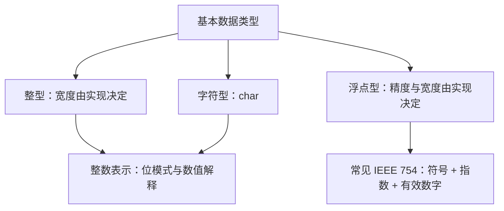
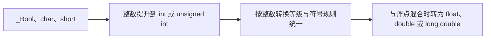
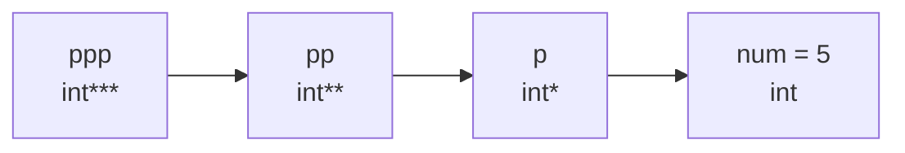

# C 语言系统学习文档

> 本文档包含导读与 12 章学习正文，配套插图随文提供。

这套文档面向正在建立 C 语言完整知识体系的学习者，从程序结构、类型和控制流出发，逐步进入指针、数组、函数、字符串、结构体、文件与组件化开发。每章都包含概念、公式、代码、运行结果、边界条件和易错点。

## 全书目录

| 章节 | 主题 | 核心问题 |
|---|---|---|
| [第 1 章](#chapter-01) | 编程入门、流程结构与经典算法 | 程序怎样编译运行，怎样用顺序、选择和循环解决问题 |
| [第 2 章](#chapter-02) | 数据类型与运算符 | 数据怎样编码、转换和参与表达式计算 |
| [第 3 章](#chapter-03) | 指针基础 | 地址、指向类型、间接访问和字节序是什么 |
| [第 4 章](#chapter-04) | 一维数组 | 怎样存储同类序列并完成查找、排序与模拟 |
| [第 5 章](#chapter-05) | 二维数组与指针 | 多维连续存储、数组指针和矩阵算法怎样联系 |
| [第 6 章](#chapter-06) | 函数、递归与模块化 | 参数、栈帧、递归和多文件接口怎样工作 |
| [第 7 章](#chapter-07) | 函数指针与编译期机制 | 回调、宏、类型别名、链接和内存区域怎样统一 |
| [第 8 章](#chapter-08) | 字符串 | `'\0'` 模型、标准函数与安全输入怎样配合 |
| [第 9 章](#chapter-09) | 结构体、共用体与链表 | 聚合类型、对齐、位域和动态节点怎样设计 |
| [第 10 章](#chapter-10) | 文件操作 | 数据怎样通过文本或二进制形式持久化 |
| [第 11 章](#chapter-11) | 多文件工程、库与组件化开发 | 怎样形成稳定接口、可复用组件和第三方库闭环 |
| [第 12 章](#chapter-12) | 命令行、Visual Studio 与补充练习 | 怎样接收启动参数、完成 IDE 调试闭环并复核独立练习 |

## 建议学习路线

### 第一次学习

按 1～12 章顺序阅读。每个示例先遮住输出手工推导，再运行验证；遇到指针、递归、矩阵或链表时，画出变量、地址和连接关系。

### 算法强化

重点学习第 1、4、5、6 章，按以下顺序练习：

1. 枚举、计数、累加和状态更新。
2. 线性查找、二分查找和排序。
3. 矩阵遍历、旋转、杨辉三角和蛇形方阵。
4. 最大公约数、回文、斐波那契与汉诺塔。
5. 为高风险算法手工制作变量跟踪表。

### 工程强化

重点学习第 6～12 章。先完成单函数测试，再拆分接口与实现；随后练习结构体、动态内存、链表、文件、静态库、动态库和第三方 C 接口。第 12 章补充命令行入口、Visual Studio 项目操作和调试窗口的协同使用。

## 阅读与运行约定

- 重要知识点尽量按“概念与用途 → 语法模板 → 参数/返回值 → 底层模型 → 示例 → 输出与解析 → 易错点/练习”组织；短小知识点会合并相邻步骤，避免机械重复。
- 函数接口说明区分输入、输出、输入/输出、长度、容量、可空性和所有权。没有明确转移所有权时，指针参数默认只是调用期间的借用。
- 第 1～10 章及第 12 章末尾设有“综合题库（含答案与解析）”。短题采用“题目 / 答案 / 解析”表格，代码题给出可运行实现或明确引用本章已有的完整实现。
- 作业原版与批注版的实质重复题只保留一次；不同条件、不同代码和不同小问仍分别保留。
- 题库答案以标准 C 为主。若原题含未定义行为、约束违反、实现定义或平台依赖，文档会先给出标准结论，再说明 x86、x64 或 MSVC 中可能观察到的常见结果。
- 建议第一次阅读时先遮住“答案”和“解析”手算；代码输出题先写变量跟踪表或内存字节图，再编译验证。
- 代码围栏标为 `c` 或 `cpp`。`cpp` 表示示例按 C++ 编译单元组织，但核心知识仍围绕 C 风格接口与内存模型。
- `text` 围栏给出精确输出、示例输入输出、代表性结果、错误诊断或可观察效果。
- 地址、随机数、类型宽度、结构体布局、浮点末位和系统错误文本可能因平台而变化，文中会明确适用条件。
- 未定义行为没有可信的固定输出。相应示例会解释风险，并提供可验证修正版。
- 除特别说明外，数组下标从 `0` 开始，区间优先采用半开形式 \([begin,end)\)。
- 建议使用支持 C11 的编译器，并打开较严格警告；若使用编译器专有安全函数或扩展语法，应同时理解其可移植替代方案。

## 一套有效的练习方法

对每个程序执行四步：

1. 写出输入、期望输出和边界条件。
2. 手工推导关键变量，特别是循环边界、指针位置和容器长度。
3. 编译运行，先处理警告，再比较输出。
4. 主动加入空输入、单元素、最大值、重复值、失败路径等测试。

调试时不要只盯着最终输出。断点、单步、调用栈、局部变量、内存窗口和监视表达式分别回答“执行到哪里”“谁调用了谁”“值怎样变化”“字节怎样排列”。

---

<a id="chapter-01"></a>

# 第 1 章 编程入门、流程结构与经典算法

> 本章目标：认识 C 程序的基本骨架，掌握变量、printf/scanf、顺序、选择与循环三大流程结构，并通过枚举、迭代和模拟等经典算法建立“结构化 + 模板化”的编程思维。

## 第一部分：程序基础、顺序与选择

## 1.1 第一个 C 程序与编程思维

C 语言自带三种编程思维：**模块化**（`#include` 打开功能模块）、**结构化**（先搭结构再补内容）、**面向过程**（针对具体问题一步步求解）。

从源代码到运行结果还要经过预处理、编译、链接和运行。`#include <stdio.h>` 主要让编译器看到标准输入输出函数的声明；`printf` 的实现通常来自运行库，在链接阶段接入最终程序。理解这条流水线后，便能区分“语法写错导致编译失败”和“声明存在但实现没有链接进来导致链接失败”。

`main` 是宿主环境普通可执行程序的入口，推荐写成 `int main(void)`。圆括号中的 `void` 明确表示不接收参数，返回的整数状态交给运行环境；`return 0` 通常表示成功结束。

```c
//基于 编程思维 写代码
#include <stdio.h>   //std标准的 io输入输出 .h头文件（功能清单）

int main()
{
	printf("hello world.\n\n\n")
	//; 是单条代码指令的结束标记
	; //空语句——结构占位

	//代码块——复合语句——多条语句表达一个逻辑
	{
		{
			//哲学三问
			printf("我是谁？\n");
			printf("我从哪里来?\n");
			printf("我到哪里去?\n");
		}
		{
			//保安三问
			printf("你是谁？\n");
			printf("你从哪里来?\n");
			printf("你到哪里去?\n");
		}
	}
	return 0;
}
```

**输出结果**

```text
hello world.


我是谁？
我从哪里来?
我到哪里去?
你是谁？
你从哪里来?
你到哪里去?
```

> 细节：`printf(...)` 与它后面的 `;` 之间即使隔着注释和换行，语句依然合法——分号才是语句的结束标记。

### 三大流程结构的"规格"骨架

任何 C 程序的逻辑都由三种结构拼装而成。下面是一份纯骨架"规格书"（条件都写成 0 只为展示形状）：

```c
#include <stdio.h>

int main()
{
	//顺序结构
	//初始化

	//选择结构
	if (0)
	{
	}
	else
	{
	}
	switch (0)
	{
	case 1:
		break;
	case 2:
		break;
	default:
		break;
	}

	//循环结构
	for (; 0;)
	{
	}
	while (0)
	{
	}
	do
	{
	} while (0);

	return 0;
}
```

**输出结果**

```text
（无输出——所有条件均为 0，仅演示结构骨架）
```

> 练习：从零手敲一遍上述骨架，是训练"速度"的经典功课——给自己计时，直到能在两分钟内默写全部三大结构。

### 顺序结构：语句从上到下依次执行

```c
#include <stdio.h>

int main()
{
	//格物、致知、诚意、正心、修身、齐家、治国、平天下
	printf("格物\n");
	printf("致知\n");
	printf("诚意\n");
	printf("正心\n");
	printf("修身\n");
	printf("齐家\n");
	printf("治国\n");
	printf("平天下\n");

	return 0;
}
```

**输出结果**

```text
格物
致知
诚意
正心
修身
齐家
治国
平天下
```

顺序结构的"汉译英"对照（把中文伪代码翻译成 C 关键字，是理解语法含义的好方法）：

```text
#包含 <标准输入输出头文件>        →  #include <stdio.h>
整型 主函数()                    →  int main()
打印("1、身份证登记\n");          →  printf("1、身份证登记\n");
返回 0;                          →  return 0;
```

```c
#include <stdio.h>

/* 核酸检测流程 */
int main()
{
	printf("1、身份证登记\n");
	printf("2、张嘴啊...\n");
	printf("3、搁楞搁楞嗓子\n");

	return 0;
}
```

**输出结果**

```text
1、身份证登记
2、张嘴啊...
3、搁楞搁楞嗓子
```

---

## 1.2 printf 格式化输出：模板思维

`printf` 的使用套路分三层：**基本外观 → 模板（固定 + 可变）→ 修饰格式**。

格式字符串既是外观模板，也是参数类型契约。每个转换说明都要与对应实参匹配：`%d` 读取 `int`，`%f` 在 `printf` 中读取经过默认提升后的 `double`，`%c` 读取以 `int` 传入的字符值。数量或类型不匹配不只是“显示不好看”，还可能产生未定义行为；编译时打开警告可以尽早发现这类错误。

`printf` 的函数原型可概括为：

```c
int printf(const char *restrict format, ...);
```

| 参数/返回值 | 作用 |
|---|---|
| `format` | 输入参数。以 `\0` 结尾的格式字符串，普通字符原样输出，`%...` 转换说明消费后续实参。 |
| `...` | 输入参数。数量和类型必须逐一匹配转换说明；`float` 会提升为 `double`，`char`、`short` 会发生整数提升。 |
| 返回值 | 成功时返回实际输出的字符数，不含结尾 `\0`；发生输出错误时返回负值。 |

入门阶段先掌握下面几组；第 2 章会给出完整的长度修饰符和 `scanf` 对照表：

| 转换说明 | `printf` 对应实参 | 含义 |
|---|---|---|
| `%d`、`%i` | `int` | 按有符号十进制输出；二者在输出时等价。 |
| `%u` | `unsigned int` | 按无符号十进制输出；不能把负数“正常化”，类型仍须匹配。 |
| `%ld`、`%lld` | `long`、`long long` | 分别输出长整型和长长整型。 |
| `%f` | `double` | 定点形式输出浮点值；传入的 `float` 已提升为 `double`。 |
| `%c` | `int` | 输出一个字符；`char` 实参会先整数提升。 |
| `%s` | `char *` 或 `const char *` | 从给定地址输出字符，直到遇到 `\0`。 |
| `%zu` | `size_t` | 输出 `sizeof`、`strlen` 等返回的无符号大小值。 |
| `%p` | `void *` | 输出对象指针的实现定义表示，实参通常显式转换为 `(void *)`。 |

```c
//模块化
#include <stdio.h>
//结构化
int main()
{
	//面向过程——具体问题的解决
	printf("12345679*9 = %d\n", 12345679 * 9);
	printf("12345679*18 = %d\n", 12345679 * 18);
	printf("12345679*27 = %d\n", 12345679 * 27);
	//打印格式的使用套路
	//1.基本外观
	printf("北京时间8:32\n");
	//2.模板思维=固定+可变数据
	printf("北京时间%d:%i\n", 8, 33);
	//3.修饰数据的格式
	printf("北京时间%02d:%02i\n", 8, 3);
	return 0;
}
```

**输出结果**

```text
12345679*9 = 111111111
12345679*18 = 222222222
12345679*27 = 333333333
北京时间8:32
北京时间8:33
北京时间08:03
```

> `%02d` 表示至少占 2 位、不足补 0；`%i` 与 `%d` 等价。

### 宽度、精度与对齐

常用格式说明的完整形态是 `%[标志][宽度][.精度][长度]转换字符`。宽度指定整个结果至少占多少字符，符号、小数点和数字都计入宽度；`-` 表示在字段内左对齐。对 `%f` 而言，精度表示小数点后的数字个数，**小数点本身不计入精度**。

```c
#include <stdio.h>

int main()
{
	printf("%7d*%-7.1f=%.1f\n", 3, 0.7, 3 * 0.7);
	printf("%7.1f*%-7.1f=%.2f\n", 3.3, 6.7, 3.3 * 6.7);
	return 0;
}
```

**输出结果**

```text
      3*0.7    =2.1
    3.3*6.7    =22.11
```

完整的阶梯练习：

```c
#include <stdio.h>

int main()
{
	//小数点算一位
	printf("%7d*%-7.1f=%.1f\n", 3, 0.7, 3 * 0.7);
	printf("%7.1f*%-7.1f=%.2f\n", 3.3, 6.7, 3.3 * 6.7);
	printf("%7.2f*%-7.1f=%.3f\n", 3.33, 66.7, 3.33 * 66.7);
	printf("%7.3f*%-7.1f=%.4f\n", 3.333, 666.7, 3.333 * 666.7);
	printf("%7.4f*%-7.1f=%.5f\n", 3.3333, 6666.7, 3.3333 * 6666.7);
	printf("%7.5f*%-7.1f=%.6f\n", 3.33333, 66666.7, 3.33333 * 66666.7);

	return 0;
}
```

**输出结果**

```text
      3*0.7    =2.1
    3.3*6.7    =22.11
   3.33*66.7   =222.111
  3.333*666.7  =2222.1111
 3.3333*6666.7 =22222.11111
3.33333*66666.7=222222.111111
```

> 观察规律：左侧 `%7.x f` 右对齐、右侧 `%-7.1f` 左对齐，星号两边的数字恰好排成"漏斗"形——这就是宽度与对齐的直观效果。

1.1 节已经用“格物、致知、诚意、正心、修身、齐家、治国、平天下”演示过纯顺序输出，此处不再重复完整代码。这里的新增知识只有格式字符串及宽度、精度和对齐规则。

---

## 1.3 变量与键盘输入

变量从声明处开始进入作用域，并在相应存储期内存在。对函数内普通局部变量来说，进入代码块时创建，离开代码块时生命周期结束。声明只是得到一个具名对象；若没有初始化，就不能假设它自动为 0。

### 变量：先创建，后使用

变量的本质是**申请一块内存空间**并给它命名。

“先创建、后使用”应进一步理解为“先声明并获得正确类型，再在读取前写入一个确定值”。赋值左边必须是可修改的存储位置，右边先计算出值，再转换成左边变量的类型后保存。

```c
#include <stdio.h>

int main()
{
	//1 创建变量——申请内存空间
	int m = 0;
	//2 赋值（新值覆盖旧值）
	m = 500;
	m = 1000;
	m = 200;
	printf("%d\n", m);
	//增值
	m = m + 1000;      //可行，但有点业余感
	printf("%d\n", m);
	//建议自增的写法：
	m += 500;          //+= 复合赋值，同类还有 -= *= /= %=
	printf("%d\n", m);
	//自增1
	m++;
	++m;

	//{ } 复合语句 也称为 作用域
	int sex = 0;
	{
		char sex = 'm';  //内层作用域可以定义同名变量，互不影响
		(void)sex;       //只演示作用域，显式说明本例不使用该值
	}
	(void)sex;

	return 0;
}
```

**输出结果**

```text
200
1200
1700
```

> 要点：多次赋值时**新值覆盖旧值**；`m++` 与 `++m` 单独成句时效果相同（都使 m 加 1）；内层 `{}` 中的同名变量会屏蔽外层变量。

### scanf：把键盘数据存进变量

`scanf` 需要变量地址，是因为函数必须把转换后的结果写回调用者的对象。格式字符串描述目标数据类型，地址说明写到哪里。实际程序还要检查返回值：成功转换几个项目就返回几；若期望读取一个整数，应判断 `scanf("%d", &value) == 1`，失败时不要继续使用旧值或未初始化值。

`scanf` 需要传入变量的**地址**（`&变量名`）；输入浮点数时必须严格区分：**单精度用 `%f`，双精度用 `%lf`**。

```c
int scanf(const char *restrict format, ...);
```

| 参数/返回值 | 作用 |
|---|---|
| `format` | 输入参数。说明要跳过哪些空白、匹配哪些字符以及怎样转换输入。 |
| `...` | 输出参数。必须传入与转换说明匹配的对象地址，让函数写入结果。 |
| 返回值 | 返回成功赋值的对象个数；若在第一次转换前就遇到输入结束或读取错误，则返回 `EOF`。 |

`scanf` 与 `printf` 的格式不能机械照搬：

| 转换说明 | `scanf` 要求的地址类型 | 关键区别 |
|---|---|---|
| `%d` | `int *` | 读取十进制有符号整数。 |
| `%i` | `int *` | 会根据 `0`、`0x` 等前缀自动识别八/十六进制；这与 `%d` 不同。 |
| `%u` | `unsigned int *` | 读取无符号整数。 |
| `%ld`、`%lld` | `long *`、`long long *` | 长度修饰符必须与目标对象一致。 |
| `%f` | `float *` | 只用于写入 `float`。 |
| `%lf` | `double *` | 只用于写入 `double`；`printf` 的 `%f` 则接收 `double` 值。 |
| `%c` | `char *` | 默认不跳过换行等空白；常用 `" %c"` 先跳过空白。 |
| `%Ns` | `char *` | 最多读 `N` 个非空白字符并补 `\0`；`N` 应至多为数组容量减 1。 |

```c
#include <stdio.h>

int main()
{
	float m = 0.;
	double n = 0.;
	//输入时严格区分：单精度%f  双精度%lf
	scanf("%f", &m);
	scanf("%lf", &n);
	printf("%f %f\n", m, n);

	return 0;
}
```

**运行示例**（输入 `3.14` 和 `2.718`）

```text
3.14
2.718
3.140000 2.718000
```

> `printf` 打印 float 和 double 都用 `%f`（float 会自动提升为 double），但 `scanf` 绝不能混用——这是初学者最常踩的坑之一。

---

## 1.4 顺序结构经典算法

顺序结构题看似只是从上到下执行，真正考查的是把文字步骤翻译成不会丢失信息的赋值顺序。可以先列出“已有量、目标量、中间量”，再写公式；凡是某个旧值稍后还要用，就必须在覆盖前保存。

调试顺序结构时，用一张变量跟踪表最有效：每执行一条赋值语句，就新添一行并更新被修改的变量。交换、拆位、找零和单位换算都能用同一种方法验证。

### 交换两个变量：借助中间变量

交换两杯水需要第三只空杯子，交换两个变量同理：

```c
#include <stdio.h>
/* 算法：交换两个变量的值 */
int main()
{
	int x = 20, y = 30;
	int t;
	printf("原来的值：x=%d, y=%d\n", x, y);
	t = x;
	x = y;
	y = t;
	printf("交换后的值：x=%d, y=%d\n", x, y);

	return 0;
}
```

**输出结果**

```text
原来的值：x=20, y=30
交换后的值：x=30, y=20
```

### 四个变量循环左移

把 `t = a; a = b; b = t;` 的思路扩展到四个变量：`a←b, b←c, c←d, d←原a`。

```c
#include <stdio.h>

int main()
{
	//变量存储：
	int a = 0, b = 0, c = 0, d = 0;
	//键盘输入：
	scanf("%d%d%d%d", &a, &b, &c, &d);
	//算法逻辑：
	int t;
	t = a; a = b; b = c; c = d; d = t;
	//结果打印：
	printf("%d %d %d %d\n", a, b, c, d);
	return 0;
}
```

**运行示例**（输入 `1 2 3 4`）

```text
1 2 3 4
2 3 4 1
```

作业版（同样的逻辑，换一个中间变量名）：

```c
#include <stdio.h>

int main()
{
	int a, b, c, d;
	scanf("%d %d %d %d", &a, &b, &c, &d);
	int num;
	num = a;
	a = b; b = c; c = d; d = num;
	printf("%d %d %d %d\n", a, b, c, d);

	return 0;
}
```

**运行示例**（输入 `10 20 30 40`）

```text
10 20 30 40
20 30 40 10
```

### 温度转换

摄氏温度 $C$ 与华氏温度 $F$ 的换算公式：

$$F = 1.8C + 32 \qquad C = \frac{F - 32}{1.8}$$

课堂版（摄氏 → 华氏）：

```c
#include <stdio.h>

int main()
{
	//变量存储：
	double c = 0.0;   //摄氏温度
	//键盘输入：
	printf("输入摄氏温度：");
	scanf("%lf", &c);
	//算法逻辑：华氏温度
	double f = c * 1.8 + 32;
	//结果打印：
	printf("华氏温度是%.1f\n", f);

	return 0;
}
```

**运行示例**（输入 `37`）

```text
输入摄氏温度：37
华氏温度是98.6
```

作业版（华氏 → 摄氏）：

```c
#include <stdio.h>

int main()
{
	float C, F;
	scanf("%f", &F);
	C = (F - 32.0f) / 1.8f;
	printf("摄氏温度为%.2f\n", C);

	return 0;
}
```

**运行示例**（输入 `100`）

```text
100
摄氏温度为37.78
```

### 圆形面积与球体体积

圆面积 $S = \pi r^2$；球体积 $V = \dfrac{4}{3}\pi r^3$；球表面积 $S = 4\pi r^2$。

```c
#include <stdio.h>
/* 计算圆形的面积
	要求：计算结果显示 2位小数 */
int main()
{
	int r = 7;
	double area;
	area = 3.1415926 * r * r;
	printf("半径为%d的圆形，它的面积为%.2f", r, area);
	return 0;
}
```

**输出结果**

```text
半径为7的圆形，它的面积为153.94
```

球体体积课堂版：

```c
#include <stdio.h>

int main()
{
	//变量存储：
	double r = 0.;    //半径
	//键盘输入：
	printf("输入半径：");
	scanf("%lf", &r);
	//算法逻辑：
	double v;         //体积
	v = 4. / 3 * 3.14 * r * r * r;
	//结果打印：
	printf("体积是：%.2f\n", v);

	return 0;
}
```

**运行示例**（输入 `3`）

```text
输入半径：3
体积是：113.04
```

> 陷阱：`4 / 3` 是整数除法结果为 1，必须写成 `4. / 3`（或 `(float)4/3`）才能得到 $1.333...$。

作业版（同时算体积与表面积）：

```c
#include <stdio.h>

int main()
{
	int r;
	scanf("%d", &r);
	printf("球体的体积是%.2f，表面积是%.2f", (float)4 / 3 * 3.14 * r * r * r, 4 * 3.14 * r * r);

	return 0;
}
```

**运行示例**（输入 `3`）

```text
3
球体的体积是113.04，表面积是113.04
```

> 有趣的巧合：$r=3$ 时 $\frac{4}{3}\pi r^3 = 4\pi r^2$，体积与表面积数值恰好相等。

### 整除与取余：数字拆位的两大利器

对十进制数 $n$：`n / 10^k % 10` 即可取出第 $k$ 位（从 0 计）。这是数字类题目的万能钥匙。

**三位数变六位数**（如 467 → 467467）。因为 $467467 = 467 \times 1001$，而 $1001 = 7 \times 11 \times 13$，所以任何 `nn` 型六位数连除 7、11、13 后一定还原为原三位数：

```c
#include <stdio.h>

int main()
{
	int n = 0;
	printf("请输入一个三位数：");
	scanf("%d", &n);
	//n = n * 1000 + n; 与下面等价
	n *= 1001;
	printf("修改后的n为%d\n", n);
	printf("除7,11,13后的商为%d", n / 7 / 11 / 13);
	return 0;
}
```

**运行示例**（输入 `467`）

```text
请输入一个三位数：467
修改后的n为467467
除7,11,13后的商为467
```

作业版（注意其中隐藏着一个 bug）：

```c
#include <stdio.h>

int main()
{
	//1 定义变量 n 从键盘输入一个三位数
	int n;
	scanf("%d", &n);
	//2 让n变成 nn ：例如n是467 计算后变成467467 并打印
	int m = n * 100 + n;
	//3 这个数连续除以7、11、13，输出最后的商
	printf("%f", (float)m / 7 / 11 / 13);

	return 0;
}
```

**运行示例**（输入 `467`）

```text
467
47.119880
```

> 找 bug：`n * 100 + n` 得到的是 47167（五位数），正确写法应为 `n * 1000 + n`，那样输出将是 `467.000000`。放大倍数一定要与"接上去的位数"匹配。

**四位数拆分再倒序拼接**：

```c
#include <stdio.h>

int main()
{
	//变量存储：
	int n;
	//键盘输入：
	scanf("%d", &n);
	//算法逻辑：
	int q, b, s, g;   //千、百、十、个
	q = n / 1000;
	b = n % 1000 / 100;
	s = n % 100 / 10;
	g = n % 10;
	int m = g * 1000 + s * 100 + b * 10 + q;
	//结果打印：
	printf("%d%d\n", n, m);
	return 0;
}
```

**运行示例**（输入 `3749`）

```text
3749
37499473
```

数字反转作业版（另一种取位组合方式）：

```c
#include <stdio.h>

int main()
{
	int n, m;
	scanf("%d", &n);
	m = n / 1000 * 1 + n % 1000 / 100 * 10 + n % 100 / 10 * 100 + n % 10 * 1000;
	printf("%d%d\n", n, m);

	return 0;
}
```

**运行示例**（输入 `1234`）

```text
1234
12344321
```

### 人民币找零

用"整除取张数、取余留零头"的思路逐级找零：

```c
//打开模块
#include <stdio.h>
//结构化——先结构·再补充内容
int main()
{
	//需要变量
	int money = 368;
	//format_模板思维
	printf("100元需要%d张\n", money / 100); //整除
	money %= 100;
	printf("50元需要%d张\n", money / 50);   //%取余数
	money %= 50;
	printf("20元需要%d张\n", money / 20);

	return 0;
}
```

**输出结果**

```text
100元需要3张
50元需要1张
20元需要0张
```

作业版一路找到 1 元（全部用表达式一次算完）：

```c
#include <stdio.h>

int main()
{
	int a = 368 / 100, b = 368 % 100 / 50, c = 368 % 100 % 50 / 20,
	    d = 368 % 100 % 50 % 20 / 10, e = 368 % 100 % 50 % 20 % 10 / 5,
	    f = 368 % 100 % 50 % 20 % 10 % 5;

	printf("100元人民币%d张，50元元人民币%d张，20元人民币%d张，10元人民币%d张，5元人民币%d张，1元人民币%d张", a, b, c, d, e, f);

	return 0;
}
```

**输出结果**

```text
100元人民币3张，50元元人民币1张，20元人民币0张，10元人民币1张，5元人民币1张，1元人民币3张
```

> 验算：$368 = 3\times100 + 1\times50 + 0\times20 + 1\times10 + 1\times5 + 3\times1$。

---

## 1.5 选择结构（一）：if...else

`if` 先计算括号内的表达式，再把结果解释为真假：结果为 0 表示假，非 0 表示真。`else` 总是与语法上最近、尚未匹配 `else` 的 `if` 配对，因此即使语句只有一行，也建议保留花括号，降低缩进与真实结构不一致的风险。

设计多分支时要检查条件是否互斥、是否覆盖所有输入，以及分支顺序是否会遮住后面的情况。例如区间判断通常先处理最严格或最小范围，并在纸上标出端点是否包含。

**语法伪代码：**

```text
if (条件判断) {
    条件为真时执行的语句;
}

if (条件判断) {
    条件为真时执行的语句;
} else {
    条件为假时执行的语句;
}

if (条件1) {
    分支1;
} else if (条件2) {
    分支2;
} else {
    兜底分支;
}
```

执行到某个成立分支后，后续 `else if` 不再判断。花括号中的内容是一个复合语句；即使当前只有一条语句，也建议保留花括号。

### 二选一

判断奇偶数——`%` 取模运算的最经典应用：

```c
#include <stdio.h>
/* 判断一个 整数 是 奇数还是偶数 */
int main()
{
	int a = 23;
	if (a % 2 == 0)  //知识点：% 为求余数运算又称为取模运算
	{
		printf("%d是偶数\n", a);  //\为转义符号 \n的含义为换行
	}
	else
	{
		printf("%d是奇数\n", a);
	}
	return 0;
}
```

**输出结果**

```text
23是奇数
```

"二选一"的汉译英对照：

```c
#include <stdio.h>

/* 2021年黑龙江
普通本科二批:
文史类为354分,理工类为280分; */
int main()
{
	int score = 290;

	if (score >= 280)          //如果
	{
		printf("能上理工类本科二批\n");
	}
	else                       //否则
	{
		printf("不能上\n");
	}

	return 0;
}
```

**输出结果**

```text
能上理工类本科二批
```

### 多选一：if...else if 阶梯

天平比较（三种可能）：

```c
#include <stdio.h> //预处理

int main()
{
	int left, right;
	scanf("%d%d", &left, &right);
	if (left == right)
	{
		printf("一样重");
	}
	else if (left < right)
	{
		printf("右面重");
	}
	else
	{
		printf("左面重");
	}
	return 0;
}
```

**运行示例**（输入 `3 5`）

```text
3 5
右面重
```

作业版只写了两个分支：

```c
#include <stdio.h>

int main()
{
	int left, right;
	scanf("%d%d", &left, &right);
	if (left > right)
	{
		printf("左面重");
	}
	else
	{
		printf("右面重");
	}
	return 0;
}
```

**运行示例**（输入 `5 3`）

```text
5 3
左面重
```

> 找 bug：两数相等时该程序会输出"右面重"——分支覆盖不完整，三种情况必须写三个分支。

### 恩格尔系数：else if 阶梯的典型应用

恩格尔系数反映居民生活水平：

$$N = \frac{\text{人均食物支出金额}}{\text{人均支出金额}} \times 100\%$$

划分标准：$N \ge 60\%$ 贫穷；$50\%\sim60\%$ 温饱；$40\%\sim50\%$ 小康；$30\%\sim40\%$ 相对富裕；$20\%\sim30\%$ 富裕；$20\%$ 以下极其富裕。

```c
#include <stdio.h>

int main()
{
	float n;
	float x;   //人均食物支出金额
	float y;   //人均支出金额
	x = 400;
	y = 1000;
	n = x / y * 100;
	//--------方法（一）：if else if 阶梯 ------------
	if (n >= 60)
	{
		printf("贫穷\n");
	}
	else if (n >= 50)
	{
		printf("温饱\n");
	}
	else if (n >= 40)
	{
		printf("小康\n");
	}
	else if (n >= 30)
	{
		printf("相对富裕\n");
	}
	else if (n >= 20)
	{
		printf("富裕\n");
	}
	else
	{
		printf("极其富裕\n");
	}

	return 0;
}
```

**输出结果**

```text
小康
```

> 阶梯的妙处：条件从大到小排列后，每个 `else if` 自动隐含"不满足上面所有条件"，无需写 `n >= 40 && n < 50`。

### 逻辑运算符与嵌套 if

**判断三角形**——任意两边之和大于第三边：

$$a+b>c \;\land\; a+c>b \;\land\; b+c>a$$

```c
#include <stdio.h>
/* 判断 任意三个边长能否构成一个三角形 */
int main()
{
	int a, b, c;
	a = 10;
	b = 5;
	c = 8;
	if (a + b > c && a + c > b && b + c > a) //&& 为并且之意，|| 为或者之意
	{
		printf("可以构成三角形");
	}
	else
	{
		printf("不可以构成三角形");
	}
	return 0;
}
```

**输出结果**

```text
可以构成三角形
```

**判断能否结婚**——嵌套 if（外层判性别，内层判年龄）：

```c
#include <stdio.h>
/* 判断一个人能否结婚：
   按法律：男年满22周岁 女年满20周岁 */
int main()
{
	int age = 21;
	int sex = 0;  //在C语言中 非0的数字代表逻辑'真' 0代表逻辑'假'
	              //此例中：1 代表男  0 代表女
	if (sex)
	{
		if (age >= 22)
		{
			printf("男的 能\n");
		}
		else
		{
			printf("男的 不能\n");
		}
	}
	else
	{
		if (age >= 20)
		{
			printf("女的 能\n");
		}
		else
		{
			printf("女的 不能\n");
		}
	}
	return 0;
}
```

**输出结果**

```text
女的 能
```

> `if (sex)` 直接把整数当条件用：非 0 即真，0 即假——这是 C 的重要惯例。

键盘输入版：

```c
#include <stdio.h>
/* 判断一个人能否结婚：
   按法律：男年满22周岁 女年满20周岁 */
int main()
{
	int sex, age;
	scanf("%d %d", &sex, &age);

	if (sex == 1)
	{
		if (age >= 22)
		{
			printf("能结婚");
		}
		else
		{
			printf("不能结婚");
		}
	}
	else
	{
		if (age >= 20)
		{
			printf("能结婚");
		}
		else
		{
			printf("不能结婚");
		}
	}

	return 0;
}
```

**运行示例**（输入 `1 21`）

```text
1 21
不能结婚
```

**判断坐标象限**——嵌套 if 的四分法：

```c
#include <stdio.h>
/* 判断一个坐标值在 第几象限 */
int main()
{
	int x = 10;
	int y = 10;
	if (x == 0 && y == 0)
	{
		printf("原点");
	}
	if (x > 0)
	{
		if (y > 0)
		{
			printf("一象限\n");
		}
		else
		{
			printf("四象限\n");
		}
	}
	else
	{
		if (y > 0)
		{
			printf("二象限\n");
		}
		else
		{
			printf("三象限\n");
		}
	}
	return 0;
}
```

**输出结果**

```text
一象限
```

> 可把该题当作独立练习重写：先判原点/坐标轴，再按 $x>0, y>0$ 的符号组合判四个象限。

---

## 1.6 选择结构（二）：switch...case

`switch` 适合"**等值多选一**"：拿表达式的值去逐个匹配 `case` 标签，`break` 负责跳出，缺少 `break` 会继续向下"穿透"执行。

它与 `else if` 的差别不在于谁“更高级”，而在于判断模型：`switch` 适合把同一个整数或枚举表达式与若干常量标签做相等比较；范围、浮点条件或多个变量组合判断通常仍用 `if`。`default` 负责处理没有任何标签匹配的情况，常用来兜底非法输入。

有意穿透时应让多个 `case` 紧邻共享同一段代码，并加注释说明；无意漏写 `break` 会让已经匹配的分支继续执行后续分支，是最常见的 `switch` 错误。

**语法伪代码：**

```text
switch (整数或枚举表达式) {
case 常量1:
    处理分支1;
    break;
case 常量2:
case 常量3:
    处理共享分支;
    break;
default:
    处理未匹配或非法输入;
    break;
}
```

`case` 后必须是整型常量表达式，不能直接写范围判断；`break` 结束整个 `switch`，而不是只结束一行。

### 马斯洛需求层次

```c
#include <stdio.h>

int main()
{
	int num;
	scanf("%d", &num);

	switch (num)
	{
	case 1:
		printf("自我实现");
		break;
	case 2:
		printf("尊重需求");
		break;
	case 3:
		printf("社会需求");
		break;
	case 4:
		printf("安全需求");
		break;
	case 5:
		printf("生理需求");
		break;
	}

	return 0;
}
```

**运行示例**（输入 `2`）

```text
2
尊重需求
```

作业版与上例结构完全相同，只替换了部分输出文案，因此合并为同一个示例。练习时可自行更换 `case` 对应的文字，但应保留非法输入的 `default` 分支。

### case 穿透的正向用法：多个标签共享一段代码

成绩等级判断（大小写共用一个分支）：

```c
#include <stdio.h>

/* 打印不同等级对应的评价 */
int main()
{
	char grade = 'A';
	switch (grade)          //分支
	{
	case 'A':               //当
	case 'a':
		printf("卓越");
		break;              //打断流程
	case 'B':
	case 'b':
		printf("优秀");
		break;
	case 'C':
	case 'c':
		printf("良好");
		break;
	case 'D':
	case 'd':
		printf("及格");
		break;
	default:                //默认情况
		printf("惨不忍睹");
		break;
	}

	return 0;
}
```

**输出结果**

```text
卓越
```

### 判断某年某月天数：switch 与 if 的合作

闰年判断公式：**年份能被 4 整除但不能被 100 整除，或者能被 400 整除**：

$$(year \bmod 4 = 0 \land year \bmod 100 \ne 0) \lor (year \bmod 400 = 0)$$

```c
#include <stdio.h>
/* 判断某年某月有几天 */
int main()
{
	int year = 2008;
	int month = 2;
	switch (month)
	{
	case 1:
	case 3:
	case 5:
	case 7:
	case 8:
	case 10:
	case 12:
		printf("31天\n");
		break;
	case 2:
		if ((year % 4 == 0 && year % 100 != 0)
			|| year % 400 == 0)
		{
			printf("29天\n");
		}
		else
		{
			printf("28天\n");
		}
		break;
	case 4:
	case 6:
	case 9:
	case 11:
		printf("30天\n");
		break;
	default:
		printf("月份非法\n");
		break;
	}
	return 0;
}
```

**输出结果**

```text
29天
```

> 2008 能被 4 整除且不能被 100 整除，是闰年，2 月 29 天。此题同样附有练习骨架，建议先默写"大月穿透列表"，再补 2 月的闰年判断。

### 恩格尔系数的 switch 解法

把百分数**整除 10** 映射到 0~10 的档位，一行 `switch(n/10)` 替代整串 else if：

```c
#include <stdio.h>

int main()
{
	int n;      //注意此处的n为整型
	float x;    //人均食物支出金额
	float y;    //人均支出金额
	x = 400;
	y = 1000;
	n = (int)(x / y * 100.0f + 0.5f);  //此处比例非负，先加 0.5 再显式转为 int
	//--------方法（二）：switch 分档 ------------
	switch (n / 10)
	{
	case 0:
	case 1:
		printf("极其富裕\n");
		break;
	case 2:
		printf("富裕\n");
		break;
	case 3:
		printf("相对富裕\n");
		break;
	case 4:
		printf("小康\n");
		break;
	case 5:
		printf("温饱\n");
		break;
	default:
		printf("贫穷\n");
		break;
	}

	return 0;
}
```

**输出结果**

```text
小康
```

> 两个技巧：① 对本题这种非负值，`x + 0.5` 后再转成整型可实现取最近整数；负数或通用舍入应使用 `<math.h>` 的舍入函数；② `n / 10` 把 40~49 全部映射到 4，一个 case 覆盖一整段区间。

---

## 1.7 第一部分小结与易错点

遇到结果不符合预期时，按“输入是否成功—表达式类型是否正确—实际进入哪个分支—格式符是否匹配”的顺序检查，比反复盯着最后一行输出更容易定位原因。

| 易错点 | 正确姿势 |
|---|---|
| `scanf` 忘写 `&` | 必须传变量地址：`scanf("%d", &n);` |
| `scanf` 读 double 用了 `%f` | double 必须用 `%lf`，float 用 `%f` |
| `4 / 3` 想要 1.333 | 整数相除只保留整数，写 `4. / 3` |
| 浮点转整型想取最近整数 | 非负教学值可先 `+ 0.5` 再转换；通用情况使用合适的 `<math.h>` 舍入函数 |
| `if (x = 1)` | `=` 是赋值、`==` 才是比较；`if(x=1)` 恒为真 |
| switch 忘写 `break` | 会一路穿透执行后续 case（除非有意为之） |
| 分支覆盖不完整 | 三种情况写三个分支，别让"相等"漏进 else |
| 判断闰年条件写错 | `y%4==0 && y%100!=0 \|\| y%400==0` |

**核心公式回顾**

- 温度转换：$F = 1.8C + 32$
- 圆面积：$S = \pi r^2$；球体积：$V = \frac{4}{3}\pi r^3$；球表面积：$S = 4\pi r^2$
- 恩格尔系数：$N = \frac{x}{y} \times 100\%$
- 取第 $k$ 位数字：$\left\lfloor n / 10^k \right\rfloor \bmod 10$
- 闰年：$(y \bmod 4 = 0 \land y \bmod 100 \neq 0) \lor y \bmod 400 = 0$

---

## 1.8 第一部分综合题库（含答案与解析）

本节合并了作业原版与批注版中的重复题。题目中的全角引号和明显笔误已规范化，答案按标准 C 口径给出。

### 1.8.1 程序、语句与变量

| 题目 | 答案 | 解析 |
|---|---|---|
| `main` 函数有什么作用？编写时应注意什么？ | 它是宿主环境 C 程序的入口；一个最终程序只能有一个被链接的 `main` 定义。常用形式为 `int main(void)` 或 `int main(int argc, char *argv[])`。 | 程序从运行环境调用 `main` 开始；多个定义会在链接期产生重复符号，缺少入口则无法按普通可执行程序方式链接。 |
| 为什么要包含头文件？ | 为了让编译器在调用函数或使用类型前看到其声明，例如 `<stdio.h>` 声明 `printf`、`scanf`。 | 头文件不是把库函数源码复制进来；函数实现通常在库中，链接阶段再解析。 |
| C 语句可怎样概括？空语句怎样写？ | 可分为简单语句和复合语句；空语句是单独的 `;`。 | `{ ... }` 把若干声明和语句组成复合语句，也形成一个块作用域。 |
| 用什么符号把多条语句组织为一个逻辑块？ | 花括号 `{}`。 | `if`、循环、函数体都可用块明确边界；即使只有一条语句，也建议保留花括号。 |
| 创建变量的一般格式是什么？ | `类型 变量名 = 初值;`，例如 `int money = 368;`。 | 声明告诉编译器类型和名字；带存储定义的声明会为对象提供存储。 |
| 变量应按什么顺序使用？重名怎样处理？ | 先声明/定义，后使用；同一作用域不能重复定义同名对象。 | 内层块可遮蔽外层同名变量，但会降低可读性，不宜滥用。 |
| `+ - * / % ()` 分别表示什么？ | 加、减、乘、除、取余和改变求值分组。 | 整数除法会截断小数；`%` 的两个操作数必须是整数类型。 |
| 标识符可以由什么组成？ | 字母、数字和下划线；不能以数字开头，也不能使用关键字。 | C 区分大小写；实现保留的名字和以下划线开头的名字还受额外限制。 |
| 常见命名风格有哪些？ | `snake_case`、`camelCase`、`PascalCase` 等；一个项目内保持一致。 | “匈牙利命名法”可以使用，但不应让前缀代替准确类型和接口设计。 |
| `printf`、`scanf` 来自哪个头文件？ | `<stdio.h>`。 | 没有正确声明便调用可变参数函数会产生严重类型风险。 |
| 怎样向 `double value` 输入数据？ | `scanf("%lf", &value);`。 | `scanf` 中 `%f` 对应 `float *`，`%lf` 对应 `double *`；地址参数不能漏写 `&`。 |
| 赋值运算符 `=` 的结合方向是什么？ | 从右向左。 | `a = b = 3;` 先令 `b` 为 3，再把赋值表达式的值 3 赋给 `a`。 |
| `x += y` 的含义是什么？ | 近似于 `x = x + y`，但左操作数只求值一次。 | 这不允许在同一完整表达式中无序地多次修改 `x`；复杂副作用应拆成多条语句。 |
| C 中怎样表示逻辑真和假？ | 比较和逻辑运算结果为 `1` 或 `0`；作为条件时，非零为真、零为假。 | 不要假定所有“真值”对象本身都等于 1，只有比较/逻辑运算符的结果保证为 0 或 1。 |
| `=` 与 `==` 有什么区别？ | `=` 是赋值，`==` 是相等比较。 | `if (x = 1)` 会先赋值再把 1 当作真，通常是笔误；可开启编译器警告发现此类问题。 |
| `&&` 与 `||` 表示什么？ | 逻辑与、逻辑或。 | 二者都从左向右求值并短路：结果确定后不会求值右侧。 |

### 1.8.2 顺序与选择结构编程题

**题 1：用循环打印下列乘法序列，并计算后两项。**

```text
3×0.7
3.3×6.7
3.33×66.7
3.333×666.7
3.3333×6666.7
3.33333×66666.7
```

**答案：**

```c
#include <stdio.h>

int main(void)
{
    double left = 3.0;
    double right = 0.7;
    double add_left = 0.3;
    double add_right = 6.0;

    for (int digits = 1; digits <= 6; ++digits) {
        printf("%.*f * %.1f = %.10g\n",
               digits - 1, left, right, left * right);
        left += add_left;
        right += add_right;
        add_left /= 10.0;
        add_right *= 10.0;
    }
    return 0;
}
```

更直接的学习方式是先用计算器观察规律，再分别用整数累计出小数点两侧的数字。浮点数不能精确表示多数十进制小数，因此输出时应限定精度，不把末位误差当成算法规律。

**题 2：368 元从大面值到小面值最少需要多少张人民币？**

**答案：**完整实现见 1.4“人民币找零”。按 `100, 50, 20, 10, 5, 1` 依次整除并取余，结果为 `3, 1, 0, 1, 1, 3`，共 9 张。

**解析：**每次优先使用不超过剩余金额的最大面值；对中国常用整数面值，该贪心过程得到最少张数。

**题 3：键盘输入华氏温度，输出摄氏温度。**

**答案：**

```c
#include <stdio.h>

int main(void)
{
    double fahrenheit;
    if (scanf("%lf", &fahrenheit) != 1) return 1;
    printf("%.2f\n", (fahrenheit - 32.0) / 1.8);
    return 0;
}
```

**解析：**题目方向是华氏转摄氏，应使用 $C=(F-32)/1.8$；批注版把输入、输出方向写反了。

**题 4：输入四个不同整数 `a,b,c,d`，让值循环左移。**

**答案：**

```c
int temp = a;
a = b;
b = c;
c = d;
d = temp;
```

**解析：**必须先保存即将被覆盖的 `a`。例如输入 `1 2 3 4` 后结果为 `2 3 4 1`。

**题 5：输入半径，计算球体积和球表面积。**

**答案：**完整实现见 1.4“圆形面积与球体体积”。公式为
$V=\frac{4}{3}\pi r^3$、$S=4\pi r^2$。

**解析：**代码中必须写 `4.0 / 3.0`，否则 `4 / 3` 先做整数除法，只得到 1。

**题 6：输入四位整数 `n`，把逆序数存入 `m`，再连续打印 `n` 和 `m`。**

**答案：**

```c
#include <stdio.h>

int main(void)
{
    int n, copy, m = 0;
    if (scanf("%d", &n) != 1 || n < 1000 || n > 9999) return 1;
    copy = n;
    for (int i = 0; i < 4; ++i) {
        m = m * 10 + copy % 10;
        copy /= 10;
    }
    printf("%d%d\n", n, m);
    return 0;
}
```

**解析：**`% 10` 取末位，`/ 10` 删除末位。若末位为零，逆序值作为整数不会保留前导零；需要固定四位显示时使用 `%04d`。

**题 7：把任意三位数重复一次形成六位数，再依次除以 7、11、13。**

**答案：**完整实现与推导见 1.4“三位数变六位数”。六位数等于 `n * 1001`，而
`1001 = 7 * 11 * 13`，最后一定还原为 `n`。

**题 8：打印儒家《大学》的“三纲、八目、七证”。**

**答案：**

```c
#include <stdio.h>

int main(void)
{
    puts("三纲：明明德、亲民、止于至善");
    puts("八目：格物、致知、诚意、正心、修身、齐家、治国、平天下");
    puts("七证：知、止、定、静、安、虑、得");
    return 0;
}
```

**解析：**本题考查把固定文本拆成清晰的输出语句；无需为不变化的数据设计复杂分支。

**题 9：输入天平左右重量，输出较重一侧或“相等”。**

**答案：**

```c
if (left > right)
    puts("左侧较重");
else if (left < right)
    puts("右侧较重");
else
    puts("两侧相等");
```

**解析：**两个数有“大于、小于、等于”三种互斥情况，不能只写二选一而漏掉相等。

**题 10：输入 1～5，打印马斯洛需求层次。**

**答案：**完整 `switch` 实现见 1.6“马斯洛需求层次”。每个 `case` 后使用 `break`，非法输入进入 `default`。

**解析：**离散、有限且以整数标签表示的多选一问题适合 `switch`；范围判断仍应使用 `if...else if`。

---

## 第二部分：循环与经典算法

## 1.9 三种循环形态

三种循环在表达能力上可以相互改写，选择它们主要是为了让控制意图清楚。`for` 把初始化、继续条件和步进集中在一行；`while` 突出“条件成立就继续”；`do...while` 把第一次执行放在第一次判断之前。无论采用哪一种，状态更新都必须能推动条件逐步趋向结束。

`break` 直接结束当前最内层循环；`continue` 跳过本轮剩余语句并进入下一轮。嵌套循环中它们不会自动作用于所有层，使用前要明确究竟控制的是哪一层。

**三种循环的语法伪代码：**

```text
for (初始化; 继续条件; 状态更新) {
    循环体;
}

while (继续条件) {
    循环体;
    推进状态;
}

do {
    至少执行一次的循环体;
    推进状态;
} while (继续条件);
```

| 部分 | 作用 | 常见错误 |
|---|---|---|
| 初始化 | 建立循环开始前的状态，只在进入 `for` 时执行一次 | 起点多 1 或少 1 |
| 继续条件 | 每轮开始前决定是否执行；`do...while` 在轮末判断 | 把“继续条件”和“结束条件”写反 |
| 状态更新 | 让循环逐步接近结束 | 忘记更新导致死循环 |
| 循环体 | 处理当前状态对应的数据 | 先更新还是先处理的顺序写错 |

`for` 遇到 `continue` 后仍会执行“状态更新”；`while` 和 `do...while` 遇到 `continue` 会直接去判断条件，因此写在循环体末尾的手工更新可能被跳过。

### for：知道起点和终点

"隔离 14+7 天"——起止分明，首选 `for`：

```c
#include <stdio.h>

/* 中高风险密接的人——隔离期 */
int main()
{
	int day;
	for (day = 1; day <= 14 + 7; day++)   //对于
	{
		printf("隔离第%d天\n", day);       //打印
	}

	return 0;
}
```

**输出结果**（21 行，节选首尾）

```text
隔离第1天
隔离第2天
隔离第3天
...
隔离第20天
隔离第21天
```

最经典的 for 应用——1 加到 100：

$$\sum_{i=1}^{100} i = \frac{100 \times 101}{2} = 5050$$

```c
#include <stdio.h>

int main()
{
	int sum = 0;
	for (int i = 1; i <= 100; i++)
	{
		sum += i;
	}
	printf("%d", sum);

	return 0;
}
```

**输出结果**

```text
5050
```

> 同样的求和逻辑在"图形转代码"练习中再次出现（流程图 → 代码），输出同为 `5050`——一图一码，互为印证。

### while：每当满足条件就做

"每当生活费还够花，就再花 50"：

```c
#include <stdio.h>

/* 勤俭是一种美德 */
int main()
{
	int money = 1000;   //生活费
	int cost = 50;      //最低消费
	while (money > cost)    //每当
	{
		money = money - cost;
		printf("还剩%d元钱\n", money);
	}
	return 0;
}
```

**输出结果**（19 行，节选）

```text
还剩950元钱
还剩900元钱
还剩850元钱
...
还剩100元钱
还剩50元钱
```

> 最后一轮：money=100>50 成立，扣成 50 后打印"还剩50元钱"；再判断 50>50 不成立，循环结束。共打印 19 行。

电梯楼层——while 配合 `if` 跳过不存在的 0 层：

```c
#include <stdio.h>

int main()
{
	int floor = 25;
	while (floor > -3)
	{
		if (floor != 0)
		{
			printf("%d\n", floor);
		}
		floor--;
	}

	return 0;
}
```

**输出结果**（27 行，节选）

```text
25
24
...
2
1
-1
-2
```

作业版改为键盘输入起始楼层（条件是 `>= -3`，会多打印到 -3 层）：

```c
#include <stdio.h>

int main()
{
	int floor;
	scanf("%d", &floor);
	while (floor >= -3)
	{
		if (floor != 0)
		{
			printf("%d\n", floor);
		}
		floor--;
	}

	return 0;
}
```

**运行示例**（输入 `5`）

```text
5
5
4
3
2
1
-1
-2
-3
```

### do...while：先做一次再说

统计一个整数的位数——哪怕是 0 也至少有 1 位，所以"先除一次再判断"天然适合 `do...while`：

```c
#include <stdio.h>

int main()
{
	int num = 15631, sum = 0;
	do                       //先做
	{
		num /= 10;
		sum++;
	} while (num != 0);      //每当
	printf("%d", sum);

	return 0;
}
```

**输出结果**

```text
5
```

作业版（键盘输入 + while 写法对照）：

```c
#include <stdio.h>

int main()
{
	int num, sum = 0;
	scanf("%d", &num);
	while (num > 0)
	{
		num /= 10;
		sum++;
	}
	printf("%d", sum);

	return 0;
}
```

**运行示例**（输入 `98765`）

```text
98765
5
```

"上班族的一个月"——do...while 的汉译英对照：

```c
#include <stdio.h>

/* 模拟上班族的一个月 */
int main()
{
	int workday = 25;   //工作日

	do                  //先做
	{
		workday -= 1;
		printf("距离发工资还有%d天\n", workday);
	} while (workday >= 1);   //每当

	return 0;
}
```

**输出结果**（25 行，节选）

```text
距离发工资还有24天
距离发工资还有23天
...
距离发工资还有1天
距离发工资还有0天
```

---

## 1.10 计数与筛选

“计数”和“筛选”都需要遍历候选范围，但输出目标不同：筛选关注哪些值满足条件，计数关注满足条件的值共有多少个。程序可以在同一个 `if` 中同时打印候选并递增计数器；计数器必须在循环前初始化，并且只在真正命中条件时更新。

### 找 1000 以内 21 的倍数

```c
#include <stdio.h>
/* 找出1000以内21的倍数的数字有哪些。 */
int main()
{
	int i;
	for (i = 0; i <= 1000; i++)
	{
		if (i % 21 == 0)
		{
			printf("%d,", i);
		}
	}
	return 0;
}
```

**输出结果**

```text
0,21,42,63,84,105,126,147,168,189,210,231,252,273,294,315,336,357,378,399,420,441,462,483,504,525,546,567,588,609,630,651,672,693,714,735,756,777,798,819,840,861,882,903,924,945,966,987,
```

练习骨架给出了另一种更高效的思路——直接从 21 出发，每次加 21：

```c
#include <stdio.h>

int main()
{
	for (int num = 21; num <= 1000; num++)
	{
		//练习：改为 num += 21 直接步进，省去每次取模判断
	}

	return 0;
}
```

**输出结果**

```text
（骨架无输出；补全 num += 21 并打印后可得 21,42,...,987）
```

这份源文件中还夹带了一道运算符思考题，值得单独品味：

```c
#include <stdio.h>

int main()
{
	int a = 6, b = 10;
	printf("%d ", (!a++) > 0 && ++b >= 10);
	printf("%d %d", a, b);
	return 0;
}
```

**输出结果**

```text
0 7 10
```

> 推导：`!a++` 中 `a++` 先取值 6，`!6` 为 0，随后 a 变 7；`0 > 0` 为假，`&&` **短路**——右侧 `++b` 根本不执行，b 保持 10。这正是第 2 章将系统讲解的"短路求值"。

### 打印 5 组"2 4 6 7 8"

外层管组数，内层走偶数，遇 6 补打 7：

```c
#include <stdio.h>
/* 打印5组：24678 */
int main()
{
	int zu, shu;
	for (zu = 1; zu <= 5; zu++)
	{
		for (shu = 2; shu <= 8; shu += 2)
		{
			printf("%i ", shu);
			if (shu == 6)
			{
				printf("%i ", shu + 1);
			}
			if (shu == 8)
			{
				printf("\n");
			}
		}
	}
	return 0;
}
```

**输出结果**

```text
2 4 6 7 8 
2 4 6 7 8 
2 4 6 7 8 
2 4 6 7 8 
2 4 6 7 8 
```

> 该题的练习骨架（空 main）留待独立完成：试试用 `shu += 2` 之外的其他步进方案实现同样输出。

---

## 1.11 嵌套循环打印图形

嵌套循环的口诀：**外层控制行，内层控制列；列的范围往往依赖当前行号**。

更具体地说，先为屏幕上的每个位置建立坐标 `(row, column)`，再回答“这一行一共有几列”和“当前位置应打印什么”。打印完一行后通常只换一次行。若图形左右对齐，还可以把一行拆成前导空格、主体字符和尾部内容三个区段分别循环。

### 九九乘法表

```c
#include <stdio.h>

int main()
{
	int h, k;
	for (h = 1; h < 10; h++)
	{
		for (k = 1; k <= h; k++)
		{
			printf("%d×%d=%-2d\t", k, h, h * k);
			//%-2d的含义：整数占两个位置，不足用空格占位。-号为左对齐之意。
		}
		printf("\n");
	}
	return 0;
}
```

**输出结果**

```text
1×1=1 
1×2=2 	2×2=4 
1×3=3 	2×3=6 	3×3=9 
1×4=4 	2×4=8 	3×4=12	4×4=16
1×5=5 	2×5=10	3×5=15	4×5=20	5×5=25
1×6=6 	2×6=12	3×6=18	4×6=24	5×6=30	6×6=36
1×7=7 	2×7=14	3×7=21	4×7=28	5×7=35	6×7=42	7×7=49
1×8=8 	2×8=16	3×8=24	4×8=32	5×8=40	6×8=48	7×8=56	8×8=64
1×9=9 	2×9=18	3×9=27	4×9=36	5×9=45	6×9=54	7×9=63	8×9=72	9×9=81
```

> 内层 `k <= h` 使每行只打印到对角线——这是"下三角"图形的通用写法。练习骨架（空 main）建议先画表再写码。

### 数字矩阵

每行从行号 h 开始连打 5 个数：第 h 行是 $h, h+1, \dots, h+4$。

```c
#include <stdio.h>
/*
打印如下格式的数字
1       2       3       4       5
2       3       4       5       6
3       4       5       6       7
4       5       6       7       8
*/
int main()
{
	int h, s;
	for (h = 1; h <= 4; h = h + 1)
	{
		for (s = h; s <= h + 4; s = s + 1)
		{
			printf("%i\t", s);
		}
		printf("\n");
	}
	return 0;
}
```

**输出结果**

```text
1	2	3	4	5
2	3	4	5	6
3	4	5	6	7
4	5	6	7	8
```

> 内层循环变量的**初值随行号变化**（`s = h`）是本题的点睛之笔。对应练习骨架可独立补全。

### 金字塔图形

第 h 行 = $(5-h)$ 个空格 + $(2h-1)$ 个星号：

```c
#include <stdio.h>
/*
打印如下图形
    *
   ***
  *****
 *******
*********
*/
int main()
{
	int h, k, o;
	for (h = 1; h <= 5; h = h + 1)
	{
		//打印空格
		for (k = 1; k <= 5 - h; k++)
		{
			printf(" ");
		}
		//打印*
		for (o = 1; o <= 2 * h - 1; o++)
		{
			printf("*");
		}
		//换行
		printf("\n");
	}
	return 0;
}
```

**输出结果**

```text
    *
   ***
  *****
 *******
*********
```

> 规律推导：第 $h$ 行星号数 $2h-1$ 构成奇数列，空格数 $5-h$ 递减——图形题先找"行号 → 数量"的函数关系，再翻译成内层循环。练习骨架同理可补全。

---

## 1.12 累积与迭代

累积算法把许多输入合并成一个结果，例如总和、乘积、最大值；迭代算法则把上一状态转换成下一状态。二者都需要定义循环不变量，例如“第 `i` 轮结束后，`sum` 等于前 `i` 项之和”。不变量既解释程序为何正确，也是选择初值和循环边界的依据。

更新多个相互依赖的状态时，要先判断旧值是否还会被后续计算使用。斐波那契数列需要临时变量，就是因为若先覆盖前一项，计算后一项时会丢失原状态。

### 累加何时超过 100

```c
#include <stdio.h>
/* 1+2+3.., 何时超过100 */
int main()
{
	int sum = 0;
	int a = 1;

	do
	{
		sum = sum + a;
		a += 1;
	} while (sum < 100);

	printf("第%d个数累加和是%d刚好超过100\n ", a, sum);
	return 0;
}
```

**输出结果**

```text
第15个数累加和是105刚好超过100
```

> 逐步验证：$\frac{13\times14}{2}=91<100$，$\frac{14\times15}{2}=105\ge100$——加到 **14** 时越线。但程序打印的是 15，因为循环体内 `a += 1` 在累加**之后**又执行了一次，退出时 a 已多走一步。这类"循环变量出口值偏移 1"是高频考点，读 do...while 一定要模拟最后一轮。

### 每天提高百分之一

复利思想：$1.01^{100} \approx 2.70$，而 $0.99^{100} \approx 0.37$。

$$1.01^{365} \gg 1 \gg 0.99^{365}$$

```c
#include <stdio.h>
/*
	激励性问题：
	每天提高百分之一，百日后你的能力提高多少倍。
	反之，每天降低百分之一，百日后你的能力降低多少倍。
*/
int main()
{
	double power = 1.0;
	int day;
	for (day = 1; day <= 100; day++)
	{
		power *= 1.01;
	}
	printf("每天提高百分之一，百日后你的能力提高%.2f倍\n", power);

	power = 1.0;
	for (day = 1; day <= 100; day++)
	{
		power *= 0.99;
	}
	printf("每天提高百分之一，百日后你的能力降低%.2f倍\n", power);
	return 0;
}
```

**输出结果**

```text
每天提高百分之一，百日后你的能力提高2.70倍
每天提高百分之一，百日后你的能力降低0.37倍
```

### 逼近法求平方根

不用 `sqrt`，从 0 开始以 0.0001 为步长逼近，直到 $j^2 \ge a$：

```c
#include <stdio.h>
/* 计算一个整数的平方根——史上最笨方法 */
int main()
{
	int a = 2;
	double j = 0.0;
	while (j * j < a)
	{
		j += 0.0001;
	}
	printf("%d的平方根是%.3f\n", a, j);
	return 0;
}
```

**输出结果**

```text
2的平方根是1.414
```

> $\sqrt{2} \approx 1.41421$，步进到 1.4143 时 $j^2$ 首次达到 2，按 `%.3f` 四舍五入显示 1.414。"笨方法"体现了循环的暴力美学，也为后面学习二分法埋下伏笔。

### 舍罕王的打赏：指数爆炸

第 $g$ 个格子放 $2^{g-1}$ 个麦子，64 格总数：

$$\sum_{g=1}^{64} 2^{g-1} = 2^{64} - 1 = 18446744073709551615$$

```c
#include <stdio.h>
/*
《舍罕王的打赏》
在国际象棋的64个格子里摆麦子
第1个格子放1个，第2个放2个，第3个放4个，第4个放8个...
编程：总共需要多少个麦子才能摆满64个格子
*/
int main()
{
	unsigned long long m = 1, n = 0;
	int g;
	for (g = 1; g <= 64; g++)
	{
		printf("第%d个格子放%llu个麦子\n", g, m);
		n += m;
		m *= 2;
	}
	printf("总共需要%llu个麦子\n", n);
	return 0;
}
```

**输出结果**（66 行，节选）

```text
第1个格子放1个麦子
第2个格子放2个麦子
第3个格子放4个麦子
...
第63个格子放4611686018427387904个麦子
第64个格子放9223372036854775808个麦子
总共需要18446744073709551615个麦子
```

> 必须用 `unsigned long long`（64 位无符号，打印格式 `%llu`）：$2^{63}$ 已超出有符号 long long 的最大值 $2^{63}-1$。类型选择由数据规模决定。

### 斐波那契数列：迭代递推

$$F_1 = F_2 = 1, \qquad F_n = F_{n-1} + F_{n-2}$$

相邻两项之比无限接近黄金分割 $\varphi = \frac{1+\sqrt{5}}{2} \approx 1.618$。

```c
#include <stdio.h>
/*
斐波那契数列又称生兔子问题：
有一对兔子，从出生后第3个月起每个月都生一对兔子，小兔子长到第三个月
后每个月又生一对兔子，假如兔子都不死，问每个月的兔子总数为多少？
兔子的规律为数列1,1,2,3,5,8,13,21....
编程打印前50项
*/
int main()
{
	double n1, n2, nn;
	int i;
	n1 = n2 = 1;
	printf("%.f,%.f,", n1, n2);
	for (i = 3; i <= 50; i++)
	{
		nn = n1 + n2;
		printf("%.f,", nn);
		n1 = n2;
		n2 = nn;
	}
	return 0;
}
```

**输出结果**（50 项，节选）

```text
1,1,2,3,5,8,13,21,34,55,89,144,233,377,610,987,1597,2584,4181,6765,...,7778742049,12586269025,
```

> 迭代的核心是"滚动更新"：`n1 = n2; n2 = nn;` 把窗口向前挪一格。第 50 项 $F_{50}=12586269025$ 已超 int 范围，故用 double 存储、`%.f` 取整打印。扩展：打印 `n2/n1` 会看到它逼近 1.618。

---

## 1.13 枚举与模拟：经典名题

枚举先确定有限候选空间，再逐个验证约束；模拟则让程序中的状态变化与题目叙述的时间顺序一一对应。写代码前应先明确状态变量、一次事件如何更新状态、成功或结束条件，以及检查条件应放在更新前还是更新后。

许多“白天上升、晚上下降”问题的关键是最后一天到达目标后不会再发生夜间回落。因此必须在白天更新后立即检查是否成功，不能机械地把一整天的所有动作都执行完。

### 青蛙跳井（模拟）

井深 10 米，白天向上爬、晚上下滑，用状态变量 `bw` 区分昼夜逐步模拟：

```c
#include <stdio.h>
/*
有一只青蛙掉入一口深 10 米的井中。每天白天这只青蛙跳上 4 米晚上又滑下 3 米,
问：这只青蛙经过多少天可以从井中跳出?
*/
int main()
{
	int gao = 0;   //青蛙的高度
	int bw = 1;    //白天:1  晚上:0
	int ts = 0;    //总天数
	do
	{
		//白爬
		if (bw)
		{
			gao = gao + 4;
			bw = 0;
			ts++;
		}
		else //晚滑
		{
			gao = gao - 3;
			bw = 1;
		}
		//打印高度
		printf("爬的高度：%d\n", gao);
	} while (gao < 10);  //每当 高度不到10米
	printf("总共用的天数是：%d天\n", ts);

	return 0;
}
```

**输出结果**

```text
爬的高度：4
爬的高度：1
爬的高度：5
爬的高度：2
爬的高度：6
爬的高度：3
爬的高度：7
爬的高度：4
爬的高度：8
爬的高度：5
爬的高度：9
爬的高度：6
爬的高度：10
总共用的天数是：7天
```

> 变量跟踪：完整的一天净升 1 米，第 7 天白天从 6 米跳到 10 米出井。到达井口后不会再执行夜间下滑，因此必须在白天更新后立即判断是否结束。

### 父亲年龄何时是儿子的二倍（模拟）

36 − 13 = 23 岁的年龄差恒定，设 $k$ 年后 $36+k = 2(13+k)$，解得 $k = 10$（父 46、子 23）。

```c
#include <stdio.h>
/* 父亲 36 岁、儿子 13 岁，几年后父亲年龄是儿子的二倍？ */
int main(void)
{
	int dad = 36;
	int son = 13;
	int year = 0;

	while (dad != son * 2) {
		dad++;
		son++;
		year++;
	}
	printf("%d年后 爸爸%d岁 儿子%d岁 爸爸年龄是儿子年龄的2倍\n",
		year, dad, son);
	return 0;
}
```

**输出结果**

```text
10年后 爸爸46岁 儿子23岁 爸爸年龄是儿子年龄的2倍
```

原练习把 `year` 从 1 开始，导致最终打印 11。这里让 `year` 表示“已经过去的完整年数”，初值必须是 0；每次父子年龄同时增加后再把它加 1。变量含义与初值一致，能够直接避免差一错误。

### 鸡兔同笼（枚举 vs 解方程）

$$\begin{cases} x + y = 35 \\ 2x + 4y = 94 \end{cases} \Rightarrow x = 23,\; y = 12$$

```c
#include <stdio.h>
/* 鸡兔同笼： 鸡兔共35个头94只脚，问：鸡兔各有多少只？ */
int main()
{
	//-------方法（一）：枚举-------//
	int x, y;
	for (x = 1; x <= 35; x++)
	{
		for (y = 1; y <= 35 - x; y++)
		{
			if (x + y == 35 && 2 * x + 4 * y == 94)
			{
				printf("鸡有%i只  兔子有%i只\n", x, y);
			}
		}
	}
	//------方法（二）：直接解方程------//
	x = 2 * 35 - 94 / 2;
	y = 94 / 2 - 35;
	printf("鸡有%i只  兔子有%i只\n", x, y);

	return 0;
}
```

**输出结果**

```text
鸡有23只  兔子有12只
鸡有23只  兔子有12只
```

> 枚举是"计算机思维"（不聪明但不会错），解方程是"数学思维"（快但要先推导）。两者答案互相印证。练习骨架可先用单层循环 `y = 35 - x` 优化枚举。

### 乒乓球比赛名单（约束枚举）

```c
#include <stdio.h>
/*
两个乒乓球队进行比赛，各出三人。甲队为a,b,c三人，乙队为x,y,z三人。
已抽签决定比赛名单。有人向队员打听比赛的名单。
a说他不和x比，c说他不和x,z比，请编程序找出三队赛手的名单。
*/
int main()
{
	char a;  //a 的对手
	char b;  //b 的对手
	char c;  //c 的对手
	for (a = 'x'; a <= 'z'; a++)
	{
		for (b = 'x'; b <= 'z'; b++)
		{
			for (c = 'x'; c <= 'z'; c++)
			{
				if (a != b && a != c && b != c && a != 'x' && c != 'x' && c != 'z')
				{
					printf("a pk %c\n", a);
					printf("b pk %c\n", b);
					printf("c pk %c\n", c);
				}
			}
		}
	}

	return 0;
}
```

**输出结果**

```text
a pk z
b pk x
c pk y
```

> 三重循环枚举全部 $3^3=27$ 种配对，用约束条件（互不相同 + 题目线索）过滤，仅剩一组解。字符变量也能参与循环和比较——因为字符本质是整数（ASCII 码）。

### 水仙花数（练习题 + 参考解答）

**题目**：打印所有"水仙花数"——三位数中，各位数字立方和等于其本身的数，如 $153 = 1^3 + 5^3 + 3^3$。

先看练习骨架：

```c
#include <stdio.h>

int main()
{
	//练习：枚举100~999，拆出百、十、个位，判断立方和
	return 0;
}
```

运行结果：程序只包含注释并直接返回，因此没有输出；完整实现如下。

参考解答（补充内容）：

```c
#include <stdio.h>

int main()
{
	for (int n = 100; n <= 999; n++)
	{
		int b = n / 100, s = n / 10 % 10, g = n % 10;
		if (b * b * b + s * s * s + g * g * g == n)
		{
			printf("%d ", n);
		}
	}
	return 0;
}
```

**输出结果**

```text
153 370 371 407 
```

### 打印 n 以内素数（练习题 + 参考解答）

练习要求：给定正整数 `n`，打印 `2` 到 `n` 之间的所有素数。只声明 `int n;` 而不读入或初始化就参与判断，会读取不确定值；下面直接给出一份可运行的参考实现。

参考解答（补充内容）——试除到 $\sqrt{i}$ 即可：

```c
#include <stdio.h>
#include <math.h>

int main()
{
	int n = 50;
	for (int i = 2; i <= n; i++)
	{
		int isPrime = 1;
		for (int j = 2; j <= sqrt(i); j++)
		{
			if (i % j == 0)
			{
				isPrime = 0;
				break;
			}
		}
		if (isPrime)
		{
			printf("%d ", i);
		}
	}
	return 0;
}
```

**输出结果**

```text
2 3 5 7 11 13 17 19 23 29 31 37 41 43 47 
```

### 猴子吃桃（逆向迭代，练习题 + 参考解答）

**题目**：猴子第一天摘桃若干，每天吃掉一半再多吃一个；第 10 天早上只剩 1 个。问第一天共摘多少。

正向关系 $n_{k+1} = \frac{n_k}{2} - 1$，逆向反推：

$$n_k = (n_{k+1} + 1) \times 2$$

先看练习骨架：

```c
#include <stdio.h>
/* 猴子吃桃问题：到第10天早上只剩一个桃子，求第一天共摘多少（n=n/2-1 的逆推） */
int main()
{
	return 0;
}
```

运行结果：程序直接返回，因此没有输出；完整实现如下。

参考解答（补充内容）：

```c
#include <stdio.h>

int main()
{
	int n = 1;                    //第10天剩1个
	for (int day = 9; day >= 1; day--)
	{
		n = (n + 1) * 2;          //逆推前一天的数量
	}
	printf("第一天共摘了%d个桃子\n", n);
	return 0;
}
```

**输出结果**

```text
第一天共摘了1534个桃子
```

> 逆推跟踪表：1 → 4 → 10 → 22 → 46 → 94 → 190 → 382 → 766 → **1534**（共回退 9 天）。

### 五人分鱼（枚举验证，练习题 + 参考解答）

**题目**：A、B、C、D、E 五人夜里合伙捕鱼后各自睡觉。A 先醒，把鱼分五份多一条，扔掉多的一条拿走一份；B、C、D、E 依次醒来照同样办法分。问最少共捕多少条鱼。

每轮要求 $(n-1) \bmod 5 = 0$，之后剩 $\frac{4(n-1)}{5}$。先看练习骨架：

```c
#include <stdio.h>

int main()
{
	/* A、B、C、D、E五个人合伙捕鱼……问他们合伙至少捕了多少条鱼？ */
	return 0;
}
```

运行结果：程序直接返回，因此没有输出；完整实现如下。

参考解答（补充内容）——从小到大枚举总数，模拟五轮分鱼：

```c
#include <stdio.h>

int main()
{
	for (int total = 6; ; total++)
	{
		int n = total, ok = 1;
		for (int p = 1; p <= 5; p++)
		{
			if ((n - 1) % 5 != 0)
			{
				ok = 0;
				break;
			}
			n = (n - 1) / 5 * 4;   //扔1条，拿走1份，剩4份
		}
		if (ok)
		{
			printf("他们至少捕了%d条鱼\n", total);
			break;
		}
	}
	return 0;
}
```

**输出结果**

```text
他们至少捕了3121条鱼
```

> 验证 3121：A 分后剩 2496，B 分后剩 1996，C 分后剩 1596，D 分后剩 1276，E 分后剩 1020——每轮都恰好"五份多一条"。

---

## 1.14 综合案例：人机猜数游戏

随机数 + do...while + 拆位比较的综合应用。`srand((unsigned)time(NULL))` 用当前时间做随机种子，`rand()%9000+1000` 生成 1000~9999 的四位数。

这里的“随机”适合课堂游戏，不适用于密码或安全令牌。`rand() % 9000` 还可能产生轻微的取模偏差；本例关注循环、输入验证和数字拆位，所以接受这种简单生成方式。测试时可暂时改用固定种子，让每次运行得到相同答案，便于复现错误。

```c
#include <stdio.h>
#include <stdlib.h>
#include <time.h>
/*
人机猜数游戏
由计算机"想"一个四位数，请人猜这个四位数是多少。人输入四位数字后，
计算机判断哪几位猜对了：对的位置显示该数字，错的位置显示*，
直到人猜出计算机所想的四位数为止。
*/
int main()
{
	int num;

	srand((unsigned)time(NULL));   //随机数初始化
	num = rand() % 9000 + 1000;    //产生随机的四位数

	int a, b, c, d;
	a = num / 1000;
	b = num / 100 % 10;
	c = num / 10 % 10;
	d = num % 10;

	int guess;
	do
	{
		printf("请输入一个数:");
		scanf("%d", &guess);

		if (!(guess < 10000 && guess >= 1000))
		{
			continue;   //不是四位数，重新输入
		}

		printf("%c", a == guess / 1000 ? a + '0' : '*');
		printf("%c", b == guess / 100 % 10 ? b + '0' : '*');
		printf("%c", c == guess / 10 % 10 ? c + '0' : '*');
		printf("%c\n", d == guess % 10 ? d + '0' : '*');

	} while (guess != num);

	return 0;
}
```

**运行示例**（每次运行答案随机，本例假设计算机想的数是 3749）

```text
请输入一个数:1234
**3*
请输入一个数:3745
374*
请输入一个数:3749
3749
```

> 三个亮点：① `continue` 跳过本轮剩余代码直接进入下一轮判断，专治非法输入；② 三目运算符 `?:` 让"对显数字、错显星号"一行搞定；③ `a + '0'` 把数字 3 变成字符 `'3'`——数字与字符的换算将在下一章展开。

---

## 1.15 第二部分小结与易错点

循环验收至少要测试：一次都不执行、恰好执行一次、正常执行多次和刚好到达边界四类情况。对嵌套循环，再分别检查第一行、最后一行、第一列和最后一列。

| 场景 | 选哪种循环 |
|---|---|
| 已知循环次数 / 起止范围 | `for` |
| 只知道继续条件，可能一次都不做 | `while` |
| 至少要先做一次再判断 | `do...while` |

| 易错点 | 提醒 |
|---|---|
| 差一错误（off-by-one） | 出口处循环变量往往比"直觉值"多 1，务必模拟最后一轮 |
| `for(;;)` / `while(1)` 死循环 | 必须有 `break` 或其它出口 |
| 嵌套循环内外层变量混用 | 外层行、内层列，各用各的计数器 |
| 大数溢出 | $2^{63}$ 级别用 `unsigned long long` + `%llu` |
| `continue` 与 `break` 混淆 | `continue` 跳过本轮，`break` 终结整个循环 |
| 随机数忘记播种 | 不写 `srand(time(NULL))` 每次运行序列相同 |

**核心公式回顾**

- 等差求和：$\sum_{i=1}^{n} i = \frac{n(n+1)}{2}$
- 等比求和：$\sum_{g=1}^{64} 2^{g-1} = 2^{64}-1$
- 斐波那契：$F_n = F_{n-1} + F_{n-2}$，$\lim_{n\to\infty} \frac{F_{n+1}}{F_n} = \frac{1+\sqrt{5}}{2}$
- 复利：$(1+r)^n$；猴子吃桃逆推：$n_k = 2(n_{k+1}+1)$
- 金字塔：第 $h$ 行 $= (H-h)$ 空格 $+ (2h-1)$ 星号

---

## 1.16 第二部分综合题库（含答案与解析）

### 1.16.1 循环结构基础

| 题目 | 答案 | 解析 |
|---|---|---|
| C 程序可以用哪三种基本流程结构组织？ | 顺序、选择、循环。 | 结构化程序可由这三类控制结构组合；函数再把组合后的逻辑封装起来。 |
| 二选一逻辑常用哪些关键字？ | `if`、`else`。 | 多选一还可使用 `else if` 链或 `switch/case/default`。 |
| 三种常用循环写法是什么？ | `for`、`while`、`do...while`。 | 它们都能表达重复，但入口判断时机和适用场景不同。 |
| `while` 与 `do...while` 的核心区别是什么？ | `while` 先判断，可能一次不执行；`do...while` 先执行再判断，至少执行一次。 | 两者的继续条件都在每轮之间检查；`do...while` 末尾不能漏掉分号。 |
| `for (初始化; 条件; 更新)` 三部分各做什么？ | 初始化建立起点；条件决定是否进入本轮；更新推进循环状态。 | 三部分都可以省略，但两个分号不能省略。 |
| `for` 的执行顺序是什么？ | 初始化一次；随后反复执行“条件 → 循环体 → 更新”；条件为假时结束。 | `continue` 会跳到更新部分，然后再判断条件；`break` 直接结束循环。 |

### 1.16.2 流程图编程题

**题 1：从 25 楼下到 3 楼，打印经历的楼层，不存在第 0 层。**

**答案：**

```c
#include <stdio.h>

int main(void)
{
    for (int floor = 25; floor >= 3; --floor) {
        printf("%d%c", floor, floor == 3 ? '\n' : ' ');
    }
    return 0;
}
```

**解析：**循环变量表示“当前楼层”，每轮减 1；终点是 3，所以条件为 `floor >= 3`。若题目要求跨过地面层，还应明确如何表示地下楼层并跳过 0。

**题 2：计算一个整数有几位。**

**答案：**

```c
#include <stdio.h>

int main(void)
{
    long long value;
    if (scanf("%lld", &value) != 1) return 1;

    unsigned long long magnitude =
        value < 0 ? 0ULL - (unsigned long long)value : (unsigned long long)value;
    int digits = 0;
    do {
        ++digits;
        magnitude /= 10;
    } while (magnitude != 0);

    printf("%d\n", digits);
    return 0;
}
```

**解析：**使用 `do...while` 可让输入 0 时也计为 1 位。先转为无符号绝对量，避免直接对最小负数取相反数时溢出。

**题 3：用循环求 1～100 的和。**

**答案：**循环累加得到 `5050`；也可用公式
$100\times101/2=5050$。

```c
int sum = 0;
for (int i = 1; i <= 100; ++i) sum += i;
printf("%d\n", sum);
```

**解析：**不变量是：每轮结束后，`sum` 等于从 1 到当前 `i` 的和。

### 1.16.3 阶段笔试：循环跟踪

**题 4：执行下列循环后，`x`、`y` 是多少？**

```c
for (y = 1, x = 1; y <= 50; y++) {
    if (x >= 10) break;
    if (x % 2 == 1) {
        x += 5;
        continue;
    }
    x -= 3;
}
```

**答案：**`x = 10`，`y = 6`。

**解析：**

| 进入本轮时的 `y` | 进入本轮时的 `x` | 动作 | 本轮后的 `x` |
|---:|---:|---|---:|
| 1 | 1 | 奇数，`+5` | 6 |
| 2 | 6 | 偶数，`-3` | 3 |
| 3 | 3 | 奇数，`+5` | 8 |
| 4 | 8 | 偶数，`-3` | 5 |
| 5 | 5 | 奇数，`+5` | 10 |
| 6 | 10 | `break` | 10 |

在第 6 轮执行 `break`，因此本轮末尾的 `y++` 不再执行。

**题 5：执行下列循环后，`i`、`a` 是多少？**

```c
int i = 4, a = 0;
for (; i > 0; i--) {
    if (i == 2) continue;
    a++;
}
```

**答案：**`i = 0`，`a = 3`。

**解析：**`i` 依次为 4、3、2、1；`i==2` 时跳过 `a++`，但仍会执行 `for` 的更新表达式 `i--`。

**题 6：下列程序打印什么？**

```c
int count = 0;
int x = 8421;
while (x) {
    ++count;
    x = x & (x - 1);
}
printf("%d\n", count);
```

**答案：**打印 `6`。

**解析：**`x & (x - 1)` 每次清除最低位的一个 1；8421 的二进制中共有 6 个 1，因此循环执行 6 次。

---

<a id="chapter-02"></a>

# 第 2 章 数据类型与运算符

> 本章目标：建立"存储思维"——弄清每种数据类型在内存中占几个字节、以什么形式存放（原码/反码/补码、IEEE 浮点格式），再系统掌握 C 的各类运算符（算术、赋值、关系、逻辑、三目、位运算、逗号）及其优先级与结合性。

## 2.1 计算机存储的基本概念

计算机是**二进制计算机**：内部只有 0 和 1。

- **位（bit）**：最小信息单位，一个 0 或 1
- **字节（Byte，B）**：最小存储单位，$8\ \text{bit} = 1\ \text{Byte}$
- 换算链（以 $2^{10} = 1024$ 为进位）：

$$1024\,\text{B} = 1\,\text{KB},\quad 1024\,\text{KB} = 1\,\text{MB},\quad 1024\,\text{MB} = 1\,\text{GB},\quad 1024\,\text{GB} = 1\,\text{TB},\quad 1024\,\text{TB} = 1\,\text{PB}$$

严格地说，C 以“字节”作为 `sizeof` 的计量单位，一个字节含 `CHAR_BIT` 位，标准保证不少于 8 位；现代通用平台几乎都是 8 位字节。二进制前缀 KiB、MiB、GiB 分别按 1024 进位，十进制前缀 kB、MB、GB 按 1000 进位；课程资料常把 KB 写成 1024 B，阅读规格书时则应确认采用哪套单位。

### 进制转换

**十进制 → 二/八/十六进制**：整数部分**除基取余、倒序排列**，小数部分**乘基取整**。

以 185 为例：

| 目标进制 | 过程 | 结果 |
|---|---|---|
| 二进制 | 185÷2 余 1,0,0,1,1,1,0,1（倒序读） | 10111001 |
| 八进制 | 185÷8 余 1,7,2（倒序读） | 271 |
| 十六进制 | 185÷16 余 9, 商 11(B)（倒序读） | B9 |

各进制可用数字：十进制 0~9；八进制 0~7；十六进制 0~9 与 aA bB cC dD eE fF。

**二进制与八/十六进制的快速互转**：

- 1 个八进制位 对应 3 个二进制位（如 7 ↔ 111）
- 1 个十六进制位 对应 4 个二进制位（如 F ↔ 1111）
- **2 个十六进制位恰好表示 1 个字节**（8 个二进制位），所以调试器的内存窗口都用十六进制展示内存内容

---

## 2.2 基本数据类型总览

基本数据类型分三类，存储方式分两派：

类型宽度由实现决定，不能仅凭名字断言 `int` 永远 4 字节或 `long` 永远 8 字节。可移植程序使用 `sizeof`、`limits.h`、`stdint.h` 和 `float.h` 查询能力，再根据问题选择类型。字符类型属于整数类型，只是额外承担存放字符编码单元的用途。



下面给出 Windows 上 MSVC 常见的 LLP64 数据模型。x86 与 x64 的指针宽度不同，但这里列出的基本整数宽度通常相同；其它系统可能不同：

| # | 类型关键字 | 类型名称 | 字节数 | 数据范围 | 字面值后缀 | 打印格式 |
|---|---|---|---|---|---|---|
| 1 | signed char | 有符号字符型 | 1 | -128~127 | — | %hhd（数值）/%c（字符） |
| 2 | unsigned char | 无符号字符型 | 1 | 0~255 | — | %hhu |
| 3 | signed short int | 有符号短整型 | 2 | -32768~32767 | — | %hd |
| 4 | unsigned short int | 无符号短整型 | 2 | 0~65535 | — | %hu |
| 5 | signed int | 有符号整型 | 4 | -2147483648~2147483647 | — | %d 或 %i |
| 6 | unsigned int | 无符号整型 | 4 | 0~4294967295 | U 或 u | %u |
| 7 | signed long int | 有符号长整型 | 4 | -2147483648~2147483647 | L 或 l | %ld |
| 8 | unsigned long int | 无符号长整型 | 4 | 0~4294967295 | UL 或 ul | %lu |
| 9 | signed long long int | 有符号长长整型 | 8 | -9223372036854775808~9223372036854775807 | LL 或 ll | %lld |
| 10 | unsigned long long int | 无符号长长整型 | 8 | 0~18446744073709551615 | ULL 或 ull | %llu |
| 11 | float | 单精度浮点型 | 4 | 约 1.175e-38~3.403e38（正正规值） | F 或 f | %f 或 %e |
| 12 | double | 双精度浮点型 | 8 | 约 2.225e-308~1.798e308（正正规值） | — | %f 或 %e |
| 13 | long double | 长双精度类型 | 8 | MSVC 中通常同 `double` | L 或 l | %Lf 或 %Le |

> `signed` 可省略；上表只是代表值。浮点表中的下界是最小正正规值，不是“最负数”，0 与次正规值另计。标准只规定最低能力和类型关系，例如很多 64 位 Unix 实现的 `long` 为 8 字节，GCC 的 `long double` 也可能比 `double` 更宽。应使用 `sizeof`、`limits.h`、`stdint.h` 和 `float.h` 查询当前实现。

### `printf` 与 `scanf`：相似外观，不同参数契约

格式说明由“`%` + 标志 + 宽度 + 精度 + 长度修饰符 + 转换字符”组成。长度修饰符不是可以随意添加的装饰，它决定可变参数中应出现什么类型，或 `scanf` 应写入什么类型的对象。

#### `printf` 输出格式

| 格式 | 必须匹配的实参 | 作用 |
|---|---|---|
| `%d`、`%i` | `int` | 有符号十进制；输出时二者等价。 |
| `%u`、`%o`、`%x`、`%X` | `unsigned int` | 无符号十、八、十六进制。 |
| `%hhd`、`%hhu` | 经整数提升后的整数 | 取提升后值并按 `signed char`/`unsigned char` 转换后输出；不是从可变参数区“只读 1 字节”。 |
| `%hd`、`%hu` | 经整数提升后的整数 | 按 `short`/`unsigned short` 转换后输出。 |
| `%ld`、`%lu` | `long`、`unsigned long` | 长整型。 |
| `%lld`、`%llu` | `long long`、`unsigned long long` | 长长整型。 |
| `%zu` | `size_t` | `sizeof`、`strlen` 等返回的大小。 |
| `%td` | `ptrdiff_t` | 两个同数组指针相减得到的元素距离。 |
| `%jd`、`%ju` | `intmax_t`、`uintmax_t` | 最大宽度标准整数类型。 |
| `%f`、`%e`、`%g` | `double` | `float` 实参会默认提升为 `double`。 |
| `%Lf`、`%Le`、`%Lg` | `long double` | `L` 必须大写。 |
| `%c` | `int` | 输出一个字符，原 `char` 已整数提升。 |
| `%s` | `char *` 或 `const char *` | 输出到 `\0`；指针必须有效。 |
| `%p` | `void *` | 输出对象指针的实现定义表示。 |

`printf` 的常用标志有：`-` 左对齐、`+` 强制显示正负号、空格为正数预留符号位、`#` 显示进制前缀或保留小数点、`0` 在允许时补零。宽度是最小总字符数；对 `%f`，精度是小数点后的位数。例如 `%8.2f` 的整个结果至少 8 字符，小数部分 2 位。

#### `scanf` 输入格式

| 格式 | 必须匹配的目标地址 | 作用 |
|---|---|---|
| `%d` | `int *` | 十进制有符号整数。 |
| `%i` | `int *` | 按前缀识别十、八、十六进制。 |
| `%u`、`%o`、`%x` | `unsigned int *` | 无符号整数。 |
| `%hhd`、`%hhu` | `signed char *`、`unsigned char *` | 直接写入字符宽度的整数对象；与 `printf` 的默认提升不同。 |
| `%hd`、`%hu` | `short *`、`unsigned short *` | 写入短整型。 |
| `%ld`、`%lld` | `long *`、`long long *` | 写入对应长度的有符号整数。 |
| `%zu` | `size_t *` | 写入 `size_t`。 |
| `%f`、`%lf`、`%Lf` | `float *`、`double *`、`long double *` | 三种浮点目标必须严格区分。 |
| `%c` | `char *` | 默认读取包括空白在内的一个字符；`" %c"` 会先跳过空白。 |
| `%Ns` | `char *` | 最多读取 `N` 个非空白字符并补 `\0`，因此数组容量至少为 `N+1`。 |
| `%p` | `void **` | 读取实现定义的指针文本表示到一个 `void *` 对象。 |

`scanf` 的 `*` 表示赋值抑制，例如 `%*d` 读取并丢弃一个整数；返回值不计被抑制的项目。任何输入都应检查返回值，且 `%s`、`%[` 应设置宽度防止越界。

---

## 2.3 整型：字节数、字面值与打印格式

### sizeof 长度运算符

`sizeof(表达式)` 计算内存字节数——注意它是**运算符**而不是函数，属于第 2 级优先级的单目运算符。

多数情况下，`sizeof` 的操作数不会被真正求值，所以 `sizeof(i++)` 通常不会让 `i` 增加；涉及变长数组类型时存在例外。`sizeof` 的结果类型是 `size_t`，用 `printf` 输出时应使用 `%zu`，而不是假定它与 `int` 同宽。

```c
#include <stdio.h>

int main(void)
{
	signed int iValue = 9;
	unsigned int uiValue = 9u;      //u 类型后缀
	printf("signed int 字节数：%zu %zu %zu\n", sizeof(int), sizeof(iValue), sizeof(9));
	printf("unsigned int 字节数：%zu %zu %zu\n", sizeof(unsigned), sizeof(uiValue), sizeof(9u));

	signed long int lValue = 9l;
	unsigned long int ulValue = 95ul;
	printf("signed long int 字节数：%zu %zu %zu\n", sizeof(long), sizeof(lValue), sizeof(9L));
	printf("unsigned long int 字节数：%zu %zu %zu\n", sizeof(unsigned long), sizeof(ulValue), sizeof(95UL));

	signed long long int llValue = 95ll;
	unsigned long long int ullValue = 95ull;
	printf("signed long long int字节数：%zu %zu %zu\n", sizeof(long long), sizeof(llValue), sizeof(9LL));
	printf("unsigned long long int字节数：%zu %zu %zu\n", sizeof(unsigned long long), sizeof(ullValue), sizeof(95ULL));

	signed short int sValue = 9;    //小于 int 的字面值按 int 处理
	unsigned short int usValue = 9u;
	printf("signed short int 字节数：%zu %zu %zu\n", sizeof(short), sizeof(sValue), sizeof(9));
	printf("unsigned short int 字节数：%zu %zu\n", sizeof(unsigned short), sizeof(usValue));

	signed char cValue = 'A';
	unsigned char ucValue = 48u;
	printf("signed char 字节数：%zu %zu %zu\n", sizeof(char), sizeof(cValue), sizeof('A'));
	printf("unsigned char 字节数：%zu %zu\n", sizeof(unsigned char), sizeof(ucValue));

	return 0;
}
```

**输出结果**

```text
signed int 字节数：4 4 4
unsigned int 字节数：4 4 4
signed long int 字节数：4 4 4
unsigned long int 字节数：4 4 4
signed long long int字节数：8 8 8
unsigned long long int字节数：8 8 8
signed short int 字节数：2 2 4
unsigned short int 字节数：2 2
signed char 字节数：1 1 4
unsigned char 字节数：1 1
```

> 两处"意外"值得深究：`sizeof(9)` 在 short 行仍是 4——**整型字面值最小按 int 处理**；`sizeof('A')` 也是 4——**C 语言中字符常量的类型是 int**（C++ 中才是 char）。

### 整型字面值：进制前缀 + 数值 + 类型后缀

```c
#include <stdio.h>

int main()
{
	int decimal = 1234; //十进制：无前缀
	int octal = 012;    //0 开头：八进制
	int hex = 0x12;     //0x 或 0X：十六进制
	#if defined(__STDC_VERSION__) && __STDC_VERSION__ >= 202311L
	int binary = 0b10;  //0b 或 0B：C23 标准
	#else
	int binary = 2;     //可移植 C11 写法；部分 C11 编译器也把 0b10 当扩展
	#endif
	(void)decimal; (void)octal; (void)hex; (void)binary;

	int age = 19;   //计算机内部都是二进制
	//打印的呈现方式
	printf("%d %o %x\n", age, age, age);
	printf("%d %#o %#x\n", age, age, age);    //#：为八/十六进制添加前缀

	return 0;
}
```

**输出结果**

```text
19 23 13
19 023 0x13
```

> $19 = (23)_8 = (13)_{16}$。`#` 标志让八进制带上 `0` 前缀、十六进制带上 `0x` 前缀；对 `%d` 无效果。

---

## 2.4 整型存储原理：原码、反码、补码

本节位图按“32 位、二进制补码”模型推导，这是现代平台的主流表示，也是 C23 对标准有符号整数表示的要求。阅读较早标准或特殊实现时，负数对象表示可能不同；程序不应通过有符号溢出来依赖某个比特结果。

补码解决的是负整数怎样编码以及硬件怎样复用加法电路，并不意味着源代码可以随意越界。只要有符号运算的数学结果超出类型范围，在 C11 等标准口径下就属于未定义行为；优化器可以假定这种情况不会发生。


### 三个码的定义

以 `int a = 5, b = -5;`（5 的二进制为 101）为例：

- **原码**：符号位（第 1 位，0 正 1 负）加上真值的绝对值

```text
+5 原码：00000000 00000000 00000000 00000101
-5 原码：10000000 00000000 00000000 00000101
```

- **反码**：正数的反码是其本身；负数的反码在原码基础上**符号位不变、其余各位取反**

```text
-5 反码：11111111 11111111 11111111 11111010
```

- **补码**：正数的补码就是其本身；负数的补码在**反码的基础上 +1**——补码才是**最终被存储**的形式

```text
-5 补码：11111111 11111111 11111111 11111011
```

三码对比（-5）：

| 码 | 32 位形式 |
|---|---|
| 原码 | `10000000 00000000 00000000 00000101` |
| 反码 | `11111111 11111111 11111111 11111010` |
| 补码 | `11111111 11111111 11111111 11111011` |

### `-1` 的全 1 补码与无符号最大值

`int b = -1;` 的补码推导：原码 `1000...0001` → 反码 `1111...1110` → 补码 `1111...1111`（全 1）。

在调试器内存窗口中看到的正是 `ff ff ff ff`——**-1 的补码是全 1**，这一特性后面会被反复利用（比如用 `-1` 赋给无符号类型得到该类型的最大值）。

### 用补码统一理解加减法

补码使加法与减法能够由同一套模算术规则统一解释。实际处理器可以有专门的减法指令和硬件电路；这里用 8 位补码模型计算 `16 + (-5)`：

```text
  16 补码： 0001 0000
  -5 补码： 1111 1011
 ─────────────────────
 和：    1 0000 1011   →  最高位进位溢出丢弃 → 0000 1011 = 11 ✓
```

再算 `-16 + (-5)`：

```text
 -16 补码： 1111 0000
  -5 补码： 1111 1011
 ─────────────────────
 和：    1 1110 1011   →  丢弃进位 → 1110 1011（补码）
```

`1110 1011` 符号位为 1，是负数补码，转十进制的步骤：**①翻译符号位（负）②按位取反 ③转十进制 ④再 +1** → $-(0001\,0100_2 + 1) = -21$ ✓

对应验证代码：

```c
#include <stdio.h>

int main(void)
{
	signed char aa = -16;
	signed char bb = -5;
	signed char cc = (signed char)((int)aa + (int)bb);
	printf("%d %u\n", (int)cc, (unsigned)(int)cc);
	printf("%hhd %hhu\n", cc, (unsigned char)cc);
	return 0;
}
```

**输出结果**

```text
-21 4294967275
-21 235
```

> 解读：这里明确使用 `signed char`；在 8 位字节的常见实现中，cc 在内存中是 1 字节 `1110 1011`（0xEB）。相加结果 -21 位于 `signed char` 的表示范围内，显式转换不会改变数值。
> - 第一行显式把 `cc` 转换为 `int` 或 `unsigned int`，因此分别得到 -21 和当前 32 位 `unsigned int` 下的 4294967275；
> - 调用 `printf` 时，`char` 仍会先发生整数提升。`hh` 告诉转换函数把该值再按 `signed char` 或 `unsigned char` 取值，所以得到 -21 和 235；它不表示从可变参数列表中只读取 1 字节。
> **长度修饰符规定转换规则和参数契约**，不能简单理解为“打印函数读取几字节”。

### `char` 运算与整数提升

```c
#include <stdio.h>

int main(void)
{
	signed char num1 = -5, num2 = -7;
	signed char sum = (signed char)((int)num1 + (int)num2);
	printf("%d %u\n", (int)sum, (unsigned)(int)sum);
	//负数补码转十进制（1.翻译符号位 2.取反 3.转10进制 4.+1）
	printf("%hhd %hhu\n", sum, (unsigned char)sum);
	return 0;
}
```

**输出结果**

```text
-12 4294967284
-12 244
```

> sum = -12，1 字节补码为 `1111 0100`（0xF4 = 244）；按 4 字节无符号解读为 $2^{32}-12 = 4294967284$。

---

## 2.5 溢出现象与数据范围

判断运算是否安全要看**完成整数提升和通常算术转换后的实际运算类型**，而不只看最终赋值变量。例如两个 `int` 先相乘，再赋给 `long long`，乘法仍可能已经在 `int` 中溢出；应先把至少一个操作数转换为 `long long`。

无符号回绕是明确的模运算，适合哈希、环形计数等确实需要模语义的场景，但不能用来掩盖输入范围检查。若业务逻辑不允许回绕，就应在运算前比较边界。

### 无符号回绕与有符号溢出

若无符号类型有 \(N\) 个值位，其运算按模 \(2^N\) 进行，所以最大值加 1 会确定地回到 0。**有符号整数溢出属于未定义行为**，不能把某台补码机器上观察到的“从最大值回到最小值”当作 C 语言保证。

### 查询各整型的数据范围

把 `-1` 转换为无符号类型会按模运算得到该类型最大值，这是标准规定的。把超出范围的无符号值再用有符号格式解释，或转换为对应有符号类型，结果可能是未定义行为或实现定义结果。安全版本直接使用 `limits.h`：

```c
#include <limits.h>
#include <stdio.h>

int main(void)
{
	unsigned char a = (unsigned char)-1;
	unsigned short b = (unsigned short)-1;
	unsigned long long c = (unsigned long long)-1;

	printf("%u %d %d\n", (unsigned)a, SCHAR_MAX, SCHAR_MIN);
	printf("%u %d %d\n", (unsigned)b, SHRT_MAX, SHRT_MIN);
	printf("%llu %lld %lld\n", c, LLONG_MAX, LLONG_MIN);

	return 0;
}
```

**输出结果**

```text
255 127 -128
65535 32767 -32768
18446744073709551615 9223372036854775807 -9223372036854775808
```

> 在 8、16、64 位宽且采用常见范围的一种实现上，三行分别显示无符号最大值、有符号最大值和有符号最小值。`(unsigned char)-1` 的结果为 `UCHAR_MAX`；负数的具体对象表示应以当前标准版本和实现为准。

配套作业——四种宽度一网打尽：

```c
#include <limits.h>
#include <stdio.h>

int main(void)
{
	printf("%d %d\n", SCHAR_MAX, SCHAR_MIN);
	printf("%d %d\n", SHRT_MAX, SHRT_MIN);
	printf("%d %d\n", INT_MAX, INT_MIN);
	printf("%lld %lld\n", LLONG_MAX, LLONG_MIN);

	return 0;
}
```

**输出结果**

```text
127 -128
32767 -32768
2147483647 -2147483648
9223372036854775807 -9223372036854775808
```

> 每一行都是当前实现中相应有符号类型的最大值与最小值，不依赖溢出或错误格式串。

另一份作业复刻了 3.3 节的字节数实验（输出同前，从略）：`signed int 4 4 4`、`unsigned int 4 4 4`、`long 4 4 4`、`long long 8 8 8`、`short 2 2 4`、`char 1 1 4`。

### 更规范的做法：limits.h

数据范围不必死记，`limits.h` 头文件中定义好了每个类型的最大/最小值宏：

```c
#include <stdio.h>
#include <limits.h>

int main(void)
{
	printf("char 最大值：%hhd 最小值：%hhd\n", CHAR_MAX, CHAR_MIN);
	printf("unsigned char 最大值：%hhu 最小值：%hhu\n", UCHAR_MAX, 0);
	printf("short 最大值：%hd 最小值：%hd\n", SHRT_MAX, SHRT_MIN);
	printf("int 最大值：%d 最小值：%d\n", INT_MAX, INT_MIN);
	printf("long long 最大值：%lld 最小值：%lld\n", LLONG_MAX, LLONG_MIN);
	return 0;
}
```

**输出结果**

```text
char 最大值：127 最小值：-128
unsigned char 最大值：255 最小值：0
short 最大值：32767 最小值：-32768
int 最大值：2147483647 最小值：-2147483648
long long 最大值：9223372036854775807 最小值：-9223372036854775808
```

---

## 2.6 浮点型：IEEE 浮点存储

浮点数用有限位数近似表示大量实数，许多十进制小数（如 0.1）在二进制中无法有限展开。因此存储和运算会产生舍入误差，`0.1 + 0.2 == 0.3` 不应被当作普遍可靠的相等判断。比较计算结果时通常根据问题规模选取允许误差，而金额等要求十进制精确的数据可改用最小货币单位的整数表示。

### 类型、字面值与打印格式

```c
#include <stdio.h>

int main(void)
{
	float fValue = .25f;
	double dValue = .25;
	long double ldValue = .25l;   //IEEE 标准定义，未来可能升级精度

	//1.内存字节数
	printf("%zu %zu %zu\n", sizeof(fValue), sizeof(dValue), sizeof(ldValue));
	//2.浮点数字面值
	//小数方式
	float pi = 3.1415926f;
	double e = 2.71828;
	//科学计数法——指数方式
	float m = 3.7e8f;    //en：10 的 n 次方
	double n = 3.4e-3;
	//3.打印格式
	printf("小数方式：%f %f %f\n", pi, e, n);
	printf("指数方式：%e %e %e\n", pi, m, n);
	printf("最短方式：%g %g\n", pi, n);

	return 0;
}
```

在 MSVC 的一种实现上：

```text
4 8 8
小数方式：3.141593 2.718280 0.003400
指数方式：3.141593e+00 3.700000e+08 3.400000e-03
最短方式：3.14159 0.0034
```

> `%f` 默认保留 6 位小数（注意 3.1415926 被舍入为 3.141593）；`%e` 用科学计数法；`%g` 自动选择两者中较短的形式并去掉无效零。其他 ABI 的 `long double` 可能是 10、12 或 16 字节。

### 浮点数的存储结构

浮点数不用补码，而是把二进制数写成**科学计数法**再分段存储：

$$x = (-1)^S \times M \times 2^E$$

| 精度 | 总位数 | 符号位 S | 指数区 E | 尾数区 M |
|---|---|---|---|---|
| float（单精度） | 32 | 1 位 | 8 位 | 23 位 |
| double（双精度） | 64 | 1 位 | 11 位 | 52 位 |

以 `float a = 10.127f;` 为例走一遍存储过程：

1. **二进制化**：$10.127 \approx 1010.0010000010000011\dots_2$
2. **指数化（规格化）**：$1.0100010000010000011\dots \times 2^3$（小数点左移到只剩一位 1）
3. **指数加偏移量**：单精度偏移量为 127，$E = 3 + 127 = 130 = 1000\,0010_2$
4. 按"符号位 | 指数区 | 尾数区"拼装入 4 字节（尾数隐藏了整数位的 1，只存小数部分）

$$\text{偏移量} = 2^{k-1}-1 \quad (\text{单精度 } k=8 \Rightarrow 127,\ \text{双精度 } k=11 \Rightarrow 1023)$$


### 浮点与整型的存储对比

- **浮点型**：存储结构复杂，可表达**更大范围**（包括小数）；但受尾数长度限制，存在**有效数字**问题（float 约 6~7 位，double 约 15~16 位），**并不绝对准确**——例如 `3.1415926f` 实际存为 `3.141592503`，`2.71828` 存为 `2.71828000000000003`
- **整型**：范围内的值与运算可以精确表示；无符号运算按模回绕，有符号溢出则未定义

> 因此：金额等要求精确的数据不要直接用 float 判断相等；需要小数就优先用 double。

---

## 2.7 字符型：ASCII 与字符算法

### 字符在屏幕上的显示原理

字符变量存的不是"图案"而是**字符编码号**；显卡根据编码号查出字模图案，显示器再把图案点亮。核心结论：

$$\texttt{'A'} == 65 == \texttt{'\textbackslash101'} == \texttt{'\textbackslash x41'}$$

- **ASCII**（char，单字节表达式字符集）：常用编码 `'0'`~`'9'` 为 48~57，`'A'`~`'Z'` 为 65~90，`'a'`~`'z'` 为 97~122
- **宽字符**：`wchar_t zz = L'课';` 中的 `L` 产生宽字符常量。`wchar_t` 的宽度、符号性和编码由实现与区域设置决定；Windows 常见为 2 字节，许多 Unix 系统常见为 4 字节，不能笼统等同于 Unicode 码点

ASCII 范围内的数字和英文字母具有连续编码，因此可以做 `'7' - '0'` 得到数值 7，或在确认字符为小写字母后计算 `ch - 'a' + 'A'`。这种算术只对已知连续的字符范围成立；处理中文或完整 Unicode 文本不能套用单字节 `char` 的 ASCII 规律。

```c
#include <stdio.h>

int main()
{
	//字符的原理
	char ch1 = 'A';
	char ch2 = 97;
	printf("影像方式%c 字符编码：%hhd\n", ch1, ch1);
	printf("影像方式%c 字符编码：%hhd\n", ch2, ch2);

	//字符型字面值——编码号的三种设置方式
	char zi = 'B';     //推荐：所见即所得
	zi = '\102';       //八进制转义
	zi = '\x42';       //十六进制转义
	printf("%c\n", zi);
	printf("ABCD\101\102\103\104\x41\x42\x43\x44\n");

	return 0;
}
```

**输出结果**

```text
影像方式A 字符编码：65
影像方式a 字符编码：97
B
ABCDABCDABCD
```

> `\101 \102 \103 \104` 是八进制的 65~68（ABCD），`\x41`~`\x44` 是十六进制的 65~68（ABCD），所以连成 `ABCDABCDABCD`。

### 转义字符

转义字符解决两类问题：**需要显示但无法输入的控制字符**、**被源代码"征用"的符号**。

| 转义 | 含义 | ASCII |
|---|---|---|
| `\n` | 换行（LF） | 10 |
| `\b` | 退格（BS） | 8 |
| `\t` | 水平制表 | 9 |
| `\r` | 回车——回到行首 | 13 |
| `\"` `\'` `\\` | 双引号、单引号、反斜杠本身 | — |
| `\ddd` | 八进制编码的字符 | — |
| `\xhh` | 十六进制编码的字符 | — |
| `%%` | printf 里转义出一个 % | — |

```c
#include <stdio.h>

int main()
{
	//1：需要显示 但无法输入
	printf("he%cllo\nwo\xarl\12d.\n", 10);   // \12（八进制）与 \xa（十六进制）都等价于 \n
	printf("abcd\b123\n");    //退格后 123 覆盖 d
	printf("math\ten\tch\n");
	printf("90\t66\t78\n");
	printf("100\t99\t98\n");
	printf("abcd\r123\n");    //回到行首后 123 覆盖 abc

	//2.被源代码征用的符号
	printf("\" \' \\ \n");

	//3.printf 里的转义
	printf("%%d\n");

	return 0;
}
```

**输出结果**

```text
he
llo
wo
rl
d.
abc123
math	en	ch
90	66	78
100	99	98
123d
" ' \ 
%d
```

> `abcd\b123`：光标退回到 d 上，123 依次覆盖 → 屏幕上是 `abc123`；`abcd\r123`：光标回到行首，123 覆盖 abc → 屏幕上是 `123d`。制表符 `\t` 让成绩单自动按 8 列对齐。

### 基于编码规律的典型字符算法

字符编码连续排列带来三条黄金算法：**区间判断**、**大小写 ±32**、**数字字符 ±'0'**。

```c
#include <stdio.h>

int main()
{
	//1.字符种类判断
	char ch4 = 'A';
	printf("数字字符：%d\n", ch4 >= '0' && ch4 <= '9');
	printf("小写字母字符：%d\n", ch4 >= 'a' && ch4 <= 'z');
	printf("大写字母字符：%d\n", ch4 >= 'A' && ch4 <= 'Z');
	printf("字母字符：%d\n", (ch4 >= 'A' && ch4 <= 'Z')
		|| (ch4 >= 'a' && ch4 <= 'z'));

	//2.字符转换
	//大小写字母 ±32
	printf("%c %c\n", 'A' + 32, 'm' - 32);
	//数字与数字字符 ±'0'
	int num = '9';
	num -= '0';
	printf("%d\n", num);

	return 0;
}
```

**输出结果**

```text
数字字符：0
小写字母字符：0
大写字母字符：1
字母字符：1
a M
9
```

> 'A' 是大写字母 → 前两项为 0、后两项为 1；`'A'+32='a'`，`'m'-32='M'`，`'9'-'0'=57-48=9`。

### 键盘缓冲区与 %c 回显

`%c` 会读取**一切字符**（包括空格和回车）。键盘输入先暂存进**键盘缓冲区**，`scanf` 再从缓冲区一个个读取：

```c
#include <stdio.h>

int main()
{
	char ch5 = '0';
	do
	{
		scanf("%c", &ch5);   //从键盘缓冲区逐个读取
		printf("%c", ch5);
	} while (ch5 != '\n');

	return 0;
}
```

**运行示例**（输入 `abc` 并回车）

```text
abc
abc
```

> 第一行是键盘回显，第二行是程序把缓冲区里的 `a`、`b`、`c`、`\n` 逐个读出并打印的结果（`\n` 也被读到，打印出换行并结束循环）。

安全函数版本 `scanf_s("%c", &ch, 1)` 需要额外传入**可用字节数**；读取多个字符时每个变量都要跟一个长度参数：`scanf_s("%c%c", &m, 1, &n, 1);`——漏传会引发内存访问冲突异常。

### 作业：小写转大写

```c
#include <stdio.h>

int main()
{
	char ch = '0';
	do
	{
		scanf("%c", &ch);
		if (ch >= 'a' && ch <= 'z')
		{
			ch = (char)(ch - 32);
		}
		printf("%c", ch);
	} while (ch != '\n');

	return 0;
}
```

**运行示例**（输入 `Hello123` 并回车）

```text
Hello123
HELLO123
```

> 逐字符处理：小写字母减 32 变大写，其他字符原样输出，读到 `\n` 结束。

### 作业：10 个字符分类统计占比

```c
#include <stdio.h>

int main()
{
	char ch;
	int num_sum = 0, ch_sum = 0, sum = 0;
	for (int i = 1; i <= 10; i++)
	{
		scanf("%c", &ch);
		if (ch >= '0' && ch <= '9')
		{
			num_sum++;
		}
		else if ((ch >= 'A' && ch <= 'Z') || (ch >= 'a' && ch <= 'z'))
		{
			ch_sum++;
		}
		else
		{
			sum++;
		}
	}
	printf("数字字符占比:%.2f,字母字符占比:%.2f,其它字符占比%.2f\n", num_sum / 10.0, ch_sum / 10.0, sum / 10.0);

	return 0;
}
```

**运行示例**（输入 `a1b2c3d4!?`）

```text
a1b2c3d4!?
数字字符占比:0.40,字母字符占比:0.40,其它字符占比0.20
```

> 注意 `num_sum / 10.0`——除以 10.0 而不是 10，让整数先转成 double 再除，避免整除截断成 0。

---

## 2.8 类型转换

### 自动类型转换

两条规则：**存储时以变量类型为准；混合运算时向"更宽"的类型看齐**。转换方向：

“向更宽类型看齐”只是入门记忆法，真实规则还同时考虑整数转换等级和有无符号。特别是有符号数与同等级无符号数混合时，有符号操作数可能转换为无符号，负数于是变成很大的正数。遇到比较结果反直觉时，应先写出每个操作数经过提升后的类型。



```c
#include <stdio.h>

int main(void)
{
	printf("%d %g\n", 7 / 2, 7.0 / 2);   //整除与浮点除

	//存储时：以变量类型为准。显式转换用于表明“允许丢弃小数部分”
	double source = 2.16565;
	int n = (int)source; //截断为 2；直接写 int n = 2.16565 通常会触发转换警告
	float m = 31;       //转为 31.0f

	//算术混合运算：结果类型逐步升级
	printf("%zu\n", sizeof(1 + 3LL + 'A'));
	printf("%zu\n", sizeof(1 + 3LL + 'A' + 0.1f));
	printf("%zu\n", sizeof(1 + 3LL + 'A' + 0.1f + 0.0));
	printf("%d %.1f\n", n, (double)m);

	return 0;
}
```

**输出结果**

```text
3 3.5
8
4
8
2 31.0
```

> 推导：`1+3LL+'A'` 中最宽是 long long → 8 字节；再加 `0.1f` 升级为 float → 4 字节；再加 `0.0`（double）→ 8 字节。**float 虽然只有 4 字节，但在"升级链"上位于 long long 之后**——宽度看表达能力而非字节数。

**signed → unsigned 的陷阱**：

```c
#include <stdio.h>

int main(void)
{
	unsigned a = 200;
	int b = -1;
	//b > a 会先把 b 隐式转为 unsigned；显式写出转换能让规则和风险一眼可见
	printf("%d\n", (unsigned)b > a);
	return 0;
}
```

**输出结果**

```text
1
```

> -1 与无符号数比较时被转换成 unsigned（全 1 补码 = 4294967295），于是 "-1 > 200" 竟然成立！**有符号与无符号混合比较是经典 bug 源**。

### 强制类型转换

```c
#include <stdio.h>

int main(void)
{
	printf("%zu\n", sizeof(1 + (short)3LL + 'A' + (char)0.1f));
	//整型算术运算结果最小按 int 处理
	printf("%zu\n", sizeof((char)1 + (char)3LL));

	return 0;
}
```

**输出结果**

```text
4
4
```

> 第一行：把 3LL 强转 short、0.1f 强转 char 后，参与运算的最宽类型只剩 int → 4。第二行：两个 char 相加，**整型算术结果最小按 int 处理** → 仍是 4。

---

## 2.9 运算符总览：优先级与结合性

运算表达式的五个基本概念：**运算符、操作数、表达式、结合性、优先级**。一条铁律贯穿全章：

> **只要是表达式，就有一个计算结果。**

优先级和结合性只决定表达式怎样分组，不等于操作数一定按某个时间顺序求值。例如函数实参的求值顺序通常没有固定保证。若两个子表达式之间存在必须遵守的先后关系，就把它们拆成两条语句，不要试图靠运算符表猜执行顺序。

优先级速查表（由高到低共 15 级）：

| 优先级 | 运算符 | 结合方向 | 说明 |
|---|---|---|---|
| 1 | `[]` `()` `.` `->` | 左到右 | 下标、括号、成员选择 |
| 2 | `-`(负号) `~` `++` `--` `*`(取值) `&`(取地址) `!` `(类型)` `sizeof` | **右到左** | 单目运算符 |
| 3 | `*` `/` `%` | 左到右 | 双目 |
| 4 | `+` `-` | 左到右 | 双目 |
| 5 | `<<` `>>` | 左到右 | 移位 |
| 6 | `>` `>=` `<` `<=` | 左到右 | 关系 |
| 7 | `==` `!=` | 左到右 | 相等性 |
| 8~10 | `&` → `^` → `\|` | 左到右 | 位运算（与、异或、或） |
| 11~12 | `&&` → `\|\|` | 左到右 | 逻辑 |
| 13 | `?:` | **右到左** | 三目（条件）运算符 |
| 14 | `=` `+=` `-=` `*=` `/=` `%=` `<<=` `>>=` `&=` `^=` `\|=` | **右到左** | 赋值类 |
| 15 | `,` | 左到右 | 逗号 |

分析表达式的流程：**先看优先级 → 优先级相同再看结合性**；遇到 `&&`、`||`、`?:`、`=` 这四类，**结构优先、结果后算**（先划分结构再求值，还可能短路）。

以 `a = 1 + 3 * 5 / 2 % 8 - 7;` 为例：先算 `3*5=15`，同级左结合 `15/2=7`、`7%8=7`，再 `1+7-7=1`，最后赋值 → a = 1。

---

## 2.10 算术与赋值类运算符

算术表达式先根据操作数类型决定运算规则。整数除法会截去小数部分，余数 `%` 只用于整数；只要至少一个除法操作数是浮点类型，才会进行浮点除法。赋值表达式先算右边，再把结果转换成左侧对象的类型，窄化时可能丢失范围或精度。

### 算术运算符：+ - * / % 与负号

```c
#include <stdio.h>

int main()
{
	int a;
	a = 1 + 3 * 5 / 2 % 8 - 7;    //按优先级与结合性求值 → 1
	(void)a;

	//printf("%d %d\n", 8 / 0, 8 % 0);   //错误：被零除或对零求模（编译错误 C2124）
	printf("%d\n", 9 % 2);      //9 = 4×2...1
	//负数的求余：符号跟随被除数
	printf("%d\n", -9 % 2);     //-9 = -4×2...-1
	//相反数运算符
	int zi = 1;     //1 黑子  -1 白子
	zi = -zi;       //-1
	zi = -zi;       //1
	printf("%d\n", --zi);       //自减后打印

	return 0;
}
```

**输出结果**

```text
1
-1
0
```

> `%` 只能用于整型；`-9 % 2 = -1`（余数符号跟随被除数）。`--zi` 是自减运算符：zi 从 1 减到 0 再打印。常量 0 作除数通常会触发编译诊断；运行时除数为 0 的整数除法或取余属于未定义行为，不能依赖崩溃或某个固定结果。

### 赋值类运算符：= 与复合赋值

**赋值表达式的返回值是成功赋的值**（scanf 的返回值则是成功读取变量的数量），所以可以连环赋值：

```c
#include <stdio.h>

int main()
{
	//基本赋值：右到左结合
	int a, b, c, d;
	a = b = c = d = 5;     //变量的最终值作为赋值表达式的结果，四个都是 5

	//复合赋值：+= -= *= /= %=
	a = 5;
	a += 5;
	a *= 10;               // 多步修改拆开，最终 a 为 100

	//自增减赋值运算符：++ --
	a = b = 10;
	c = a++;    //先给·后加：c=10，a 变 11
	d = ++b;    //先加·后给：b 变 11，d=11
	printf("%d %d\n", c, d);

	return 0;
}
```

**输出结果**

```text
10 11
```

> - `a++` 与 `++a` 单独成句时**没有区别**，都让 a 自增 1；
> - 作为**表达式**参与运算时："谁在前，谁代表"——`c = a++` 表达式值是**旧值**（先给后加），`d = ++b` 表达式值是**新值**（先加后给）；
> - **错误示例：**`a *= a += a = 5;` 在同一完整表达式中多次修改并读取 `a`，不能用“右结合”推出固定执行过程，行为未定义。需要确定顺序时必须像正文那样拆成独立语句。

---

## 2.11 关系与逻辑运算符

关系运算和逻辑运算的结果都是 `int` 类型的 0 或 1。`&&` 与 `||` 从左侧开始判断，并具有短路行为：左侧已经能决定结果时，右侧不会执行。可以利用它先检查指针非空再解引用，但不应把大量状态修改藏在短路表达式里。

### 关系运算：结果只有 1 和 0

```c
#include <stdio.h>

int main()
{
	//大于 >  大于等于 >=  小于 <  小于等于 <=
	printf("表达式值：%d %d\n", 5 > 8, 5 <= 8);
	//printf("是少年吗 %d\n", 12 <= 83 <= 16);   //数据区间 bug！
	printf("是少年吗 %d\n", 12 <= 13 && 13 <= 16);

	//等于 ==  不等于 !=
	printf("%d\n", (3 > 6) == (7 < 8));

	return 0;
}
```

**输出结果**

```text
表达式值：0 1
是少年吗 1
0
```

> - 关系表达式的返回值只有 1（真）和 0（假）；
> - **数学区间不能直接照搬**：`12 <= 83 <= 16` 会先算 `12<=83` 得 1，再算 `1<=16` 得 1——恒真！正确写法是用 `&&` 连接两个条件；
> - `3>6 == 7<8`：关系优先级高于相等性 → `0 == 1` → 0。

### 逻辑运算：! && || 与真值表

```c
#include <stdio.h>

int main()
{
	//逻辑非：相反逻辑
	printf("%d\n", !!8);

	//逻辑与 &&：全真则真 有假就假
	printf("%d %d %d %d\n", 8 && 9, 0 && 9, 8 && 0, 0 && 0);

	//逻辑或 ||：全假则假 有真就真
	printf("%d %d %d %d\n", 8 || 9, 0 || 9, 8 || 0, 0 || 0);

	return 0;
}
```

**输出结果**

```text
1
1 0 0 0
1 1 1 0
```

> C 语言中非 0 即"真"，但逻辑运算的**结果**规范为 1/0：`!8=0`，再取反 `!!8=1`。

### 短路问题：结构优先，结果后算

- `&&`：左侧为**假**时，右侧**不再计算**（结果已定为假）
- `||`：左侧为**真**时，右侧**不再计算**（结果已定为真）

若右侧确实需要求值，`&&`、`||` 都保证先完成左侧，再求右侧；这使它们可以建立安全保护条件：

```c
if (p != NULL && *p > 0) {       /* 先判空，再解引用 */
    puts("positive");
}

if (denominator == 0 || numerator / denominator > 10) {
    puts("除数为 0，或者商大于 10");
}
```

第一段中若 `p == NULL`，`*p` 不执行；第二段中若除数为 0，除法不执行。条件顺序不能任意互换。

| 运算符 | 是否短路 | 主要用途 |
|---|---|---|
| `&&`、`||` | 是 | 逻辑条件，结果为 `int` 类型的 0 或 1 |
| `&`、`|` | 否，两侧都会计算 | 整数逐位运算；用于逻辑表达式通常既不清晰，也失去保护作用 |

不建议把 `++`、赋值、I/O 等大量副作用藏进短路表达式。若程序正确性依赖“右侧到底执行没有”，先拆成 `if` 往往更易读。

```c
#include <stdio.h>

int main()
{
	int m, n;
	m = n = 10;
	printf("%d\n", m++ > 10 && n++ > 10);   //短路与
	printf("m=%d n=%d\n", m, n);

	return 0;
}
```

**输出结果**

```text
0
m=11 n=10
```

> `m++ > 10`：m 先取旧值 10 比较，`10 > 10` 为假，然后 m 变 11；`&&` 左侧已假 → **右侧 `n++ > 10` 被短路跳过**，n 保持 10。

短路或的对照实验：

```c
#include <stdio.h>

int main()
{
	int m = 10, n = 10;
	printf("%d\n", !(m++ > 10) || ++n > 10);   //短路或
	printf("m=%d n=%d\n", m, n);

	return 0;
}
```

**输出结果**

```text
1
m=11 n=10
```

> `!(10>10) = !0 = 1` 为真，`||` 左侧已真 → 右侧 `++n` 被短路，n 仍是 10，m 自增为 11。

---

## 2.12 三目（条件）运算符

`(逻辑判断) ? (真传值) : (假传值)`——一个简化版的 if...else，优先级 13、右到左结合：

条件运算符本身会产生一个值，适合在两个简单候选值之间选择；若分支包含多条语句、资源操作或嵌套条件，普通 `if...else` 通常更清晰。只有被选中的那一个分支会求值。

```c
#include <stdio.h>

int main()
{
	int a = 10;
	char r;
	/* 等价的 if...else 写法：
	if (a % 2 == 0) { r = 'T'; }
	else            { r = 'F'; }
	*/
	r = a % 2 ? 'T' : 'F';
	printf("%c\n", r);

	return 0;
}
```

**输出结果**

```text
F
```

> a=10，`a % 2` 结果为 0（假）→ 取假传值 `'F'`。注意此处判断条件是 `a % 2`（非 0 即真），与注释里的 `a % 2 == 0` 逻辑相反，所以偶数反而得 'F'。

三目运算符可以嵌套表达"二级分流"（在 C 语言中非 0 的数字代表逻辑真、0 代表逻辑假）：

```c
int age = 21;
int sex = 0;    //本例中：1 代表男，0 代表女
printf("%d\n", sex ? age >= 22 : age >= 20);   //男看 22 岁，女看 20 岁 → 输出 1
```

---

## 2.13 位运算：对二进制 0/1 的运算

位运算共 6 个：`&`（按位与）、`|`（按位或）、`~`（按位取反）、`^`（按位异或）、`<<`（左移）、`>>`（右移）。以 `a = 10 (0000 1010)`、`b = 5 (0000 0101)` 为例：

位运算优先使用无符号类型，因为无符号移位和回绕规则更清楚。左移位数不能为负，也必须小于提升后类型的位宽；右移负的有符号数具有实现相关语义。掩码通常用于提取、设置、清除或翻转某些位，写完后应标明每一位代表的业务含义。

| 运算 | 口诀 | 演算 | 结果 |
|---|---|---|---|
| `a & b` | 全 1 则 1，有 0 就 0 | 1010 & 0101 | 0000 0000 = 0 |
| `a \| b` | 全 0 则 0，有 1 就 1 | 1010 \| 0101 | 0000 1111 = 15 |
| `~a` | 0 变 1，1 变 0 | ~0000 1010 | 1111 0101 |
| `a ^ b` | 相同则 0，不同就 1 | 1010 ^ 0101 | 0000 1111 = 15 |
| `a << 2` | 左移右侧补 0，等价 ×4 | 101000 | 40 |
| `a >> 2` | 对非负数左侧补 0；负数结果由实现定义 | 10 | 2 |

```c
#include <stdio.h>

int main(void)
{
	//按位 与 &（有0则0，全1则1）
	printf("%hhx\n", 0x0Au & 0x05u);   //0000 1010 & 0000 0101
	//按位 或 |（有1则1，全0则0）
	printf("%hhx\n", 0x0Au | 0x05u);
	//按位 取反 ~（1变0，0变1）——相反数是 - ，相反逻辑是 !
	printf("%hhx\n", ~0x0Au);
	//按位 异或 ^（相同则0，不同则1）
	printf("%hhx\n", 0x0Au ^ 0x05u);

	//按位 左移 <<（右侧补0）
	printf("%d %d\n", 10 * 4, 10 << 2);
	//按位右移：非负数左侧补 0
	printf("%d %d\n", 10 / 4, 10 >> 2);
	printf("%d %d\n", -1 >> 3, 1 >> 3);

	return 0;
}
```

**输出结果**

```text
0
f
f5
f
40 40
2 2
-1 0
```

> - `~0000 1010 = ...1111 0101`，`%hhx` 截取低 8 位 → f5；
> - `10<<2 = 40`、`10>>2 = 2`。对非负且不溢出的值，左移 \(k\) 位对应乘 \(2^k\)，右移对应除 \(2^k\)；现代编译器通常会自行选择合适指令；
> - `-1 >> 3` 的结果由实现定义。常见补码平台采用算术右移，得到 -1；也存在其他合法实现。因此上面的最后一行是带条件的代表性输出，`1 >> 3` 则确定为 0。
> - 正文采用 `0x0A`、`0x05` 以便在 C11 下严格编译；写成 `0b00001010`、`0b00000101` 更直观，但二进制整数字面量直到 C23 才进入标准，更早编译器只可能把它作为扩展支持。

### 位运算综合题

如下代码的执行结果是____？

```c
#include <stdio.h>

int main()
{
	char a = '\n', b = '0';
	printf("%d\n", (b ^ (a & -1)) | 0);
	return 0;
}
```

**输出结果**

```text
58
```

> 解题两步：**①统一二进制 ②区分位运算的优先级**（`&` 8 级 > `^` 9 级 > `|` 10 级）。
> a = `\n` = 10 = `0000 1010`；b = '0' = 48 = `0011 0000`；-1 = 全 1。
> 先 `a & -1` = `0000 1010`；再 `b ^` 它 = `0011 0000 ^ 0000 1010 = 0011 1010`；最后 `| 0` 不变 → `0011 1010` = 58。

---

## 2.14 其它运算符：逗号、sizeof、取地址

逗号可能是语法分隔符，也可能是逗号运算符。函数实参列表和初始化器中的逗号通常负责分隔项目，不自动提供从左到右的实参求值保证；真正的逗号运算符才会先求左侧、丢弃其值，再求右侧并把右侧作为整个表达式结果。

### 逗号运算符：取最右侧的值

```c
#include <stdio.h>

int main()
{
	int a;
	a = 1, (void)2, (void)3, (void)4, (void)5; //赋值优先级高于逗号 → a=1
	printf("%d\n", a);
	a = ((void)1, (void)2, (void)3, (void)4, 5); //结果是最右侧的值 → a=5
	printf("%d\n", a);

	//逗号的推荐用法：for 中并列管理多个循环变量
	for (int i = 1, j = 10, k = 100; i < 10; i++, j--, k /= 2)
	{
	}

	return 0;
}
```

**输出结果**

```text
1
5
```

> `a = 1, 2, 3, 4, 5;`：赋值（14 级）比逗号（15 级）优先，先执行 `a=1`，后面的 2,3,4,5 只被求值后丢弃；加括号后整体是逗号表达式，取最右值 5。

### sizeof、& 与 *

- `sizeof(表达式)`：长度运算符，见 3.3 节；
- `&变量名`：取地址运算符——scanf 的老朋友；
- `*指针变量`：取地址的值运算符——它们是第 3 章指针的主角，此处先混个脸熟。

---

## 2.15 本章小结与易错点

### 核心公式回顾

$$8\ \text{bit} = 1\ \text{Byte},\qquad 2^{10} = 1024$$

$$\text{负数补码} = \text{原码符号位不变、其余取反、再}+1$$

$$x = (-1)^S \times M \times 2^E \quad (\text{float: } 1+8+23,\ \text{double: } 1+11+52,\ \text{偏移量 } 2^{k-1}-1)$$

### 易错点清单

| # | 易错点 | 正解 |
|---|---|---|
| 1 | `sizeof('A')` 是 1？ | 是 **4**——C 中字符常量类型为 int |
| 2 | 整型字面值 9 的 sizeof | 4——整型字面值/算术结果**最小按 int** 处理 |
| 3 | `12 <= x <= 16` 判断区间 | 恒真 bug，必须写 `12<=x && x<=16` |
| 4 | 用无符号格式直接打印负 `char` | 先按规则提升，再显式转换为匹配格式的 `unsigned`；窄宽度展示可用 `%hhu` |
| 5 | 有符号 vs 无符号比较 | signed 被转 unsigned，`-1 > 200u` 为真 |
| 6 | float 绝对精确？ | 只有 6~7 位有效数字，`3.1415926f` 存的是 3.141592503 |
| 7 | `m++ > 10 && n++ > 10` | 短路：左侧假则右侧**不执行**，n 不变 |
| 8 | `c = a++` 与 `d = ++b` | 先给后加 vs 先加后给："谁在前，谁代表" |
| 9 | `a = 1, 2, 3;` | 赋值优先于逗号，a 得 1；`a=(1,2,3)` 才得 3 |
| 10 | `-9 % 2` | 结果 -1，余数符号跟随被除数 |
| 11 | 假定 `-1 >> 3` 必为 -1 | 负数右移结果由实现定义；常见算术右移才会得到 -1 |
| 12 | `8 / 0` | 编译错误（被零除或对零求模），不是运行期才炸 |
| 13 | 连环复合赋值 `a *= a += a = 5` | 编译器差异，禁止书写 |

### 学习建议

1. 遇到"打印结果为什么不对"，先问三件事：**变量几个字节？内存里补码是什么？打印格式的长度和角度是什么？**
2. 用 VS 调试器的**内存窗口**（十六进制）验证本章每一个存储结论，比背书有效十倍；
3. 位运算口诀背熟后，用"程序员计算器"出题自测：随机两个字节做 `& | ^ ~`，先笔算再验证。

---

## 2.16 综合题库（含答案与解析）

### 2.16.1 存储单位、整数与字符

| 题目 | 答案 | 解析 |
|---|---|---|
| 计算机的最小信息单位和 C 中最小可寻址单位分别是什么？ | 位（bit）是最小信息单位；字节（byte）是 C 对象大小和寻址的基本单位。 | 一个字节含 `CHAR_BIT` 位，通常为 8，但标准只保证不少于 8。原题把“1 个字节由 1 位组成”混在了一起。 |
| $2$ 的多少次方等于 1024？1024 B 是多少？ | $2^{10}=1024$；1024 B = 1 KiB。 | 严格区分二进制前缀 KiB、MiB 与十进制前缀 kB、MB；课程语境常把 KB 用作 1024 B。 |
| 更大的二进制存储单位有哪些？ | KiB、MiB、GiB、TiB，相邻单位相差 1024。 | 十进制 SI 前缀 kB、MB、GB 则相差 1000。 |
| 基本数值类型的存储形态可怎样分？ | 整数类型和浮点类型。 | `char` 属于整数类型，不是与“整型、浮点型”并列的第三种底层数值表示。 |
| Windows 常见整数类型字节数是多少？ | `char` 1、`short` 2、`int` 4、`long` 4、`long long` 8。 | 这是 LLP64/Windows 常见实现，不是 C 标准对所有平台的固定要求；应以 `sizeof` 为准。 |
| `-8`、`047L`、`0xabcULL` 分别是什么？ | 十进制 `int` 经一元负号得到的值；八进制 `long int`；十六进制 `unsigned long long int`。 | 负号不是整数字面量的一部分；前导 `0` 表示八进制，`0x` 表示十六进制，后缀决定候选类型。 |
| `4 = 3;` 会发生什么？ | 必须产生编译诊断。 | 赋值左侧必须是可修改左值，字面量 `4` 不能被赋值。 |
| 十进制整数和小数怎样手算为二进制？ | 整数反复除 2 取余并逆序；小数反复乘 2 取整数部分并顺序排列。 | 某些十进制小数的二进制展开无限循环，因此浮点表示只能近似。 |
| 有符号整数最高位怎样理解？ | 在常见二进制补码中，最高位权重为 $-2^{N-1}$；最高位为 1 时数值为负。 | “单独的符号位”是便于入门的说法，不能把补码简单当作“符号位 + 绝对值”。 |
| 正整数的原码、反码、补码是否相同？ | 在给定宽度内相同。 | 对正数都等于普通二进制表示；负数才需要进行取反加一等转换。 |
| 表达式 `-1` 通常占几字节、怎样存储？ | 它的类型通常为 `int`，常见为 4 字节；二进制补码表示为所有位均为 1。 | “占 1 字节、存为 `10000001`”是错误答案；具体 `int` 宽度仍以实现为准。 |
| `short a=32767; a++;` 的结果是否固定？ | 不可移植地固定。常见 16 位 `short` 实现得到 `-32768`。 | 自增先经整数提升算出 32768，再转换回 `short`；超出范围的有符号整数转换结果由实现定义。 |
| `unsigned` 与有符号整数有什么区别？ | 无符号类型只表示非负值，最小值为 0，并按模 $2^N$ 运算。 | 同宽度下它把原本用于负数的编码也用于非负数，因此最大值更大。 |
| `sizeof` 是函数吗？ | 不是，是运算符。 | 除变长数组等特殊情况外，`sizeof` 的普通表达式操作数不会被求值。 |
| 单字节字符类型关键字是什么？ | `char`。 | `char`、`signed char`、`unsigned char` 是三种不同类型，均属于整数类型。 |
| 字符在内存中保存什么？ | 字符编码对应的整数值。 | 字节本身没有“字符影像”；输出函数按编码解释数值。 |
| ASCII 与 Unicode 的关系是什么？ | ASCII 是 7 位字符编码；Unicode 是字符集及编码方案体系，不等于固定“双字节码”。 | UTF-8 每个码点占 1～4 字节；Windows 的 `wchar_t` 常为 2 字节，Unix 常为 4 字节。 |
| `'0'`、`'a'`、`'A'`、空格、回车、换行的 ASCII 十进制值是什么？ | 48、97、65、32、13、10。 | C 中 `'\r'` 表示回车，`'\n'` 表示换行；不同文本系统对行结束的外部表示可能不同。 |
| 换行字符可怎样写？ | `10`、`'\012'`、`'\x0A'` 或 `'\n'`。 | 八进制和十六进制转义最终都产生同一字符值；`'\x'` 后必须有至少一个十六进制数字。 |
| `'a'-'A'` 与 `'B'+32` 的结果是什么？ | 32 与字符 `'b'`（ASCII 环境）。 | 大小写相差 32 是 ASCII 规律；可移植字符转换优先使用 `<ctype.h>` 的 `toupper`/`tolower`。 |
| `char` 与 `wchar_t` 有什么区别？ | `char` 的大小定义为 1 字节；`wchar_t` 是实现定义的宽字符整数类型。 | 不能笼统断言二者必为 1 字节和 2 字节；应检查 `sizeof(wchar_t)` 和所用编码接口。 |

### 2.16.2 整数与字符编程题

**题 1：打印常用整数类型的大小和数据范围。**

**答案：**

```c
#include <limits.h>
#include <stdio.h>

int main(void)
{
    printf("char: %zu, %d..%d\n", sizeof(char), CHAR_MIN, CHAR_MAX);
    printf("short: %zu, %d..%d\n", sizeof(short), SHRT_MIN, SHRT_MAX);
    printf("int: %zu, %d..%d\n", sizeof(int), INT_MIN, INT_MAX);
    printf("long: %zu, %ld..%ld\n", sizeof(long), LONG_MIN, LONG_MAX);
    printf("long long: %zu, %lld..%lld\n",
           sizeof(long long), LLONG_MIN, LLONG_MAX);
    return 0;
}
```

**解析：**类型宽度和范围由实现决定，`<limits.h>` 比手工假定 2/4/8 字节更可靠；`sizeof` 的结果类型是 `size_t`，应使用 `%zu`。

**题 2：输入 10 个字符，统计字母、数字和其它字符的占比。**

**答案：**

```c
#include <ctype.h>
#include <stdio.h>

int main(void)
{
    int letters = 0, digits = 0, others = 0;
    for (int i = 0; i < 10; ++i) {
        int ch = getchar();
        if (ch == EOF) return 1;
        if (isalpha((unsigned char)ch))
            ++letters;
        else if (isdigit((unsigned char)ch))
            ++digits;
        else
            ++others;
    }
    printf("字母 %.0f%%，数字 %.0f%%，其它 %.0f%%\n",
           letters * 10.0, digits * 10.0, others * 10.0);
    return 0;
}
```

**解析：**`ctype` 函数的参数必须是 `EOF` 或可表示为 `unsigned char` 的值，所以这里显式转换；固定输入 10 个字符时，每个计数乘 10 即为百分比。

**题 3：读到换行为止，把小写字母转换为大写，其它字符原样输出。**

**答案：**

```c
#include <ctype.h>
#include <stdio.h>

int main(void)
{
    int ch;
    while ((ch = getchar()) != '\n' && ch != EOF) {
        putchar(toupper((unsigned char)ch));
    }
    putchar('\n');
    return 0;
}
```

**解析：**与直接减 32 相比，`toupper` 更清楚地表达意图，也不依赖 ASCII 的数值间隔。

**题 4：以 8 位补码手算 `21-9` 和 `-1-9`。**

**答案：**

```text
 21 = 00010101
 -9 = 11110111
和  = 00001100 = 12

 -1 = 11111111
 -9 = 11110111
和  = 11110110 = -10
```

**解析：**负数补码由绝对值按位取反再加 1 得到；固定宽度加法丢弃最高位进位。

**题 5：`char a=127; ++a;` 的内存怎样变化？**

**答案：**在 8 位、二进制补码且实现采用回绕式窄化的常见环境中，`01111111` 变为 `10000000`，读作 `-128`。

**解析：**标准层面，计算在 `int` 中得到 128，再转回有符号 `char`；若 128 不可表示，结果由实现定义，不能把 `-128` 当作所有平台保证。

### 2.16.3 浮点、转换与表达式

| 题目 | 答案 | 解析 |
|---|---|---|
| IEEE 754 浮点存储分哪三部分？ | 符号、指数、有效数（尾数/小数）字段。 | 普通规格化数还隐含一个最高有效位；特殊指数编码表示零、无穷和 NaN。 |
| `float` 与 `double` 的典型精度是多少？ | 二进制32的 `float` 含 23 位显式小数字段，`FLT_DIG` 通常为 6；二进制64的 `double` 的 `DBL_DIG` 通常为 15。 | “6～7/15～16 位”是直观近似；需要标准保证时读取 `<float.h>`。 |
| 常见浮点类型大小是多少？ | 常见 `float` 4、`double` 8；`long double` 由实现决定，MSVC 常为 8，部分 GCC 平台为 16。 | 不应把 `long double` 固定写成 8 字节。 |
| `78.69` 与 `35.4e8f` 是什么类型？ | 十进制形式的 `double`；科学计数形式的 `float`。 | 无后缀浮点字面量默认 `double`，`f/F` 后缀指定 `float`。 |
| 类型转换分哪两类？ | 隐式转换和显式强制转换。 | 强制转换只改变该表达式的求值类型，不会永久改变源对象的声明类型。 |
| `3 + 3.F / 3ULL` 的结果类型是什么？ | `float`。 | 除法时整数转成 `float`，随后左侧整数 3 也转为 `float`。 |
| `(float)3/4 + 5.6/9LL - 'A'` 的结果类型是什么？ | `double`。 | 第一项是 `float`，第二项因 `5.6` 为 `double` 而得到 `double`，后续按通常算术转换统一为 `double`。 |
| `sizeof(9u + 8ull + 0176 - 1578)` 通常是多少？ | 表达式类型为 `unsigned long long`，常见结果为 8。 | 精确字节数由实现决定，应写成 `sizeof(unsigned long long)` 而不是把 8 当作语言常量。 |
| 在 `UCHAR_MAX==255` 时，`(unsigned char)-1 - 100` 是多少？ | `155`，结果类型为 `int`。 | 转成 `unsigned char` 得 255，随后整数提升为 `int` 再减 100。 |
| `-9 % -4` 是多少？ | `-1`。 | C99 起整数除法向零截断，余数满足 `(a/b)*b + a%b == a`，符号跟随被除数。 |
| `int a=5,b=5; a*=b+=5;` 最终值是什么？ | `a=50, b=10`。 | 复合赋值从右结合，先执行 `b += 5`，再执行 `a *= 10`。 |
| `int a=5,b=5; a += a++ + ++b;` 的结果是什么？ | 未定义行为，没有可靠固定答案。 | `a` 在一个完整表达式中被多个未排序的副作用修改；批注版给出的 `17` 不能作为标准答案。 |
| `3>8>7<10` 的结果是什么？ | `1`。 | 从左结合：`3>8` 为 0，`0>7` 为 0，`0<10` 为 1。 |
| `!(3!=5)` 的结果是什么？ | `0`。 | `3!=5` 为 1，再逻辑非得到 0。 |
| `!a++ > 0 && ++b >= 10`（初值 `a=6,b=10`）的结果和副作用是什么？ | 表达式为 0；随后 `a=7,b=10`。 | `!a++` 得 0 且使 `a` 递增；左侧比较为假，`&&` 短路，不执行 `++b`。 |
| `b = a % 21 ? a-- : --a`（初值 `a=6,b=10`）后怎样？ | `a=5,b=6`。 | 条件非零，选择 `a--`：先产生旧值 6 赋给 `b`，再把 `a` 减为 5。 |
| `char a='\n', b='0'; b ^ a & -1 \| 0` 的值是什么？ | ASCII 环境中为 `58`。 | `&` 高于 `^`，`^` 高于 `\|`：`48 ^ (10 & -1) = 48 ^ 10 = 58`。 |
| `unsigned char a=-1; a >>= 6;` 的常见结果是什么？ | `3`（假定 `UCHAR_MAX==255`）。 | `a` 先为 255，整数提升后右移 6 位得到 3，再存回。 |
| `c=(a+=5,b*=3,c<<=2,b=10)`（初值 1,2,3）最终怎样？ | `a=6,b=10,c=10`。 | 逗号表达式从左到右求值并取最后一项的值；最后的 `b=10` 又赋给 `c`。 |

### 2.16.4 阶段笔试：位运算与对象表示

**题 1：下列程序分别在 `data=0x3` 和 `data=0x12345678` 时统计到多少个 1？**

```c
int mask = 1;
int count = 0;
for (int i = 0; i < sizeof(data) * 8; ++i) {
    if (data & mask) ++count;
    mask <<= 1;
}
```

**答案：**按预期算法分别为 `2` 和 `13`。

**解析：**原代码对有符号 `int mask` 不断左移，移入符号位时可能产生未定义行为。安全写法使用无符号类型：

```c
#include <limits.h>
#include <stddef.h>

unsigned int mask = 1u;
unsigned int data = 0x12345678u;
for (size_t i = 0; i < sizeof data * CHAR_BIT; ++i) {
    if ((data & mask) != 0u) ++count;
    mask <<= 1;
}
```

**题 2：`int countx=0, x=5858;` 反复执行 `x &= x-1`，函数返回多少？**

**答案：**`7`。

**解析：**5858 的十六进制为 `0x16E2`，四个十六进制位分别含 `1+2+3+1=7` 个二进制 1。

**题 3：`int a=1; a += +a++;` 后 `a` 是多少？**

**答案：**未定义行为，无固定答案。

**解析：**一元 `+` 不会建立求值顺序；`a++` 与复合赋值都修改 `a`，不能把某次编译器运行结果当作语言规则。

**题 4：`a=0xf0; b=0xf1; c=1<<((a&b)^(a|b));` 中 `c` 是多少？**

**答案：**`2`。

**解析：**`a&b=0xf0`，`a|b=0xf1`，异或得到 1，所以 `1<<1` 为 2。

**题 5：C 代码中 `-1` 的原码、反码、补码及常见十六进制表示是什么？**

**答案：**以 32 位为例，原码为 `1000...0001`，反码为 `1111...1110`，补码为 `1111...1111`，常见内存十六进制字节均为 `FF`。

**解析：**“原码、反码”是推导工具，现代机器实际对象表示通常为补码；对象宽度变化时 `FF` 字节数量也变化。

**题 6：`sizeof(7.8f + 256LL + 'A')` 通常是多少？**

**答案：**表达式类型为 `float`，常见结果为 `4`。

**解析：**`long long` 与字符常量都转换为 `float` 参与运算；最终 `sizeof` 等于 `sizeof(float)`。

**题 7：以下代码打印什么？**

```c
int a = 6, b = 10;
printf("%d ", !a++ > 0 && ++b >= 10);
printf("%d %d\n", a, b);
```

**答案：**

```text
0 7 10
```

**解析：**左侧为假后 `&&` 短路，`++b` 没有执行。该题与前面的短路填空合并采用同一结论。

**题 8：字面量 `0xAABBULL` 的类型是什么？**

**答案：**`unsigned long long int`。

**解析：**`0x` 指定十六进制写法，`ULL` 后缀指定无符号长长整型；字母大小写不改变含义。

**题 9：`char ch=127; ch++; printf("%hhd",ch);` 的结果是什么？**

**答案：**若 `char` 为 8 位有符号类型且窄化采用常见二进制补码结果，内存为 `10000000`，打印 `-128`；标准层面结果由实现定义。

**解析：**`ch++` 经整数提升得到 128，再转换回 `char`。该题与 2.16.2 的字符溢出推导合并采用同一口径，不能把 `-128` 写成所有平台保证。

---

<a id="chapter-03"></a>

# 第 3 章 指针基础

> 本章目标：从"内存地址"这一物理概念出发，理解指针变量的本质（存地址的变量）、指向类型的两大作用（决定间接访问的空间大小、决定指针移动的步伐），掌握 void 指针、空指针 NULL、多级指针，并通过大端/小端面试题体会"地址 + 指向类型"的威力。

## 3.1 内存地址：内存是带门牌号的小区

把内存想象成一个住人的小区：

| 小区概念 | 内存概念 |
|---|---|
| 户/套（住人） | **字节**——最小存储单位（住数据） |
| 门牌号 | **地址**——特征：唯一的、连续的、从小到大编号 |
| 按门牌号找人 | **间接访问** |
| 直接敲门找人 | **直接访问** |

**每个字节都有地址**。一个 `int a = 5;` 占 4 个字节，`&a` 取到的是这 4 个字节中**最左侧（编号最小）字节的地址**，即"首地址"。

从 C 语言的角度说，`a` 是一个对象，`&a` 的结果是一个能够定位该对象的指针值。教学中常把指针值简称为“地址”，但不要把它简单理解成普通整数：指针还受到所指类型、对象生命周期、有效范围和对齐要求约束。两个数值看起来相同的地址，若类型不同，解引用大小和 `+1` 的跨度也可能完全不同。

两个地址相关运算符（同属第 2 级优先级的单目运算符）：

- `&`：取变量所占字节的**首地址**（取地址运算符）
- `*`：根据地址取值（取值/间接访问运算符）

```c
#include <stdio.h>

int main(void)
{
	// num 是实际保存数据的对象；&num 产生指向它的 int * 指针值。
	int gbr = 5;
	printf("地址方式：%p\n", (void *)&gbr);

	// 左边通过变量名直接读取；右边先取地址，再沿地址读取同一个对象。
	printf("%d %d\n", gbr, *&gbr);   // *& 作用于同一对象时可以抵消

	return 0;
}
```

**输出结果**（地址由系统分配，每次运行可能不同，下面是一次典型运行）

```text
地址方式：0x00cff934
5 5
```

> - `%p` 接收 `void *`，因此先把对象指针转换为 `(void *)`。把指针交给 `%d` 与格式要求不匹配，属于未定义行为，不存在可移植的确定输出；
> - `*&gbr`：先 `&gbr` 取地址，再 `*` 根据地址取值，一来一回**相互抵消**，等价于 `gbr` 本身，所以两个都输出 5。

### 在调试器中亲眼看到地址

VS 调试期间（调试状态下）可打开两个关键窗口交叉验证：

- **监视窗口**：调试 → 窗口 → 监视 → 监视 1（Ctrl+Alt+W, 1），添加 `gbr` 与 `&gbr`，能看到 `&gbr` 的值形如 `0x00cff934 {5}`，类型是 `int *`；
- **内存窗口**：调试 → 窗口 → 内存 → 内存 1（Ctrl+Alt+M, 1），在地址栏输入 `&gbr`，看到从首地址开始的字节序列：`05 00 00 00 ...`。

> 内存窗口用**十六进制**展示：2 个十六进制位恰好是 1 个字节。`int gbr = 5` 显示为 `05 00 00 00`——低位字节在前，这正是 4.7 节要讲的**小端存储**。

---

## 3.2 指针变量：存储地址的变量

### 声明与初始化

**存储内存地址的变量就是指针变量。**

**语法伪代码：**

```text
目标类型 *指针名 = &目标对象;
通过 *指针名 读取或修改目标对象;
```

| 符号出现位置 | 含义 | 例子 |
|---|---|---|
| 声明中的 `*` | 声明该名字是指针 | `int *p;` |
| 表达式中的 `&` | 取得对象地址 | `p = &a;` |
| 表达式中的 `*` | 解引用：访问所指对象 | `value = *p;`、`*p = 9;` |

```c
int a = 5;
int *p;       // p 的类型是 int *，目前尚未初始化，不能使用
p = &a;       // 从这一行开始，p 明确指向 a
```

结果说明：这段代码只完成声明和赋值，没有打印语句，因此没有运行输出。

解读 `int* p` 的三个组成部分：

- `*` 是**指针类型标记**（徽章），表明 p 是指针，**不能独立使用**；
- `int` 是**指向类型**的特征：p 指向的那段空间按 int 解读；
- 合起来：p 是一个"指向 int 的指针"，类型记作 `int *`。

声明符建议从变量名向外读：`p` 先与 `*` 结合，所以“`p` 是一个指针”；再看左侧的 `int`，得到“`p` 指向 `int`”。星号靠近类型还是靠近变量名只是排版风格，`int* p` 与 `int *p` 完全等价。为了避免 `int *p, q;` 被误读成两个指针，本书后续更偏向写成 `int *p`，并让每个指针名字都带自己的 `*`。

### 直接访问与间接访问

```c
#include <stdio.h>

int main(void)
{
	int num = 5;
	int *p = &num;      // p 保存 num 的地址，因此 *p 访问的就是 num

	printf("直接访问%d 间接访问%d\n", num, *p);

	return 0;
}
```

**输出结果**

```text
直接访问5 间接访问5
```

> 调试观察：局部变量窗口里 `p` 的值是 `0x00effb58` 这样的地址，展开后能看到 `*p` 就是 num 的值。**直接访问**走变量名，**间接访问**走"地址 → 空间"，殊途同归。

### 找到 vs 得到：间接访问的两步内涵

`*p` 这一操作可以拆成两层理解：

1. **找到·地址**：p 里保留的地址把我们带到那扇"门"前；
2. **得到·一段内存空间**：`*` 运算**结合指向类型**，获得从该地址开始、指向类型字节数大小的空间的《使用权》——既能读也能写。

所以同一个地址，`*(int*)` 得到 4 字节空间，`*(short*)` 得到 2 字节空间，`*(char*)` 只得到 1 字节空间。这就是**指向类型的作用（一）**。

这里的“读多少字节”只是第一层。一次合法的解引用还必须同时满足：地址指向一个仍在生命周期内的对象、访问没有越过对象边界、地址满足目标类型的对齐要求，并且该访问没有违反 C 的对象表示规则。强制类型转换只能改变编译器如何解释指针，不能把无效地址变成有效对象。

---

## 3.3 指针变量的字节数：由实现的数据模型决定

指针变量保存指针值，其大小由编译器、ABI 和目标平台共同决定，与所指对象大小没有必然关系。C 标准不要求所有种类的指针都一样大，也不能只看操作系统名称下结论。在当前课程常见的 Windows/MSVC 数据模型中通常是：

- x86（32 位）：地址 32 位 → 任何指针变量都是 **4 字节**
- x64（64 位）：地址 64 位 → 任何指针变量都是 **8 字节**

```c
#include <stdio.h>

int main(void)
{
	int num = 5;
	char ch = 'A';
	long long wide = 8;
	short small = 2;
	int* p = &num;
	char* pc = &ch;
	long long* pll = &wide;
	short* ps = &small;

	// 常见 Windows ABI：x86 对象指针 4 字节，x64 对象指针 8 字节。
	//sizeof(*p)：访问地址得到的空间大小 = 指向类型的字节数
	printf("%zu %zu %zu\n", sizeof(int*), sizeof(p), sizeof(*p));
	printf("%zu %zu %zu\n", sizeof(char*), sizeof(pc), sizeof(*pc));
	printf("%zu %zu %zu\n", sizeof(long long*), sizeof(pll), sizeof(*pll));
	printf("%zu %zu %zu\n", sizeof(short*), sizeof(ps), sizeof(*ps));

	return 0;
}
```

**输出结果**（x86 平台）

```text
4 4 4
4 4 1
4 4 8
4 4 2
```

> 在这组常见 Windows 实现中，每行前两列是**对象指针本身**的大小——x86 为 4、x64 为 8；第三列 `sizeof(*p)` 是目标类型的大小。换用其它 ABI 时必须以实际 `sizeof` 为准，不能把这组观察当成语言保证。

---

## 3.4 指向类型的作用（二）：指针的移动

在同一数组对象范围内，地址加整数可以实现连续访问。指针 `+1` 不是加 1 个字节，而是前进一个所指元素；换算为字节，通常就是 `sizeof(所指类型)`：


```c
#include <stddef.h>
#include <stdio.h>

int main(void)
{
	int ai[3] = {0};
	char ac[3] = {0};
	long long all[3] = {0};
	short as[3] = {0};

	// 先转成 unsigned char *，再相减，差值就以“字节”为单位。
	printf("%td\n", (unsigned char *)(ai + 1) - (unsigned char *)ai);
	printf("%td\n", (unsigned char *)(ac + 1) - (unsigned char *)ac);
	printf("%td\n", (unsigned char *)(all + 1) - (unsigned char *)all);
	printf("%td\n", (unsigned char *)(as + 1) - (unsigned char *)as);

	return 0;
}
```

在 `int`、`long long`、`short` 分别为 4、8、2 字节的一种常见实现上：

```text
4
1
8
2
```

> 这正是后面数组遍历 `*(arr + i)` 的底层原理。除同一数组的元素及尾后位置外，随意构造越界指针本身就不受标准保证；不能等到解引用时才判断是否合法。

以 `int ai[3]` 为例，可以把合法位置画成：

```text
ai         ai + 1     ai + 2     ai + 3
↓          ↓          ↓          ↓
[ ai[0] ]  [ ai[1] ]  [ ai[2] ]  [ 尾后位置 ]
 可解引用    可解引用    可解引用      不可解引用
```

`ai + 3` 可以作为循环终点参与比较，但那里没有数组元素，不能写 `*(ai + 3)`。指针相减也只应发生在同一数组对象（含尾后位置）内，结果表示相隔多少个元素，而不是相隔多少个字节。

---

## 3.5 void 指针：只保留地址的"无类型"指针

不明确指向类型时，可用 `void` 占位——无类型符号（不确定类型）：

```c
int num = 5;
void *pn = &num;       // 只保存对象地址，不携带可解引用的完整对象类型
// *pn = 1;            // 错误：编译器不知道一次应访问多少字节
// pn + 1;             // 标准 C 不允许：void 没有可用于计算步长的大小
*(int *)pn = 1;        // 恢复为原来的 int * 后，才能合法写回 num
```

编译结果：前两条被注释的语句若启用，在标准 C 中都无法通过类型检查；其余声明没有运行输出。

void 指针"两不能"的根源都是**没有指向类型**：

| 操作 | 依赖 | void* 能否执行 |
|---|---|---|
| `*pn` 间接访问 | 指向类型决定取多大空间 | ✗ 不能 |
| `pn + 1` 指针移动 | 指向类型决定步伐大小 | ✗ 不能 |
| 保留地址 | 只需地址本身 | ✓ 可以 |

使用前必须恢复正确的指向类型：`*(int *)pn = 1;`。在 C 中，对象指针与 `void *` 之间的赋值转换可以隐式完成，例如 `int *p = pn;`；这里显式转换是为了把教学意图写清楚。关键不是“随便转成某个类型”，而是必须恢复成与真实对象相容的类型。

`void *` 常见于通用接口，例如动态内存分配函数返回一块尚未绑定具体用途的存储。调用方决定把它用于什么对象，并负责保证容量、对齐和生命周期都正确。

---

## 3.6 用指针做算术运算与 `*p++` 优先级陷阱

**直接访问能做的，间接访问也能做**：

```c
int num = 5;
int *p = &num;

// 每一行都先通过 *p 找到 num，再修改 num 中保存的值。
*p = 4;         // num: 5 -> 4
*p += 3;        // num: 4 -> 7
*p *= 2;        // num: 7 -> 14
```

逐步跟踪结果：`num` 的值由 5 → 4 → 7 → 14；片段本身没有打印语句。

但下面三行是经典陷阱：

```c
(void)*p++; //等价于 (void)*(p++)，p 变成尾后指针
p = &num;
(*p)++;     //num 加 1
p = &num;
++*p;       //num 再加 1
```

状态结果：第一行不修改 `num`，只让 `p` 移到 `num` 的尾后位置；重置 `p` 后，后两行把 `num` 从 14 依次改为 15、16。

| 表达式 | 结合过程 | 实际效果 |
|---|---|---|
| `*p++` | `*(p++)`：先取 `*p`（值被丢弃），然后 **p 自身 +1（移走了）** | 指针前进一个 `int`，典型跨度为 `sizeof(int)`；num 不变 |
| `(*p)++` | 括号强制先间接访问，再对**存储值** +1 | 空间里的值 +1 |
| `++*p` | 右结合：先 `*p` 再 `++` | 存储值 +1 |

读复杂表达式时先按优先级加括号，再分析副作用发生在谁身上：后缀 `++` 的优先级高于一元 `*`，所以 `*p++` 必须先改写成 `*(p++)`。实际工程中即使熟悉优先级，也建议主动写出 `(*p)++`，让“修改对象值”一眼可见。

> ⚠️ 执行 `*p++` 后，`p` 已移到 `num` 的尾后位置。正文示例在继续使用前先写 `p = &num` 重置；如果省略重置再解引用，就会越界。想给存储值自增，应直接写 `(*p)++` 或 `++*p`。

---

## 3.7 面试题：大端与小端

### 什么是大端、什么是小端

以 `0x123456` 在内存中的存储为例（以字节为单位）：


```text
大端模式：低地址 ──→ 高地址
          0x12 | 0x34 | 0x56      （左高位·右低位，符合直观）

小端模式：低地址 ──→ 高地址
          0x56 | 0x34 | 0x12      （低位字节放低地址）
```

再看 `int age = 9;` 的 4 字节布局：

| 模式 | 低地址 → 高地址 | 特点与用途 |
|---|---|---|
| 大端存储 | `00 00 00 09` | 高位字节放低地址；网络协议常规定采用大端字节序 |
| 小端存储 | `09 00 00 00` | 以字节为单位，"处理一个字节、分配存储一个"；x86 CPU 采用 |

### 为什么会有大小端之分

1. 起初是不同架构 CPU 处理多字节数据的顺序不同：x86 是小端，KEIL C51 是大端。互联网流行后，TCP/IP 协议规定**网络字节序为大端**，为跨平台通信专门提供了转换接口（`ntohs`、`htons`、`ntohl`、`htonl`）。
2. 大小端只描述**一个多字节对象在内存或字节流中的排列顺序**。源代码里的整数值、加减乘除和 `printf("%x", value)` 都作用于抽象数值，不因主机字节序改变结果。只有逐字节检查内存、读写二进制文件、访问硬件寄存器或跨网络交换字节时，字节序才直接影响解释方式。

### 怎样判断大小端

核心思路：让 `char*` 只看 int 的**第一个字节**（最低地址字节）：

```c
#include <stdio.h>

int main(void)
{
	int num = 1;    //大端 00 00 00 01   小端 01 00 00 00
	// unsigned char * 可以逐字节查看任意对象的对象表示。
	unsigned char *p = (unsigned char *)&num;
	if (*p == 1)
	{
		printf("小端\n");
	}
	else
	{
		printf("大端\n");
	}

	long long data = 0x1234567890LL;
	unsigned char *p2 = (unsigned char *)&data;
	p2 += 4;        // 指向下标 4，即从低地址起的第 5 个字节
	printf("%02x\n", *p2);

	return 0;
}
```

**输出结果**（x86/x64 Windows 平台）

```text
小端
12
```

> 第二问推导：`long long data = 0x1234567890;` 共 8 字节，小端布局（低地址 → 高地址）为
> `90 78 56 34 12 00 00 00`
> `p2 += 4` 后指向第 5 个字节（下标 4），即 `0x12` → `%x` 打印 `12`。
>
> `unsigned char *` 可以检查任意对象的字节表示。把 `int *` 直接赋给 `char *` 在 C 中也违反指针类型约束，编译器必须给出诊断；C++ 同样不允许。这里显式转换为 `(unsigned char *)`。

---

## 3.8 指针使用的三个注意事项

判断一个指针能否使用，可以先过三道门：

| 检查 | 要问的问题 | 常见错误 |
|---|---|---|
| 已初始化 | 指针里是否已经放入明确的有效指针值？ | 未初始化的野指针 |
| 生命周期 | 所指对象是否仍然存在？ | 返回局部变量地址、释放后继续使用形成悬空指针 |
| 范围与权限 | 是否仍在目标对象的合法范围内，操作是否允许读写？ | 越界、解引用尾后指针、修改字符串字面量 |

`NULL` 只能清楚表达“目前不指向对象”，并不能替代使用前检查；`*NULL` 仍然是非法操作。

```c
#include <stdio.h>

int main(void)
{
	/*
	注意1: 指针不要位移到不属于本程序的内存空间
	也不要利用指针改变不属于本程序的内存空间的数据
	*/
	int num = 5;
	int *p = &num;

	/*
	注意2: 声明多个指针变量时，* 不能省略
	*/
	int a, b, c;        //三个 int 变量
	int *a1, b1, c1;     // 陷阱：只有 a1 是指针，b1、c1 是普通 int
	int *a2, *b2, *c2;  // 正确：每个名字都带 *，三者都是 int *
	(void)a; (void)b; (void)c;
	(void)a1; (void)b1; (void)c1;
	(void)a2; (void)b2; (void)c2;

	/*
	注意3: 指针变量的初始值如果没有明确指向目标用 NULL 赋值
	*/
	double *pd = NULL;
	long long *pll = NULL;
	char *pc = NULL;
	p = NULL;
	printf("%zu %zu\n", sizeof(p), sizeof(*p));
	printf("%zu %zu\n", sizeof(pd), sizeof(*pd));
	printf("%zu %zu\n", sizeof(pll), sizeof(*pll));
	printf("%zu %zu\n", sizeof(pc), sizeof(*pc));

	return 0;
}
```

**输出结果**（x86 平台）

```text
4 4
4 8
4 8
4 1
```

在常见 x86 Windows 实现上，这四种对象指针本身都是 4 字节，所指类型分别是 4、8、8、1 字节；常见 x64 Windows 实现的第一列通常改为 8。其它实现可能采用不同指针表示。对空指针做 `p + 1` 没有标准定义，不能用它推导“地址步长”。

三个注意事项展开：

**① 内存的非法访问**。指针算术只在同一数组对象及其尾后位置范围内有定义，越界构造和越界访问都不能依赖：

```c
//正常的指针操作：1 先合法申请内存空间 2 再用指针间接访问它
int a = 9;
int* p = &a;
*p = 100;       //正常
//不正常
p += 3000;
*p = 1;         //引发异常：写入访问权限冲突
```

结果说明：`p += 3000` 已超出该标量对象及其尾后位置，行为未定义；后续写入同样没有可移植的确定结果。某些 Windows 运行中可能报告 `0xC0000005` 访问冲突，但也可能悄悄破坏数据。

**② 声明时 `*` 是类型标志，不是间接访问运算**：

```c
int* p, *q = &a, *m;    //每个指针名前都要写 *
//int* p, q, m;         //q、m 只是 int！
```

结果说明：这只是声明，没有运行输出；第一行的三个变量类型都是 `int *`。

**③ NULL 空指针**。某些 C 实现可能采用：

```c
#define NULL ((void *)0)    //vcruntime.h
```

结果说明：宏定义在预处理期展开，没有运行输出。标准要求 `NULL` 是空指针常量，但不要求它一定采用上述宏定义，也不要求空指针的底层所有位都是零。应把它理解为“不指向任何有效对象”，常用于“暂无指向”和失败返回。

还要区分两类经常都被叫作“野指针”的问题：

```c
int *uninitialized;       // 未初始化：保存的值不确定，连比较都不应依赖

int *dangling;
{
    int local = 7;
    dangling = &local;    // 这里暂时有效
}                         // local 生命周期结束，dangling 从此悬空
// printf("%d", *dangling); // 错误：目标对象已经不存在
```

更稳妥的习惯是让指针在声明时立即指向有效对象或置为 `NULL`，并在目标生命周期结束后不再使用。动态内存释放后可把仍由当前代码负责的那个指针置为 `NULL`，但这不能自动修复其他指向同一内存的别名指针。

---

## 3.9 多级指针：指向指针的指针

指针变量本身也是变量，也有自己的地址——存放"指针的地址"的变量就是**多级指针**：

```c
#include <stdio.h>

int main(void)
{
	/*
	多级指针又称为：指向指针的指针。
	*/
	int num = 5;

	int *p = &num;      // 一级：p 保存 num 的地址
	int **pp = &p;      // 二级：pp 保存指针变量 p 自己的地址
	int ***ppp = &pp;   // 三级：ppp 保存指针变量 pp 的地址
	printf("%d", ***ppp);

	return 0;
}
```

**输出结果**

```text
5
```

> 拆解 `***ppp`：`*ppp` 得到 pp（即 &p）→ `**ppp` 得到 p（即 &num）→ `***ppp` 得到 num = 5。
> 每加一层 `*`，就顺着"钥匙开门 → 屋里还有一把钥匙"的链条走一步；有几级指针，就要用几个 `*` 才能取到最终数据。
> 调试监视窗口能直观展开这条链：`&p` 的类型是 `int **`，其值展开是 `int *`，再展开就是 `int` 的 5。



---

## 3.10 本章小结与易错点

### 核心链条

```text
变量 → &取首地址 → 存入指针变量 → *结合指向类型 → 找到地址、得到空间（使用权）
```

### 易错点清单

| # | 易错点 | 正解 |
|---|---|---|
| 1 | 以为 `&a` 是变量的"整体地址" | `&` 取的是所占字节中**首地址**（最左/最小编号字节） |
| 2 | 以为指针大小随指向类型变化 | 指针字节数只看平台：x86 全 4 字节，x64 全 8 字节 |
| 3 | 以为 `p + 1` 前进 1 字节 | 前进 **1 × sizeof(指向类型)** 字节 |
| 4 | 对 `void*` 做 `*pn` 或 `pn+1` | void 无指向类型，两者都编译报错；先强转再用 |
| 5 | 想给存储值自增写成 `*p++` | `*p++` 等价 `*(p++)`，移动的是指针；应写 `(*p)++` 或 `++*p` |
| 6 | `int* a, b, c;` 声明三个指针 | 只有 a 是指针；应写 `int *a, *b, *c;` |
| 7 | 野指针偏移后直接 `*p = 1` | 行为未定义；无明确指向时先赋 `NULL`，使用前再验证 |
| 8 | 写 `char* p = &num;`（`num` 为 `int`） | C 与 C++ 都不允许直接混用不兼容对象指针；观察字节应显式转为 `unsigned char *` |
| 9 | 分不清大小端 | 小端 = 低位字节在低地址（x86）；网络字节序为大端 |
| 10 | 多级指针少写/多写 `*` | 几级指针就配几个 `*` 才能取到最终值 |

---

## 3.11 综合题库（含答案与解析）

### 3.11.1 地址与指针填空

| 题目 | 答案 | 解析 |
|---|---|---|
| x86 32 位系统用多宽的指针，理论虚拟地址空间多大？ | 常见指针为 4 字节，地址宽度 32 位，理论地址空间 $2^{32}$ B，即 4 GiB。 | 实际可用地址空间还受操作系统、进程布局和硬件限制。 |
| x64 系统的指针是否通常为 8 字节？ | 是，常见数据模型中为 8 字节。 | 处理器不一定实现全部 64 位虚拟地址，但 C 指针对象通常仍占 8 字节。 |
| `int age=10;` 怎样取得首地址？ | `&age`。 | 表达式类型是 `int *`，指向 `age` 对象。 |
| x86 下 `sizeof(&age)` 通常是多少？ | 4。 | `&age` 是指针；在 x64 下通常是 8。可移植代码不要把该值写死。 |
| 定义空的基本类型指针怎样写？ | 例如 `int *p = NULL;`。 | `NULL` 只表示空指针常量；解引用或对其做指针算术都没有合法对象语义。 |
| `int *p, q, m;` 三个变量分别是什么类型？ | `p` 是 `int *`，`q`、`m` 是 `int`。 | 声明符中的 `*` 只与紧邻的名字结合；多个指针建议分行声明。 |
| 多级指针又叫什么？ | 指向指针的指针。 | `int **pp` 保存 `int *` 对象的地址；`**pp` 才访问最终 `int`。 |

### 3.11.2 间接访问与字节顺序

**题 1：执行下列代码会依次打印什么？**

```c
int a = 10;
int *p = &a;
*p = 100;
printf("%d\n", *p);
*p += 55;
printf("%d\n", a);
(*p)++;
printf("%d\n", a);
```

二级指针不只是语法练习。若函数需要改变调用方的指针变量本身，就必须接收该指针变量的地址：

```c
void point_to_value(int **output, int *target)
{
    if (output == NULL) {
        return;                 // 没有可写回的指针变量
    }
    *output = target;           // 修改调用方的 int * 变量
}

int value = 42;
int *result = NULL;
point_to_value(&result, &value); // 调用后 result 指向 value
```

这里 `result` 是 `int *`，所以 `&result` 自然是 `int **`。先确定“函数要修改谁”，再对那个变量取地址，多级指针就不会只剩下数星号。

**答案：**

```text
100
155
156
```

**解析：**`p` 与变量名 `a` 访问的是同一个对象；`(*p)++` 的括号保证递增的是所指整数，而不是指针。

**题 2：以下多级指针程序打印什么？**

```c
int a = 10;
int *p = &a;
int **pp = &p;
a++;
*p *= 5;
printf("%d\n", **pp);
```

**答案：**`55`。

**解析：**`a++` 得 11，`*p *= 5` 把同一对象改为 55，`**pp` 沿两级地址链取得该值。

**题 3：在小端且 `long long` 为 8 字节的机器上，下列代码的预期输出是什么？**

```c
long long data = 0x1234567890LL;
unsigned char *p = (unsigned char *)&data;
p += 4;
printf("%x\n", (unsigned)*p);
```

**答案：**`12`。

**解析：**对象从低地址到高地址的字节为 `90 78 56 34 12 00 00 00`，偏移 4 指向 `0x12`。使用 `unsigned char *` 检查对象表示是标准允许的做法。

**题 4：`unsigned color=0xff09aa;` 在常见小端 32 位 `unsigned` 中按字节打印 B、G、R，结果是什么？**

```c
unsigned char *p = (unsigned char *)&color;
printf("Blue:%hhu %02hhx\n", p[0], p[0]);
printf("GREEN:%hhu %02hhx\n", p[1], p[1]);
printf("RED:%hhu %02hhx\n", p[2], p[2]);
```

**答案：**

```text
Blue:170 aa
GREEN:9 09
RED:255 ff
```

**解析：**小端把最低有效字节 `0xaa` 放在最低地址，随后是 `0x09`、`0xff`。若协议固定 RGB 顺序，应显式移位掩码，不依赖主机字节序。

### 3.11.3 指针大小、步长与错误代码辨析

**题 5：原题把不同类型指针都设为 `NULL`，然后用 `%d` 打印 `sizeof(p)` 和 `p+1`。能否写出固定输出？**

**答案：**不能。原代码同时包含不兼容指针链式赋值、`%d` 与 `size_t`/指针类型不匹配、对空指针做指针算术等问题，没有符合标准的固定输出。

**解析：**可安全观察的是类型大小和真实数组内的步长：

```c
#include <stdio.h>

int main(void)
{
    int ai[2] = {0};
    double ad[2] = {0};
    long long all[2] = {0};
    char ac[2] = {0};

    printf("%zu %zu %td\n", sizeof &ai[0], sizeof ai[0], &ai[1] - &ai[0]);
    printf("%zu %zu %td\n", sizeof &ad[0], sizeof ad[0], &ad[1] - &ad[0]);
    printf("%zu %zu %td\n", sizeof &all[0], sizeof all[0], &all[1] - &all[0]);
    printf("%zu %zu %td\n", sizeof &ac[0], sizeof ac[0], &ac[1] - &ac[0]);
    return 0;
}
```

所有相邻元素的指针差都是 1，但实际地址前进的字节数分别为 `sizeof(int)`、`sizeof(double)`、`sizeof(long long)`、`sizeof(char)`。

**题 6：下列代码中的 `x` 在小端机器上是否保证为 1？**

```c
unsigned char endian[2] = {1, 0};
short x = *(short *)endian;
```

**答案：**不保证；原表达式可能违反对齐要求和有效类型/严格别名规则。

**解析：**课程环境中常观察到小端为 1，但可移植判断应检查一个已声明整数对象的字节：

```c
unsigned int value = 1;
int little = *(const unsigned char *)&value == 1;
```

原题的另一段 `*(char *)&i == 0 ? 'Y' : 'N'` 在 `i=1` 时，小端打印 `N`，大端打印 `Y`；用字符类型查看对象表示是允许的。

**题 7：`char *p1=(char *)a; char *p2=(char *)&a[3]; printf("%td",p2-p1);`，其中 `int a[]={2,8,16,24};`，常见输出是什么？**

**答案：**若 `sizeof(int)==4`，输出 `12`。

**解析：**两个字符指针相距 3 个 `int`，差值以字节为单位。可移植表达为 `3 * sizeof(int)`，打印指针差使用 `%td`。

**题 8：下列代码第二个值是否有固定答案？**

```c
int a[4] = {1,2,3,4};
int *ptr1 = (int *)(&a + 1);
int *ptr2 = (int *)((char *)a + 1);
printf("%x, %x\n", (unsigned)ptr1[-1], (unsigned)*ptr2);
```

**答案：**第一个值为 `4`；第二个解引用可能未对齐，且并不指向一个合法的 `int` 对象，因此行为未定义。

**解析：**在特定 32 位小端机器上偶然可能看到 `02000000`，但不能写成标准答案。原题还把指针先转成 `int`，在 64 位下会截断地址；这里改用 `char *` 只是为了准确展示“偏移 1 字节”这一错误意图。

**题 9：怎样把 `0x9LL` 写到数值地址 `0x12ff7c`？**

**答案：**只有该地址确实映射为可写、满足对齐和对象生命周期要求时，语法才可写成：

```c
#include <stdint.h>
long long *target = (long long *)(uintptr_t)0x12ff7c;
*target = 0x9LL;
```

**解析：**普通用户程序不能假定任意数值地址有效；直接运行通常会触发访问冲突或未定义行为。实际硬件寄存器访问还需平台提供的映射接口和 `volatile` 语义。

---

<a id="chapter-04"></a>

# 第 4 章 一维数组

> 本章目标：理解数组的连续存储模型，能正确声明、初始化和遍历数组，并用数组完成统计、查找、排序、循环移位和约瑟夫问题。

## 4.1 声明、初始化与遍历

数组声明由“元素类型、数组名、元素个数”组成：

```text
元素类型 数组名[容量];
元素类型 数组名[容量] = {初值列表};

for (下标 = 0; 下标 < 有效长度; 下标++) {
    使用 数组名[下标];
}
```

声明 `int arr[5];` 后，系统一次性为 5 个 `int` 提供连续存储。若它是函数内没有初始化的自动数组，元素初值是不确定的，在赋值前读取属于错误；因此示例先把每个元素写成 1，再进行打印。

底层可以画成一段没有缝隙的同类型对象：

```text
低地址                                                    高地址
arr ──► [arr[0]][arr[1]][arr[2]][arr[3]][arr[4]]
         +0      +1      +2      +3      +4 个 int
```

因此 `&arr[i]` 与 `arr + i` 指向同一元素，`arr[i]` 等价于 `*(arr + i)`。这里的 `+i` 按元素移动，不是按字节移动。

```c
#include <stdio.h>

int main(void)
{
    int arr[5];    // 自动数组尚未初始化，下面先逐个写入再读取
    printf("%zu %zu\n", sizeof(int[5]), sizeof(arr));

    // i 始终满足 0 <= i < 5，因此每次访问都位于合法下标范围。
    for (int i = 0; i < 5; ++i) {
        arr[i] = 1;
    }

    // 此处 arr 仍是完整数组对象，可以用“总大小 / 单元素大小”求长度。
    int length = (int)(sizeof(arr) / sizeof(arr[0]));
    for (int i = 0; i < length; ++i) {
        printf("下标：%d 值：%d\n", i, arr[i]);
    }
    return 0;
}
```

**输出结果**（常见平台上 `int` 为 4 字节）：

```text
20 20
下标：0 值：1
下标：1 值：1
下标：2 值：1
下标：3 值：1
下标：4 值：1
```

初始化可以有多种形式：

```c
int a[4] = {1, 2, 3, 4}; /* 完全初始化 */
int b[4] = {1, 9};       /* 1, 9, 0, 0 */
int c[4] = {1};          /* 1, 0, 0, 0 */
int d[4] = {0};          /* 全部为 0 */
int e[] = {1, 2, 3, 4, 5, 6, 7, 8, 9};
```

声明时没有显式输出；依次遍历可得到：

```text
a: 1 2 3 4
b: 1 9 0 0
c: 1 0 0 0
d: 0 0 0 0
e: 1 2 3 4 5 6 7 8 9
```

> 在标准 C 中，若编译器支持 C99 变长数组，局部数组长度可以来自运行期变量；但变长数组不能用初始化列表初始化，并非所有编译器都支持。初学阶段优先使用常量长度或动态内存。

### 数组名、首元素地址与 `sizeof`

在大多数表达式中，数组名会转换为指向首元素的指针。例如 `arr + 1` 指向 `arr[1]`，`*arr` 等于 `arr[0]`。但在 `sizeof arr` 和 `&arr` 等少数上下文中不会发生这种转换：

| 表达式 | 结果 |
|---|---|
| `arr` | 普通表达式中转换为 `int *`，指向 `arr[0]` |
| `&arr[0]` | 首元素的地址，类型为 `int *` |
| `sizeof arr` | 整个数组的字节数 |
| `sizeof arr[0]` | 一个元素的字节数 |
| `&arr` | 整个数组对象的地址，类型为 `int (*)[5]` |

因此长度公式只能在“看得见完整数组对象”的地方使用。数组传给函数后，形参接收到的是首元素指针，函数无法仅凭该指针反推出原数组有几个元素，必须把有效长度一起传入。

```c
#include <stddef.h>

int sum_array(const int values[], size_t length)
{
    int sum = 0;
    // values 负责定位首元素，length 负责约束合法访问范围。
    for (size_t i = 0; i < length; ++i) {
        sum += values[i];
    }
    return sum;
}
```

形参中的 `const` 表示函数只读取数组元素，不会通过 `values` 修改它们。“首地址 + 有效长度”是 C 接口传递数组时最常见的契约。

| 参数/返回值 | 方向 | 作用 |
|---|---|---|
| `values` | 输入 | 指向第一个待求和元素；当 `length > 0` 时必须有效。形参写成 `values[]` 仍会调整为指针。 |
| `length` | 输入 | 有效元素个数，限定循环边界；它不是字节数，也不一定等于原数组容量。 |
| 返回值 | 输出 | 所有元素之和；若和可能超出 `int` 范围，应改用更宽类型或增加溢出检查。 |

## 4.2 正向输入、反向输出

数组最常见的作用是先批量保存数据，再按另一种顺序处理。

```c
#include <stdio.h>

int main(void)
{
    int ages[5];
    for (int i = 0; i < 5; ++i) {
        // &ages[i] 是第 i 个元素的地址，scanf 通过它写入数据。
        if (scanf("%d", &ages[i]) != 1) {
            return 1;   // 输入不是整数时停止，避免使用未成功写入的元素
        }
    }
    // 反向遍历从最后一个合法下标 4 开始，到下标 0 结束。
    for (int i = 4; i >= 0; --i) {
        printf("%d%s", ages[i], i == 0 ? "\n" : ", ");
    }
    return 0;
}
```

**示例输入**：

```text
18 19 20 21 22
```

**对应输出**：

```text
22, 21, 20, 19, 18
```

## 4.3 求和、最大值与综合统计

统计类算法通常维护一个“到目前为止的结果”。每处理一个元素，就把它合并进累计状态；理解这个不变量，比背循环代码更重要。

### 数组求和

```c
#include <stdio.h>

int main(void)
{
    float data[] = {1,2,3,4,5,6,7,8,9,10};
    float sum = 0.0f;
    for (int i = 0; i < 10; ++i) {
        sum += data[i];  // 本轮结束后，sum 等于 data[0..i] 的总和
    }
    printf("%.0f\n", sum);
    return 0;
}
```

```text
55
```

### 找最大值

```c
#include <stdio.h>

int main(void)
{
    int data[] = {10,30,43,43,43,23,12,40};
    int length = (int)(sizeof(data) / sizeof(data[0]));
    int max = data[0];   // 用真实元素初始化，避免数组全为负数时出错

    // data[0] 已经纳入 max，所以从下标 1 开始比较。
    for (int i = 1; i < length; ++i) {
        if (max < data[i]) {
            max = data[i];
        }
    }
    printf("%d\n", max);
    return 0;
}
```

```text
43
```

### 身高的最大值、最小值与平均值

下面的 C++ 写法使用范围 `for` 遍历六个元素：

最大值和最小值都从首个真实输入初始化，而不是随意设为 0。若所有身高都小于某个错误的初值，错误初值就可能永远留在结果中。求平均值时除以 `6.0`，让运算采用浮点除法而不是截断小数的整数除法。

```cpp
#include <cstdio>

int main()
{
    int height[6];
    for (int &value : height) {
        std::scanf("%d", &value); // value 引用当前数组元素，输入直接写入该元素
    }

    int max = height[0];
    int min = height[0];
    int sum = 0;
    for (int value : height) {
        // 每轮把一个身高同时纳入最大值、最小值和总和三个统计状态。
        if (value > max) max = value;
        if (value < min) min = value;
        sum += value;
    }

    std::printf("%d %d %.2f\n", max, min, sum / 6.0);
    return 0;
}
```

**示例输入**：

```text
168 175 180 172 169 176
```

**对应输出**：

```text
180 168 173.33
```

## 4.4 线性查找

线性查找从头到尾逐个比较，找到后用 `break` 停止：

循环变量 `i` 在这里还有第二个职责：循环结束后，`i < length` 表示曾经匹配并提前退出，`i == length` 表示所有元素都比较过仍未找到。这个写法把“是否找到”编码在下标中；更复杂的程序也可以单独使用布尔变量或返回匹配下标。

```c
#include <stdio.h>

int main(void)
{
    int data[] = {1,2,3,4,5,6,7,8,9,19,36,78};
    int length = (int)(sizeof(data) / sizeof(data[0]));
    int target = 19;
    int i;

    // 循环开始时，data[0..i-1] 都已经确认不等于 target。
    for (i = 0; i < length; ++i) {
        if (data[i] == target) {
            printf("找到了，下标是%d\n", i);
            break;
        }
    }
    // 只有正常走完整个循环时，i 才会等于 length。
    if (i == length) {
        printf("没找到\n");
    }
    return 0;
}
```

```text
找到了，下标是9
```

若要得到全部匹配位置，就不能在第一次匹配后 `break`。

## 4.5 首尾对调与循环移位

### 首尾对调

两个下标从两端相向移动，交换次数为 $\lfloor n/2\rfloor$：

```c
#include <stdio.h>

int main(void)
{
    int data[] = {1,2,3,4,5,6,7,8,9};
    int length = (int)(sizeof(data) / sizeof(data[0]));

    // i 指向尚未交换区间的左端，j 指向右端；相遇后即可停止。
    for (int i = 0, j = length - 1; i < j; ++i, --j) {
        int temp = data[i];
        data[i] = data[j];
        data[j] = temp;
    }

    for (int i = 0; i < length; ++i) {
        printf("%d%c", data[i], i == length - 1 ? '\n' : ' ');
    }
    return 0;
}
```

```text
9 8 7 6 5 4 3 2 1
```

### 把首元素移到末尾

可以先保存首元素，再整体左移：

```c
int temp = data[0];              // 首元素马上会被覆盖，必须先备份
for (int i = 1; i < length; ++i) {
    data[i - 1] = data[i];       // 把当前元素复制到它左边的空位
}
data[length - 1] = temp;         // 把备份值放到最后一个合法位置
```

对 `{1,2,3,4,5,6,7,8,9}` 执行一次后：

```text
2 3 4 5 6 7 8 9 1
```

若紧接着再用“依次交换相邻元素”的第二种方法执行一次，结果会再次左移：

```text
3 4 5 6 7 8 9 1 2
```

## 4.6 冒泡思想与随机数组

下面的双层循环更准确地说是“直接交换排序”：第 `i` 轮把区间中的最小值换到 `i` 位置。它与相邻元素逐次交换的经典冒泡排序思想相近，但交换轨迹不同。

```c
#include <stdio.h>
#include <stdlib.h>

int main(void)
{
    int data[20];
    int length = 20;

    for (int i = 0; i < length; ++i) {
        data[i] = rand() % 100;  // rand 的具体序列依赖运行库与种子
        printf("%d%c", data[i], i == length - 1 ? '\n' : ',');
    }

    // 第 i 轮结束后，data[i] 是原区间 [i, length) 中的最小值。
    for (int i = 0; i < length - 1; ++i) {
        for (int j = i + 1; j < length; ++j) {
            if (data[j] < data[i]) {
                int temp = data[i];
                data[i] = data[j];
                data[j] = temp;
            }
        }
    }

    for (int i = 0; i < length; ++i) {
        printf("%d%c", data[i], i == length - 1 ? '\n' : ',');
    }
    return 0;
}
```

**一次代表性输出**：

```text
41,67,34,0,69,24,78,58,62,64,5,45,81,27,61,91,95,42,27,36
0,5,24,27,27,34,36,41,42,45,58,61,62,64,67,69,78,81,91,95
```

随机序列依赖运行库及种子，不能把上面的具体数字当成固定答案。该算法时间复杂度为 $O(n^2)$。

经典冒泡排序只比较相邻元素。升序排列时，每一轮把较大的元素向右“冒泡”，轮末最大的未排序元素到达右端：

```c
for (int end = length - 1; end > 0; --end) {
    int swapped = 0;
    for (int i = 0; i < end; ++i) {
        if (data[i] > data[i + 1]) {
            int temp = data[i];
            data[i] = data[i + 1];
            data[i + 1] = temp;
            swapped = 1;       // 本轮发生过交换，数组此前还不是有序的
        }
    }
    if (!swapped) {
        break;                 // 一整轮没有交换，说明已经有序
    }
}
```

直接交换排序与冒泡排序的最坏时间复杂度都是 $O(n^2)$，但“比较谁、交换谁、每轮固定哪一端”的过程不同，调试时不能混用两者的推导轨迹。

## 4.7 二分查找

二分查找每次排除一半区间：

下面采用闭区间 `[left, right]`。只要循环仍在执行，若目标存在，它一定还位于这个闭区间中；更新边界时必须使用 `mid + 1` 或 `mid - 1`，否则 `mid` 可能被反复计算，循环无法推进。

```c
#include <stdio.h>

int main(void)
{
    int data[] = {1,5,8,12,23,44,56,78,99,200};
    int target = 12;
    int left = 0;
    int right = (int)(sizeof(data) / sizeof(data[0])) - 1;

    while (left <= right) {   // 闭区间非空时继续查找
        int mid = left + (right - left) / 2; // 避免直接 (left + right) 的潜在溢出
        if (data[mid] == target) {
            printf("找到了，下标是%d\n", mid);
            return 0;
        }
        if (data[mid] < target) {
            left = mid + 1;   // 中点及左侧都不可能再是目标
        } else {
            right = mid - 1;  // 中点及右侧都不可能再是目标
        }
    }
    printf("没找到\n");
    return 0;
}
```

查找轨迹：

| 轮次 | `left` | `right` | `mid` | `data[mid]` |
|---:|---:|---:|---:|---:|
| 1 | 0 | 9 | 4 | 23 |
| 2 | 0 | 3 | 1 | 5 |
| 3 | 2 | 3 | 2 | 8 |
| 4 | 3 | 3 | 3 | 12 |

```text
找到了，下标是3
```

## 4.8 随机筛选：把负数复制到新数组

这里的核心不是“去重”，而是**筛选**：随机数若能被 3 整除就改成负数，再把负数紧密存进新数组。

`negative` 的物理容量是 20，`count` 是当前有效长度。每发现一个符合条件的元素，就写入 `negative[count]`，然后让 `count` 加 1；这样结果数组中间不会留下空洞。

```c
#include <stdio.h>
#include <stdlib.h>

int main(void)
{
    int source[20];
    int negative[20];
    int count = 0;  // negative 中已经写入的有效元素数，也是下一次写入下标

    for (int i = 0; i < 20; ++i) {
        source[i] = rand() % 100;
        if (source[i] % 3 == 0) {
            source[i] = -source[i];
        }
    }

    for (int i = 0; i < 20; ++i) {
        if (source[i] < 0) {
            negative[count] = source[i];
            ++count;         // 写入成功后再扩展有效区间 [0, count)
        }
    }

    for (int i = 0; i < count; ++i) {
        printf("%d%c", negative[i], i == count - 1 ? '\n' : ',');
    }
    return 0;
}
```

**一次代表性输出**：

```text
-69,-24,-78,-81,-27,-42,-36
```

注意：随机到 `0` 时，取负后仍是 `0`，不会满足“小于 0”。

## 4.9 约瑟夫问题

有 $n$ 个人围成一圈，每次数到第 $m$ 人将其移出。若数组中尚有 `n` 个有效元素，下一位被移出的下标为

$$
kill=(kill+m-1)\bmod n
$$

删除该元素后把后面的元素左移：

公式中的 `kill` 是**当前有效数组中的下标**，不是固定的人物编号。删除一个人后，后续元素左移补位；原来被删除位置的下一人恰好移动到同一个下标，所以下一轮仍从当前 `kill` 继续计数。

```c
#include <stdio.h>

int main(void)
{
    int people[41];
    for (int i = 0; i < 41; ++i) {
        people[i] = i + 1;   // 下标从 0 开始，人物编号从 1 开始
    }

    int kill = 0;            // 当前轮计数起点对应的数组下标
    for (int alive = 41; alive >= 1; --alive) {
        // “加 m-1”是因为当前起点本人算第 1 个，取模把圆环折回数组范围。
        kill = (kill + 3 - 1) % alive;
        printf("%d%c", people[kill], alive == 1 ? '\n' : ' ');

        // 删除 people[kill]：将右侧有效元素整体左移一格。
        for (int i = kill + 1; i < alive; ++i) {
            people[i - 1] = people[i];
        }
    }
    return 0;
}
```

**输出的离队顺序**：

```text
3 6 9 12 15 18 21 24 27 30 33 36 39 1 5 10 14 19 23 28 32 37 41 7 13 20 26 34 40 8 17 29 38 11 25 2 22 4 35 16 31
```

最后留下的位置是 `31`。删除数组元素需要移动后续数据，因此本实现总复杂度为 $O(n^2)$；链表或数学递推可以进一步改进。

以前 5 人、报数 3 为例，前两轮可手工跟踪为：

| 轮次 | 删除前有效序列 | 计算出的 `kill` | 删除人物 | 删除后有效序列 |
|---:|---|---:|---:|---|
| 1 | `1 2 3 4 5` | `(0+2)%5=2` | 3 | `1 2 4 5` |
| 2 | `1 2 4 5` | `(2+2)%4=0` | 1 | `2 4 5` |

这张表能看出：数组下标会随删除而变化，但人物编号不会变化。

## 4.10 本章小结与易错点

| 易错点 | 正确理解 |
|---|---|
| 使用 `i <= length` 遍历 | 最后一个合法下标是 `length - 1`，条件应为 `i < length` |
| 在函数参数中用 `sizeof(arr)` 求长度 | 数组参数会退化为指针，应额外传入长度 |
| 二分查找无序数据 | 二分查找的前提是有序 |
| 随机程序写死唯一输出 | 标明种子和运行库，或只展示代表性输出 |
| 把直接交换排序叫作标准冒泡 | 标准冒泡比较相邻元素；两者虽同为 $O(n^2)$，过程不同 |
| 删除元素后忘记缩短有效长度 | 物理容量不变，但逻辑长度必须减少 |

---

## 4.11 综合题库（含答案与解析）

### 4.11.1 一维数组基础

| 题目 | 答案 | 解析 |
|---|---|---|
| 数组是什么？ | 一组长度固定、元素类型相同、以连续下标编号的对象。 | 同一数组的元素在内存中连续排列，元素类型决定每一步的跨度。 |
| 系统怎样为数组分配空间？ | 为全部元素提供连续存储，大小为“元素个数 × 单个元素大小”。 | 可直接用 `sizeof array` 获取整个数组的字节数，但数组传入函数后会退化为指针。 |
| 长度为 `n` 的一维数组合法下标范围是什么？ | `0` 到 `n-1`。 | `array[n]` 已是尾后位置，形成地址可用于比较，但不能解引用。 |
| 一维数组定义的一般格式是什么？ | `元素类型 数组名[长度] = {初值};`。 | 省略部分初值时，其余元素零初始化；完全不初始化的自动数组元素值不确定。 |
| 数组越界是否一定在编译时报错？ | 不一定；运行时访问越界属于未定义行为。 | C 本身通常不做边界检查，调试器或地址消毒器可帮助发现。 |
| 用循环依次访问数组成员叫什么？ | 遍历。 | 常用条件是 `i < length`，而不是 `i <= length`。 |
| `int arr[5]={10,20}; arr[4]` 是多少？ | `0`。 | 显式初始化前两个元素，剩余元素自动零初始化。 |
| 怎样定义保存 10 名选手成绩且初值全为 0 的数组？ | `int scores[10] = {0};`。 | `{0}` 不只初始化首元素；规则会把所有未显式给出的元素置零。 |
| `scanf("%d",&len); int arr[len];` 是否一定错误？ | 不是。C99 支持可选的变长数组，但 MSVC C 模式通常不支持。 | 为兼容性和失败处理，动态长度更常使用 `malloc`；教学中应区分标准版本与编译器实现。 |

### 4.11.2 六名球员身高统计

**题目：**输入 6 名篮球队员的身高，输出最大值、最小值和平均值。

**答案：**

```c
#include <stdio.h>

int main(void)
{
    int heights[6];
    int sum = 0;

    for (size_t i = 0; i < 6; ++i) {
        if (scanf("%d", &heights[i]) != 1) return 1;
    }

    int maximum = heights[0];
    int minimum = heights[0];
    for (size_t i = 0; i < 6; ++i) {
        if (heights[i] > maximum) maximum = heights[i];
        if (heights[i] < minimum) minimum = heights[i];
        sum += heights[i];
    }

    printf("最高 %d，最低 %d，平均 %.2f\n",
           maximum, minimum, sum / 6.0);
    return 0;
}
```

**解析：**最大值和最小值应从真实首元素初始化，不能随意从 0 开始；平均值除以 `6.0`，避免整数除法截断。

> 原作业还写有“完成 15.c～20.c”，但 DOCX 没有给出这些文件的题干，工作区中也不存在对应的一维数组文件。因此这里只记录缺失引用，不虚构六道题。

### 4.11.3 阶段笔试：交换循环

**题目：**执行下面的程序后，`x[0]` 到 `x[5]` 分别是什么？

```c
int x[6] = {5,7,4,6,3,8};
for (int i = 0; i < 5; ++i) {
    for (int k = i + 1; k < 6; ++k) {
        int t = x[i];
        x[i] = x[k];
        x[k] = t;
    }
}
```

**答案：**

```text
8 3 6 4 7 5
```

**解析：**内层循环无条件交换，使 `x[i]` 依次拿到每个后续元素，而不是只在大小关系满足时交换，所以这不是正确排序算法。各轮结束状态为：

| 外层 `i` 结束后 | 数组 |
|---:|---|
| 0 | `8 5 7 4 6 3` |
| 1 | `8 3 5 7 4 6` |
| 2 | `8 3 6 5 7 4` |
| 3 | `8 3 6 4 5 7` |
| 4 | `8 3 6 4 7 5` |

---

<a id="chapter-05"></a>

# 第 5 章 二维数组、数组指针与多维数组

> 本章目标：把二维数组理解为“连续存储的一维数组的数组”，掌握数组名在不同层级的含义，区分指针数组与数组指针，并完成矩阵、杨辉三角和蛇形方阵算法。

## 5.1 二维数组的声明、存储与遍历

二维数组在逻辑上按“行、列”定位，在内存中按行优先连续排列。对 `int grid[3][4]`，先完整存放第 0 行的 4 个元素，再存第 1 行，最后存第 2 行：


```text
低地址                                                        高地址
grid[0][0] grid[0][1] grid[0][2] grid[0][3] | grid[1][0] ... | grid[2][3]
────────────── 第 0 行 ──────────────┘       第 1 行          第 2 行
```

因此访问 `grid[i][j]` 时，先跨过 `i` 个完整行，再在目标行内跨过 `j` 个元素。

```c
#include <stdio.h>

int main(void)
{
    int grid[3][4] = {0};
    grid[0][0] = 1;
    grid[0][3] = 2;
    grid[2][0] = 3;
    grid[2][3] = 4;

    // 整体大小 / 一行大小得到行数；一行大小 / 单元素大小得到列数。
    int rows = (int)(sizeof(grid) / sizeof(grid[0]));
    int cols = (int)(sizeof(grid[0]) / sizeof(grid[0][0]));

    printf("总大小：%zu\n", sizeof(grid));
    printf("一行大小：%zu\n", sizeof(grid[0]));
    for (int i = 0; i < rows; ++i) {       // 外层选择第 i 行
        for (int j = 0; j < cols; ++j) {
            // 内层在当前行中依次访问第 j 列。
            printf("%d%c", grid[i][j], j == cols - 1 ? '\n' : ' ');
        }
    }
    return 0;
}
```

**常见输出**（`int` 为 4 字节）：

```text
总大小：48
一行大小：16
1 0 0 2
0 0 0 0
3 0 0 4
```

内存偏移公式为

$$
\operatorname{offset}(i,j)=(iC+j)\times\operatorname{sizeof}(T)
$$

因此二维数组仍然能在底层按一段连续内存理解，但标准写法应保留正确的指针类型。

偏移公式可分两步推导：一行有 `C` 个元素，前 `i` 行共有 `i*C` 个元素；再加上当前行前面的 `j` 个元素，目标前面一共有 `i*C+j` 个元素。最后乘以单元素大小，才得到以字节计的偏移。实际代码应优先写清晰的 `grid[i][j]`，公式主要用于理解布局、调试和设计底层接口。

## 5.2 二维数组初始化

初始化器可以按底层连续顺序扁平书写，也可以用嵌套花括号明确分行。对初学者而言，嵌套形式更容易检查每行是否填对；某行没有写满时，该行剩余元素会被零初始化。

```c
int a[2][3] = {1,2,3,4,5,6};
int b[2][3] = {{1,2,3},{4,5,6}};
int c[2][3] = {1,3};
int d[2][3] = {{1},{5,6}};
int e[][4] = {{1},2,3,4,5,6};
```

遍历结果：

```text
a:
1 2 3
4 5 6

b:
1 2 3
4 5 6

c:
1 3 0
0 0 0

d:
1 0 0
5 6 0

e:
1 0 0 0
2 3 4 5
6 0 0 0
```

省略第一维时，编译器可根据元素个数和已知列数推算行数；列数不能省略，因为它决定 `a + 1` 的跨度。

以 `int e[][4] = {{1},2,3,4,5,6};` 为例，`{1}` 明确初始化第一行并把该行剩余三列补零，后续的 `2,3,4,5,6` 再继续按行优先填充。混合嵌套与扁平初始化虽然合法，却不利于肉眼核对，工程代码通常统一使用逐行花括号。

## 5.3 数组名、下标与指针

数组名并不是任何时候都等于同一种“地址”。在大多数表达式中，它会转换为指向首元素的指针；`sizeof`、一元 `&` 等场景保留完整数组类型。二维数组的首元素是一整行，所以 `a` 转换后指向的是第 0 行，而不是直接变成普通的 `int *`。

| 已有声明 | 表达式 | 普通表达式中的类型 | 含义 |
|---|---|---|---|
| `int a[3][4]` | `a` | `int (*)[4]` | 指向第 0 行 |
| 同上 | `a + 1` | `int (*)[4]` | 指向第 1 行 |
| 同上 | `a[0]` | `int *` | 第 0 行在表达式中转换为行首元素地址 |
| 同上 | `&a[0][0]` | `int *` | 指向第 0 行第 0 列 |
| 同上 | `&a` | `int (*)[3][4]` | 指向整个二维数组对象 |

![图 5-02：`a`、`a[0]` 与 `&a` 的指向层级和步长](<assets/图05-02_二维数组多层地址与步长.png>)

从类型嵌套看，`int a[3][4]` 是“含 3 个元素的数组”，而它的每个元素又是“含 4 个 `int` 的数组”：

```text
a                         类型：int [3][4]
├─ a[0]                   类型：int [4]
│  ├─ a[0][0]             类型：int
│  └─ ...
├─ a[1]                   类型：int [4]
└─ a[2]                   类型：int [4]
```

所以表达式的逐层展开是：

```text
a + i                     找到第 i 行，类型为 int (*)[4]
*(a + i)                  得到第 i 行；在多数表达式中再转为 int *
*(a + i) + j              找到第 i 行第 j 列
*(*(a + i) + j)           得到元素，即 a[i][j]
```

### 二维数组为什么不是 `int **`

二维数组表达式 `a` 转换后是 `int (*)[4]`，它直接指向一段包含 4 个 `int` 的行对象；`int **` 则指向一个 `int *` 对象，通常要求内存里先存放“行指针”。二者的内存解释完全不同，不能互换：


```text
真正二维数组： [int int int int][int int int int][int int int int]
指针的指针：   [int*][int*][int*] ──► 各行数据（各行可以分散）
```

把 `int [3][4]` 强制转换成 `int **` 不会自动创建三根行指针；随后按 `int **` 解引用会把数组元素的字节误当成地址，行为未定义。

### 下标就是地址偏移

```c
#include <stdio.h>

int main(void)
{
    int a[] = {10,20,30,40,50};
    // 三种写法最终都按“首地址 + 1 个元素”定位到 a[1]。
    printf("%d %d %d\n", a[1], *(1 + a), 1[a]);
    return 0;
}
```

```text
20 20 20
```

因为 `x[y]` 被定义为 `*(x+y)`，所以罕见的 `1[a]` 在语法上成立，但不建议用于实际代码。

### 指针变量可以移动，数组名不可以

```c
int a[] = {10,20,30,40,50};
int *p = a;    // 数组名转换为首元素地址，p 初始指向 a[0]

for (int i = 0; i < 5; ++i) {
    printf("%d %d %d %d\n", a[i], p[i], *(a+i), *(p+i));
}

for (int i = 0; i < 5; ++i) {
    printf("%d%c", *p++, i == 4 ? '\n' : ' '); // 先读当前元素，再移动到下一个
}
```

```text
10 10 10 10
20 20 20 20
30 30 30 30
40 40 40 40
50 50 50 50
10 20 30 40 50
```

`p++` 修改的是指针变量；`a++` 试图修改数组的固定地址表达式，会编译失败。

## 5.4 指针数组

指针数组的每个元素都是一个地址：

声明 `int *pointers[4]` 时，方括号先与 `pointers` 结合，所以第一步读成“`pointers` 是含 4 个元素的数组”；每个元素前有 `*`，因此元素类型是 `int *`。它自身仍是数组，只是格子里保存的不是普通整数，而是指向整数的指针。

```c
#include <stdio.h>

int main(void)
{
    int a = 1;
    int values[4] = {7,8,6,9};
    // 四个元素分别指向 a、values[3]、values[0] 和 values[1]。
    int *pointers[4] = {&a, &values[3], values, values + 1};

    for (int i = 0; i < 4; ++i) {
        printf("%d\n", *pointers[i]); // 先取数组元素，再解引用该元素保存的地址
    }
    return 0;
}
```

```text
1
9
7
8
```

它可用于保存多个对象的地址、字符串表或函数地址表。

指针数组只保存地址，不自动拥有或复制目标对象。若某个元素指向的局部对象已经结束生命周期，或者动态内存已经释放，对应数组元素就会成为悬空指针。

## 5.5 数组指针

`int (*p)[4]` 表示 `p` 指向一个包含 4 个 `int` 的数组。

括号改变了结合顺序：`p` 先与 `*` 结合，说明 `p` 本身是指针；再看 `[4]`，说明它指向的对象是一行 4 个 `int`。如果去掉括号写成 `int *p[4]`，含义就变回上一节的指针数组。


```c
#include <stdio.h>

int main(void)
{
    int a[4] = {1,2,3,4};
    int (*p)[4] = &a; // &a 的类型正是“指向 int[4] 的指针”

    printf("sizeof(*p) = %zu\n", sizeof(*p));
    printf("%d %d %d %d\n",
           (*p)[0], *(*p + 1), *(*p + 2), (*p)[3]);
    return 0;
}
```

```text
sizeof(*p) = 16
1 2 3 4
```

`a` 与 `&a` 的数值地址通常相同，但类型不同：

| 表达式 | 指向对象 | `+1` 的典型跨度 |
|---|---|---:|
| `a` | `a[0]` | `sizeof(int)` |
| `&a` | 整个数组 | `sizeof(a)` |
| `p` | 整个四元素数组 | `sizeof(*p)` |

`a` 和 `&a` 打印出来的起始数值通常相同，是因为首元素和整个数组都从同一个字节开始；这不代表类型相同。类型决定了编译器怎样解释 `+1`：`a + 1` 跨过一个 `int`，`&a + 1` 跨过整个 `int[4]`。

## 5.6 用数组指针遍历二维数组

二维数组名在普通表达式中恰好转换为“指向一行的指针”，所以它能直接初始化列宽匹配的数组指针。列数必须匹配，因为它决定每次 `row + 1` 应跨过多少个元素。

```c
#include <stdio.h>

int main(void)
{
    int a[3][4] = {
        {1,2,3,4},
        {5,6,7,8},
        {9,10,11,12}
    };

    int (*row)[4] = a; // row 指向当前行；初始为第 0 行
    for (int i = 0; i < 3; ++i, ++row) {
        for (int j = 0; j < 4; ++j) {
            printf("%d%c", (*row)[j], j == 3 ? '\n' : ' '); // *row 得到整行
        }
    }

    int (*whole)[3][4] = &a; // whole 指向整个 3x4 数组，而不是某一行
    printf("%d %d\n", (*whole)[1][2], *(*((*whole)+2)+3));
    return 0;
}
```

```text
1 2 3 4
5 6 7 8
9 10 11 12
7 12
```

“找到—得到”的阅读顺序很实用：

1. `a + i`：找到第 `i` 行。
2. `*(a + i)`：得到该行，并在表达式中转为行首地址。
3. `*(a + i) + j`：找到第 `j` 列。
4. `*(*(a + i) + j)`：得到最终元素。

把二维数组交给函数时也必须保留列宽：

```c
#include <stddef.h>
#include <stdio.h>

void print_four_columns(size_t rows, const int values[][4])
{
    // 形参 values 调整为 const int (*)[4]，因此 values + i 能正确跨过一行。
    for (size_t i = 0; i < rows; ++i) {
        for (size_t j = 0; j < 4; ++j) {
            printf("%d%c", values[i][j], j == 3 ? '\n' : ' ');
        }
    }
}
```

第一维行数由参数 `rows` 提供，第二维列数写在类型里。若需要运行期列数，可使用支持 C99 变长数组的接口，或把数据扁平化后显式计算 `i * columns + j`；选择哪种形式必须与编译器支持和接口需求一致。

| 参数 | 方向 | 作用 |
|---|---|---|
| `rows` | 输入 | 实际可访问的行数，决定外层循环边界。 |
| `values` | 输入 | 调整后的类型是 `const int (*)[4]`，指向第一行；固定列宽 4 决定 `values + 1` 的跨度。 |

运行期列数的 C99 变长数组接口可以写成：

```c
void print_matrix(size_t rows, size_t columns,
                  const int values[rows][columns]);
```

调用时 `rows`、`columns` 必须与实际对象布局一致。若以一整块动态内存保存矩阵，也可传 `int *data` 并用 `data[i * columns + j]` 访问；若每行分别分配并保存到 `int **`，各行不保证相邻，释放时还必须逐行释放。三种接口对应三种不同布局，不能只改强制类型转换来混用。

## 5.7 三维数组与四种遍历粒度

原始练习中把不同层级指针都写成了 `int *`，这会丢失类型信息。标准写法如下：

三维数组可以按“元素—行—平面—整体”四种粒度观察。每种指针都从不同层级开始，`+1` 跨度也随所指对象变大：


```c
#include <stdio.h>

int main(void)
{
    int a[2][3][4] = {{{1,2,3,4}, {5,6,7,8}}};

    int *element = &a[0][0][0];       // +1 跨过一个 int
    int (*row)[4] = &a[0][0];         // +1 跨过一行：4 个 int
    int (*plane)[3][4] = &a[0];       // +1 跨过一面：3x4 个 int
    int (*whole)[2][3][4] = &a;       // +1 跨过整个 2x3x4 数组

    // 使用三层下标遍历整个数组，避免让 int * 跨出它所属的单行子数组。
    for (int i = 0; i < 2; ++i) {
        for (int j = 0; j < 3; ++j) {
            for (int k = 0; k < 4; ++k) {
                int last = i == 1 && j == 2 && k == 3;
                printf("%d%c", a[i][j][k], last ? '\n' : ' ');
            }
        }
    }
    printf("%d %d %d %d\n",
           *element,
           (*row)[3],
           (*plane)[1][2],
           (*whole)[1][2][3]);
    return 0;
}
```

```text
1 2 3 4 5 6 7 8 0 0 0 0 0 0 0 0 0 0 0 0 0 0 0 0
1 4 7 0
```

各指针 `+1` 的跨度依次是一个元素、一行、一个平面和整个立体。`element` 只指向首个内层 `int[4]` 的元素；虽然多维数组通常整体连续，也不应依靠 `element[4]` 跨入下一行。遍历整个多维数组应保留各层下标或使用匹配的行/平面指针。

| 指针 | `*指针` 的类型 | `+1` 跨度 |
|---|---|---|
| `element` | `int` | 1 个 `int` |
| `row` | `int[4]` | 4 个 `int` |
| `plane` | `int[3][4]` | 12 个 `int` |
| `whole` | `int[2][3][4]` | 24 个 `int` |

## 5.8 指针表达式训练

### 基础选择题

```c
int a[10] = {1,2,3,4,5,6,7,8,9,10};
int *p = a;
```

数值为 9 的表达式是 `*(p + 8)`。

推导顺序是：`p` 指向 `a[0]`，`p + 8` 向后跨过 8 个 `int` 后指向 `a[8]`，最后 `*` 读取该元素，得到 9。不要把“偏移”和“读取”混成一步：`p + 8` 是地址，`*(p + 8)` 才是值。

若有 `int a[3][6];`，按内存顺序从 1 开始数，第 10 个元素是 `a[1][3]`。

以下初始化会编译失败，因为两行数组却给了三组行初始化器：

```c
int x[2][3] = {{1,2}, {3,4}, {5,6}};
```

```text
编译错误：初始化器数量超过数组第一维容量
```

若有 `int i, j = 2, *p = &i;`，完成 `i = j` 的间接赋值可以写：

```c
*p = *&j;
```

赋值后 `i` 为：

```text
2
```

### 数组尾后地址

```c
#include <stdio.h>

int main(void)
{
    int a[5] = {1,2,3,4,5};
    int *end = (int *)(&a + 1);
    printf("%d, %d\n", *(a + 1), *(end - 1));
    return 0;
}
```

```text
2, 5
```

`&a + 1` 是整个数组之后的地址；转换成元素指针后减 1，得到最后一个元素。

更直接、可读性更好的尾后指针是 `int *end = a + 5;`。`(int *)(&a + 1)` 常用于考察 `a` 与 `&a` 的类型和跨度，不应在普通业务代码中为了炫技替代清晰写法。

### 二维初始化中的逗号运算符

```c
int a[3][2] = {(0,1), (1,2), (4,5)};
int *p = a[1];
printf("%d\n", p[0]);
```

括号中的逗号表达式只保留最后一个值，实际扁平初始化为 `{1,2,5,0,0,0}`：

```text
5
```

### 二维数组尾后地址

```c
int a[2][5] = {1,2,3,4,5,6,7,8,9,10};
int *end = (int *)(&a + 1);
int *second_row = *(a + 1);
printf("%d,%d\n", *(end - 1), *(second_row - 1));
```

```text
10,5
```

## 5.9 未定义行为辨析

下面的练习包含越界访问：

分析这类题时依次做三件事：先写出指针当前类型，再确定它指向哪一层对象，最后检查下标是否落在那一层的合法范围。调试器偶然显示了某个相邻元素，不等于语言规则允许该访问。

```c
int a[5][2] = {0,1,2,3,4,5,6,7,8,9};
int *p = &a[0][0];
int (*row)[2] = &a[1];
printf("%d\n", *++p);       /* 1 */
printf("%d\n", **++row);    /* 4 */
printf("%d\n", row[1][2]);  /* 错误：每行只有下标 0、1，没有第 2 列 */
```

前两行确定输出 `1`、`4`。第三行越过了合法数组边界：

```text
1
4
第三次访问没有可移植的确定结果：行为未定义
```

另一个练习把地址先转换为 `int` 再加 1：

```c
int *p = (int *)((int)a + 1);
```

它在 64 位平台可能截断地址，且随后从未对齐位置读取 `int`，行为未定义。若只为观察小端字节，应使用 `unsigned char *`：

```c
unsigned char *bytes = (unsigned char *)a;
printf("%02x\n", bytes[1]);
```

当 `a[0] == 1` 且平台为常见小端表示时：

```text
00
```

## 5.10 杨辉三角

边界恒为 1，内部元素满足

$$
P(i,j)=P(i-1,j-1)+P(i-1,j)
$$

```c
#include <stdio.h>

int main(void)
{
    int p[10][10] = {{1},{1,1}};
    for (int i = 2; i < 10; ++i) {
        p[i][0] = p[i][i] = 1; // 每行左右边界固定为 1
        for (int j = 1; j < i; ++j) {
            // 当前元素只依赖上一行左上方和正上方，上一行此时已经完整。
            p[i][j] = p[i-1][j-1] + p[i-1][j];
        }
    }

    for (int i = 0; i < 10; ++i) {
        for (int j = 0; j <= i; ++j) {
            printf("%d%c", p[i][j], j == i ? '\n' : '\t');
        }
    }
    return 0;
}
```

```text
1
1	1
1	2	1
1	3	3	1
1	4	6	4	1
1	5	10	10	5	1
1	6	15	20	15	6	1
1	7	21	35	35	21	7	1
1	8	28	56	70	56	28	8	1
1	9	36	84	126	126	84	36	9	1
```

## 5.11 矩阵变换

### 顺时针旋转 90°

对于 $N\times N$ 矩阵，映射关系为

$$
b[j][N-1-i]=a[i][j]
$$

原位置 `(i,j)` 旋转后，行号变成原列号 `j`，列号变成从右向左数的 `N-1-i`。例如 4×4 矩阵中的 `(0,0)` 移到 `(0,3)`，左上角因此到达右上角。

```c
int a[4][4] = {
    {1,0,0,0},
    {1,1,0,0},
    {1,0,0,0},
    {0,0,0,0}
};
int b[4][4];

for (int i = 0; i < 4; ++i) {
    for (int j = 0; j < 4; ++j) {
        b[j][3-i] = a[i][j]; // 原 (i,j) -> 新 (j, N-1-i)
    }
}
```

```text
旋转前
1 0 0 0
1 1 0 0
1 0 0 0
0 0 0 0

旋转后
0 1 1 1
0 0 1 0
0 0 0 0
0 0 0 0
```

### 左右镜像

原练习只给出了题目框架。参考实现按行交换第 `j` 列与第 `N-1-j` 列：

```c
for (int i = 0; i < 4; ++i) {
    // 每行只交换一半；若走完整行，会把已经交换的元素再换回来。
    for (int j = 0; j < 2; ++j) {
        int temp = a[i][j];
        a[i][j] = a[i][3-j];
        a[i][3-j] = temp;
    }
}
```

对

```text
1 1 1 1
0 0 1 0
0 1 0 0
1 1 1 1
```

镜像后：

```text
1 1 1 1
0 1 0 0
0 0 1 0
1 1 1 1
```

## 5.12 蛇形方阵

原练习给出了目标图形但留空了算法。可用“上、右、下、左”的方向数组，遇到边界或已填位置就顺时针转向：

`dr`、`dc` 分别表示行和列的变化量；同一个下标 `dir` 组合成一个方向。算法维护当前位置 `(row,col)`，每次先填值，再试探下一格。如果下一格越界或已经填过，就把方向顺时针切换一次。

```c
#include <stdio.h>

int main(void)
{
    int a[6][6] = {0};
    int dr[4] = {-1,0,1,0};  // 上、右、下、左的行变化量
    int dc[4] = {0,1,0,-1};  // 上、右、下、左的列变化量
    int row = 0, col = 5, dir = 2; // 从右上角开始，初始向下

    for (int value = 1; value <= 36; ++value) {
        a[row][col] = value;       // 当前格从 0 变为非 0，兼作“已访问”标记
        int nr = row + dr[dir];
        int nc = col + dc[dir];
        // 下一格不可用时顺时针转向，再重新计算候选位置。
        if (nr < 0 || nr >= 6 || nc < 0 || nc >= 6 || a[nr][nc] != 0) {
            dir = (dir + 1) % 4;
            nr = row + dr[dir];
            nc = col + dc[dir];
        }
        row = nr;                   // 提交下一轮的位置
        col = nc;
    }

    for (int i = 0; i < 6; ++i) {
        for (int j = 0; j < 6; ++j) {
            printf("%2d%c", a[i][j], j == 5 ? '\n' : ' ');
        }
    }
    return 0;
}
```

```text
16 17 18 19 20  1
15 30 31 32 21  2
14 29 36 33 22  3
13 28 35 34 23  4
12 27 26 25 24  5
11 10  9  8  7  6
```

## 5.13 本章小结与易错点

| 易错点 | 正确做法 |
|---|---|
| 混淆 `int *p[4]` 与 `int (*p)[4]` | 前者是指针数组，后者是数组指针 |
| 把地址转换成 `int` | 使用正确指针类型；需要整数地址时用 `uintptr_t` |
| 用 `%d` 打印地址 | 使用 `%p`，实参转换成 `void *` |
| 忘记二维数组按行连续 | 行指针 `+1` 跨过整行，而不是一个元素 |
| 多维指针全写成 `int *` | 用 `int (*)[C]`、`int (*)[R][C]` 保留跨度 |
| 把调试器里偶然读出的越界值当答案 | 越界行为未定义，不存在可移植的固定结果 |

---

## 5.14 综合题库（含答案与解析）

### 5.14.1 数组名、下标与指针

| 题目 | 答案 | 解析 |
|---|---|---|
| 数组名在普通表达式中代表什么？ | 除少数例外，它转换为指向首元素的指针。 | 例外包括作为 `sizeof`、一元 `&` 操作数以及用于初始化字符数组的字符串字面量等；不要简单背成“地址常量”。 |
| `int arr[4]={1,2}; arr++;` 为什么错误？ | `arr` 不是可修改左值，不能对数组对象执行自增。 | 指针变量可移动，数组名转换所得指针值只是表达式结果，不能写回数组名。 |
| `int arr[5]; arr+3` 和 `*(arr+3)` 分别是什么？ | 第 4 个元素的地址 `&arr[3]`；第 4 个元素本身 `arr[3]`。 | 下标从 0 开始，指针每加 1 跨过一个 `int`。 |
| `int arr[]={12,23,34,45}; *arr-1` 是多少？`*(arr-1)` 呢？ | 前者为 11；后者越界解引用，行为未定义。 | 运算符优先级使 `*arr-1` 等价于 `(*arr)-1`，不是 `*(arr-1)`。 |
| 下标运算怎样定义？ | `a[i]` 等价于 `*(a+i)`。 | 因加法可交换，`i[a]` 语法上也成立，但不应写这种晦涩代码。 |
| 怎样让 `p`、`q` 指向 `as` 的首、尾元素？ | `int *p=as; int *q=&as[4];`。 | 尾元素地址不是尾后地址；尾后地址为 `as+5`，只能比较，不能解引用。 |
| 用同一指针怎样写三种遍历？ | `p[i]`、`*(p+i)`、`*p++`。 | 第三种会移动 `p`；若后续还需首地址，应使用临时指针或在循环后恢复。 |
| `int *p[4]` 是什么？ | 长度为 4 的 `int *` 指针数组。 | `[]` 先与 `p` 结合。 |
| `int (*p)[4]` 是什么？ | 指向“含 4 个 `int` 的数组”的指针。 | 括号让 `*p` 先结合；`p+1` 跨过整行。 |
| 指针数组 `int *p[4]={&a,&b,&c,&d};` 怎样打印 `c`？ | `printf("%d", *p[2]);`。 | `p[2]` 先得到 `&c`，再解引用得到 3。 |

### 5.14.2 `a`、`&a` 与尾后地址

**题目：**给定下列数组，分别说明 `a`、`a+1`、`&a`、`&a+1` 的类型和含义。

```c
int a[] = {1,2,3,4};
```

**答案：**

| 表达式 | 类型和含义 |
|---|---|
| `a` | 在普通表达式中转换为 `int *`，值为 `&a[0]` |
| `a+1` | `int *`，指向 `a[1]` |
| `&a` | `int (*)[4]`，指向整个数组对象 |
| `&a+1` | 指向整个数组尾后的 `int (*)[4]`，数值地址通常比 `&a` 大 `sizeof a` |

**解析：**`a` 与 `&a` 的数值地址起点通常相同，但类型和 `+1` 的跨度不同。

### 5.14.3 阶段笔试：数组与多维指针

**题 1：`int b[][3]={{1},{3,2},{4,5,6},{0}}; sizeof(b)` 是多少？**

**答案：**`12 * sizeof(int)`；若 `sizeof(int)==4`，结果为 48。

**解析：**共有 4 行、每行 3 个 `int`，未显式给出的成员零初始化。

**题 2：下列程序打印什么？**

```c
int a[5] = {1,2,3,4,5};
int *ptr = (int *)(&a + 1);
printf("%d,%d\n", *(a+1), *(ptr-1));
```

**答案：**`2,5`。

**解析：**`&a+1` 指向整个数组尾后，转换为 `int *` 后减 1 指向最后一个元素。阶段题中的第 4、12 题实质相同，合并为本题。

**题 3：分析以下代码。**

```c
int a[5][2] = {0,1,2,3,4,5,6,7,8,9};
int *p = a;
int (*p2)[2] = &a[1];
++p;
++p2;
printf("%d\n", *p);
printf("%d\n", **p2);
printf("%d\n", p2[1][2]);
```

**答案：**原代码必须至少对 `int *p = a;` 给出不兼容指针类型诊断，最后一行又越界，因此整体没有标准规定的固定输出。

**解析：**把首行修正为 `int *p=a[0];` 后，前两行分别为 `1`、`4`。此时 `p2` 指向 `a[2]`，`p2[1]` 是 `a[3]`，其合法列下标只有 0、1；`[2]` 的解引用行为未定义，调试器中偶然读到 8 也不是答案。

**题 4：定义一个可指向 5 个 `double` 的数组指针。**

**答案：**

```c
double (*p)[5] = NULL;
```

**解析：**`(*p)` 先说明 `p` 是指针，再由 `[5]` 说明它所指对象是一行 5 个 `double`。

**题 5：分析以下初始化和输出。**

```c
int a[3][2] = {(0,1),(1,2),(4,5)};
int *p = a[1];
printf("%d\n", p[0]);
```

**答案：**打印 `5`。

**解析：**括号内的逗号是逗号运算符，三个初始化表达式的值依次为 1、2、5；按行优先填入后，`a[1][0]` 为 5。若本意是逐行初始化，应写 `{{0,1},{1,2},{4,5}}`。

---

<a id="chapter-06"></a>

# 第 6 章 函数、递归与模块化

> 本章目标：用函数封装流程、理解声明/定义/调用和调用栈，掌握值传递、地址传递、数组参数与递归，并把单文件程序拆成清晰的头文件和源文件。

## 6.1 为什么要重构

一段代码出现三次以上或承担了多个职责，就应考虑提取函数。可靠的重构步骤是：

1. 先准备能暴露错误的测试或固定输入输出。
2. 每次只做很小的结构调整。
3. 每一步都重新检查行为。
4. 先让命名和边界清楚，再增加新功能。

函数版婚龄判断：

```c
#include <stdio.h>

void judge(int sex, int age);

int main(void)
{
    judge(0, 21);
    return 0;
}

void judge(int sex, int age)
{
    if (sex) {
        puts(age >= 22 ? "男的 能" : "男的 不能");
    } else {
        puts(age >= 20 ? "女的 能" : "女的 不能");
    }
}
```

```text
女的 能
```

## 6.2 声明、定义与调用

函数接口的通用语法是：

```text
返回类型 函数名(参数类型 参数名, ...);              // 声明

返回类型 函数名(参数类型 参数名, ...)               // 定义
{
    函数体;
    return 返回值;                                  // void 函数可写 return;
}

结果变量 = 函数名(实际参数, ...);                    // 调用
```

| 组成部分 | 作用 |
|---|---|
| 返回类型 | 约定调用结束后产生什么类型的结果；`void` 表示没有结果值。 |
| 函数名 | 标识这项功能，供声明、定义和调用对应。 |
| 形式参数 | 函数内部的局部变量，用来接收调用者传入的值副本。 |
| 实际参数 | 调用点提供的表达式；先求值，再按参数类型传入。 |
| 函数体 | 具体流程，只在函数被调用时执行。 |
| `return` | 立即结束本次调用，并在非 `void` 函数中把结果交给调用者。 |

```c
#include <stdio.h>

int add(int a, int b);       /* 声明：告诉编译器接口 */

int main(void)
{
    int result = add(7, 8);  /* 调用：提供实际参数 */
    printf("%d\n", result);
    return 0;
}

int add(int a, int b)        /* 定义：唯一的实现 */
{
    return a + b;
}
```

```text
15
```

声明必须在调用点之前可见；定义在整个程序中只能有一个。参数名在声明中可以省略：

```c
int add(int, int);
```

`void` 在不同位置的含义：

```c
#include <stddef.h>
#include <stdio.h>

void f1(void) { return; } /* 不接收参数，不返回值 */
int  f2(void) { return 5; }
void *f3(void) { return NULL; }

int main(void)
{
    f1();
    printf("%d\n", f2());
    printf("%s\n", f3() == NULL ? "null" : "non-null");
    return 0;
}
```

调用结果为：

```text
5
null
```

`return` 会立即结束本次函数调用；`void` 函数末尾的 `return;` 可以省略。

## 6.3 调用栈

函数只有在调用时才进入调用栈。以 `main -> f1 -> f2` 为例：

```text
调用 f2 时：栈顶 [f2] [f1] [main]
f2 返回后： 栈顶 [f1] [main]
f1 返回后： 栈顶 [main]
```

每个栈帧通常保存形式参数、局部变量、返回地址及部分寄存器状态。后调用的函数先返回，符合“后进先出”。


调试时可同时观察：

- 调用堆栈：当前函数是被谁调用的。
- 自动/局部变量窗口：当前栈帧的参数与局部变量。
- 断点：在调用前、进入函数后、返回前比较状态变化。

## 6.4 值传递、地址传递与数组参数

C 只有值传递。教学中常说的“地址传递”实际是把指针值复制给形参，再由函数通过这个地址访问调用者对象。设计参数时可按用途分类：

| 参数角色 | 典型声明 | 约定 |
|---|---|---|
| 纯输入值 | `int count` | 函数得到值副本，修改形参不影响调用者。 |
| 只读对象/数组 | `const int *values` | 可读取所指对象，不通过该参数修改。 |
| 输出参数 | `int *out_result` | 函数把结果写入调用者对象；必须说明是否允许 `NULL`。 |
| 输入/输出参数 | `int *value` | 先读取旧值，再写回新值。 |
| 长度 | `size_t length` | 当前有效元素个数，限制可访问范围。 |
| 容量 | `size_t capacity` | 输出缓冲区最多能容纳的元素个数。 |

每个指针参数还应回答四个问题：可否为 `NULL`、能访问多少元素、函数会不会修改内容、函数是否接管所有权。普通借用参数在调用结束后仍由调用者管理，函数不得擅自 `free`。


```c
#include <stdio.h>

int add_all(const int a[], int length)
{
    int sum = 0;
    for (int i = 0; i < length; ++i) sum += a[i];
    return sum;
}

void exchange(int a, int b)
{
    int t = a; a = b; b = t;
}

void swap(int *a, int *b)
{
    int t = *a; *a = *b; *b = t;
}

int main(void)
{
    int data[] = {1,2,3,4,5,6,7,8,9};
    printf("%d\n", 123 + 456);
    printf("%d\n", add_all(data, 9));

    int a = 5, b = 8;
    printf("a=%d b=%d\n", a, b);
    exchange(a, b);
    printf("a=%d b=%d\n", a, b);
    swap(&a, &b);
    printf("a=%d b=%d\n", a, b);
    return 0;
}
```

```text
579
45
a=5 b=8
a=5 b=8
a=8 b=5
```

`exchange` 得到的是两个整数的副本；`swap` 虽然也只得到地址副本，却能通过地址修改调用方的对象。

| 函数 | 参数作用 | 返回/副作用 | 前置条件 |
|---|---|---|---|
| `add_all(a, length)` | `a` 指向首元素，`length` 给出有效元素数 | 返回总和，不修改数组 | `length > 0` 时 `a` 必须指向至少 `length` 个 `int` |
| `exchange(a, b)` | 两个纯输入值副本 | 没有可观察的调用方修改 | 无 |
| `swap(a, b)` | 两个输入/输出指针 | 交换两个调用方对象 | `a`、`b` 均非空且可写 |

### 实参求值顺序不是固定的

函数调用前必须完成各实参的求值，但 C 标准通常**不规定不同实参之间谁先求值**。不能把某个编译器当前表现出的“从右向左”当作语言规则。

```c
#include <stdio.h>

int mark(int x)
{
    printf("%d ", x);
    return x;
}

int add(int a, int b)
{
    return a + b;
}

int main(void)
{
    printf("sum=%d\n", add(mark(1), mark(2)));
    return 0;
}
```

可能的一次输出：

```text
2 1 sum=3
```

也允许先打印 `1 2`。因此不要在多个实参中读写同一个对象，也不要依赖打印、递增等副作用的先后；先用独立语句算出中间值，再调用函数。

## 6.5 小函数练习

### 返回两数最大值

```c
int max2(int a, int b)
{
    return a >= b ? a : b;
}
```

`max2(88, 68)`：

```text
88
```

### 求开区间内整数之和

```c
int between_sum(int a, int b)
{
    if (a > b) return 0;
    int sum = 0;
    for (++a; a < b; ++a) sum += a;
    return sum;
}
```

`between_sum(3, 6)` 计算 $4+5$：

```text
9
```

### 数组最大值

```c
int array_max(const int a[], int length)
{
    int max = a[0];
    for (int i = 1; i < length; ++i) {
        if (max < a[i]) max = a[i];
    }
    return max;
}
```

对 `{1,5,6,9,8,1,4,5}`：

```text
9
```

### 最大值下标

```c
unsigned max_index(const double a[], int length)
{
    unsigned index = 0;
    for (int i = 1; i < length; ++i) {
        if (a[index] < a[i]) index = (unsigned)i;
    }
    return index;
}
```

对 `{1,43.3,5.3,55.6,74.8,2.5}`：

```text
4 74.8
```

### 返回全部因数

函数既通过数组带回多个因数，又通过返回值带回有效数量：

```c
#include <stddef.h>

size_t factors(int n, int out[], size_t capacity)
{
    size_t length = 0;
    if (n < 1 || out == NULL || capacity == 0) return 0;

    out[length++] = 1;
    for (int i = 2; i <= n / 2; ++i) {
        if (n % i == 0) {
            if (length == capacity) return 0;
            out[length++] = i;
        }
    }
    if (n != 1) {
        if (length == capacity) return 0;
        out[length++] = n;
    }
    return length;
}
```

`n` 是输入值，`out` 是输出数组，`capacity` 是可写容量，返回值是实际写入数量。这里用返回 0 表示参数非法或容量不足；因为合法的正整数至少有一个因数，所以不会与成功结果混淆。调用 `factors(100, result, 16)` 可得到下列 9 个值。

`n == 100`：

```text
1 2 4 5 10 20 25 50 100
```

### 判断素数

只需试除到 $\sqrt n$：

```c
#include <math.h>

int is_prime(int n)
{
    if (n < 2) return 0;
    for (int i = 2; i <= sqrt(n); ++i) {
        if (n % i == 0) return 0;
    }
    return 1;
}
```

打印 20 以内素数：

```text
2 3 5 7 11 13 17 19
```

## 6.6 递归的基本结构

递归必须包含：

1. 终止条件。
2. 把问题缩小的递推关系。

阶乘满足

$$
n!=
\begin{cases}
1,&n=1\\
n\times(n-1)!,&n>1
\end{cases}
$$

```c
int factorial(int n)
{
    if (n <= 1) return 1;
    return n * factorial(n - 1);
}
```

```text
factorial(5) = 120
```

每深入一层都会增加栈帧，所以递归深度过大可能导致栈溢出。

## 6.7 欧几里得算法

最大公约数满足

$$
\gcd(m,n)=\gcd(n,m\bmod n)
$$

```c
int gcd(int m, int n)
{
    if (m % n == 0) return n;
    return gcd(n, m % n);
}
```

调用轨迹：

```text
gcd(124,36)
gcd(36,16)
gcd(16,4)
4
```

## 6.8 递归输出二进制

原练习只给出了函数框架。应先递归处理高位，再打印当前余数：

```c
#include <stdio.h>

void print_binary(unsigned n)
{
    if (n >= 2) print_binary(n / 2);
    putchar((char)('0' + n % 2));
}

int main(void)
{
    print_binary(2);
    putchar('\n');
}
```

```text
10
```

## 6.9 递归判断回文数组

```c
int is_palindrome(const int a[], int begin, int end)
{
    if (begin >= end) return 1;
    if (a[begin] != a[end]) return 0;
    return is_palindrome(a, begin + 1, end - 1);
}
```

对 `{1,2,4,2,1}`：

```text
是回文数组
```

## 6.10 递归斐波那契

```c
unsigned long long fib(unsigned n)
{
    if (n <= 2) return 1;
    return fib(n - 1) + fib(n - 2);
}
```

前 10 项：

```text
1,1,2,3,5,8,13,21,34,55
```

直接打印几十万项不可行：该朴素递归存在大量重复计算，时间复杂度约为 $O(2^n)$，且返回值很快溢出。实际程序应使用迭代或记忆化，并限制 `n`。

## 6.11 汉诺塔

把 $n$ 个盘从 `a` 借助 `b` 移到 `c`：

```c
void hanoi(int n, char from, char mid, char to)
{
    if (n == 0) return;
    hanoi(n - 1, from, to, mid);
    printf("%c->%c\n", from, to);
    hanoi(n - 1, mid, from, to);
}
```

移动次数满足

$$
T(n)=2T(n-1)+1=2^n-1
$$

`hanoi(3, 'a', 'b', 'c')`：

```text
a->c
a->b
c->b
a->c
b->a
b->c
a->c
```

原练习使用 12 个盘，共打印 $2^{12}-1=4095$ 行；第一行是 `a->b`，最后一行也是 `a->b`。

## 6.12 头文件与源文件

推荐组织：

```text
math_utils.h   对外声明
math_utils.c   唯一定义
main.c         调用
```

头文件：

```c
#ifndef MATH_UTILS_H
#define MATH_UTILS_H

int add(int, int);
int add_all(const int[], int);
void swap(int *, int *);

#endif
```

结果说明：头文件只声明接口，没有独立运行输出。

实现文件：

```c
#include "math_utils.h"

int add(int a, int b) { return a + b; }

int add_all(const int a[], int length)
{
    int sum = 0;
    for (int i = 0; i < length; ++i) sum += a[i];
    return sum;
}

void swap(int *a, int *b)
{
    int t = *a; *a = *b; *b = t;
}
```

结果说明：实现文件只提供函数定义，没有独立运行输出；最终结果由下面的调用方产生。

调用方：

```c
#include <stdio.h>
#include "math_utils.h"

int main(void)
{
    int a = 3, b = 4;
    int values[] = {1,2,3,4,5,6};
    swap(&a, &b);
    printf("%d %d %d\n", a, b, add_all(values, 6));
}
```

```text
4 3 21
```

头文件只声明接口；普通全局变量和函数只能在某个源文件中定义一次。防重复包含可使用包含保护或编译器支持的 `#pragma once`。

## 6.13 本章小结与易错点

| 易错点 | 正确理解 |
|---|---|
| 认为 C 能“引用传递” | C 始终值传递；指针参数复制地址 |
| 在函数中用 `sizeof(a)` 求数组参数长度 | 参数已退化为指针，应显式传长度 |
| 递归没有终止条件 | 会无限调用直至栈溢出 |
| 返回局部变量地址 | 函数返回后对象生命周期结束 |
| 把定义写进普通头文件 | 多个源文件包含后会造成重复定义 |
| 头文件互相重复包含 | 使用包含保护，并减少不必要依赖 |
| 重构时一次改动太大 | 小步修改、频繁验证、保持外部行为 |

---

## 6.14 综合题库（含答案与解析）

### 6.14.1 函数基本概念

| 题目 | 答案 | 解析 |
|---|---|---|
| 程序中的函数是什么？ | 对一段职责明确、可重复调用的逻辑进行命名和封装。 | 好函数应有清晰输入、输出和副作用，而不只是把长代码机械切开。 |
| 函数能增强代码的哪些性质？ | 可维护性、可复用性、可读性，也更便于测试。 | 相同规则集中实现后，修复和验证只需在一处完成。 |
| 函数常说的三种状态是什么？ | 声明、定义、调用。 | 声明给出接口，定义提供函数体，调用才在运行时执行函数。 |
| `void fun(int a,int b); fun(1,2);` 中参数怎样分类？ | `a,b` 是形式参数；`1,2` 是实际参数。 | 形参是被调用函数的局部对象，用实参求得的值初始化。 |
| 函数何时执行，执行完后发生什么？ | 被调用时执行；返回后销毁本次调用的自动存储对象，并把控制权交还调用点。 | 实现通常使用调用栈，但标准描述的是对象生命周期和控制流，不强制某种具体栈布局。 |
| `void` 可出现在函数哪些位置？ | 返回类型和参数列表。 | `void f(void)` 明确表示无参数；`void f()` 在 C 中表示参数未指定，不应混用。 |
| `return` 有什么作用？ | 立即结束当前函数，并可向调用者提供返回值。 | 非 `void` 函数走到正常末尾前应返回类型兼容的值；`main` 末尾是例外，等价于返回 0。 |
| 函数间怎样传递数据？ | 可通过参数传入，通过返回值、指针所指对象或外部状态传出。 | C 始终按值传递；所谓“传地址”也是复制一个指针值。 |
| 函数体内创建的普通变量和形参是什么作用域？ | 块作用域的局部变量。 | 默认具有自动存储期，每次进入块创建，离开块生命周期结束。 |
| `int add_all(int a[10], int len)` 中 `a` 的实际参数类型是什么？ | 在参数声明中调整为 `int *a`。 | 函数无法从 `sizeof(a)` 得到调用方数组长度，必须显式传入 `len`。 |

### 6.14.2 函数编程题

**题 1：编写返回两个 `int` 中较大值的函数。**

```c
int max_int(int a, int b)
{
    return a > b ? a : b;
}
```

**答案与解析：**`max_int(88,68)` 返回 88。相等时返回任一操作数都满足“最大值”契约。

**题 2：返回整数数组的最大元素。**

```c
#include <stddef.h>

int array_max(const int values[], size_t length, int *result)
{
    if (values == NULL || result == NULL || length == 0) return 0;
    int maximum = values[0];
    for (size_t i = 1; i < length; ++i) {
        if (values[i] > maximum) maximum = values[i];
    }
    *result = maximum;
    return 1;
}
```

**答案与解析：**数组 `{1,5,6,9,8,1,4,5}` 的最大值为 9。接口显式处理空数组，并通过返回状态区分成功与失败。

**题 3：编写素数函数并打印 20 以内的素数。**

```c
#include <stdio.h>

int is_prime(int value)
{
    if (value < 2) return 0;
    for (int divisor = 2; divisor <= value / divisor; ++divisor) {
        if (value % divisor == 0) return 0;
    }
    return 1;
}

int main(void)
{
    for (int value = 2; value < 20; ++value) {
        if (is_prime(value)) printf("%d ", value);
    }
    putchar('\n');
    return 0;
}
```

**答案：**

```text
2 3 5 7 11 13 17 19
```

**解析：**只需试除到平方根；写成 `divisor <= value/divisor` 可避免 `divisor*divisor` 溢出。

### 6.14.3 阶段笔试：值传递与数组参数

**题 4：下列程序输出什么？**

```c
void swap(int m, int n)
{
    int temp = m;
    m = n;
    n = temp;
}

int main(void)
{
    int m = 7, n = 5;
    swap(m, n);
    printf("m = %d,n = %d\n", m, n);
}
```

**答案：**

```text
m = 7,n = 5
```

**解析：**函数交换的是形参副本。若要修改调用方对象，应传入 `&m`、`&n` 并在函数中解引用。

**题 5：在 x86、`sizeof(int)==4` 的假设下，下面各 `sizeof` 是多少？**

```c
void fun(int b[100]) { sizeof(b); }

int *p = NULL;
int a[100];
sizeof(p);
sizeof(*p);
sizeof(a);
sizeof(a[100]);
sizeof(int[100]);
sizeof(&a);
sizeof(&a[0]);
```

**答案：**依次为 `4, 4, 4, 400, 4, 400, 4, 4`，第一项是函数中的 `sizeof(b)`。

**解析：**参数 `b` 已调整为指针；`sizeof(*p)` 和 `sizeof(a[100])` 的操作数不求值，所以不会真的解引用空指针或访问越界元素。换到 x64 时三个指针表达式通常为 8。

### 6.14.4 阶段笔试：二级指针传出与内存泄漏

**题目：**比较三个申请 128 字节内存的函数，程序会打印哪些分支，哪条路径泄漏？

**答案：**只打印 `output2 Branch` 和 `output3 Branch`；`modifyPointer(output1)` 申请的内存泄漏。

**解析：**

- `modifyPointer` 只修改形参这个指针副本，调用方 `output1` 仍为 `NULL`，且新地址在返回时丢失。
- `modifyPointer2` 接收 `char **`，能写回调用方的指针。
- `modifyPointer3` 直接返回申请到的地址。

安全实现可统一为状态返回加二级指针：

```c
#include <stdlib.h>

int allocate_buffer(char **output, size_t size)
{
    if (output == NULL) return 0;
    char *memory = malloc(size);
    if (memory == NULL) return 0;
    *output = memory;
    return 1;
}
```

调用方只有在成功时接管所有权，并在最后执行 `free`。标准头文件应使用 `<stdlib.h>`，而不是非标准的 `<malloc.h>`。

---

<a id="chapter-07"></a>

# 第 7 章 函数指针、类型别名与编译期机制

> 本章目标：理解函数地址与函数指针，掌握 `typedef`、枚举、宏、`const`、`extern`、`static`，并建立预处理、编译、链接和内存区域的整体认识。

## 7.1 函数名与函数地址

```c
#include <stdio.h>

int add(int a, int b)
{
    return a + b;
}

int main(void)
{
    int (*left)(int, int) = add;
    int (*right)(int, int) = &add;
    printf("same=%d\n", left == right);
    printf("%d\n", add(7, 8));
    return 0;
}
```

**输出结果**：

```text
same=1
15
```

在这里，函数名 `add` 与 `&add` 都能得到指向同一函数的兼容函数指针，因此比较结果为真。标准 C 没有像对象指针 `%p` 那样的可移植函数指针打印格式；把函数指针强制转换为 `void *` 再打印只在部分平台成立，不能作为通用教学写法。

## 7.2 声明并调用函数指针

函数指针类型必须完整匹配被调用函数的返回类型和参数列表：

```text
返回类型 (*指针名)(参数类型列表) = 函数名;
返回类型 结果 = 指针名(实际参数列表);
```

以 `int (*operation)(int, int)` 为例：`operation` 是变量名；先被括号内的 `*` 说明为指针，再由右侧 `(int, int)` 说明它指向函数，最后由最左侧 `int` 说明该函数返回 `int`。去掉括号写成 `int *operation(int, int)`，含义会变成“返回 `int *` 的函数”。

从函数声明

```c
int add(int, int);
```

结果说明：函数声明不执行代码，没有运行输出。

保留签名并把函数名位置替换成 `(*变量名)`：

```c
int (*operation)(int, int);
```

结果说明：这只是定义函数指针变量的类型与名称，没有运行输出。

完整示例：

```c
#include <stdio.h>

int add(int a, int b) { return a + b; }

int main(void)
{
    int (*operation)(int, int) = add;
    printf("%d\n", (*operation)(10, 20));
    printf("%d\n", operation(10, 20));
    return 0;
}
```

```text
30
30
```

两种调用方式等价，直接写 `operation(...)` 更常见。

## 7.3 函数指针数组

具有相同签名的数学函数可以放入同一个数组：

```c
#include <math.h>
#include <stdio.h>

int main(void)
{
    double (*operations[4])(double) = {sqrt, fabs, ceil, floor};
    double input[4] = {2, -2, 2.999, 2.999};

    for (int i = 0; i < 4; ++i) {
        printf("%.6f\n", operations[i](input[i]));
    }
    return 0;
}
```

```text
1.414214
2.000000
3.000000
2.000000
```

函数指针数组把“选择哪个操作”变成数据，可以用于菜单分派、状态机、排序比较器和事件回调。

## 7.4 `typedef`：给类型起别名

模板为：

```c
typedef 原类型 新类型名;
```

结果说明：这是语法模板，其中中文位置需要替换为真实类型与标识符，不能原样编译。

```c
typedef unsigned char Byte;
typedef char KB[1024];
typedef int *IntPointer;
typedef int (*Row4Pointer)[4];
typedef double (*MathFunction)(double);

Byte byte;
KB buffer1, buffer2;
IntPointer p, q;           /* p、q 都是 int * */
Row4Pointer row_pointer;
MathFunction operations[4];
```

这些声明本身没有运行输出；打印尺寸可观察别名仍是原类型：

```c
printf("%zu %zu\n", sizeof(Byte), sizeof(KB));
```

```text
1 1024
```

注意：

```c
#define PINT int *
PINT a, b;       /* 展开为 int *a, b；b 不是指针 */

typedef int *PInt;
PInt x, y;       /* x、y 都是指针 */
```

结果说明：这些是宏与类型声明，没有运行输出；展开后的类型差异如注释所示。

这正是复杂类型更适合用 `typedef` 的原因。

## 7.5 枚举

枚举表达一组有限的命名整数：

```c
#include <stdio.h>

typedef enum Direction {
    NORTH,
    SOUTH,
    EAST,
    WEST
} Direction;

int main(void)
{
    Direction direction = SOUTH;
    printf("%d\n", direction);
    if (direction == SOUTH) puts("向南");
    return 0;
}
```

枚举成员默认从 0 递增：

```text
1
向南
```

也可显式指定协议值：

```c
enum Direction { RIGHT = 0, UP = 1, LEFT = 2, DOWN = 3 };
```

结果说明：枚举定义本身没有运行输出，四个枚举常量的值依次为 `0、1、2、3`。

枚举不会自动阻止把其他整数转换进来，但能显著改善可读性，并方便 `switch` 穷举状态。

## 7.6 `const` 与指针

读声明时从变量名向两侧看：

| 声明 | 指针指向 | 指向内容 |
|---|---|---|
| `int *p` | 可改 | 可改 |
| `const int *p` | 可改 | 不可通过 `p` 改 |
| `int *const p` | 不可改 | 可改 |
| `const int *const p` | 不可改 | 不可通过 `p` 改 |

```c
int m = 3, n = 4;

const int *p = &m;
p = &n;       /* 可以 */
/* *p = 8; */ /* 编译错误 */

int *const q = &m;
*q = 8;       /* 可以 */
/* q = &n; */ /* 编译错误 */
```

```text
若打印 m：8
```

试图通过去掉限定符的指针修改真正定义为 `const` 的对象，行为未定义：

```c
const int age = 10000;
int *bad = (int *)&age;
*bad = 95; /* 不存在可移植的确定结果 */
```

安全做法是让需要变化的数据本身不是 `const`。

## 7.7 宏与预处理

```c
#define LENGTH 500
#define SUCCESS 0
#define PRINT_HELLO() printf("Hello World\n")
#define ARRAY_LENGTH(a) (sizeof(a) / sizeof((a)[0]))
```

结果说明：这些宏只在预处理期建立替换规则，本身没有运行输出。

宏是令牌替换，不是函数调用。带参数宏必须给整体和每个参数加括号：

```c
#define SQUARE(x) ((x) * (x))
```

结果说明：宏定义本身没有运行输出；例如 `SQUARE(3 + 1)` 展开并计算为 `16`。

即使如此，`SQUARE(i++)` 仍会多次求值，应改用内联函数。

嵌套宏可以产生大量重复代码：

```c
#define P PRINT_HELLO()
#define A P P P P P P P P P P
#define B A A A A A A A A A A
#define C B B B B B B B B B B

P P P
C
```

输出共 1003 行：

```text
Hello World
Hello World
Hello World
...（随后再输出 1000 行 Hello World）
```

这说明宏能减少源码字符，却可能显著膨胀预处理结果。

## 7.8 从源码到程序

典型过程：

1. **预处理**：展开 `#include`、宏和条件编译。
2. **编译**：词法/语法分析、类型检查、优化，生成汇编。
3. **汇编**：把汇编转换为目标文件。
4. **链接**：解析跨文件符号，连接运行库，生成可执行文件。
5. **装载与执行**：操作系统映射程序并跳转到入口。


同一个头文件被多次包含时，包含保护可避免声明重复展开：

```c
#ifndef MY_HEADER_H
#define MY_HEADER_H

extern int value;
void work(void);

#endif
```

结果说明：包含保护和接口声明只参与预处理与编译，没有独立运行输出。

## 7.9 局部变量、全局变量与 `extern`

```c
#include <stdio.h>

extern int value; /* 声明 */
int value;        /* 定义，静态初始化为 0 */

void show(void)
{
    int value = 10;
    ++value;
    printf("%d\n", value);
}

int main(void)
{
    printf("%d\n", value);
    show();
    printf("%d\n", value);
    show();
}
```

```text
0
11
0
11
```

局部同名变量遮蔽全局变量。`extern` 通常放在头文件中，真正定义只放在一个源文件中。

## 7.10 `static` 的两类作用

### 静态局部变量

```c
#include <stdio.h>

void call(void)
{
    static int count;
    int local = 10;
    ++count;
    ++local;
    printf("count=%d, local=%d\n", count, local);
}

int main(void)
{
    call();
    call();
}
```

```text
count=1, local=11
count=2, local=11
```

`count` 具有静态存储期，只初始化一次；作用域仍局限在函数体内。

### 文件内部链接

```c
static int money = 1000;

static int get_money(void)
{
    return money;
}
```

这两个名字只能由当前源文件使用。若同文件增加一个公开包装函数：

```c
int account_balance(void)
{
    return get_money();
}
```

调用输出为：

```text
1000
```

## 7.11 程序的内存区域

| 区域 | 典型内容 | 生命周期 |
|---|---|---|
| 代码区 | 函数机器指令 | 程序运行期间 |
| 只读常量区 | 字符串字面量、只读数据 | 程序运行期间 |
| 静态区 | 全局变量、静态变量 | 程序运行期间 |
| 栈区 | 自动局部变量、调用帧 | 进入到离开作用域 |
| 堆区 | `malloc/calloc/realloc` 对象 | `free` 前 |


返回自动局部变量地址是错误的：

```c
int *bad(void)
{
    int value = 10;
    return &value;
}
```

函数返回后 `value` 已结束生命周期，解引用结果未定义。

安全的动态版本：

```c
#include <stdio.h>
#include <stdlib.h>

int *make_value(int value)
{
    int *p = malloc(sizeof *p);
    if (p != NULL) *p = value;
    return p;
}

int main(void)
{
    int *p = make_value(8);
    if (p != NULL) {
        printf("%d\n", *p);
        free(p);
    }
}
```

```text
8
```

数组动态扩容：

```c
int *p = malloc(5 * sizeof *p);
int *new_p = realloc(p, 8 * sizeof *p);
if (new_p != NULL) {
    p = new_p;
}
free(p);
```

结果说明：片段只演示分配、扩容和释放，没有打印语句，因此没有运行输出；任一分配仍可能因内存不足失败。

必须使用临时指针接收 `realloc`，否则失败返回 `NULL` 时会丢失原地址。`calloc` 与 `malloc` 的主要差别是前者把分配的字节初始化为零。

| 函数 | 参数作用 | 返回值 | 所有权与失败规则 |
|---|---|---|---|
| `malloc(bytes)` | `bytes` 是所需字节数，常写成 `count * sizeof *p` | 成功返回适当对齐的 `void *`，失败返回 `NULL` | 成功结果归调用者所有，最终必须恰好释放一次；内容未初始化 |
| `calloc(count, size)` | 分配 `count` 项、每项 `size` 字节，并把所有字节清零 | 成功返回指针，失败返回 `NULL` | 应检查乘法和分配失败；全字节为 0 不代表所有类型都能安全当成有效空指针值 |
| `realloc(old, new_bytes)` | 调整 `old` 指向的已分配对象；对象可能移动 | 成功返回新地址，失败返回 `NULL` 且旧对象仍有效 | 用临时指针接收；成功后旧指针不得再使用 |
| `free(p)` | 释放此前分配且尚未释放的对象；`p` 可为 `NULL` | 无返回值 | 释放后所有指向该对象的指针都悬空，不能再次解引用或释放 |

`make_value(value)` 的 `value` 是纯输入值，返回值转移一块动态 `int` 的所有权；返回 `NULL` 表示分配失败。调用者检查成功后读取，并负责 `free`。把所有权写进接口说明，比仅写“返回一个指针”更完整。

## 7.12 多文件接口示例

头文件只放声明：

```c
#ifndef MODULE_A_H
#define MODULE_A_H

extern int a;
void fa(void);

#endif
```

结果说明：第一个头文件只声明接口，没有独立运行输出。

另一个头文件同理：

```c
#ifndef MODULE_B_H
#define MODULE_B_H

extern int b;
void fb(void);

#endif
```

结果说明：第二个头文件同样没有独立运行输出。

一个源文件分别定义实体：

```c
#include <stdio.h>
#include "module_a.h"
#include "module_b.h"

int a = 10;
int b = 20;
void fa(void) { printf("%d\n", a); }
void fb(void) { printf("%d\n", b); }
```

结果说明：定义要由调用方执行才会产生输出；调用结果如下。

调用 `fa(); fb();`：

```text
10
20
```

这里展示的是接口与实现的协作结果，头文件本身不产生独立运行输出。

## 7.13 C 标准版本与关键字地图

C 语言持续演进。编译时应明确目标标准，并区分“标准能力”和“编译器扩展”：

| 版本 | 常见新增或变化 |
|---|---|
| C89/C90 | 奠定标准库与传统关键字集合 |
| C99 | `//` 注释、变量声明位置放宽、`inline`、`restrict`、`_Bool`、复数、变长数组等 |
| C11 | `_Alignas`、`_Alignof`、`_Atomic`、`_Generic`、`_Noreturn`、静态断言、可选线程库等 |
| C17 | 以缺陷修正为主 |
| C23 | 继续补充类型、预处理和标准库能力；使用前检查工具链支持情况 |

关键字可以按职责记忆：

- 类型与聚合：`char`、`short`、`int`、`long`、`float`、`double`、`signed`、`unsigned`、`void`、`struct`、`union`、`enum`。
- 流程：`if`、`else`、`switch`、`case`、`default`、`for`、`while`、`do`、`break`、`continue`、`goto`、`return`。
- 存储期与链接：`auto`、`register`、`static`、`extern`、`typedef`。
- 类型限定：`const`、`volatile`、`restrict`、`_Atomic`。
- 编译期与布局：`sizeof`、`inline`、`_Alignas`、`_Alignof`、`_Generic`、`_Static_assert`、`_Noreturn`。

`register` 只是历史性的优化提示，并允许实现限制取地址；现代编译器通常自行分配寄存器。`volatile` 表示对象可能被当前执行流之外的因素改变，要求保留必要的访问，常见于硬件寄存器或信号交互；它**不提供线程同步和原子性**。`restrict` 是调用者对指针别名关系作出的承诺，承诺错误会导致未定义行为。

```c
#include <stdbool.h>
#include <stdio.h>

#define TYPE_NAME(x) _Generic((x), \
    int: "int",                   \
    double: "double",             \
    default: "other")

int main(void)
{
    bool ready = true;          /* bool 是 _Bool 的宏别名 */
    _Alignas(16) unsigned char buffer[16];
    _Static_assert(sizeof buffer == 16, "buffer size");

    printf("%d %s %zu\n", ready, TYPE_NAME(3.14), sizeof buffer);
    return 0;
}
```

在支持 C11 的一种实现上，代表性输出为：

```text
1 double 16
```

对扩展对齐的接受程度由实现决定；请求的对齐不得弱于对象类型原本所需的对齐。标准 C11 的 `_Alignof` 接收类型名，例如 `_Alignof(double)`。原子对象应通过 `<stdatomic.h>` 的原子操作访问；不要用 `volatile` 代替。

## 7.14 预处理器进阶

预处理发生在正式编译之前。它处理以 `#` 开头的指令，并把结果交给编译器。预处理器不知道 C 类型，也不会执行普通 C 表达式；它主要做包含、条件选择、宏展开和实现控制。

### 7.14.1 预定义宏

标准实现提供一组可直接使用的宏：

| 宏 | 含义 | 典型类型 |
|---|---|---|
| `__FILE__` | 当前源文件名 | 字符串字面量 |
| `__LINE__` | 当前逻辑行号 | 十进制整数常量 |
| `__DATE__` | 翻译日期，形如 `"Jul 31 2026"` | 字符串字面量 |
| `__TIME__` | 翻译时间，形如 `"13:30:00"` | 字符串字面量 |
| `__STDC__` | 实现是否声明符合标准 C | 整数常量 |
| `__STDC_VERSION__` | 所采用的 C 标准版本 | 长整型常量；旧实现可能没有 |

```c
#include <stdio.h>

#define TRACE(message) \
    fprintf(stderr, "%s:%d: %s\n", __FILE__, __LINE__, (message))

int main(void)
{
    TRACE("program started");
    printf("built on %s at %s\n", __DATE__, __TIME__);

#ifdef __STDC_VERSION__
    printf("C standard value: %ld\n", (long)__STDC_VERSION__);
#else
    puts("pre-C99 or implementation did not define __STDC_VERSION__");
#endif
    return 0;
}
```

文件名、行号和编译时间会随构建环境改变，所以不能把示例输出写死。`__DATE__` 与 `__TIME__` 记录的是翻译时间，不是程序运行时间。

### 7.14.2 `defined` 与条件编译

`defined name` 和 `defined(name)` 只可用于 `#if` / `#elif` 条件：

```c
#if defined(_WIN32)
#  define PLATFORM_NAME "Windows"
#elif defined(__linux__)
#  define PLATFORM_NAME "Linux"
#elif defined(__APPLE__)
#  define PLATFORM_NAME "Apple"
#else
#  define PLATFORM_NAME "Unknown"
#endif
```

宏“被定义”与宏的值是否为真是两件事：

```c
#define FEATURE_X 0

#ifdef FEATURE_X
/* 会进入：FEATURE_X 的确存在 */
#endif

#if FEATURE_X
/* 不会进入：FEATURE_X 展开后的值是 0 */
#endif
```

未在 `#if` 表达式中定义的标识符通常按 `0` 处理，但显式使用 `defined` 更容易读懂，也能减少拼写错误造成的误判。

### 7.14.3 `#error`：让不满足条件的构建立即失败

当平台、配置或类型条件不满足时，应在编译阶段阻止继续构建：

```c
#include <limits.h>

#if CHAR_BIT != 8
#  error "This program requires 8-bit bytes"
#endif

#if !defined(APP_DEBUG) && !defined(APP_RELEASE)
#  error "Define exactly one of APP_DEBUG or APP_RELEASE"
#endif
```

`#error` 后面的文本是诊断消息，不是普通字符串表达式。它适合检查构建配置，不适合代替运行期输入校验。

### 7.14.4 `#line`：修改后续诊断使用的逻辑位置

```c
#line 500 "generated_config.c"
int generated_value = 1;
```

从下一行开始，`__LINE__` 和 `__FILE__` 将采用新的逻辑位置。代码生成器可借此把编译错误映射回模板或输入文件。普通业务代码一般不需要使用它，否则调试器显示的位置可能令人困惑。

### 7.14.5 `#pragma` 与 `_Pragma`

`#pragma` 向实现传递专用指令；不能识别的 pragma 通常会被忽略或产生警告。其效果具有实现相关性：

```c
#if defined(_MSC_VER)
#  pragma warning(push)
#  pragma warning(disable: 4996)
#endif

/* 仅演示作用域；不要为了省事长期关闭有价值的警告。 */

#if defined(_MSC_VER)
#  pragma warning(pop)
#endif
```

`_Pragma` 是标准 C 运算符形式，参数是字符串字面量，因此可以从宏中产生 pragma：

```c
#define DO_PRAGMA(text) _Pragma(#text)
DO_PRAGMA(message("review this module"))
```

具体消息形式由编译器决定。MSVC 的 `#pragma comment(lib, "name.lib")`、GCC/Clang 的诊断 pragma 都属于扩展；可移植代码要用编译器宏保护，并同时在构建系统中配置库和警告选项。

### 7.14.6 使用原则

- 宏只表达编译期差异，不要把普通控制流全部改写成条件编译。
- 功能开关应集中命名，避免同一宏在不同文件中含义相反。
- `#error` 检查“不可能安全继续”的构建条件。
- `#line` 主要服务代码生成器。
- `#pragma` 必须注明适用编译器，并尽量缩小生效范围。
- 日志宏若多次使用参数，仍要警惕参数表达式被重复求值。

## 7.15 本章小结与易错点

| 易错点 | 正确理解 |
|---|---|
| 函数指针签名不匹配仍强转调用 | 调用约定或参数布局不匹配会导致未定义行为 |
| 把 `typedef` 当成创建新底层类型 | 它只是已有类型的别名 |
| 宏参数没有括号 | 展开后可能被周围运算符改变含义 |
| 修改真正的 `const` 对象 | 即使强转成功，行为仍未定义 |
| 在头文件定义普通全局变量 | 多个翻译单元会产生重复定义 |
| 混淆静态局部与文件 `static` | 前者保留值，后者限制链接可见性 |
| 返回局部变量地址 | 生命周期已经结束 |
| `realloc` 直接覆盖原指针 | 失败时会造成内存泄漏 |
| 把 `#ifdef FEATURE` 当成检查宏值 | 它只检查宏是否存在；检查值用 `#if FEATURE` |
| 依赖某个编译器的 `#pragma` | 用编译器宏保护，并准备可移植构建方案 |
| 把 `__DATE__` / `__TIME__` 当运行时间 | 它们表示翻译时间 |

---

## 7.16 综合题库（含答案与解析）

### 7.16.1 函数指针、内存区域与类型别名

| 题目 | 答案 | 解析 |
|---|---|---|
| 教学中常说的五大内存区域是什么？ | 代码区、只读常量区、静态存储区、堆、栈。 | 这是常见实现模型，不是 C 标准强制的物理分区；标准更关注存储期、作用域和链接。 |
| 函数名在表达式中通常表示什么？ | 转换为指向该函数的指针。 | 函数代码通常位于可执行代码区域；函数名本身不能被赋新地址。 |
| 调用函数的本质是什么？ | 按函数类型和调用约定把控制转移到对应函数，并在返回后继续调用点。 | 不能把任意地址强转成不匹配的函数指针后调用，签名不兼容会产生未定义行为。 |
| 函数指针保存什么？ | 某个兼容函数的地址。 | 它的类型同时包含返回类型和参数列表。 |
| 给 `double sum(double score[],int len)` 定义函数指针 `p_sum`。 | `double (*p_sum)(double *, int) = sum;` | 函数参数中的数组调整为指针，所以 `double[]` 与 `double *` 在此函数类型中等价。 |
| 怎样显式/隐式让 `p_sum` 指向并调用 `sum`？ | 赋值可写 `p_sum=sum` 或 `p_sum=&sum`；调用可写 `p_sum(arr,5)` 或 `(*p_sum)(arr,5)`。 | 函数名和函数指针在这些上下文中会自动完成需要的转换。 |
| `typedef` 怎样把 `char` 别名为 `BYTE`？ | `typedef char BYTE;`。 | 这只是别名，不创建新的底层类型；若语义要求原始字节无符号，更常选 `unsigned char`。 |
| 枚举有什么作用？ | 为有限的整数状态提供有名字的常量，增强可读性和约束表达。 | 枚举对象仍是整数类型，C 不会自动阻止把其它整数转换给它。 |

**内存区域题答案：**

```c
int age;              /* 文件作用域、静态存储期；常见于 BSS */

int add_age(void)     /* 函数指令；常见于代码区 */
{
    int step = 5;     /* 自动存储期；常见于调用栈 */
    age += step;
    return age;
}

int main(void)        /* 函数指令；常见于代码区 */
{
    return add_age() == 5 ? 0 : 1;
}
```

未显式初始化的文件作用域 `age` 会在程序开始前零初始化；`step` 每次调用重新创建。

### 7.16.2 `typedef` 与枚举声明题

**题 1：按要求建立四种指针类型别名。**

```c
typedef long long *P_LL;
typedef short (*P_S5)[5];
typedef float (*P_F35)[3][5];
typedef double (*P_SQRT)(double);
```

**答案与解析：**

- `P_LL` 指向 `long long`；
- `P_S5` 指向一行 5 个 `short`；
- `P_F35` 指向一个 3×5 的 `float` 数组；
- `P_SQRT` 指向接收并返回 `double` 的函数。

原阶段题把最后一个别名也写成 `P_S5`，会与前面的数组指针别名重定义，因此修正为 `P_SQRT`。

**题 2：为“仁、义、礼、智、信”定义枚举。**

```c
enum Wuchang {
    REN,
    YI,
    LI,
    ZHI,
    XIN
};
```

**解析：**ASCII 标识符最便于跨工具链使用；若编译器和源文件编码稳定，也可使用符合实现支持的中文标识符。

**题 3：定义长度为 4、初值为 `sqrt`、`fabs`、`ceil`、`floor` 的函数指针数组。**

```c
#include <math.h>

double (*functions[4])(double) = {
    sqrt, fabs, ceil, floor
};
```

**解析：**四个函数签名均为 `double function(double)`；在部分 Unix 工具链上链接时还需加 `-lm`。

### 7.16.3 `const` 指针

**题目：**给定 `int a=10;`，分别声明“指向不可改”“所指内容不可改”和“二者都不可改”的指针。

**答案与解析：**

| 要求 | 声明 | 解析 |
|---|---|---|
| 所指内容可改，指针指向不可改 | `int *const p = &a;` | `const` 修饰 `p` 本身 |
| 所指内容不可通过该指针修改，指针可改指向 | `const int *p = &a;` | 也可写 `int const *p` |
| 内容和指向都不可通过该名字修改 | `const int *const p = &a;` | 两个 `const` 分别约束目标和指针 |

`const` 对象应在定义时初始化；“只读”约束的是通过该表达式修改的合法性，并不等于对象一定放在物理只读内存。

阶段字符串题中的三个例子：

```c
const int d = 100;           /* d 不能被赋新值 */
const char *pStr1 = "ABCD";  /* 不能通过 pStr1 修改字符，指针可改 */
char *const pStr2 = buffer;  /* 指针不可改，buffer 内容可改 */
```

字符串字面量本来就不允许修改，应使用 `const char *` 指向；不能用 `char *const pStr2="abcd"` 推导出字面量可写。

### 7.16.4 宏、编译过程与声明

| 题目 | 答案 | 解析 |
|---|---|---|
| C 源代码成为可执行程序通常经历哪些阶段？ | 预处理、编译、汇编、链接，随后由运行环境加载并执行。 | 有的教材把编辑或装载也列为一“期”；核心翻译链是前四步。 |
| `#define POINT_A int*` 与 `typedef int *POINT_B;` 后，`POINT_A p1,p2; POINT_B q1,q2;` 的类型是什么？ | `p1`、`q1`、`q2` 是 `int *`，`p2` 是 `int`。 | 宏只是文本替换为 `int* p1,p2`；`typedef` 别名作为一个完整类型参与每个声明符。 |
| 定义数组长度宏。 | `#define LENGTH(a) (sizeof(a) / sizeof((a)[0]))` | 只适用于当前作用域中真实数组；指针、函数形参数组和有副作用的特殊 VLA 场景都需谨慎。 |
| `#define add(a,b) a+b`，`5*add(3,4)` 是多少？ | 展开为 `5*3+4`，结果 19。 | 正确宏应写 `#define ADD(a,b) ((a)+(b))`，参数和整体都加括号。 |
| `#define RECTANGLE_AREA(a,b) a*b`，`i=3,j=4` 时 `RECTANGLE_AREA(i+5,i+j)` 是多少？ | 展开为 `i+5*i+j`，结果 22。 | 若按数学意图应为 `(i+5)*(i+j)=56`，宏必须写成 `((a)*(b))`。 |
| 64 位机器上 `int (*p[10])(int); sizeof(p)` 通常是多少？ | 80。 | `p` 是含 10 个函数指针的数组，常见每个指针 8 字节；严格表达为 `10 * sizeof p[0]`。 |

### 7.16.5 局部、全局、`extern` 与 `static`

| 题目 | 答案 | 解析 |
|---|---|---|
| 局部变量在哪里定义，作用域和生命周期怎样？ | 在函数体或其它块内定义，具有块作用域；普通局部变量通常具有自动存储期。 | 每次进入声明所在块创建，离开后生命周期结束；实现通常放在栈上。 |
| 全局变量在哪里定义，作用域和生命周期怎样？ | 在所有函数之外定义，具有文件作用域和静态存储期。 | 程序整个运行期间存在；跨文件可见性还取决于链接和声明。 |
| 局部变量与全局变量重名时怎样？ | 在局部作用域内，外层名字被遮蔽。 | 对象仍存在，只是不能用该同名标识符直接访问。 |
| `extern` 有什么作用？ | 声明具有外部链接的对象或函数在其它位置定义。 | 头文件通常只写 `extern int value;`；带初始化器的文件作用域声明会成为定义，可能导致重定义。 |
| `static` 修饰变量表示什么？ | 静态局部变量获得静态存储期；文件作用域对象或函数获得内部链接。 | 不能笼统说“区域外不可访问”：这取决于 `static` 出现的位置。 |

**静态变量跟踪题：**

```c
static int j;

void fun1(void)
{
    static int i;
    ++i;
}

void fun2(void)
{
    j = 0;
    ++j;
}
```

主程序循环调用两函数 10 次，随后各再调用一次。最终 `fun1` 内部的 `i` 为 11，文件作用域 `j` 为 1。`i` 虽然保持值，但其名字只在 `fun1` 内可见；`fun2` 每次都把 `j` 重置为 0，所以最终总是 1。

---

<a id="chapter-08"></a>

# 第 8 章 字符数组与字符串

> 本章目标：理解字符串的 `'\0'` 终止模型，区分字符数组与字符串字面量，掌握长度、复制、拼接、比较、查找、转换和安全输入，并完成一个密码隐藏的登录案例。

## 8.1 字符数组、空字符与字符串


```c
#include <stdio.h>

void print_string(const char s[])
{
    for (const char *p = s; *p != '\0'; ++p) {
        putchar(*p);
    }
    putchar('\n');
}

int main(void)
{
    char a[5] = {65, 'A', '\101', '\x41', '\0'};
    char s1[] = "hello world.";
    char s2[] = "hello \0 world.";

    printf("%s\n", a);
    printf("%s\n", s1);
    printf("%s\n", s2);
    print_string("C language");
    return 0;
}
```

```text
AAAA
hello world.
hello 
C language
```

`%s` 和自定义遍历都在遇到第一个 `'\0'` 时停止，后面的字符即使仍在数组中也不属于当前有效字符串。

`print_string(const char s[])` 中的 `s` 是只读输入参数，实际调整为 `const char *`。调用者保证它指向一个可达 `'\0'` 的有效字符序列；函数不接管该存储，也不修改字符。若接口还允许 `NULL`，就必须在循环前明确检查，本例约定不允许。

## 8.2 字符数组与字符串字面量

```c
#include <stdio.h>

int main(void)
{
    char text[] = "abc";
    const char *p = "Hello";

    text[0] = 'h';       /* 数组可修改 */
    p = "world";         /* 指针可改为指向另一字面量 */

    printf("%s\n", text);
    printf("%s\n", p);
    printf("%s\n", "how are you" + 3);
    printf("%c\n", "how are you"[4]);
    return 0;
}
```

```text
hbc
world
 are you
a
```

下列两种操作错误：

```c
/* p[0] = 'h'; */      /* 修改字符串字面量：行为未定义 */
/* text = "world"; */  /* 数组名不可赋值：编译错误 */
```

结果说明：第一行若取消注释会触发未定义行为，不存在确定输出；第二行若取消注释会产生编译错误。两行保持注释时没有输出。

## 8.3 字符串长度

```c
#include <stdio.h>
#include <string.h>

size_t my_strlen(const char *s)
{
    const char *end = s;
    while (*end != '\0') ++end;
    return (size_t)(end - s);
}

int main(void)
{
    char text[] = "Hello";
    printf("%zu %zu\n", sizeof(text), strlen(text));
    printf("%zu\n", strlen(text + 3));
    printf("%zu\n", my_strlen(text));
    return 0;
}
```

```text
6 5
2
5
```

`strlen` 要逐字符扫描，时间复杂度为 $O(n)$。参数必须指向一个可达 `'\0'` 的有效序列，否则会越界读取。

## 8.4 字符串复制

```c
#include <stdio.h>
#include <string.h>

char *my_strcpy(char *dest, const char *src)
{
    char *begin = dest;
    while ((*dest++ = *src++) != '\0') {
    }
    return begin;
}

int main(void)
{
    char buffer[20];
    strcpy(buffer, "hallo");
    printf("%s\n", buffer);
    printf("%s\n", strcpy(buffer, "world"));
    printf("%s\n", my_strcpy(buffer, "C language"));
    return 0;
}
```

```text
hallo
world
C language
```

`strcpy` 不知道目标容量，使用前必须自行保证空间充足。`strncpy(dest, src, n)` 在源串长度不小于 `n` 时不会自动补 `'\0'`，它不是简单的“安全版 `strcpy`”。

Microsoft 的 `strcpy_s`、`strncpy_s` 带目标容量参数，但不是所有编译器都提供。可移植代码可先检查长度，再调用 `memcpy`：

```c
size_t length = strlen(src);
if (length + 1 <= capacity) {
    memcpy(dest, src, length + 1);
}
```

结果说明：这是容量检查片段，没有独立运行输出；条件成立时复制包含终止符的 `length + 1` 个字节。

## 8.5 字符串拼接

```c
#include <stdio.h>
#include <string.h>

char *my_strcat(char *dest, const char *src)
{
    char *end = dest + strlen(dest);
    while ((*end++ = *src++) != '\0') {
    }
    return dest;
}

int main(void)
{
    char text[50] = "hello ";
    strcat(text, "hi ");
    printf("%s\n", strcat(text, " c "));
    strncat(text, "abcde", 4);
    printf("%s\n", text);
    return 0;
}
```

```text
hello hi  c 
hello hi  c abcd
```

若当前长度为 $m$、追加长度为 $n$，目标容量至少需要 $m+n+1$。

## 8.6 字符串比较

```c
#include <stdio.h>
#include <string.h>

int sign_compare(const char *a, const char *b)
{
    while (*a == *b && *a != '\0') {
        ++a;
        ++b;
    }
    unsigned char x = (unsigned char)*a;
    unsigned char y = (unsigned char)*b;
    return (x > y) - (x < y);
}

int main(void)
{
    printf("%d %d %d\n",
           sign_compare("ABC", "abc"),
           sign_compare("{", "abc"),
           sign_compare("abc", "abc"));
    return 0;
}
```

```text
-1 1 0
```

标准 `strcmp` 对相同输入也分别返回负数、正数、0，但具体非零数值由实现决定。

## 8.7 子串匹配

```c
#include <stdio.h>
#include <string.h>

char *my_strstr(const char *text, const char *pattern)
{
    if (*pattern == '\0') return (char *)text;

    for (const char *start = text; *start != '\0'; ++start) {
        const char *p = start;
        const char *q = pattern;
        while (*p == *q && *q != '\0') {
            ++p;
            ++q;
        }
        if (*q == '\0') return (char *)start;
    }
    return NULL;
}

int main(void)
{
    const char *text = "how are you";
    char *p = strstr(text, "are");
    if (p != NULL) {
        printf("%c\n%s\n%td\n", *p, p, p - text);
    }

    p = my_strstr(text, "I");
    puts(p == NULL ? "没找到" : p);
    return 0;
}
```

```text
a
are you
4
没找到
```

原始写法直接把 `NULL` 交给 `%s`，或者在未检查时解引用返回值，行为未定义；必须先判断。

## 8.8 字符串与数字转换

`itoa`、`_itoa` 不是标准 C。整数按不同进制输出可直接使用格式串：

```c
#include <stdio.h>
#include <stdlib.h>

int main(void)
{
    int n = 185;
    char text[32];

    printf("%d %o %x\n", n, n, n);
    snprintf(text, sizeof text, "%.3f", 3.14159);
    printf("%s\n", text);

    int a = atoi("1898");
    double b = atof("3.1415926");
    long long c = atoll("123456789123456789");
    printf("%d %.7f %lld\n", a, b, c);
    return 0;
}
```

```text
185 271 b9
3.142
1898 3.1415926 123456789123456789
```

185 的二进制是：

```text
10111001
```

`atoi` 无法报告错误。需要可靠校验时使用 `strtol`、`strtod`，并检查结束指针和 `errno`。

## 8.9 安全读取一行

```c
#include <stdio.h>
#include <string.h>

int main(void)
{
    char line[300];
    if (fgets(line, sizeof line, stdin) != NULL) {
        line[strcspn(line, "\n")] = '\0';
        puts(line);
    }
    return 0;
}
```

**示例输入**：

```text
hello C language
```

**对应输出**：

```text
hello C language
```

不能无条件写 `line[strlen(line)-1] = '\0'`：空输入、读取失败或缓冲区已满且没有换行时，这样会误删字符甚至越界。

`getchar` 读取并回显一个字符；某些平台提供 `_getch`、`_getche` 实现“不回显/立即读取”，但它们不是标准 C。

## 8.10 登录系统

```c
#include <stdio.h>
#include <string.h>

int main(void)
{
    char user[30];
    char password[20];

    puts("**欢迎使用**");
    printf("请输入账号：");
    if (fgets(user, sizeof user, stdin) == NULL) return 1;
    user[strcspn(user, "\n")] = '\0';

    printf("请输入密码：");
    if (fgets(password, sizeof password, stdin) == NULL) return 1;
    password[strcspn(password, "\n")] = '\0';

    if (strcmp(user, "colin") == 0 &&
        strcmp(password, "123456") == 0) {
        puts("登录成功");
    } else {
        puts("非法闯入");
    }
    return 0;
}
```

**示例输入**：

```text
colin
123456
```

**对应输出**：

```text
**欢迎使用**
请输入账号：请输入密码：登录成功
```

在支持 `_getch` 的控制台中，可逐字符读取密码并输出 `*`。实现时必须处理：

- 退格只能在已有字符时减少计数。
- 回车结束输入。
- 最多写入 `capacity - 1` 个字符。
- 最后补 `'\0'`。

密码遮挡只防止旁观，不等于安全存储；真实系统不应保存明文密码。

## 8.11 标准字符串与内存函数

前面各节从原理上实现了长度、复制、拼接、比较和查找。本节补齐 `<string.h>` 中常用的标准接口，并集中说明它们的边界。

先统一参数名的含义：`dest` 是可写目标，`src` 是只读来源，`n` 是最多处理的字符数或字节数，`capacity` 才是目标总容量。标准函数通常只接收 `n`，并不知道真实容量，因此检查责任仍在调用者。

| 接口 | 参数方向与作用 | 返回值 | 关键契约 |
|---|---|---|---|
| `strlen(s)` | `s`：只读输入字符串 | 首个 `\0` 前的字符数，类型为 `size_t` | `s` 必须有效且能够找到终止符 |
| `strcpy(dest, src)` | `dest`：输出；`src`：输入 | 返回 `dest` | 目标容量至少 `strlen(src)+1`，区域不能重叠 |
| `strncpy(dest, src, n)` | 最多写 `n` 个字符 | 返回 `dest` | 源长度不小于 `n` 时不会自动补 `\0`；不是简单安全版 `strcpy` |
| `strcat(dest, src)` | `dest`：输入/输出；`src`：输入 | 返回 `dest` | `dest` 原本必须已终止，容量容纳两串和终止符，区域不重叠 |
| `strcmp(left, right)` | 两个只读输入字符串 | 小于、等于或大于 0 | 只依赖符号，不依赖恰好为 -1 或 1 |
| `strstr(text, pattern)` | 两个只读输入字符串 | 指向首次匹配位置，找不到返回 `NULL` | 返回指针借用 `text` 的存储，不得在原对象失效后使用 |
| `strtok(text, delimiters)` | 第一次传可写字符串，后续传 `NULL`；分隔符是输入 | 当前 token 指针或 `NULL` | 会修改输入并保存内部状态 |
| `strerror(code)` | `code`：输入错误码 | 指向实现维护的错误文字 | 返回内容不可由调用者修改或释放 |
| `memset(dest, byte, n)` | 把 `dest` 的前 `n` 字节写成同一字节 | 返回 `dest` | `n` 以字节计，不是元素数 |
| `memcpy(dest, src, n)` | 复制 `n` 字节 | 返回 `dest` | 两区域不得重叠 |
| `memmove(dest, src, n)` | 复制 `n` 字节 | 返回 `dest` | 允许重叠，仍需保证两侧至少各有 `n` 字节可访问 |
| `memcmp(left, right, n)` | 比较两段只读字节序列 | 小于、等于或大于 0 | 比较对象表示，不等于结构体成员或整数数值比较 |

### 8.11.1 拼接：`strcat` 与实现扩展

`strcat(dest, src)` 从 `dest` 的第一个 `'\0'` 处开始复制 `src`，包括末尾 `'\0'`。调用者必须同时保证：

1. `dest` 已经是合法字符串；
2. 目标数组容量至少是 `strlen(dest) + strlen(src) + 1`；
3. 源和目标区域不重叠。

```c
#include <stdio.h>
#include <string.h>

int main(void)
{
    char sentence[32] = "C";
    const char *suffix = " language";

    if (strlen(sentence) + strlen(suffix) + 1 <= sizeof sentence) {
        strcat(sentence, suffix);
        puts(sentence);
    }
    return 0;
}
```

输出：

```text
C language
```

MSVC 提供 `strcat_s(dest, capacity, src)`；C11 附录 K 也规定了一组 `_s` 接口，但实现可以不提供，且不同平台的可用性并不一致。跨平台代码可以先检查容量，再使用 `memcpy` 或项目自己的带容量接口。

### 8.11.2 分词：`strtok`

`strtok` 会把找到的分隔符改写为 `'\0'`，并用内部状态记住下一次搜索位置：

```c
#include <stdio.h>
#include <string.h>

int main(void)
{
    char line[] = "red,green;blue";

    for (char *token = strtok(line, ",;");
         token != NULL;
         token = strtok(NULL, ",;")) {
        puts(token);
    }
    return 0;
}
```

输出：

```text
red
green
blue
```

注意：

- 参数必须指向可修改数组，不能传字符串字面量。
- 连续分隔符不会产生空 token。
- 在上一轮完成前，用另一个字符串调用 `strtok` 会覆盖内部状态。
- 多线程或嵌套分词优先使用平台提供的可重入版本，或自己维护扫描位置。POSIX 的 `strtok_r` 与 MSVC 的 `strtok_s` 并非同一个标准接口。

### 8.11.3 错误文本：`strerror`

标准库函数失败时，部分接口会设置 `<errno.h>` 中的 `errno`。`strerror(code)` 把错误码转换为实现提供的文本：

```c
#include <errno.h>
#include <stdio.h>
#include <string.h>

int main(void)
{
    FILE *file = fopen("not-found.txt", "r");
    if (file == NULL) {
        int saved_errno = errno;
        fprintf(stderr, "open failed: %s\n", strerror(saved_errno));
        return 1;
    }

    fclose(file);
    return 0;
}
```

错误文本因操作系统和语言环境而异。应在可能改变 `errno` 的其他调用之前保存它；只有文档明确说明会设置 `errno` 的失败接口，才能依赖它。不要修改 `strerror` 返回的字符串。

### 8.11.4 字节填充：`memset`

`memset(ptr, byte_value, count)` 把后 `count` 个字节写成同一个 `unsigned char` 值：

```c
unsigned char bytes[16];
memset(bytes, 0, sizeof bytes);       /* 全部字节清零 */
```

常见陷阱：

```c
int values[4];
memset(values, 1, sizeof values);     /* 不是把每个 int 设为 1 */
```

后一段把每个字节写成 `0x01`。若 `int` 为 4 字节，一个元素常见的位模式会是 `0x01010101`。给数值数组赋非零值应使用循环。全零字节通常可用于整数和无符号字符数组；不要未经标准保证就推断任意指针或浮点类型的全零位模式等于其数值零。

### 8.11.5 复制：`memcpy` 与 `memmove`

两个函数都复制指定字节数，区别在于是否允许区域重叠：

```c
#include <stdio.h>
#include <string.h>

int main(void)
{
    char text[16] = "ABCDE";

    /* [text, text+5) 与 [text+1, text+6) 重叠，必须用 memmove。 */
    memmove(text + 1, text, 5);
    text[6] = '\0';
    puts(text);
    return 0;
}
```

输出：

```text
AABCDE
```

- `memcpy(dest, src, n)`：源和目标重叠时行为未定义，适合已证明不重叠的高效复制。
- `memmove(dest, src, n)`：允许重叠，效果等同于先复制到临时字节数组再写入目标。
- 两者都不知道目标容量；`n` 必须由调用者验证。
- 复制结构体的对象表示不等于“深拷贝”：结构体中的指针只会复制地址。

### 8.11.6 比较：`memcmp`

`memcmp(left, right, n)` 按 `unsigned char` 逐字节比较前 `n` 个字节，只保证返回值小于、等于或大于零：

```c
unsigned char a[] = {1, 2, 3};
unsigned char b[] = {1, 2, 4};

if (memcmp(a, b, sizeof a) < 0) {
    puts("a is bytewise smaller");
}
```

它适合字节序列和确定的二进制协议字段，但不应被滥用：

- 结构体可能含有未指定值的填充字节，成员相等不保证 `memcmp` 为零。
- 多字节整数的字节序会影响比较结果，字节序比较不等同于数值比较。
- 浮点数可能有多个表示或特殊值，不能用 `memcmp` 代替浮点语义比较。
- 普通字符串优先用 `strcmp` / `strncmp`，因为它们理解 `'\0'` 终止规则。

### 8.11.7 选型速查

| 需求 | 合适接口 | 首要检查 |
|---|---|---|
| 连接两个字符串 | `strcat` 或带容量封装 | 目标容量、终止符、不重叠 |
| 按分隔符拆词 | `strtok` 或可重入替代 | 输入可修改、状态是否会嵌套 |
| 把错误码转成文本 | `strerror` | 错误码来源、及时保存 `errno` |
| 清零字节缓冲区 | `memset` | 对象是否适合按字节清零 |
| 复制不重叠区域 | `memcpy` | 容量、生命周期、不重叠 |
| 复制可能重叠区域 | `memmove` | 容量、生命周期 |
| 比较二进制字节序列 | `memcmp` | 长度、对象表示是否稳定 |

## 8.12 本章小结与易错点

| 易错点 | 正确做法 |
|---|---|
| 忘记为 `'\0'` 留空间 | 容量至少为有效字符数加 1 |
| 修改字符串字面量 | 使用 `const char *`；要修改就复制到数组 |
| 把 `sizeof` 当 `strlen` | 前者看对象容量，后者扫描有效字符串 |
| 无条件删除最后一个字符 | 先用 `strcspn` 查找换行 |
| 未检查 `strstr` 返回值 | `NULL` 不能解引用或当普通字符串打印 |
| 认为 `strncpy` 一定安全 | 它可能不终止字符串 |
| 依赖 `strcmp` 精确返回 `-1/1` | 只判断 `<0`、`==0`、`>0` |
| 使用 `atoi` 校验用户输入 | 使用 `strtol` 并检查错误 |
| 对重叠区域使用 `memcpy` | 改用 `memmove` |
| 用 `memset(values, 1, ...)` 给整数数组赋 1 | `memset` 按字节写入；数值赋值使用循环 |
| 用 `memcmp` 比较结构体成员是否相等 | 逐成员比较，避免填充字节影响 |
| 把字符串字面量传给 `strtok` | 先复制到可修改字符数组 |

---

## 8.13 综合题库（含答案与解析）

阶段字符串题第 1 题的三个 `const` 声明已归入 7.16.3，本节收录其余字符串与字符输入题。

### 8.13.1 数组大小与函数形参

**题目：**分析下列程序的输出。

```c
void Func(char c[100])
{
    printf("%zu\n", sizeof(c));
}

int main(void)
{
    char a[] = "hello world";
    char *p = a;
    printf("%zu %zu ", sizeof(a), sizeof(p));
    Func(p);
}
```

**答案：**

- `sizeof(a)` 为 12：11 个可见字符加末尾 `'\0'`；
- `sizeof(p)` 和函数内的 `sizeof(c)` 都是指针大小；
- 常见 x64 输出 `12 8 8`，常见 x86 输出 `12 4 4`。

**解析：**参数声明中的 `char c[100]` 调整为 `char *c`，数字 100 不会把整个数组复制进函数。原题用 `%d` 打印 `sizeof`，格式不匹配；这里改用 `%zu`。

### 8.13.2 终止符与越界读取

**题目：**下面程序为什么可能以 Windows 状态码 `-1073741819` 结束？

```c
void foo(void)
{
    char string[10], str1[10];
    for (int i = 0; i < 10; ++i) {
        str1[i] = 'a';
    }
    strcpy(string, str1);
    printf("%s", string);
}
```

**答案：**`str1` 没有 `'\0'`，`strcpy` 会继续读取数组边界之外的内存；目标数组也可能被写穿，行为未定义。

**解析：**`-1073741819` 的十六进制状态常为 `0xC0000005`，表示 Windows 访问冲突，但未定义行为也可能表现为“看似正常”。安全写法应明确终止：

```c
char str1[10];
char string[10];
for (size_t i = 0; i + 1 < sizeof str1; ++i) str1[i] = 'a';
str1[sizeof str1 - 1] = '\0';
strcpy(string, str1);
```

### 8.13.3 字符串字面量与空字符串

| 题目 | 答案 | 解析 |
|---|---|---|
| `char *p="abcd"; *p-=32;` 会怎样？ | 修改字符串字面量的行为未定义，常见结果是访问错误。 | 应写 `const char *p="abcd"`；需要修改时写 `char p[]="abcd"`。即使数组可写，也应使用 `toupper` 而不是硬减 32。 |
| `char s[]="hello world";` 怎样把字符串长度变为 0？ | `s[0] = '\0';`。 | 容量仍是 12 字节，只是首字符成为终止符，`strlen(s)` 因而为 0。 |
| `printf("%c %s\n","abcdef"[2],"abcdef"+3);` 打印什么？ | `c def`。 | 下标 2 是字符 `'c'`；首地址加 3 指向子串 `"def"`。 |

### 8.13.4 `getchar`、`_getch` 与 `_getche`

**题目：**说明 `getchar`、`_getch`、`_getche` 在标准性、是否等待回车和是否回显方面的区别。

**答案：**

| 函数 | 标准性 | 是否通常等待回车 | 是否回显 |
|---|---|---|---|
| `getchar` | 标准 C，`<stdio.h>` | 终端常采用行缓冲，因此通常需要回车 | 由终端输入模式负责，通常已回显 |
| `_getch` | Windows/`<conio.h>` 扩展 | 通常立即取得按键 | 不回显 |
| `_getche` | Windows/`<conio.h>` 扩展 | 通常立即取得按键 | 回显 |

**解析：**“立即读取”是控制台实现行为，不是 C 语言本身的可移植保证。跨平台程序应通过终端库或系统 API 明确配置输入模式。

---

<a id="chapter-09"></a>

# 第 9 章 结构体、共用体与链表

> 本章目标：用结构体表达复合数据，理解成员访问、对齐、位域、共用体和堆对象，并实现单向链表的创建、追加、插入、删除与查找。

## 9.1 定义结构体

```text
struct 类型标签 {
    成员类型 成员名;
    ...
};

struct 类型标签 变量 = {初始化值};
变量.成员名                 // 结构体对象访问成员
结构体指针->成员名          // 等价于 (*结构体指针).成员名
```

结构体把多个成员组合成一个对象；成员按声明顺序出现，但实现可以在成员之间或末尾加入填充字节以满足对齐。`sizeof(结构体)` 因而不一定等于各成员 `sizeof` 的简单相加。

```c
#include <stdio.h>

typedef enum {
    ID_CARD,
    STUDENT_CARD,
    DRIVER_CARD
} CardType;

typedef struct {
    int student_number;
    CardType card_type;
    char card_number[20];
    char name[30];
    char sex;
} Student;

int main(void)
{
    Student a = {3, ID_CARD, "123456", "ZhangSan", 'M'};
    Student b = {.card_type = STUDENT_CARD,
                 .name = "LiSi",
                 .sex = 'M'};

    printf("%d %s %c\n", a.student_number, a.name, a.sex);
    printf("%d %s %c\n", b.student_number, b.name, b.sex);
    return 0;
}
```

```text
3 ZhangSan M
0 LiSi M
```

指定成员初始化允许跳过成员；未显式初始化的成员自动清零。字符成员必须使用 `'M'`，不能写成字符串 `"M"`。

## 9.2 `typedef` 简化结构体名称

```c
typedef struct Book {
    char name[50];
    char writer[30];
    double price;
    int year;
} Book, *BookPointer;
```

之后可以直接写：

```c
Book book = {"活着", "余华", 19.6, 1998};
BookPointer p = &book;
printf("%s %.1f\n", p->name, p->price);
```

```text
活着 19.6
```

## 9.3 结构体数组

```c
#include <stdio.h>

typedef struct {
    char name[50];
    char writer[30];
    double price;
    int year;
} Book;

int main(void)
{
    Book books[4] = {
        {"C语言从入门到放弃","谭浩强",25.8,2000},
        {"活着","余华",19.6,1998},
        {"毛泽东选集","毛泽东",89.6,2000},
        {"浪潮之巅","吴军",67.9,2000}
    };

    for (int i = 0; i < 4; ++i) {
        printf("%s | %s | %.1f | %d\n",
               books[i].name, books[i].writer,
               books[i].price, books[i].year);
    }
    return 0;
}
```

```text
C语言从入门到放弃 | 谭浩强 | 25.8 | 2000
活着 | 余华 | 19.6 | 1998
毛泽东选集 | 毛泽东 | 89.6 | 2000
浪潮之巅 | 吴军 | 67.9 | 2000
```

## 9.4 结构体指针

```c
Book books[4] = {
    {"C语言从入门到放弃","谭浩强",25.8,2000},
    {"活着","余华",19.6,1998},
    {"毛泽东选集","毛泽东",89.6,2000},
    {"浪潮之巅","吴军",67.9,2000}
};

Book *p1 = &books[1];
Book *p2 = books;
Book *p3 = books + 2;

puts((*p1).name);
puts(p2->name);
puts(p3->name);
```

```text
活着
C语言从入门到放弃
毛泽东选集
```

`p->member` 等价于 `(*p).member`，前者更清晰。

## 9.5 堆上的结构体

原练习只列出了步骤。完整实现：

```c
#include <stdio.h>
#include <stdlib.h>
#include <string.h>

typedef struct {
    int number;
    char name[30];
} Student;

int main(void)
{
    Student *p = malloc(sizeof *p);
    if (p == NULL) return 1;

    p->number = 1001;
    strcpy(p->name, "ZhangSan");
    printf("%d %s\n", p->number, p->name);

    free(p);
    p = NULL;
    return 0;
}
```

```text
1001 ZhangSan
```

## 9.6 结构体嵌套

```c
#include <stdio.h>

typedef struct {
    int price;
    const char *name;
} Book;

typedef struct {
    int age;
    const char *name;
    Book book;
} Student;

int main(void)
{
    Student s = {20, "张三", {12, "如来神掌"}};
    printf("学生：%s\n", s.name);
    printf("书名：%s\n", s.book.name);
    printf("价格：%d\n", s.book.price);
}
```

```text
学生：张三
书名：如来神掌
价格：12
```

若把 `s.name` 错写在“书名”位置，程序会打印学生姓名；嵌套层级必须逐层访问。

## 9.7 结构体排序案例

按基本工资升序，基本工资相同再按绩效工资升序：

```c
#include <stdio.h>

typedef struct {
    int basic;
    int performance;
    int bonus;
    int reward;
} Salary;

int main(void)
{
    Salary a[6] = {
        {8000,5200,1000,-2000},
        {5000,4230,800,500},
        {9000,3200,2300,260},
        {5000,500,100,-200},
        {5000,3800,500,500},
        {8000,1350,500,-600}
    };

    for (int i = 0; i < 5; ++i) {
        for (int j = i + 1; j < 6; ++j) {
            if (a[i].basic > a[j].basic ||
                (a[i].basic == a[j].basic &&
                 a[i].performance > a[j].performance)) {
                Salary temp = a[i];
                a[i] = a[j];
                a[j] = temp;
            }
        }
    }

    for (int i = 0; i < 6; ++i) {
        printf("%d %d %d %d\n",
               a[i].basic, a[i].performance,
               a[i].bonus, a[i].reward);
    }
}
```

```text
5000 500 100 -200
5000 3800 500 500
5000 4230 800 500
8000 1350 500 -600
8000 5200 1000 -2000
9000 3200 2300 260
```

逻辑与 `&&` 的优先级高于 `||`，但加括号能清楚表达复合排序规则。

## 9.8 结构体对齐

设成员 $i$ 的大小为 $s_i$、对齐要求为 $a_i$。成员起始偏移通常满足

$$
\operatorname{offset}_i\equiv 0\pmod{a_i}
$$

结构体总大小还要补齐到最大成员对齐要求的整数倍。


```c
struct A {
    int a;
    short c;
    char b;
};

struct H1 {
    int a;
    short c;
    char b;
    short d;
    char e;
    short f;
};

struct H2 {
    int a;
    short c;
    short d;
    char e;
    char b;
    short f;
};
```

在一套常见 ABI 上：

```text
sizeof(struct A)  = 8
sizeof(struct H1) = 16
sizeof(struct H2) = 12
```

相同成员改变排列顺序后可能减少填充。实际对齐由 ABI、编译器选项、成员类型和平台决定，必须用 `sizeof`、`_Alignof`、`offsetof` 验证，不能把某个平台结果当成语言常量。

含指针的结构体尤其受 32/64 位影响。一个含 `double`、嵌套结构体、五个指针和 `int` 的结构体，在常见 x86 配置下可能为 48 字节，在常见 x64 配置下可能为 72 字节。

## 9.9 位域

```c
typedef struct {
    signed int a : 2;
    unsigned int b : 8;
    unsigned int c : 2;
    unsigned int   : 0;
    unsigned int d : 2;
} Bits;
```

零宽位域强制下一个位域从新的存储单元开始。在常见 `unsigned int` 为 4 字节的实现中：

```text
sizeof(Bits) = 8
```

位域的布局顺序、是否跨存储单元以及普通 `int` 位域的符号性均由实现决定，不适合直接定义网络或磁盘协议。把二进制 `...10` 写入 2 位有符号位域，在二进制补码实现上常读为 `-2`，但这不是完全可移植的结论。

## 9.10 共用体

```c
#include <stdio.h>

union Value {
    int integer;
    char character;
    float real;
};

int main(void)
{
    union Value value;
    value.integer = 65;
    printf("%zu\n", sizeof value);
    printf("%c\n", value.character);
}
```

在常见 `int`、`float` 为 4 字节且小端的平台上：

```text
4
A
```

读取最后一次写入成员之外的成员属于实现定义或非可移植的类型重解释。另一个含 `char text[20]` 的共用体通常大小为 20；写入 `float 220.5f` 后再按 `int` 读取，在 IEEE 754 小端实现上可能得到：

```text
1130135552
```

可移植地查看位模式应使用 `memcpy`：

```c
float f = 220.5f;
unsigned bits;
memcpy(&bits, &f, sizeof bits);
printf("%08x\n", bits);
```

```text
435c8000
```

## 9.11 从数组到链表

| 特性 | 数组 | 链表 |
|---|---|---|
| 物理存储 | 连续 | 节点可分散 |
| 长度 | 通常固定 | 可逐节点变化 |
| 按下标访问 | $O(1)$ | $O(n)$ |
| 已知位置插入/删除 | 需移动，$O(n)$ | 改链接，$O(1)$ |
| 缓存局部性 | 好 | 较差 |
| 额外空间 | 少 | 每节点需要指针 |

单向节点：

```c
typedef struct Node {
    int data;
    struct Node *next;
} Node;
```

结果说明：节点类型定义不执行代码，没有运行输出。

## 9.12 手工创建与遍历链表

```c
#include <stdio.h>
#include <stdlib.h>

typedef struct Node {
    int data;
    struct Node *next;
} Node;

int main(void)
{
    Node *p1 = malloc(sizeof *p1);
    Node *p2 = malloc(sizeof *p2);
    Node *p3 = malloc(sizeof *p3);
    Node *p4 = malloc(sizeof *p4);
    if (!p1 || !p2 || !p3 || !p4) {
        free(p1);
        free(p2);
        free(p3);
        free(p4);
        return 1;
    }

    *p1 = (Node){0, p2};
    *p2 = (Node){4, p3};
    *p3 = (Node){8, p4};
    *p4 = (Node){6, NULL};

    for (Node *p = p1; p != NULL; p = p->next) {
        printf("%d\n", p->data);
    }

    while (p1 != NULL) {
        Node *next = p1->next;
        free(p1);
        p1 = next;
    }
}
```

```text
0
4
8
6
```

结束标记是 `NULL`，不能继续解引用。

## 9.13 封装单向链表

```c
typedef struct Node {
    int data;
    struct Node *next;
} Node;

typedef struct {
    Node *head;
    Node *tail;
    int size;
} List;
```

结果说明：类型定义只描述节点与链表状态，没有运行输出。

封装后的接口必须同时维护三项不变量：空链表满足 `head == NULL && tail == NULL && size == 0`；非空链表的 `tail->next == NULL`；从 `head` 沿 `next` 可达的节点数等于 `size`。


| 接口 | 参数作用 | 返回/副作用 | 所有权 |
|---|---|---|---|
| `node_create(data)` | `data` 是新节点初值 | 返回节点或 `NULL` | 成功后所有权交给调用者，直到挂入链表或释放 |
| `list_add(list, data)` | `list` 为输入/输出链表，`data` 为输入 | 成功返回 1，失败返回 0 | 成功后链表拥有新节点 |
| `list_get(list, index)` | 借用链表并按下标查询 | 返回借用节点，非法下标返回 `NULL` | 调用者不得单独释放返回节点 |
| `list_insert_after(list, index, data)` | 修改链表，在指定节点后插入 | 成功 1，失败 0 | 成功后链表拥有新节点 |
| `list_remove(list, index)` | 删除指定节点 | 成功 1，失败 0 | 函数内部释放被删节点 |
| `list_index_of(list, data)` | 只读查询 | 返回下标，找不到返回 -1 | 不转移所有权 |
| `list_clear(list)` | 释放全部节点并重置状态 | 无返回值 | 释放链表拥有的全部节点，不释放 `List` 对象本身 |

### 创建与尾部追加

```c
Node *node_create(int data)
{
    Node *node = malloc(sizeof *node);
    if (node != NULL) {
        node->data = data;
        node->next = NULL;
    }
    return node; /* 不能错误地返回 NULL */
}

int list_add(List *list, int data)
{
    if (list == NULL) return 0;
    Node *node = node_create(data);
    if (node == NULL) return 0;

    if (list->head == NULL) {
        list->head = list->tail = node;
    } else {
        list->tail->next = node;
        list->tail = node;
    }
    ++list->size;
    return 1;
}
```

结果说明：这是组件实现片段，没有独立运行输出；行为由本节末尾的综合调用统一验证。

### 按下标取得节点

```c
Node *list_get(List *list, int index)
{
    if (index < 0 || index >= list->size) return NULL;
    Node *p = list->head;
    for (int i = 0; i < index; ++i) p = p->next;
    return p;
}
```

结果说明：这是查询函数定义，没有独立运行输出；非法下标返回 `NULL`。

### 插入

```c
int list_insert_after(List *list, int index, int data)
{
    Node *position = list_get(list, index);
    Node *node = node_create(data);
    if (position == NULL || node == NULL) {
        free(node);
        return 0;
    }

    node->next = position->next;
    position->next = node;
    if (list->tail == position) list->tail = node;
    ++list->size;
    return 1;
}
```

结果说明：这是插入函数定义，没有独立运行输出；成功返回 `1`，失败返回 `0`。

### 删除

```c
int list_remove(List *list, int index)
{
    if (index < 0 || index >= list->size) return 0;

    Node *removed;
    if (index == 0) {
        removed = list->head;
        list->head = removed->next;
    } else {
        Node *previous = list_get(list, index - 1);
        removed = previous->next;
        previous->next = removed->next;
    }

    if (removed == list->tail) {
        list->tail = index == 0 ? NULL : list_get(list, index - 1);
    }
    free(removed);
    --list->size;
    return 1;
}
```

结果说明：这是删除函数定义，没有独立运行输出；成功返回 `1`，失败返回 `0`。

### 查找与清理

```c
int list_index_of(const List *list, int data)
{
    int index = 0;
    for (Node *p = list->head; p != NULL; p = p->next, ++index) {
        if (p->data == data) return index;
    }
    return -1;
}

void list_clear(List *list)
{
    Node *p = list->head;
    while (p != NULL) {
        Node *next = p->next;
        free(p);
        p = next;
    }
    list->head = list->tail = NULL;
    list->size = 0;
}
```

结果说明：这是查找与清理实现，没有独立运行输出；查找失败返回 `-1`。

综合调用：

```c
List list = {0};
list_add(&list, 2);
list_add(&list, 9);
list_add(&list, 6);
list_add(&list, 3);
list_insert_after(&list, 1, 666);
list_remove(&list, 1);

for (Node *p = list.head; p != NULL; p = p->next) {
    printf("%d ", p->data);
}
printf("\nsize=%d, index(666)=%d\n",
       list.size, list_index_of(&list, 666));
list_clear(&list);
```

状态变化：

| 操作 | 链表 |
|---|---|
| 依次追加 | `2 -> 9 -> 6 -> 3` |
| 在下标 1 后插入 666 | `2 -> 9 -> 666 -> 6 -> 3` |
| 删除下标 1 | `2 -> 666 -> 6 -> 3` |

```text
2 666 6 3
size=4, index(666)=1
```

链表接口声明本身不直接输出；以上综合调用给出了创建、追加、插入、删除、`get`、`size` 和 `indexOf` 协作后的输出。

## 9.14 本章小结与易错点

| 易错点 | 正确做法 |
|---|---|
| 字符成员用 `"M"` 初始化 | 单字符使用 `'M'` |
| 认为结构体大小等于成员相加 | 考虑成员和整体对齐 |
| 依赖特定位域布局 | 协议数据用显式掩码和移位 |
| 写共用体一个成员后随意读另一个 | 需要可移植位复制时使用 `memcpy` |
| `malloc` 后不检查 | 先判断 `NULL` |
| 创建节点最后错误返回 `NULL` | 返回新节点地址 |
| 插入/删除只改一条链接 | 同时维护前后关系、头尾和 `size` |
| 删除节点后继续使用原指针 | `free` 后视为失效 |
| 清空链表只释放管理对象 | 必须先逐节点释放 |

---

## 9.15 综合题库（含答案与解析）

### 9.15.1 共用体重叠存储

**题目：**在小端机器上分析：

```c
union {
    int i, j;
    char a, b;
} x;

x.a = 1;
x.b = 2;
x.j = x.a + x.b;
x.i = x.a + x.j;
printf("0x%x\n", x.i);
```

**答案：**在题目假定的常见小端、普通整数表示环境中打印：

```text
0x8
```

**解析：**共用体成员都从同一地址开始，`a` 与 `b` 不是两个独立字节。写 `b=2` 会覆盖 `a` 所在首字节；于是 `x.a+x.b` 为 4。写入 `j=4` 后，小端首字节为 4，再计算 `x.a+x.j` 得 8。跨成员读取的精确可移植性和表示细节仍依赖实现，协议解析更适合使用 `memcpy`、移位和掩码。

### 9.15.2 `sizeof` 与结构体对齐

**题目：**在 32 位机器上计算：

```c
char *p;
char *q[20];
char m[20][20];
int (*n)[10];

struct Mystruct {
    char dda;
    double dda1;
    int type;
};
```

**答案：**

| 表达式 | 32 位常见结果 |
|---|---:|
| `sizeof(p)` | 4 |
| `sizeof(q)` | 80 |
| `sizeof(m)` | 400 |
| `sizeof(n)` | 4 |
| `sizeof(struct Mystruct)` | MSVC x86 默认对齐下常见为 24；部分 i386 ABI 为 16 |

**解析：**前四项只依赖题目给定的 32 位指针和 `char` 大小。结构体大小还取决于 ABI 的成员对齐：MSVC 常把 `double` 放在偏移 8 并把整体补到 24；某些 32 位 GCC ABI 只要求 4 字节对齐。应在目标工具链使用 `sizeof` 和 `offsetof` 验证。

### 9.15.3 不同指针类型的 `+1`

**题目：**课程预设为 32 位，分析：

```c
#include <stdint.h>

struct test {
    int num1;
    char *pcName;
    short sData;
    char cha[2];
    short sBa[4];
} *p;

p = (struct test *)0x100000;
printf("%p\n", (void *)(p + 1));
printf("%lx\n", (unsigned long)(uintptr_t)p + 1UL);
printf("%p\n", (void *)((unsigned *)p + 1));
```

**答案：**若该 ABI 下 `sizeof(struct test)==20`，常见结果分别对应：

```text
0x100014
0x100001
0x100004
```

**解析：**

- `p+1` 跨过一个完整结构体，即 20 字节；
- 转成整数后加 1 是数值地址加 1；
- 转成 `unsigned *` 后加 1 跨过一个 `unsigned`，常见为 4 字节。

这只是说明类型决定指针步长；程序没有权利解引用这些凭空构造的地址。64 位下指针和结构体布局都会变化，整数承载指针应使用 `uintptr_t`。

### 9.15.4 结构体中的字符指针错误

**题目：**下面代码为什么错误？

```c
struct student {
    char *name;
    int score;
};

struct student *pstu = malloc(sizeof *pstu);
strcpy(pstu->name, "Jim");
```

**答案：**只为结构体本身分配了空间，`name` 指针仍未初始化；`strcpy` 会向不确定地址写入，行为未定义。

**安全改写：**

```c
#include <stdlib.h>
#include <string.h>

struct student {
    char name[32];
    int score;
};

int main(void)
{
    struct student *pstu = malloc(sizeof *pstu);
    if (pstu == NULL) return 1;

    strcpy(pstu->name, "Jim");
    pstu->score = 99;

    free(pstu);
    return 0;
}
```

**解析：**把短名字直接放在结构体数组成员中，所有权最清楚。若必须使用 `char *`，还要另行分配字符串并在释放结构体前先释放名字。

---

<a id="chapter-10"></a>

# 第 10 章 文件操作与数据持久化

> 本章目标：掌握文件流的打开、关闭、文本/二进制读写、文件位置控制、改名删除和缓冲复制，并能正确处理失败、文件尾与部分读写。

## 10.1 文件模式

| 模式 | 文件必须存在 | 已存在时 | 读 | 写 | 初始写位置 |
|---|---|---|---|---|---|
| `r` | 是 | 保留 | 是 | 否 | - |
| `w` | 否 | 清空 | 否 | 是 | 开头 |
| `a` | 否 | 保留 | 否 | 是 | 每次写到末尾 |
| `r+` | 是 | 保留 | 是 | 是 | 开头 |
| `w+` | 否 | 清空 | 是 | 是 | 开头 |
| `a+` | 否 | 保留 | 是 | 是 | 写到末尾 |

附加 `b` 表示二进制模式，如 `rb`、`wb`。在 Windows 上文本模式可能对换行进行转换；在类 Unix 系统上 `b` 通常没有实际差异。

## 10.2 打开与关闭

文件函数的共同参数是 `FILE *stream`：它指向运行库维护的流状态。调用者只能在 `fopen` 成功后使用，并在最后调用一次 `fclose`。

| 接口 | 参数作用 | 返回值/失败 |
|---|---|---|
| `fopen(path, mode)` | `path` 是路径字符串，`mode` 是上一节的打开模式 | 成功返回新流，失败返回 `NULL`，通常设置 `errno` |
| `fclose(stream)` | 刷新待写数据并关闭流 | 成功 0，失败 `EOF`；调用后原 `FILE *` 均不得再使用 |
| `fprintf(stream, format, ...)` | 按格式向流输出 | 成功返回字符数，失败返回负值 |
| `fscanf(stream, format, ...)` | 从流格式化读取并写入后续指针参数 | 返回成功赋值项数；首次转换前结束/出错返回 `EOF` |
| `fgets(buffer, capacity, stream)` | 最多读 `capacity-1` 个字符，保留可能读到的换行并补 `\0` | 成功返回 `buffer`，读取失败或无数据可读返回 `NULL` |
| `fputs(text, stream)` | 写入字符串，不自动追加换行 | 成功返回非负值，失败返回 `EOF` |
| `fread(ptr, size, count, stream)` | 最多读 `count` 项，每项 `size` 字节，写入 `ptr` | 返回完整读到的项数，可能小于 `count` |
| `fwrite(ptr, size, count, stream)` | 从 `ptr` 写出 `count` 项，每项 `size` 字节 | 返回完整写出的项数，少于 `count` 表示失败或部分写入 |
| `fseek(stream, offset, origin)` | 以 `SEEK_SET/CUR/END` 为基准定位 | 成功 0，失败非 0 |
| `ftell(stream)` | 查询当前位置 | 成功返回 `long` 位置值，失败返回 `-1L` |
| `rewind(stream)` | 回到开头并清除 EOF/错误标志 | 无返回值，不能直接报告定位失败 |

```c
#include <stdio.h>

int main(void)
{
    FILE *file = fopen("input.txt", "rb");
    if (file == NULL) {
        perror("input.txt");
        return 1;
    }

    /* 使用 file */

    if (fclose(file) != 0) {
        perror("关闭失败");
        return 1;
    }
    file = NULL;
    return 0;
}
```

当文件不存在时，一次典型错误输出为：

```text
input.txt: No such file or directory
```

错误文字由操作系统和运行库决定。

## 10.3 改名与删除

```c
#include <stdio.h>

int main(void)
{
    int renamed = rename("aaa.txt", "bbb.txt");
    int removed = renamed == 0 ? remove("bbb.txt") : -1;
    printf("rename=%d remove=%d\n", renamed, removed);
    return 0;
}
```

若开始时存在 `aaa.txt` 且允许操作：

```text
rename=0 remove=0
```

若源文件不存在或权限不足，通常返回非零值：

```text
rename=-1 remove=-1
```

只应判断“是否为 0”，不要假设所有实现失败时一定精确返回 `-1`。

## 10.4 文本文件写入

```c
#include <stdio.h>

int main(void)
{
    FILE *file = fopen("output.txt", "a");
    if (file == NULL) return 1;

    printf("%d %s %.2f\n", 45, "hello", 3.1415);
    puts("world");
    putchar('A');

    fprintf(file, "%d %s %.2f\n", 45, "hello", 3.1415);
    fputs("world", file);
    fputc('A', file);

    fclose(file);
    return 0;
}
```

**屏幕输出**：

```text
45 hello 3.14
world
A
```

其中最后的 `A` 后没有自动换行。若文件原来为空，写完后内容为：

```text
45 hello 3.14
worldA
```

`a` 是追加模式；要覆盖旧内容应使用 `w`。

上例集中展示输出函数的对应关系，因此省略了逐项错误分支；可靠程序仍应检查 `fprintf`、`fputs`、`fputc` 和 `fclose`。尤其是缓冲输出，部分写入错误可能到刷新或关闭时才被报告。

## 10.5 文本文件读取

假设整数文件内容为：

```text
10 20
30 40 50
```

```c
FILE *file = fopen("numbers.txt", "r");
if (file != NULL) {
    int n;
    while (fscanf(file, "%d", &n) == 1) {
        printf("%d\n", n);
    }
    fclose(file);
}
```

```text
10
20
30
40
50
```

假设文字文件内容为：

```text
C language
file stream
```

若使用 `%s`，空白会分隔单词：

```c
char word[30];
while (fscanf(file, "%29s", word) == 1) {
    puts(word);
}
```

```text
C
language
file
stream
```

需要保留整行时使用 `fgets`：

```c
char line[100];
while (fgets(line, sizeof line, file) != NULL) {
    fputs(line, stdout);
}
```

```text
C language
file stream
```

## 10.6 为什么不要写 `while (!feof(file))`

文件尾标志只有在一次读取**已经失败**后才设置。正确模式是：


```c
while (fgets(line, sizeof line, file) != NULL) {
    /* 处理刚刚成功读取的内容 */
}
```

结果说明：这是读取循环模板，本身没有固定输出；每次迭代只处理一次成功读取的内容。

或：

```c
while (fread(buffer, 1, sizeof buffer, file) > 0) {
}
```

结果说明：这是二进制读取循环模板，本身没有固定输出；实际处理次数取决于文件长度。

`rewind(file)` 会清除错误/EOF 标志并回到文件开头。

## 10.7 二进制写入

```c
#include <stdio.h>

int main(void)
{
    FILE *file = fopen("data.bin", "wb");
    if (file == NULL) return 1;

    int n = -1;
    int m = 0x41424344;
    int a[] = {48,97,66,10,'*'};

    size_t count = 0;
    count += fwrite(&n, sizeof n, 1, file);
    count += fwrite(&m, sizeof m, 1, file);
    count += fwrite(a, sizeof a[0], 5, file);
    count += fwrite(a, sizeof a, 1, file);
    printf("写入项数：%zu\n", count);

    fclose(file);
    return 0;
}
```

```text
写入项数：8
```

这里“项数”按每次调用的 `size` 定义：前三次分别写 1、1、5 项，最后把整个数组作为 1 项，所以合计为 8。若 `int` 为 4 字节，文件大小为

$$
4+4+5\times4+5\times4=48\text{ 字节}
$$

在常见小端平台上，前 8 字节为：

```text
ff ff ff ff 44 43 42 41
```

二进制直接保存本机表示，受字节序、整数宽度、浮点格式和结构体填充影响，不天然适合跨平台长期格式。

`fread`、`fwrite` 的四个参数应按“首地址、单项字节数、项数、流”记忆。总请求字节数是 `size * count`，但返回值是**完整项数**而不是字节数；复制原始字节时常把 `size` 写成 1，这样返回值才恰好等于实际字节数。

## 10.8 二进制读取

```c
#include <stdio.h>

int main(void)
{
    FILE *file = fopen("data.bin", "rb");
    if (file == NULL) return 1;

    int first;
    int rest[100];

    if (fread(&first, sizeof first, 1, file) == 1) {
        printf("first=%d\n", first);
    }
    size_t count = fread(rest, sizeof rest[0], 100, file);
    printf("rest=%zu\n", count);

    fclose(file);
    return 0;
}
```

读取上一节的文件：

```text
first=-1
rest=11
```

不能把“最多读取 100 个整数”写进一个单独的 `int` 地址，否则会覆盖相邻内存，行为未定义。

保存结构体时，写入和读取端若 ABI 不同，`sizeof` 和填充可能变化。稳定格式应逐字段编码，并明确宽度和字节序。

## 10.9 文件光标

假设文件内容为：

```text
0123456789abcdefghij
```

```c
#include <stdio.h>

int main(void)
{
    FILE *file = fopen("cursor.txt", "r+");
    if (file == NULL) return 1;

    char text[10];
    printf("%ld\n", ftell(file));
    fgetc(file);
    printf("%ld\n", ftell(file));
    fscanf(file, "%4s", text);
    printf("%ld\n", ftell(file));

    rewind(file);
    fscanf(file, "%4s", text);
    puts(text);

    fseek(file, 9, SEEK_SET);
    fscanf(file, "%4s", text);
    puts(text);

    fseek(file, 2, SEEK_SET);
    fputc('F', file);

    fclose(file);
}
```

```text
0
1
5
0123
9abc
```

最终文件变为：

```text
01F3456789abcdefghij
```

`fseek` 的基准可为 `SEEK_SET`、`SEEK_CUR`、`SEEK_END`。文本流上的任意字节偏移存在平台限制；精确随机定位更适合二进制模式。

## 10.10 文件复制

```c
#include <stdio.h>

int copy_file(const char *source, const char *target)
{
    FILE *from = fopen(source, "rb");
    if (from == NULL) return 0;

    FILE *to = fopen(target, "wb");
    if (to == NULL) {
        fclose(from);
        return 0;
    }

    unsigned char buffer[1024];
    size_t length;
    int ok = 1;

    while ((length = fread(buffer, 1, sizeof buffer, from)) > 0) {
        printf("%zu\n", length);
        if (fwrite(buffer, 1, length, to) != length) {
            ok = 0;
            break;
        }
    }
    if (ferror(from)) ok = 0;
    if (fclose(to) != 0) ok = 0;
    if (fclose(from) != 0) ok = 0;
    return ok;
}
```

若源文件恰有 2500 字节：

```text
1024
1024
452
```

原练习若每轮固定写 1024 字节，会在最后一轮把缓冲区中无效的旧数据也写入目标文件，导致副本变长或损坏；必须写 `length`。

## 10.11 本章小结与易错点

| 易错点 | 正确做法 |
|---|---|
| 不检查 `fopen` | 任何读写前先判断 `NULL` |
| `while (!feof(file))` | 用读取函数成功返回值控制循环 |
| `w` 模式误清空文件 | 保留旧内容使用 `a` 或合适的更新模式 |
| 文本读取 `%s` 不限宽度 | 宽度比缓冲区容量少 1 |
| `fread` 目标空间小于最大读取量 | 数组容量必须匹配 `count` |
| 复制时总写缓冲区容量 | 只写实际读取长度 |
| 直接持久化结构体作为跨平台格式 | 逐字段编码并规定字节序 |
| 忽略 `fclose`/写入错误 | 重要数据要检查返回值 |

---

## 10.12 综合题库（含答案与解析）

### 10.12.1 文件基础填空

| 题目 | 答案 | 解析 |
|---|---|---|
| 从程序处理方式看，文件常分为什么？ | 文本文件和二进制文件。 | 物理介质上最终都是字节；区别在于运行库是否进行文本换行等转换，以及程序怎样解释内容。 |
| `fopen` 的模式 `"ab"` 表示什么？ | 以二进制追加写方式打开；不存在则创建，写入定位在文件末尾。 | 读取需使用 `"a+b"`；追加模式下每次实际写入都应发生在末尾。 |
| `fclose` 有什么作用？会自动把指针变量设为 `NULL` 吗？ | 刷新输出缓冲、关闭流并释放运行库资源；不会自动修改调用方变量。 | 应在成功或失败处理后手工写 `file=NULL`，避免误用悬空的 `FILE *`。 |
| 怎样在 D 盘创建 `student.txt`？ | `FILE *file=fopen("D:\\student.txt","w");`，随后检查 `file!=NULL`。 | C 字符串中的反斜杠需要写成 `\\`；`"w"` 会截断已有文件。 |
| 常用文本写函数有哪些？ | `fputc`、`fputs`、`fprintf`。 | `fwrite` 也能写字节，但不会做格式化；选择接口要看数据表示。 |
| 常用文本读函数有哪些？ | `fgetc`、`fgets`、`fscanf`。 | 行读取通常优先 `fgets`，再自行解析，便于限制缓冲区容量和检查错误。 |
| 二进制块读写函数是什么？ | `fread`、`fwrite`。 | 二者返回成功处理的元素个数，不保证一次完成请求数量。 |
| 已有文件需要读写混合且不想截断，选什么模式？ | 文本用 `"r+"`，二进制用 `"r+b"`/`"rb+"`。 | 更新流从读切换到写通常要先定位或满足标准规定的同步要求；从写切换到读要 `fflush` 或定位。 |
| `fseek` 的 `SEEK_CUR` 表示什么？ | 偏移量相对于当前文件位置。 | 另外两个基准是文件开头 `SEEK_SET` 和文件末尾 `SEEK_END`。文本流的任意偏移可移植性受限。 |

### 10.12.2 在 D 盘创建并写入文本

**题目：**在 D 盘创建 `student.txt`，写入一组代表性文本并正确处理打开、写入和关闭错误。

**答案：**

```c
#include <stdio.h>

int main(void)
{
    FILE *file = fopen("D:\\student.txt", "w");
    if (file == NULL) {
        perror("student.txt");
        return 1;
    }

    if (fprintf(file, "name score\nJim 99\n") < 0) {
        fclose(file);
        return 1;
    }

    if (fclose(file) != 0) return 1;
    file = NULL;
    return 0;
}
```

**解析：**只有 `fopen` 成功后才能读写；关闭结果也可能报告延迟到刷新阶段的写入错误。路径是否存在、进程是否有权限属于运行环境条件。

### 10.12.3 二进制文件复制补全

**题目：**补齐按二进制方式复制文件的循环。

**答案：**

```c
#include <stdio.h>

int main(void)
{
    FILE *from = fopen("E:\\某纪录片.mkv", "rb");
    FILE *to = fopen("D:\\jlp.mkv", "wb");
    if (from == NULL || to == NULL) {
        if (from != NULL) fclose(from);
        if (to != NULL) fclose(to);
        return 1;
    }

    unsigned char buffer[1024];
    size_t length;
    int ok = 1;

    while ((length = fread(buffer, 1, sizeof buffer, from)) > 0) {
        if (fwrite(buffer, 1, length, to) != length) {
            ok = 0;
            break;
        }
    }
    if (ferror(from)) ok = 0;
    if (fclose(to) != 0) ok = 0;
    if (fclose(from) != 0) ok = 0;
    return ok ? 0 : 1;
}
```

**解析：**循环条件是“本轮实际读到的字节数大于 0”，写入时必须使用 `length`，不能永远写满 1024 字节；最后一块通常不足缓冲区容量。读取结束后再用 `ferror` 区分正常 EOF 与读取错误。

---

<a id="chapter-11"></a>

# 第 11 章 多文件工程、库与组件化开发

> 本章目标：把已经学过的数组、指针、函数、结构体、链表和字符串组织成可复用组件；理解声明、定义、链接、静态库、动态库与第三方 C 接口；能够用测试程序形成“接口—实现—调用—结果”的闭环。

## 11.1 从一段程序到一个组件

排序和查找最初常直接写在 `main` 中。组件化的第一步，是把变化较小的算法提取成函数，把输入、输出和失败方式写清楚。

一个可实现、可测试的接口说明至少回答：

| 项目 | 必须写清的内容 |
|---|---|
| 输入 | 每个参数的类型、单位、合法范围以及是否允许 `NULL` |
| 输出 | 返回值和输出参数分别表达什么，失败时是否仍会写入 |
| 长度/容量 | 是元素数还是字节数，采用闭区间还是半开区间 |
| 修改范围 | 哪些对象会被原地改变，哪些参数只读 |
| 所有权 | 谁分配、谁释放，返回指针是借用还是转移所有权 |
| 失败策略 | 返回状态、错误码、`NULL` 或其它约定，调用者怎样恢复 |

后文每个组件都沿用这套契约；只给出函数名和参数类型还不算完整接口。

```c
#include <stdio.h>

static void sort_ints(int a[], int n)
{
    for (int i = 0; i < n - 1; ++i) {
        for (int j = i + 1; j < n; ++j) {
            if (a[i] > a[j]) {
                int t = a[i];
                a[i] = a[j];
                a[j] = t;
            }
        }
    }
}

static int binary_search(const int a[], int n, int key)
{
    int left = 0;
    int right = n - 1;
    while (left <= right) {
        int mid = left + (right - left) / 2;
        if (a[mid] == key) {
            return mid;
        }
        if (a[mid] < key) {
            left = mid + 1;
        } else {
            right = mid - 1;
        }
    }
    return -1;
}

int main(void)
{
    int a[] = {23, 5, 44, 1, 12, 8};
    int n = (int)(sizeof a / sizeof a[0]);
    sort_ints(a, n);
    for (int i = 0; i < n; ++i) {
        printf("%d%c", a[i], i + 1 == n ? '\n' : ' ');
    }
    printf("44 的下标：%d\n", binary_search(a, n, 44));
    return 0;
}
```

运行结果：

```text
1 5 8 12 23 44
44 的下标：5
```

二分查找的循环不变量是：如果目标存在，它只可能位于闭区间 \([left,right]\)。因此初值必须是 `right = n - 1`，而不是 `n`。

## 11.2 声明、定义与链接

函数在工程中通常经历三种状态：

1. 声明：告诉编译器函数的名称、参数和返回类型。
2. 调用：按接口传入实参并使用返回值。
3. 定义：提供真正执行的函数体。

下面是最小的多文件闭环。接口中的声明本身不会产生运行输出。

```c
/* calc_api.h */
#ifndef CALC_API_H
#define CALC_API_H

int add_int(int a, int b);

#endif
```

结果说明：

```text
头文件只提供声明，没有独立运行输出；输出由下面的调用程序产生。
```

```c
/* calc_api.c */
#include "calc_api.h"

int add_int(int a, int b)
{
    return a + b;
}
```

结果说明：

```text
实现文件只定义函数，没有独立运行输出；输出由下面的调用程序产生。
```

```c
/* app.c */
#include <stdio.h>
#include "calc_api.h"

int main(void)
{
    printf("%d\n", add_int(7, 8));
    return 0;
}
```

运行结果：

```text
15
```

常见诊断可按阶段定位：

| 阶段 | 典型问题 | 现象 |
|---|---|---|
| 预处理 | 头文件找不到、宏展开错误 | 编译前即失败 |
| 编译 | 类型不匹配、语法错误、函数未声明 | 某个翻译单元不能生成目标文件 |
| 链接 | 只有声明没有定义、重复定义、缺少库 | “未解析的外部符号”或“重复符号” |
| 运行 | 空指针、越界、库文件缺失 | 崩溃、错误结果或装载失败 |

头文件保护使同一翻译单元多次包含接口时只保留一次声明。`#pragma once` 很方便，但不是 ISO C 标准的一部分；宏保护的可移植性更好。

## 11.3 `extern`、内部链接与模块状态

一个全局对象只能在整个程序中定义一次，其他翻译单元用 `extern` 声明。仅在当前实现内部使用的函数或全局对象应加 `static`，避免污染全局符号表。

```c
/* state_api.h */
#ifndef STATE_API_H
#define STATE_API_H

extern int request_count;
void record_request(void);

#endif
```

结果说明：

```text
这里只声明共享状态与函数，没有独立运行输出。
```

```c
/* state_api.c */
#include "state_api.h"

int request_count = 0;
static int step = 1;

void record_request(void)
{
    request_count += step;
}
```

结果说明：

```text
这里给出唯一的全局定义；内部对象 step 对其他翻译单元不可见。
```

```c
#include <stdio.h>
#include "state_api.h"

int main(void)
{
    record_request();
    record_request();
    printf("%d\n", request_count);
    return 0;
}
```

运行结果：

```text
2
```

全局状态会形成隐式依赖。实际项目优先把状态放入结构体，再通过参数显式传递；确需共享时才使用 `extern`。

## 11.4 整数数组组件

### 11.4.1 完整接口

数组退化为指针后，函数无法通过 `sizeof(arr)` 得到调用者数组长度，所以每个接口都显式接收 `length`。`reverse` 是“反转”的常用拼写；兼容旧调用时可以保留一个拼写别名。

```c
/* int_array.h */
#ifndef INT_ARRAY_H
#define INT_ARRAY_H

#include <stddef.h>

void array_swap(int a[], size_t i, size_t j);
void array_sort(int a[], size_t length, int ascending);
int  array_binary_search(const int a[], size_t length, int key);
int  array_max(const int a[], size_t length, int *out);
int  array_min(const int a[], size_t length, int *out);
long long array_sum(const int a[], size_t length);
double array_average(const int a[], size_t length);
void array_reverse(int a[], size_t length);
void array_shuffle(int a[], size_t length);
void array_fill(int a[], size_t length, int value);
int  array_copy(const int from[], size_t from_pos,
                int to[], size_t to_pos, size_t count);

#endif
```

结果说明：

```text
接口声明没有独立输出；各函数的行为由后面的测试统一验证。
```

### 11.4.2 参考实现

```c
/* int_array.c */
#include "int_array.h"
#include <stdlib.h>

void array_swap(int a[], size_t i, size_t j)
{
    int t = a[i];
    a[i] = a[j];
    a[j] = t;
}

void array_sort(int a[], size_t n, int ascending)
{
    for (size_t i = 0; i < n; ++i) {
        for (size_t j = i + 1; j < n; ++j) {
            if ((ascending && a[i] > a[j]) ||
                (!ascending && a[i] < a[j])) {
                array_swap(a, i, j);
            }
        }
    }
}

int array_binary_search(const int a[], size_t n, int key)
{
    size_t left = 0, right = n;
    while (left < right) {
        size_t mid = left + (right - left) / 2;
        if (a[mid] < key) {
            left = mid + 1;
        } else {
            right = mid;
        }
    }
    return left < n && a[left] == key ? (int)left : -1;
}

int array_max(const int a[], size_t n, int *out)
{
    if (n == 0 || out == NULL) return 0;
    *out = a[0];
    for (size_t i = 1; i < n; ++i)
        if (a[i] > *out) *out = a[i];
    return 1;
}

int array_min(const int a[], size_t n, int *out)
{
    if (n == 0 || out == NULL) return 0;
    *out = a[0];
    for (size_t i = 1; i < n; ++i)
        if (a[i] < *out) *out = a[i];
    return 1;
}

long long array_sum(const int a[], size_t n)
{
    long long total = 0;
    for (size_t i = 0; i < n; ++i) total += a[i];
    return total;
}

double array_average(const int a[], size_t n)
{
    return n == 0 ? 0.0 : (double)array_sum(a, n) / n;
}

void array_reverse(int a[], size_t n)
{
    for (size_t i = 0; i < n / 2; ++i)
        array_swap(a, i, n - 1 - i);
}

void array_shuffle(int a[], size_t n)
{
    if (n < 2) return;
    for (size_t i = n - 1; i > 0; --i) {
        size_t j = (size_t)rand() % (i + 1);
        array_swap(a, i, j);
    }
}

void array_fill(int a[], size_t n, int value)
{
    for (size_t i = 0; i < n; ++i) a[i] = value;
}

int array_copy(const int from[], size_t from_pos,
               int to[], size_t to_pos, size_t count)
{
    if (from == NULL || to == NULL) return 0;
    if (from == to && to_pos > from_pos && to_pos < from_pos + count) {
        for (size_t i = count; i > 0; --i)
            to[to_pos + i - 1] = from[from_pos + i - 1];
    } else {
        for (size_t i = 0; i < count; ++i)
            to[to_pos + i] = from[from_pos + i];
    }
    return 1;
}
```

结果说明：

```text
实现文件没有独立输出；调用者必须保证数组区间有效，测试结果见下一节。
```

生产级接口还应接收源、目标容量并验证区间。这里保留课堂阶段的简洁签名，重点展示重叠复制时为什么要选择复制方向。

### 11.4.3 冒烟测试

```c
#include <stdio.h>
#include <stdlib.h>
#include "int_array.h"

static void print_array(const int a[], size_t n)
{
    for (size_t i = 0; i < n; ++i)
        printf("%d%c", a[i], i + 1 == n ? '\n' : ' ');
}

int main(void)
{
    int a[] = {7, 2, 9, 4, 1};
    size_t n = sizeof a / sizeof a[0];
    int lo, hi;

    array_sort(a, n, 1);
    print_array(a, n);
    printf("index(4)=%d\n", array_binary_search(a, n, 4));
    array_min(a, n, &lo);
    array_max(a, n, &hi);
    printf("min=%d max=%d sum=%lld avg=%.1f\n",
           lo, hi, array_sum(a, n), array_average(a, n));

    array_reverse(a, n);
    print_array(a, n);
    array_fill(a, n, 6);
    print_array(a, n);

    srand(1);
    array_shuffle(a, n);
    puts("shuffle 完成");
    return 0;
}
```

确定部分的运行结果：

```text
1 2 4 7 9
index(4)=2
min=1 max=9 sum=23 avg=4.6
9 7 4 2 1
6 6 6 6 6
shuffle 完成
```

洗牌后的具体顺序依赖随机数实现；示例只验证长度不变且元素多重集合不变。对全为 `6` 的数组，视觉顺序本来就不会变化。

### 11.4.4 综合任务：评分、分班与指定成员

去掉一名评委的最高分和最低分后，若共有 \(n\) 个评分，则最终得分为

$$
\bar{x}=\frac{\sum_{i=1}^{n}x_i-\max(x)-\min(x)}{n-2}.
$$

分班先用 Fisher–Yates 算法打乱 1～90，再依次放入三个班。为了让文档输出可复算，示例使用固定初始状态的 32 位线性同余发生器；若把初始状态改为外部随机种子，座位顺序会随运行改变。

```c
#include <stdio.h>
#include <stdint.h>

static double final_score(const int score[], int n)
{
    int sum = score[0], lo = score[0], hi = score[0];
    for (int i = 1; i < n; ++i) {
        sum += score[i];
        if (score[i] < lo) lo = score[i];
        if (score[i] > hi) hi = score[i];
    }
    return (double)(sum - lo - hi) / (n - 2);
}

static void swap_student(int *a, int *b)
{
    int t = *a; *a = *b; *b = t;
}

static uint32_t next_random(void)
{
    static uint32_t state = 1;
    state = state * UINT32_C(1664525) + UINT32_C(1013904223);
    return state;
}

static void shuffle_students(int a[], int n)
{
    for (int i = n - 1; i > 0; --i) {
        int j = (int)(next_random() % (uint32_t)(i + 1));
        swap_student(&a[i], &a[j]);
    }
}

static int is_monitor(int number)
{
    return number == 22 || number == 33 || number == 59;
}

static void ensure_class_two(int classes[3][30], int number)
{
    int source_class = -1, source_index = -1;
    for (int c = 0; c < 3; ++c)
        for (int i = 0; i < 30; ++i)
            if (classes[c][i] == number) {
                source_class = c;
                source_index = i;
            }

    if (source_class == 1) return;
    for (int i = 0; i < 30; ++i) {
        if (!is_monitor(classes[1][i])) {
            swap_student(&classes[source_class][source_index], &classes[1][i]);
            return;
        }
    }
}

int main(void)
{
    int score[4][7] = {
        {5, 6, 8, 10, 9, 8, 6},
        {7, 10, 8, 10, 9, 8, 6},
        {8, 6, 8, 8, 9, 8, 6},
        {6, 6, 8, 10, 9, 8, 6}
    };
    for (int i = 0; i < 4; ++i)
        printf("选手%d：%.1f\n", i + 1, final_score(score[i], 7));

    int students[90];
    int classes[3][30];
    for (int i = 0; i < 90; ++i) students[i] = i + 1;
    shuffle_students(students, 90);
    for (int c = 0; c < 3; ++c)
        for (int i = 0; i < 30; ++i)
            classes[c][i] = students[c * 30 + i];

    ensure_class_two(classes, 22);
    ensure_class_two(classes, 33);
    ensure_class_two(classes, 59);

    puts("2班座位：");
    for (int i = 0; i < 30; ++i)
        printf("%2d%c", classes[1][i], (i + 1) % 6 == 0 ? '\n' : ' ');
    return 0;
}
```

运行结果：

```text
选手1：7.4
选手2：8.4
选手3：7.6
选手4：7.4
2班座位：
22 59  4 15 67 11
89 85 41 52 82 33
12 54  1 68 79 51
60 66 50 57 40 74
30 72 58 39  6 35
```

## 11.5 泛型双向链表组件

### 11.5.1 数据模型与接口

节点保存 `void *`，因此链表只管理“指针”，默认不拥有指针所指对象。谁分配数据，谁负责决定何时释放数据。`Compare` 返回负数、零、正数，分别表示“小于、等于、大于”。

| 参数/返回值 | 契约 |
|---|---|
| `LinkedList *list` | 借用并可能修改链表状态；除明确说明外不得为 `NULL`。 |
| `const LinkedList *list` | 只读借用链表状态。 |
| `size_t index` | 从 0 开始；插入允许 `index == size`，读取/删除要求 `index < size`。 |
| `void *data` | 链表保存原指针但不接管其所指对象；调用者保证对象生命周期足够长。 |
| `Compare cmp` | 比较回调，不得为 `NULL`；只读使用两个数据指针。 |
| `list_get/list_next` 返回值 | 借用数据指针，不应由链表之外随意释放。 |
| `list_remove_at/list_pop` 返回值 | 节点已被释放，数据指针交还调用者；空或失败返回 `NULL`。 |
| `list_clear/list_destroy` | 只释放节点和链表对象，不释放各 `data` 指向的数据。 |

```cpp
/* generic_list.h */
#ifndef GENERIC_LIST_H
#define GENERIC_LIST_H

#include <stddef.h>

typedef struct Node {
    struct Node *prev;
    void *data;
    struct Node *next;
} Node;

typedef struct {
    Node *head;
    Node *tail;
    size_t size;
    Node *cursor;
} LinkedList;

typedef int (*Compare)(const void *, const void *);

LinkedList *list_create(void);
int list_add(LinkedList *list, void *data);
int list_insert(LinkedList *list, size_t index, void *data);
void *list_remove_at(LinkedList *list, size_t index);
int list_remove_data(LinkedList *list, const void *data, Compare cmp);
void *list_get(const LinkedList *list, size_t index);
int list_set(LinkedList *list, size_t index, void *data);
int list_index_of(const LinkedList *list, const void *data, Compare cmp);
size_t list_size(const LinkedList *list);
void list_clear(LinkedList *list);
void list_destroy(LinkedList *list);

void list_iterator(LinkedList *list);
int list_has_next(const LinkedList *list);
void *list_next(LinkedList *list);

int list_push(LinkedList *list, void *data);
void *list_pop(LinkedList *list);
int list_add_first(LinkedList *list, void *data);
int list_add_last(LinkedList *list, void *data);
void *list_remove_first(LinkedList *list);
void *list_remove_last(LinkedList *list);

#endif
```

结果说明：

```text
接口声明和类型定义不直接产生输出；后面的调用程序验证全部操作族。
```

### 11.5.2 维护链表不变量

对一个非空双向链表，始终应满足：

$$
head\rightarrow prev=NULL,\qquad
tail\rightarrow next=NULL,
$$

并且相邻节点 `p`、`q` 满足

$$
p\rightarrow next=q
\Longleftrightarrow
q\rightarrow prev=p.
$$

安全实现还要特别注意：

- 创建链表时把迭代游标初始化为 `NULL`。
- 非法下标立即失败，不能把它误当作头节点。
- 中间插入要同时补齐前向、后向两条链，并且只增加一次 `size`。
- 删除后要更新首尾节点；清空后四个状态字段都恢复为空或零。

```cpp
/* generic_list.cpp：核心实现 */
#include "generic_list.h"
#include <stdlib.h>

static Node *node_create(void *data)
{
    Node *node = (Node *)malloc(sizeof *node);
    if (node == NULL) return NULL;
    node->prev = node->next = NULL;
    node->data = data;
    return node;
}

static Node *find_node(const LinkedList *list, size_t index)
{
    if (list == NULL || index >= list->size) return NULL;
    if (index < list->size / 2) {
        Node *p = list->head;
        for (size_t i = 0; i < index; ++i) p = p->next;
        return p;
    }
    Node *p = list->tail;
    for (size_t i = list->size - 1; i > index; --i) p = p->prev;
    return p;
}

LinkedList *list_create(void)
{
    LinkedList *list = (LinkedList *)malloc(sizeof *list);
    if (list == NULL) return NULL;
    list->head = list->tail = list->cursor = NULL;
    list->size = 0;
    return list;
}

int list_insert(LinkedList *list, size_t index, void *data)
{
    if (list == NULL || index > list->size) return 0;
    Node *node = node_create(data);
    if (node == NULL) return 0;

    if (list->size == 0) {
        list->head = list->tail = node;
    } else if (index == 0) {
        node->next = list->head;
        list->head->prev = node;
        list->head = node;
    } else if (index == list->size) {
        node->prev = list->tail;
        list->tail->next = node;
        list->tail = node;
    } else {
        Node *right = find_node(list, index);
        Node *left = right->prev;
        node->prev = left;
        node->next = right;
        left->next = node;
        right->prev = node;
    }
    ++list->size;
    return 1;
}

int list_add(LinkedList *list, void *data)
{
    return list != NULL && list_insert(list, list->size, data);
}

void *list_remove_at(LinkedList *list, size_t index)
{
    Node *p = find_node(list, index);
    if (p == NULL) return NULL;
    int reset_cursor = list->cursor == p;
    if (p->prev != NULL) p->prev->next = p->next;
    else list->head = p->next;
    if (p->next != NULL) p->next->prev = p->prev;
    else list->tail = p->prev;
    void *data = p->data;
    free(p);
    --list->size;
    if (reset_cursor) list->cursor = NULL;
    return data;
}

void *list_get(const LinkedList *list, size_t index)
{
    Node *p = find_node(list, index);
    return p == NULL ? NULL : p->data;
}

int list_set(LinkedList *list, size_t index, void *data)
{
    Node *p = find_node(list, index);
    if (p == NULL) return 0;
    p->data = data;
    return 1;
}

int list_index_of(const LinkedList *list, const void *data, Compare cmp)
{
    if (list == NULL || cmp == NULL) return -1;
    int index = 0;
    for (Node *p = list->head; p != NULL; p = p->next, ++index)
        if (cmp(p->data, data) == 0) return index;
    return -1;
}

int list_remove_data(LinkedList *list, const void *data, Compare cmp)
{
    int index = list_index_of(list, data, cmp);
    if (index < 0) return 0;
    (void)list_remove_at(list, (size_t)index);
    return 1;
}

size_t list_size(const LinkedList *list)
{
    return list == NULL ? 0 : list->size;
}

void list_clear(LinkedList *list)
{
    if (list == NULL) return;
    Node *p = list->head;
    while (p != NULL) {
        Node *next = p->next;
        free(p);
        p = next;
    }
    list->head = list->tail = list->cursor = NULL;
    list->size = 0;
}

void list_destroy(LinkedList *list)
{
    if (list == NULL) return;
    list_clear(list);
    free(list);
}

void list_iterator(LinkedList *list)
{
    if (list != NULL) list->cursor = list->head;
}

int list_has_next(const LinkedList *list)
{
    return list != NULL && list->cursor != NULL;
}

void *list_next(LinkedList *list)
{
    if (!list_has_next(list)) return NULL;
    void *data = list->cursor->data;
    list->cursor = list->cursor->next;
    return data;
}

int list_push(LinkedList *list, void *data)
{
    return list_insert(list, 0, data);
}

void *list_pop(LinkedList *list)
{
    return list_remove_at(list, 0);
}

int list_add_first(LinkedList *list, void *data)
{
    return list_insert(list, 0, data);
}

int list_add_last(LinkedList *list, void *data)
{
    return list_add(list, data);
}

void *list_remove_first(LinkedList *list)
{
    return list_remove_at(list, 0);
}

void *list_remove_last(LinkedList *list)
{
    return list == NULL || list->size == 0
         ? NULL : list_remove_at(list, list->size - 1);
}
```

结果说明：

```text
组件实现不直接输出；它用返回值报告成功、失败或被移除的数据。
```

注意：`list_remove_at` 在释放节点前先记录迭代游标是否指向该节点，避免释放后再使用失效指针。

### 11.5.3 基本调用与两种遍历

```cpp
#include <stdio.h>
#include <string.h>
#include "generic_list.h"

static int text_compare(const void *a, const void *b)
{
    return strcmp((const char *)a, (const char *)b);
}

int main(void)
{
    LinkedList *list = list_create();
    list_add(list, (void *)"apple");
    list_add(list, (void *)"banana");
    list_add(list, (void *)"grape");
    list_add(list, (void *)"orange");
    list_set(list, 1, (void *)"BANANA");

    for (size_t i = 0; i < list_size(list); ++i)
        puts((const char *)list_get(list, i));

    list_iterator(list);
    while (list_has_next(list))
        puts((const char *)list_next(list));

    printf("grape 的下标：%d\n",
           list_index_of(list, "grape", text_compare));
    list_destroy(list);
    return 0;
}
```

运行结果：

```text
apple
BANANA
grape
orange
apple
BANANA
grape
orange
grape 的下标：2
```

### 11.5.4 栈、队列和空容器

同一双向链表可以通过不同端点操作得到：

- 栈：后进先出，复杂度为 \(O(1)\)。
- 队列：尾部入队、头部出队，复杂度也为 \(O(1)\)。
- 双端队列：两端都可插入和删除。

```cpp
#include <stdio.h>
#include "generic_list.h"

static void print_nullable(const char *s)
{
    puts(s == NULL ? "(empty)" : s);
}

int main(void)
{
    LinkedList *stack = list_create();
    list_push(stack, (void *)"车");
    list_push(stack, (void *)"马");
    list_push(stack, (void *)"炮");
    print_nullable((const char *)list_pop(stack));
    print_nullable((const char *)list_pop(stack));
    print_nullable((const char *)list_pop(stack));
    print_nullable((const char *)list_pop(stack));

    LinkedList *queue = list_create();
    list_add_last(queue, (void *)"aa");
    list_add_last(queue, (void *)"bb");
    list_add_last(queue, (void *)"cc");
    print_nullable((const char *)list_remove_first(queue));
    print_nullable((const char *)list_remove_first(queue));
    print_nullable((const char *)list_remove_first(queue));
    print_nullable((const char *)list_remove_first(queue));

    list_destroy(stack);
    list_destroy(queue);
    return 0;
}
```

运行结果：

```text
炮
马
车
(empty)
aa
bb
cc
(empty)
```

把空容器返回的 `NULL` 直接交给 `printf("%s", p)` 属于未定义行为，不存在可移植的确定输出。上面的修正版先判断空指针。

## 11.6 链表上的集合算法

比较回调把“如何比较”从“如何遍历”中分离出来。排序算法只要求 `cmp(a,b)` 的符号正确，不需要知道元素是字符串、整数还是结构体。

```cpp
/* list_algorithms.h */
#ifndef LIST_ALGORITHMS_H
#define LIST_ALGORITHMS_H

#include "generic_list.h"

int list_add_all(LinkedList *to, const LinkedList *from);
void *list_max(const LinkedList *list, Compare cmp);
void *list_min(const LinkedList *list, Compare cmp);
int list_swap(LinkedList *list, size_t i, size_t j);
void list_sort(LinkedList *list, Compare cmp);
int list_binary_search(const LinkedList *list,
                       const void *key, Compare cmp);
void list_shuffle(LinkedList *list);
void list_reverse(LinkedList *list);
size_t list_replace_all(LinkedList *list,
                        const void *old_value, void *new_value,
                        Compare cmp);

#endif
```

结果说明：

```text
集合算法接口没有独立输出；调用结果见本节末尾。
```

核心实现如下。二分查找仍要求链表已经按同一个比较器排序；由于链表随机访问是 \(O(n)\)，它的总复杂度并不优于线性查找，接口主要用于理解算法抽象。

```cpp
/* list_algorithms.cpp */
#include "list_algorithms.h"
#include <stdlib.h>

int list_add_all(LinkedList *to, const LinkedList *from)
{
    if (to == NULL || from == NULL) return 0;
    for (Node *p = from->head; p != NULL; p = p->next)
        if (!list_add(to, p->data)) return 0;
    return 1;
}

void *list_max(const LinkedList *list, Compare cmp)
{
    if (list == NULL || list->size == 0 || cmp == NULL) return NULL;
    void *best = list->head->data;
    for (Node *p = list->head->next; p != NULL; p = p->next)
        if (cmp(best, p->data) < 0) best = p->data;
    return best;
}

void *list_min(const LinkedList *list, Compare cmp)
{
    if (list == NULL || list->size == 0 || cmp == NULL) return NULL;
    void *best = list->head->data;
    for (Node *p = list->head->next; p != NULL; p = p->next)
        if (cmp(best, p->data) > 0) best = p->data;
    return best;
}

int list_swap(LinkedList *list, size_t i, size_t j)
{
    Node *a = NULL, *b = NULL;
    if (list == NULL || i >= list->size || j >= list->size) return 0;
    size_t index = 0;
    for (Node *p = list->head; p != NULL; p = p->next, ++index) {
        if (index == i) a = p;
        if (index == j) b = p;
    }
    void *t = a->data; a->data = b->data; b->data = t;
    return 1;
}

void list_sort(LinkedList *list, Compare cmp)
{
    if (list == NULL || cmp == NULL) return;
    for (Node *a = list->head; a != NULL; a = a->next)
        for (Node *b = a->next; b != NULL; b = b->next)
            if (cmp(a->data, b->data) > 0) {
                void *t = a->data; a->data = b->data; b->data = t;
            }
}

int list_binary_search(const LinkedList *list,
                       const void *key, Compare cmp)
{
    if (list == NULL || cmp == NULL) return -1;
    size_t left = 0, right = list->size;
    while (left < right) {
        size_t mid = left + (right - left) / 2;
        const void *value = list_get(list, mid);
        int judge = cmp(value, key);
        if (judge < 0) left = mid + 1;
        else right = mid;
    }
    return left < list->size && cmp(list_get(list, left), key) == 0
         ? (int)left : -1;
}

void list_shuffle(LinkedList *list)
{
    if (list == NULL || list->size < 2) return;
    for (size_t i = list->size - 1; i > 0; --i)
        list_swap(list, i, (size_t)rand() % (i + 1));
}

void list_reverse(LinkedList *list)
{
    if (list == NULL) return;
    Node *left = list->head;
    Node *right = list->tail;
    for (size_t i = 0; i < list->size / 2; ++i) {
        void *t = left->data;
        left->data = right->data;
        right->data = t;
        left = left->next;
        right = right->prev;
    }
}

size_t list_replace_all(LinkedList *list,
                        const void *old_value, void *new_value,
                        Compare cmp)
{
    if (list == NULL || cmp == NULL) return 0;
    size_t count = 0;
    for (Node *p = list->head; p != NULL; p = p->next) {
        if (cmp(p->data, old_value) == 0) {
            p->data = new_value;
            ++count;
        }
    }
    return count;
}
```

结果说明：

```text
算法实现不自行打印；空链表的最大值、最小值返回 NULL，查找失败返回 -1。
```

```cpp
#include <stdio.h>
#include <string.h>
#include "generic_list.h"
#include "list_algorithms.h"

static int word_compare(const void *a, const void *b)
{
    return strcmp((const char *)a, (const char *)b);
}

static int word_length_compare(const void *a, const void *b)
{
    size_t x = strlen((const char *)a);
    size_t y = strlen((const char *)b);
    return x == y ? word_compare(a, b) : (x > y) - (x < y);
}

int main(void)
{
    LinkedList *words = list_create();
    const char *input[] = {"one", "two", "three", "java", "c++", "python"};
    for (size_t i = 0; i < 6; ++i) list_add(words, (void *)input[i]);

    list_sort(words, word_compare);
    list_iterator(words);
    while (list_has_next(words)) puts((const char *)list_next(words));
    printf("one 的下标：%d\n",
           list_binary_search(words, "one", word_compare));
    printf("字典序最大：%s\n", (const char *)list_max(words, word_compare));
    printf("最长：%s\n", (const char *)list_max(words, word_length_compare));

    list_destroy(words);
    return 0;
}
```

运行结果：

```text
c++
java
one
python
three
two
one 的下标：2
字典序最大：two
最长：python
```

`list_add_all` 是浅复制：两个链表节点会指向相同的数据对象。若元素需要独立生命周期，应传入“复制元素”和“释放元素”的回调。

## 11.7 字符串工具组件

字符串组件必须把容量写进接口约定。只接收 `char *` 而不接收容量的插入、替换、重复函数，无法防止目标缓冲区溢出。下面统一使用 `capacity`，并规定成功返回 `1`、失败返回 `0`；查询函数找不到时返回 `-1`。

### 11.7.1 接口行为表

| 操作 | 作用 | 关键边界 |
|---|---|---|
| `contains` | 是否包含子串 | 空子串按标准库语义视为存在 |
| `starts_with` / `ends_with` | 前缀、后缀判断 | 后缀长度不能大于原串 |
| `str_index_of` / `str_last_index_of` | 子串首次、末次下标 | 找不到返回 `-1` |
| `char_index_of` / `char_last_index_of` | 字符首次、末次下标 | 下标从 `0` 开始 |
| `is_empty` | 是否为空串 | `NULL` 不等于合法空串 |
| `trim_all` | 删除全部空格 | 原地压缩 |
| `left_trim` / `right_trim` | 删除两端一侧空格 | 保留中间空格 |
| `to_upper_case` / `to_lower_case` | ASCII 字母大小写 | 非 ASCII 应使用本地化方案 |
| `compare_ignore_case` | 忽略 ASCII 大小写比较 | 返回值只看符号 |
| `reverse_string` | 原地反转 | 不移动终止符 |
| `repeat_string` | 重复拼接 | 检查目标容量 |
| `substring` | 提取半开区间 \([from,to)\) | `from <= to <= length` |
| `insert_string` | 在下标处插入 | 移动尾部含 `'\0'` |
| `delete_char_at` / `delete_substring` | 删除字符或区间 | 区间采用半开形式 |
| `replace_range` | 用新串替换区间 | 新长度不能越过容量 |
| `replace_all_text` | 替换所有非重叠子串 | 空旧串应拒绝 |

完整公开接口：

```c
#ifndef TEXT_UTIL_H
#define TEXT_UTIL_H

#include <stddef.h>

int contains(const char *s, const char *sub);
int starts_with(const char *s, const char *sub);
int ends_with(const char *s, const char *sub);
int str_index_of(const char *s, const char *sub);
int char_index_of(const char *s, char c);
int str_last_index_of(const char *s, const char *sub);
int char_last_index_of(const char *s, char c);
int is_empty(const char *s);
char *trim_all(char *s);
char *left_trim(char *s);
char *right_trim(char *s);
char *to_upper_case(char *s);
char *to_lower_case(char *s);
int compare_ignore_case(const char *a, const char *b);
char *reverse_string(char *s);
int repeat_string(char *dest, size_t capacity,
                  const char *s, size_t count);
int substring(const char *s, size_t from, size_t to,
              char *dest, size_t capacity);
int insert_string(char *s, size_t capacity,
                  const char *sub, size_t index);
int delete_char_at(char *s, size_t index);
int delete_substring(char *s, size_t from, size_t to);
int replace_range(char *s, size_t capacity,
                  size_t from, size_t to, const char *sub);
int replace_all_text(char *s, size_t capacity,
                     const char *old_sub, const char *new_sub);

#endif
```

结果说明：

```text
接口没有独立输出；下一节用一个调用程序覆盖全部操作族。
```

### 11.7.2 核心实现方法

```c
#include "text_util.h"
#include <ctype.h>
#include <string.h>

int contains(const char *s, const char *sub)
{ return s != NULL && sub != NULL && strstr(s, sub) != NULL; }

int starts_with(const char *s, const char *sub)
{ return s != NULL && sub != NULL && strncmp(s, sub, strlen(sub)) == 0; }

int ends_with(const char *s, const char *sub)
{
    if (s == NULL || sub == NULL) return 0;
    size_t n = strlen(s), m = strlen(sub);
    return m <= n && strcmp(s + n - m, sub) == 0;
}

int str_index_of(const char *s, const char *sub)
{
    const char *p = s && sub ? strstr(s, sub) : NULL;
    return p == NULL ? -1 : (int)(p - s);
}

int char_index_of(const char *s, char c)
{
    const char *p = s ? strchr(s, c) : NULL;
    return p == NULL ? -1 : (int)(p - s);
}

int str_last_index_of(const char *s, const char *sub)
{
    if (s == NULL || sub == NULL || *sub == '\0') return -1;
    const char *last = NULL;
    for (const char *p = s; (p = strstr(p, sub)) != NULL; ++p) last = p;
    return last == NULL ? -1 : (int)(last - s);
}

int char_last_index_of(const char *s, char c)
{
    const char *p = s ? strrchr(s, c) : NULL;
    return p == NULL ? -1 : (int)(p - s);
}

int is_empty(const char *s)
{ return s != NULL && *s == '\0'; }

char *trim_all(char *s)
{
    char *read = s, *write = s;
    while (*read != '\0') {
        if (*read != ' ') *write++ = *read;
        ++read;
    }
    *write = '\0';
    return s;
}

char *left_trim(char *s)
{
    char *p = s;
    while (*p == ' ') ++p;
    memmove(s, p, strlen(p) + 1);
    return s;
}

char *right_trim(char *s)
{
    size_t n = strlen(s);
    while (n > 0 && s[n - 1] == ' ') --n;
    s[n] = '\0';
    return s;
}

char *to_upper_case(char *s)
{
    for (unsigned char *p = (unsigned char *)s; *p != '\0'; ++p)
        *p = (unsigned char)toupper(*p);
    return s;
}

char *to_lower_case(char *s)
{
    for (unsigned char *p = (unsigned char *)s; *p != '\0'; ++p)
        *p = (unsigned char)tolower(*p);
    return s;
}

int compare_ignore_case(const char *a, const char *b)
{
    while (*a && *b) {
        int x = tolower((unsigned char)*a++);
        int y = tolower((unsigned char)*b++);
        if (x != y) return (x > y) - (x < y);
    }
    return (*a != '\0') - (*b != '\0');
}

char *reverse_string(char *s)
{
    size_t n = strlen(s);
    for (size_t i = 0; i < n / 2; ++i) {
        char t = s[i]; s[i] = s[n - 1 - i]; s[n - 1 - i] = t;
    }
    return s;
}

int substring(const char *s, size_t from, size_t to,
              char *dest, size_t capacity)
{
    size_t n = strlen(s);
    if (from > to || to > n || to - from + 1 > capacity) return 0;
    memcpy(dest, s + from, to - from);
    dest[to - from] = '\0';
    return 1;
}

int insert_string(char *s, size_t capacity,
                  const char *sub, size_t index)
{
    size_t n = strlen(s), m = strlen(sub);
    if (index > n || n + m + 1 > capacity) return 0;
    memmove(s + index + m, s + index, n - index + 1);
    memcpy(s + index, sub, m);
    return 1;
}

int delete_substring(char *s, size_t from, size_t to)
{
    size_t n = strlen(s);
    if (from > to || to > n) return 0;
    memmove(s + from, s + to, n - to + 1);
    return 1;
}

int delete_char_at(char *s, size_t index)
{ return delete_substring(s, index, index + 1); }

int replace_range(char *s, size_t capacity,
                  size_t from, size_t to, const char *sub)
{
    size_t n = strlen(s), m = strlen(sub);
    if (from > to || to > n || n - (to - from) + m + 1 > capacity)
        return 0;
    memmove(s + from + m, s + to, n - to + 1);
    memcpy(s + from, sub, m);
    return 1;
}

int repeat_string(char *dest, size_t capacity,
                  const char *s, size_t count)
{
    size_t n = strlen(s);
    if (capacity == 0) return 0;
    if (n != 0 && count > (capacity - 1) / n) return 0;
    char *p = dest;
    for (size_t i = 0; i < count; ++i) {
        memcpy(p, s, n);
        p += n;
    }
    *p = '\0';
    return 1;
}

int replace_all_text(char *s, size_t capacity,
                     const char *old_sub, const char *new_sub)
{
    size_t old_n = strlen(old_sub);
    if (old_n == 0) return 0;
    size_t pos = 0;
    while (s[pos] != '\0') {
        char *hit = strstr(s + pos, old_sub);
        if (hit == NULL) break;
        size_t index = (size_t)(hit - s);
        if (!replace_range(s, capacity, index, index + old_n, new_sub))
            return 0;
        pos = index + strlen(new_sub);
    }
    return 1;
}
```

结果说明：

```text
实现函数通过返回值报告容量或区间错误，不自行打印。
```

### 11.7.3 综合测试

```c
#include <stdio.h>
#include "text_util.h"

int main(void)
{
    char sentence[64] = "how you";
    insert_string(sentence, sizeof sentence, "are ", 4);
    puts(sentence);

    printf("%d %d %d\n",
           contains(sentence, "are"),
           starts_with(sentence, "how"),
           ends_with(sentence, "you"));
    printf("are=%d, o=%d, last-o=%d, last-do=%d\n",
           str_index_of(sentence, "are"),
           char_index_of(sentence, 'o'),
           char_last_index_of(sentence, 'o'),
           str_last_index_of("how do you do", "do"));

    char spaced[64] = "  how are you  ";
    left_trim(spaced);
    right_trim(spaced);
    puts(spaced);
    trim_all(spaced);
    puts(spaced);
    to_upper_case(spaced);
    puts(spaced);
    to_lower_case(spaced);
    reverse_string(spaced);
    puts(spaced);

    char part[16], repeated[32];
    substring("hello world", 2, 5, part, sizeof part);
    repeat_string(repeated, sizeof repeated, "sorry!", 3);
    puts(part);
    puts(repeated);

    char edit[64] = "how is you";
    replace_range(edit, sizeof edit, 4, 6, "are");
    puts(edit);
    delete_char_at(edit, 1);
    puts(edit);
    delete_substring(edit, 0, 3);
    puts(edit);

    char all[64] = "how did you did";
    replace_all_text(all, sizeof all, "did", "do");
    puts(all);
    printf("empty=%d equal-ignore-case=%d\n",
           is_empty(""), compare_ignore_case("Are", "are"));
    return 0;
}
```

运行结果：

```text
how are you
1 1 1
are=4, o=1, last-o=9, last-do=11
how are you
howareyou
HOWAREYOU
uoyerawoh
llo
sorry!sorry!sorry!
how are you
hw are you
are you
how do you do
empty=1 equal-ignore-case=0
```

## 11.8 静态库与动态库

### 11.8.1 两类库的区别

| 特性 | 静态库 | 动态库 |
|---|---|---|
| 进入程序的时机 | 链接时 | 装载或运行时 |
| 发布物 | 可执行文件通常已含所需代码 | 通常还要部署动态库 |
| 文件体积 | 往往较大 | 多个程序可共享一份实现 |
| 更新实现 | 一般要重新链接应用 | 接口兼容时可只替换库 |
| 常见故障 | 链接符号找不到 | 启动时提示动态库缺失 |

静态链接可以抽象为

$$
Executable = Objects + StaticLibrary + RuntimeSupport.
$$

动态链接则让可执行文件保存导入信息，系统装载器在运行前解析实际地址。

### 11.8.2 导出与导入

Windows 上常用宏统一导出、导入语法；其他平台可把它定义为空。

```c
#ifndef MATH_BOX_H
#define MATH_BOX_H

#if defined(_WIN32)
#  if defined(MATH_BOX_BUILD)
#    define MATH_BOX_API __declspec(dllexport)
#  else
#    define MATH_BOX_API __declspec(dllimport)
#  endif
#else
#  define MATH_BOX_API
#endif

MATH_BOX_API int multiply(int a, int b);

#endif
```

结果说明：

```text
导出头文件不直接运行；构建动态库时定义 MATH_BOX_BUILD，使用库时不定义。
```

```c
#include "math_box.h"

int multiply(int a, int b)
{
    return a * b;
}
```

结果说明：

```text
库实现不直接输出。
```

```c
#include <stdio.h>
#include "math_box.h"

int main(void)
{
    printf("%d\n", multiply(6, 7));
    return 0;
}
```

运行结果：

```text
42
```

在常见 IDE 中，构建和使用库可归纳为：

1. 库项目公开头文件，把实现编译为静态库或动态库。
2. 应用项目添加头文件搜索路径。
3. 链接静态库或动态库配套的导入库；MSVC 也可用 `#pragma comment(lib, "name.lib")`，但构建系统配置更通用。
4. 动态库放在可执行程序可搜索的位置。
5. 重新构建并运行测试程序。

若动态库缺失，程序通常在进入 `main` 之前就装载失败，因此没有业务输出。

## 11.9 第三方 C 接口：连接 MySQL

数据库客户端同样是一个组件。使用前需要安装服务器与客户端开发包，明确主机、端口、数据库、用户和字符集，并把头文件、导入库和运行时动态库配置到工程中。密码不应硬编码到仓库，可从环境变量或受控配置读取。

本节是第三方扩展示例，不属于 ISO C 标准库。核心接口参数如下：

| 接口 | 参数作用 | 返回/释放责任 |
|---|---|---|
| `mysql_init(NULL)` | 创建并初始化连接句柄 | 成功返回 `MYSQL *`，失败 `NULL`；成功句柄最终交给 `mysql_close` |
| `mysql_options(db, option, value)` | 在连接前设置句柄选项 | 返回状态应检查；`value` 的类型由 `option` 决定 |
| `mysql_real_connect(db, host, user, password, database, port, socket, flags)` | 提供服务器、账号、数据库和连接选项 | 成功返回连接句柄，失败返回 `NULL`，用 `mysql_error(db)` 取诊断 |
| `mysql_query(db, sql)` | 在连接上执行以 `\0` 结尾的 SQL | 成功 0，失败非 0；外部输入应使用参数化接口，不能拼接防注入 |
| `mysql_store_result(db)` | 缓冲当前查询结果 | 返回 `MYSQL_RES *` 或 `NULL`；成功结果必须 `mysql_free_result` |
| `mysql_fetch_row(result)` | 取得下一行 | 返回列字符串数组，结束时 `NULL`；列本身可能为 SQL `NULL` |
| `mysql_close(db)` | 关闭连接并释放句柄 | 调用后不得继续使用该句柄 |

### 11.9.1 连接、执行与释放

```c
#include <mysql/mysql.h>
#include <stdio.h>
#include <stdlib.h>

int main(void)
{
    const char *password = getenv("APP_DB_PASSWORD");
    if (password == NULL) {
        fputs("缺少 APP_DB_PASSWORD\n", stderr);
        return 1;
    }

    MYSQL *db = mysql_init(NULL);
    if (db == NULL) {
        fputs("mysql_init 失败\n", stderr);
        return 1;
    }

    mysql_options(db, MYSQL_SET_CHARSET_NAME, "utf8mb4");
    if (mysql_real_connect(db, "127.0.0.1", "study_user", password,
                           "study_db", 3306, NULL, 0) == NULL) {
        fprintf(stderr, "连接失败：%s\n", mysql_error(db));
        mysql_close(db);
        return 1;
    }

    if (mysql_query(db,
        "SELECT id, name, score FROM student ORDER BY id") != 0) {
        fprintf(stderr, "查询失败：%s\n", mysql_error(db));
        mysql_close(db);
        return 1;
    }

    MYSQL_RES *result = mysql_store_result(db);
    if (result == NULL) {
        fprintf(stderr, "结果集失败：%s\n", mysql_error(db));
        mysql_close(db);
        return 1;
    }

    unsigned int fields = mysql_num_fields(result);
    my_ulonglong rows = mysql_num_rows(result);
    MYSQL_FIELD *meta = mysql_fetch_fields(result);
    for (unsigned int i = 0; i < fields; ++i)
        printf("%s%c", meta[i].name, i + 1 == fields ? '\n' : '\t');

    MYSQL_ROW row;
    while ((row = mysql_fetch_row(result)) != NULL) {
        for (unsigned int i = 0; i < fields; ++i)
            printf("%s%c", row[i] == NULL ? "NULL" : row[i],
                   i + 1 == fields ? '\n' : '\t');
    }
    printf("共 %llu 行\n", (unsigned long long)rows);

    mysql_free_result(result);
    mysql_close(db);
    return 0;
}
```

假设表中已有两行测试数据，一次代表性输出为：

```text
id	name	score
1	Alice	92
2	Bob	85
共 2 行
```

真实输出依赖服务器版本、连接配置、表结构和当前数据。连接地址、账户、密码、端口或动态库部署错误时，不存在上述正常输出，应读取 `mysql_error` 给出的诊断。

### 11.9.2 增、改、删、查

```sql
INSERT INTO student(name, score) VALUES ('Carol', 88);
UPDATE student SET score = 90 WHERE name = 'Carol';
DELETE FROM student WHERE name = 'Carol';
SELECT id, name, score FROM student ORDER BY id;
```

结果说明：

```text
前三条语句分别插入、更新、删除满足条件的行；最后一条返回当前学生记录。
具体受影响行数和查询结果取决于执行前的数据。
```

应用程序中不要用字符串拼接接收外部输入，应使用预处理语句和参数绑定，避免 SQL 注入。无结果集的语句可检查返回码和受影响行数；有结果集的查询要配对调用 `mysql_store_result` 与 `mysql_free_result`。

## 11.10 组件测试与工程约定

一个可维护组件至少测试以下路径：

- 正常输入：接口按约定返回正确结果。
- 边界输入：空数组、空串、空链表、单元素和最大合法下标。
- 错误输入：`NULL`、容量不足、越界、分配失败、连接失败。
- 状态变化：插入删除后首尾、长度和相邻链接仍满足不变量。
- 资源闭环：每次成功分配、打开、初始化都存在对应释放。
- 平台差异：整数宽度、路径、动态库搜索、编译器扩展不被误当作标准保证。

建议打开编译器警告，并让警告尽量接近错误处理。例如 GCC/Clang 可使用：

```text
-std=c11 -Wall -Wextra -Wpedantic
```

MSVC 可使用较高警告等级，并结合静态分析。警告选项本身不产生程序输出。

## 11.11 本章小结与易错点

| 易错点 | 后果 | 修正 |
|---|---|---|
| 头文件中直接定义普通全局变量 | 多重定义 | 头文件 `extern` 声明，只在一个实现中定义 |
| 只有函数声明，没有实现参与链接 | 未解析符号 | 把实现或对应库加入链接 |
| 在函数中用 `sizeof` 推断形参数组长度 | 得到指针大小 | 显式传长度 |
| 二分查找令右边界等于长度却按闭区间使用 | 越界访问 | 统一闭区间或半开区间不变量 |
| 中间插入只改一侧链接 | 双向链表断链 | 同时维护四个相邻指针 |
| 空容器返回 `NULL` 后用 `%s` 打印 | 未定义行为 | 先判空 |
| `void *` 指向栈上已失效对象 | 悬空指针 | 明确元素所有权与生命周期 |
| 字符串修改接口没有容量 | 缓冲区溢出 | 把容量纳入接口并检查 |
| 随机函数每次操作都重新播种 | 随机性变差 | 程序启动时播种一次 |
| 更新动态库却破坏公开接口 | 装载或调用失败 | 保持 ABI 兼容或同步升级调用方 |
| 数据库密码写进代码 | 凭据泄漏 | 使用环境变量或安全配置 |
| 查询成功后不释放结果集 | 资源泄漏 | `mysql_free_result`，最后 `mysql_close` |

组件化不是简单地“把代码拆成更多文件”，而是建立清晰契约。接口越稳定、状态越显式、失败路径越可检查，代码就越容易复用、测试和替换。

---

<a id="chapter-12"></a>

# 第 12 章 命令行、Visual Studio 与补充练习

> 本章目标：补齐命令行入口参数，建立从创建项目到调试的 Visual Studio 操作闭环，并为原始代码目录中未单列的练习建立可复核索引。

## 12.1 `main` 的两种常用形式

不接收命令行参数时：

```c
int main(void)
{
    return 0;
}
```

接收命令行参数时：

```c
int main(int argc, char *argv[])
{
    return 0;
}
```

第二个参数也可写成 `char **argv`，两种声明在函数参数位置等价。名称 `argc`、`argv` 是约定俗成而非关键字，但应保留这些名称以便阅读。

标准还允许由实现提供其他入口形式。例如部分 Windows 工具链支持额外参数或宽字符入口，但那属于平台扩展；跨平台示例优先使用上面两种形式。

| 参数/返回值 | 方向 | 作用 |
|---|---|---|
| `argc` | 输入 | 参数字符串数量，用它限制所有 `argv` 下标访问。 |
| `argv` | 输入 | 指向参数字符串指针数组；`argv[i]` 是第 `i` 个以 `\0` 结尾的字符串。 |
| `argv[argc]` | 哨兵 | 标准保证为空指针，不是普通参数。 |
| `main` 返回值 | 输出给运行环境 | 0 表示成功；非 0 表示失败类别，具体约定由程序定义。也可使用 `EXIT_SUCCESS/EXIT_FAILURE`。 |

## 12.2 `argc` 与 `argv`

假设程序名为 `show_args`，命令行为：

```text
show_args red "green apple" 42
```

典型参数关系如下：

```text
argc == 4
argv[0] -> "show_args"
argv[1] -> "red"
argv[2] -> "green apple"
argv[3] -> "42"
argv[4] == NULL
```

引号通常由命令行环境用于把包含空格的文本组织成一个参数；程序接收到的字符串一般不含外层引号。具体转义规则由 shell 或运行环境决定。


```c
#include <stdio.h>

int main(int argc, char *argv[])
{
    printf("argc = %d\n", argc);

    for (int i = 0; i < argc; ++i) {
        printf("argv[%d] = \"%s\"\n", i, argv[i]);
    }

    printf("sentinel is %s\n",
           argv[argc] == NULL ? "NULL" : "not NULL");
    return 0;
}
```

注意：

- `argc` 非负；在通常的托管环境中至少为 1。
- 若 `argc > 0`，`argv[0]` 表示程序调用名；实现无法提供时它可以是空字符串，不要假定它一定是完整路径。
- `argv[argc]` 是空指针，可作为遍历终止哨兵。
- 每个参数都是字符串，不会因为内容像 `42` 就自动变为整数。
- 读取 `argv[index]` 前先证明 `index < argc`。

## 12.3 安全转换命令行整数

`atoi` 无法可靠区分合法的零和转换失败。应使用 `strtol`，同时检查：

1. 是否至少转换了一个字符；
2. 是否完整消费字符串；
3. 是否发生范围错误；
4. 结果是否适合目标类型。

```c
#include <errno.h>
#include <limits.h>
#include <stdio.h>
#include <stdlib.h>

int parse_int(const char *text, int *out)
{
    char *end = NULL;
    long value;

    if (text == NULL || out == NULL || *text == '\0') {
        return 0;
    }

    errno = 0;
    value = strtol(text, &end, 10);

    if (errno == ERANGE || *end != '\0' ||
        value < INT_MIN || value > INT_MAX) {
        return 0;
    }

    *out = (int)value;
    return 1;
}

int main(int argc, char *argv[])
{
    int left;
    int right;

    if (argc != 3 ||
        !parse_int(argv[1], &left) ||
        !parse_int(argv[2], &right)) {
        fprintf(stderr, "usage: %s INTEGER INTEGER\n",
                argc > 0 ? argv[0] : "add");
        return 2;
    }

    long long sum = (long long)left + (long long)right;
    printf("%lld\n", sum);
    return 0;
}
```

示例：

```text
add 17 25
42
```

`parse_int(text, out)` 中，`text` 是只读输入字符串，`out` 是非空输出参数；成功返回 1 并写入 `*out`，失败返回 0 且调用者不应使用旧结果。本例先把两个 `int` 转成 `long long` 再相加，避免 `int` 加法溢出。若业务要求结果仍必须落在 `int`，还要检查 `INT_MIN <= sum && sum <= INT_MAX`。

## 12.4 Visual Studio 2019：安装与创建 C 项目

课程资料以 Visual Studio 2019 为例。不同版本的菜单文字可能略有变化，但工作流一致。

### 12.4.1 安装

1. 运行 Visual Studio Installer。
2. 选择“使用 C++ 的桌面开发”（Desktop development with C++）工作负载。
3. 确认安装 MSVC 编译工具和 Windows SDK。
4. 完成安装后启动 Visual Studio。

Visual Studio 把 C 编译器放在 C++ 桌面开发工作负载中，因此安装界面没有单独的“C 语言”工作负载是正常现象。

### 12.4.2 创建空项目

1. 选择“创建新项目”。
2. 选择“空项目”，语言筛选可选 C++。
3. 指定项目名和保存位置。
4. 在解决方案资源管理器中右击“源文件”→“添加”→“新建项”。
5. 把源文件扩展名明确写成 `.c`，例如 `main.c`。
6. 写入 `main`，生成并运行。

MSVC 通常根据文件扩展名选择语言：`.c` 按 C 编译，`.cpp` 按 C++ 编译。若课程文件使用 `.cpp`，其中的 C 风格代码仍可能运行，但会受到 C++ 规则约束，不能据此判断代码是标准 C。

### 12.4.3 预编译头与安全函数提示

空项目通常不要求预编译头。若从其他模板创建项目并出现缺少 `pch.h` 的错误，可选择：

- 按模板要求在源文件第一行包含 `pch.h`；或
- 在项目属性中关闭该源文件/项目的预编译头。

MSVC 可能对 `scanf`、`strcpy` 等标准函数发出安全提示。学习时有三种合理处理方式：

- 使用标准接口并严格检查容量；
- 在确实理解参数规则后使用 MSVC 的 `_s` 接口；
- 对需要可移植的教学代码，在项目层面统一处理警告策略。

不要在每个源文件中随意屏蔽全部警告。警告是发现类型、格式符、转换和越界问题的重要线索。

## 12.5 生成、运行与定位编译错误

一个稳定的排错顺序是：

1. 先看“错误列表”中的第一条编译错误；
2. 双击跳到对应文件和行；
3. 同时查看“输出”窗口中的完整编译器消息；
4. 修正最前面的根因后重新生成；
5. 编译成功但链接失败时，检查函数是否只有声明没有定义、源文件是否加入项目、库是否正确配置；
6. 成功生成后再处理运行期行为。

常见阶段：

| 阶段 | 典型问题 |
|---|---|
| 预处理 | 头文件找不到、条件宏错误 |
| 编译 | 语法、类型、格式符、未声明标识符 |
| 链接 | 重复定义、无法解析的外部符号、库缺失 |
| 运行 | 输入错误、越界、空指针、资源泄漏 |

只看到“程序无法运行”还不够；必须先判断失败发生在哪个阶段。

## 12.6 断点与单步调试

### 12.6.1 常用动作

| 动作 | 常见快捷键 | 回答的问题 |
|---|---|---|
| 设置/取消断点 | `F9` | 程序应在哪里暂停 |
| 继续运行 | `F5` | 下一个断点或异常在哪里 |
| 逐过程 | `F10` | 当前函数下一条语句怎样变化 |
| 逐语句 | `F11` | 被调用函数内部怎样执行 |
| 跳出函数 | `Shift+F11` | 当前函数返回到哪里 |

快捷键可能随键盘布局和设置改变，应以菜单中显示的绑定为准。

### 12.6.2 多断点和条件断点

多个断点适合比较同一变量在不同阶段的状态。循环次数很大时，不必停数百次：

1. 在断点上打开设置；
2. 添加条件，例如 `i == 99`；
3. 或设置命中次数；
4. 继续运行到目标迭代。

条件表达式不应依赖会改变程序状态的副作用。

### 12.6.3 调试窗口各自的职责

| 窗口 | 用途 |
|---|---|
| 局部变量/自动窗口 | 查看当前栈帧附近的变量 |
| 监视 | 持续观察自选表达式，如 `p`、`*p`、`arr[i]` |
| 调用堆栈 | 查看谁调用了当前函数，并切换栈帧 |
| 内存 | 按地址查看原始字节，验证大小端、数组连续性和指针位置 |
| 断点 | 集中启用、禁用、删除和配置断点 |

观察指针时至少同时监视：

```text
p
*p
p + 1
```

第一项是地址，第二项是该地址对应的对象，第三项显示指向类型如何决定移动步长。

## 12.7 调用栈与实参求值

逐语句进入函数后，调用堆栈会显示当前函数和调用者。切换到上层栈帧可以查看调用点的局部变量，但不要把“调试器当前显示顺序”误认为 C 标准规定的实参求值顺序。

```c
f(g(), h());
```

C 语言并不普遍保证 `g()` 与 `h()` 谁先执行。若顺序重要，应拆开：

```c
int g_value = g();
int h_value = h();
f(g_value, h_value);
```

这也是课堂“调用栈”截图需要与语言标准规则配合理解的地方。

## 12.8 提取函数与项目文件管理

### 12.8.1 提取函数

IDE 若提供“提取函数”快速操作，可用于生成初始结构，但仍要人工检查：

- 输入值应成为参数还是全局变量；
- 结果应通过返回值还是输出参数传回；
- 数组参数是否同时传入长度；
- 新函数是否只承担一个职责；
- 声明是否放入合适的头文件。

没有自动操作时，手工步骤是：

1. 选定一段职责完整的流程；
2. 列出它读取和修改的外部变量；
3. 设计参数与返回值；
4. 在调用前声明函数；
5. 把代码移入函数定义；
6. 用原有输入验证重构前后行为一致。

### 12.8.2 头文件与源文件

- 对外声明放在 `.h`。
- 函数和对象定义放在 `.c`。
- 每个头文件使用包含保护或 `#pragma once`。
- 不要仅把文件复制到磁盘目录；还要确认它已加入当前项目并参与生成。
- 移动或重命名文件后，检查 `#include` 路径和项目筛选器。
- 解决方案资源管理器中的“筛选器”主要用于视图整理，不一定等同于磁盘上的真实目录。

## 12.9 补充练习索引与参考实现

本节对应原始代码目录中没有以独立小节出现的案例。它们大多复用前文知识，因此采用“考点 + 改进版参考实现”的形式。

### 12.9.1 天平判断

考点：二选一扩展为三种关系，不能漏掉相等。

```c
#include <stdio.h>

int main(void)
{
    int left;
    int right;

    if (scanf("%d%d", &left, &right) != 2) {
        return 1;
    }

    if (left > right) {
        puts("左边重");
    } else if (left < right) {
        puts("右边重");
    } else {
        puts("平衡");
    }
    return 0;
}
```

### 12.9.2 打印八个条目

原练习用八条 `printf` 训练顺序结构。数据与流程分离后更便于修改：

```c
#include <stdio.h>

int main(void)
{
    const char *items[] = {
        "条目一", "条目二", "条目三", "条目四",
        "条目五", "条目六", "条目七", "条目八"
    };

    for (size_t i = 0; i < sizeof items / sizeof items[0]; ++i) {
        puts(items[i]);
    }
    return 0;
}
```

若练习目标只是初识顺序结构，逐条 `puts` 并没有错；改成数组循环则是在同一题上继续练习“数据驱动流程”。

### 12.9.3 计算十进制位数

`0` 有一位；负号不是数字位。下面的 `do...while` 同时处理正数、负数和零，且不需要对最小负数取绝对值：

```c
#include <stdio.h>

int main(void)
{
    long long number;
    int digits = 0;

    if (scanf("%lld", &number) != 1) {
        return 1;
    }

    do {
        ++digits;
        number /= 10;
    } while (number != 0);

    printf("%d\n", digits);
    return 0;
}
```

### 12.9.4 `switch` 判断星期

```c
#include <stdio.h>

int main(void)
{
    int day;
    const char *name;

    if (scanf("%d", &day) != 1) {
        return 1;
    }

    switch (day) {
    case 1: name = "星期一"; break;
    case 2: name = "星期二"; break;
    case 3: name = "星期三"; break;
    case 4: name = "星期四"; break;
    case 5: name = "星期五"; break;
    case 6: name = "星期六"; break;
    case 7: name = "星期日"; break;
    default:
        puts("请输入 1 到 7");
        return 1;
    }

    puts(name);
    return 0;
}
```

### 12.9.5 求 1 到 100 的和

循环写法用于训练累加器：

```c
int sum = 0;
for (int i = 1; i <= 100; ++i) {
    sum += i;
}
printf("%d\n", sum);
```

输出：

```text
5050
```

也可用等差数列公式 `100 * 101 / 2`。两种写法表达的是同一数学关系：循环适合一般化过程，公式在已证明时更直接。

### 12.9.6 随机数组筛选

原文件名虽为 `随机数去重.c`，实际代码内容是“生成随机整数，把符合条件的值变为负数，再把负数筛选到新数组”，并不是去重算法。该知识点已经完整收入第 3 章 4.8 节“随机筛选：把负数复制到新数组”。

真正的去重任务需要明确：

- 是否保留第一次出现顺序；
- 输入是否已经排序；
- 能否修改原数组；
- 新数组容量；
- 时间和空间复杂度要求。

无序小数组可在写入结果前做线性查重，时间复杂度为 \(O(n^2)\)；更大数据可先排序或使用哈希结构。

### 12.9.7 结构体工资表排序

考点：结构体数组、多字段排序、总工资计算和稳定的比较规则。

```c
#include <stdio.h>

typedef struct Salary {
    int basic;
    int performance;
    int bonus;
    int adjustment;
} Salary;

int total_salary(const Salary *salary)
{
    return salary->basic +
           salary->performance +
           salary->bonus +
           salary->adjustment;
}

int comes_after(const Salary *left, const Salary *right)
{
    if (left->basic != right->basic) {
        return left->basic > right->basic;
    }
    return left->performance > right->performance;
}

int main(void)
{
    Salary salaries[] = {
        {8000, 5200, 1000, -2000},
        {5000, 4230,  800,   500},
        {9000, 3200, 2300,   260},
        {5000,  500,  100,  -200},
        {5000, 3800,  500,   500},
        {8000, 1350,  500,  -600}
    };
    const size_t count = sizeof salaries / sizeof salaries[0];

    for (size_t i = 0; i < count; ++i) {
        for (size_t j = i + 1; j < count; ++j) {
            if (comes_after(&salaries[i], &salaries[j])) {
                Salary temp = salaries[i];
                salaries[i] = salaries[j];
                salaries[j] = temp;
            }
        }
    }

    puts(" basic   performance bonus adjustment total");
    for (size_t i = 0; i < count; ++i) {
        printf("%6d %11d %5d %10d %5d\n",
               salaries[i].basic,
               salaries[i].performance,
               salaries[i].bonus,
               salaries[i].adjustment,
               total_salary(&salaries[i]));
    }
    return 0;
}
```

`&&` 的优先级高于 `||`，但多字段比较仍应加括号或提取为比较函数，避免读者误判逻辑。内层循环从 `i + 1` 开始即可，不需要让元素与自己比较。

## 12.10 本章小结与易错点

| 易错点 | 正确理解 |
|---|---|
| 直接读取 `argv[1]` | 先检查 `argc` |
| 用 `atoi` 判断参数是否合法 | 用 `strtol` 检查结束位置和范围 |
| 认为 VS 的“C++ 空项目”不能写 C | 使用 `.c` 扩展名并确认编译选项 |
| 只看错误列表最后一条 | 从第一条根因错误开始修复 |
| 把 `F10` 和 `F11` 混用 | 前者越过调用，后者进入被调用函数 |
| 认为调试器显示顺序就是语言保证 | 以 C 标准规则为准，重要顺序显式拆语句 |
| 文件存在磁盘上就一定参与构建 | 确认文件已加入项目和生成配置 |
| 十进制位数循环漏掉零 | 用 `do...while` 至少执行一次 |
| 多字段比较依赖读者记优先级 | 加括号或提取比较函数 |

---

## 12.11 综合题库（含答案与解析）

### 12.11.1 Visual Studio 快捷键

| 题目 | 答案 | 解析 |
|---|---|---|
| VS2019 中 C 代码编写完成后，怎样“开始执行（不调试）”？ | `Ctrl+F5`。 | 它生成并直接运行程序，不附加调试器；需要断点调试时使用 `F5`。 |
| `F10` 与 `F11` 的区别是什么？ | `F10` 单步跳过函数调用，`F11` 单步进入函数。 | 两者都会执行当前语句，但下一次暂停位置不同。 |

### 12.11.2 创建并设置启动项目

作业多次要求在同一解决方案下创建 `Todo_C_1_1`、`Todo_C_1_2`、`Todo_C_1_4` 等项目，并设为启动项目。统一答案如下：

1. 在解决方案资源管理器中右击解决方案，选择“添加 → 新建项目”。
2. 选择“空项目”，填写题目指定的项目名和位置。
3. 右击新项目的“源文件”，选择“添加 → 新建项”，创建扩展名为 `.c` 的文件。
4. 一个项目只能保留一个参与链接的 `main`。若每道题都建立一个源文件，应将其它含 `main` 的文件“从生成中排除”，或为每题建立独立项目。
5. 右击需要运行的项目，选择“设为启动项目”。
6. 使用 `Ctrl+F5` 验证普通运行；需要观察变量、调用栈或内存时设置断点并按 `F5`。

**解析：**“设为启动项目”只决定解决方案运行哪个项目，不会自动解决同一项目中多个 `main` 的重复定义。磁盘上已有文件也不代表它已加入当前项目和生成配置。
