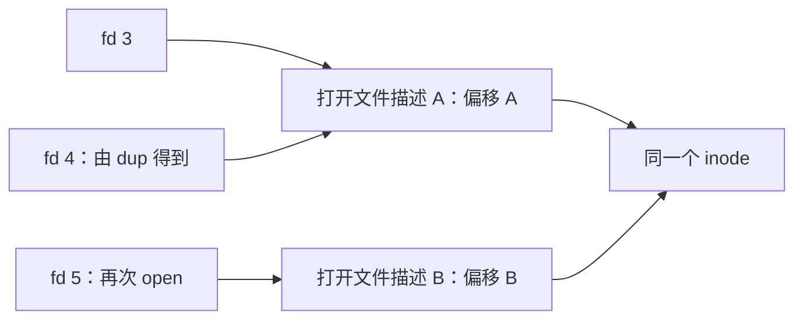

# Linux 重要知识点与面试问答

> 面向 C/C++ Linux 开发面试｜复习详解版｜共 86 题  
> 主要材料：2026 年 8 月 2 日—8 月 11 日的 9 份录音逐字稿。参考：《Linux基础与系统编程学习手册》。整理日期：2026-09-05。

## 阅读说明

每题先给可以独立复述的**面试简答**，再根据需要补充原理、示例和易错点。问题按知识主题归并，不按上课顺序排列；课堂闲聊、个人信息、重复演示及低复用价值的安装操作不纳入题库。

- **必会**：先掌握，能够解释原理并应对简单追问。
- **重点**：第二轮复习，能够联系开发或排障场景作答。
- **了解**：认识用途和边界，知道如何查阅手册。
- **课堂明确提及面试**：只用于录音确实提到面试的题目。其他等级是复习优先级，不是面试出现频率的统计。
- **补充**：用于完善对应课堂知识或修正技术误述，不代表录音逐字讲过。答案均为重新整理的准确表述，不是教师原话。

示例默认使用 Linux、Bash、GNU 工具和 C；命令在自己的练习目录运行。题中的页大小、块大小和地址值均以明确给出的模型为准。内存章节讲通用操作系统原理，不把课堂的 Windows/历史 32 位示意图直接当作所有 Linux 平台的实现。

## 目录

| 模块 | 题号 | 复习目标 |
|---|---|---|
| [一、Linux 基础与常用命令](#commands) | Q01—Q20 | 能解释常见命令，能定位路径、权限、进程和空间问题 |
| [二、编辑、编译、调试与构建](#tools) | Q21—Q34 | 能说明构建流程，能调试和维护 Makefile |
| [三、Linux 文件 I/O](#io) | Q35—Q50 | 理解描述符、缓冲、返回值、偏移和阻塞语义 |
| [四、文件系统与描述符共享](#filesystem) | Q51—Q68 | 理清名字、inode、打开文件描述和文件描述符 |
| [五、操作系统内存管理](#memory) | Q69—Q80 | 能解释分页/分段，区分缺页、越界和碎片 |
| [六、综合场景题](#scenarios) | Q81—Q86 | 会写复制与重定向程序，会分析结果与计算地址 |
| [录音来源与回查索引](#sources) | R01—R09 | 对应原始文件、日期和主题 |
| [验收与示例验证说明](#verification) | — | 明确已检查内容和运行环境限制 |

时间有限时，优先复习 Q07—Q09、Q14—Q17、Q23、Q27—Q32、Q35—Q50、Q53—Q59、Q63—Q68、Q70—Q79，再完成六道场景题。

<a id="commands"></a>
## 一、Linux 基础与常用命令（Q01—Q20）

### Q01【重点】Linux 与 Ubuntu 有什么关系？Linux 一定没有图形界面吗？

**面试简答：** 严格说，Linux 是操作系统内核，负责进程、内存、设备等资源管理。Ubuntu 等发行版将 Linux 内核、系统工具、软件包管理和其他软件组合成可使用的系统。Linux 可以安装图形桌面；服务器经常通过终端远程管理，是部署选择，不是内核不支持图形界面。

**易错点：** 虚拟机软件提供虚拟硬件环境，发行版运行在虚拟机内；虚拟机、操作系统、终端客户端不是同一层次的东西。

**来源：** [R01·8月2日](#r01) 00:00:01、00:00:49、00:02:21；手册第一部分第 1 章用于纠错。

### Q02【必会】Shell、Bash、终端和 Xshell 分别是什么？为什么 `cd` 通常是内建命令？

**面试简答：** Shell 是命令解释器，Bash 是一种 Shell 实现。终端提供输入输出界面，Xshell 是可以通过 SSH 等协议连接远端的终端客户端。Shell 可以直接执行内建命令，也可以启动外部程序。`cd` 必须改变当前 Shell 进程的工作目录，因此通常由 Shell 内建实现；子进程改变自己的目录不会改变父 Shell 的目录。

**补充：** `/etc/shells` 列出系统认可的登录 Shell 路径；`$SHELL` 通常反映登录 Shell，不保证就是当前正在解释命令的进程。使用 `type cd`、`type ls` 可查看命令解析结果。

**来源：** [R01·8月2日](#r01) 00:37:01、00:37:33、00:41:35、00:44:18；手册第一部分 2.2 补充内建命令与 Shell 判断。

### Q03【必会】绝对路径、相对路径、根目录和家目录有什么区别？

**面试简答：** 绝对路径以 `/` 开始，从当前进程可见的根目录解析；相对路径通常从当前工作目录解析。`.` 表示当前目录，`..` 表示父目录，`~` 由 Shell 展开为家目录。`/` 是目录树的根，`/root` 通常是 root 用户的家，`/home` 通常放普通用户的家目录。`pwd` 显示当前工作目录，不能直接等同于脚本文件所在目录。

**示例：** `cd ..` 上移一层，`cd ~` 回家，`cd -` 返回上一工作目录。`/etc` 主要放系统配置，`/dev` 提供设备节点，`/tmp` 放临时文件，`/usr` 包含大量用户空间程序和资源。

**来源：** [R01·8月2日](#r01) 00:26:05、00:27:39、00:29:01、00:38:50、01:23:07；手册第一部分第 3 章补充。

### Q04【必会】为什么自己编译的程序常要用 `./app` 运行？如何配置 `PATH`？

**面试简答：** 执行不含 `/` 的外部命令名时，Shell 会按 `PATH` 中的目录查找可执行文件。当前目录通常不在 `PATH` 中，所以需要用 `./app` 明确指定路径。`PATH` 是用冒号分隔的目录列表，扩展它时应保留原值。环境变量属于进程环境，子进程通常继承父进程导出的变量，不是修改一个终端就自动修改所有进程。

```bash
echo "$PATH"
export PATH="$HOME/bin:$PATH"
command -v gcc
```

**补充：** 遇到 `command not found`，先确认拼写、是否安装和搜索路径；例如 Ubuntu 的 `apt-get update` 只更新软件包索引，`apt-get install` 才安装软件。持久配置位置取决于 Shell 启动方式，Bash 的交互式非登录 Shell 常读取 `~/.bashrc`，不能概括为所有配置总是固定的两份文件。

**来源：** [R01·8月2日](#r01) 00:44:57、00:45:40、00:47:16；[R02·8月3日](#r02) 00:12:14、00:48:19、00:49:06；手册第一部分 2.5、6.3 补充。

### Q05【重点】如何查 Linux 命令和函数？`man 1 printf` 与 `man 3 printf` 有何区别？

**面试简答：** `man` 按章节组织手册，常用的第 1 节是用户命令，第 2 节是系统调用，第 3 节是库函数。同名命令和函数可以通过章节号区分，例如 `man 1 printf` 看命令，`man 3 printf` 看 C 库函数。阅读函数手册时应先看头文件、原型、返回值和错误，再看使用限制。Shell 内建命令还可以用 Bash 的 `help` 查询。

**示例：** `man 2 open`、`man 2 stat`、`man 3 readdir`、`help cd`。不能仅靠记忆函数名猜测其返回值或头文件。

**来源：** [R01·8月2日](#r01) 01:03:51；[R02·8月3日](#r02) 01:14:44、01:15:32；[R07·8月10日](#r07) 00:07:02。

### Q06【必会】怎样读懂 `ls -l`？怎样判断文件类型和隐藏文件？

**面试简答：** `ls -l` 显示类型与权限、硬链接数、属主、属组、大小、时间和名称等信息。权限串首字符表示类型，常见的有 `-` 普通文件、`d` 目录、`l` 符号链接，以及 `c` 字符设备、`b` 块设备、`p` FIFO、`s` 套接字。以点开头的名字通常作为隐藏文件，`ls -a` 可以显示。文件类型不能仅凭后缀或终端颜色判断。

**易错点：** 默认显示的时间通常是内容修改时间，不是创建时间；目录的大小反映目录自身的数据结构，不是所有子文件大小之和，也不保证恒为 4096 字节。`ls -i` 可查看 inode 号，`ls -ld dir` 查看目录自身而不是列出其内容。

**来源：** [R01·8月2日](#r01) 00:33:40、01:03:51、01:08:57、01:11:35；手册第一部分 4.1 用于补充和纠错。

### Q07【必会】文件和目录的 `rwx` 分别代表什么？只读文件能删除吗？

**面试简答：** 对普通文件，`r` 是读内容，`w` 是改内容，`x` 是请求执行；能否成功执行还要看格式、解释器等条件。对目录，`r` 是读取目录中的名字，`w` 是修改目录项，`x` 是搜索和穿过该目录。删除文件主要修改父目录的目录项，通常需要父目录的写和执行权限，因此只读文件也可能被删除。访问路径上的各级目录也必须允许搜索。

| 场景 | 关键权限或条件 |
|---|---|
| 读取文件内容 | 路径目录可搜索，文件可读 |
| 列出目录中的名字 | 目录可读；查询条目详情通常还需搜索权限 |
| 进入目录 | 目录有 `x` 权限 |
| 创建、删除目录项 | 父目录通常需要 `w+x` |

**补充：** 上表是普通权限模型。sticky bit、ACL、只读挂载等还可能限制删除；不能只看文件本身的 `w` 位。具体权限语义见 [inode(7)](https://man7.org/linux/man-pages/man7/inode.7.html)。

**来源：** [R01·8月2日](#r01) 01:13:18—01:20:22；[R02·8月3日](#r02) 00:01:18；手册第一部分 4.2、4.10 补充目录权限与删除条件。

### Q08【必会】`chmod`、`chown`、`sudo` 和 `su` 的作用有什么不同？

**面试简答：** `chmod` 修改权限位，`chown` 修改属主或属组，`chgrp` 专门修改属组。`sudo` 按配置的授权策略以指定身份执行命令，默认目标通常是 root；`su` 切换运行身份，常用于启动另一个用户的 Shell。`su - 用户名` 还会采用接近登录会话的环境。权限不足时应先明确失败原因，再判断是否需要提升权限。

```bash
chmod 640 report.txt      # 属主读写，属组只读，其他人无权限
chmod u+x app             # 给属主增加执行权限
```

**易错点：** `sudo` 不代表任何用户都能成为管理员；`chmod 777` 也不解决所有错误。C 源文件有执行位，并不会因此变成已经编译的程序。

**来源：** [R02·8月3日](#r02) 00:00:00、00:01:18、00:02:13、00:03:49、00:53:35；手册第一部分 4.10—4.12、9.1 补充。

### Q09【必会】`umask` 如何影响新建文件权限？为什么不能直接做减法？

**面试简答：** `umask` 是进程创建文件时使用的权限掩码，表示从申请权限中去掉哪些位。在没有默认 ACL 等额外机制的基础模型下，实际权限为 `mode & ~umask`。普通文件通常申请 `0666`，目录通常申请 `0777`，再由掩码去掉权限。按位清除不会发生借位，因此不能通用地用八进制减法代替。

| 申请权限 | 掩码 | 结果 |
|---|---|---|
| `0666` | `0022` | `0644` |
| `0777` | `0022` | `0755` |
| `0753` | `0222` | `0551` |
| `0644` | `0022` | `0644`，不是减法得到的 `0622` |

**易错点：** 掩码影响创建时的权限，不会追溯修改旧文件。程序不应为了得到宽松权限就随意执行 `umask(0)`。

**来源：** [R02·8月3日](#r02) 01:19:35、01:20:44、01:21:19；[R05·8月7日](#r05) 00:49:34；手册第一部分 4.13 补充默认 ACL 边界。

### Q10【重点】`touch`、`mkdir -p`、`rmdir`、`rm -r` 各适合什么情况？

**面试简答：** `touch` 在文件不存在时通常创建空文件，存在时更新时间而不清空内容。`mkdir -p` 创建缺失的多级父目录，路径上已经存在的目录一般不会导致失败。`rmdir` 只删除空目录；`rm -r` 才会递归删除目录内容。`-f` 主要抑制提示并忽略不存在的操作数，不会绕过系统权限。

**易错点：** 新建名称是否冲突由同一目录中的目录项名称决定，文件和目录也不能在同一目录下占用同一个名字。`touch` 与 `> file` 不同，后者通常会把已有文件截断为零；日常删除不需要默认加 `-rf`。

**来源：** [R01·8月2日](#r01) 00:53:11、00:55:45、00:59:51、01:27:54、01:28:36；手册第一部分 4.3—4.6 补充。

### Q11【重点】`cp` 和 `mv` 有什么区别？如何判断目标参数的含义？

**面试简答：** `cp` 复制数据，源对象仍然保留；`mv` 移动或重命名目录项，成功后原路径不再指向原对象。通常目标是已有目录时，源对象放到该目录内；目标不是目录时，它表示目标路径，并可能覆盖已有文件。复制目录常用 `cp -r`，需要保留更多属性时可了解 `cp -a`。同一文件系统内的移动通常主要修改元数据，跨文件系统的移动一般需要复制再删除。

**易错点：** `mv src dst` 并不能仅凭“名字存在”就断定结果，还要考虑目标类型、选项和权限。不要认为两个目录只要同类型就一定能相互覆盖；涉及覆盖时先核对路径，可用交互选项 `-i`。

**来源：** [R01·8月2日](#r01) 01:29:18、01:31:02、01:33:12、01:37:24；手册第一部分 4.7—4.8 补充跨文件系统行为。

### Q12【重点】查看日志时怎样选择 `cat`、`less`、`head`、`tail` 和 `wc`？

**面试简答：** 小文件或需要把内容送入管道时可用 `cat`，交互阅读大文件常用 `less`。`head -n N` 看开头，`tail -n N` 看结尾，`tail -f` 跟随增长；日志轮转场景可了解 `tail -F`。`wc -l` 统计换行符，`-w` 统计由空白分隔的词，`-c` 统计字节，`-m` 统计字符。这些计数不能互相替代。

```bash
tail -n 50 app.log
grep -n 'ERROR' app.log
wc -l app.log
```

**易错点：** 没有末尾换行的一行文本，`wc -l` 可能得到 0；中文的字符数不等于 UTF-8 字节数，`wc -w` 也不做中文分词。二进制内容可用 `od` 等工具按字节观察。

**来源：** [R01·8月2日](#r01) 01:38:38、01:41:26、01:42:29、01:44:32、01:45:10；手册第一部分第 5 章补充日志跟随。

### Q13【必会】`find` 与 `grep` 有什么区别？为什么通配模式要加引号？

**面试简答：** `find` 遍历指定目录树，按名字、类型等属性查找文件；`grep` 检索输入内容中匹配的行。`find` 的 `-name` 使用文件名匹配模式，`grep` 默认使用正则表达式，二者不是同一种语法。给 `find` 的模式加引号，是为了让 `find` 自己匹配，避免 Shell 先展开。`grep -n` 显示行号，`-i` 忽略大小写，`-r` 递归检索，`-F` 按固定字符串检索。

```bash
find . -type f -name '*.c'
grep -rn --include='*.c' 'malloc' .
grep -nF 'a.b' app.log     # 搜索字面值 a.b
```

**易错点：** 不加引号时，当前目录的 `*.c` 可能先变成多个文件名，改变 `find` 收到的参数。不要把文件名模式中的 `*` 当作正则里“任意字符串”的完整写法。

**来源：** [R02·8月3日](#r02) 00:06:52、00:08:04、00:09:00、00:09:18、00:11:29；手册第一部分 6.1—6.2 补充匹配语法。

### Q14【必会】重定向、追加和管道有什么区别？`2>&1` 为什么受顺序影响？

**面试简答：** 重定向由 Shell 设置命令的输入输出去向，`>` 通常创建或截断文件，`>>` 追加，`<` 提供标准输入。管道 `|` 把前一个命令的标准输出接到后一个命令的标准输入。标准输入、标准输出、标准错误通常对应描述符 0、1、2。`2>&1` 将描述符 2 复制为描述符 1 当时的去向，Shell 按从左到右的顺序处理重定向。

```bash
./app > app.log 2>&1      # 标准输出和标准错误都进入 app.log
./app 2>&1 > app.log      # 标准错误保留原标准输出的去向
ps aux | grep '[a]pp'     # 管道传递的是输出字节流
```

**补充：** 普通管道默认不包含标准错误。第二条的“原去向”常是终端，也可能是外层已经建立的重定向；`echo` 不是依靠自身功能打开 `>` 后的文件。

**来源：** [R01·8月2日](#r01) 00:49:37、00:51:10；[R08·8月11日·VFS](#r08) 00:08:49、00:17:00；手册第一部分 2.5、第三部分 2.16 补充管道与重定向顺序。

### Q15【必会】`ls -l`、`du`、`df` 和 `free` 分别看什么？

**面试简答：** 普通文件的 `ls -l` 大小通常是逻辑长度；`du` 估算目录树中可遍历到的文件占用；`df` 报告文件系统整体的空间使用。它们统计对象不同，所以数值不必完全一致。`df -i` 可检查 inode 是否耗尽，解决“磁盘还有字节空间却不能新建文件”的一种情况。`free` 查看内存使用，评估可用内存时通常比起只看 `free` 列，更应结合 `available`。

```bash
df -h .
df -i .
du -sh .
free -h
```

**追问：** 稀疏文件可能逻辑大小远大于实际占用；文件删除后仍被打开，可能使 `df` 未释放而 `du` 已找不到，见 Q83。`ls` 不能替代递归空间统计。

**来源：** [R01·8月2日](#r01) 01:45:10、01:45:54、01:46:15；[R02·8月3日](#r02) 01:26:09；[R06·8月8日](#r06) 00:47:15；手册第一部分 5.8—5.9、11.2 补充。

### Q16【必会】`ps aux` 主要看哪些字段？常见进程状态是什么意思？

**面试简答：** `ps aux` 展示进程快照，常用字段包括用户、PID、CPU/内存占用、VSZ、RSS、STAT 和命令。VSZ 是虚拟地址空间大小，RSS 是驻留物理内存量，两者都不能直接理解为程序独占的全部物理内存。STAT 的主状态表示进程当前处于运行、睡眠、停止或退出待回收等状态。排障时要结合 PID、状态、资源占用和命令，而不是只看“进程是否还在”。

| 主状态 | 含义 |
|---|---|
| `R` | 正在运行或可运行、等待调度 |
| `S` | 可中断睡眠 |
| `D` | 不可中断睡眠，常与 I/O 等待有关 |
| `T` | 被作业控制信号停止；小写 `t` 常表示跟踪停止 |
| `Z` | 已退出但退出信息尚未被父进程回收的僵尸 |
| `I` | 空闲内核线程，具体显示依赖工具与系统 |

**易错点：** `T` 不等于已经终止；僵尸已不再执行用户代码。`STAT` 后附的 `s`、`l`、`+` 等是附加属性，不表示同时处于多个互斥主状态。

**来源：** [R02·8月3日](#r02) 00:37:35、00:39:26、00:39:58、00:40:39、00:41:46、00:42:50；手册第一部分 8.2 用于纠错。

### Q17【必会】`jobs/fg/bg`、Ctrl-C、Ctrl-Z、`kill -15/-9` 有什么区别？

**面试简答：** `jobs` 查看当前 Shell 管理的作业，`fg` 将作业切到前台，`bg` 让停止的作业在后台继续。通常 Ctrl-C 向前台进程组发送 `SIGINT`，Ctrl-Z 发送 `SIGTSTP`，停止不等于退出。`kill` 的本质是发送信号，默认通常是 `SIGTERM`，程序可以处理它并清理资源。`SIGKILL` 不能被捕获、阻塞或忽略，会使程序失去自行清理的机会。

**易错点：** 作业号如 `%1` 与 PID 是不同标识。处于不可中断等待的任务可能不能马上完成退出，不能承诺 `kill -9` 在所有状态下立刻让条目消失；停止中的进程也可能要恢复执行后才能处理普通终止信号。

**来源：** [R02·8月3日](#r02) 00:43:16、00:44:34、00:45:21、00:46:02、00:47:49；手册第一部分 8.3—8.4 补充。

### Q18【重点】客户端连不上服务端，怎样进行基础网络排查？

**面试简答：** 先确认目标地址、端口与服务进程，再检查本机地址和路由、主机可达性、名称解析及服务是否监听。课堂的 `ifconfig` 用于查看接口，`ping` 测试 ICMP 连通性，`netstat` 查看连接或监听，`nslookup` 查询 DNS。现代 Linux 还常用 `ip addr`、`ip route`、`ss -lnt` 完成对应检查。网络连通、端口可达和应用协议正确是不同层次，不能只测其中一层。

**易错点：** `ping 127.0.0.1` 成功只说明回环路径可用；ping 成功不等于目标服务可用，ping 失败也可能是 ICMP 被过滤。解析得到多个地址不保证当前连接使用其中某一个固定地址。

**来源：** [R02·8月3日](#r02) 00:57:20、00:57:56、01:00:41、01:03:53、01:04:35、01:06:55；手册第一部分第 10 章补充 `ip`、`ss`。

### Q19【了解】`tar` 是压缩算法吗？怎样记住常用打包和解包选项？

**面试简答：** `tar` 主要负责归档，即把多个文件组织到一个归档文件中，本身不等于压缩算法。`-c` 创建归档，`-x` 解包，`-t` 列目录，`-f` 指定归档文件，`-v` 显示处理过程。`-z` 配合 gzip，`-j` 配合 bzip2，所以 `.tar.gz` 和 `.tar.bz2` 使用不同压缩方式。归档后的大小还包括元数据，小文件打包后不一定更小。

```bash
tar -czf source.tar.gz src
tar -tzf source.tar.gz
mkdir -p unpack
tar -xzf source.tar.gz -C unpack
```

**易错点：** 注意 `-f` 后面是归档文件名。解包前先列出内容、选择独立目录，可以避免把同名文件意外覆盖到工作目录。

**来源：** [R02·8月3日](#r02) 00:22:11、00:25:45、00:28:02；手册第一部分 7.3 补充。

### Q20【重点】什么是挂载？挂载后原目录里的文件为什么看不见了？

**面试简答：** 挂载把一个文件系统的根接到当前目录树中的某个挂载点，使它能通过统一路径访问。挂载点通常是已有目录，挂载后通过该路径看到的是被挂载文件系统的内容。原目录里的内容通常只是被遮住，并没有因挂载而删除；卸载后会重新显现。卸载可能因进程持有打开文件或工作目录等引用而提示忙。

**补充：** `mount` 与 `umount` 分别负责挂载和卸载。挂载、分区、创建文件系统是不同操作，已有文件系统通常无需为了挂载而重新格式化；文件系统类型也不是仅由设备硬件或操作系统名称决定。

**来源：** [R02·8月3日](#r02) 00:14:46、00:15:49、00:18:19、00:19:59、00:20:47；手册第一部分 7.1—7.2 用于纠错。

<a id="tools"></a>
## 二、编辑、编译、调试与构建（Q21—Q34）

### Q21【重点】Vim 常用的三种模式如何切换？怎样保存和退出？

**面试简答：** 日常入门主要使用普通模式、插入模式和命令行模式，Vim 实际还有可视模式等其他模式。打开文件后通常处于普通模式，按 `i` 进入插入模式，按 Esc 返回普通模式，再按 `:` 输入 Ex 命令。`:w` 保存，`:q` 在允许退出时退出，`:wq` 保存后退出，`:q!` 放弃未保存修改退出。新建缓冲区并不代表磁盘文件已经创建，通常要成功保存才落到文件系统中。

**易错点：** Vim 普通模式不是 Bash 命令行。修改后直接 `:q` 常被拒绝，这时应明确是保存还是放弃，不能机械使用 `:q!`。

**来源：** [R03·8月4日](#r03) 00:06:51、00:07:43、00:08:13、00:08:33、00:09:02、00:09:22。

### Q22【重点】Vim 中有哪些值得熟练掌握的编辑与分屏操作？

**面试简答：** 普通模式下，`gg/G` 到文件开头/结尾，`dd` 删除当前行，`3dd` 删除三行，`yy/p` 复制一行并粘贴。`u` 撤销，Ctrl-R 重做，`/模式` 搜索，`n/N` 沿当前方向/反方向查找。`:sp 文件` 上下分屏，`:vsp 文件` 左右分屏，Ctrl-W 再按 `w` 切换窗口。熟练使用这些操作可以在终端中快速修改和对照代码。

**补充：** `v`、`V` 可以按字符、按行可视选择；大写 `U` 不是“撤销本次打开后的全部操作”。`gg=G` 是重新计算缩进，不是通用文档排版；`:set number` 可显示行号。

**来源：** [R03·8月4日](#r03) 00:02:45、00:10:21、00:12:01、00:12:53、00:13:48、00:14:34、00:15:32、00:16:32；手册第二部分第 1 章用于纠错。

### Q23【必会】C 程序从源代码到可执行文件经历哪四个阶段？

**面试简答：** 典型流程是预处理、编译、汇编和链接。预处理处理头文件包含、宏展开和条件编译，编译把预处理后的 C 代码转换为汇编，汇编生成可重定位目标文件。链接将目标文件与所需库组合，处理符号引用和重定位，生成可执行文件等产物。`gcc` 是驱动程序，可以一次组织多个阶段，也可以指定在哪个阶段停止。

| 阶段 | 示例命令 | 产物 |
|---|---|---|
| 预处理 | `gcc -E main.c -o main.i` | 预处理后的源码 |
| 编译 | `gcc -S main.i -o main.s` | 汇编代码 |
| 汇编 | `gcc -c main.s -o main.o` | 目标文件 |
| 链接 | `gcc main.o -o app` | 可执行文件 |

**易错点：** `.o` 通常不能直接当作完整程序运行；`-c` 是“不链接”，不是“只做语言语法分析”。各阶段选项已核对 [GCC 输出控制选项](https://gcc.gnu.org/onlinedocs/gcc/Overall-Options.html)。

**来源：** [R04·8月5日](#r04) 00:02:54、00:06:38、00:20:40；手册第二部分 2.1 补充阶段细节。

### Q24【必会】GCC 的 `-o/-O/-I/-D/-g/-Wall` 分别是什么？

**面试简答：** 小写 `-o` 指定输出文件，大写 `-O` 设置优化级别，二者含义不同。`-I` 增加头文件搜索目录，`-D` 在预处理阶段定义宏，`-g` 生成调试信息。`-Wall` 开启一组常见警告，不代表全部警告；可结合 `-Wextra` 使用。调试时常采用 `-g -O0` 或合适的 `-Og`，优化可能使源码单步和变量观察变得不直观。

```bash
gcc -std=c11 -Wall -Wextra -g -O0 -Iinclude -DDEBUG src/main.c -o app
```

**易错点：** `-Iinclude` 和 `-I include` 都是常见合法形式。警告应分析原因并修正代码，不能用删掉警告选项的方式证明代码正确。

**来源：** [R03·8月4日](#r03) 00:22:51、00:26:35、00:29:45、00:33:04、00:36:23、00:53:50；手册第二部分 2.3 补充大小写与优化选项。

### Q25【重点】条件编译与运行时 `if` 有什么区别？`-DDEBUG=0` 会关闭 `#ifdef DEBUG` 吗？

**面试简答：** 条件编译在预处理阶段选择保留哪些代码，而普通 `if` 表达的是运行时控制逻辑，编译器还可能对它进行优化。`-DDEBUG` 相当于定义宏，`#ifdef DEBUG` 只判断宏是否存在，不看它的数值。因而 `-DDEBUG=0` 仍会使 `#ifdef DEBUG` 分支成立。若希望按值控制，可以采用 `#if DEBUG` 或显式判断定义和值。

**示例：** `#if defined(DEBUG) && DEBUG` 可区分未定义、定义为 0、定义为非零。课堂将条件编译用于产品/硬件差异和调试日志；关闭日志宏不等于发布包中一定没有敏感数据。

**来源：** [R03·8月4日](#r03) 00:34:40、00:36:23、00:38:01、00:40:43、00:41:40；手册第二部分 2.4 补充宏判断细节。

### Q26【必会】头文件找不到与 `undefined reference` 有什么区别？

**面试简答：** 头文件找不到通常发生在预处理阶段，应检查包含路径、名字和开发文件是否安装。`undefined reference` 通常是链接器找不到所引用符号的定义，应检查目标文件、库和链接参数。头文件中的函数声明帮助编译器检查调用，不等于已经提供函数实现。多文件程序要把实际使用的实现文件编译并参与链接，不能以为写了 `#include` 就自动链接实现。

**补充：** `-I` 管头文件路径，`-L` 管库搜索路径，`-lfoo` 请求链接对应库；静态库的链接顺序还可能影响符号解析。静态/共享库构建细节在手册中属于扩展，本题只保留与课堂多文件编译直接相关的排错。

**来源：** [R03·8月4日](#r03) 00:24:43、00:26:19、00:26:35、00:28:17；[R04·8月5日](#r04) 00:06:38、00:18:59；手册第二部分 2.2、2.6—2.7 补充链接排错。

### Q27【必会】怎样开始一次 GDB 调试？`start` 与 `run` 有什么区别？

**面试简答：** 先生成带调试信息的程序，再用 `gdb ./app` 加载它；仅凭文件体积不能确定是否存在可用调试符号。`start` 启动程序并通常在 `main` 的入口附近设置临时断点停下。`run` 启动或重新启动程序，遇到断点、信号等事件会停止，没有这些事件就继续到退出。`list` 查看源码，程序参数可以通过 `set args` 设置。

```text
gdb ./app
(gdb) set args input.txt
(gdb) start
(gdb) list
```

**易错点：** 调试器显示的当前源码行通常是即将执行的位置，不应一律理解为该行已经执行完毕。优化、宏和一行多条语句都可能影响源码与指令的对应。

**来源：** [R03·8月4日](#r03) 00:53:50、00:54:25、00:56:43、00:57:47、00:58:29、01:04:46、01:05:22；手册第二部分第 3 章补充。

### Q28【必会】GDB 的断点、`continue/next/step/finish` 应该怎样区分？

**面试简答：** `break` 设置断点，既可按函数名，也可按文件和行号；`info breakpoints` 查看已有断点。`continue` 从当前位置继续执行，直到下一次停止事件。`next` 通常执行当前源码行并越过函数调用，`step` 尝试进入有可用调试信息的函数。`finish` 运行到当前函数返回，但途中仍可能被断点或信号打断。

| 命令 | 用途 |
|---|---|
| `break main.c:20` | 在指定文件行设置断点 |
| `disable 1` / `enable 1` | 禁用/启用编号 1 的断点 |
| `delete 1` | 删除编号 1 的断点 |
| `next` / `step` | 越过调用 / 尝试进入调用 |
| `finish` | 执行到当前函数返回 |

**易错点：** 记住“是否进入函数”的行为，避免把录音中的“逐语句/逐过程”误述背反；`finish` 不是强行跳过当前函数内尚未执行的代码。

**来源：** [R03·8月4日](#r03) 00:59:12、00:59:43、01:00:47、01:04:17、01:05:57、01:06:32、01:07:15；手册第二部分 3.3—3.4 用于纠错。

### Q29【重点】`print`、`display` 和观察点有什么区别？崩溃时先看什么？

**面试简答：** `print 表达式` 立即求值并显示一次，`display 表达式` 登记在之后停止时自动显示。`undisplay 编号` 取消自动显示，编号不是变量名。观察点 `watch 表达式` 则用于在值变化等条件满足时停止，和自动打印不是一回事。程序崩溃后可用 `bt` 查看调用栈，再用 `frame` 选择栈帧检查参数与局部变量。

**补充：** `watch`、`bt`、`frame` 是对课堂变量观察的实用扩展；变量不在当前作用域或被优化掉时，GDB 不一定能显示它。不要把“看不到变量”直接解释为变量的值为零。

**来源：** [R03·8月4日](#r03) 01:01:07、01:02:36、01:03:08；手册第二部分 3.5 及第五部分调试排错补充。

### Q30【必会】Makefile 为什么能节省构建时间？`make` 如何判断要不要重建？

**面试简答：** Makefile 描述目标、前置条件及生成目标的方法，`make` 按依赖图更新所需目标。普通文件目标不存在，或某个普通前置条件比它新时，通常需要重建。把源文件分别编译为 `.o`，可复用仍然有效的目标文件，再进行必要的链接。第一次完整构建通常不能省掉这些编译步骤，后续增量构建才体现优势。

**易错点：** `make` 不是按文件从第一行到最后一行顺序执行所有命令，也不会自动分析 C 代码来发现所有头文件依赖。头文件漏写会导致“明明改了接口却没有重新编译”，见 Q33；编译和链接谁更耗时取决于具体工程。

**来源：** [R04·8月5日](#r04) 00:06:38、00:07:49、00:08:40、00:10:24、00:22:49、00:24:21；手册第二部分 4.1—4.3 用于纠错。

### Q31【必会】Makefile 规则的三要素是什么？默认目标和文件名怎样确定？

**面试简答：** 一条典型规则由目标、前置条件和配方命令组成，写成 `目标: 前置条件`，下一行给出命令。默认语法下配方行以真正的 Tab 开头，几个空格不等价。GNU Make 默认查找 `GNUmakefile`、`makefile`、`Makefile`，其他名字可以通过 `make -f 文件` 指定。默认目标通常取第一个合适规则中的目标，也可用 `.DEFAULT_GOAL` 显式指定。

```makefile
.DEFAULT_GOAL := app
app: main.o
	gcc main.o -o app
main.o: main.c
	gcc -Wall -g -c main.c -o main.o
```

**易错点：** 上面两条 `gcc` 行前为 Tab。`missing separator` 常见原因之一是使用了空格或全角标点；“只能叫 makefile”不是 GNU Make 的限制。

**来源：** [R04·8月5日](#r04) 00:11:39、00:13:42、00:14:27、00:56:52；手册第二部分 4.2、4.7 补充默认规则边界。

### Q32【必会】`$@`、`$<`、`$^` 与 `%.o: %.c` 分别表示什么？

**面试简答：** `$@` 表示当前目标名，`$<` 表示第一个前置条件，`$^` 表示去重后的全部普通前置条件。`%.o: %.c` 是模式规则，百分号匹配相同的主干，例如 `add.o` 对应 `add.c`。这些自动变量根据当前正在处理的规则取值，所以同一条配方可以复用。它们主要在配方中使用，不能不加区分地认为在 Makefile 任意位置都已经有值。

```makefile
%.o: %.c
	$(CC) $(CPPFLAGS) $(CFLAGS) -c $< -o $@
```

**易错点：** 若前置条件同时列出 `.c` 和 `.h`，编译配方盲目用 `$^` 可能把头文件也作为编译输入；这个场景通常用 `$<` 指向源文件。`%` 是 Make 的模式，不是 Shell 的 `*`。

**来源：** [R04·8月5日](#r04) 00:25:53、00:28:06、00:28:34、00:29:53；手册第二部分 4.4 补充自动变量作用域。

### Q33【重点】怎样用变量组织 Makefile，并避免遗漏头文件依赖？

**面试简答：** 可用变量集中管理编译器、目标名、选项和文件列表，减少重复修改。`$(wildcard *.c)` 获取匹配的源文件名，`$(patsubst %.c,%.o,$(SRC))` 将文件名列表映射为目标文件名，但不会实际创建文件。按惯例 `CPPFLAGS` 放预处理选项，`CFLAGS` 放 C 编译选项，`LDFLAGS` 放链接选项，`LDLIBS` 放库。头文件依赖可以显式列出，也可以让 GCC 生成依赖文件交给 Make 包含。

```makefile
CC := gcc
CPPFLAGS := -Iinclude
CFLAGS := -Wall -Wextra -g
SRC := $(wildcard *.c)
OBJ := $(patsubst %.c,%.o,$(SRC))

app: $(OBJ)
	$(CC) $(LDFLAGS) $(OBJ) $(LDLIBS) -o $@
%.o: %.c
	$(CC) $(CPPFLAGS) $(CFLAGS) -MMD -MP -c $< -o $@
-include $(OBJ:.o=.d)
```

**补充：** `-MMD -MP` 和 `.d` 文件是对课堂增量构建的完善，示例假设源文件位于当前目录且文件名不含空格。改动编译选项本身不一定触发重新构建；变量拼错也可能只展开为空，排查时看实际生成的命令。

**来源：** [R04·8月5日](#r04) 00:32:27、00:33:15、00:34:48、00:35:32、00:39:20、00:39:53、00:41:37、00:45:01；手册第二部分 4.5—4.6 补充自动依赖。

### Q34【重点】为什么 `clean` 要声明为 `.PHONY`？怎样排查构建脚本中的危险路径？

**面试简答：** `clean` 这样的功能目标通常不对应一个需要生成的同名文件。声明 `.PHONY: clean` 可以避免目录中恰好有 `clean` 文件时，Make 错把它判断为不需要执行。清理命令应只操作明确的构建产物，路径变量要核对非空、引号和意外空格。可以用输出目标打印变量边界，用 `make -n` 查看计划执行的命令，先确认再真正清理。

```makefile
.PHONY: clean
clean:
	$(RM) $(OBJ) $(OBJ:.o=.d) app
```

**易错点：** 这个片段沿用 Q33 的受控文件列表，不需要递归删除目录。变量赋值末尾、注释前的空格可能成为变量值；`make -n` 也不应被当作任意未知 Makefile 的绝对无副作用沙箱，解析时的 Shell 调用等仍需检查。

**来源：** [R04·8月5日](#r04) 00:56:52、00:57:50、01:00:17、01:02:27、01:04:15、01:05:37、01:07:07；手册第二部分 4.7—4.8 补充 `.PHONY` 和预览限制。

<a id="io"></a>
## 三、Linux 文件 I/O（Q35—Q50）

### Q35【必会】标准 I/O 与文件 I/O 有什么区别？系统调用一定更快吗？

**面试简答：** 标准 I/O 常指 `fopen/fread/fwrite/fclose` 等 C 库流接口，以 `FILE *` 操作，并通常提供用户空间缓冲。课堂的文件 I/O 指 `open/read/write/close` 等基于文件描述符的接口，能够表达非阻塞、描述符复制等系统层语义。C 标准 I/O 更强调标准化的流操作，POSIX 接口更贴近操作系统能力。直接调用 `read/write` 不保证更快，小块频繁调用反而可能因系统调用开销较大而更慢。

**原理解释：** 在 Linux 程序中，一般也是通过 libc 提供的系统调用封装函数进入内核。`FILE` 的布局与缓冲区大小依赖实现，不能固定背成“只有三个成员、缓冲区一定是 8192 字节”；`printf` 的输出也可以被重定向，不是只能写终端。

**来源：** [R05·8月7日](#r05) 00:00:01、00:02:36、00:04:01、00:06:09、00:08:00；手册第三部分 1.1 用于纠错。

### Q36【必会】标准 I/O 缓冲什么时候刷新？`fflush` 是否等于数据已经落盘？

**面试简答：** 常见流缓冲方式有全缓冲、行缓冲和无缓冲，具体行为由流、设备和库配置决定。缓冲区满、适用的换行条件、显式 `fflush`、正常关闭流等都可能触发输出刷新。`fflush` 将输出流的用户空间缓冲交给底层写入，不保证数据已经持久化到存储介质。`write` 成功通常也只能证明写入被内核接受；需要明确持久化保证时，应使用并检查 `fsync` 等接口。

**原理解释：** 可以区分“程序自己的数据 → stdio 用户缓冲 → 内核缓存 → 存储设备”几个阶段。终端上的 `stdout` 常见为行缓冲，重定向到普通文件后常见为全缓冲，不能据此断定每个 `printf` 都对应一次 `write`。

**补充：** 新建或重命名文件的持久化还可能要求同步父目录；只对文件调用 `fsync` 不涵盖所有目录项更新。详见 [fsync(2)](https://man7.org/linux/man-pages/man2/fsync.2.html)。

**来源：** [R05·8月7日](#r05) 00:08:00、00:09:35、00:10:26；[R08·8月11日·VFS](#r08) 00:09:30、00:17:00；手册第三部分 1.1、2.16 补充缓冲与持久化边界。

### Q37【必会】文件描述符是什么？为什么 `open` 常返回 3，却不保证返回 3？

**面试简答：** 文件描述符是进程用于引用已打开对象的非负整数，可以理解为进程描述符表的索引。通常 0、1、2 分别用于标准输入、标准输出和标准错误，对应宏 `STDIN_FILENO`、`STDOUT_FILENO`、`STDERR_FILENO`。`open` 返回当前进程最小的未使用描述符，所以在只有 0、1、2 已占用时常返回 3。描述符关闭后可以复用，它不是文件永久不变的编号。

**示例：** 假设最初只有 0、1、2 占用，依次打开 A、B 得到 3、4；关闭 3 后再打开 C，得到 3。若事先关闭了 0，新一次 `open` 就可能返回 0，因此应检查 `fd == -1`，不能用 `fd <= 0` 判断打开失败。

**来源：** [R05·8月7日](#r05) 00:16:03、00:16:59、00:19:01、00:19:57、00:21:34、00:35:12。

### Q38【重点】PCB、`task_struct` 与文件描述符表是什么关系？每个 Linux 进程都是 4 GiB 吗？

**面试简答：** PCB 是操作系统教材中描述进程控制信息的概念，Linux 使用 `task_struct` 等结构管理任务状态和资源关联。任务通过相关结构关联文件描述符表，描述符表再引用打开文件描述；不能把所有文件内容都想成直接放在 PCB 中。用户空间通常受到进程间隔离，内核负责管理这些对象。“每进程 4 GiB、用户 3 GiB/内核 1 GiB”只适用于某些历史 32 位配置，不能推广到现代 64 位系统。

**易错点：** 地址空间大小与物理内存大小不是同一个量。结构体名也要区分 `files_struct` 与表示一次打开的 `struct file`，见 Q67；课堂发音中的相似名字不代表同一个结构。

**来源：** [R05·8月7日](#r05) 00:11:26、00:11:57、00:14:54、00:15:38、00:16:03；[R08·8月11日·VFS](#r08) 00:02:27；手册第三部分 1.2、2.15 纠正地址空间和结构关系。

### Q39【必会】`open` 的参数、访问模式与创建权限怎样理解？

**面试简答：** `open` 接收路径与标志，成功返回描述符，失败返回 `-1` 并设置 `errno`。访问模式在 `O_RDONLY`、`O_WRONLY`、`O_RDWR` 中选择一个，不能把只读和只写简单按位或成读写。创建文件使用 `O_CREAT` 时必须提供第三个 `mode` 参数，权限再受 `umask` 等机制影响。`O_CREAT | O_EXCL` 可要求只创建新文件，目标已存在就失败。

```c
/* 接口用法片段：位于可返回错误的函数中，fd 用完必须 close。 */
int fd = open("data.txt", O_WRONLY | O_CREAT, 0666);
if (fd == -1) {
    perror("open data.txt");
    return -1;
}
```

**易错点：** `O_RDONLY` 在 Linux 中为 0，`O_RDONLY | O_WRONLY` 不是 `O_RDWR`。第三个参数用于新文件的权限，不是当前描述符的访问模式；`O_CREAT` 本身不等于截断已有内容。

**来源：** [R05·8月7日](#r05) 00:22:01、00:22:22、00:25:33、00:45:09；手册第三部分 1.3 补充访问模式和排他创建。

### Q40【必会】从头写、截断写和追加写有什么区别？

**面试简答：** 普通文件只以可写模式打开时，初始偏移通常为 0，之后写入覆盖对应位置的字节，不自动删除后面的旧内容。`O_TRUNC` 配合可写打开会在打开成功时将普通文件截断为零。`O_APPEND` 使每次 `write` 在当时的文件尾追加，避免把“先定位到尾、再写入”当作一个可靠的并发追加操作。写文件通常是覆盖字节，不是文本编辑器那种自动把后续内容后移的插入。

**示例：** 原文件为 `abcdef`，从头写入两个字节 `XY`，结果通常是 `XYcdef`；先截断再写是 `XY`；以追加模式写是 `abcdefXY`。

**补充：** 追加定位与单次写操作的原子关系，不等于多次 `write` 组成的一条业务记录也原子；网络文件系统还可能有额外限制。参见 [open(2) 的 O_APPEND 说明](https://man7.org/linux/man-pages/man2/open.2.html)。

**来源：** [R05·8月7日](#r05) 00:22:22、00:23:41、00:25:33；[R08·8月11日·VFS](#r08) 00:18:02；手册第三部分 1.3 补充原子追加边界。

### Q41【必会】`errno` 与 `perror` 分别是什么？什么时候应该检查 `errno`？

**面试简答：** `errno` 保存约定接口的错误编号，Linux C 库通常通过线程局部机制实现。应先依据函数返回值判断是否失败，再按该接口约定查看 `errno`；成功调用不保证把旧错误清零。`perror("提示")` 将提示及当前错误编号的解释输出到标准错误流。错误编号不是存放在描述符 2 中的字符串，错误也不一定会自动打印。

**易错点：** 参数个数不对属于程序自己的逻辑校验，应该用 `fprintf(stderr, ...)` 输出说明，不能使用一个无关的旧 `errno`。如果还要调用可能改变 `errno` 的函数再报告原错误，应先保存错误编号。

**来源：** [R05·8月7日](#r05) 00:18:06、00:22:01、00:32:39、00:43:36、00:47:09；手册第三部分 1.3—1.4 用于纠错。

### Q42【必会】为什么每个成功打开的描述符都要关闭？`close` 出错能直接重试吗？

**面试简答：** `close` 释放本进程对一个描述符的占用，减少相关打开引用，避免描述符泄漏。即使后续步骤失败，之前已经成功打开的描述符仍要走清理路径。应检查关闭时报告的错误，因为某些写入错误可能到关闭阶段才被发现。Linux 上关闭失败后不应机械地再次关闭相同整数，因为原描述符可能已经释放并被复用。

**补充：** 这是 Linux 的语义边界，不能据此概括所有 POSIX 平台；对 `EINTR` 的处理必须结合目标平台。进程退出通常会关闭持有的描述符，但不能代替及时资源管理，更不能证明数据已经持久化。详见 [close(2)](https://man7.org/linux/man-pages/man2/close.2.html)。

**来源：** [R05·8月7日](#r05) 00:25:33、00:26:43、00:35:12、00:45:59；手册第三部分 1.3、1.6 补充关闭错误处理。

### Q43【重点】一个进程最多能打开多少文件？`EMFILE` 与 `ENFILE` 有何区别？

**面试简答：** 描述符数量不是固定的 1024，限制由进程资源限制及系统配置决定。`RLIMIT_NOFILE` 控制进程描述符编号的上限范围，常用 `ulimit -n` 查看 Shell 及后代适用的软限制。`EMFILE` 通常表示进程达到描述符限制，`ENFILE` 表示系统级打开文件相关资源达到限制。处理时要先排查泄漏和并发使用量，再决定是否调整限制。

**补充：** 可区分 `ulimit -Sn`、`ulimit -Hn`，以及 `/proc/sys/fs/file-max` 等系统参数。一个文件被独立打开多次、或者一个描述符被复制，描述符数与打开文件描述数并不总是一一对应；因此不能把系统参数直接解释为“磁盘最多放多少个文件”。

**来源：** [R05·8月7日](#r05) 00:51:40、00:52:34、00:53:30；手册第三部分 1.5 用于纠错。

### Q44【必会】`read` 返回正数、0、`-1` 分别表示什么？短读就是读完了吗？

**面试简答：** `read(fd, buf, count)` 最多读取 `count` 个字节，返回值类型为 `ssize_t`。正数表示本次实际读取的字节数，可能小于请求值；这叫短读，不必然表示错误或结束。对请求长度大于零的普通文件读取，返回 0 表示当前偏移已经处于文件尾；后续文件增长后再次读可能有数据。返回 `-1` 表示需要依据 `errno` 处理错误或暂时无法读取等情况。

**易错点：** `count == 0` 时返回 0 不能据此认定 EOF；特殊终端模式也有自己的零返回语义。不要写成“读到不足一缓冲区就停止复制”，通用循环应依赖明确的结束条件。返回值约定见 [read(2)](https://man7.org/linux/man-pages/man2/read.2.html)。

**来源：** [R05·8月7日](#r05) 00:54:36、00:55:21、00:55:47、01:08:31；[R06·8月8日](#r06) 00:17:00；手册第三部分 1.6 补充短读及零长度请求。

### Q45【必会】`read` 读出的内容能直接用 `%s` 打印吗？为什么复制时不能用 `strlen`？

**面试简答：** `read` 读取原始字节，不会自动追加字符串结束符 `\0`。如果缓冲区里没有可靠的终止符，直接用 `%s` 可能越界读取。二进制数据可能包含零字节，因此 `strlen` 不能代表本次读取长度。复制程序必须使用 `read` 返回的实际字节数，写入相同数量的有效数据。

**示例：** `char buf[100];` 读满 100 字节后不能再写 `buf[100] = '\0'`。仅在明确按文本处理时，才可预留一个字节、最多读取 `sizeof(buf)-1`，并在确认 `n >= 0` 后设置 `buf[n] = '\0'`。

**易错点：** 清零缓冲区不是正确管理数据长度的替代方案；用 `write` 输出时也必须处理其短写，见 Q46。

**来源：** [R05·8月7日](#r05) 00:54:36、01:08:31、01:22:51；[R06·8月8日](#r06) 00:06:19、00:22:41；手册第三部分 1.6 补充字符串与二进制边界。

### Q46【必会】一次 `write` 会写完所有字节吗？可靠写入循环怎样组织？

**面试简答：** 不保证，`write` 成功时也可能只写入请求数据的一部分。应累计已写入数量，将缓冲区指针和剩余长度相应向后推进，循环直到全部完成。返回 `-1` 且 `errno == EINTR` 时，可按接口语义重试；非阻塞场景遇到 `EAGAIN/EWOULDBLOCK` 要等待合适时机再继续。其他错误应报告并退出，不能把未完成的写入当作复制成功。

**原理解释：** 例如要求写 100 字节、实际返回 40，下一次应从 `buf+40` 写剩余 60 字节，而不是从头重写 100 字节。防御性代码还应处理“请求非零但返回 0”的无进展情况，避免死循环；完整循环见 Q81。已核对 [write(2)](https://man7.org/linux/man-pages/man2/write.2.html)。

**来源：** [R05·8月7日](#r05) 00:54:36、00:55:47、01:08:31；手册第三部分 1.6 补充短写、EINTR 与循环推进，课堂简化复制代码不能直接视为可靠实现。

### Q47【必会】`lseek` 如何定位？获取文件大小时有哪些限制？

**面试简答：** `lseek(fd, offset, whence)` 按参考位置调整可定位文件的当前偏移，参考值为 `SEEK_SET`、`SEEK_CUR`、`SEEK_END`。成功返回新的绝对偏移，类型为 `off_t`；失败返回 `(off_t)-1`。对普通文件，`lseek(fd, 0, SEEK_END)` 可得到当时的文件尾偏移，但同时改变了当前位置。若只想查询长度，通常可用 `fstat` 的 `st_size` 避免改变偏移。

**易错点：** 偏移单位是字节，不是字符或代码行数。管道、FIFO、套接字等通常不支持定位，不能因为它们使用文件描述符就认定都能 `lseek`；文件并发变化时，查到的大小也只是某个时刻的状态。

**来源：** [R05·8月7日](#r05) 01:13:56、01:14:47、01:15:34、01:18:32、01:21:04；手册第三部分 1.7 补充接口限制。

### Q48【重点】`lseek` 越过文件尾会立即扩大文件吗？什么是稀疏文件？

**面试简答：** 单独把偏移移动到文件尾之后，通常不会改变文件长度；随后真正写入才可能扩大文件。旧文件尾与新写入位置之间未写的区域读取时表现为零字节，并可能以空洞形式存在。稀疏文件的逻辑长度因此可以大于实际分配的磁盘空间。`truncate/ftruncate` 则直接设置文件长度，缩短会丢弃尾部内容，延长部分读取为零。

**易错点：** 零字节不是字符 `'0'`。空洞是否、何时占用实际空间与文件系统有关，不能断言所有写零操作都会自动变成空洞；简单逐字节复制也未必保留源文件的稀疏布局。

**来源：** [R05·8月7日](#r05) 01:13:56、01:15:34；[R07·8月10日](#r07) 00:33:54；手册第三部分 1.7、2.10 补充稀疏文件机制。

### Q49【必会】阻塞与非阻塞有什么区别？普通文件设置 `O_NONBLOCK` 就不会等待吗？

**面试简答：** 阻塞 I/O 在暂时不能完成操作时可能让调用线程睡眠等待，CPU 可调度其他可运行任务。非阻塞 I/O 在会阻塞时通常立即返回，并以 `EAGAIN/EWOULDBLOCK` 表示暂时不可操作。非阻塞不是异步完成通知，也不等于操作一定成功。Linux 当前对普通文件和块设备不提供由 `O_NONBLOCK` 保证的这种免等待语义，实际设备 I/O 仍可能等待。

**易错点：** “有限时间内返回”不是非阻塞的严格定义；“普通文件不会等待”也不正确。`EAGAIN` 不是 EOF，`EINTR` 不是同一种情况。普通文件的边界已核对 [open(2) 的 O_NONBLOCK 说明](https://man7.org/linux/man-pages/man2/open.2.html)。

**来源：** [R06·8月8日](#r06) 00:00:22、00:01:01、00:01:38、00:02:44、00:17:00；手册第三部分 1.8 用于纠错。

### Q50【必会】怎样用 `fcntl` 把已打开的描述符改为非阻塞？为什么不直接死循环读取？

**面试简答：** 先用 `F_GETFL` 获取现有访问模式和文件状态标志，再保留旧标志、加入 `O_NONBLOCK`，用 `F_SETFL` 设置。不能直接用新标志覆盖所有旧状态，也不能用 `F_SETFL` 把只读访问模式改成可写。非阻塞读取若遇到暂时无数据就不停重试，会造成 CPU 忙等。加入固定休眠能减少忙等，但会增加响应延迟；事件等待接口是进一步的解决方向。

```c
/* 接口用法片段：检查每次调用，old_flags 可留待结束时恢复。 */
int old_flags = fcntl(fd, F_GETFL);
if (old_flags == -1) {
    perror("fcntl F_GETFL");
    return -1;
}
if (fcntl(fd, F_SETFL, old_flags | O_NONBLOCK) == -1) {
    perror("fcntl F_SETFL");
    return -1;
}
```

**补充：** 文件状态标志属于打开文件描述，复制得到的描述符也会看到变化，影响范围见 Q67。恢复时也应检查返回值；若其他执行流并发修改标志，需要协调，不能盲目恢复旧快照。支持修改的标志已核对 [F_GETFL/F_SETFL](https://man7.org/linux/man-pages/man2/F_GETFL.2const.html)。本题仅提及 `poll/select/epoll` 的等待用途，不扩展多路复用题库。

**来源：** [R06·8月8日](#r06) 00:07:53、00:11:14、00:20:58、00:22:16、00:22:41、00:28:14、00:29:19；手册第三部分 1.8—1.9 补充。

<a id="filesystem"></a>
## 四、文件系统与描述符共享（Q51—Q68）

### Q51【重点】文件系统、扇区和文件系统块分别是什么？

**面试简答：** 文件系统规定如何组织文件名、元数据、目录和存储空间，不能简单等同于操作系统或设备驱动。扇区是存储设备层面的寻址单位，文件系统块是文件系统管理空间的基本单位之一。课堂用 512 字节扇区、4 KiB 文件系统块举例，此时一个块对应 8 个这样的扇区。真实设备和文件系统的单位大小需要查询，不能把示例数字背成所有环境的固定常量。

**易错点：** `1 KiB = 1024 B`，`1 B = 8 bit`。4 KiB 块对应 4096 字节和 32768 位；“文件系统块”“内存页”“设备扇区”即使有时大小相同，也属于不同概念。

**来源：** [R06·8月8日](#r06) 00:31:29、00:32:59、00:33:55、00:36:51、00:39:07；手册第三部分 2.1 用于纠错。

### Q52【重点】ext2 的块组中有哪些关键结构？位图起什么作用？

**面试简答：** ext2 将文件系统组织为多个块组，以便管理和尽量就近分配元数据与数据。超级块记录文件系统的全局信息，组描述符记录各组关键元数据的位置与统计信息。块位图和 inode 位图分别标识块、inode 是否已分配，inode 表存放 inode 记录，数据区域承载文件和目录的数据。创建文件时需要分配相关资源并更新这些管理信息，而不只是把字节放进某块空间。

| 结构 | 主要用途 |
|---|---|
| 超级块 | 块大小、inode/块数量、文件系统状态等 |
| 块组描述符 | 位图和 inode 表的位置、空闲数量等 |
| 块位图 | 标识本组块是否被占用 |
| inode 位图 | 标识本组 inode 是否被占用 |
| inode 表 | 存放 inode 元数据记录 |
| 数据块 | 存文件内容、目录内容等 |

**易错点：** 某些组保存超级块/组描述符的备份，布局受特性影响，不是每组都机械地放一模一样的完整结构。组描述符也不是逐个列出全部文件内容块；数据块分配可以跨组。

**来源：** [R06·8月8日](#r06) 00:39:53、00:40:44、00:42:21、00:43:23、00:48:22、00:49:32、00:50:10、00:51:22、00:52:30；手册第三部分 2.2 补充布局边界。

### Q53【必会】inode 保存什么？文件名为什么不在 inode 中？

**面试简答：** inode 表示文件系统中的对象，记录类型、权限、所有者、大小、时间、链接数以及内容存储的映射信息等。文件名与 inode 号的对应关系存放在父目录的目录项中，不是放在目标文件的 inode 中。多个名字可以通过硬链接指向同一个 inode，所以对象与名字要分开理解。inode 号只在所属文件系统内有意义，判断文件身份常结合设备号与 inode 号。

**原理解释：** 普通文件内容可能是文字或二进制；目录自身也是一种文件系统对象，其内容用于组织子项的名字与引用。`ls -i` 看到的是 inode 号，既不是文件描述符，也不是文件数据块的直接地址。

**来源：** [R06·8月8日](#r06) 00:43:41、00:44:01、00:45:05、00:54:30、01:15:20；手册第三部分 2.3 修正“文件名存进 inode”的口语误述。

### Q54【必会】通过路径读取文件时，名字、目录项、inode 和数据块怎样关联？

**面试简答：** 路径解析从根目录或当前目录等起点开始，逐级查找对应的目录项，取得下一层对象。最后定位目标对象后，通过其 inode 等元数据获得内容映射，再完成读写。目录项解决“叫什么、指向谁”，inode 解决“是什么对象、有什么属性、内容在哪里”。现代内核有目录项和 inode 等缓存，不能理解为每次访问都要机械地从磁盘重读全部结构。


**易错点：** 文件名不直接编码磁盘位置；符号链接还会引入目标路径解析。录音用固定大小 inode 解释索引思想，但实际计算位置还要考虑 inode 所属块组和 inode 表位置，不能拿全局编号直接乘 128 就结束。

**来源：** [R06·8月8日](#r06) 00:54:05、00:54:30、00:56:57、01:14:46、01:15:20；手册第三部分 2.3 补充路径解析和缓存。

### Q55【必会｜课堂明确提及面试】ext2 怎样用 12 个直接指针和三级间接寻址保存大文件？

**面试简答：** 经典 ext2 块映射中，inode 的 15 个块号槽位里，前 12 个直接指向文件数据块，其余分别指向一级、二级、三级间接结构。一级间接块保存数据块号，二级间接块保存一级间接块的块号，以此类推。这样小文件可以直接定位，大文件可以逐级扩大映射范围。这里的“指针”是磁盘格式中的块号，不是由当前 C 程序指针宽度决定的内存地址。

假设文件系统块为 **4 KiB**，一个块号占 **4 字节**，则每个间接块可放 `4096 / 4 = 1024` 个块号：

| 路径 | 数据块数量 | 该层新增的数据容量，不含索引块开销 |
|---|---|---|
| 12 个直接槽位 | `12` | `48 KiB` |
| 一级间接 | `1024` | `4 MiB` |
| 二级间接 | `1024²` | `4 GiB` |
| 三级间接 | `1024³` | `4 TiB` |

**易错点：** 上表不是“文件最大只能到 4 MiB”或“一级间接后立即到二级”的累计阈值：直接加一级的覆盖量是 `48 KiB + 4 MiB`。这些是块映射的理论容量，实际最大文件大小还受文件系统字段、实现与配置限制；现代 ext4 常使用 extent 结构。已核对 [Linux 内核文档：inode.i_block](https://docs.kernel.org/filesystems/ext4/ifork.html)。

**面试表达：** 可先画“inode → 间接块 → 数据块”三层箭头，再说明每个索引块容纳多少块号。录音在 01:11:03 明确建议面试时画图解释。

**来源：** [R06·8月8日](#r06) 01:05:44、01:06:45、01:07:46、01:08:16、01:09:05、01:09:43、01:11:03、01:12:04；手册第三部分 2.4 补充计算边界。

### Q56【必会】硬链接与符号链接有什么区别？删掉“原文件”后会怎样？

**面试简答：** 硬链接是另一个目录项引用同一 inode，各名字地位相同，不存在必须保留的“主名字”。符号链接有自己的 inode，保存目标路径字符串，访问时再解析目标路径。删除某个硬链接只减少链接数，其他硬链接仍可访问原对象；删除符号链接的目标路径则可能留下悬空链接。符号链接的目标可跨文件系统，也可以尚不存在。

| 对比项 | 硬链接 | 符号链接 |
|---|---|---|
| inode | 与被链接对象相同 | 自己有独立 inode |
| 保存什么 | 目录项对同一对象的引用 | 目标路径字符串 |
| 跨文件系统 | 通常不允许 | 可以 |
| 指向目录 | 普通用户通常不允许创建目录硬链接 | 可以 |
| 目标不存在 | 不能据此创建普通硬链接 | 可以创建 |
| 创建命令 | `ln data.txt hard.txt` | `ln -s data.txt soft.txt` |
| 原路径删除并重建 | 仍引用原 inode | 再次解析路径，可能找到新对象 |

**易错点：** 相对符号链接的目标以**符号链接所在目录**为基准解析，不是以执行 `cat` 时的工作目录为基准。通过软链接读到目标内容，不代表软链接自身与目标共用 inode 或存储目标内容的块。

**来源：** [R06·8月8日](#r06) 01:16:59、01:18:36、01:20:20、01:25:22、01:26:29、01:28:41、01:29:14；[R07·8月10日](#r07) 00:39:23；手册第三部分 2.6 补充。

### Q57【必会】删除文件究竟删除了什么？为什么大文件删除通常比复制快？

**面试简答：** 对普通文件名调用 `unlink`，主要是移除目录项并减少 inode 的硬链接数。最后一个名字消失后，如果仍有打开或映射等引用，相关对象和空间可能继续保留；引用都释放后才可回收。普通删除通常主要修改元数据和分配状态，不需要把每个数据字节逐一擦零，因此常比完整复制快。删除耗时仍与文件系统、目录结构和数据布局有关，不是恒定几秒。

**易错点：** “正在使用就不能删”不符合 Linux 常见文件语义；“名字消失就立即释放所有空间”也不对。普通删除不等于介质上的数据已经不可恢复，本题不把课堂的简单覆盖或物理破坏说法作为通用介质处置方法。打开文件删除语义见 [unlink(2)](https://man7.org/linux/man-pages/man2/unlink.2.html)。

**来源：** [R06·8月8日](#r06) 00:57:25、00:58:32、00:59:45、01:00:01；[R07·8月10日](#r07) 00:38:42、00:41:14；手册第三部分 2.7、2.11 补充引用边界。

### Q58【必会】`stat`、`lstat`、`fstat` 有什么区别？命令 `stat` 与函数规则一样吗？

**面试简答：** `stat(path, &st)` 按路径查询状态，通常跟随最后一级符号链接；`lstat` 查询最后一级符号链接本身。`fstat(fd, &st)` 按已打开的描述符查询对象，不需要再依赖原路径。它们通过 `struct stat` 输出信息，成功返回 0，失败返回 `-1`。GNU `stat` 命令默认查看符号链接本身，使用 `stat -L` 才跟随，不能把命令默认行为直接套到同名函数上。

**示例：** 假设 `soft.txt` 指向普通文件，`stat("soft.txt", ...)` 看到目标属性，`lstat("soft.txt", ...)` 看到链接属性；目标被删除时，`lstat` 仍可能成功，`stat` 会因无法解析目标而失败。函数差异见 [stat(2)](https://man7.org/linux/man-pages/man2/stat.2.html)。

**来源：** [R07·8月10日](#r07) 00:02:37、00:02:57、00:03:16、00:06:49、00:08:37；[R06·8月8日](#r06) 01:28:41；手册第三部分 2.5、2.8 补充命令差异。

### Q59【必会】`atime`、`mtime`、`ctime` 分别表示什么？`ctime` 是创建时间吗？

**面试简答：** `atime` 是访问时间，`mtime` 是内容修改时间，`ctime` 是 inode 状态改变时间。修改权限等元数据通常更新 `ctime`，修改内容通常同时更新 `mtime` 和 `ctime`。`ctime` 中的 c 是 change，不是 creation，不能拿它当通用创建时间。部分文件系统另有 birth time，但不能假设传统 `struct stat` 总能提供。

**易错点：** 访问时间的更新还受 `relatime/noatime` 等挂载策略影响，不能承诺每次读文件都立即改变 `atime`。`touch` 可更新时间，`utime` 等接口也能设置访问和修改时间；`ls -l` 的默认时间通常是 `mtime`。

**来源：** [R07·8月10日](#r07) 00:02:06、00:03:16、00:04:21、00:32:42、00:33:13；手册第三部分 2.5、2.10 补充时间更新边界。

### Q60【重点】怎样从 `struct stat` 判断文件类型？为什么系统类型不能一律用 `%d`？

**面试简答：** `st_mode` 同时包含类型位和权限位，判断目录可用 `S_ISDIR(st.st_mode)`，判断普通文件可用 `S_ISREG`。也可以先用 `S_IFMT` 掩码取类型位，再与对应类型常量比较，但不能拿包含权限的整个 `st_mode` 直接比较。`st_ino`、`st_size` 等字段使用系统定义的类型，其宽度不保证与 `int` 相同。打印时应采用匹配的类型与格式，或先转换为足够宽的标准整数类型。

```c
/* 用法片段：st 已由成功的 stat/fstat 填充；需要 <inttypes.h>。 */
printf("inode=%ju size=%jd\n",
       (uintmax_t)st.st_ino, (intmax_t)st.st_size);
if (S_ISDIR(st.st_mode)) {
    /* 按目录处理。 */
}
```

**易错点：** 格式不匹配不是只影响输出美观，可能产生未定义行为。课堂遇到的 `%d` 警告应修正类型和格式，而不是忽略警告。

**来源：** [R07·8月10日](#r07) 00:10:32、00:11:14、00:12:06、01:06:25、01:07:29、01:08:28、01:10:40；手册第三部分 2.8、2.13 补充。

### Q61【重点】`access` 能保证后续 `open` 成功吗？实现 `chmod` 时怎样解析 `0642`？

**面试简答：** 不能，`access` 与实际打开之间，路径和权限可能已经变化，而且 `access` 默认主要依据真实 UID/GID，实际操作通常依据有效身份。可靠做法是尝试目标操作并处理它的返回值，不把预检查当作成功保证。`chmod(path, mode)` 修改权限，命令行传入的 `"0642"` 则需要按八进制解析。可用 `strtoul(text, &end, 8)`，并检查合法字符、结束位置、范围和错误。

**示例：** 若只实现三位或四位八进制权限，可限定输入只含 `0`—`7`、长度为 3 或 4、数值不超过 `07777`。`0642` 表示的值是 `6×64+4×8+2=418`；不要先用 `atoi` 按十进制读成 642 再手工转换。整数在内存中没有“十进制版本”和“八进制版本”的区别，进制属于文本解释规则。

**补充：** `access` 的检查与使用之间存在竞态，具体身份规则见 [access(2)](https://man7.org/linux/man-pages/man2/access.2.html)。

**来源：** [R07·8月10日](#r07) 00:13:28、00:14:04、00:15:04、00:15:55、00:18:17、00:23:10、00:29:09；手册第三部分 2.9 补充标准解析函数与权限竞态。

### Q62【重点】`link/symlink/readlink/unlink` 分别做什么？`readlink` 返回的是文件内容吗？

**面试简答：** `link` 创建硬链接，`symlink` 创建符号链接，`unlink` 移除指定名称。`readlink` 读取符号链接保存的目标路径字节，不是读取目标文件内容。它返回实际放入缓冲区的字节数，不自动追加 `\0`。如果缓冲区太小，结果可能被截断，所以不能无条件作为完整字符串使用。

**易错点：** 如果为字符串结束符预留一字节，最多读取 `capacity-1` 字节，并先检查返回值；返回值恰好等于请求容量时，仍要考虑是否截断。`unlink("soft.txt")` 删除最后一级符号链接本身，不会仅因为它指向另一个文件而删除目标。接口边界见 [readlink(2)](https://man7.org/linux/man-pages/man2/readlink.2.html)。

**来源：** [R07·8月10日](#r07) 00:37:53、00:40:12、00:40:35、00:40:56；手册第三部分 2.11 补充。

### Q63【必会】为什么“打开后立即 `unlink`”可以用于临时文件？

**面试简答：** 文件打开成功后，描述符引用的是打开对象，不依赖原来的路径一直存在。立即 `unlink` 可去掉目录中的名称，但程序仍能通过描述符读写。最后一个相关引用释放后，内核可以回收文件对象和空间，从而避免只依赖程序最后手动删除。程序异常退出时，正常工作的内核也会回收进程持有的描述符。

**补充：** 创建临时文件应使用 `mkstemp` 等合适接口，避免猜测固定文件名后直接覆盖；创建与 `unlink` 的返回值都要检查。`unlink` 如果失败，名称仍可能留下，不能继续宣称已成为匿名临时文件。这个机制不代表系统掉电后所有文件系统都无条件立即恢复完成，也不代表 Word、视频缓存一定采用同一实现。

**来源：** [R07·8月10日](#r07) 00:41:14、00:41:31、00:43:50、00:47:26、00:48:24；手册第三部分 2.11 补充可靠创建与异常边界。

### Q64【必会】目录流怎样遍历？`readdir` 返回 `NULL` 一定代表结束吗？

**面试简答：** 使用 `opendir` 打开目录流，循环 `readdir` 取得下一项，最后 `closedir` 关闭。`readdir` 返回 `struct dirent *`，通过 `d_name` 读取条目名称；返回 `NULL` 可能是目录末尾，也可能是错误。需要在调用前把 `errno` 置零，在返回 `NULL` 时立即据其是否仍为零区分。返回数据由库管理，不要直接 `free`，需要长期保留时应自己复制。

**易错点：** 如果循环内还有可能改动 `errno` 的调用，不能只在整个循环前清零一次。`d_type` 可能是 `DT_UNKNOWN`，可靠类型判断需要进一步查询；`d_off` 也不能当作可随意算术运算的字节偏移。目录流规则见 [readdir(3)](https://man7.org/linux/man-pages/man3/readdir.3.html)。

**来源：** [R07·8月10日](#r07) 00:52:11、00:53:01、00:53:20、00:53:50、01:14:55、01:16:13；手册第三部分 2.12 补充 EOF/错误区别及字段边界。

### Q65【重点】实现简化版 `ls`，需要考虑哪些输入和显示规则？

**面试简答：** 无路径参数时列当前目录，有一个参数就处理该路径，有多个参数就逐一处理并标明来源。先查询路径状态：普通文件等非目录对象显示自身信息，目录则打开并遍历条目。是否跟随符号链接、是否显示隐藏文件需要明确约定；不能一边用 `lstat` 判断，一边假定它总代表目标类型。每个路径都要处理错误，某个路径失败不应无提示地让其余结果丢失。

**实现要点：** 模仿默认 `ls` 时，过滤所有以 `.` 开头的名字，不只是 `.` 和 `..`；若只排除这两个导航项，应使用准确的字符串比较。`readdir` 不保证字典序，想排序需收集后排序；递归遍历还要防止通过 `.`、`..` 或符号链接形成循环。

**来源：** [R07·8月10日](#r07) 00:55:11、00:56:20、00:57:21、01:06:11、01:19:30、01:20:22、01:21:05、01:22:17；手册第三部分 2.13 补充错误与遍历边界。

### Q66【必会】为什么需要 VFS？它怎样让不同文件系统使用相似接口？

**面试简答：** VFS 是 Linux 内核中的虚拟文件系统层，提供统一的文件系统对象模型和操作接口。应用使用 `open/read/write` 等接口，内核再将相应操作分派给具体文件系统或对象实现。这样 ext 系列、其他受支持文件系统以及部分伪文件系统可以通过统一路径和接口访问。统一接口不代表所有对象能力相同，例如并非所有描述符都支持定位。

**原理解释：** 常见抽象对象有 superblock、inode、dentry 和 file；其中操作表把通用调用连接到具体实现。VFS 不是某一种磁盘格式，也不是仅仅把所有实现称为“硬件驱动”就能解释清楚的组件。已核对 [Linux 内核 VFS 概览](https://docs.kernel.org/filesystems/vfs.html)。

**来源：** [R08·8月11日·VFS](#r08) 00:00:01、00:00:38、00:01:49、00:02:27、00:03:27、00:04:14；手册第三部分 2.14 用于纠错。

### Q67【必会】文件描述符、打开文件描述、inode 有什么区别？偏移到底存在哪里？

**面试简答：** 文件描述符是进程表中的整数索引，打开文件描述表示一次打开形成的内核对象，inode 表示文件系统中的对象。当前文件偏移和 `O_APPEND/O_NONBLOCK` 等文件状态标志属于打开文件描述。通过 `dup` 复制的描述符引用同一打开文件描述，因而共享偏移；独立调用两次 `open` 通常建立两份打开文件描述。是否共享不由“是不是同一进程”或“文件名是否一样”直接决定。



**补充：** `fork` 继承的描述符也可以跨进程共享打开文件描述；这里仅用于纠正“不同进程一定不共享”的说法，不展开进程创建题库。描述符自身的 `FD_CLOEXEC` 等标志与共享的文件状态标志又是不同层次；独立打开语义可参见 [open(2)](https://man7.org/linux/man-pages/man2/open.2.html)。

**来源：** [R08·8月11日·VFS](#r08) 00:02:27、00:05:00、00:05:29、00:06:41、00:07:18、00:07:53、00:08:21；手册第三部分 2.15 补充共享条件。

### Q68【必会】`dup` 与 `dup2` 有何区别？为什么重定向优先使用 `dup2`？

**面试简答：** `dup(oldfd)` 返回最小可用的新描述符，`dup2(oldfd, newfd)` 则把指定的 `newfd` 变成 `oldfd` 的另一引用。它们共享打开文件描述，所以不复制文件内容，也不新建独立偏移。`dup2` 对需要关闭并替换的目标描述符，将这两步作为原子操作完成。相比“先 `close(1)`，再 `open` 猜测获得 1”，它避免中间描述符被其他执行流抢占的窗口。

**易错点：** 参数顺序是“已有来源、指定目标”，输出重定向写成 `dup2(logfd, STDOUT_FILENO)`。若两个参数相等且 `oldfd` 有效，`dup2` 返回该描述符且不进行关闭；若来源无效，不应先把目标手工关掉。详见 [dup(2)](https://man7.org/linux/man-pages/man2/dup.2.html)，完整恢复示例见 Q82。

**来源：** [R08·8月11日·VFS](#r08) 00:11:20、00:11:57、00:12:25、00:16:30、00:17:00；手册第三部分 2.16 补充原子替换与边界情况。

<a id="memory"></a>
## 五、操作系统内存管理（Q69—Q80）

> 本部分以 8 月 11 日“内存管理”录音为主。录音以 Windows 背景引入，以下按通用教材模型整理，并单独说明实际系统的边界。“页内偏移”以字节为单位，不是代码行号。

### Q69【必会】操作系统为什么需要内存管理？它能自动防止 C/C++ 内存泄漏吗？

**面试简答：** 内存管理负责分配与回收、地址映射、访问保护，以及受控共享等功能，使多个进程能安全有效地使用内存。它通常结合硬件权限检查阻止非法访问其他地址空间或受保护页面。C/C++ 的内存泄漏则是程序不再需要某块资源，却仍未正确释放或失去访问它的引用。操作系统不能自动识别所有对象生命周期，因此不会替程序自动修复运行过程中的泄漏。

**易错点：** 越界访问是语言层面的未定义行为，不保证立刻崩溃。它可能仍落在已映射且允许访问的页内，悄悄破坏别的数据；进程退出会回收其大部分私有资源，也不等于长期运行的程序可以不管理资源。

**来源：** [R09·8月11日·内存](#r09) 00:06:18、00:06:40、00:07:36；手册第四部分 1.1 修正“内存管理自动防止泄漏和所有越界”的说法。

### Q70【必会】虚拟地址与物理地址有什么区别？谁负责转换？

**面试简答：** 虚拟地址是程序在自身地址空间中使用的地址，物理地址是访问物理内存所对应的地址。操作系统维护映射和权限，处理器的地址转换机制按照这些信息完成转换，TLB 可缓存常用映射。不同进程中的相同虚拟地址可以指向不同物理页；受控共享时，不同虚拟地址也可以指向同一物理页。虚拟地址不是没有意义的“假数字”，但也不保证每一个数值都已经映射到物理内存。

**补充：** 教材有时把逻辑地址与虚拟地址近似使用；讨论具体处理器的分段时，逻辑地址、线性地址又可能是不同阶段的地址，需说明语境。地址空间也不等于已经占用的物理内存，32/64 位及系统配置会改变范围，见 [Microsoft 虚拟地址空间说明](https://learn.microsoft.com/en-us/windows/win32/memory/virtual-address-space)。

**来源：** [R09·8月11日·内存](#r09) 00:14:35、00:15:47、00:16:49、00:17:39、00:18:05、00:31:11；手册第四部分 1.2—1.3 用于纠错。

### Q71【重点】连续分配与非连续分配有什么区别？固定分区和动态分区呢？

**面试简答：** 在经典连续分配模型中，一个作业或分配单位需要占用一段连续物理空间；非连续分配可把它分到多个不相邻位置，再用映射关联起来。固定分区预先划好区域，动态分区按请求形成大小不同的区域。固定分区容易出现已分配区域内部用不满，动态分区容易因分配释放形成分散空洞。分页和分段等机制从不同角度解决分配与地址转换问题。

**易错点：** 程序看到一段连续虚拟地址，不意味着背后物理内存也连续。经典分段属于作业可跨多个不相邻段的分配方式，但单个纯分段模型中的段通常仍要求连续存放。

**来源：** [R09·8月11日·内存](#r09) 00:09:12、00:09:38、00:11:21、00:12:25、00:14:16；手册第四部分 1.2 补充。

### Q72【必会】内部碎片与外部碎片怎样区分？

**面试简答：** 内部碎片位于已经分配出去的区域内部，是分配粒度大于实际需求造成的剩余。外部碎片是已分配区域之间分散的空闲空间，可能总量足够却不能满足一个连续大块请求。固定大小分配常产生内部碎片，动态连续分配常产生外部碎片。区分时应看“是否已经分配给该请求”，不是看它在物理内存图的里面还是外面。

**示例：** 申请 6 KiB，却以两页各 4 KiB 分配，剩余 2 KiB 是该分配的内部碎片。空闲区分别有 2、3、2 KiB，总量 7 KiB，却放不下需要连续 6 KiB 的请求，这是外部碎片导致的困难。

**来源：** [R09·8月11日·内存](#r09) 00:18:57、00:20:04；手册第四部分 1.2 补充准确判别。

### Q73【必会｜课堂明确提及面试】什么是分页？页、页框、页表如何配合？

**面试简答：** 分页把虚拟地址空间按固定大小划成页，把物理内存按相应大小划成页框，再通过页表建立映射。一页的内容放进一个对应页框，不同虚拟页可以映射到不相邻的物理页框。虚拟地址可分为页号和页内偏移，查询页表得到页框号后保留偏移，就能形成物理地址。固定页框分配避免为整个进程寻找连续物理大块，但最后未用满的页可能有内部碎片。

```text
虚拟地址 A = 页号 p × 页大小 P + 页内偏移 d
p = A // P，d = A % P
页表[p] = 页框号 f
物理地址 = f × P + d
```

**易错点：** 先确认映射存在、页面在内存且访问权限允许，才可直接套公式。页大小取决于体系结构和配置，不仅有 1/2/4 KiB，也不是为了迎合某种内存条容量而确定。录音 00:49:14 明确提到面试中解释分页与分段。

**来源：** [R09·8月11日·内存](#r09) 00:21:27、00:23:10、00:23:48、00:24:41、00:25:40、00:26:40、00:49:14；手册第四部分 1.3 补充有效性条件。

### Q74【重点】为什么要有 TLB？分页访问一次数据一定要访问内存两次吗？

**面试简答：** TLB 是地址转换结果的高速缓存，可减少重复查页表的开销。教材中“先访问单级页表、再访问数据，共两次”依赖页表在内存、无 TLB 命中、无其他缓存等简化条件。现代系统可能使用多级页表，TLB 命中或缺失、缓存状态都会改变实际访问路径。因此两次是教学模型下的分析，不能作为所有机器的固定访存次数或耗时。

**补充：** TLB 缺失表示没有命中缓存，不等于页面一定不在内存；查页表后仍可能得到有效映射。相反，页表表明不驻留或权限不符时才涉及相应异常处理。参见 [Linux 内核文档：页表](https://docs.kernel.org/mm/page_tables.html)。

**来源：** [R09·8月11日·内存](#r09) 00:25:40、00:42:13、00:52:14、00:55:52；手册第四部分 1.3、1.8 补充 TLB 与现代多级页表。

### Q75【必会】缺页异常什么时候发生？一定是内存满了，或者一定要读磁盘吗？

**面试简答：** 当当前映射无法直接满足一次访存时，处理器可能触发页故障，由内核判断原因并处理。对合法但尚未驻留的页面，内核可能分配页、读入文件或交换区内容、更新映射，再重试访问。首次按需分配、写时复制等也可能通过页故障处理，不一定是内存已经耗尽，也不一定都要读磁盘。如果地址或权限非法，内核可能向进程报告异常，例如在 Linux 中发送 `SIGSEGV`。

**易错点：** 录音中的“缺页中断”是教材常见称呼，这类事件由当前指令触发，属于同步异常。缺页后不是固定“先换出一个页面”；有可用页时可以直接分配，也不是所有异常都能通过换入页面恢复。

**来源：** [R09·8月11日·内存](#r09) 00:33:28、00:34:53、00:35:49、00:37:07、00:38:09；手册第四部分 1.4 补充按需分配、写时复制与非法访问。

### Q76【必会】OPT、FIFO 和 LRU 页面置换算法分别依据什么选页？

**面试简答：** OPT 淘汰未来最长时间不会使用的页，是已知访问序列下的理论最优基线。FIFO 淘汰最早进入内存的页，不关心它最近是否刚被使用。LRU 淘汰最长时间没有被访问的页，利用近期访问历史来近似未来需求。OPT 需要知道未来，无法直接用于一般在线系统；精确 LRU 的维护也有成本，实际系统常采用近似策略。

| 算法 | 判定依据 | 必须记住的边界 |
|---|---|---|
| OPT | 下一次访问最晚或不再访问 | 依赖完整未来信息 |
| FIFO | 进入内存最早 | 不等于最近最少使用 |
| LRU | 最近一次访问距现在最远 | 不等于访问总次数最少，后者接近 LFU 思路 |

**补充：** FIFO 可能出现 Belady 异常，即增加页框反而增加缺页次数；“理论最优不存在”应改为“OPT 作为离线理论基线存在，一般在线系统无法直接获得未来访问序列”。

**来源：** [R09·8月11日·内存](#r09) 00:39:13、00:39:54、00:40:15、00:41:02；手册第四部分 1.4 补充算法对照与 FIFO 反例性质。

### Q77【必会｜课堂明确提及面试】什么是分段？为什么必须先检查段内偏移？

**面试简答：** 经典分段按程序的逻辑意义划分段，例如代码或数据，每段大小可不同。逻辑地址由段号和段内偏移构成，段表保存对应基址、段长及保护信息等。访问时先检查段号、权限及 `0 <= 偏移 < 段长`，合法后用基址加偏移得到物理地址。纯分段模型中段内通常连续，段与段可以不连续，便于按逻辑单位共享和保护，但容易产生外部碎片。

**易错点：** 段长为 800 字节时，有效偏移是 0—799，偏移 800 已越界；不能先计算基址加偏移，看到数值落在某块物理内存中就认定合法。教材的段也不能直接等同于 C 函数、ELF section 或所有现代系统的实际分配单位。

**来源：** [R09·8月11日·内存](#r09) 00:44:39、00:45:26、00:45:48、00:46:49、00:48:31、00:49:14、00:49:51；手册第四部分 1.6 补充边界判断。

### Q78【重点】段页式怎样转换地址？它一定同时产生内外碎片吗？

**面试简答：** 经典段页式先按逻辑分段，再将每个段分页，物理内存按页框分配。地址包含段号、段内页号与页内偏移，先用段号找到该段页表，再通过页号找页框，最后加上偏移。访问前必须检查段和页是否有效、是否越界以及权限是否允许。因为物理空间按页框分配，不能机械地说它必然继承纯分段的物理外部碎片；段的最后一页仍可能产生内部碎片。

**补充：** 无 TLB、单级段表和页表均位于内存时，可用“段表、页表、数据三次访存”解释开销；实际实现受缓存、表层级和体系结构影响。它也不是只有大型机才能使用的绝对分类。

**来源：** [R09·8月11日·内存](#r09) 00:51:16、00:52:14、00:53:41、00:54:30、00:55:19、00:55:52；手册第四部分 1.7 修正碎片与平台结论。

### Q79【必会】分页、分段和段页式怎样用一张表比较？

**面试简答：** 分页主要按固定大小管理空间，分段主要按逻辑单位组织地址，段页式结合两种组织方式。分页地址通常拆成页号与偏移，分段地址需要段号与段内偏移，段页式再增加段内页号。它们在共享保护、碎片和表管理开销上各有特点，比较时应限定在同一个教材模型。不能把模型优缺点直接等同于某个现代操作系统只采用一种简单机制。

| 维度 | 分页 | 纯分段 | 经典段页式 |
|---|---|---|---|
| 划分依据 | 固定大小 | 逻辑意义 | 先按逻辑分段，段内分页 |
| 分配单位大小 | 固定页大小 | 段长可变 | 物理分配按页框 |
| 地址构成 | 页号、页内偏移 | 段号、段内偏移 | 段号、段内页号、页内偏移 |
| 主要映射结构 | 页表 | 段表 | 段表与各段页表 |
| 典型碎片 | 未用满页的内部碎片 | 分散空洞形成外部碎片 | 各段末页可能有内部碎片 |
| 共享/保护 | 可按页实施 | 便于按逻辑段实施 | 结合段与页的管理 |

**易错点：** “分页解决外部碎片”指经典页框分配这一层，不代表整个内核分配器从此不存在任何碎片。现代按需分页也不要求整个程序一次性装入物理内存。

**来源：** [R09·8月11日·内存](#r09) 00:42:13、00:49:51、00:50:45、00:51:16、00:55:52；手册第四部分 1.5—1.7 用于综合与纠错。

### Q80【重点】程序开多了为什么可能变慢？有交换空间就永远不会内存不足吗？

**面试简答：** 多个程序活跃使用的页面超过物理内存承载能力时，系统可能频繁回收、换入和换出页面。若大量时间花在页面调入调出而非有效计算上，就会出现抖动，响应明显变差。交换空间能帮助某些可换出的页面腾出物理内存，但速度和容量有限，也不是所有内存都能换出。内存申请仍可能失败，严重时系统可能触发 OOM 处理。

**补充：** 排查时结合 Q15 的 `free`、Q16 的进程内存数据，以及磁盘活动等现象；“慢”本身不能证明一定发生换页。关闭不用的应用或降低并发可以减少工作集，但不能靠无限增加虚拟地址或交换空间替代足够的物理资源。

**来源：** [R09·8月11日·内存](#r09) 00:33:28、00:34:53、00:35:49、00:38:43、00:39:13；手册第四部分 1.4、1.5 补充抖动和 OOM 边界。

<a id="scenarios"></a>
## 六、综合场景题（Q81—Q86）

### Q81【必会】用 `open/read/write` 写一个普通文件复制程序，怎样避免丢字节和误清空源文件？

**面试简答：** 先打开源文件，再打开目标，但不要立即以 `O_TRUNC` 截断目标。通过两个描述符的 `fstat` 比较设备号和 inode 号，确认不是同一文件后，才截断目标。复制时按 `read` 的实际长度写入，循环处理短写和 `EINTR`，直到读取到 EOF。所有失败路径都报告错误并关闭已成功打开的描述符，不能只检查第一次 `open`。

**完整示例：** 以下 `copy_file.c` 面向 Linux 普通文件，假设路径处于自己的受控目录、复制期间没有其他程序修改文件或路径。它演示内容复制，不保留源文件全部属性，也不提供失败回滚或掉电持久化保证；失败后目标可能只复制了一部分。

```c
#define _POSIX_C_SOURCE 200809L
#include <errno.h>
#include <fcntl.h>
#include <stdio.h>
#include <stdlib.h>
#include <sys/stat.h>
#include <sys/types.h>
#include <unistd.h>

static int write_all(int fd, const char *buf, size_t len)
{
    size_t done = 0;
    while (done < len) {
        ssize_t n = write(fd, buf + done, len - done);
        if (n > 0) {
            done += (size_t)n;
        } else if (n == -1 && errno == EINTR) {
            continue;
        } else {
            if (n == 0) errno = EIO; /* 非零请求却无进展 */
            return -1;
        }
    }
    return 0;
}

int main(int argc, char *argv[])
{
    int src = -1, dst = -1, rc = EXIT_FAILURE;
    struct stat src_st, dst_st;
    char buf[8192];

    if (argc != 3) {
        fprintf(stderr, "usage: %s SOURCE DEST\n", argv[0]);
        return EXIT_FAILURE;
    }
    src = open(argv[1], O_RDONLY);
    if (src == -1) { perror("open source"); goto out; }
    if (fstat(src, &src_st) == -1) { perror("fstat source"); goto out; }
    if (!S_ISREG(src_st.st_mode)) {
        fprintf(stderr, "source must be a regular file\n");
        goto out;
    }

    dst = open(argv[2], O_WRONLY | O_CREAT, 0666); /* 此处不能 O_TRUNC */
    if (dst == -1) { perror("open destination"); goto out; }
    if (fstat(dst, &dst_st) == -1) { perror("fstat destination"); goto out; }
    if (!S_ISREG(dst_st.st_mode)) {
        fprintf(stderr, "destination must be a regular file\n");
        goto out;
    }
    if (src_st.st_dev == dst_st.st_dev && src_st.st_ino == dst_st.st_ino) {
        fprintf(stderr, "source and destination are the same file\n");
        goto out;
    }
    if (ftruncate(dst, 0) == -1) { perror("truncate destination"); goto out; }

    for (;;) {
        ssize_t n = read(src, buf, sizeof(buf));
        if (n == 0) break;
        if (n == -1) {
            if (errno == EINTR) continue;
            perror("read source");
            goto out;
        }
        if (write_all(dst, buf, (size_t)n) == -1) {
            perror("write destination");
            goto out;
        }
    }
    rc = EXIT_SUCCESS;
out:
    /* Linux 上报告 close 错误，不机械重试相同整数描述符。 */
    if (dst != -1 && close(dst) == -1) {
        perror("close destination");
        rc = EXIT_FAILURE;
    }
    if (src != -1 && close(src) == -1) {
        perror("close source");
        rc = EXIT_FAILURE;
    }
    return rc;
}
```

```bash
gcc -std=c11 -Wall -Wextra -Werror -O0 -g copy_file.c -o copy_file
./copy_file source.bin copied.bin
cmp source.bin copied.bin
```

**追问：** 只比较路径字符串不够，硬链接或符号链接可能使不同名字指向同一对象。若在比较 inode 前就用 `O_TRUNC`，即使之后发现是同一文件，源数据也已经被清空；这也是示例先检查再截断的原因。

**自测场景：** 空文件、含零字节的二进制文件、大于缓冲区的文件、已有且更长的目标文件、源不存在、目标不可写、源目标相同路径、目标为源的硬链接或符号链接。短写和 `EINTR` 需通过可控故障注入验证，不能因普通小文件复制成功就声称覆盖了这些分支。

**来源：** [R05·8月7日](#r05) 00:54:36、00:55:47、00:58:38、01:00:07、01:00:55、01:01:40、01:08:31、01:11:09；手册第三部分 1.6 补充完整错误处理、同文件判断和短写循环。本示例为重新编写的教学代码。

### Q82【必会】不修改 `printf`，怎样临时把输出写到文件，再恢复原输出？

**面试简答：** 先刷新 `stdout`，用 `dup` 保存原来的标准输出描述符，再打开日志文件。通过 `dup2(logfd, STDOUT_FILENO)` 改变描述符 1 的去向，之后 `printf` 仍操作原来的 `stdout` 流，却写往日志。恢复前再次 `fflush(stdout)`，把这批日志送到当前目标，再用保存的描述符恢复 1。最后关闭自己增加的描述符，并检查全过程的返回值。

**完整示例：** 以下 `redirect_stdout.c` 假设初始标准输出有效，程序单线程运行，没有其他执行流同时改变或使用标准输出。运行会创建或覆盖当前练习目录中的 `redirect.log`。

```c
#define _POSIX_C_SOURCE 200809L
#include <fcntl.h>
#include <stdio.h>
#include <stdlib.h>
#include <unistd.h>

int main(void)
{
    int saved = -1, logfd = -1, rc = EXIT_FAILURE;

    if (fflush(stdout) == EOF) {
        perror("flush original stdout");
        return EXIT_FAILURE;
    }
    saved = dup(STDOUT_FILENO);
    if (saved == -1) { perror("save stdout"); goto out; }
    logfd = open("redirect.log", O_WRONLY | O_CREAT | O_TRUNC, 0666);
    if (logfd == -1) { perror("open log"); goto out; }
    if (dup2(logfd, STDOUT_FILENO) == -1) {
        perror("redirect stdout");
        goto out;
    }

    rc = EXIT_SUCCESS;
    if (printf("this line goes to the log\n") < 0) {
        perror("printf log");
        rc = EXIT_FAILURE;
    }
    if (fflush(stdout) == EOF) {
        perror("flush log");
        rc = EXIT_FAILURE;
        goto out; /* 刷新失败时保留当前去向，避免残留日志写往原输出。 */
    }
    if (dup2(saved, STDOUT_FILENO) == -1) {
        perror("restore stdout");
        rc = EXIT_FAILURE;
        goto out;
    }
    if (rc == EXIT_SUCCESS) {
        if (printf("stdout restored\n") < 0) {
            perror("printf restored stdout");
            rc = EXIT_FAILURE;
        }
        if (fflush(stdout) == EOF) {
            perror("flush restored stdout");
            rc = EXIT_FAILURE;
        }
    }
out:
    if (logfd != -1 && close(logfd) == -1) {
        perror("close log descriptor");
        rc = EXIT_FAILURE;
    }
    if (saved != -1 && close(saved) == -1) {
        perror("close saved descriptor");
        rc = EXIT_FAILURE;
    }
    return rc;
}
```

```bash
gcc -std=c11 -Wall -Wextra -Werror -O0 -g redirect_stdout.c -o redirect_stdout
./redirect_stdout
cat redirect.log
```

**预期：** 正常运行时，原输出位置出现 `stdout restored`，日志文件包含 `this line goes to the log`。原输出可能是终端，也可能是外层 Shell 已重定向的文件。

**易错点：** 换行不保证任何时候都会刷新，必须显式检查 `fflush`。示例在刷新或恢复失败时报告错误并退出，不宣称已成功恢复；程序退出会关闭仍由标准输出持有的引用。描述符 1 的修改影响该进程中所有使用它的输出，不只影响紧接着的一条 `printf`。

**来源：** [R08·8月11日·VFS](#r08) 00:08:49、00:09:30、00:11:20、00:12:25、00:16:30、00:17:00、00:18:02、00:18:56；手册第三部分 2.16 补充保存、刷新、恢复与错误分支。本示例为重新编写的教学代码。

### Q83【必会】日志文件已经 `rm`，为什么 `df` 显示空间还没释放？

**面试简答：** 一种典型原因是日志进程仍持有该文件的打开引用，目录中的名字虽已删除，文件对象及其数据仍被保留。`du` 按目录树遍历时找不到这个名字，而 `df` 仍会统计文件系统中实际占用的块。可以检查打开但已删除的文件，确认持有它的进程。让程序按其支持的方式关闭旧日志并重新打开，或安排正常重启相关服务，最后一个引用释放后空间才可能回收。

```bash
lsof +L1                 # 补充工具：需已安装，并具备查看相关进程的权限
```

**排查顺序：** 先用 `df -h` 确定哪个文件系统，再查看对应进程的打开文件，例如 `/proc/<PID>/fd/` 中指向已删除对象的条目。确认服务的日志重开机制后再处理；仅在同一路径新建空文件，不会让旧描述符自动改指向新文件。

**易错点：** `du/df` 差异还可能来自权限、挂载遮挡、文件系统元数据等，不能看到差值就直接终止进程。上述生命周期依据见 [unlink(2)](https://man7.org/linux/man-pages/man2/unlink.2.html)。

**来源：** [R01·8月2日](#r01) 01:45:54、01:46:15；[R07·8月10日](#r07) 00:41:14、00:41:31；手册第三部分 2.7、2.11 及第五部分排错补充 `lsof` 场景。

### Q84【必会】两次写入 `hello` 和 `word`，结果为什么可能是 `helloword` 或 `wordo`？

**面试简答：** 要先判断两个描述符是否共享打开文件描述，再看初始偏移和打开标志。共享偏移时，第一笔写入推进的位置会被第二笔继续使用；独立打开时，各自的偏移独立变化。普通覆盖写不自动截断尾部，所以第二笔更短时，可能留下第一笔的剩余字节。两个描述符是否来自同一进程，不是判定共享的充分条件。

**统一条件：** 文件初始为空；先完成所有打开/复制操作，再依次成功写入 `"hello"` 的 **5 字节**和 `"word"` 的 **4 字节**，不包含字符串结束符，没有其他读写或截断。

| 描述符来源与标志 | 写后结果 | 原因 |
|---|---|---|
| 一次 `open` 后 `dup`，没有 `O_APPEND` | `helloword`，9 字节 | 共享偏移从 0 到 5，再到 9 |
| 两次独立 `open`，没有 `O_APPEND/O_TRUNC` | `wordo`，5 字节 | 第二次从自己的偏移 0 覆盖 4 字节，留下 `o` |
| 两次独立 `open`，均有 `O_APPEND`，按上述顺序写 | `helloword`，9 字节 | 每次写入在当时文件尾追加 |

**易错点：** 第二行不是只有 `word`，因为没有截断，也没有写入第五个字节。若在第一笔写之后才另行执行带 `O_TRUNC` 的打开，条件已改变，结果需要重新分析；并发写入也不能套用这里的确定顺序。

**来源：** [R08·8月11日·VFS](#r08) 00:05:00、00:05:29、00:06:41、00:07:18、00:07:53、00:08:21、00:18:02；手册第三部分 2.15 补全长度与覆盖条件。

### Q85【必会】给出虚拟地址、页大小和页表，怎样计算物理地址？

**面试简答：** 先用虚拟地址整除页大小得到页号，再取余得到页内偏移。查本进程页表得到页框号，确认有效、驻留及权限允许后，用页框号乘页大小再加偏移。页号和页内偏移从零开始，大小单位必须统一为字节。页框号来自页表，不能拿虚拟页号直接替代。

**例 1：复算录音中的 4300。** 页大小为 4 KiB，即 4096 字节；虚拟地址为 4300，页表将第 1 页映射到第 3 页框。

```text
页号   = 4300 // 4096 = 1
偏移   = 4300 % 4096  = 204
页框号 = 页表[1]       = 3
物理地址 = 3 × 4096 + 204 = 12492
```

**例 2：复算录音中的 2500。** 页大小为 1 KiB，即 1024 字节；页表将第 2 页映射到第 8 页框。

```text
页号   = 2500 // 1024 = 2
偏移   = 2500 % 1024  = 452
物理地址 = 8 × 1024 + 452 = 8644
```

**边界自测：** 页大小为 1024 时，地址 1023 在第 0 页、偏移 1023；地址 1024 在第 1 页、偏移 0。地址恰好跨页时不应额外减 1。不同进程页表不同，所以仅有同一个虚拟地址数值不能判断是否访问同一物理位置。

**来源：** [R09·8月11日·内存](#r09) 00:25:40、00:26:40、00:27:19、00:30:36、00:31:11；手册第四部分 1.3 核对单位与计算。

### Q86【必会】分段和段页式的地址题，怎样先判断越界，再做计算？

**面试简答：** 分段先确认段号有效、权限允许，并检查段内偏移严格小于段长，再做“基址加偏移”。段页式除检查段和页外，还要看段内总体字节偏移是否落在合法段长内，不能只看页号存在。合法且对应页驻留时，再用映射出的页框号乘页大小加页内偏移。无效地址不能通过把数值算出来就变成有效访问。

**例 1：纯分段。** 以下数值为基于课堂方法编写的自测条件：

| 段号 | 基址（字节） | 段长（字节） |
|---|---|---|
| 0 | 10000 | 800 |
| 4 | 5000 | 100 |

- 地址 `(0, 799)`：`799 < 800`，合法，物理地址为 `10000 + 799 = 10799`。
- 地址 `(0, 800)`：偏移等于段长，越界；`(0, 810)` 同样越界。
- 地址 `(4, 120)`：`120 >= 100`，越界。

**例 2：段页式。** 假设页大小为 1024 字节，第 2 段长度为 2500 字节，该段第 1 页映射到第 7 页框；相关段和页权限有效，页面已经驻留。

```text
地址 (段号 2, 段内页号 1, 页内偏移 200)
段内总体偏移 = 1 × 1024 + 200 = 1224 < 2500
物理地址     = 7 × 1024 + 200 = 7368
```

**追问：** `(2, 2, 600)` 的段内总体偏移是 `2648`，已经超过段长 2500；即使末页存在，也不能越过段的合法字节边界。分段示例中还需区分“段长是字节数”与某些硬件中段界限字段的具体编码，不能混用公式。

**来源：** [R09·8月11日·内存](#r09) 00:45:48、00:46:49、00:48:31、00:51:16、00:52:14；手册第四部分 1.6—1.7 补充边界自测，示例基址和段页式数值为自拟。

<a id="sources"></a>
## 录音来源与回查索引

以下时间戳均为逐字稿内的录音相对时间，不是文件名前缀的创建时刻。正文引用定位到相关概念或课堂示例；补充内容在题内说明，不将重新编写的解释冒充逐字原话。两份 8 月 11 日录音内容不同，分别保留为 R08、R09。

| 编号与日期 | 原始材料 | 主要主题与题目 |
|---|---|---|
| <a id="r01"></a>R01 · 2026-08-02 | 8月2日逐字稿（原始材料未随仓库发布） | Linux、Shell、路径、文件与命令；Q01—Q15、Q83 |
| <a id="r02"></a>R02 · 2026-08-03 | 8月3日逐字稿（原始材料未随仓库发布） | 权限、检索、压缩挂载、进程信号、网络；Q04—Q20 |
| <a id="r03"></a>R03 · 2026-08-04 | 8月4日逐字稿（原始材料未随仓库发布） | Vim、GCC、GDB；Q21—Q29 |
| <a id="r04"></a>R04 · 2026-08-05 | 8月5日逐字稿（原始材料未随仓库发布） | 编译阶段、Makefile、依赖与脚本排错；Q23、Q26、Q30—Q34 |
| <a id="r05"></a>R05 · 2026-08-07 | 8月7日逐字稿（原始材料未随仓库发布） | 标准 I/O、描述符、open/read/write/lseek；Q35—Q48、Q81 |
| <a id="r06"></a>R06 · 2026-08-08 | 8月8日逐字稿（原始材料未随仓库发布） | 阻塞与非阻塞、ext2、inode、链接；Q49—Q58，明确提及 Q55 的面试表达 |
| <a id="r07"></a>R07 · 2026-08-10 | 8月10日逐字稿（原始材料未随仓库发布） | stat、权限接口、临时文件、目录遍历；Q48、Q57—Q65、Q83 |
| <a id="r08"></a>R08 · 2026-08-11 · VFS | 8月11日带“(1)”的逐字稿（原始材料未随仓库发布） | VFS、共享偏移、dup/dup2、重定向；Q66—Q68、Q82、Q84 |
| <a id="r09"></a>R09 · 2026-08-11 · 内存 | 8月11日不带“(1)”的逐字稿（原始材料未随仓库发布） | 内存管理、分页、分段、段页式；Q69—Q80、Q85—Q86 |

参考手册：[Linux基础与系统编程学习手册](Linux基础与系统编程学习手册.md)。正文引用使用“第几部分＋章节号”，避免手册中重复章号产生歧义；需外部核验的关键纠错已在相关题目给出 Linux man-pages、内核文档或工具官方文档链接。

**选题边界：** 优先纳入课堂明确强调的概念、可复用的开发知识和能形成原理追问的例子。虚拟机安装细节、用户批量管理、服务器安装配置、较少使用的命令参数等只在必要位置简述；没有扩展为网络协议、线程同步或完整 C/C++ 语言题库。表中“主要主题与题目”用于导航，不表示范围内每一题都只引用该份录音。

<a id="verification"></a>
## 验收与示例验证说明

- 本文共 86 题，题号连续；每题均有面试简答、复习优先级与录音日期/时间戳来源，9 份录音均有对应题目。
- 自动核验通过：454 处录音时间戳与原始逐字稿匹配，113 处内部跳转与 10 个本地材料链接的目标有效；14 张表格、27 个代码/图示块均能按预期结构解析。权限掩码、间接寻址容量和地址转换算式已复算。
- 已区分课堂面试提示、整理者确定的复习重点和必要补充，并纠正缓冲与落盘、普通文件阻塞、文件删除、共享偏移、地址空间和碎片等关键误述。
- Q81、Q82 是完整教学程序；其他 C/Makefile 块若依赖 `fd`、`st`、`OBJ` 等外部上下文，属于题内说明的接口或规则片段。
- 两个完整 C 示例已通过当前 Windows/MinGW GCC 的 `-std=c11 -Wall -Wextra -Werror -fsyntax-only` 检查。Makefile 的基本规则、变量/模式展开与同名 `clean` 文件下的伪目标行为，已通过当前 GNU Make 的 `-n` 预览检查；这些不等同于 Linux 运行测试。
- 当前整理环境为 Windows，未配置可用的 Linux/WSL 运行环境。**未实际运行 Linux 命令、Q81/Q82 完整程序或故障注入测试**；给出的预期结果用于后续在 Linux 练习目录复现，不冒充已执行结果。
- 已检查代码的参数、返回值、长度推进、清理路径和示例适用条件；完整程序不宣称覆盖并发路径变化、事务性覆盖或掉电恢复。
