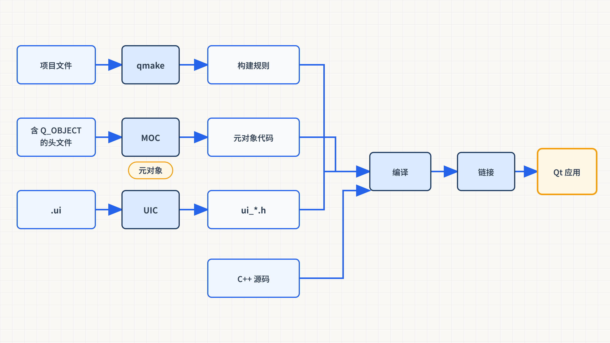
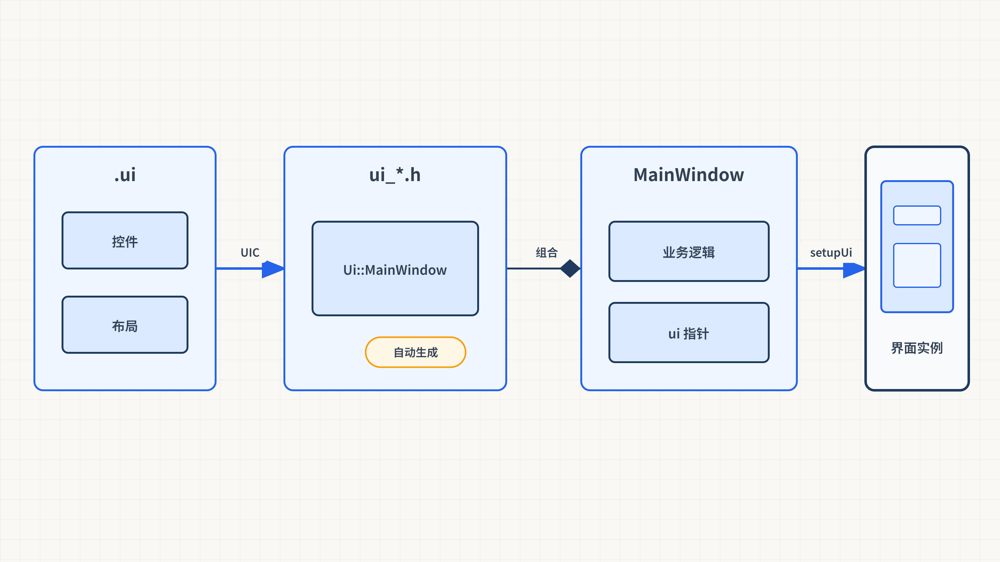
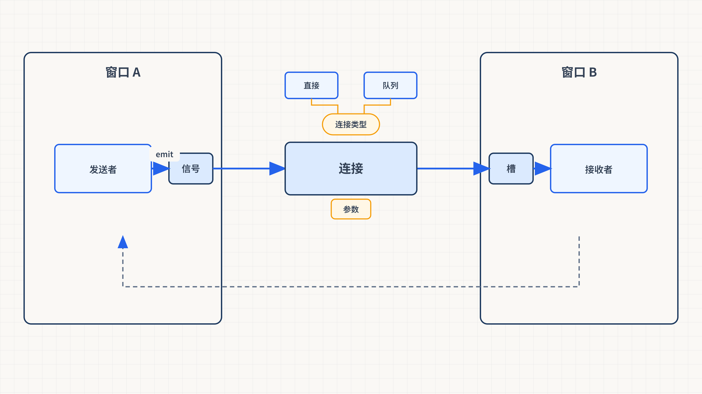

# Qt 入门
Qt 是一个**跨平台的 C++ 应用程序开发框架**，可用于 Windows、Linux、macOS、Android、iOS 等系统。除了 GUI 组件，它还提供网络、数据库、XML、多线程等模块，适合桌面、嵌入式以及部分移动端应用开发。

本章围绕三个核心主题展开，帮助读者从零开始建立对 Qt 工程结构、调试手段和对象通信机制的系统认知。

---

## 1. 建立工程 (Project Creation)
Qt 工程按界面类型可分为两大类：**Console Application**（控制台程序）和 **Widget Application**（窗口程序）。两者的核心差异在于是否加载 GUI 模块。

### 1.1 Console Application
控制台程序不依赖图形界面，适用于后台服务、命令行工具或算法验证场景。

#### 项目文件（ConsoleApp.pro）
```plain
QT -= gui
CONFIG += c++11 console
CONFIG -= app_bundle
SOURCES += main.cpp
```

+ `QT -= gui`
    - 从 Qt 模块列表中**移除** `gui` 模块
    - **原因**：控制台程序不需要图形界面支持，移除后可减小可执行文件体积
+ `CONFIG += c++11 console`
    - 启用 C++11 标准，并标记为**控制台程序**
    - _注意：_ 在 Windows 上，`console` 表示按控制台子系统构建，直接启动时通常会关联或创建控制台窗口；它不是“隐藏控制台”的选项
+ `CONFIG -= app_bundle`
    - 在 macOS 上不生成 `.app` 包，直接输出可执行文件

#### 入口代码（main.cpp）
```cpp
#include <QCoreApplication>
#include<iostream>
using namespace std;

//argc：命令行参数的数量
//argv：具体的命令行参数，字符串数组
//默认会带一个命令行参数：描述了生成的可执行文件的路径和文件名
int main(int argc, char *argv[])
{
    QCoreApplication a(argc, argv);
    for(int i=0;i<argc;i++)
    {
        cout<<"argv:"<<argv[i]<<endl;
    }
    return a.exec();  // 进入Qt事件循环
}
```

+ **QCoreApplication**
    - 控制台程序的核心管理类，负责初始化 Qt 库、解析命令行参数、管理事件循环
    - **关键点**：一个 Qt 进程通常只创建一个应用对象。控制台程序直接使用 `QCoreApplication`；GUI 程序使用它的子类 `QGuiApplication` 或 `QApplication`。
+ `argc` / `argv`
    - `argc`：命令行参数的**数量**（包含程序本身的路径）
    - `argv`：命令行参数的**字符串数组**
    - _底层机制_：Qt 在构造 `QCoreApplication` 时会解析 `argv`，提取 Qt 自身需要的参数（如 `-style`、`-geometry` 等），剩余参数仍保留在 `argv` 中供用户使用
+ `a.exec()`
    - 启动 **Qt 事件循环**（Event Loop），程序在此阻塞并持续监听事件
    - _注意：_ 即使控制台程序看似不需要事件循环，但 `exec()` 保证了信号槽、定时器等异步机制能正常工作

上面的真实 C++ 代码体现了 Qt 应用的基本生命周期：

1. 创建唯一的应用对象，由它解析 Qt 参数并初始化平台资源。
2. 调用 `a.exec()` 进入事件循环，持续等待并分派系统事件、定时器和队列信号。
3. 收到退出请求后，`exec()` 返回进程退出码。
4. `main()` 返回前，局部应用对象自动析构并完成相应清理。窗口程序还会在进入事件循环前创建业务对象、建立信号槽连接并显示顶层窗口。

#### 命令行参数示例
假设可执行文件为 `ConsoleApp.exe`，在终端执行：

```bash
./ConsoleApp.exe hello world
```

输出：

```plain
argv:./ConsoleApp.exe
argv:hello
argv:world
```

+ 在常见桌面环境中，`argv[0]` 通常是启动程序时使用的程序名或路径；不应把“始终是规范化完整路径”写进业务逻辑。
+ 常规受支持环境下 `argc` 至少包含程序名这一项。

---

### 1.2 Widget Application
窗口程序加载了完整的 GUI 模块，可以使用 Qt 提供的全部可视化组件。

#### 项目文件（WidgetApp.pro）
```plain
QT += core gui
greaterThan(QT_MAJOR_VERSION, 4): QT += widgets
SOURCES += form.cpp main.cpp mainwindow.cpp
HEADERS += form.h mainwindow.h
FORMS += form.ui mainwindow.ui
```

| 关键字 | 含义 |
| :--- | :--- |
| `QT += core gui` | 引入 `core`（核心模块）和 `gui`（图形模块） |
| `greaterThan(QT_MAJOR_VERSION, 4)` | 判断 Qt 主版本号是否大于 4 |
| `QT += widgets` | Qt5/Qt6 中窗口组件被拆分到 `widgets` 模块，需额外引入 |
| `SOURCES` | C++ 源文件列表 |
| `HEADERS` | C++ 头文件列表 |
| `FORMS` | Qt Designer 的 `.ui` 界面文件列表 |


+ **关键词**：QApplication 与 QCoreApplication
    - `QApplication` 继承自 `QCoreApplication`，在其基础上增加了**图形界面管理**能力
    - 窗口程序的 `main()` 函数使用 `QApplication`，控制台程序使用 `QCoreApplication`

#### 入口代码（main.cpp）
```cpp
#include "mainwindow.h"
#include "form.h"
#include <QApplication>

int main(int argc, char *argv[])
{
    QApplication a(argc, argv);
    MainWindow w;
    Form form;
    w.show();
    form.show();

    QObject::connect(&w, SIGNAL(signals_transNum(int)),
                     &form, SLOT(slots_showNum(int)));

    return a.exec();
}
```

+ 创建 `QApplication` 实例 → 创建窗口对象 → `show()` 显示窗口 → `a.exec()` 进入事件循环
+ **关键词**：`connect` 跨窗口信号传递：此处将 `MainWindow` 的信号连接到 `Form` 的槽函数，实现了两个独立窗口之间的数据通信，这是信号槽机制的核心应用场景之一

---

## 2. 了解各个文件 (Project Files)
一个典型的 Qt Widget 工程包含三类文件：**工程文件**（`.pro`）、**头文件与源文件**（`.h` / `.cpp`）和**界面文件**（`.ui`）。理解它们各自的角色与协作关系，是掌握 Qt 开发的基础。

### 2.1 工程文件 (.pro)
`.pro` 文件是 **qmake** 构建系统的核心配置，它告诉编译器"用哪些模块、编译哪些文件"。

> **现代 Qt 补充**：`.pro` / qmake 仍常见于既有工程和教学示例。Qt 6 新项目通常优先使用 CMake；两者都负责组织构建，MOC、UIC、编译器和链接器的基本协作关系不变。

#### 对比 ConsoleApp.pro 与 WidgetApp.pro
| 配置项 | ConsoleApp.pro（控制台） | WidgetApp.pro（窗口） |
| :--- | :--- | :--- |
| `QT` | `-= gui`（移除图形模块） | `+= core gui`（添加核心+图形） |
| `CONFIG` | `c++11 console` | _(无 console 标志)_ |
| `SOURCES` | `main.cpp` | `form.cpp main.cpp mainwindow.cpp` |
| `HEADERS` | _(无)_ | `form.h mainwindow.h` |
| `FORMS` | _(无)_ | `form.ui mainwindow.ui` |


+ **关键词**：qmake 构建流程
    - `qmake` 读取 `.pro` 文件 → 生成 `Makefile` → 调用编译器（gcc/msvc/clang）进行编译
    - `.pro` 中的每一行都是 qmake 的**变量赋值**或**条件判断**

#### 常见 .pro 关键字速查
| 关键字 | 说明 |
| :--- | :--- |
| `QT += / -=` | 添加/移除 Qt 模块（如 `core`、`gui`、`widgets`、`network`） |
| `CONFIG +=` | 添加编译器/项目配置选项 |
| `SOURCES +=` | 添加 C++ 源文件 |
| `HEADERS +=` | 添加 C++ 头文件 |
| `FORMS +=` | 添加 Qt Designer 的 `.ui` 文件 |
| `LIBS +=` | 链接外部库（如 `-lmylib`） |
| `INCLUDEPATH +=` | 添加头文件搜索路径 |
| `TARGET` | 指定生成的可执行文件名称 |


#### 弃用 API 检查

`.pro` 可以通过预处理宏在编译期阻止使用指定版本之前已经废弃的 Qt API：

```qmake
# You can make your code fail to compile if it uses deprecated APIs.
# In order to do so, uncomment the following line.
#DEFINES += QT_DISABLE_DEPRECATED_BEFORE=0x060000    # disables all the APIs deprecated before Qt 6.0.0
```

取消最后一行的注释即可启用检查。版本值应与项目的目标 Qt 版本相匹配；在较旧的 Qt 环境中启用面向 Qt 6 的限制，可能暴露较多兼容性问题。

#### 条件部署规则

```qmake
# Default rules for deployment.
qnx: target.path = /tmp/$${TARGET}/bin
else: unix:!android: target.path = /opt/$${TARGET}/bin
!isEmpty(target.path): INSTALLS += target
```

+ `qnx:` 只在 QNX 平台应用对应设置。
+ `unix:!android:` 表示 Unix 且不是 Android。
+ `$${TARGET}` 在 qmake 阶段展开为目标程序名。
+ `!isEmpty(target.path)` 在安装路径非空时把 `target` 加入 `INSTALLS`。
+ 这些规则描述安装目标和路径，不等同于自动打包全部运行库。



*图：qmake 生成构建规则，MOC 与 UIC 生成参与构建的 C++ 文件；最终仍进入普通的编译和链接阶段。*

构建过程可以按以下顺序理解：

1. qmake 读取 `.pro` 文件并生成构建规则。
2. MOC 处理需要元对象代码的类。
3. UIC 读取 `.ui` 文件并生成 `ui_*.h`。
4. 编译器编译业务源码和生成代码。
5. 链接器把目标文件与所需 Qt 模块链接为 Qt 应用程序。

---

### 2.2 mainwindow (头文件与源文件)
头文件定义了窗口类的结构，源文件实现了具体逻辑。以 `mainwindow.h` 为例：

```cpp
#include <QMainWindow>
//以Q开头的类、文件都是qt库带的文件

class MainWindow : public QMainWindow
{
    //支持信号-槽的宏
    Q_OBJECT

public:
    MainWindow(QWidget *parent = nullptr /*parent父窗口*/);
    ~MainWindow();

private slots:
    void on_pb_outtext_clicked();

public slots:
    //手动定义槽函数
    //返回类型void，函数名任意，参数和信号保持一致
    void slots_ctrlInput(int);
    void slots_onlyNumber(const QString &text);
    void slots_ctrlTime(int);

signals:
    //一个关键字修饰，不要加访问修饰符
    void signals_transNum(int num);

private:
    Ui::MainWindow *ui;  // 定义主界面的指针
};
```

#### Q_OBJECT 宏
+ **核心作用**：`Q_OBJECT` 让类拥有由 MOC 生成的元对象信息和调度代码。
+ **需要它的典型场景**：类要声明自定义信号、使用 `Q_PROPERTY`、运行时元对象查询、传统字符串式槽查找或其他依赖元对象的能力。
+ **不必机械添加**：仅仅调用 `connect()`、接收已有信号，或把普通成员函数、函数对象、Lambda 作为接收端，并不意味着该类必然需要 `Q_OBJECT`。
+ **放置位置**：通常紧跟类声明的左花括号，便于工具识别和读者定位；它不要求从文件物理意义上的“第一行”开始。

#### MOC 编译流程
```plain
mainwindow.h (含 Q_OBJECT)
       │
       ▼
   MOC 编译器
       │
       ▼
  moc_mainwindow.cpp（自动生成的元对象代码）
       │
       ▼
  与普通 .cpp 一起编译链接
       │
       ▼
  运行时元对象系统可用
  （信号槽连接、属性反射、动态类型查询）
```

+ 构建系统会对需要元对象处理的类运行 **MOC**，生成并编译相应的 C++ 元对象代码；具体文件名和合并方式会随 qmake、CMake、Qt 版本及构建配置变化。
+ `qt_static_metacall` 等函数名属于常见生成实现。理解“元对象根据方法索引完成调度”即可，不应在业务代码中依赖这些内部符号。
+ **关键词**：元对象系统三大组件
    - `QObject`：所有 Qt 对象的基类，提供 `connect()`、`disconnect()`、`children()` 等核心功能
    - `QMetaObject`：存储类的元信息（信号名、槽名、属性列表等）
    - `QMetaEnum` / `QMetaProperty`：枚举和属性的反射接口

#### signals 与 slots 关键字
| 关键字 | 说明 | 访问修饰符 |
| :--- | :--- | :--- |
| `signals:` | 声明**信号**函数 | 信号可参与连接；通常由所属类在合适的业务时机发射 |
| `public slots:` | 声明**公共槽**函数 | 也可像普通公有成员函数一样直接调用 |
| `private slots:` | 声明**私有槽**函数 | C++ 私有访问控制影响直接调用和新式成员指针的取得位置 |
| `protected slots:` | 声明**受保护槽**函数 | 遵循普通 C++ 的 protected 访问规则 |

+ _注意：_ 信号函数通常只需声明，MOC 负责生成所需实现；槽函数本质上是普通可调用函数，需要提供实现。使用新式连接时，接收端并不强制写在 `slots` 区域，普通成员函数和 Lambda 同样可以作为槽。

#### Ui 命名空间与 ui 指针
```cpp
private:
    Ui::MainWindow *ui;  // 定义主界面的指针
```

+ `Ui::MainWindow` 是由 **UIC** 工具根据 `.ui` 文件自动生成的类（定义在 `ui_mainwindow.h` 中）
+ `ui` 指针是访问 Designer 生成控件成员的**常用入口**。程序也可以保存自己的控件指针、使用 `findChild()`，或完全用代码创建界面，因此它不是语言层面的唯一访问方式。

---

### 2.3 UI界面文件 (.ui)
`.ui` 文件是 Qt Designer 生成的 **XML 格式**界面描述文件，记录了窗口的布局、组件和预设连接。

#### .ui 文件的核心结构
```xml
<ui version="4.0">
  <class>MainWindow</class>

  <widget class="QMainWindow" name="MainWindow">
    <widget class="QWidget" name="centralwidget">
      <!-- 界面上的各种组件 -->
      <widget class="QPushButton" name="pb_outtext">
        <property name="text">
          <string>输出文本</string>

        </property>

      </widget>

    </widget>

  </widget>

  <connections>
    <connection>
      <sender>pushButton</sender>

      <signal>clicked()</signal>

      <receiver>MainWindow</receiver>

      <slot>close()</slot>

    </connection>

  </connections>

</ui>

```


`.ui` 中各字段的作用：

+ 顶层 `<class>` 指定生成辅助类使用的名称；`<widget class="...">` 中的 `class` 属性才决定具体控件类型。
+ `name` 会成为对象的 `objectName`，对于生成类中公开为成员的控件，也对应常见的 `ui->对象名` 访问名。
+ `property` 保存位置、尺寸、方向和初始值等属性。
+ `QMenuBar` 可以包含 `QMenu`，菜单通过 `addaction` 引用 `QAction`；同一个动作还可以复用于工具栏或快捷键。
+ `QStatusBar` 对应 `QMainWindow` 的状态栏区域。

#### UIC 工具的作用
```plain
mainwindow.ui (XML)
       │
       ▼
   UIC 工具 (User Interface Compiler)
       │
       ▼
  ui_mainwindow.h（C++ 头文件）
       │
       ▼
  定义 Ui::MainWindow 类
  （包含所有组件指针和 setupUi 方法）
```

+ **UIC** 将 `.ui` 中的 XML 描述翻译为 C++ 代码
+ 生成的 `ui_mainwindow.h` 中包含 `Ui::MainWindow` 类，该类持有界面上每个组件的指针
+ **`setupUi(this)` 的作用**
    - 在构造函数中调用 `ui->setupUi(this)`
    - 它根据生成代码创建并配置控件树，设置对象名、属性、布局、文本以及 `.ui` 中保存的连接
    - _注意：_ `setupUi()` **必须在**使用任何 `ui->` 组件之前调用



*图：`.ui` 是设计描述，`ui_*.h` 是生成代码，`MainWindow` 保存业务逻辑并组合 `Ui::MainWindow`；不要手工修改自动生成的头文件。*

#### Designer 中的信号槽连接
`.ui` 文件的 `<connections>` 标签可以在 Qt Designer 中通过**拖拽连线**的方式建立信号槽连接：

```xml
<connections>
  <connection>
    <sender>pushButton</sender>

    <signal>clicked()</signal>

    <receiver>MainWindow</receiver>

    <slot>close()</slot>

  </connection>

</connections>

```

+ 上述 XML 等价于代码：`connect(pushButton, SIGNAL(clicked()), MainWindow, SLOT(close()))`
+ _注意：_ Designer 连接在 `setupUi()` 执行时自动生效，无需手动编写 `connect()` 语句
+ **关键词**：Designer 连接 vs 代码连接
    - Designer 连接适合**简单的、固定的**信号槽绑定（如按钮关闭窗口）
    - 代码连接适合**动态的、有条件**的绑定（如根据运行状态切换连接目标）

---

## 3. 调试输出 (Debug Output)
在 Qt 开发中，有三种常用的调试输出方式：**qDebug**（控制台输出）、**QString**（格式化字符串）和 **QMessageBox**（弹窗提示）。

### 3.1 qDebug
`qDebug()` 是 Qt 提供的**调试信息输出流**，用法类似于 `cout`，但专为 Qt 类型优化。

#### 基本用法
```cpp
// qDebug()<<== cout<<
qDebug()<<"我点击了按钮";

qDebug()<<"pp:"<<pp;

qDebug()<<"slots_ctrlInput(int)"<<state;
```

#### qDebug 与 cout 对比
| 特性 | `qDebug()` | `cout` |
| :--- | :--- | :--- |
| 头文件 | `<QDebug>` (Qt) | `<iostream>` (STL) |
| 支持 Qt 类型 | 原生支持 `QString`、`QList` 等 | 不支持，需手动转换 |
| 输出目标 | 默认 `stderr`（标准错误流） | `stdout`（标准输出流） |
| 可关闭 | Release 模式下可通过宏禁用 | 需手动移除或条件编译 |
| 操作符 | `<<`（自动添加空格分隔） | `<<`（不自动添加空格） |


+ **关键词**：qDebug 自动添加空格
    - `qDebug()<<"a"<<1` 输出 `a 1`（中间有空格）
    - `cout<<"a"<<1` 输出 `a1`（无空格）
+ _注意：_ 在 Release 构建中，可通过在 `.pro` 文件中添加 `DEFINES += QT_NO_DEBUG_OUTPUT` 来全局关闭 `qDebug` 输出

---

### 3.2 QString
**QString** 是 Qt 对字符串的封装类，提供了远比 `std::string` 丰富的操作接口。以下按常用操作逐一讲解。

#### 初始化与基本操作
```cpp
QString qstr="123";
```

+ 支持直接用字符串字面量赋值
+ 内部使用 **Unicode（UTF-16）** 编码，天然支持中文等多语言字符

#### QString ↔ std::string ↔ const char* 转换
```cpp
QString qstr="123";

//转换为string
string str=qstr.toStdString();
cout<<"str:"<<str<<endl;

//转换为c风格字符串
const char *pp=str.c_str();
qDebug()<<"pp:"<<pp;

str="abc";
qstr=qstr.fromStdString(str);
qDebug()<<"qstr:"<<qstr;
```

| 转换方向 | 方法 | 示例 |
| :--- | :--- | :--- |
| `QString` → `std::string` | `.toStdString()` | `string str = qstr.toStdString();` |
| `std::string` → `const char*` | `.c_str()` | `const char *pp = str.c_str();` |
| `std::string` → `QString` | `QString::fromStdString()` | `qstr = QString::fromStdString(str);` |
| `QString` → `const char*` | 先转 `string` 再 `.c_str()` | 需两步完成 |
| `const char*` → `QString` | 直接赋值或构造 | `QString qstr = "hello";` |


+ **关键词**：编码问题
    - `toStdString()` 默认转换为 **UTF-8** 编码
    - 在 Windows 的 MSVC 编译器中，如果源文件编码不是 UTF-8，中文输出可能乱码
    - _原因_：MSVC 默认使用系统本地编码（GBK），而 `QString` 内部为 UTF-16

#### sprintf 格式化
```cpp
//sprintf()
qstr.sprintf("%d-%c-%s", 456, 'a', pp);
qDebug()<<"qstr:"<<qstr;
// 输出：qstr: 456-a-123
```

+ `sprintf()` 用法与 C 语言的 `sprintf` 完全一致
+ _注意：_ `QString::sprintf()` 在后期 Qt 5 中已被弃用，并在 Qt 6 中移除；新代码优先使用 `arg()`、`asprintf()` 或其他类型安全的格式化方式。

#### arg() 格式化替换
`arg()` 是 Qt 特有的格式化方法，使用 `%数字` 作为占位符：

```cpp
//arg: %数字，进行格式化替换
qstr="%1  %2  -  %3";
qstr=qstr.arg(45).arg("abc").arg(3.14);
qDebug()<<"qstr:"<<qstr;
// 输出：qstr: 45  abc  -  3.14
```

+ 基本用法：`%1`、`%2`、`%3` ... 依次对应每次 `arg()` 调用的参数
+ `arg()` 支持多种类型：`int`、`double`、`char`、`QString` 等

#### arg() 的高级行为
```cpp
//数字从小到大依次进行替换，替换%后的数字最多两位
qstr=QString("%23 %6  %789").arg(44).arg("qwer").arg('o');
qDebug()<<"qstr:"<<qstr;
// 输出：qstr: qwer 44  o9
```

+ **<font style="color:#df2a3f;">关键词</font>**<font style="color:#df2a3f;">：</font>`<font style="color:#df2a3f;">arg()</font>`<font style="color:#df2a3f;"> 占位符解析规则——</font>`<font style="color:#df2a3f;">%</font>`<font style="color:#df2a3f;"> 后最多识别两位数字</font>
+ **占位符范围**：`QString::arg()` 使用 `%1` 到 `%99` 形式的占位符，编号不要求从 `%1` 开始或连续出现。
+ **解析过程**：
    - `arg()` 从 `%` 开始向后扫描，最多取两位数字作为占位符编号。
    - `%23` 是一个完整的占位符，编号为 23，不能解析成 `%2` 加普通字符 `3`。
    - `%6` 是编号 6 的占位符。
    - `%789` 被解析为编号 78 的占位符 `%78` 加普通字符 `9`。
+ **底层替换规则**：连续调用单参数 `arg()` 时，每次替换当前字符串中编号最小的未替换占位符，而不是机械地只查找 `%1`；同一编号如果出现多次，本次调用会替换它的所有出现位置。
+ 正确解读输出：
    - 原始：`%23 %6  %789`
    - `.arg(44)` → 替换最小编号 `%6` → `%23 44  %789`
    - `.arg("qwer")` → 替换下一个最小编号 `%23` → `qwer 44  %789`
    - `.arg('o')` → 替换下一个最小编号 `%78` → `qwer 44  o9`

#### indexOf() 子串查找
```cpp
//indexOf():查找子串，找到则返回子串开始位置，没找到返回-1
qstr="12345678";
qDebug()<<"45 index:"<<qstr.indexOf("45");
// 输出：45 index: 3
qDebug()<<"ab index:"<<qstr.indexOf("ab");
// 输出：ab index: -1
```

+ 找到子串：返回子串**首次出现**的起始索引（从 0 开始）
+ 未找到：返回 `-1`

#### split() 字符串分割
```cpp
//按要求分割字符串
qstr="wo shi yi ge lao shi";
QStringList qlist=qstr.split(" ");
for(QString s:qlist) { qDebug()<<s; }
```

输出：

```plain
wo
shi
yi
ge
lao
shi
```

+ `split()` 按指定分隔符将字符串切分为 **QStringList**（字符串列表）
+ 支持范围 for 循环遍历
+ **关键词**：QStringList 是 `QList<QString>` 的便捷别名，支持 `append()`、`join()`、`filter()` 等列表操作

#### QString 拼接方式速查
| 方式 | 示例 | 说明 |
| :--- | :--- | :--- |
| `+` | `qstr = a + b` | 生成新字符串，不修改原串 |
| `+=` | `qstr += "abc"` | 在原串末尾追加 |
| `append()` | `qstr.append("abc")` | 等价于 `+=` |
| `prepend()` | `qstr.prepend("abc")` | 在原串**头部**插入 |


---

### 3.3 QMessageBox
**QMessageBox** 提供了四种标准弹窗，用于向用户展示信息或获取确认。

#### 四种标准弹窗
```cpp
// 信息弹窗
QMessageBox::information(this, "标题", "这是一条普通信息");

// 警告弹窗
QMessageBox::warning(this, "标题", "这是一条警告信息");

// 错误弹窗
QMessageBox::critical(this, "标题", "这是一条错误信息");

// 询问弹窗（带按钮返回值）
QMessageBox::StandardButton btn = QMessageBox::question(this, "确认", "确定要删除吗？",
    QMessageBox::Yes | QMessageBox::No);
if(btn == QMessageBox::Yes) {
    qDebug()<<"用户选择了Yes";
}
```

| 方法 | 图标 | 用途 |
| :--- | :--- | :--- |
| `information()` | ℹ️ 蓝色信息图标 | 展示普通提示信息 |
| `warning()` | ⚠️ 黄色警告图标 | 展示警告信息 |
| `critical()` | ❌ 红色错误图标 | 展示严重错误信息 |
| `question()` | ❓ 问号图标 | 提问并获取用户选择 |


+ 所有弹窗方法的**第一个参数**为父窗口指针（`this`），用于设定弹窗的所属窗口
+ **关键词**：`question()` 的返回值
    - 返回 `QMessageBox::StandardButton` 枚举值
    - 常用值：`QMessageBox::Yes`、`QMessageBox::No`、`QMessageBox::Cancel`、`QMessageBox::Ok`

---

## 4. 信号与槽 (Signals & Slots)
**信号与槽**（Signals & Slots）是 Qt 的核心通信机制，用于对象之间的松耦合协作。发送者只描述“发生了什么”，连接记录决定通知哪些接收端；接收端专注于响应逻辑。这种设计与观察者模式相似，同时还整合了对象生命周期和事件循环。



*图：连接把信号路由到兼容的槽；直接连接立即调用，队列连接则把调用投递到接收者所在线程的事件循环。*

### 4.1 快速添加信号槽
Qt 提供了三种快速建立信号槽连接的方式，从最简单到最灵活依次排列。

#### 方式一：自动连接（命名规则）
Qt 的 **UIC 工具**会根据槽函数的命名规则，自动建立信号与槽的连接，无需手动编写 `connect()` 语句。

```cpp
//通过函数名绑定链接
//名字格式：on_信号发送者的对象名_信号的函数名
void MainWindow::on_pb_outtext_clicked()
{
    // qDebug()<<== cout<<
    qDebug()<<"我点击了按钮";
}
```

+ **关键词**：自动连接命名规则
    - 格式：`on_` + **对象名** + `_` + **信号名**
    - 示例：`on_pb_outtext_clicked` → 对象名为 `pb_outtext`，信号为 `clicked()`
+ _底层机制_：`setupUi()` 在内部调用 `QMetaObject::connectSlotsByName()`，扫描所有槽函数名，自动匹配对应的信号
+ _注意：_
    - 对象名必须与 `.ui` 文件中组件的 `name` 属性**完全一致**
    - 槽函数必须声明在 `private slots:`、`public slots:` 或 `protected slots:` 区域
    - 自动连接**不受访问修饰符限制**

#### 方式二：Qt Designer 可视化连接
在 Qt Designer 中，可以通过**拖拽连线**的方式建立信号槽连接，连接信息保存在 `.ui` 文件的 `<connections>` 标签中：

```xml
<connections>
  <connection>
    <sender>pushButton</sender>

    <signal>clicked()</signal>

    <receiver>MainWindow</receiver>

    <slot>close()</slot>

  </connection>

</connections>

```

+ 上述连接表示：点击 `pushButton` → 调用 `MainWindow` 的 `close()` 槽
+ _注意：_ Designer 连接**只能**连接已存在的槽函数（包括 Qt 内置槽和自定义槽）
+ 这些连接在 `setupUi()` 执行时自动生效

#### 方式三：UI 组件直接连接
两个 UI 组件之间可以直接通过 `connect()` 建立连接，无需经过中间槽函数：

```cpp
//滑块和进度条绑定：valueChanged(int value)->进度条 setValue(int)
QObject::connect(ui->horizontalSlider, SIGNAL(valueChanged(int)),
                ui->progressBar, SLOT(setValue(int)));
```

+ 滑块的 `valueChanged(int)` 信号直接驱动进度条的 `setValue(int)` 槽
+ **参数规则**：信号提供的参数数量必须不少于槽需要的参数数量，对应位置的类型必须兼容。槽可以忽略信号末尾的多余参数；默认参数不会由连接机制自动补入。
+ 这种方式最为简洁，适用于"一个组件的状态直接映射到另一个组件"的场景

---

### 4.2 自定义信号槽
当自动连接和 Designer 连接无法满足需求时，需要手动定义信号和槽，并通过 `connect()` 建立绑定。

#### 定义信号
```cpp
signals:
    //一个关键字修饰，不要加访问修饰符
    void signals_transNum(int num);
```

+ `signals:` 是 Qt 扩展的**关键字**，不需要也不可以添加 `public`/`private`/`protected`
+ **关键词**：信号函数只需声明，不需要实现
    - MOC 编译器会自动生成信号函数的实现代码
    - 当信号被发射时，Qt 会遍历有效连接：直接连接立即调用接收端，队列连接则把调用投递到接收者线程的事件循环

#### 定义槽函数
```cpp
public slots:
    //手动定义槽函数
    //返回类型void，函数名任意，参数和信号保持一致
    void slots_ctrlInput(int);
    void slots_onlyNumber(const QString &text);
    void slots_ctrlTime(int);
```

+ 使用传统字符串连接或自动连接时，常把槽声明在 `public slots:`、`private slots:` 等区域。使用新式函数指针连接时，普通成员函数也可以作为接收端，不强制使用 `slots` 关键字。
+ 槽需要的参数不能多于信号提供的参数，对应参数类型必须兼容；槽可以省略信号末尾的参数。
+ 槽函数的返回类型通常为 `void`（返回值在信号槽机制中会被忽略）

#### 手动绑定连接（SIGNAL/SLOT 宏方式）
```cpp
//信号：stateChanged(int)
//手动绑定链接
//一定要在使用之前绑定链接
//所有窗口上的东西都是通过ui->调用（都在Ui::MainWindow中）
QObject::connect(ui->checkBox, SIGNAL(stateChanged(int)),
    this, SLOT(slots_ctrlInput(int)));

QObject::connect(ui->lineEdit, SIGNAL(textChanged(const QString &)),
    this, SLOT(slots_onlyNumber(const QString &)));

//滑块和时间绑定
QObject::connect(ui->horizontalSlider, SIGNAL(valueChanged(int)),
                 this, SLOT(slots_ctrlTime(int)));
```

+ `connect()` 四参数格式：`connect(发送者, SIGNAL(信号), 接收者, SLOT(槽))`

**调用格式（使用注释说明四个参数的位置）：**

```cpp
QObject::connect(
    /* 信号的发出者 */,
    /* SIGNAL(信号函数名(参数类型))，形参名去掉 */,
    /* 接收者 */,
    /* SLOT(槽函数名(参数类型)) */
);
```

+ **关键词**：`SIGNAL()` 和 `SLOT()` 宏的本质
    - `SIGNAL(stateChanged(int))` 展开为字符串 `"2stateChanged(int)"`（前缀 `2` 表示信号）
    - `SLOT(slots_ctrlInput(int))` 展开为字符串 `"1slots_ctrlInput(int)"`（前缀 `1` 表示槽）
    - _底层机制_：`connect()` 在运行时通过字符串匹配，在发送者和接收者的**元对象**（`QMetaObject`）中查找对应的函数索引
+ _注意：_ 如果信号和槽的参数类型不匹配，`connect()` 会在控制台输出**运行时警告**（不会编译报错）

#### 槽函数实现
```cpp
void MainWindow::slots_ctrlInput(int state){
    qDebug()<<"slots_ctrlInput(int)"<<state;
    //0：取消勾选  2：勾选
    if(state==0)
        ui->lineEdit->setDisabled(false);
    else if(state==2)
        ui->lineEdit->setDisabled(true);
}
```

+ `QCheckBox` 的 `stateChanged(int)` 信号参数含义：
    - `0`（`Qt::Unchecked`）：取消勾选
    - `1`（`Qt::PartiallyChecked`）：半选状态（三态复选框）
    - `2`（`Qt::Checked`）：勾选

```cpp
void MainWindow::slots_onlyNumber(const QString &text){
    qDebug()<<"slots_onlyNumbe"<<text;
    if(!text.isEmpty())
    {
        QString sub=text.right(1);
        if("0"<=sub&&sub<="9"){
            qDebug()<<sub<<"合法";
        }
        else
        {
            sub=text.left(text.size()-1);
            ui->lineEdit->setText(sub);
        }
    }
}
```

+ 该槽函数实现了**输入限制**：只允许输入数字字符
+ 每次 `textChanged` 信号触发时，检查最新输入的字符是否为数字
+ 如果不是数字，移除最后一个字符并重新设置文本

```cpp
void MainWindow::slots_ctrlTime(int val)
{
    QTime time(0,0,0);
    time=time.addSecs(6*6*24*val);
    ui->timeEdit->setTime(time);
}
```

+ 根据滑块值计算时间偏移，驱动 `QTimeEdit` 组件显示对应时间

+ `setRange(0,100)` 用于限定滑块输入范围。
+ 同一个 `valueChanged(int)` 信号既可以连接 `QProgressBar::setValue(int)`，也可以连接 `slots_ctrlTime(int)`，体现一个信号可以驱动多个槽。
+ `setDisplayFormat("hh:mm-ss")` 控制时间组件的显示格式，`addSecs()` 负责计算时间偏移，`setTime()` 将结果更新到界面。

---

### 4.3 主动触发（发射）信号
`emit` 是用于标示信号发射位置的 Qt 宏。

+ 语法格式：`emit 信号名(实际参数);`
+ 本质：`emit` 在 Qt 源码（`qobjectdefs.h`）中实际上是一个**空宏**（定义为 `#define emit`），它在预处理阶段会被直接替换为空，**不产生任何实际的机器代码**。
+ 作用：纯粹是为了**提高代码的可读性**。它作为一个视觉标记，明确告诉阅读代码的开发者：“这里正在发射一个信号”，而不是在调用一个普通的成员函数。

示例代码：

```cpp
// 1. 在类中声明信号
signals:
    void dataReady(int value);

// 2. 在类的普通成员函数中主动触发
void MainWindow::onProcessFinished() {
    int result = 100;
    // 使用 emit 主动发射信号，由 Qt 按连接类型通知接收端
    emit dataReady(result); 
}
```

核心规则与注意事项：

+ **语法等价性**：`emit` 通常展开为空，因此 `emit dataReady(result);` 与 `dataReady(result);` 的调用语义相同。保留 `emit` 能提高可读性，但它不是强制语法，也不会改变连接类型。
+ **封装建议**：信号在 C++ 层面是可调用成员，`emit` 本身不提供额外访问控制。为了维护类不变量，通常由所属类在公开业务方法内部决定何时发射信号，而不是让外部代码随意调用信号函数。
+ **参数规则**：调用信号函数时，实参必须满足普通 C++ 函数调用规则。信号投递到槽时，再按连接兼容规则处理槽可接收的参数。

信号发射后的处理顺序可以这样理解：

1. Qt 查找发送者上与该信号匹配且仍然有效的连接；接收者销毁时，相应连接会自动断开。
2. 对直接连接，Qt 会立即调用兼容的槽并传递所需参数。
3. 对队列连接，Qt 会复制调用所需的参数并把事件投递到接收者线程的事件队列，由该线程的事件循环稍后调用槽。
4. 信号函数返回时，直接调用已经完成；队列调用可能仍在等待处理。

---

### 4.4 信号与槽的对应关系
信号与槽之间存在四种对应关系：

#### 四种关系
| 关系 | 说明 | 示例 |
| :--- | :--- | :--- |
| **一对一** | 一个信号连接一个槽 | 按钮 `clicked()` → 自定义槽函数 |
| **一对多** | 一个信号连接多个槽 | 滑块 `valueChanged()` → 进度条 + 时间显示 |
| **多对一** | 多个信号连接同一个槽 | 多个按钮的 `clicked()` → 同一个处理函数 |
| **信号连接信号** | 一个信号触发另一个信号 | `spinBox` 的 `valueChanged()` → `signals_transNum()` |


> **理解边界**：`connect()` 的源端必须是信号，不能把普通槽函数直接当成信号源；普通函数之间当然仍可使用常规 C++ 调用。

#### 一对多示例
下面让滑块同时连接进度条和时间显示：

```cpp
//滑块 → 进度条
QObject::connect(ui->horizontalSlider, SIGNAL(valueChanged(int)),
                ui->progressBar, SLOT(setValue(int)));

//滑块 → 时间槽函数
QObject::connect(ui->horizontalSlider, SIGNAL(valueChanged(int)),
                 this, SLOT(slots_ctrlTime(int)));
```

+ 同一个 `valueChanged(int)` 信号被连接到了两个不同的槽
+ 当滑块值改变时，进度条和时间**同时**更新

#### 信号连接信号
```cpp
//主窗口spinbox组件和主窗口本身的signals_transNum信号进行连接
//void valueChange(int)->void signals_transNum(int num);
QObject::connect(ui->spinBox, SIGNAL(valueChanged(int)),
                 this, SIGNAL(signals_transNum(int)));
```

+ **关键词**：信号可以连接到另一个信号
+ 当 `spinBox` 的值改变时，触发 `MainWindow` 自身的 `signals_transNum(int)` 信号
+ `SIGNAL()` 宏可以出现在 `connect()` 的**第四个参数**位置，用目标信号代替 `SLOT()`；第三个参数仍是接收对象
+ _底层机制_：信号连接信号时，当源信号被发射，MOC 会"转发"调用目标信号，再由目标信号触发其已连接的槽

#### 跨窗口信号传递
```cpp
// main.cpp
QObject::connect(&w, SIGNAL(signals_transNum(int)),
                 &form, SLOT(slots_showNum(int)));
```

```cpp
// form.cpp
void Form::slots_showNum(int num) {
    qDebug()<<"num:"<<num;
    ui->lcdNumber->display(num);
}
```

+ 完整信号传递链路：`spinBox 值改变` → `MainWindow::signals_transNum(int)` → `Form::slots_showNum(int)` → `lcdNumber 显示数字`
+ **关键词**：跨窗口通信
    - 信号与槽不要求发送者和接收者在同一个类中
    - 声明信号的发送者通常是带元对象能力的 `QObject` 子类；接收端可以是兼容成员函数、普通函数或 Lambda，具体取决于连接重载
    - 建立连接时仍需要获得对象地址，但发送者无需了解接收者的业务接口，从而降低类之间的直接依赖

---

### 4.5 信号槽断开连接
使用 `disconnect()` 可以断开已建立的信号槽连接。

#### disconnect() 的用法
```cpp
// 断开特定连接
QObject::disconnect(ui->horizontalSlider, SIGNAL(valueChanged(int)),
                    ui->progressBar, SLOT(setValue(int)));

// 断开发送者的所有连接
QObject::disconnect(ui->horizontalSlider);

// 断开与特定接收者的所有连接
QObject::disconnect(ui->horizontalSlider, 0, ui->progressBar, 0);
```

| 用法 | 说明 |
| :--- | :--- |
| `disconnect(发送者, SIGNAL(信号), 接收者, SLOT(槽))` | 断开**指定的**一条连接 |
| `disconnect(发送者)` | 断开发送者的**所有**信号连接 |
| `disconnect(发送者, 0, 接收者, 0)` | 断开发送者与接收者之间的**所有**连接 |


#### 何时需要断开
+ **QObject 自动清理**：`QObject` 销毁时会自动移除以它为发送者或接收者的连接，因此普通对象间连接通常不需要在析构前手动断开。
+ **函数对象的上下文**：连接到捕获外部状态的 Lambda 时，应提供合适的 context object；上下文销毁后连接会自动失效，避免捕获内容悬空。
+ **临时禁用响应**：在某些业务场景中需要临时屏蔽信号响应
    - 例如：在程序内部修改 `lineEdit` 文本时，不希望触发 `textChanged` 信号的槽函数
+ **动态切换逻辑**：根据运行状态切换不同的槽函数
    - 先 `disconnect` 旧槽，再 `connect` 新槽

### 4.6 Qt5 新式连接语法（补充）
Qt 5 引入的**新语法（基于函数指针）** 彻底改变了信号和槽的绑定方式。它抛弃了宏（`SIGNAL` 和 `SLOT`），直接使用 C++ 的成员函数指针，从而实现了编译期的类型检查。

#### 新语法调用格式
除了使用 `SIGNAL()`/`SLOT()` 宏方式，Qt5 引入了**函数指针**方式，对应旧语法的 `connect(发送者, SIGNAL(信号), 接收者, SLOT(槽))`，新语法的标准格式如下：

```cpp
connect(发送者指针, &发送者类名::信号名, 接收者指针, &接收者类名::槽函数名);
```

| 对比项 | `SIGNAL()`/`SLOT()` 宏 | 函数指针方式 |
| :--- | :--- | :--- |
| 类型检查 | **运行时**检查（参数不匹配只警告） | **编译期**检查（参数不匹配直接报错） |
| 支持 Lambda | 不支持 | 支持 |
| 可读性 | 较直观，信号/槽标识清晰 | 需写完整类名和作用域 |
| 连接检查 | 在运行期解析字符串签名，失败时输出警告 | 编译期检查成员与参数兼容性 |


+ **关键词**：推荐在 Qt5/Qt6 项目中使用函数指针方式，可以在编译阶段发现参数不匹配的错误

---

#### 具体示例
##### 示例 A：基础绑定（替代旧语法）
假设你有一个输入框 `m_searchBox`，当文本改变时，触发主窗口的 `onSearchChanged` 槽函数。

**旧语法：**

```cpp
connect(m_searchBox, SIGNAL(textChanged(QString)), this, SLOT(onSearchChanged(QString)));
```

**新语法：**

```cpp
// 直接使用类的成员函数指针
connect(m_searchBox, &QLineEdit::textChanged, this, &MainWindow::onSearchChanged);
```

_注：新语法不需要在宏字符串中重复参数类型。只要信号参数能够满足槽所需参数，编译器就能检查连接；槽可以忽略信号末尾的参数。_

##### 示例 B：绑定到 Lambda 表达式（新语法）
新语法最强大的地方在于它允许你直接把一段简短的代码块（Lambda）作为槽函数，而不需要在头文件里专门声明一个 `private slot:`。

```cpp
// 当点击按钮时，直接执行 Lambda 表达式里的代码
connect(ui->btnSubmit, &QPushButton::clicked, this, [this]() {
    qDebug() << "按钮被点击了，执行一些简单的逻辑...";
    this->processData();
});
```

_注：传入 _`this`_ 作为上下文对象（Context Object）非常重要。这意味着当 _`this`_（当前窗口）被销毁时，这个 Lambda 连接会自动断开，防止发生“野指针”崩溃。_

##### 示例 C：处理重载信号（Overloaded Signals）
在 Qt 5 的相关 API 中，有些信号提供多个重载版本，例如 `QComboBox::currentIndexChanged` 曾同时提供索引与文本版本。旧语法通过字符串参数列表区分；新语法取得重载成员指针时，需要用 `QOverload` 或 `static_cast` 指定版本。Qt 6 的部分信号集合已经调整，迁移时应以目标版本头文件为准。

**旧语法：**

```cpp
connect(comboBox, SIGNAL(currentIndexChanged(int)), this, SLOT(onIndexChanged(int)));
```

**新语法（使用 QOverload）：**

```cpp
// 明确告诉编译器，我要绑定的是接收 int 参数的那个版本
connect(comboBox, QOverload<int>::of(&QComboBox::currentIndexChanged), 
        this, &MainWindow::onIndexChanged);
```

##### 示例 D：绑定到普通全局函数或静态函数
新语法不仅能绑定类的成员函数，还能绑定普通的 C++ 函数。

```cpp
void myGlobalLogger(const QString& text) {
    qDebug() << "Logger:" << text;
}

// 将信号绑定到全局函数
connect(m_searchBox, &QLineEdit::textChanged, myGlobalLogger);
```

---

#### 为什么强烈推荐使用新语法？
1. **编译期检查（最重要）：**
    - 如果你把 `textChanged` 拼错成了 `textChange`，旧语法在编译时**完全不会报错**，只会在运行时在控制台输出一行警告，导致功能失效。
    - 新语法会在**编译时直接报错**（`Error: textChange is not a member of QLineEdit`），让你立刻发现拼写错误。
2. **支持 Lambda 表达式：** 让代码更内聚，避免了为了一行日志或简单的状态切换而专门去写一个槽函数，让头文件变得臃肿。
3. **更好的 IDE 支持：** 因为是标准的 C++ 语法，Qt Creator、CLion、Visual Studio 等 IDE 可以提供完美的代码跳转（Ctrl+Click）、重命名（Refactor）和代码补全。旧语法的字符串宏让 IDE 很难追踪代码流向。
4. **生命周期更清晰：** 连接 Lambda 时可以显式提供上下文对象，使 Qt 在上下文销毁后自动断开。默认参数不会由信号槽系统自动补齐，槽所需参数仍必须由信号提供。

---

_本章小结_：Qt 工程的核心知识体系可概括为——**工程结构**（.pro / .h / .cpp / .ui 四类文件的协作）、**调试手段**（qDebug / QString / QMessageBox 三种输出方式）和**通信机制**（信号与槽的四种连接方式和四种对应关系）。掌握这三块内容，即可进入 Qt 的实际项目开发阶段。

---
