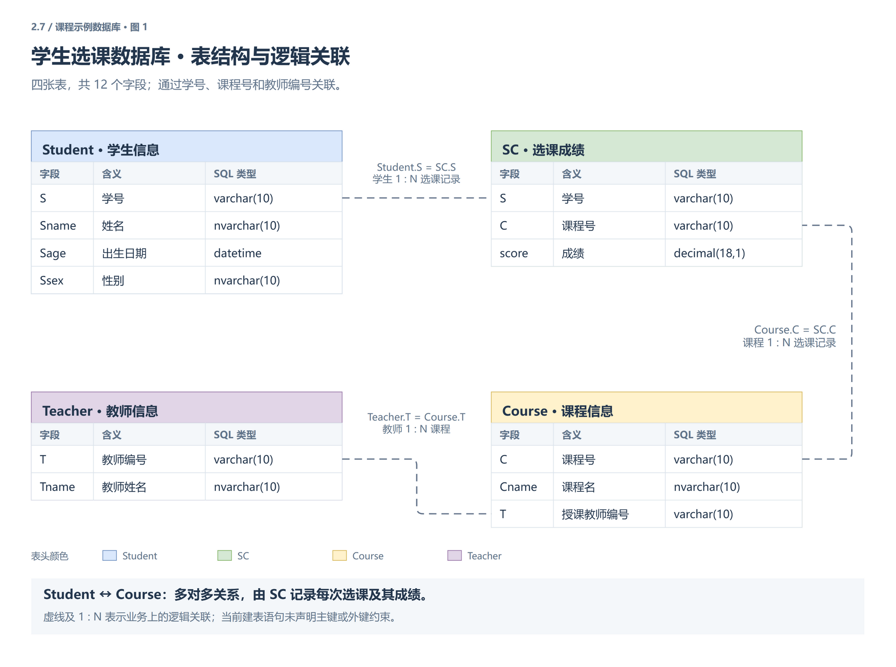
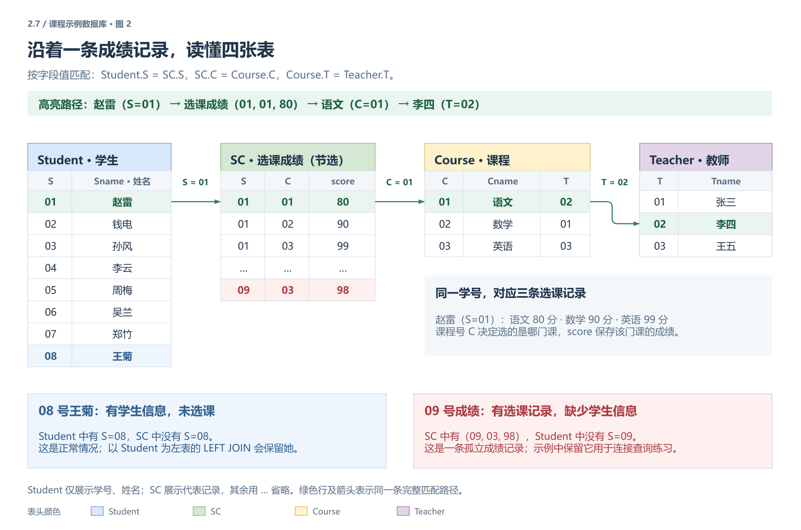

# 一、数据库基础与SQL入门
## 1.1 数据库可视化工具 (Database GUI Tools)
### 1.1.1 为什么需要可视化工具
数据库服务端运行在后台，用户无法直接"看到"数据。可视化工具（如 Navicat、MySQL Workbench 等）充当**客户端**，以图形化方式展示和管理数据库中的数据。

+ **服务端**：数据库引擎本身，负责存储、计算和管理数据
    - 不同的客户端可以以不同方式连接和展示服务端数据
    - 工作中使用可视化工具主要是为了**更方便地查看和操作数据**
+ **客户端**：连接到服务端的工具，提供可视化界面
    - 安装后需要配置连接信息才能使用

常见的 MySQL 可视化工具还包括 DBeaver（开源跨平台）、DataGrip（JetBrains 出品）、HeidiSQL（轻量免费）等。不同工具界面各异，但核心操作逻辑一致。

### 1.1.2 连接配置
打开可视化工具后，需要创建一个**连接**来访问数据库服务器。连接配置包含以下关键信息：

| 配置项 | 说明 | 示例 |
| :--- | :--- | :--- |
| **用户名** | 登录数据库的用户，安装时创建的 `root` 是超级管理员 | `root` |
| **密码** | 安装数据库时设置的密码，务必牢记 | 安装时自定义 |
| **主机地址** | 数据库服务器所在的 IP 地址 | `127.0.0.1`（本机） |
| **端口号** | 数据库服务监听的端口 | `3306`（MySQL 默认） |


+ **root 用户**：相当于数据库的"国王"，拥有最高权限，可以创建其他用户并分配权限
    - 可以创建普通用户，并为其分配**只读权限**（只能查看数据）或**修改权限**（可以修改数据）
    - 普通用户能做什么，完全取决于 root 分配的权限
+ **主机地址说明**：`127.0.0.1` 代表本机（localhost）。如果数据库安装在另一台电脑上，只要两台电脑网络互通，就可以用对方的 IP 地址进行远程连接
+ **端口号说明**：MySQL 默认端口是 `3306`，安装时可以修改为其他端口（如 `3307`），连接时端口号必须与服务端一致

### 1.1.3 连接状态判断
进入工具后，右侧面板显示数据库的管理界面：

+ **连接成功**：状态栏显示绿色图标，表示客户端与服务端正常通信
+ **连接失败**：状态栏显示**红色**图标，表示客户端未连上服务器，需要检查配置

连接失败时的常见排查步骤：
+ 确认数据库服务是否已启动（Windows 可在"服务"中查看 MySQL 服务状态）
+ 检查主机地址和端口号是否正确
+ 确认用户名和密码无误（注意大小写）
+ 检查防火墙是否拦截了数据库端口

---

## 1.2 数据库核心概念 (Core Concepts)
### 1.2.1 数据库、表与数据的关系
数据库的组织结构可以类比为**仓库管理系统**：

+ **数据库 (Database)** — 类比为一个**仓库**
    - 一个数据库中可以存放多张表
    - 数据库是数据的**隔离单位**：不同数据库之间互不影响
+ **表 (Table)** — 类比为仓库中的**货架**
    - 每张表存储一类相关的数据（如学生信息、订单信息等）
    - 同一个数据库内的**表名不能重复**（因为所有数据都通过名字查找）
    - 不同数据库中的表名**可以相同**（因为跨库隔离）
        * 例如：`test_db1.student` 和 `test_db2.student` 是两张不同的表
+ **数据 (Data)** — 类比为货架上的**货物**
    - 数据按行（记录）和列（字段）组织在表中

在关系型数据库中，表中的每一**行**称为一条**记录**（Record），每一**列**称为一个**字段**（Field/Column）。行与列的交叉点即为一个具体的数据值。

### 1.2.2 库名与表名的引用规则
访问数据时采用**先找库、再找表**的方式：

+ **完整引用**：`库名.表名`，明确指定数据库和表
+ **省略库名**：如果已设置了**默认数据库**，可以省略库名，直接使用表名
    - 当没有指定库名时，系统会自动到默认数据库中查找
    - 如果默认数据库中找不到该表，则报错

---

## 1.3 SQL 语句使用规范 (SQL Conventions)
### 1.3.1 基本规则
+ **注释**：使用 `#` 或 `--` 进行单行注释
+ **语句结尾**：每条 SQL 语句以**分号** `;` 结尾
+ **符号要求**：所有标点符号必须是**英文半角**（包括逗号、括号、单引号、双引号等）
    - 中文逗号和英文逗号外观相似但不同，写错会导致语法错误

关于注释：
+ `#` 是 MySQL 特有的单行注释语法
+ `-- ` 是 SQL 标准的单行注释语法（注意：`--` 后面必须跟一个**空格**，否则部分数据库不识别）
+ `/* ... */` 是多行注释（块注释），可跨越多行，所有主流数据库均支持

### 1.3.2 执行方式
在可视化工具中，执行 SQL 语句有以下几种方式：

| 操作 | 说明 |
| :--- | :--- |
| **闪电按钮** | 选中一条或多条 SQL 语句后点击，执行选中的语句 |
| **不选中 + 闪电** | 不选中任何语句时，从文件开头执行所有语句，直到结尾或遇到报错 |
| **带光标的闪电** | 执行光标当前所在行的那条 SQL 语句 |


+ _注意_：如果一条"创建表"语句执行成功后再次执行，会因为**表名重复**而报错。解决方式：
    - 只选中需要执行的语句再点击执行
    - 或者使用 `if not exists` / `if exists` 语法（后文详述）

---

## 1.4 创建与使用数据库 (Create & Use Database)
### 1.4.1 创建数据库
```sql
-- 语法：create database 库名;
create database sqlstudy;
```

+ 设置**字符编码**：建库时选择 `utf8mb4` 编码（支持中文和特殊字符）
    - 如果工具提供下拉框选择编码，选择 `utf8mb4` 或 `utf8`

`utf8mb4` 与 `utf8` 的区别：MySQL 中的 `utf8` 实际是 `utf3`（最多存储 3 字节字符），无法表示 emoji 等 4 字节字符；`utf8mb4` 才是完整的 UTF-8 实现，支持所有 Unicode 字符。**生产环境一律推荐使用 `utf8mb4`**。

### 1.4.2 设置默认数据库
```sql
-- 语法：use 库名;
use sqlstudy;
```

+ 执行 `use` 语句后，库名会**加粗变黑**，表示该库已被设为默认数据库
+ 后续所有操作如果不指定库名，都会在这个默认数据库中执行
+ _注意_：每次重新打开工具或新建文件时，默认数据库可能会恢复，需要重新执行 `use` 语句

---

# 二、表的创建与操作
## 2.1 创建表 (Create Table)
### 2.1.1 语法
```sql
create table 表名 (
    列名  数据类型  建表约束(可选),
    列名  数据类型  建表约束(可选),
    ...
);
```

+ 每一列由三部分组成：**列名**、**数据类型**、**建表约束**（可选）
    - 列名和数据类型是**必填**的，建表约束根据需求添加
+ 列与列之间用**逗号** `,` 分隔，最后一列后面**不加逗号**
+ 所有符号必须是**英文半角**

建表时还可以使用 `create table if not exists 表名 (...)` 语法，当表已存在时不报错而是跳过创建，适合需要反复执行的初始化脚本。

### 2.1.2 示例：创建学生信息表
```sql
-- 创建 studentInfo 表
-- 学号（主键，自增）、姓名（唯一，非空）、性别（枚举值'男'、'女'）、年龄（默认18岁）
create table studentInfo(
    num bigint primary key auto_increment,
    name varchar(10) unique not null,
    sex enum('男','女'),
    age int default 18
);
```

---

## 2.2 数据类型 (Data Types)
### 2.2.1 常用数据类型
数据库支持多种数据类型，实际开发中常用的有以下几类：

| 分类 | 类型 | 说明 |
| :--- | :--- | :--- |
| **整数** | `int` | 普通整数 |
|  | `bigint` | 大整数，范围更大 |
| **小数** | `float` | 单精度浮点数 |
|  | `double` | 双精度浮点数 |
|  | `decimal(m,d)` | 精确小数，m 为总位数，d 为小数位数 |
| **日期时间** | `date` | 日期（年-月-日） |
|  | `datetime` | 日期 + 时间 |
|  | `year` | 仅年份 |
| **枚举** | `enum('值1','值2',...)` | 限定取值范围，只能从预定义值中选择 |
| **定长字符串** | `char(n)` | 长度固定为 n 字符，不足补空格 |
|  | `nchar(n)` | 长度固定为 n 字符，每个字符占 2 字节（支持中文） |
| **变长字符串** | `varchar(n)` | 最大 n 字符，按实际长度存储，不补空格 |
|  | `nvarchar(n)` | 最大 n 字符，每个字符 2 字节，按实际存储 |

关于小数类型的选择建议：
+ `float` / `double` 存在精度丢失问题（如 `0.1 + 0.2 ≠ 0.3`），适用于科学计算等对精度要求不高的场景
+ **涉及金额、价格等财务数据时，必须使用 `decimal(m,d)`**，它采用精确的定点数存储，不会产生浮点误差
+ 例如：`decimal(10,2)` 表示总共 10 位数字，其中小数部分占 2 位，整数部分最多 8 位

### 2.2.2 字符串类型详解
+ **`char(10)` vs `varchar(10)`**
    - `char(10)`：定长存储。存入 `"hello"` 时，实际存储为 `"hello     "`（补满 10 字符）
    - `varchar(10)`：变长存储。存入 `"hello"` 时，实际只存 `"hello"`，不补空格
+ **`nchar` / `nvarchar`**：带 `n` 前缀的类型支持 Unicode 编码，每个字符占 **2 字节**，适合存储中文等多字节字符
+ _选择建议_：长度固定的数据（如身份证号）用 `char`，长度不固定的数据（如姓名、地址）用 `varchar`

### 2.2.3 易混淆点
+ **`(n)` 的单位是字符，不是字节**：`char(10)` 表示 10 个字符，`varchar(10)` 表示最多 10 个字符。字符的实际字节数取决于编码方式（如 UTF-8 下中文每字符占 3 字节，英文占 1 字节）
+ **`char` 不足时用空格补齐，不是用 0**：存入 `"hello"` 到 `char(10)` 时，实际存储为 `"hello     "`（5 个空格补齐），而非 `"hello00000"`。这是一个常见的误解
+ **编码方式**：常见的编码包括 `GB2312`、`UTF-8` 等，不同编码下同一字符占用的字节数不同。目前主流项目统一使用 `UTF-8`，建库时建议选 `utf8mb4`

---

## 2.3 建表约束 (Column Constraints)
### 2.3.1 约束类型一览
建表约束是对某一列数据施加的**额外限制条件**，写在数据类型之后。

| 约束 | 关键字 | 说明 |
| :--- | :--- | :--- |
| **主键** | `primary key` | 数据**唯一且不为空**，一个表只能有**一个**主键 |
| **唯一** | `unique` | 数据唯一，不允许重复，但**可以为空** |
| **非空** | `not null` | 该列数据不能为空，必须填写 |
| **默认值** | `default 值` | 不填时自动使用默认值 |
| **自增** | `auto_increment` | 自动递增，通常配合主键使用 |
| **外键** | `foreign key` | 关联另一张表的数据（详见 2.4.2） |


### 2.3.2 约束详解
+ **主键（`primary key`）**
    - 要求数据**唯一**且**不为空**
    - 一个表中**只能有一个**主键列
    - 通常用于唯一标识每条记录（如学号、身份证号、订单号）
    - 主键的具体作用详见 2.4.1
    - _例如_：学号 `num` 作为主键，每个学生的学号不能重复，也不能为空
+ **唯一（`unique`）**
    - 要求数据唯一，不允许重复
    - 与主键的区别：`unique` **允许为空值**，且一个表可以有**多个** `unique` 列
    - _例如_：电话号码、邮箱地址要求唯一
+ **非空（`not null`）**
    - 该列必须有值，不能留空
    - _例如_：注册时的用户名、手机号为必填项
+ **默认值（`default`）**
    - 插入数据时如果不填该列的值，自动使用默认值
    - 可以减少重复性的数据录入工作
    - _例如_：年龄默认 18 岁、核酸检测结果默认为"阴性"
+ **自增（`auto_increment`）**
    - 每插入一条新记录，该列的值自动在上一个值的基础上 +1
    - 通常配合主键使用，确保每条记录有唯一标识
    - _例如_：学号 `1, 2, 3, ...` 自动递增，无需手动指定
    - **`auto_increment` 的注意事项**：删除某条记录后，自增值**不会回退**。例如已生成到 10，删除第 10 条后，下一条仍是 11 而非 10

### 2.3.3 约束的组合使用
约束可以**组合使用**（同一列可以加多个约束，空格间隔）：

+ `unique not null`：唯一且非空（效果等同于主键，但不限制只能一个）
+ `primary key auto_increment`：主键 + 自增（最常见的组合）
+ _注意_：`primary key` 本身已包含 `unique` 和 `not null` 的含义，不需要再叠加

---

## 2.4 主键与外键 (Primary Key & Foreign Key)

主键与外键是关系型数据库维护**数据完整性**的两大核心机制：主键保证**表内**每条记录唯一可识别，外键保证**表与表之间**的数据关联一致。

### 2.4.1 主键的作用
+ **唯一标识记录**：主键值唯一且非空，保证表中不会出现无法区分的重复记录（实体完整性）
+ **建立表间关联**：表与表之间的关系正是"从表外键 → 主表主键"，外键引用的即是主键
+ **自动创建索引**：数据库默认为主键建立索引，按主键条件查询（如 `where num = 1`）速度最快
+ _例如_：studentInfo 表用学号 `num` 作主键，订单表用订单号作主键

关于主键的进阶说明：
+ **联合主键（复合主键）**：虽然一个表只能有一个主键，但主键可以由**多列组合**构成。例如 `primary key(S, C)` 表示学号和课程号的组合必须唯一（一个学生同一门课只能有一条记录）
+ **主键的选择原则**：优先选择**业务无关**、**永不变更**的字段作为主键（如自增 ID），避免使用手机号、邮箱等可能变更的业务字段

### 2.4.2 外键的作用
+ **维护参照完整性**：外键列的值必须存在于被引用表（主表）的主键中，从数据库层面杜绝"孤儿数据"（如选课记录指向一个不存在的学生）
+ **表达表间关系**：一对多关系（一个学生 → 多条选课记录）天然由外键表达
+ **级联操作**：可配合 `on delete cascade` / `on update cascade`，主表数据变动时自动处理从表数据

**创建语法**（建表时与建表后均可定义）：

```sql
-- 方式一：建表时定义（constraint 为外键命名，便于日后管理）
create table scoreInfo (
    sid int,
    subject varchar(20),
    score decimal(4,1),
    constraint fk_score_student foreign key (sid) references studentInfo(num)
);

-- 方式二：建表后追加外键
alter table scoreInfo add constraint fk_score_student foreign key (sid) references studentInfo(num);

-- 删除外键
alter table scoreInfo drop foreign key fk_score_student;
```

**如何用外键表达表间关系**：

+ **一对多**：从表的外键指向主表的主键。例如一个学生（Student）拥有多条选课记录（SC），`SC.S` 引用 `Student.S`——"一"的一方是主表，"多"的一方持有外键
+ **多对多**：如学生与课程，需借助**中间表** SC，用两个外键分别指向两张表（`SC.S` → Student、`SC.C` → Course），同时以 `(S, C)` 组合作联合主键防止重复选课
+ **一对一**：在外键列上再加 `unique` 约束。如用户表与用户详情表，详情表的用户 ID 既唯一又引用用户表主键

**外键是怎么匹配到另一张表的数据的**：

外键靠**值相等**匹配，而不是任何物理指针——从表外键列里存的，就是主表主键值的一份"副本"。例如 `SC` 表中某行 `S = '02'`，"匹配"即拿 `02` 去 Student 表中寻找 `S = '02'` 的那一行（对应学生"钱电"），两行的关联 = 两个值相等。

+ **查找方式**：拿外键值在主表主键的**索引**（B+ 树）上做等值查找，类似查字典，无需逐行扫描，速度极快
+ **校验方式**：插入从表数据时，数据库用同样的查找确认该值在主表中存在，不存在则报错——这就是参照完整性的执行原理
+ **推论**：即使不建外键，只要两列值相等，`join ... on` 依然能关联两张表（示例库的 SC 表并未建外键，联查照样成立）；外键只是额外增加了写入时的校验

**外键的校验机制**：

外键真正做的是**写入时的校验**——把"两列值相等"这一关系声明给数据库，换取数据库层面的兜底：

| 操作 | 无外键 | 有外键 |
| :--- | :--- | :--- |
| 往 SC 插入 `S = '99'`（学生不存在） | 成功，留下孤儿数据 | **报错**，拒绝写入 |
| 删除 Student 中的 `'02'`（仍有选课记录） | 成功，脏数据产生 | 默认报错，或按 `cascade` 级联处理 |

+ 实践中的两种选择：学习和一般业务系统建外键，让数据库兜底防止数据不一致；高并发大型互联网系统不建（写入性能敏感），由应用层代码保证一致性
+ _注意_：不建外键省去的是写入开销，放弃的则是数据质量的一道防线——选择不建时应准备好应用层补位

---

## 2.5 修改表 (Alter Table)
### 2.5.1 语法总览
```sql
alter table 表名 ...;
```

修改表结构使用 `alter table` 开头，后接具体的修改操作。

### 2.5.2 增加列
```sql
-- 语法：alter table 表名 add column 列名 数据类型 建表约束(可选);
alter table studentInfo add column school int;
```

新增列时，已有数据的该列值默认为 `null`（若指定了 `default` 则为默认值）。此外，还可以使用 `add column ... after 列名` 指定新列的插入位置。

### 2.5.3 修改列属性
```sql
-- 语法：alter table 表名 modify 列名 新数据类型 新建表约束(可选);
alter table studentInfo modify school int;
```

+ `modify` 可以修改列的**数据类型**和**约束**，列名不变

如果需要**修改列名**，应使用 `change` 语法：`alter table 表名 change 旧列名 新列名 新数据类型 约束;`。`modify` 无法更改列名。

### 2.5.4 删除列
```sql
-- 语法：alter table 表名 drop 列名;
alter table studentInfo drop school;
```

+ _注意_：删除列时不需要写 `column` 关键字，直接写列名即可

删除列是**不可逆**操作，该列的所有数据将永久丢失。生产环境中执行 `alter table` 前应做好数据备份。

---

## 2.6 删除表 (Drop Table)
### 2.6.1 基本语法
```sql
-- 语法：drop table 表名;
drop table studentInfo;
```

+ `drop` 是通用的删除关键字，不仅可以删除表，还可以删除视图、函数等：
    - `drop table 表名` — 删除表
    - `drop view 视图名` — 删除视图
    - `drop function 函数名` — 删除函数
    - 使用时需要指定**类型**（`table`/`view`/`function`），再加上**名字**

### 2.6.2 带条件删除：`if exists`
```sql
-- 语法：drop table if exists 表名;
drop table if exists studentInfo;
```

| 写法 | 表存在时 | 表不存在时 |
| :--- | :--- | :--- |
| `drop table 表名` | 成功删除 | **报错**（红色叉号），脚本停止执行 |
| `drop table if exists 表名` | 成功删除 | **警告**（黄色感叹号），继续执行后续语句 |


+ _使用场景_：在测试脚本中，经常先 `drop table if exists` 再 `create table`，确保每次运行脚本时不会因为"表已存在"而中断
+ _建议_：编写需要反复执行的脚本时，优先使用 `if exists` 避免意外中断

---

## 2.7 课程示例数据库 (Sample Database)
后续所有查询练习都基于以下四张表，它们模拟了一个学生选课系统。

### 2.7.1 表结构
+ **Student** — 学生信息表：学号 `S`、姓名 `Sname`、出生日期 `Sage`、性别 `Ssex`
+ **Course** — 课程信息表：课程号 `C`、课程名 `Cname`、授课教师编号 `T`
+ **Teacher** — 教师信息表：教师编号 `T`、教师姓名 `Tname`
+ **SC** — 学生选课成绩表：学号 `S`、课程号 `C`、成绩 `score`



*图 1：学生与课程通过 SC 形成多对多关系。图中一对多为业务关系，当前建表语句未声明主键或外键约束。*

### 2.7.2 建表语句
```sql
-- 学生表
create table Student(S varchar(10), Sname nvarchar(10), Sage datetime, Ssex nvarchar(10));

-- 课程表
create table Course(C varchar(10), Cname nvarchar(10), T varchar(10));

-- 教师表
create table Teacher(T varchar(10), Tname nvarchar(10));

-- 学生选课成绩表
create table SC(S varchar(10), C varchar(10), score decimal(18,1));
```

### 2.7.3 插入数据
```sql
-- 学生数据（8位同学）
insert into Student values('01', N'赵雷', '1990-01-01', N'男');
insert into Student values('02', N'钱电', '1990-12-21', N'男');
insert into Student values('03', N'孙风', '1990-05-20', N'男');
insert into Student values('04', N'李云', '1990-08-06', N'男');
insert into Student values('05', N'周梅', '1991-12-01', N'女');
insert into Student values('06', N'吴兰', '1992-03-01', N'女');
insert into Student values('07', N'郑竹', '1989-07-01', N'女');
insert into Student values('08', N'王菊', '1990-01-20', N'女');

-- 课程数据（3门课）
insert into Course values('01', N'语文', '02');
insert into Course values('02', N'数学', '01');
insert into Course values('03', N'英语', '03');

-- 教师数据（3位老师）
insert into Teacher values('01', N'张三');
insert into Teacher values('02', N'李四');
insert into Teacher values('03', N'王五');

-- 选课成绩数据
insert into SC values('01', '01', 80);
insert into SC values('01', '02', 90);
insert into SC values('01', '03', 99);
insert into SC values('02', '01', 70);
insert into SC values('02', '02', 60);
insert into SC values('02', '03', 80);
insert into SC values('03', '01', 80);
insert into SC values('03', '02', 80);
insert into SC values('03', '03', 80);
insert into SC values('04', '01', 50);
insert into SC values('04', '02', 30);
insert into SC values('04', '03', 20);
insert into SC values('05', '01', 76);
insert into SC values('05', '02', 87);
insert into SC values('06', '01', 31);
insert into SC values('06', '03', 34);
insert into SC values('07', '02', 89);
insert into SC values('07', '03', 98);
insert into SC values('09', '03', 98);
```

插入数据时，字符串前的 `N` 前缀（如 `N'赵雷'`）表示该字符串以 **Unicode（nvarchar）** 格式存储，确保中文等多字节字符不会乱码。如果目标列是 `nvarchar` 类型，插入时应加 `N` 前缀；如果目标列是 `varchar` 类型，则无需加。

### 2.7.4 表间关系说明


*图 2：绿色路径展示“赵雷 → SC（01, 01, 80）→ 语文 → 李四”的完整匹配；SC 仅展示代表记录，其余以省略号表示。* 

+ **Student.S ↔ SC.S**：通过学号关联，一个学生可以选多门课
+ **Course.C ↔ SC.C**：通过课程号关联，一门课可以被多个学生选
+ **Teacher.T ↔ Course.T**：通过教师编号关联，一个老师可以教多门课
+ _注意_：08 号王菊在 Student 表中存在但**未选任何课**（SC 表中无记录）；09 号在 SC 表中有选课记录但**不在 Student 表中**

本示例数据库保留了两种不同的匹配情况，用于在后续学习 join 时演示**内连接与外连接的差异**：08 号王菊未选课属于**正常情况**；09 号成绩没有对应的 Student 记录，属于**孤立成绩记录**。在实际生产环境中，可通过从 `SC.S` 引用 `Student.S` 的**外键约束**，防止选课成绩引用不存在的学生；外键不会要求每个学生都必须选课。当前示例的建表语句未声明这些约束。

---

# 三、数据增删改
## 3.1 插入数据 (Insert)
### 3.1.1 插入所有列的数据
```sql
-- 语法：insert into 表名 values(值1, 值2, 值3, ...);
insert into Student values('01', N'赵雷', '1990-01-01', N'男');
```

+ 不指定列名时，**值的顺序必须与表中列的顺序一致**
    - 第一个值对应第一列，第二个值对应第二列，以此类推
+ 每一列都必须给出值（除非该列有默认值或自增）

### 3.1.2 插入指定列的数据
```sql
-- 语法：insert into 表名 (列名1, 列名2, ...) values(值1, 值2, ...);
insert into studentInfo (name) values('李四');
```

+ 只插入部分列时，需要在表名后面**列出要插入的列名**
+ **值的顺序必须与前面列名的顺序一致**（列名的顺序不需要与建表时的顺序一致）
+ 未指定的列：
    - 有 `auto_increment` 的列：自动递增赋值
    - 有 `default` 的列：使用默认值
    - 没有约束也没有默认值的列：填入 `null`（空值）

**批量插入**语法：可以在一条 `insert` 语句中同时插入多行数据，用逗号分隔各组值，效率远高于逐条插入：
```sql
-- 一次插入多行
insert into Student values
('09', N'张三', '1995-03-15', N'男'),
('10', N'李四', '1996-07-20', N'女'),
('11', N'王五', '1994-11-08', N'男');
```

### 3.1.3 建表约束在插入时的作用
+ **`unique` 约束**：插入重复数据时报错（如 `Duplicate entry`），拒绝写入
+ **`primary key` 约束**：插入重复主键值时报错
+ **`not null` 约束**：该列未提供值时报错
+ **`enum` 约束**：插入的值不在枚举范围内时报错（如性别只能填 `'男'` 或 `'女'`）
+ _核心思想_：建表约束将数据校验的工作**交给数据库自动完成**，无需程序员额外编写检查代码。建表时约束设计得越合理，后期出现脏数据的概率越小

---

## 3.2 更新数据 (Update)
### 3.2.1 基本语法
```sql
update 表名 set 列名 = 新的值 where 条件;
```

### 3.2.2 更新指定行
```sql
-- 将学号为3的同学的年龄修改为19
update studentInfo set age = 19 where num = 3;
```

+ **执行顺序**：先找到表 → 根据 `where` 条件筛选出行 → 对筛选出的行执行 `set` 修改
+ `where` 条件用于**筛选行**，可以定位到一行或多行

`set` 子句中可以**同时修改多列**，用逗号分隔：`update studentInfo set age = 19, name = '新名字' where num = 3;`

### 3.2.3 不加条件的危险
```sql
-- 危险！不加 where 条件，所有人的年龄都会被改为19
update studentInfo set age = 19;
```

+ 不加 `where` 条件时，`set` 操作会作用于**表中所有行**
+ _实际使用中几乎不会不加条件_，因为我们通常只需要修改特定记录

### 3.2.4 安全更新模式 (Safe Update Mode)
MySQL 默认开启了**安全更新模式**，不允许一条语句同时修改多行数据。如果需要批量更新，需要关闭该模式：

+ 操作路径：编辑 → 首选项 → 第二个 ID 编辑 → 左侧第二栏 → 最底部 `safe update` 取消勾选 → OK → 重启工具
+ 如果不关闭此选项，当 `where` 条件匹配到多行时会报错

安全更新模式的本质是：要求 `update` / `delete` 语句的 `where` 条件中必须包含**主键列或唯一索引列**，否则拒绝执行。这是一种防止误操作的**保护机制**。也可以通过 SQL 命令临时关闭：`set sql_safe_updates = 0;`

---

## 3.3 删除数据 (Delete)
### 3.3.1 基本语法
```sql
delete from 表名 where 条件;
```

### 3.3.2 删除指定行
```sql
-- 删除姓名为空格的同学
delete from studentInfo where name = ' ';
```

### 3.3.3 不加条件的危险
```sql
-- 危险！不加 where 条件，会删除表中所有数据
delete from studentInfo;
```

+ `delete` 只删除数据，不删除表结构。表本身仍然存在，只是数据为空
+ _实际使用中很少不加条件_，一般只删除特定的记录

`delete` 与 `truncate table` 的区别：

| 对比项 | `delete from 表名` | `truncate table 表名` |
| :--- | :--- | :--- |
| **作用** | 逐行删除所有数据 | 直接清空整张表 |
| **速度** | 慢（逐行操作，记录日志） | 快（直接释放数据页） |
| **自增计数器** | 不重置（下次插入继续递增） | 重置为初始值 |
| **可回滚** | 可以（在事务中） | 不可以（DDL 操作） |
| **触发器** | 触发 delete 触发器 | 不触发 |

---

# 四、数据查询
## 4.1 基本查询与条件 (Select + Where)
### 4.1.1 查询语法回顾
1.查询所有列
```sql
select * from 表名;
```

2.查询指定列

```sql
select 列名1, 列名2 from 表名;

-- 也可以写成 表名.列名 的限定形式，效果完全相同
select 表名.列名1, 表名.列名2 from 表名;

-- 具体示例：列名前加表名前缀，明确指出该列属于哪张表
select studentInfo.name, studentInfo.sex from studentInfo;
```

+ 单表查询通常**直接写列名**即可，`表名.列名` 与 `列名` 效果完全相同
+ 主要用于**多表场景**：联表或子查询涉及多张表时，若两表存在**同名列**，必须加表名前缀区分（如 `Student.S` 与 `SC.S`），否则会报列名歧义错误
+ 可以配合**表别名**简写：`select s.name from studentInfo as s;`，联表时尤其常用（见第五章）

3.起别名

别名的两种写法：`select name 姓名` 和 `select name as 姓名` 效果相同，`as` 关键字可省略。当别名包含空格或特殊字符时，需用反引号包裹：`` select name as `学生姓名` ``。

```sql
-- as 是"作为"的显式标记，把前面的列（或表达式）命名为后面的别名
select 列名 as 别名 from 表名;

-- 省略 as ，两种写法完全等价
select 列名 别名 from 表名;
```

```sql
select * from studentInfo;
select name, sex from studentInfo;
select name 姓名, sex 性别 from studentInfo;
```


### 4.1.2 select 返回的本质：一张虚拟表

`select` 语句执行后返回的结果，**本质上就是一张表**（结果集）：由**行**和**列**构成的二维结构，与真实表完全同构，只是临时存在、不落盘。

+ **行**：满足条件的每条记录
+ **列**：`select` 后面列出的列或表达式
+ _例如_：`select name, sex from studentInfo` 返回一张"姓名 + 性别"两列的临时表

正因如此，`from` 后面**不仅可以写表名，还可以写另一个 `select` 语句**——查询结果本身是表，自然可以继续被查询：

```sql
-- from 后写另一个 select：内层先查出虚拟表，外层把它当普通表继续查
select 姓名
from (select name 姓名, sex 性别 from studentInfo) as t
where 性别 = '男';
```

+ 写在 `from` 后的子查询称为**派生表**（虚拟表），**必须起别名**（如 `as t`），否则报错 `Every derived table must have its own alias`
+ _理解_：外层的 `where 性别 = '男'` 能使用内层定义的别名，因为"姓名/性别"已是虚拟表 `t` 的真实列——这与"同一层 select 的列别名不能用于 where"并不冲突
+ _理解_："一切皆表"——返回结果是单值、一列集合还是多行多列的表，决定了子查询能嵌套在 `select`、`where` 还是 `from` 后（详见 6.8）；派生表的详细用法见 4.10.3

### 4.1.3 添加条件：`where`
`where` 关键字用于在查询、更新、删除时**筛选满足条件的行**，可以加在 `select`、`update`、`delete` 语句中。

```sql
select * from 表名 where 条件;
update 表名 set ... where 条件;
delete from 表名 where 条件;
```

### 4.1.4 select / from / where 的执行顺序

SQL 的**书写顺序**与**执行顺序**并不相同：`select` 虽然写在最前面，却**最后执行**。三大子句的执行顺序是：

```plain
from → where → select
```

+ **书写顺序**：`select 列 from 表 where 条件`
+ **执行顺序**：先找到表（`from`）→ 筛选出满足条件的行（`where`）→ 最后从留下的行中选取要显示的列（`select`）
+ _理解_：把查询想象成漏斗——先定位数据来源，再逐行过滤，最后才决定"给用户看哪几列"

**完整的书写顺序**（SQL 语法规定的固定顺序，不可颠倒）：

```sql
select 列/表达式        -- 选什么列
from 表                -- 数据从哪来
join 表2 on 条件        -- 怎么连
where 条件             -- 行级筛选
group by 分组列         -- 按什么分组
having 条件            -- 组级筛选
order by 排序列         -- 怎么排
limit n                -- 取几行
```

+ 其中 `join`（多表联查，见第五章）、`group by` / `having`（分组与组内筛选，见 4.6、4.7）、`order by`（排序，见 4.8）、`limit`（分页，见 4.4）将在后续章节详细介绍，此处只需记住整体顺序
+ _技巧_：写复杂查询时，虽然 select 固定写在最前，但**思考顺序**建议从 from 开始倒着推——先想数据从哪些表来，再想筛哪些行，要聚合就加 group by + having，最后才填 select 选列、收尾加 order by / limit

```sql
select name 姓名
from studentInfo
where sex = '男';
-- 执行过程：先拿到 studentInfo 整表 → 筛出 sex = '男' 的行 → 最后取 name 列（此时才生成别名"姓名"）
```

这两个步骤在关系代数中有对应的符号：

| 关系代数符号 | 运算 | SQL 对应 |
| :---: | :--- | :--- |
| σ | 选择（筛选行） | `where` |
| π | 投影（选取列） | `select 列` |

+ _理解_：一条 `select 列 from 表 where 条件`，等价于先做选择 σ（筛行）、再做投影 π（选列）——与执行顺序 `from → where → select` 完全一致

+ _推论_：`where` 执行时 `select` 还没跑，因此**不能使用 select 中定义的列别名**（详见 6.6.1）
+ 完整执行管线（含 `group by`、`having`、`order by`、`limit` 等）见 6.6

---

## 4.2 条件运算符 (Condition Operators)
### 4.2.1 比较运算符
| 运算符 | 含义 | 说明 |
| :--- | :--- | :--- |
| `=` | 等于 |  |
| `!=` 或 `<>` | 不等于 | `<>` 是通用写法，`!=` 仅 MySQL 支持 |
| `>` | 大于 |  |
| `<` | 小于 |  |
| `>=` | 大于等于 |  |
| `<=` | 小于等于 |  |


+ _注意_：`!=` 与 `<>` 的区别 — `<>` 是 SQL 标准写法，**所有数据库通用**；`!=` 在 MySQL 中可用，但在 SQL Server 等其他数据库中可能不支持。建议优先使用 `<>`

**null 值的比较**：`null` 表示"未知/缺失"，任何与 `null` 的比较运算（`=`, `<>`, `>`, `<` 等）结果都是 `null`（既非 True 也非 False）。判断某列是否为空必须使用 `is null` / `is not null`，**不能写 `= null` 或 `!= null`**：
```sql
-- 正确：查询 score 为空值的记录
select * from SC where score is null;

-- 错误：这样写永远查不到结果
select * from SC where score = null;
```

### 4.2.2 逻辑运算符
| 运算符 | 含义 | 说明 |
| :--- | :--- | :--- |
| `and` | 并且 | 两个条件**同时成立** |
| `or` | 或者 | 两个条件**任一成立** |

`and` 的优先级高于 `or`。当两者混用时，建议用**括号**明确优先级，避免歧义：
```sql
-- 含义不明确（容易误读）
select * from Student where Ssex = '男' or Ssex = '女' and Sage > '1990-01-01';

-- 用括号明确意图
select * from Student where (Ssex = '男' or Ssex = '女') and Sage > '1990-01-01';
```
此外，`not` 运算符用于取反：`where not (age > 18)` 等价于 `where age <= 18`。

### 4.2.3 范围运算符
| 运算符 | 含义 | 说明 |
| :--- | :--- | :--- |
| `between a and b` | 在两者之间 | **闭区间** `[a, b]`，包含 a 和 b |
| `in (范围)` | 在范围内 | 范围可以是固定值，**也可以是另一条 SQL 的查询结果** |
| `not in (范围)` | 不在范围内 |  |

`between a and b` 等价于 `>= a and <= b`。注意：`between` 也可以用于**日期和字符串**的比较，例如 `where Sage between '1990-01-01' and '1991-12-31'`。

### 4.2.4 条件示例
```sql
-- 查询年龄大于等于18岁的男同学
select * from studentInfo where age >= 18 and sex = '男';

-- 查询年龄在18岁到20岁之间的同学（闭区间，包含18和20）
select * from studentInfo where age between 18 and 20;

-- 查询学号是1、3、5、10的同学
select * from studentInfo where num in (1, 3, 5, 10);
```

### 4.2.5 `in` 的范围可以是子查询
```sql
-- in 的范围可以是另一条 SQL 查询的结果（动态范围）
select * from Student where S in (
    select S from SC group by S having count(C) >= 2
);
```

+ 子查询会**先执行**，其结果动态填入 `in` 的范围
+ 随着数据变化，子查询的结果也会变化，不需要手动修改
+ **子查询的返回要求**：必须是**单列**，行数不限——上面的子查询返回多行学号（如 `'01'`、`'02'`、`'05'`），`in` 逐值比对，等价于 `where S = '01' or S = '02' or S = '05'`

| 子查询返回 | 结果 |
| :--- | :--- |
| 多行单列 | **正常**，`in` 的典型用法 |
| 单行单列 | 正常，相当于 `S = 值` |
| 0 行（空结果） | 正常，条件恒为假，查不到任何行（**不报错**） |
| 多行**多列** | **报错** `Operand should contain 1 column(s)` |

+ _注意_：子查询可能返回多个值时必须用 `in`，用 `=` 会报错 `Subquery returns more than 1 row`（详见 4.10.2）

---

## 4.3 模糊查询 (Fuzzy Query — like)
### 4.3.1 语法
```sql
select * from 表名 where 列名 like 模糊表达式;
```

### 4.3.2 通配符
| 通配符 | 含义 | 说明 |
| :--- | :--- | :--- |
| `%` | 匹配 **0 到 N 个**任意字符 | 长度不确定时使用 |
| `_` | 匹配 **恰好 1 个**任意字符 | 长度确定时使用 |

如果需要匹配 `%` 或 `_` 字符本身（而非作为通配符），可以使用 `escape` 子句指定转义字符：
```sql
-- 查找名字中包含下划线 "_" 的记录（用 \ 作为转义符）
select * from studentInfo where name like '%\_%' escape '\';
```

### 4.3.3 示例
```sql
-- "张%"：匹配所有以"张"开头的名字（张三、张三丰、张牙舞爪...都行）
-- 包括只叫"张"的情况（%可以匹配0个字符）
select * from studentInfo where name like '张%';

-- "张_"：只匹配以"张"开头且总共2个字的名字（张三、张a、张1...）
-- 不能匹配"张三丰"
select * from studentInfo where name like '张_';

-- "张__"：只匹配以"张"开头且总共3个字的名字
select * from studentInfo where name like '张__';

-- "_雪%"：第二个字是"雪"，后面可有可无（匹配"下雪"、"下雪了"...）
-- _ 要求前面有且只有1个字符，% 允许后面有0到N个字符
select * from studentInfo where name like '_雪%';

-- "_%"：匹配所有至少1个字符的字符串（即所有非空字符串）
select * from studentInfo where name like '_%';
```

+ _使用场景_：
    - 搜索书名中包含"数据库"的书
    - 统计班级中所有姓张的同学
    - 查找某个城市有多少姓李的人
+ _选择依据_：
    - 目标字符串**长度不确定**时，用 `%`（如 `张%`）
    - 目标字符串**长度已知**时，用 `_`（如 `张__` 表示三个字的名字）
    - `%` 和 `_` 可以**组合使用**（如 `_雪%`）

`like` 查询的**性能注意事项**：
+ `like '张%'`（前缀匹配）可以利用索引，查询效率较高
+ `like '%张%'` 或 `like '%张'`（非前缀匹配）**无法使用索引**，会导致全表扫描，数据量大时性能极差
+ 因此，在大数据量场景下应尽量避免以 `%` 开头的模糊查询

---

## 4.4 分页查询 (Pagination — limit)
### 4.4.1 语法
```sql
select * from 表名 limit a, b;
```

+ `a`：**起始行号**（从 **0** 开始计数，第 1 行的行号是 0）
+ `b`：**查询行数**（从起始行号开始向下显示多少行）

`limit` 还有另一种等价写法：`select * from 表名 limit b offset a;`（`offset` 表示跳过前 a 行）。两种写法效果相同，`offset` 写法语义更清晰。此外，`limit` 是 **MySQL 特有语法**，其他数据库使用不同的分页方式（如 SQL Server 用 `offset...FETCH`，Oracle 用 `ROWNUM`）。

### 4.4.2 示例
```sql
-- 从第2行开始（行号2 = 第3行），向下显示3行
-- 显示的结果是第3、4、5行
select * from studentInfo limit 2, 3;
```

### 4.4.3 分页公式
实际应用中，网页和 App 通常以“**当前第 N 页，每页 C 行**”的方式显示。换算公式：

```plain
a = C × (N - 1)
b = C
```

```sql
-- 已知当前是第 N 页，每页显示 C 行
-- a = C * (N - 1)
select * from 表名 limit a, C;
```

| 页码 (N) | 每页行数 (C) | 起始行号 (a) | 显示范围 |
| :--- | :--- | :--- | :--- |
| 第 1 页 | 10 | 0 | 第 0-9 行 |
| 第 2 页 | 10 | 10 | 第 10-19 行 |
| 第 3 页 | 10 | 20 | 第 20-29 行 |
| 第 N 页 | C | C×(N-1) | 第 a 到 a+C-1 行 |


+ _应用场景_：小红书首页加载 6-8 条内容、B 站每页显示若干视频、电商每页显示若干商品
+ _为什么不一次加载全部_：数据量太大，浪费流量和加载时间，大部分用户不需要看到后面的内容

分页查询通常需要配合 `order by` 使用，否则每次查询的行顺序可能不确定（数据库不保证无 `order by` 时的返回顺序），导致翻页时出现数据重复或遗漏。

---

## 4.5 聚合函数 (Aggregate Functions)
### 4.5.1 函数列表
聚合函数用于对**某一列**进行统计计算。

| 函数 | 作用 | 适用数据类型 |
| :--- | :--- | :--- |
| `count(列名)` | 统计行数 | 任意类型 |
| `sum(列名)` | 求和 | 数字类型 |
| `avg(列名)` | 求平均值 | 数字类型 |
| `max(列名)` | 求最大值 | 数字类型 |
| `min(列名)` | 求最小值 | 数字类型 |


+ `sum`、`avg`、`max`、`min` 只能对**数字类型**的列操作，对字符串列没有实际意义
+ `count(*)` 统计表中的**总行数**（包括有空值的行）
+ `count(列名)` 统计该列**非空值的行数**（空值不计入）

聚合函数对 **null 值的处理规则**：
+ `sum`、`avg`、`max`、`min` 在计算时会**自动忽略 null 值**（不会将 null 当作 0）
+ 例如：某列有 3 个值 `80, null, 90`，则 `avg` 的结果是 `(80+90)/2 = 85`，而非 `(80+0+90)/3 = 56.7`
+ 如果该列**全部为 null**，则 `sum`、`avg`、`max`、`min` 返回 `null`，`count(列名)` 返回 `0`

### 4.5.2 示例
```sql
-- count(*)：查所有列的总行数
select count(*) from studentInfo;

-- count(列名)：查该列非空的行数（如果该列有空值，结果可能与count(*)不同）
select count(name) from studentInfo;
select count(sex) from studentInfo;

-- sum：求01号同学的总成绩
select sum(score) from SC where S = '01';

-- avg：求01号课程的平均分
select avg(score) from SC where C = '01';

-- max：求02号课程的最高分
select max(score) from SC where C = '02';

-- min：求02号课程的最低分
select min(score) from SC where C = '02';
```

### 4.5.3 `count(*)` 与 `count(列名)` 的区别
+ `count(*)`：统计表中的**所有行数**，不管某列是否为空
+ `count(列名)`：只统计该列**有值（非 null）的行数**
+ _当表中没有空值时_，两者结果相同；_当某列存在空值时_，`count(列名)` 会比 `count(*)` 小
+ `select` 后面决定了查询结果的**显示内容**。如果想在结果中看到函数计算的值，必须把函数写在 `select` 后面

---

## 4.6 分组查询 (group by)
### 4.6.1 为什么需要分组
聚合函数一次只能计算**一个**结果（如一个同学的总成绩、一门课的平均分）。如果需要一次性计算**每个**同学或**每门**课的结果，就需要分组。

+ _做题口诀_：题目中出现"**每个**"**就要考虑分组**
    - "每个同学的总成绩" → 按学号分组
    - "每门课程的选修人数" → 按课程号分组
    - 看"每个"后面跟的是什么，就按什么分组
+ _隐性分组判断_：有些题目**不直接出现"每"字**，但分析后仍需要分组
    - 例如"查询总成绩超过 200 分的学生" → 虽然没说"每个"，但你必须**先求出每个同学的总成绩**才能判断谁超过 200 → 仍然需要分组
    - _判断方法_：把题目拆成两步，如果第一步需要先对"每个"做聚合计算，那就需要分组

### 4.6.2 语法
```sql
select 列名, 聚合函数(列名) from 表名 group by 分组列名;
```

`group by` 的重要规则：`select` 中出现的列，要么是 `group by` 中的分组列，要么必须被聚合函数包裹。例如 `select S, sum(score) from SC group by S;` 中，`S` 是分组列，`sum(score)` 是聚合函数，两者都合法。如果写 `select S, C, sum(score) from SC group by S;`，则 `C` 既不是分组列也没有被聚合函数包裹，在严格模式下会报错（MySQL 的 `only_full_group_by` 模式）。

### 4.6.3 示例
```sql
-- 查询每个同学的总成绩
-- 按学号 S 分组，对每组的 score 求和
select S, sum(score) from SC group by S;
```

+ **执行顺序**：先找到表（`from`）→ 按指定列分组（`group by`）→ 对每个组执行聚合计算（`select`）
+ 分组后，`S` 相同的行被归为一组，`sum(score)` 计算该组所有成绩的总和

`group by` 也可以按**多列**分组：`select S, C, sum(score) from SC group by S, C;` 表示按"学号 + 课程号"的组合进行分组。多列分组时，只有所有分组列的值**都相同**的行才会归为一组。

---

## 4.7 分组后筛选：`having` vs `where`
### 4.7.1 问题场景
查询总成绩超过 200 分的学生的学号。分析过程分两步：第一步求每个同学的总成绩（需要分组），第二步筛选总成绩 > 200。

### 4.7.2 为什么不能直接用 `where`
```sql
-- 错误写法！where 的执行顺序在 group by 之前，此时还没有分组，无法对聚合结果筛选
select S from SC group by S where sum(score) >= 200;  -- 报错
```

+ `where` 的执行顺序在 `group by` **之前**，此时数据还没有分组，`sum(score)` 无从计算
+ 因此对**聚合函数的结果**进行筛选，必须用 `having`

### 4.7.3 正确写法
```sql
-- 正确：having 的执行顺序在 group by 之后，可以对聚合结果筛选
select S, sum(score) from SC group by S having sum(score) >= 200;

-- 题目只要求学号，不显示总成绩
select S from SC group by S having sum(score) >= 200;
```

### 4.7.4 `where` vs `having` 的判断规则
| 对比项 | `where` | `having` |
| :--- | :--- | :--- |
| **执行顺序** | 在 `group by` **之前** | 在 `group by` **之后** |
| **适用条件** | 作为条件的列是**表中原有的** | 作为条件的列是**计算出来的**（如聚合函数结果） |
| **常见用法** | `where age > 18`、`where sex = '男'` | `having sum(score) > 200`、`having count(C) >= 2` |


+ _做题技巧_：
    - 如果作为条件的列**建表时就存在**（如年龄、性别、学号），用 `where`
    - 如果作为条件的列是**经过计算得到的**（如 `sum(score)`、`count(C)`），用 `having`
+ _本质原因_：SQL 语句的执行顺序是 `from` → `where` → `group by` → `having` → `select`

`where` 和 `having` 可以**同时使用**，各司其职：
```sql
-- 查询男生中，总成绩超过200分的学号
-- where 先筛选出男生的记录，group by 按学号分组，having 再筛选总成绩
select S, sum(score) from SC
inner join Student on Student.S = SC.S
where Ssex = '男'
group by S
having sum(score) >= 200;
```
执行顺序为：`from` → `where`（筛选男生）→ `group by`（分组）→ `having`（筛选总成绩）→ `select`（输出结果）。

---

## 4.8 排序 (order by)
### 4.8.1 语法
```sql
select ... from 表名 order by 列名 排序规则;
```

| 排序规则 | 关键字 | 说明 |
| :--- | :--- | :--- |
| **升序** | `asc` | 从小到大（默认值，不写即为升序） |
| **降序** | `desc` | 从大到小 |

关于 null 值的排序：在 MySQL 中，`null` 被视为**最小值**，升序时排在最前面，降序时排在最后面。

`order by` 子句位于整个查询的**最末尾**，是最后执行的步骤（在 `select` 之后），因此可以直接对 `select` 中定义的别名排序：`select S, sum(score) as total from SC group by S order by total desc;`

### 4.8.2 示例
```sql
-- 每个同学的总成绩，按总成绩升序排列（默认）
select S, sum(score) from SC group by S order by sum(score);

-- 每个同学的总成绩，按总成绩降序排列（最高分排最前）
select S, sum(score) from SC group by S order by sum(score) desc;
```

### 4.8.3 多列排序（主排序 + 次排序）
当主排序规则的值相同时，可以用次排序规则进一步排序：

```sql
-- 先按选修人数降序，人数相同时按课程号升序
select Cname, count(*)
from SC inner join Course on Course.C = SC.C
group by SC.C
order by count(*) desc, SC.C asc;
```

+ `order by` 后面可以加**多个排序规则**，用逗号间隔
+ 排在前面的优先级更高，只有当主排序值相同时才参考次排序

---

## 4.9 去重 (distinct)
### 4.9.1 语法
```sql
select distinct 列名 from 表名;
```

+ `distinct` 加在 `select` 后面，按照**行**去除重复（不是按单个值）
+ 当指定多列时，是将**多列作为一个整体**判断是否重复（即整行完全相同才算重复）

### 4.9.2 示例
```sql
-- 查询所有选课记录中的学号（有重复）
select S from SC;

-- 去重后的学号（每个学号只出现一次）
select distinct S from SC;

-- 多列去重：S 和 C 作为整体，只有两列完全相同才算重复
select distinct S, C from SC;
```

+ _原理_：去重是判断**整行**是否重复。一个学号可能选多门课，所以单查 `S` 会有重复；但 `S + C` 组合（某学号某门课）只会有一个分数，所以 `S, C` 组合不会重复

`distinct` 与 `group by` 在去重效果上有时可以互换，但语义不同：
+ `select distinct S from SC;` — 纯粹去重，不做计算
+ `select S from SC group by S;` — 分组（可附带聚合计算）
+ 如果只需要去重而不需要聚合计算，两者性能相近；但如果需要同时做聚合（如 `count`），则必须用 `group by`

---

## 4.10 子查询进阶 (Advanced Subqueries)
子查询（嵌套查询）可以出现在 `select`、`from`、`where` 三个位置，但每个位置对返回结果的**行列数**有严格要求。

### 4.10.1 select 后的嵌套（标量子查询）
`select` 列表的本质是**表达式列表**，只要子查询返回**单行单列**（一个标量值），就可以作为表达式放在 `select` 后面。

```sql
-- 查询每个学生的信息，并附带 01 课程成绩（标量子查询 + 相关子查询）
select *,
    (select score from SC where C = '01' and SC.S = Student.S) 01score
from Student;
```

+ **相关子查询**：子查询中引用了外层查询的字段（`SC.S = Student.S`），意味着**每处理外层的一行，子查询就执行一次**
+ **限制**：
    - 只能返回**一列**，多列会报错
    - 只能返回**一行**，多行会报错（`Subquery returns more than 1 row`）
    - 如果找不到匹配项，返回 `null`

```sql
-- 错误示例：子查询返回了多行
select *, (select score from SC where SC.S = Student.S) score
from Student;
-- 报错：Subquery returns more than 1 row（一个学生有多门课成绩）
```

### 4.10.2 where 后的嵌套
`where` 后面需要的是**布尔表达式**（返回 True/False），子查询充当比较的对象。

| 子查询返回 | 配合的运算符 | 示例 |
| :--- | :--- | :--- |
| **单行单列**（标量） | `=`, `>`, `<`, `>=`, `<=` | `where score > (select avg(score) from SC)` |
| **多行单列**（集合） | `in`, `not in`, `ANY`, `all` | `where S in (select S from SC ...)` |
| **多行单列**（存在性） | `exists`, `not exists` | `where exists (select 1 from SC ...)` |


```sql
-- 正确：子查询返回单值，用 = 比较
select * from Student where S = (
    select S from SC group by S order by sum(score) asc limit 0,1
);

-- 正确：子查询返回多值，用 in
select * from Student where S in (
    select S from SC group by S having count(C) >= 2
);
```

+ **禁止**：`where` 后面**不能直接使用聚合函数**（如 `where sum(score) > 100` 是错的），必须用 `having`

`exists` 与 `in` 的选择：
+ `in` 适合子查询结果集**较小**的情况（先执行子查询，再逐行匹配）
+ `exists` 适合外层表**较小**、子查询涉及的表较大的情况（先遍历外层，再判断子查询是否有结果）
+ `exists` 只关心子查询**是否返回了行**，不关心返回什么内容，因此子查询中通常写 `select 1` 或 `select *` 均可

### 4.10.3 from 后的嵌套（派生表）
`from` 后面可以放子查询，其结果作为一张**虚拟表**（派生表/Derived Table）。

**强制要求**：派生表**必须指定别名**（`as alias`）。

```sql
-- 正确：派生表带别名
select S, total
from (select S, sum(score) total from SC group by S) as student_total
where total > 200;
```

```sql
-- 错误：缺少别名
select S, total
from (select S, sum(score) total from SC group by S)
where total > 200;
-- 报错：Every derived table must have its own alias
```

派生表的典型应用场景：当需要对**聚合结果**再做 `where` 筛选或 `order by` 排序时，可以先在子查询中完成聚合，再在外层对聚合结果进行过滤。这比 `having` 更灵活，因为外层可以使用 `where`、`order by`、`limit` 等所有子句。

### 4.10.4 join 与 select 嵌套的边界
| 场景 | 应使用 | 原因 |
| :--- | :--- | :--- |
| 只需从关联表取**一个值** | `select` 后标量子查询 | 简单直接，一行代码 |
| 需要从关联表取**多个列** | **join** | `select` 后写多个子查询代码冗长且**每列独立执行一次子查询**，性能极差 |
| 关联结果是**多行** | **join** | `select` 后的标量子查询遇到多行**直接报错**，必须用 join 展开 |
| 需要对关联结果做 `group by` / `where` | **join** | 子查询结果无法直接被外层分组或过滤 |


```sql
-- 低效写法：select 后写多个子查询，每个都独立执行
select *,
    (select score from SC where C='01' and SC.S=Student.S) 01score,
    (select score from SC where C='02' and SC.S=Student.S) 02score,
    (select score from SC where C='03' and SC.S=Student.S) 03score
from Student;
-- 3 个子查询 × 8 行 = 24 次独立查询

-- 高效写法：join 一次搞定
select Student.*, SC01.score 01score, SC02.score 02score, SC03.score 03score
from Student
left join SC SC01 on SC01.S = Student.S and SC01.C = '01'
left join SC SC02 on SC02.S = Student.S and SC02.C = '02'
left join SC SC03 on SC03.S = Student.S and SC03.C = '03';
-- 只需扫描一次
```

---

# 五、多表联查
## 5.1 为什么需要联表
当需要查询的数据分散在**多张表**中时（如学生姓名在 Student 表，成绩在 SC 表），就需要把这些表**连接**起来，形成一张更大的临时表，然后在此基础上查询。

+ **不用联表的替代方案**：使用 `select` 嵌套（子查询），但写法复杂、效率较低
+ **联表的优势**：一次 `select` 完成查询，逻辑更清晰

联表的本质是**关系代数中的连接运算**（⋈），它基于两张表之间的关联条件（通常是外键 = 主键）将行配对。理解这一点有助于判断何时该用联表、何时该用子查询：当需要从多张表中**同时取列**时，联表是首选；当只需要判断"存在性"或取单个值时，子查询更简洁。

**join 与笛卡尔积的区别**：⋈ 是连接运算的符号，笛卡尔积的符号是 ×，两者不同但有包含关系——join 可以理解为"筛过条件的笛卡尔积"：

$$R \bowtie_\theta S = \sigma_\theta(R \times S)$$

即先做笛卡尔积（两表所有行两两配对），再用连接条件 $\sigma_\theta$ 筛掉不满足的配对。

| 关系代数符号 | 运算 | SQL 对应 |
| :---: | :--- | :--- |
| ⋈ | 连接 | `join ... on 条件` |
| × | 笛卡尔积 | `cross join`（不带 on，见 5.2.4） |

+ 基础运算符号 σ（选择）与 π（投影）见 4.1.4

+ _例如_：Student（8 行）× SC（12 行）= 96 行配对，`on SC.S = Student.S` 从中筛出学号匹配的约 12 行
+ _推论_：忘写 `on` 条件时结果就是纯笛卡尔积，行数按**乘法级**膨胀（1000 × 1000 = 100 万行），这也是 5.3.4"数据膨胀"问题的根源

---

## 5.2 四种连接方式 (Four join Types)
### 5.2.1 内联 (inner join)
取两个表的**交集**，只显示两表都能匹配上的行。

```sql
-- 语法：select * from 表1 inner join 表2 on 连接条件;
select * from Student inner join SC on SC.S = Student.S;
```

+ 如果某行在另一张表中找不到匹配，则**不会出现**在结果中
+ _例如_：08 号王菊在 Student 表中但未选课，内联结果中**不会出现** 08 号；09 号在 SC 表中有记录但不在 Student 表中，内联结果中也**不会出现** 09 号

`inner join` 中的 `inner` 关键字可以省略，直接写 `join` 即可，二者完全等价：
```sql
-- 以下两种写法结果完全相同
select * from Student join SC on SC.S = Student.S;
select * from Student inner join SC on SC.S = Student.S;
```

### 5.2.2 左联 (left join)
以**左边表**为基准，左表的所有行都会出现。从右表中匹配行，匹配不到的部分显示为空（null）。

```sql
-- 语法：select * from 表1 left join 表2 on 连接条件;
select * from Student left join SC on SC.S = Student.S;
```

+ 左表（Student）的**所有数据都会出现**，包括 08 号王菊
+ 08 号在 SC 表中没有匹配，所以右侧 SC 的列全部显示为**空值**

`left join` 是 `left outer join` 的简写，`outer` 可省略。右联同理，`right join` 即 `right outer join`。

### 5.2.3 右联 (right join)
以**右边表**为基准，右表的所有行都会出现。从左表中匹配行，匹配不到的部分显示为空。

```sql
-- 语法：select * from 表1 right join 表2 on 连接条件;
select * from Student right join SC on SC.S = Student.S;
```

+ 右表（SC）的**所有数据都会出现**，包括 09 号
+ 09 号在 Student 表中没有匹配，所以左侧 Student 的列全部显示为**空值**
+ _等价关系_：`Student right join SC` 的结果与 `SC left join Student` 完全相同（只是列的显示顺序不同）。本质上是同一件事——都是以 SC 为基准去匹配 Student。因此实际开发中，习惯上**只用 left join**，通过交换表的左右位置来实现右联的效果，以保持代码风格统一、降低阅读成本

### 5.2.4 笛卡尔积 (Cartesian Product)
对两张表做**排列组合**，然后通过 `where` 筛选。结果与内联一致，但效率极低。

```sql
-- 语法：select * from 表1, 表2 where 连接条件;
select * from Student, SC where SC.S = Student.S;
```

笛卡尔积也有显式语法 `cross join`，效果与逗号写法相同：
```sql
-- 以下两种写法等价，均产生笛卡尔积
select * from Student cross join SC;
select * from Student, SC;
```
注意：不加 `where` 条件时，结果集行数 = 表1行数 × 表2行数，通常不是期望的结果。

### 5.2.5 四种方式对比总结
| 连接方式 | 结果特点 | 效率 | 推荐使用 |
| :--- | :--- | :--- | :--- |
| **内联** | 取交集，无空数据行 | 高 | 推荐 |
| **左联** | 左表全出现，右表匹配不到的为空 | 高 | 推荐 |
| **右联** | 右表全出现，左表匹配不到的为空 | 高 | 推荐 |
| **笛卡尔积** | 先排列组合再筛选，结果同内联 | **极低** | **不推荐** |


### 5.2.6 笛卡尔积为什么慢
笛卡尔积的做法是先将两张表的**所有行做排列组合**，生成一张巨大的临时表，然后再逐行筛选符合条件的行。

+ **逐步演示**（老师课堂示例）：
    - 表 A：`(1,小a)`, `(2,小b)`, `(3,小c)`
    - 表 B：`(1,大A)`, `(2,大B)`, `(3,大C)`
    - 连接条件：数字相等

```plain
第一步：排列组合，生成所有可能的搭配（共 3×3 = 9 行）
┌──────────────┬──────────────┐
│   表 A 行    │   表 B 行    │
├──────────────┼──────────────┤
│ 1,小a        │ 1,大A        │  ← 数字相等 保留
│ 1,小a        │ 2,大B        │  ← 不相等 删除
│ 1,小a        │ 3,大C        │  ← 不相等 删除
│ 2,小b        │ 1,大A        │  ← 不相等 删除
│ 2,小b        │ 2,大B        │  ← 数字相等 保留
│ 2,小b        │ 3,大C        │  ← 不相等 删除
│ 3,小c        │ 1,大A        │  ← 不相等 删除
│ 3,小c        │ 2,大B        │  ← 不相等 删除
│ 3,小c        │ 3,大C        │  ← 数字相等 保留
└──────────────┴──────────────┘

第二步：逐行比较 where 条件（数字相等），只保留匹配的 3 行
```

+ 3 行 × 3 行 = 9 行临时表，最终只留 3 行 → **6 行白白生成又删除**
+ 假设表 A 有 300 行、表 B 有 300 行，排列组合后临时表就有 **90,000 行**
+ 对于上亿用户的实际业务场景，这个数字将是天文数字
+ 不仅需要巨大的存储空间，还要逐行比较，效率极低
+ _正确做法_：始终使用 `inner join ... on` 代替笛卡尔积

现代数据库优化器（如 MySQL 的 InnoDB 引擎）在某些情况下会自动将笛卡尔积 + `where` 改写为等价的 `inner join` 执行计划，但这**不可依赖**——当表数量多、条件复杂或缺少索引时，优化器可能无法完成改写。因此，从代码可读性和性能保障两方面考虑，都应显式使用 `join ... on` 语法。

### 5.2.7 多表联查（三张或更多表）
先将两张表连接，得到的结果作为一张新表，再与第三张表连接：

```sql
-- 三表联查：Student + SC + Course
select *
from Student
inner join SC on SC.S = Student.S
inner join Course on Course.C = SC.C;

-- 四表联查：Student + SC + Course + Teacher
select Student.*
from Student
inner join SC on SC.S = Student.S
inner join Course on Course.C = SC.C
inner join Teacher on Teacher.T = Course.T
where Tname = '张三';
```

+ _联表解题三步法_：
    1. **先联表**：把涉及的表全部连接起来
    2. **加条件**：分组、筛选、排序等，正常往后写
    3. **筛选显示列**：最后根据题目要求调整 `select` 后面显示的列（一定最后再改）

多表联查时需注意**连接顺序**：虽然逻辑结果与连接顺序无关（优化器会自动调整），但书写时建议按照数据流向从左到右排列（如 Student → SC → Course → Teacher），便于阅读和验证。此外，每增加一张表，`on` 条件必须引用**已连接的表**中的列，否则会报"未知列"错误。

---

## 5.3 join 深度解析 (join Deep Dive)
### 5.3.1 using 子句
当两张表的连接字段**同名**时，可以用 `using` 简化 `on` 的写法。

```sql
-- 使用 on（两张表的 S 都保留）
select * from Student inner join SC on SC.S = Student.S;

-- 使用 using（同名字段只保留一列）
select * from Student inner join SC using (S);
```

| 对比项 | `on SC.S = Student.S` | `using (S)` |
| :--- | :--- | :--- |
| **写法** | 完整指定两表的列名 | 只写一次列名 |
| **结果集中的 S 列** | **两列**（`Student.S` 和 `SC.S`） | **一列**（合并为 `S`） |
| **适用条件** | 任意列名 | 连接字段**必须同名** |


+ _坑点_：使用 `using` 时结果集中同名字段**只保留一列**，如果后续用 `表名.S` 引用会报错（因为合并后不再属于任一表）。在 `select` 中直接写 `S` 即可

`using` 子句支持同时指定多个同名列：`using (S, C)` 表示同时按 `S` 和 `C` 两列进行等值连接，等价于 `on A.S = B.S and A.C = B.C`。

### 5.3.2 四种 join 完整对比
| 连接类型 | 语义 | 结果集特点 | MySQL 支持 |
| :--- | :--- | :--- | :--- |
| **inner join** | 取**交集** | 只显示两表都能匹配的行 | 支持 |
| **left join** | 左表**全保留** + 右表匹配 | 左表所有行都出现，右表无匹配的填 null | 支持 |
| **right join** | 右表**全保留** + 左表匹配 | 右表所有行都出现，左表无匹配的填 null | 支持 |
| **full outer join** | **全并集** | 两表所有行都出现，无匹配的一侧填 null | **不支持** |


+ **MySQL 不支持 full outer join**，但可以用 `left join + union + right join` 模拟：

```sql
-- 模拟 full outer join
select * from Student left join SC on SC.S = Student.S
union
select * from Student right join SC on SC.S = Student.S;
```

上述模拟方式中 `union` 会自动去重。如果数据量大且确认无重复（或不需要去重），可改用 `union all` 配合**反连接**（anti-join）来获得更好的性能：
```sql
-- 性能更优的 full outer join 模拟（避免 union 去重开销）
select * from Student left join SC on SC.S = Student.S
union all
select * from Student right join SC on SC.S = Student.S
where Student.S is null;
```
原理：右联结果中只保留左表为 null 的行（即左表中没有匹配的行），这样两部分天然不重复，无需去重。

### 5.3.3 left join 退化陷阱（重点）
**场景**：在 `left join` 中，如果把**右表的过滤条件**写在了 `where` 后面，会导致 left join 退化为 inner join。

**原因**：`left join` 对右表无匹配的行会填 `null`。`where` 在 `join` 之后执行，此时对右表列的过滤条件（如 `where score > 60`）会把 `null` 值过滤掉，等于把左表独有的行也删了——效果和 inner join 一样。

```sql
-- 错误写法：left join 退化为 inner join
select Student.*, SC.score
from Student left join SC on SC.S = Student.S
where score > 60;
-- 08号王菊没有选课，score 为 null，被 where 过滤掉了
-- 结果与 inner join 完全相同，left join 白写了
```

```sql
-- 正确写法：右表的过滤条件放在 on 后面
select Student.*, SC.score
from Student left join SC on SC.S = Student.S and SC.score > 60;
-- 08号王菊仍然出现，score 列为 null（保留了左表全部数据）
```

| 条件位置 | 执行时机 | 对左表独有行的影响 |
| :--- | :--- | :--- |
| `on` 后面 | join 匹配时 | **保留**，右表列填 null |
| `where` 后面 | join 完成后 | **过滤掉**（null 不满足条件），left join 退化 |


+ _口诀_：**left join 中，右表的过滤条件放 ON，左表的过滤条件放 where**

如果确实需要在 `where` 中过滤右表列，又希望保留左表全部行，可以使用 `is null` 判断：
```sql
-- 查找"没有选课"的学生（右表无匹配）
select Student.*
from Student left join SC on SC.S = Student.S
where SC.S is null;
```
此处 `where SC.S is null` 不会导致退化，因为 `is null` 恰好筛选的就是右表未匹配的行。

### 5.3.4 数据膨胀问题
`left join` / `right join` / `inner join` 都可能出现**数据膨胀**：当右表有多条匹配记录时，左表的每一行会被"复制"多份。

```sql
-- 01号赵雷选了3门课，内联后赵雷出现3行
select * from Student inner join SC on SC.S = Student.S where Student.S = '01';
-- 结果：赵雷的信息重复出现3次（对应3门课的成绩）
```

+ 如果只需要学生信息不需要成绩，加 `distinct` 去重：`select distinct Student.* ...`
+ 如果需要汇总信息（如总成绩），用 `group by` 聚合

数据膨胀并非总是"错误"——它是**一对多关系的自然体现**。判断是否需要处理的关键在于：业务上期望的结果粒度是什么。如果期望"每个学生一行"，则需要 `group by` 或 `distinct`；如果期望"每门选课记录一行"，则膨胀是正确行为。

---

## 5.4 集合操作 (Set Operations — union)
### 5.4.1 union 与 union all
`union` 用于将两个查询的结果**纵向拼接**（上下合并），与 `join` 的横向拼接（左右合并）互补。

```sql
-- 语法
select 列1, 列2 from 表A
union / union all
select 列1, 列2 from 表B;
```

| 对比项 | `union` | `union all` |
| :--- | :--- | :--- |
| **去重** | 自动去除重复行 | 保留所有行（不去重） |
| **性能** | 需要排序/哈希去重，**较慢** | 直接拼接，**很快** |
| **推荐** | 业务明确要求去重时使用 | **默认首选**，无需去重时优先使用 |


### 5.4.2 使用前提
+ 上下两个查询的**列数必须相同**
+ 对应位置的**数据类型必须兼容**
+ 列名以**第一个查询**的列名为准

```sql
-- 正确：列数相同，类型兼容
select S, Sname from Student where Ssex = '男'
union all
select S, Sname from Student where Sage > '1991-01-01';

-- 错误：列数不同
select S, Sname from Student
union all
select S from SC;
-- 报错：The used select statements have a different number of columns
```

`union` 结果集如需排序，`order by` 必须写在**最后一个查询之后**，且只能使用第一个查询中定义的列名或列序号：
```sql
select S, Sname from Student where Ssex = '男'
union all
select S, Sname from Student where Sage > '1991-01-01'
order by S;  -- 对整个 union 结果排序
```

### 5.4.3 实战示例
```sql
-- 用 left join + union + right join 模拟 full outer join
select Student.S, Sname, SC.C, score
from Student left join SC on SC.S = Student.S
union
select Student.S, Sname, SC.C, score
from Student right join SC on SC.S = Student.S;
```

+ `union` 在这里自动去重（内联交集部分只保留一份），等价于 full outer join
+ 如果不需要去重，用 `union all` 性能更好

---

# 六、总结与方法论
## 6.1 分段写 SQL 再组合
**不要一开始就试图从头到尾写出完整的 SQL 语句**。正确做法是把复杂问题拆成多个简单步骤，逐步验证后再组合。

+ **具体步骤**：
    1. 先把每一步的查询**单独写出来并执行验证**
    2. 确认每一步的结果正确后，将上一步的 SQL **整段拷贝**作为子查询嵌入下一步
    3. 逐步组合，最终形成完整的 SQL 语句
+ **如何拆分**：从题目关键词入手，把复杂问题翻译成几个能**单独回答、单独验证**的小问题——题目的措辞里藏着拆分线索：
    - **每步只做一件事**：输出一个中间结果——每个中间结果本身也是一张表（见 4.1.2）
    - **按数据加工流水线拆**：取原始表 → 筛行（`where`）→ 分组聚合（`group by`）→ 二次筛选（`having`）→ 取明细（外层 `select`）
    - **每步单独执行验证**：跑一下看结果对不对，再进入下一步

| 题目中出现 | 背后的数据问题 | 拆出的步骤 |
| :--- | :--- | :--- |
| "每个学生 / 每门课的..." | 需要先分组统计 | 先用 `group by` 算出每组的值 |
| "全部 / 所有课程" | 需要总数做比较 | 先算 `count(总表)` |
| "最高 / 最低 / 前几名" | 需要极值或排序 | 先算 `max`/`min` 或 `order by` + `limit` |
| "既选了 A 又选了 B" | 集合的交集 | 拆成两个查询再用 `in` 串联 |
| "没有 / 未选课" | 反向查找 | 先查出"有"的，再排除 |

+ **为什么不能从头写**：一次性书写多层嵌套时，思路极易混乱，且出错后难以定位
+ **示例**（查询选修了全部课程的学生）：

```sql
-- 第一步：查每个学生选修的课程个数（单独验证）
select S, count(C) from SC group by S;

-- 第二步：查全部课程的总个数（单独验证）
select count(C) from Course;

-- 第三步：组合 —— 让选修个数 = 全部课程个数
select S from SC group by S
having count(C) = (select count(C) from Course);

-- 第四步：再套一层查 Student 信息
select * from Student where S in (
    select S from SC group by S
    having count(C) = (select count(C) from Course)
);
```

上面的示例读题时即可拆解："选修了**全部**课程"隐含两个小问题——每个学生选了几门课（第一步）、一共有几门课（第二步）；第三步让两者相等，第四步再补全学生信息。

---

## 6.2 考虑数据变化的健壮性
**不要只看当前数据写 SQL**，要考虑数据在合理范围内变化时，SQL 是否仍然正确。

+ **典型错误 — 写死数字**：

```sql
-- 错误：课程总数写死为 3
select S from SC group by S having count(C) = 3;
-- 今天课程是 3 门没错，但明天加一门课就错了

-- 正确：动态查询课程总数
select S from SC group by S
having count(C) = (select count(C) from Course);
```

+ **典型错误 — 用 **`=`** 代替 **`in`：

```sql
-- 当前数据张三老师只教 1 门课，= 能工作
select S from SC where C = (select C from Course where T = (select T from Teacher where Tname = '张三'));

-- 但如果张三老师将来教 2 门课，子查询返回多个值，= 直接报错
-- 正确做法：始终用 in，即使当前数据只返回一个值
select S from SC where C in (select C from Course where T in (select T from Teacher where Tname = '张三'));
```

+ **典型错误 — 忽略边界情况**：
    - `<>` 和 `<` 要求数据**必须出现在表中**，会遗漏"一条记录都没有"的情况（如 08 号王菊未选课）
    - 表为空时、数据特别大或特别小时，SQL 是否还能正确工作？
+ _做题时多想一想_：数据变了、表空了、只有 1 条记录时，我的 SQL 还能对吗？

---

## 6.3 联表 vs 子查询的效率思维
+ `select`** 个数决定效率**：同一种结果可以用不同 SQL 实现，`select` 关键字的**个数越少，执行越快**
    - 用 1 个 `select` + `join` 一定比用 3 个 `select` 嵌套快
    - 能用一次联表解决的，不要用多个子查询
+ **联表的核心思路**：无论涉及多少张表，**先把它们全部连接起来**，然后在连完的大表上做过滤、分组、排序
    - 连完表后把它当作一张新表，后面正常加条件即可
+ **同一个题可以有多种写法**，但效率不同：

```sql
-- 写法 A：连两次 SC 表（3 个 select，效率较低）
select Student.* from Student
inner join SC SC01 on SC01.S = Student.S and SC01.C = '01'
inner join SC SC02 on SC02.S = Student.S and SC02.C = '02';

-- 写法 B：连一次 SC 表 + 条件过滤 + 分组（2 个 select，效率更高）
select Student.* from Student
inner join SC on SC.S = Student.S
where SC.C = '01' or SC.C = '02'
group by SC.S having count(*) = 2;
```

需要注意的是，"select 个数决定效率"是一条**经验性启发规则**，并非绝对定律。现代数据库优化器（如 MySQL 8.0+）会对子查询进行自动改写（如将 `in` 子查询转化为半连接），实际执行计划可能与预期不同。在性能敏感的场景中，应使用 `EXPLAIN` 查看执行计划，以实际数据验证性能。

---

## 6.4 面试与练习建议
### 6.4.1 笔试出题形式
数据库相关的笔试题通常以这种形式出现：

+ 给出一张或多张表的**结构**（列名、类型、主键）
+ 给出**示例数据**（输入）和**期望输出**
+ 要求写一条 SQL 语句

```plain
示例：
表 Employees: id (int, PK), name (varchar), salary (int), department_id (int)
表 Departments: id (int, PK), name (varchar)

输入示例：
Employees: (1,'张三',70000,1), (2,'李四',90000,1), (3,'王五',80000,2)
Departments: (1,'技术部'), (2,'市场部')

输出要求：查询每个部门薪资最高的员工姓名和薪资
```

+ 示例数据通常是**最常规的数据**，但实际测试用例会包含**边界情况**（空表、极端值、null 值等）
+ 写 SQL 时要考虑：表为空时、数据特别大/特别小时是否还能正确运行

### 6.4.2 练习平台
+ **LeetCode**（leetcode.cn）：Database 分类下有大量 SQL 练习题，分为 Easy / Medium / Hard
    - 先做 Easy 和 Medium，能把 Medium 做明白就够用了
    - Hard 题不要求必须掌握
+ _练习原则_：**不要依赖 AI 写答案**，先自己思考和写，实在不会再参考别人的解法
    - 看完别人的 SQL 觉得"很有道理"，往往是因为你自己没有深入思考，别人的写法不一定都对
    - 缺少的不是知识，而是**自己思考的过程**

### 6.4.3 面试回答技巧
+ 被问到范式时，要**主动完整解释**每种范式的含义和示例，不要只报名字等面试官追问
    - _错误示范_："有第一范式、第二范式、第三范式、BCNF。"（然后沉默等面试官一个一个问）
    - _正确示范_："第一范式要求属性不可分，就是每列都是原子值。第二范式要求..."
+ 回答任何问题都要说清**前因后果**，展示你的知识储备，而不是"问一点答一点"

---

## 6.5 SQL 语句速查表 (Quick Reference)
| 操作 | 语法 | 示例 |
| :--- | :--- | :--- |
| **创建库** | `create database 库名;` | `create database sqlstudy;` |
| **使用库** | `use 库名;` | `use sqlstudy;` |
| **创建表** | `create table 表名 (...);` | 见 §2.1.2 |
| **增加列** | `alter table 表名 add column 列名 类型;` | `alter table studentInfo add column school int;` |
| **修改列** | `alter table 表名 modify 列名 新类型;` | `alter table studentInfo modify school int;` |
| **删除列** | `alter table 表名 drop 列名;` | `alter table studentInfo drop school;` |
| **删除表** | `drop table if exists 表名;` | `drop table if exists studentInfo;` |
| **插入全部列** | `insert into 表名 values(...);` | `insert into Student values('01','赵雷','1990-01-01','男');` |
| **插入指定列** | `insert into 表名 (列,...) values(...);` | `insert into studentInfo (name) values('李四');` |
| **查询全部** | `select * from 表名;` | `select * from Student;` |
| **查询指定列** | `select 列1,列2 from 表名;` | `select Sname, Ssex from Student;` |
| **列别名** | `select 列名 别名 from 表名;` | `select Sname 姓名 from Student;` |
| **更新数据** | `update 表名 set 列=值 where 条件;` | `update studentInfo set age=19 where num=3;` |
| **删除数据** | `delete from 表名 where 条件;` | `delete from studentInfo where name=' ';` |
| **条件查询** | `where 条件表达式` | `where age >= 18 and sex = '男'` |
| **模糊查询** | `where 列名 like 表达式` | `where name like '张%'` |
| **分页查询** | `limit a, b;` | `limit 2, 3` |
| **聚合函数** | `count/sum/avg/max/min(列名)` | `select sum(score) from SC where S='01';` |
| **分组** | `group by 列名` | `group by S` |
| **分组后筛选** | `having 条件` | `having sum(score) >= 200` |
| **排序** | `order by 列名 asc/desc` | `order by sum(score) desc` |
| **去重** | `select distinct 列名` | `select distinct S from SC;` |
| **内联** | `from 表1 inner join 表2 on 条件` | `Student inner join SC on SC.S = Student.S` |
| **左联** | `from 表1 left join 表2 on 条件` | `Student left join SC on SC.S = Student.S` |
| **右联** | `from 表1 right join 表2 on 条件` | `Student right join SC on SC.S = Student.S` |
| **using** | `from 表1 join 表2 using (同名列)` | `Student inner join SC using (S)` |
| **笛卡尔积** | `from 表1, 表2 where 条件` | 不推荐使用 |
| **union all** | `查询1 union all 查询2` | 纵向拼接，不去重（推荐） |
| **union** | `查询1 union 查询2` | 纵向拼接，自动去重 |
| **派生表** | `from (子查询) as 别名` | `from (select S, sum(score) t from SC group by S) as st` |
| **标量子查询** | `select (子查询返回单值) from ...` | `select *, (select score from SC where ...) 01score from Student` |
| **创建视图** | `create view 名字 as (select语句)` | `create view myview as (select ...);` |
| **删除视图** | `drop view if exists 视图名;` | `drop view if exists myview;` |
| **创建函数** | `delimiter // create function ... end // delimiter ;` | 见 §10.2 |
| **调用函数** | `select 函数名(参数列表);` | `select myadd(3,6);` |
| **删除函数** | `drop function if exists 函数名;` | `drop function if exists myadd;` |
| **会话变量** | `set @变量名 = 值;` | `set @x = 10; select @x;` |
| **查看系统变量** | `show global variables;` / `select @@变量名;` | `select @@binlog_order_commits;` |
| **修改系统变量** | `set @@变量名 = 值;` | `set @@binlog_order_commits = 10;` |
| **分隔符声明** | `delimiter 新标志` ... `delimiter ;` | `delimiter //` ... `end //` `delimiter ;` |
| **IF 判断** | `if (...) then ... elseif ... else ... end if;` | 见 §12.1 |
| **CASE 选择** | `case when ... then ... end case;` | 见 §12.2 |
| **while 循环** | `while 条件 do ... end while;` | 见 §13.1 |
| **创建存储过程** | `delimiter // create procedure ... end // delimiter ;` | 见 §14.2 |
| **调用存储过程** | `call 存储过程名(参数);` | `call limitpro(3, 4);` |
| **删除存储过程** | `drop procedure if exists 存储过程名;` | `drop procedure if exists mypro;` |
| **创建触发器** | `delimiter // create trigger ... before/after ... on ... for each row begin ... end // delimiter ;` | 见 §15.2 |
| **删除触发器** | `drop trigger if exists 触发器名;` | `drop trigger if exists mydel;` |
| **开启事务** | `start transaction;` | 见 §16.3 |
| **提交事务** | `commit;` | 修改永久保存 |
| **回滚事务** | `rollback;` | 撤销所有修改 |
| **查询结果存入变量** | `select 表达式 into 变量 from 表;` | `select count(*) into sumCount from Student;` |
| **向上取整** | `ceil(表达式)` | `ceil(9.1)` = 10 |
| **向下取整** | `floor(表达式)` | `floor(9.9)` = 9 |


## 6.6 SQL 执行顺序 (Execution Order)
理解执行顺序是写好 SQL 的关键。以下是**标准 SQL** 的完整执行管线：

```plain
from → on → join → where → group by → having → select → distinct → order by → limit
```

**书写顺序与执行顺序对照**：

书写顺序（每行注释标出执行次序）

```sql
select 列/表达式        -- ⑦ 选什么列
from 表                -- ① 数据从哪来
join 表2 on 条件        -- ② 怎么连（执行时 on 先于 join）
where 条件             -- ③ 行级筛选
group by 分组列         -- ④ 按什么分组
having 条件            -- ⑤ 组级筛选
order by 排序列         -- ⑧ 怎么排
limit n                -- ⑨ 取几行
```

实际执行顺序

```
from → on → join → where → group by → having → select → distinct → order by → limit
```

+ 两者最大的错位在 `select`：写在最前，却排在 `having` 之后、`order by` 之前才执行
+ _书写技巧_：复杂查询从 `from` 开始倒着推——先定数据来源，再筛行，要聚合就加 `group by` + `having`，最后填 `select` 选列，收尾加 `order by` / `limit`（详见 6.1 分段写 SQL 方法论）
+ _实用规则_：每张新表用 `join ... on ...` 单独一行且 on 紧跟该表；`where` 在 `group by` 前、`having` 在后（顺序颠倒直接语法报错）；`order by` 永远倒数第二、`limit` 压轴

| 阶段 | 作用 | 关键点 |
| :--- | :--- | :--- |
| `from` | 找到表 | 联表操作在此完成 |
| `on` | 连接条件 | 决定两张表如何匹配 |
| `join` | 执行连接 | left/right/inner 在此生效 |
| `where` | 筛选行 | 用表中原有的列，**不能用聚合函数** |
| `group by` | 分组 | 将行按指定列归类 |
| `having` | 筛选分组 | 可以用聚合函数的结果 |
| `select` | 决定显示列 | 最宽松，可放表达式、函数、子查询 |
| `distinct` | 去重 | 在 select 之后执行 |
| `order by` | 排序 | 可以用 select 中定义的别名 |
| `limit` | 分页 | 最后执行，截取结果行数 |


MySQL 8.0+ 引入了**窗口函数**（Window Functions，如 `ROW_NUMBER()`、`RANK()`），其执行时机在 `distinct` 之后、`order by` 之前。完整管线为：`... → select → distinct → WINDOW → order by → limit`。窗口函数可以使用 `select` 中定义的别名，但不能在 `where` 或 `having` 中引用。

### 6.6.1 核心推论
`where`** 在 **`select`** 之前执行**，因此 `where` 中**不能使用 **`select`** 中定义的列别名**：

```sql
-- 错误：where 执行时还不知道 total 是什么
select S, sum(score) as total
from SC group by S
where total > 200;
-- 报错：Unknown column 'total' in 'where clause'
```

```sql
-- 正确：聚合结果用 having 筛选（having 在 group by 之后）
select S, sum(score) as total
from SC group by S
having total > 200;
```

+ _例外_：MySQL 对 `order by` 做了扩展，**允许使用 select 中的别名**（因为 `order by` 在 `select` 之后执行）。但 `where` 中绝对不行

---

## 6.7 select / from / where 的字段限制 (Field Restrictions)
SQL 的三个核心子句对"后面能写什么"有**不同的严格程度**：

| 子句 | 能放什么 | 不能放什么 | 宽松程度 |
| :--- | :--- | :--- | :--- |
| `select` | 列名、常量、算术运算、函数、标量子查询 | 使用了 `group by` 时，只能放**分组列**和**聚合函数** | 最宽松 |
| `from` | 实体表、视图、带别名的派生表（子查询） | 普通表达式、聚合函数、不带别名的子查询 | 最严格 |
| `where` | 布尔表达式（返回 True/False/Unknown） | **聚合函数**（如 `sum()`、`count()`）、列别名 | 中间 |


| 嵌套位置 | 核心作用 | 返回结果要求 | 关键技巧与限制 |
| :--- | :--- | :--- | :--- |
| **select 后** (标量子查询) | **给每行"拼"一个新列** | **必须**是单行单列（一个标量值） | 1. 必须有**行对齐条件**（如 `SC.S = Student.S`），否则数据会错位。2. 若返回多行直接报错；若找不到匹配项，该列显示为 `null`。 |
| **where 后** (条件子查询) | **划定外层查询的范围** | 单值或多行单列的集合 | 1. 返回单值用 `=, >, <`；返回多值**必须**用 `in, not in, ANY, all`。2. **严禁**直接使用聚合函数（如 `where sum(score)>100` 是错的）。 |
| **from 后** (派生表) | **把查询结果当成"虚拟表"** | 多行多列的结果集 | **强制要求**：必须为这个虚拟表**起别名**（`as alias`），否则报错 `Every derived table must have its own alias`。 |


### 6.7.1 group by 对 select 的约束
当使用了 `group by` 时，`select` 后面只能出现**分组列**和**聚合函数**，不能出现其他普通列：

```sql
-- 错误：Sname 既不是分组列，也不是聚合函数
select S, Sname, sum(score)
from Student inner join SC on SC.S = Student.S
group by SC.S;
-- 逻辑上：分组后每组有多行，Sname 应该取哪一行的？数据库无法确定
```

```sql
-- 正确：所有非分组列都用聚合函数包裹
select SC.S, max(Sname) Sname, sum(score)
from Student inner join SC on SC.S = Student.S
group by SC.S;
```

MySQL 在 `sql_mode` 不包含 `only_full_group_by` 时，允许 `select` 中出现非分组列（会随机取组内某一行的值），但这在逻辑上是**不确定的**，其他数据库（PostgreSQL、SQL Server）会直接报错。建议始终开启 `only_full_group_by` 模式，养成规范写法。

### 6.7.2 where 严禁使用聚合函数
```sql
-- 错误：where 中不能使用聚合函数
select * from SC where sum(score) > 200;
-- 报错：Invalid use of group function
```

```sql
-- 正确：用 having 替代
select S from SC group by S having sum(score) > 200;
```

---

## 6.8 SQL 查询语句返回结果的本质
查询语句返回的结果本质上是一张**虚拟表（结果集 / Result Set）**。

**完全可以嵌套在其他 SQL 语句中使用！** 这种用法在 SQL 中被称为**子查询（Subquery）**或**嵌套查询**。

根据查询语句返回的"行数"和"列数"不同，它可以被嵌套在 SQL 语句的三个核心位置（`select`、`where`、`from`），但每个位置对返回结果的形态有严格的限制。

### 6.8.1 返回"单行单列"（一个具体的值）
当你的查询结果只有 **1行1列**（即一个标量值，如某个平均分、最高分、特定学号）时，它就像一个普通的常量或字段。

+ **嵌套位置 1：**`select`** 后面（作为新的一列）**

```sql
select 
    *, -- 学生表的所有信息
    (select score from SC where C = '01' and SC.S = Student.S) as 01score -- 嵌套查询作为新列
from Student;
```

    - **作用**：给外层查询的每一行"拼"上一个计算出来的新列。
    - **示例**：查询所有学生信息，并附带 01 号课程的成绩。
+ **嵌套位置 2：**`where`** 后面（配合 **`=`**, **`>`**, **`<`** 等比较运算符）**

```sql
select * from SC 
where score > (select avg(score) from SC); -- 嵌套查询返回一个平均分
```

    - **作用**：将外层数据的某个字段与这个"单一值"进行比较。
    - **示例**：查询成绩大于"全体学生平均分"的学生记录。

### 6.8.2 返回"多行单列"（一列数据的集合）
当你的查询结果有 **多行但只有1列**（例如一堆学号、一堆课程号）时，它就像一个"列表"或"集合"。

+ **嵌套位置：**`where`** 后面（必须配合 **`in`**, **`not in`**, **`ANY`**, **`all`**, **`exists`**）**

```sql
select * from Student 
where S in (
    -- 嵌套查询返回一列学号（多行单列）
    select S from SC group by S having count(C) >= 2
);
```

    - **作用**：判断外层的数据是否在这个"集合"范围内。
    - **示例**：查询至少选修了 2 门课程的学生的所有个人信息。
    - **避坑指南**：此时**绝对不能**用 `=`。如果写成 `where S = (select S ...)`，一旦子查询返回了多个学号，数据库会直接报错（`Subquery returns more than 1 row`）。

### 6.8.3 返回"多行多列"（一张完整的二维表）
当你的查询结果有 **多行且有多列** 时，它就是一张完整的"虚拟表"（派生表 / Derived Table）。

+ **嵌套位置：**`from`** 后面（当成一张真实的表来查）**

```sql
select S, total from (
    -- 嵌套查询返回一张包含学号和总成绩的虚拟表
    select S, sum(score) as total from SC group by S
) as student_total -- 这里的 as student_total 绝对不能省！
where total > 200;
```

    - **作用**：先通过子查询生成一张临时表，然后再对这张临时表进行 `where` 过滤或 `join` 联表。
    - **强制要求**：**必须为这个嵌套的虚拟表起一个别名（**`as 别名`**）**，否则数据库会报错。
    - **示例**：查询总成绩大于 200 分的学号和总成绩。

---

### 6.8.4 核心总结与边界（什么时候不能用嵌套？）
虽然 SQL 查询可以嵌套在上述三个地方，但**嵌套并不是万能的**。在以下 3 种情况中，你必须放弃嵌套，改用 `join`**（联表）**：

| 场景 | 为什么不能用嵌套？ | 正确的做法 |
| :--- | :--- | :--- |
| **需要取关联表的"多个列"** | 在 `select` 后写多个子查询会导致代码极度冗长，且**每列都会独立执行一次查询**，性能极差（N+1问题）。 | 使用 `join` 一次性把多张表横向拼接，直接提取多列。 |
| **关联结果是"多行"** | `select` 后的标量子查询如果返回多行，**数据库会直接报错**崩溃。 | 使用 `join`，数据库会自动将多行数据展开（可能会产生数据膨胀，需配合 `distinct` 或 `group by`）。 |
| **需要对关联结果做复杂的 **`group by` | 子查询的结果很难直接被外层进行二次复杂分组或过滤。 | 先 `join` 生成一张大宽表，然后再在宽表上随意使用 `group by` 和 `having`。 |


**一句话口诀**：  
**"单值放 select / where，集合放 where (in)，整表放 from (必起别名)；要取多列或多行，乖乖用 join！"**

---

## 6.9 易错点提醒 (Common Pitfalls)
+ **符号问题**：所有标点必须是英文半角，中文逗号和英文逗号外观相近但完全不同
+ **重复执行**：`create table` 语句第二次执行会报错，应使用 `drop table if exists` 先删除再创建
+ **值顺序错误**：`insert` 时值的顺序必须与列名顺序一致
+ **约束冲突**：插入违反 `unique` / `not null` / `enum` 约束的数据时报错
+ `where`** vs **`having`：条件列是表中原有的用 `where`，计算出来的用 `having`
+ `=`** vs **`in`：子查询可能返回多个值时，必须用 `in`，用 `=` 会报错
+ `not in`** vs **`<>`：`not in` 能包含"没有数据"的行，`<>` 和 `<` 会遗漏
+ **列名冲突**：联表后多个表有同名列时，必须加**表名前缀**（如 `SC.S`、`Student.S`）
+ **显示列的删减时机**：先加完所有条件，**最后**再修改 `select` 后面的列，避免提前删掉后面要用的列
+ `distinct`** 是按行去重**：多列时是整体判断，不是分别对每列去重
+ **分页起始行从 0 开始**：第 1 行的行号是 0，不是 1
+ **安全更新模式**：MySQL 默认不允许批量更新多行，需在设置中关闭 `safe update`
+ **left join 退化**：右表的过滤条件写在 `where` 后面会导致 left join 退化为 inner join，必须放在 `on` 后面
+ **using 合并列**：`using (S)` 会将同名列合并为一列，后续用 `表名.S` 引用会报错，直接写 `S` 即可
+ **标量子查询多行报错**：`select` 后的子查询只能返回单行单列，多行直接报错
+ **派生表必须起别名**：`from` 后的子查询必须加 `as alias`，否则报错 `Every derived table must have its own alias`
+ **where 不能用别名**：`where` 在 `select` 之前执行，不能使用 `select` 中定义的列别名
+ **where 不能用聚合函数**：`where` 中严禁使用 `sum()`、`count()` 等聚合函数，必须用 `having`
+ **group by 后 select 受限**：使用 `group by` 后，`select` 只能放分组列和聚合函数，不能放其他普通列
+ **union 列数必须相同**：上下两个查询的列数和数据类型必须兼容
+ **union vs union all**：`union` 会隐式去重（性能差），无特殊需求时优先用 `union all`
+ **视图联表重复列**：创建视图时如果联表产生同名列（如两个表都有 `S`），必须在 `select` 中去掉重复列，否则视图创建失败
+ **视图数据只读**：视图是虚拟表，不能对视图执行 `insert`、`update`、`delete`，只能 `select`
+ **`delimiter` 必须恢复**：创建函数时用 `delimiter //` 改变了结束标志，函数定义完后**必须**用 `delimiter ;` 恢复，否则后续所有 SQL 语句都无法正常执行
+ **创建函数前要先删除**：重复创建同名函数会报错 `Function already exists`，应先用 `drop function if exists` 再创建
+ **`log_bin_trust_function_creators` 报错**：MySQL 高版本创建函数时可能报此错，执行 `set global log_bin_trust_function_creators = true;` 一劳永逸解决
+ **SQL 中等于判断用一个 `=`**：C 语言用 `==`，SQL 只用一个 `=`，`if (n = 0)` 即判断相等
+ **`elseif` 无空格**：SQL 中 `elseif` 是一个整体（无空格），C 语言是 `else if`（有空格），写错会报语法错误
+ **`end if` 有空格**：与 `elseif` 不同，`end if` 是两个单词，中间**有空格**
+ **CASE 没有 ELSE**：`case when` 语句没有 `else` 分支，需要写全所有情况（如正数、零、负数都要单独 `when`）
+ **SQL 无 `++`、`+=` 操作符**：不能用 `i++` 或 `res += i`，必须写 `set i = i + 1`、`set res = res + i`
+ **系统变量不能自定义**：系统变量（`@@`）是数据库安装时创建的，只能查看和修改已有的，不能自己定义新的
+ **`char(n)` 用空格补齐**：`char(10)` 存 `"hello"` 时用空格补齐到 10 个字符，不是用 0 补齐
+ **`(n)` 的单位是字符**：`char(10)` 是 10 个字符，不是 10 个字节
+ **存储过程用 `call` 调用**：不是 `select`，因为存储过程内可能包含非查询 SQL 语句
+ **存储过程没有 `returns`**：与函数不同，存储过程不声明返回值类型，但可通过 `OUT`/`inout` 参数返回数据
+ **函数中不能有 SQL 语句**：函数内不能写 `insert`、`update`、`delete` 等 SQL，存储过程可以
+ **存储过程中可以调用函数，反之不行**：函数被 `select` 调用，其上下文不允许执行存储过程
+ **`select ... into` 赋值**：在存储过程中可以用 `select 表达式 into 变量 from 表` 将查询结果存入变量，也可以用 `set 变量 = (select ...)` 方式
+ **触发器没有参数**：创建触发器时只写名字，不写参数列表（与存储过程不同）
+ **`old` 和 `new` 表的使用场景**：`insert` 只有 `new`，`delete` 只有 `old`，`update` 两者都有
+ **`commit` 和 `rollback` 二选一**：不能两个都执行，先执行的那个会结束当前事务，后面的无效
+ **提交前数据只有当前会话可见**：未 `commit` 的修改是临时的，其他用户看到的仍是修改前的数据
+ **MySQL `check` 约束不生效**：MySQL 8.0.16 之前版本接受 `check` 语法但不实际执行校验，需要用触发器或应用层代码替代
+ **`ceil()` 与 `floor()` 取整方向**：`ceil()` 向上取整（9.1 → 10），`floor()` 向下取整（9.9 → 9），分页计算最大页数时用 `ceil()` 更简洁

---

# 七、综合练习
以下练习基于 §2.7 的课程数据库。


*四张表的字段、数据类型与 1:N 逻辑关联回顾（详见 2.7.1）。*

## 7.1 基础查询练习
### 7.1.1 查询每门课程被选修的学生数
```sql
-- 出现"每"→分组，按课程 C 分组
select C, count(S) from SC group by C;
```

### 7.1.2 检索至少选修两门课程的学生学号
```sql
-- 第一步：查询每个学生选修的课程个数（每个→分组，按学号 S 分组）
select S, count(C) from SC group by S;

-- 第二步：筛选课程个数 >= 2 的学生（count 是计算出来的→用 having）
select S from SC group by S having count(C) >= 2;
```

### 7.1.3 查询这些学号对应的学生个人信息
```sql
-- 在上一步的结果范围内查 Student 表（用 in + 子查询）
select * from Student where S in (
    select S from SC group by S having count(C) >= 2
);
```

### 7.1.4 查询选修了全部课程的学生信息
```sql
-- 分析：需要四步
-- ① 查每个学生选修的课程个数
-- ② 查全部课程的总个数（动态查询，不要写死数字）
-- ③ 让学生选修个数 = 全部课程个数，筛出学号
-- ④ 根据学号查 Student 信息

-- 查全部课程个数
select count(C) from Course;

-- 完整查询
select * from Student where S in (
    select S from SC group by S
    having count(C) = (select count(C) from Course)
);
```

+ _注意_：不要用 `count(C) = 3` 写死数字，因为课程数量可能变化。用子查询 `select count(C) from Course` 动态获取

### 7.1.5 查询没有学全所有课程的同学的信息
```sql
-- 方法：用 not in 排除学全的同学
select * from Student where S not in (
    select S from SC group by S
    having count(C) = (select count(C) from Course)
);
```

+ `not in`** vs **`<>`**（不等于）的区别**：
    - `<>` 和 `<` 都要求数据**必须出现在 SC 表中**（隐含了"至少选了一门课"的条件）
    - `not in` 是正确的写法，可以包含**没有选任何课**的同学（如 08 号王菊）
    - 08 号王菊未选课，不在"学全"的范围内，所以 `not in` 会包含她，而 `<>` 和 `<` 会遗漏

### 7.1.6 查询学过"张三"老师授课的同学的信息
```sql
-- 逐步分析（链式子查询）：
-- ① 张三老师的编号
select T from Teacher where Tname = '张三';

-- ② 张三老师教的课程编号
select C from Course where T = (select T from Teacher where Tname = '张三');

-- ③ 选了这些课程的学生编号
select S from SC where C in (
    select C from Course where T = (
        select T from Teacher where Tname = '张三'
    )
);

-- ④ 根据编号查学生信息
select * from Student where S in (
    select S from SC where C in (
        select C from Course where T = (
            select T from Teacher where Tname = '张三'
        )
    )
);
```

+ _注意_：第二步用 `in` 而不用 `=`，因为一个老师**可能教多门课**。如果未来张三老师又教了其他课，用 `=` 就会报错（子查询返回多个值），而 `in` 可以正确处理

### 7.1.7 查询没学过"张三"老师授课的同学的信息
```sql
-- 将 in 改为 not in
select * from Student where S not in (
    select S from SC where C in (
        select C from Course where T = (
            select T from Teacher where Tname = '张三'
        )
    )
);
```

### 7.1.8 查询每个同学 01 课程的成绩（包括个人信息）
```sql
-- 用子查询拼接列：在 Student 表的基础上，添加一列 01 课程的成绩
-- 行对齐条件：SC.S = Student.S（确保成绩对应正确的学生）
select *, (
    select score from SC where C = '01' and SC.S = Student.S
) 01score
from Student;
```

+ **拼接列的隐含条件 — 行对齐**：子查询返回的值必须写在**正确的那一行后面**。通过 `and SC.S = Student.S` 确保成绩和学生对应
+ 当列名相同时（如两个表都有 `S`），必须加**表名前缀**区分：`SC.S` 和 `Student.S`

### 7.1.9 查询 01 课程分数大于 02 课程分数的个人信息
```sql
-- 在上一题基础上，拼接两列：01 分数和 02 分数，然后用 having 比较
select *,
    (select score from SC where C = '01' and SC.S = Student.S) 01score,
    (select score from SC where C = '02' and SC.S = Student.S) 02score
from Student
having 01score > 02score;
```

+ 这里用 `having` 而不是 `where`，因为 `01score` 和 `02score` 是**计算出来的列**，不是表中原有的
+ 题目只要求个人信息，所以 `select *`（Student 的所有列），不需要额外显示两个分数列

此处 `having` 在没有 `group by` 的情况下使用，是 **MySQL 的扩展语法**（标准 SQL 不允许）。MySQL 允许 `having` 引用 `select` 列表中的别名，即使没有分组。在标准 SQL 或其他数据库（如 PostgreSQL、SQL Server）中，需要改用子查询或 `where` + 重复表达式的方式实现。

### 7.1.10 查询同时存在 01 和 02 课程的学生信息
```sql
-- 方法：拼接 01 和 02 的成绩列，要求两个都不为空
select *,
    (select score from SC where C = '01' and SC.S = Student.S) 01score,
    (select score from SC where C = '02' and SC.S = Student.S) 02score
from Student
having 01score is not null and 02score is not null;
```

+ `is not null`：判断**不为空**

---

## 7.2 联表查询练习
以下题目全部使用联表方式解答。

### 7.2.1 查询成绩高于 60 分的学生信息
```sql
-- 联表三步法：①联表 ②加条件 ③筛选显示列
select distinct Student.*
from Student inner join SC on SC.S = Student.S
where score > 60;
```

+ `Student.*`：表示 Student 表的**所有列**（用表名前缀指定来源）
+ `distinct`：因为一个学生可能有多门课成绩 > 60，会产生重复行，需要去重

### 7.2.2 查询每个学生的总成绩以及学生信息
```sql
select Student.*, sum(score) 总成绩
from Student inner join SC on SC.S = Student.S
group by SC.S;
```

+ `group by SC.S`：按学号分组（出现"每个"→分组）
+ 联表后有两个 `S` 列，用 `SC.S` 或 `Student.S` 均可（值相同）

### 7.2.3 查询总成绩大于 200 的学生信息
```sql
-- 在上一题基础上加 having 条件，然后删掉不需要的显示列
select Student.*
from Student inner join SC on SC.S = Student.S
group by SC.S
having sum(score) > 200;
```

+ _做题顺序_：先加完所有条件，**最后**再修改 `select` 后面显示的列。如果提前删掉了某列，后面用到时会出错

### 7.2.4 查询总成绩最低的学生信息
```sql
select Student.*, sum(score) 总成绩
from Student inner join SC on SC.S = Student.S
group by SC.S
order by sum(score) asc
limit 0, 1;
```

+ 先按总成绩**升序排列**（最低的排最前），再用 `limit 0, 1` **只取第一行**

如果存在多个学生总成绩并列最低，`limit 0, 1` 只会返回其中一行。若需要返回**所有**并列最低的学生，可改用子查询：
```sql
select Student.*, sum(score) 总成绩
from Student inner join SC on SC.S = Student.S
group by SC.S
having sum(score) = (
    select sum(score) from SC group by S order by sum(score) asc limit 1
);
```

### 7.2.5 查询学过"张三"老师授课的同学的信息
```sql
select Student.*
from Student
inner join SC on SC.S = Student.S
inner join Course on Course.C = SC.C
inner join Teacher on Teacher.T = Course.T
where Tname = '张三';
```

+ 四表联查：Student → SC → Course → Teacher，逐步连接
+ `where Tname = '张三'`：`Tname` 只在 Teacher 表中存在，不需要加表名前缀

### 7.2.6 查询平均成绩大于等于 60 分的学生的编号、姓名和平均成绩
```sql
select SC.S, Sname, avg(score)
from Student inner join SC on SC.S = Student.S
group by SC.S
having avg(score) >= 60;
```

+ 显示列：编号（`SC.S`）、姓名（`Sname`）、平均成绩（`avg(score)`）
+ `avg(score)` 是计算出来的 → 用 `having` 筛选

### 7.2.7 查询每门课程被选修的学生数（带课程名称）
```sql
select Cname, count(*)
from SC inner join Course on Course.C = SC.C
group by SC.C;
```

+ 课程名称在 Course 表中，选课数在 SC 表中 → 联表
+ `count(*)`：统计每组的行数（也可以用 `count(S)` 等，结果相同）

### 7.2.8 查询每门课程被选修的学生数，按人数降序，人数相同按课程号升序
```sql
select Cname, count(*)
from SC inner join Course on Course.C = SC.C
group by SC.C
order by count(*) desc, SC.C asc;
```

+ 主排序：`count(*) desc`（人数多的排前面）
+ 次排序：`SC.C asc`（人数相同时，课程号小的排前面）

### 7.2.9 查询同时存在 01 和 02 课程的学生信息（联表写法）
```sql
-- 思路：联一次 SC 表，筛选 01 或 02 课程，然后按学号分组，要求每组出现2次
select Student.*
from Student inner join SC on SC.S = Student.S
where SC.C = '01' or SC.C = '02'
group by SC.S
having count(*) = 2;
```

+ 只需联一次表（比用两个子查询的 `select` 嵌套更高效）
+ `where C = '01' or C = '02'`：先筛选出选了 01 或 02 的记录
+ `group by S having count(*) = 2`：如果一个学生在筛选后出现了 2 次，说明他同时选了 01 和 02
+ _效率原则_：`select` 的个数越少，执行越快。能用一次联表解决的，不要用多个子查询

`where SC.C = '01' or SC.C = '02'` 也可以简写为 `where SC.C in ('01', '02')`，语义相同且更简洁。当条件值较多时，`in` 写法的可读性明显优于多个 `or`。

---

# 八、数据库范式与设计
## 8.1 为什么需要范式
如果把所有数据都存在一张表里，会产生以下问题：

+ **数据冗余**：同一个学生的姓名、年龄会因为选了多门课而重复存储多次
+ **修改异常**：修改一个学生的年龄时，需要同时修改多行（否则会不一致）
+ **删除异常**：如果某门课被取消，只选这门课的学生信息会被连带删除
+ **插入异常**：新开一门课但还没有学生选，由于学号是主键不能为空，无法插入

**范式**（Normal Form）是设计数据库表结构时需要遵守的**规范**，目的是避免上述问题。核心思想：**拆分**——把过多的数据从一张表拆到多张表中，让每张表只存储一类数据。

上述四种异常统称为**数据操作异常**（Data Manipulation Anomalies），是关系数据库理论中定义范式的出发点。实际工程中，范式并非越高越好——过度拆分会导致查询时需要大量联表，影响读取性能。因此在数据仓库、报表系统等**读多写少**的场景中，常采用**反范式**（Denormalization）设计，适度引入冗余以减少联表开销。

---

## 8.2 基本概念 (Basic Terms)
| 术语 | 含义 | 通俗理解 |
| :--- | :--- | :--- |
| **属性 / 特征 / 字段** | 表中的一列 | 就是"列"，不同叫法而已 |
| **元组** | 表中的一行 | 就是"行" |
| **码（候选码）** | 能**唯一确定一行**的属性 | 如学号、身份证号都能唯一确定一个学生 |
| **主码（主键）** | 从候选码中**选出一个**作为主要标识 | 通常选数字类型的 ID（比较速度快） |
| **主属性** | 在**任何一个候选码**中出现过的属性 | 如学号 |
| **非主属性** | 不是任何候选码的属性 | 如性别、年龄、班级 |


+ **为什么用 ID 做主键**：查找的本质是比较，数字比较比字符串比较**快得多**。虽然姓名、手机号也能唯一标识，但字符串比较慢，所以习惯生成一个 `int` 或 `bigint` 类型的 ID 作为主键

候选码需满足两个条件：**唯一性**（能唯一标识每一行）和**最小性**（去掉任何一个属性后不再唯一）。例如，若"学号"已能唯一标识学生，则"学号 + 姓名"虽然也能唯一标识，但因不满足最小性，不是候选码。

---

## 8.3 第一范式 (1NF) — 属性不可分
### 8.3.1 定义
表中每一列的值都是**不可再分**的原子值。

### 8.3.2 示例
+ **满足 1NF**：姓名、年龄、性别 — 每列都是单一值，不可再分
+ **不满足 1NF**："联系方式"列同时包含手机号和座机号 → 应该拆成两列

1NF 是关系数据库的**最低要求**——MySQL 中创建的表天然满足 1NF（每个单元格只能存一个值）。但"不可再分"的界定取决于业务需求：如果"地址"列存了"省+市+区"，在只需显示完整地址的场景下满足 1NF；若需要按省、市分别检索，则应进一步拆分。

---

## 8.4 第二范式 (2NF) — 非主属性完全依赖于主码
### 8.4.1 定义
在满足 1NF 的基础上，**不存在非主属性只依赖于组合主码的一部分**。

+ 如果表的主码是**单个属性**（不是组合主码），则**自动满足** 2NF
+ 如果主码是**组合的**（如学号 + 课程号），则需要检查：每个非主属性是否**完全依赖**于整个组合主码，而不是只依赖其中一部分

### 8.4.2 违反 2NF 的示例
假设一张大表包含：学号、姓名、年龄、课程名称、成绩、学分

| 依赖关系 | 说明 |
| :--- | :--- |
| 学号 → 姓名、年龄 | 知道学号就能确定姓名和年龄 |
| 课程名称 → 学分 | 知道课程名称就能确定学分 |
| 学号 + 课程名称 → 成绩 | 需要学号和课程名称**共同**确定成绩 |


问题：主码是"学号 + 课程名称"（组合主码），但姓名、年龄只依赖学号（主码的一部分），学分只依赖课程名称（主码的一部分）→ 违反 2NF。

**导致的问题**：一个学生选 10 门课，姓名和年龄就重复存 10 次；修改年龄要改 10 行。

### 8.4.3 解决方法：拆分
```plain
学生表：学号 → 姓名、年龄（一对一关系）
课程表：课程名称 → 学分（一对一关系）
成绩表：学号 + 课程名称 → 成绩（多对多关系，单独建表）
```

---

## 8.5 第三范式 (3NF) — 不存在传递依赖
### 8.5.1 定义
在满足 2NF 的基础上，**不存在非主属性传递依赖于主码**。即：A → B → C 的传递关系不允许存在。

### 8.5.2 违反 3NF 的示例
| 依赖关系 | 说明 |
| :--- | :--- |
| 学号 → 姓名、年龄、学院名称 | 知道学号就能确定学院 |
| 学院名称 → 学院地址、学院电话 | 知道学院名称就能确定地址和电话 |


问题：学号 → 学院名称 → 学院地址，产生了**传递依赖**。

**导致的问题**：一个学院有 100 个学生，学院地址和电话就重复存 100 次；学院电话改了，要改 100 行。

### 8.5.3 解决方法：拆分
```plain
学生表：学号 → 姓名、年龄、学院名称
学院表：学院名称 → 学院地址、学院电话
```

---

## 8.6 BCNF (Boyce-Codd Normal Form)
### 8.6.1 定义
在满足 3NF 的基础上，**不存在关键字段决定关键字段**的情况（即主属性之间不存在部分依赖或传递依赖）。

更精确的表述：对于每一个非平凡的函数依赖 X → Y，X 必须包含候选码（即 X 是超码）。3NF 允许主属性对候选码的部分依赖和传递依赖，BCNF 则彻底消除了所有属性（包括主属性）对非超码的依赖。

### 8.6.2 违反 BCNF 的示例
仓库管理系统：仓库 ID、管理员 ID、存储物品 ID、数量

| 依赖关系 | 说明 |
| :--- | :--- |
| 仓库 ID → 管理员 ID | 知道仓库就知道谁管理（多对多关系） |
| 管理员 ID → 仓库 ID | 知道管理员就知道管哪些仓库 |
| 仓库 ID + 存储物品 ID → 数量 | 仓库和物品共同决定数量 |


问题：仓库 ID 和管理员 ID **互相决定**（多对多关系），两个都是关键字段。

### 8.6.3 解决方法：拆分
```plain
管理员-仓库关系表：仓库 ID + 管理员 ID（多对多关系单独建表）
仓库库存表：仓库 ID + 存储物品 ID → 数量
```

---

## 8.7 范式总结 (Normalization Summary)
| 范式 | 要求 | 口诀 | 违反时的典型问题 |
| :--- | :--- | :--- | :--- |
| **1NF** | 属性不可分 | 每列都是原子值 | 一列存了多种信息 |
| **2NF** | 非主属性完全依赖主码 | 组合主码不可拆 | 数据冗余、修改异常 |
| **3NF** | 不存在传递依赖 | 非主属性不依赖其他非主属性 | 数据冗余、更新异常 |
| **BCNF** | 关键字段不互相决定 | 主属性之间无依赖 | 多对多关系未拆分 |


+ **通用解决思路**：把一张"大表"**拆分**成多张"小表"，让每张表尽量只有一个主属性（一对一关系）。多对多关系（如学生与课程、管理员与仓库）单独建表
+ _面试提示_：被问到范式时，要**主动解释**每种范式的具体含义和示例，不要只报名字等面试官追问

范式之间的递进关系：**1NF ⊃ 2NF ⊃ 3NF ⊃ BCNF**，即满足高范式必然满足低范式。实际开发中，绝大多数场景达到 **3NF** 即可；BCNF 主要用于处理主属性之间的复杂依赖，面试中了解概念和示例即可。

---

# 九、视图 (Views)
## 9.1 视图的概念
视图（View）是一种**虚拟表**，它保存的是一条 `select` 查询语句的**结果**，而不是真实的数据。可以把视图当做一个"简化版的表"来使用。

+ **本质**：视图 = 保存的 `select` 查询结果
    - 创建视图后，可以像使用普通表一样对它进行 `select` 查询
    - 视图本身**不存储数据**，每次查询视图时，数据库会执行底层的 `select` 语句重新获取数据
+ **核心特点**：
    - 视图是**虚拟表**，不是真实存在的物理表
    - 不需要遵循**范式**的要求（可以将多表联查的结果放在一起，甚至列可以来自不同的表）
    - 视图中的数据**只能查询**，不能执行 `insert`、`update`、`delete` 操作
+ _类比_：视图就像给一个复杂的查询"起了个名字"。下次需要这个查询结果时，直接用名字调用，不用重新写一遍长长的 SQL

严格来说，MySQL 对**简单视图**（单表、无聚合、无 `distinct`/`group by`）是允许 `insert`/`update`/`delete` 操作的（称为"可更新视图"）。但一旦视图涉及多表联查、聚合函数、`distinct`、`group by`、`union` 等复杂结构，则**不可更新**。教学中为降低理解门槛，通常统一表述为"视图只能查询"，实际开发中应尽量避免对视图执行写操作。

---

## 9.2 创建视图 (Create View)
### 9.2.1 语法
```sql
-- 语法：create view 视图名 as (select语句)
create view 视图名 as (select ... from ...);
```

+ 关键字：`create view`，后跟视图名，再用 `as` 接上一条 `select` 语句
+ `select` 语句的末尾**不要加分号**（因为整条 `create view` 才是一条完整的 SQL，分号加在最外层）
+ 创建成功后，在可视化工具中刷新（右键 → refresh）即可在 `Views` 目录下看到新建的视图

若视图名已存在，`create view` 会报错。可使用 `create or replace view` 语法实现"存在则替换、不存在则创建"：
```sql
create or replace view 视图名 as (select ... from ...);
```
该语法等价于先 `drop view if exists` 再 `create view`，但只需一条语句，更为简洁。

### 9.2.2 示例：创建联表视图
```sql
-- 将 Student 和 SC 联表的结果保存为视图 myview
-- 注意：联表时两个表都有 S 列，需要去掉重复列
create view myview as (
    select Student.*, C, score
    from Student inner join SC on SC.S = Student.S
);
```

+ **联表重复列问题**：两张表联查时如果有同名列（如 `Student.S` 和 `SC.S`），在视图中会出现两个同名列，导致创建失败
    - 解决方法：在 `select` 中明确指定列，去掉重复的那一列
    - 上例中用 `Student.*` 取 Student 的所有列（包括 `S`），再单独取 SC 表的 `C` 和 `score`，避免 `S` 重复
+ _创建步骤_：
    1. 先写好 `select` 语句并验证结果正确
    2. 用 `create view 视图名 as (...)` 将 `select` 包裹起来
    3. 去掉 `select` 末尾的分号

---

## 9.3 使用视图
视图的使用方式与普通表**完全一致**，可以对视图进行分组、排序、分页、加条件等操作。

```sql
-- 查询视图中的所有数据
select * from myview;

-- 在视图上分组，查询每个同学的总成绩，筛选总成绩 > 200
select S, sum(score) from myview group by S having sum(score) > 200;
```

+ 视图用起来就像一张普通的表，`from` 后面直接写视图名即可
+ 分组（`group by`）、排序（`order by`）、分页（`limit`）、条件（`where`/`having`）都可以正常使用
+ _本质_：查询视图时，数据库会在底层执行创建视图时保存的那条 `select` 语句，然后在此基础上叠加你新加的条件

视图也可以与真实表进行联查，例如：
```sql
-- 视图与真实表联查
select myview.S, myview.score, Student.Sname
from myview inner join Student on myview.S = Student.S;
```
此外，视图还可以嵌套——即在一个视图的定义中引用另一个视图。

---

## 9.4 删除视图 (Drop View)
### 9.4.1 语法
```sql
-- 语法：drop view if exists 视图名;
drop view if exists myview;
```

+ 删除视图使用 `drop view`，与 `drop table` 的语法非常类似
+ 建议加上 `if exists`：视图不存在时只会产生**警告**（黄色感叹号），不会报错中断脚本

### 9.4.2 `drop` 关键字的统一性
`drop` 是通用的删除关键字，删除不同类型的对象时只需指定类型和名字：

| 操作 | 语法 |
| :--- | :--- |
| 删除表 | `drop table if exists 表名;` |
| 删除视图 | `drop view if exists 视图名;` |
| 删除函数 | `drop function if exists 函数名;` |

+ _注意_：只有删除**数据**时用 `delete`（`delete from 表名 where 条件`），删除表、视图、函数等**对象**时都用 `drop`

`drop` 删除的是**对象本身**（结构 + 数据），`delete` 删除的是**表中的行数据**（表结构保留），`truncate` 则是清空表中所有数据（表结构保留，但自增 ID 重置、不可回滚）。三者对比：

| 操作 | 作用对象 | 表结构 | 可回滚 |
| :--- | :--- | :--- | :--- |
| `drop` | 整个对象（表/视图/函数） | 不保留 | 否 |
| `delete` | 行数据 | 保留 | 是 |
| `truncate` | 全部行数据 | 保留 | 否 |

---

## 9.5 视图的优缺点
### 9.5.1 缺点
+ **执行效率没有提高**：视图只是保存了 `select` 语句，不是保存了查询结果的数据。每次查询视图时，数据库仍然要执行底层的 `select` 语句获取数据，所以执行时间与直接写原 SQL 完全相同

部分数据库（如 Oracle、PostgreSQL）支持**物化视图**（Materialized View），会将查询结果实际存储到磁盘，查询时直接读取缓存数据，从而提升性能。但物化视图需要手动刷新（或设置自动刷新策略），且 MySQL 原生**不支持**物化视图。

### 9.5.2 优点
+ **简化复杂查询**：将复杂的多表联查逻辑封装在视图中，使用时只需 `select * from 视图名`，像查一张简单的表一样方便
+ **节省网络流量**：在实际项目中，SQL 语句通过网络在客户端与服务器之间传输。使用视图时只需传输视图名和简短的查询条件，比传输完整的复杂 SQL 消耗的流量少
+ **更安全**：SQL 在网络传输时如果被截获，内容越短暴露的信息越少。视图隐藏了原始表的结构和关联逻辑，攻击者即使截获也难以推断完整的数据库结构

### 9.5.3 实际场景说明
在真实项目中，客户端（用户手机/电脑）、服务器、数据库通常部署在**不同的设备**上，通过网络通信：

```plain
用户操作 → 客户端 → (网络) → 服务器 → (网络) → 数据库
```

+ 客户端发起操作（如登录、查询），通过网络将请求发给服务器
+ 服务器拼好 SQL 语句后发给数据库执行，拿到结果再返回给客户端
+ SQL 语句是在**服务器上写好并执行的**，数据库本身不具备编写和执行任意 SQL 的功能
+ 如果把复杂的联表查询封装为视图，服务器每次只需发送简短的 `select * from myview`，减少了网络传输的数据量，也降低了 SQL 被截获后暴露表结构的风险

---

# 十、自定义函数 (Custom Functions)
## 10.1 函数的概念
数据库中的函数分为两类：

+ **系统自带函数**：数据库预先提供的函数，如聚合函数 `count()`、`sum()`、`avg()`、`max()`、`min()` 等，直接调用即可
+ **自定义函数**：用户自己定义的函数，用于实现特定功能。关键字是 `function`

+ _类比 C 语言_：调用库函数（如 `printf`）相当于使用系统函数，自己写函数相当于自定义函数
+ _编程思维_：不管用什么语言（C、Java、Python、SQL），实现同一个功能的**编程思想是一样的**，只是语法不同

MySQL 中的自定义函数也称为 **UDF**（User-Defined Function）或**存储函数**（Stored Function），与**存储过程**（Stored Procedure）同属"存储程序"（Stored Program）体系。两者的核心区别在于：函数必须有返回值且通过 `select` 调用，存储过程无返回值且通过 `call` 调用（详见 §十四）。

---

## 10.2 创建函数语法
### 10.2.1 完整语法
```sql
-- 声明 // 为新的结束标志（替换分号的作用）
delimiter //

create function 函数名(参数名 数据类型, 参数名 数据类型, ...)
returns 返回值类型
begin
    函数语句;
    函数语句;
end //

-- 恢复分号为结束标志
delimiter ;
```

### 10.2.2 语法要素详解
+ **`delimiter`**（分隔符声明）：
    - SQL 语句默认以**分号** `;` 结尾。但函数体内有多条语句，每条都以分号结尾，数据库无法判断哪条分号代表整个函数的结束
    - `delimiter //` 的作用：临时将结束标志从分号改为 `//`，这样函数体内的分号就不会被当作"函数结束"
    - 函数定义完成后，**必须**用 `delimiter ;` 恢复分号作为结束标志，否则后续所有 SQL 语句都无法正常执行
    - _选择建议_：结束标志可以自定义（如 `//`、`$$`、`##`），但要避开常用字符，防止与语句内容冲突
+ **`create function`**：创建函数的固定语法，后跟函数名
+ **参数列表**：写法是**参数名在前，数据类型在后**（与 C 语言相反，与建表时"列名在前、类型在后"的规则一致）
    - 多个参数用逗号分隔
    - 如果没有参数，括号内留空即可
+ **`returns 返回值类型`**：声明函数的返回值类型（注意是 `returns`，带 s）
+ **`begin...end`**：相当于 C 语言的大括号 `{...}`，标记函数体的开始和结束
    - 数据库中没有大括号，用 `begin` 和 `end` 替代
+ **函数体**：
    - 可以包含变量定义（`declare`）、赋值（`set`）、判断（`if`）、循环（`while`）等
    - 每条语句以分号结尾（因为 `delimiter` 已经改了结束标志，分号不会导致函数提前结束）
    - 用 `return` 返回结果

在 MySQL 中，`create function` 语句还可以指定**函数特征**（Characteristics），常见选项包括：
+ `deterministic`：相同输入始终返回相同输出（纯函数）
+ `not deterministic`：相同输入可能返回不同输出（默认值）
+ `READS SQL DATA`：函数体内包含读取数据的 SQL 语句
+ `MODIFIES SQL DATA`：函数体内包含修改数据的 SQL 语句
+ `CONTAINS SQL`：函数体内包含 SQL 语句但不读写数据（默认值）

若开启了 `binlog`（二进制日志），MySQL 要求函数必须声明 `deterministic`、`NO SQL` 或 `READS SQL DATA` 之一，否则会报错。示例：
```sql
create function myadd(a int, b int)
returns int
deterministic
begin
    return a + b;
end //
```

### 10.2.3 创建前的习惯：先删除再创建
```sql
-- 先删除同名函数（如果存在），再创建，确保每次执行都能成功
drop function if exists myadd;
```

+ 如果函数已存在，再次创建会报错 `Function already exists`
+ 养成**先 `drop` 再 `create`** 的习惯，保证脚本可以反复执行不报错

### 10.2.4 解决创建函数报错
如果创建函数时报 `log_bin_trust_function_creators` 相关错误（常见于 MySQL 高版本），执行以下语句一劳永逸地解决：

```sql
-- 设置全局变量，允许创建自定义函数（一劳永逸）
set global log_bin_trust_function_creators = true;
```

该错误的完整提示通常为：
> You do not have the SUPER privilege and Binary Logging is enabled, you might want to use the less safe log_bin_trust_function_creators variable

产生原因：MySQL 开启 `binlog` 后，为防止非确定性函数破坏主从复制一致性，默认禁止创建未声明特征的函数。除设置全局变量外，也可以在函数定义中显式声明 `deterministic` 或 `READS SQL DATA` 来规避此限制。注意：`set global` 的设置在数据库重启后失效，若需永久生效应修改 `my.ini`（Windows）或 `my.cnf`（Linux）配置文件。

---

## 10.3 调用与删除函数
### 10.3.1 调用函数
```sql
-- 语法：select 函数名(参数列表);
select myadd(3, 6);
```

+ 调用方式与系统函数相同，放在 `select` 后面，传入对应参数即可

自定义函数也可以嵌入到 `select` 查询的列中或 `where` 条件中使用，例如：
```sql
-- 在查询中对每行数据调用函数
select Sname, myadd(score, 10) as adjusted_score from SC;

-- 在 where 条件中调用函数
select * from SC where myadd(score, 10) > 70;
```

### 10.3.2 删除函数
```sql
-- 语法：drop function if exists 函数名;
drop function if exists myadd;
```

+ `drop function` + 函数名，建议加 `if exists`
+ 与 `drop table if exists`、`drop view if exists` 是同样的模式

---

## 10.4 函数示例
### 10.4.1 加法函数
```sql
-- 实现一个加法函数：myadd(a, b) 返回 a + b
drop function if exists myadd;
delimiter //
create function myadd(a int, b int)
returns int
begin
    declare c int default 0;      -- 定义局部变量 c，初始值为 0
    set c = a + b;                -- 计算 a + b，赋值给 c
    return c;                     -- 返回 c
end //
delimiter ;

-- 调用：select myadd(3, 6);  → 结果：9
select myadd(3, 6);
```

+ **参数与类型**：与 C 语言不同，数据库里**名字在前、类型在后**（`a int`，不是 `int a`）
+ **`declare`**：定义局部变量，格式是 `declare 变量名 类型 default 初始值`
+ **`set`**：给变量赋值，修改列值时也用 `set`（`update` 语句中）
+ **`return`**：返回计算结果
+ _执行过程_：全选后一起执行，共 3 条语句 — ① `drop`（首次无函数，黄色警告）② `delimiter` + `create` + `end //` + `delimiter`（创建函数）③ `select`（调用函数）

### 10.4.2 带判断的函数（正数/负数/零）
```sql
-- 判断输入参数是正数、负数还是零
drop function if exists myfun;
delimiter //
create function myfun(n int)
returns varchar(10)
begin
    declare res varchar(10) default '';  -- 定义结果变量

    if (n > 0) then set res = '正数';    -- 大于 0 → 正数
    elseif (n = 0) then set res = '零';  -- 等于 0 → 零（注意：SQL 用一个 =）
    else set res = '负数';               -- 其他 → 负数
    end if;

    return res;
end //
delimiter ;

-- 调用测试
select myfun(5);    -- 结果：正数
select myfun(0);    -- 结果：零
select myfun(-3);   -- 结果：负数
```

+ 判断语句的详细语法见 §12.1

---

# 十一、变量 (Variables)
数据库中的变量分为**三类**，各自的使用范围和生命周期不同。

## 11.1 局部变量 (Local Variables)
+ **使用范围**：仅在函数（或存储过程）内部有效
+ **定义方式**：用 `declare` 定义
+ **生命周期**：从 `declare` 开始，到 `end` 结束为止。函数执行完毕后变量自动销毁

```sql
-- 在函数体内定义局部变量
declare c int default 0;   -- 定义 int 类型变量 c，初始值为 0
```

+ 定义格式：`declare 变量名 数据类型 default 初始值`
+ `default` 可以省略，此时变量初始值为 `null`
+ 赋值用 `set`：`set c = a + b;`

`declare` 语句必须放在 `BEGIN...end` 块的**最前面**（所有执行语句之前），否则会报语法错误。多个变量可以逐行声明，也可以在同一行声明多个同类型变量：
```sql
declare a, b, c int default 0;   -- 同时声明三个 int 变量，初始值均为 0
```

---

## 11.2 会话变量 (Session Variables)
### 11.2.1 什么是"会话"
会话（Session）是指**客户端连接到服务器的整个过程**：

+ **开始**：客户端（如 Navicat、MySQL Workbench）连接上数据库服务器时，开启一次会话
+ **结束**：关闭当前连接标签页、退出登录、或关闭整个应用程序时，会话结束
+ **独立会话**：即使使用同一个账号，打开两个不同的连接标签页也是**两个独立的会话**，互不影响
+ _类比_：打开微信 = 开启会话，关闭微信 = 结束会话。微信中跟某人的聊天不是"会话"，整个应用连接才是

### 11.2.2 语法
```sql
-- 定义并赋值：set @变量名 = 值;
set @x = 10;

-- 查询会话变量的值
select @x;   -- 结果：10
```

+ 变量名前加 **`@`** 符号（与局部变量区分，局部变量没有 `@`）
+ 不需要 `declare`，直接用 `set` 定义和赋值
+ 可以在同一会话的**任意文件**中使用

会话变量还可以通过 `select ... into` 语法赋值，常用于将查询结果存入变量：
```sql
-- 将查询结果赋值给会话变量
select count(*) into @total from Student;
select @total;   -- 结果：Student 表的总行数
```

### 11.2.3 使用范围验证
```sql
-- 文件 A：定义会话变量
set @x = 10;
select @x;   -- 结果：10（同一文件，有效）

-- 文件 B（同一连接标签）：
select @x;   -- 结果：10（同一会话，有效）

-- 文件 C（新标签/新连接，即新会话）：
select @x;   -- 结果：null（新会话，变量不存在，显示空值）
```

+ 关闭当前标签页再重新打开，属于**新的会话**，之前定义的会话变量全部失效
+ 即使是同一个用户（如 root），不同会话之间的变量**互不影响**

---

## 11.3 系统变量 (System Variables / Global Variables)
### 11.3.1 概念
系统变量是数据库**安装时自动创建**的全局配置项，控制数据库的运行行为（如安装路径、编码方式、日志配置等）。

+ **使用范围**：整个数据库系统（所有用户、所有会话共享）
+ **生命周期**：与数据库安装共存，只有卸载数据库才会消失
+ **不允许用户自定义**新的系统变量，只能**查看和修改**已有的
+ _注意_：不要随意修改系统变量，改错可能导致数据库无法正常工作

MySQL 的系统变量实际上分为两个层级：
+ **全局变量**（Global）：影响整个数据库实例，用 `show global variables` 查看，用 `set global` 或 `set @@global.变量名` 修改
+ **会话变量**（Session）：仅影响当前连接，用 `show SESSION variables` 查看，用 `set SESSION` 或 `set @@session.变量名` 修改

部分系统变量同时具有全局和会话两个层级（如 `autocommit`），修改全局值不影响已建立的会话，仅对新建会话生效。

### 11.3.2 查看所有系统变量
```sql
-- 查看全部系统变量
show global variables;
```

+ `global` 表示全局，`variables` 表示变量
+ 结果中包含数百个系统配置项，如安装路径、编码方式、加密方式等

可使用 `like` 子句过滤特定变量，避免在数百条结果中手动查找：
```sql
-- 只查看名称中包含 'char' 的系统变量（如编码相关配置）
show global variables like '%char%';
```

### 11.3.3 查看指定系统变量
```sql
-- 查看某个系统变量的值（用两个 @）
select @@binlog_order_commits;   -- 结果：1

-- 查看是否为 64 位系统
select @@version_compile_machine;  -- 结果：x86_64
```

+ 系统变量用 **`@@`**（两个 at 符号）引用

### 11.3.4 修改系统变量
```sql
-- 修改系统变量的值
set @@变量名 = 新值;

-- 示例：修改 binlog_order_commits 为 2
set @@binlog_order_commits = 2;
```

+ _警告_：修改前务必了解该变量的含义，随意修改可能导致数据库异常

通过 `set global` 或 `set @@global.` 修改的系统变量仅在**当前运行实例**中生效，数据库重启后会恢复为配置文件（`my.ini` / `my.cnf`）中的值。若需永久修改，应同时编辑配置文件。

### 11.3.5 三种变量标记对比
| 变量类型 | 标记 | 定义方式 | 使用范围 |
| :--- | :--- | :--- | :--- |
| **局部变量** | 无标记 | `declare 变量名 类型 default 值;` | 函数内部 |
| **会话变量** | `@` | `set @变量名 = 值;` | 当前会话 |
| **系统变量** | `@@` | 安装时创建，`set @@变量名 = 值;` 修改 | 全局 |

### 11.3.6 卸载不干净的隐患
部分卸载工具清理不彻底，可能残留系统变量和注册表信息。下次安装数据库时，旧的注册表数据会与新安装冲突，导致安装失败。遇到此类问题时需要手动清理注册表中数据库相关的残留项。

---

# 十二、判断语句 (Control Flow)
判断语句用在函数体内部，根据不同条件执行不同的操作。逻辑与 C 语言相同，只是**写法有差异**。

## 12.1 IF 判断
### 12.1.1 语法
```sql
if (表达式1) then
    执行语句;
elseif (表达式2) then
    执行语句;
else
    执行语句;
end if;
```

+ **`then`**：`if` 或 `elseif` 的表达式后面必须跟 `then`
+ **`elseif`**：注意**没有空格**（与 C 语言的 `else if` 有空格不同，这是最常见的语法错误之一）
+ **`else`**：可选分支，不需要跟 `then`
+ **`end if`**：结束标记，注意 `end` 和 `if` 之间**有空格**（与 `elseif` 无空格形成对比）
+ 每条执行语句以分号结尾，可以有多条
+ 判断**等于**时只用**一个 `=`**（C 语言用 `==`），如 `n = 0`

注意区分 SQL 中两种不同的 `if`：
+ **`if` 语句**（本节所述）：用于函数体/存储过程内部的流程控制，语法为 `if...then...end if`
+ **`if()` 函数**：可在 `select` 查询中直接使用，语法为 `if(条件, 值1, 值2)`，类似三元表达式

```sql
-- if() 函数示例：在查询中直接判断
select Sname, IF(score >= 60, '及格', '不及格') as result from SC;
```
两者不可混淆：`if` 语句是流程控制结构，`if()` 函数是表达式。

### 12.1.2 示例：判断正数、负数、零
```sql
drop function if exists myfun;
delimiter //
create function myfun(n int)
returns varchar(10)
begin
    declare res varchar(10) default '';

    if (n > 0) then set res = '正数';
    elseif (n = 0) then set res = '零';
    else set res = '负数';
    end if;

    return res;
end //
delimiter ;

select myfun(5);    -- 结果：正数
select myfun(0);    -- 结果：零
select myfun(-3);   -- 结果：负数
```

### 12.1.3 与 C 语言 IF 的关键区别
| 对比项 | SQL | C 语言 |
| :--- | :--- | :--- |
| **else if 写法** | `elseif`（无空格） | `else if`（有空格） |
| **等于判断** | `=`（一个等号） | `==`（两个等号） |
| **开始/结束** | `begin...end if;` | `{...}` |
| **条件后的关键字** | `then` | 无 |
| **括号** | 条件可以不加括号，但加了更清晰 | 必须加括号 |

---

## 12.2 CASE 选择
`case` 语句类似于 C 语言的 `switch case`，有两种语法形式。

### 12.2.1 语法一：CASE WHEN（类似 IF，可判断表达式）
```sql
case
    when (表达式1) then 执行语句;
    when (表达式2) then 执行语句;
    when (表达式3) then 执行语句;
end case;
```

+ 每个 `when` 后面跟一个表达式和对应的执行语句
+ **没有 `else` 分支**：所有可能的情况都必须用 `when` 明确列出
+ 以 `end case;` 结束

实际上，MySQL 的 `case` 语句（流程控制版本）是**支持 `else` 分支**的：
```sql
case
    when (表达式1) then 执行语句;
    when (表达式2) then 执行语句;
    else 执行语句;
end case;
```
若省略 `else` 且所有 `when` 条件均不满足，MySQL 会抛出 `Case not found for case statement` 错误。因此建议始终加上 `else` 分支作为兜底。

### 12.2.2 语法二：CASE 变量（类似 switch case，只判断固定值）
```sql
case 变量
    when 值1 then 执行语句;
    when 值2 then 执行语句;
    when 值3 then 执行语句;
end case;
```

+ 先指定一个变量，然后逐一匹配固定的值
+ 与 C 语言的 `switch` 原理相同：变量等于哪个值，就执行对应的语句
+ 同样**没有 `else`**，需要写全所有情况

### 12.2.3 示例：用 CASE WHEN 判断正数、负数、零
```sql
drop function if exists myfun;
delimiter //
create function myfun(n int)
returns varchar(10)
begin
    declare res varchar(10) default '';

    case
        when (n > 0) then set res = '正数';
        when (n = 0) then set res = '零';
        when (n < 0) then set res = '负数';
    end case;

    return res;
end //
delimiter ;

select myfun(0);  -- 结果：零
```

+ 与 `if` 版本的区别：`case` 没有 `else`，所以必须明确写出 `when (n < 0)` 的情况（`if` 版本可以用 `else` 兜底）

### 12.2.4 IF vs CASE 的选择
| 对比项 | `if` | `case when`（语法一） | `case 变量`（语法二） |
| :--- | :--- | :--- | :--- |
| **判断能力** | 表达式 | 表达式 | 固定值 |
| **有 `else`** | 有 | **没有** | **没有** |
| **类似 C 语言** | `if...else if...else` | `if...else if...else` | `switch...case` |
| **适用场景** | 通用判断 | 通用判断（IF 的替代写法） | 枚举值的匹配 |

+ _建议_：通用判断优先用 `if`（有 `else` 兜底更灵活），枚举值匹配时用 `case 变量`

`case` 除了作为流程控制语句用在函数体内部，还可以作为**表达式**直接嵌入 `select` 查询中（此时用 `end` 结尾而非 `end case`）：
```sql
-- case 表达式：在查询中对每行数据进行条件映射
select Sname,
    case
        when score >= 90 then '优秀'
        when score >= 60 then '及格'
        else '不及格'
    end as grade
from SC;
```
这种用法在实际开发中非常常见，适合将数值字段转换为可读的文本标签。

---

# 十三、循环 (Loops)
## 13.1 while 循环
### 13.1.1 语法
```sql
while 循环条件
do
    执行语句;
    执行语句;
end while;
```

+ **`do`**：相当于 C 语言 `while` 循环的左大括号 `{`，标记循环体的开始
+ **`end while;`**：相当于右大括号 `}`，标记循环体的结束
+ 条件判断与 C 语言逻辑一致
+ **没有 `++`、`+=` 等复合赋值操作符**：
    - `i++` → 写 `set i = i + 1;`
    - `res += i` → 写 `set res = res + i;`
    - SQL 不支持操作符重载，只有最原始的赋值方式

`while` 循环支持**标签**（Label）语法，配合 `leave` 和 `iterate` 可实现类似 `break` 和 `continue` 的功能：
```sql
-- 标签语法示例
myloop: while i <= n
do
    if (i = 5) then
        iterate myloop;   -- 跳过本次循环（类似 continue）
    end if;
    if (i = 10) then
        leave myloop;     -- 跳出整个循环（类似 break）
    end if;
    set i = i + 1;
end while myloop;
```
+ `leave 标签`：立即跳出循环（等价于 C 语言的 `break`）
+ `iterate 标签`：跳过本次循环体剩余部分，进入下一次迭代（等价于 C 语言的 `continue`）

### 13.1.2 示例：计算 1 + 2 + 3 + ... + n
```sql
-- 实现函数：计算从 1 累加到 n 的和
drop function if exists myadd;
delimiter //
create function myadd(n int)
returns int
begin
    declare res int default 0;   -- 累加结果，初始为 0
    declare i int default 1;     -- 循环变量，从 1 开始

    while i <= n
    do
        set res = res + i;       -- 累加
        set i = i + 1;           -- i 自增（没有 i++，只能写 i = i + 1）
    end while;

    return res;
end //
delimiter ;

-- 调用：1+2+3+...+10 = 55
select myadd(10);  -- 结果：55
```

---

## 13.2 其他循环（了解）
数据库还提供了另外两种循环方式，实际开发中使用较少：

+ **`loop`**：无条件循环，需要在循环体内用 `leave` 跳出
+ **`repeat`**：类似于 C 语言的 `do...while`，先执行再判断条件

数据库**没有 `for` 循环**。

+ _核心思想_：数据库的核心职责是**存储和管理数据**，复杂的数学计算一般放在应用层（服务器端用 C/Java/Python 等语言处理），不建议在数据库中做大量计算

三种循环的语法对比：
```sql
-- loop 循环（无条件循环，必须配合 leave 跳出）
myloop: loop
    执行语句;
    if (退出条件) then
        leave myloop;
    end if;
end loop myloop;

-- repeat 循环（先执行后判断，条件为真时退出）
repeat
    执行语句;
until 退出条件      -- 注意：until 后面不加分号
end repeat;

-- while 循环（先判断后执行，条件为真时继续）
while 循环条件
do
    执行语句;
end while;
```

| 循环类型 | 判断时机 | 退出方式 | 类比 C 语言 |
| :--- | :--- | :--- | :--- |
| `while` | 先判断后执行 | 条件为假时退出 | `while(...)` |
| `repeat` | 先执行后判断 | `until` 条件为真时退出 | `do...while(...)` |
| `loop` | 不判断 | 必须用 `leave` 手动跳出 | `while(1)` + `break` |

---

## 13.3 综合练习：青蛙爬井
### 13.3.1 题目
青蛙爬井问题：白天向上爬 **5 米**，晚上向下滑 **4 米**，问多少天能从井中出来？

+ **参数**：井的高度 `high`（`int` 类型）
+ **返回值**：天数 `nDay`（`int` 类型）

### 13.3.2 思路
```plain
开始循环（while true）：
    ① 天数 +1（新的一天开始）
    ② 白天：高度 +5 米
    ③ 判断：高度 >= 井的高度？
        是 → 返回天数（青蛙成功爬出）
        否 → 晚上：高度 -4 米（继续下一天）
```

### 13.3.3 代码实现
```sql
drop function if exists myfun;
delimiter //
create function myfun(high int)
returns int
begin
    declare nDay int default 0;     -- 天数计数器
    declare myhigh int default 0;   -- 当前高度

    while true
    do
        set nDay = nDay + 1;           -- 新的一天
        set myhigh = myhigh + 5;       -- 白天向上爬 5 米

        if (myhigh >= high) then
            return nDay;               -- 高度够了，直接返回天数
        else
            set myhigh = myhigh - 4;   -- 没爬出去，晚上滑下 4 米
        end if;
    end while;
end //
delimiter ;

-- 调用：井高 10 米
select myfun(10);  -- 结果：6
```

+ **`while true`**：无条件循环（类似 C 语言的 `while(1)`），靠循环体内的 `return` 跳出
+ **`if...then return`**：满足条件时直接返回，不再执行后面的代码
+ _练习目的_：综合运用 `while` 循环 + `if` 判断 + 变量定义，练习把 C 语言逻辑"翻译"为 SQL 语法
+ _验证_：井高 10 米时，前 5 天每天净爬 1 米（到第 5 天末高度为 5 米），第 6 天白天爬 5 米达到 10 米，直接出来，共 **6 天**

使用 `while true` 无限循环时，务必确保循环体内存在可靠的退出路径（如 `return`、`leave`），否则将导致**死循环**，数据库连接会被持续占用。若不慎触发死循环，可通过以下方式终止：
```sql
-- 查看当前所有连接
show processlist;

-- 终止指定连接（id 从 show processlist 结果中获取）
kill id;
```

---

# 十四、存储过程 (Stored Procedure)
## 14.1 存储过程的概念
存储过程（Stored Procedure）是一组预编译的 SQL 语句集合，可以包含**复杂的业务逻辑**，且**不需要 `returns` 返回值**。

+ **与函数的核心区别**：存储过程没有返回值，但可以包含**任意 SQL 语句**（`select`、`insert`、`update`、`delete` 等），而函数中不能包含 SQL 语句
+ **调用方式**：使用 `call` 关键字调用，而不是 `select`（因为存储过程不一定是查询操作）
+ **存储位置**：编译后保存在数据库中，可以反复调用

---

## 14.2 创建存储过程
### 14.2.1 语法
```sql
-- 声明 // 为新的结束标志
delimiter //

create procedure 存储过程名(参数名 数据类型, 参数名 数据类型, ...)
begin
    SQL语句;
    SQL语句;
end //

-- 恢复分号为结束标志
delimiter ;
```

+ **`delimiter`**：与创建函数相同，需要先改变结束标志，防止存储过程体内的分号导致提前结束
+ **参数列表**：参数名在前、数据类型在后（与函数一致），多个参数用逗号分隔，没有参数时括号留空
+ **没有 `returns`**：存储过程不需要声明返回值类型
+ **`begin...end`**：标记存储过程体的开始和结束
+ **可包含任意 SQL**：`select`、`insert`、`update`、`delete`、变量定义、判断、循环等均可使用

### 14.2.2 示例：基础存储过程
```sql
-- 创建一个简单的存储过程，查询 Student 和 SC 的联表结果
drop procedure if exists mypro;
delimiter //
create procedure mypro()
begin
    select Student.*, C, score
    from Student inner join SC on SC.S = Student.S;
end //
delimiter ;

-- 调用存储过程
call mypro();
```

+ 创建成功后，在可视化工具中刷新（右键 → refresh）即可在 `Stored Procedures` 目录下看到新建的存储过程
+ _注意_：存储过程的调用使用 `call`，不是 `select`。因为存储过程内部可能包含 `insert`、`update` 等非查询语句，不能放在 `select` 语句中执行

---

## 14.3 调用与删除存储过程
### 14.3.1 调用
```sql
-- 语法：call 存储过程名(参数列表);
call mypro();
call limitpro(3, 4);
```

### 14.3.2 删除
```sql
-- 语法：drop procedure if exists 存储过程名;
drop procedure if exists mypro;
```

+ 与 `drop table if exists`、`drop view if exists`、`drop function if exists` 是同样的模式
+ _建议_：创建之前先 `drop`，保证脚本可以反复执行不报错

---

## 14.4 存储过程的优点
### 14.4.1 与视图的区别

| 对比项 | 视图 (View) | 存储过程 (Procedure) |
| :--- | :--- | :--- |
| **可包含的 SQL** | 仅一条 `select` | **任意 SQL 语句**（增删改查均可），且可以**多条** |
| **执行效率** | 不提高（每次重新执行 `select`） | **编译后保存**，执行速度更快 |
| **功能范围** | 仅封装查询逻辑 | 可封装**完整的业务逻辑**（多条 SQL 组合完成一个功能） |

### 14.4.2 核心优点
+ **节省网络流量、更安全**：将多条 SQL 语句封装到一个存储过程中，调用时只需传输 `call 存储过程名(参数)` 这一条指令，减少了网络传输量。SQL 内容越短，被截获后暴露的信息越少
+ **执行速度快**：存储过程在创建时**编译后保存到数据库**中，后续调用无需重新编译，比逐条发送 SQL 语句更高效
+ **提高代码重用性与灵活性**：反复使用的 SQL 逻辑可以提取为存储过程，需要时直接调用，避免重复编写

+ 这些优点不需要死记硬背，笔试面试一般不考理论题。了解"为什么要有存储过程"即可，重点掌握语法和使用方法

---

## 14.5 参数类型：IN、OUT、inout
存储过程的参数有三种类型，决定了数据的流向：

| 参数类型 | 说明 | 默认值 |
| :--- | :--- | :--- |
| **`in`** | 输入参数，调用时传入数据，过程内部**只读** | **默认类型**（不写时自动为 `in`） |
| **`OUT`** | 输出参数，过程内部赋值，调用结束后**可以读取**，用于返回数据 |  |
| **`inout`** | 输入输出参数，既可以传入数据，也可以传出数据 |  |

+ 存储过程虽然没有 `returns` 返回值，但可以通过 `OUT` 或 `inout` 类型的参数**返回数据**
+ _类比_：C 语言中函数可以通过指针参数返回数据（如 `void func(int *result)`），`OUT` 参数起到类似作用

`OUT` / `inout` 参数的声明与使用示例：

```sql
-- 声明带 OUT 参数的存储过程：查询指定学号的学生姓名
drop procedure if exists get_name;
delimiter //
create procedure get_name(in sno varchar(10), out sname varchar(20))
begin
    select Sname into sname from Student where S = sno;
end //
delimiter ;

-- 调用：使用会话变量 @name 接收 OUT 参数的返回值
call get_name('01', @name);
select @name;   -- 查看输出结果
```

+ `OUT` 参数必须传入一个**变量**（如 `@name`），不能传入字面量
+ `inout` 参数传入的变量在调用前必须**已赋值**（因为过程内部会先读取再修改）

---

## 14.6 函数与存储过程的区别

| 对比项 | 函数 (Function) | 存储过程 (Procedure) |
| :--- | :--- | :--- |
| **返回值** | **必须有** `returns` 返回值 | **没有**返回值（但可通过 `OUT` 参数返回数据） |
| **SQL 语句** | **不能**包含 `select`、`insert`、`update`、`delete` 等 SQL 语句 | **可以**包含任意 SQL 语句 |
| **调用方式** | `select 函数名(参数)` | `call 存储过程名(参数)` |
| **互相调用** | 函数中**不能**调用存储过程 | 存储过程中**可以**调用函数 |

+ _本质原因_：函数是被 `select` 语句调用的（出现在查询表达式中），而 `select` 的上下文中不允许嵌入修改数据的 SQL 语句，所以函数中不能有 SQL 语句
+ 存储过程是独立执行的（`call`），不受此限制

---

## 14.7 分页存储过程（实战示例）
### 14.7.1 需求
编写一个分页存储过程 `limitpro`，输入参数为当前页码 `page`（`int`）和每页显示行数 `count`（`int`），固定查询 `Student` 表，需进行参数校验：

+ `page` 小于 1 时，默认显示第一页数据
+ `page` 超过最大页数时，显示最后一页的数据

### 14.7.2 关键步骤
1. **查询总行数**：用 `select count(*) into 变量 from 表` 将查询结果保存到变量中
2. **计算最大页数**：使用 `ceil()` 函数**向上取整**（如 9.1 → 10，10.0 → 10）
3. **参数校验**：用 `if` 判断页码是否在合法范围内
4. **计算起始行号**：`offset = count × (page - 1)`
5. **分页查询**：`select * from Student limit offset, count`

### 14.7.3 代码实现
```sql
drop procedure if exists limitpro;
delimiter //
create procedure limitpro(page int, count int)
begin
    declare offset int default 0;       -- 起始行号
    declare maxPage int default 0;      -- 最大页数
    declare sumCount int default 0;     -- 总行数

    -- 查询总行数（结果保存到 sumCount 变量）
    select count(*) into sumCount from Student;

    -- 计算最大页数（向上取整）
    set maxPage = ceil(sumCount / count);

    -- 参数校验
    if (page < 1) then set page = 1;
    elseif (page > maxPage) then set page = maxPage;
    end if;

    -- 计算起始行数
    set offset = count * (page - 1);

    -- 分页查询
    select * from Student limit offset, count;
end //
delimiter ;

-- 调用：第 3 页，每页 4 行（共 8 条数据，最大 2 页，会自动修正为第 2 页）
call limitpro(3, 4);
```

+ **`select ... into`**：将查询结果保存到变量中，是存储过程中常用的赋值方式（与 `set 变量 = (select ...)` 等价）
+ **`ceil()`**：向上取整函数。`ceil(9.1)` = 10，`ceil(10.0)` = 10。与之对应的是 `floor()`（向下取整）：`floor(9.9)` = 9，`floor(10.0)` = 10
+ 向上取整比"向下取整 + 判断是否整除再加 1"更简洁，推荐优先使用 `ceil()`

上述代码未对 `count` 参数进行校验。若调用时传入 `count = 0`，`ceil(sumCount / count)` 将触发**除零错误**。生产环境中建议在参数校验阶段增加：

```sql
if (count < 1) then set count = 10;   -- 默认每页 10 行
end if;
```

### 14.7.4 调试技巧
存储过程中无法直接查看中间变量的值，可以用以下方法调试：

+ **注释法**：将后面的代码暂时注释掉，只执行到需要检查的变量处，存储过程的输出就是该变量的值
+ **`select` 变量**：在过程中写 `select maxPage;`，执行到此处时会输出变量的当前值
+ 确认中间结果正确后，恢复注释的代码继续调试

### 14.7.5 进阶：动态表名（了解）
当前存储过程固定查询 `Student` 表。如果想让表名也作为参数传入，需要使用**字符串拼接 + 动态 SQL**：

```sql
-- 思路：将 SQL 语句拼接为字符串，再用 prepare + execute 执行
set @sql_str = concat('select * from ', table_name, ' limit ', offset, ',', count);
prepare stmt from @sql_str;
execute stmt;
deallocate prepare;
```

+ 表名不能直接写为变量（会被当作字面量而非变量值），必须通过字符串拼接替换后再执行
+ `prepare` + `execute`：将字符串作为 SQL 语句执行（动态 SQL）
+ _此为进阶内容，课堂上仅做提及，有兴趣可自行练习_

动态 SQL 存在 **SQL 注入风险**：若 `table_name` 来自用户输入，攻击者可构造恶意字符串执行非预期操作。生产环境中应对拼接内容进行白名单校验或转义处理。

---

# 十五、触发器 (Trigger)
## 15.1 触发器的概念
触发器（Trigger）是一种**特殊的存储过程**，在指定的数据操作（`insert`、`delete`、`update`）发生时由系统**自动调用**，无需手动执行。

+ **核心特点**：自动触发，不需要人工调用（区别于函数、视图、存储过程都需要手动调用）
+ **触发事件**：增（`insert`）、删（`delete`）、改（`update`）。查询（`select`）不触发，因为查询不改变数据
+ **触发时机**：`before`（操作之前）或 `after`（操作之后）
+ **应用场景**：维护多表数据一致性，避免人工操作遗漏

`before` 与 `after` 的典型使用场景：

+ **`before`**：适合在数据写入前进行**校验或格式化**（如检查金额是否为负、自动填充创建时间），若校验不通过可通过 `SIGNAL` 语句中止操作
+ **`after`**：适合在数据写入后执行**级联操作**（如同步更新关联表、记录审计日志），因为此时数据已确定写入成功

---

## 15.2 创建触发器
### 15.2.1 语法
```sql
delimiter //
create trigger 触发器名
before/after 操作名        -- before 或 after（二选一）；操作名：insert / delete / update
on 表名                    -- 指定被监听的表
for each row               -- 对每一行生效（固定写法）
begin
    执行语句;
    执行语句;
end //
delimiter ;
```

+ **触发器名**：只有名字，**没有参数**（与存储过程不同）
+ **`before` / `after`**：指定在操作之前还是之后触发
+ **操作名**：`insert`、`delete`、`update`（三选一）
+ **`on 表名`**：指定监听哪张表的操作
+ **`for each row`**：固定写法，表示触发器对**受影响的每一行**都执行一次
+ **`old` 和 `new` 表**：触发器自动接收两个临时表
    - `old` 表：存储**操作前**的数据（`delete` 和 `update` 时可用）
    - `new` 表：存储**操作后**的数据（`insert` 和 `update` 时可用）

MySQL 中同一张表的同一事件类型（如 `after delete`）只能创建**一个**触发器。若需要在同一事件上执行多段逻辑，应将所有语句写在同一个触发器的 `begin...end` 中。此外，可通过 `show triggers;` 或查询 `information_schema.TRIGGERS` 表查看当前数据库中的所有触发器。

### 15.2.2 删除触发器
```sql
-- 语法：drop trigger if exists 触发器名;
drop trigger if exists mydel;
```

+ 与 `drop table`、`drop view`、`drop function`、`drop procedure` 是同样的模式
+ _注意_：触发器没有独立的目录面板（视工具而定），可以通过 `show triggers;` 查看当前数据库的所有触发器

---

## 15.3 delete 触发器：级联删除
### 15.3.1 场景
`Student` 表和 `SC` 表通过学号 `S` 关联。当删除 `Student` 中的学生时，应**自动删除** `SC` 表中该学生的选课记录，防止出现"有成绩但没有学生信息"的垃圾数据。

### 15.3.2 代码实现
```sql
drop trigger if exists mydel;
delimiter //
create trigger mydel
after delete
on Student
for each row
begin
    -- 自动删除 SC 表中该学生的选课记录
    delete from SC where S = OLD.S;
    -- old.S 表示被删除行的学号（操作前的数据）
end //
delimiter ;

-- 测试：删除 01 号学生后，SC 表中 01 号的记录也会被自动删除
delete from Student where S = '01';
```

+ **`old.S`**：`delete` 操作时，被删除行的数据保存在 `old` 表中，通过 `old.列名` 引用
+ 垃圾数据（如 SC 中存在但 Student 中不存在的学号）不仅占用存储空间，还会降低查询效率并影响统计结果的准确性

---

## 15.4 insert 触发器：自动选课
### 15.4.1 场景
当 `Student` 表中新增一个学生时，**自动**为该学生选修 01 和 02 课程（必选课），分数暂为 `null`。

### 15.4.2 代码实现
```sql
drop trigger if exists myinsert;
delimiter //
create trigger myinsert
after insert
on Student
for each row
begin
    -- 自动为新学生选修 01 和 02 课程
    insert into SC values(NEW.S, '01', null);
    insert into SC values(NEW.S, '02', null);
end //
delimiter ;

-- 测试：新增 15 号学生后，SC 表中自动出现 15-01 和 15-02 的记录
insert into Student (S, Sname) values('15', '张三');
```

+ **`new.S`**：`insert` 操作时，新插入行的数据保存在 `new` 表中，通过 `new.列名` 引用

---

## 15.5 update 触发器：级联更新
### 15.5.1 场景
当修改 `Student` 表中学生的学号时，**自动同步更新** `SC` 表中对应的学号。

### 15.5.2 代码实现
```sql
drop trigger if exists myupdate;
delimiter //
create trigger myupdate
after update
on Student
for each row
begin
    -- 将 SC 表中旧学号替换为新学号
    update SC set S = NEW.S where S = OLD.S;
end //
delimiter ;

-- 测试：将 15 号学号改为 20 号后，SC 表中 15 号记录自动变为 20 号
update Student set S = '20' where S = '15';
```

+ **`update` 同时使用 `old` 和 `new`**：`old.S` 是修改前的学号（用于定位 SC 表中的记录），`new.S` 是修改后的学号（用于更新 SC 表）

### 15.5.3 `old` 和 `new` 表总结

| 操作类型 | `old` 表 | `new` 表 |
| :--- | :--- | :--- |
| **`insert`** | 无（没有旧数据） | 新插入的行 |
| **`delete`** | 被删除的行 | 无（没有新数据） |
| **`update`** | 修改前的行 | 修改后的行 |

---

## 15.6 触发器的使用建议
+ **建表时就创建触发器**：如果多表之间有数据关联关系，建议在创建表的同时创建相应的触发器，从源头防止数据不一致
+ **触发器可以包含多条语句**：`begin...end` 中可以写多条 SQL，不仅限于一条
+ _注意_：触发器是**自动执行**的，过多的触发器可能影响数据操作的性能。在高并发场景下需谨慎使用

触发器与外键级联的对比：

+ 外键约束支持 `on delete CASCADE` / `on update CASCADE`，可以实现与上述触发器相同的级联效果，且由数据库引擎内部优化执行，性能通常优于触发器
+ 触发器的优势在于**灵活性**：可以执行任意复杂的逻辑（如写入审计表、发送通知），而外键级联仅限于删除或更新关联行
+ 实际项目中，简单的级联操作优先使用外键约束；复杂业务逻辑再考虑触发器

---

# 十六、事务 (Transaction)
## 16.1 为什么需要事务
现实生活中，一件事可能需要多条 SQL 语句才能完成。例如银行转账（A 向 B 转 500 元）：

```sql
-- A 的余额减 500
update bank set money = money - 500 where name = 'A';
-- B 的余额加 500
update bank set money = money + 500 where name = 'B';
```

如果在执行完第一条语句后、第二条语句之前，数据库崩溃或出现异常：

+ A 的钱减了 500，但 B 没有收到 → **钱凭空消失**
+ 如果反过来先给 B 加 500 再给 A 减，中途崩溃则 → **银行凭空多出 500**

**事务的作用**：将多条 SQL 语句绑定为一个**执行单元**，要么全部执行成功，要么全部不执行（回滚到操作前的状态），杜绝"半成功"的情况。

---

## 16.2 事务的 ACID 特性
| 特性 | 英文 | 含义 |
| :--- | :--- | :--- |
| **原子性** | Atomicity | 事务是最小的**工作单元**，不可再分。要么全部执行，要么全部不执行 |
| **一致性** | Consistency | 事务执行后，数据库的**完整性约束**不能被破坏（如余额不能为负） |
| **隔离性** | Isolation | 并行执行的事务之间**相互隔离**，互不影响（隔离级别决定隔离程度） |
| **持久性** | Durability | 事务**提交**后，修改**永久保存**到磁盘，即使断电也不丢失 |

+ _面试提示_：面试官经常问"事务有哪些特性"，需要能说出每个特性的名称和含义
+ 隔离性涉及**隔离级别**（读未提交、读已提交、可重复读、串行化），不同级别对并发事务的可见性有不同的控制策略，这是进阶内容，建议自行了解

MySQL（InnoDB 引擎）的默认隔离级别为**可重复读**（`REPEATABLE READ`），可通过以下语句查看或修改：

```sql
-- 查看当前隔离级别
select @@transaction_isolation;

-- 设置当前会话的隔离级别
set session transaction isolation level read committed;
```

---

## 16.3 事务的使用方法
### 16.3.1 语法
```sql
-- 开启事务
start transaction;

-- 执行 SQL 语句
执行语句1;
执行语句2;
...

-- 二选一：
commit;     -- 提交：确认操作，修改永久保存
rollback;   -- 回滚：撤销操作，数据恢复到开启事务前的状态
```

+ **`start transaction`**：开启一个新的事务
+ **`commit`**：提交事务，所有修改**永久保存**，其他用户也能看到修改后的数据
+ **`rollback`**：回滚事务，所有修改**撤销**，数据恢复到事务开始前的状态（相当于"后悔药"）
+ `commit` 和 `rollback` **只能执行一个**，且执行后当前事务即结束
+ _类比_：`commit` 类似于 `Ctrl+S`（保存），`rollback` 类似于 `Ctrl+Z`（撤销）

MySQL 还支持**保存点**（`savepoint`），允许在事务内部设置中间标记，回滚时只需撤销到指定保存点，而非全部撤销：

```sql
start transaction;

update bank set money = money - 500 where name = 'A';
savepoint sp1;    -- 设置保存点

update bank set money = money + 500 where name = 'B';

-- 若第二条语句出错，可只回滚到 sp1（撤销第二条，保留第一条）
rollback to sp1;

-- 或全部提交
commit;
```

### 16.3.2 示例：银行转账
```sql
-- 创建银行表
create table bank(
    name varchar(10),
    money double,
    check(money >= 0)   -- MySQL 8.0.16 之前不生效，语法接受但不执行校验
);

insert into bank values('A', 1000);
insert into bank values('B', 0);

-- 使用事务完成转账（B 向 A 借 500 元）
start transaction;

update bank set money = money - 500 where name = 'A';
update bank set money = money + 500 where name = 'B';

-- 检查结果正确后提交，不正确则回滚
commit;
-- 或 rollback;
```

### 16.3.3 提交与回滚前的数据可见性
在 `commit` 或 `rollback` **之前**，数据的修改有以下特点：

+ **只有当前会话（执行者自己）能看到修改**，其他用户/会话看到的仍然是修改前的数据
+ 修改是**临时的**，如果此时数据库崩溃或关闭连接，修改将丢失（等效于自动回滚）
+ 提交后，**所有用户**都能看到修改后的数据

---

## 16.4 多层校验的必要性
以转账为例，金额的合法性校验应在**多层**进行：

+ **客户端**：输入金额超过余额时，提交按钮变灰（前端拦截）
+ **服务端**：后端代码再次校验金额合法性（防止绕过客户端的非法请求）
+ **数据库**：数据库中也可以添加约束或校验逻辑（最后一道防线）

+ 每一层校验都不可省略。攻击者可能绕过客户端直接向服务端发送伪造数据包，因此服务端和数据库层的校验是安全底线
+ _注意_：MySQL 的 `check` 约束在 **8.0.16 版本之前不生效**（语法接受但不执行校验），如需强制约束，可通过触发器或应用层代码实现

---

# 十七、课程总结
本系列课程涵盖了 MySQL 数据库从基础到进阶的核心知识体系，以下是各章节的回顾：

| 章节 | 主题 | 核心内容 |
| :--- | :--- | :--- |
| §1 | 数据库基础与 SQL 入门 | 可视化工具、连接配置、核心概念、建库建表 |
| §2 | 表的创建与操作 | 数据类型、建表约束、修改/删除表、课程数据库 |
| §3 | 数据增删改 | `insert`、`update`、`delete`，`where` 条件的必要性 |
| §4 | 数据查询 | 条件运算、模糊查询、分页、聚合函数、分组、排序、去重、子查询 |
| §5 | 多表联查 | 内联/左联/右联、using、集合操作（union） |
| §6 | 总结与方法论 | 分段写 SQL、执行顺序、字段限制、速查表、易错点 |
| §7 | 综合练习 | 基础查询 + 联表查询实战 |
| §8 | 数据库范式与设计 | 1NF → 2NF → 3NF → BCNF，核心思想是"拆分" |
| §9 | 视图 | 虚拟表概念、创建/使用/删除视图、优缺点 |
| §10 | 自定义函数 | `delimiter`、创建/调用/删除函数、函数示例 |
| §11 | 变量 | 局部变量、会话变量（`@`）、系统变量（`@@`） |
| §12 | 判断语句 | `if...then...elseif...else...end if`、`case when` |
| §13 | 循环 | `while...do...end while`、青蛙爬井综合练习 |
| §14 | 存储过程 | `create procedure`、`call`、参数类型（IN/OUT/inout）、分页存储过程 |
| §15 | 触发器 | `create trigger`、`old`/`new` 表、级联删除/新增/更新 |
| §16 | 事务 | `start transaction`、`commit`/`rollback`、ACID 特性 |

+ _核心方法论_：分段写 SQL 再组合 → 考虑数据变化的健壮性 → 联表优先于多层子查询
+ _下一步_：将所学知识应用到实际项目中，通过实践巩固理解
