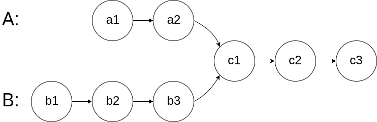
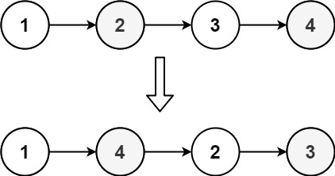
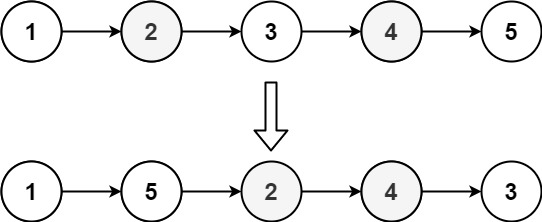
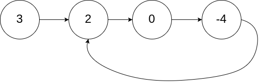
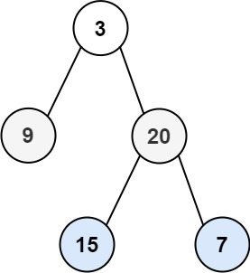
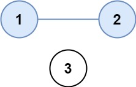

# 数据结构与算法学习笔记

本文从算法分析方法出发，依次介绍线性结构、树形结构、并查集与图，并结合典型问题说明每种结构的适用场景、核心操作和复杂度。

> 阅读前置：C++ 语法与 STL 容器已分离至 [C++ 基础与 STL](C++基础与STL.md)。本文中的示例代码默认使用 C++。

**推荐学习顺序**

1. 先掌握复杂度、递归和分治，理解如何分析算法。
2. 再学习数组、链表、栈、队列与字符串，建立线性结构基础。
3. 然后学习树、堆、Trie 和并查集，理解层次关系与集合维护。
4. 最后学习图的存储、遍历与经典算法，综合运用前述知识。

每一章都应关注四个问题：数据如何组织、核心操作是什么、时间与空间开销是多少、它适合解决什么问题。

# 第一章 算法分析与设计基础
本章先建立分析算法的共同语言，再介绍位运算、递归、分治和动态规划。学习时不要只记代码模板，还要能说明问题如何缩小、状态如何定义，以及复杂度从何而来。

## 1.1 复杂度分析
### 1.1.1 复杂度计算原则
+ 多项式只保留增长最快的项
+ 忽略不影响增长趋势的常数项和常数系数
+ 只有当基本操作次数不随输入规模 `n` 增长时，时间复杂度才是 $O(1)$

### 1.1.2 时间复杂度（Time Complexity）
+ 定义：输入规模 `n` 增长时，算法基本操作次数的数量级
+ 受代码结构影响：
    - 不随 `n` 增长的顺序或选择结构通常是 $O(1)$
    - 循环结构（`for`、`while`、`do-while`）取决于循环次数；常见的一层、两层、三层完整遍历分别是 $O(n)$、$O(n^2)$、$O(n^3)$
    - 递归：取决于递归深度和每层操作
+ 时间复杂度与数据量的大小有关
+ 数据结构的选择有时能降低时间复杂度

**时间复杂度种类**：

+ Worst：最坏情况下的时间复杂度
+ Average：平均情况下的时间复杂度（排序算法常用）
+ Best：最优情况下的时间复杂度

**结论**

1. 常见增长速度：常数 < 对数 < 线性 < 多项式 < 指数 < 阶乘
2. 单纯的顺序、选择结构 O(1)
3. 一般的一层循环 O(n)，两层循环 O(n²)，三层循环 O(n³)
4. 顺序执行的多个循环结构，取时间复杂度最大的
5. 记忆化搜索和动态规划常通过保存子问题结果来用空间换时间；递归与分治本身不必然降低时间复杂度
6. 每轮将问题规模按固定比例缩小的算法（二分），循环或递归层数通常与 $\log_2 n$ 有关

### 1.1.3 空间复杂度（Space Complexity）
+ 定义：解决问题额外消耗的空间
+ 与申请的空间大小有关（数据结构的选择）

### 1.1.4 时间复杂度、空间复杂度的权衡
+ 以实际情况为准，大多时候用空间换时间（哈希查找）

## 1.2 位运算
**特点**：位运算直接处理整数的二进制位，通常可映射为底层指令。实际性能取决于编译器和硬件，不应假定固定的加速倍数。

### 1.2.1 基本运算符
+ `&` 位与：全1则1，有0则0
+ `|` 位或：有1则1，全0则0
+ `^` 异或：相同为0，不同为1
+ `~` 按位取反：1变0，0变1
+ `<<` 左移：右边补0
+ `>>` 右移：无符号数左侧补 `0`；有符号负数的结果与语言规则和实现有关

### 1.2.2 位运算应用
#### （1）& 位与的应用
**统计二进制中1的个数**

```cpp
int countOnes(int n) {
    int count = 0;
    while (n) {
        n &= (n - 1);  // 每次消除最右边的1
        count++;
    }
    return count;
}
```


**找到num最右边的1**

```cpp
num & (-num);//得到最右边的1
```


**模2^n优化**

_核心原理_：

计算 `x % (2ⁿ)` ，等价于 `x & (2ⁿ - 1)`

_示例_：

```cpp
x % 8  等价于  x & 7
```


**判断奇偶性**

```cpp
n & 1  // 1为奇数，0为偶数
```


**判断2的幂**

```cpp
x > 0 && (x & (x - 1)) == 0
```


#### （2）^ 异或应用
**^ 异或性质**

+ `x ^ x = 0`（消去相同值）
+ `x ^ 0 = x`
+ `a ^ b ^ b = a`（异或是自身的逆运算，用于加密/解密）

**找出数组中缺失的元素**（元素范围1~n，有一个缺失）：

方法

+ 1.sort排序
    - 找与下标+1不符合的
    - 找前后元素差的绝对值>1的
+ 2.为每个元素计数，找数目==0的元素
+ 3.数组元素与下标+1比较，不相同交换至对应下标+1，相同跳过，看哪个下标少元素
+ 4.1~n 相加减去数组元素相加，得到缺失元素
+ 5.1~n 每个元素异或，1~n（包含缺失元素）每个元素异或，两个异或结果再异或，得到的值就是缺失元素（出现次数为偶数的元素互相异或会被消掉 x^x=0）

```cpp
// 方法5：异或法
int findMissing(vector<int>& nums) 
{
    int n = nums.size() + 1;
    int xorAll = 0, xorArr = 0;
    for (int i = 1; i <= n; i++) xorAll ^= i;
    for (int num : nums) xorArr ^= num;
    return xorAll ^ xorArr;  // 缺失元素
}
```


**找出两个只出现一次的数字（其余出现两次）**

[LeetCode 260. 只出现一次的数字 III](https://leetcode.cn/problems/single-number-iii/)

**题目描述**：

给你一个整数数组 `nums`，其中恰好有两个元素只出现一次，其余所有元素均出现两次。 找出只出现一次的那两个元素。你可以按 **任意顺序** 返回答案。

你必须设计并实现线性时间复杂度的算法且仅使用常量额外空间来解决此问题。

**示例 1：**

```plain
输入：nums = [1,2,1,3,2,5]
输出：[3,5]
解释：[5, 3] 也是有效的答案。
```

**示例 2：**

```plain
输入：nums = [-1,0]
输出：[-1,0]
```

**示例 3：**

```plain
输入：nums = [0,1]
输出：[1,0]
```

**思路**：

+ 整体异或得到num1^num2的结果
+ 找到num1^num2结果的二进制的最右边的1

```cpp
//方法1
循环位与 左移、循环位与 *2
//方法2
num & (-num)//或写成diff & (~diff + 1)
//方法3
t=num^(num-1);
t=num^t;
```

+ 位与分类（最右边的1表示num1和num2第一个不同的数（一个1，一个0））

**代码**

```cpp
void search(vector<int>& nums, int& num1, int& num2) 
{
    // 整体异或得到num1^num2的结果
    int target = 0;
    for (int i = 0; i < nums.size(); i++) 
    {
        target ^= nums[i];
    }
    // 找到num1^num2结果的二进制最右边的1
    target &= -target;
    // 位与分类
    for (int i = 0; i < nums.size(); i++)
    {
        if ((nums[i] & target) == 0) 
        {
            num1 ^= nums[i];
        } 
        else 
        {
            num2 ^= nums[i];
        }
    }
}
```


**位操作实现加法**

**方法1**

```cpp
int add(int num1, int num2) {
    while (num2 != 0) {
        int carry = (num1 & num2) << 1;  // 进位
        num1 = num1 ^ num2;              // 无进位加法
        num2 = carry;
    }
    return num1;
}
```

**方法2**

```cpp
int add(int num1, int num2)
{
    while ((num1 & num2) != 0)
    {
        num1 = num1 ^ num2;
        num2 = ((num1 ^ num2) & num2) << 1;
    }
    return num1 ^ num2;
}
```

**方法3**

```cpp
int add(int num1, int num2)
{
    if (num2 == 0) return num1;
    int sum = num1 ^ num2;          // 不考虑进位的和
    int carry = (num1 & num2) << 1; // 进位
    return add(sum, carry);
}
```


**不借助额外空间交换**：

```cpp
// 异或法
a = a ^ b;
b = a ^ b;  // b = a ^ b ^ b = a
a = a ^ b;  // a = a ^ b ^ a = b

// 加减法
a = a + b;
b = a - b;  // b = a + b - b = a
a = a - b;  // a = a + b - a = b
```


#### （3）<<左移的应用
```cpp
x << 1  等价于  x * 2  // 左移乘以2
x >> 1  等价于  x / 2  // 右移除以2（整数除法）
```


## 1.3 递归
**定义**：函数调用自己

**实现原理**：函数调用栈实现（后进先出）

**递归三要素**：

1. 确定参数和返回值
2. 能分成多个子问题，子问题执行逻辑一致
3. 有明确终点（递归终止条件）

递归分析时还要检查两点：每次调用是否确实接近终止条件，以及递归深度是否可能造成栈溢出。

**示例1：等差数列求和**

```cpp
int sum(int num) 
{
    if (num == 1) return 1;
    return sum(num - 1) + num;
}
```

**示例2：斐波那契数列**

**基本定义**

斐波那契数列是一个**递推定义**的整数数列，其前两项为 0 和 1，后续每一项都是前两项之和：

$ F(n) = 
\begin{cases} 
0 & \text{if } n = 0 \\
1 & \text{if } n = 1 \\
F(n-1) + F(n-2) & \text{if } n \geq 2 
\end{cases} $

**基础递归（效率低）**

```cpp
int fib(int n) 
{
    if (n == 0) return 0;
    if (n == 1) return 1;
    return fib(n - 1) + fib(n - 2);
}
```

**优化1：记忆化搜索**

```cpp
int dp[100] = {0};
int fib(int n) 
{
    if (n == 0) return 0;
    if (n == 1) return 1;
    if (dp[n] != 0) return dp[n];
    dp[n] = fib(n - 1) + fib(n - 2);
    return dp[n];
}
```

**优化2：滚动变量（递推）**

```cpp
int fib(int n) 
{
    if (n == 0) return 0;
    if (n == 1) return 1;
    int num0 = 0, num1 = 1, num2 = 0;
    for (int i = 2; i <= n; i++) 
    {
        num2 = num1 + num0;
        num0 = num1;
        num1 = num2;
    }
    return num2;
}
```


## 1.4 分治
**定义**：将一个问题拆成解决方案完全相同的子问题（分而治之）

1. **分（划分阶段）**：递归地将原问题分解为两个或多个子问题，直至到达最小子问题时终止。
2. **治（合并阶段）**：从已知解的最小子问题开始，从底至顶地将子问题的解进行合并，从而构建出原问题的解。

**适用条件**：

+ 问题难度随数据规模缩小而降低
+ **问题可拆分**：原问题可以分解成规模更小、类似的子问题，以及能够以相同方式递归地进行划分
+ **子问题互相独立互不干扰**：子问题之间没有重叠，互不依赖，可以独立解决
+ **子问题的解可合并**：原问题的解通过合并子问题的解得来

**分治的时间复杂度计算**

$ T(n) = a \cdot T\left(\frac{n}{b}\right) + f(n) $

其中：

+ n：原问题的规模；
+ a >= 1：子问题的数量；
+ b > 1：每个子问题的规模是原问题的 1/b（假设等分）；
+ f(n)：分解和合并所花的时间（非递归部分）。

## 1.5 动态规划（DP）
**DP（Dynamic Programming）定义**：把具有重叠子问题的问题拆成状态，并保存子问题结果以避免重复计算。动态规划常用于最优化问题，也可用于计数、可行性判断等问题。

**特点**：

+ 可拆成子问题。子问题分解是一种通用的算法思路，在分治、动态规划、回溯中的侧重点不同。
    - 分治算法递归地将原问题划分为多个相互独立的子问题，直至最小子问题，并在回溯中合并子问题的解，最终得到原问题的解。
    - 动态规划也对问题进行递归分解，但与分治算法的主要区别是，动态规划中的子问题是相互依赖的，在分解过程中会出现许多重叠子问题。
    - 回溯算法在尝试和回退中穷举所有可能的解，并通过剪枝避免不必要的搜索分支。原问题的解由一系列决策步骤构成，我们可以将每个决策步骤之前的子序列看作一个子问题。
+ 无后效性：给定一个确定的状态，它的未来发展只与当前状态有关，而与过去经历的所有状态无关
+ 最优子结构性质：原问题的最优解是从子问题的最优解构建得来的

**求解步骤**：

**第一步：拆分问题**

**第二步：思考每轮的决策，定义状态（子问题最优解），从而得到dp表**

+ 动态规划和回溯过程可以描述为一个决策序列，而状态由所有决策变量构成。它应当包含描述解题进度的所有变量，其包含了足够的信息，能够用来推导出下一个状态。
+ 每个状态都对应一个子问题，我们会定义一个dp表来存储所有子问题的解，状态的每个独立变量都是dp表的一个维度。从本质上看，dp表是状态和子问题的解之间的映射。

**第三步：找出最优子结构，进而推导出状态转移方程（状态已确定，过去如何求此状态不关心）**

+ 根据定义好的dp表，思考原问题和子问题的关系，找出通过子问题的最优解来构造原问题的最优解的方法，即最优子结构。
+ 一旦我们找到了最优子结构，就可以使用它来构建出状态转移方程。

**第四步：确定边界条件和状态转移顺序**

+ 边界条件在动态规划中用于初始化dp表，在搜索中用于剪枝。
+ 状态转移顺序的核心是要保证在计算当前问题的解时，所有它依赖的更小子问题的解都已经被正确地计算出来。

**求解方法**：

+ 自顶向下：带备忘的递归（记忆化搜索）
+ 自底向上：从小向大分析（迭代）

**代码步骤**：

1. 申请dp数组，确定dp[i]和i的含义
2. 初始化数组
3. 考虑遍历顺序
4. 状态转移方程
5. 优化：状态压缩

**应用1： 打家劫舍**

[LeetCode 198. 打家劫舍](https://leetcode.cn/problems/house-robber/)

**题目描述**：

你是一个专业的小偷，计划偷窃沿街的房屋。每间房内都藏有一定的现金，影响你偷窃的唯一制约因素就是相邻的房屋装有相互连通的防盗系统，**如果两间相邻的房屋在同一晚上被小偷闯入，系统会自动报警**。

给定一个代表每个房屋存放金额的非负整数数组，计算你 **不触动警报装置的情况下** ，一夜之内能够偷窃到的最高金额。

**示例 1：**

```plain
输入：[1,2,3,1]
输出：4
解释：偷窃 1 号房屋 (金额 = 1) ，然后偷窃 3 号房屋 (金额 = 3)。
     偷窃到的最高金额 = 1 + 3 = 4 。
```

**示例 2：**

```plain
输入：[2,7,9,3,1]
输出：12
解释：偷窃 1 号房屋 (金额 = 2), 偷窃 3 号房屋 (金额 = 9)，接着偷窃 5 号房屋 (金额 = 1)。
     偷窃到的最高金额 = 2 + 9 + 1 = 12 。
```

**分析**

+ 申请dp数组，确定`dp[i]`和`i`的含义
    - `dp[i]`：考虑前 `i+1` 间房屋（索引 0 ~ i）时能偷到的最大金额
    - `i`：当前房屋索引（0 ≤ i < n）
+ 初始化数组
    - `dp[0] = nums[0];` 
        * 仅1间房，必偷
    - `dp[1] = max(nums[0], nums[1]);` 
        * 2间房，选金额大的
+ 状态转移方程
    - `dp[i] = max(nums[i] + dp[i-2], dp[i-1]);`
        * 偷第 i 间：`nums[i] + dp[i-2]`（跳过 `i-1`）
        * 不偷第 i 间：`dp[i-1]`（继承前 `i-1` 间最优解）
        * 取两者最大值，体现“相邻不可同时偷”的约束

**代码**

```cpp
int rob(vector<int>& nums) {
    int n = nums.size();
    if (n == 1) return nums[0];
    if (n == 2) return max(nums[0], nums[1]);
    
    vector<int> dp(n);
    dp[0] = nums[0];
    dp[1] = max(nums[0], nums[1]);
    
    // 状态转移方程：dp[i] = max(偷第i间, 不偷第i间)
    // 偷第i间：nums[i] + dp[i-2]（跳过i-1）
    // 不偷第i间：dp[i-1]（继承前i-1间最优解）
    for (int i = 2; i < n; i++) {
        dp[i] = max(nums[i] + dp[i - 2], dp[i - 1]);
    }
    return dp[n - 1];
}
```

**应用2：1 买卖股票的最佳时机**

[LeetCode 121. 买卖股票的最佳时机](https://leetcode.cn/problems/best-time-to-buy-and-sell-stock/)

**题目描述**：

给定一个数组 `prices` ，它的第 `i` 个元素 `prices[i]` 表示一支给定股票第 `i` 天的价格。

你只能选择 **某一天** 买入这只股票，并选择在 **未来的某一个不同的日子** 卖出该股票。设计一个算法来计算你所能获取的最大利润。

返回你可以从这笔交易中获取的最大利润。如果你不能获取任何利润，返回 `0` 。

**示例 1：**

```plain
输入：[7,1,5,3,6,4]
输出：5
解释：在第 2 天（股票价格 = 1）的时候买入，在第 5 天（股票价格 = 6）的时候卖出，最大利润 = 6-1 = 5 。
     注意利润不能是 7-1 = 6, 因为卖出价格需要大于买入价格；同时，你不能在买入前卖出股票。
```

**示例 2：**

```plain
输入：prices = [7,6,4,3,1]
输出：0
解释：在这种情况下, 没有交易完成, 所以最大利润为 0。
```

**分析**

+ 申请dp数组，确定dp[i]和i的含义
    - `dp[0][i]`：第 i 天结束时持有股票 的最大利润（负值，表示成本）
    - `dp[1][i]`：第 i 天结束时不持有股票 的最大利润（即已卖出，为最终收益）
    - `i`：天数索引（0 ≤ i < n），对应 `prices[i]` 为当日股价
+ 初始化数组
    - `dp[0][0] = -prices[0];`
        * 第0天买入，利润为负成本
    - `dp[1][0] = 0;`
        * 第0天未持有，无操作，利润为0（vector初始化为0）
+ 状态转移方程
    - `dp[0][i] = max(dp[0][i-1], -prices[i]);`   
        * 持有：延续持有 或 今日首次买入（利润=0 - prices[i]）
    - `dp[1][i] = max(dp[1][i-1], prices[i] + dp[0][i-1]);` 
        * 不持有：延续空仓 或 今日卖出（利润=昨日持有利润 + 卖出价）

**代码**

```cpp
int maxProfit(vector<int>& prices) 
{
    int n = prices.size();
    if (n <= 1) return 0;
    
    // dp[0][i]：第i天结束时持有股票的最大利润（负值，表示成本）
    // dp[1][i]：第i天结束时不持有股票的最大利润
    vector<vector<int>> dp(2, vector<int>(n, 0));
    dp[0][0] = -prices[0];  // 第0天买入
    
    for (int i = 1; i < n; i++) 
    {
        // 持有：延续持有 或 今日首次买入
        dp[0][i] = max(dp[0][i - 1], -prices[i]);
        // 不持有：延续空仓 或 今日卖出
        dp[1][i] = max(dp[1][i - 1], prices[i] + dp[0][i - 1]);
    }
    return dp[1][n - 1];
}
```

**本章小结**：复杂度用于评价方案，递归用于表达自相似过程，分治强调独立子问题，动态规划强调重叠子问题与状态复用。遇到新问题时，应先确定输入规模和状态，再选择算法范式。

# 第二章 数组、查找与排序算法
本章从连续存储的数组出发，学习顺序查找、二分查找与常见排序算法。重点是理解访问、查找、插入和删除的成本，而不是只记住函数模板。

**线性结构概览**

线性结构可记为 $L=(a_1,a_2,\ldots,a_i,\ldots,a_n)$：

+ $a_1$ 有唯一后继、无前驱
+ $a_n$ 有唯一前驱、无后继
+ 其余元素有唯一前驱和唯一后继

## 2.1 数组
**特点**：

+ 类型相同
+ 原生数组长度固定，扩容通常需要重新分配并复制元素
+ 按下标访问和修改是 $O(1)$；在中间插入或删除通常需要移动元素，时间复杂度为 $O(n)$
+ 空间连续，支持高效的随机访问
    - 有序：二分查找 O(log n)
    - 无序：遍历 O(n)

### 2.1.1 查找算法
#### （1）查找重复元素问题（n 个元素，范围 0～n-1）
例题：[LeetCode 287. 寻找重复数](https://leetcode.cn/problems/find-the-duplicate-number/)

给定一个包含 `n + 1` 个整数的数组 `nums` ，其数字都在 `[1, n]` 范围内（包括 `1` 和 `n`），可知至少存在一个重复的整数。

假设 `nums` 只有 **一个重复的整数** ，返回 **这个重复的数** 。

**示例 1：**

```plain
输入：nums = [1,3,4,2,2]
输出：2
```

**示例 2：**

```plain
输入：nums = [3,1,3,4,2]
输出：3
```

**示例 3 :**

```plain
输入：nums = [3,3,3,3,3]
输出：3
```

_方法1：哈希_

+ 时间复杂度$ O(n) $，空间复杂度$ O(n) $

```cpp
bool search(vector<int>& nums) {
    unordered_set<int> set;
    for (int num : nums) {
        if (set.count(num)) return true;
        set.insert(num);
    }
    return false;
}
```

方法2：暴力

+ 时间复杂度 $ O(n^2) $，空间复杂度 $ O(1) $

方法3：先排序 sort，再比较相邻元素

+ 时间复杂度 $ O(n \log n) $，空间复杂度 $ O(\log n) $

方法4：先排序 sort，再比较元素与下标是否匹配

+ 时间复杂度 $ O(n \log n) $，空间复杂度 $ O(\log n) $

_方法5：计数法_

+ 时间复杂度$ O(n) $，空间复杂度$ O(n) $

```cpp
bool search(vector<int>& nums) {
    vector<int> sum(nums.size(), 0);
    for (int i = 0; i < nums.size(); i++) {
        sum[nums[i]] += 1;
        if (sum[nums[i]] >= 2) {
            return true;
        }
    }
    return false;
}
```

_方法6：原地交换法_

+ 时间复杂度$ O(n) $，空间复杂度$ O(1) $

```cpp
bool search6(vector<int>& nums) {
    for (int i = 0; i < nums.size(); ) 
    {
        if (nums[i] == i)  // 下标与值匹配
        { 
            i++;
            continue;
        } 
        else if (nums[nums[i]] == nums[i]) // 发现重复
        {  
            return true;
        } 
        else // 交换到对应位置
        {  
            swap(nums[i], nums[nums[i]]);
        }
    }
    return false;
}
```

_方法7：快慢指针（Floyd判圈算法）_

 **不修改** 数组 `nums` 且只用常量级 `O(1)` 的额外空间。

**思路**

**步骤一：判断是否有环**  

+ 快指针（fast）一次相当于慢指针（slow）两次，因此有环的情况下二者一定会相遇  
+ **环形追击问题类比证明**：  

> 在环形跑道中，当快者速度是慢者 2 倍时，快者必然会在一圈内追上慢者。设环长为 $ L $，慢者速度 $ v $，快者速度 $ 2v $，相对速度 $ v $，追及时间 $ t = \frac{L}{v} $。此时慢者位移 $ vt = L $（恰跑完一圈），快者位移 $ 2vt = 2L $（恰跑完两圈），二者在起点相遇。
>

**步骤二：找到进环点**  

+ 从起点到成环点（重复数字）与从快慢指针相遇点到成环点距离（中间隔的元素个数）相同  
+ **环形追击问题类比证明**：  

> 设起点到环入口距离为 $ a $，环入口到相遇点距离为 $ b $，环剩余长度为 $ c $（$ L = b + c $）。  
慢指针路程：$ a + b $  
快指针路程：$ a + b + kL $（$ k $ 为整数圈）  
由 $ 2(a + b) = a + b + kL $ 得 $ a = kL - b $  
当 $ k=1 $ 时，$ a = c $（即起点到环入口 = 相遇点到环入口）
>

**代码实现**

```cpp
class Solution 
{
public:
    int findDuplicate(vector<int>& nums) 
    {
        // 步骤一：判断是否有环
        int fast = 0, slow = 0;
        while (true) 
        {
            slow = nums[slow];
            fast = nums[nums[fast]];
            if (slow == fast) break;
        }
        // 步骤二：找到进环点（重复数字）
        int head = 0;
        while (head != slow) 
        {
            head = nums[head];
            slow = nums[slow];
        }
        return head;
    }
};
```


#### （2）二分查找（Binary Search）
_核心思想_：分治，将原问题**分解为规模更小的子问题**（每次将搜索范围缩小至一半）  
_前提条件_：数组必须为**升序/降序**（否则无法通过中间值缩小范围）  
_时间复杂度_：O(log n)（每次将搜索范围减半）

**步骤**

+ 找中间值
+ 中间值与target比较
    - 中间值=target：找到目标值
    - 中间值大于 `target`：继续查找左半区。因为数组升序，右侧元素不会是目标值。
    - 中间值小于 `target`：继续查找右半区。因为数组升序，左侧元素不会是目标值。
+ 终止条件：left>right

**代码**

_递归实现_：

```cpp
int BinarySearch(vector<int>& nums, int target, int left, int right) 
{
    if (left > right) return -1;
    int mid = left + (right - left) / 2;  // 防止溢出
    
    if (nums[mid] > target) 
    {
        return BinarySearch(nums, target, left, mid - 1);
    } 
    else if (nums[mid] < target) 
    {
        return BinarySearch(nums, target, mid + 1, right);
    }
    else 
    {
        return mid;
    }
}
```

_循环实现_：

```cpp
int BinarySearch(vector<int>& nums, int target) 
{
    int left = 0, right = nums.size() - 1;
    while (left <= right) 
    {
        int mid = left + (right - left) / 2;
        if (nums[mid] > target) 
        {
            right = mid - 1;
        } 
        else if (nums[mid] < target) 
        {
            left = mid + 1;
        } 
        else 
        {
            return mid;
        }
    }
    return -1;
}
```

**典型变种场景**：

[LeetCode 34 在排序数组中查找元素的第一个和最后一个位置](https://leetcode.cn/problems/find-first-and-last-position-of-element-in-sorted-array/)

**题目描述**：

给你一个按照非递减顺序排列的整数数组 `nums`，和一个目标值 `target`。请你找出给定目标值在数组中的开始位置和结束位置。

如果数组中不存在目标值 `target`，返回 `[-1, -1]`。

你必须设计并实现时间复杂度为 `O(log n)` 的算法解决此问题。

**1. 查找第一个等于 `target` 的位置（左边界）**

_核心思想_

当 `nums[mid] == target` 时，**不立即返回**，而是继续向左收缩搜索区间（`right = mid - 1`），直到找到最左侧的相等位置。

_关键实现_

```cpp
int findLeftBound(const vector<int>& nums, int target) 
{
    int left = 0, right = nums.size() - 1;
    while (left <= right) 
    {
        int mid = left + (right - left) / 2;
        if (nums[mid] < target) {
            left = mid + 1;
        } 
        else 
        {  // nums[mid] >= target，相等时继续向左
            right = mid - 1;
        }
    }
    // 边界验证：left 可能越界或指向非 target 元素
    if (left < nums.size() && nums[left] == target) return left;
    return -1;  // 不存在
}
```

_边界验证_

+ 需检查 `left` 是否越界（`left == n`）或 `nums[left] != target`（目标不存在）

**2. 查找最后一个等于 `target` 的位置（右边界）**

_核心思想_

当 `nums[mid] == target` 时，继续向右收缩搜索区间（`left = mid + 1`），直到找到最右侧的相等位置。

_关键实现_

```cpp
int findRightBound(const vector<int>& nums, int target) 
{
    int left = 0, right = nums.size() - 1;
    while (left <= right) 
    {
        int mid = left + (right - left) / 2;
        if (nums[mid] <= target) 
        {  // 相等时继续向右
            left = mid + 1;
        } else {
            right = mid - 1;
        }
    }
    // 边界验证：right 可能越界或指向非 target 元素
    if (right >= 0 && nums[right] == target) return right;
    return -1;  // 不存在
}
```

_边界验证_

+ 需检查 `right` 是否越界（`right < 0`）或 `nums[right] != target`

**4. 查找插入位置（目标不存在时的定位）**

[LeetCode 35. 搜索插入位置](https://leetcode.cn/problems/search-insert-position/)

**题目描述**：

一个排序数组和一个目标值，在数组中找到目标值，并返回其索引。如果目标值不存在于数组中，返回它将会被按顺序插入的位置。

请必须使用时间复杂度为 `O(log n)` 的算法。

_核心思想_

在升序数组中查找 `target` 应插入的位置，即**第一个大于等于 `target` 的元素下标**。  
本质是**左边界查找的直接应用**：循环结束后 `left` 即为插入位置 。

_关键实现_

```cpp
int searchInsert(vector<int>& nums, int target) 
{
    int left = 0, right = nums.size() - 1;
    while (left <= right) 
    {
        int mid = left + (right - left) / 2;
        if (nums[mid] < target) 
        {
            left = mid + 1;
        } 
        else 
        {
            right = mid - 1;
        }
    }
    return left;  // 无需验证，left 恒为合法插入位置 [0, n]
}
```

**4. 变种对比总结**

| 变种类型 | 相等时动作 | 返回值 | 典型场景 |
| --- | --- | --- | --- |
| **标准查找** | 立即返回 `mid` | `mid` / `-1` | 无重复元素的精确匹配 |
| **左边界** | `right = mid - 1` | `left`（需验证） | 首次出现位置、插入位置 |
| **右边界** | `left = mid + 1` | `right`（需验证） | 末次出现位置 |
| **上界查找** | `right = mid - 1`（条件为 `>`） | `left` | 第一个大于 `target` 的位置 |


## 2.2 排序算法
### 2.2.1 排序算法对比
| 算法 | 平均时间 | 最好时间 | 最坏时间 | 空间 | 稳定性 | 特点 |
| --- | --- | --- | --- | --- | --- | --- |
| 冒泡排序 | O(n²) | O(n) | O(n²) | O(1) | 稳定 | 简单但效率低 |
| 选择排序 | O(n²) | O(n²) | O(n²) | O(1) | 不稳定 | 交换次数少 |
| 插入排序 | O(n²) | O(n) | O(n²) | O(1) | 稳定 | 适合小规模/部分有序 |
| 快速排序 | O(n log n) | O(n log n) | O(n²) | 平均 O(log n)，最坏 O(n) | 不稳定 | 平均性能优秀，常用于混合排序 |
| 归并排序 | O(n log n) | O(n log n) | O(n log n) | O(n) | 稳定 | 适合大规模数据 |
| 堆排序 | O(n log n) | O(n log n) | O(n log n) | O(1) | 不稳定 | 时间稳定 |
| 希尔排序 | 取决于间隔序列 | 取决于间隔序列 | 常见上界 O(n²) | O(1) | 不稳定 | 分组插入排序，性能受间隔序列影响 |


**排序算法实现**：

### 2.2.2 冒泡排序（Bubble Sort）
**核心思想**

相邻元素进行大小比较，如果 `nums[i] < nums[i-1]`，交换。

**详细思路**：  
冒泡排序是一种简单的排序算法。它重复地走访过要排序的元素列，依次比较两个相邻的元素，如果顺序（如从大到小、首字母从Z到A）错误就把他们交换过来。走访元素的工作是重复地进行直到没有相邻元素需要交换，也就是说该元素列已经排序完成。

+ 这个算法的名字由来是因为越小的元素会经由交换慢慢“浮”到数列的顶端（升序或降序排列），就如同碳酸饮料中的气泡一样，故名“冒泡排序”。
+ 图中的核心思想描述的是将较小的元素向前（下标小的方向）移动，即“冒泡”。

---

**基础代码实现**

**详细思路**：  
这是最原始的冒泡排序实现。

+ 使用双重循环。
+ 外层循环 `i` 控制排序的轮数，从数组长度递减到 1。
+ 内层循环 `j` 从 1 遍历到 `i`，比较相邻元素 `nums[j]` 和 `nums[j-1]`。
+ 如果前一个元素比后一个大（`nums[j] < nums[j-1]`，注意这里是小于，说明是把小的往前换），则交换。
+ 变量 `c` 用于记录比较的次数，最后输出，用于分析算法复杂度。

**代码**：

```cpp
void BubbleSort(vector<int> & nums)
{
    int c = 0;
    for (int i = nums.size(); i > 1; i--)
    {
        for (int j = 1; j < i; j++)
        {
            c++;
            if (nums[j] < nums[j - 1])
            {
                swap(nums[j], nums[j - 1]);
            }
        }
    }
    cout << c << endl;
}
```

---

**优化方案**

冒泡排序的主要性能瓶颈在于即使数组已经有序，它仍然会进行多余的比较。优化主要围绕**“提前终止”**和**“减少比较范围”**进行。

**优化一：设置标志位与记录最后交换位置 (For循环版)**

**详细思路**：  
这个版本试图结合两种优化策略：

1. **标志位（`flag`）**：每轮开始时置为 `0`；如果一轮中没有发生交换，说明数组已经有序，可以直接 `break`。
2. **记录最后交换位置**：变量 `flag` 记录最后一次交换后的右边界。在该位置之后的元素已经有序，令 `right = flag`，下一轮只比较仍可能无序的区间。

**代码**：

```cpp
void BubbleSort(vector<int>& nums)
{
    int len = nums.size();
    int right = len;
    for (int i = 0; i < len - 1 && right > 1; i++)
    {
        int flag = 0;
        for (int j = 0; j < right - 1; j++)
        {
            if (nums[j] > nums[j + 1])
            {
                swap(nums[j], nums[j + 1]);
                flag = j + 1;
            }
        }
        if (flag == 0) break;
        right = flag;
    }
}
```

**优化二：记录最后交换位置 (While循环版 - 显式标志位)**

**详细思路**：  
这是使用 `while` 循环实现的优化版本，逻辑更清晰：

1. 使用 `bool t` 作为标志位，初始为 `true`。如果一轮下来没有发生交换（`t` 保持 `false`），则循环结束。
2. 使用 `right` 变量记录当前需要比较的右边界。
3. 在内层循环中，如果发生交换，更新 `flag` 为当前位置 `j`，并将 `t` 设为 `true`。
4. 一轮结束后，将 `right` 更新为 `flag`（最后一次交换的位置），因为 `flag` 之后的元素已经有序，下一轮只需比较到 `flag` 即可。

**代码**：

```cpp
void BubbleSort(vector<int> & nums)
{
    int right = nums.size(), flag=0;
    bool t = true;
    while(t)
    {
        t = false;
        for (int j = 1; j < right; j++)
        {
            if (nums[j] < nums[j - 1])
            {
                swap(nums[j], nums[j - 1]);
                t = true;
                flag = j; // 记录最后一次交换的位置
            }
        }
        right = flag;
    }
}
```

**优化三：记录最后交换位置 (While循环版 - 隐式标志位)**

**方法名称**：While循环优化 (Implicit Flag)

**详细思路**：  
这是另一种 `while` 循环的写法，更加简洁：

1. 直接使用 `while(right)` 作为循环条件。
2. 每轮开始时将 `flag` 重置为 0。
3. 内层循环逻辑同上，记录最后一次交换的位置 `j` 到 `flag`。
4. 一轮结束后，执行 `right = flag`。
    - 如果发生了交换，`flag` 会被更新为某个大于0的值，`right` 缩小，循环继续。
    - 如果没有发生交换，`flag` 保持为 0，`right` 变为 0，`while(right)` 条件不满足，循环自然结束。这巧妙地利用了 `flag` 同时充当了“是否有序”的判断标志。

**代码**：

```cpp
void BubbleSort(vector<int>& nums)
{
    int right = nums.size(), flag=0;
    int c = 0;
    while(right)
    {
        flag = 0;
        for (int j = 1; j < right; j++)
        {
            if (nums[j] < nums[j - 1])
            {
                swap(nums[j], nums[j - 1]);
                flag = j; // 记录最后一次交换的位置
            }
        }
        right = flag;
    }
}
```

### 2.2.3 选择排序（Selection Sort）
**核心思想**

选择排序的核心思想是每一轮从未排序部分中选择最值（最大或最小），将其放置到已排序部分的边界位置，通过n-1轮操作完成整个排序过程。具体实现逻辑如下：

+ 元素比较规则：将当前元素与已记录的最值进行比较
    - 选择最大值时：元素 > 最值 → 更新最值下标；元素 <= 最值 → 不更新下标
    - 选择最小值时：元素 < 最值 → 更新最值下标；元素 >= 最值 → 不更新下标
+ 位置交换：每轮确定最值后，将其与未排序部分的边界位置交换（最大值放最后/最小值放最前）

**代码实现**

1. 选择最小值实现（升序）

```cpp
void SelectSort(vector<int>& nums) {
    int minIndex = 0;
    for (int i = 0; i < nums.size(); i++) {
        minIndex = i;  // 初始化当前最小值下标为起始位置
        for (int j = i; j < nums.size(); j++) {
            // 元素 < 最值 → 更新下标
            if (nums[j] < nums[minIndex]) {
                minIndex = j;
            }
        }
        // 交换最小值到当前位置
        swap(nums[minIndex], nums[i]);
    }
}
```

2. 选择最大值实现（升序）

```cpp
void SelectSort(vector<int>& nums) {
    int maxIndex = 0;
    for (int i = nums.size() - 1; i > 0; i--) {
        maxIndex = 0;  // 初始化当前最大值下标为0
        for (int j = 0; j <= i; j++) {
            // 元素 > 最值 → 更新下标
            if (nums[j] > nums[maxIndex]) {
                maxIndex = j;
            }
        }
        // 交换最大值到最后位置
        swap(nums[maxIndex], nums[i]);
    }
}
```

算法特性

| 特性 | 说明 |
| --- | --- |
| **时间复杂度** | O(n²) - 无论输入序列是否有序，都需要进行 `n(n-1)/2` 次比较 |
| **空间复杂度** | O(1) - 原地排序，仅需常数级额外空间 |
| **稳定性** | 不稳定排序 - 相等元素可能因交换改变相对位置   例：`[5, 3, 5, 2]` 中两个5的顺序可能颠倒 |
| **适用场景** | 小规模数据排序；对内存空间极度敏感的场景 |


优化方向：堆排序

选择排序的**核心瓶颈**在于每轮找最值需要 O(n) 时间，可通过以下方式优化：

1. **堆数据结构**：利用完全二叉树的堆性质
    - 大顶堆：根节点是当前最大值
    - 小顶堆：根节点是当前最小值
2. **优化效果**：
    - 读取堆顶最值的时间复杂度为 $O(1)$
    - 删除堆顶并恢复堆性质的时间复杂度为 $O(\log n)$
    - 建堆为 $O(n)$，完成堆排序的总体时间复杂度为 $O(n\log n)$
3. **典型实现**：堆排序（Heap Sort）是选择排序的高级优化版本

### 2.2.4 堆排序（Heap Sort）
**堆排序（Heap Sort）** 是一种利用**堆（Heap）** 这种数据结构所设计的排序算法。它是**选择排序**的一种改进版本。

简单来说，堆排序的核心思想是：**将待排序的序列构造成一个大顶堆（或小顶堆），此时整个序列的最大值（或最小值）就是堆顶的根节点。将其与末尾元素交换，然后将剩余的 n-1 个元素重新调整为堆，反复执行，直到所有元素有序。**

具体实现见“六、树形数据结构 → 7. 堆”。

### 2.2.5 插入排序（Insertion Sort）
**核心思想**

插入排序的核心思想是**将数组分为两部分：已排序部分和未排序部分**。每一轮将未排序部分的第一个元素插入到已排序部分的适当位置，使已排序部分保持有序状态。具体操作是：

+ **初始状态**：第一个元素视为已排序，剩余元素为未排序
+ **每轮操作**：将未排序部分的第一个元素插入到已排序部分
+ **插入方向**：从后往前比较（从已排序部分的末尾开始向前比较）

**算法步骤**

**插入过程**

1. **保存待插入元素**：将当前要插入的元素保存到临时变量
2. **倒序遍历有序序列**：从已排序部分的末尾开始向前遍历
3. **比较与移动**：
    - **无序 >= 有序**：直接插入到有序序列右端（当前元素位置）
    - **无序 < 有序**：有序序列元素向右移动一个位置，继续向前比较
    - **遍历完所有有序元素**：将元素插入到下标0位置

**关键操作说明**

+ **比较规则**：当前元素与已排序部分元素进行比较
+ **移动规则**：当发现已排序元素大于当前元素时，将该元素向后移动
+ **插入位置**：找到第一个不大于当前元素的位置，将元素插入该位置后

**C++代码实现**

1. while循环实现

```cpp
void InsertSort(vector<int>& nums) 
{
    int num = 0, right = 0;
    for (int i = 1; i < nums.size(); i++) 
    {
        right = i - 1;  // right指向已排序部分的最后一个元素
        num = nums[i];  // 保存待插入元素
        // 从后往前比较，大于num的元素后移
        while (right >= 0 && num < nums[right]) 
        {
            nums[right + 1] = nums[right];  // 依次赋值
            right--;
        }
        nums[right + 1] = num;  // 插入到正确位置
    }
}
```

2. for循环实现

```cpp
void InsertSort(vector<int>& nums) 
{
    int num = 0, right = 0;
    for (int i = 1; i < nums.size(); i++) 
    {
        num = nums[i];
        // 从后往前遍历已排序部分
        for (int j = i - 1; j >= 0; j--) 
        {
            if (nums[j] > num) 
            {
                nums[j + 1] = nums[j];  // 依次赋值
            } 
            else 
            {
                break;  // 找到插入位置，提前终止
            }
        }
        nums[j + 1] = num;  // 插入到正确位置
    }
}
```

**优化要点**

1. **避免不必要的交换**：两个实现都使用**赋值操作**而非交换操作，减少操作次数
2. **提前终止**：当找到插入位置后立即终止内层循环
3. **边界处理**：正确处理插入到数组开头的情况（`right = -1` 时插入到位置0）

**算法特性分析**

| 特性 | 说明 |
| --- | --- |
| **时间复杂度** | - 最好情况（已排序）：O(n)   - 最坏情况（逆序）：O(n²)   - 平均情况：O(n²) |
| **空间复杂度** | O(1) - 原地排序，仅需常数级额外空间 |
| **稳定性** | ✅ 稳定排序 - 相等元素不会改变相对位置 |
| **适用场景** | - 小规模数据排序   - 基本有序的数据集   - 需要稳定排序的场景 |


### 2.2.6 希尔排序（Shell Sort）
**核心概念**

希尔排序是**插入排序的优化变种**，通过**分组插入排序**减少元素移动次数，适用于以下场景：

+ **插入排序的应用场合**  
    - 元素数量较少时  
    - 元素前后位置距离不远（插入导致的调整次数少）
+ **对插入排序的优化**   
通过**间隔分组**将原本可能相距较远的元素分到同一组，使组内元素相对有序，为最终插入排序创造更优条件。

---

**算法特点**

1. **二分分割（间隔递减策略）**  
    - 假设数组有 `n` 个元素  
    - 初始间隔：`n/2`（向下取整）  
    - 后续间隔：`(n/2)/2` → `(n/4)/2` → ... → `0`（最后一次排序）  
_示例：若 _`n=10`_，间隔序列为 _`5 → 2 → 1`
2. **分组逻辑**  
    - 相同间隔的元素为一组（组内元素在原数组中**不连续**）  
    - 例如间隔 `gap=3` 时：  
        * 第 0、3、6、9... 个元素为一组  
        * 第 1、4、7... 个元素为一组  
        * 第 2、5、8... 个元素为一组

**排序流程**

| 步骤 | 说明 |
| --- | --- |
| **定间隔** | 初始间隔 `gap = n/2`，后续每次 `gap /= 2` |
| **分组** | 按间隔将数组划分为多个子序列（组内元素不连续） |
| **组内排序** | 对每个子序列执行插入排序（因分组后元素相对有序，效率显著提升） |
| **缩小间隔** | 重复分组→排序过程，直到 `gap=0`（最终对整个序列进行插入排序） |


**代码**

```cpp
void shellSort(vector<int>& arr) 
{
    int n = arr.size();
    
    // 外层循环：控制间隔gap，从n/2逐步减半至1
    for (int gap = n / 2; gap > 0; gap /= 2) 
    {
        // 内层循环：对每个分组进行插入排序，遍历每个分组的起始位置（从gap开始）
        for (int i = gap; i < n; i++) 
        {
            int temp = arr[i];  // 待插入的元素
            int j;
            
            // 组内插入排序：比较间隔为gap的元素
            for (j = i; j >= gap && arr[j - gap] > temp; j -= gap) 
            {
                arr[j] = arr[j - gap];  // 移动较大元素到后方
            }
            arr[j] = temp;  // 插入元素到正确位置
        }
    }
}
```

**算法特性分析**

1. **间隔序列选择**  
    - 上述代码使用**原始希尔间隔**（`n/2, n/4, ..., 1`）  
    - 更优方案：可改用 **Hibbard 序列**（`2^k - 1`）或 **Sedgewick 序列**（`9*4^i - 9*2^i + 1`），可将最坏时间复杂度优化至 `O(n^(3/2))`
2. **稳定性说明**  
    - 希尔排序是**不稳定排序**（相同值的元素可能因分组被交换位置）  
    - _示例：_`[5a, 3, 5b]`_ 分组后可能变为 _`[3, 5b, 5a]`
3. **时间复杂度**  

| 间隔序列 | 平均时间复杂度 | 最坏时间复杂度 |
| --- | --- | --- |
| 原始希尔 | O(n²) | O(n²) |
| Hibbard 序列 | O(n^(3/2)) | O(n^(3/2)) |
| Sedgewick 序列 | O(n^(4/3)) | O(n^(4/3)) |


### 2.2.7 快速排序（Quick Sort）
**核心思想**

快速排序的核心思想是**分治法（Divide and Conquer）**

选择一个标准值（枢轴），将数组分为两部分：

+ 左侧：所有小于标准值的元素（左子数组任意元素<=基准数）
+ 右侧：所有大于标准值的元素（基准数<=右子数组任意元素）  
然后对左右两个子数组递归地进行同样的操作，直到整个数组有序。

**关键操作**：

1. **选择标准值**：确定一个基准元素作为划分依据
2. **分区操作**：将小于标准值的元素移到左侧，大于标准值的元素移到右侧
3. **递归处理**：对左右两个子数组重复上述过程

二、两种主要实现方式

**挖坑填数法**

**步骤**：

1. 保存标准值到临时变量
2. 确定标准值最终位置
    - 从右向左找到第一个小于标准值的元素，填入左侧"坑"中
    - 从左向右找到第一个大于标准值的元素，填入右侧"坑"中
    - 重复上述过程，直到左右指针相遇
3. 将标准值放入最终位置
4. 以标准值位置为界划分两个新的数组，并对新数组重复操作

**C++实现**：

```cpp
void QuickSort(vector<int>& nums, int left, int right) 
{
    if (left >= right) return;
    int tmp = nums[left];  // 保存标准值（默认选最左边元素）
    int begin = left, end = right;
    
    while (begin < end) 
    {
        // 从右往左，找小于标准值的，填左
        while (begin < end && nums[end] >= tmp) end--;
        if (begin < end) 
        {
            nums[begin] = nums[end];  // 填左
            begin++;
        }
        
        // 从左往右，找大于标准值的，填右
        while (begin < end && nums[begin] <= tmp) begin++;
        if (begin < end) 
        {
            nums[end] = nums[begin];  // 填右
            end--;
        }
    }
    
    nums[begin] = tmp;  // 填入标准值
    QuickSort(nums, left, begin - 1);  // 递归左子数组
    QuickSort(nums, begin + 1, right); // 递归右子数组
}
```

**双边交换法**

**步骤**：

1. 选择标准值（通常为最左边元素）
2. 设置左右指针，分别从两端向中间移动
    - 左指针找到大于标准值的元素
    - 右指针找到小于标准值的元素
    - 交换这两个元素
    - 重复上述过程，直到左右指针相遇
3. 将标准值与相遇点元素交换
4. 以标准值位置为界划分两个新的数组，并对新数组重复操作

**C++实现**：

```cpp
void QuickSort(vector<int>& nums, int left, int right) 
{
    if (left >= right) return;
    
    int i = left, j = right;
    while (i < j) 
    {
        // 从右往左，找小于标准值的
        while (i < j && nums[j] >= nums[left]) j--;
        // 从左往右，找大于标准值的
        while (i < j && nums[i] <= nums[left]) i++;
        // 交换元素
        if (i < j) swap(nums[i], nums[j]);
    }
    
    // 将标准值与相遇点元素交换
    swap(nums[i], nums[left]);
    QuickSort(nums, left, i - 1);  // 递归左子数组
    QuickSort(nums, i + 1, right); // 递归右子数组
}
```

**快速排序优化方法**

**1.区间划分法**

**核心思想**

+ **选择标准值**：默认选择最右边的元素作为标准值（pivot）
+ **维护小区间**：用`target`变量标记小于标准值的区间边界
+ **分区操作**：遍历数组，将小于标准值的元素移到左侧，大于等于标准值的元素留在右侧
+ **递归处理**：对左右两个子数组递归进行同样的操作

**步骤详解**

1. 区间划分过程

1. **标记变量初始化**：
    - `target = left`：标记小于标准值的区间边界（初始时为空区间）
2. **遍历比较**：
    - 从左向右遍历数组（`i` 从 `left` 到 `right-1`）
    - 每次比较 `nums[i]` 与标准值 `nums[right]`
    - **如果 `nums[i] < nums[right]`**：将该元素交换到`target`位置，并将`target`右移
    - **如果 `nums[i] >= nums[right]`**：不操作，继续遍历
3. **标准值归位**：
    1. 遍历结束后，将标准值（原`nums[right]`）与`nums[target]`交换
    2. 此时`target`位置即为标准值的最终位置
    3. 左侧所有元素小于标准值，右侧所有元素大于等于标准值


2. 递归过程

+ **左子数组**：`[left, target-1]`（所有小于标准值的元素）
+ **右子数组**：`[target+1, right]`（所有大于等于标准值的元素）
+ 递归对两个子数组进行同样的分区操作

代码

```cpp
void QuickSort(vector<int>& nums, int left, int right)
{
    // 递归终止条件：区间长度为0或1
    if (left >= right) return;
    
    // 1. 标记变量初始化
    int target = left;  // 标记小于标准值的区间边界
    
    // 2. 遍历数组，分区操作
    for (int i = left; i < right; i++)
    {
        // 3. 比较与移动
        if (nums[i] < nums[right])
        {
            // 将小于标准值的元素移到左侧
            swap(nums[i], nums[target++]);
        }
    }
    
    // 4. 将标准值放入最终位置
    swap(nums[right], nums[target]);
    
    // 5. 递归处理左右子数组
    QuickSort(nums, left, target - 1);  // 处理左子数组
    QuickSort(nums, target + 1, right); // 处理右子数组
}
```

**与其他实现方式对比**

| 特性 | 区间划分法 | 挖坑填数法 | 双边交换法 |
| --- | --- | --- | --- |
| **思想** | 维护小区间边界 | 挖坑填数 | 双指针交换 |
| **代码简洁度** | 最简洁 | 中等 | 中等 |
| **交换次数** | 较少 | 较少 | 较多 |


**优势分析**：

+ **代码简洁**：仅需一个`for`循环完成分区操作
+ **逻辑清晰**：`target`变量直观表示小于标准值的区间边界
+ **效率高**：避免了多余的比较和交换操作

**2.标准值选择优化**

**问题**：标准值选择不当会导致分区不平衡，最坏情况下时间复杂度退化为O(n²)

**标准值选择优化目的**：使标准值的选取尽可能靠近数组的中间值

**优化方法**：

a) 三值取中法

三值取中：取开始、中间、结束三个数，选三个数的中间值作为标准值

```cpp
int medianOfThree(vector<int>& nums, int left, int right) {
    int mid = left + (right - left) / 2;
    
    // 对三个元素排序
    if (nums[left] > nums[mid]) swap(nums[left], nums[mid]);
    if (nums[left] > nums[right]) swap(nums[left], nums[right]);
    if (nums[mid] > nums[right]) swap(nums[mid], nums[right]);
    
    // 返回中间值的位置
    return mid;
}

void QuickSortOptimized(vector<int>& nums, int left, int right) {
    if (left >= right) return;
    
    // 三值取中选择标准值
    int pivotIndex = medianOfThree(nums, left, right);
    swap(nums[left], nums[pivotIndex]);  // 将中位数移到最左边
    
    // 后续分区操作...
}
```

b) 9选1法

+ 将数组分成三段
+ 每段三值取中
+ 从三个中位数中再取中位数作为标准值
+ 避免极端情况下的性能退化

3.**小数据量优化**

**问题**：递归深度过大，小数组排序效率低

**优化方法**：

+ **数据量 <= 16**：使用插入排序（小数组插入排序效率更高）
+ **数据量 > 16**：继续使用快速排序

```cpp
void QuickSortWithInsertion(vector<int>& nums, int left, int right) {
    // 小数组使用插入排序
    if (right - left <= 16) {
        InsertionSort(nums, left, right);
        return;
    }
    
    // 大数组使用快速排序
    // ...分区操作...
    
    QuickSortWithInsertion(nums, left, begin - 1);
    QuickSortWithInsertion(nums, begin + 1, right);
}

void InsertionSort(vector<int>& nums, int left, int right) {
    for (int i = left + 1; i <= right; i++) {
        int num = nums[i];
        int j = i - 1;
        while (j >= left && nums[j] > num) {
            nums[j + 1] = nums[j];
            j--;
        }
        nums[j + 1] = num;
    }
}
```

**算法特性分析**

| 特性 | 说明 |
| --- | --- |
| **时间复杂度** | - 最好情况：O(n log n)   - 平均情况：O(n log n)   - 最坏情况：O(n²)（分区极度不平衡时） |
| **空间复杂度** | O(log n) - 递归栈深度（平均情况）   O(n) - 最坏情况（递归深度为n） |
| **稳定性** | 不稳定排序 - 相同元素可能因交换改变相对位置 |
| **适用场景** | - 大规模数据排序   - 内存有限的场景（原地排序）   - 一般情况下性能最优的排序算法 |


> 现代排序库（如C++ STL的`std::sort`）通常基于快速排序实现，并结合了插入排序和堆排序的优点，形成混合排序算法，以应对各种数据分布情况。在实际应用中，应优先考虑使用标准库的排序函数，而非自行实现。
>

### 2.2.8 归并排序（Merge Sort）
**核心思想**

归并排序的核心思想是**分治法（Divide and Conquer）**：

+ **分**：将数组递归地划分为更小的子数组，直到每个子数组只包含一个元素
+ **治**：将已排序的子数组合并为更大的有序数组
+ **合**：通过合并操作将所有子数组最终合并为一个完整的有序数组

**关键特点**：

+ 采用“先分后合”的策略，与快速排序的“边分边排”形成对比
+ 合并过程保证了算法的稳定性
+ 始终保持O(n log n)的时间复杂度，不受输入数据分布影响

**算法步骤**

1.划分阶段

+ **递归终止条件**：当子数组长度为1时，该子数组已自然有序
+ **划分方法**：计算中间索引 `mid = left + (right - left) / 2`
+ **划分结果**：
    - 左子数组：`[left, mid]`
    - 右子数组：`[mid+1, right]`
+ **递归划分**：对左右子数组重复划分过程，直到每个子数组只有一个元素

2.合并阶段

1. **申请临时数组**：创建一个与待合并区间大小相同的临时数组
2. **双指针遍历**：
    - 指针`i`指向左子数组起始位置
    - 指针`j`指向右子数组起始位置
    - 比较`nums[i]`和`nums[j]`，将较小的元素放入临时数组
    - 结束条件：其中任意子数组全部遍历完
3. **处理剩余元素**：
    - 如果左子数组有剩余元素，全部放入临时数组
    - 如果右子数组有剩余元素，全部放入临时数组
4. **数据回填**：将临时数组中的元素复制回原数组

**C++代码实现**

排序函数（MergeSort）

```cpp
void MergeSort(vector<int>& nums, int left, int right) {
    // 递归终止条件：子数组长度为1
    if (left >= right) return;
    
    // 计算中间位置
    int mid = left + (right - left) / 2;
    
    // 分治：递归排序左右子数组
    MergeSort(nums, left, mid);
    MergeSort(nums, mid + 1, right);
    
    // 合并已排序的子数组
    Merge(nums, left, mid, right);
}
```

**执行流程**：

1. 将数组划分为两半
2. 递归排序左半部分
3. 递归排序右半部分
4. 合并两个已排序的子数组

合并函数（Merge）

```cpp
void Merge(vector<int>& nums, int left, int mid, int right) 
{
    vector<int> temp(right - left + 1);  // 申请临时数组
    int i = left, j = mid + 1, t = 0;    // 初始化指针
    
    // 比较两个子数组，依次将较小元素加入temp
    while (i <= mid && j <= right) 
    {
        if (nums[i] <= nums[j]) 
        {
            temp[t++] = nums[i++];  // 左子数组元素小，放入temp
        } 
        else 
        {
            temp[t++] = nums[j++];  // 右子数组元素小，放入temp
        }
    }
    
    // 将剩余元素加入temp
    while (i <= mid) 
    {
        temp[t++] = nums[i++];
    }
    while (j <= right) 
    {
        temp[t++] = nums[j++];
    }
    
    // 将临时数组数据放回原数组
    for (t = 0; t < temp.size(); t++) 
    {
        nums[left + t] = temp[t];
    }
}
```

**关键点**：

+ 使用`<=`比较保证稳定性
+ 临时数组大小为`right - left + 1`
+ 三重循环分别处理：比较合并、左子数组剩余、右子数组剩余

**算法特性分析**

| 特性 | 说明 |
| --- | --- |
| **时间复杂度** | O(n log n) - 无论输入数据如何分布，始终需要O(n log n)次操作 |
| **空间复杂度** | O(n) - 需要额外的临时数组存储合并结果 |
| **稳定性** | ✅ 稳定排序 - 相等元素不会改变相对位置 |
| **原地排序** | ❌ 非原地排序 - 需要O(n)的额外空间 |
| **适用场景** | - 大规模数据排序   - 需要稳定排序的场景   - 链表排序（归并排序对链表特别友好） |


**特点**

归并排序是一种**稳定、高效**的排序算法：

+ **优点**：时间复杂度稳定为O(n log n)，适合大规模数据排序，稳定性好
+ **缺点**：需要O(n)额外空间，实现相对复杂
+ **应用场景**：
    - 需要稳定排序的场景
    - 大规模数据排序
    - 链表排序（归并排序对链表特别友好）
    - 外部排序（处理超出内存的数据）

**归并排序应用**

**基于归并排序的逆序对统计**

[LCR 170 交易逆序对的总数](https://leetcode.cn/problems/shu-zu-zhong-de-ni-xu-dui-lcof/description/?spm=a2ty_o01.29997173.0.0.15f25171YM8wUk) 《剑指 Offer II》原题，剑指 Offer 51，用归并排序思想求逆序对

在股票交易中，如果前一天的股价高于后一天的股价，则可以认为存在一个「交易逆序对」。请设计一个程序，输入一段时间内的股票交易记录 `record`，返回其中存在的「交易逆序对」总数。

**示例 1：**

输入：record = [9, 7, 5, 4, 6]  
输出：8  
解释：交易中的逆序对为 (9, 7), (9, 5), (9, 4), (9, 6), (7, 5), (7, 4), (7, 6), (5, 4)。

**问题背景**

本题要求统计数组 `record` 中的**逆序对数量**，即满足 `i < j` 且 `record[i] > record[j]` 的元素对数量。暴力解法时间复杂度为 $ O(n^2) $，而本代码通过**归并排序的分治思想**在 $ O(n \log n) $ 时间内高效解决。

**核心思路**

利用**归并排序的合并过程**，在保证子数组有序的同时统计逆序对。关键在于：   
      **当左子数组的当前元素 `nums[i]` 大于右子数组的当前元素 `nums[j]` 时，左子数组中从 `i` 到 `mid` 的所有元素均大于 `nums[j]`（因左子数组已升序排序），因此可一次性统计 `mid - i + 1` 个逆序对。**

**代码执行流程**

1. **分治阶段（`apart` 函数）**  
    - 递归地将数组划分为左右两半（`left` 到 `mid` 和 `mid+1` 到 `right`），直至子数组长度为 1（自然有序）。
    - 通过 `apart(nums, left, mid)` 和 `apart(nums, mid+1, right)` 递归处理左右子数组。
2. **合并阶段（`merge` 函数）**  
    - 将左右两个**已排序**的子数组合并为一个有序数组，并在此过程中统计逆序对。
    - **关键统计逻辑**：   
当 `nums[i] > nums[j]` 时，说明左子数组中从 `i` 到 `mid` 的所有元素均大于 `nums[j]`，逆序对数量为 `mid - i + 1`。   
代码中通过 `ans += j - t - left` 实现该统计（经数学推导，`j - t - left = mid - i + 1`，其中 `t` 为临时数组已填充元素数）。
    - 合并完成后，将临时数组 `temp` 的内容复制回原数组 `nums`，保证上层递归的有序性。
3. **结果返回**  
    - 递归结束后，`ans` 累加了所有逆序对数量，直接返回。

**代码**

```cpp
int reversePairs(vector<int>& record) 
{
        apart(record, 0, record.size() - 1);

        return ans;
    }
    
int ans = 0;
void merge(vector<int>& nums, int left, int mid, int right) 
{
    vector<int> temp(right - left + 1);
    int i = left, j = mid + 1, t = 0;

    while (i <= mid && j <= right) 
    {
        if (nums[i] > nums[j])       
        {
            ans = ans + j - t - left;
            temp[t++] = nums[j++];
        } 
        else 
        {
            temp[t++] = nums[i++];
        }
    }
    while (i <= mid) 
    {
        temp[t++] = nums[i++];
    }
    while (j <= right)
    {
        temp[t++] = nums[j++];
    }
    for (t = 0; t < temp.size(); t++) 
    {
        nums[left + t] = temp[t];
    }
}
void apart(vector<int>& nums, int left, int right) 
{
    if (left >= right) return;

    int mid = left + (right - left) / 2;
    apart(nums, left, mid);
    apart(nums, mid + 1, right);
    
    merge(nums, left, mid, right);
}
```

**关键代码逻辑说明**

```cpp
if (nums[i] > nums[j]) 
{
    ans = ans + j - t - left; // 统计逆序对
    temp[t++] = nums[j++];
} 
```

+ `j - t - left`** 的含义**：  
    - `t` 表示临时数组已填充的元素总数（`t = (i - left) + (j - mid - 1)`）。
    - 代入化简可得 `j - t - left = mid - i + 1`，即左子数组中比 `nums[j]` 大的元素个数。
+ **为何在此处统计**：   
右子数组元素 `nums[j]` 被放入 `temp` 时，左子数组剩余元素（`i` 到 `mid`）必然全部大于 `nums[j]`，此时统计可避免重复或遗漏。

**复杂度分析**

| **指标** | **说明** |
| --- | --- |
| **时间复杂度** | $ O(n \log n) $，与归并排序一致，远优于暴力法 $ O(n^2) $ |
| **空间复杂度** | $ O(n) $，需临时数组 `temp` 存储合并结果 |
| **稳定性** | 稳定排序（相等元素相对位置不变），符合归并排序特性 |


**本章小结**：数组擅长随机访问，二分查找要求数据有序，排序算法需要结合数据规模、稳定性、额外空间和最坏复杂度综合选择。

# 第三章 链表及其常见操作
链表使用指针连接离散节点，以随机访问能力换取灵活的结构调整。分析链表操作时，应区分“已经拿到目标节点”和“需要先遍历定位节点”两种情况。

## 3.1 链表基础概念
1. **节点（Node）结构**
    - **数据域** `data`：存储节点数据
    - **指针域** `nextPoint`：指向下一个节点
    - **核心特点**：  
    - 元素类型必须相同  
    - **空间不一定连续**（静态链表空间连续，动态链表不连续）  
        * 遍历：表头->表尾，依次查找 O(n)
        * 已知操作位置时，链接或断开节点可为 $O(1)$；若需先查找位置，总成本通常为 $O(n)$
        * 长度不固定：扩容方便，适合未知数据量处理
    - **头节点无前驱，尾节点无后继**（有的链表会增加 `head` 节点为头节点 ）
2. **链表定义（C++ 实现）**  

```cpp
typedef struct listnode {
    int data;                // 数据域
    listnode* next;         // 指针域
    // 构造函数：初始化成员
    listnode() : data(0), next(nullptr) {}
    listnode(int val) : data(val), next(nullptr) {}
    listnode(int val, listnode* nextnode) : data(val), next(nextnode) {}
} node, *pnode;  // pnode 为节点指针类型
```

```cpp
class List {
public:
    List() // 构造函数（初始化类成员）
    { 
        head = new node(); //初始化头节点
    }
    pnode getHead() 
    { 
        return head; 
    }
    void createNode(vector<int>& nums); // 通过数组创建链表
    void createNode(int n);          // 通过输入创建链表
    //链表操作……
private:
    pnode head;  // 表头指针
};
```

    1. struct 方式定义节点
    2. class 封装链表操作

## 3.2 链表的创建
1. **核心步骤**  
    - 申请新节点（`new node`）  
    - 将新节点链接到尾节点（新节点成为新的尾节点）
2. **C++ 代码实现：通过 `vector` 创建链表**

```cpp
void List::createNode(vector<int>& nums) 
{
    pnode p = head;
    while (p->next != nullptr) p = p->next; // 找到尾节点
    for (int i = 0; i < nums.size(); i++) 
    {
        p->next = new node(nums[i]); // 新节点链接到尾部
        p = p->next; // 更新尾节点指针
    }
}
```

**通过输入创建链表**

```cpp
void List::createNode(int n) 
{
    pnode p = head;
    while (p->next != nullptr) p = p->next;
    for (int i = 0; i < n; i++) 
    {
        int val; 
        cin >> val;
        p->next = new node(val);
        p = p->next;
    }
}
```

## 3.3 链表的遍历
**正序**  

**实现方法**

顺序访问 `next` 指针  

**C++代码示例**

```cpp
void printList(pnode head) 
{ 
    pnode p = head->next; 
    while(p) 
    { 
        cout << p->data << " "; p = p->next; 
    } 
}
```

**倒序**

**实现方法**

方法1：反转链表后正序遍历 

方法2：递归（类似二叉树后序遍历） 

方法3：栈辅助  

其他方法：

1. 数组存储，从后往前遍历数组
2. 链表存储，从后往前存储链表

**C++代码示例**

```cpp
void print(pNode nextNode)
{
    if (nextNode == nullptr) return;
    
    print(nextNode->next);
    cout << nextNode->data<<" ";
}
```

## 3.4 链表操作
### 3.4.1 反转链表
[Leetcode 206. 反转链表](https://leetcode.cn/problems/reverse-linked-list/)

给你单链表的头节点 `head` ，请你反转链表，并返回反转后的链表。


**示例 1：**

<!-- 这是一张图片，ocr 内容为： -->


```plain
输入：head = [1,2,3,4,5]
输出：[5,4,3,2,1]
```

**示例 2：**

<!-- 这是一张图片，ocr 内容为： -->

<!-- image-source: https://assets.leetcode.com/uploads/2021/02/19/rev1ex2.jpg -->

```plain
输入：head = [1,2]
输出：[2,1]
```

**示例 3：**

```plain
输入：head = []
输出：[]
```


**提示：**

+ 链表中节点的数目范围是 `[0, 5000]`
+ `-5000 <= Node.val <= 5000`


**进阶：**链表可以选用迭代或递归方式完成反转。你能否用两种方法解决这道题？

**递归：**

```cpp
class Solution {
public:
    ListNode* reverseList(ListNode* head) 
    {
        if(head==nullptr)
        {
            return pre;
        }
        cur=head->next;
        head->next=pre;
        pre=head;
        return reverseList(cur);
    }
private:
    ListNode* pre=nullptr,*cur;
};
```

**循环：**

**步骤**： 

**核心思想**：将原链表的节点逐个"摘下"，通过头插法插入到新链表的头部，实现链表反转。

① 定义变量：`newhead`（新头节点）、`take`（当前节点）、`breakNode`（下一节点） 

+ `newhead`：新链表的头指针（最终成为原链表的尾节点）
+ `take`：当前要"摘下"并插入到新链表的节点
+ `breakNode`：保存`take`的下一个节点，防止链表断裂

② 循环更新指针实现反转 

+ 改后继
+ 更新三个变量

③ 重置头节点指针

**C++代码**：  

```cpp
class Solution {
public:
    ListNode* reverseList(ListNode* head) 
    {
        if (!head || !head->next) return head; // 空链表/单节点处理
        ListNode* newHead = nullptr, *take = head, *breakNode = nullptr;
        while (take)
        {
            breakNode = take->next;   // 先保存后继，防止链表断裂
            take->next = newHead;     // 关键：反转指针
            newHead = take;
            take = breakNode;
        }
        return newHead;
    }
};
```

### 3.4.2 合并两个有序链表
**步骤**： 

定义变量newhead、tail

① 比较头节点确定新表头 

+ 比较头节点，小的成为表头

② 循环比较节点值，小的节点加入新链表 

+ 比较：小的添加到新表尾
+ 更新比较节点

③ 连接剩余未遍历节点  

**优化实现（C++）**：  

```cpp
void mergeLists(pnode& head, pnode list1, pnode list2) 
{
    if (!list1) 
    { 
        head = list2; 
        return; 
    }
    if (!list2) 
    { 
        head = list1; 
        return; 
    }
    
    pnode newHead = nullptr, tail = nullptr;
    // 确定表头
    if (list1->data < list2->data) 
    {
        newHead = tail = list1;
        list1 = list1->next;
    } 
    else 
    {
        newHead = tail = list2;
        list2 = list2->next;
    }
    
    // 合并过程
    while (list1 && list2) 
    {
        if (list1->data < list2->data) 
        {
            tail->next = list1;
            tail = list1;
            list1 = list1->next;
        }
        else 
        {
            tail->next = list2;
            tail = list2;
            list2 = list2->next;
        }
    }
    tail->next = list1 ? list1 : list2; // 连接剩余节点
    head = newHead;
}
```

## 3.5 链表例题
[LeetCode LCR 023. 相交链表](https://leetcode.cn/problems/3u1WK4/)

给定两个单链表的头节点 `headA` 和 `headB` ，请找出并返回两个单链表相交的起始节点。如果两个链表没有交点，返回 `null` 。

图示两个链表在节点 `c1` 开始相交**：**

<!-- 这是一张图片，ocr 内容为： -->

<!-- image-source: https://assets.leetcode.cn/aliyun-lc-upload/uploads/2018/12/14/160_statement.png -->

题目数据 **保证** 整个链式结构中不存在环。

**注意**，函数返回结果后，链表必须 **保持其原始结构** 。

**方法1**：栈

```cpp
ListNode* getIntersectionNode(ListNode* headA, ListNode* headB) 
{
    if (!headA || !headB) return nullptr; 

    stack<ListNode*> s1, s2;
    while (headA) 
    {
        s1.push(headA);
        headA = headA->next;
    }
    while (headB) 
     {
        s2.push(headB);
        headB = headB->next;
    }

    ListNode* res = nullptr;
    while (!s1.empty() && !s2.empty() && s1.top() == s2.top()) 
    {
        res = s1.top(); 
        s1.pop();
        s2.pop();
    }
    return res; 
}
```

**方法2**：计算两条链表长度，记录长度差为l，让长的先走l个节点后同时遍历

```cpp
int getLength(ListNode* head) 
{
    int cnt = 0;
    while(head != nullptr)
     {
        ++cnt;
        head = head->next;
    }
    return cnt;
}
ListNode *getIntersectionNode(ListNode *headA, ListNode *headB) 
{
    int len1=  getLength(headA), len2 = getLength(headB);
    int d = abs(len1 - len2);
    while(d--) 
    {
        if(len1 > len2) headA = headA->next;
        else headB = headB->next;
    }
    while(headA != nullptr) 
    {
        if(headA == headB) return headA;
        headA = headA->next, headB = headB->next;
    }
    return nullptr;
}
```

**方法3**：数学方法

+ **数学原理**：   
设链表A长度 `x+z`，链表B长度 `y+z`（`z`为公共部分），则：   
`(x+z) + y = (y+z) + x` → 两指针走完各自链表后，再走对方链表，必在交点相遇

```cpp
ListNode* getIntersectionNode(ListNode* headA, ListNode* headB) {
    ListNode* p = headA;
    ListNode* q = headB;
    while (p != q){
        p = p ? p->next : headB;
        q = q ? q->next : headA;
    }
    return p;
}
```

**复杂度**

| 操作 | 时间复杂度 | 空间复杂度 | C++实现要点 |
| --- | --- | --- | --- |
| 反转链表 | O(n) | O(1) | 三指针迭代，注意边界条件 |
| 合并有序链表 | O(n+m) | O(1) | 双指针比较，避免重复创建节点 |
| 寻找相交节点 | O(n+m) | O(1) | 利用长度差对齐指针 |


[LeetCode 143. 重排链表](https://leetcode.cn/problems/reorder-list/)

**题目描述**：

给定一个单链表 `L` 的头节点 `head` ，单链表 `L` 表示为：

```plain
L0 → L1 → … → Ln - 1 → Ln
```

请将其重新排列后变为：

```plain
L0 → Ln → L1 → Ln - 1 → L2 → Ln - 2 → …
```

不能只是单纯的改变节点内部的值，而是需要实际的进行节点交换。


**示例 1：**

<!-- 这是一张图片，ocr 内容为： -->

<!-- image-source: https://pic.leetcode.cn/1626420311-PkUiGI-image.png -->

```plain
输入：head = [1,2,3,4]
输出：[1,4,2,3]
```

**示例 2：**

<!-- 这是一张图片，ocr 内容为： -->

<!-- image-source: https://pic.leetcode.cn/1626420320-YUiulT-image.png -->

```plain
输入：head = [1,2,3,4,5]
输出：[1,5,2,4,3]
```


**步骤**：

1. **分割链表**  
    - 用快慢指针找到链表中点（`middleNode`）  
    - 将链表拆分为前半部分（`head` 到中点）和后半部分（中点后）  
    - 断开连接：`list1->next = nullptr`
2. **反转后半部分**  
    - 将后半部分链表反转（`reverseList`）  
    - 反转后得到从原尾部到中点的逆序链表（`list2`）
3. **交替合并**  
    - 用指针 `cur` 从头开始  
    - **交替连接**：  
        * 奇数步：接 `list2` 的节点（`cur->next = list2`）  
        * 偶数步：接前半部分剩余节点（`cur->next = list1`）
    - 循环直到所有节点合并完成

**代码**

```cpp
class Solution 
{
public:
    void reorderList(ListNode* head) 
    {
        if (!head || !head->next) return;
        ListNode* list1=middleNode(head);
        ListNode* list2=reverseList(list1->next);
        list1->next=nullptr;
        ListNode* cur = head;
        bool t=true;
        list1=head->next;
        while(list1||list2)
        {
            if(t&&list2)
            {
                cur->next=list2;
                list2=list2->next;
            }
            else if(list1)
            {
                cur->next=list1;
                list1=list1->next;
            }
            cur=cur->next;
            t=!t;
        }
    }
    ListNode* middleNode(ListNode* head) 
    {
        ListNode* slow = head;
        ListNode* fast = head;
        while (fast->next && fast->next->next) 
        {
            slow = slow->next;
            fast = fast->next->next;
        }
        return slow;
    }
    ListNode* reverseList(ListNode* head) 
    {
        if(head==nullptr) return nullptr;
        ListNode* newHead=nullptr,*Take=head,*Break=head->next;
        while(Take!=nullptr)
        {
            Take->next=newHead;
            newHead=Take;
            Take=Break;
            if(Break) Break=Break->next;
        }
        return newHead;
    }
};
```


[LeetCode 23. 合并 K 个升序链表](https://leetcode.cn/problems/merge-k-sorted-lists/)

**题目描述**：

给你一个链表数组，每个链表都已经按升序排列。

请你将所有链表合并到一个升序链表中，返回合并后的链表。

**示例 1：**

```plain
输入：lists = [[1,4,5],[1,3,4],[2,6]]
输出：[1,1,2,3,4,4,5,6]
解释：链表数组如下：
[
  1->4->5,
  1->3->4,
  2->6
]
将它们合并到一个有序链表中得到。
1->1->2->3->4->4->5->6
```

**示例 2：**

```plain
输入：lists = []
输出：[]
```

**示例 3：**

```plain
输入：lists = [[]]
输出：[]
```

**方法一：顺序合并 (Sequential Merge)**

这种方法的思想比较直观，类似于“暴力”迭代。它维护一个结果链表，依次将数组中的每一个链表合并到这个结果链表中。

**步骤**

1. **初始化检查**：
    - 如果输入向量 `lists` 为空，直接返回 `nullptr`。
2. **寻找起点**：
    - 遍历 `lists`，找到第一个不为 `nullptr` 的链表，将其赋值给 `tmp`。`tmp` 代表“当前已经合并好的总链表”。
    - 如果所有链表都为空，返回 `nullptr`。
3. **循环合并**：
    - 从下一个链表开始遍历 (`i++`)。
    - 如果当前 `lists[i]` 为空，跳过。
    - **核心合并逻辑**（将 `tmp` 与 `lists[i]` 合并）：
        * 比较 `tmp` 和 `lists[i]` 的头结点值。
        * 较小者作为新链表的头 (`newhead`) 和尾 (`tail`)，并将该链表指针后移。
        * 进入 `while` 循环，不断比较 `tmp` 和 `lists[i]` 当前节点的值。
        * 将较小节点接在 `tail->next`，并移动 `tail` 和对应链表指针。
        * 循环结束后，将非空的那个链表剩余部分直接接在 `tail->next`。
    - **更新状态**：将合并后的新头结点 `newhead` 赋值给 `tmp`，以便下一轮循环继续合并。
4. **返回结果**：
    - 循环结束后，`tmp` 即为合并所有链表后的最终结果。

**c++代码**

```cpp
class Solution {
public:
    ListNode* mergeKLists(vector<ListNode*>& lists) 
    {
        
        if(lists.size()==0) return nullptr;  // 输入为空直接返回
        int i=0;
        while (i < lists.size() && lists[i] == nullptr) 
        { 
            i++; // 跳过所有空链表
        }  
        if (i >= lists.size()) return nullptr;  // 所有链表均为空
        tmp = lists[i];  // tmp 指向第一个非空链表
        i++;  // 指向下一个待合并链表
        
        for(; i < lists.size(); i++) 
        {
            if(lists[i] == nullptr) continue;  // 跳过空链表
            // 步骤 1: 比较头节点，确定新链表的起始点
            if(tmp->val > lists[i]->val) 
            {
                newhead = lists[i];  // lists[i] 作为新头
                tail = lists[i];     // tail 指向新头
                lists[i] = lists[i]->next;  // 移动 lists[i] 指针
            } 
            else 
            {
                newhead = tmp;       // tmp 作为新头
                tail = tmp;          // tail 指向新头
                tmp = tmp->next;     // 移动 tmp 指针
            }
            // 步骤 2: 逐节点合并两个链表
            while(tmp != nullptr && lists[i] != nullptr) 
            {
                if(tmp->val > lists[i]->val) 
                {
                    tail->next = lists[i];  // 接上较小的节点
                    tail = lists[i];        // 更新 tail
                    lists[i] = lists[i]->next;  // 移动 lists[i]
                } 
                else 
                {
                    tail->next = tmp;       // 接上较小的节点
                    tail = tmp;             // 更新 tail
                    tmp = tmp->next;        // 移动 tmp
                }
            }
            // 步骤 3: 连接剩余部分
            tail->next = tmp ? tmp : lists[i]; 
            // 步骤 4: 更新 tmp 为新合并结果
            tmp = newhead;
        }
        return tmp;
    }
};
```

**复杂度分析**

+ **时间复杂度**：$ O(N \cdot K) $。假设共有 $ K $ 个链表，总节点数为 $ N $。最坏情况下，每次合并都需要遍历当前已合并的链表长度。第 $ i $ 次合并耗时约 $ i \times (N/K) $，累加后约为 $ O(N \cdot K) $。
+ **空间复杂度**：$ O(1) $。只使用了几个指针变量，没有额外的递归栈或数据结构。

---

**方法二：分治法 (Divide and Conquer)**

这种方法利用递归将问题规模缩小。类似于归并排序的思想，两两合并链表，直到最后只剩下一个链表。

**步骤**

1. **主函数入口**：
    - 处理边界情况（空数组或只有一个链表）。
    - 调用 `apart` 函数，传入整个数组的索引范围 `0` 到 `size-1`。
2. **分治递归（`apart` 函数）**：
    - **基准情况**：如果 `left == right`，说明当前范围内只有一个链表，直接返回该链表。
    - **分解**：计算中间位置 `mid`。
    - **递归**：
        * 调用 `apart(left, mid)` 合并左半部分，返回结果 `list1`。
        * 调用 `apart(mid+1, right)` 合并右半部分，返回结果 `list2`。
    - **合并**：调用 `merge(list1, list2)` 将左右两部分合并成一个链表并返回。
    - _过程示例_：如果有 4 个链表 [0,1,2,3]。
        * 第一层：分为 [0,1] 和 [2,3]。
        * 第二层：[0,1] 分为 0 和 1，合并；[2,3] 分为 2 和 3，合并。
        * 第一层回收：合并 (0+1) 的结果 和 (2+3) 的结果。
3. **双链表合并（`merge` 函数）**：
    - 处理其中一个链表为空的边界情况。
    - 比较 `list1` 和 `list2` 的头结点，较小者作为 `newHead` 和 `tail`。
    - 使用 `while` 循环，每次比较当前节点值，将较小者接在 `tail` 后面，移动 `tail` 和对应链表指针。
    - 循环结束后，将非空链表的剩余部分接在 `tail` 后面。
    - 返回 `newHead`。

**c++代码**

```cpp
class Solution {
public:
    ListNode* mergeKLists(vector<ListNode*>& lists) {
        if(lists.empty()) return nullptr;
        if(lists.size() == 1) return lists[0];
        // 调用分治函数，处理范围 [0, lists.size()-1]
        return apart(lists, 0, lists.size() - 1);
    }

private:
    // 分治递归函数
    ListNode* apart(vector<ListNode*>& lists, int left, int right) {
        if(left > right) return nullptr;
        if(left == right) return lists[left]; // 递归出口：只有一个链表
        
        int mid = (left + right) / 2;
        // 递归合并左半部分
        ListNode* list1 = apart(lists, left, mid);
        // 递归合并右半部分
        ListNode* list2 = apart(lists, mid + 1, right);
        
        // 合并左右两部分的结果
        return merge(list1, list2);
    }

    // 合并两个有序链表的辅助函数
    ListNode* merge(ListNode* list1, ListNode* list2) {
        if(!list1) return list2;
        if(!list2) return list1;

        ListNode* newHead, *tail;
        // 初始化头结点
        if(list1->val > list2->val) {
            newHead = list2;
            tail = list2;
            list2 = list2->next;
        } else {
            newHead = list1;
            tail = list1;
            list1 = list1->next;
        }

        // 遍历合并
        while(list1 && list2) {
            if(list1->val > list2->val) {
                tail->next = list2;
                tail = list2;
                list2 = list2->next;
            } else {
                tail->next = list1;
                tail = list1;
                list1 = list1->next;
            }
        }
        // 连接剩余部分
        tail->next = list1 ? list1 : list2;
        return newHead;
    }
};
```

**复杂度分析**

+ **时间复杂度**：$ O(N \log K) $。
    - 递归树的高度为 $ \log K $。
    - 每一层递归中，所有 `merge` 操作加起来总共遍历 $ N $ 个节点。
    - 总时间 = 层数 $ \times $ 每层节点数 = $ \log K \times N $。
+ **空间复杂度**：$ O(\log K) $。
    - 主要消耗在递归调用栈上，栈的深度为 $ \log K $。

---

**对比**

| 特性 | 方法一：顺序合并 | 方法二：分治法 |
| :--- | :--- | :--- |
| **思路** | 依次将第 $ i $ 个链表合并到前 $ i-1 $ 个的结果中 | 两两配对合并，像锦标赛一样向上归并 |
| **时间复杂度** | $ O(N \cdot K) $ (较慢) | $ O(N \log K) $ (较快) |
| **空间复杂度** | $ O(1) $ | $ O(\log K) $ (递归栈) |
| **代码结构** | 单层循环，内部包含合并逻辑 | 递归函数 + 独立合并函数，结构更清晰 |
| **推荐程度** | 适合链表数量 $ K $ 很小的情况 | **推荐**，适合 $ K $ 较大的通用情况 |


[LeetCode 142. 环形链表 II](https://leetcode.cn/problems/linked-list-cycle-ii/)

**题目描述**：

给定一个链表的头节点  `head` ，返回链表开始入环的第一个节点。 _如果链表无环，则返回 _`null`_。_

如果从某个节点出发，连续沿 `next` 指针能够再次到达该节点，则链表中存在环。评测系统内部常用整数 `pos` 表示链表尾连接到链表中的位置（索引从 `0` 开始）；`pos == -1` 表示无环。**注意：`pos` 不作为函数参数传递**，它只用于描述测试数据。

**不允许修改** 链表。


**示例 1：**

<!-- 这是一张图片，ocr 内容为： -->

<!-- image-source: https://assets.leetcode.com/uploads/2018/12/07/circularlinkedlist.png -->

```plain
输入：head = [3,2,0,-4], pos = 1
输出：返回索引为 1 的链表节点
解释：链表中有一个环，其尾部连接到第二个节点。
```

**示例 2：**

<!-- 这是一张图片，ocr 内容为： -->

<!-- image-source: https://assets.leetcode.cn/aliyun-lc-upload/uploads/2018/12/07/circularlinkedlist_test2.png -->

```plain
输入：head = [1,2], pos = 0
输出：返回索引为 0 的链表节点
解释：链表中有一个环，其尾部连接到第一个节点。
```

**示例 3：**

<!-- 这是一张图片，ocr 内容为： -->

<!-- image-source: https://assets.leetcode.cn/aliyun-lc-upload/uploads/2018/12/07/circularlinkedlist_test3.png -->

```plain
输入：head = [1], pos = -1
输出：返回 null
解释：链表中没有环。
```

**思路**

步骤：**快慢指针法（Floyd 判圈算法）** 核心思路分为两步：**检测环存在** → **定位环入口**

**1. 检测环是否存在（快慢指针相遇）**

+ **初始化**：  
`slow` 和 `fast` 指针都从链表头 `head` 出发。
+ 移动规则：
    - `slow` 每次走 **1 步**（`slow = slow->next`）
    - `fast` 每次走 **2 步**（`fast = fast->next->next`）
+ 终止条件：
    - 若 `fast` 或 `fast->next` 为 `nullptr` → 无环，返回 `nullptr`
    - 若 `slow == fast` → 有环，进入第二步

**为什么能检测环？**

> 设链表头到环入口距离为 `a`，环入口到相遇点距离为 `b`，环周长为 `c`。
>
> + 慢指针路程：`a + b`
> + 快指针路程：`a + b + n*c`（`n` 为快指针绕环圈数）
> + 速度关系：`2(a + b) = a + b + n*c` → `a = n\*c - b`  
**关键结论**：从头节点走 `a` 步 = 从相遇点走 `a` 步（在环中走 `n*c - b` 步 ≡ 逆时针走 `b` 步）→ 两者会在环入口相遇。
>

**2. 定位环的入口（双指针同步移动）**

+ 重置指针：
    - `head` 保持从**链表头**出发
    - `slow` 保持在**相遇点**（不重置）
+ 同步移动：
    - `head` 和 `slow` **每次各走 1 步**
    - 当 `head == slow` 时 → 此位置即为环入口

**代码**：

```cpp
class Solution {
public:
    ListNode* detectCycle(ListNode* head) 
    {
        ListNode* fast = head;
        ListNode* slow = head;
        while (fast&&fast->next) 
        {
            slow = slow->next;
            fast = fast->next->next;
            if (slow == fast) 
            {
                while (head != slow) 
                {
                    slow = slow->next;
                    head = head->next;
                }
                return head;
            }
        }
        return nullptr;
    }
};
```

**本章小结**：链表的核心是正确维护指针关系。处理反转、合并、相交和环时，应先画出节点连接变化，再决定是否需要哑节点、快慢指针或分治。

# 第四章 栈、队列与单调结构
栈和队列都限制了元素的访问位置：栈遵循后进先出，队列遵循先进先出。限制访问方式可以让递归模拟、表达式处理、BFS 和滑动窗口等问题获得清晰且高效的实现。

## 4.1 栈（Stack）
### 4.1.1 栈的基本概念
1. **核心特点**  
    - **后进先出（LIFO）**：最后入栈的元素最先出栈  
    - **长度固定**（静态栈）：数组实现时长度无法动态改变  
    - **适用场景**：倒序处理问题（如回文判断、括号匹配、表达式求值）
2. **实现方式对比**  

| 实现方式 | 优点 | 缺点 | 适用场景 |
| --- | --- | --- | --- |
| **数组实现** | 访问速度快（连续内存） | 长度固定，扩容成本高 | 已知最大长度的场景 |
| **链表实现** | 动态扩容，无长度限制 | 额外指针开销 | 未知长度或频繁变长的场景 |


---

### 4.1.2 栈的组成结构
节点：数据域、指针域

封装：

1. 成员变量
    - 栈顶：表头
    - Count：节点数
2. 成员函数
    - 构造函数 初始化
    - push 在栈顶插入新节点
    - pop 弹出栈顶元素，并返回栈顶元素的值
    - clear 清空栈
    - getTop 获取栈顶元素的值（不删除）
    - getCount 获取栈的元素个数
    - isEmpty 判断栈是否为空（空true，非空false）
    - 析构函数 销毁

### 4.1.3 节点定义（链表实现）
```cpp
// 节点结构（数据域 + 指针域）
typedef struct ListNode {
    int data;                // 数据域
    ListNode* next;         // 指针域
    // 构造函数：初始化成员
    ListNode() : data(0), next(nullptr) {}
    ListNode(int val) : data(val), next(nullptr) {}
    ListNode(int val, ListNode* nextnode) : data(val), next(nextnode) {}
} Node, *pNode;  // pNode 为节点指针类型
```

### 4.1.4 栈类封装
```cpp
class Stack {
public:
    // 构造函数
    Stack() : top(nullptr), Count(0) {}  // 空栈初始化
    Stack(vector<int>& nums);            // 通过数组初始化栈
    Stack(int num);                     // 单元素初始化
    
    // 核心成员函数
    void push(int num);   // 入栈
    int pop();            // 出栈（弹出栈顶元素）
    void clear();         // 清空栈
    int getTop();         // 获取栈顶元素（不删除）
    int getCount();       // 获取元素个数
    bool isEmpty();       // 判断栈是否为空
    ~Stack();             // 析构函数（自动清理内存）

private:
    pNode top;   // 栈顶指针
    int Count;   // 元素计数
};
```

### 4.1.5 C++ 核心代码实现
#### （1）栈操作函数
入栈：新节点插入栈顶

```cpp
void Stack::push(int num) {
    if (isEmpty()) {
        top = new Node(num);  // 首节点特殊处理
    } else {
        pNode p = new Node(num);
        p->next = top;        // 新节点指向原栈顶
        top = p;              // 更新栈顶指针
    }
    Count++;
}
```

出栈：弹出栈顶元素

```cpp
int Stack::pop() {
    if (isEmpty()) return -1;  // 空栈处理
    
    int num = top->data;
    pNode tmp = top;
    top = top->next;  // 栈顶指针下移
    delete tmp;       // 释放内存
    Count--;
    return num;
}
```

获取栈顶元素（不删除）

```cpp
int Stack::getTop() {
    return isEmpty() ? -1 : top->data;
}
```

清空栈

```cpp
void Stack::clear() {
    while (top) {
        pNode tmp = top;
        top = top->next;
        delete tmp;
    }
    Count = 0;
}
```

析构函数（自动调用clear）

```cpp
Stack::~Stack() 
{
    clear();
}
```


#### （2）初始化方法
 通过vector初始化栈

```cpp
Stack::Stack(vector<int>& nums) : top(nullptr), Count(0) {
    for (int i = 0; i < nums.size(); i++) {
        push(nums[i]);  // 顺序入栈
    }
}
```

单元素初始化

```cpp
Stack::Stack(int num) : top(nullptr), Count(0) {
    push(num);
}
```

#### （3）栈的经典应用：四则运算表达式转换
**1. 表达式类型**

| 类型 | 示例 | 特点 |
| --- | --- | --- |
| **前缀表达式**（波兰表达式） | `+ 3 4` | 符号在操作数**左边** |
| **中缀表达式** | `3 + 4` | 符号在操作数**中间**（人类习惯） |
| **后缀表达式**（逆波兰表达式） | `3 4 +` | 符号在操作数**右边** |


**2. 中缀转后缀算法**

**核心规则**：  

原则：左优先

借助辅助栈

1. **操作数**：遇到数字或字母（操作数），直接输出  
2. **运算符**：遇到符号，将符号与栈顶元素进行优先级比较
    - 比较当前运算符与栈顶运算符优先级  
    - 高优先级运算符先出栈
3. **括号处理**：遇到"("，直接入栈，遇到")"，依次将栈顶元素出栈，直到遇到"("停止  
    - `(` 直接入栈  
    - `)` 出栈直到遇到 `(`

**C++实现**：

```cpp
string infixToPostfix(string infix) 
{
    Stack opStack;  // 运算符栈
    string postfix = "";
    
    for (char c : infix)
    {
        if (isdigit(c)) 
        {  // 操作数
            postfix += c;
        } else if (c == '(') 
        {
            opStack.push(c);//c++栈的push操作只有弹出，无返回值,代码里的push相当于(push()+top())
        }
        else if (c == ')') 
        {
            while (opStack.getTop() != '(') 
            {
                postfix += opStack.pop();
            }
            opStack.pop();  // 弹出 '('
        } 
        else 
        {  
            // 运算符
            while (!opStack.isEmpty() && precedence(opStack.getTop()) >= precedence(c)) 
            {
                postfix += opStack.pop();
            }
            opStack.push(c);
        }
    }
    
    // 清空剩余运算符
    while (!opStack.isEmpty()) 
    {
        postfix += opStack.pop();
    }
    return postfix;
}

// 优先级比较函数
int precedence(char op) 
{
    if (op == '+' || op == '-') return 1;
    if (op == '*' || op == '/') return 2;
    return 0;
}
```

**3.后缀转中缀**

方法

1. 借助辅助栈
2. 遇到数字或字母入栈
3. 遇到符号，栈顶元素和栈顶元素的下一个元素构成表达式

**应用**

**逆波兰表达式求值** [leetcode150](https://leetcode.cn/problems/evaluate-reverse-polish-notation/?spm=a2ty_o01.29997173.0.0.15f25171oHEkg5)逆波兰表达式求值  用栈实现后缀表达式计算

给你一个字符串数组 `tokens` ，表示一个根据 [逆波兰表示法](https://baike.baidu.com/item/逆波兰式/128437) 表示的算术表达式。

请你计算该表达式。返回一个表示表达式值的整数。

**注意：**

+ 有效的算符为 `'+'`、`'-'`、`'*'` 和 `'/'` 。
+ 每个操作数（运算对象）都可以是一个整数或者另一个表达式。
+ 两个整数之间的除法总是 **向零截断** 。
+ 表达式中不含除零运算。
+ 输入是一个根据逆波兰表示法表示的算术表达式。
+ 答案及所有中间计算结果可以用 **32 位** 整数表示。

**示例 1：**

```plain
输入：tokens = ["2","1","+","3","*"]
输出：9
解释：该算式转化为常见的中缀算术表达式为：((2 + 1) * 3) = 9
```

**示例 2：**

```plain
输入：tokens = ["4","13","5","/","+"]
输出：6
解释：该算式转化为常见的中缀算术表达式为：(4 + (13 / 5)) = 6
```

**示例 3：**

```plain
输入：tokens = ["10","6","9","3","+","-11","*","/","*","17","+","5","+"]
输出：22
解释：该算式转化为常见的中缀算术表达式为：
  ((10 * (6 / ((9 + 3) * -11))) + 17) + 5
= ((10 * (6 / (12 * -11))) + 17) + 5
= ((10 * (6 / -132)) + 17) + 5
= ((10 * 0) + 17) + 5
= (0 + 17) + 5
= 17 + 5
= 22
```

**思路**

核心思想是利用栈的 **后进先出（LIFO）** 特性：

1. 遇到**数字**：直接压入栈中。
2. 遇到**运算符**：从栈中弹出两个数字进行计算，然后将**结果压回栈中**。
3. 遍历结束后，栈中剩下的唯一元素就是最终结果。

**代码**

```cpp
int evalRPN(vector<string>& tokens) 
{
    stack<int> s;
    string str;
    int len = tokens.size();
    for (int i = 0; i < len; i++) 
    {
        str = tokens[i];
        int num1, num2;
        if (str == "+") 
        {
            int num1 = s.top();
            s.pop();
            int num2 = s.top();
            s.pop();
            s.push(num1 + num2);
        } 
        else if (str == "-") 
        {
            int num1 = s.top();
            s.pop();
            int num2 = s.top();
            s.pop();
            s.push(num2 - num1);
        } 
        else if (str == "*") 
        {
            int num1 = s.top();
            s.pop();
            int num2 = s.top();
            s.pop();
            s.push(num1 * num2)
        } 
        else if (str == "/") 
        {
            int num1 = s.top();
            s.pop();
            int num2 = s.top();
            s.pop();
            s.push(num2 / num1);
        } 
        else 
        {
            s.push(stoi(str));
        }
    }
    int ans = s.top();
    return ans;
}
```

## 4.2 队列（Queue）
### 4.2.1 队列基本概念
1. **核心特点**  
    - **先进先出（FIFO）**：最早入队的元素最先出队  
    - **适用场景**：  
        * 解决决策组循环问题（如BFS广度优先搜索）  
        * 任务调度系统（打印队列、消息队列）
2. **队列类型**  

| 类型 | 特点 | 应用场景 |
| --- | --- | --- |
| **普通队列** | 仅队尾入队，队首出队 | 基础任务调度 |
| **循环队列** | 取余使队尾指针回到数组开头，解决空间浪费 | 固定长度缓冲区 |
| **双端队列** | 两端均可入队/出队 | 滑动窗口问题 |
| **优先级队列** | 按优先级出队（非FIFO） | 任务调度（如CPU调度） |


---

### 4.2.2 队列的组成结构
**1. 节点定义（链表实现）**

```cpp
typedef struct ListNode 
{
    int data;                // 数据域
    ListNode* next;         // 指针域
    // 构造函数：初始化成员
    ListNode() : data(0), next(nullptr) {}
    ListNode(int val) : data(val), next(nullptr) {}
    ListNode(int val, ListNode* nextnode) : data(val), next(nextnode) {}
} Node, *pNode;  // pNode 为节点指针类型
```

**2. 队列类封装**

```cpp
class Queue 
{
public:
    // 构造函数
    Queue() : front(nullptr), back(nullptr), Count(0) {}
    Queue(vector<int>& nums);  // 通过数组初始化队列
    ~Queue();                  // 析构函数
    
    // 核心成员函数
    void push(int num);   // 入队（队尾插入）
    int pop();            // 出队（队首弹出）
    void clear();         // 清空队列
    int getFront();       // 获取队首元素（不删除）
    int getCount();       // 获取元素个数
    bool isEmpty();       // 判断队列是否为空

private:
    pNode front;  // 队首指针
    pNode back;   // 队尾指针
    int Count;    // 元素计数
};
```

### 4.2.3 C++ 核心代码实现
**队列操作函数**

**入队**：新节点插入队尾，尾插头删

```cpp
void Queue::push(int num) {
    if (isEmpty()) {
        front = back = new Node(num);  // 首节点特殊处理
    } else {
        back->next = new Node(num);    // 新节点插入队尾
        back = back->next;             // 更新队尾指针
    }
    Count++;
}
```

**出队**：弹出队首元素

```cpp
int Queue::pop() {
    if (isEmpty()) return -1;  // 空队列处理
    
    int num = front->data;
    pNode tmp = front;
    front = front->next;  // 队首指针后移
    delete tmp;           // 释放内存
    
    if (isEmpty()) back = nullptr;  // 队列清空时更新队尾
    Count--;
    return num;
}
```

**获取队首元素（不删除）**

```cpp
int Queue::getFront() {
    return isEmpty() ? -1 : front->data;
}
```

**清空队列**

```cpp
void Queue::clear() {
    while (front) {
        pNode tmp = front;
        front = front->next;
        delete tmp;
    }
    back = nullptr;
    Count = 0;
}
```

**析构函数（自动调用clear）**

```cpp
Queue::~Queue() {
    clear();
}
```

**2. 初始化方法**

通过vector初始化队列

```cpp
Queue::Queue(vector<int>& nums) : front(nullptr), back(nullptr), Count(0) 
{
    for (int i = 0; i < nums.size(); i++) 
    {
        push(nums[i]);  // 顺序入队
    }
}
```

### 4.2.4 队列的经典应用：BFS 广度优先搜索
**1. BFS算法模板**

```cpp
void BFS(TreeNode* root) {
    if (!root) return;
    
    Queue<TreeNode*> q;
    q.push(root);
    
    while (!q.isEmpty()) {
        TreeNode* node = q.pop();
        // 处理当前节点
        cout << node->val << " ";
        
        // 子节点入队
        if (node->left) q.push(node->left);
        if (node->right) q.push(node->right);
    }
}
```

**2. 二叉树层序遍历（LeetCode 102）**

```cpp
vector<vector<int>> levelOrder(TreeNode* root) {
    vector<vector<int>> result;
    if (!root) return result;
    
    Queue<TreeNode*> q;
    q.push(root);
    
    while (!q.isEmpty()) {
        int levelSize = q.getCount();
        vector<int> level;
        
        for (int i = 0; i < levelSize; i++) {
            TreeNode* node = q.pop();
            level.push_back(node->val);
            
            if (node->left) q.push(node->left);
            if (node->right) q.push(node->right);
        }
        result.push_back(level);
    }
    return result;
}
```

### 4.2.5 与栈的对比
| 特性 | 栈（Stack） | 队列（Queue） |
| --- | --- | --- |
| **操作原则** | LIFO（后进先出） | FIFO（先进先出） |
| **核心操作** | push/pop | push/pop（但方向不同） |
| **典型应用** | 表达式求值、括号匹配 | BFS、任务调度 |
| **指针维护** | 仅需top指针 | 需front和back双指针 |
| **STL容器** | std::stack | std::queue |


> **关键区别**：  
>
> + 栈：所有操作都在**同一端**（栈顶）  
> + 队列：入队在**队尾**，出队在**队首**
>

## 4.3 栈与队列的相互实现
### 4.3.1 两个栈实现队列
**1. 核心原理**

+ **入队操作**：   
`s2` 非空时，将 `s2` 中所有元素依次弹出并压入 `s1`，再将新元素压入 `s1`  
+ **出队操作**：   
`s1` 非空时，将 `s1` 所有元素压入 `s2`，再从 `s2` 弹出

**2. C++代码实现**

```cpp
class MyQueue {
private:
    stack<int> s1;  // 主栈（入队时使用）
    stack<int> s2;  // 辅助栈（出队时使用）

public:
    // 入队操作
    void push(int num) {
        // 确保s2为空，将s2元素转移到s1
        while (!s2.empty()) {
            s1.push(s2.top());
            s2.pop();
        }
        s1.push(num);  // 新元素入s1
    }

    // 出队操作
    int pop() {
        // 确保s1为空，将s1元素转移到s2
        while (!s1.empty()) {
            s2.push(s1.top());
            s1.pop();
        }
        int num = s2.top();  // 获取队首元素
        s2.pop();            // 弹出队首
        return num;
    }

    // 获取队首元素（不删除）
    int front() {
        while (!s1.empty()) {
            s2.push(s1.top());
            s1.pop();
        }
        return s2.top();
    }

    // 判断队列是否为空
    bool empty() {
        return s1.empty() && s2.empty();
    }
};
```

### 4.3.2 两个队列实现栈
**1. 核心原理**

+ **入栈操作**：   
新元素进入**非空队列**（若两队列均空，则进入 `q1`）  
+ **出栈操作**：   
将非空队列除**最后一个元素**外的所有元素转移到另一个队列，再弹出原队列尾元素

**2. C++代码实现**

```cpp
class MyStack {
private:
    queue<int> q1;  // 主队列
    queue<int> q2;  // 辅助队列

public:
    // 入栈操作
    void push(int num) 
    {
        if (q2.empty()) 
        {
            q1.push(num);  // q2空时，新元素入q1
        } 
        else 
        {
            q2.push(num);  // q2非空时，新元素入q2
        }
    }

    // 出栈操作
    int pop() 
    {
        if (q1.empty()) 
        {
            // q1空时，处理q2
            int num;
            while (q2.size() > 1) 
            {
                q1.push(q2.front());  // q2前n-1个元素转移到q1
                q2.pop();
            }
            num = q2.front();  // 保留最后一个元素
            q2.pop();
            return num;
        } 
        else 
        {
            // q2空时，处理q1
            int num;
            while (q1.size() > 1) 
            {
                q2.push(q1.front());  // q1前n-1个元素转移到q2
                q1.pop();
            }
            num = q1.front();  // 保留最后一个元素
            q1.pop();
            return num;
        }
    }

    // 获取栈顶元素
    int top() {
        if (q1.empty()) return q2.back();
        else return q1.back();
    }

    // 判断栈是否为空
    bool empty() {
        return q1.empty() && q2.empty();
    }
};
```

**3. 关键点解析**

+ **入栈**：始终向非空队列添加元素  
+ **出栈**：  

```cpp
// 伪代码
while (非空队列.size() > 1) {
    将元素转移到空队列;
}
弹出非空队列的最后一个元素;
```

## 4.4 单调栈与单调队列
### 4.4.1 最小值栈（单调栈）
**核心原理**

+ **辅助栈设计**：使用额外栈记录当前栈内元素的最小值  
+ **入栈规则**：新元素与栈顶元素比较，较小值压入辅助栈  
+ **出栈规则**：主栈与辅助栈同步弹出

**代码**

```cpp
class MinStack {
private:
    stack<int> dataStack;  // 存储实际数据
    stack<int> minStack;   // 存储当前最小值

public:
    void push(int num) {
        dataStack.push(num);
        // 辅助栈为空或新元素≤当前最小值
        if (minStack.empty() || num <= minStack.top()) {
            minStack.push(num);
        }
    }

    void pop() {
        if (dataStack.top() == minStack.top()) {
            minStack.pop();  // 同步弹出最小值
        }
        dataStack.pop();
    }

    int top() {
        return dataStack.top();
    }

    int getMin() {
        return minStack.top();  // O(1)获取最小值
    }
};
```

### 4.4.2 单调队列（双端队列实现）
**核心原理**

+ **队列特性**：  
    - **头部**：存储当前窗口的最大值  
    - **尾部**：保证元素**单调递减**
+ **入队规则**：   
比新元素小的元素从队尾弹出，保持队列单调性  
+ **出队规则**：   
离开窗口的元素从队头弹出

**代码（滑动窗口最大值）**

```cpp
class MonotonicQueue {
private:
    deque<int> dq;  // 双端队列存储元素索引

public:
    // 入队操作：保持队列单调递减
    void push(int num, int index) {
        // 移除队尾比当前元素小的元素
        while (!dq.empty() && num >= dq.back()) {
            dq.pop_back();
        }
        dq.push_back(num);
    }

    // 出队操作：移除窗口外的元素
    void pop(int index) {
        // 仅当队头元素是窗口外元素时弹出
        if (!dq.empty() && dq.front() == index) {
            dq.pop_front();
        }
    }

    // 获取当前窗口最大值
    int getMax() {
        return dq.front();  // 队头始终是最大值
    }
};

// 滑动窗口最大值主函数
vector<int> maxSlidingWindow(vector<int>& nums, int k) {
    vector<int> result;
    MonotonicQueue mq;
    
    // 初始化前k个元素
    for (int i = 0; i < k; i++) {
        mq.push(nums[i], i);
    }
    result.push_back(mq.getMax());
    
    // 滑动窗口
    for (int i = k; i < nums.size(); i++) {
        mq.pop(i - k);      // 移除窗口外元素
        mq.push(nums[i], i); // 添加新元素
        result.push_back(mq.getMax());
    }
    return result;
}
```

### 4.4.3 经典应用场景
**1. 最小值栈应用**

+ **股票价格问题**：计算历史最低价格  

```cpp
// 示例：计算每日股票最低价格
vector<int> getMinPrices(vector<int>& prices) {
    MinStack ms;
    vector<int> minPrices;
    for (int p : prices) {
        ms.push(p);
        minPrices.push_back(ms.getMin());
    }
    return minPrices;
}
```

**2. 单调队列应用（滑动窗口最大值）**

[239. 滑动窗口最大值](https://leetcode.cn/problems/sliding-window-maximum/)

**LeetCode 239. 滑动窗口最大值**  

给你一个整数数组 `nums`，有一个大小为 `k` 的滑动窗口从数组的最左侧移动到数组的最右侧。你只可以看到在滑动窗口内的 `k` 个数字。滑动窗口每次只向右移动一位。

返回 _滑动窗口中的最大值_ 。

**示例 1：**

```plain
输入：nums = [1,3,-1,-3,5,3,6,7], k = 3
输出：[3,3,5,5,6,7]
解释：
滑动窗口的位置                最大值
---------------               -----
[1  3  -1] -3  5  3  6  7       3
 1 [3  -1  -3] 5  3  6  7       3
 1  3 [-1  -3  5] 3  6  7       5
 1  3  -1 [-3  5  3] 6  7       5
 1  3  -1  -3 [5  3  6] 7       6
 1  3  -1  -3  5 [3  6  7]      7
```

**示例 2：**

```plain
输入：nums = [1], k = 1
输出：[1]
```

**C++实现**：  

```cpp
vector<int> maxSlidingWindow(vector<int>& nums, int k) {
    if (nums.empty()) return {};
    
    deque<int> dq;  // 存储索引
    vector<int> result;
    
    // 初始化窗口
    for (int i = 0; i < k; i++) {
        while (!dq.empty() && nums[i] > nums[dq.back()]) {
            dq.pop_back();
        }
        dq.push_back(i);
    }
    result.push_back(nums[dq.front()]);
    
    // 滑动窗口
    for (int i = k; i < nums.size(); i++) {
        // 移除窗口外元素
        if (dq.front() <= i - k) dq.pop_front();
        
        // 保持单调性
        while (!dq.empty() && nums[i] > nums[dq.back()]) {
            dq.pop_back();
        }
        dq.push_back(i);
        
        result.push_back(nums[dq.front()]);
    }
    return result;
}
```

**3. 其他应用场景**

| 场景 | 问题示例 | 实现要点 |
| --- | --- | --- |
| **接雨水** | 计算能接多少雨水 | 单调栈记录高度 |
| **每日温度** | 计算需要等待的天数 | 单调栈存储索引 |
| **最大矩形** | 柱状图中最大矩形 | 单调栈计算边界 |


### 4.4.4 关键总结
| 结构 | 核心特点 | 适用场景 | C++实现要点 |
| --- | --- | --- | --- |
| **最小值栈** | 辅助栈记录最小值 | 需要频繁查询最小值的场景 | 两栈同步操作，辅助栈非严格单调 |
| **单调队列** | 双端队列维护单调性 | 滑动窗口最大值/最小值 | 队头最大，队尾保持单调递减 |
| **时间复杂度** | 所有操作O(1) | - | 滑动窗口问题O(n)时间复杂度 |


> **最佳实践建议**：  
>
> 1. **边界处理**：  
>     - 空栈/空队列时的 `pop()` 需增加判断  
>     - 窗口边界计算需注意 `i-k` 与 `i-k+1` 的区别
> 2. **STL选择**：  
>     - 单调栈：`std::stack` + 辅助栈  
>     - 单调队列：`std::deque`（双端队列）
> 3. **性能优化**：  
>     - 避免频繁创建对象（如使用引用传递）  
>     - 滑动窗口问题中，队列存储**索引**而非值，便于边界判断
>

**本章小结**：普通栈与队列的基础操作通常为 $O(1)$；单调结构通过及时移除不可能成为答案的元素，使每个元素至多进出一次，从而把整段处理控制在 $O(n)$。

# 第五章 字符串与模式匹配
字符串既可视为字符序列，也常作为模式匹配问题的输入。学习时应区分字符级操作、单词级操作和子串匹配，并明确是否允许额外空间、是否需要原地修改。

## 5.1 替换空格问题
**问题**：将字符串 `"what a wonderful world"` 中的空格替换为 `"lucky"`  
**解决方法**：  

1. **辅助数据结构法**  
    - 新建数组/队列存储原字符串，遇到空格时替换为 `"lucky"`  
    - _C++ 实现_：  

```cpp
string replaceSpaces(const string& s) 
{
    string res;
    for (char c : s) 
    {
        if (c == ' ') res += "lucky";
        else res += c;
    }
    return res;
}
```

2. **暴力移动法**  
    - 计算空格数量 `count`，新长度 = 原长度 + count * (5-1)  
    - 从后向前移动字符（避免覆盖）  
    - _关键步骤_：  

```cpp
int newLen = s.length() + count * 4;
char* res = new char[newLen + 1];
for (int i = s.length() - 1, j = newLen - 1; i >= 0; i--) 
{
    if (s[i] == ' ') 
    {
        res[j--] = 'y'; res[j--] = 'k'; res[j--] = 'c'; 
        res[j--] = 'u'; res[j--] = 'l';
    }
    else 
    {
        res[j--] = s[i];
    }
}
```

3. **切割+拼接法**  
    - 用空格分割单词，再用 `"lucky"` 拼接  
    - _C++ 实现_：  

```cpp
string replaceSpacesSplit(const string& s) 
{
    vector<string> words;
    stringstream ss(s);
    string word;
    while (ss >> word) words.push_back(word);
    string res;
    for (const auto& w : words) 
    {
        if (!res.empty()) res += "lucky";
        res += w;
    }
    return res;
}
```

## 5.2 反转字符串问题
**问题**：将 `"what a wonderful world"` 反转为 `"world wonderful a what"`   
**解决方法**：  

1. **整体反转+单词反转（经典算法）**  
    - 步骤：  
        1. 整体反转字符串 → `"dlrow lufrednow a tahw"`  
        2. 逐个反转每个单词 → `"world wonderful a what"`
    - _C++ 核心代码_：  

```cpp
// 反转指定区间 [begin, end]
void reverseString(string& str, int begin, int end) 
{
    while (end > begin) 
    {
        swap(str[begin], str[end]);
        begin++; end--;
    }
}

// 反转整个句子的单词顺序
void reverseWords(string& str) 
{
    reverseString(str, 0, str.size() - 1); // 整体反转
    int start = 0;
    for (int i = 0; i <= str.size(); i++) 
    {
        if (i == str.size() || str[i] == ' ') 
        {
            reverseString(str, start, i - 1); // 反转单个单词
            start = i + 1;
        }
    }
}
```

2. **栈存储单词法 (倒序遍历字符串)**
    - 遍历字符串，将单词压栈，空格时弹出  
    - _C++ 示例_：  

```cpp
string reverseWordsStack(string s) 
{
    stack<string> words;
    string word;
    for (char c : s) 
    {
        if (c == ' ') 
        {
            if (!word.empty()) words.push(word);
            word = "";
        } 
        else word += c;
    }
    if (!word.empty()) words.push(word);
    
    string res;
    while (!words.empty()) 
    {
        res += words.top(); 
        words.pop();
        if (!words.empty()) res += " ";
    }
    return res;
}
```

3. **其他方法**

+ 以空格为界切割字符串，再拼接
+ 把单词（字串当作链表节点），进行链表反转
+ 读到空格时正序遍历，直到再次读到空格（或\0）

## 5.3 字符串查找
1. 在一个串中查找符合条件的某个字符

```cpp
// 查找第一个非重复字符
char findFirstNonRepeatingChar(const string& s) 
{
    unordered_map<char, int> count;
    for (char c : s) count[c]++;
    
    for (char c : s) 
    {
        if (count[c] == 1) return c;
    }
    return '\0';
}
```

2. 在一个串中查找符合条件的某个串

```cpp
// 使用KMP查找所有匹配位置
vector<int> findAllMatches(const string& str, const string& p) 
{
    vector<int> next(p.size());
    Next(p, next);
    
    vector<int> matches;
    int j = 0;
    for (int i = 0; i < str.size(); i++) 
    {
        while (j > 0 && str[i] != p[j]) j = next[j-1];
        if (str[i] == p[j]) j++;
        if (j == p.size()) 
        {
            matches.push_back(i - p.size() + 1);
            j = next[j-1];
        }
    }
    return matches;
}
```

3. 在多个串中查找符合条件的某个串

```cpp
// 在多个字符串中查找模式串
vector<string> findInMultipleStrings(const vector<string>& strings, const string& p) {
    vector<string> results;
    for (const string& s : strings) 
    {
        if (KMP(s, p)) results.push_back(s);
    }
    return results;
}
```

4. 两个串的公共子串

```cpp
// 寻找两个字符串的最长公共子串
string longestCommonSubstring(const string& s1, const string& s2) 
{
    int maxLen = 0;
    int endIndex = 0;
    
    vector<vector<int>> dp(s1.size() + 1, vector<int>(s2.size() + 1, 0));
    
    for (int i = 1; i <= s1.size(); i++) 
    {
        for (int j = 1; j <= s2.size(); j++) 
        {
            if (s1[i-1] == s2[j-1]) 
            {
                dp[i][j] = dp[i-1][j-1] + 1;
                if (dp[i][j] > maxLen) 
                {
                    maxLen = dp[i][j];
                    endIndex = i;
                }
            }
        }
    }
    
    return s1.substr(endIndex - maxLen, maxLen);
}
```

5. 字符串匹配（在一个串中查找另一个串首次出现的位置）

## 5.4 字符串匹配算法
### 5.4.1 KMP 算法
KMP 算法（Knuth-Morris-Pratt 算法）是一种高效的字符串匹配算法。它的核心思想是利用已经匹配过的部分信息，通过一个 `next` 数组（也称为前缀表）来避免主串指针的回退，从而将时间复杂度降低到 $ O(m+n) $。

#### （1）构造 `next` 数组

`next` 数组保存模式串自身的重复结构，是 KMP 能够跳过重复比较的依据。

**基本概念**

+ **真前缀**：从字符串开头连续取若干字符，但不能取整个字符串。
+ **真后缀**：从字符串末尾连续取若干字符，但不能取整个字符串。
+ **最长相等前后缀**：在一个字符串的所有真前缀和真后缀中，长度最大的相等部分。

例如，字符串 `abab` 的真前缀包括 `a`、`ab`、`aba`，真后缀包括 `b`、`ab`、`bab`，最长相等前后缀是 `ab`，长度为 `2`。

**`next[j]` 的含义**

`next[j]` 表示子串 `str[0..j]` 的最长相等前后缀长度。代码从 `j = 1` 开始计算，因为单个字符没有非空的真前缀和真后缀，所以 `next[0] = 0`。

计算 `next[j]` 时，令 `t = next[j-1]`：

+ 对 `str[0..j-1]` 而言，长度为 `t` 的前缀与后缀已经相等。
+ 长度为 `t` 的前缀占用下标 `0..t-1`，因此要尝试延长这个前缀时，下一个待比较字符的下标正好是 `t`。
+ 这就是 `t` 既表示“已匹配前缀长度”，又能直接作为 `str[t]` 下标的原因。

**两种处理情况**

1. 如果 `str[j] == str[t]`，原有相等前后缀可以同时向右延长一位，因此 `next[j] = t + 1`。
2. 如果 `str[j] != str[t]`，长度为 `t` 的候选前缀无法延长。此时执行 `t = next[t-1]`，改用这个候选前缀内部更短的最长相等前后缀继续尝试。

一次回退后仍可能不匹配，所以需要使用 `while` 连续回退；直到找到可以延长的前缀，或 `t` 退到 `0`。这个过程不会漏掉候选项，因为较长候选的后缀若还能与模式串前缀对齐，它必然也是该候选自身的相等前后缀。

**原始代码**

```cpp
void getNext(string& str, vector<int>& next)
{
    if (str.size() <= 1) return;
    // 初始化：next[0] 默认为 0 (vector 初始化时已设为 0)
    for (int j = 1; j < str.size(); j++)
    {
        // 情况 A: 当前字符与前缀的下一个字符相同
        if (str[j] == str[next[j - 1]])
        {
            next[j] = next[j - 1] + 1;
        }
        else
        {
            // 情况 B: 不相同，需要向前回溯寻找匹配的前缀
            int t = next[j - 1];
            while (t > 0 && str[t] != str[j])
            {
                t = next[t - 1]; // 不断回退，更新比较对象 t
            }
            // 回溯结束后的判断
            if (str[t] == str[j])
            {
                next[j] = t + 1;
            }
            else
            {
                next[j] = 0; // 彻底不匹配，长度为 0
            }
        }
    }
}
```

**操作原因**

+ `if (str[j] == str[next[j - 1]])`：先尝试直接延长当前最长候选，成功时无需回退。
+ `t = next[t - 1]`：当前长度为 `t` 的候选失败后，转向它内部次长的相等前后缀，而不是从头枚举所有长度。
+ 回退结束后再次判断 `str[t] == str[j]`：即使最长候选失败，更短候选仍可能成功；成功则长度为 `t + 1`，否则当前位置的前缀值为 `0`。

#### （2）在主串中匹配模式串

主匹配阶段使用 `i` 扫描主串 `Text`，使用 `j` 表示模式串 `Pattern` 已匹配的字符数。

+ 当 `Text[i] == Pattern[j]` 时，当前字符匹配，令 `j++`。
+ 当字符失配且 `j != 0` 时，已经匹配的内容是 `Pattern[0..j-1]`。其中长度为 `next[j-1]` 的前缀同时也是后缀，因此可令 `j = next[j-1]`，把该前缀与刚刚匹配内容的后缀对齐。
+ 回退只改变模式串指针 `j`，不改变主串指针 `i`。同一个 `Text[i]` 还没有与新的 `Pattern[j]` 比较，所以 `while` 结束后必须继续执行当前轮的 `if` 判断。
+ 如果一次回退后仍失配，就继续回退；当 `j == 0` 时已没有可复用的前后缀，本轮匹配失败，随后由 `for` 循环令 `i++`。
+ 当 `j == Pattern.size()` 时，模式串全部匹配完成。

主串指针始终向前，每次模式串回退也都会缩短 `j`，因此不会反复检查已经排除的对齐位置。

**原始代码**

_主串 (Text)，模式串 (Pattern)_

```cpp
bool KMP(string& Text, string& Pattern)
{
    // 1. 初始化 next 数组
    vector<int> next(Pattern.size(), 0);
    getNext(Pattern, next); // 计算模式串 Pattern 的 next 数组

    int j = 0; // 模式串 Pattern 的指针
    // 2. 遍历主串 Text
    for (int i = 0; i < Text.size(); i++)
    {
        // 核心回溯逻辑：当字符不匹配且 j 没有回到起点时，利用 next 数组跳转
        while (j != 0 && Text[i] != Pattern[j]) 
        {
            j = next[j - 1]; 
        }
        
        // 如果当前字符匹配，模式串指针后移
        if (Text[i] == Pattern[j]) 
        {
            j++;
        }
        
        // 3. 检查模式串是否遍历完
        if (j == Pattern.size()) 
        {
            return true; // 匹配成功
        }
    }
    return false; // 遍历结束未找到
}
```

> **使用前提**：这份原始代码要求 `Pattern` 非空。函数只返回是否找到匹配，不返回匹配起始下标；下文给出的下标仅用于说明算法过程。

**关键语句为什么正确**

+ `j = next[j - 1]`：保留已经匹配部分中仍可能复用的最长后缀，把它当作下一轮的模式串前缀。
+ `while (j != 0 && Text[i] != Pattern[j])`：一个较长前缀失配后，更短前缀仍可能匹配，所以需要连续回退。
+ `i` 不回退：`next` 已经概括了已匹配区间内部的重复信息，无需让主串回到旧位置重新比较。
+ 回退后仍执行 `if (Text[i] == Pattern[j])`：回退只完成了模式串重新对齐，当前主串字符尚未被新位置消费。

#### （3）示例：`abababca` 中查找 `ababca`

设主串 `Text = "abababca"`，模式串 `Pattern = "ababca"`。

**构造模式串的 `next` 数组**

| `j` | `Pattern[j]` | 初始 `t` | 比较与回退 | `next[j]` | 原因 |
| --- | --- | --- | --- | --- | --- |
| 0 | `a` | — | 初始化 | 0 | 单个字符没有非空的真前后缀 |
| 1 | `b` | 0 | `b != a` | 0 | 没有相等前后缀 |
| 2 | `a` | 0 | `a == a` | 1 | 相等前后缀为 `a` |
| 3 | `b` | 1 | `b == b` | 2 | 相等前后缀为 `ab` |
| 4 | `c` | 2 | `c != a`，回退到 `t = next[1] = 0`，仍有 `c != a` | 0 | 所有候选都无法延长 |
| 5 | `a` | 0 | `a == a` | 1 | 相等前后缀为 `a` |

因此：

```plain
Pattern = a b a b c a
next    = 0 0 1 2 0 1
```

**主匹配过程**

| `i` | `Text[i]` | 比较前的 `j` | 操作与原因 | 操作后的 `j` |
| --- | --- | --- | --- | --- |
| 0 | `a` | 0 | `Text[0] == Pattern[0]` | 1 |
| 1 | `b` | 1 | `Text[1] == Pattern[1]` | 2 |
| 2 | `a` | 2 | `Text[2] == Pattern[2]` | 3 |
| 3 | `b` | 3 | `Text[3] == Pattern[3]` | 4 |
| 4 | `a` | 4 | `a != c`，令 `j = next[3] = 2`；保持 `i = 4`，再比较得到 `a == Pattern[2]` | 3 |
| 5 | `b` | 3 | `Text[5] == Pattern[3]` | 4 |
| 6 | `c` | 4 | `Text[6] == Pattern[4]` | 5 |
| 7 | `a` | 5 | `Text[7] == Pattern[5]` | 6，匹配完成 |

失配发生时，已经匹配的 `abab` 中，前缀 `ab` 与后缀 `ab` 相等。`next[3] = 2` 直接把模式串前两个字符与这段后缀对齐，因此主串下标 `2`、`3` 的字符不需要重新比较。最终匹配区间是 `[2, 7]`，起始下标为 `2`。

暴力匹配会在失配后依次尝试新的起点并重新比较已经看过的字符；KMP 用 `next` 数组直接跳到仍可能成功的对齐方式，同时保持 `i` 不回退。

**算法复杂度**

+ **时间复杂度**：$ O(m + n) $
    - `getNext` 函数的计算复杂度为 $ O(m) $（`m` 为模式串长度）。
    - `KMP` 主函数的匹配复杂度为 $ O(n) $（n 为主串长度），因为主串指针 `i` 从不回退。
+ **空间复杂度**：$ O(m) $
    - 需要额外开辟一个大小为模式串长度的 `next` 数组。

**总结**

1. **预处理阶段（`getNext` 函数）**：通过模式串自比较，计算每个位置的最长相等前后缀长度。
2. **匹配阶段（`KMP` 函数）**：失配时利用 `next` 回退模式串指针 `j`，主串指针 `i` 始终向前。

### 5.4.2 Sunday 算法
Sunday 算法是 Daniel M. Sunday 在 1990 年提出的一种字符串查找算法。它是 BM (Boyer-Moore) 算法的一种简化优化版本。

**核心特点**：

1. **平均跳跃距离较大**：在许多普通文本上，Sunday 算法可能比 KMP 更快，但性能仍取决于文本与模式串分布。
2. **核心思想**：在匹配失败时，它不关注当前不匹配的字符，而是关注**主串中参与匹配的子串的“下一位”字符**。

步骤一：**Next 数组（偏移表）计算**

在 Sunday 算法中，`next` 数组（通常称为偏移表）的作用是记录**模式串中每个字符最靠右出现的位置**

`next`** 数组的计算逻辑**

1. **初始化**：
    - `next` 数组长度为 256（覆盖所有 ASCII 字符）。
    - 初始值全部设为 `-1`（表示该字符在模式串中不存在）。
2. **从右向左遍历**：
    - 从模式串的最后一个字符开始向前遍历 (`i--`)。
3. **记录位置**：
    - **找字符在字符串中首次出现的位置（从右向左）**：
    - 判断 `if (next[str[i]] == -1)`。如果是 -1，说明这是从右边数第一次遇到这个字符，将其下标 `i` 存入 `next`。
    - **为什么这么做？**：我们需要知道当主串中出现某个字符时，模式串中该字符**最靠右**在哪里，这样才能保证移动后不会漏掉可能的匹配，同时移动距离尽可能大。

**代码**

```cpp
void Next(const string& str, vector<int>& next)
{
    // 从右向左遍历模式串
    for (int i = static_cast<int>(str.size()) - 1; i >= 0; i--)
    {
        // 如果该字符还没被记录过，则记录其下标
        // 因为是从右向左遍历，所以记录的一定是该字符在模式串中“最靠右”的位置
        unsigned char c = static_cast<unsigned char>(str[i]);
        if (next[c] == -1) next[c] = i;
    }
}
```

步骤二：**Sunday 主匹配过程**

这是算法的核心，利用 `next` 数组进行快速跳转。

**主匹配过程逻辑**

1. **初始化**：
    - `target = 0`：表示当前主串和模式串对齐的起始位置（target 代表主串当前匹配窗口的起始位置）。
    - `j = 0`：模式串从第一个字符开始比。
2. **窗口内比较**：
    - 令 `j = 0`，依次比较 `Text[target + j]` 与 `Pattern[j]`。
    - 若 `j == len`，说明模式串全部匹配，返回 `true`。
3. **分支处理**：
    - **不相等**：
        * 若当前窗口已经到达主串末尾，返回 `false`，避免访问越界。
        * 否则查看窗口后一位 `Text[target + len]`，按 `target += len - next[c]` 移动窗口。
        * 新窗口重新从 `j = 0` 开始比较。

**代码**

_主串 (Text)，模式串 (Pattern)_

```cpp
bool Sunday(const string& Text, const string& Pattern)
{
    if (Pattern.empty()) return true;
    if (Text.size() < Pattern.size()) return false;

    // 1. 初始化 next 数组
    vector<int> next(256, -1);
    Next(Pattern, next);

    size_t target = 0; // 主串当前匹配窗口的起始位置
    size_t len = Pattern.size();

    // 2. 逐个检查能够容纳模式串的窗口
    while (target + len <= Text.size())
    {
        size_t j = 0;
        while (j < len && Text[target + j] == Pattern[j]) j++;
        if (j == len) return true;

        // 当前窗口已经是最后一个窗口，右侧没有可用于跳转的字符
        if (target + len >= Text.size()) return false;

        unsigned char c = static_cast<unsigned char>(Text[target + len]);
        int last = next[c];
        target += (last == -1) ? len + 1 : len - static_cast<size_t>(last);
    }
    return false;
}
```

**关键步骤深度解析**：为什么要这样跳转？

这是 Sunday 算法最精髓的地方， `target = target + len - next[...]` 公式的由来。

**问题：为什么看 `Text[target + len]`？**

+ **KMP/BM 的做法**：关注**当前不匹配**的那个字符。
+ **Sunday 的做法**：关注**当前匹配窗口后面紧接着的那个字符**。
    - **原因**：如果这个字符（我们叫它 `Sunday 字符`）根本不在模式串里，那么模式串可以直接跳过整个窗口，甚至移得更远。这使得 Sunday 算法在随机文本上极快。

**公式推导：**`target = target + len - next[char]`

假设：

+ 模式串长度 `len = 4` (例如 "ABCD")
+ 当前 `target = 0`
+ 主串中 `Text[target + len]` 的字符是 'X'。

**情况 1：'X' 不在模式串中（`next['X'] == -1`）**

+ 公式：`target = 0 + 4 - (-1) = 5`。
+ **解释**：模式串直接向后移动 `len + 1` 位。因为 'X' 都不在模式串里，包含 'X' 的任何对齐方式都不可能匹配，所以直接跨过 'X'。

**情况 2：'X' 在模式串中，且最右位置是 `k`（`next['X'] == k`）**

+ 公式：`target = 0 + 4 - k`。
+ **解释**：我们将模式串向后移动，直到模式串中的 'X' (下标为 `k`) 与主串中的 'X' (下标为 `target + len`) **对齐**。
+ 移动距离 = `(target + len) - k`。
+ 新的 `target` = 旧 `target` + 移动距离 = `target + len - k`。

**总结**

1. **预处理**：从右向左记录字符最右位置，为快速跳转做准备。
2. **匹配**：一旦发现不匹配，立刻查看“下一位”字符，利用偏移表将模式串“拉”到与该字符对齐的位置，从而跳过大量不必要的比较。

### 5.4.3 算法对比
| **特性** | **KMP算法** | **Sunday算法** |
| --- | --- | --- |
| **时间复杂度** | $O(n+m)$ | 平均情况下接近 $O(n)$，最坏为 $O(nm)$ |
| **空间复杂度** | O(m) | O(1)（固定大小的移动表） |
| **适用场景** | 模式串重复率高的场景 | 文本编辑器搜索等一般场景 |
| **实现难度** | 中等 | 简单 |
| **平均性能** | 稳定 | 通常优于KMP |


**本章小结**：直接操作适合简单变换；KMP 利用模式串自身的前后缀信息保证线性最坏复杂度，Sunday 则利用窗口后一字符决定移动距离，通常实现更简洁。

**非线性结构概览**

非线性结构允许一个节点与多个节点关联。树强调层次关系，图表达更一般的网络关系；遍历时通常需要递归栈、显式栈、队列或访问标记。

# 第六章 树、堆与字典树
树把数据组织为父子层次。掌握本章的关键是统一“节点、边、层、深度、高度、度”等术语，并理解不同遍历顺序为何适用于不同任务。

## 6.1 树的基本概念
### 6.1.1 基础术语
+ **从上到下** $ \rightarrow $ **深度 (Depth)**：从根节点开始自顶向下累加。
+ **从下到上** $ \rightarrow $ **高度 (Height)**：从叶子节点开始自底向上累加。
+ **孩子节点的个数** $ \rightarrow $ **度 (Degree)**。
+ **没有孩子节点的称为叶子节点**。
+ **层、深度与高度**：三者相关但含义不同；具体数值还取决于从 `0` 还是从 `1` 开始计数，使用时必须先统一约定。
+ **节点度的最大值** $ \rightarrow $ **树的度**。
+ **路径上边的数量** $ \rightarrow $ **路径**。

### 6.1.2 表示方法
+ **孩子表示法**：节点中有左右孩子的指针。
+ **双亲表示法**：节点中有父节点的指针。
+ **双亲孩子表示法**：节点中有左右孩子和父节点的指针。

### 6.1.3 树的遍历
**深度优先搜索**

+ 前序遍历 (Pre-order: 中左右)
+ 中序遍历 (In-order: 左中右)
+ 后序遍历 (Post-order: 左右中)

**广度优先搜索**

+ 层序遍历

### 6.1.4 树的种类
+ **满二叉树**：若共有 $k$ 层，则第 $i$ 层有 $2^{i-1}$ 个节点，总节点数为 $2^k-1$。
+ **完全二叉树**：除最后一层，其他每一层都满，且最后一层从左到右都有连续节点。
+ **二叉搜索树 (BST)**：树中任意父节点的值大于左子树所有节点，小于右子树所有节点。
+ **平衡二叉搜索树 (AVL)**：树中任意节点高度差不大于 1。
+ **红黑树 (RBT)**：一种自平衡二叉查找树。
+ **多路平衡搜索树**：B/B+ 树。
+ **可用数组实现**：主要针对完全二叉树。

## 6.2 二叉树的性质与节点定义
### 6.2.1 重要性质公式
+ **节点关系**：$ n_0 = n_2 + 1 $ （叶子节点数 = 度为2的节点数 + 1）。
    - 推导：$ n_0 + n_1 + n_2 = S $ (总节点数)；$ S = n_0 \times 0 + n_1 \times 1 + n_2 \times 2 + 1 $ (边数+1)。
+ **最大叶子数**：$ 2^{(k-1)} $。
+ **最大节点数**：$ 2^k - 1 $。
+ **完全二叉树的高度**（按根节点为第 1 层计数）：$ \lfloor \log_2 n \rfloor + 1 $。任意二叉树仅由节点数不能唯一确定高度。

### 6.2.2 遍历序列构建二叉树的唯一性
在节点值互不相同的前提下，前序与中序、或后序与中序可以唯一确定一棵二叉树。只给出前序与后序通常不能唯一确定任意二叉树。

**原理详解**

+ **前序 + 中序 $\rightarrow$ 可唯一构建**
    - **前序遍历 (Preorder)**：`根 -> 左 -> 右`。**第一个元素一定是根节点**。
    - **中序遍历 (Inorder)**：`左 -> 根 -> 右`。
    - **构建逻辑**：
        1. 从前序序列拿到**根节点**。
        2. 在中序序列中找到这个**根节点**的位置。
        3. 根节点左边的所有元素属于**左子树**，右边的所有元素属于**右子树**。
        4. 递归处理左右子树。
+ **后序 + 中序 $\rightarrow$ 可唯一构建**
    - **后序遍历 (Postorder)**：`左 -> 右 -> 根`。**最后一个元素一定是根节点**。
    - **中序遍历 (Inorder)**：`左 -> 根 -> 右`。
    - **构建逻辑**：
        1. 从后序序列拿到**根节点**（末尾元素）。
        2. 在中序序列中找到**根节点**，划分左右子树。
        3. 递归处理。
+ **前序 + 后序 $\rightarrow$ 通常不能唯一构建任意二叉树**
    - **原因**：前序是 `根->...`，后序是 `...->根`。虽然能确定根节点，但无法区分剩下的部分哪些是左子树，哪些是右子树。
    - **特例**：在节点值互不相同且已知是**满二叉树/真二叉树**（每个节点的度为 `0` 或 `2`）时，前序 + 后序可以唯一构建。

### 6.2.3 节点编号规则（针对完全二叉树和满二叉树）
假设根节点为第 1 层。

**体系 A：编号从 1 开始 (1 ~ n)**

+ **左孩子**：$ 2 \times i $
+ **右孩子**：$ 2 \times i + 1 $
+ **父节点**：$ i / 2 $
+ **最大父节点个数**：$ 1 \sim n/2 $

**体系 B：编号从 0 开始 (0 ~ n)**

+ **左孩子**：$ 2 \times i + 1 $
+ **右孩子**：$ 2 \times i + 2 $
+ **父节点**：$ (i - 1) / 2 $（向下取整，`i = 0` 为根节点，无父节点）
+ **最大父节点个数**：$ 0 \sim n/2 - 1 $

### 6.2.4 节点代码定义
```cpp
struct TreeNode {
    int val;
    TreeNode* left;
    TreeNode* right;
    // 构造函数重载
    TreeNode() : val(0), left(nullptr), right(nullptr) {}
    TreeNode(int x) : val(x), left(nullptr), right(nullptr) {}
    TreeNode(int x, TreeNode* left, TreeNode* right) : val(x), left(left), right(right) {}
};
```

## 6.3 深度优先搜索（DFS）：遍历二叉树
### 6.3.1 前序遍历（Pre-order：Root -> Left -> Right）
**递归版本**

**思路**：

+ **递归**：直接按照 根->左->右 调用。

**代码：**

```cpp
void PreOrderTraverse(TreeNode* cur) 
{
    if (cur == nullptr) return;
    cout << cur->val << " ";//中
    PreOrderTraverse(cur->left);//左
    PreOrderTraverse(cur->right);//右
}
```

**循环版本 (栈)**

**核心逻辑**：遇到节点先访问（打印），然后尽可能往左走，把右子树存起来备用。

+ **非空分支（`if (node)`）**：
    - **思维导图逻辑**：“保存左右子树，对左子树操作”。
    - **详细解释**：
        1. **访问根**：因为是前序，遇到节点第一时间 `cout << node->val`。
        2. **保存右子树**：因为接下来我们要去左边，为了以后能回来找右边，必须把 `node->right` 压入栈中 (`s.push(node->right)`)。
        3. **操作左子树**：指针移向左孩子 (`node = node->left`)，继续循环。
+ **空分支（`else`）**：
    - **思维导图逻辑**：“弹出，处理弹出元素右子树”。
    - **详细解释**：
        1. 当 `node` 为空（左边走到头了），说明左子树处理完毕。
        2. **回溯**：从栈顶弹出一个节点 (`node = s.top(); s.pop()`)。这个节点就是之前保存的“右子树的根”。
        3. **处理右子树**：下一轮循环将把这个弹出的节点作为新的 `node` 进行处理。

**C++ 代码对应**：

```cpp
void PreOrderTraverseStack(TreeNode* cur) {
    if (cur == nullptr) return;
    stack<TreeNode*> s;
    TreeNode* node = cur;
    while (node || !s.empty()) 
    {
        if (node) 
        {
            // 1. 根 (访问)
            cout << node->val << " "; 
            // 2. 保存右 (为了之后回溯)
            s.push(node->right); 
            // 3. 左 (继续深入)
            node = node->left;     
        } 
        else 
        {
            // 左边走完了，弹出之前保存的右子树根节点
            node = s.top();
            s.pop();
        }
    }
}
```

### 6.3.2 中序遍历（In-order：Left -> Root -> Right）
**递归版本**

**思路**：

+ **递归**：左->根->右。

**代码:**

```cpp
void InOrderTraverse(TreeNode* cur) 
{
    if (cur == nullptr) return;
    InOrderTraverse(cur->left);//左
    cout << cur->val << " ";//中
    InOrderTraverse(cur->right);//右
}
```

**循环版本 (栈)**

**核心逻辑**：一直往左走并保存路径，直到走不动了（空），再弹出节点访问（此时它是“最左”节点，即当前的根），然后去右边。

+ **非空分支（`if (node)`）**：
    - **思维导图逻辑**：“保存，对左子树操作”。
    - **详细解释**：
        1. **保存**：中序遍历要求“左根右”，所以在访问根之前，必须先处理完左子树。因此，先把当前节点压栈 (`s.push(node)`)，作为“待访问的根”。
        2. **操作左子树**：指针移向左孩子 (`node = node->left`)，试图寻找更左的节点。
+ **空分支（`else`）**：
    - **思维导图逻辑**：“弹出，打印，保存右子树”。
    - **详细解释**：
        1. 当 `node` 为空，说明左子树到底了。
        2. **弹出并打印**：栈顶元素就是最左边的节点（即当前的根），弹出它并访问 (`cout << node->val`)。
        3. **保存右子树**：访问完根后，按照“左根右”的顺序，接下来该处理右子树了。将指针移向右孩子 (`node = node->right`)。

**C++ 代码**：

```cpp
void InOrderTraverseStack(TreeNode* cur) 
{
    if (cur == nullptr) return;
    stack<TreeNode*> s;
    TreeNode* node = cur;
    while (node || !s.empty()) 
    {
        if (node) 
        {
            // 1. 保存 (先不打印，等左子树回来)
            s.push(node); 
            // 2. 左 (一直向左深入)
            node = node->left; 
        } 
        else 
        {
            // 左边走到头了
            node = s.top(); // 弹出最左节点
            s.pop();
            cout << node->val << " "; // 打印 (根)
            node = node->right; // 转向右子树
        }
    }
}
```

---

### 6.3.3 后序遍历（Post-order：Left -> Right -> Root）
**递归版本**

**思路**：

+ **递归**：左->右->根。

**代码：**

```cpp
void postorderTraversal(TreeNode* cur) 
{
    if (cur == nullptr) return;
    postorderTraversal(cur->left);
    postorderTraversal(cur->right);
    cout << cur->val << " ";
}
```

**循环版本 (栈)**

**核心逻辑**：这是最复杂的。必须确保**左子树**和**右子树**都处理完了，才能访问根节点。我们需要一个标记 (`t`) 来记录“刚刚访问过的节点”，以此判断右子树是否已经处理完毕。

+ **非空分支（`if (node)`）**：
    - **思维导图逻辑**：“保存左子树”。
    - **详细解释**：
        1. 后序是“左右根”，所以遇到节点先不访问，压栈保存 (`s.push(node)`)。
        2. 优先处理左子树 (`node = node->left`)。
+ **空分支（`else`）**：
    - 这里进入了一个判断逻辑：“检查右子树”。
    - **情况 A：右子树为空 / 标记过 (已访问)**
        * **思维导图逻辑**：“右子树为空/标记过：弹出，打印，更新标记”。
        * **详细解释**：
            + 如果 `node->right == nullptr` 或者 `node->right == t` (t 是上一次打印的节点)，说明右子树要么不存在，要么刚刚已经处理完了。
            + 此时，左右子树都搞定，可以**访问根**了。
            + 弹出栈顶，打印，并更新 `t = node` (标记当前根已访问)。
    - **情况 B：未处理 (右子树存在且未访问)**
        * **思维导图逻辑**：“未处理：处理右子树”。
        * **详细解释**：
            + 如果右子树存在且没访问过，说明还不能访问根。
            + 将指针移向右孩子 (`node = node->right`)，进入下一轮循环去处理右子树。
            + **注意**：此时**不能弹栈**，因为根节点还在栈里等着右子树回来呢。

**C++ 代码**：

```cpp
void postorderTraversalStack(TreeNode* cur) 
{
    if (cur == nullptr) return;
    stack<TreeNode*> s;
    TreeNode* node = cur;
    TreeNode* t = nullptr; // 标记：记录上一次访问(打印)的节点
    while (node || !s.empty()) 
    {
        if (node) 
        {
            // 1. 保存 (左右根，先存着)
            s.push(node); 
            // 2. 左
            node = node->left; 
        } 
        else 
        {
            // 检查右子树状态
            // s.top()->right == t 意味着右子树刚刚被访问过
            if (s.top()->right == nullptr || s.top()->right == t) 
            {
                // 情况 A: 右子树为空 或 已处理 -> 可以访问根了
                cout << s.top()->val << " ";
                t = s.top(); // 更新标记
                s.pop();     // 弹出根
            } 
            else 
            {
                // 情况 B: 右子树存在且未处理 -> 去处理右子树
                node = s.top()->right; 
                // 注意：这里不弹栈，根节点保留在栈底等右子树回来
            }
        }
    }
}
```

## 6.4 二叉树层序遍历（Level-order Traversal）
在基础 BFS 的基础上，需要知道每一层何时结束，以便换行或处理层级数据。这是后续所有“按层处理”问题（如求树的高度、右视图、之字形遍历等）的**基石**。

### 6.4.1 基础层序遍历（BFS）
**核心思想**：**广度优先搜索（BFS, Breadth-First Search）**。

**为什么使用队列（Queue）？**

+ **栈 (Stack)** 用于 DFS（深度优先），特点是“一条路走到黑”，适合前/中/后序遍历。
+ **队列 (Queue)** 用于 BFS（广度优先），特点是**“先进先出” (FIFO)**。
    - 当我们访问第 1 层的节点时，我们会把第 2 层的节点按顺序放入队列。
    - 因为队列是先进先出的，所以第 2 层的节点会排在第 3 层节点的前面被处理。
    - 这就天然保证了**从上到下、从左到右**的访问顺序。

**基础 C++ 代码：**

```cpp
void bfs(TreeNode* cur)
{
    // 1. 定义一个队列，用来存储待访问的节点指针
    queue<TreeNode*> q;
    
    // 2. 初始化：将根节点放入队列
    // 这是遍历的起点
    q.push(cur);
    
    // 3. 循环条件：只要队列不为空，说明还有节点没访问完
    while (!q.empty())
    {
        // 4. 取出队头元素（当前要处理的节点）
        TreeNode* node = q.front();
        
        // 5. 弹出队头元素（出队）
        // 注意：先取出来，再删掉，这是队列的标准操作
        q.pop();
        
        // 6. 访问节点（这里操作是打印值）
        cout << node->val << " ";
        
        // 7. 将左右孩子入队（作为下一层的节点）
        // 关键点：先左后右，保证了同一层中左边的节点先被访问
        if (node->left) q.push(node->left);
        if (node->right) q.push(node->right);
    }
}
```

---

### 6.4.2 按层换行与处理方法
上面的基础代码虽然叫层序遍历，但它把所有节点打印在了一行。如果你需要**区分每一层**（例如求每一层的平均值，或者“按层换行”），可采用下述方法

**5.2.1 “按层换行”或“层级隔离”的常用方法**

**一、计数类方法 (Counting Methods)**

这类方法的核心是通过**计数**来感知“一层”的结束。

_1. BFS with Level Size (标准解法)_

+ 利用 `q.size()` 锁定当前层节点数
+ **思路详解**：  
这是最常用、最简洁的方法。利用队列的 FIFO 特性，在每一层遍历开始前，队列中恰好存储了该层所有的节点。
    1. 在 `while` 循环内，先获取当前队列的大小 `int levelSize = q.size()`。
    2. 使用一个 `for` 循环，固定执行 `size` 次。
    3. 在 `for` 循环内弹出的节点是当前层的，压入的节点是下一层的。
    4. `for` 循环结束，意味着当前层处理完毕，执行换行。
+ **代码逻辑**：

```cpp
void bfsLevelByLevel(TreeNode* cur) 
{
    queue<TreeNode*> q;
    if (cur) q.push(cur);
    
    while (!q.empty()) 
    {
        // 这一轮循环只处理当前这一层的节点
        int levelSize = q.size(); // 锁定当前层窗口大小
        
        for (int i = 0; i < levelSize; i++) 
        {
            TreeNode* node = q.front();
            q.pop();
            // 处理 node
            cout << node->val << " "; // 打印当前层节点
            
            if (node->left) q.push(node->left);
            if (node->right) q.push(node->right);
        }
        cout << endl; // 当前层处理完，换行
    }
}
```

_2. 双计数器法 (Dual Counters)_

+ 维护 `currentLevel` 与 `nextLevel` 双计数器
+ **思路详解**：  
这是早期 BFS 的写法，不依赖 `q.size()`（某些语言队列获取大小可能不是 O(1)）。
    1. 定义 `currentLevelCount`（当前层剩余节点数）和 `nextLevelCount`（下一层节点数）。
    2. 每次弹出节点，`currentLevelCount--`。
    3. 每次压入孩子节点，`nextLevelCount++`。
    4. 当 `currentLevelCount == 0` 时，说明当前层结束。此时将 `nextLevelCount` 赋值给 `currentLevelCount`，并重置 `nextLevelCount = 0`，然后换行。
+ **代码逻辑**：

```cpp
int currentLevelCount = 1; // 根节点
int nextLevelCount = 0;
while(!q.empty()){
    TreeNode* node = q.front(); q.pop();
    currentLevelCount--;
    
    // 处理 node...
    
    if(node->left) { q.push(node->left); nextLevelCount++; }
    if(node->right) { q.push(node->right); nextLevelCount++; }
    
    if(currentLevelCount == 0){
        cout << endl;
        currentLevelCount = nextLevelCount;
        nextLevelCount = 0;
    }
}
```

_3. BFS with Depth Tagging (带层数标记的 BFS)_

+ 队列存储 `{node, level}`，监测 `level` 变化
+ **思路详解**：  
不单纯存节点，而是存 `{节点指针，层数}` 的结构体或 `pair`。
    1. 队列定义为 `queue<pair<TreeNode*, int>>`。
    2. 记录 `currentLevel` 变量。
    3. 每次取出节点，检查其层数 `nodeLevel`。
    4. 如果 `nodeLevel > currentLevel`，说明进入新的一层，换行并更新 `currentLevel`。
+ **代码逻辑**：

```cpp
queue<pair<TreeNode*, int>> q;
q.push({root, 1});
int currentLevel = 1;
while(!q.empty())
{
    auto [node, level] = q.front(); q.pop();
    if(level > currentLevel)
    {
        cout << endl;
        currentLevel = level;
    }
    // 处理 node
    if(node->left) q.push({node->left, level + 1});
    // ...
}
```

---

**二、分割队列类方法 (Queue Splitting Methods)**

这类方法的核心是通过**物理隔离**或**特殊标记**来区分层级。

_4. Two Queues (双队列法)_

+ 交替使用两个队列 (`currQ` & `nextQ`)
+ **思路详解**：  
准备两个队列 `q1` (当前层) 和 `q2` (下一层)。
    1. 遍历 `q1`，将所有节点弹出并处理。
    2. 将 `q1` 中节点的孩子全部压入 `q2`。
    3. 当 `q1` 为空，说明当前层结束，换行。
    4. 交换 `q1` 和 `q2`（或者 `q1 = q2`），继续循环。
+ **代码逻辑**：

```cpp
queue<TreeNode*> q1, q2;
q1.push(root);
while(!q1.empty())
{
    while(!q1.empty())
    {
        TreeNode* node = q1.front(); q1.pop();
        // 处理 node
        if(node->left) q2.push(node->left);
        if(node->right) q2.push(node->right);
    }
    cout << endl;
    swap(q1, q2); // 交换队列
}
```

_5. Sentinel Node (哨兵节点法)_

+ 插入哨兵节点 (Sentinel) 分隔层级
+ **思路详解**：  
在每一层的末尾插入一个特殊的“哨兵”（通常是 `nullptr` 或一个特殊值的节点）。
    1. 初始：`q.push(root); q.push(nullptr);`
    2. 循环弹出节点。
    3. 如果弹出的是普通节点：处理它，并将孩子入队。
    4. 如果弹出的是 `nullptr`：说明一层结束。换行。如果队列还不空（说明还有下一层），再 `q.push(nullptr)` 作为下一层的结尾标记。
+ **代码逻辑**：

```cpp
q.push(root);
q.push(nullptr); // 哨兵
while(!q.empty())
{
    TreeNode* node = q.front(); q.pop();
    if(node == nullptr)
    {
        if(q.empty()) break; // 彻底结束
        cout << endl;
        q.push(nullptr); // 为下一层设哨兵
    } 
    else 
    {
        // 处理 node
        if(node->left) q.push(node->left);
        // ...
    }
}
```

_6. Last Node Pointer (尾指针法)_

+ 记录每层最后一个节点 (`lastNode`)
+ **思路详解**：  
利用指针记录“当前层的最后一个节点” (`lastNode`)。
    1. 初始化 `lastNode = root`。
    2. 在遍历过程中，不断更新 `newLastNode`（每次有孩子入队，就更新 `newLastNode` 为这个孩子，因为它是当前队列里最新的，也就是下一层的最右节点）。
    3. 当弹出的节点 `node == lastNode` 时，说明当前层结束。
    4. 换行，并更新 `lastNode = newLastNode`。
+ **代码逻辑**：

```cpp
TreeNode* lastNode = root;
TreeNode* newLastNode = nullptr;
while(!q.empty())
{
    TreeNode* node = q.front(); q.pop();
    // 处理 node
    if(node->left) 
    { 
        q.push(node->left); 
        newLastNode = node->left; 
    }
    if(node->right) 
    { 
        q.push(node->right); 
        newLastNode = node->right; 
    }
    
    if(node == lastNode)
    {
        cout << endl;
        lastNode = newLastNode;
    }
}
```

_7. Vector of Vectors (二维数组存储)_

+ 利用二维数组索引映射层数 (`ans[level]`)
+ **思路详解**：  
这通常指结果存储结构 `vector<vector<int>> ans`。
    1. 利用递归或 BFS 的层数 `level` 作为二维数组的索引。
    2. 如果是 BFS，配合“固定窗口法”，每次 `for` 循环生成一个 `vector<int> levelVals`，循环结束后 `ans.push_back(levelVals)`。
    3. 如果是 DFS，直接 `ans[level].push_back(val)`（需预先处理数组大小）。

---

**三、其他/特殊方法 (Other Methods)**

_8. Array Simulation (数组模拟/满二叉树补全)_

+ 补全空节点构建虚拟满二叉树
+ **思路详解**：  
这是一种“暴力”思路，常用于数组存储完全二叉树的场景。
    1. 不管树是不是满的，强行按照满二叉树的逻辑（$ 2^k $）去遍历。
    2. 遇到空节点，填入特殊值（如 `null` 或 `#`）。
    3. 最后根据层数切割数组。这种方法空间浪费极大，仅适用于特定题目（如打印图形）。

_9.  DFS with Level Tracking (带层数追踪的 DFS)_

+ DFS 记录深度，类似广义表输出
+ **思路详解**：  
虽然题目是层序，但可以用 DFS 模拟。
    1. 定义全局 `vector<vector<int>> ans`。
    2. DFS 函数传入 `node` 和 `depth`。
    3. 如果 `ans.size() == depth`，说明第一次到达这一层，`ans.push_back(vector<int>())` 扩容。
    4. `ans[depth].push_back(node->val)`。
    5. 先递归左，再递归右。
    - _注：这种方法得到的顺序是“先序”的层序（即每层内是从左到右的），符合层序遍历结果，但访问顺序是 DFS。_

_10. Hybrid Traversal (混合遍历)_

+ 结合后序与层序特性 (理论推导)
+ **思路详解**：  
这是一个非常规的、理论上的方法，用于理解遍历性质。
    1. **后序遍历 (Left-Right-Root)**：后序遍历中，每一层**最后**被访问的节点，一定是该层**最右边**的节点。我们可以用一个数组 `rightMost[level]` 记录每一层最后访问到的节点值。
    2. **层序遍历**：正常层序遍历收集所有节点。
    3. **逻辑**：这个描述在思维导图中可能意指一种去重或验证逻辑。即：层序遍历会列出所有元素，而后序遍历能帮你定位“这一层在哪里结束”。
    4. _实际应用_：这种方法在实际工程中极少使用，因为效率低（遍历了两次）。它更多用于证明题，或者在无法使用队列的受限环境下，通过两次遍历来重构层级信息。

---

### 6.4.3 衍生问题与经典例题
基于层序遍历（BFS）的框架，可以解决以下问题：

+ **Z 字型/锯齿形遍历**：偶数层反转输出。
+ **右视图**：每层最后一个节点。
+ **左视图**：每层第一个节点。
+ **每一层平均值**：累加每层节点值除以该层节点数。
+ **高度 (层数)**：BFS 的层数即为高度。

经典算法题：[LeetCode 103 锯齿形层序遍历](https://leetcode.cn/problems/binary-tree-zigzag-level-order-traversal/description/?spm=a2ty_o01.29997173.0.0.15f251713iBSxY)

给你二叉树的根节点 `root` ，返回其节点值的 **锯齿形层序遍历** 。（即先从左往右，再从右往左进行下一层遍历，以此类推，层与层之间交替进行）。

**示例 1：**

<!-- 这是一张图片，ocr 内容为： -->

<!-- image-source: https://assets.leetcode.com/uploads/2021/02/19/tree1.jpg -->

```plain
输入：root = [3,9,20,null,null,15,7]
输出：[[3],[20,9],[15,7]]
```

**示例 2：**

```plain
输入：root = [1]
输出：[[1]]
```

**示例 3：**

```plain
输入：root = []
输出：[]
```

**思路总览**：  
根据思维导图中的**“方法”**分支，我们可以用多种策略实现“换行”和“反向”：

1. **双栈法**：利用栈“后进先出”的特性，天然实现顺序反转（对应思维导图中“分割队列”的变体）。
2. **队列 + 反转法**：正常层序遍历，遇到偶数层直接 `reverse` 数组（对应思维导图中“计数” + “二维数组”）。
3. **双端队列法**：利用 `deque` 两端进出的特性，直接控制读取和插入顺序（对应思维导图中“双队列”的优化）。

**详解**：

**方法一：双栈法 (Stack Approach) 思路**

+ **核心思想**：利用栈的 **“后进先出” (LIFO)** 特性，天然实现顺序反转。
+ **分层隔离**：使用两个栈 `s1` 和 `s2` 分别存储**奇数层**和**偶数层**的节点，实现层级隔离。
+ **入栈顺序控制**（关键点）：
    - 当处理 **s1 (奇数层)** 时，打印顺序需为 **左->右**。为了让下一层 (`s2`) 弹出时是 **右->左**，子节点入 `s2` 时必须 **先压左孩子，再压右孩子**（这样右孩子在栈顶，先弹出）。
    - 当处理 **s2 (偶数层)** 时，打印顺序需为 **右->左**。为了让下一层 (`s1`) 弹出时是 **左->右**，子节点入 `s1` 时必须 **先压右孩子，再压左孩子**（这样左孩子在栈顶，先弹出）。

```cpp
class Solution 
{
public:
    vector<vector<int>> zigzagLevelOrder(TreeNode* root) 
    {
        if (root == nullptr) return {};
        vector<int> tmp;
        vector<vector<int>> ans;
        stack<TreeNode*> s1; // 存奇数层
        stack<TreeNode*> s2; // 存偶数层
        
        s1.push(root);
        
        while (!s1.empty() || !s2.empty()) 
        {
            // 处理 s1 (从左到右)
            while (!s1.empty()) 
            {
                TreeNode* node = s1.top(); s1.pop();
                tmp.push_back(node->val);
                if (s1.empty()) 
                { 
                    ans.push_back(tmp); 
                    tmp.clear(); 
                }
                // 注意顺序：先左后右，这样 s2 弹出时才是 右->左
                if (node->left) s2.push(node->left);
                if (node->right) s2.push(node->right);
            }
            // 处理 s2 (从右到左)
            while (!s2.empty()) 
            {
                TreeNode* node = s2.top(); s2.pop();
                tmp.push_back(node->val);
                if (s2.empty()) 
                { 
                    ans.push_back(tmp); 
                    tmp.clear(); 
                }
                // 注意顺序：先右后左，这样 s1 弹出时才是 左->右
                if (node->right) s1.push(node->right);
                if (node->left) s1.push(node->left);
            }
        }
        return ans;
    }
};
```

**方法二：队列 + 反转法 (Queue + Reverse) 思路**

+ **核心思想**：**先按标准顺序遍历，最后再根据需求调整**。这是最符合直觉的“暴力”优化。
+ **标准 BFS**：完全忽略“锯齿”要求，使用标准的层序遍历（`q.size()` 锁定层），保证每一层收集到的数据默认都是 **左->右**。
+ **事后反转**：
    - 在每一层数据处理完（`for` 循环结束）后，检查当前是第几层。
    - 利用结果数组 `ans` 的大小判断：如果 `ans.size()` 是奇数（说明已经存了 1, 3, 5...层，当前正在处理第 2, 4, 6...层），则说明是偶数层，直接调用 `reverse` 将数组反转。

```cpp
class Solution {
public:
    vector<vector<int>> zigzagLevelOrder(TreeNode* root) 
    {
        if (root == nullptr) return {};
        vector<vector<int>> ans;
        queue<TreeNode*> q;
        q.push(root);
        
        while (!q.empty()) 
        {
            vector<int> vals;
            // 标准层序遍历：固定当前层大小
            for (int n = q.size(); n--; ) 
            {
                auto node = q.front(); q.pop();
                vals.push_back(node->val);
                if (node->left) q.push(node->left);
                if (node->right) q.push(node->right);
            }
            // 核心逻辑：如果是偶数层（ans 大小为 1, 3, 5... 代表正在处理第 2, 4, 6 层）
            if (ans.size() % 2) ranges::reverse(vals);
            
            ans.push_back(move(vals));
        }
        return ans;
    }
};
```

**方法三：双端队列法 (Deque Approach) 思路**

+ **核心思想**：利用双端队列 **两端均可进出** 的特性，在遍历过程中直接控制顺序，**避免最后的反转操作**。
+ **奇数层逻辑 (左->右)**：
    - **取**：从**队头（`front`）**取节点（符合正常顺序）。
    - **存**：子节点从左到右依次压入**队尾（`back`）**。
+ **偶数层逻辑 (右->左)**：
    - **取**：从**队尾（`back`）**取节点（实现倒序访问）。
    - **存**：为了保证下一层（奇数层）从队头取时顺序正确，子节点必须从右到左依次压入**队头（`front`）**。
    - _注：这种存法会让下一层的左孩子位于队头，右孩子位于其后，完美衔接下一轮的奇数层逻辑。_

```cpp
class Solution 
{
public:
    vector<vector<int>> zigzagLevelOrder(TreeNode* root) 
    {
        if (!root) return {};
        vector<vector<int>> ans;
        deque<TreeNode*> dq;
        dq.push_back(root);
        bool leftToRight = true; // 标记方向
        
        while (!dq.empty()) 
        {
            int levelSize = dq.size();
            vector<int> level(levelSize);
            
            for (int i = 0; i < levelSize; ++i) 
            {
                TreeNode* node;
                if (leftToRight) 
                {
                    // 正向：从头取
                    node = dq.front(); dq.pop_front();
                    level[i] = node->val; 
                    if (node->left) dq.push_back(node->left);
                    if (node->right) dq.push_back(node->right);
                } 
                else 
                {
                    // 反向：从尾取
                    node = dq.back(); dq.pop_back();
                    level[i] = node->val; 
                    if (node->right) dq.push_front(node->right);
                    if (node->left) dq.push_front(node->left);
                }
            }
            ans.push_back(level);
            leftToRight = !leftToRight; // 切换方向
        }
        return ans;
    }
};
```

**性能对比：**

| 方法 | 耗时 | 内存 | 评价 |
| :--- | :--- | :--- | :--- |
| **双端队列 (Deque)** | **0 ms** | 14.9 MB | **最快**。避免了 `reverse` 的开销，逻辑虽稍复杂但效率最高。 |
| **队列 + 反转** | **0 ms** | 14.6 MB | **最简洁**。代码量最少，虽然理论上有 `reverse` 开销，但在数据量不大时几乎无感。 |
| **双栈** | **2 ms** | 14.9 MB | **较慢**。维护两个栈且逻辑较繁琐，入栈出栈操作多。 |


## 6.5 二叉树的创建
### 6.5.1 前序创建二叉树（Pre-order Creation）
前序创建的核心逻辑是：**根 -> 左 -> 右**。在创建当前节点时，立即递归去创建它的左子树，然后再递归创建右子树。

1. 数组 + 引用索引法 (推荐用于算法题)
+ **特点**：数据来源于 `vector` 数组，通过索引 `i` 遍历。
+ **关键点**：`int& i` 必须使用**引用**。
    - 如果不用引用（`int i`），每次递归调用时，`i` 都是副本，递归返回后 `i` 不会增加，导致死循环或逻辑错误。
    - 使用引用保证了所有递归层共享同一个索引进度。

```cpp
TreeNode* PreOrdercreateTree(vector<int>& nums, int& i) 
{
    // 终止条件：索引越界 或 遇到空节点标志(如0)
    if (i >= nums.size() || nums[i] == 0) 
    {
        i++; // 即使是空节点，也要消耗一个数据位，所以i++
        return nullptr;
    }
    // 1. 中：创建根节点
    TreeNode* node = new TreeNode(nums[i]);
    i++; // 索引后移，准备处理左子树
    // 2. 左：递归创建左子树
    node->left = PreOrdercreateTree(nums, i);
    // 3. 右：递归创建右子树
    node->right = PreOrdercreateTree(nums, i);
    
    return node;
}

```

2. 有返回值，无参法 (适合交互式输入)
+ **特点**：直接在函数内部 `cin` 读取数据，通过 `return` 返回创建好的节点指针。
+ **逻辑**：利用函数调用栈，先读入根，然后挂住左子树的返回值，再挂住右子树的返回值。

```cpp
TreeNode* PreOrderCreateTree() 
{
    int num;
    cin >> num; // 读取数据
    if (num == 0) return nullptr; // 0代表空节点
    // 1. 中
    TreeNode* node = new TreeNode(num);
    // 2. 左
    node->left = PreOrderCreateTree(); 
    // 3. 右
    node->right = PreOrderCreateTree();
    
    return node; // 返回给上一层作为孩子
}
```

3. 无返回值，有参法 (指针引用)
+ **特点**：通过 `TreeNode*& node` (指针的引用) 直接修改外部传入的指针。
+ **逻辑**：不需要 `return`，直接在参数位置上 `new` 出节点。

```cpp
void PreOrderCreateTree(TreeNode*& node) 
{
    int num;
    cin >> num;
    if (num == 0) 
    {
        node = nullptr; // 直接修改引用指向为空
        return;
    }
    // 1. 中
    node = new TreeNode(num);
    // 2. 左 (直接传入 node->left 的引用)
    PreOrderCreateTree(node->left);
    // 3. 右
    PreOrderCreateTree(node->right);
}
```

### 6.5.2 层序创建二叉树（Level-order Creation）
1.完全二叉树/满二叉树 (利用数组下标性质)

如果已知是**完全二叉树**（没有中间的 `null` 断层），可以直接利用数学公式计算孩子位置，不需要队列。

+ **性质**：对于下标 `i` (从0开始)，左孩子是 `2*i+1`，右孩子是 `2*i+2`。
+ **步骤**：
    - 申请节点数组
    - 为节点数组赋值
    - 关联节点的左右子树


**代码**：

```cpp
TreeNode* createCompleteBinaryTree(vector<int>& nums) 
{
    if (nums.empty()) return nullptr;
    
    // 1. 先把所有节点创建出来，存在数组里
    vector<TreeNode*> nodes(nums.size(),nullptr);
    for (int i = 0; i < nums.size(); i++)
    {
        // 假设 -1 代表空，或者根据题目要求处理
        if (nums[i] != -1) nodes[i] = new TreeNode(nums[i]);
    }
    
    // 2. 利用下标关系连接节点
    for (int i = 0; i < nums.size()/2; i++)
    {
        if (2 * i + 1 < nums.size())
        {
            nodes[i]->left = nodes[2 * i + 1];
        }
        if (2 * i + 2 < nums.size())
        {
            nodes[i]->right = nodes[2 * i + 2];
        }
    }
    
    return nodes[0]; // 返回根节点
}
```

2.一般二叉树 (利用队列 BFS 模拟)

这是**最通用**的方法，可以处理中间有 `null` 的情况（例如 `[1, null, 2, 3]`）。

+ **逻辑**：
    1. 创建一个队列，先把根节点放进去。
    2. 每次从队列拿出一个节点 `parent`。
    3. 从数据数组中取两个值，分别作为 `parent` 的左孩子和右孩子。
    4. 如果孩子不为空，`new` 出来并**入队**（因为它也有孩子）；如果为空，则置为 `nullptr` 且**不入队**。

```cpp
TreeNode* createGeneralBinaryTree(vector<int>& nums) 
{
    if (nums.empty() || nums[0] == 0) return nullptr; // 假设0为空
    // 1. 创建根节点
    TreeNode* root = new TreeNode(nums[0]);
    queue<TreeNode*> q;
    q.push(root);
    
    int i = 1; // 数据数组索引，从1开始（0是根）
    
    while (!q.empty() && i < nums.size()) 
    {
        TreeNode* parent = q.front();
        q.pop();
        
        // --- 处理左孩子 ---
        if (i < nums.size()) 
        {
            if (nums[i] != 0) 
            {
                TreeNode* leftNode = new TreeNode(nums[i]);
                parent->left = leftNode;
                q.push(leftNode); // 只有非空节点才入队
            }
            i++;
        }
        
        // --- 处理右孩子 ---
        if (i < nums.size()) 
        {
            if (nums[i] != 0) 
            {
                TreeNode* rightNode = new TreeNode(nums[i]);
                parent->right = rightNode;
                q.push(rightNode); // 只有非空节点才入队
            }
            i++;
        }
    }
    
    return root;
}
```

## 6.6 二叉搜索树（BST）
二叉搜索树（Binary Search Tree, BST）是一种特殊的二叉树，其核心性质是：**对于任意节点，其左子树所有节点的值 < 该节点值 < 其右子树所有节点的值**。

---

### 6.6.1 二叉搜索树的创建（插入）
**核心思路**

创建 BST 本质上是一个**不断插入**的过程。

1. **首元素**：直接作为根节点。
2. **后续元素**：从根节点开始比较。
    - 若 `当前值 < 树节点值`：往**左**走。
        * 若左孩子为空：直接插入。
        * 若左孩子非空：更新比较节点为左孩子，继续循环。
    - 若 `当前值 > 树节点值`：往**右**走。
        * 若右孩子为空：直接插入。
        * 若右孩子非空：更新比较节点为右孩子，继续循环。
    - 若 `当前值 == 树节点值`：通常 BST 不允许重复，可报错或忽略。

**C++ 代码实现 (迭代法)**

```cpp
void creatBST(vector<int>& nums)
{
    //首元素为根节点
    if (root == nullptr) root = new TreeNode(nums[0]);
    
    //比较当前节点和树的节点
    for (int i = 1; i < nums.size(); i++)
    {
        TreeNode* cmp = root;
        TreeNode* p = new TreeNode(nums[i]);
        while (p)
        {
            if (p->val < cmp->val)//树的节点>当前节点
            {
                //检查左子树
                if (cmp->left) cmp = cmp->left;
                else
                {
                    cmp->left = p;
                    p = nullptr;
                }
            }
            else//树的节点<当前节点
            {
                //检查右子树
                if (cmp->right) cmp = cmp->right;
                else
                {
                    cmp->right = p;
                    p = nullptr;
                }
            }
        }
    }
}
```

---

### 6.6.2 二叉搜索树的删除（难点）
这是二叉搜索树（BST）中最复杂、也是面试中最常考的操作：**删除节点**。

删除节点的核心难点在于：**删除后必须保持 BST 的性质（左 < 根 < 右）**。

**核心思路**

删除操作分为两个阶段：**查找** 和 **执行删除**。

**1. 查找阶段 (Search)**

我们需要找到两个指针：

+ `p`：指向要删除的目标节点。
+ `pre` (parent)：指向 `p` 的父节点（用于删除后重新连接树）。

**查找逻辑**：

+ 若 `目标值 < 当前节点值`：查找左子树 (`p = p->left`)。
+ 若 `目标值 > 当前节点值`：查找右子树 (`p = p->right`)。
+ 若 `目标值 == 当前节点值`：找到删除节点，停止。

**2. 执行删除阶段 (Delete Cases)**

找到 `p` 后，根据 `p` 的孩子数量，分为三种情况：

+ **情况 A：2 个孩子 (最复杂)**
    - **问题**：如果直接删掉 `p`，它的左右子树就断了，没法直接连到父节点上。
    - **解决方案（转换法）**：
        1. 在 `p` 的**左子树**中找到**最大值**节点（或者在右子树找最小值）。记为 `find`。
        2. 用 `find->val` **替换** `p->val`。此时 `p` 位置的值变了，但 BST 性质依然满足。
        3. 现在问题变成了：**删除 `find` 节点**。
        4. 因为 `find` 是左子树里最大的，它一定**没有右孩子**。所以删除 `find` 就退化成了“情况 B”或“情况 C”，很容易处理。
+ **情况 B：1 个孩子**
    - **解决方案（爷孙相连）**：
        * 让 `p` 的父节点 (`pre`) 直接跳过 `p`，连接到 `p` 的孩子 (`child`)。
        * 即：`pre->next = p->child`。
+ **情况 C：0 个孩子 (叶子节点)**
    - **解决方案**：
        * 这是情况 B 的特例（孩子为 `nullptr`）。
        * 让 `pre` 指向 `nullptr` 即可。

**C++ 代码**

```cpp
void DelNode(int num) 
{
    if (!root) return; // 空树直接返回

    //查找阶段
    TreeNode* p = root;      // p 指向当前遍历节点
    TreeNode* pre = nullptr; // pre 指向 p 的父节点
    
    // 循环查找，直到 p 为空(没找到) 或 p->val == num(找到了)
    while (p && p->val != num) 
    {
        pre = p; // 记录父节点
        // 根据大小关系决定向左还是向右
        p = (num < p->val) ? p->left : p->right;
    }
    // 如果 p 为空，说明遍历完了也没找到
    if (!p) 
    {
        cout << "删除失败" << endl;
        return;
    }

    //删除阶段
    //情况 A: 2 个孩子
    if (p->left && p->right) 
    {
        //寻找替代者：左子树中的最大值 (即左子树最右边的节点)
        TreeNode* parent_find = p; // 记录替代者的父节点
        TreeNode* find = p->left;  // 从左孩子开始找
        
        // 一直向右走，直到没有右孩子
        while (find->right) 
        {
            parent_find = find;
            find = find->right;
        }
        
        //值替换：把替代者的值赋给 p
        p->val = find->val;
        
        //删除替代者 (find)
        // 注意：find 一定没有右孩子，所以它属于"0个或1个孩子"的情况
        // 这里直接处理 find 的删除逻辑：
        if (parent_find->left == find) 
            parent_find->left = find->left; // 连接 find 的左孩子
        else 
            parent_find->right = find->left;
            
        delete find; // 释放内存
        find = nullptr;
        return; // 处理完两个孩子的情况，直接结束函数
    }

    //情况 B & C: 1 个孩子 或 0 个孩子
    // child 指向 p 的唯一孩子 (如果没有孩子，child 就是 nullptr)
    TreeNode* child = (p->left ? p->left : p->right);

    //处理根节点被删除的特殊情况
    if (!pre) 
    { 
        root = child; // 如果删的是根，新根就是 child
    } 
    else if (pre->left == p) //处理非根节点，p是 pre 的左孩子 
    {
        pre->left = child;// pre 的左指针直接连向 child (爷孙相连)
    } 
    else // p 是 pre 的右孩子
    {                   
        pre->right = child;// pre 的右指针直接连向 child
    }

    delete p; // 释放 p 的内存
    p = nullptr;
}
```

**操作解释**

**1. 为什么“两个孩子”要找“左子树最大值”？**

假设我们要删除节点 `10` (左子树 `5`, 右子树 `15`)。

+ 如果我们用左子树最大值 `8` 替换 `10`。
+ 新树根是 `8`。
+ 左边剩下 `5` (满足 `5 < 8`)。
+ 右边是 `15` (满足 `8 < 15`)。
+ **BST 性质保持完美**。

**2. “爷孙相连”是什么意思？**

假设树结构是：`GrandPre -> Parent (pre) -> Target (p) -> Child`  
我们要删掉 `Target (p)`。

+ **删除前**：`pre->left = p;` 且 `p->left = child;`
+ **删除后**：我们希望 `pre` 直接连着 `child`。
+ **操作**：`pre->left = child;`
+ 这就好比爷爷 (`pre`) 直接继承了孙子 (`child`)，跳过了父亲 (`p`)。

**3. 代码中的合并技巧**

原代码非常巧妙地用一行代码合并了“0 个孩子”和“1 个孩子”的情况：

```cpp
TreeNode* child = (p->left ? p->left : p->right);
```

+ 如果 `p` 是叶子节点 (0 孩子)：`p->left` 和 `p->right` 都是 `nullptr`，所以 `child` 是 `nullptr`。`pre` 连向 `nullptr`，正确。
+ 如果 `p` 有 1 个孩子：`child` 指向那个孩子。`pre` 连向 `child`，正确。

**总结**

1. 先**查找**，并记录父节点。
2. 如果是**双子节点**，找**左大**（或右小）替换值，然后删除那个替代节点。
3. 如果是**单/无子节点**，直接让父节点**跨过**当前节点，连接当前节点的孩子。

### 6.6.3 二叉搜索树转双向链表
BST 的**中序遍历**结果是一个**有序序列**。利用这一性质，可以将 BST 转换为有序的双向链表。

**核心思路**

+ **指针复用**：TreeNode 的 `left` 指针当作链表的 `prev` (前驱)，`right` 指针当作 `next` (后继)。
+ **遍历方式**：**中序遍历** (左 -> 根 -> 右)，保证从小到大访问。
+ **转换逻辑**：
    - 维护一个 `head` (链表头) 和 `tail` (当前链表尾)。
    - 每访问一个新节点 `node`：
        1. 如果 `tail` 存在：`tail->right = node`，`node->left = tail`。
        2. 如果 `tail` 不存在 (第一个节点)：`head = node`。
        3. 更新 `tail = node`。

**C++ 代码实现 (非递归中序遍历)**

原图使用的是栈来实现非递归中序遍历，并在遍历过程中修改指针。

```cpp
TreeNode* bstToDoublyList(TreeNode* root) {
    if (!root) return nullptr;

    stack<TreeNode*> s;
    TreeNode* node = root;
    TreeNode* head = nullptr; // 链表头
    TreeNode* tail = nullptr; // 链表尾

    while (!s.empty() || node) 
    {
        // 1. 一直向左走，压栈
        if (node) 
        {
            s.push(node);
            node = node->left;
        } 
        else 
        {
            // 2. 弹出栈顶 (这是当前最小的节点)
            node = s.top();
            s.pop();

            // --- 核心转换逻辑 ---
            if (head == nullptr) 
            {
                // 第一个节点，设为头
                head = node;
                tail = node;
            } 
            else 
            {
                // 后续节点，链接到 tail 后面
                tail->right = node; // tail 的 next 指向当前
                node->left = tail;  // 当前的 prev 指向 tail
                tail = node;        // 更新 tail
            }

            // 3. 转向右子树
            node = node->right;
        }
    }
    
    // 可选：将头尾相连构成循环双向链表
    /*
    if(head && tail) 
    { 
        head->left = tail; 
        tail->right = head; 
    }
    */
    
    return head;
}
```

**总结**

+ **创建**：利用 BST 性质，小左大右，迭代插入。
+ **删除**：双子节点用“左子最大”或“右子最小”替换，退化为单子/无子节点处理。
+ **转链表**：中序遍历 + 指针修改 (`left`<=>`prev`, `right`<=>`next`)。

## 6.7 堆（Heap）
堆是一种特殊的**完全二叉树**，通常使用数组来存储。它的核心特性是**动态维护最值**（最大值或最小值）。

### 6.7.1 堆的基本概念
**种类**

+ **大顶堆（Max Heap）**：每个节点的值都大于或等于其左右孩子节点的值。
    - 性质：`nums[i] >= nums[2*i+1] && nums[i] >= nums[2*i+2]`
    - 用途：堆顶永远是**最大值**。
+ **小顶堆（Min Heap）**：每个节点的值都小于或等于其左右孩子节点的值。
    - 性质：`nums[i] <= nums[2*i+1] && nums[i] <= nums[2*i+2]`
    - 用途：堆顶永远是**最小值**。

**特点**

“堆中任意节点都是其所在子树的最值”描述了堆的递归性质，也是建堆（Build Heap）能够从底向上进行的基础。

_详细解释_

这是由堆的定义（传递性）决定的：

+ **定义**：在大顶堆中，父节点值 ≥ 子节点值。
+ **推导**：
    - 因为 `A ≥ B` 且 `B ≥ B的孩子`，所以 `A ≥ B的孩子`。
    - 因为 `A ≥ C` 且 `C ≥ C的孩子`，所以 `A ≥ C的孩子`。
+ **结论**：节点 `A` 不仅比它的直接孩子大，它比它底下**所有的子孙节点**都大。因此，`A` 是这棵子树里的**最大值（堆顶）**。

_这句话的代码意义（建堆的核心）_

这句话解释了为什么 `heapify`（堆化/调整）函数可以工作，以及为什么建堆循环是 `for (i = n/2-1; i >= 0; i--)`。

+ **前提**：当我们准备调整节点 `i` 时，我们**假设**它的左右子树已经满足“子堆最值”的性质了。
+ **操作**：我们只需要把节点 `i` 下沉到合适的位置，就能让以 `i` 为根的整棵树满足堆性质。
+ **顺序**：因为叶子节点天然满足这个性质（没有孩子，自己就是最大值），所以我们从**最后一个非叶子节点**开始，从下往上、从右往左依次调整。这样能保证在处理父节点时，它的子树已经是合法的堆了。

**数组与完全二叉树的映射**

假设数组下标从 `0` 开始，对于下标为 `i` 的节点：

+ **左孩子**：`2 * i + 1`
+ **右孩子**：`2 * i + 2`
+ **父节点**：`(i - 1) / 2` (向下取整)
+ **最后一个非叶子节点**：`n / 2 - 1` (建堆时的起始点)

### 6.7.2 核心操作：堆化（Heapify）
堆化（也叫“下沉”或“调整”）是堆操作的基础。它的作用是：**假设当前节点的左右子树已经是堆，但当前节点可能不满足堆性质，通过调整使其满足。**

**思路**

1. **找最值**：在当前节点、左孩子、右孩子三者中，找到最大值（大顶堆）或最小值（小顶堆）的下标 `largest`。
2. **比较**：
    - 如果 `largest == i`：说明当前节点已经是最大的，满足堆性质，**结束**。
    - 如果 `largest != i`：说明孩子比父亲大，**交换** `nums[i]` 和 `nums[largest]`。
3. **递归/循环**：交换后，原 `largest` 位置的值变成了较小的原父节点值，可能破坏了子树的堆性质。因此，需要以 `largest` 为新的起点，**继续向下调整**。

**C++ 代码实现**

_递归实现 (逻辑清晰)_

```cpp
// 将 nums[i] 为根的子树调整为大顶堆
// n 是堆的有效长度
void heapify(vector<int>& nums, int n, int i) {
    int largest = i;          // 假设当前节点最大
    int left = 2 * i + 1;     // 左孩子
    int right = 2 * i + 2;    // 右孩子

    // 1. 找左孩子中更大的
    if (left < n && nums[left] > nums[largest]) largest = left;

    // 2. 找右孩子中更大的
    if (right < n && nums[right] > nums[largest]) largest = right;

    // 3. 如果最大值不是当前节点，则交换并递归
    if (largest != i) 
    {
        swap(nums[i], nums[largest]);
        // 递归调整被交换下去的子树
        heapify(nums, n, largest);
    }
}
```

_循环实现 (效率更高，推荐)_

```cpp
// 循环版堆化 (下沉操作)
void adjust(vector<int>& nums, int len, int i) 
{
    int root = i;
    while (true) {
        int left = 2 * root + 1;
        int right = 2 * root + 2;
        int maxIdx = root;

        // 找左右孩子中较大的
        if (left < len && nums[left] > nums[maxIdx]) maxIdx = left;
        if (right < len && nums[right] > nums[maxIdx]) maxIdx = right;

        // 如果当前节点已经是最大的，停止下沉
        if (maxIdx == root) break;

        // 否则交换，并继续向下
        swap(nums[root], nums[maxIdx]);
        root = maxIdx; // 更新当前节点索引，继续循环
    }
}
```

---

### 6.7.3 堆排序（Heap Sort）
堆排序利用大顶堆（或小顶堆）的性质，每次将堆顶元素（最大值）移到数组末尾，从而完成排序。时间复杂度稳定为 **O(N log N)**。

**思路**

1. **建初始堆**：
    - 从**最后一个非叶子节点** (`n/2 - 1`) 开始，从右向左、从下向上，依次对每个节点调用 `heapify`。
    - 这样能保证处理父节点时，其子树已经是堆了。
2. **排序过程**：
    - **交换**：将堆顶元素 (`nums[0]`, 最大值) 与当前未排序部分的最后一个元素 (`nums[i]`) 交换。此时最大值已归位。
    - **调整**：堆的大小减 1 (忽略已归位的元素)，对新的堆顶 (`nums[0]`) 调用 `heapify`，恢复大顶堆性质。
    - 重复上述步骤，直到堆大小为 1。

**C++ 代码实现**

```cpp
void heapSort(vector<int>& nums) 
{
    int n = nums.size();
    if (n <= 1) return;

    // 1. 建堆 (从最后一个非叶子节点开始)
    for (int i = n / 2 - 1; i >= 0; i--) 
    {
        heapify(nums, n, i);
    }

    // 2. 排序
    for (int i = n - 1; i > 0; i--) 
    {
        // 将堆顶最大值交换到末尾
        swap(nums[0], nums[i]);
        
        // 调整剩余的堆 (长度变为 i)
        heapify(nums, i, 0);
    }
}
```


## 6.8 堆的经典应用
### 6.8.1 数据流的中位数
[LeetCode 295. 数据流的中位数](https://leetcode.cn/problems/find-median-from-data-stream/description/)

**中位数**是有序整数列表中的中间值。如果列表的大小是偶数，则没有中间值，中位数是两个中间值的平均值。

+ 例如 `arr = [2,3,4]` 的中位数是 `3` 。
+ 例如 `arr = [2,3]` 的中位数是 `(2 + 3) / 2 = 2.5` 。

实现 MedianFinder 类:

+ `MedianFinder()` 初始化 `MedianFinder` 对象。
+ `void addNum(int num)` 将数据流中的整数 `num` 添加到数据结构中。
+ `double findMedian()` 返回到目前为止所有元素的中位数。与实际答案相差 `10-5` 以内的答案将被接受。

**示例 1：**

```plain
输入
["MedianFinder", "addNum", "addNum", "findMedian", "addNum", "findMedian"]
[[], [1], [2], [], [3], []]
输出
[null, null, null, 1.5, null, 2.0]

解释
MedianFinder medianFinder = new MedianFinder();
medianFinder.addNum(1);    // arr = [1]
medianFinder.addNum(2);    // arr = [1, 2]
medianFinder.findMedian(); // 返回 1.5 ((1 + 2) / 2)
medianFinder.addNum(3);    // arr[1, 2, 3]
medianFinder.findMedian(); // return 2.0
```

这是算法面试中非常经典的一道题目，是**堆（Heap）** 的一个重要应用场景。

**1.什么是“数据流的中位数”？**

**问题描述**：  
设计一个数据结构，支持两种操作：

1. `addNum(int num)`：从数据流中添加一个整数到数据结构中。
2. `findMedian()`：返回目前所有元素的中位数。

**难点**：

+ **数据是动态的**：数据是一个一个进来的，不是静态数组。
+ **效率要求**：如果每次来一个新数都把数组排序再找中位数，时间复杂度是 O(N log N)，太慢了。我们需要一种能**动态维护**中位数的方法。

---

**2. 核心解法：双堆法 (Two Heaps)**

为了快速找到中位数，我们将数据分成两半：

+ **左半边**：较小的一半数据，用 **大顶堆 (**`maxHeap`**)** 存储。堆顶是这一半里最大的（即所有数据里偏小的那个“最大值”）。
+ **右半边**：较大的一半数据，用 **小顶堆 (**`minHeap`**)** 存储。堆顶是这一半里最小的（即所有数据里偏大的那个“最小值”）。

**中位数就在两个堆的堆顶！**

_维护规则_：

1. **平衡**：两个堆的大小要么相等（总数偶数），要么相差 1（总数奇数）。
2. **有序**：大顶堆的所有元素 < 小顶堆的所有元素。

---

**3. C++ 代码**

```cpp
class MedianFinder 
{
public:
    // 大顶堆：存较小的一半数据
    priority_queue<int> maxHeap; 
    // 小顶堆：存较大的一半数据 (C++ 默认是大顶堆，需用 greater 变成小顶堆)
    priority_queue<int, vector<int>, greater<int>> minHeap;

    MedianFinder() {}

    void addNum(int num) 
    {
        // 1. 先将新数放入大顶堆
        maxHeap.push(num);
        
        // 2. 把大顶堆里最大的那个（堆顶）移到小顶堆
        // 这一步是为了保证：大顶堆里的数 都 < 小顶堆里的数
        minHeap.push(maxHeap.top());
        maxHeap.pop();
        
        // 3. 平衡两个堆的大小
        // 如果小顶堆比大顶堆多了超过1个，就还回去一个
        if (minHeap.size() > maxHeap.size()) 
        {
            maxHeap.push(minHeap.top());
            minHeap.pop();
        }
        // 最终结果：maxHeap 的大小 >= minHeap 的大小 (最多多1)
    }

    double findMedian() 
    {
        // 如果总数是偶数，中位数是两个堆顶的平均值
        if (maxHeap.size() == minHeap.size()) 
        {
            return (maxHeap.top() + minHeap.top()) / 2.0;
        }
        else // 如果总数是奇数，中位数是大顶堆的堆顶 (因为我们要保证 maxHeap 多一个元素)
        {
            return maxHeap.top();
        }
    }
};
```

**4. 逻辑图解**

假设输入序列：`[1, 5, 2]`

1. **插入 1**：
    - `maxHeap`: `[1]`
    - `minHeap`: `[]`
    - 中位数：1
2. **插入 5**：
    - 先放 `maxHeap`: `[5, 1]` -> 堆顶是 5
    - 平衡：把 5 移到 `minHeap`
    - `maxHeap`: `[1]`
    - `minHeap`: `[5]`
    - 中位数：(1+5)/2 = 3.0
3. **插入 2**：
    - 先放 `maxHeap`: `[2, 1]` -> 堆顶是 2
    - 平衡：把 2 移到 `minHeap` -> `minHeap` 变成 `[2, 5]` (堆顶是 2)
    - 再平衡：`minHeap` 大小 (2) > `maxHeap` 大小 (1)，把 `minHeap` 堆顶 (2) 移回 `maxHeap`
    - `maxHeap`: `[2, 1]` (堆顶 2)
    - `minHeap`: `[5]` (堆顶 5)
    - 中位数：2 (取 `maxHeap` 堆顶)

### 6.8.2 Top K 问题
**找一组数中的前K个最值（以最大值为例）**

**方法1： 维护一个小顶堆**

**思路**（

如果要找**最大的 K 个元素**，应维护大小为 `K` 的小顶堆；如果要找**最小的 K 个元素**，则维护大小为 `K` 的大顶堆。

+ **堆的性质**：堆顶是这 K 个数里**最小**的。
+ **逻辑**：
    1. 先取前 K 个元素建立一个小顶堆。
    2. 遍历剩下的元素 `x`：
        * 如果 `x <= 堆顶`：说明 `x` 比目前 K 个最大的数里最小的还小，直接忽略。
        * 如果 `x > 堆顶`：说明 `x` 有资格进入前 K 名。替换堆顶为 `x`，并调整堆。
    3. 遍历结束后，堆里的 K 个元素就是最大的 K 个。

**C++ 代码**

```cpp
class Solution {
public:
    // 功能：寻找前 K 个最大值 (Top K Largest)
    vector<int> topKLargest(vector<int>& nums, int k) {
        vector<int> ans;
        // 1. 边界处理
        if (k <= 0) return ans;
        if (k >= nums.size()) return nums; // 如果 K 比总数还大，直接返回所有

        // 2. 建堆 (前 k 个元素)
        // 注意：这里 heapify 的 limit 应该是 k，但必须保证 k 不超过 nums.size()
        for (int i = k / 2 - 1; i >= 0; i--) {
            heapify(nums, k, i);
        }

        // 3. 遍历剩余元素，维护大小为 k 的小顶堆
        for (int i = k; i < nums.size(); i++) {
            // 如果当前元素比堆顶（堆中最小值）大，则替换堆顶
            if (nums[i] > nums[0]) {
                swap(nums[0], nums[i]);
                heapify(nums, k, 0);
            }
        }

        // 4. 收集结果
        for (int i = 0; i < k; i++) {
            ans.push_back(nums[i]);
        }
        return ans;
    }

private:
    // 维护小顶堆性质：父节点 <= 子节点
    void heapify(vector<int>& nums, int n, int i) {
        int smallest = i;
        int left = 2 * i + 1;
        int right = 2 * i + 2;

        // 找出 i, left, right 中最小值的索引
        if (left < n && nums[left] < nums[smallest]) {
            smallest = left;
        }
        if (right < n && nums[right] < nums[smallest]) {
            smallest = right;
        }

        // 如果最小值不是父节点，则交换并递归向下调整
        if (smallest != i) {
            swap(nums[i], nums[smallest]);
            heapify(nums, n, smallest);
        }
    }
};
```

**方法2：快速选择 (Quick Select)**

**思路**：

类似快速排序的 `partition`。选一个基准值，将数组分为 `<基准` 和 `>基准`（小于标准值的放左边，大于标准值的放右边）两部分。

+ 如果右边部分的个数 `== k`，则右边就是结果
+ 如果右边个数 `< k`，则还需要在左边找剩下的 `k - count` 个（重复缩小操作）
+ 如果右边个数 `> k`，则左边区间舍去，只需要在右边继续找前 `k` 个（重复区间缩小操作）

**优势**：平均时间复杂度 O(N)，比堆排序 O(N log K) 更快，但会修改原数组且最坏情况 O(N^2)。

### 6.8.3 前 K 个高频元素
例题8.2的变体。先统计频率，再对频率找 Top K。

[Leetcode 347. 前 K 个高频元素](https://leetcode.cn/problems/top-k-frequent-elements/)

给你一个整数数组 `nums` 和一个整数 `k` ，请你返回其中出现频率前 `k` 高的元素。你可以按 **任意顺序** 返回答案。

**示例 1：**

```plain
输入：nums = [1,1,1,2,2,3], k = 2
输出：[1,2]
```

**示例 2：**

```plain
输入：nums = [1], k = 1
输出：[1]
```

**示例 3：**

```plain
输入：nums = [1,2,1,2,1,2,3,1,3,2], k = 2
输出：[1,2]
```


## 6.9 字典树（Trie）
字典树（Trie Tree），又称前缀树，是一种用于高效存储和检索字符串集合的数据结构。它的核心思想是**“空间换时间”**，利用字符串的**公共前缀**来减少查询时间。

---

### 6.9.1 核心概念与结构
**节点设计 (TrieNode)**

字典树的每个节点代表一个字符。

+ `children`** (指针数组/Vector)**：存储指向子节点的指针。
    - 如果是小写字母，通常大小为 26。
    - 下标 `0` 代表 `'a'`，`1` 代表 `'b'`，以此类推。
    - **映射公式**：`index = char - 'a'`。
+ `count`** (计数器)**：记录有多少个单词经过该节点，或以该节点结尾。
    - 若 `count > 0`，说明从根到该节点的路径构成了一个存在的单词。
+ `str`** (字符串，可选)**：存储从根节点到当前节点组成的完整字符串。

```cpp
struct TrieNode
{
    vector<TrieNode*> children;
    string str;
    int count;
    TrieNode() :children(26, nullptr), count(0) {}//类内/结构体内的vector初始化
};
```

**树的结构**

+ **根节点**：不存储任何字符，仅作为入口。
+ **路径**：从根节点到某一节点的路径上的字符连接起来，就是该节点代表的字符串。

---

### 6.9.2 核心操作与代码实现
**插入单词 (Insert / addWord)**

**思路**：

1. 从根节点出发。
2. 遍历单词的每个字符，将字符ASCII码映射到节点类型的指针数组的下标，即 `idx = char - 'a'`。
3. 检查 `children[idx]` 是否存在：
    - **不存在**：`new` 一个新节点，并链接上（`node->children[word[i] - 'a'] = new TrieNode();`）。
    - **存在**：直接移动到该子节点。
4. 单词遍历结束后，在当前节点的 `count` 加 1，标记单词结束。

```cpp
void addWord(const string& word) 
{
    if (word.empty()) 
    {
        root->count++; // 处理空字符串情况
        return;
    }
    
    TrieNode* node = root;
    for (char c : word) 
    {
        int idx = c - 'a'; // 字符映射到 0-25
        if (!node->children[idx]) 
        {
            // 路不通，修路（创建新节点）
            node->children[idx] = new TrieNode();
        }
        // 走到下一个节点
        node = node->children[idx];
    }
    // 标记结束
    node->str = word; // 记录完整单词（可选）
    node->count++;    
}
```

**查找单词 (Search)**

**思路**：

1. 从根节点出发，遍历字符集。
2. 遍历待查找单词的字符。
3. 如果路径上某个字符对应的子节点**为空**，说明单词不存在，返回 `false`。
4. 如果顺利走完所有字符，检查最后一个节点的 `count`。
    - `count > 0`：存在，找到字符串。
    - `count == 0`：不存在（说明这只是某个长单词的前缀，如查 "app" 但树里只有 "apple"）。

```cpp
bool searchWord(string& str) {
    if (str.empty()) return root->count;
    
    TrieNode* node = root;
    for (char c : str) 
    {
        int idx = c - 'a';
        // 路径中断，查找失败
        if (!node->children[idx]) return false;
        node = node->children[idx];
    }
    // 检查末尾标记
    return node->count; 
}
```

**前序遍历打印字符串 (字典序输出)**

**思路**：

+ 利用 DFS（深度优先搜索）。
+ 因为 `children` 数组下标 `0~25` 天然对应 `a~z`，所以**按顺序遍历数组**，得到的字符串天然就是**字典序**。

_方式一：直接打印节点中存储的 str_

```cpp
void PreOrderTraverse(TrieNode* node) 
{
    if (node->count > 0) 
    {
        cout << node->str << " (" << node->count << ")" << endl;
    }
    // 按 a-z 顺序遍历子节点
    for (int i = 0; i < 26; i++) 
    {
        if (node->children[i]) 
        {
            PreOrderTraverse(node->children[i]);
        }
    }
}
```

_方式二：递归拼接字符串 (更节省内存，不需要每个节点存 str)_

```cpp
void printTrie(TrieNode* node, string prefix) 
{
    if (node->count > 0) 
    {
        cout << prefix << " (" << node->count << ")" << endl;
    }
    for (int i = 0; i < 26; i++) 
    {
        if (node->children[i]) 
        {
            // 递归时把当前字符拼接到前缀后面
            printTrie(node->children[i], prefix + char(i + 'a'));
        }
    }
}
```

**总结**

+ **优势**：查询效率高。对于长度为 `m` 的单词，插入和查找的时间复杂度均为 **O(m)**，与字典中单词总数 `N` 无关。
+ **劣势**：占用内存大。每个节点都要开一个大小为 26 的数组，如果字符集很大（如包含数字、特殊符号），内存消耗会非常惊人。

**本章小结**：树的遍历决定访问顺序，BST 利用有序性支持查找，堆维护动态最值，Trie 利用公共前缀加速字符串查询。选择结构时，应围绕需要维护的关系和核心操作做判断。

# 第七章 并查集与连通性问题
并查集是一种树形数据结构，用于处理若干不相交集合的合并与查询。它特别适合动态连通性问题，例如判断两个节点是否连通、统计连通分量，以及在 Kruskal 算法中检测成环。

---

## 7.1 核心概念
+ **森林**：并查集由多棵树组成，每棵树代表一个集合。
+ **根节点**：每棵树的根节点代表该集合的**标识**。如果两个节点的根节点相同，说明它们属于同一个集合。
+ **`parent` 数组**：`parent[i]` 存储节点 `i` 的父节点。若 `parent[i] == i`，则 `i` 是根节点。

---

## 7.2 核心操作与优化
并查集主要有两个操作：**查找 (Find)** 和 **合并 (Union)**。为了保证效率，必须配合两种优化手段。

### 7.2.1 查找（Find）与路径压缩（Path Compression）
+ **目的**：找到元素 `x` 所在集合的根节点。
+ **优化思路**：在查找过程中，将路径上的所有节点**直接指向根节点**。
+ **效果**：树的高度会显著降低；配合按秩或按大小合并时，单次操作的均摊复杂度为 $O(\alpha(n))$，在实际规模下非常接近常数。

### 7.2.2 合并（Union）与按秩合并（Union by Rank）
+ **目的**：将元素 `x` 和 `y` 所在的两个集合合并为一个。
+ **优化思路**：
    - 记录每棵树的**秩 (Rank)**（近似树的高度）。
    - 合并时，永远将**秩小**的树接到**秩大**的树下。
+ **效果**：避免树退化成链表，保持树的平衡，确保查找效率。

---

## 7.3 C++ 代码
这是一个封装好的 `UnionFind` 类，包含了路径压缩和按秩合并。

```cpp
#include <vector>
#include <numeric>
using namespace std;

class UnionFind 
{
private:
    vector<int> parent; // 记录每个节点的父节点
    vector<int> rank;   // 记录每个根节点对应树的高度（秩）
    int count;          // 记录当前集合的数量（可选）

public:
    // 1. 初始化
    UnionFind(int n) 
    {
        count = n;
        parent.resize(n);
        rank.resize(n, 0); // 初始高度都为 0
        // iota(parent.begin(), parent.end(), 0); // 填充 0, 1, 2...
        for (int i = 0; i < n; i++) 
        {
            parent[i] = i; // 初始时，每个元素自成一个集合，父节点指向自己
        }
    }

    // 2. 查找操作 (带路径压缩)
    int Find(int x) 
    {
        if (parent[x] != x) 
        {
            // 递归查找根节点，并将父节点直接指向根节点
            parent[x] = Find(parent[x]);
        }
        return parent[x];
    }

    // 3. 合并操作 (按秩合并)
    void Union(int x, int y) 
    {
        int rootX = Find(x);
        int rootY = Find(y);

        // 如果已经在同一集合，不需要合并
        if (rootX == rootY) return;

        // 按秩合并：将秩较小的树连接到秩较大的树下
        if (rank[rootX] < rank[rootY]) 
        {
            parent[rootX] = rootY; // X 树挂到 Y 树下
        } 
        else if (rank[rootX] > rank[rootY]) 
        {
            parent[rootY] = rootX; // Y 树挂到 X 树下
        } 
        else 
        {
            // 秩相同，随便挂，但被挂的树秩要 +1
            parent[rootY] = rootX; 
            rank[rootX]++;
        }
        count--; // 集合数量减 1
    }

    // 4. 判断是否连通
    bool isConnected(int x, int y) 
    {
        return Find(x) == Find(y);
    }
    
    // 5. 获取集合数量
    int getCount() 
    {
        return count;
    }
};
```

---

## 7.4 经典应用
### 7.4.1 [LeetCode 547 省份数量](https://leetcode.cn/problems/number-of-provinces/description/)
有 `n` 个城市，其中一些彼此相连，另一些没有相连。如果城市 `a` 与城市 `b` 直接相连，且城市 `b` 与城市 `c` 直接相连，那么城市 `a` 与城市 `c` 间接相连。

**省份** 是一组直接或间接相连的城市，组内不含其他没有相连的城市。

给你一个 `n x n` 的矩阵 `isConnected` ，其中 `isConnected[i][j] = 1` 表示第 `i` 个城市和第 `j` 个城市直接相连，而 `isConnected[i][j] = 0` 表示二者不直接相连。

返回矩阵中 **省份** 的数量。

**示例 1：**

<!-- 这是一张图片，ocr 内容为： -->

<!-- image-source: https://assets.leetcode.com/uploads/2020/12/24/graph1.jpg -->

```plain
输入：isConnected = [[1,1,0],[1,1,0],[0,0,1]]
输出：2
```

**示例 2：**

<!-- 这是一张图片，ocr 内容为： -->

<!-- image-source: https://assets.leetcode.com/uploads/2020/12/24/graph2.jpg -->

```plain
输入：isConnected = [[1,0,0],[0,1,0],[0,0,1]]
输出：3
```

**解题思路**

1. **阶段一：初始化 (Initialization)**每个城市最初都是一个独立的省份。
    - **初始化并查集（每个节点独立）**
2. **阶段二：合并连通分量（Union Operations）**
    - 遍历矩阵，找到具有连接关系的城市：
    - 如果 `isConnected[i][j] == 1`，说明城市 `i` 和 `j` 相连。
    - 调用 `unite(i, j)` 将它们合并到同一个集合。
        * 查找 find  找到两个集合的根
        * 合并  合并两个集合的根
3. **阶段三：统计结果 (Counting)**统计根节点数量（即连通分量数）
    - 方法一：使用类中的 `count` 变量，每次成功合并减 1。
    - 方法二：遍历 `parent` 数组，统计 `parent[i] == i` 的个数（即根节点的个数）。

_为什么要先“查找 find”根节点，再“合并 union”？_

1. **处理间接连接**：
    - 假设 A 连 B，B 连 C。矩阵里只有 `(A,B)` 和 `(B,C)` 的记录，没有 `(A,C)`。
    - 当我们处理 `(B,C)` 时，B 可能已经挂在 A 下面了（A 是 B 的根）。
    - 如果我们直接把 C 连到 B 上，结构就乱了。正确的做法是：找到 B 的老大（A），找到 C 的老大（C），然后把 C 的老大连到 A 上。这样 A、B、C 就都在 A 的麾下了。
2. **保持树结构**：
    - 并查集是通过**根节点**来代表整个集合的。只有合并两个集合的**根节点**，才能一次性把两棵树合并成一棵大树。如果只合并叶子节点，会导致树的结构断裂或无法正确代表集合。

**C++ 代码实现**

```cpp
class Solution {
public:
    int findCircleNum(vector<vector<int>>& isConnected) 
    {
        int len = isConnected.size();
        if (len == 1)
            return 1;

        // parent数组 赋初值
        vector<int> parent(len);
        for (int i = 0; i < len; i++) 
        {
            parent[i] = i;
        }
        // 遍历矩阵
        for (int i = 0; i < len; i++) 
        {
            for (int j = 0; j < i; j++) 
            {
                // 找到具备连接关系的城市
                // 合并
                if (isConnected[i][j] == 1) 
                {
                    // 找到两个集合的根
                    // 合并
                    Union(parent, i, j);
                }
            }
        }

        // 计算省份数量
        // 遍历parent数组，找根的个数
        int cnt = 0;
        for (int i = 0; i < len; i++) 
        {
            if (parent[i] == i) 
            {
                cnt++;
            }
        }
        return cnt;
    }

private:
    // 查找 find
    int find(vector<int>& parent, int x) 
    {
        if (x == parent[x]) return x;
        parent[x] = find(parent, parent[x]);
        return parent[x];
    }

    // 合并 union
    void Union(vector<int>& parent, int x, int y)
    {
        parent[find(parent, x)] = find(parent, y);
    }
};
```

### 7.4.2 [LeetCode 200. 岛屿数量](https://leetcode.cn/problems/number-of-islands/)
给你一个由 `'1'`（陆地）和 `'0'`（水）组成的的二维网格，请你计算网格中岛屿的数量。

岛屿总是被水包围，并且每座岛屿只能由水平方向和/或竖直方向上相邻的陆地连接形成。

此外，你可以假设该网格的四条边均被水包围。

**示例 1：**

```plain
输入：grid = [
  ['1','1','1','1','0'],
  ['1','1','0','1','0'],
  ['1','1','0','0','0'],
  ['0','0','0','0','0']
]
输出：1
```

**示例 2：**

```plain
输入：grid = [
  ['1','1','0','0','0'],
  ['1','1','0','0','0'],
  ['0','0','1','0','0'],
  ['0','0','0','1','1']
]
输出：3
```


## 7.5 总结
+ **适用场景**：判断元素是否属于同一组、计算连通分量个数、最小生成树 (Kruskal 算法)。
+ **时间复杂度**：经过路径压缩和按秩合并优化后，单次操作的均摊复杂度为 $O(\alpha(n))$（反阿克曼函数），在实际规模下接近 $O(1)$。
+ **关键点**：`parent` 数组存父节点，`find` 函数找根，`unite` 函数合并根。

_功能_：高效处理不相交集合的合并与查询。

# 第八章 图结构与经典算法
图用于表达任意对象之间的连接关系。学习图算法时，应先确定图是有向还是无向、带权还是无权、稠密还是稀疏，再选择存储结构和遍历或优化算法。

## 8.1 图的基本概念（Basic Concepts）
### 8.1.1 定义与术语
+ **图 (Graph)**：由顶点集 $ V $ (Vertex) 和边集 $ E $ (Edge) 组成，记为 $ G(V, E) $。
+ **阶 (Order)**：顶点集 $ V $ 中元素的个数（顶点数）。
+ **大小 (Size)**：边集 $ E $ 中元素的个数（边数）。
+ **无向图**：边是无方向的
+ **有向图**：每条边有方向
+ **完全图**：任意两个不同顶点间都有边相连的图。
    - 无向完全图边数：$ n(n-1)/2=C_n^2 $。
    - 有向完全图边数：$ n(n-1)=A_n^2 $。
+ **子图 (Subgraph)**：由原图中部分顶点和这些顶点之间的边组成的图。

### 8.1.2 路径与连通性
+ **路径**：顶点序列 $ v_1, v_2, \ldots, v_k $，相邻顶点间有边连接。
+ **简单路径**：除起点终点外，顶点不重复的路径。
+ **连通 (Connected)**：两点之间存在路径。

**无向图**：

+ **连通图**：无向图中任意两个顶点间都存在路径。
+ **连通分量**：无向图的极大连通子图。

**有向图**：

+ **强连通图**：有向图中，任意两个顶点 $ x, y $，都存在 $ x \to y $ 和 $ y \to x $ 的路径。
+ **强连通分量**：有向图中的极大强连通子图。

### 8.1.3 顶点的度（Degree）
+ **无向图**：
    - **度** $ \deg(v) $：与该顶点相连的边的数量。
    - **握手定理**：所有顶点度数之和等于边数的 2 倍。
+ **有向图**：
    - **入度** $ d^-(v) $：以 $ v $ 为终点的边的数量。
    - **出度** $ d^+(v) $：以 $ v $ 为起点的边的数量。
    - **度**：$ d(v) = d^+(v) + d^-(v) $。

---

## 8.2 图的存储结构
### 8.2.1 邻接矩阵（Adjacency Matrix）
+ **适用**：**稠密图**（边很多）。
+ **结构**：$ n \times n $ 的二维数组。`matrix[i][j] = 1` (或权值) 表示 $ i $ 连向 $ j $（无权图填1，有权图填权值）。
+ **特点**：
    - 无向图矩阵对称。
    - 空间复杂度：$ O(n^2) $。
    - 判断两点是否连通：$ O(1) $。

### 8.2.2 邻接表（Adjacency List）
+ **适用**：**稀疏图**（边很少）。
+ **结构**：数组 + 链表（或 `vector`）。每个顶点维护一个列表，存储所有与之相邻的顶点。
+ **特点**：
    - 无向图中每条边存两次（数据冗余）。
    - 空间复杂度：$ O(V+E) $。
    - 有向图中，通常只在起点顶点的链表中存储边

### 8.2.3 十字链表（Orthogonal List）
+ **适用对象**：**有向图**。
+ **解决痛点**：
    - 普通的**邻接表**：找顶点的**出度**（以我为起点的边）很快，但找**入度**（以我为终点的边）很慢，需要遍历全图。
    - 普通的**逆邻接表**：找入度快，找出度慢。
    - **十字链表**：将邻接表和逆邻接表**合二为一**。
+ **核心结构**：
    - 每条边（弧）是一个节点，包含两个指针：
        1. `hlink`：指向**终点相同**的下一条边（方便求入度）。
        2. `tlink`：指向**起点相同**的下一条边（方便求出度）。
+ **优势**：既能快速求入度，也能快速求出度。

---

### 8.2.4 邻接多重表（Adjacency Multilist）
+ **适用对象**：**无向图**。
+ **解决痛点**：
    - 在普通**邻接表**中，无向图的一条边 `(A, B)` 会被存储**两次**（A 的链表里存 B，B 的链表里存 A）。
    - 如果要**删除**这条边，或者**标记**这条边已访问，需要同时修改两个地方，容易出错且效率低。
+ **核心结构**：
    - **每条边只存一个节点**。
    - 边节点中包含两个指针：
        1. `ilink`：指向依附于顶点 `i` 的下一条边。
        2. `jlink`：指向依附于顶点 `j` 的下一条边。
+ **优势**：边不冗余，删除边或标记边时只需操作一次，数据一致性更好。

### 8.2.5 C++ 图类实现（基于邻接矩阵）
**成员变量**：

+ 顶点个数（vertex）
+ 边条数（edge）
+ 边的存储结构（matrix）

```cpp
#include <iostream>
#include <vector>
using namespace std;

class Graph 
{
public:
    int vertex; // 顶点数
    int edge;   // 边数
    vector<vector<int>> matrix; // 邻接矩阵

    // 构造函数
    Graph(int v, int e) : vertex(v), edge(e), matrix(v, vector<int>(v, 0)) {}

    // 创建图 (输入边集)
    void create(const vector<vector<int>>& nums) {
        for (const auto& e : nums) {
            int v0 = e[0];
            int v1 = e[1];
            // 无向图：对称赋值
            if (matrix[v0][v1] == 0) {
                matrix[v0][v1] = 1;
                matrix[v1][v0] = 1;
            } else {
                cout << "Data error: duplicate edge" << endl;
            }
        }
    }
};
```

---

## 8.3 图的遍历（Graph Traversal）
遍历是图算法的基础，需要配合 **`visited` 标记数组** 防止死循环。

### 8.3.1 深度优先搜索（DFS）
+ **思路**：类似树的前序遍历。一条路走到黑，走不通了回溯。
+ **步骤**：
    1. **申请标记数组**：访问起始节点，标记 `visited`。
    2. **选顶点做始点，遍历当前节点的邻接节点（循环）**：查找该节点的第一个未访问邻接点。
    3. 递归执行 DFS。

```cpp
void DFS(int v, vector<bool>& mark, const vector<vector<int>>& matrix) 
{
    // 1. 打印/访问
    cout << v << "->";
    // 2. 标记已访问
    mark[v] = true;
    
    // 3. 递归访问邻接节点
    for (int i = 0; i < matrix.size(); i++) 
    {
        // 如果 v 和 i 有边，且 i 没被访问过
        if (matrix[v][i] == 1 && !mark[i]) 
        {
            DFS(i, mark, matrix);
        }
    }
}
```

### 8.3.2 广度优先搜索（BFS）
+ **思路**：类似树的层序遍历。层层递进。
+ **步骤**：
    1. 申请标记数组
    2. 申请队列
    3. 起始节点入队，标记 `visited`。
    4. 当队列不空，循环遍历：
        * 弹出队头 `front`，访问。
        * 将 `front` 的所有**未访问**邻接点入队，并标记。


```cpp
void BFS(int v, vector<bool>& mark, const vector<vector<int>>& matrix) {
    queue<int> q;
    q.push(v);
    mark[v] = true; // 入队即标记

    while (!q.empty()) 
    {
        int front = q.front();
        //弹出
        q.pop();
        cout << front << "->"; // 访问

        // 遍历所有邻接点
        for (int i = 0; i < matrix.size(); i++) 
        {
            if (matrix[front][i] == 1 && !mark[i])
            {
                //入队
                q.push(i);
                //标记
                mark[i] = true;
            }
        }
    }
}
```

---

## 8.4 图的经典算法
### 8.4.1 最短路径（Shortest Path）
**Dijkstra 算法 (单源最短路)**

**思想**：贪心算法。

**适用**：无负权边的图。

若图包含负权边，应改用 Bellman-Ford 等算法；Dijkstra 的贪心确定过程在负权边存在时不成立。

**步骤**:

+ 创建一个距离数组$ dist[] $，对于每个顶点$ v $，初始化$ dist[v] $为无穷大，但起始顶点s的距离为0
+ 创建一个集合$ S $，用于存储已找到最短路径的顶点，初始为空
+ 循环重复以下步骤，直到所有顶点都被加入集合$ S $：
    - 选择不在$ S $中且距离值最小的顶点$ u $
    - 将顶点$ u $加入集合$ S $
    - 更新$ u $的所有邻接顶点v的距离值：如果$ dist[u] + w(u,v) < dist[v] $，则更新$ dist[v] = dist[u] + w(u,v) $
+ 当循环结束时，$ dist[] $数组包含了从起始顶点s到所有其他顶点的最短距离

**简化版 Dijkstra（$ O(V^2) $）代码**

```cpp
/*
1.  维护dist[]数组，dist[i]表示起点到i的当前最短距离。初始化为无穷大，起点为0。
2.  维护集合S，存放已确定最短路的顶点。
3.  每次从未加入S的顶点中，选择dist最小的顶点u，加入S。
4.  松弛操作：更新u的所有邻接点v的距离：if (dist[u] + w < dist[v]) dist[v] = dist[u] + w。
*/
void dijkstra(int start, int n, const vector<vector<int>>& graph) 
{
    vector<int> dist(n, INT_MAX);
    vector<bool> visited(n, false);
    dist[start] = 0;

    for (int i = 0; i < n; i++) 
    {
        int u = -1, minVal = INT_MAX;
        // 1. 找未访问且距离最小的点
        for (int j = 0; j < n; j++) 
        {
            if (!visited[j] && dist[j] < minVal) 
            {
                u = j;
                minVal = dist[j];
            }
        }
        if (u == -1) break;
        visited[u] = true;

        // 2. 松弛邻接点
        for (int v = 0; v < n; v++) 
        {
            if (graph[u][v] != 0 && !visited[v]) 
            { // 0 表示无边
                if (dist[u] + graph[u][v] < dist[v]) 
                {
                    dist[v] = dist[u] + graph[u][v];
                }
            }
        }
    }
}
```

上述邻接矩阵代码约定 `0` 表示“无边”，因此不能直接表示权值为 `0` 的边；若需要零权边，应使用独立的无边标记或无穷大值。

Floyd 算法 (多源最短路)

+ **思想**：动态规划。
+ **适用**：计算任意两点间的最短路，可处理负权边（但不能有负环）。
+ **步骤**
    1. **初始化距离矩阵 `dist`**
        * 如果顶点 `i` 和 `j` 直接相连，`dist[i][j]` = 边权值。
        * 如果 `i` 和 `j` 不直接相连，`dist[i][j]` = 无穷大 (`INF`)。
        * 自己到自己，`dist[i][i]` = 0。
    2. **三重循环迭代（核心）**
        * **第一层 (k)**：枚举**中间节点**（中转站）。表示我们尝试允许路径经过节点 `k`。
        * **第二层 (i)**：枚举**起点**。
        * **第三层 (j)**：枚举**终点**。
    3. **松弛操作 (Relaxation)**  
在循环内部，判断是否通过中转点 `k` 能让 `i` 到 `j` 的距离更短：

```cpp
if (dist[i][k] + dist[k][j] < dist[i][j]) 
{
    dist[i][j] = dist[i][k] + dist[k][j];
}
```

实现时若使用有限整数表示无穷大，应先确认 `dist[i][k]` 和 `dist[k][j]` 均可达，再执行加法，避免溢出。

        * **含义**：如果“从 i 到 k"加上“从 k 到 j"的距离 小于“直接从 i 到 j"的距离，则更新 `dist[i][j]`。
    4. **结束**
        * 当最外层循环 `k` 遍历完所有节点后，`dist[i][j]` 中存储的就是顶点 `i` 到 `j` 的最短路径长度。


**核心代码**：

```cpp
for (int k = 0; k < n; k++) // 中间点
    for (int i = 0; i < n; i++) // 起点
        for (int j = 0; j < n; j++) // 终点
            dist[i][j] = min(dist[i][j], dist[i][k] + dist[k][j]);
```

**关键点**

+ **循环顺序**：`k` (中转点) 必须放在**最外层**。这是动态规划的状态转移顺序，表示逐步扩大允许经过的中转点集合。
+ **时间复杂度**：$ O(N^3) $，适合顶点数较少（如 $ N \le 200 $）的稠密图。
+ **负权边**：可以处理负权边，但**不能**处理负权环。

### 8.4.2 最小生成树（MST）
最小生成树针对**连通、无向、带权图**。若原图不连通，相同思想得到的是最小生成森林，而不是覆盖全部顶点的一棵树。

Kruskal 算法 (从边出发)

+ **思想**：贪心。
+ **步骤**：
    1. 将所有边按权值**从小到大排序**。
    2. 创建一个森林（每个顶点初始时是一棵独立的树）（并查集）
    3. 按排序后的顺序处理每条边(u, v)：
        * 如果顶点u和v不在同一个连通分量中（即不在同一棵树中）
        * 则将这条边加入最小生成树中
        * 合并包含u和v的两棵树（连通分量）
    4. 重复步骤3，直到最小生成树包含图中所有顶点（即V-1条边，其中V是顶点数）
+ **适用**：稀疏图（配合并查集）。

Prim 算法 (从点出发)

+ **思想**：类似 Dijkstra。
+ **步骤**：
    1. 选择图中任意一个顶点作为起始点，加入最小生成树集合
    2. 初始化一个优先队列，包含所有与当前最小生成树集合中顶点相邻的边
    3. 从优先队列中选择权重最小的边，如果该边连接的顶点已在最小生成树集合中，则丢弃；否则将该顶点加入最小生成树集合
    4. 更新优先队列，加入与新顶点相邻的边
    5. 重复步骤3和4，直到最小生成树包含图中所有顶点或优先队列为空
+ **适用**：稠密图。

**扩展：Kruskal与Prim算法的比较**

| 特性 | Kruskal算法 | Prim算法 |
| --- | --- | --- |
| 基本思想 | 按权重排序边，逐边添加 | 从单个顶点开始，逐点扩展 |
| 数据结构 | 并查集 | 优先队列 |
| 适用场景 | 稀疏图 | 稠密图 |
| 时间复杂度 | O(E log E) | O(E log V)（使用二叉堆） |
| 实现难度 | 中等（需要并查集） | 中等（需要优先队列） |
| 中间状态 | 森林（多棵树） | 单棵树 |
| 边的处理 | 全局最小边优先 | 局部最小边优先 |


### 8.4.3 拓扑排序（Topological Sort）
拓扑排序是图论中针对**有向无环图 (DAG)** 的一种线性排序算法。它常用于解决**任务调度**、**课程安排**等具有**先后依赖关系**的问题。

**核心定义**

**1.AOV 网 (Activity On Vertex Network)**

+ **定义**：用**顶点**表示活动，用**有向边**表示活动之间的优先关系（先后顺序）的网。
+ **例子**：`课程 A -> 课程 B` 表示必须先修完 A 才能修 B。

**2 拓扑排序序列**

+ **目标**：将图中所有顶点排成一个线性序列。
+ **规则**：对于图中任意一对顶点 `u` 和 `v`，若存在从 `u` 到 `v` 的有向边（即 `u` 是 `v` 的前驱），则在序列中 `u` 必须出现在 `v` **之前**。
+ **前提**：图必须是**有向无环图 (DAG)**。如果图中有环（例如 A 依赖 B，B 依赖 A），则无法进行拓扑排序。

**算法思路 (Kahn 算法)**

基于 **广度优先搜索 (BFS)** 的 Kahn 算法

**核心逻辑**

1. **统计入度**：计算每个顶点的**入度**（有多少条边指向它）。入度为 0 表示该活动没有前置依赖，可以立即执行。
2. **初始化队列**：将所有**入度为 0** 的顶点放入队列。
3. 当队列不空，循环处理 (BFS)：
    - **弹出**：从队列取出一个顶点 `u`，加入结果序列。
    - **删边（模拟）**：遍历 `u` 的所有邻接点 `v`，将 `v` 的入度减 1（相当于删除了边 `u->v`）。
    - **入队**：如果 `v` 的入度变为 0，说明 `v` 的所有前置任务都完成了，将 `v` 入队。
4. **判环**：如果结果序列中的顶点数 **小于** 图的总顶点数，说明图中有环，无法完成拓扑排序。

**代码**

```cpp
vector<int> topologicalSort(int n, const vector<vector<int>>& adj) 
{
    vector<int> inDegree(n, 0);
    // 1. 统计入度
    for (int u = 0; u < n; u++) 
    {
        for (int v : adj[u]) 
        {
            inDegree[v]++;
        }
    }
    
    queue<int> q;
    // 2. 入度为 0 的入队
    for (int i = 0; i < n; i++) 
    {
        if (inDegree[i] == 0) q.push(i);
    }
    
    vector<int> result;
    while (!q.empty()) 
    {
        int u = q.front(); q.pop();
        result.push_back(u);
        
        // 3. 处理邻接点
        for (int v : adj[u]) 
        {
            inDegree[v]--;
            if (inDegree[v] == 0) q.push(v);
        }
    }
    
    return result; // 如果 result.size() != n，说明有环
}
```

**本章小结**：邻接矩阵适合稠密图，邻接表适合稀疏图；DFS 与 BFS 是大多数图算法的遍历基础；Dijkstra、Floyd、Kruskal、Prim 和拓扑排序分别解决不同约束下的路径、连通与依赖问题。套用算法前必须先核对边权、方向和是否存在环。
