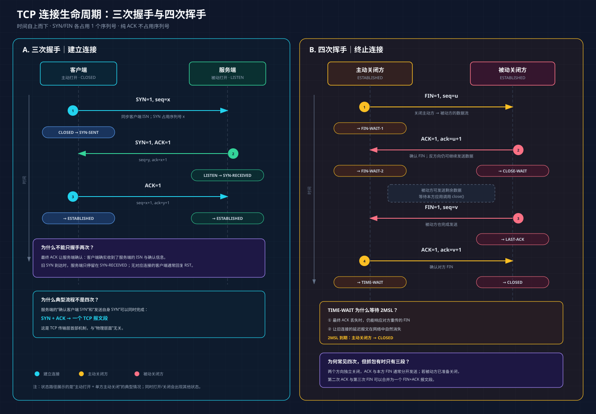

# TCP 三次握手与四次挥手

# 8. TCP 三次握手（连接建立）

## （1）握手流程

## （2）各阶段详解

### 第一次握手：客户端发起连接

- 客户端发送 `SYN=1` 的报文段，通常不携带应用数据。
- `seq=x`：`x` 是客户端选择的初始序列号（ISN）。它由随时间变化、难以预测的算法产生，不应简单表述为“从 0 或 1 开始”或“完全随机”。
- `SYN` 会占用一个序列号，因此客户端后续发送报文时，序列号从 `x+1` 开始。
- 客户端状态：`CLOSED → SYN-SENT`。

### 第二次握手：服务端确认请求，并发起反向同步

- 服务端收到 `SYN` 后，发送 `SYN=1, ACK=1` 的报文段。
- `seq=y`：`y` 是服务端选择的初始序列号。
- `ack=x+1`：表示已收到客户端序列号为 `x` 的 `SYN`；加 1 是因为 `SYN` 占用一个序列号。
- 服务端状态：`LISTEN → SYN-RECEIVED`（有些工具显示为 `SYN_RECV`）。
- 在典型流程中，服务端可在同一个 TCP 报文段中同时设置 `SYN` 和 `ACK`，既确认客户端的 `SYN`，又向客户端同步自己的初始序列号。

### 第三次握手：客户端确认服务端的同步信息

- 客户端收到 `SYN+ACK` 后，发送 `ACK=1` 的报文段。
- 若该报文不携带数据，则 `seq=x+1`。
- `ack=y+1`：表示已收到服务端序列号为 `y` 的 `SYN`。
- 客户端发送该 ACK 后进入 `ESTABLISHED`。
- 服务端收到该 ACK 后，由 `SYN-RECEIVED` 进入 `ESTABLISHED`。
- 至此，双方完成初始序列号同步，并确认连接建立所需的双向通信路径可用。第三次握手的 ACK 可以携带应用数据，但通常将其画成纯 ACK。

> 计数规则：`SYN` 和 `FIN` 各占用一个序列号；不携带数据的纯 ACK 不占用序列号。

## （3）常见面试考点

### 考点一：报文与状态变化

| 次数 | 方向 | 关键字段 | 发送后/接收后的典型状态 |
|---|---|---|---|
| 1 | 客户端 → 服务端 | `SYN=1, seq=x` | 客户端：`SYN-SENT` |
| 2 | 服务端 → 客户端 | `SYN=1, ACK=1, seq=y, ack=x+1` | 服务端：`SYN-RECEIVED` |
| 3 | 客户端 → 服务端 | `ACK=1, seq=x+1, ack=y+1` | 双方：`ESTABLISHED` |

### 考点二：为什么通常需要三次，而不是两次？

三次握手的核心目的不是单纯“防止资源浪费”，而是：

1. 同步双方各自的初始序列号；
2. 让双方确认对方具备发送和接收能力；
3. 让服务端确认客户端已经收到服务端的初始序列号和确认信息。

若只有两次报文，服务端发送 `SYN+ACK` 后就必须认为连接已经建立，但它无法确认客户端是否收到了该报文，也无法可靠判断当前到达的 `SYN` 是否属于客户端仍然期望建立的连接。

**历史重复 SYN 场景：**

客户端先前发送的一个 `SYN` 因网络延迟长期滞留。原连接尝试已经结束后，这个旧 `SYN` 才到达服务端：

- 如果服务端在回复一次 `SYN+ACK` 后就直接进入已连接状态，旧 `SYN` 可能造成伪连接或半开连接，并占用连接资源。
- 在三次握手中，服务端回复 `SYN+ACK` 后仅进入 `SYN-RECEIVED`，仍需等待最终 ACK。当前客户端若没有对应连接，通常会回复 `RST`；即使 RST 丢失，服务端也会在重传超时后放弃这次半开连接。

因此，第三次握手使服务端获得“客户端确实收到了本次响应”的确认，并能更可靠地排除失效连接请求。

### 考点三：为什么典型流程不是四次？

服务端收到客户端的 `SYN` 后，需要完成两个逻辑动作：

- 用 `ACK` 确认客户端的 `SYN`；
- 用 `SYN` 同步服务端自己的初始序列号。

`SYN` 和 `ACK` 是 TCP 首部中的独立控制位，这两个动作并不冲突，通常可以合并在同一个 TCP 报文段中完成。因此没有必要固定拆成两个报文段，否则只会增加报文数量和连接建立时延。

> 注意：这是 TCP 传输层报文首部的机制，不应称为“物理层面”。“三次”指典型报文交互次数；协议逻辑的重点是双方序列号的同步与确认。

---

# 9. TCP 四次挥手（连接终止）

TCP 是全双工协议，两个方向的数据流需要分别关闭。以下描述的是一方主动关闭、另一方稍后关闭的典型流程。

## （1）各阶段详解

### 第一次挥手：主动关闭方停止发送

- 主动关闭方不再发送应用数据，发送 `FIN=1` 的报文段；`FIN` 也可以附在最后一段数据之后。
- `seq=u`：`u` 是该方向当前应使用的序列号。
- `FIN` 占用一个序列号。
- 主动关闭方状态：`ESTABLISHED → FIN-WAIT-1`。
- 发送 `FIN` 只关闭“主动方 → 被动方”这一方向。主动方仍可接收被动方尚未发送完的数据，这称为 TCP 的半关闭。

### 第二次挥手：被动关闭方确认 FIN

- 被动关闭方收到 `FIN` 后，立即发送 `ACK=1`。
- `ack=u+1`：表示已收到序列号为 `u` 的 `FIN`。
- 被动关闭方状态：`ESTABLISHED → CLOSE-WAIT`。
- 主动关闭方收到该 ACK 后：`FIN-WAIT-1 → FIN-WAIT-2`。
- 此时，主动方到被动方的数据方向已关闭；反方向仍可继续传输数据。

### 第三次挥手：被动关闭方也停止发送

- 被动关闭方的应用程序完成剩余数据发送并关闭连接后，发送 `FIN=1`。
- `seq=v`：`v` 是被动关闭方此时的当前序列号。由于第二次和第三次挥手之间可能发送过数据，不能机械地把它写成握手阶段某个固定值加 1。
- 被动关闭方状态：`CLOSE-WAIT → LAST-ACK`。

### 第四次挥手：主动关闭方确认 FIN

- 主动关闭方收到 `FIN` 后，发送 `ACK=1`。
- `ack=v+1`：表示已收到被动关闭方的 `FIN`。
- 主动关闭方进入 `TIME-WAIT`。
- 被动关闭方收到最终 ACK 后：`LAST-ACK → CLOSED`。
- 主动关闭方等待 `2MSL` 后：`TIME-WAIT → CLOSED`。

## （2）为什么通常需要四次？

收到对方的 `FIN` 只表示“对方不再发送数据”，并不表示本方也已经发送完毕。被动关闭方通常需要：

1. 先立即发送 ACK，确认已经收到对方的 FIN；
2. 等本方应用程序处理完毕并发送完剩余数据后，再发送自己的 FIN。

因此，第二次的 ACK 和第三次的 FIN 往往不能立即合并，典型过程表现为四次报文交互。若被动关闭方收到 FIN 时恰好也已准备关闭，则 ACK 和 FIN 可以合并发送，抓包中可能只看到三个报文段，但逻辑上仍包含两个方向各自的关闭与确认。

## （3）为什么需要 TIME-WAIT？

主动关闭方等待 `2MSL` 主要有两个目的：

- **保证连接可靠终止**：若最终 ACK 丢失，被动关闭方会重传 FIN；主动关闭方仍能再次发送 ACK。
- **让旧报文在网络中消失**：避免旧连接中的延迟报文干扰随后出现的、具有相同四元组的新连接。

## （4）常见状态变化

| 角色 | 典型状态路径 |
|---|---|
| 主动关闭方 | `ESTABLISHED → FIN-WAIT-1 → FIN-WAIT-2 → TIME-WAIT → CLOSED` |
| 被动关闭方 | `ESTABLISHED → CLOSE-WAIT → LAST-ACK → CLOSED` |

> 上表是最常见路径。若双方几乎同时发送 FIN，还可能出现 `CLOSING` 等状态。
