> **本文定位**：面向具备基础 C/C++ 知识的学习者，以 Windows Winsock 与 IPv4 为主线，同时兼顾计算机网络课程复习和 Socket 编程实践。文中涉及的 A/B/C 类地址属于历史分类和常见考试知识；现代网络实际使用 CIDR 前缀。

> **代码说明**：代码块按原稿保留，用于配合课堂理解 Winsock API。正文会指出其中的适用边界；若用于真实项目，还需自行补充返回值校验、长度控制、消息定界、超时、并发和安全处理。

<!-- 这是一张图片，ocr 内容为： -->
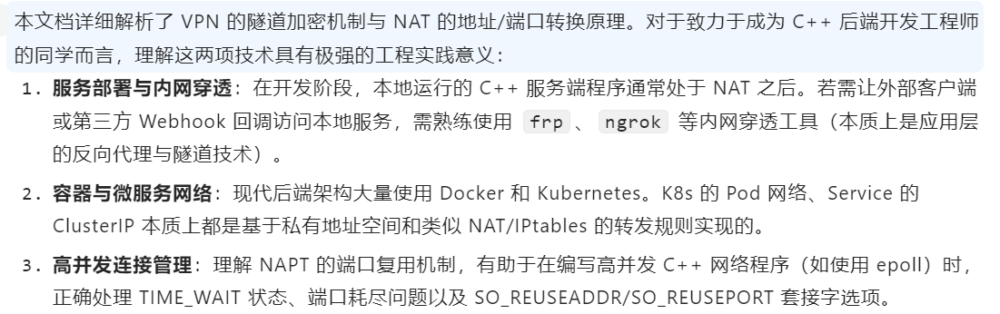
<!-- image-source: https://cdn.nlark.com/yuque/0/2026/png/67474974/1781444526841-7d8bab4f-e45a-405d-a5b6-1e68e3e3bc08.png -->

# 一、网络的基本模型
## 1.协议（Protocol）与网络分层概述
+ **协议的定义**：数据在网络中传输的**规则和约定**。它规定了数据必须包含哪些字段、格式如何组织、以及通信双方如何交互，以保证数据能够正确、有序地传输。
+ **分层思想的核心原则**：
    - **上层使用下层提供的服务，下层为上层提供服务**。
    - 各层之间相互独立，降低系统耦合度，便于维护和升级。

---

## 2.网络分层模型详解（OSI 七层模型）
> **💡**** 课堂重点提示**：在实际开发中，OSI七层模型过于复杂，通常会被简化为 **TCP/IP 四层模型**（应用层、传输层、网络层、网络接口层）。上三层（应用、表示、会话）在TCP/IP中被统称为“应用层”。
>

<!-- 这是一张图片，ocr 内容为： -->
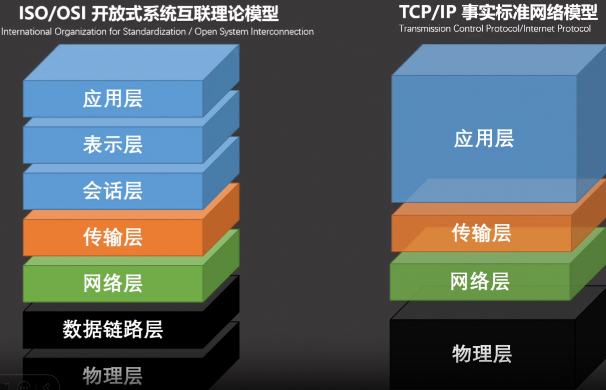
<!-- image-source: https://cdn.nlark.com/yuque/0/2026/png/67474974/1780045975756-75c17e73-162e-4fb2-9ed7-d2d84a9a05d8.png -->

### （1）应用层 (Application Layer)
+ **功能**：为用户的应用程序提供网络服务接口，处理特定的应用程序细节，提供应用在两个设备间的相同应用程序通信传输功能。
+ **常见协议及端口号速查表**：

| 协议名称 | 全称 / 功能描述 | 默认端口号 |
| :--- | :--- | :--- |
| **HTTP** | 超文本传输协议，用于网页浏览（明文传输） | **80** |
| **HTTPS** | HTTP 运行在 TLS 安全通道之上；TLS 是协议族，不是单一“加密算法” | **443** |
| **FTP** | 文件传输协议；控制连接通常使用 21，主动模式数据连接常由服务端 20 发起，被动模式使用协商出的端口 | **21**(控制), **20/协商端口**(数据) |
| **DNS** | 域名系统，将域名解析为IP地址 | **53** |
| **DHCP** | 动态主机配置协议，自动分配IP、子网掩码、网关等 | **67**(服务端), **68**(客户端) |
| **Telnet** | 远程登录协议（明文，不安全，现多被SSH取代） | **23** |
| **SSH** | 安全外壳协议，加密的远程登录和安全文件传输 | **22** |
| **SMTP** | 简单邮件传输协议；25 常用于服务器间传输，587 常用于邮件提交，465 常用于隐式 TLS | **25 / 587 / 465** |
| **POP3** | 邮局协议版本3，用于**接收**电子邮件 | **110** / 995(加密) |


### （2）表示层 (Presentation Layer)
+ **功能**：处理数据的语法和语义，确保一个系统的应用层发送的数据能被另一个系统的应用层读取。
+ **核心任务**：
    - **数据加解密**：提高传输安全性（如HTTPS中的SSL/TLS处理）。
    - **数据压缩/解压缩**：减少传输数据量，提高传输速率。
    - **数据格式转换**：如图片/视频的编解码、字符编码转换（ASCII到Unicode）。

### （3）会话层 (Session Layer)
+ **功能**：建立、管理和终止表示层实体之间的会话。
+ **核心任务**：
    - **Session会话管理**：维持状态（如网站登录状态保持、页面跳转时账户信息不变）。
    - **同步与检查点**：实现**断点续传**（在网络中断后，从上一次记录的断点位置继续传输，无需从头开始）。

---

_(注：以上三层主要在应用程序/软件内部处理，属于业务逻辑范畴)_

---

### （4）运输层 / 传输层 (Transport Layer)
+ **功能**：提供端到端（进程到进程）的可靠或不可靠的数据传输服务。这是**程序员通过操作系统API（Socket）主要打交道的层级**。
+ **核心协议对比**：

| 特性 | TCP (传输控制协议) | UDP (用户数据报协议) |
| :--- | :--- | :--- |
| **连接性** | **<font style="color:#DF2A3F;">面向连接</font>**（需三次握手建立连接） | **<font style="color:#DF2A3F;">无连接</font>**（直接发送） |
| **可靠性** | **<font style="color:#DF2A3F;">提供可靠字节流</font>**（通过确认、重传、排序等机制向应用交付有序且不重复的数据；应用仍需处理超时、断线和业务确认） | **<font style="color:#DF2A3F;">尽最大努力交付</font>**（不保证送达、顺序或不重复） |
| **传输方式** | **<font style="color:#DF2A3F;">基于字节流</font>**，不保留应用消息边界 | **<font style="color:#DF2A3F;">基于数据报</font>**，保留消息边界 |
| **开销与时延** | 基础首部至少 20 字节，并维护连接、流量控制和拥塞控制；不能简单概括为“效率低” | 首部固定 8 字节，无连接建立过程；协议开销较小，但应用若自行实现可靠性也会产生相应成本 |
| **应用场景** | 文件传输、邮件收发、网页浏览、远程登录（要求数据完整） | 音视频直播、在线游戏、DNS查询、物联网（要求低延迟） |


> ******传输层关联核心概念（必考/必会）**：
>
> + **端口 (Port)**：IP 地址用于定位网络接口，端口号用于标识主机上的传输层通信端点。操作系统通常结合**协议、本地 IP、本地端口以及远端地址信息**进行分用。端口并非绝对只能由一个进程使用：`SO_REUSEADDR`、多地址绑定和 TCP 连接四元组都会影响实际占用规则。
> + **Socket (套接字)**：网络通信的编程抽象，是应用调用操作系统网络栈的接口。监听或尚未连接的 Socket 不一定具有完整五元组；一条已建立的 TCP 连接通常由`协议 + 源 IP + 源端口 + 目的 IP + 目的端口`唯一标识。
> + **线程 (Thread)**：_（注：本质是操作系统概念）_ 在网络编程中用于解决**并发**问题。例如单核CPU通过时间片轮转实现“伪同时”（一个线程干一段时间后切换到另一个线程），多核CPU实现真并发；应用场景如：百度网盘同时下载多个文件、服务器同时处理多个客户端的Socket连接。
>

### （5）网络层 (Network Layer)
+ **功能**：负责将数据包从源主机跨越多个网络路由到目的主机（逻辑寻址与路由选择）。
+ **核心协议**：
    - **IP协议**：设备的逻辑标识。查看Windows IP命令：`ipconfig`。IPv4地址采用**点分十进制**表示（32位，分4段，每段8 bit，最大值为255）。
    - **ARP (地址解析协议)**：将**IP地址**解析为物理**MAC地址**（_局域网通信必须知道MAC地址_）。
    - **RARP (逆地址解析协议)**：将MAC地址解析为IP地址（_现已极少使用，被DHCP取代_）。
    - **ICMP**：互联网控制报文协议（用于Ping命令测试网络连通性）。

> ******网络层关联硬件/安全设备**：
>
> + **路由器 (Router)**：工作在网络层，基于**IP地址**进行寻址，负责跨网络（局域网到广域网）的数据转发。
> + **防火墙 (Firewall)**：网络安全屏障。原理是通过黑/白名单策略，拦截或放行特定IP、端口或协议的数据包。（_注：现代防火墙可工作在网络层至应用层_）。
>

### （6）数据链路层 (Data Link Layer)
+ **功能**：在相邻节点（同一局域网内）之间可靠地传输数据帧，并进行物理寻址和差错检测。
+ **核心概念**：
    - **MAC地址**：常见以太网 MAC 地址为 48 位，通常用十六进制表示。厂商分配的全局单播地址按设计应避免重复，但地址可以由软件修改，也存在本地管理地址和虚拟网卡地址，因此不能把“全球唯一”当作绝对保证。

> **💡**** 数据链路层关联硬件**：
>
> + **网卡 (NIC)**：计算机连接网络的硬件接口，拥有唯一的MAC地址。
> + **交换机 (Switch)**：工作在数据链路层，基于**MAC地址**在**局域网内部**转发数据帧。
> + _【路由器 vs 交换机 区别】_：交换机用于组建局域网（同网段通信，成本低）；路由器用于连接不同的局域网/广域网（跨网段通信，支持NAT和路由寻址）。
>

### （7）物理层 (Physical Layer)
+ **功能**：在物理媒介上透明地传输**比特流（0和1）**。
+ **传输介质与信号**：
    - **电信号**：高电平代表1，低电平代表0。远距离传输会衰减，需要**中继器/放大器**。
    - **光信号**：有光代表1，无光代表0。传输速度极快，抗干扰能力强，远距离损耗小（光纤）。

---

## 3.数据的封装与解封装（PDU 协议数据单元）
数据在发送端自上而下传输时，每一层都会加上自己的“头部（Header）”信息，这个过程叫**封装**；接收端自下而上叫**解封装**。

| 网络层级 | 数据单元名称 (PDU) | 核心添加的信息 |
| :--- | :--- | :--- |
| **应用层** | 报文 (Message) | 应用层协议头（如HTTP请求头） |
| **运输层** | 数据段 (Segment) / 数据报 (Datagram) | **源端口、目的端口**（TCP/UDP头部） |
| **网络层** | 数据包 (Packet) / IP数据报 | **源IP、目的IP**（IP头部） |
| **数据链路层** | 数据帧 (Frame) | **源MAC、目的MAC**（帧头/帧尾） |
| **物理层** | 比特流 (Bit) | 转换为光/电信号 |


---

## 4.C/S 架构与 B/S 架构对比
| 对比维度 | C/S 架构 (Client / Server) | B/S 架构 (Browser / Server) |
| :--- | :--- | :--- |
| **全称** | 客户端 / 服务器 架构 | 浏览器 / 服务器 架构 |
| **客户端形态** | **固定**：需要开发、下载、安装独立的客户端软件（如微信、王者荣耀） | **不固定**：无需安装，任何浏览器（Chrome、Edge）均可作为客户端访问 |
| **通信协议** | **不固定**：可使用 HTTP(S)、基于 TCP/UDP 的自定义应用协议等 | **通常使用 HTTP / HTTPS**；浏览器还会使用 WebSocket、WebTransport 等由 Web 平台支持的协议 |
| **更新与维护** | 客户端发布和兼容成本通常较高，但可通过自动更新和向后兼容降低成本 | 前端资源通常由服务端发布，更新更集中；仍需考虑缓存、浏览器兼容和接口版本 |
| **系统性能** | 可充分利用客户端PC的性能（如3D渲染、本地缓存） | 严重依赖服务器性能和网络带宽，浏览器端处理能力有限 |
| **典型应用** | 大型网游、专业设计软件、即时通讯工具（QQ/微信） | 门户网站、企业内部OA系统、在线电商网站（淘宝/京东） |


**C/S：C**lient** S**erver **客户端和服务器**

1. 客户端固定：每个应用程序有自己独立的客户端
2. 协议不固定：客户端和服务器通信可以使用任意协议

**B/S：B**rowser** S**erver** 浏览器和服务器**

1. 客户端不固定：任何浏览器都能使用这个网站
2. 协议受浏览器平台约束：主体通常基于 HTTP/HTTPS，也可使用 WebSocket 等浏览器支持的机制

---

# 二、基于UDP的通信实践——服务端
## 1.课程核心概述
+ **通信模型**：客户端/服务端（C/S）架构。通信双方通常是不同进程，也可以是同一进程中的不同 Socket；实时收发时相应端点需要处于可通信状态，但 UDP 本身不建立连接，也不保证对方在线。
+ **通信协议**：本节课基于 **UDP协议**（用户数据报协议）。
    - _特点_：无连接、面向数据报、协议开销较小、尽最大努力交付。
+ **通信逻辑**：示例为了简化控制流程，采用“轮流收发”的应用逻辑。UDP 并不存在 TCP 式连接，Socket 也不因此变成半双工；双方仍可各自独立发送和接收数据报。

---

## 2.核心前置基础知识（重点补充与提炼）
### （1）静态库与动态库的区别
在C/C++开发中，调用外部功能需要依赖库文件。

| 特性 | 静态库 (Static Library) | 动态库 (Dynamic Library) |
| :--- | :--- | :--- |
| **文件后缀** | Windows: `.lib` / Linux: `.a` | Windows: `.dll` + `.lib`(导入库) / Linux: `.so` |
| **加载时机** | **链接时**由链接器把所需目标代码纳入最终可执行文件。 | 链接时记录动态依赖和导入信息，程序加载或首次调用时由加载器解析动态库符号。 |
| **优点** | 1. 运行速度略快（直接寻址）。   2. 发布方便，只需提供一个EXE文件。 | 1. 节省内存（多个程序共享同一份DLL内存）。   2. 库升级方便，只需替换DLL，无需重新编译EXE。 |
| **缺点** | 1. 导致EXE体积庞大。   2. 浪费内存（多程序运行会加载多份相同代码）。   3. 库更新需重新编译整个EXE。 | 1. 发布时必须同时提供EXE和DLL文件。   2. 运行时需要额外寻址，速度微慢。 |
| **使用三步曲** | 1. 包含头文件   2. 链接静态库文件 | 1. 包含头文件   2. 链接导入库(.lib)   3. **确保.dll与.exe在同一目录或系统环境变量中** |


---

####  静态库 (Windows: `.lib` / Linux: `.a`)
+ **本质**：目标文件（Object Files）的**压缩包/归档文件（Archive）**。
+ **里面装的是什么？**
    1. **实打实的机器码**：包含了你写的函数和全局变量编译后的**完整二进制实现代码**（Windows下是打包了一堆 `.obj` 文件，Linux下是打包了一堆 `.o` 文件）。
    2. **符号表（Symbol Table）**：记录了每个函数名/变量名对应在这堆机器码中的偏移地址。
+ **工作机制**：在**编译链接阶段**，链接器会像解压文件一样，把你代码中用到的那些 `.obj/.o` 文件从静态库中**完整地抽离出来，直接复制、拼接**到最终生成的 `.exe` 或可执行文件中。

---

#### 动态库实体 (Windows: `.dll` / Linux: `.so`)
+ **本质**：它本身就是一个**独立的、可执行的二进制文件**（只是没有 `main` 入口函数，不能双击直接运行）。
+ **里面装的是什么？**
    1. **完整的机器码**：包含了所有函数的具体实现代码（和数据段）。
    2. **导出表（Export Table）**：这是一份“对外公开菜单”，记录了哪些函数是允许外部调用的，以及它们在库内的相对地址。
    3. **导入表（Import Table）**：如果这个动态库还依赖了其他动态库，这里会记录它需要向谁“求助”。
    4. **重定位信息**：因为动态库在内存中的加载地址是不固定的，所以需要这些信息在运行时动态修正内存地址。
+ **工作机制**：在**编译阶段**，你的 `.exe` **不会**复制这些机器码。在**程序运行阶段**，操作系统（Loader）会将 `.dll/.so` 加载到内存中，多个程序可以**共享**内存中的这一份代码，从而节省内存。

---

#### Windows 专属：导入库 (Windows: `.lib` for DLL)
这是Windows特有的产物，虽然后缀也是 `.lib`，但它和“静态库”**没有半毛钱关系**！它是配合 `.dll` 使用的“伴生文件”。

+ **本质**：一个 **“桩（Stub）”集合** 或 **“地址索引簿”**。
+ **里面装的是什么？**
    1. 通常不包含 DLL 中函数的完整实现；可能包含少量导入跳板或辅助目标代码。
    2. **函数名与DLL的映射关系**：记录了“函数A属于 `xxx.dll`”。
    3. **占位符代码（Stub/跳板代码）**：提供一些假的函数入口，用来“骗”过编译器，让编译器在链接时能顺利生成 **IAT（导入地址表，Import Address Table）**。
+ **为什么需要它？**  
Windows的链接器（Linker）在编译生成 `.exe` 时，必须确认所有调用的函数都有明确的地址，否则就会报 `LNK2019: 无法解析的外部符号` 错误。  
因为 `.dll` 里的代码在运行时才会加载到内存，编译期根本不知道真实地址。所以微软提供了这个**导入库（.lib）**，里面装上“假地址（占位符）”交给链接器交差。等程序真正**运行**时，Windows系统会读取 `.exe` 里的 IAT 表，找到对应的 `.dll` 加载进内存，并把真实的内存地址**替换**掉那些假地址。

---

#### 为什么 Linux 没有导入库（.lib）？
很多从Windows转到Linux的程序员会疑惑：为什么Linux下用 `.so`（动态库），**只需要一个 **`.so`** 文件就能完成编译链接，而不需要像Windows那样提供一个额外的 **`.lib`** 导入库？**

+ **答案**：这是 PE/COFF 与 ELF 工具链、导出信息组织方式不同造成的设计差异，不宜简单归因于某个链接器“更聪明”。
+ 在Linux下，`.so` 文件本身就包含了完整的**动态符号表（Dynamic Symbol Table）**。Linux的链接器在编译期，可以直接读取 `.so` 文件里的符号表来解析函数名，生成重定位信息（GOT/PLT表）。
+ 而早期的Windows设计（PE格式）将“编译期需要的符号信息”和“运行期需要的代码”严格分离开了，所以必须额外生成一个 `.lib` 专门给编译期用，`.dll` 专门给运行期用。

---

#### 总结
| 文件类型 | 后缀名 | 里面装的核心内容 | 是否包含代码实现(机器码)？ | 作用阶段 |
| :--- | :--- | :--- | :---: | :--- |
| **静态库** | Win: `.lib`   Linux: `.a` | 打包的 `.obj/.o` 目标文件集合、符号表 | ******包含** | **编译期** (被直接塞进exe) |
| **动态库实体** | Win: `.dll`   Linux: `.so` | 独立的机器码、导出表、导入表、数据段 | ******包含** | **运行期** (被系统加载到内存共享) |
| **导入库**   _(Win特有)_ | Win: `.lib` | 函数名、对应的DLL名、**占位符(Stub)** | ******不包含** | **编译期** (骗过链接器，生成IAT表) |


******避坑指南（Windows开发）：**  
当你在网上下载了一个第三方库（比如 `OpenCV` 或 `FFmpeg`），如果对方提供的是动态库版本，你通常会收到两个文件：`xxx.dll` 和 `xxx.lib`。

+ `.lib` 要配置到 VS 的“附加依赖项”里（用于**编译**通过）。
+ `.dll` 要复制到你的 `.exe` 同级目录下，或者配置到系统的环境变量 PATH 中（用于**运行**时不报“找不到 dll”的错误）。

### （2）输入参数与输出参数（C语言指针核心概念）
+ **输入参数**：调用者传递给函数的数据（通常为普通变量或 `const` 指针），函数内部读取但不修改。
+ **输出参数**：函数执行后需要返回给调用者的数据。由于C语言函数 `return` 只能返回一个值，**通常通过传递指针（变量的地址）来实现“输出参数”**。函数内部通过解引用修改该地址指向的内存，从而改变外部变量的值。

### （3）网络字节序与大小端（详细解释）
+ **主机字节序**：CPU 在本地内存中组织多字节整数的方式。常见 x86/x64 主机使用小端，但主机字节序并不天然等于小端。
+ **网络字节序（大端存储）**：网络传输统一规定的标准（高位字节存在低地址）。
+ **为什么需要转换？** 通信双方必须对多字节字段采用一致编码。Socket 地址中的端口和二进制 IPv4 地址等协议字段使用网络字节序；应用负载是否转换取决于应用层协议，文本和单字节数据不应机械调用字节序转换函数。
+ **转换函数**：
    - `htons()`：Host to Network Short（将16位端口号转为网络字节序）。
    - `htonl()`：Host to Network Long（将32位IP地址转为网络字节序）。

---

## <font style="color:rgb(29, 29, 31);">3.核心 Winsock API 字典与底层结构体解析 (硬核必查)</font>
### <font style="color:rgb(29, 29, 31);">（1）WSAStartup (加载/初始化 Winsock 库)</font>
+ **<font style="color:rgb(29, 29, 31);">原型</font>**<font style="color:rgb(29, 29, 31);">：</font>`<font style="color:rgb(97, 92, 237);">int WSAStartup(WORD wVersionRequested, LPWSADATA lpWSAData);</font>`
+ **<font style="color:rgb(29, 29, 31);">参数</font>**<font style="color:rgb(29, 29, 31);">：</font>
    - `<font style="color:rgb(97, 92, 237);">wVersionRequested</font>`<font style="color:rgb(29, 29, 31);"> (输入)：请求的Winsock库版本号。</font>
    - `<font style="color:rgb(97, 92, 237);">lpWSAData</font>`<font style="color:rgb(29, 29, 31);"> (输出)：指向 </font>`<font style="color:rgb(97, 92, 237);">WSADATA</font>`<font style="color:rgb(29, 29, 31);"> 结构体的指针，用于接收系统返回的库详细信息。</font>
+ **<font style="color:rgb(29, 29, 31);">返回值</font>**<font style="color:rgb(29, 29, 31);">：成功返回 </font>`<font style="color:rgb(97, 92, 237);">0</font>`<font style="color:rgb(29, 29, 31);">；失败返回非零错误码。</font>
+ **<font style="color:rgb(29, 29, 31);">核心宏 </font>**`**<font style="color:rgb(97, 92, 237);">MAKEWORD(a, b)</font>**`<font style="color:rgb(29, 29, 31);">：将两个字节组合成一个 </font>`<font style="color:rgb(97, 92, 237);">WORD</font>`<font style="color:rgb(29, 29, 31);"> (16位无符号整数)。</font>`<font style="color:rgb(97, 92, 237);">a</font>`<font style="color:rgb(29, 29, 31);"> 为低字节(主版本号)，</font>`<font style="color:rgb(97, 92, 237);">b</font>`<font style="color:rgb(29, 29, 31);"> 为高字节(副版本号)。例如 </font>`<font style="color:rgb(97, 92, 237);">MAKEWORD(2, 2)</font>`<font style="color:rgb(29, 29, 31);"> 生成 2.2 版本标识。</font>
+ **<font style="color:rgb(29, 29, 31);">结构体 </font>**`**<font style="color:rgb(97, 92, 237);">WSADATA</font>**`<font style="color:rgb(29, 29, 31);">：</font>
    - `<font style="color:rgb(97, 92, 237);">wVersion</font>`<font style="color:rgb(29, 29, 31);">：调用方应使用的 Winsock 版本。请求 2.2 时可用 `LOBYTE`、`HIBYTE` 检查主版本和副版本；若版本不满足要求，应调用 `WSACleanup()` 后退出。</font>
    - `<font style="color:rgb(97, 92, 237);">wHighVersion</font>`<font style="color:rgb(29, 29, 31);">：当前系统 Winsock DLL 支持的最高版本号。</font>

### <font style="color:rgb(29, 29, 31);">（2）socket (创建套接字)</font>
+ **<font style="color:rgb(29, 29, 31);">原型</font>**<font style="color:rgb(29, 29, 31);">：</font>`<font style="color:rgb(97, 92, 237);">SOCKET socket(int af, int type, int protocol);</font>`
+ **<font style="color:rgb(29, 29, 31);">参数</font>**<font style="color:rgb(29, 29, 31);">：</font>
    - `<font style="color:rgb(97, 92, 237);">af</font>`<font style="color:rgb(29, 29, 31);"> (地址族)：常用宏 </font>`**<font style="color:rgb(97, 92, 237);">AF_INET</font>**`<font style="color:rgb(29, 29, 31);"> (代表 IPv4 地址类型)。</font>
    - `<font style="color:rgb(97, 92, 237);">type</font>`<font style="color:rgb(29, 29, 31);"> (套接字类型)：常用宏 </font>`**<font style="color:rgb(97, 92, 237);">SOCK_DGRAM</font>**`<font style="color:rgb(29, 29, 31);"> (数据报，对应 UDP) 或 </font>`<font style="color:rgb(97, 92, 237);">SOCK_STREAM</font>`<font style="color:rgb(29, 29, 31);"> (字节流，对应 TCP)。</font>
    - `<font style="color:rgb(97, 92, 237);">protocol</font>`<font style="color:rgb(29, 29, 31);"> (协议)：常用宏 </font>`**<font style="color:rgb(97, 92, 237);">IPPROTO_UDP</font>**`<font style="color:rgb(29, 29, 31);"> 或 </font>`<font style="color:rgb(97, 92, 237);">IPPROTO_TCP</font>`<font style="color:rgb(29, 29, 31);">。</font>
+ **<font style="color:rgb(29, 29, 31);">返回值</font>**<font style="color:rgb(29, 29, 31);">：成功返回一个 </font>`<font style="color:rgb(97, 92, 237);">SOCKET</font>`<font style="color:rgb(29, 29, 31);"> 描述符（本质是 </font>`<font style="color:rgb(97, 92, 237);">UINT_PTR</font>`<font style="color:rgb(29, 29, 31);"> 句柄）；失败返回宏 </font>`**<font style="color:rgb(97, 92, 237);">INVALID_SOCKET</font>**`<font style="color:rgb(29, 29, 31);">。</font>

### <font style="color:rgb(29, 29, 31);">（3）bind (绑定本地 IP 和 端口)</font>
+ **<font style="color:rgb(29, 29, 31);">原型</font>**<font style="color:rgb(29, 29, 31);">：</font>`<font style="color:rgb(97, 92, 237);">int bind(SOCKET s, const struct sockaddr *name, int namelen);</font>`
+ **<font style="color:rgb(29, 29, 31);">参数</font>**<font style="color:rgb(29, 29, 31);">：</font>
    - `<font style="color:rgb(97, 92, 237);">s</font>`<font style="color:rgb(29, 29, 31);">：</font>`<font style="color:rgb(97, 92, 237);">socket()</font>`<font style="color:rgb(29, 29, 31);"> 返回的套接字描述符。</font>
    - `<font style="color:rgb(97, 92, 237);">name</font>`<font style="color:rgb(29, 29, 31);"> (输入)：指向通用地址结构体 </font>`<font style="color:rgb(97, 92, 237);">sockaddr</font>`<font style="color:rgb(29, 29, 31);"> 的指针。实际编程中通常传入 </font>`<font style="color:rgb(97, 92, 237);">sockaddr_in</font>`<font style="color:rgb(29, 29, 31);"> 的强转指针 </font>`<font style="color:rgb(97, 92, 237);">(struct sockaddr*)&addr</font>`<font style="color:rgb(29, 29, 31);">。</font>
    - `<font style="color:rgb(97, 92, 237);">namelen</font>`<font style="color:rgb(29, 29, 31);"> (输入)：地址结构体的字节长度，使用 </font>`<font style="color:rgb(97, 92, 237);">sizeof()</font>`<font style="color:rgb(29, 29, 31);"> 获取。因为C语言指针无法计算指向内存的大小，必须显式传入。</font>
+ **<font style="color:rgb(29, 29, 31);">返回值</font>**<font style="color:rgb(29, 29, 31);">：成功返回 </font>`<font style="color:rgb(97, 92, 237);">0</font>`<font style="color:rgb(29, 29, 31);">；失败返回宏 </font>`**<font style="color:rgb(97, 92, 237);">SOCKET_ERROR</font>**`<font style="color:rgb(29, 29, 31);">。</font>
+ **<font style="color:rgb(29, 29, 31);">结构体 </font>**`**<font style="color:rgb(97, 92, 237);">sockaddr_in</font>**`**<font style="color:rgb(29, 29, 31);"> (IPv4 专用)</font>**<font style="color:rgb(29, 29, 31);">：</font>
    - `<font style="color:rgb(97, 92, 237);">sin_family</font>`<font style="color:rgb(29, 29, 31);">：地址族，必须填 </font>`<font style="color:rgb(97, 92, 237);">AF_INET</font>`<font style="color:rgb(29, 29, 31);">。</font>
    - `<font style="color:rgb(97, 92, 237);">sin_port</font>`<font style="color:rgb(29, 29, 31);">：端口号。</font>**<font style="color:rgb(29, 29, 31);">必须使用网络字节序</font>**<font style="color:rgb(29, 29, 31);">，需调用宏/函数 </font>`**<font style="color:rgb(97, 92, 237);">htons()</font>**`<font style="color:rgb(29, 29, 31);"> (Host to Network Short) 进行转换。</font>
    - `<font style="color:rgb(97, 92, 237);">sin_addr</font>`<font style="color:rgb(29, 29, 31);">：IP地址结构体（类型为 </font>`<font style="color:rgb(97, 92, 237);">in_addr</font>`<font style="color:rgb(29, 29, 31);">）。</font>
+ **<font style="color:rgb(29, 29, 31);">结构体 </font>**`**<font style="color:rgb(97, 92, 237);">in_addr</font>**`<font style="color:rgb(29, 29, 31);">：</font>
    - `<font style="color:rgb(97, 92, 237);">s_addr</font>`<font style="color:rgb(29, 29, 31);">：32位 IPv4 地址值。`INADDR_ANY` 用于本地绑定时表示所有合适的本地 IPv4 接口；现代代码优先使用可移植字段名 `s_addr`。</font>
+ **<font style="color:rgb(29, 29, 31);">结构体 </font>**`**<font style="color:rgb(97, 92, 237);">sockaddr</font>**`<font style="color:rgb(29, 29, 31);">：16字节的通用地址占位符。为了兼容不同协议族（如IPv6），API统一要求传入此类型指针，故需强转“欺骗”编译器。</font>

### <font style="color:rgb(29, 29, 31);">（4）recvfrom (接收 UDP 数据报)</font>
+ **<font style="color:rgb(29, 29, 31);">原型</font>**<font style="color:rgb(29, 29, 31);">：</font>`<font style="color:rgb(97, 92, 237);">int recvfrom(SOCKET s, char *buf, int len, int flags, struct sockaddr *from, int *fromlen);</font>`
+ **<font style="color:rgb(29, 29, 31);">参数</font>**<font style="color:rgb(29, 29, 31);">：</font>
    - `<font style="color:rgb(97, 92, 237);">s</font>`<font style="color:rgb(29, 29, 31);">：绑定的套接字。</font>
    - `<font style="color:rgb(97, 92, 237);">buf</font>`<font style="color:rgb(29, 29, 31);"> (输出)：接收数据的缓冲区（字符数组）。</font>
    - `<font style="color:rgb(97, 92, 237);">len</font>`<font style="color:rgb(29, 29, 31);">：缓冲区最大长度（通常用 </font>`<font style="color:rgb(97, 92, 237);">sizeof(buf)</font>`<font style="color:rgb(29, 29, 31);">）。</font>
    - `<font style="color:rgb(97, 92, 237);">flags</font>`<font style="color:rgb(29, 29, 31);">：标志位，通常填 </font>`<font style="color:rgb(97, 92, 237);">0</font>`<font style="color:rgb(29, 29, 31);">。</font>
    - `<font style="color:rgb(97, 92, 237);">from</font>`<font style="color:rgb(29, 29, 31);"> (输出)：指向 </font>`<font style="color:rgb(97, 92, 237);">sockaddr</font>`<font style="color:rgb(29, 29, 31);"> 的指针，用于</font>**<font style="color:rgb(29, 29, 31);">保存发送端的IP和端口</font>**<font style="color:rgb(29, 29, 31);">（有了它才能知道是谁发来的，以便后续回复）。</font>
    - `<font style="color:rgb(97, 92, 237);">fromlen</font>`<font style="color:rgb(29, 29, 31);"> (输入/输出)：传入 </font>`<font style="color:rgb(97, 92, 237);">from</font>`<font style="color:rgb(29, 29, 31);"> 缓冲区的大小，函数返回实际写入的地址结构体大小。</font>
+ **<font style="color:rgb(29, 29, 31);">返回值</font>**<font style="color:rgb(29, 29, 31);">：成功返回接收到的</font>**<font style="color:rgb(29, 29, 31);">字节数</font>**<font style="color:rgb(29, 29, 31);">；失败返回 </font>`<font style="color:rgb(97, 92, 237);">SOCKET_ERROR</font>`<font style="color:rgb(29, 29, 31);">。</font>

### <font style="color:rgb(29, 29, 31);">（5）sendto (发送 UDP 数据报)</font>
+ **<font style="color:rgb(29, 29, 31);">原型</font>**<font style="color:rgb(29, 29, 31);">：</font>`<font style="color:rgb(97, 92, 237);">int sendto(SOCKET s, const char *buf, int len, int flags, const struct sockaddr *to, int tolen);</font>`
+ **<font style="color:rgb(29, 29, 31);">参数</font>**<font style="color:rgb(29, 29, 31);">：</font>
    - `<font style="color:rgb(97, 92, 237);">s</font>`<font style="color:rgb(29, 29, 31);">：套接字。</font>
    - `<font style="color:rgb(97, 92, 237);">buf</font>`<font style="color:rgb(29, 29, 31);"> (输入)：要发送的数据缓冲区。</font>
    - `<font style="color:rgb(97, 92, 237);">len</font>`<font style="color:rgb(29, 29, 31);">：要发送的数据</font>**<font style="color:rgb(29, 29, 31);">实际字节数</font>**<font style="color:rgb(29, 29, 31);">。是否包含字符串结束符 `\0` 由应用协议决定；网络 API 不要求发送 `\0`。</font>
    - `<font style="color:rgb(97, 92, 237);">flags</font>`<font style="color:rgb(29, 29, 31);">：标志位，通常填 </font>`<font style="color:rgb(97, 92, 237);">0</font>`<font style="color:rgb(29, 29, 31);">。</font>
    - `<font style="color:rgb(97, 92, 237);">to</font>`<font style="color:rgb(29, 29, 31);"> (输入)：指向目标 </font>`<font style="color:rgb(97, 92, 237);">sockaddr</font>`<font style="color:rgb(29, 29, 31);"> 的指针（通常直接复用 </font>`<font style="color:rgb(97, 92, 237);">recvfrom</font>`<font style="color:rgb(29, 29, 31);"> 获取到的 </font>`<font style="color:rgb(97, 92, 237);">from</font>`<font style="color:rgb(29, 29, 31);"> 地址，实现“谁发给我，我就回给谁”）。</font>
    - `<font style="color:rgb(97, 92, 237);">tolen</font>`<font style="color:rgb(29, 29, 31);">：目标地址结构体的大小。</font>
+ **<font style="color:rgb(29, 29, 31);">返回值</font>**<font style="color:rgb(29, 29, 31);">：成功返回实际发送的字节数；失败返回 </font>`<font style="color:rgb(97, 92, 237);">SOCKET_ERROR</font>`<font style="color:rgb(29, 29, 31);">。</font>

### <font style="color:rgb(29, 29, 31);">（6）closesocket (关闭套接字)</font>
+ **<font style="color:rgb(29, 29, 31);">原型</font>**<font style="color:rgb(29, 29, 31);">：</font>`<font style="color:rgb(97, 92, 237);">int closesocket(SOCKET s);</font>`
+ **<font style="color:rgb(29, 29, 31);">参数</font>**<font style="color:rgb(29, 29, 31);">：</font>`<font style="color:rgb(97, 92, 237);">s</font>`<font style="color:rgb(29, 29, 31);">: 要关闭的套接字描述符。</font>
+ **<font style="color:rgb(29, 29, 31);">返回值</font>**<font style="color:rgb(29, 29, 31);">：成功返回 </font>`<font style="color:rgb(97, 92, 237);">0</font>`<font style="color:rgb(29, 29, 31);">；失败返回 </font>`<font style="color:rgb(97, 92, 237);">SOCKET_ERROR</font>`<font style="color:rgb(29, 29, 31);">。</font>
+ **<font style="color:rgb(29, 29, 31);">作用</font>**<font style="color:rgb(29, 29, 31);">：释放操作系统分配的 Socket 资源和绑定的端口。</font>

### <font style="color:rgb(29, 29, 31);">（7）WSACleanup (卸载 Winsock 库)</font>
+ **<font style="color:rgb(29, 29, 31);">原型</font>**<font style="color:rgb(29, 29, 31);">：</font>`<font style="color:rgb(97, 92, 237);">int WSACleanup(void);</font>`
+ **<font style="color:rgb(29, 29, 31);">参数</font>**<font style="color:rgb(29, 29, 31);">：无。</font>
+ **<font style="color:rgb(29, 29, 31);">返回值</font>**<font style="color:rgb(29, 29, 31);">：成功返回 </font>`<font style="color:rgb(97, 92, 237);">0</font>`<font style="color:rgb(29, 29, 31);">；失败返回 </font>`<font style="color:rgb(97, 92, 237);">SOCKET_ERROR</font>`<font style="color:rgb(29, 29, 31);">。</font>
+ **<font style="color:rgb(29, 29, 31);">作用</font>**<font style="color:rgb(29, 29, 31);">：终止对 </font>`<font style="color:rgb(97, 92, 237);">WS2_32.dll</font>`<font style="color:rgb(29, 29, 31);"> 的使用，清理 Winsock 环境。</font>**<font style="color:rgb(29, 29, 31);">必须与 </font>**`**<font style="color:rgb(97, 92, 237);">WSAStartup</font>**`**<font style="color:rgb(29, 29, 31);"> 成对出现</font>**<font style="color:rgb(29, 29, 31);">。</font>

**<font style="color:rgb(140, 141, 155);">💡</font>****<font style="color:rgb(140, 141, 155);"> 辅助常用函数/宏补充</font>**<font style="color:rgb(140, 141, 155);">：</font>

+ `<font style="color:rgb(97, 92, 237);">htons()</font>`<font style="color:rgb(140, 141, 155);"> / </font>`<font style="color:rgb(97, 92, 237);">htonl()</font>`<font style="color:rgb(140, 141, 155);">：将主机字节序转换为网络字节序（大端）；在大端主机上转换可能等价于原值。</font>
+ `<font style="color:rgb(97, 92, 237);">inet_ntoa()</font>`<font style="color:rgb(140, 141, 155);">：将 </font>`<font style="color:rgb(97, 92, 237);">in_addr</font>`<font style="color:rgb(140, 141, 155);"> 结构体中的二进制IP转换为</font>**<font style="color:rgb(140, 141, 155);">点分十进制字符串</font>**<font style="color:rgb(140, 141, 155);">（如 "192.168.1.1"），方便打印显示。</font>
+ `<font style="color:rgb(97, 92, 237);">WSAGetLastError()</font>`<font style="color:rgb(140, 141, 155);">：当API返回 </font>`<font style="color:rgb(97, 92, 237);">SOCKET_ERROR</font>`<font style="color:rgb(140, 141, 155);"> 时，调用此函数获取具体的系统错误码（如 </font>`<font style="color:rgb(97, 92, 237);">10048</font>`<font style="color:rgb(140, 141, 155);"> 端口被占用）。</font>

## 4.UDP 服务端标准开发流程
服务端的完整生命周期分为：**准备阶段 -> 核心循环 -> 收尾阶段**。

### （1）准备阶段
#### 步骤一：加载 Winsock 库 (WSAStartup)
Windows 下的网络编程依赖 `ws2_32.dll`。

+ **头文件**：`#include <winsock2.h>`
+ **链接库**：`#pragma comment(lib, "ws2_32.lib")`
+ **函数原型**：`int WSAStartup(WORD wVersionRequested, LPWSADATA lpWSAData);`
    - `wVersionRequested`：请求的版本号，使用宏 `MAKEWORD(2, 2)` 生成 2.2 版本。
    - `lpWSAData`：**输出参数**，接收系统返回的库详细信息（结构体）。
+ **注意**：加载成功后检查 `LOBYTE(data.wVersion) == 2 && HIBYTE(data.wVersion) == 2`；不满足要求时清理并退出。

#### 步骤二：创建套接字 (socket)
套接字（Socket）是网络通信的基石，本质上是操作系统分配给进程的一个**资源句柄**（本质为 `UINT_PTR` 无符号整型）。

+ **函数**：`socket(af, type, protocol)`
    - `af` (地址族)：`AF_INET` (IPv4)。
    - `type` (类型)：`SOCK_DGRAM` (数据报，对应UDP)。
    - `protocol` (协议)：`IPPROTO_UDP`。
+ **错误处理**：失败返回 `INVALID_SOCKET`。需调用 `WSAGetLastError()` 获取错误码（可在VS的 `工具 -> 错误查找` 中输入错误码，如 `10048` 代表端口被占用）。

#### 步骤三：绑定 IP 和 端口 (bind)
告诉操作系统：“当前进程（PID）要使用哪个IP和端口来接收数据”。

+ **结构体 **`sockaddr_in`** 赋值**：

```c
struct sockaddr_in serverAddr;
serverAddr.sin_family = AF_INET;
// 端口号必须转为网络字节序
serverAddr.sin_port = htons(12345); 
// IP地址转换。INADDR_ANY (0.0.0.0) 代表绑定本机所有网卡IP
serverAddr.sin_addr.S_un.S_addr = htonl(INADDR_ANY); 
```

    - _补充解释 _`INADDR_ANY`：一台电脑可能有多个网卡（有线、无线、虚拟机），“成年人全都要”，绑定 `0.0.0.0` 可以监听所有网卡的该端口。
+ **强转指针**：`bind()` 函数要求传入泛型指针 `(struct sockaddr*)`，因此需要将 `sockaddr_in` 强转。
+ **为什么需要 **`namelen`** 参数？** 因为C语言中指针无法计算其指向内存块的大小，必须由调用者显式传入结构体的长度 `sizeof(serverAddr)`。

### （2）核心循环阶段
#### 接收数据 (recvfrom)
+ **作用**：阻塞等待客户端发送数据。
+ **核心参数**：
    - `buf`：接收数据的缓冲区。
    - `from`：**输出参数**，用于保存“是谁（哪个IP和端口）发来的数据”，以便后续回复。
    - `fromlen`：**输入/输出参数**，传入缓冲区大小，函数返回实际地址结构体的大小。

#### 发送数据 (sendto)
+ **作用**：将数据发送给指定的目标（通常就是 `recvfrom` 获取到的 `from` 地址）。

### （3）收尾阶段（资源回收）
**原则：先申请的资源后释放，后申请的资源先释放。**

1. **关闭套接字**：`closesocket(sock)` （释放端口和Socket资源）。
2. **卸载库**：`WSACleanup()` （清理Winsock环境）。
    - _注意_：应先关闭 Socket，再对每次成功的 `WSAStartup` 调用一次 `WSACleanup`。提前清理会使后续 Winsock 调用处于未初始化状态，但不能简单断言一定“卸载 DLL 并导致崩溃”。

---

## 5.UDP 客户端与服务端的差异
| 对比维度 | 服务端 (Server) | 客户端 (Client) |
| :--- | :--- | :--- |
| **启动顺序** | 若要接收客户端首先发来的数据，通常应先启动并绑定约定端口 | 可先启动；在服务端尚未就绪时发送的数据报可能丢失 |
| **绑定 (bind)** | 通常显式绑定稳定的本地地址和端口 | 通常不显式绑定；首次发送时由系统选择本地地址和临时端口，也可按需要显式绑定 |
| **发送目标** | 回复给 `recvfrom` 获取到的客户端地址 | 必须**明确指定**服务端的固定IP和固定端口。 |
| **通信流程** | 先 `recvfrom` (等) -> 后 `sendto` (说) | 先 `sendto` (说) -> 后 `recvfrom` (等) |


---

## 6.录音中提及的“坑”与调试技巧补充
### （1）IP地址转换函数的编译器警告
**问题**：Visual Studio 会提示 `inet_addr` 属于旧接口。它只处理 IPv4，而且以 `INADDR_NONE` 表示失败时会与 `255.255.255.255` 的返回值产生歧义。

**解法**

1. 临时维护旧代码时可以定义 `_WINSOCK_DEPRECATED_NO_WARNINGS`，但这只隐藏警告，不解决接口限制。
2. **现代标准写法**：新代码使用同时支持 IPv4/IPv6 的 `inet_pton`，并检查返回值：

```c
// 将字符串IP转换为网络字节序的二进制IP
inet_pton(AF_INET, "192.168.1.100", &serverAddr.sin_addr);
```

### （2）sockaddr 与 sockaddr_in 的关系（详细解释）
+ 录音中提到“结构体套联合体，看起来很复杂”。
+ **本质**：Socket API 使用通用的 `sockaddr*` 接收不同地址族的地址结构；调用时由地址族和长度说明具体结构。
+ **演进**：后来为了编程方便，设计了 `sockaddr_in`（专门针对IPv4，把14字节的数据区细分为了 `port` 和 `in_addr` 结构体）。
+ **内存布局**：在 Winsock 的 IPv4 场景中，`sockaddr` 与 `sockaddr_in` 具有兼容的起始布局，且常见实现均为 16 字节。强制转换是 API 约定的用法，不是“欺骗编译器”；IPv6 应使用 `sockaddr_in6`，通用存储宜使用 `sockaddr_storage`。

## <font style="color:rgb(29, 29, 31);">7.官方参考资料与实战代码示例</font>
### <font style="color:rgb(29, 29, 31);">（1）官方 API 参考文档</font>
+ **<font style="color:rgb(29, 29, 31);">Winsock2 官方文档</font>**<font style="color:rgb(29, 29, 31);">：</font>[<font style="color:rgb(97, 92, 237);">https://learn.microsoft.com/en-us/windows/win32/api/winsock2/</font>](https://learn.microsoft.com/en-us/windows/win32/api/winsock2/)
    - _<font style="color:rgb(29, 29, 31);">说明</font>_<font style="color:rgb(29, 29, 31);">：包含了 Windows Sockets 2 (</font>`<font style="color:rgb(97, 92, 237);">winsock2.h</font>`<font style="color:rgb(29, 29, 31);">) 的所有编程接口、函数（如 </font>`<font style="color:rgb(97, 92, 237);">socket</font>`<font style="color:rgb(29, 29, 31);">, </font>`<font style="color:rgb(97, 92, 237);">bind</font>`<font style="color:rgb(29, 29, 31);">, </font>`<font style="color:rgb(97, 92, 237);">recvfrom</font>`<font style="color:rgb(29, 29, 31);">, </font>`<font style="color:rgb(97, 92, 237);">sendto</font>`<font style="color:rgb(29, 29, 31);"> 等）、结构体（如 </font>`<font style="color:rgb(97, 92, 237);">sockaddr_in</font>`<font style="color:rgb(29, 29, 31);">, </font>`<font style="color:rgb(97, 92, 237);">WSADATA</font>`<font style="color:rgb(29, 29, 31);">）以及宏定义的权威说明。遇到未知的 API 参数或返回值时，应以此文档为准。</font>

### <font style="color:rgb(29, 29, 31);">（2）UDP 服务端完整实战代码 (C++)</font>
<font style="color:rgb(29, 29, 31);">以下为演示的 UDP 服务端完整 C++ 源码，包含了从加载库、创建套接字、绑定端口到循环收发数据的完整生命周期，并附带了详细的中文注释。</font>

```cpp
#include<iostream>
#include<winsock.h>

#define _WINSOCK_DEPRECATED_NO_WARNINGS//使用过时的函数时不弹出警告
#pragma comment(lib,"WS2_32.lib")

using namespace std;

int main()
{
	//1.加载库 WS2_32.lib
	WORD version = MAKEWORD(2, 2);
	WSADATA data = {};
	int err = WSAStartup(version, &data);//返回 0 成功，加载库的函数WSAStartup(输入参数：WORD库版本号,输出参数（传地址）：WSADATA结构体);
	//调用操作系统函数时一定要判断返回值（成功还是失败）
	if (0!=err)
	{
		cout << "WSAStartup fail" << endl;
		return 0;
	}
	//检查加载库的版本号是否成功
	if (data.wVersion == version)
	{
		cout << "WSAStartup success" << endl;
	}
	else
	{
		//库的版本号不对，卸载库
		cout << "WSAStartup version error" << endl;
		WSACleanup();//无参
		
		return 1;
	}

	//2.创建套接字 socket()
	SOCKET s = socket(AF_INET/*地址族 AF_INET ipv4地址类型*/
		, SOCK_DGRAM/*socket类型，SOCK_DGRAM 代表使用UDP协议*/
		, IPPROTO_UDP/*传输使用的协议*/);//成功返回socket，失败返回INVALID_SOCKET
	if (s == INVALID_SOCKET)
	{
		//错误码在错误查找（工具）中可查找错误原因
		//错误码10048：通常每个套接字地址(协议/网络地址/端口)只允许使用一次。通常是端口被占用
		cout << "socket error:" << WSAGetLastError() << endl;
		//卸载库
		WSACleanup();
		return 1;
	}
	else
	{
		cout << "socket success" << endl;
	}


	//3.绑定IP和端口号（告诉操作系统，当前进程使用哪个IP和端口，本地的）
	sockaddr_in addr = {};
	addr.sin_family = AF_INET;
	//大端存储和小端存储：网络字节序统一规定使用大端存储
	addr.sin_port = htons(12345);//绑定端口号，端口号尽量大，区分其它应用端口号  htons：转换成大端存储
	//IP地址有两种存储方式：
	//1.字符串类型：十进制四等分"192.168.1.222"
	//2.ulong类型：为了方便计算机存储和计算
	//inet_addr()：字符串转ulong
	//inet_ntoa()：ulong转字符串
	addr.sin_addr.S_un.S_addr = INADDR_ANY;//绑定所有IP

	err = bind(s,(sockaddr*)&addr,sizeof(addr));//返回SOCKET_ERROR则失败
	if (SOCKET_ERROR == err)
	{
		cout << "bind error:" << WSAGetLastError() << endl;
		closesocket(s);//参数是要关闭的套接字变量名
		WSACleanup();
		return 1;
	}
	else
	{
		cout << "bind success" << endl;
	}

	int nRecvNum = 0;
	int nSendNum = 0;
	char recvBuf[4096] = "";
	char sendBuf[4096] = "";
	sockaddr_in addrFrom={};
	int size = sizeof(addrFrom);
	while (true)
	{
		//4.接收消息 recvfrom()
		nRecvNum/*接收到的数据的长度*/ = recvfrom(s,recvBuf,sizeof(recvBuf),0/*初始化标志位*/,(sockaddr*)&addrFrom,&size);
		if (nRecvNum>0)
		{
			//收到数据，打印接收到的数据和发送端IP
			cout << "ip:"<<inet_ntoa(addrFrom.sin_addr)<<":"<< recvBuf <<endl;
		}
		else
		{
			cout << "recvfrom error:" << WSAGetLastError() << endl;
			break;
		}

		//从终端输入要传输的数据
		cin >> sendBuf;

		//5.回复消息 sendto()
		nSendNum = sendto(s,sendBuf,strlen(sendBuf)+1,0,(sockaddr*)&addrFrom,size);
		if (SOCKET_ERROR == nSendNum)
		{
			cout << "sendto error:" << WSAGetLastError() << endl;
			break;
		}
	}

	//6.关闭套接字 closesocket()
	closesocket(s);

	//7.卸载库 WSACleanup()
	WSACleanup();

	return 0;
}
```

> **示例边界**：以下代码按原稿保留，定位为阻塞、单线程的 API 演示。实际项目应按 `recvfrom` 返回的字节数处理数据，不能假定缓冲区必然以 `\0` 结尾，并应补充退出信号、超时、日志和输入长度限制。

---

# 三、基于UDP的通信实践——客户端
## 1.DHCP 协议与动态 IP 地址
**动态 IP 分配机制**

当设备连接到网络（如 WiFi 热点）时，会通过 **DHCP（Dynamic Host Configuration Protocol，动态主机配置协议）** 动态获取网络配置信息，包括 IP 地址、子网掩码、默认网关和 DNS 服务器地址。

**关键特性：**

+ 设备接入网络时通常会请求或续租 DHCP 租约；重新连接同一网络时，服务器可能继续分配原地址，也可能分配其他地址
+ 动态分配的 IP 地址不保证长期不变，租约续期、地址池变化或设备标识变化都可能使地址改变
+ 静态配置或 DHCP 地址保留可提高地址稳定性，但仍需避免地址冲突并服从所在网络的规划
+ 更换网络环境后，IP 地址几乎必然发生变化

---

## 2.UDP 套接字编程（Windows Winsock）
### （1）开发环境初始化
**加载 Winsock 库**

```c
#include <winsock2.h>
#pragma comment(lib, "ws2_32.lib")  // 链接动态库
```

> **注意：** `#include <winsock2.h>` 必须放在其他 Windows 头文件（如 `windows.h`）之前，否则可能出现编译错误。
>

**WSAStartup 函数**

```c
WSADATA wsaData;
WORD wVersionRequested = MAKEWORD(2, 2);  // 请求 Winsock 2.2 版本

int result = WSAStartup(wVersionRequested, &wsaData);s
```

**参数说明：**

| 参数 | 类型 | 说明 |
| --- | --- | --- |
| `wVersionRequested` | `WORD` | 请求的 Winsock 版本号 |
| `wsaData` | `WSADATA*` | 输出参数，返回 Winsock 实现细节 |


### （2）创建套接字
```c
SOCKET sockClient = socket(AF_INET, SOCK_DGRAM, IPPROTO_UDP);
```

**参数说明：**

| 参数 | 值 | 说明 |
| --- | --- | --- |
| `af` | `AF_INET` | IPv4 地址族 |
| `type` | `SOCK_DGRAM` | 数据报套接字（UDP） |
| `protocol` | `IPPROTO_UDP` | UDP 协议 |


### （3）发送数据（sendto）
```c
// 定义目标地址信息
SOCKADDR_IN addrServer;
addrServer.sin_family = AF_INET;
addrServer.sin_port = htons(12345);  // 目标端口号（网络字节序）
addrServer.sin_addr.S_un.S_addr = inet_addr("192.168.1.100");  // 目标 IP 地址

// 准备发送数据
char sendBuf[1024] = "Hello Server";
int sendLen = strlen(sendBuf) + 1;

// 发送数据
int sendResult = sendto(sockClient, sendBuf, sendLen, 0,
                        (SOCKADDR*)&addrServer, sizeof(SOCKADDR));
```

### （4）接收数据（recvfrom）
```c
char recvBuf[1024] = {0};
SOCKADDR_IN addrFrom;
int addrLen = sizeof(SOCKADDR);

int recvResult = recvfrom(sockClient, recvBuf, sizeof(recvBuf), 0,
                          (SOCKADDR*)&addrFrom, &addrLen);
```

**关于输出参数：**  
`recvfrom` 的最后两个参数（`addrFrom` 和 `addrLen`）是输出参数，用于返回发送方的地址信息。在简单的通信场景中，如果不需要知道数据来源，可以传入 `nullptr`：

```c
recvfrom(sockClient, recvBuf, sizeof(recvBuf), 0, NULL, NULL);
```

但在多客户端通信场景中，必须接收这些参数以区分数据来源。

### （5）资源清理
```c
closesocket(sockClient);   // 关闭套接字
WSACleanup();              // 卸载 Winsock 库
```

### （6）阻塞函数概念
**阻塞函数**是指当函数无法立即完成操作时，程序会暂停执行并等待，直到条件满足后才继续向下执行。

**常见的阻塞函数：**

+ `recvfrom()`：等待接收数据，没有数据时阻塞
+ `cin >>`：等待用户输入，没有输入时阻塞
+ `accept()`：等待客户端连接

**示例说明：**

```c
// 执行到此处时，如果没有数据到达，程序将阻塞等待
recvfrom(sock, buf, sizeof(buf), 0, ...);
// 只有收到数据后，才会执行下面的代码
printf("收到数据\n");
```

### （7）完整代码示例
```cpp
#define _WINSOCK_DEPRECATED_NO_WARNINGS // 使用过时的函数时不弹出警告
#include<iostream>
#include<winsock.h>

#pragma comment(lib,"WS2_32.lib") // 链接Winsock库

using namespace std;

int main()
{
    // 1、加载库 
    WORD version = MAKEWORD(2, 2);
    WSADATA data = {};
    // 返回 0 成功。输入参数：版本号；输出参数：WSADATA结构体
    int err = WSAStartup(version, &data); 

    if (0 != err) {
        cout << "WSAStartup fail" << endl;
        return 0;
    }
    if (data.wVersion != version) {
        cout << "WSAStartup version error" << endl;
        WSACleanup(); // 版本不对则卸载库
        return 1;
    }

    // 2、创建套接字 
    // AF_INET: IPv4地址族; SOCK_DGRAM: 数据报套接字(UDP); IPPROTO_UDP: UDP协议
    SOCKET s = socket(AF_INET, SOCK_DGRAM, IPPROTO_UDP); 
    if (s == INVALID_SOCKET) {
        // 错误码10048通常表示端口被占用
        cout << "socket error:" << WSAGetLastError() << endl;
        WSACleanup();
        return 1;
    }

    char recvBuf[4096] = "";
    char sendBuf[4096] = "";
    sockaddr_in addrTo = {};
    addrTo.sin_family = AF_INET;

    //htons将主机字节序(小端)转为网络字节序(大端)
    addrTo.sin_port = htons(12345); 

    // 【纠错注意】inet_addr用于指定具体的IP地址。
    // (注：若要绑定本地所有网卡IP，应使用 htonl(INADDR_ANY))
    addrTo.sin_addr.S_un.S_addr = inet_addr("192.168.1.137"); 
    int size = sizeof(addrTo);

    while (true) {
        cin >> sendBuf; // 从终端输入要传输的数据

        // 3、发送数据 (UDP无连接，每次发送需指定目标地址)
        int nSendNum = sendto(s, sendBuf, strlen(sendBuf) + 1, 0, (sockaddr*)&addrTo, size);
        if (SOCKET_ERROR == nSendNum) {
            cout << "sendto error:" << WSAGetLastError() << endl;
            break;
        }

        // 4、接收数据 (recvfrom可获取发送方的IP和端口)
        int nRecvNum = recvfrom(s, recvBuf, sizeof(recvBuf), 0, (sockaddr*)&addrTo, &size);
        if (nRecvNum > 0) {
            // inet_ntoa 将网络字节序的IP地址转换为点分十进制字符串
            cout << "ip:" << inet_ntoa(addrTo.sin_addr) << " server say:" << recvBuf << endl;
        }
        else {
            cout << "recvfrom error:" << WSAGetLastError() << endl;
            break;
        }
    }

    // 5、关闭套接字、卸载库
    closesocket(s);
    WSACleanup();

    return 0;
}
```

> 原示例中的 `192.168.1.137` 只是占位地址，应替换为实际服务端地址；同机联调可以使用 `127.0.0.1`。跨设备测试还需确认主机防火墙允许 UDP 12345 端口。

---

## 3.客户端与服务端的区别
### （1）基本流程对比
| 步骤 | 服务端 | 客户端 |
| --- | --- | --- |
| 1 | 加载库 | 加载库 |
| 2 | 创建套接字 | 创建套接字 |
| 3 | **绑定 IP 和端口** | （通常不绑定） |
| 4 | **先接收数据** | **先发送数据** |
| 5 | 发送/接收数据 | 发送/接收数据 |
| 6 | 关闭套接字、卸载库 | 关闭套接字、卸载库 |


### （2）为什么客户端通常不需要绑定端口？
**服务端通常显式绑定的原因：**

1. 服务端先接收数据，操作系统需要根据**目的端口号**将数据分发到对应的进程
2. 客户端在发送数据时，需要知道服务端的固定 IP 和端口号，双方需提前约定
3. 如果不绑定，操作系统无法确定哪个进程应该接收发往该端口的数据

**客户端不需要绑定的原因：**

1. 客户端先发送数据，发送时操作系统会**自动分配**一个未被使用的临时端口（临时端口号）
2. 服务端回复数据时，会使用客户端数据包中的源 IP 和源端口

**客户端也可以绑定端口：**

+ 在**不同设备**上运行时，客户端和服务端可以使用相同的端口号（端口号只在**同一设备**内具有唯一性）
+ 在**同一设备**上运行且绑定相同本地 IP、协议和端口时通常会冲突；是否允许共享还取决于 Socket 选项和绑定方式。客户端采用系统分配的临时端口可避免此问题。

### （3）端口号的特性
+ 端口号的有效范围是 `0~65535`，其中低编号端口常用于约定服务；实际分用至少还会考虑传输协议和本地地址
+ 不同设备可以使用相同端口；浏览器访问 HTTP 服务时，**目的端口**通常是 80，而浏览器本地的**源端口**通常是系统分配的临时端口

---

## 4.数据包封装与解封装
+ **SDU (Service Data Unit，服务数据单元)**：从上层接收下来的数据。
+ **PCI (Protocol Control Information，协议控制信息)**：本层为了完成特定功能而添加的控制信息（通常是**首部 Header**，有时包含**尾部 Trailer**）。
+ **PDU (Protocol Data Unit，协议数据单元)**：本层最终传输的数据单元。**公式：PDU = 本层PCI + 上层SDU**。

### （1）网络分层模型中的数据变化
数据在网络传输过程中，会经历逐层封装（发送端）和逐层解封装（接收端）的过程。

<!-- 这是一张图片，ocr 内容为： -->
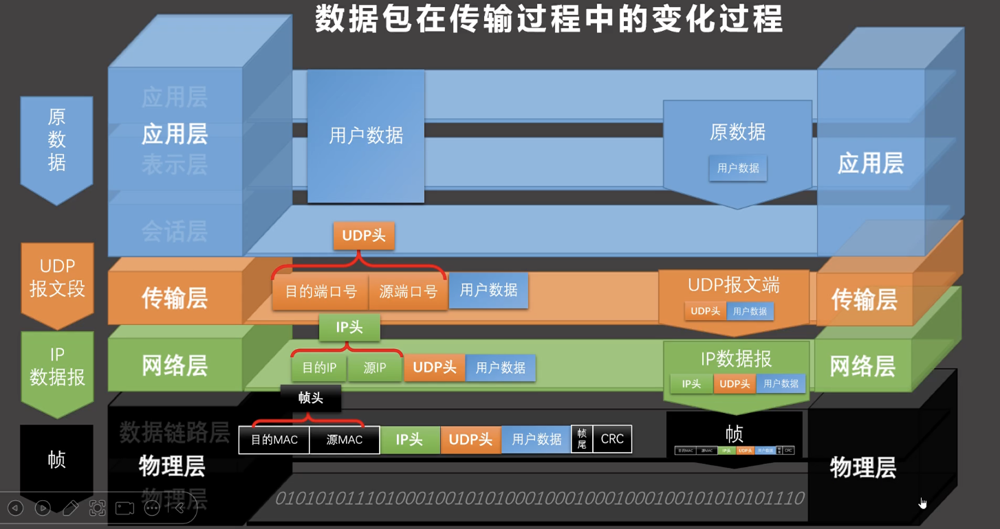
<!-- image-source: https://cdn.nlark.com/yuque/0/2026/png/67474974/1780374697029-45a5afd9-2cdd-43a9-ac08-1e2e880c80b8.png -->

| 层次 | 数据单元名称 | 英文对照 | 添加的头部信息 | 关键字段 |
| --- | --- | :--- | --- | --- |
| **应用层** | 应用报文 | Message | 取决于应用协议，如 HTTP 首部或自定义消息头 | 方法、状态码、消息长度等 |
| **传输层** | 报文段 (TCP) / 用户数据报 (UDP) | TCP Segment / UDP Datagram | UDP/TCP 头部 | 源端口、目的端口 |
| **网络层** | IP 数据报（分组 / 包） | Datagram / Packet | IP 头部 | 源 IP、目的 IP |
| **数据链路层** | 帧 | Frame | 帧头、帧尾 | 源 MAC、目的 MAC |
| **物理层** | 比特流（0101...） | Bit | — | 电信号/光信号 |


#### **发送端（封装过程）**
**1. 应用层 (Application Layer)**

+ **动作**：用户产生数据，应用层协议（如HTTP、SMTP、FTP）根据协议规范，在数据前加上**应用层首部**（包含HTTP请求行、状态码、报文类型等控制信息）。
+ **PDU名称**：**报文 (Message)**
+ **寻址方式**：无需寻址，直接对应具体的应用程序。

**2. 传输层 (Transport Layer)**

+ **动作**：接收应用层交下来的报文。为了实现**进程到进程**的通信，传输层会在报文前加上**传输层首部**（TCP首部或UDP首部）。
+ **核心字段**：添加**源端口号**和**目的端口号**（例如目的端口80代表HTTP服务）。
    - **<font style="color:rgb(29, 29, 31);">源端口号（16 bit）</font>**<font style="color:rgb(29, 29, 31);">：标识发送方的应用程序（如浏览器随机分配的临时端口 54321）。</font>
    - **<font style="color:rgb(29, 29, 31);">目的端口号（16 bit）</font>**<font style="color:rgb(29, 29, 31);">：标识接收方的应用程序（如 Web 服务器的 80 或 443 端口）。</font>
    - **<font style="color:rgb(29, 29, 31);">其他控制信息</font>**<font style="color:rgb(29, 29, 31);">：如果是 TCP，还会添加序列号、确认号、窗口大小、校验和等，用于保证可靠传输；如果是 UDP，仅添加长度和校验和。</font>
    - _注：如果数据过大，TCP会在此层将其划分为多个报文段。_
+ **PDU名称**：**TCP报文段 (Segment)** 或 **UDP用户数据报 (Datagram)**

**3. 网络层 (Network Layer)**

+ **动作**：接收传输层交下来的报文段。为了实现**主机到主机**的全局逻辑寻址，网络层会在其前面加上**网络层首部**（IP首部）。
+ **核心字段**：添加**源IP地址**和**目的IP地址**。同时包含TTL（生存时间）、协议字段（标识上层是TCP还是UDP）等。
    - **<font style="color:rgb(29, 29, 31);">源 IP 地址（32 bit / IPv4）</font>**<font style="color:rgb(29, 29, 31);">：发送方主机的逻辑地址（如 </font>`192.168.1.10`<font style="color:rgb(29, 29, 31);">）。</font>
    - **<font style="color:rgb(29, 29, 31);">目的 IP 地址（32 bit / IPv4）</font>**<font style="color:rgb(29, 29, 31);">：接收方主机的逻辑地址（如 </font>`93.184.216.34`<font style="color:rgb(29, 29, 31);">）。</font>
    - **<font style="color:rgb(29, 29, 31);">TTL（生存时间）</font>**<font style="color:rgb(29, 29, 31);">：防止数据包在网络中无限循环，每经过一个路由器减 1。</font>
    - **<font style="color:rgb(29, 29, 31);">协议字段</font>**<font style="color:rgb(29, 29, 31);">：标识上层协议（如 </font>`6`<font style="color:rgb(29, 29, 31);"> 代表 TCP，</font>`17`<font style="color:rgb(29, 29, 31);"> 代表 UDP），以便接收方网络层知道解封装后该交给谁。</font>
+ **PDU名称**：**IP数据报 / 分组 / 包 (Datagram / Packet)**

**4. 数据链路层 (Data Link Layer)**

+ **动作**：接收网络层交下来的IP数据报。为了实现**相邻节点（一跳）** 之间的物理寻址和差错检测，链路层添加帧头（MAC 头部）和帧尾（FCS 校验）。
    - **首部（MAC首部）**：添加**源MAC地址**（当前节点网卡物理地址）和**目的MAC地址**（下一跳路由器或目的主机的物理地址），以及类型字段。
        * **<font style="color:rgb(29, 29, 31);">目的 MAC 地址（48 bit）</font>**<font style="color:rgb(29, 29, 31);">：下一跳设备（如默认网关路由器或同局域网目标主机）的物理网卡地址。</font>
        * **<font style="color:rgb(29, 29, 31);">源 MAC 地址（48 bit）</font>**<font style="color:rgb(29, 29, 31);">：发送方网卡的物理地址。</font>
        * **<font style="color:rgb(29, 29, 31);">类型字段（Type）</font>**<font style="color:rgb(29, 29, 31);">：标识网络层协议（如 </font>`0x0800`<font style="color:rgb(29, 29, 31);"> 代表 IPv4，</font>`0x0806`<font style="color:rgb(29, 29, 31);"> 代表 ARP）。</font>
    - **<font style="color:rgb(29, 29, 31);">帧尾 FCS（帧校验序列）</font>**<font style="color:rgb(29, 29, 31);">：使用 CRC（循环冗余校验）算法计算出的校验值，用于检测数据在物理传输中是否发生比特翻转或损坏。</font>
+ **PDU名称**：**帧 (Frame)**

> **补充：CRC 校验**  
数据链路层会在帧尾添加 **CRC（循环冗余校验）** 字段，用于检测数据在传输过程中是否发生错误。
>

**5. 物理层 (Physical Layer)**

+ **动作**：接收数据链路层交下来的帧。物理层不添加传统意义上的协议首部，而是将帧的比特序列转换为**电信号、光信号或电磁波**，加上物理层的前导码（用于时钟同步），通过传输介质（网线、光纤、无线电）发送出去。
+ **<font style="color:rgb(29, 29, 31);">核心封装内容</font>**<font style="color:rgb(29, 29, 31);">：</font>
    - **<font style="color:rgb(29, 29, 31);">编码与调制</font>**<font style="color:rgb(29, 29, 31);">：将二进制的 0 和 1 转换为高低电平（双绞线）、光脉冲（光纤）或电磁波（WiFi）。</font>
    - **<font style="color:rgb(29, 29, 31);">添加前导码</font>**<font style="color:rgb(29, 29, 31);">：在比特流最前方添加特定的 01 交替序列，用于唤醒接收方的网卡并进行时钟同步。</font>
+ **PDU名称**：**比特流 (Bit Stream)**

#### 接收端（解封装过程）
当比特流到达目的主机后，数据会自下而上经过五层模型，每一层都会“拆除”属于本层的包装，并将剩余部分交给上层。

**1. 物理层**

+ **动作**：接收物理介质上的电信号/光信号，将其还原为**比特流**，并组装成**帧**，上交给数据链路层。

**2. 数据链路层**

+ **动作**：
    1. **差错检测**：利用尾部的 FCS 进行 CRC 校验。出错帧通常被丢弃；是否恢复取决于具体链路技术和上层协议，UDP 等协议不会因此自动重传。
    2. **拆封装**：若校验无误，则**剥离MAC首部和尾部**。
    3. **上交**：根据首部中的“类型”字段，将内部的**IP数据报**上交给网络层。

**3. 网络层**

+ **动作**：
    1. **检查与路由**：检查IP首部的校验和、TTL等。如果是路由器，则根据目的IP查路由表转发；如果是目的主机，则继续处理。
    2. **拆封装**：**剥离IP首部**。
    3. **上交**：根据IP首部中的“协议”字段（如值为6代表TCP，17代表UDP），将内部的**TCP报文段/UDP用户数据报**上交给传输层。

**4. 传输层**

+ **动作**：
    1. **传输层处理**：TCP 根据序号重组字节流、生成确认并执行流量/拥塞控制；UDP 校验数据报并保留报文边界。
    2. **拆封装**：**剥离TCP/UDP首部**。
    3. **复用与分用**：根据首部中的**目的端口号**，将数据准确交付给对应的**应用层进程**（如端口80交给Web浏览器）。

**5. 应用层**

+ **动作**：
    1. **拆封装**：**剥离应用层首部**（如解析HTTP响应报文）。
    2. **呈现**：将最终的**用户数据**（如HTML代码、图片、文本）交给应用程序进行渲染和展示。

---

### （2）考试核心考点总结（极易出选择题/简答题）
#### 必考难点：IP地址与MAC地址在传输过程中的变化
在数据从源主机经过多个路由器到达目的主机的过程中，**IP地址和MAC地址的变化规律是完全不同的**（常考画图题或填空题）：

+ **IP地址（逻辑地址）：始终不变**
    - **源IP地址**和**目的IP地址**在整个端到端的传输过程中**保持不变**（除非经过NAT网络地址转换）。
    - _原因_：IP地址标识的是“最终的源”和“最终的目的地”。
+ **MAC地址（物理地址）：逐跳改变**
    - 每经过一个路由器（即每经过一跳），数据链路层的帧都会被**重新封装**。
    - **源MAC地址**会变成**当前路由器 outgoing 接口的MAC地址**。
    - **目的MAC地址**会变成**下一跳路由器 incoming 接口的MAC地址**（如果是最后一跳，则是目的主机的MAC地址）。
    - _原因_：MAC地址只负责“相邻节点”之间的物理交付。

#### 首部与尾部的添加规律
+ 在常见的五层教材示意中，以太网数据链路层具有明确的 FCS 尾部；TCP、UDP 和 IPv4 主要使用首部。
+ 这不是跨所有协议的绝对规律：某些应用或安全协议也可能在数据后附加认证标签、结束标记等内容。
+ **物理层不加首部/尾部**，只进行比特流的编码和信号转换（部分教材将以太网的前导码算在物理层，但不属于协议控制信息）。

#### 路由器与交换机的处理层次（结合网络设备考点）
**集线器 (Hub)**：工作在**物理层**。只放大和转发比特流，**不进行任何封装/解封装**。

**交换机 (Switch)**：传统二层交换机读取以太网帧头，根据目的 MAC 地址查询转发表并选择出接口，不会像路由器那样剥离二层头后重新封装新的下一跳帧。

+ **<font style="color:rgb(29, 29, 31);">处理深度</font>**<font style="color:rgb(29, 29, 31);">：解封装到</font>**<font style="color:rgb(29, 29, 31);">数据链路层（MAC 头）</font>**<font style="color:rgb(29, 29, 31);">。</font>
+ **<font style="color:rgb(29, 29, 31);">动作</font>**<font style="color:rgb(29, 29, 31);">：</font>
    1. <font style="color:rgb(29, 29, 31);">接收物理层比特流，还原为帧。</font>
    2. <font style="color:rgb(29, 29, 31);">读取</font>**<font style="color:rgb(29, 29, 31);">目的 MAC 地址</font>**<font style="color:rgb(29, 29, 31);">。</font>
    3. <font style="color:rgb(29, 29, 31);">查内部的 </font>**<font style="color:rgb(29, 29, 31);">MAC 地址表</font>**<font style="color:rgb(29, 29, 31);">，找到对应的物理接口。</font>
    4. <font style="color:rgb(29, 29, 31);">将帧从选定接口转发出去。普通二层转发不会改写源、目的 MAC；VLAN 标签等链路封装可能按端口配置增删，网卡重新发送时也会重新生成 FCS。</font>
+ _<font style="color:rgb(29, 29, 31);">注：交换机不关心 IP 地址和端口号。</font>_

**路由器 (Router)**：工作在**网络层**。必须解封装到**网络层（剥离MAC首尾部）**，提取出IP数据报，查看**目的IP地址**，查路由表决定下一跳后，**重新封装新的MAC首部和尾部**，再转发出去。

+ **<font style="color:rgb(29, 29, 31);">处理深度</font>**<font style="color:rgb(29, 29, 31);">：解封装到</font>**<font style="color:rgb(29, 29, 31);">网络层（IP 头）</font>**<font style="color:rgb(29, 29, 31);">。</font>
+ **<font style="color:rgb(29, 29, 31);">动作（极其重要）</font>**<font style="color:rgb(29, 29, 31);">：</font>
    1. <font style="color:rgb(29, 29, 31);">接收帧，校验 MAC 和 FCS，剥离</font>**<font style="color:rgb(29, 29, 31);">旧的数据链路层帧头和帧尾</font>**<font style="color:rgb(29, 29, 31);">。</font>
    2. <font style="color:rgb(29, 29, 31);">读取 IP 头中的</font>**<font style="color:rgb(29, 29, 31);">目的 IP 地址</font>**<font style="color:rgb(29, 29, 31);">。</font>
    3. <font style="color:rgb(29, 29, 31);">查内部的 </font>**<font style="color:rgb(29, 29, 31);">路由表（Routing Table）</font>**<font style="color:rgb(29, 29, 31);">，决定下一跳（Next Hop）是哪个路由器或目标网络。</font>
    4. <font style="color:rgb(29, 29, 31);">TTL 减 1，重新计算 IP 头部校验和。</font>
    5. **<font style="color:rgb(29, 29, 31);">重新封装新的数据链路层帧头</font>**<font style="color:rgb(29, 29, 31);">：将</font>**<font style="color:rgb(29, 29, 31);">源 MAC 地址</font>**<font style="color:rgb(29, 29, 31);">改为路由器当前出接口的 MAC，将</font>**<font style="color:rgb(29, 29, 31);">目的 MAC 地址</font>**<font style="color:rgb(29, 29, 31);">改为下一跳设备的 MAC（通过 ARP 协议获取）。</font>
    6. <font style="color:rgb(29, 29, 31);">将新的帧交给物理层发送。</font>
+ _<font style="color:rgb(29, 29, 31);">核心结论：</font>__**<font style="color:rgb(29, 29, 31);">IP 地址（源和目的）在全程保持不变，而 MAC 地址每经过一个路由器就会改变一次。</font>**_

### （3）各层协议与地址对应关系
| 层次 | 协议示例 | 寻址方式 |
| --- | --- | --- |
| 传输层 | TCP、UDP | **端口号** → 标识进程 |
| 网络层 | IP | **IP 地址** → 标识设备 |
| 数据链路层 | Ethernet | **MAC 地址** → 标识网卡 |


---

## 5.单播、广播与组播
<!-- 这是一张图片，ocr 内容为： -->
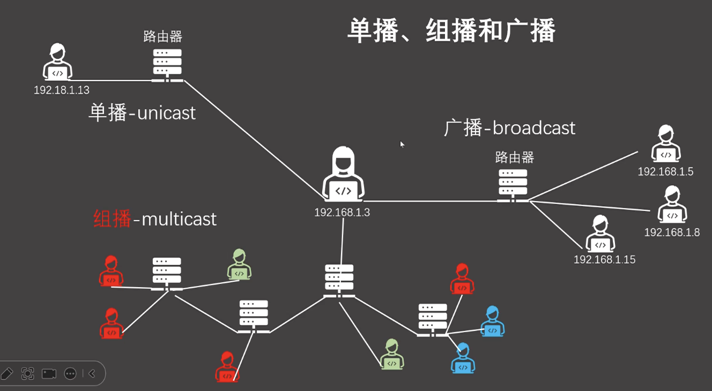
<!-- image-source: https://cdn.nlark.com/yuque/0/2026/png/67474974/1780376011865-fa7fd4af-204a-4b56-b280-5c8947e7cf7e.png -->

### （1）单播（Unicast）
**定义：** 一个发送方与一个接收方之间的一对一通信。

**特点：**

+ 发送方明确知道接收方的地址
+ 数据只发送给指定的目标设备
+ 日常网络通信中最常见的方式

### （2）广播（Broadcast）
**定义：** 一个发送方向广播域内的所有设备发送消息，一对多通信。

**特点：**

+ **只关心范围，不关心对象**：只要在广播域范围内，所有设备都能收到
+ **广播域**：广播消息能够到达的范围，通常以路由器为边界
    - 广播域通常由 VLAN 和三层接口划分；连接在同一路由器下不代表必然属于同一广播域
    - 广播消息**不能**穿过路由器转发到其他广播域
+ 类比：校园广播，只要在校园范围内就能听到，不在范围内就听不到

**广播风暴：**  
	当网络中充斥大量广播消息，导致正常数据无法传输时，称为广播风暴。路由器不转发广播消息的设计，有效限制了广播风暴的影响范围。

### （3）组播（Multicast）
**定义：** 一个发送方向一组特定的接收方发送消息。

**特点：**

+ **按组寻址**：发送方把数据发往组播地址，加入该组且沿途网络支持相应组播转发的接收方可以收到
+ 组播能否跨越不同网络取决于组播路由、交换机侦听和网络策略，不能假设互联网任意位置都可达
+ 类比：微信群聊，无论群成员在哪里，只要联网就能收到消息

### （4）三种通信方式对比
| 通信方式 | 发送方数量 | 接收方数量 | 关注点 | 范围限制 |
| --- | --- | --- | --- | --- |
| 单播 | 1 | 1 | 特定目标 | 无 |
| 广播 | 1 | 全部 | 范围 | 广播域内 |
| 组播 | 1 | 组成员 | 特定组 | 取决于组播路由与网络配置 |


---

## 6.ARP 协议（地址解析协议）
### （1）ARP 协议概述
**ARP（A**ddress** R**esolution** P**rotocol**，地址解析协议）** 的作用是根据已知的 **IP 地址** 获取对应的 **MAC 地址**（物理地址）。

**为什么需要 ARP？**

+ 网络层使用 IP 地址进行逻辑寻址
+ 数据链路层使用 MAC 地址进行物理寻址
+ 发送数据时，已知目的 IP 地址，但需要目的 MAC 地址才能封装帧

**TCP/IP 协议族：**  
	ARP 是 TCP/IP 协议族（Protocol Family）的一员。该协议族包含众多协议，如 TCP、UDP、IP、ARP、RARP、ICMP、IGMP 等。因为 TCP 和 IP 是最核心的两个协议，所以整个协议族以它们命名。

### （2）ARP 请求与响应过程
#### 场景：PC1 要与 PC2 通信，已知 PC2 的 IP 地址，但不知道其 MAC 地址
<!-- 这是一张图片，ocr 内容为： -->
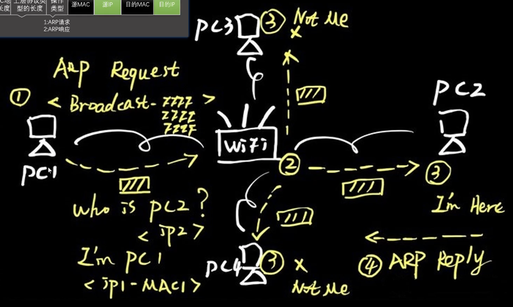
<!-- image-source: https://cdn.nlark.com/yuque/0/2026/png/67474974/1780376289111-c3a802cb-afe7-4b54-9674-f016f7dc7fd5.png -->

**步骤 1：发送 ARP 请求（广播）**

```plain
┌─────────────────────────────────────────┐
│  以太网帧头                              │
│  目的 MAC: FF:FF:FF:FF:FF:FF (广播)      │
│  源 MAC: PC1 的 MAC                      │
├─────────────────────────────────────────┤
│  ARP 报文                                │
│  操作类型: 1 (请求)                       │
│  源 MAC: PC1 的 MAC                      │
│  源 IP: PC1 的 IP                        │
│  目的 MAC: 00:00:00:00:00:00 (未知)       │
│  目的 IP: PC2 的 IP                      │
└─────────────────────────────────────────┘
```

<!-- 这是一张图片，ocr 内容为： -->
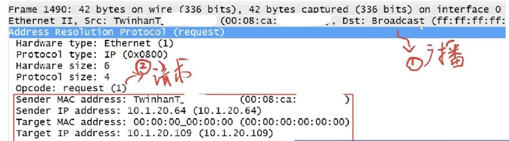
<!-- image-source: https://cdn.nlark.com/yuque/0/2026/png/67474974/1780376409263-eee9effa-7cd0-4cea-b76d-0dea119207a8.png -->

PC1 发送广播消息，询问："谁的 IP 是 PC2 的 IP？请告诉我你的 MAC 地址。"

**步骤 2：广播域内所有设备接收并处理**

+ PC3、PC4 等设备收到广播后，检查 ARP 报文中的**目的 IP**
+ 发现目的 IP 不是自己的 IP，直接丢弃，不做响应
+ 正常主机不会响应不属于自己的地址，但 ARP 本身没有身份认证，攻击者可以伪造响应实施 ARP 欺骗；重要网络应配合交换机安全策略、静态绑定或上层加密防护

**步骤 3：PC2 发送 ARP 响应（单播）**

PC2 发现目的 IP 是自己的 IP，于是发送单播响应给 PC1：

```plain
┌─────────────────────────────────────────┐
│  以太网帧头                              │
│  目的 MAC: PC1 的 MAC                    │
│  源 MAC: PC2 的 MAC                      │
├─────────────────────────────────────────┤
│  ARP 报文                                │
│  操作类型: 2 (响应)                       │
│  源 MAC: PC2 的 MAC                      │
│  源 IP: PC2 的 IP                        │
│  目的 MAC: PC1 的 MAC                    │
│  目的 IP: PC1 的 IP                      │
└─────────────────────────────────────────┘
```

<!-- 这是一张图片，ocr 内容为： -->
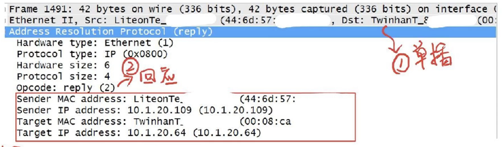
<!-- image-source: https://cdn.nlark.com/yuque/0/2026/png/67474974/1780376451555-5cb3f077-d876-4b9c-bfe6-e2c372c5dd7d.png -->

**步骤 4：PC1 获取 MAC 地址**

PC1 从 ARP 响应中提取 PC2 的 MAC 地址，存入 ARP 缓存表，随后即可正常通信。

### （3）ARP 报文格式
<!-- 这是一张图片，ocr 内容为： -->
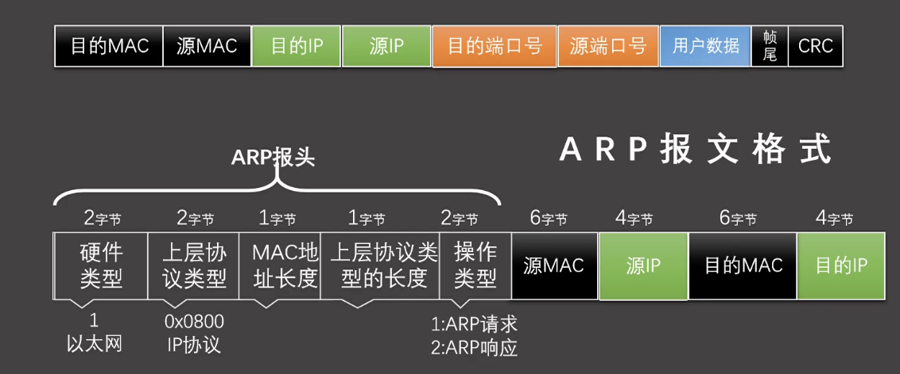
<!-- image-source: https://cdn.nlark.com/yuque/0/2026/png/67474974/1780376090604-d99c5ba8-4723-41c6-82fc-dfe2acfc9f5c.png -->

| 字段 | 长度 | 说明 |
| --- | --- | --- |
| 硬件类型（Hardware Type） | 2 字节 | 1 = 以太网 |
| 协议类型（Protocol Type） | 2 字节 | 0x0800 = IPv4 |
| 硬件地址长度（HLEN） | 1 字节 | MAC 地址长度 = 6 |
| 协议地址长度（PLEN） | 1 字节 | IP 地址长度 = 4 |
| 操作码（Opcode） | 2 字节 | 1 = 请求（Request），2 = 响应（Reply） |
| 源 MAC 地址 | 6 字节 | 发送方 MAC |
| 源 IP 地址 | 4 字节 | 发送方 IP |
| 目的 MAC 地址 | 6 字节 | 目标 MAC（请求时填 0） |
| 目的 IP 地址 | 4 字节 | 目标 IP |


### （4）ARP 缓存表
**作用：** 存储 IP 地址与 MAC 地址的映射关系，避免每次通信都发送 ARP 请求。

**工作机制：**

1. 发送数据前，先查询本地 ARP 缓存表
2. 如果找到对应的 MAC 地址，直接使用，无需发送 ARP 请求
3. 如果未找到，发送 ARP 请求获取 MAC 地址，并存入缓存表

**老化机制：**

+ 动态 ARP/邻居缓存项会经历可达、过期、重新探测等状态，具体超时和淘汰策略由操作系统实现决定
+ 这里的老化时间不是 IP 首部中的 TTL 字段，也不应笼统描述为固定的 LRU 算法
+ 静态配置的邻居项通常不会按动态项的规则自动老化

**Windows 查看 ARP 缓存表命令：**

```bash
arp -a        # 查看所有 ARP 缓存记录
arp -d        # 清除 ARP 缓存
```

### （5）ARP 代理（ARP Proxy）
**问题场景：**  
正常情况下，主机根据前缀判断目的地址是否在本地链路：若不在本地，会 ARP 查询**默认网关的地址**，而不是查询远端主机。代理 ARP 用于某些特殊拓扑，使路由器替不在本链路、但被请求方认为“在链路上”的地址响应。

**解决方案：ARP 代理**

1. PC1 因自身掩码或主机路由判断 PC6 在本地链路，于是广播查询 PC6 的 MAC
2. 配置了代理 ARP 的路由器确认自己具有到 PC6 的路由，并用出接口 MAC 响应
3. PC1 将发往 PC6 的帧交给该路由器
4. 路由器再按正常三层路由把 IP 数据报转发到真正目标

**定义：** 路由器以自己的链路层地址替另一个 IPv4 地址响应 ARP 请求的机制称为代理 ARP。它不是正常跨网通信的必经步骤。

### （6）免费 ARP（Gratuitous ARP）
**定义：** 主机发送的以**自己的 IP 地址**为目的 IP 的 ARP 请求报文。

**触发时机：** 设备开机或网卡启用时自动发送。

**作用：**

1. **IP 地址冲突检测**
    - 发送 ARP 请求："谁拥有我自己的 IP 地址？"
    - 如果收到响应，说明网络中已有设备使用相同的 IP 地址（IP 冲突）
    - 系统会报错提示 IP 地址冲突
2. **通知网络中的其他设备**
    - 广播自己的 IP 地址和 MAC 地址的对应关系
    - 其他设备收到后，会将此信息更新到自己的 ARP 缓存表中
    - 确保网络中其他设备拥有最新的 MAC 地址映射

---

## 7.DNS 协议（域名解析协议）
### （1）DNS 概述
**DNS（D**omain** N**ame** S**ystem**，域名系统）** 的作用是将人类易记的**域名**解析为机器可识别的 **IP 地址**。

**为什么需要 DNS？**

+ 互联网中的主机间通信通常依赖 IP 寻址；同一链路还需要相应的数据链路层地址或其他链路标识
+ 人类记忆 IP 地址（如 `220.181.38.148`）困难
+ 域名（如 `www.baidu.com`）更易记忆
+ DNS 负责完成域名到 IP 地址的转换

### （2）DNS 解析流程
#### 7.2.1 域名层级结构
域名由多级组成，从右到左层级递增：

```plain
三级域名.二级域名.顶级域名
   www  . 163  .  com
```

| 层级 | 示例 | 说明 |
| --- | --- | --- |
| 根域名 | `.` | 最高层级（通常省略） |
| 顶级域名（TLD） | `.com`、`.cn`、`.org` | 域名类型或国家地区 |
| 二级域名 | `163`、`baidu` | 组织或机构名称 |
| 三级域名 | `www`、`mail` | 具体服务或主机 |


#### 7.2.2 解析过程
<!-- 这是一张图片，ocr 内容为： -->
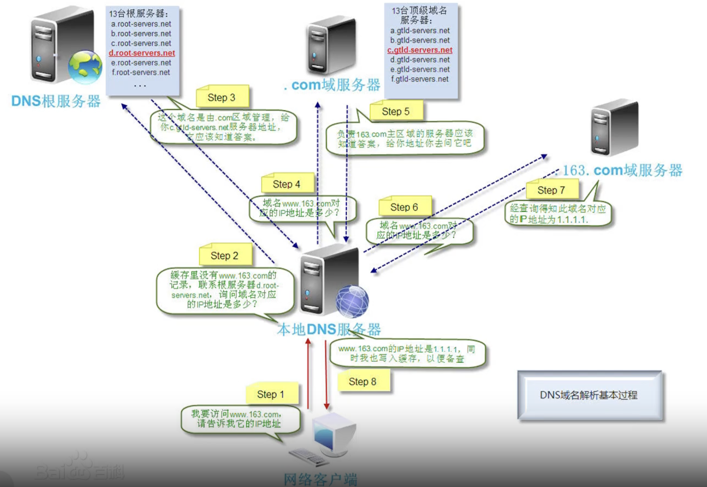
<!-- image-source: https://cdn.nlark.com/yuque/0/2026/png/67474974/1780376656770-62f12d91-c684-4e70-b6c9-b7a5c9a0ff48.png -->

以查询 `www.example.com` 的 A/AAAA 记录为例：

1. 应用通常先查询浏览器、操作系统或本地解析缓存，并检查本机静态名称配置。
2. 未命中时，主机的存根解析器向配置的递归解析器发起查询。
3. 递归解析器若无缓存，会从根服务器获得 `.com` 顶级域服务器的转介信息。
4. 再向 `.com` 服务器查询，获得 `example.com` 权威 DNS 服务器信息。
5. 向权威服务器取得最终记录，或按 CNAME 等记录继续查询。
6. 递归解析器依据各记录的 TTL 缓存结果并返回主机。查询失败也可能按规则进行负缓存。

常规 DNS 可使用 UDP 或 TCP 53 端口；响应过大、区域传送等场景会使用 TCP，现代部署也可能采用 DoT、DoH 或 DoQ。

**缓存机制：**

+ 本地 DNS 会缓存查询结果，包括最终 IP 地址和各级域名服务器的地址
+ 下次查询同一域名时，可直接从缓存获取，无需重新查询
+ 缓存记录同样有时间戳，过期后需要重新查询（TTL 机制）

### （3）DNS 查询方式
| 方式 | 说明 |
| --- | --- |
| **递归查询** | 客户端向本地 DNS 发起请求，本地 DNS 负责完成全部查询过程，最终返回结果 |
| **迭代查询** | 本地 DNS 向各级域名服务器逐级查询，每级服务器只返回下一级服务器的地址 |


---

## 8.路由器转发与路由表
### （1）数据跨网络传输过程
当数据需要跨越多个网络传输时，会经过多个路由器的转发。在此过程中：

+ **通常端到端保持不变**：普通路由转发不会改写源/目的 IP；NAT、隧道、代理或负载均衡等机制可能改变外层或可见地址
+ **MAC 地址逐跳变化**：每经过一个路由器，源 MAC 和目的 MAC 都会更新为当前链路两端设备的 MAC 地址

**示例：PC1 (10.0.0.1) → PC6 (60.0.0.6)**

<!-- 这是一张图片，ocr 内容为： -->
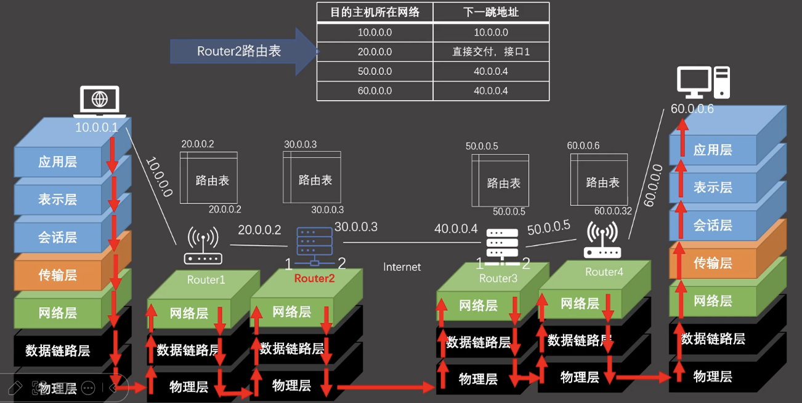
<!-- image-source: https://cdn.nlark.com/yuque/0/2026/png/67474974/1780376747114-2199d00b-cd41-4ae2-9c70-e34d5eee9092.png -->

**传输过程中地址变化：**

| 传输段 | 源 IP | 目的 IP | 源 MAC | 目的 MAC |
| --- | --- | --- | --- | --- |
| PC1 → R1 | 10.0.0.1 | 60.0.0.6 | PC1 的 MAC | R1 接口1 的 MAC |
| R1 → R2 | 10.0.0.1 | 60.0.0.6 | R1 接口2 的 MAC | R2 接口1 的 MAC |
| R2 → R3 | 10.0.0.1 | 60.0.0.6 | R2 接口2 的 MAC | R3 接口1 的 MAC |
| R3 → R4 | 10.0.0.1 | 60.0.0.6 | R3 接口2 的 MAC | R4 接口1 的 MAC |
| R4 → PC6 | 10.0.0.1 | 60.0.0.6 | R4 接口2 的 MAC | PC6 的 MAC |


**总结：**

+ **MAC 地址**：记录数据的"来时路"，标识当前链路的传输路径
+ **IP 地址**：标识数据的最终来源和最终目标，全程不变
+ **端口号**：端到端通信中用于标识传输层端点；经过 NAPT/PAT 时，源或目的端口也可能被转换

### （2）路由表（Routing Table）
**作用：** 路由器根据路由表决定数据包的下一跳转发目标。

**路由表结构示例：**

| 目的网络 | 子网掩码 | 下一跳地址 | 出接口 |
| --- | --- | --- | --- |
| 10.0.0.0 | 255.0.0.0 | 直连 | 接口 1 |
| 20.0.0.0 | 255.0.0.0 | 20.0.0.2 | 接口 2 |
| 60.0.0.0 | 255.0.0.0 | 40.0.0.4 | 接口 2 |


**查找过程：**

1. 提取数据包的目的 IP 地址
2. 在路由表中查找匹配的目的网络
3. 确定下一跳地址和出接口
4. 通过指定接口将数据包转发给下一跳设备

### （3）路由学习机制
路由器通过**路由协议**与相邻路由器交换路由信息，动态学习网络拓扑：

1. **直连网络**：路由器自动添加与自己接口直接相连的网络
2. **静态路由与默认路由**：管理员可手工指定特定前缀或未知目的的下一跳
3. **动态路由**：路由协议交换可达性和度量信息。不同路由器只需拥有完成自身转发所需的路由，不要求每台设备掌握整个互联网的完整拓扑

转发时使用**最长前缀匹配**：若多条路由都匹配目的地址，优先选择前缀长度最长、范围最具体的条目；没有更具体条目时才使用默认路由（IPv4 为 `0.0.0.0/0`）。

**类比理解：**  
	如同问路，每个路口的人不知道完整路线，但知道下一站该往哪走。通过逐级询问和传递信息，最终可以到达目的地。

**路由协议示例：**

+ **RIP（Routing Information Protocol）**：距离向量路由协议
+ **OSPF（Open Shortest Path First）**：链路状态路由协议
+ **BGP（Border Gateway Protocol）**：边界网关协议，用于不同自治系统之间

---

## 9.核心概念总结
### （1）各层数据单元名称
| 层次 | 数据单元 |
| --- | --- |
| 应用层 | 报文（Message）/ 用户数据 |
| 传输层 | TCP 报文段（Segment）/ UDP 数据报（Datagram） |
| 网络层 | IP 数据报（Packet） |
| 数据链路层 | 帧（Frame） |
| 物理层 | 比特流（Bit Stream） |


### （2）关键协议功能速查
| 协议 | 层次 | 功能 |
| --- | --- | --- |
| DHCP | 应用层 | 动态分配 IP 地址 |
| DNS | 应用层 | 域名解析为 IP 地址 |
| TCP | 传输层 | 可靠传输、面向连接 |
| UDP | 传输层 | 不可靠传输、无连接 |
| IP | 网络层 | 逻辑寻址、路由选择 |
| ARP | 网络层/链路层 | IP 地址解析为 MAC 地址 |
| ICMP | 网络层 | 差错报告和网络诊断（如 ping） |


### （3）地址类型对比
| 地址类型 | 长度 | 层级 | 作用 | 是否全局唯一 |
| --- | --- | --- | --- | --- |
| MAC 地址 | 常见为 48 位（6 字节） | 数据链路层 | 标识链路接口 | 不保证；可本地管理、修改或虚拟化 |
| IP 地址（IPv4） | 32 位（4 字节） | 网络层 | 标识设备在网络中的位置 | 否（可动态分配） |
| 端口号 | 16 位（2 字节） | 传输层 | 标识进程 | 否（同一设备内唯一） |


---

## 10.补充知识
**常用网络命令**

```bash
ipconfig          # Windows：查看本机 IP 配置
ipconfig /all     # Windows：查看详细网络配置（含 MAC 地址）
ifconfig          # Linux/Mac：查看网络配置
ping <IP/域名>     # 测试网络连通性（使用 ICMP 协议）
tracert <目标>     # Windows：追踪路由路径
traceroute <目标>  # Linux/Mac：追踪路由路径
arp -a            # 查看 ARP 缓存表
nslookup <域名>    # 查询 DNS 解析结果
netstat -an       # 查看网络连接状态和端口
```

# 四、APP、DNS协议、子网划分
## 1.IP 地址与 CIDR（IPv4）
### （1）IP 地址的基本结构
IPv4 地址采用**点分十进制**表示，分为四段，每段取值范围为 `0 ~ 255`，共 32 位二进制。

现代网络使用 **CIDR（无类别域间路由）**：必须同时给出地址和前缀长度，例如 `192.168.10.34/24`。不能只看首字节就推断实际网络边界。A、B、C 类是早期分类编址方式，今天主要用于理解历史和应对部分教材题目。

| 历史类别 | 地址范围 | 类默认前缀 | 说明 |
| --- | --- | --- | --- |
| A 类 | `0.0.0.0 ~ 127.255.255.255` | `/8` | 其中 `0/8` 和 `127/8` 有特殊用途，不能作为普通 A 类网络分配 |
| B 类 | `128.0.0.0 ~ 191.255.255.255` | `/16` | 历史类默认 |
| C 类 | `192.0.0.0 ~ 223.255.255.255` | `/24` | 历史类默认 |
| D 类 | `224.0.0.0 ~ 239.255.255.255` | — | IPv4 组播地址 |
| E 类 | `240.0.0.0 ~ 255.255.255.255` | — | 保留/特殊用途，`255.255.255.255` 为受限广播 |

**二进制特征**（用于快速识别）：

+ **A 类**：最高位为 `0`
+ **B 类**：最高 2 位为 `10`
+ **C 类**：最高 3 位为 `110`
+ **D 类**：最高 4 位为 `1110`
+ **E 类**：最高 4 位为 `1111`

### （2）特殊 IP 地址
1. **`0.0.0.0` 与 `0/8`**：`0.0.0.0` 常表示未指定地址或任意本地地址；整个 `0/8` 不是普通主机地址池。
2. **本地环回地址（Loopback）**：`127.0.0.0 ~ 127.255.255.255`，最常用的是 `127.0.0.1`（localhost）。
    - **用途**：本机自己发给自己收，用于本地测试。
    - **场景**：编写客户端/服务端程序时，如果不联网（无真实 IP），或 IP 经常变动，用 `127.0.0.1` 即可测试，无需修改代码。
    - **注意**：该地址只能用于本机测试，**不能**用于两台不同机器之间的通信。
3. **私有地址**：`10.0.0.0/8`、`172.16.0.0/12`、`192.168.0.0/16`，不能直接在公网路由，家庭和企业网络常配合 NAT 使用。
4. **链路本地地址**：`169.254.0.0/16`，主机无法获得正常配置时可能自动使用，只在本地链路有效。
5. **组播地址**：`224.0.0.0/4`。组播与广播的成员和转发方式不同，不能视为同一种机制。

<!-- 这是一张图片，ocr 内容为： -->
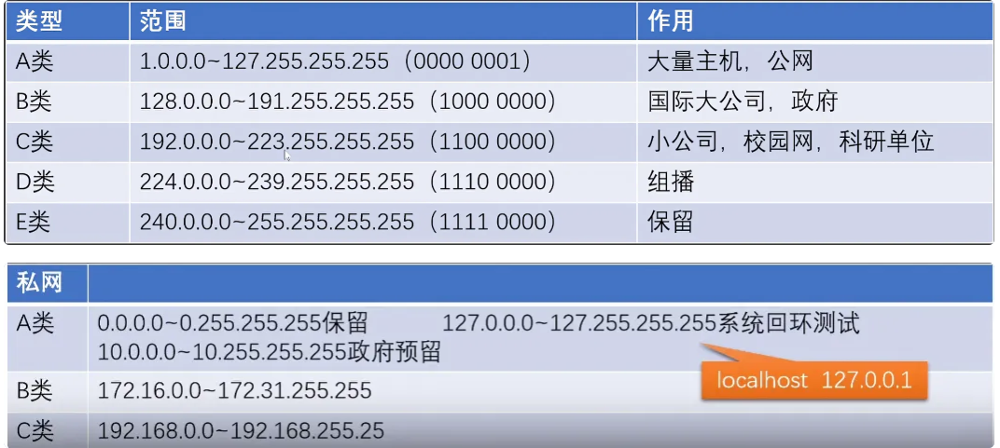
<!-- image-source: https://cdn.nlark.com/yuque/0/2026/png/67474974/1780650974481-46ffd5a6-0df7-4757-ba63-4dd4335f43b0.png -->

> **考试提示**：若题目明确采用 A/B/C 类默认掩码，可按历史分类计算；实际网络和现代题目应优先读取显式前缀长度，不能仅凭地址类别推断掩码。
>

---

## 2.子网掩码（Subnet Mask）
### （1）子网掩码的概念与作用
子网掩码用于划分 IPv4 地址中的**网络前缀**与**接口标识部分**。主机用它判断目的地址是否在同一子网，路由表也用前缀描述一组可达地址。它不会改写数据包中的主机地址，也不会让外部主机“只能看到网络地址”。

<!-- 这是一张图片，ocr 内容为： -->
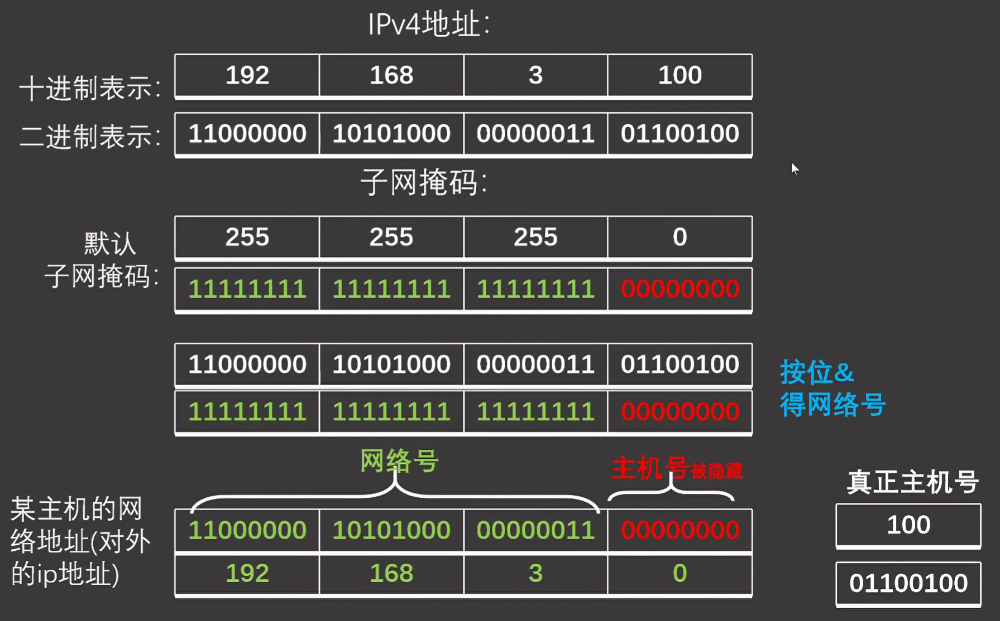
<!-- image-source: https://cdn.nlark.com/yuque/0/2026/png/67474974/1780651035841-eee7e17a-b1c0-4e73-90e9-a79ee08f6271.png -->

#### 计算规则
> **网络地址 = IP 地址 AND 子网掩码（按位与）**
>

+ **0 AND 任何数 = 0**
+ **1 AND 任何数 = 原数**

#### 示例说明
假设路由器下连接了 4 台主机：

+ IP 地址：`192.168.1.3`、`192.168.1.4`、`192.168.1.5`、`192.168.1.6`
+ 子网掩码：`255.255.255.0`

子网掩码的前 24 位全为 `1`，后 8 位全为 `0`。这 4 台主机与子网掩码按位与后，结果都是 `192.168.1.0`。

**计算含义**：这些地址都属于 `192.168.1.0/24`。路由器可以用一条前缀路由表示整个子网，但转发的数据包仍携带具体主机 IP；只有经过 NAT 等地址转换时，外部观察到的地址才可能改变。

### （2）网络号与主机号
IP 地址由两部分组成：**网络号 + 主机号**。

+ **网络号**：子网掩码中全为 `1` 的位。
+ **主机号**：子网掩码中全为 `0` 的位。

### （3）默认子网掩码
下表是历史分类编址中的默认掩码。现代配置必须显式提供前缀长度或掩码：

| IP 类别 | 默认子网掩码 |
| --- | --- |
| A 类 | `255.0.0.0`（1 个 255 + 3 个 0） |
| B 类 | `255.255.0.0`（2 个 255 + 2 个 0） |
| C 类 | `255.255.255.0`（3 个 255 + 1 个 0） |


---

## 3.网关与广播
### （1）网关（Gateway）
<!-- 这是一张图片，ocr 内容为： -->
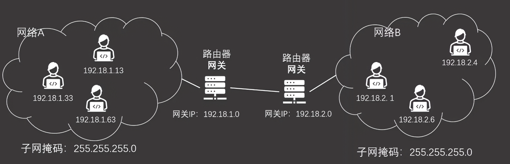
<!-- image-source: https://cdn.nlark.com/yuque/0/2026/png/67474974/1780651048880-2eea908f-5bee-4407-9970-0e8550035b71.png -->

**网关（网间连接器）**：连接两个子网的设备或软件，通常就是**路由器**。

+ 网关本身也有 IP 地址。
+ 默认网关必须是主机在本地链路上可达的路由器接口地址，通常取某个**可用主机地址**，如 `.1` 或 `.254`，但没有“必须取第一个或最后一个”的协议规则。
+ **示例**：
    - 网络 A：`192.168.1.0/24`，可把路由器接口配置为 `192.168.1.1`
    - 网络 B：`192.168.2.0/24`，可把路由器接口配置为 `192.168.2.254`
+ 两个不同子网之间的通信，必须经过网关（路由器）转发。

### （2）广播地址（Broadcast）
广播：一个设备发送，多个设备接收。

**1.直接广播地址（Directed Broadcast）**

+ **规则**：网络号不变，**主机号全为 1**。
+ **示例**：`192.168.3.100`，子网掩码 `255.255.255.0`
    - 网络地址：`192.168.3.0`（主机位全 0，不能作为普通主机或网关接口地址）
    - 直接广播地址：`192.168.3.255`（主机号全 1）
    - 可用 IP 范围：`192.168.3.1 ~ 192.168.3.254`

**2.受限广播地址（Limited Broadcast）**

+ **规则**：**32 位全为 1**，即 `255.255.255.255`。
+ **用途**：仅在本网（当前所在的广播域）内广播，不会被路由器转发。

<font style="color:rgb(15, 17, 21);">网络内可用主机范围：排除网络地址（主机号全 0）和广播地址（主机号全 1），剩下的才是可分配给主机的 IP。</font>

---

## 4.子网划分（Subnetting）
### （1）为什么需要子网划分？
<font style="color:rgb(15, 17, 21);">当默认子网规模过大（如一个 C 类网段有 254 个可用 IP）而实际需求较小时，会浪费 IP。因此引入</font>**<font style="color:rgb(15, 17, 21);">非默认子网掩码</font>**<font style="color:rgb(15, 17, 21);">，将大网络划分成多个小子网。</font>

以 C 类网络 `192.168.3.0/24` 为例：

+ 常规可用主机地址：254 个（排除网络地址和广播地址）；网关若配置在此网段，也会占用其中一个可用地址。
+ **问题**：如果一个房间只有 70 台电脑，分配整个 C 类网段会浪费 184 个 IP，且其他房间无法复用。
+ **解决方案**：使用**非默认子网掩码**，将一个大网段划分为多个小子网，按需分配，减少浪费。

### （2） 非默认子网掩码
+ **原理**：从原来的主机号中**借用若干位**作为子网号。
+ **特征**：非默认子网掩码一定比默认子网掩码**多出几个 **`1`，多出来的 `1` 就是**<font style="color:rgb(15, 17, 21);">子网号</font>**<font style="color:rgb(15, 17, 21);">，剩余仍为 </font>`<font style="color:rgb(15, 17, 21);background-color:rgb(235, 238, 242);">0</font>`<font style="color:rgb(15, 17, 21);"> 的位才是主机位。</font>
+ **计算规则不变**：依然使用 `IP AND 子网掩码` 得到网络地址。

<!-- 这是一张图片，ocr 内容为： -->
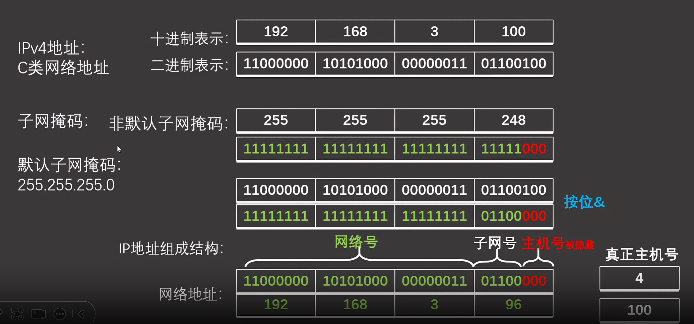
<!-- image-source: https://cdn.nlark.com/yuque/0/2026/png/67474974/1780651052450-cf95acfd-6a10-4e21-a74d-abf23962422d.png -->

### （3）核心计算公式
设：

+ **X** = 非默认子网掩码比默认子网掩码多出的 `1` 的个数（即借用的主机位数）
+ **Y** = 剩余的主机位数（即非默认子网掩码中 `0` 的个数）

| 问题 | 公式 | 说明 |
| --- | --- | --- |
| 可创建的子网数 | **2^X** | X 位二进制能表示的子网个数 |
| 每个常规子网的可用地址数 | **2^Y - 2** | 减去网络地址（主机位全 0）和广播地址（主机位全 1），不是减去网关 |
| 子网步长（增量） | **256 - 子网掩码最后一个非零数** | 用于快速列出所有子网范围 |


1、选定的子网掩码将创建多少个子网？  

$ 2^X $个，其中X是子网掩码借用的主机位数。如：192.168.10.32/28，其中这个28是网络号的意思。我们知道C类ip的默认子网掩码为：255.255.255.0，C类ip的网络号应该是24位，故其借用了主机位4位来充当网络位。这个ip的实际子网掩码是：255.255.255.240，讲创建的子网个数就是$ 2^4 $=16。  

2、每个子网可包含多少台主机？  

$ 2^{Y}-2 $个常规可用地址，其中 Y 是剩余主机位数。减去的是网络地址和广播地址；网关需要从可用地址中另行配置。点到点链路的 `/31` 可使用两个地址，`/32` 表示单个主机路由，因此不套用“减 2”公式。  

3、有哪些子网？  

算出发生划分的那个八位组的步长（增量）。例如掩码八位组为 248 时，步长为 `256-248=8`；该八位组的网络边界为 0、8、16、24……、248。

### （4）典型例题解析
#### 【例题 1】基础按位与
**题目**：<font style="color:rgb(15, 17, 21);">某主机IP地址是210.33.5.68，子网掩码是255.255.255.128。求它的网络地址？</font>

+ IP：`210.33.5.68`
+ 子网掩码：`255.255.255.128`（`/25`）
+ **网络地址**：`210.33.5.0`
+ **广播地址**：`210.33.5.127`
+ **常规可用范围**：`210.33.5.1 ~ 210.33.5.126`

#### 【例题 2】A 类地址子网划分
**题目**：<font style="color:rgb(15, 17, 21);">某A类网络20.0.0.0的子网掩码为255.224.0.0，请确定可以划分的子网个数，写出每个子网的子网号。</font>

+ A 类默认子网掩码：`255.0.0.0`
+ 非默认多出部分：`224` → 二进制 `11100000`（3 个 1）
+ **X = 3**
+ **子网数 = 2³ = 8 个**
+ **步长** = 256 - 224 = 32
+ **子网号**：`20.0.0.0/11`、`20.32.0.0/11`、`20.64.0.0/11`、`20.96.0.0/11`、`20.128.0.0/11`、`20.160.0.0/11`、`20.192.0.0/11`、`20.224.0.0/11`

#### 【例题 3】C 类划分 5 个子网
**题目**：<font style="color:rgb(15, 17, 21);">给C类网络211.168.10.0划分5个子网，需要几位网络号，子网掩码是多少，每个子网可容纳多少台主机？</font>

+ $ 2^X $ ≥ 5 → **X = 3**（2³ = 8 ≥ 5）
+ C 类默认 24 位网络号，加上借用的 3 位 = **27 位**
+ 子网掩码：`255.255.255.224`（二进制 `11100000` = 224）
+ 剩余主机位 Y = 8 - 3 = 5
+ 每个子网主机数：**2⁵ - 2 = 30 台**

#### 【例题 4】A 类地址复杂划分
**题目**：<font style="color:rgb(15, 17, 21);">ip地址10.100.12.238，子网掩码：255.255.248.0，可以划分多少个子网？每个子网有几个可用ip地址？写出每个子网的ip地址范围，其中网关和广播地址分别是多少？（写出前3个和后3个即可）</font>

+ **类别判断**：`10.x.x.x` 是 A 类，默认掩码 `255.0.0.0`
+ **借用位数 X**：
    - 第二个 255 → 8 个 1
    - 248 → 二进制 `11111000`（5 个 1）
    - **X = 8 + 5 = 13**
+ **子网数 = 2¹³ = 8192 个**（A 类原始地址池巨大：10.0.0.0 ~ 10.255.255.255，共 2²⁴ 个 IP）
+ **剩余主机位 Y**：
    - 248 剩余 3 个 0
    - 最后一个 0 有 8 个 0
    - **Y = 3 + 8 = 11**
+ **每个子网可用 IP = 2¹¹ - 2 = 2046 个**
+ **步长** = 256 - 248 = 8
+ **题给地址所在子网**：`10.100.8.0/21`，可用范围 `10.100.8.1 ~ 10.100.15.254`，广播地址 `10.100.15.255`
+ **子网范围示例**：
    - 第 1 个子网：网络 `10.0.0.0/21`，可用 `10.0.0.1 ~ 10.0.7.254`，广播 `10.0.7.255`
    - 第 2 个子网：网络 `10.0.8.0/21`，可用 `10.0.8.1 ~ 10.0.15.254`，广播 `10.0.15.255`
    - 第 3 个子网：网络 `10.0.16.0/21`，可用 `10.0.16.1 ~ 10.0.23.254`，广播 `10.0.23.255`
    - ...
    - 倒数第 3 个：网络 `10.255.232.0/21`，可用 `10.255.232.1 ~ 10.255.239.254`，广播 `10.255.239.255`
    - 倒数第 2 个：网络 `10.255.240.0/21`，可用 `10.255.240.1 ~ 10.255.247.254`，广播 `10.255.247.255`
    - 最后 1 个：网络 `10.255.248.0/21`，可用 `10.255.248.1 ~ 10.255.255.254`，广播 `10.255.255.255`

题目若未给出网关配置，就**无法仅由 IP 和掩码计算网关地址**。若额外约定“每个子网第一个可用地址作为网关”，才可分别取上述可用范围的第一个地址。

> **技巧**：先算步长，再根据原始网段范围，按步长递增/递减列出子网，无需死算每个 IP。
>

---

## 5.代码实战：UDP 广播
### （1）直接广播（Directed Broadcast）
**前文服务端代码修改要点**：

1. **服务端**：只接收，不发送。
2. **客户端**：只发送，不接收（注释掉接收逻辑）。

```cpp
//4、接收数据
//输出参数，与返回值一样，有需要就用变量接收，用不上可以不接
//nRecvNum/*接收到的数据的长度*/ = recvfrom(s, recvBuf, sizeof(recvBuf), 0/*初始化标志位*/, (sockaddr*)&addrTo, &size);
//if (nRecvNum > 0)
//{
//	//收到数据，打印接收到的数据和发送端IP
//	cout << "ip:" << inet_ntoa(addrTo.sin_addr) << " server say:" << recvBuf << endl;
//}
//else
//{
//	cout << "recvfrom error:" << WSAGetLastError() << endl;
//	break;
//}
```

3. **目标地址**：计算直接广播地址（主机号全 1）。

**示例**：

```cpp
sockaddr_in addrTo = {};
addrTo.sin_family = AF_INET;
addrTo.sin_port = htons(12345);//绑定端口号，端口号尽量大，区分其它应用端口号  htons：转换成大端存储
//addrTo.sin_addr.S_un.S_addr = inet_addr("192.168.1.137");

//直接广播：主机号为1
addrTo.sin_addr.S_un.S_addr = inet_addr("192.168.1.255");
```

+ 客户端向 `192.168.1.255` 发送数据时，广播域内监听相同 UDP 端口且未被防火墙或网络策略拦截的主机可以收到。

> **注意**：直接广播地址由接口前缀决定，不能固定写死为 `.255`。路由器通常禁止转发定向广播；即使设备位于同一 IP 子网，WiFi 客户端隔离、防火墙或 VLAN 划分也可能阻止广播到达。
>

### （2）受限广播（Limited Broadcast）
**目标地址**：`255.255.255.255`（32 位全 1）。

**常见报错**：`错误码 10013`（`WSAEACCES`）。

+ **原因**：Socket 尚未启用 `SO_BROADCAST` 选项，并不表示程序缺少管理员权限。
+ **解决方案**：发送任何 IPv4 广播之前，先用 `setsockopt` 启用广播发送。

```cpp
sockaddr_in addrTo = {};
addrTo.sin_family = AF_INET;
addrTo.sin_port = htons(12345);//绑定端口号，端口号尽量大，区分其它应用端口号  htons：转换成大端存储
//addrTo.sin_addr.S_un.S_addr = inet_addr("192.168.1.137");

//有限广播（本网广播）：32位全为1
addrTo.sin_addr.S_un.S_addr = inet_addr("255.255.255.255");//10013错误码：没有权限，广播需要管理员权限运行
//申请有限广播权限
BOOL val = TRUE;
setsockopt(s,SOL_SOCKET,SO_BROADCAST,(char*)&val,sizeof(val));
```

**关键参数**：

+ `socket`：要设置的套接字。
+ `level`：`SOL_SOCKET`（套接字层级）。
+ `option_name`：`SO_BROADCAST`（广播选项）。
+ `option_value`：指向布尔值的指针（取地址 `&enable`）。
+ `option_len`：值的大小（`sizeof(enable)`）。

### （3）多网卡问题
**现象**：发送广播时，IP 地址可能是虚拟网卡（如 VMware `192.168.78.1`）或 WiFi 网卡（如 `192.168.5.46`），导致其他设备收不到。

**原因**：系统根据目标地址、路由表、接口度量等选择出接口，并非简单随机选择；多块接口都能匹配受限广播时，实际行为还与操作系统实现有关。

**解决方案**：

1. **绑定指定网卡**：在客户端代码中绑定特定 IP 地址。
2. **检查路由与接口配置**：确认目标前缀、接口度量、防火墙和虚拟网卡路由；禁用网卡只适合作为临时诊断手段，不是工程方案。

> **提示**：受限广播（`255.255.255.255`）只在当前广播域内生效，必须确保发送端和接收端在同一网段。
>

---

## 6.以太网帧结构与 IP 协议
### （1）以太网帧结构
以太网帧是互联网中最常用的数据帧格式，结构如下：

<font style="color:rgb(15, 17, 21);">以太网帧由二层首部、负载和 FCS 组成。负载可能是 IPv4、IPv6、ARP 等；只有当负载为 IP 且上层协议为 TCP/UDP 时，内部才会继续出现相应首部。</font>

<!-- 这是一张图片，ocr 内容为： -->
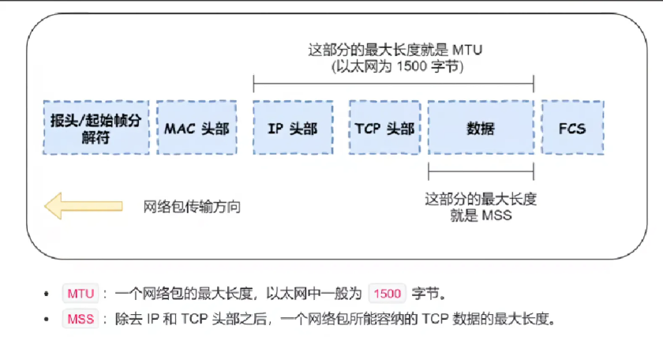
<!-- image-source: https://cdn.nlark.com/yuque/0/2026/png/67474974/1780731789124-75704fde-bd3e-4add-a79a-4d7d4a05665f.png -->

| 字段 | 说明 |
| --- | --- |
| 前导码与帧起始定界符 | 位于线上帧之前，用于同步；通常不计入 64~1518 字节的 MAC 帧长度 |
| 目的 MAC 地址 | 接收方的物理地址（6 字节） |
| 源 MAC 地址 | 发送方的物理地址（6 字节） |
| 类型/长度 | 标识上层协议（如 IPv4、ARP） |
| 负载 | 46~1500 字节；可承载 IPv4/IPv6 数据报、ARP 等，不固定为 TCP |
| 帧尾（FCS） | 帧校验序列，用于差错检测 |


### （2） MTU 与 MSS（高频考点）
| 概念 | 全称 | 含义 | 以太网典型值 |
| --- | --- | --- | --- |
| **MTU** | Maximum Transmission Unit**<font style="color:rgb(15, 17, 21);">（最大传输单元）</font>** | 某链路一次可承载的最大网络层数据报长度；以太网常见值为 1500 字节 | **常见 1500 字节，并非所有链路固定值** |
| **MSS** | Maximum Segment Size**<font style="color:rgb(15, 17, 21);">（最大报文段数据长度）</font>** | TCP 连接一端通告愿意接收的单个 TCP 报文段数据上限，不含 IP/TCP 首部 | **IPv4、1500 MTU 且无 IP 选项时常见 1460** |


**计算关系**：

以太网帧结构 = 目标mac(6) + 源mac(6) + 类型(2) + 数据 (46-1500) + 帧校验 (4)  

以太网负载（最多 1500）可承载：IP 头 + TCP 头（含 TCP 选项）+ TCP 数据。  

以太网帧的大小范围 64 ~ 1518  

```plain
MSS = MTU - IP头长度 - TCP头长度
```

<font style="color:rgb(15, 17, 21);">IP 头最短 20 字节，TCP 头最短 20 字节，故 MSS 最大值为 </font>$ 1500−20−20=1460 $<font style="color:rgb(15, 17, 21);"> 字节。若头部选项更长，MSS 会更小。</font>

实际每个报文段能携带的数据还受路径 MTU、IP 选项和 TCP 选项影响。MSS 是双方在握手时通告的接收能力之一，发送端还应结合路径 MTU 避免 IP 分片。

### （3）IP 协议格式详解
<!-- 这是一张图片，ocr 内容为： -->
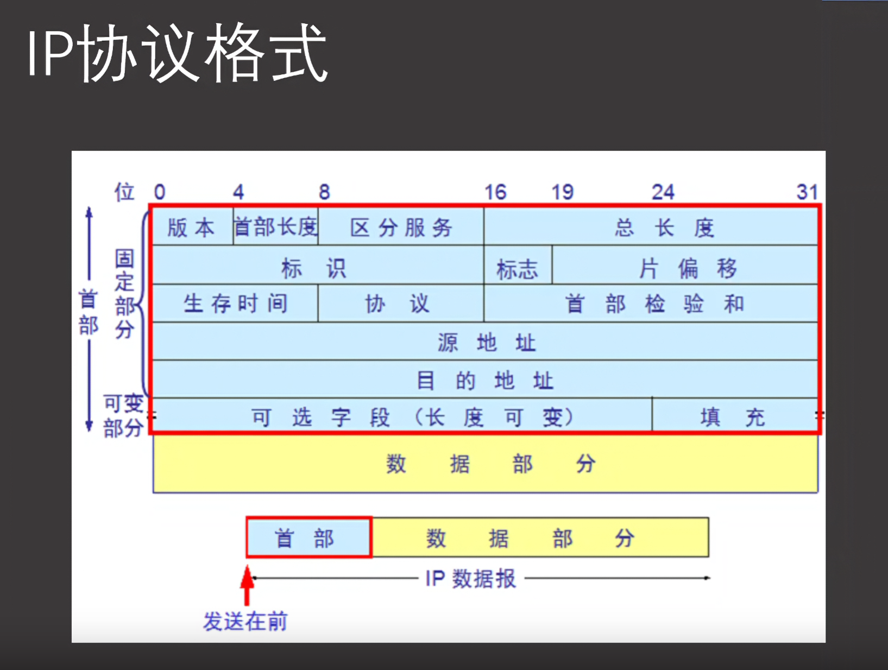
<!-- image-source: https://cdn.nlark.com/yuque/0/2026/png/67474974/1780651421419-fa15d718-9dbb-4239-865a-7a2b47ef5f23.png -->

IP 头由**固定部分（20 字节）** + **可变部分（0~40 字节）** 组成，按 4 字节（32 位）对齐。

#### 可变部分（选项字段）
+ 用于携带自定义信息，长度必须是 4 字节的倍数。
+ 不足 4 字节时，用 `0` 填充（Padding）。
+ 多数选项带有类型、长度和数据，但 EOL、NOP 等选项格式例外。这里的 Type 是协议规定的选项编号，不是 C/C++ 的 `int`、`char*` 等类型。
+ **使用场景**：历史上的记录路由、时间戳、源路由和安全等控制用途。由于性能与安全原因，IPv4 选项在现代互联网中很少使用；DHCP 配置和 WiFi 认证不放在 IPv4 选项中。

#### 固定部分关键字段
| 字段 | 位数 | 作用 |
| --- | --- | --- |
| **版本** | 4 | IPv4 或 IPv6 |
| **首部长度** | 4 | IP 头总长度（用于从数据包中截断 IP 头） |
| **区分服务** | 8 | DSCP 用于差分服务/QoS，ECN 用于显式拥塞通知；是否生效取决于网络策略 |
| **总长度** | 16 | IP 头 + 数据的总长度 |
| **标识** | 16 | 与源/目的地址和上层协议等共同标识同一原始 IPv4 数据报的分片，不是全局唯一包序号 |
| **标志** | 3 | 是否分片、是否是最后一个分片 |
| **片偏移** | 13 | 分片在原数据包中的位置 |
| **生存时间（TTL）** | 8 | 数据包最大转发跳数，防止迷路包占用网络 |
| **协议** | 8 | 上层协议类型（TCP、UDP、ICMP 等） |
| **首部校验和** | 16 | 检测 IPv4 首部中的部分传输错误，不提供防篡改安全性 |
| **源 IP 地址** | 32 | 发送方 IP |
| **目的 IP 地址** | 32 | 接收方 IP |


#### 重点字段详解
**1. 标识（Identification）**

+ **用途**：当一个 IPv4 数据报被分片时，所有分片携带相同标识值，接收端结合源地址、目的地址和协议字段识别哪些分片属于同一原始数据报。
+ **边界**：该字段只服务于 IPv4 分片重组，不提供跨数据报排序，也不能解决 UDP 应用消息乱序。

**2. 标志（Flags）与片偏移（Fragment Offset）**

<!-- 这是一张图片，ocr 内容为： -->
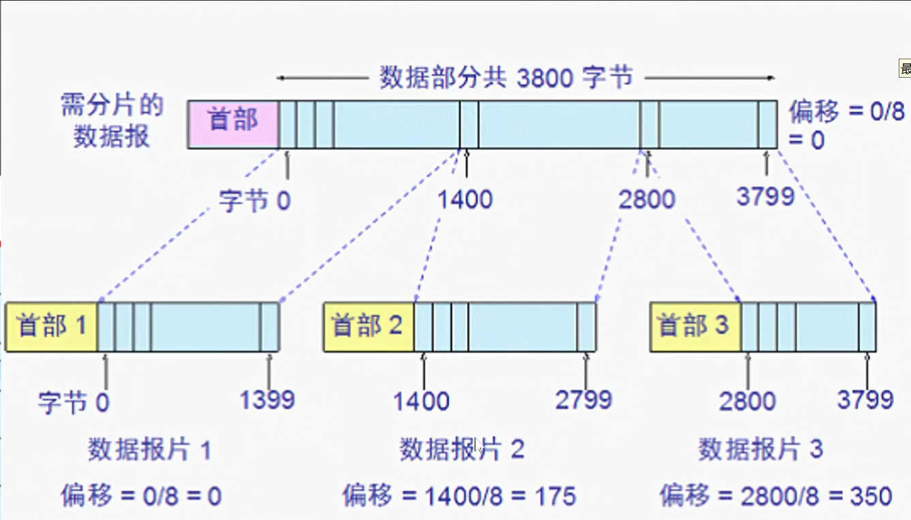
<!-- image-source: https://cdn.nlark.com/yuque/0/2026/png/67474974/1780651455870-1ac55d12-f42b-47be-862f-4c9f945e06f7.png -->

+ **分片场景**：若某个 IPv4 数据报大于下一跳 MTU 且未设置 DF，发送主机或 IPv4 路由器可能进行分片。TCP 通常先按 MSS 分段并配合路径 MTU 发现，不能把 TCP 分段和 IP 分片混为一谈。
+ **标志**：标识当前包是否被分片、是否是最后一个分片。
+ **片偏移**：标识当前分片在原大包中的位置（如 0、175、350），接收端据此重组原始数据包。
+ **标识相同**：同一原始包的所有分片共享同一个标识号。

**3. 生存时间（TTL, Time To Live）**

+ **问题**：路由环路可能导致数据包在网络中无限循环，占满路由器转发能力，阻塞正常流量。
+ **解决方案**：TTL 是一个**跳数计数器**（非时间），每经过一个路由器减 1。减到 0 时，路由器丢弃该包。
+ **示例**：TTL=20 的包，最多经过 20 个路由器，超时未到达目的地则被丢弃。

**4. 首部校验和（Header Checksum）**

+ **作用**：验证 IP 头在传输过程中是否被篡改或损坏。
+ **机制**：发送端计算 16 位首部校验和；接收节点先验证，错误时通常丢弃。IPv4 路由器修改 TTL 后需要更新校验和。
+ **安全边界**：该校验只能发现部分偶发比特错误，不能防止恶意篡改；攻击者可以在修改首部后重新计算校验和。

> **数据包丢失的常见原因**：TTL 超时、校验和错误、路由不可达、网络拥堵等。
>

---

## 附录：常见问题速查表
| 问题 | 答案 |
| --- | --- |
| 如何判断 IP 类别？ | 看第一段：1~127=A，128~191=B，192~223=C，224~239=D，240~255=E |
| 默认子网掩码怎么记？ | A: 1个255，B: 2个255，C: 3个255，后面补0 |
| 网关地址怎么算？ | 不能由掩码直接算出；它是本地子网中由管理员或 DHCP 配置的路由器接口地址 |
| 广播地址怎么算？ | 主机号全 1（直接广播）或 255.255.255.255（受限广播） |
| 子网数怎么算？ | 2^X（X = 借用的主机位数） |
| 每个常规子网可用地址数怎么算？ | 2^Y - 2（Y = 剩余主机位数，减去网络地址和广播地址；`/31`、`/32` 例外） |
| 子网步长怎么算？ | 256 - 子网掩码最后一个非零数 |
| MTU 和 MSS 的区别？ | MTU 是包总长（1500），MSS 是数据长度（1460） |
| IP 头中 TTL 的作用？ | 防止迷路包无限循环，每跳减 1，到 0 丢弃 |
| 为什么发广播报 10013 错？ | Socket 未启用广播发送；先用 `setsockopt` 设置 `SO_BROADCAST`，通常不需要管理员权限 |


---

> **学习建议**：
>
> 1. 实际网络以 CIDR 前缀为准；A/B/C 类默认掩码只作为历史和特定考试题目的补充。
> 2. 公式背熟后多做例题，尤其是考研题，难度远高于普通笔试。
> 3. 代码实战部分建议亲手写一遍 UDP 广播程序，理解 `setsockopt` 和网卡绑定的原理。
> 4. IP 协议字段重点掌握**标识、片偏移、TTL、校验和**的作用，这是面试常考点。
>

# 五、缓冲区、阻塞和非阻塞
## 1. 数据到达设备后存在哪里？
### （1）问题场景
假设发送端已经将数据通过网络发送到了接收端设备，但接收端的应用程序：

+ **场景 A**：应用程序尚未运行（未绑定端口）
+ **场景 B**：应用程序已运行并绑定了端口，但尚未调用 `recvfrom()` 接收数据

这两种场景下，数据分别去了哪里？

### （2）两种场景对比
| 场景 | 是否绑定端口 | 是否调用接收函数 | 数据去向 |
| --- | --- | --- | --- |
| A | 未绑定 | 未调用 | 根据目的端口号找不到对应进程，**数据被丢弃** |
| B | 已绑定 | 未调用 | 数据被存入 **Socket 接收缓冲区**，后续调用 `recvfrom()` 仍可收到 |


### （3）核心结论
> **本地传输端点必须存在，数据才能被分用到对应 Socket。**
>
> 接收服务通常显式 `bind`，客户端也可在 `connect`、`sendto` 等调用时被系统隐式绑定。Socket 相关内核资源在创建时就开始建立，并非执行 `bind` 才分配接收缓冲区。数据能否入队还受协议状态、地址匹配、缓冲区容量和防火墙策略影响。
>

---

## 2. 操作系统内存基础
要理解 Socket 缓冲区的工作原理，需要先了解操作系统的内存管理机制。

### （1）内存与外存
| 类型 | 特点 |
| --- | --- |
| **内存（RAM）** | 读写速度快、容量小、价格贵 |
| **外存（SSD/硬盘等）** | 非易失、容量通常更大、访问速度通常低于 RAM；ROM 只是存储器类别之一，不能与硬盘画等号 |


**数据加载到内存的时机：**

+ 照片/视频：仅在打开播放时加载，且通常**分段加载**（如视频只加载当前播放前后的片段）
+ 图片：文件较小，通常一次性加载
+ 文档（如 Word）：一般可一次性加载

### （2）虚拟内存
32 位进程的虚拟地址空间上限通常为 4GB，但用户态可用范围受系统和程序配置影响；64 位 Windows 进程拥有远大于 4GB 的虚拟地址空间。虚拟地址空间也不等于已经占用的物理内存。

#### "虚拟"的两层含义
**① 地址是虚拟的（映射关系）**

<font style="color:rgb(15, 17, 21);">程序使用的地址（如变量</font>`<font style="color:rgb(15, 17, 21);background-color:rgb(235, 238, 242);">&a</font>`<font style="color:rgb(15, 17, 21);">得到的值）是</font>**<font style="color:rgb(15, 17, 21);">虚拟地址</font>**<font style="color:rgb(15, 17, 21);">，并非物理内存条上的真实</font>**<font style="color:rgb(15, 17, 21);">物理地址</font>**<font style="color:rgb(15, 17, 21);">。操作系统通过内存管理单元（MMU）维护一张映射表，将虚拟地址转换为物理地址。这好比外卖平台上的虚拟号码，保护了双方的真实信息。</font>

```c
int a = 10;
int *p = &a;
printf("%p", p);  // 打印的是虚拟地址
```

操作系统负责维护 **虚拟地址 → 物理地址** 的映射关系，并提供安全保护。

> **类比理解：外卖虚拟号码**
>
> 就像美团/饿了么的虚拟电话功能——顾客和骑手互相看不到真实号码，但可以通过虚拟号码正常通话。操作系统也是如此：程序使用虚拟地址访问内存，操作系统在背后将其映射到真实的物理地址，从而实现内存的隔离和保护。
>

**② 容量是虚拟的（按需分配）**

4GB 并非真实的物理内存。如果每个进程真的占用 4GB，那么 4 个进程就会耗尽 16GB 内存。实际上操作系统采用**按需分配**策略——用多少分配多少，4GB 只是上限。

### （3）用户空间与内核空间
下图只描述传统 32 位 Windows 常见的 2GB 用户态/2GB 内核态模型。现代 64 位 Windows 并不采用这个固定对半划分：

<!-- 这是一张图片，ocr 内容为： -->
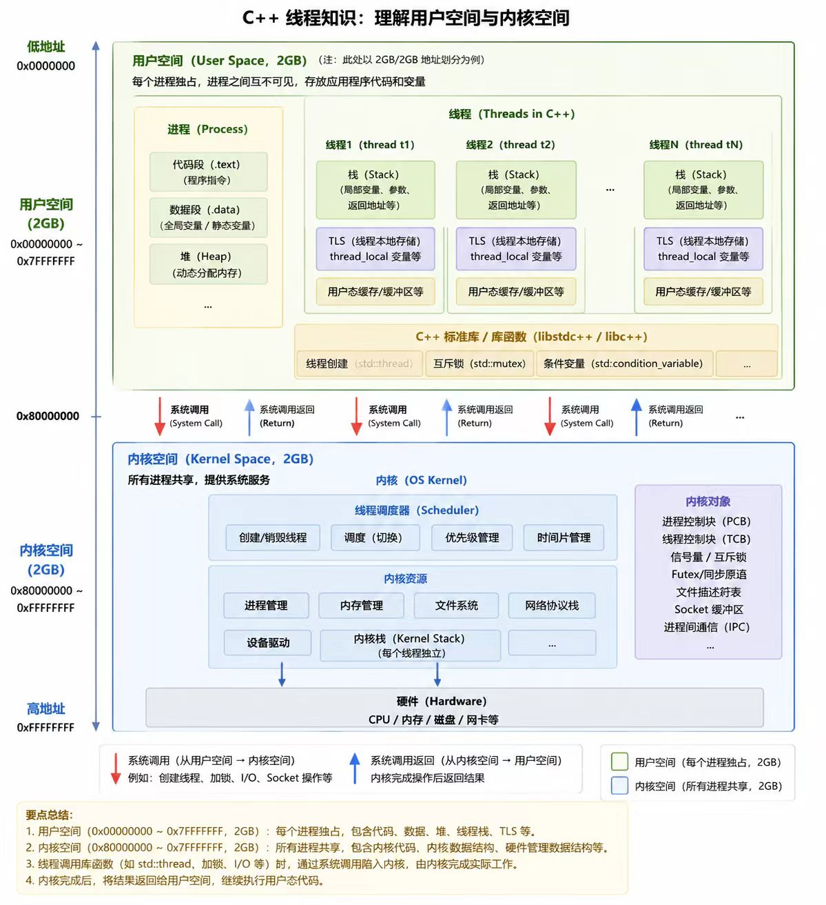
<!-- image-source: https://cdn.nlark.com/yuque/0/2026/jpeg/67474974/1783306487848-931aeb11-9845-4f43-838b-8013727894a7.jpeg -->

```plain
┌─────────────────────────────────────────────┐
│           4GB 虚拟内存（每个进程）          	│
├──────────────────────┬──────────────────────┤
│   0x00000000         │   0x80000000         │
│                      │                      │
│     用户空间（2GB）   │    内核空间（2GB） 	  │
│                      │                      │
│  - 进程独有，互不可见	 │  - 所有进程共享   	  │
│  - 存放应用程序代码 	 │  - 操作系统内核代码 	│
│    和变量           	 │  - Socket 缓冲区     	│
│                      │  - 进程间通信的数据  	│
└──────────────────────┴──────────────────────┘
```

**关键特性：**

+ **用户空间**：每个进程具有独立的虚拟地址映射；相同虚拟地址在不同进程中可映射到不同物理页。
+ **内核空间**：由操作系统管理，应用不能直接访问。具体地址范围取决于系统位数与配置，Socket 缓冲和网络栈对象属于内核管理资源。

---

## 3. Socket 缓冲区的工作原理
### （1）Socket 创建时的内存分配
当进程调用 `socket()` 时，操作系统创建相应的内核网络对象并维护收发队列或缓冲资源。具体分配方式可能按需增长，不能据示意图断言所有协议都立即分配两块固定大小、连续的内存：

```plain
内核空间（共享）
┌──────────────────────────────────────┐
│                                      │
│  Socket A                            │
│  ├── 发送缓冲区（Send Buffer）      	 │
│  └── 接收缓冲区（Receive Buffer）   	 │
│                                      │
│  Socket B                            │
│  ├── 发送缓冲区（Send Buffer）      	 │
│  └── 接收缓冲区（Receive Buffer） 	   │
│                                      │
└──────────────────────────────────────┘
```

### （2）绑定（bind）与端口映射表
当调用 `bind()` 绑定端口后，操作系统会在内部的映射表中记录：

| PID（进程ID） | Socket 描述符 | 端口号 |
| :---: | :---: | :---: |
| 1008 | 200 | 12345 |


当数据到达操作系统后，网络栈结合协议、本地地址/端口、远端地址/端口及连接状态进行分用，而不是只查目的端口号。

### （3）收发数据的完整流程
#### 接收数据（recvfrom）
```plain
 网络数据到达
     │
     ▼
 操作系统根据目的端口号查表
     │
     ▼
 数据写入 Socket 的接收缓冲区（内核空间）
     │
     ▼
 应用程序调用 recvfrom()
     │
     ▼
 从内核空间的接收缓冲区 → 拷贝到 → 用户空间的 buffer
```

`recvfrom()`** 参数解析：**

```c
int recvfrom(
    SOCKET s,            // ① Socket 描述符 → 定位内核中的接收缓冲区
    char *buf,           // ② 用户空间的起始地址 → 数据拷贝的目的地
    int len,             // ③ 最大拷贝长度 → 用户空间能装多少就拷多少
    int flags,
    struct sockaddr *from,
    int *fromlen
);
```

+ 对 TCP 字节流，`recv` 返回当前可用的至多 `len` 字节，剩余字节仍可在后续调用中读取。
+ 对 UDP 数据报，若数据报大于 `len`，Winsock 会把能容纳的前部写入缓冲区并返回 `WSAEMSGSIZE`；该数据报超出的部分被丢弃，不能在下一次 `recvfrom` 中继续读取。

#### 发送数据（sendto）
```plain
 应用程序调用 sendto()
     │
     ▼
 从用户空间的 buffer → 拷贝到 → 内核空间的发送缓冲区
     │
     ▼
 操作系统检测到发送缓冲区有数据
     │
     ▼
 通过网卡将数据发送出去
```

`sendto()`** 参数解析：**

```c
int sendto(
    SOCKET s,            // ① Socket 描述符 → 定位内核中的发送缓冲区
    const char *buf,     // ② 用户空间数据的起始地址
    int len,             // ③ 要发送的数据长度
    int flags,
    const struct sockaddr *to,
    int tolen
);
```

数据拷贝到发送缓冲区后，就**不再由应用程序管理**，由操作系统负责通过网络发送出去。

### （4）流程总结图
```plain
发送端：                                    接收端：
┌───────────────┐                     ┌───────────────┐
│  用户空间   	  │                     │  用户空间     	│
│  ┌───────────┐│                     │  ┌───────────┐│
│  │send buffer││                     │  │recv buffer││
│  └─────┬─────┘│                     │  └────▲──────┘│
├────────┼──────┤                     ├───────┼───────┤
│  内核空间│  		│                     │内核空间│   	  │
│  ┌────▼────┐	│     网络传输    	    │  ┌────┴─────┐	│
│  │发送缓冲区│	├────────────────────►│  │接收缓冲区	│ │
│  └─────────┘	│                     │  └──────────┘ │
└───────────────┘                     └───────────────┘
```

---

## 4. 查看缓冲区大小（getsockopt）
### （1）为什么要知道缓冲区大小？
缓冲区大小决定了：

+ 内核可为该 Socket 排队多少待发送或待读取数据
+ 阻塞或非阻塞调用何时需要等待；它不等于单个 UDP 数据报的最大尺寸，也不等于 TCP 应用一次 `send` 的协议上限

### （2）使用 getsockopt 获取缓冲区大小
之前学习广播时使用过 `setsockopt()`（设置选项），今天使用 `getsockopt()`（获取选项）。

```c
int getsockopt(
    SOCKET s,       // Socket 描述符
    int level,      // 协议级别，填 SOL_SOCKET
    int optname,    // 选项名称
    char *optval,   // 输出参数：接收返回值
    int *optlen     // 输出参数：值的长度
);
```

### （3）代码示例
补充到前文UDPServer中

```c
// 查看发送端缓冲区和接收缓冲区的大小
int recvSize = 0;
int sendSize = 0;
int intSize = sizeof(int);

getsockopt(s, SOL_SOCKET, SO_RCVBUF, (char*)&recvSize, &intSize);
getsockopt(s, SOL_SOCKET, SO_SNDBUF, (char*)&sendSize, &intSize);

cout << "发送端缓冲区大小: " << sendSize 
     << " 接收端缓冲区大小: " << recvSize << endl;
```

**运行结果（Windows 默认值）：**

```plain
接收缓冲区大小: 65536 字节 (64 KB)
发送缓冲区大小: 65536 字节 (64 KB)
```

> 上述 64KB 只能视为某次实验结果。默认值与 Windows 版本、传输协议和系统调优策略有关，应以 `getsockopt` 的实际返回值为准。
>

### （4）发送数据的合理策略
即使某次查询得到的缓冲区为 64KB，也不应把它直接当作单次发送上限或推荐报文大小，原因如下：

1. **网卡繁忙时数据可能积压**：如果网卡正在忙于为其他进程发送数据，你的数据会暂存在发送缓冲区中。下一次再发送 64KB 时，缓冲区可能已满。
2. **协议差异**：TCP 会把字节流分段，应用通常无需按 1500 字节切分每次 `send`；UDP 大数据报可能触发 IP 分片，任一分片丢失都会使整个数据报无法重组，因此实时应用通常主动控制数据报大小并考虑路径 MTU。

> **最佳实践**：TCP 以应用消息协议和流式读写为主，并正确处理短写；UDP 应控制单个数据报大小、避免不必要的 IP 分片。不要把 Socket 缓冲区大小直接当作应用报文大小。
>

---

## 5. 阻塞与非阻塞 I/O
### （1）什么是阻塞与非阻塞？
| 类型 | 定义 | 类比 |
| --- | --- | --- |
| **阻塞（Blocking）** | 函数调用后，在操作完成前**一直等待**，不返回 | 烧水时守在旁边，水开了立刻知道 |
| **非阻塞（Non-blocking）** | 函数调用后，**立即返回**（无论操作是否完成） | 烧水时去看电视，每隔一段时间回来看看水开没开 |


### （2）阻塞与非阻塞的特性对比
| 特性 | 阻塞 | 非阻塞 |
| --- | --- | --- |
| **等待方式** | 调用线程在条件满足前休眠 | 调用立即返回，可配合 `select`、`WSAPoll`、事件通知或 IOCP 等等待机制 |
| **CPU 占用** | 等待期间不执行用户代码，但仍有调度和内核处理成本 | 只有无间隔忙轮询才会持续占用 CPU；事件驱动并不必然高占用 |
| **典型用途** | 逻辑简单、连接数较少的程序 | 事件循环、高并发或需要同时处理多类事件的程序 |


### （3）Socket 默认是阻塞模式
创建 Socket 时默认是**阻塞模式**。这意味着：

+ `recvfrom()` / `recv()`：没有数据时会一直等待（阻塞）
+ `sendto()` / `send()`：正常情况下感觉不到阻塞（因为网卡通常很空闲，发送缓冲区一有数据就被发走了）

> **注意**：阻塞/非阻塞是由 **Socket** 决定的，不是由具体的收发函数决定的。同一个 Socket，要么阻塞收发，要么非阻塞收发。
>

### （4）设置为非阻塞模式（ioctlsocket）
非阻塞模式本身不是“不推荐”；真正应避免的是没有等待机制的忙轮询。

```c
#include <winsock2.h>

u_long mode = 1;  // 非零值 = 非阻塞模式；0 = 阻塞模式
ioctlsocket(sock, FIONBIO, &mode);
```

**参数说明：**

+ `sock`：要设置的 Socket
+ `FIONBIO`：命令，设置 I/O 模式（File I/O Non-Blocking I/O）
+ `mode`：非零表示启用非阻塞，零表示阻塞

### （5）非阻塞接收的处理
非阻塞模式下，`recvfrom()` 没有收到数据时不会等待，而是**立即返回**，并通过错误码 **10035（WSAEWOULDBLOCK）** 告知"当前没有数据"。

> **代码说明**：下面代码块按原稿保留，但它实际演示的是 `sendto`，不是非阻塞 `recvfrom`。正确的接收逻辑应在返回 `SOCKET_ERROR` 时检查 `WSAGetLastError()`：若为 `WSAEWOULDBLOCK`，把 Socket 交给事件等待机制，之后再尝试接收。

```c
int nSendNum = sendto(s, sendBuf, strlen(sendBuf) + 1,0, (sockaddr*)&addrTo, size);
if (nSendNum<strlen(sendBuf)-1)
{
	Sleep(100);
	sendto(s, sendBuf + nSendNum, strlen(sendBuf) + 1 - nSendNum, 0, (sockaddr*)&addrTo, size);
}
```

**非阻塞接收的问题：**

如果程序在收到 `WSAEWOULDBLOCK` 后立即无间隔重试，就会形成忙轮询并提高 CPU 占用；配合事件等待或适当调度则不会出现这一问题。

> **结论**：不要对非阻塞 Socket 做无休止忙轮询。Windows 可使用 `select`、`WSAPoll`、WSA 事件模型或 IOCP；`epoll` 是 Linux 接口。
>

### （6）阻塞发送与非阻塞发送
#### 发送阻塞何时出现？
正常情况下感受不到发送阻塞，因为：

+ 发送缓冲区通常仍有可用空间，具体容量应动态查询
+ 每次发送的数据量不大
+ 网卡空闲，操作系统会迅速将缓冲区中的数据发走

**阻塞出现的条件：发送缓冲区空间不足**

假设网卡正在为其他进程满负荷发送数据：

1. 第一次拷贝 10KB 到发送缓冲区 → 网卡忙，没发走
2. 第二次拷贝 20KB → 仍然没发走，积压在缓冲区
3. 缓冲区只剩 5KB 空间，应用程序要发送 6KB

此时：

| 模式 | 行为 |
| --- | --- |
| **阻塞发送** | 等待网卡把缓冲区中的数据发走，腾出足够空间后再拷贝 |
| **非阻塞发送** | TCP 可能写入部分字节，也可能返回 `WSAEWOULDBLOCK`；UDP 数据报要求原子发送，不能把一个未发完的数据报按返回值继续拼接 |


#### 非阻塞发送的剩余数据处理
对 TCP，`send()` 成功返回的字节数可能小于请求长度，应用需要继续发送剩余字节。对 UDP，`sendto()` 面向完整数据报：数据报不能原子发送时通常返回 `SOCKET_ERROR`，不应把剩余部分当作同一数据报继续发送。下面原稿代码只适用于 TCP 字节流的循环发送思路：

```c
int totalLen = 10240;   // 要发送 10KB
int sentLen = 0;        // 已发送的长度

while (sentLen < totalLen)
{
    int ret = send(sock, buf + sentLen, totalLen - sentLen, 0);
    if (ret > 0) 
    {
        sentLen += ret;
    } 
    else if (ret == SOCKET_ERROR) 
    {
        int err = WSAGetLastError();
        if (err == WSAEWOULDBLOCK) 
        {
            // 缓冲区满了，稍后再试
            Sleep(10);
            continue;
        }
        else 
        {
            // 真正的错误
            break;
        }
    }
}
```

**关键点：**

+ 下一次发送的**起始地址** = `buf + sentLen`（从上次发送到的位置继续）
+ 下一次发送的**长度** = `totalLen - sentLen`（剩余未发送的长度）
+ 需要**循环发送**，直到剩余长度为 0

> **备注**：阻塞/非阻塞的基本概念跨协议和操作系统相似，但 TCP 字节流与 UDP 数据报在短写、截断、错误返回和消息边界方面有关键差异，不能共用同一套处理逻辑。
>

---

## 6. UDP 协议特点总结
### （1）实验：接收缓冲区不足时的现象
当接收缓冲区只有 5 字节，而发送方发送了更长的数据时：

```plain
错误码 10040（WSAEMSGSIZE）：
"在数据报套接字上发送的消息大于内部消息缓冲区或某些其他网络限制"
```

**原因**：UDP 是基于数据报的协议。Winsock 会把缓冲区能容纳的前部复制给应用，并以 `WSAEMSGSIZE` 报告截断；该数据报剩余部分被丢弃，下一次调用读取的是下一份数据报。

> 对比：TCP 是基于**字节流**的协议，可以只读取一部分数据，剩余数据留在缓冲区下次读取。
>

### （2）UDP 四大特点
#### ① 面向无连接
+ 不需要建立连接的过程
+ 有 Socket 就可以直接发送，绑定端口就可以接收
+ 类比：寄快递，不需要提前和收件人"握手"

#### ② 可接收任意客户端数据
+ 服务端可以接收**任何客户端**发来的数据
+ 通过 `recvfrom()` 的第 5 个参数（`sockaddr`）获取发送方的 IP 和端口，从而知道数据来自谁

#### ③ 支持一对一、一对多
+ 单播（一对一）
+ 广播（一对多，如之前演示的 UDP 广播）
+ 组播（一对多）

#### ④ 传输效率高，但不可靠
**协议开销较小**的原因：没有连接建立、确认和重传机制，首部固定为 8 字节。UDP 具有校验和字段；在 IPv4 中发送方可按规则置零表示未使用，在 IPv6 中 UDP 校验和通常是必需的。

**不可靠**的表现：

| 问题 | 说明 |
| --- | --- |
| **丢包** | 数据在网络传输中可能丢失（TTL 耗尽、路由错误、被篡改等），发送方不知道、接收方也不知道 |
| **乱序** | 数据包可能不按发送顺序到达 |
| **不自动恢复** | UDP 校验和可检测部分传输错误，但协议不会为丢失、损坏、重复或乱序的数据报自动重传 |


### （3）关于"乱序"的深入解释
> 疑问：IP 头中不是有"标识"字段来防止乱序吗？为什么 UDP 还会乱序？
>

**解释**：OSI 模型中每一层**只负责解决本层的问题**。

```plain
  发送端                               接收端
┌──────────┐                        ┌──────────┐
│ 应用层  	 │                        │ 应用层  	 │
├──────────┤                        ├──────────┤
│ 传输层  	 │── 如果在这里就乱了 ───►	│ 传输层  	 │
│ (UDP)    │   2,3,1              	│ (UDP)    │── 无法检测，直接上交
├──────────┤                        ├──────────┤
│ 网络层  	 │── IP标识仅用于分片 ──►  	│ 网络层  	 │── 不负责数据报间排序
│ (IP)     │   数据报仍可能乱序     	│ (IP)     │
├──────────┤    不乱               	├──────────┤
│数据链路层 │                        │数据链路层 │
└──────────┘                       	└──────────┘
```

+ IPv4 标识字段只用于把同一原始数据报的分片关联起来并完成重组，不保证不同 IP 数据报之间的顺序
+ 不同数据报可能沿不同路径或经历不同排队时延，因此 UDP 数据报可能乱序到达
+ 若应用要求有序交付，必须在应用协议中加入消息序号、去重、超时和重排策略

## 附录：知识点汇总
| 知识点 | 要点 |
| --- | --- |
| **数据暂存** | 绑定端口后，数据存入内核空间的 Socket 接收缓冲区 |
| **虚拟内存** | 进程使用独立虚拟地址空间；大小与用户/内核划分取决于 32/64 位系统和配置 |
| **Socket 缓冲区** | 创建 Socket 时，OS 在内核空间分配发送缓冲区和接收缓冲区 |
| **默认缓冲区大小** | 与系统和协议有关，应使用 `getsockopt` 查询，不能固定假设为 64KB |
| **阻塞 I/O** | 等待操作完成才返回，不占 CPU，第一时间知道结果 |
| **非阻塞 I/O** | 立即返回，通常与事件通知或 I/O 多路复用配合；应避免忙轮询 |
| **UDP 特点** | 无连接、保留数据报边界、支持广播/组播、尽最大努力交付；过长数据报可能发生 IP 分片 |
| **TCP 特点** | 面向连接、字节流、可靠传输 |


---

# 六、_TCP 协议通信原理_
## 1. TCP 与 UDP 的流程对比
**UDP 流程**

```plain
客户端                    服务端
  │                        │
  ├─ socket()              ├─ socket()
  │                        ├─ bind()
  │     sendto() ──────►   ├─ recvfrom()
  │     recvfrom() ◄────── │  sendto()
  ├─ closesocket()         ├─ closesocket()
  └─ WSACleanup()          └─ WSACleanup()
```

**TCP 流程**

<!-- 这是一张图片，ocr 内容为： -->
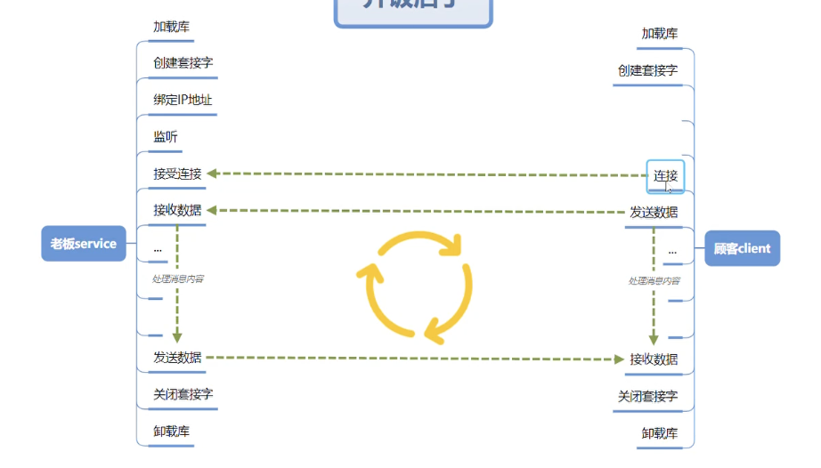
<!-- image-source: https://cdn.nlark.com/yuque/0/2026/png/67474974/1780843947234-624a08cd-735b-4c37-a9f4-10dd6e4311c7.png -->

```plain
客户端                          服务端
  │                              │
  ├─ 1.加载库 WSAStartup()        ├─ 1.加载库 WSAStartup()
  ├─ 2.创建套接字	socket()         ├─ 2.创建套接字 socket()
  │                              ├─ 3.绑定IP地址 bind()
  │                              ├─ 4.监听 listen()        ← 监听
  │                              │
  ├─ 3.连接	connect() ─────────► ├─ 5.接受连接 accept()        ← 接受连接
  │                              │  （产生新 Socket）
  │                              │
  ├─ 4.发送数据	send()────────►  ├─ 6.接收数据 recv()          ← 通信
  ├─ 5.接收数据 	recv()◄────────  ├─ 7.发送数据 send()
  │      ...                     │      ...
  │                              │
  ├─ 6.关闭套接字	closesocket()    ├─ closesocket(通信Socket)
  ├─ 7.卸载库 WSACleanup()        │  └─ 循环 accept() 等待下一个连接
  │                              ├─ 8.关闭套接字 closesocket(监听Socket)
  │                              └─ 9.卸载库 WSACleanup()
```

## 2.编码规范与注意事项
在进行 TCP 网络编程时，需养成良好的编码习惯：

+ **变量初始化**：变量应定义在循环外部并赋予一个初始非法值（如表示失败的返回值），而非默认赋予成功值。这样可以避免因未正确赋值而导致的逻辑错误。
+ **工作留痕**：无论函数调用成功还是失败，都应打印相应的日志信息，便于调试和排查问题。
+ **独立编写能力**：切忌简单地在 UDP 与 TCP 之间、客户端与服务端之间复制粘贴代码。应当根据 IDE 提示和函数签名，理解每个参数的含义后独立编写。

> **核心原则**：在最初没有参考代码时，开发者同样需要编写代码。理解函数签名与参数含义，比机械复制更为重要。
>

## 3.TCP 的核心概念：面向连接
TCP 像**打电话**：

1. **拨号**（connect） → 客户端主动发起连接
2. **接听**（accept） → 服务端接受连接
3. **通话**（send/recv） → 双方通过建立的连接收发数据
4. **挂断**（closesocket） → 关闭连接

### （1）关键函数详解
#### listen() — 监听
```c
int listen(SOCKET s, int backlog);
```

| 参数 | 说明 |
| --- | --- |
| `s` | 用于监听的 Socket |
| `backlog` | 内核维护待处理连接队列时使用的提示值；实际队列和截断规则由系统实现决定 |


`backlog`** 的含义：**

当多个客户端同时请求连接时，内核需要为尚未被应用取走的连接维护队列。`backlog` 是期望队列规模的提示值，不能理解为服务器最多可服务的客户端总数，也不能保证内核严格采用该数值。

> 类比：银行柜台办业务，排队的人太多，超过一定数量就会告诉后来的人"请等一下再来"。
>

```c
listen(listenSocket, 100);  // 最多允许 100 个客户端排队等待连接
```

#### accept() — 接受连接
```c
SOCKET accept(SOCKET s, struct sockaddr *addr, int *addrlen);
```

| 参数 | 说明 |
| --- | --- |
| `s` | 监听用的 Socket |
| `addr` | **输出参数**，返回连接方的 IP 和端口 |
| `addrlen` | 地址结构体的大小 |
| **返回值** | **新的 Socket**，专门用于与该客户端通信 |


#### recv() — 接收数据
```c
int recv(SOCKET s, char *buf, int len, int flags);
```

相比 `recvfrom()`，**少了后两个参数**（`from` 和 `fromlen`），因为 TCP 是面向连接的，通信 Socket 本身就代表了与特定客户端的连接，不需要再获取对方地址。

#### send() — 发送数据
```c
int send(SOCKET s, const char *buf, int len, int flags);
```

同理，相比 `sendto()` 少了目标地址参数

#### 为什么 accept 返回新的 Socket？
```plain
                    ┌─────────────────────────┐
                    │       服务端             │
                    │                         │
                    │  监听 Socket (socket1)  	│
                    │  ├── 职责：接受新连接     	│
                    │  └── 一直在 accept() 等待	│
                    │                         │
 客户端 A ────────►  │  通信 Socket (socket2)  	│
                    │  └── 专门与客户端 A 通信  	│
                    │                         │
 客户端 B ────────►  │  通信 Socket (socket3)  	│
                    │  └── 专门与客户端 B 通信  	│
                    │                         │
 客户端 C ────────►  │  通信 Socket (socket4)  	│
                    │  └── 专门与客户端 C 通信 	│
                    └─────────────────────────┘
```

> **类比**：饭店的迎宾和服务员
>
> + **监听 Socket** = 迎宾：负责在门口迎接客人（接受连接），客人入座后就去迎接下一位
> + **通信 Socket** = 专属服务员：每位客人入座后分配一个专属服务员负责点菜、上菜（收发数据）
>

**关键点：**

+ 监听 Socket 和通信 Socket 都是**服务端的资源**
+ 后续收发数据必须使用**通信 Socket**（`socket2`、`socket3`...），不能用监听 Socket
+ 与某个客户端断开连接后，关闭对应的通信 Socket，监听 Socket 继续等待新的连接

### （2）TCP 服务端
```c
#define _WINSOCK_DEPRECATED_NO_WARNINGS//使用过时的函数时不弹出警告
#include<iostream>
#include<WinSock2.h>

#pragma comment(lib,"Ws2_32.lib")

using namespace std;

int main() {
    //1.加载库 WS2_32.lib
    WORD version = MAKEWORD(2, 2);
    WSADATA data = {};
    int err = WSAStartup(version, &data);//返回 0 成功，加载库的函数WSAStartup(输入参数：WORD库版本号,输出参数（传地址）：WSADATA结构体);
    //调用操作系统函数时一定要判断返回值（成功还是失败）
    if (0 != err)
    {
        cout << "WSAStartup fail" << endl;
        return 0;
    }
    //检查加载库的版本号是否成功
    if (data.wVersion == version)
    {
        cout << "WSAStartup success" << endl;
    }
    else
    {
        //库的版本号不对，卸载库
        cout << "WSAStartup version error" << endl;
        WSACleanup();//无参

        return 1;
    }

    // 2. 创建套接字(TCP)
    SOCKET s1 = socket(AF_INET, SOCK_STREAM, IPPROTO_TCP);
    if (s1 == INVALID_SOCKET)
    {
        cout << "socket error:" << WSAGetLastError() << endl;
        //卸载库
        WSACleanup();
        return 1;
    }
    else
    {
        cout << "socket success" << endl;
    }

    // 3. 绑定 IP 和端口
    sockaddr_in addr = {};//IPv4地址结构体
    addr.sin_family = AF_INET;//地址族，必须和socket()函数的第一个参数一致
    //在网络通信中，依靠 IP 地址 + 端口号 的组合来唯一标识一个设备上的一个进程。IP 定位设备，端口号定位该设备上的具体进程。
    addr.sin_port = htons(54321);
    addr.sin_addr.S_un.S_addr = INADDR_ANY;//绑定所有IP
    err = bind(s1, (sockaddr*)&addr, sizeof(addr));//返回SOCKET_ERROR则失败
    if (SOCKET_ERROR == err)
    {
        cout << "bind error:" << WSAGetLastError() << endl;
        closesocket(s1);//参数是要关闭的套接字变量名
        WSACleanup();
        return 1;
    }
    else
    {
        cout << "bind success" << endl;
    }

    // 4. 监听
    err = listen(s1, 100/*排队等待连接的队列的最大长度*/);
    if (SOCKET_ERROR == err)
    {
        cout << "listen error:" << WSAGetLastError() << endl;
        closesocket(s1);//参数是要关闭的套接字变量名
        WSACleanup();
        return 1;
    }
    else
    {
        cout << "listen success" << endl;
    }

    sockaddr_in addrClient = {};
    int addrSize = sizeof(addrClient);
    int nRecvNum = 0;
    int nSendNum = 0;
    char recvBuf[4096] = "";
    char sendBuf[4096] = "";
    while (true) {
        // 5. 接受连接
        SOCKET s2 = accept(s1/*监听使用哪个socket，接受连接就选哪个*/,
            (sockaddr*)& addrClient/*来连接的客户端的地址信息*/,&addrSize);
        if (INVALID_SOCKET == s2)
        {
	        cout<<"accapt error"<< WSAGetLastError() << endl;
            break;
        }
        else
        {
            //连接成功打印客户端的IP地址
			cout << "client ip:" << inet_ntoa(addrClient.sin_addr) << endl;
        }

        //通信
        while (true) {
            // 6.接收数据
            nRecvNum = recv(s2,recvBuf,sizeof(recvBuf),0);
            if (nRecvNum > 0)
            {
				cout << "server recv:" << recvBuf << endl;
            }
            else
            {
	            cout<<"recv error:" << WSAGetLastError() << endl;
				break;
            }


			cin >> sendBuf;
        	//7.发送数据
            nSendNum = send(s2,sendBuf,strlen(sendBuf)+1,0);
            if (SOCKET_ERROR == nSendNum) 
            {
                cout << "send error:" << WSAGetLastError() << endl;
                break;
            }
        }

		//通信结束，关闭连接套接字s2
		closesocket(s2);
    }

    // 8. 关闭套接字并卸载库
    closesocket(s1);
    WSACleanup();
    return 0;
}
```

> 以下代码按原稿保留。服务端按顺序处理客户端，不具备并发服务能力；同时还把一次 `send`/`recv` 当作一条完整字符串消息。实际项目应另行实现消息定界、短读短写处理和安全的字符串长度控制，再在线程池、`select`/`WSAPoll` 或 IOCP 等模型上扩展并发能力。

### （3）TCP 客户端
#### TCP 客户端核心流程
| 步骤 | 操作 | 说明 |
| --- | --- | --- |
| 1 | 加载网络库 | 初始化网络环境（如 `WSAStartup`） |
| 2 | 创建套接字 | `socket(AF_INET, SOCK_STREAM, IPPROTO_TCP)` |
| 3 | 连接服务端 | `connect()` — 返回 `int` 类型，需用变量接收返回值并判断成功/失败 |
| 4 | 发送/接收数据 | `send()` / `recv()`；处理短写、短读，且 `recv()==0` 表示对端正常关闭发送方向 |
| 5 | 关闭套接字 | `closesocket()` / `close()`，释放资源 |
| 6 | 卸载网络库 | 清理网络环境 |


#### `connect` 函数参数解析
```c
int connect(SOCKET s, const struct sockaddr *addr, int addrlen);
```

| 参数 | 说明 |
| --- | --- |
| `s` | 客户端的 Socket（创建后直接使用，不需要 bind） |
| `addr` | 服务端的地址信息（IP + 端口） |
| `addrlen` | 地址结构体大小 |


+ `s`：客户端创建的套接字描述符（输入参数）。
+ `addr`：目标服务端的地址信息（输入参数），即"你要连接谁"。
    - 包含 `sin_family`（设为 `AF_INET`）、`sin_port`（服务端端口号，需使用网络字节序）、`sin_addr`（服务端 IP 地址，如 `127.0.0.1` 本地环回地址可保证连接稳定，不受物理网络 IP 变化影响）。
    - 需使用 `(struct sockaddr*)` 进行强制类型转换。
+ `addrlen`：地址结构体的长度。

#### 客户端完整代码
```cpp
#define _WINSOCK_DEPRECATED_NO_WARNINGS//使用过时的函数时不弹出警告
#include<iostream>
#include<WinSock2.h>

#pragma comment(lib,"Ws2_32.lib")

using namespace std;

int main() {
    //1.加载库 WS2_32.lib
    WORD version = MAKEWORD(2, 2);
    WSADATA data = {};
    int err = WSAStartup(version, &data);//返回 0 成功，加载库的函数WSAStartup(输入参数：WORD库版本号,输出参数（传地址）：WSADATA结构体);
    //调用操作系统函数时一定要判断返回值（成功还是失败）
    if (0 != err)
    {
        cout << "WSAStartup fail" << endl;
        return 0;
    }
    //检查加载库的版本号是否成功
    if (data.wVersion == version)
    {
        cout << "WSAStartup success" << endl;
    }
    else
    {
        //库的版本号不对，卸载库
        cout << "WSAStartup version error" << endl;
        WSACleanup();//无参

        return 1;
    }

    // 2. 创建套接字(TCP)
    SOCKET s = socket(AF_INET, SOCK_STREAM, IPPROTO_TCP);
    if (s == INVALID_SOCKET)
    {
        cout << "socket error:" << WSAGetLastError() << endl;
        //卸载库
        WSACleanup();
        return 1;
    }
    else
    {
        cout << "socket success" << endl;
    }

    sockaddr_in addrTo = {};
    addrTo.sin_family = AF_INET;
    addrTo.sin_port = htons(54321);//绑定端口号，端口号尽量大，区分其它应用端口号  htons：转换成大端存储
    addrTo.sin_addr.S_un.S_addr = inet_addr("192.168.1.137");//绑定IP
    int size = sizeof(addrTo);
    int nRecvNum = 0;
    int nSendNum = 0;
    char recvBuf[4096] = "";
    char sendBuf[4096] = "";
    while (true) {
        // 3. 连接
        err = connect(s/*绑定socket*/, (sockaddr*)&addrTo, size);
        if (SOCKET_ERROR == err)
        {
            cout << "connect error:" << WSAGetLastError() << endl;
            closesocket(s);//参数是要关闭的套接字变量名
            WSACleanup();
            return 1;
        }
        else
        {
            cout << "connect success" << endl;
        }

        //通信
        while (true) {
            cin >> sendBuf;
            //4.发送数据
            nSendNum = send(s, sendBuf, strlen(sendBuf) + 1, 0);
            if (SOCKET_ERROR == nSendNum)
            {
                cout << "send error:" << WSAGetLastError() << endl;
                break;
            }

            //5.接收数据
            nRecvNum = recv(s, recvBuf, sizeof(recvBuf), 0);
            if (nRecvNum > 0)
            {
                cout << "server recv:" << recvBuf << endl;
            }
            else
            {
                cout << "recv error:" << WSAGetLastError() << endl;
                break;
            }
        }
    }

    //6. 关闭套接字并卸载库
    closesocket(s);
    WSACleanup();
    return 0;
}
```

### （4）运行顺序
本示例应先启动服务端，再启动客户端。若服务端尚未监听，当前 `connect` 会失败；真实客户端可以采用有限次数、带退避和超时的重试策略，但重试时通常需要重新创建 Socket，并避免无限快速重连。

---

## 4.TCP 协议概述
TCP（Transmission Control Protocol，传输控制协议）的三个核心特征：

| 特征 | 说明 |
| --- | --- |
| **面向连接** | 通信前必须通过握手建立连接，结束后通过挥手断开连接 |
| **可靠传输** | 在连接存续且没有最终错误的前提下，向应用提供有序、不重复的可靠字节流；应用仍需处理断线、超时及“对端业务是否已处理”等语义 |
| **基于字节流** | 数据以字节流形式传输，不保留消息边界 |


> **对比 UDP**：UDP 是无连接、不可靠的协议，其协议头仅包含源端口、目的端口、长度和校验和，不包含序号、确认号等可靠性保障字段。
>

---

## 5.TCP 协议头结构详解
### （1）整体结构
<!-- 这是一张图片，ocr 内容为： -->
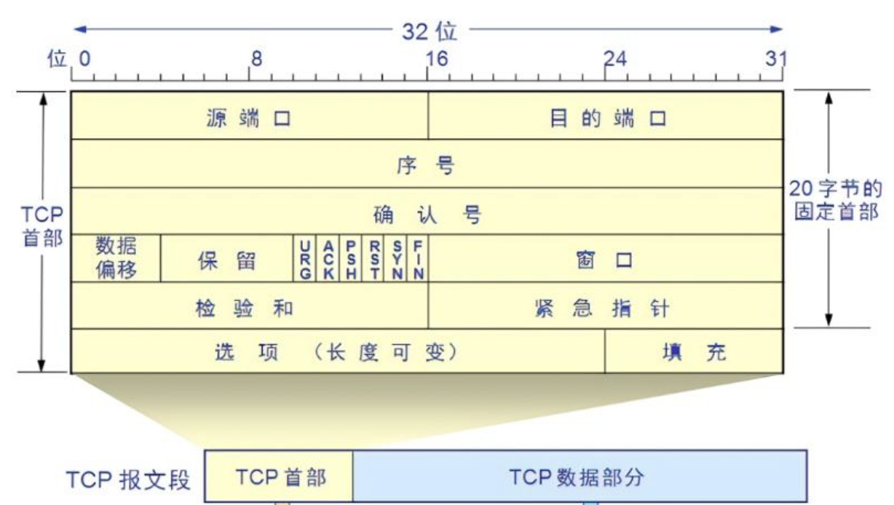
<!-- image-source: https://cdn.nlark.com/yuque/0/2026/png/67474974/1780987978699-a860c8d3-0b7c-4826-bbe1-acf84a3b1289.png -->

+ **总长度**：20 ~ 60 字节
    - **固定部分**：前 20 字节（5 行 × 4 字节/行），必须存在
    - **可选部分**：最多 40 字节，用于携带选项信息
+ **对齐要求**：与 IP 头部类似，选项部分必须填充为 4 字节的整数倍
+ **选项格式**：多数选项包含 Kind、Length 和 Value；EOL、NOP 等单字节选项例外

> **补充说明**：TCP 选项承载 MSS、窗口扩大、时间戳、SACK 许可等传输控制信息，不用于传递应用数据。应用数据始终位于 TCP 首部之后。
>

### （2）固定部分各字段详解
| 字段 | 长度 | 说明 |
| --- | --- | --- |
| **源端口（Source Port）** | 16 bit（2字节）  | 发送方进程端口号 |
| **目的端口（Destination Port）** | 16 bit（2字节） | 接收方进程端口号 |
| **序号（Sequence Number, SEQ）** | 32 bit（4字节）  | 本报文段所发送数据的第一个字节的序号。用于解决乱序问题，保证数据有序到达 |
| **确认号（Acknowledgment Number, ACK）** | 32 bit（4字节）  | 期望收到对方下一个报文段的第一个字节的序号。只有 ACK 标志位为 1 时此字段才有效 |
| **数据偏移（Data Offset）** | 4 bit | 即 TCP 头部长度，以 4 字节为单位 |
| **保留/扩展控制位** | 若干 bit | 现代头部还定义 NS、CWR、ECE 等位；教材常重点讲下面六个经典控制位 |
| **经典标志位** | 6 bit | URG、ACK、PSH、RST、SYN、FIN（详见第6节） |
| **窗口（Window）** | 16 bit（2字节）  | 接收窗口大小，用于流量控制（详见第12节） |
| **校验和（Checksum）** | 16 bit（2字节）  | 检验报文段在传输过程中是否损坏，损坏则丢弃 |
| **紧急指针（Urgent Pointer）** | 16 bit（2字节）  | 与 URG 标志位配合使用，指示紧急数据的偏移量 |


---

## 6.TCP 标志位详解
### （1）标志位的基本概念
**标志位（Flag）** 是二进制中的一个位（bit），取值为 `0` 或 `1`：

+ `1`：表示该功能**启用**（置位）
+ `0`：表示该功能**未启用**

> **辨析**：代码中函数参数的 `flags` 传入 `0`，是十进制的 0，表示"无特殊标志"，属于标志（flag）而非标志位（flag bit）。TCP 协议头中的标志位是二进制层面的概念。
>

传统教材重点讲 6 个经典标志位；现代 TCP 头部还包含与 ECN 等机制有关的 ECE、CWR、NS 位。

### （2）六大标志位
| 标志位 | 全称 | 功能说明 |
| --- | --- | --- |
| **URG** | Urgent | **紧急指针标志**。置 1 时，接收方会检查紧急指针字段，优先处理紧急数据 |
| **ACK** | Acknowledgment | **确认标志**。置 1 时，确认号字段有效。TCP 规定：连接建立后所有传送的报文段都必须把 ACK 置 1 |
| **PSH** | Push | **推送标志**。置 1 时，接收方应尽快将数据交付给应用层，而非等待缓冲区填满 |
| **RST** | Reset | **重置标志**。置 1 时表示出现严重差错，必须释放连接并重新建立；或用于拒绝非法连接请求 |
| **SYN** | Synchronize | **同步标志**。置 1 表示这是一个连接请求或连接接受报文。用于三次握手建立连接 |
| **FIN** | Finish | **终止标志**。置 1 表示发送方已完成数据发送，请求释放连接。用于四次挥手断开连接 |


> **面试要点**：书写时，若标志位置 1，直接写大写字母（如 `SYN`、`ACK`）；小写 `ack` 表示具体的确认号数值。
>

### （3）RST 的使用场景
RST 用于在连接已建立的情况下进行重置：

+ 中间网络设备故障，但存在备用链路可重新连接
+ 主机崩溃后重启，旧连接失效
+ 收到不属于当前连接的报文段

### （4）SYN 与 FIN 的"仪式感"
+ **SYN（建立连接）**：类似"表白"，需要双方交互确认
+ **FIN（断开连接）**：类似"分手"，同样需要双方协商确认

---

## 7.TCP<font style="color:rgb(15, 17, 21);">核心可靠机制详解</font>
### （1）确认应答机制
<!-- 这是一张图片，ocr 内容为： -->
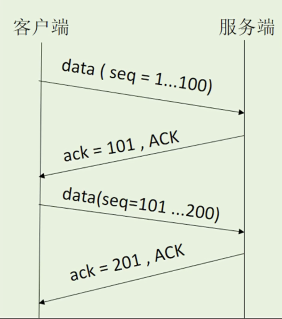
<!-- image-source: https://cdn.nlark.com/yuque/0/2026/png/67474974/1780988119524-8385af70-d555-48d5-a4f4-7ca1b01726cf.png -->

**<font style="color:rgb(15, 17, 21);">机制描述</font>**<font style="color:rgb(15, 17, 21);">：</font>TCP 的可靠性核心在于**确认应答（Acknowledgment）机制**：

+ TCP 按**字节序号**确认数据，不要求每收到一个报文段都立即单独回复 ACK；ACK 可累计、延迟，也可捎带在反向数据中
+ 对携带数据的报文段，确认号通常是“下一期待字节序号”，即 `SEQ + 有效数据长度`；SYN 和 FIN 各占用一个序号空间，纯 ACK 不占用
+ 含义："`ACK` 之前的所有数据均已正确接收，请从 `ACK` 开始继续发送"

**<font style="color:rgb(15, 17, 21);">示例</font>**<font style="color:rgb(15, 17, 21);">：发送方发一个</font>`<font style="color:rgb(15, 17, 21);">SEQ=1</font>`<font style="color:rgb(15, 17, 21);">、数据长度100的包。接收方收到后，回一个</font>`<font style="color:rgb(15, 17, 21);">ACK=101</font>`<font style="color:rgb(15, 17, 21);">的确认包，表示：“101之前的数据（即1到100）我都收到了，你下次从101开始发。”</font>

**<font style="color:rgb(15, 17, 21);">批量发送与累计应答</font>**<font style="color:rgb(15, 17, 21);">：TCP 允许发送方在窗口范围内连续发送数据，不必每段停等。累计 ACK 的值是接收方下一步期待的字节序号，表示该值之前的连续字节均已收到。例如连续收到字节 `1~100`、`101~200`、`201~300` 后，可以回复 `ACK=301`。若中间存在缺口，确认号仍停留在第一个缺失字节；不能只取“最大报文段 SEQ + 1”。</font>

**延迟确认（Delayed ACK）**：接收端可以短暂延迟 ACK，以减少纯 ACK 数量并等待是否有反向数据可捎带确认；但延迟受协议实现限制，遇到乱序或缺口时通常应更快确认，以帮助丢包恢复。

---

### （2）超时重传机制
<!-- 这是一张图片，ocr 内容为： -->
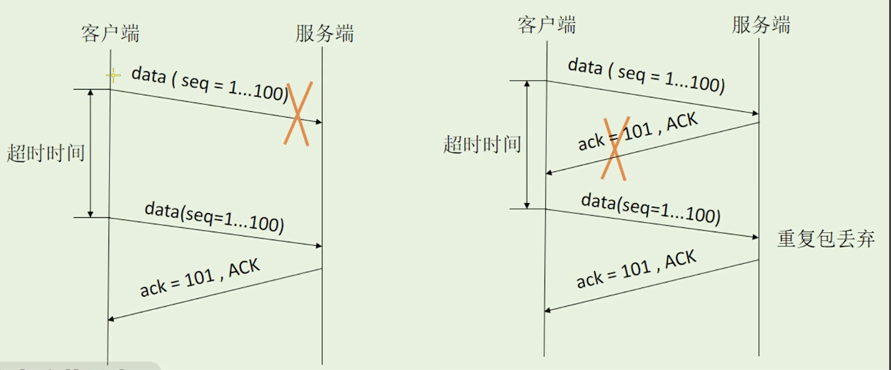
<!-- image-source: https://cdn.nlark.com/yuque/0/2026/png/67474974/1780988152485-4bd1fe23-7db4-4b5b-aaca-d701bc3e288b.png -->

**触发条件**

当数据包或 ACK 在网络传输中丢失时，需通过超时重传机制恢复：

| 丢失场景 | 发送方行为 | 接收方行为 |
| --- | --- | --- |
| **<font style="color:rgb(15, 17, 21);">发往接收方的</font>****数据包丢失**（去程丢） | 超时未收到 ACK，触发重传 | 未收到数据，无响应 |
| **<font style="color:rgb(15, 17, 21);">接收方回复的 </font>****ACK 丢失**（回程丢） | 超时未收到 ACK，触发重传 | 收到重复数据包，**丢弃**但**回复 ACK** |


**超时时间（RTO）的动态计算**

+ 超时时间**不是固定值**，而是根据网络状况**动态调整**
+ 网络负载小 → 往返时延（RTT）短 → RTO 设置较短
+ 网络拥塞 → RTT 增长 → RTO 相应延长
+ 具体算法基于 RTT 的加权平均计算（详见第10节）

**接收方处理重复包**

+ 接收方对已处理的数据包不做二次处理，直接**丢弃**
+ 但**必须回复 ACK**，告知发送方数据已收到，避免不必要的重传

---

## 8.三次握手（连接建立）
### （1）握手流程
<!-- 这是一张图片，ocr 内容为： -->
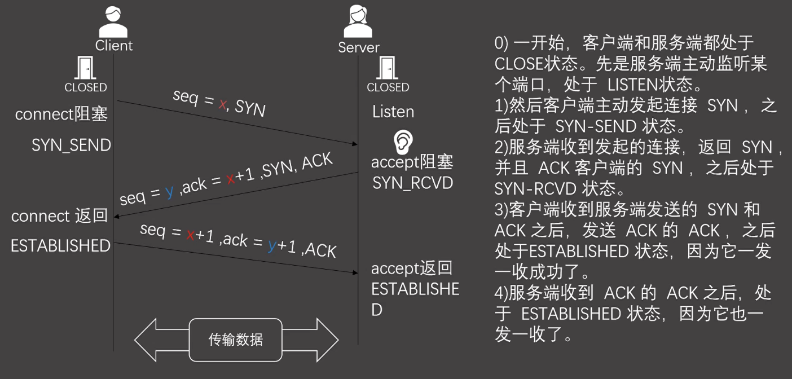
<!-- image-source: https://cdn.nlark.com/yuque/0/2026/png/67474974/1780988228995-74c304e1-1cb5-4f55-b603-4d8dd89d3430.png -->

### （2）各阶段详解
#### 第一次握手：客户端发起连接请求
+ 客户端发送 `SYN=1` 的报文段
+ 携带初始序列号 `seq=x`（**随机生成**，非从 0 或 1 开始，防止历史连接干扰）
+ 客户端状态：`CLOSED` → `SYN-SENT`

#### 第二次握手：服务端确认并同意连接
+ 服务端收到 SYN 后，回复 `SYN=1, ACK=1` 的报文段
+ `ack=x+1`：确认收到客户端的 SYN
+ `seq=y`：服务端自己的初始序列号（同样随机生成）
+ **SYN 和 ACK 可以合并在一个报文中发送**，节省资源和时间
+ 服务端状态：`LISTEN` → `SYN-RCVD`

#### 第三次握手：客户端确认服务端的同意
+ 客户端收到 SYN+ACK 后，回复 `ACK=1` 的报文段
+ `seq=x+1`：客户端序列号递增
+ `ack=y+1`：确认收到服务端的 SYN
+ 客户端状态：`SYN-SENT` → `ESTABLISHED`
+ 服务端收到 ACK 后状态：`SYN-RCVD` → `ESTABLISHED`
+ 连接建立完成，开始数据传输

### （3）三次握手的面试考点
#### 考点一：流程与状态变化
必须掌握三个报文段中的 SEQ/ACK 值以及双方的状态转换。

#### 考点二：为什么是三次，不是两次或四次？
**为什么不能是两次？**

两次握手无法防止**历史重复连接**导致的资源浪费。

> **场景分析**：客户端发出一个连接请求（SYN）后因网络延迟滞留，客户端超时后重新发起新的连接并正常通信后关闭。若旧的 SYN 此时才到达服务端，服务端会认为是新连接请求而回复 SYN+ACK。
>
> + **两次握手**：服务端收到请求即认为连接已建立，开始分配资源并等待数据；而客户端并未发起新连接，不会响应。服务端将一直等待，造成资源浪费。
> + **三次握手**：客户端收到服务端的 SYN+ACK 后发现不是自己期望的连接，会回复 RST 拒绝。服务端不会建立无效连接。
>

**为什么不是四次？**

第二次握手中的 `SYN` 和 `ACK` 可以合并在一个报文中发送：

+ **物理层面**：两个标志位占用不同的比特位，互不影响，可同时置 1
+ **逻辑层面**：SYN（请求连接）与 ACK（确认对方请求）不冲突，不存在"既分手又在一起"的逻辑矛盾
+ 因此无需拆分为两次发送，四次纯属浪费

> **面试注意**：回答此类问题时，需结合具体场景和协议原理进行专业分析，避免口语化表达。
>

---

## 9.四次挥手（连接断开）
### （1）挥手流程
<!-- 这是一张图片，ocr 内容为： -->
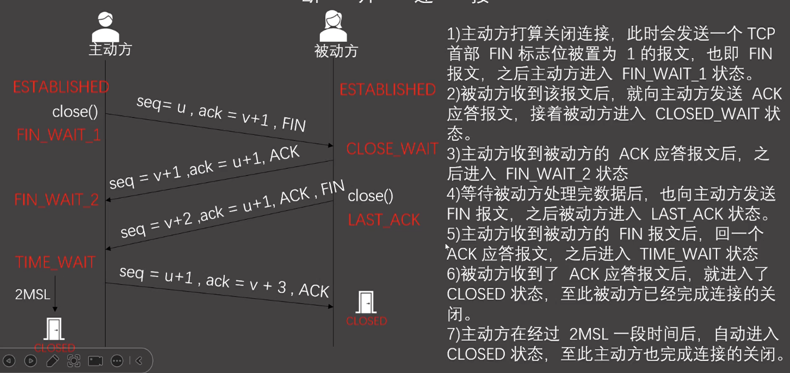
<!-- image-source: https://cdn.nlark.com/yuque/0/2026/png/67474974/1780988288786-4b5a5fcf-59ad-4c00-940e-137f35161bcf.png -->

### （2）各阶段详解
#### 第一次挥手：主动方请求断开
+ 主动方（可为客户端或服务端）数据发送完毕，发送 `FIN=1` 的报文段
+ `seq=u`：当前序列号
+ 主动方状态：`ESTABLISHED` → `FIN-WAIT-1`
+ **注意**：发送 FIN 后，主动方仍可接收数据，但不再发送应用数据

#### 第二次挥手：被动方确认收到断开请求
+ 被动方收到 FIN，立即回复 `ACK=1`
+ `ack=u+1`：确认收到 FIN
+ 主动方状态：`FIN-WAIT-1` → `FIN-WAIT-2`
+ 被动方状态：`ESTABLISHED` → `CLOSE-WAIT`

> **CLOSE-WAIT 状态的含义**：本地 TCP 已收到对端 FIN，并已向应用报告对端不再发送数据；本地应用仍可发送剩余数据，随后应主动调用关闭。长期停留在 CLOSE-WAIT 通常意味着应用忘记关闭 Socket，而不是 TCP 正在自动处理接收缓冲区。
>

#### 第三次挥手：被动方同意断开
+ 被动方处理完所有数据后，发送 `FIN=1` 的报文段
+ `seq=w`：被动方当前序列号（可能因中间发送过数据而大于 `u+1`）
+ `ack=u+1`：保持对之前 FIN 的确认
+ 被动方状态：`CLOSE-WAIT` → `LAST-ACK`

#### 第四次挥手：主动方最终确认
+ 主动方收到 FIN 后，回复 `ACK=1`
+ `seq=u+1`，`ack=w+1`
+ 被动方收到 ACK 后：`LAST-ACK` → `CLOSED`（连接彻底关闭）
+ 主动方状态：`FIN-WAIT-2` → `TIME-WAIT`
+ 主动方**等待 2MSL** 后进入 `CLOSED` 状态

### （3）四次挥手的面试考点
#### 考点一：流程与状态变化
掌握四个报文段内容及双方六个关键状态（`FIN-WAIT-1`、`FIN-WAIT-2`、`TIME-WAIT`、`CLOSE-WAIT`、`LAST-ACK`、`CLOSED`）的转换。

#### 考点二：为什么主动方最后要等待 2MSL？
**MSL（Maximum Segment Lifetime）**：报文段最大生存时间，即任何报文在网络中存在的最长时间，超过此时间将被丢弃。

**等待 2MSL 的原因**：

1. **确保最后一个 ACK 能到达被动方**
    - 若第 4 次挥手的 ACK 丢失，被动方会触发超时重传，重新发送 FIN
    - 主动方在 2MSL 内若收到重传的 FIN，说明 ACK 丢失，需重发 ACK 并重新计时
    - 若 2MSL 内未收到重复 FIN，说明 ACK 已送达，可安全关闭
2. **允许网络中的旧报文段自然消亡**
    - 等待 2MSL 可确保本次连接产生的所有报文段从网络中消失
    - 防止旧报文段干扰下一次使用相同四元组（源IP、源端口、目的IP、目的端口）的新连接

**2MSL 的组成**：

+ 1 MSL：主动方发送的 ACK 到达被动方的最长时间
+ 1 MSL：被动方重传的 FIN 到达主动方的最长时间

#### 考点三：为什么通常画成四次？FIN 与 ACK 能否合并？
**根本原因**：TCP 支持**全双工通信**，每个方向的关闭必须单独确认。

+ 被动方收到 FIN 时，本地应用可能仍有数据待发送，因此 TCP 通常先确认对端 FIN，等本地应用关闭发送方向时再发送自己的 FIN。
+ 如果本地应用恰好立即关闭，确认对端 FIN 的 ACK 可以与本端 FIN 合并在同一个报文段中，所以连接终止在报文数量上并非绝对只能是四段。
+ “四次挥手”是解释双向独立关闭的典型时序，而不是禁止 FIN 与 ACK 合并的语法规则。

> **对比三次握手**：握手中的 SYN 与 ACK 通常自然合并；关闭阶段是否合并 ACK 与 FIN 取决于应用何时关闭本端发送方向。
>

---

## 10.RTT 与 RTO
### （1）RTT（Round Trip Time，往返时延）
**定义**：数据从发送端发出，经网络传输到达接收端，再由接收端回复确认信息返回发送端的总时间。

**RTT 的组成部分**：

| 组成部分 | 说明 |
| --- | --- |
| **链路传播时间** | 信号在光纤、电缆等物理介质中的传输时间 |
| **末端系统处理时间** | 发送端和接收端处理报文的时间 |
| **路由器排队与处理时间** | 报文在路由器中排队等待转发的时间（**波动最大**，是网络拥塞的主要体现） |


> **实际感知**：游戏中的网络延迟（Ping 值）即为 RTT 的直观体现。通常 RTT < 100ms 显示绿色（流畅），100ms 左右显示黄色（轻微卡顿），400ms+ 显示红色（严重卡顿）。
>

### （2）RTO（Retransmission Timeout，超时重传时间）
**定义**：发送方发送数据后启动的定时器时长。若在 RTO 内未收到 ACK，则触发重传。

**RTO 的计算原则**：

+ RTO 根据平滑 RTT（SRTT）和 RTT 偏差（RTTVAR）动态计算，并受最小值、最大值和指数退避等规则约束
+ 重传报文的 RTT 样本会受歧义影响，需结合 Karn 算法等规则处理
+ 超时后通常对 RTO 做指数退避，不能用一次固定倍数或简单平均描述

**动态计算示例**：

```plain
第1次 RTT = 3s  →  RTO ≈ 2 × 3 = 6s
第2次 RTT = 5s  →  RTO = (6 + 5) / 2 ≈ 5.5s（加权平均）
第3次 RTT = 6s  →  RTO = (5.5 + 6) / 2 ≈ 5.75s
...
```

RTO 随 RTT 的变化而持续调整，以适应网络波动。

---

## 11.累计确认与滑动窗口
### （1）累计确认（Cumulative Acknowledgment）
**问题背景**：如果 TCP 采用每发送一段就停下来等待确认的“停等”方式，带宽时延积无法得到充分利用。TCP 通过滑动窗口允许多个字节范围同时处于未确认状态，ACK 又可以累计确认连续数据。

**解决方案**：累计确认机制——接收方一次性确认所有已按序收到的数据。

**规则**：

+ `ACK = 已收到的连续 SEQ 中的最大值 + 1`
+ 含义：该序号之前的所有数据均已正确接收

### （2）滑动窗口（Sliding Window）
#### 窗口大小的含义
+ **接收窗口（rwnd）**：接收方通告当前还能接收的字节范围；发送方真正可发送的数据还同时受拥塞窗口 `cwnd` 限制
+ 本质是**字节数**而非报文段个数（因 TCP 基于字节流传输）
+ 双方在握手中通告初始接收窗口，并可协商窗口扩大选项；连接期间窗口值会随接收缓冲区使用情况动态更新

#### 窗口的划分
**发送方窗口**：

<!-- 这是一张图片，ocr 内容为： -->
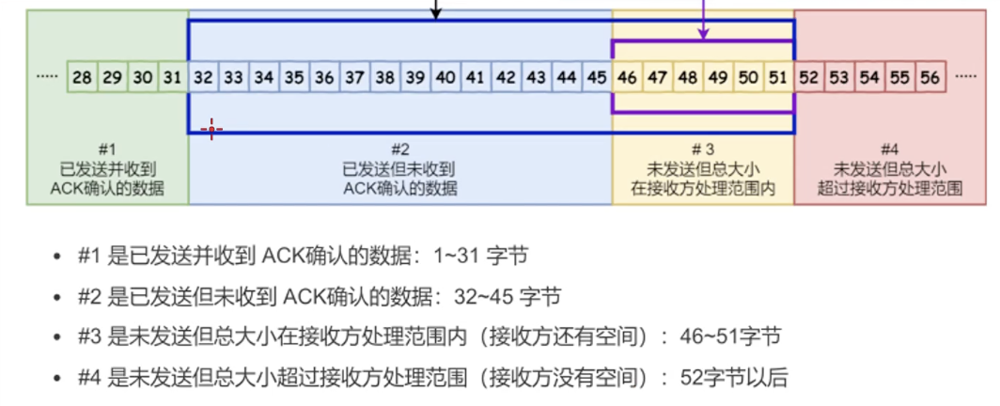
<!-- image-source: https://cdn.nlark.com/yuque/0/2026/png/67474974/1780988436764-7bb4d897-b974-43c2-aa70-dcd46712e49c.png -->

```c
┌────────────────┬──────────────────────┬──────────────────┐
│  已发送且已确认	 │   已发送但未确认  	    │ 允许发送但未发送	   │
│  (可删除)       │   (等待 ACK)    	    │    (窗口内可用)	   │
└────────────────┴──────────────────────┴──────────────────┘
     ↑                                    ↑
 send_una                              send_next
```

**接收方窗口**：

<!-- 这是一张图片，ocr 内容为： -->
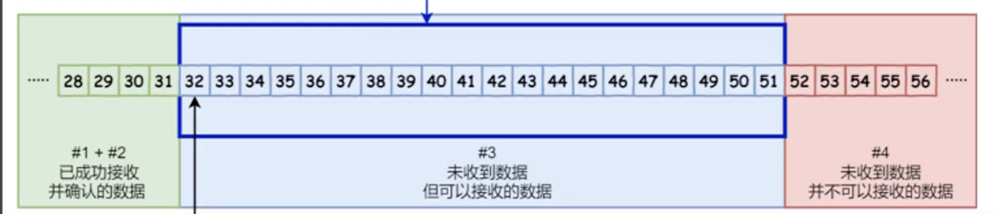
<!-- image-source: https://cdn.nlark.com/yuque/0/2026/png/67474974/1780988460925-012a5960-7d1c-4786-ae71-12ffb4c91cc0.png -->

```c
┌────────────────┬──────────────────────┬──────────────────┐
│  已接收且已交付	 │   已接收但未交付      	│    可接收空间  	   │
│  (已 ACK)    	 │   (等待应用程序读取)   	│    (剩余窗口) 	   │
└────────────────┴──────────────────────┴──────────────────┘
```

#### 滑动过程
1. 窗口内的数据发送完毕后，窗口**向后滑动**
2. 新的数据进入窗口范围，继续发送
3. 收到 ACK 后，`send_una` 指针前移，已确认空间释放

#### 乱序与丢包处理
**场景**：数据包 36、39、42 丢失

+ 接收方收到的连续 SEQ 在 35 处断开
+ 接收方回复 `ACK=36`（连续最大值 35 + 1）
+ 没有 SACK 时，重复 ACK 和超时机制帮助发送方判断缺口；使用 SACK 时，接收方还能报告已收到的不连续区间，使发送方优先重传缺失数据，而不是机械地重发 36 之后全部内容
+ 后续乱序到达的数据包由接收方缓存，待缺失包到达后重新排序

> **补充**：现代 TCP 实现通常结合 **SACK（Selective Acknowledgment）** 和 **快速重传（Fast Retransmit）** 机制，收到 3 个重复 ACK 即触发重传，无需等待超时。
>

---

## 12.流量控制
<!-- 这是一张图片，ocr 内容为： -->
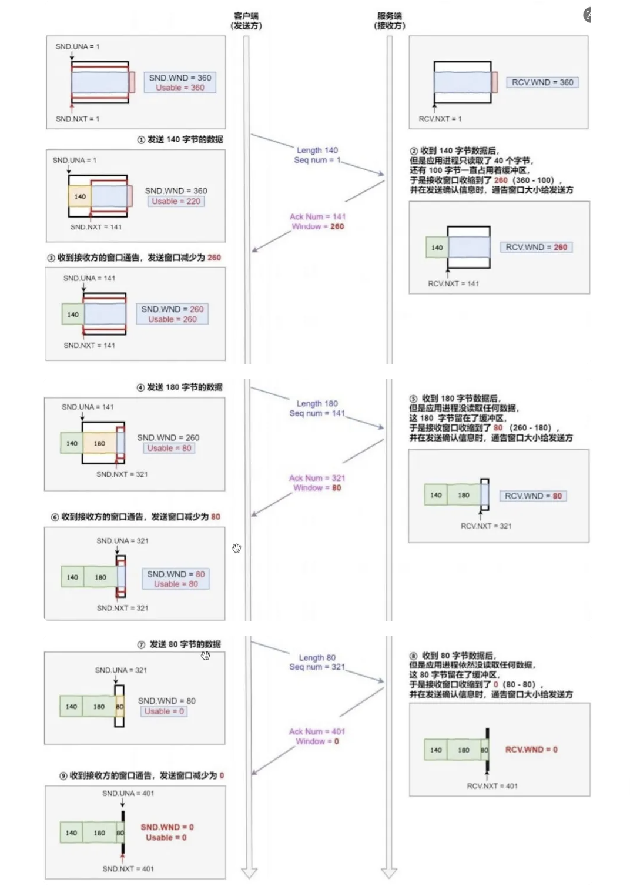
<!-- image-source: https://cdn.nlark.com/yuque/0/2026/png/67474974/1780988729607-92b4f14c-6420-465e-b70f-7c7aa619e5c8.png -->

### （1）定义
**流量控制**：接收方通过通告窗口大小，控制发送方的发送速率，防止发送方过快导致接收方缓冲区溢出。是一种**端到端**的控制机制。

### （2）实现机制
接收方在每次回复 ACK 时，将**当前接收窗口大小（rwnd）** 填入 TCP 头部的 Window 字段。

**流程示例**：

| 步骤 | 操作 | 窗口变化 |
| --- | --- | --- |
| 1 | 初始接收窗口 = 360 字节 | `rwnd = 360` |
| 2 | 发送方发送 140 字节 | 接收方缓存 140 字节，应用程序读取 40 字节 |
| 3 | 接收方回复 `ACK=141, win=260` | 剩余空间 = 360 - 100 = 260 |
| 4 | 发送方调整窗口为 260，发送 180 字节 | 接收方缓存 180 字节，应用程序未读取 |
| 5 | 接收方回复 `ACK=321, win=80` | 剩余空间 = 260 - 180 = 80 |
| 6 | 发送方发送 80 字节 | 接收方缓存满，应用程序未读取 |
| 7 | 接收方回复 `ACK=401, win=0` | **零窗口**，发送方停止发送 |


### （3）零窗口与探测机制
当接收方通告 `win=0` 时，发送方停止发送数据。但为避免死锁（接收方后续有空间但通知报文丢失），引入**零窗口探测（Zero Window Probe）** 机制：

+ 发送方定期发送探测报文，询问当前窗口大小
+ 接收方回复当前实际窗口大小
+ 若窗口恢复非零，发送方继续发送数据

### （4）窗口大小的交换时机
| 握手阶段 | 携带内容 |
| --- | --- |
| 第 1 次握手（SYN） | 客户端发送自己的接收窗口大小 |
| 第 2 次握手（SYN+ACK） | 服务端发送自己的接收窗口大小 |
| 第 3 次握手（ACK） | 客户端再次确认（此时双方窗口已知） |


> **注意**：客户端和服务端都同时扮演发送方和接收方，各自维护独立窗口。窗口字段从 SYN/SYN+ACK 起即可出现，并在连接期间的 ACK 报文中持续更新；窗口扩大倍数只在握手时协商。
>

---

## 附录：核心术语速查表
| 术语 | 英文/接口作用 | 含义 |
| --- | --- | --- |
| `listen()` | 使已绑定的 Socket 进入监听状态 | `backlog` 是待处理连接队列规模的提示值 |
| `accept()` | 从等待队列取出一个连接 | 返回新的通信 Socket，监听 Socket 继续接收新连接 |
| SEQ | Sequence Number | 当前报文段第一个数据字节的序号；SYN 时表示初始序号 |
| ACK | Acknowledgment Number / ACK flag | 确认号表示下一期待字节；ACK 标志表示确认号有效 |
| SYN | Synchronize | 同步标志（建立连接） |
| FIN | Finish | 终止标志（断开连接） |
| RST | Reset | 重置标志 |
| RTT | Round Trip Time | 往返时延 |
| RTO | Retransmission Timeout | 超时重传时间 |
| MSL | Maximum Segment Lifetime | 报文段最大生存时间 |
| rwnd | Receiver Window | 接收窗口 |
| MTU | Maximum Transmission Unit | 最大传输单元 |
| MSS | Maximum Segment Size | 最大报文段长度 |
| TLV | Type-Length-Value | 类型-长度-值编码格式 |


---

> **学习建议**：
>
> 1. 理解每个机制背后的**设计动机**（为什么需要这个机制？解决什么问题？）
> 2. 手绘三次握手与四次挥手的**时序图**，标注 SEQ/ACK 值和状态变化
> 3. 面试时使用**专业术语**作答，避免口语化比喻
> 4. 结合代码实践理解理论，做到"知其然亦知其所以然"
>

# 七、TCP补充知识点
## 1.TCP 粘包问题及其解决方案
### （1）“粘包”的本质：应用层消息边界
<font style="color:rgb(15, 17, 21);">TCP只向应用提供连续、有序的字节流，不承诺一次 `send` 对应一次 `recv`。一次发送可能被多次读取，多次发送也可能被一次读取；TCP 分段方式对应用不可见。因此所谓“粘包/拆包”不是 TCP 出错，而是应用协议没有定义或没有正确解析消息边界。</font>

+ **发送侧**：多次写入的数据可被协议栈合并或拆分为不同 TCP 报文段。
+ **接收侧**：`recv` 只返回当前可用的若干字节，返回长度由网络到达、缓冲区和调用参数共同决定。
+ **正确视角**：应用必须维护解析缓冲区，按长度、定界符、固定长度或连接关闭等协议规则提取完整消息，不能依赖 TCP 报文段边界。

### （2）四种主流解决方案及工程选型
| 解决方案 | 实现原理 | 缺点 | 适用场景 |
| :--- | :--- | :--- | :--- |
| **以连接关闭定界** | 发送完单个响应后关闭发送方向，接收方读到 EOF 即知道消息结束。 | 每个连接通常只能自然界定一段主体，复用能力差。 | 简单的一次性传输；HTTP/1.0 也可使用 Content-Length，并非必然依靠短连接定界。 |
| **固定包大小** | 约定每个包固定长度（如 1024 字节），不足部分补 `0`，<font style="color:rgb(15, 17, 21);">接收时按固定长度循环读取</font>。 | <font style="color:rgb(15, 17, 21);">包大小难以权衡。设定太小，大数据需大量分包，效率低；设定太大，小数据会引入过多无效填充，浪费空间</font>。 | 数据包大小固定或变化极小的场景（如大文件分块传输、定长结构体同步）。 |
| **设置标志位** | 在包尾添加特殊字符（如 `\r\n` 或 `##`）作为结束边界。 | 若数据内容本身包含该标志位，会导致解析错乱（需引入转义机制）。 | <font style="color:rgb(15, 17, 21);">数据传输内容完全可控，不包含用户自由输入的场景。例如，游戏客户端发送的技能指令、固定下拉选项等，开发者可确保预设的结束标志不会出现在数据中。</font> |
| **消息头(长度+内容)** | **Header(4字节Int) + Payload**。先发送数据长度，再按长度读取内容。 | 实现稍复杂，需处理字节序（Endianness）；<font style="color:rgb(15, 17, 21);">另外，若某次长度头部在传输中出错，会导致后续所有数据包解析全部错乱。</font> | **<font style="color:#DF2A3F;">最通用、最推荐</font>**的方案，适用于绝大多数RPC框架和自定义应用层协议（<font style="color:rgb(15, 17, 21);">尤其当其他三种方法不适用时</font>）。 |


### （3）C++ 代码实现示例（消息头方案）
下面的代码按原稿保留，用于展示“长度头 + 内容”的基本思路，但不应直接作为生产实现。C/C++ 原始结构体存在填充、对齐、类型宽度和字节序差异，未校验长度的指针强转还可能造成越界或未对齐访问。工程实现应改用固定宽度字段、网络字节序和显式序列化。

```cpp
// 1. 定义业务结构体 (注意：网络传输需考虑内存对齐 #pragma pack 和 字节序转换)
struct Node {
    int a;
    long b;
};

// --- 发送端逻辑 ---
Node n1 = {10, 200};
int nSize = sizeof(n1);
// 先发送包长度 (实际工程中需转为网络字节序 htonl)
send(sockClient, (char*)&nSize, sizeof(int), 0);
// 再发送实际数据
send(sockClient, (char*)&n1, nSize, 0);

// --- 接收端逻辑 ---
int nPackSize = 0;
// 先接收包长度
recv(sockClient, (char*)&nPackSize, sizeof(int), 0);

// 动态分配精确大小的缓冲区
char* buf = new char[nPackSize];
recv(sockClient, buf, nPackSize, 0);

// 【性能优化】直接强转指针，避免开辟新的结构体空间进行拷贝
Node* pNode = (Node*)buf; 
// 访问数据: pNode->a, pNode->b

delete[] buf; // 释放内存
```

长度头本身必须设置合理上限，并通过循环读写确保完整收发，避免恶意长度导致过量内存分配。涉及文本、浮点数、版本演进或复杂对象时，应采用定义明确的序列化格式，而不是传输对象内存布局。

---

## 2.心跳机制与长连接保活
### （1）应用场景与痛点
在长连接场景下（如微信登录、游戏网关），可能长时间无数据交互。此时面临两个致命问题：

1. **中间节点故障**：路由器宕机或网络切换，导致连接“静默断开”，双端均不知情。
2. **NAT 超时与防火墙清理**：中间网络设备（如防火墙、NAT网关）会自动清理长时间无数据交互的映射表项，直接丢弃连接。

**心跳机制（Heartbeat）** 的核心目的就是**维持长连接、探测死连接（Dead Peer Detection），并及时回收服务端资源**。

### <font style="color:rgb(15, 17, 21);">（2）工作原理</font>
<font style="color:rgb(15, 17, 21);">常见设计是客户端按需发送心跳请求，由服务端应答；并不要求双方在固定时刻对称互发。心跳周期必须结合业务空闲超时、移动网络耗电和 NAT 映射时间设置。</font>

+ **<font style="color:rgb(15, 17, 21);">客户端</font>**<font style="color:rgb(15, 17, 21);">：定时发送“我还活着”的请求。</font>
+ **<font style="color:rgb(15, 17, 21);">服务端</font>**<font style="color:rgb(15, 17, 21);">：收到请求后回复确认。</font>

### （3）两种实现技术
+ **应用层自定义心跳（推荐）**：
    - **机制**：利用定时器（Timer）。连接建立后启动定时器，若有业务数据收发则重置定时器；若超时（如 30s）无数据，则发送心跳包（Ping/Pong）。若连续 N 次心跳无响应，则判定断线并 `close()` 释放资源。
    - **优势**：极度灵活，时间间隔、心跳包格式均可自定义，且能顺带携带业务状态。
+ **传输层 **`SO_KEEPALIVE`** 选项**：
    - **机制**：TCP 协议栈自带的保活机制。通过 `setsockopt` 开启。
    - **限制**：系统默认参数通常偏保守且因平台而异；Windows 可通过相应 Socket/IOCTL 配置部分保活参数。它只能探测传输连接可达性，不能替代应用层业务健康检查。

> ******后端安全扩展：SYN Flood 攻击与队列管理**  
服务端维护 TCP 连接依赖两个队列：**半连接队列**（SYN_RECV，未完成三次握手）和**全连接队列**（ESTABLISHED，等待 `accept` 提取）。攻击者可通过发送大量伪造 IP 的 SYN 包但不回复 ACK，耗尽半连接队列，导致正常用户无法连接。防护手段包括：SYN Cookie、限制单 IP 连接频率等。
>

---

## 3.Nagle 算法与网络延迟优化
### （1）核心思想
Nagle 算法旨在**尽可能发送大块数据，避免网络中充斥着大量小数据块**。对于路由器而言，转发 1 字节和转发 1460 字节（MSS）的处理开销几乎相同，<font style="color:rgb(15, 17, 21);">意味着转发设备将花费大量时间处理包头而非数据本身，造成带宽浪费和网络拥塞</font>，合并小包能显著提高网络整体吞吐量。

### （2）基本规则
当连接上没有未确认数据时，小块新数据可以立即发送；存在未确认数据时，Nagle 算法倾向于暂存新的小块数据，直到收到确认或累计到足够大的报文段。`TCP_NODELAY` 用于关闭该合并策略。

Nagle 算法本身没有“固定 200ms 后强制发送”的通用规则。常见延迟来自 Nagle 与接收端延迟确认的相互作用；`TCP_CORK` 则是 Linux 特有选项，不应写成跨平台 Nagle 规则。

### （3）**<font style="color:rgb(15, 17, 21);">应用场景</font>**
**<font style="color:rgb(15, 17, 21);">开启（默认）</font>**<font style="color:rgb(15, 17, 21);">：适合对实时性要求不高、追求吞吐量的场景，如大文件传输。</font>

**<font style="color:rgb(15, 17, 21);">关闭（设置 </font>**`**<font style="color:rgb(15, 17, 21);">TCP_NODELAY</font>**`**<font style="color:rgb(15, 17, 21);">）</font>**<font style="color:rgb(15, 17, 21);">：适合经测量确认小包合并造成不可接受延迟的交互式场景。是否关闭应依据协议写入模式和性能测试，不能断言所有 SSH、游戏等程序都“必须关闭”。</font>

```cpp
int value = 1;
// IPPROTO_TCP 级别下的 TCP_NODELAY 选项
setsockopt(sock_fd, IPPROTO_TCP, TCP_NODELAY, (char*)&value, sizeof(int));
```

---

## 4.TCP 拥塞控制机制 (Congestion Control)
<font style="color:rgb(15, 17, 21);">拥塞控制根据丢包、时延或显式拥塞通知等信号调节发送量，避免连接向网络路径注入过多数据。它由各发送端独立执行并共同影响全网，不等于存在一个“全局控制器”。流量控制则主要保护接收端缓冲和处理能力。</font>

<font style="color:rgb(15, 17, 21);">拥塞控制的核心是发送方维护的</font>**<font style="color:rgb(15, 17, 21);">拥塞窗口</font>**<font style="color:rgb(15, 17, 21);">，其大小取决于网络拥塞程度。实际发送窗口 = </font>`<font style="color:rgb(15, 17, 21);">min(拥塞窗口, 接收方滑动窗口)</font>`<font style="color:rgb(15, 17, 21);">。</font>

**核心概念**：发送方的实际发送窗口 $ W = \min(rwnd, cwnd) $。其中 $ rwnd $ 为接收方窗口：<font style="color:rgb(29, 29, 31);">基于接收端处理能力（流量控制，微观端到端）</font>，$ cwnd $ 为拥塞窗口：<font style="color:rgb(29, 29, 31);">基于网络拥堵程度（拥塞控制，宏观全局）</font>。

+ **流量控制**：端到端的微观控制，防止发送方撑爆接收方缓冲区。
+ **拥塞控制**：全局的宏观控制，防止过多数据注入网络导致路由器缓存溢出。

### （1）拥塞控制四大核心算法
1. **慢开始 (Slow Start)**
    - **规则**：初始拥塞窗口由标准和实现决定，现代实现通常是多个 MSS，并非固定为 1。收到确认后按已确认字节增长，理想情况下每个 RTT 近似翻倍。
    - **误区**：“慢”是指初始注入报文少，而非增长速度慢。
2. **拥塞避免 (Congestion Avoidance)**
    - **规则**：当 $ cwnd \ge ssthresh $（慢开始门限）时，每经过一个 RTT，$ cwnd $ 加 1（**线性增长**）。
3. **快重传 (Fast Retransmit)**
    - **规则**：接收方收到乱序报文时，重复发送对上一个有序报文的 ACK。发送方一旦收到 **3 个重复的 ACK**，立即重传丢失的报文，无需等待超时定时器（RTO）。

<!-- 这是一张图片，ocr 内容为： -->
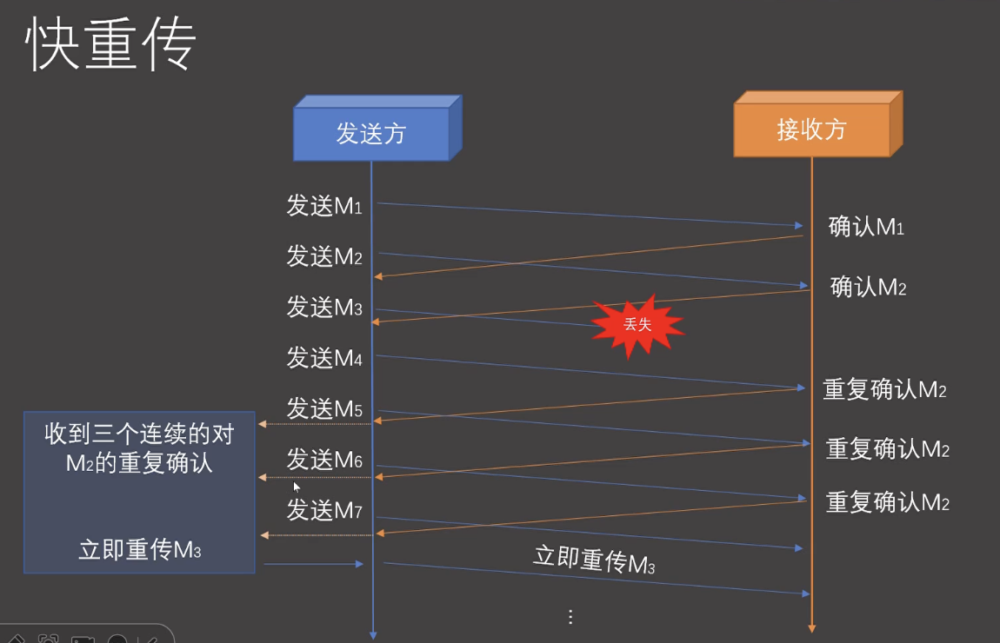
<!-- image-source: https://cdn.nlark.com/yuque/0/2026/png/67474974/1781331371122-992bb065-e8d9-47b6-ab2a-12f736218661.png -->

4. **快恢复 (Fast Recovery)**
    - **触发条件**：由“快重传”触发（说明网络有轻微拥塞，但尚未完全瘫痪，因为还能收到 ACK）。
    - **窗口调整**：经典 TCP Reno 会降低 `ssthresh`，并在重复 ACK 阶段临时膨胀 `cwnd`；确认新数据后进入拥塞避免。CUBIC、BBR 和不同操作系统实现并不完全遵循同一公式。
    - _对比：RTO 超时通常触发更强的退避和重新探测，但具体初始窗口与恢复过程应以实现采用的拥塞控制算法为准。_

### （2）慢开始与拥塞避免
<font style="color:rgb(29, 29, 31);">发送方维持一个叫做拥塞窗口cwnd（congestion window）的状态变量。拥塞窗口的大小取决于网络的拥塞程度，并且动态地在变化。发送方让自己的发送窗口等于拥塞窗口，另外考虑到接受方的接收能力，发送窗口可能小于滑动窗口。</font>

<font style="color:rgb(29, 29, 31);">慢开始算法的思路就是，不要一开始就发送大量的数据，先探测一下网络的拥塞程度，也就是说由小到大逐渐增加拥塞窗口的大小。</font>

<font style="color:rgb(29, 29, 31);">为了防止cwnd增长过大引起网络拥塞，还需设置一个慢开始门限ssthresh状态变量。ssthresh的用法如下：</font>

+ <font style="color:rgb(29, 29, 31);">当cwnd<ssthresh时，使用慢开始算法。</font>
+ <font style="color:rgb(29, 29, 31);">当cwnd>ssthresh时，改用拥塞避免算法。</font>
+ <font style="color:rgb(29, 29, 31);">到达门限附近时转入拥塞避免；精确边界和增长方式依算法实现而异。</font>

<font style="color:rgb(29, 29, 31);">经典 Reno 拥塞避免阶段使 `cwnd` 每个 RTT 约增加一个 MSS，呈近似线性增长。这里的单位是字节或 MSS，不是无量纲的“加 1”；现代 CUBIC、BBR 等算法具有不同增长规律。</font>

<!-- 这是一张图片，ocr 内容为： -->
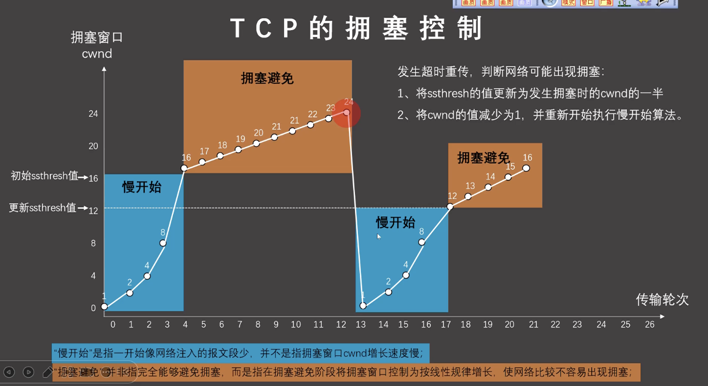
<!-- image-source: https://cdn.nlark.com/yuque/0/2026/png/67474974/1781331346050-0d572a2a-7b9a-405a-bff7-1c6178482a53.png -->

### （3）快恢复机制
<!-- 这是一张图片，ocr 内容为： -->
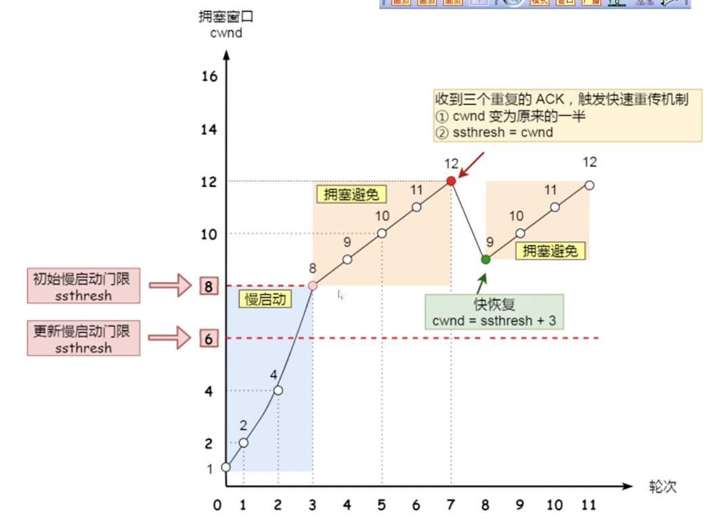
<!-- image-source: https://cdn.nlark.com/yuque/0/2026/png/67474974/1781331574125-200e0222-d731-45ce-a042-9b3de847c520.png -->

---

## <font style="color:rgb(15, 17, 21);">5.TCP 协议核心总结</font>
<font style="color:rgb(15, 17, 21);">TCP协议的三个核心特性（面向连接、可靠传输、基于字节流）可展开为以下知识点：</font>

**<font style="color:rgb(15, 17, 21);">1. 面向连接</font>**

+ **<font style="color:rgb(15, 17, 21);">三次握手</font>**<font style="color:rgb(15, 17, 21);">：掌握流程、状态变迁，以及为什么不是两次或四次握手。</font>
+ **<font style="color:rgb(15, 17, 21);">四次挥手</font>**<font style="color:rgb(15, 17, 21);">：掌握流程、状态变迁，主动方为何等待2MSL（最长报文段寿命），被动方为何先回复ACK而非立刻回复FIN。</font>

**<font style="color:rgb(15, 17, 21);">2. 可靠传输（由六大机制保证）</font>**

1. **<font style="color:rgb(15, 17, 21);">面向连接</font>**<font style="color:rgb(15, 17, 21);">：三次握手/四次挥手。</font>
2. **<font style="color:rgb(15, 17, 21);">确认应答与超时重传</font>**<font style="color:rgb(15, 17, 21);">：序列号（SEQ）与确认号（ACK）机制。</font>
3. **<font style="color:rgb(15, 17, 21);">合理分段</font>**<font style="color:rgb(15, 17, 21);">：基于MSS和MTU（最大传输单元）拆分数据，配合Nagle算法避免过小包。</font>
4. **<font style="color:rgb(15, 17, 21);">校验和与重排序</font>**<font style="color:rgb(15, 17, 21);">：校验数据正确性，利用SEQ对乱序包排序。</font>
5. **<font style="color:rgb(15, 17, 21);">流量控制</font>**<font style="color:rgb(15, 17, 21);">：基于滑动窗口，端到端控制，防止接收方溢出。</font>
6. **<font style="color:rgb(15, 17, 21);">拥塞控制</font>**<font style="color:rgb(15, 17, 21);">：四大算法，全局性控制，防止网络过载。</font>

**<font style="color:rgb(15, 17, 21);">3. 基于字节流</font>**

+ **<font style="color:rgb(15, 17, 21);">粘包问题</font>**<font style="color:rgb(15, 17, 21);">：因边界缺失导致，需用四种应用层方法解决。</font>

**<font style="color:rgb(15, 17, 21);">4. TCP能发广播吗？</font>**

<font style="color:rgb(15, 17, 21);">一条 TCP 连接只连接两个端点，不提供 IP 广播或组播。实现群聊时，服务端维护多条连接并在应用层转发消息；Windows 可使用线程池、`select`/`WSAPoll` 或 IOCP，Linux 常使用 `epoll`。</font>

## 6.TCP vs UDP 及可靠 UDP 设计 (QUIC)
### （1）核心特性对比
| 维度 | TCP | UDP |
| :--- | :--- | :--- |
| **连接性** | 面向连接（三次握手） | 无连接 |
| **可靠性** | 可靠（重传、排序、流控、拥塞控制） | 不可靠（尽最大努力交付） |
| **传输方式** | 面向字节流（有粘包问题） | 面向报文（保留应用层边界） |
| **通信模式** | 仅限一对一（点对点） | 支持一对一、一对多、多对多（广播/组播） |
| **首部开销** | 20 ~ 60 字节 | 仅 8 字节 |
| **适用场景** | 文件传输、HTTP、数据库连接 | 视频直播、语音通话、DNS、实时游戏 |


### （2）前沿扩展：基于 UDP 实现可靠传输 (QUIC 协议)
QUIC 最初由 Google 推动，之后由 IETF 标准化。IETF QUIC 是 HTTP/3 使用的安全传输协议；“Quick UDP Internet Connections”常用于解释早期名称，但标准通常直接称为 QUIC。

1.**痛点**

TCP 存在**队头阻塞 (Head-of-Line Blocking)** 问题，且三次握手+TLS握手导致建连延迟高。

2.**QUIC 方案：**<font style="color:rgb(15, 17, 21);">结合TCP的可靠性与UDP的高效、低时延特性。</font>

QUIC 以 UDP 数据报承载自己的数据包和帧，但它本身是**面向连接、维护状态**的传输协议。连接建立过程把传输参数协商与 TLS 1.3 握手结合起来，并提供可靠流、多路复用、连接迁移、流量控制和拥塞控制。首次连接通常需要握手；只有具备先前会话状态并满足安全条件时才可能使用 0-RTT。

+ **<font style="color:rgb(15, 17, 21);">确认与丢包恢复</font>**<font style="color:rgb(15, 17, 21);">：QUIC 使用包号和 ACK 范围进行确认与丢包检测，重传的是丢失包中仍需传输的帧信息，并非照搬 TCP 的字节序号。</font>
+ **<font style="color:rgb(15, 17, 21);">流量与拥塞控制</font>**<font style="color:rgb(15, 17, 21);">：同时具有连接级、流级流量控制以及必需的拥塞控制；它并未为了“即发即走”而省略复杂拥塞机制。</font>
+ **<font style="color:rgb(15, 17, 21);">多路复用</font>**<font style="color:rgb(15, 17, 21);">：每条流独立排序，一条流丢包不会像 HTTP/2 over TCP 那样阻塞其他流的数据交付；但同一流内部仍保持有序。</font>

3.**启示**

<font style="color:rgb(15, 17, 21);">一个应用程序可以按业务需求组合 TCP、UDP 或 QUIC。例如，实时状态同步可能使用允许丢弃旧消息的 UDP 应用协议，而交易等操作使用具有明确确认语义的可靠通道。协议选择还必须考虑部署环境、安全、拥塞控制和运维复杂度。</font>

+ <font style="color:rgb(15, 17, 21);">在 C++ 网络框架设计中，可利用面向对象的</font>**多态**<font style="color:rgb(15, 17, 21);">特性封装底层协议差异。</font>

```cpp
class ITransport {
public:
    virtual void SendData(const char* data, size_t len) = 0;
};

class TcpTransport : public ITransport {
    void SendData(const char* data, size_t len) override { /* TCP send 逻辑 */ }
};

class UdpTransport : public ITransport {
    void SendData(const char* data, size_t len) override { /* UDP sendto 逻辑 */ }
};
```

<font style="color:rgb(15, 17, 21);">业务层只需依赖 </font>`<font style="color:rgb(15, 17, 21);">ITransport</font>`<font style="color:rgb(15, 17, 21);"> 接口，无需关心底层是 TCP 还是 UDP，极大提升了代码的可维护性与扩展性。</font>

---

## 修订核对参考

+ [RFC 9293：Transmission Control Protocol (TCP)](https://www.rfc-editor.org/rfc/rfc9293.html)
+ [RFC 6298：Computing TCP's Retransmission Timer](https://www.rfc-editor.org/rfc/rfc6298.html)
+ [RFC 4632：Classless Inter-domain Routing (CIDR)](https://www.rfc-editor.org/rfc/rfc4632.html)
+ [RFC 791：Internet Protocol](https://www.rfc-editor.org/rfc/rfc791.html) 与 [RFC 6864：IPv4 Identification Field](https://www.rfc-editor.org/rfc/rfc6864.html)
+ [RFC 9000：QUIC: A UDP-Based Multiplexed and Secure Transport](https://www.rfc-editor.org/rfc/rfc9000.html)
+ [Microsoft Learn：Windows Sockets 2](https://learn.microsoft.com/en-us/windows/win32/winsock/windows-sockets-start-page-2)
