一二章

# 第一章 概论
## 一、因特网概述
### 网络、互连网（互联网）和因特网
+ 网络 (Network) 由若干**结点** (Node) 和连接这些结点的**链路** (Link) 组成。
+ 多个网络还可以通过路由器互连起来，这样就构成了一个覆盖范围更大的网络，即互连网（或互连网）。因此，互连网是“**网络的网络 (Netwrok of Networks)**”。


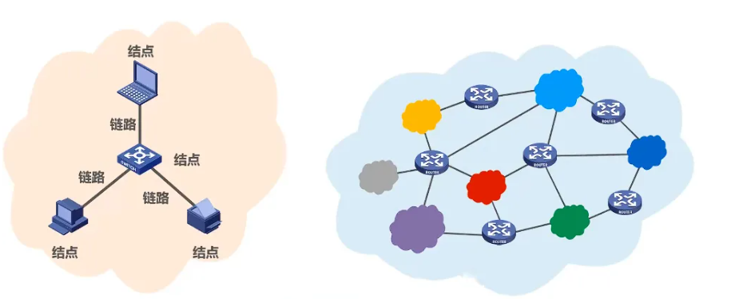
<!-- image-source: https://cdn.nlark.com/yuque/0/2026/png/67474974/1781013239395-333d8a8a-164c-4cb3-a7fb-f987c4273743.png -->

+ 因特网 (Internet) 是世界上最大的互连网络（用户数以亿计，互连的网络数以百万计）。


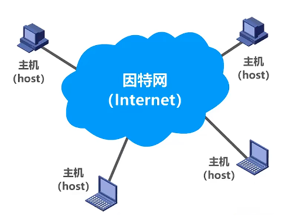
<!-- image-source: https://cdn.nlark.com/yuque/0/2026/png/67474974/1776324993002-8e63e17a-dd0a-41c1-ac86-b8fcf82ea710.png -->  
**internet与Internet的区别**

**internet**（互联网或互连网）是一个通用名词，它泛指由多个计算机网络互连而成的网络。在这些网络之间的通信协议可以是任意的。

**Internet**（因特网）则是一个专用名词，它指当前全球最大的、开放的、由众多网络相互连接而成的特定计算机网络，它采用TCP/IP协议族作为通信的规则，其前身是美国的ARPANET。


### 因特网服务提供者lsp(lnternetserviceprovider)

.png)
<!-- image-source: https://cdn.nlark.com/yuque/0/2026/png/67474974/1776325244854-aee1065f-50ed-4997-9c42-fe5864a6cce4.png -->

基于ISP的三层结构的因特网


.png)
<!-- image-source: https://cdn.nlark.com/yuque/0/2026/png/67474974/1776325557712-ed8d516e-391f-49e4-95bb-2811cb579d6f.png -->


### 因特网的组成
+ 边缘部分

由所有连接在因特网上的**主机**（包括台式电脑、大型服务器、笔记本电脑、平板电脑、智能手机、智能手表以及物联网智能硬件等）组成，这部分是**用户直接使用**的，用来进行**通信**（传送数据，音频或视频）和资源共享

+ 核心部分

由**大量网络**和连接这些网络的**路由器**组成。这部分是为**边缘部分提供服务**的（提供连通性和交换） 


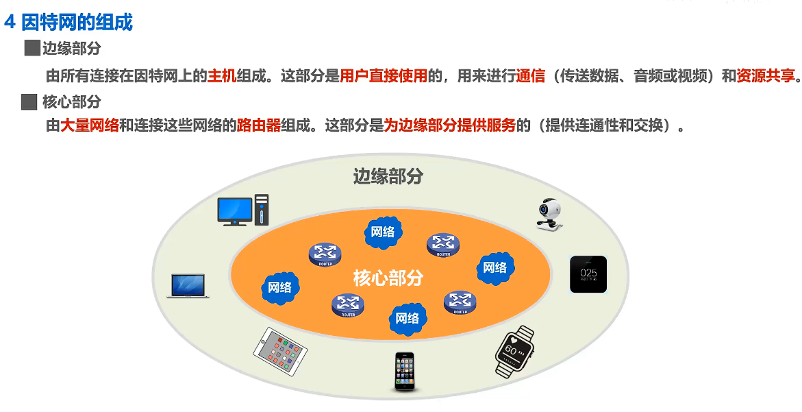
<!-- image-source: https://cdn.nlark.com/yuque/0/2026/png/67474974/1776326085215-66c07952-c525-4542-9d19-6c2979396ac0.png -->

## 二、三种交换方式（电路交换、分组交换和报文交换）
### 1.电路交换（Circuit Switching）

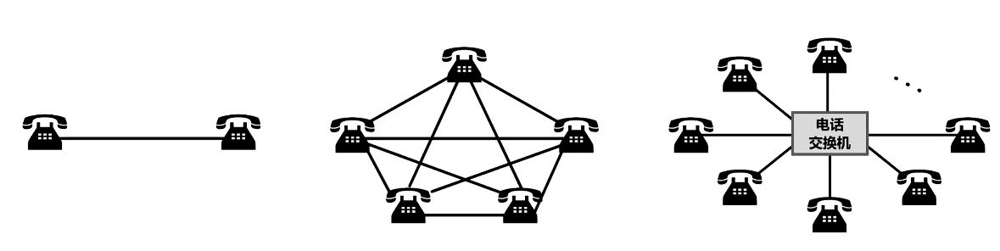
<!-- image-source: https://cdn.nlark.com/yuque/0/2026/png/67474974/1776327286438-efd3dfc4-1999-45e2-bfaf-e58e996df8ef.png -->

+ 电话交换机接通电话线的方式称为电路交换；
+ 的分配角度来看，交换（switching)就是按照某种方式动态地分配传输线
+ 电路交换的三个步骤：
    1. 建立连接（分配通信资源）
    2. 通话（一直占用通信资源）
    3. 释放连接（归还通信资源）


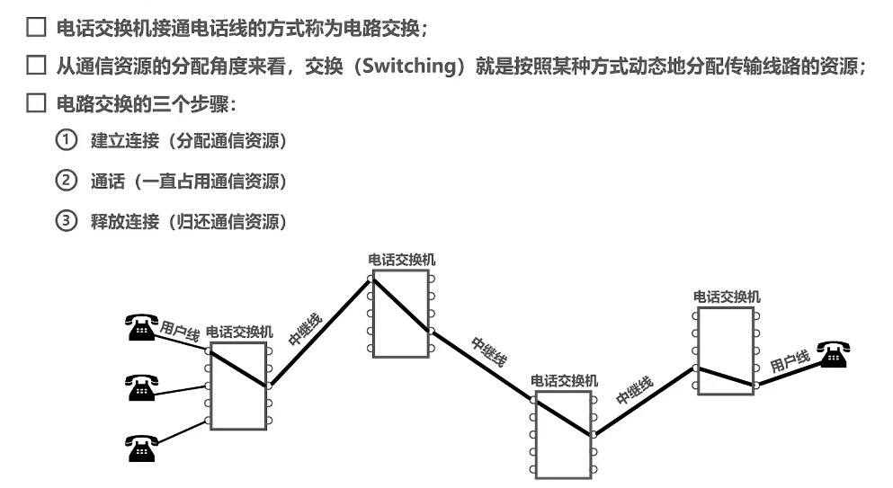
<!-- image-source: https://cdn.nlark.com/yuque/0/2026/png/67474974/1776327434802-f0a17f9d-82b1-47f6-8f5a-4691e24d4ef2.png -->


若使用电路交换来传送计算机数据时，线路的传输效率往往很低，原因如下：

**根本原因**

电路交换的**静态资源分配机制（面向连接、资源预留、静态独占）** 与计算机数据通信的**突发性、随机性、间歇性**的传输之间存在根本性矛盾

**具体原因**

1. **连接建立与拆除的额外开销**  
	电路交换在数据传输前需经历**呼叫建立阶段**，在通信结束后需进行**连接释放**。计算机数据往往具有短突发、长静默的特点（如网页浏览、文件间歇传输），若每次短会话均需经历完整的信令交互过程，信令开销在总通信时长中的占比显著增加，导致有效传输效率降低。
2. **信道资源的静态独占与空置浪费**  
	电路交换一旦建立连接，将在整个通信期间为通信双方**固定分配并独占一条物理或逻辑信道**，无论该时刻是否实际有数据传输。计算机通信的数据流量极不均衡，**突发峰期短、空闲期长**，在无数据传输的静默时段内，被独占的信道资源无法被其他用户复用，造成**严重的信道空载浪费**，线路利用率低下。
3. **不适应计算机通信的统计复用需求**  
	计算机数据流对时延抖动容忍度较高，天然适合**统计时分复用**（分组交换）。电路交换面向恒定速率业务（如话音）设计，其带宽粒度固定。当计算机数据速率远低于信道带宽时（例如仅占用64kbps数据却占据2Mbps链路），多余带宽无法动态释放给其他用户，导致**带宽资源利用率严重不足**。
4. **对非对称流量与突发峰值的适应性差**  
	计算机应用（如HTTP请求/响应、FTP下载）普遍呈现**上下行流量非对称**及**突发巨量传输**特征。电路交换的双向对称独占信道难以根据瞬时流量动态调整资源分配，峰时易拥塞丢弃，谷时则信道闲置，无法实现网络资源的全局高效利用。

### 2.分组交换（Packet Switching）
**分组交换机**：因特网中最重要的分组交换机路由器，负责将各种网络互连起来，并对接收到的分组进行转发（分组交换）


**信息发送流程**

H6给H2发送报文


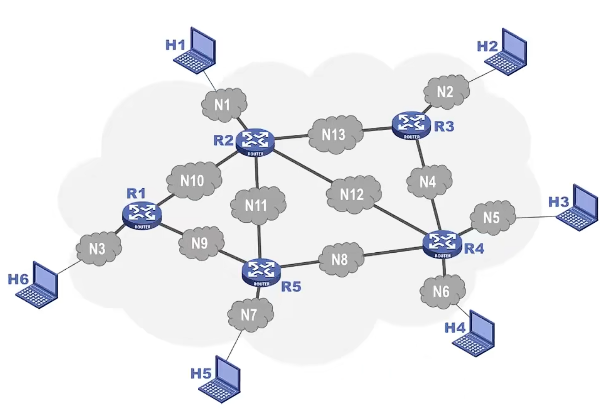
<!-- image-source: https://cdn.nlark.com/yuque/0/2026/png/67474974/1776330744072-359a8815-2c71-436f-8e44-829701af1cbe.png -->

**发送方（图中H6）**

先**构造分组**再**转发分组**

构造分组：将较长的报文分成一个个更小的等长数据段，并每个数据段前面加上由必要的控	制信息组成的首部（分组可简称为包，首部可简称为包头）

+ 首部作用：首部中包含了分组的目的地址，使分组交换机（路由器）知道如何转发分组

转发分组：将构造出的各分组依次转发出去


<!-- image-source: https://cdn.nlark.com/yuque/0/2026/png/67474974/1776330533304-377d86c3-c94b-4faf-83ed-3f9e51a87fad.png -->   		   
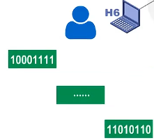
<!-- image-source: https://cdn.nlark.com/yuque/0/2026/png/67474974/1776330547324-933ac24d-7bd2-40ee-9351-09069c348f4f.png -->       		
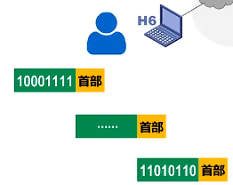
<!-- image-source: https://cdn.nlark.com/yuque/0/2026/png/67474974/1776330556537-a5968b71-b6ba-455b-813b-066f06207f7c.png -->

**路由器（分组交换机）**

先**缓存分组**再**转发分组**

缓存分组：分组交换机收到分组后，先将分组暂时存储下来

转发分组 ：检查分组首部，按照首部中的目的地址进行查表转发，找到合适的转发接口，通过该接口将分组转发给下一个分组交换机


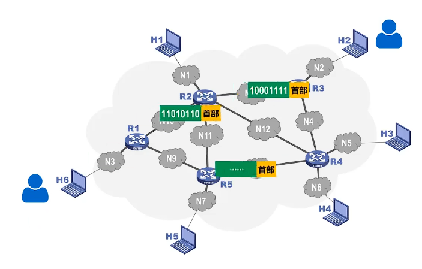
<!-- image-source: https://cdn.nlark.com/yuque/0/2026/png/67474974/1776330698009-dab1e4aa-d63d-49a9-b5c1-da446ce3ef6e.png -->

**接收方（图中H2）**

先**接收分组**再**还原报文**

接收分组：接收方从链路中接受分组

还原报文：收到分组后，去掉它们的首部，将各数据段组合还原出原始报文


<!-- image-source: https://cdn.nlark.com/yuque/0/2026/png/67474974/1776330388116-9ec61103-b05d-467f-b44f-d996dcebf955.png --> 	 

<!-- image-source: https://cdn.nlark.com/yuque/0/2026/png/67474974/1776330405987-8b6f8679-d467-44e8-88e6-cf79599fab46.png -->   	  
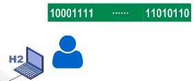
<!-- image-source: https://cdn.nlark.com/yuque/0/2026/png/67474974/1776330431863-25010647-b0d9-485e-b465-6b6f01933230.png -->


### 3.报文交换（Message Switching）
与分组交换类似，报文交换中的交换节点也采用存储转发方式，但报文交换对报文的大小没有限制，这就要求交换节点需要有较大的缓存空间，注：报文交换主要用于早期的电报通信网，现在被较先进的分组交换方式所取代


### 4.三组交换方式的对比

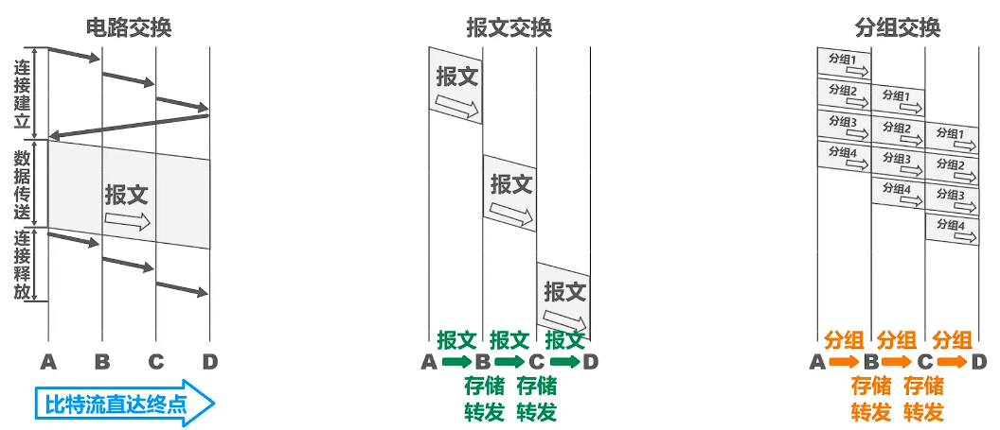
<!-- image-source: https://cdn.nlark.com/yuque/0/2026/png/67474974/1776331407613-d75c6a1c-d97d-4939-b762-fcb4caff6586.png -->

#### （一）电路交换
**优点：**

1. **通信时延小**：数据通路一经建立即为**物理直连或时隙固定分配**，中间节点仅执行透明传输，无需存储处理
2. **有序传输**：信息沿**固定路由**传输，比特流到达顺序与发送顺序严格一致
3. **没有冲突**：资源**独占式预分配**，同一信道内无其他用户竞争接入
4. **适用范围广**：既支持模拟话音，亦可通过适配器承载数字数据
5. **实时性强**：传输时延固定且极小，适用于对时延抖动敏感的业务（如语音）
6. **控制简单**：连接建立后，中间节点无需执行复杂的协议处理与路由决策

**缺点：**

1. **建立连接时间长**：端到端呼叫建立信令需逐段协商资源，连接释放亦需拆除通路
2. **线路独占，使用效率低**：计算机数据具有**突发性**，静默期信道空置但无法释放给第三方，导致**空载损耗**
3. **灵活性差**：一旦建链，通路固定，无法根据网络拥塞状态动态调整路由。
4. **难以规格化**：不同业务速率差异大，固定带宽信道难以适配计算机数据的**非对称与突发特性**

#### （二）报文交换
**优点：**

1. **无需建立连接**：采用**存储转发**机制，有数据即发送，省去端到端信令握手过程
2. **动态分配线路**：链路仅在实际传输报文时被占用，非独占方式
3. **提高线路可靠性**：网络节点可择优选路，某段链路故障时可绕行，具备**路由迂回能力**
4. **提高线路利用率**：基于**统计时分复用**，多用户报文共享传输带宽
5. **提供多目标服务**：一份报文可经中间节点复制后向多个目的站转发

**缺点：**

1. **引起了转发时延**：报文必须在中间节点**完整接收并校验**后方可转发，时延较长
2. **需要较大存储缓存空间**：报文长度不定且可能极大，节点需预留充足内存以应对长报文突发
3. **需要传输额外的信息量**：报头需携带源/目的地址及控制信息，构成协议开销

#### （三）分组交换
**优点：**

1. **无需建立连接**（数据报方式）：各分组独立寻址传输，省去连接建立阶段
2. **线路利用率高**：采用**细粒度统计复用**，多个逻辑连接共享同一物理链路，带宽按需竞争分配
3. **简化了存储管理**：分组长度受限且较小，节点缓冲区管理更为规整高效
4. **加速传输**：基于**流水线并行处理**，后一分组在前一分组未到达终点时已可开始转发
5. **减少出错概率和重发数据量**：仅需重传出错的单个分组，无需重传整份报文

**缺点：**

1. **引起了转发时延**：每个分组均需在节点排队、查表、处理，产生**节点处理与排队时延**
2. **需要传输额外的信息量**：每个分组均携带**完整的报头**，协议开销比例随分组数增加而上升
3. **数据报服务问题**：分组可能经不同路径到达，引发**失序、丢失或重复**，需上层协议恢复
4. **虚电路服务问题**：虽有序且免寻址，但引入了**呼叫建立、数据传输、虚电路释放**三个阶段的控制开销

## 三、计算机网络的定义和分类
本节了解即可

### 1.计算机网络的定义
+ 计算机网络的精确定义并未统一
+ 计算机网络的最简单的定义是：一些**互相连接**的，**自治**的计算机的**集合**。
    - **互连：** 是指计算机之间可以通过有线或无线的方式进行数据通信
    - **自治：** 是指独立的计算机，它有自己的硬件和软件，可以单独运行使用
    - **集合：** 是 是指至少需要两台计算机
+ 计算机网络的较好的定义是：计算机网络主要是由一些**通用的，可编程的硬件互连**而成的，而这些硬件并非专门用来实现某一特定目的（例如，传送数据或视频信号）.这些可编程的硬件能够用来**传送多种不同类型的数据**，并能**支持广泛的和日益增长的应用**。
    - 计算机网络所连接的硬件，并不限于一般的计算机，而是包括了智能机等智能硬件。
    - 计算机网络并非专门用来传送数据，而是能够支持很多种的应用（包括今后可能出现的各种应用）

### 2.计算机网络的分类
1. 按交换技术分类
    - 电路交换网络
    - 报文交换网络
    - 分组交换网络
2. 按使用者分类
    - 公用网：指由电信运营企业建设、面向全社会所有用户提供网络接入与通信服务的网络，如公共电话网、互联网骨干网。
    - 专用网：指由电信运营企业建设、面向全社会所有用户提供网络接入与通信服务的网络，如公共电话网、互联网骨干网。
3. 按传输介质分类
    - **有线网络**：采用双绞线、同轴电缆、光纤等实体线缆作为传输媒介的网络，具有传输稳定、抗干扰强、保密性好等特点。
    - **无线网络**：利用无线电波、微波、红外线等自由空间电磁波传输数据的网络，具有部署灵活、支持移动接入等特点。
4. 按覆盖范围分类
    - **广或网WAN**：覆盖范围可达数十公里至数千公里，用于跨地区、跨国乃至全球范围的网络互联，时延较高。
    - **城域网MA**：覆盖范围约为一个城市及其郊区（数公里至数十公里），作为城市内部的主干传输平台。
    - **局域网LAN**：覆盖范围通常在几米至几公里内，用于单一建筑或园区内的终端互联，具有传输速率高、误码率低的特点。
    - **个域网PAN**：覆盖范围极小（通常在十米以内），用于个人随身设备之间的近距离通信，如蓝牙设备连接。
5. 按拓扑结构分类
    - **总线型网络**：使用单根传输线把计算机连接起来
        * 优点：建网容易；增减节点方便；节省线路
        * 缺点：重负载时通信效率不高；总线一处出现故障则全网瘫痪


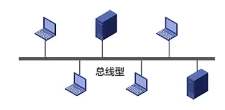
<!-- image-source: https://cdn.nlark.com/yuque/0/2026/png/67474974/1776400308236-eedce17e-871b-4a85-b42d-60f3eb86904c.png -->

- **星型网络**：每个计算机都以单独的线路与中央设备（早期是计算机，后来是集线器，现在一般是交换机或路由器）相连
    * 优点：便于网络的集中控制和管理（原因：端用户之间的通信必须经过中央设备）
    * 缺点：成本高，中央设备对故障敏感


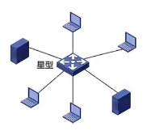
<!-- image-source: https://cdn.nlark.com/yuque/0/2026/png/67474974/1776400496457-714eebf8-d3e5-4394-8711-1796bda31af1.png -->

- **环型网络**：将所有计算机网络接口连接成一个环，环可以是单环或双环，环中信号是单向传输的


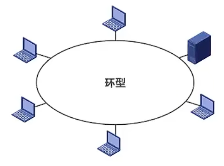
<!-- image-source: https://cdn.nlark.com/yuque/0/2026/png/67474974/1776401259027-2b69caeb-42ec-46cd-ba93-5f8b0e78dd1d.png -->

- **网状型网络**：一般情况下每个节点至少由两条路劲与其他结点相连，多用在广域网中
    * 优点：可靠性高
    * 缺点：控制复杂；线路成本高


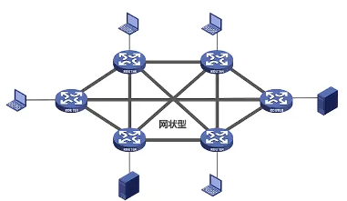
<!-- image-source: https://cdn.nlark.com/yuque/0/2026/png/67474974/1776401527438-2e04d20c-b0d7-4e48-bf58-dc9f6208af33.png -->

## 四、计算机网络的性能指标
**性能指标作用**：性能指标可以从不同的方面来度量计算机网络的性能。

常用的计算机网络的性能指标有以下8个：

### 1.速率
#### 比特
计算机中数据量的单位，也是信息论中信息量的单位。一个比特就是二进制数字中的一个 **1** 或 **0**。

**常用数据量单位**

| 单位 | 换算关系（以 Byte 为基础，基于$2^{10}$） |
| :--- | :--- |
| **基本关系** | $8 \text{ bit} = 1 \text{ Byte (B)}$ |
| **KB** | $1 \text{ KB} = 2^{10} \text{ B} = 1024 \text{ B}$ |
| **MB** | $1 \text{ MB} = 2^{10} \text{ KB} = 2^{20} \text{ B}$ |
| **GB** | $1 \text{ GB} = 2^{10} \text{ MB} = 2^{30} \text{ B}$ |
| **TB** | $1 \text{ TB} = 2^{10} \text{ GB} = 2^{40} \text{ B}$ |


#### 速率（比特率/数据率）
连接在计算机网络上的主机在数字信道上传送比特的速率，也称为 **比特率** 或 **数据率**。

**常用数据率单位**

**关键提示：** 速率单位之间的换算以 $10^3$ 为倍数关系（即 $k = 10^3$），与数据量单位中的 $2^{10}$ 进制严格区分。

| 单位 | 换算关系（以 b/s 为基础，基于 $10^3$） |
| :--- | :--- |
| **基本单位** | $\text{bit/s}$ 或$\text{bps}$ |
| **kb/s** | $1 \text{ kb/s} = 10^3 \text{ b/s}$ |
| **Mb/s** | $1 \text{ Mb/s} = 10^3 \text{ kb/s} = 10^6 \text{ b/s}$ |
| **Gb/s** | $1 \text{ Gb/s} = 10^3 \text{ Mb/s} = 10^9 \text{ b/s}$ |
| **Tb/s** | $1 \text{ Tb/s} = 10^3 \text{ Gb/s} = 10^{12} \text{ b/s}$ |


#### 例题：
> 例1：有一个待发送的数据块，大小为 100 MB，网卡的发送速率为 100 Mbps，则网卡发送完该数据块需要多长时间？
>

---

**计算与解释**

**1. 单位换算依据**

+ **数据量单位（MB）**：依据前述定义，计算机存储容量采用二进制计量，即  
$$
1 \text{ MB} = 2^{10} \text{ KB} = 2^{20} \text{ Bytes}
$$
+ **速率单位（Mbps）**：依据前述定义，数据率采用十进制计量，即  
$$
1 \text{ Mbps} = 10^3 \text{ kbps} = 10^6 \text{ bps}
$$

**2. 统一化为比特（bit）**

待发送数据块总比特数：

$ \begin{aligned}
100 \text{ MB} &= 100 \times 2^{20} \text{ Bytes} 
\end{aligned} $

由于 1 Byte = 8 bit，故：

$$
8\times 100 \times 2^{20} \text{ Bytes}  = 100 \times 2^{23} \text{ bits}
$$

网卡发送速率：

$$
100 \text{ Mbps} = 100 \times 10^6 \text{ bps}
$$

**3. 计算发送时间**

发送时间 (t) 等于总比特数除以发送速率：

$$
t = \frac{100 \times 2^{23} \text{ bits}}{100 \times 10^6 \text{ bps}} = 8.388608 \text{s}
$$

### 2.带宽
**带宽在模拟信号系统中的意义**

**信号**所包含的各种不同频率成分所占据的**频率范围**

单位：$\text{Hz}(\text{KHz},\text{MHz},\text{GHz})$


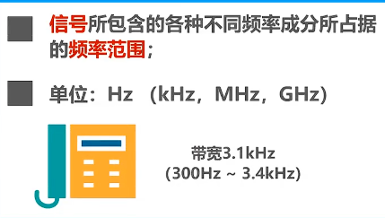
<!-- image-source: https://cdn.nlark.com/yuque/0/2026/png/67474974/1776781837238-f8a6b1a5-e5b6-47bb-b0d5-a3b4736642c6.png -->

**带宽在计算机网络中的意义**

用来表示网络的**通信线路**所能传送数据的能力，因此网络带宽表示在单位时间内从网络中的某一点到另一点所能通过的"**最高数据率**"

单位：$\text{b/s}(\text{Kb/s},\text{Mb/s},\text{Gb/s},\text{Tb/s})$


"带宽"的这两种表述之间有着密切的联系。一条通信线路的 "频带宽度"越宽，其所传输数据的"最高数据率" 也越高。

### 3.吞吐量
1. 吞吐量表示在**单位时间内通过某个网络（或信道，接口）的数据量**。
2. 吞吐量被经常用于对现实世界中的网络的一种测量，以便知道实际上到底有多少数据量能够通过网络。
3. 吞吐量**受网络的带宽或额定速率的限制**。


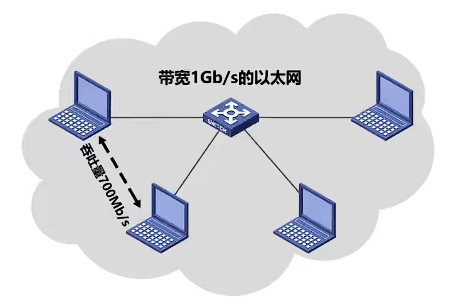
<!-- image-source: https://cdn.nlark.com/yuque/0/2026/png/67474974/1776782335440-b28be03a-9300-404b-9d2d-258efebbe4c8.png -->

### 4.时延
#### 时延的组成
网络时延由发送时延、传播时延、处理时延组成


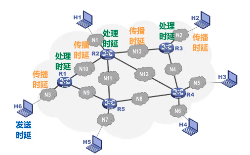
<!-- image-source: https://cdn.nlark.com/yuque/0/2026/png/67474974/1776782572225-017245b3-84db-4869-be66-1a85d08693cb.png -->

1. **发送时延（传输时延，Transmission Delay）**
+ **定义**：节点（如路由器、主机）将整个数据块（分组/帧）从自身发送到通信链路上所需的时间。
+ **产生原因**：数据必须被“推”到链路上，受限于接口的发送速率（即带宽）。

**公式**：

$$
\text{发送时延}=\frac{\text{分组长度}\ (\mathrm{b})}{\text{发送速率}\ (\mathrm{b/s})}=\frac{\text{分组长度}\ (\mathrm{b})}{\text{传输速率}\ (\mathrm{b/s})}
$$

注：发送速率和传输速率略有区别（在最小帧长部分介绍），计算时可以忽略

+ **特点**：取决于**数据长度**和**链路带宽**，与传输距离无关。


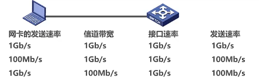
<!-- image-source: https://cdn.nlark.com/yuque/0/2026/png/67474974/1776782771641-1526fb54-3be6-400d-a72f-7478f826f785.png -->

2. **传播时延（Propagation Delay）**
+ **定义**：信号（电磁波/光）在物理介质上从发送端传播到接收端所需的时间。
+ **产生原因**：信号以有限速度在介质中传播。

**公式**：

$$
\frac{\text{信道长度}\ (\mathrm{m})}{\text{电磁波传播速率}\ (\mathrm{m/s})}
$$

电磁波传播速率：

- 自由空间：$3\times 10^{8} \text{ m/s}$ 
- 铜线：$2.3\times10^{8} \text{m/s}$ 
- 光纤：$2.0\times 10^{8} \text{ m/s}$

+ **特点**：取决于**传输距离**和**介质性质**，与数据长度和带宽无关。
3. **处理时延（Processing Delay）**

一般不方便计算（通常忽略不计）

+ **定义**：网络节点（如路由器、交换机）收到数据后，对其进行处理（解析首部、查路由表、计算校验、决定转发端口等）所花费的时间。
+ **产生原因**：设备的硬件（CPU、ASIC）和软件处理能力有限。
+ **典型值**：微秒到毫秒级，高性能路由器可低至几十微秒。
+ **特点**：与设备负载、处理复杂度有关，通常比发送时延和传播时延小（除非节点非常繁忙）。
4. **排队时延（Queuing Delay）**
+ **定义**：数据在发送队列中等待处理的时间

#### 例题
**T1：** 数据块长度为 **100 MB**，信道带宽为 **1 Gb/s**，传送距离为 **1000 km**，计算发送时延和传播时延。

解答

+ **发送时延**
    - $\frac{\text{分组长度}\ (\mathrm{b})}{\text{发送速率}\ (\mathrm{b/s})}$= $\frac{100 \times 2^{20} \times 8(b)}{10^9 \text{b/s}} = 838.8608(\text{s})$
+ **传播时延**
    - $\frac{\text{分组长度}\ (\mathrm{b})}{\text{发送速率}\ (\mathrm{b/s})}$= $\frac{1000 \times  10^3 (\text{m})}{2 \times 10^8(\text{m/s})} = 0.005(\text{s})$

**T2：** 数据块长度为 **1 B**，信道带宽为 **1 Mb/s**，传送距离为 **1000 km**，计算发送时延和传播时延。

解答

+ **发送时延**
    - $\frac{\text{分组长度}\ (\mathrm{b})}{\text{发送速率}\ (\mathrm{b/s})}$= $\frac{1 \times 8(b)}{10^6(\text{b/s})} = 8 \times 10^{-6} (\text{s})$
+ **传播时延**
    - $\frac{\text{信道长度}\ (\mathrm{m})}{\text{电磁波传播速率}\ (\mathrm{m/s})}$= $\frac{1000 \times 10^3 (\text{m})}{2 \times 10^8 (\text{m/s})} = 0.005 (\text{s})$

### 5.时延带宽积
时延带宽积 = 传播时延 × 带宽


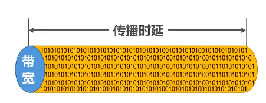
<!-- image-source: https://cdn.nlark.com/yuque/0/2026/png/67474974/1776933243912-325cbd1f-71c4-47bf-8159-9f423aa0858d.png -->

+ 若发送端连续发送数据，则在所发送的第一个比特即将到达终点时，发送端就已经发送了时延带宽积个比特；
+ 链路的时延带宽积又称为**以比特为单位的链路长度**。

### 6.往返时间
在许多情况下，因特网上的信息不仅仅单方向传输，而是双向交互。我们有时很需要知道双向交互一次所需的时间。因此，往返时间 **RTT**(Round-Trip Time) 也是一个重要的性能指标。

**RTT**(Round-Trip Time)：从源主机发送分组开始，知道源主机收到来自目的主机的确认分组为止所需要的时间


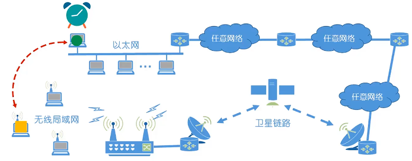
<!-- image-source: https://cdn.nlark.com/yuque/0/2026/png/67474974/1776934112057-a924104e-601c-482f-b944-472beddce0b2.png -->

### 7.利用率
#### 利用率的组成
1. **信道利用率**：用来表示某信道有百分之几的时间是被利用的（有数据通过）。
2. **网络利用率**：全网络的信道利用率的加权平均。

#### 利用率的特点
+ 根据排队论，当某信道的利用率增大时，该信道引起的时延也会迅速增加。因此，**信道利用率并非越高越好**。
+ 如果令$D_0$表示网络空闲时的时延，$D$表示网络当前的时延，那么在适当的假定条件下，可以用下面的简单公式来表示$D$、$D_0$和利用率$U$之间的关系：

$$
D = \frac{D_0}{1 - U}
$$


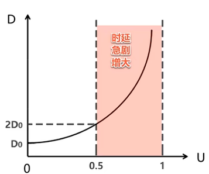
<!-- image-source: https://cdn.nlark.com/yuque/0/2026/png/67474974/1776934427923-a9a3f766-6ca6-439d-8688-4648523976b6.png -->

- 当网络的利用率达到50%时，时延就要加倍；
- 当网络的利用率超过50%时，时延急剧增大；
- 当网络的利用率接近100%时，时延就趋于无穷大；
- 因此，一些拥有较大主干的ISP通常会控制它们的信道利用率不超过50%。如果超过了，就要准备扩容，增大线路的带宽。

+ 也不能使信道利用率太低，这会使宝贵的通信资源被白白浪费。应该使用一些机制，可以根据情况动态调整输入到网络中的通信量，使网络利用率保持在一个合理的范围内。

### 8.丢包率
1. 丢包率即分组丢失率，是指在一定的时间范围内，传输过程中**丢失的分组数量与总分组数量的比率**。
2. 丢包率具体可分为接口丢包率、结点丢包率、链路丢包率、路径丢包率、网络丢包率等。
3. 丢包率是网络运维人员非常关心的一个网络性能指标，但对于普通用户来说往往并不关心这个指标，因为他们通常意识不到网络丢包。

**分组丢失主要有两种情况：**

+ 分组在传输过程中出现**误码**，被结点丢弃；
+ 分组到达一台队列已满的分组交换机时被丢弃；  
在通信量较大时就可能造成**网络拥塞**。

**丢包率反映了网络的拥塞情况：**

+ 无拥塞时路径丢包率为0
+ 轻度拥塞时路径丢包率为1%~4%
+ 严重拥塞时路径丢包率为5%~15%

## 五、计算机网络体系结构 **重点**
### 1. 常见的计算机网络体系结构 
#### OSI体系结构和TCP/IP体系结构
 
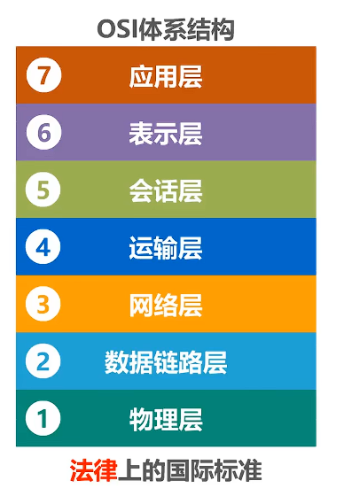
<!-- image-source: https://cdn.nlark.com/yuque/0/2026/png/67474974/1777128002060-2e7a06ef-e7ec-4e8c-8594-21cadbb5b993.png -->
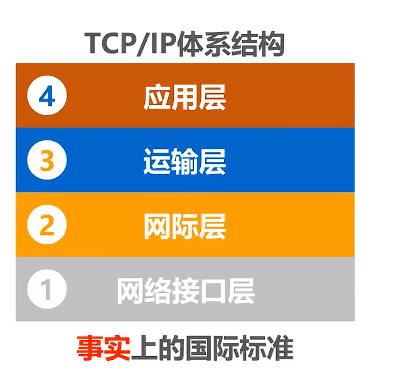
<!-- image-source: https://cdn.nlark.com/yuque/0/2026/png/67474974/1777128006033-9c872b25-14a0-4b6d-b50c-8f773eb19d80.png --> 

**OSI标准失败的原因：**

1.OSI的专家们缺乏实际经验，他们在完成OSI标准时没有商业驱动力

2.OSI协议实现起来过分复杂，而且运行效率很低

3.OSI标准的制定周期太长，使得按OSI标准生产的设备无法及时进入市场

4.OSI的层次划分不太合理，有些功能在多个层次中重复出现


**对比两个体系结构：**

TCP/IP体系结构相当于将OSI体系结构的物理层和数据链路层合并为了网络接口层，并去掉了会话层和表示层，由于TCP/IP在网络层使用的协议是IP协议（网际协议），因此TCP/IP在网络层常称为网际层。


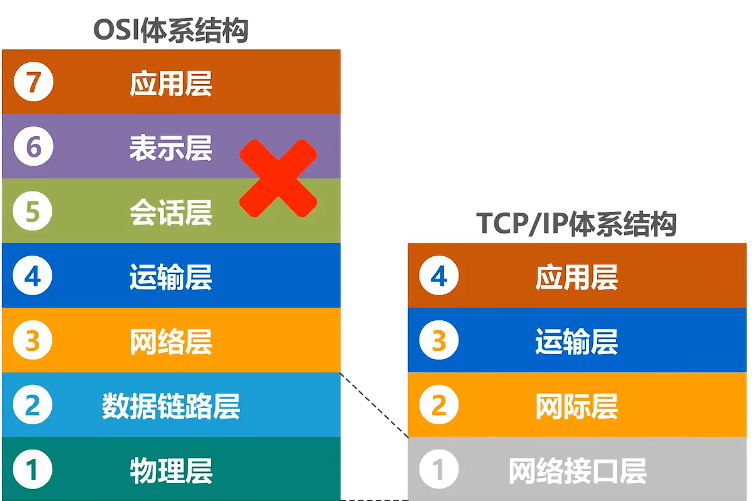
<!-- image-source: https://cdn.nlark.com/yuque/0/2026/png/67474974/1777128867345-54bd1321-ebbc-458a-9e00-cb0d2539399b.png -->


1. 接入因特网的主机必须使用TCP/IP协议
2. 用户主机的操作系统中，通常都带有符合TCP/IP体系结构标准的TCP/IP协议簇
3. 用于网络互联的路由器中，也带有符合TCP/IP体系结构标准的TCP/IP协议簇，只是路由器一般只包含网络接口层和网际层


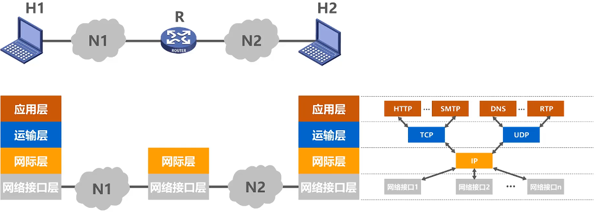
<!-- image-source: https://cdn.nlark.com/yuque/0/2026/png/67474974/1777734352267-d6b3c43d-10a0-4be7-b2a1-d7dac2c3baa3.png -->

1. TCP/IP体系结构的网络接口层并没有规定具体的内容，目的是可以互联全世界各种不同的网络接口（例如：有线的以太网接口，无线局域网的wifi接口），而不限定仅使用一种或几种的网络接口。因此：本质上TCP/IP体系结构只有上面的三层。
2. IP协议是TCP/IP体系结构网际层的核心协议。IP协议可以将不同的网络接口进行互联，并向其上的TCP协议和UDP协议提供网络互联服务。IP协议作为TCP/IP体系结构中的核心协议，一方面负责互联不同的网络接口（IP over everything），另一方面为各种网络应用提供服务（Everything over IP）
3. TCP和UDP是TCP/IP体系结构运输层的重要协议。TCP协议在享受IP协议提供的网络互联服务的基础上，可向应用层协议提供可靠传输的服务（TCP可靠但是延迟较高）；UDP协议在享受IP协议提供的网络互联服务的基础上，可向应用层协议提供不可靠传输的服务。
4. TCP/IP体系结构的应用层包含了大量应用层协议（例如：HTTP、SMTP、DNS、RTP等）。
5. TCP/IP体系结构中包含有大量的协议，IP协议和TCP协议是其中非常重要的两个协议，因此用TCP和IP这两个协议来表示整个协议大家族，常称为TCP/IP协议簇。

 

#### 原理体系结构
由于TCP/IP体系结构为了将不同的网络接口层进行互连，因此他的网络接口层并没有规定什么具体的内容。然而这对于学习计算机完整体系而言，就会缺少一部分内容。因此在学习计算机网络原理时往往采取折中的办法，综合OSI体系结构和TCP/IP体系结构的优点，采用一种五层协议的原理体系结构 。


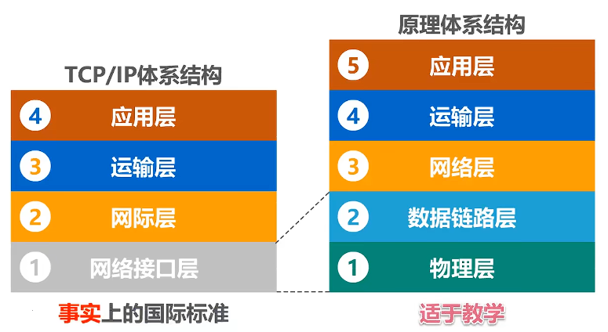
<!-- image-source: https://cdn.nlark.com/yuque/0/2026/png/67474974/1777735210353-ea432c06-8c67-4406-bd66-45cb993185b7.png -->

### 2. 计算机网络体系结构分层的必要性  
+ 计算机网络是个非常复杂的系统。早在最初的ARPANET设计时就提出了分层的设计理念。
+ “分层”可将庞大而复杂的问题，转化为若干较小的局部问题，而这些较小的局部问题就比较容易研究和处理。

#### （1）物理层


<!-- image-source: https://cdn.nlark.com/yuque/0/2026/png/67474974/1777735581638-d14a8a1f-d1a3-447c-8cf9-a2c5d86c7895.png -->

需考虑以下问题：

**1.采用怎样的传输媒体（介质）**


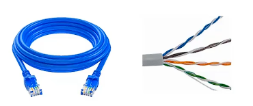
<!-- image-source: https://cdn.nlark.com/yuque/0/2026/png/67474974/1777735596734-fdc88cc7-307f-4478-b075-da162c7506f0.png -->

**2.计算机上采用怎样的物理接口来连接传输媒体**


<!-- image-source: https://cdn.nlark.com/yuque/0/2026/png/67474974/1777735601222-c7d99185-ce89-41cf-a1ed-061fab6ddeb1.png -->

**3.使用怎样的信号表示比特0和1**


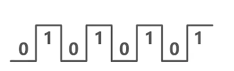
<!-- image-source: https://cdn.nlark.com/yuque/0/2026/png/67474974/1777735592100-f673d3f6-48e9-48ce-9ba7-85524aca7c4e.png -->

这些问题可以划归到**物理层**（住：1.严格来说传输媒体不属于物理层，并不包含在体系结构之中；2.计算机网络传输的信号并不是举例的方波信号）

#### （2）数据链路层
假设以解决物理层问题，主机间可以发送信号传输比特0或1，还有什么需要解决的问题？

主机A要给主机C发送数据，但是表示数据的信号会通过总线传播到总线上的每个主机，问题：主机C如何知道数据是发给自己的，自己要接受？主机B、D、E又如何知道数据并不是发给自己的，自己应该拒绝？


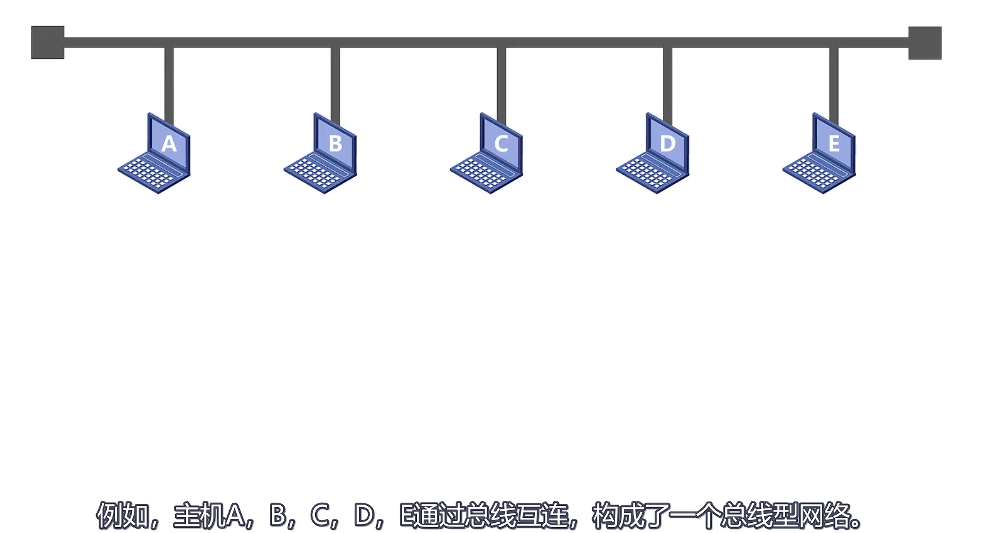
<!-- image-source: https://cdn.nlark.com/yuque/0/2026/png/67474974/1777735981787-df41d4b7-778b-4193-a50b-2d911e22d742.png -->

**1.如何标识网络中的各主机（主机编址问题，例如MAC地址（主机在网络中的地址））**

主机在发送数据时，应该给数据附加目的地址，当其他主机收到后，根据目的地址和自身地址，来决定是否接受数据。

**2.如何从信号所表示的一连串比特流中区分出地址和数据**

需要解决分组的封装格式问题。

**3.如何协调各主机争用总线**

某个时刻总线是空闲的，也就是没有主机使用总线来发送数据。片刻之后主机B和D同时向总线发送数据，必然会造成信号碰撞。

注：总线型网络早已被淘汰，现在常用的是使用以太网交换机将多台主机互联形成交换式以太网


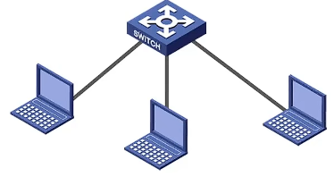
<!-- image-source: https://cdn.nlark.com/yuque/0/2026/png/67474974/1777736761898-41721082-79d2-4f5b-aeee-83f2b117d2ab.png -->

#### （3）网络层
解决物理层和数据链路层各自所面临的问题，就可以实现分组在一个网络上传输了。但是因特网是由非常多的网络和路由器互连起来的，仅解决物理层和数据链路层的问题，依旧不能正常工作。


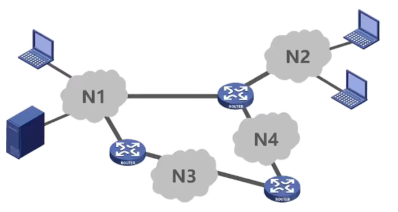
<!-- image-source: https://cdn.nlark.com/yuque/0/2026/png/67474974/1777737012201-c61d2c37-5640-4f3b-b34d-dc1c89d1cee5.png -->

在多个网络中面临的问题：

**1.如何标识各网络以及网络中的各主机（网络和主机共同编址的问题，例如IP地址）**

在同一个子网上，IP的前三个十进制数因该相同，第四个十进制数各不相同，用于标识自己


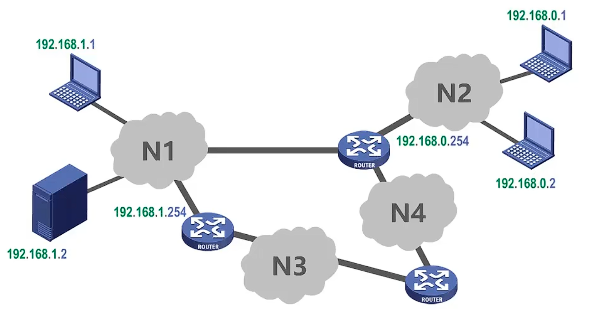
<!-- image-source: https://cdn.nlark.com/yuque/0/2026/png/67474974/1777737450260-25bb0913-a274-4b58-9e72-bc312e93a275.png -->

**2.路由器如何转发分组，如何进行路由选择**

解释：分组从源主机到目的主机可以走不同的路径 

#### （4）运输层
假设同一台主机运行着两个与网络通信相关的应用进程，服务器中运行着与网络通信相关的服务器进程，某个时刻，主机收到了来自服务器的分组。那么，这些分组应该交给浏览器进程处理呢，还是应该交给QQ进程处理？


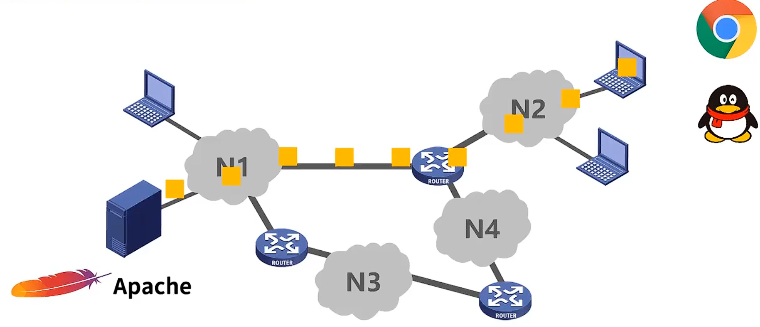
<!-- image-source: https://cdn.nlark.com/yuque/0/2026/png/67474974/1777737936981-22f2a9a1-512a-4745-a998-6774d56694c5.png -->

**1.如何解决进程之间基于网络的通信问题**

标识与网络通信相关的应用进程

**2.出现传输错误时，如何处理**

若某个分组在传输过程中出现的误码，或者由于服务器繁忙导致路由器丢失分组，该如何处理

#### （5）应用层
解决了物理层、数据链路层、网络层、运输层各自的问题则可以实现**进程之间**基于网络的通信。在此基础上，只需制定各种应用层协议，并按协议标准编写相应的应用程序，通过应用进程间的交互来完成特定的网络应用。


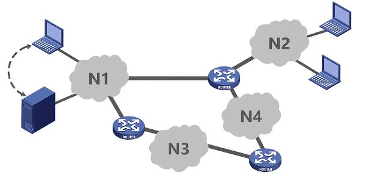
<!-- image-source: https://cdn.nlark.com/yuque/0/2026/png/67474974/1777738366018-550c65c4-8f2d-4592-bf69-462f161dc6ba.png -->

通过应用进程间的交互来完成特定的网络应用

支特万维网应用的http协议

支特电子邮件的smtp协议

支持特文件传送的ftp协议

#### 总结 
应用层：解决通过应用进程的交互来实现特定网络应用的问题

运输层：解决进程之间基于网络的通信问题

网络层：解决分组在多个网络上传输（路由）的问题

数据链路层：解决分组在一个网络（或一段链路）上传输的问题

物理层：解决使用何种信号来传输比特的问题

### 3. 计算机网络体系结构分层思想举例  
主机和Web服务器之间基于网络的通信，实际上是主机中的浏览器应用进程，与Web服务器中的Web服务器应用进程之间基于网络的通信。


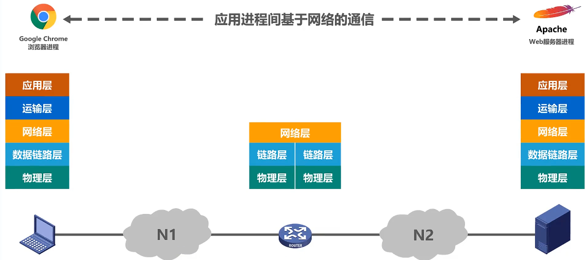
<!-- image-source: https://cdn.nlark.com/yuque/0/2026/png/67474974/1777823281366-5fa62512-b148-4dc4-b10f-8b1044316177.png -->


以图中的场景为例：**Google Chrome 浏览器**（客户端）向 **Apache 服务器**请求网页，数据从 N1 主机发出，经过路由器转发，到达 N2 服务器。

#### 各层的作用
**1. 应用层**

**作用**：最贴近用户，直接为**应用进程**提供网络服务，定义通信规则和数据格式。

**2. 运输层**

**作用**：为两台主机上的**应用程序进程之间**提供端到端的数据传输服务。负责分段、建立连接、差错校验、流量控制、区分不同应用（通过端口）。

**3. 网络层**

**作用**：负责将数据包从**源主机**经由多个网络和路由器送到**目的主机**，核心是**逻辑寻址（IP地址）和路由选择**。

**4. 数据链路层**

**作用**：在**相邻两个节点之间**（如主机到路由器、路由器到路由器）的物理链路上实现数据帧的透明传输。负责物理寻址（MAC地址）、帧的封装/解封装、差错检测和介质访问控制。

**5. 物理层**

**作用**：在物理传输介质上透明地传输**比特流**。定义接口特性、电平、速率、线缆规格等物理特性，将数据中的 0/1 转换成电信号、光信号或无线信号。


#### 图中的体现
1.主机端：

**1.应用层**：浏览器和服务器使用 HTTP 协议来交换 Web 页面内容。应用层按HTTP协议的规定构建“请求报文”，将用户想要访问的网页信息组织成应用数据，交给下层处理。


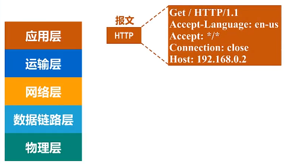
<!-- image-source: https://cdn.nlark.com/yuque/0/2026/png/67474974/1777823876289-91295624-6dd1-4ab4-8fdc-18410c576c80.png -->

**2.运输层**：基于 HTTP 协议的需求，通常会使用 **TCP**（传输控制协议）。如果是视频通话等场景，可能用 UDP，提供尽力而为的无连接传输。运输层将 HTTP 请求报文添加一个TCP首部，使之成为TCP报文段（运输层将 HTTP 报文划分成适合传输的片段，加上**端口号**（如服务器端口80）），然后将TCP报文段交付给网络层处理。首部作用：区分应用进程，确保这些片段能在 Chrome 进程和 Apache 进程之间**可靠、有序**地交付。


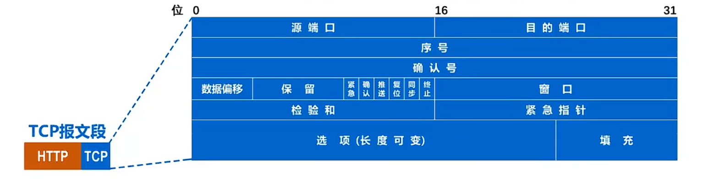
<!-- image-source: https://cdn.nlark.com/yuque/0/2026/png/67474974/1777823740743-08db0d8a-63bf-462a-aaaf-e19afaa54173.png -->

**3. 网络层：** 网络层给TCP报文段添加IP首部，把数据封装成 **IP 数据报**（含有源 IP 和目的 IP），并决定数据报如何经过 **Router（路由器）** 的转发，跨越不同网络，最终到达 N2。网络层将IP数据报交付给数据链路层处理。首部作用：使IP数据报可以在互联网上传输，也就是被路由器转发。


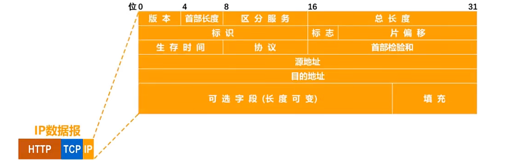
<!-- image-source: https://cdn.nlark.com/yuque/0/2026/png/67474974/1777824161608-089140c4-37fe-4076-b38e-0f5687c76040.png -->

**4. 数据链路层**：该层保证每一“跳”链路上的数据完整送达下一节点。数据链路层给IP数据报添加链路层首部（如以太网头，包含下一跳的 MAC 地址）和尾部，构成**帧**，数据链路层将帧交给物理层。首部作用：为了让帧能够在一段链路上或一个网络上传输，能够被相应的目的主机接收；尾部作用：让目的主机检查所收到的帧是否有误码。


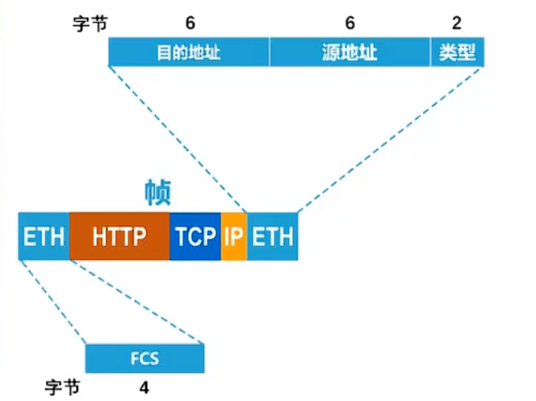
<!-- image-source: https://cdn.nlark.com/yuque/0/2026/png/67474974/1777825043114-830fb144-bcbd-4c86-89c8-0f4fc437a983.png -->

**5. 物理层**：由于网络N1是以太网，物理层会给该比特流前面添加前导码（作用：为了让目的主机做好接收帧的准备）。连接主机与路由器、路由器与 N2 的物理介质（如双绞线、光纤、无线信道）。物理层只负责将链路层交下来的比特流按位变成相应的信号发送到传输媒体，不关心比特的含义，是整个通信的基础。。信号通过传输媒体到达路由器。


2.路由器

**1. 物理层**：将信号变成比特流，然后去掉前导码（帧）交付给数据链路层。

**2. 数据链路层**：将帧的首部尾部去掉后（IP数据报）交付给网络层

**3. 网络层**：路由器上的操作就涉及网络层，根据目的 IP 查表转发。网络层解析IP数据报的首部，从中提取出目的网络地址，然后查找自身的路由表确定转发端口，以便于转发，然后将IP数据报交付给数据链路层。

**4. 数据链路层**：数据链路层给IP数据报添加一个首部和一个尾部使之成为帧，然后将帧交付给物理层。在路由器这一跳，帧会先被解封装，取出 IP 数据报，查表转发到网络层，然后重新封装成新的帧发往 N2。

**5. 物理层**：将帧看做成比特流，由于网络N1是以太网，物理层会给该比特流前面添加前导码。然后将包含前导码的比特流变换成相应的信号发送到传输媒体。信号通过传输媒体到达Web服务器。


3.Web服务器

**1. 物理层**：将信号变成比特流，然后去掉前导码（帧）交付给数据链路层。

**2. 数据链路层**：将帧的首部尾部去掉后（IP数据报）交付给网络层。

**3. 网络层**：网络层将IP数据报的首部去掉后（TCP报文段）将其交付给运输层。

**4. 运输层**：运输层将TCP报文段的首部去掉后（HTTP请求报文）将其交付给应用层。

**5. 应用层**：应用层对HTTP请求报文进行解析，然后给主机发回HTTP“响应报文”。


与之前的过程类似，HTTP“响应报文”在Web服务器**层层封装**，然后通过物理层变成相应的信号，再通过传输媒体传输到路由器。路由器**转发**该响应报文给主机。主机通过物理层将收到的信号转换为比特流，之后通过**逐层解封**，最终取出HTTP响应报文。


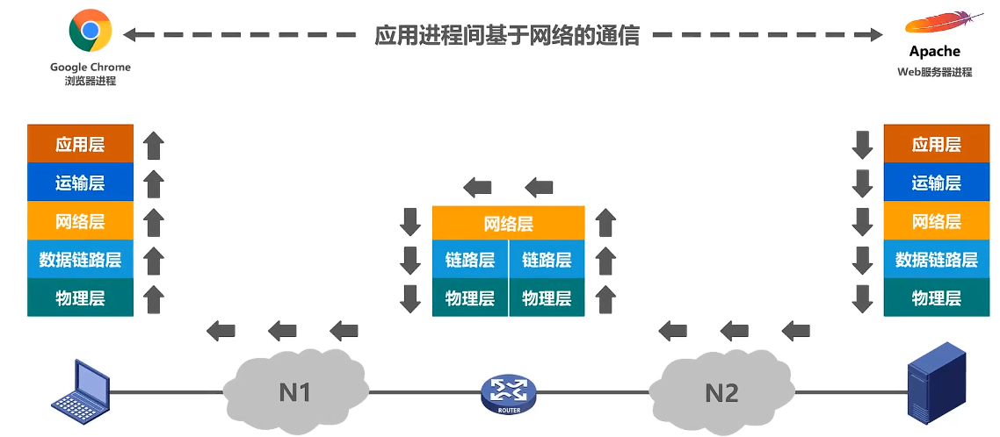
<!-- image-source: https://cdn.nlark.com/yuque/0/2026/png/67474974/1777878553792-ca1cc5ce-5192-4b1e-b8ec-4b7f064ffd9a.png -->

**通信过程总结：**  
数据在发送方（N1）从**应用层向下逐层封装**（每层加上自己的控制信息），到**物理层变成比特流**传输出去；经**路由器转换**（物理层→链路层→网络层转发→再向下封装）；再沿链路到**接收方（N2）**，比特流从物理层向上逐层解封装，最终将 HTTP 请求还原，交给 Apache 进程；Apache 处理后的响应再按相反的路径和方法返回给 Chrome 浏览器。

### 4. 计算机网络体系结构中的专用术语
#### （1）实体
**实体** 任何可发送或接收信息的**硬件**或**软件进程**（图中带字母标识的小方格）

**对等实体** 收发双方**相同层次中的实体**

例子：通信双方的网卡和正在通信的应用进程都是对等实体


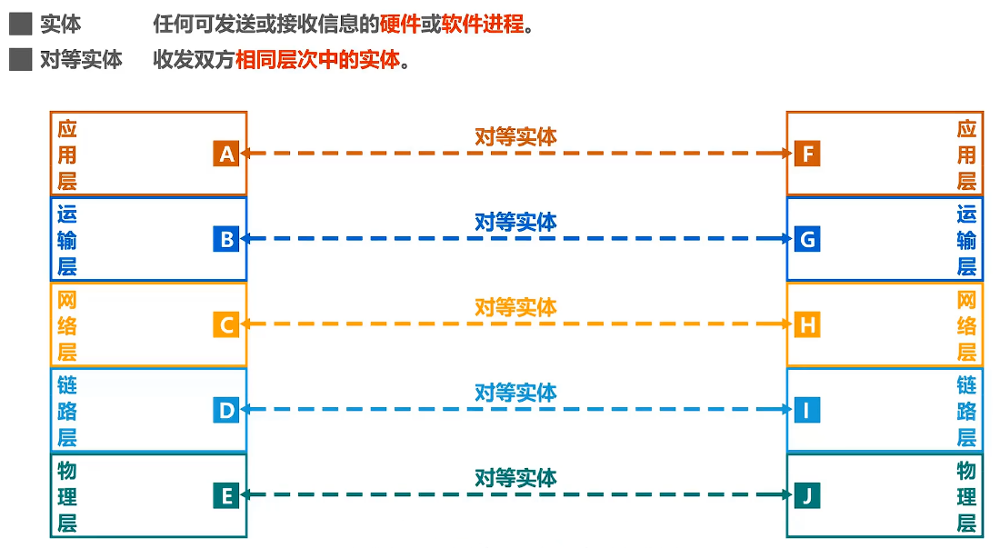
<!-- image-source: https://cdn.nlark.com/yuque/0/2026/png/67474974/1777878732347-3be1ac97-392d-47fc-b7e0-1604b7a1e40a.png -->

#### （2）协议
**协议** 控制两个对等实体进行逻辑通信的规则的集合

应用层**对等实体**在应用层协议（例如 HTTP，SMTP)的控制下进行**逻辑通信**

运输层**对等实体**在运输层协议（例如 TCP，UDP)的控制下进行**逻辑通信**

网络层**对等实体**在网络层协议（例如 IP) 的控制下进行**逻辑通信**

链路层**对等实体**在用链路层协议（例如 传统以太网CSMA/CD)进行)的控制下进行**逻辑通信**

物理层**对等实体**在用物理层协议（例如 传统以太网使用曼彻斯特编码）的控制下进行**逻辑通信**

注：之所以称为逻辑通信因为这种通信其实并不存在，只是假设出来的一种通信。


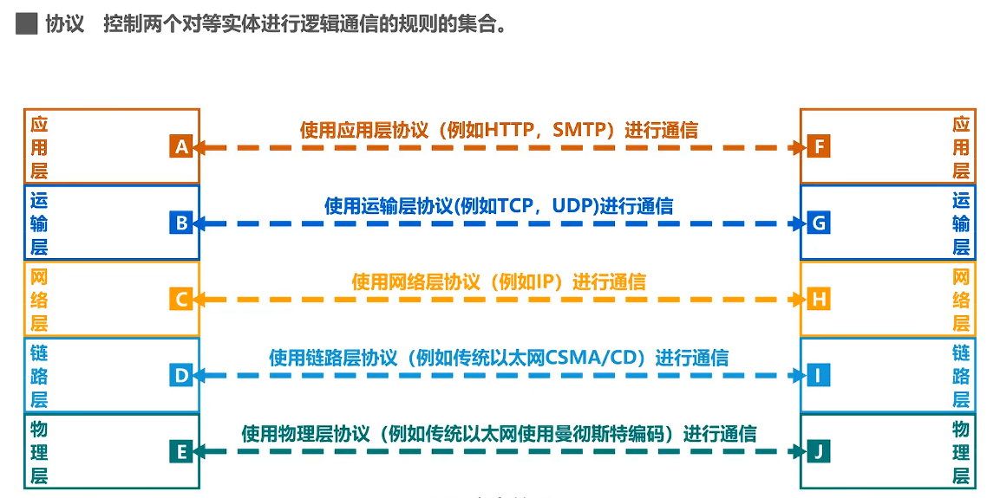
<!-- image-source: https://cdn.nlark.com/yuque/0/2026/png/67474974/1777879004442-30d55fa7-ae46-4d38-afb7-3ff7ffd483bd.png -->


**协议的三要素** 语法 语义 同步

**语法** 定义所交换信息的格式（定义图中小格子（称为字段或域）的长度（bit）和先后顺序也就是定义		       了所交换信息由哪些字段以及何种顺序构成）


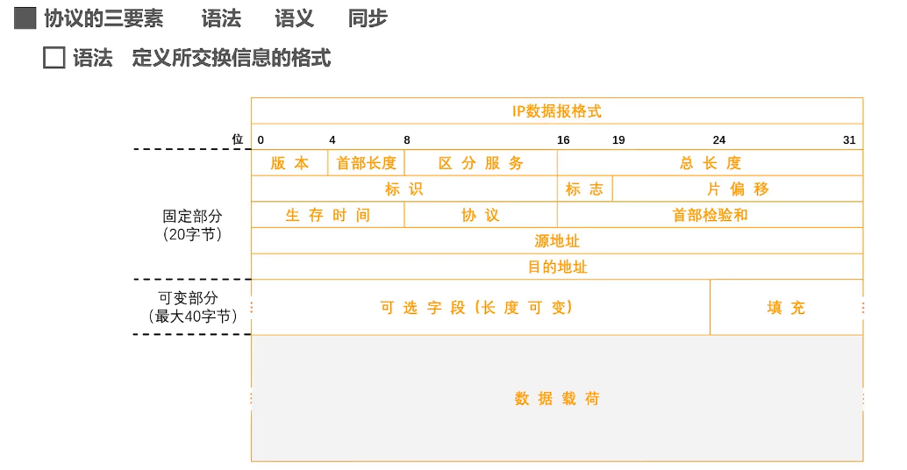
<!-- image-source: https://cdn.nlark.com/yuque/0/2026/png/67474974/1777879337358-372b70b1-aa0c-48df-b165-96e1b6815c0c.png -->

**语义** 定义收发双方所要完成的操作

**同步** 定义收发双方的时序关系

#### （3）服务
**服务** 在协议的控制下，两个对等实体间的逻辑通信使得本层能够向上一层提供服务。

- 物理层**对等实体**在物理层协议的控制下向数据链路层提供服务

+ 要实现本层协议，还需要使用下面一层所提供的服务。
    - 数据链路层**对等实体**"享受"物理层提供的服务 **，** 在数据链路层协议的控制下向进行逻辑通信，给网络层提供服务。
    - 网络层**对等实体**"享受"数据链路层提供的服务 **，** 在网络层协议的控制下向进行逻辑通信，给运输层提供服务。
    - 运输层**对等实体**"享受"网络层提供的服务 **，** 在运输层协议的控制下向进行逻辑通信，给应用层提供服务。
    - 应用层**对等实体**"享受"运输层提供的服务 **，** 在应用层协议的控制下向进行逻辑通信，给用户提供服务。
+ 协议是"**水平的**",服务是"**垂直的**".
+ 实体看得见相下层所提供的服务，但并不知道实现该服务的具体协议。也就是说，下面的协议对上面的	实体是"**透明**"的（例如用户看得见手机提供的各种服务，但无需弄懂手机的工作原理）。

**服务访问点** 在同一系统中**相邻两层的实体交换信息的逻辑接口**，用于区分不同的服务类

数据链路层的服务访问点为帧的"类型"字段。

网络层的服务访问点为ip数据报首部中的"协议字段"。

运输层的服务访问点为"端口号"。

**服务原语** 上层使用下层所提供的服务必须通过与下层**交换一些命令**，这些命令称为服务原语。


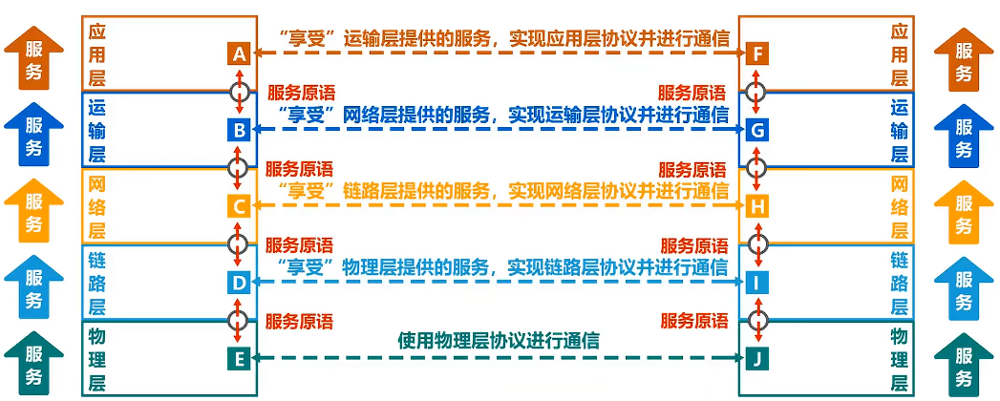
<!-- image-source: https://cdn.nlark.com/yuque/0/2026/png/67474974/1777881491228-0f9d69a9-2266-4788-83ce-ed8238580daf.png -->

**协议数据单元PDU   对等层次之间传送的数据包**称为该层的协议数据单元。

物理层对等实体逻辑通信的数据包称为比特流

数据链路层对等实体逻辑通信的数据包称为帧

网络层对等实体逻辑通信的数据包称为IP数据报或分组

运输层对等实体逻辑通信的数据包称为TCP报文段（采用TCP协议）或UDP报文段（采用UDP协议）

应用层对等实体逻辑通信的数据包称为应用报文

**服务数据单元SDU**   **同一系内，层与层之间交换的数据包**称为服务数据单元。

多个SDU可以合成为一个PDU;一个SDU也可划分为几个PDU。


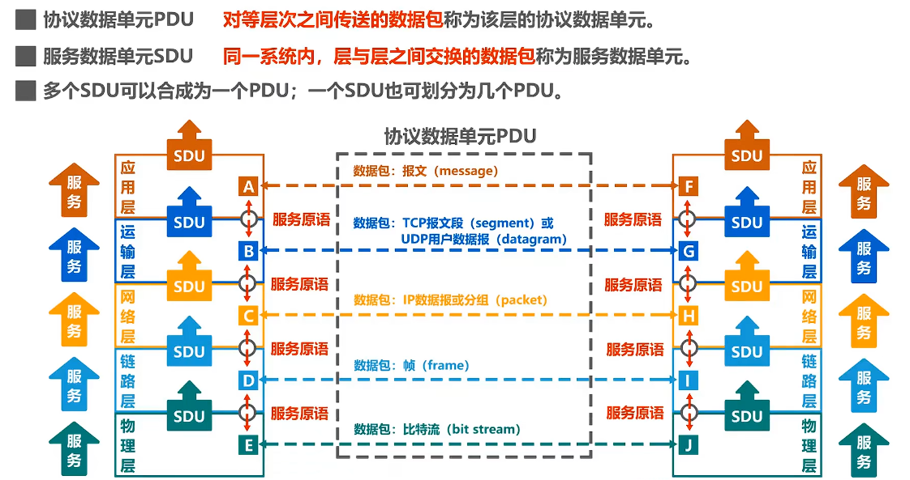
<!-- image-source: https://cdn.nlark.com/yuque/0/2026/png/67474974/1777881549014-68f1ec1c-73b7-4add-a699-96ec8524ad8e.png -->

# 第二章 物理层
## 一、物理层的基本概念
+ 物理层考虑的是怎样才能在连接各种计算机的传输媒体上传输数据比特流。
+ 物理层为数据链路层屏蔽了各种传输媒体的差异，使数据链路层只需要考虑如何完成本层的协议和服务，而不必考虑网络具体的传输媒体是什么。

### 1.传输媒体的类型
导引型传输媒体：1.双绞线	2.同轴电缆	3.光纤

非导引型传输媒体： 微波通信（2~40ghz)（例如使用2.4GHz和5.8GHz频段的WiFi）


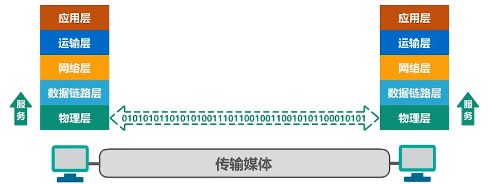
<!-- image-source: https://cdn.nlark.com/yuque/0/2026/png/67474974/1777906798196-db053540-53c0-4f98-b4d2-d6dc722c96c0.png -->

### 2.物理层协议
物理层为了解决在各种传输媒体上传输比特0和1的问题，进而给数据链路层提供透明（数据链路层不知道物理层使用什么方法传输比特0和1，只管享受物理层提供的比特流传输的服务即可）比特流的服务。


物理层协议的主要任务：

**机械特性**：指明接口所用接线器的**形状**和**尺寸**，**引脚数目**和**排列**，**固定**和**锁定**装置。

**电气特性**：指明在接口电缆的各条线上出现的**电压的范围**。

**功能特性**：指明某条线上出现的某一电平的**电压表示何种意义**。

**过程特性**：指明对于不同功能的各种可能**事件的出现顺序**。

## 二、物理层下面的传输媒体
**本节不是重点，了解即可**

注：传输媒体不属于计算机网络体系结构的任何一层，如果非要将它添加到体系结构中，那只能将其放在物理层之下。

### 传输媒体分类
导引型传输媒体：在导引型传输媒体中，电磁波被导引沿着固体媒体传播

（1）同轴电缆

同轴电缆有两类，一类是50欧阻抗的基带同轴电缆，用于数字传输，在早期局域网中广泛使用。另一类是75欧阻抗的宽带同轴电缆，用于模拟传输，目前主要用于有线电视的入户线。


<!-- image-source: https://cdn.nlark.com/yuque/0/2026/png/67474974/1777907628160-4de45c8b-4e86-46cc-af5f-748d649380b5.png -->

同轴电缆价格较贵，且布线不够灵活和方便。随着集线器的出现，在局域网领域，双绞线取代了同轴电缆。

（2）双绞线

无屏蔽双绞线UTP电缆


<!-- image-source: https://cdn.nlark.com/yuque/0/2026/png/67474974/1777907799557-883ed722-7b1d-4b8b-a222-4905c2c59659.png -->

绞合有两个作用：1.抵御部分来自外界的电磁干扰；2.减少相邻导线的电磁干扰。


蔽双绞线STP电缆


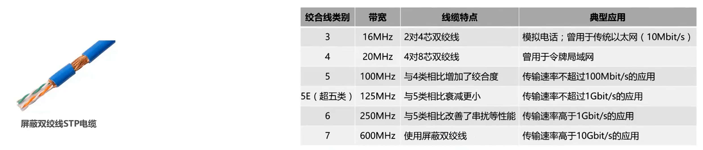
<!-- image-source: https://cdn.nlark.com/yuque/0/2026/png/67474974/1777907995070-552ee8d7-2955-474b-91fb-3d73e7ffe624.png -->

<!-- image-source: https://cdn.nlark.com/yuque/0/2026/png/67474974/1777907995070-552ee8d7-2955-474b-91fb-3d73e7ffe624.png -->

（3）光纤

光纤的纤芯非常细，多模光纤的纤芯直径有50微米和62.5微米，单模光纤的纤芯直径为9微米。而铅锌外面的包层也非常细，直径不超过125微米。

在光纤通信中，常用三个波段的中心分别位于0.85微米 (衰减较大）、1.3微米（衰减较小）和1.55微米（衰减较小）。


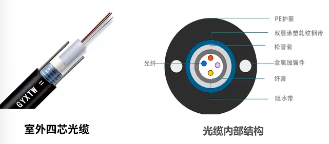
<!-- image-source: https://cdn.nlark.com/yuque/0/2026/png/67474974/1777908146617-89a168e8-d92c-40d2-81f2-9545908198c1.png -->  

光纤优点

1. 通信容量非常大（25000~30000GHz的带宽）
2. 传输损耗小，在远距离传输时更加经济。
3. 抗雷电和电磁干扰性能好，这在有大电流脉冲干扰的环境下尤为重要。
4. 无串音干扰，保密性好，不易被窃听。
5. 体积小，重量轻（例如一公里长的1000对双绞线电缆约重8000公斤，而同样长度但容量大的多的一对两芯光缆仅重100公斤）。

光纤缺点

1. 割接光纤需要专用设备。
2. 目前光电接口的价格还比较贵。


多模光纤


<!-- image-source: https://cdn.nlark.com/yuque/0/2026/png/67474974/1777908848686-1cd19495-3ace-4947-893d-a64e36e4137c.png -->

1. 由于光的色散问题（模式、材料、波导色散），光在多目光纤中传输一定距离后，必然产生信号失真（**脉冲展宽**）
2. 因此多模光纤只适合**近距离传输**(在建筑物内)
3. 多模光纤对光源的要求不高，可以使用比较便宜的发光二极管，相应的可采用光电二极管检测光脉冲

单模光纤

若光纤的直径减小到只有一个光的波长，则光纤就像一根波导那样，它可使光线一直向前传播，而不会产生多次反射，这样的光纤称为单模光纤。


<!-- image-source: https://cdn.nlark.com/yuque/0/2026/png/67474974/1777909116269-e58f2421-72b1-4ab3-a9d7-19ceb1e5d13b.png -->

1. **单模光纤没有色散**，在1.3微米波长附近，材料色散和波导色散大小相等，符号相反，两者正好抵消，没有脉冲展宽问题。
2. 单模光纤适合**长距离传输**且衰减小，但它的制造成本高，对光源要求也高
3. 需要使用昂贵的半导体激光器作为光源，相应的需要采用激光检波器检测光脉冲。


（4）电力线


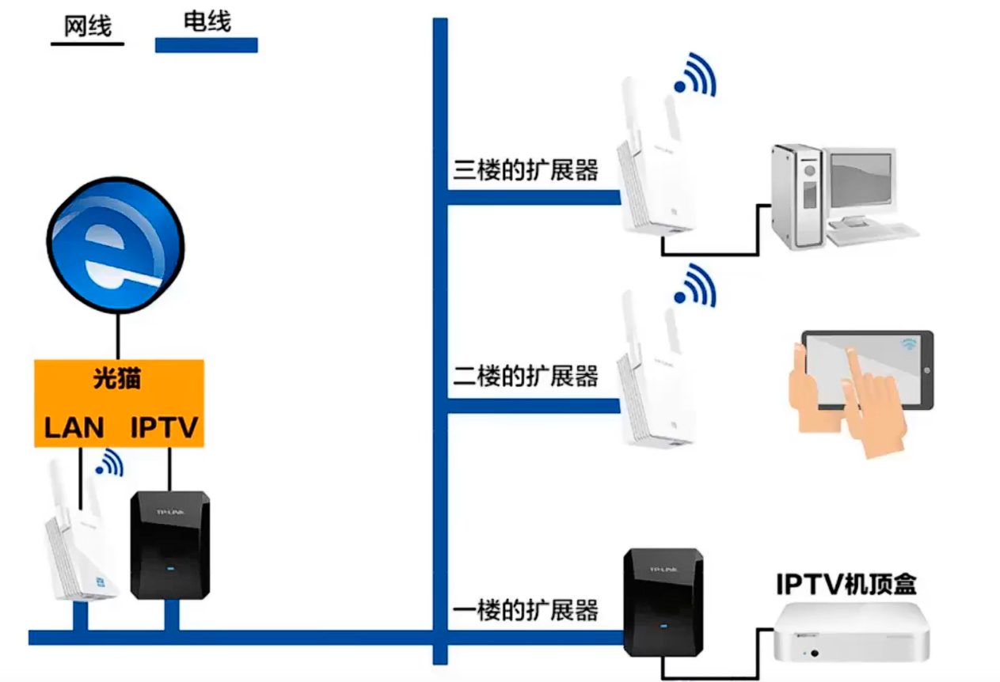
<!-- image-source: https://cdn.nlark.com/yuque/0/2026/png/67474974/1777909354763-bf50759f-2277-4cf9-bc8f-2a5b8b3ecb97.png -->


非导引型传输媒体：非导引型传输媒体是指自由空间


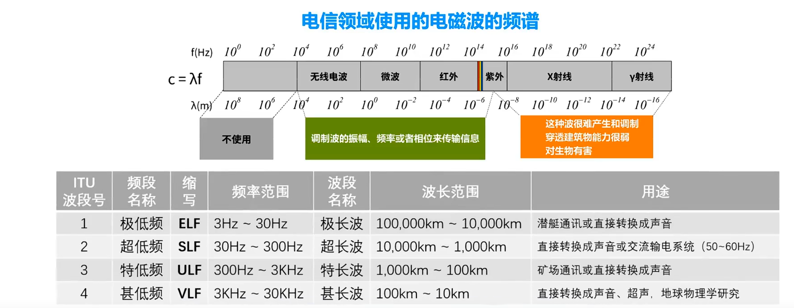
<!-- image-source: https://cdn.nlark.com/yuque/0/2026/png/67474974/1777909514652-8cf0ae0b-3e16-46a0-bab6-d5f279b6a034.png -->


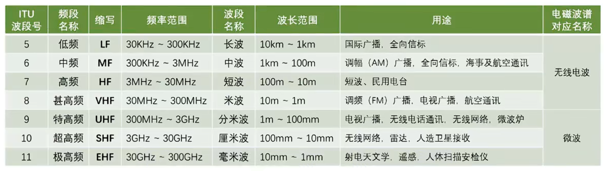
<!-- image-source: https://cdn.nlark.com/yuque/0/2026/png/67474974/1777909584806-c9227d53-6704-42f5-8fe1-bcec3487a937.png -->

（1）无线电波


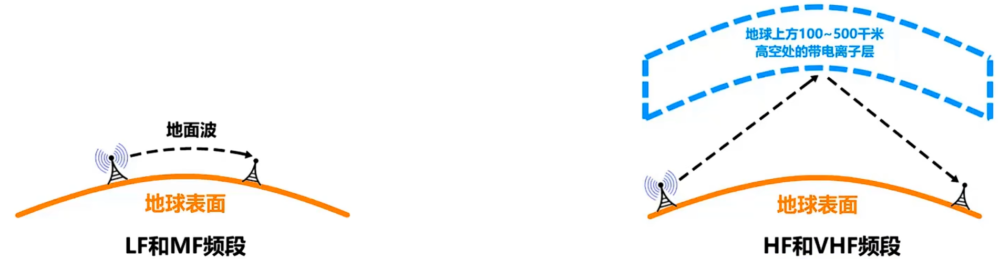
<!-- image-source: https://cdn.nlark.com/yuque/0/2026/png/67474974/1777909650003-68b5be78-d403-4fb9-b1ff-90fe0e1bb3ae.png -->

（2）微波


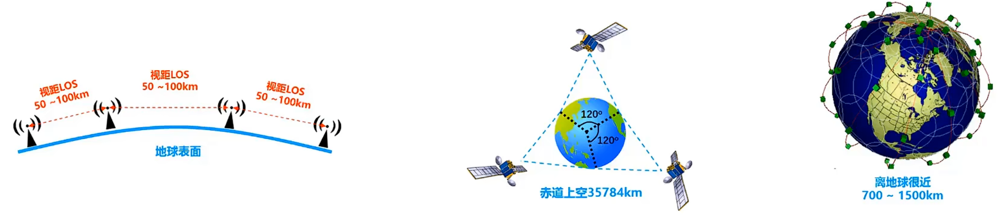
<!-- image-source: https://cdn.nlark.com/yuque/0/2026/png/67474974/1777909717306-6edf5dd1-f897-4599-99ff-a823fbde3ed7.png -->

（3）红外线

红外通信特点：1.点对点无线传输；2.中间不能有障碍物，传输距离短；3.传输速率也很低（4Mb/s~16Mb/s）

以前的笔记本电脑基本都带有红外接口，可以进行红外通信。现在笔记本电脑已经取消了红外接口，但很多智能手机还带有红外接口，以方便用户对电视、空调等家用电器进行红外遥控。

（4）可见光

## 三、传输方式
**本节课的内容比较容易理解，重点是弄清楚同步传输中的同步，异步传输中的异步，它们各自的含义是什么**

### 1.串行传输和并行传输
**串行传输**：数据是一个比特一个比特依次发送的，因此在发送端和接收端之间只需要一条数据传输线路即可。


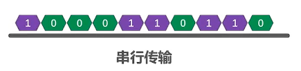
<!-- image-source: https://cdn.nlark.com/yuque/0/2026/png/67474974/1777910273237-6924fb8c-da61-45ac-bc45-534c5b908728.png -->

**并行传输**：一次发送N个比特，而不是一个比特，为此在发送端和接收端之间需要有N条传输线路。并行传输的优点是速度为串行传输的N倍，但也存在一个严重的缺点，即成本高。


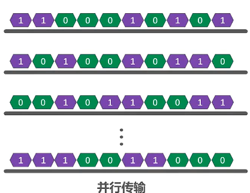
<!-- image-source: https://cdn.nlark.com/yuque/0/2026/png/67474974/1777910316757-c6bd01dd-5a87-4c89-b94b-76fcb6e5a79d.png -->

在计算机网络中，数据在传输线路上的传输采用是串行传输。计算机内部的数据传输常采用并行传输方式，例如CPU与内存之间通过总线进行数据传输，常见的数据总线宽度有8位、16位、32位和64位。

### 2.同步传输和异步传输
**（1）同步传输方式**

数据块以稳定的比特流的形式传输，字节之间没有间隔。接收端在每个比特信号的中间时刻进行检测，以判别接收到的是比特零还是比特一。


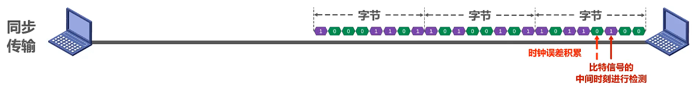
<!-- image-source: https://cdn.nlark.com/yuque/0/2026/png/67474974/1777910486546-fe55c543-c3bc-49f1-b25b-411fde8bf8e7.png -->

由于不同设备的时钟频率存在一定差异，不可能做到完全相同。在传输大量数据的过程中所产生的判别时刻的累计误差，会导致接收端对比特信号的判别错位。因此需要采取方法使收发双方的时装保持同步。

实现收发双方时钟同步的方法：

1. 外同步：在收发双方之间添加一条单独的时钟信号线，发送端在发送数据信号的同时，另外发送一路时钟同步信号，接收端按照时钟同步信号的节奏来接收数据
2. 内同步：发送端将时钟同步信号编码到发送数据中一起传输（例如曼彻斯特编码）

**（2）异步传输方式**

以字节为独立的传输单位，字节之间的时间间隔不是固定的，接收端仅在每个字节的起始处对字节内的比特实现同步。为此，通常要在每个字节前后分别加上起始位和结束位。


<!-- image-source: https://cdn.nlark.com/yuque/0/2026/png/67474974/1777910681665-950fa525-fd09-4f68-9db5-334ecd4475f2.png -->

这里异步是指字节之间异步（字节之间的时间间隔不固定），但字节中的每个比特仍然要同步（各比特的持续时间是相同的）

### 3.单工、半双工以及全双工通信
（1）单工通信：又称为单向通信，通信双方只有一个数据传输方向，例如无线电广播采用的就是这种通信方式


<!-- image-source: https://cdn.nlark.com/yuque/0/2026/png/67474974/1777910808090-d94f7244-14f8-4c2f-8408-d1cbfa3d6169.png -->

（2）半双工通信：又称为双向交替通信，通信双方可以相互传输数据，但不能同时进行，例如对讲机采用的就是这种通信方式


<!-- image-source: https://cdn.nlark.com/yuque/0/2026/png/67474974/1777910830614-29b833ac-06b8-4d81-8583-5a8bbabc0aa3.png -->

（3）全双工通信：又称为双向同时通信，通信双方可以同时发送和接收信息，例如电话采用的就是这种通信方式。

## 四、编码与调制
**本节课的内容稍有难度，但还是请认真搞懂本节课的内容。因为物理层的主要任务就是解决比特0和1在线路上传输的问题，而本节课的内容就是其相关的理论基础。**

### 1.基本概念
**消息**：计算机处理和传输用户的文字、图片、音频和视频统称为消息。

**数据**：运送消息的实体，计算机处理的二进制数据，也就是比特0和比特1。

**信号**：信号是数据的电磁表现。分为**数字信号**（值是离散的）和**模拟信号**（值是连续的）。


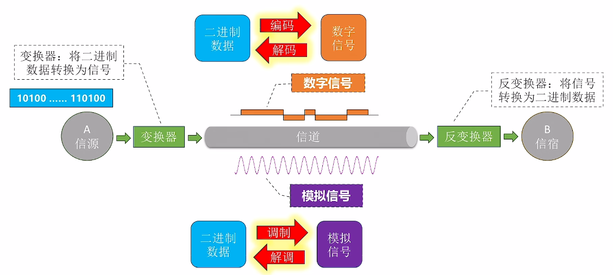
<!-- image-source: https://cdn.nlark.com/yuque/0/2026/png/67474974/1778079431880-48c37a42-b470-4d17-af4a-637517c3d260.png -->

**基带信号**：由信源发出的原始电信号称为基带信号。基带信号可分为两类，一类是**数字基带信号**，例如计算机内部CPU与内存之间传输的信号。另一类是**模拟基带信号**，例如麦克风收到声音后产生的音频信号。


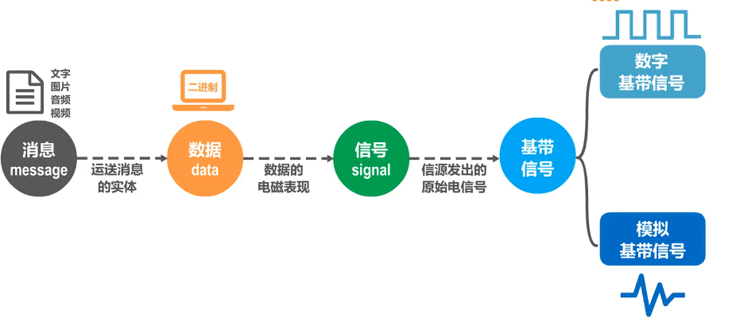
<!-- image-source: https://cdn.nlark.com/yuque/0/2026/png/67474974/1777993155135-a7e27b2f-b794-4eca-be01-ce27879c6f1b.png -->

信号需要在信道中进行传输，信道可分为数字信道和模拟信道两种。

（1）数字基带信号

**数字信道**：在不改变信号性质的前提下，仅对数字基带信号的波形进行变换称为**编码**。编码后产生的信号仍为**数字信号**，可以在数字信道中传输。例如，以太网使用曼彻斯特编码4B/5B，8B/10B等编码。

**模拟信道**：把数字基带信号的频率范围搬移到较高的频段并转换为模拟信号，称为**调制**。调制后产生的信号是**模拟信号**，可以在模拟信道中传输。例如wifi使用补码监控、直接序列扩频、正交频分复用等调制方法。

（2）模拟基带信号

对模拟基带信号进行编码的典型应用是对音频信号进行编码的麦码调制PCM，也就是将模拟音频信号通过采样、量化编码这三个步骤进行数字化。

对模拟信号进行调制的典型应用是将语音数据加载到模拟的载波信号中传输，例如传统的电话。另一个是频分复用FDM技术可以充分利用带宽资源。


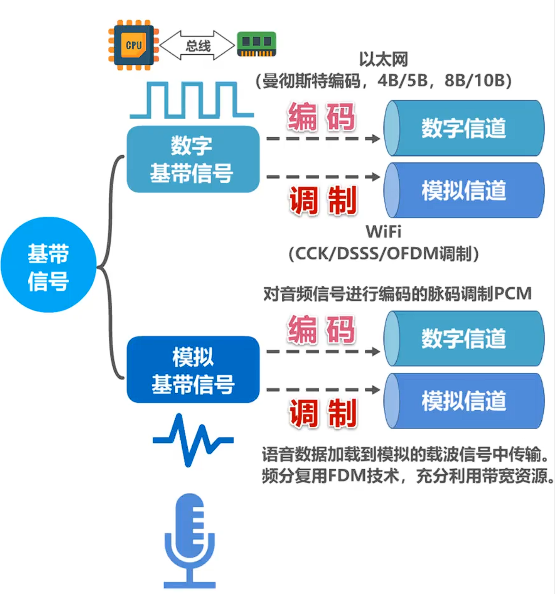
<!-- image-source: https://cdn.nlark.com/yuque/0/2026/png/67474974/1777993525959-37dc5e3f-62a5-4516-aaa5-c858039406f3.png -->

**码元**：在使用时间域的波形表示数字信号时，**代表不同离散数值的基本波形**。简单来说，**码元**就是构成信号的一段波形。


<!-- image-source: https://cdn.nlark.com/yuque/0/2026/png/67474974/1777993834040-e7b1dcdb-6623-4cbe-8d95-4868a3420991.png -->

注：严格来说，传输媒体和信道不能直接划等号。对于单工传输，传输媒体中只包含一个信道，要么是发送信道，要么是接收信道。而对于半双工和全双工传输，传输媒体中要包含两个信道，一个是发送信道，另一个是接收信道。如果使用信道复用技术，一条传输媒体还可以包含多个信道。

### 2.编码与调制的常用编码
在计算机网络中，常见的是将数字基带信号通过编码或调制的方法在相应信道进行传输。

#### 常用编码
（1）不归零编码

采用不归零编码产生的该比特流的相应信号。正电平表示比特1，负电平表示比特0，这是零电平。所谓不归零，就是指在整个码元时间内电平不会出现零电平。例如该码源在其时间内全部是正电平，而该码源在其时间内全部是负电平。


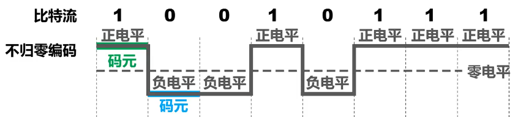
<!-- image-source: https://cdn.nlark.com/yuque/0/2026/png/67474974/1777994542102-2dcba09d-4aeb-4b35-9e94-57e0ae90ad37.png -->

接收端判断码源数目的方法：

核心：需要发送方的发送与接收方的接收做到严格的同步

+ 需要**额外一根传输线来传输时钟信号**，接收方按时钟信号的节拍来逐个接收码源（发送方与接收方同步）。
+ 对于计算机网络，**宁愿利用这个传输线来传输数据信号**，而不是要传输时钟信号。

因此，由于不归零编码存在同步问题，计算机网络中的数据传输不采用这类编码。

（2）归零编码


<!-- image-source: https://cdn.nlark.com/yuque/0/2026/png/67474974/1777994771546-54bc4505-cc9f-4c9c-a2c1-5c3ab6ac09c8.png -->

+ **每个码源传输结束后信号都要“归零”**，所以接收方只要在信号归零后进行采样即可，不需要单独的时钟信号。
+ 实际上归零编码相当于把时钟信号用“归零方“式编码在了数据之内，这称为 **”自同步“** 信号。
+ 但是归零编码中大部分的**数据带宽**都用来传输“归零”而**浪费**掉了。

归零编码的优点是字同步，但缺点是编码效率低。

（3）曼彻斯特编码

在每个码元时间的中间时刻，信号都会发生跳变。例如负跳变表示比特1，正跳变表示比特0。码元中间时刻的跳变既表示时钟又表示数据（传统以太网使用的就是曼彻斯特编码）


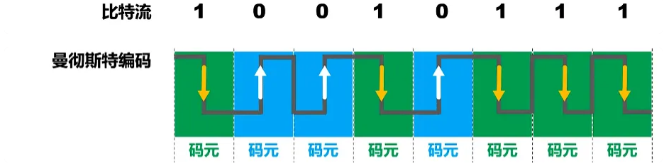
<!-- image-source: https://cdn.nlark.com/yuque/0/2026/png/67474974/1778077363844-da065fda-d52c-4114-a211-836c64fe457a.png -->


（4）差分曼彻斯特编码

在每个码元时间的中间时刻，信号都会发生跳变。


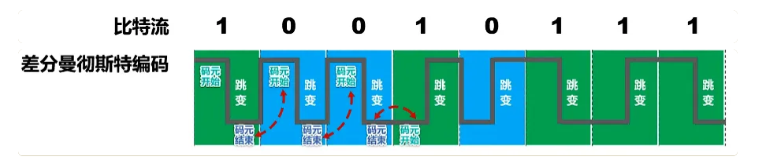
<!-- image-source: https://cdn.nlark.com/yuque/0/2026/png/67474974/1778077841560-25ddf71a-ee3e-4b70-a554-9fba5ad9c682.png -->

与曼彻斯特编码不同：

1.跳变仅表示时钟

2.码源开始处电平是否发生变化来表示数据

#### 基本调制方法
（1）调幅

这是调幅所产生的模拟信号。无载波输出表示比特0，有载波输出表示比特1。


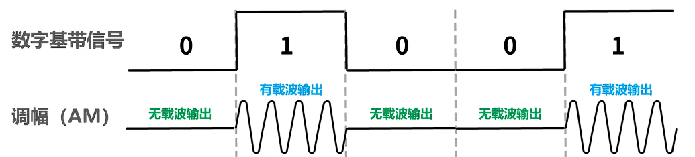
<!-- image-source: https://cdn.nlark.com/yuque/0/2026/png/67474974/1778078388999-9fe3b816-8402-4a30-b2b3-1adb67fed08a.png -->

（2）调频

这是调频所产生的模拟信号。频率F1的波形表示比特0，频率F2的波形表示比特1。


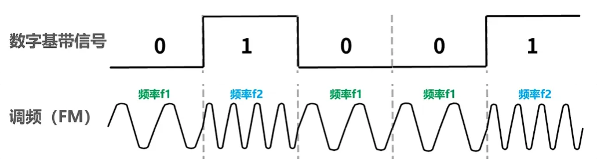
<!-- image-source: https://cdn.nlark.com/yuque/0/2026/png/67474974/1778078489909-cd119561-dabd-4d57-b0ad-154f223b2c51.png -->

（3）调相

这是调相所产生的模拟信号。初相位0度的波形表示比特0，初相位180度的波形表示比特1。


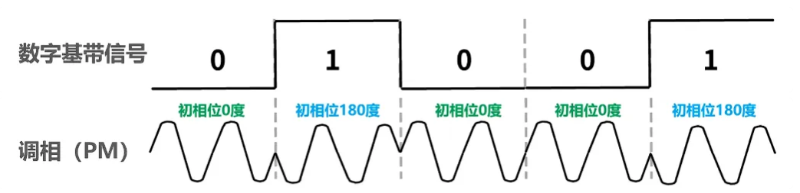
<!-- image-source: https://cdn.nlark.com/yuque/0/2026/png/67474974/1778078746262-9b46e6c1-669d-4f05-9ac7-d78ac9a03058.png -->


（4）混合调制

使用基本调制方法，一个码源只能表示或者说包含一个比特信息。为了能使一个码源包含更多的比特呢，可以采用混合调制的方法。

因为**频率和相位是相关**的，即频率是相位随时间的变化率，所以**一次只能调制频率和相位两个中的一个**。通常情况下，相位和振幅可以结合起来一起调制，称为**正交振幅调制QAM**。

QAM-16：

这种调制方法所调制出的波形可以有12种相位，每种相位有一或两种振幅可选。


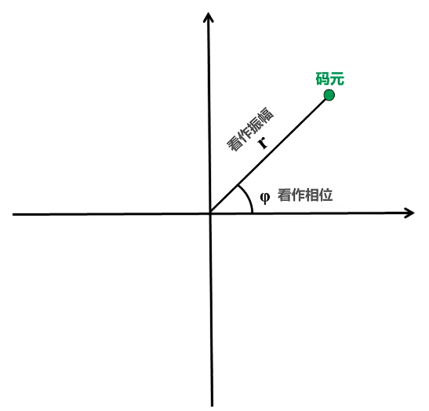
<!-- image-source: https://cdn.nlark.com/yuque/0/2026/png/67474974/1778079206473-eb6ea38d-e78d-4739-b16a-7cf5785ecfd3.png -->

这是QM16可调制出的16种码源，每种码元可以对应表示4个比特。


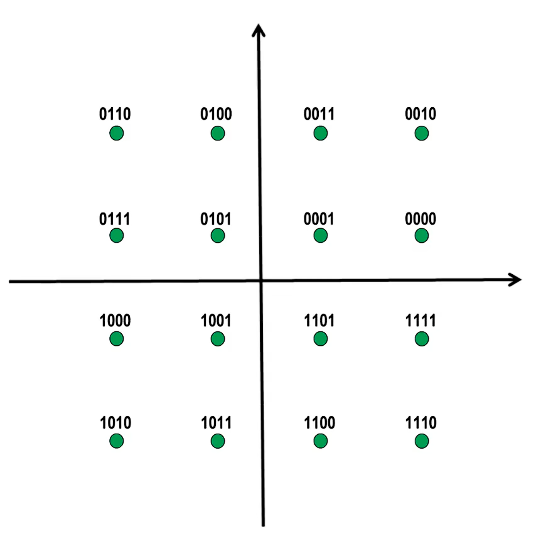
<!-- image-source: https://cdn.nlark.com/yuque/0/2026/png/67474974/1778079291448-2346f27c-16f3-4e28-8c82-7b90b79e374a.png -->

那么每个码元与四个比特的对应关系可以随便定义吗？每个码元与四个比特的对应关系不能随便定义。每个码源与四个比特的对应关系应该采用格雷码，也就是任意两个相邻码元只有一个比特不同。


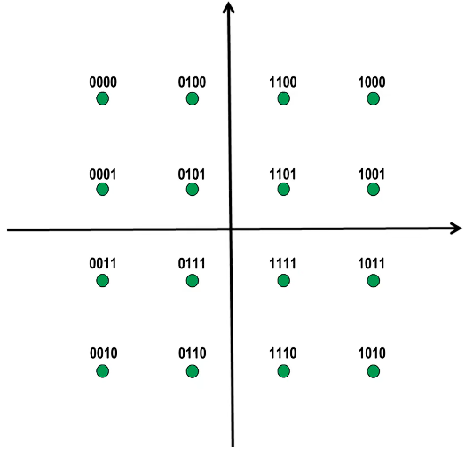
<!-- image-source: https://cdn.nlark.com/yuque/0/2026/png/67474974/1778079365381-7ff32de3-f63b-4681-8bfb-3fb8ddfccc5f.png -->

## 五、信道极限容量
**本节课中介绍了与信道极限容量相关的两个公式，一个是奈氏准则，另一个是香农公式。他们为提高信息传输速率提供了理论依据，希望能够掌握并利用这两个公式进行一些简单的相关计算。**

### 1.失真
信号在传输过程中会受到各种因素的影响。如图所示，这是一个数字信号，当它通过实际的信道后，波形会产生失真。当失真不严重时，在输出端还可根据已失真的波形还原出发送的码源。但当失真严重时，在输出端就很难判断这个信号在什么时候是1和在什么时候是0。信号波形失去了码元之间的清晰界限，这种现象叫做**码间串扰**。


<!-- image-source: https://cdn.nlark.com/yuque/0/2026/png/67474974/1778419378456-f933c6a7-e69f-48a6-8133-1f6300d136d8.png -->

<!-- image-source: https://cdn.nlark.com/yuque/0/2026/png/67474974/1778419388151-a1daea9e-1d78-457f-b1df-37747c3cee4f.png -->


**产生失真的原因：** 码元传输速率、信号传输距离、噪声干扰、传输媒体质量等。

### 2.奈氏准则
**奈氏准则**：在假定的理想条件下，**为了避免码间串扰，码元传输速率是有上限**

理想**低通信道**（频率从0开始，直到某个最高频率$f_H$ ，例如：电话线、以太网双绞线）的**最高码元传输速率 = 2W Baud = 2W 码元/秒**

---

理想**带通信道**（频率范围在$f_L$到$f_H$之间，**不包含 0**（不能通过直流），例如：无线电广播、Wi-Fi 信号、卫星通信）的**最高码元传输速率 = W Baud = W 码元/秒**

W：信道带宽（单位为Hz）是指一个信道能够有效传输信号的频率范围

- **物理意义**：它等于信道允许通过的**最高频率**与**最低频率**之差。
    * 对**低通信道**（频率从$0$到某个上限$f_H$），带宽$W = f_H$。
    * 对**带通信道**（频率从$f_L$到$f_H$），带宽$W = f_H - f_L$。
- **在奈氏准则中的角色**：决定了信道在无噪声情况下能够传输码元速率的上限。带宽越宽，能通过的信号频率分量越多，最高码元传输速率也就越高。


Baud：波特，即**码元/秒**

1.**码元传输速率又称为波特率**、调制速率、波形速率或符号速率。它与比特率有一定关系：

+ 当1个码元只携带1比特的信息量时，则波特率（码元/秒）与比特率（比特/秒）在数值上是相等的；
+ 当1个码元携带n比特的信息量时，则波特率转换成比特率时
    - 比特率 = 波特率 × 每个码元携带的信息量
    - $n=log_2(V)$
        * _**n**_：每个码元携带的信息量，单位是 **比特 (bit)**。
        * _**V**_：码元的**离散状态个数**（即这个码元有多少种不同的波形、电压电平或相位）。

2.要提高信息传输速率（比特率），就必须设法使每一个码元能携带更多个比特的信息量。这需要采用多元制（调幅、调频以及调相这三种基本调制属于二元调制，混合调制属于多元调制）

3.实际的信道所能传输的最高码元速率，要明显低于奈氏准则给出的这个上限数值

仅从公式来看，只要采用更好的调制方法，让码元可以携带更多的比特，岂不是可以无限制的提高信息的传输速率吗？答案是否定的。信道的极限信息传输速率还要受限于实际的信号在信道中传输时的信噪比。因为信道中的噪声也会影响接收端对码元的识别，并且噪声功率相对信号功率越大影响就越大。

### 2.香农公式
**香农公式**：带宽受限且有高斯白噪声干扰的信道的极限信息传输速率

$ c = W \times \log_2\left(1 + \frac{S}{N}\right)
 $

+ $C$：信道的极限信息传输速率（单位：b/s）
+ $W$：信道带宽（单位：Hz）
+ $S$：信道内所传信号的平均功率
+ $N$：信道内的高斯噪声功率
+ $S/N$：信噪比。信噪比有两种记发：一种无单位记法$S/N$，信噪比=S/N；另一种分贝$ dB
 $记法，$ \text{信噪比（dB）} = 10 \times \log_{10}\left(\frac{S}{N}\right) \ (\text{dB}) $

**从香农公式可以看出**：

1. 信道带宽或信道中信道比越大，信息的极限传输速率就越高。
2. 在实际信道上能够达到的信息传输速率要比该公式的极限传输速率低不少。这是因为在实际信道中，信号还要受到其他一些损伤，例如各种脉冲干扰信号、在传输中的衰减和失真等，这些因素在香农公式中并未考虑。

### 3.奈氏准则和香农公式
1. 在信道带宽一定的情况下，根据奈氏准则和香农公式，要想**提高信息的传输速率**就必须采用**多元制**（更好的调制方法），并努力**提高信道中的信噪比**
2. 自从香农公式发表以后，各种**新的信号处理和调制方法就不断出现**，其目的都是为了尽可能的**接近香农公式所给出的传输速率极限**

### 4.例题
**【2014年 题35】** 下列因素中，不会影响信道数据传输速率的是  **D**  

A. 信噪比    			B. 频率带宽    				C. 调制速度    			   D. 信号传播速度  

---

从**香农公式**可知，信噪比和频率带宽都会影响信道数据传输速率。从**奈氏准则**可知，调制速度，也就是码元传输速度和码元所携带的比特数量都会影响信道数据传输速率。而信号的传播速度不影响数据传输速率。


这道题考察**奈氏准则**（无噪声情况）下，结合调制技术计算最大数据传输速率。

---

**【2009年 题34】** 在无噪声情况下，若某通信链路的带宽为3kHz，采用4个相位，每个相位具有4种振幅的QAM调制技术，则该通信链路的最大数据传输速率是  **B**

**A. 12 kbps		B. 24 kbps	 	C. 48 kbps		D. 96 kbps**

---

**【解析】**

1. **计算最高码元速率**（奈氏准则，无噪声，低通信道）$\text{最高码元传输速率} = 2W = 2 \times 3\text{k} = 6\text{k Baud} = 6\text{k 码元/秒}$
2. **计算每个码元携带的比特数**：
    - 4 个相位 × 4 种振幅（QAM调制技术） = 16 种不同的码元
    - 每个码元携带的信息量 = $\log_2 16 = 4$比特
3. **计算最大数据传输速率**：  
$$
\text{最大数据传输速率} = 6\text{k} \times 4 = 24\text{k bps}
$$

注：不管题目给出的调制技术多么牛，或者对于我们而言多么陌生，这都不会影响我们解题。我们**只需关心这种调制技术可以调制出多少个不同的基本波形即可**。

---

**【2011年 题34】** 若某通信链路的数据传输速率为2400bps，采用4相位调制，则该链路的波特率是  **B**

**A. 600波特		 B. 1200波特 			C. 4800波特			D. 9600波特**

---

**【解析】**

1. **计算每个码元携带的比特数**：
    - 采用4相位调制，即共有 4 种不同的码元。
    - 每个码元携带的信息量 =$\log_2 4 = 2$比特。
2. **根据公式计算波特率**：
    - 数据传输速率（比特率） = 波特率 × 每个码元携带的比特数
    - $2400 \text{ bps} = \text{波特率} \times 2 \text{ 比特/码元}$
    - 解得：波特率 =$2400 \div 2 = 1200$波特

---

这道题考察**香农公式**，并结合信噪比（dB）的换算。

---

**【2016年 题34】** 若连接R2和R3链路的频率带宽为8kHz，信噪比为30dB，该链路实际数据传输速率约为理论最大数据传输速率的50%，则该链路的实际数据传输速率约是   **C**

**A. 8 kbps			B. 20 kbps			C. 40 kbps			D. 80 kbps**

---

**【解析】**

1. **求信噪比 ( S/N )**：
    - 已知信噪比 =$30 \text{ dB}$
    - 公式：信噪比（dB）=$10 \times \log_{10}(S/N)$即$30 = 10 \times \log_{10}(S/N)$
    - 解得：$S/N = 10^3 = 1000$
2. **求理论最大数据传输速率 C（香农公式）**：
    - $C = W \times \log_2(1 + S/N)$
    - 代入 ( W = 8\text{kHz} )，( S/N = 1000 )：
    - $C = 8\text{k} \times \log_2(1 + 1000)$
    - $\approx 8\text{k} \times \log_2(1024) ( 1024 = 2^{10} )（此处用近似）$=$8\text{k} \times 10 = 80 \text{ kbps}$
3. **求实际数据传输速率**：
    - 实际速率 = 理论最大值 × 50%
    - $80 \text{ kbps} \times 0.5 = 40 \text{ kbps}$

---

**【2017年 题34】** 若信道在无噪声情况下的极限数据传输速率不小于信噪比为30dB条件下的极限数据传输速率，则信号状态数至少是 **D**

A. 4			B. 8			C. 16		D. 32

---

**【解析】**

设信号状态数（可调制出的不同基本波形或码元数量）为$X$  
则每个码元可携带的比特数量为$\log_2 X$

+ 信道在**无噪声**情况下的极限数据传输速率（用**奈氏准则**计算）：  
$$
= 2W \text{ (码元/秒)} = 2W \log_2 X \text{ (比特/秒)}
$$
+ **30dB信噪比**条件下的极限数据传输速率（用**香农公式**计算）：  
$$
= W \log_2(1 + 1000) \text{ (比特/秒)}
$$
（注：30dB 对应 (S/N = 1000)）

根据题意列出不等式：  
$$
2W \log_2 X \geq W \log_2(1 + 1000)
$$

消去 (W)，解得：  
$$
\log_2 X \geq \frac{1}{2} \log_2 1001 \approx 5
$$
$$
X \geq 2^5 = 32
$$

# 第三章 数据链路层
## 一、数据链路层的概述
### 1.数据链路层在网络体系结构中的地位

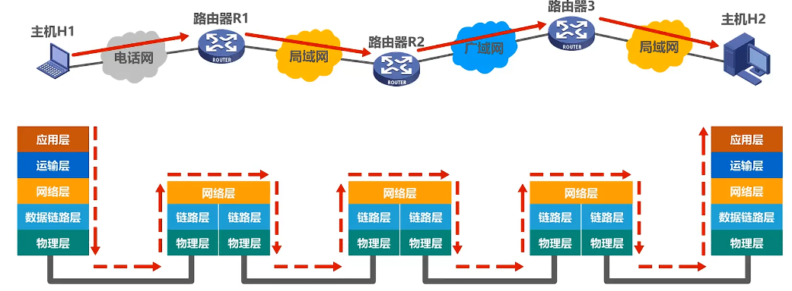
<!-- image-source: https://cdn.nlark.com/yuque/0/2026/png/67474974/1778745267404-c02525e2-9ca3-47ba-9676-f49faab552ad.png -->

如图所示，主机H1给主机H2发送数据，中间要经过三个路由器和电话网、局域网以及广域网等多种网络。从五层协议原理体系结构的角度来看，主机应具有体系结构中的各个层次，而路由器只需具有体系结构中的下面三层，各设备通过物理层下面的传输媒体进行互联。

**当主机H1向H2发送数据时：**

1.主机H1将待发送的数据**逐层封装**后，通过**物理层**将构成数据包的各比特**转换为电信号**，发送到传输媒体。

2.数据包进入路由器后，**由下往上逐层解封**到网络层。**路由器**根据数据包的目的、网络地址和自身转发表**确定数据包的转发端口**，然后从网络层**向下逐层封装数据包**，并通过物理层将数据包发送到传输媒体。

3.数据包最终到达主机H2时，还要**由下往上逐层解封**，最终解封出主机H1所发送的数据。


当专门研究数据链路层的问题时，在大多数情况下，可以只关心数据链路层，而不考虑网络体系结构的其他各层。换句话说，以想象数据包只在数据链路层从左向右沿水平方向传送。从数据链路层来看主机H1到H2的通信可以看成是在四段不同的链路上的通信组成的。
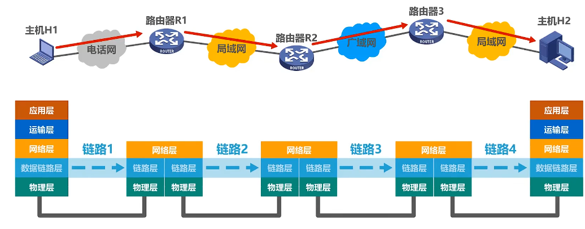
<!-- image-source: https://cdn.nlark.com/yuque/0/2026/png/67474974/1778745638309-59694675-5212-4872-8671-ef6af3e3a3df.png -->

### 2.基本概念
**链路（Link）**：就是从一个节点到相邻节点的一段物理线路，中间没有任何其他的交换节点。

**数据链路（Data Link）**：把实现通信协议（控制数据的传输）的硬件和软件加到链路上，就构成了数据链路。

**帧**：在数据链路层上传输的数据包又称为帧，也就是说数据链路层以帧为单位传输和处理数据。、


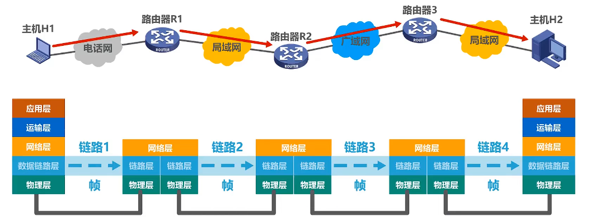
<!-- image-source: https://cdn.nlark.com/yuque/0/2026/png/67474974/1778745992173-1c330e1b-a724-4a36-b3a5-428d88fa484f.png -->

### 3.数据链路层的三个重要问题
**数据链路层的三个重要问题：封装成帧、差错检测、可靠传输。**

#### 封装成帧
以以太网MAC帧为例


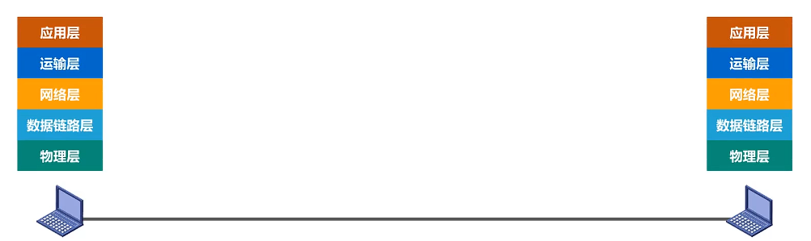
<!-- image-source: https://cdn.nlark.com/yuque/0/2026/png/67474974/1778746121288-8cac6ba5-ea24-475c-8e16-24f5e6ef4886.png -->

两台主机都会对所发送或接收的数据包进行五个层次的封装和解封

1.发送方将待发送的数据通过应用层**封装成为应用层协议数据单元**，然后交付给运输层。


<!-- image-source: https://cdn.nlark.com/yuque/0/2026/png/67474974/1778746183985-d98a02f1-c843-44cd-926b-71cb77e9e20d.png -->

2.运输层为其**添加运输层协议首部**，使之成为运输层协议数据单元，然后交付给网络层。


<!-- image-source: https://cdn.nlark.com/yuque/0/2026/png/67474974/1778746209517-45b075f2-bb98-4650-9d76-96e2e769ad46.png -->

3.网络层为其**添加网络层协议首部**，使之成为网络层协议数据单元，然后交付给数据链路层。


<!-- image-source: https://cdn.nlark.com/yuque/0/2026/png/67474974/1778746228121-a96e3bff-b393-4590-b6eb-7dd7e721e872.png -->

4.数据链路层给网络层协议数据单元**添加一个数据链路层协议首部**，简称为帧头，还要给其**添加一个帧尾**。我们将数据链路层给网络层交付的协议数据单元**添加帧头和帧尾的操作称为封装成帧**。


<!-- image-source: https://cdn.nlark.com/yuque/0/2026/png/67474974/1778746258186-f726f047-3eff-484a-abd8-426ca983e046.png -->

添加帧头和帧尾的目的都是为了在链路上以帧为单元来传送数据，也就是为了实现数据链路层本身的功能。


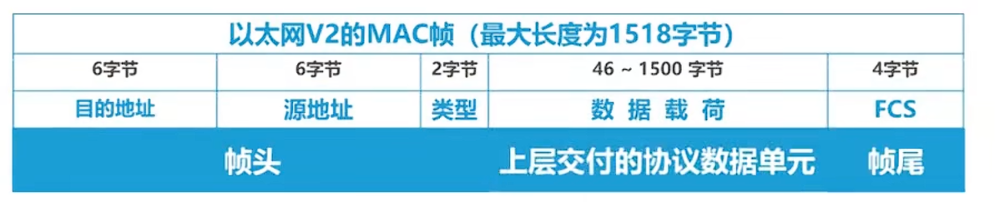
<!-- image-source: https://cdn.nlark.com/yuque/0/2026/png/67474974/1778746447488-2b02ace4-5a9d-4814-87a9-d2d0298a9188.png -->

| 字段名称 | 长度 | 核心含义与作用（精炼版） |
| :--- | :---: | :--- |
| **目的 MAC 地址** | 6 字节 | **收件人**。接收方网卡的物理地址。若全为 `1`（即 `FF:FF:FF:FF:FF:FF`），则表示**广播帧**，局域网内所有网卡都会接收。 |
| **源 MAC 地址** | 6 字节 | **寄件人**。发送方网卡的物理地址。 |
| **类型 (Type)** | 2 字节 | **指路牌**。标识上层协议（如 `0x0800` 代表 IPv4），指导接收方将数据向哪个协议交付。 |
| **数据 (Data)** | 46 ~ 1500   字节 | **货物**。上层交下来的载荷（如 IP 数据报）。   ⚠️ **注意**：如果上层数据小于 46 字节，必须**强行填充（Padding）** 垃圾数据到 46 字节，以保证整个 MAC 帧满足 **64 字节**的最小帧长要求（用于 CSMA/CD 冲突检测）。 |
| **FCS** | 4 字节 | **验钞机**。帧检验序列（Frame Check Sequence），通常是 CRC 循环冗余校验码。接收方用它检测帧在传输中是否出错，**出错则直接默默丢弃**。 |


_(注：在物理层发送时，帧的前面还会加上 8 字节的__**前导码**__和*帧开始定界符_，用于唤醒接收方和时钟同步，但这 8 字节通常不计入 MAC 帧的有效长度中。)

**“类型”字段**

+ **长度**：2 字节（16 bit）。
+ **核心作用**：当接收方网卡收到 MAC 帧并剥去首部和尾部后，它需要知道剩下的数据该交给操作系统的**哪个上层协议**去处理。类型字段就是用来标识上层协议的。

**常见的“类型”值（十六进制）：**

| 类型字段的值 | 代表的上层协议 | 含义说明 |
| :--- | :--- | :--- |
| `**0x0800**` | **IPv4** | 载荷是 IPv4 数据报（互联网中最最常见）。 |
| `**0x0806**` | **ARP** | 载荷是 ARP 请求或应答报文（用于查询 MAC 地址）。 |
| `**0x86DD**` | **IPv6** | 载荷是 IPv6 数据报。 |
| `**0x8100**` | **802.1Q (VLAN)** | 这是一个带有虚拟局域网（VLAN）标签的帧。 |


#### 差错检测
发送方将封装好的针通过物理层发送到传输媒体帧，在传输过程中遭遇干扰后可能会出现误码，也就是比特0可能变成了比特1


<!-- image-source: https://cdn.nlark.com/yuque/0/2026/png/67474974/1778746495173-262f10dd-d892-4427-bd94-4033e53da8d3.png -->

接收方主机可以通过检错码来发现帧在传输过程中的出现了误码。发送方在发送帧之前，基于待发送的数据和检错算法计算出检错码，并将其封装在帧尾。例如以太网版本2的MAC帧的帧尾就是4字节的帧检验序列FCS字段，要写入该字段的内容，也就是所说的检错码。


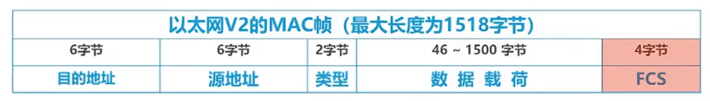
<!-- image-source: https://cdn.nlark.com/yuque/0/2026/png/67474974/1778746700224-8c26ec97-993e-4f1e-a789-e48a66dab822.png -->

接收方主机收到帧后，通过检错码和检错算法就可以判断出帧在传输过程中是否出现了误码。


<!-- image-source: https://cdn.nlark.com/yuque/0/2026/png/67474974/1778746828343-2a4ee8ac-8ec1-4be1-b35e-c7a3c07a770c.png -->

#### 可靠传输
接收方主机收到有误码的帧后，是不会接受该帧的将其丢弃。如果数据链路层向其上层提供的是不可靠服务，那么丢弃就丢弃了，不会再有更多措施。如果数据链路层向其上层提供的是可靠服务，那么就还需要其他措施来确保接收方主机还可以重新收到被丢弃的这个真的正确副本。

尽管误码是不能完全避免的，但若能实现发送方发送什么，接收方最终都能收到什么，就称为可靠传输。

---

封装成帧、差错检测、可靠传输是数据链路层中最基本、最重要的问题。需要说明的是，我们在介绍这三个问题的时候，使用的是点对点信道的数据链路层来举例的。

### 4.使用广播信道的数据链路层
对于使用广播信道的数据链路层，除了包含封装成帧、差错检测、可靠传输，还有一些其他需要解决的问题。

#### 编址问题

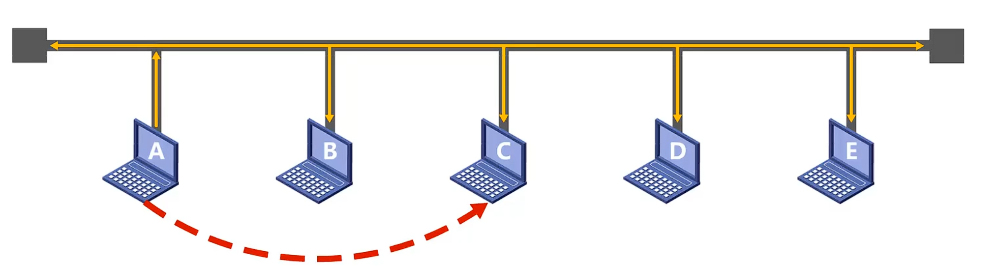
<!-- image-source: https://cdn.nlark.com/yuque/0/2026/png/67474974/1778747163377-31deb0b9-2724-41ec-8e17-682f107d809c.png -->

如图所示，主机A B C D E通过一根总线进行互联，主机A要给主机C发送帧，代表帧的信号会通过总线传输到总线上的其他各主机。那么主机B D E如何知道所收到的真不是发送给他们的，而主机C又如何知道所收到的帧恰恰是发送给自己的呢？

通过地址或者说编址的问题，也就是将帧的目的地址添加在帧中一起传输。例如这是以太网版本2的MAC帧格式，其首部中的三个字段中有两个字段和地址相关，一个是目的地址字段，另一个是原地址字段。


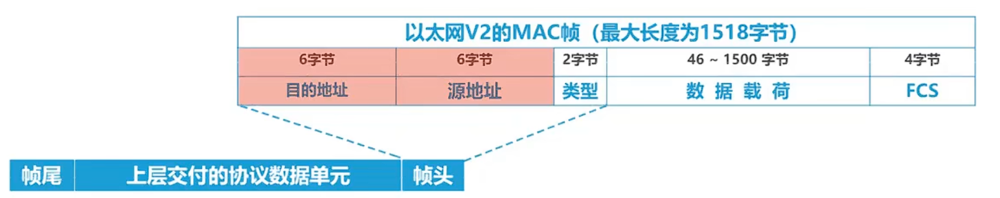
<!-- image-source: https://cdn.nlark.com/yuque/0/2026/png/67474974/1778747215330-8c5f7aac-a310-477f-a2c6-5f3614e1bfa0.png -->

#### 碰撞检测
当总线上多台主机同时使用总线来传输真实传输信号就会产生碰撞，这是采用广播信道的共享式局域网不可避免的。以太网采用的协调方法是使用一种特殊的协议CSMA/CD，也就是载波监听多点接入/碰撞检测。


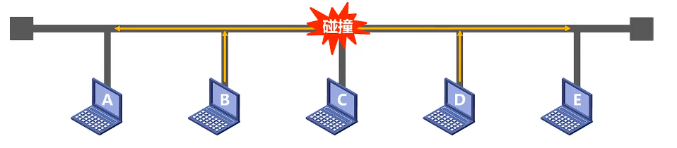
<!-- image-source: https://cdn.nlark.com/yuque/0/2026/png/67474974/1778747365355-5486a471-2e1a-4be5-8999-2d13d3fdbf87.png -->

### 5.交换式局域网
随着技术的发展，交换技术的成熟和成本的降低，具有更高性能的使用点对点链路和链路层交换机的交换式局域网，在有线领域已完全取代了共享式局域网。


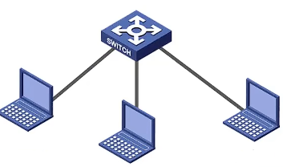
<!-- image-source: https://cdn.nlark.com/yuque/0/2026/png/67474974/1778747492864-01627fcc-0181-4dc2-b06c-2fc4bc813c70.png -->

### 6.无线局域网

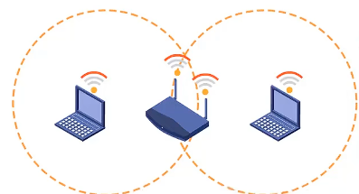
<!-- image-source: https://cdn.nlark.com/yuque/0/2026/png/67474974/1778747571033-22d98410-70e9-4f7c-b1a7-9ccb9de13592.png -->

由于无线信道的广播天性，无线局域网仍然使用的是共享信道技术。例如802.11局域网采用的媒体接入控制协议是CSMA/CA，也就是在载波监听多点接入/碰撞避免。 

### 7.数据链路层的协议
| 数据单元（帧） | 协议常用简称 | 协议标准全称 (中英文) | 制定机构 | 核心特征与帧结构特点 |
| :--- | :--- | :--- | :--- | :--- |
| **PPP 帧** | PPP | **Point-to-Point Protocol**   (**点对点协议**) | IETF   (RFC 1661) | **无 MAC 地址**。有明确的帧定界符（`0x7E`），需要字符/零比特填充来实现透明传输。 |
| **以太网 MAC 帧** | 以太网   (Ethernet) | **IEEE 802.3 Standard for Ethernet**   (**IEEE 802.3 以太网标准 / 带有 CSMA/CD 的局域网标准**) | IEEE   (802.3委员会) | **有 2 个 MAC 地址**（源和目的）。有最小帧长限制（64字节），无结束标志，靠物理层信号或长度字段定界。_(注：实际中最常用的是 DIX Ethernet V2 帧格式)_ |
| **Wi-Fi MAC 帧** | Wi-Fi | **IEEE 802.11 Wireless LAN MAC and PHY Specifications**   (**IEEE 802.11 无线局域网 MAC 和物理层规范**) | IEEE   (802.11委员会) | **最多有 4 个 MAC 地址**（用于无线基站到有线网络的桥接转发）。包含复杂的帧控制字段（如重试位、电源管理），有链路层 ACK 机制。 |


### 8.数据链路层中比较重要的问题
1. 数据链路层在网络体系结构中的地位
2. 使用点对点信道的数据链路层

三个重要问题：封装成帧，差错检测，可靠传输

3. 使用广播信道的数据链路层

共享 共享式以太网的媒体接入控制协议CSMA/DA

802.11局域网的媒体接入控制协议CSMA/CA

4. 数据链路层的互连设备

网桥和交换机的工作原理

集线器 (物理层互连设备）与交换机的区别

---

## 二、封装成帧
### 1.**封装成帧**
**封装成帧**：指数据链路层给上层（网络层）交付下来的协议数据单元添加帧头和帧尾，使之成为帧。

+ 在帧头和帧尾中包含有重要的控制信息。


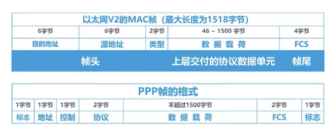
<!-- image-source: https://cdn.nlark.com/yuque/0/2026/png/67474974/1778943140001-5cde1f75-0bff-49c6-aa67-ffa7c511c888.png -->


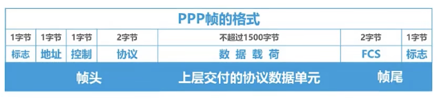
<!-- image-source: https://cdn.nlark.com/yuque/0/2026/png/67474974/1778943293940-2dedb734-d994-4a33-9f0e-aa1e99058c80.png -->

+ 帧头和帧尾的作用之一就是**帧定界**（用于使接收方的数据链路层从物理层交付的比特流中提取出一个个的帧）

需要说明的是，并**不是每一种数据链路层协议的帧都包含有帧定界标志**（以太网MAC帧没有帧定界，PPP帧有）。例如，以太网V2的MAC帧在帧头和帧尾中并没有包含帧定界标志。接收方从物理层交付的比特流中提取出一个个的以太网帧依靠前导码，以太网的数据链路层封装好MAC帧后将其交付给物理层。**物理层会在MAC帧前面添加8字节的前导码**，然后再将比特流转换成电信号发送。前导码中的前7个字节为前同步码，作用是使接收方的时钟同步，之后的1字节为帧开始定界符表明其后面紧跟着的就是MAC帧。


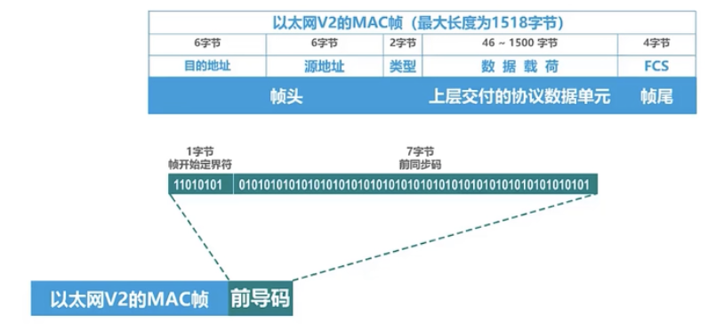
<!-- image-source: https://cdn.nlark.com/yuque/0/2026/png/67474974/1778990752741-e6aa959a-727c-424f-b1a5-8bfb13141729.png -->

另外，**以太网还规定了帧间间隔时间为96比特的发送时间**，因此MAC帧并不需要帧结束定界符。


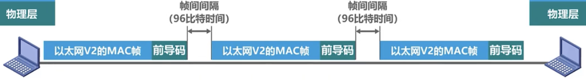
<!-- image-source: https://cdn.nlark.com/yuque/0/2026/png/67474974/1778990880610-1f768886-85ea-4692-a2d1-a3839ac1a92a.png -->

> 以太网 MAC 帧根本没有特定的结束标志位（它靠物理层电信号的消失，或者读取帧头部的“长度字段”来知道帧在哪里结束）。既然没有固定的结束标志，就不存在“数据和结束标志冲突”的问题。此外，以太网物理层使用的“曼彻斯特编码”自带时钟跳变，不会出现长串 0 或 1 导致接收方失步的问题，所以以太网 MAC 层不需要做任何填充。
>

### 2.透明传输
**透明传输：数据链路层对上层交付的传输数据并没有任何限制**，就好像数据链路层不存在一样。

**为什么需要透明传输？**

数据链路层在组帧（PPP帧）时，会用**特殊的标志或字符**来标识帧的开始和结束（类似起始密码子和终止密码子）。


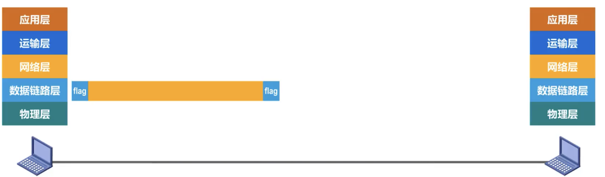
<!-- image-source: https://cdn.nlark.com/yuque/0/2026/png/67474974/1782471870444-3c657594-433a-4d16-b7c0-4e55d5cac1e9.png -->

如果**数据部分恰好出现了这个标志**，接收方（接收方的数据链路层）就会误以为帧提前结束，导致传输错误。这就是“不透明”的问题。


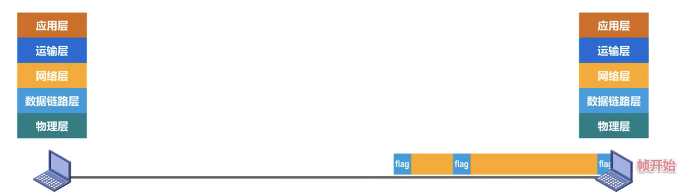
<!-- image-source: https://cdn.nlark.com/yuque/0/2026/png/67474974/1782472016919-0657d275-bc2f-46f8-b2b6-92a1529fe93f.png -->


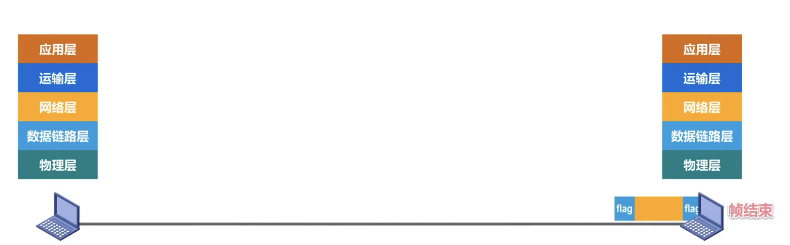
<!-- image-source: https://cdn.nlark.com/yuque/0/2026/png/67474974/1782472043145-c6733f4b-5b7c-49d3-ac26-5180e3b03630.png -->

**如何实现透明传输？**

**1. 字节填充（字符填充）**

用于**面向字符**的协议。

+ **做法**：在数据中出现的特殊控制字符（比如帧定界符 `SOH`、`EOT`、转义字符 `ESC`）前，**插入一个转义字符** `ESC`。


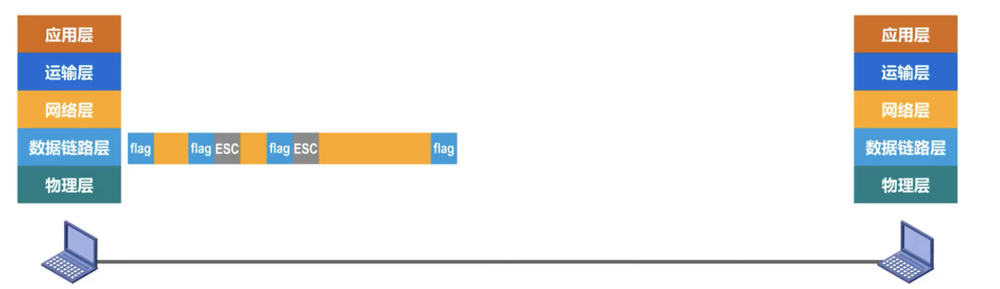
<!-- image-source: https://cdn.nlark.com/yuque/0/2026/png/67474974/1782472089039-078237fe-dde9-44a0-94d3-05824d3a901b.png -->

- 注：转义字符是一种特殊的控制字符，其长度为一个字节，十进制值为**27**，十六进制值为 **0x1B**。

+ 接收方收到后，会去掉这个插入的 `ESC`，并把跟在后面的字符作为普通数据，不解释为控制命令。
+ **举例**：如果数据中有一个 `ESC`，就把它变成 `ESC ESC`；如果数据中有帧开始/结束符 `FLAG`，就变成 `ESC FLAG`。这样接收方就能正确还原。


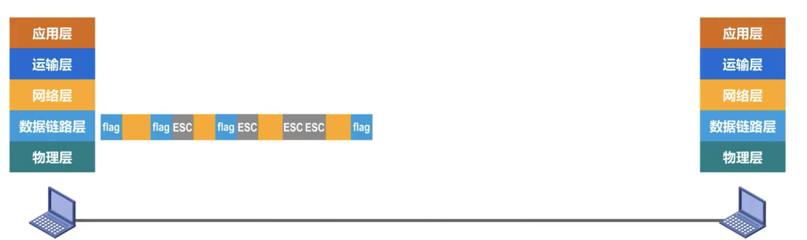
<!-- image-source: https://cdn.nlark.com/yuque/0/2026/png/67474974/1782472167141-9ec1eb7d-3261-448e-be52-fd16fc9ca8cf.png -->

**2. 比特填充（零比特填充）**

用于**面向比特**的协议。


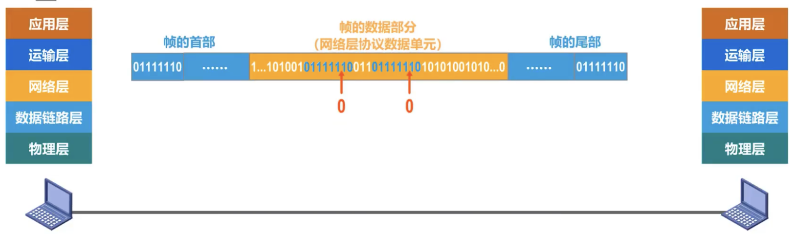
<!-- image-source: https://cdn.nlark.com/yuque/0/2026/png/67474974/1782472271897-332e6177-8b6b-4663-b73e-708a3c5e7649.png -->

+ **做法**：发送方扫描数据部分，只要发现**5 个连续的** `1`，就在其后面强制插入一个 `0`。这样数据中永远不会出现 6 个或更多连续的 `1`，也就**不会与标志** `01111110` **（6个1）混淆**。
+ 接收方执行相反操作：看到 `111110` 时，就删掉紧随的 `0`，恢复原始数据。
+ **效果**：数据中的比特组合完全不受限制，可以包含任意比特序列。

#### 例题
**【2013年 题37】** HDLC协议对 `0111110001111110` 组帧后对应的比特串为  **A**

A. `011111000011111010`  
B. `01111100011111010111110`  
C. `01111100011111010`  
D. `01111100011111001111101`  

**【解析】**  
	高级数据链路控制协议 HDLC 采用帧头和帧尾中的标志字段作为帧定界符，其值为 `01111110`。HDLC 为了实现“透明传输”，采用“零比特填充法”：每遇到连续的 5 个 `1`，就在其后插入一个比特 `0`。  

对原始比特串 `0111110001111110` 逐位扫描：  

+ `011111` → 出现 5 个连续 `1`（第 2~6 位），在第 5 个 `1` 后插入 `0`，得到 `0111110`，此时比特串变为`01111100001111110`
+ `011111` → 出现 5 个连续 `1`（第 11~15 位），在第 5 个 `1` 后插入 `0`，得到 `0111110`，此时比特串变为`011111000011111010`

### 3.提高帧的传输效率
+ 为了提高帧的传输效率，应当使**帧的数据部分的长度尽可能大一些**。
    - 因为仅从数据链路层来看，帧的数据部分才是真正要传输的数据，帧头和帧尾是为了实现数据链路层功能而额外添加的。
+ 考虑到差错控制等多种因素，每一种数据链路层协议都规定了帧的数据部分的长度上限，称为**最大传送单元MTU**（**M**aximum **T**ransfer **U**nit）。

---

## 三、差错检测
### 1.差错检测
**比特差错**:实际的通信链路都不是理想的，比特在传输过程中可能会产生差错：1可能变成0，而0也可能变成1，这称为**比特差错**。

原因：比特流在传输过程中由于受到各种干扰，就可能会出现比特差错，或称为误码。

**误码率**：在一段时间内，传输错误的比特占所传输比特总数的比率称为**误码率BER**（**B**it **E**rror **R**ate）。

**Q：接收方的数据链路层又是通过怎样的方法才能知道呢？**

使用**差错检测码**来检测数据在传输过程中是否产生了比特差错，是数据链路层所要解决的重要问题之一。

1.**以太网版V2的MAC帧**格式，其**帧尾**中包含了一个长度为四字节的帧检验序列FCS字段，其作用就是让接收方的数据链路层检查帧在传输过程中是否产生了误码。


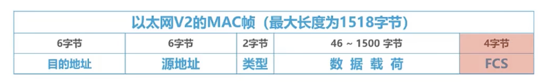
<!-- image-source: https://cdn.nlark.com/yuque/0/2026/png/67474974/1778994618423-1fb01bbc-927c-4f24-8ece-9a9b80113faf.png -->

2.**点对点协议PPP的帧**格式，其**帧尾**中也包含了一个长度为2字节的帧检验序列FCS字段。其作用也是让接收方的数据链路层检查正在传输过程中是否产生了误码率。


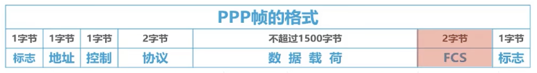
<!-- image-source: https://cdn.nlark.com/yuque/0/2026/png/67474974/1778994809511-6839b25b-5086-4075-a98f-3916c15ec666.png -->

### 2.奇偶校验
在待发送的数据后面**添加1位奇偶校验位**（1或0），使整个数据（包括所添加的校验位在内）中的 **"1"的个数**为奇数（奇校验）或为偶数（偶校验）。

+ **偶校验**：让“1”的总个数是偶数。如果数据中“1”的个数已是偶数，校验位补0；否则补1。
+ **奇校验**：让“1”的总个数是奇数。如果数据中“1”的个数已是奇数，校验位补0；否则补1。

**具体例子**

假设我们要发送一个 **7 位的 ASCII 字符** `‘S’` ，它的二进制是 `1010011`（7位里有4个“1”，偶数）。数据链路层在组帧时，如果决定对这个字符的数据部分使用偶校验，会这样处理：

**1. 发送方加校验位**

+ 当前数据位有 4 个“1”，已经是偶数。
+ 为了保持偶数，**校验位填** `0`。
+ 实际传输的 8 位数据变成：`1010011 0` （最后一位是校验位）。

**2. 传输中出错**  
假设在链路上受到干扰，其中一位翻转了，比如变成了 `1010010 0` （第三位从1变0，现在“1”的个数变成3个，奇数）。

**3. 接收方检查**  
接收方把收到的 8 位当成一个整体，统计“1”的个数，得到 3，是奇数。而它知道约定是偶校验，于是立刻判断：**这一组数据在传输中出错了**。

**奇偶校验局限性**

如果有**奇数个位发生误码**，则奇偶性会发生变化（也就是奇变偶或者是偶变奇），这样就**可以检查出误码**。

如果有**偶数个位发生误码**，则奇偶性不会发生变化（每个误码对奇偶性的影响相互抵消了），这样就**无法检查出误码（漏检）**。

---

由于奇偶校验的漏检率比较高，因此计算机网络的数据链路层一般不会采用这种检测方法。

### 3.循环冗余校验CRC
循环冗余校验CRC（**C**yclic **R**edundancy **C**heck），是一种具有很强检测能力的检测方法，漏检率极低。

#### 步骤
**（1）把数据表示为多项式**

一个二进制串 `101001` 可以看作多项式 $1⋅x^5+0⋅x^4+1⋅x^3+0⋅x^2+0⋅x^1+1⋅x^0$比特位对应系数，运算在模2规则下（加法不进位，减法不退位，等价于异或）。

**（2）收发双方约定一个生成多项式**$G(x)$

算法要求CRC多项式必须包含最低次项。这是一个固定的除数，如 `1101` 对应 $x^3+x^2+1⋅x^0$。生成多项式的最高次幂$r$决定了余数的长度（也就是冗余码的位数）。

**（3）发送方的操作：计算冗余码并附加**

发送方基于待发送的数据和生成多项式计算出差错检测码（**冗余码**），并将其添加到待传输数据的后面一起传输。

+ 设数据有$k$位，生成多项式$G(x)$的最高次幂为$r$。
+ 在数据后面**添上**$r$**个零**，得到$k+r$__位串，把它当成被除数。
+ 用模2除法，除以生成多项式对应的二进制串，得到$r$位的**余数**。
+ 这个余数就是帧检验序列 FCS，把它替换掉刚才添加的$r$个零，附加在原始数据后面，构成最终的发送帧。


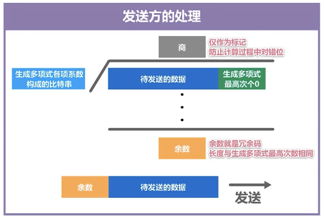
<!-- image-source: https://cdn.nlark.com/yuque/0/2026/png/67474974/1778996619109-bbe3b8d4-398d-4304-83bc-f6dca77861cd.png -->

注：余数就是所计算出的冗余码，将其添加到待发送数据的后面一起发送。冗余码的长度与生成多项式最高次数相同，而商仅作为标记，防止计算过程中对错位。

**（4）接收方操作：检验**

接收方通过生成多项式来计算收到的数据是否产生了误码。

+ 把收到的整个帧（数据 + FCS）作为被除数，用同一个生成多项式做模2除法。
+ 如果余数为 **0**，则判定传输**无错**，接受数据；如果余数**不为 0**，则判定传输**出错**，丢弃该帧。


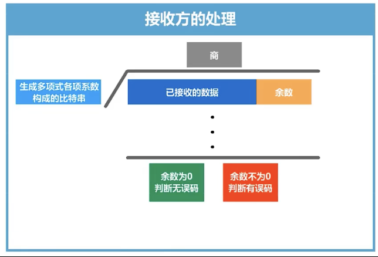
<!-- image-source: https://cdn.nlark.com/yuque/0/2026/png/67474974/1778997247570-d3d1c808-3c75-4cd8-bdd3-68cd90e98584.png -->

#### 常用的生成多项式标准
数据链路层协议中使用的生成多项式是经过精心设计和国际标准化的，保证极强的检错能力：

+ **CRC-16**：$x^{16}+x^{15}+x^2+1$（如 HDLC、PPP 中常用）
+ **CRC-CCITT**：$x^{16}+x^{12}+x^5+1$__
+ **CRC-32**：$x^{32}+x^{26}+x^{23}+x^{22}+x^{16}+x^{12}+x^{11}+x^{10}+x^8+x^7+x^5+x^4+x^2+x+1$（**以太网**使用的标准，放在帧尾的 FCS 字段中）

#### 练习
【循环冗余校验CRC举例】待发送的信息为 `101001`，生成多项式为 $G(x)=x^3+x^2+1$。请计算校验码（余数）。

**步骤1：构造被除数**  
	生成多项式的最高次数为$3$，因此在待发送信息后面添加$3$个$0$，得到被除数：

`101001000`

**步骤2：构造除数**  
	生成多项式$G(x)=x^3+x^2+1$的系数（从高次到低次）为：$x^3$系数$1$，$x^2$系数$1$，$x^1$系数$0$，$x^0$系数 1，即比特串：

`1101`

**步骤3：做模2除法（异或运算）**


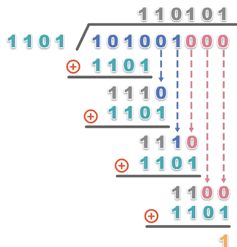
<!-- image-source: https://cdn.nlark.com/yuque/0/2026/png/67474974/1778998783928-ece18f55-08c0-4627-bb85-b96fb29b52ff.png -->

**步骤4：检查余数**

检查余数。余数的位数应与生成多项式最高次数相同，如果位数不够，则在余数前补零来凑足位数。

因此得到余数`001`

将余数添加到待发送信息的后面得到`101001001`。

---

【循环冗余校验CRC举例】接收到的信息为101101001，生成多项式为$G(x)=x^3+x^2+1$，判断传输是否误码？

**步骤1：构造被除数**  
接收到的信息就是被除数：`101101001`

**步骤2：构造除数**  
生成多项式各项系数构成的比特串：  
$G(x)=x^3+x^2+1$→ 系数（高次到低次）：1, 1, 0, 1→除数 `1101`

**步骤3：做“除法”**（模2除法，异或运算）


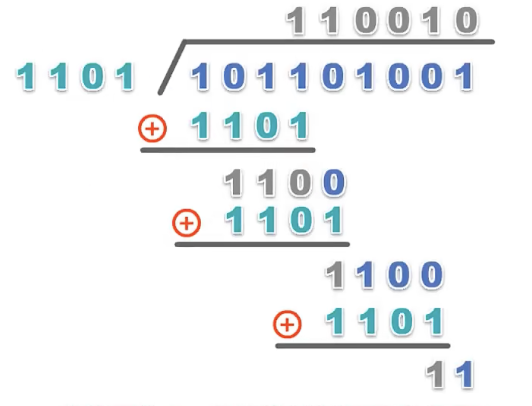
<!-- image-source: https://cdn.nlark.com/yuque/0/2026/png/67474974/1778999028994-7372ccfb-5ba6-4b03-8419-b732bc654b94.png -->

**步骤4：检查余数**  
余数为0 → 可认为传输过程无误码；  
余数不为0 → 可认为传输过程产生误码。

因此本题答案：传输产生误码

#### 注意
+ **检错码**只能检测出帧在传输过程中出现了差错，但并不能定位错误，因此**无法纠正错误**。
+ 要想纠正传输中的差错，可以使用冗余信息更多的**纠错码**进行**前向纠错**。但纠错码的开销比较大，在**计算机网络中较少使用**
+ 循环冗余校验**CRC**有很好的检测能力（**漏检率非常低**）。虽然计算比较复杂，但非常**易于用硬件来实现**，因此被**广泛应用于数据链路层**。
+ 在计算机网络中通常采用**检错重传方式来纠正传输中的差错**，**或者仅仅是丢弃检测到差错的帧**。这取决于数据链路层向其上层提供的是可靠传输服务还是不可靠传输服务。

---

## 四、可靠传输
### 1.基本概念
由上一节可知，使用**差错检测技术**（循环冗余校验CRC），接收方的数据链路层就可以检测出帧在传输过程中是否产生了**误码**（比特错误）。那么接下来该如何处理呢？这取决于数据链路层向其上层提供的服务类型。

+ 提供的是不可靠传输服务：**仅仅丢弃有误码的帧**，其他什么也不做。
+ 提供的是可靠传输服务：想办法实现发**送端发送什么，接收端就收到什么**。

一般情况下，**有线链路**的误码率比较低，为了减少开销，并**不要求数据链路层**向上提供**可靠**传输服务。即使出现了误码，可靠传输的问题由其上层处理。


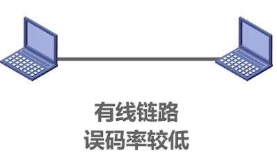
<!-- image-source: https://cdn.nlark.com/yuque/0/2026/png/67474974/1779002801867-86c3cb56-17ca-484f-a89e-74053b872715.png -->

**无线链路**易受到干扰，误码率比较高，因此要求**数据链路层**必须向上层提供**可靠**传输服务。


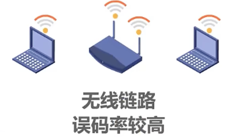
<!-- image-source: https://cdn.nlark.com/yuque/0/2026/png/67474974/1779002815316-d4e712d9-298b-43f6-bd90-f233e776e3a0.png -->

### 2.传输差错
+ **比特差错**只是传输差错中的一种
+ 从整个计算机网络体系结构来看，传输差错还包括**分组丢失**、**分组失序**以及**分组重复**（请注意，此处将真的称呼改为了分组。这意味着传输差错不仅仅局限于数据链路层的比特差错）。
    - 分组丢失：主机H6给主机H2发送的分组到达了路由器R5，由于此时R5的输入队列快满了，R5根据自己的分组丢弃策略将该分组丢弃。
    - 分组失序：主机H6依次给主机H2发送了三个分组，但他们并未按照发送顺序依次到达H2，也就是说最先发送的分组未必最先到达。
    - 分组重复：主机H6给主机H2发送的分组由于某些原因在网络中滞留了，没有及时到达H2这可能造成H6对该分组的超时重发，重发的分组到达H21段时间后，滞留在网络中的那个分组又到达了H2，这就会造成分组重复的传输差错。


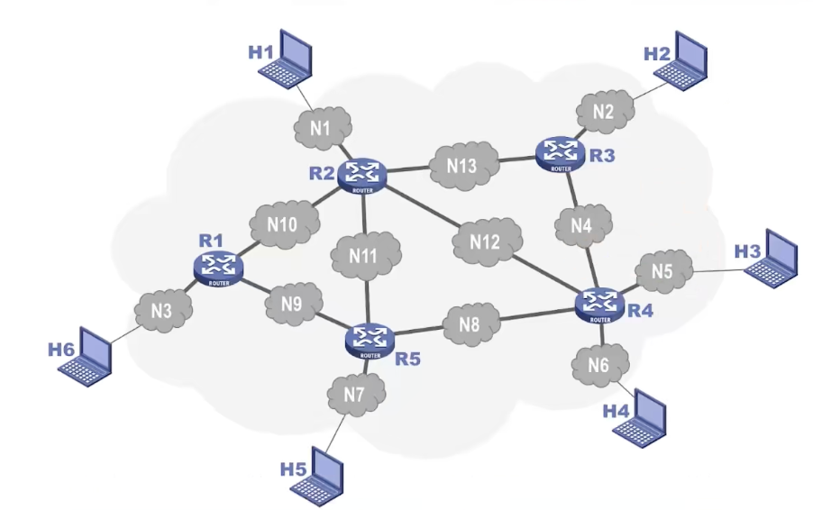
<!-- image-source: https://cdn.nlark.com/yuque/0/2026/png/67474974/1779003204359-896173c7-4c38-4412-9efc-57b99718c5b7.png -->

+ 分组丢失、分组失序以及分组重复。这些传输差错一般不会出现在数据链路层，而会出现在其上层。
+ **可靠传输服务并不仅局限于数据链路层**，其他各层均可选择实现可靠传输服务。


<!-- image-source: https://cdn.nlark.com/yuque/0/2026/png/67474974/1779003362088-d1a4b22e-9265-4647-9436-50250eb7a9cc.png -->

+ 可靠传输的实现比较复杂，开销也就比较大，是否使用可靠传输取决于应用需求。

### 3.可靠传输的实现机制
可靠传输的实现机制：停止-等待协议（SW：**S**top and **W**ait）、回退N帧协议（GBN：**G**o-**B**ack-**N**）、选择重传协议（SR：**S**elective **R**equest）。

这三种可靠传输实现机制的基本原理并不仅限于数据链路层，可以应用到计算机网络体系结构的各层协议中。

#### （1）停止-等待协议
在数据链路层，为了在不可靠的物理链路上实现可靠传输，常采用**停止-等待**机制，配合**确认（ACK）** 与**否认（NAK）** 分组来控制重传。


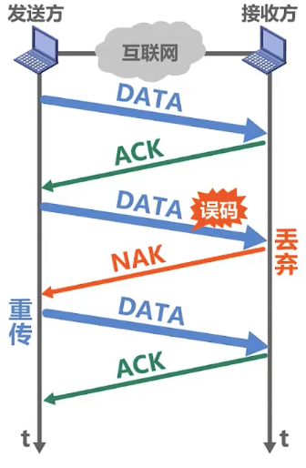
<!-- image-source: https://cdn.nlark.com/yuque/0/2026/png/67474974/1779003912797-ce22e49f-73e8-4f23-b62d-ae8728df524a.png -->

##### 可能会出现的情况
###### a. 无差错情况
+ 发送方发出一个数据分组后，**立即停止**发送下一个分组，进入等待状态。
+ 接收方收到数据分组，进行差错检测（如 CRC 校验）：
    - 若**无误码**，则接受该分组，并回送一个**确认分组 ACK**（Acknowledge character，确认字符，表示数据已正确接收）。
+ 发送方收到 ACK 后，才将该分组从缓存中清除，并**启动下一个分组的发送**。

---

###### b. 出现误码情况
+ 接收方检测到数据分组**存在误码**：
    - 直接**丢弃**该分组，并回送一个**否认分组 NAK**（Negative Acknowledgment，否认字符）。
+ 发送方收到 NAK 后，得知刚才的分组传输出错，**立即重传**该分组，并再次等待确认。

---

###### c. 缓存管理与可靠传输
+ 发送方每发出一个分组，**不能立即删除缓存**，必须保留副本以备重传。
+ 只有收到对应分组的 ACK 后，才可将其从缓存中移除。
+ 通过这种“**发送—停止—等待确认/否认—决定重传或发下一个**”的简单循环，无论传输过程中有无差错，接收方最终都能正确收到数据，从而实现**可靠传输**。

---

###### d. 发送方数据分组丢失 —— 超时重传
实际传输中，数据分组可能在链路上完全丢失。尽管对于点对点的数据链路层信道，帧丢失的概率较低，但在复杂的网络环境（如跨越多个路由器）中却常有发生。一旦分组丢失：

+ 接收方没有任何数据可收，自然**不会发送 ACK 或 NAK**。
+ 发送方若不做额外处理，将**无限期等待**反馈，造成死锁。

为此，发送方每发出一个分组，便启动一个**超时计时器**。若计时器到期（即超过设定的**重传时间**）仍未收到任何反馈，发送方就认为分组已丢失，并**自动重传**该分组，这一过程称为**超时重传**。

**重传时间的设置**：通常选择“略大于”从发送方到接收方的平均往返时间（RTT），以避免过早重传导致不必要的重复，或过晚重传降低效率。

超时重传的典型流程：

+ 发送方超时后重传原分组，接收方正确收到后回送 ACK。
+ 发送方收到 ACK 后，停止计时，清除该分组，接着发送下一个分组。


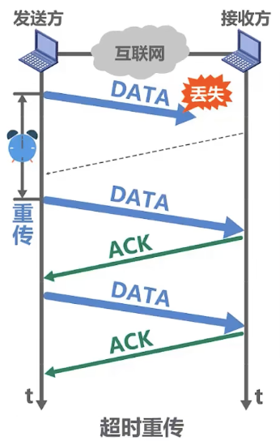
<!-- image-source: https://cdn.nlark.com/yuque/0/2026/png/67474974/1779005110650-411fd111-bb44-46c5-a6af-0a1d32cde8dd.png -->

###### e. 确认或否认分组丢失 —— 序号与重复判断
不仅数据分组可能丢失，接收方回送的确认分组（ACK）或否认分组（NAK）同样可能在传输中丢失，这会引发新的问题：

+ 发送方发出一个数据分组，接收方正确接收后回送 ACK，但该 **ACK 在传输中丢失**。
+ 发送方因迟迟收不到反馈而**超时重传**原分组。
+ 接收方会再次收到同一数据分组，此时它必须判断：这究竟是**新分组**还是**重复的旧分组**。

为避免分组重复导致的传输错误，必须给每个数据分组**带上序号**。例如，发送方首次发送的分组序号为 `0`。

> **为何 1 比特序号就足够？**  
停止-等待协议中，发送方每发一个分组就停下来等待，只有确认当前分组已正确交付后，才会发送下一个。因此，只需区分“当前分组”和“上一个分组”即可，用 1 个比特交替编号（`0` → `1` → `0` → `1` …）完全满足需求。
>

接收方依据序号做出判断：

+ 若收到的分组序号**与上次不同**，则是**新分组**：接受并回送 ACK。
+ 若收到的分组序号**与上次相同**，则是**重复分组**：**直接丢弃**，但仍须回送 ACK（否则发送方会继续超时重传）。

**流程示例：**

+ 发送方发 `0` 号分组，接收方正确收到，回送 ACK，但 ACK 丢失。
+ 发送方超时，重传 `0` 号分组。
+ 接收方发现序号仍为 `0`，判定为重复，**丢弃数据但重发 ACK**。
+ 发送方收到 ACK 后，清除 `0` 号分组，发送 `1` 号新分组。
+ 接收方正确收到 `1` 号分组，回送 ACK，传输继续。

通过这种**序号交替 + 重复丢弃 + ACK 重确认**的机制，即使确认分组丢失，也能避免重复递交，从而在不可靠信道上实现真正的可靠传输。


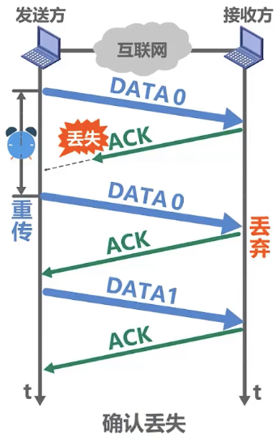
<!-- image-source: https://cdn.nlark.com/yuque/0/2026/png/67474974/1779005579416-d0db8880-315f-46ad-a119-3a7cd46ddbc0.png -->

---

###### f. 确认分组迟到与确认分组的序号问题
确认分组（ACK）本身也可能出现“迟到”现象，这进一步引出了**确认分组是否需要编号**的问题。

**场景：确认迟到导致的重复确认误判**

假设发送方发出 `0` 号数据分组，接收方正确收到后回送 `ACK`。但该 `ACK` 因网络延迟而**迟迟未到**（迟到），导致发送方**超时重传** `0` 号数据分组。

在重传过程中，那个**迟到的** `ACK` 终于抵达发送方，发送方误以为重传的 `0` 号分组已确认，于是开始发送 `1` 号新分组。

随后，接收方收到重传的 `0` 号分组：

+ 发现序号是重复的，**丢弃该分组**；
+ 但仍回送一个 `ACK`，以免发送方再次超时重传。

**问题来了：**  
发送方收到这个 `ACK` 时，它并不知道这是针对 `0` 号旧分组的“重复确认”，很可能会**误认为这是对** `1` **号新分组的确认**，从而错误地认为 `1` 号分组已成功交付。

**解决方案：给确认分组编号**

为避免这种误判，可以让确认分组也**携带序号**，指明它确认的是哪一个数据分组。

+ 接收方收到 `0` 号数据分组，回送 `ACK 0`。
+ 发送方收到 `ACK 0`，知道这是对 `0` 号分组的确认。
+ 当那个重复的 `ACK 0` 再次到达时，发送方通过序号立刻识别出它是**重复确认**，**直接忽略**，不会误认为是对 `1` 号分组的确认。
+ 接收方正确收到 `1` 号数据分组后，回送 `ACK 1`，发送方收到后才确认 `1` 号分组交付成功。

至此，通过给确认分组编号，彻底解决了确认迟到带来的重复确认误判问题。

**特别说明：数据链路层的简化**

需要指出的是，对于**数据链路层的点对点信道**（如直接相连的两台设备），往返时间比较固定，几乎**不会出现确认迟到**的情况。因此，如果**只在数据链路层实现停止-等待协议**，通常**可以不对确认分组进行编号**，以简化实现。

但在往返时间波动较大的网络环境（如跨越多个路由器的广域网）中，确认分组编号就显得非常必要。


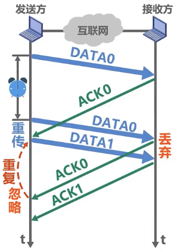
<!-- image-source: https://cdn.nlark.com/yuque/0/2026/png/67474974/1779005825562-4eec6812-cc40-4e82-94fe-8a93b828ece1.png -->

##### 小结
（1）误码时的两种处理策略

接收端检测到数据分组有误码时，可选择两种方式：

+ **默认方式**：直接丢弃，等待发送方**超时重传**。
+ **优化方式**：对于误码率较高的点对点链路，可回送**否认分组 NAK**，使发送方**尽早重传**，减少等待时延。

---

（2）数据分组的序号

为让接收方判断分组是否重复，需给每个数据分组**编号**。  
停止-等待协议一次只发一个分组，只需区分前后两个分组，因此**1 个比特**（序号 `0` 和 `1`）即可满足需求。

---

（3）确认分组的序号（数据链路层可省略）

为让发送方判断收到的 ACK 是否重复，确认分组同样需要**编号**，所用比特数与数据分组相同。

> **但在数据链路层**：点对点信道的往返时间固定，几乎不会出现确认迟到的情况，因此**可以不给确认分组编号**，以简化实现。  
在往返时间波动较大的上层网络环境（如运输层）中，确认分组编号则非常必要。
>

---

（4）超时重传时间的设置

超时计时器的重传时间需仔细选择：

+ 一般设为**略大于**从发送方到接收方的**平均往返时间**。
+ 在**数据链路层**：点对点往返时间确定，重传时间容易设定。
+ 在**运输层**：端到端往返时间非常不确定，设置合适的重传时间有时很困难。（这一问题将在 TCP 协议中详细讨论。）

##### 停止等待协议的信道利用率
**工作过程的时间分析**

停止-等待协议的工作周期可用下图的时间轴来描述（假设收发双方为直通信道）：

1. 发送方发送一个数据分组，耗费 **发送时延 TD**。
2. 分组经信道传播到达接收方，加上接收方处理并回送确认分组，两者共同构成**往返时间 RTT**。
3. 接收方发送确认分组，耗费 **发送时延 TA**。

> **简化假设**：图中忽略了接收方对数据分组的处理时延，以及发送方收到确认分组后的处理时延。
>

从发送方发出一个数据分组开始，到它可以发送下一个数据分组为止，所经历的总时间为：**TD + RTT + TA**。

---

**信道利用率的计算**

在这个周期内，只有 **TD** 这段时间真正用于传输有效数据（数据分组本身）。因此，**信道利用率 U** 定义为：

$$
U = \frac{T_D}{T_D + RTT + T_A}
$$

实际中，**TA 通常远小于 TD**，可以忽略不计，上式简化为：

$$
U \approx \frac{T_D}{T_D + RTT}
$$

---

**结论：RTT 远大于 TD 时利用率极低**

当 **RTT 远大于 TD** 时（例如长距离、高传播延迟的链路），分母显著增大，信道利用率会**非常低**。

+ 这意味着绝大部分时间信道处于空闲等待状态，有效数据传输占比极小。
+ 这是停止-等待协议的根本性能缺陷，也是后续引入**流水线协议**（如连续 ARQ、选择重传）的直接原因。


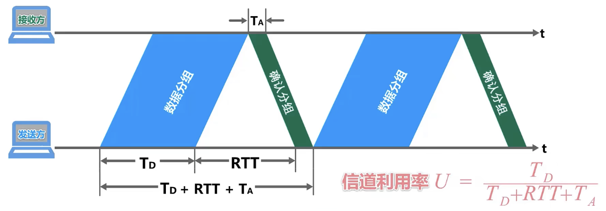
<!-- image-source: https://cdn.nlark.com/yuque/0/2026/png/67474974/1779006731350-99a0e30f-498a-4eef-bc44-bbcb7ea4e436.png -->

---

**利用率计算举例**

假设信道长度为 2000 km，数据分组长度为 1500 字节，信号传播速度按 200,000 km/s 计，则：

**（1）发送速率为 10 Mbps 时**

+ 数据帧发送时延$T_D = \frac{1500 \times 8 \text{ bit}}{10 \times 10^6 \text{ bps}} = 1.2 \text{ ms}$
+ 往返时间$RTT = 2 \times \frac{2000 \text{ km}}{200,000 \text{ km/s}} = 20 \text{ ms}$
+ 忽略确认帧发送时延$T_A$，信道利用率：  
$$
U = \frac{T_D}{T_D + RTT} = \frac{1.2}{1.2 + 20} \approx 5.66%
$$

**（2）发送速率提升至 100 Mbps 时**

+ $T_D = \frac{1500 \times 8}{100 \times 10^6} = 0.12 \text{ ms}$
+ $RTT$仍为 20 ms
+ 信道利用率：  
$$
U = \frac{0.12}{0.12 + 20} \approx 0.6%
$$

**结论**：当往返时延$RTT$远大于发送时延$T_D$时（如卫星链路、高速率长距离链路），停止-等待协议的信道利用率极低。若再出现重传，有效数据传输的利用率还会进一步降低。

---

**改进协议**

为克服停止-等待协议信道利用率低的缺陷，产生了两种改进协议：

+ **后退 N 帧协议（GBN，Go-Back-N）**
+ **选择重传协议（SR，Selective Repeat）**

它们通过**流水线方式**连续发送多个分组，不再发一个停一个，从而大幅提升信道利用率。

---

##### 例题解析（2018 年考研真题 36 题）
**题目**：主机甲与主机乙之间使用停止-等待协议进行数据链路层通信，数据传输速率为 3 kbps，单向传播时延为 200 ms，确认帧的发送和处理时延均可忽略。若要求信道利用率达到 40%，则数据帧的长度应为	**D**

A. 240比特		B.400比特		C.480比特		D.800比特

**解析**：


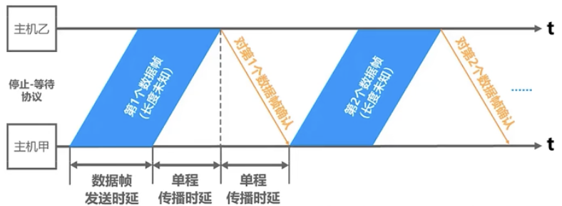
<!-- image-source: https://cdn.nlark.com/yuque/0/2026/png/67474974/1779007543070-978a2746-ea8e-457a-97b0-5bf1f6f390cb.png -->

+ 停止-等待协议的信道利用率公式：  
$$
U = \frac{T_D}{T_D + 2\tau}
$$
其中$T_D$为数据帧发送时延，$\tau$为单向传播时延，$2\tau$即往返时延 $RTT$。

其中：

+ $U$为信道利用率，题目要求$U = 0.4$；
+ $T_D$为数据帧的发送时延，设数据帧长度为$L$比特，数据传输速率$R = 3 \text{ kbps} = 3000 \text{ bps}$，则$T_D = L / R = L / 3000$秒；
+ $RTT$为往返时延，单向传播时延$\tau = 200 \text{ ms} = 0.2 \text{ s}$，则$RTT = 2\tau = 0.4 \text{ s}$。

代入公式：

$$
0.4 = \frac{L/3000}{L/3000 + 0.4}
$$

因此，数据帧的长度应为 **800 比特**。

**答案**：D 选项（800 比特）。

---

##### 补充
+ 停止-等待协议通过 **确认与重传** 机制，实现了不可靠链路上的可靠传输。
+ 该类协议又常被称为 **自动请求重传协议（ARQ，Automatic Repeat reQuest）**，意为重传请求由接收方自动触发（通过 ACK/NAK 或超时机制），无需显式要求发送方重传出错分组。
+ 其最大缺点是 **信道利用率低**，尤其在高速、长距离链路上表现明显，这直接推动了后续 GBN 与 SR 协议的诞生。

#### （2）回退N帧协议
##### 引言
**停止-等待协议**要求发送方每发送一个数据分组后，必须收到接收方的确认分组才能发送下一个。

<!-- 这是一张图片，ocr 内容为：接收方 确认分组 确认分组 互联网 数据分组 数据分组 发送方 -->
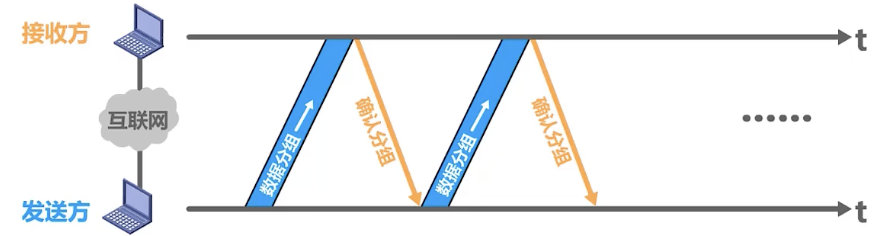
<!-- image-source: https://cdn.nlark.com/yuque/0/2026/png/67474974/1779163739845-ebc15a95-899a-4e7b-8f9f-b1ddf14935f2.png -->

当往返时间（RTT）较大（如卫星链路）时，信道利用率很低；若出现超时重传，利用率会进一步下降。

<!-- 这是一张图片，ocr 内容为：接收方 互联网 数据分组 数据分组 数据分组 数据分组 数据分 发送方 -->
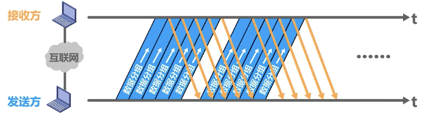
<!-- image-source: https://cdn.nlark.com/yuque/0/2026/png/67474974/1779163832357-195fdad5-2824-4023-b8bc-99b52e13019e.png -->

为提高传输效率，可采用**流水线传输**：发送方在未收到确认的情况下，可连续发送多个数据分组。**回退N帧协议GBN**（**G**o-**B**ack-**N**）正是基于流水线传输，并通过**发送窗口**限制连续发送的分组数量。

##### 基本原理
假设用 **3 个比特** 为分组编号，序号范围是 **0～7**（模8循环）。  

<!-- 这是一张图片，ocr 内容为：接收方 发送方 互联网 7 2 7 0 5 9 1 9 5 4 4 2 -->

<!-- image-source: https://cdn.nlark.com/yuque/0/2026/png/67474974/1779164311827-6c67148c-3a5a-4a49-8985-bc54bcb46a16.png -->

+ **发送窗口**：序号落在窗口内的分组可被连续发送，无需等待确认。  
    - 发送窗口的尺寸记为 $W_T$。  
    - 取值范围：**1 <** $W_T$ **≤ 2ⁿ − 1**（n 为序号比特数）。  
        * 若 $W_T$ = 1，则退化为停止等待协议。  
        * 若 $W_T$ > 2ⁿ − 1，会造成接收方无法分辨新旧分组，出现重复接收错误（后文举例说明）。
    - 对于本例：$W_T$取值范围是1 < $W_T$ ≤ 2<sup>3</sup>− 1（3是构成分组序号的比特数量），本例取$W_T$ = 5 ，序号 0～4 可连续发送。

<!-- 这是一张图片，ocr 内容为：发送窗口 WT5 12 7 3 5 0 4 2 9 0 1 允许发送5个 不允许发送这些 数据分组 数据分组 -->
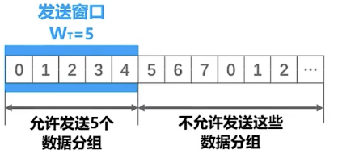
<!-- image-source: https://cdn.nlark.com/yuque/0/2026/png/67474974/1779164607385-9c0df218-1a35-42e2-bf7b-f8a1b39ad9b3.png -->

+ **接收窗口**：  
    - 尺寸记为$W_R$，在回退N帧协议中$W_R$**固定为 1**（与停止等待相同）。  
    - 接收方仅接受**当前期望序号**且无差错的数据分组，窗口按序向前滑动。

<!-- 这是一张图片，ocr 内容为：接收窗口 WR1 2 1 0 7 1 2 4 3 6 5 0 不允许接收这些数据分组 准备接收 0号数据分组 -->
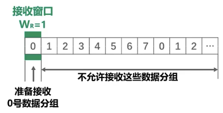
<!-- image-source: https://cdn.nlark.com/yuque/0/2026/png/67474974/1779165513195-869114b4-7f33-44b4-b4e1-fdd659b3dcc6.png -->

##### 无差错情况下的工作过程
1. 发送方将发送窗口内（0～4号）的分组依次连续发出。  

<!-- 这是一张图片，ocr 内容为：发送方 接收方 互联网 接收窗口 发送窗口 WT5 WR1 7 5 1 0 6 4 70 2 1 6 1 2 5 3 2 0 -->

<!-- image-source: https://cdn.nlark.com/yuque/0/2026/png/67474974/1779165659110-53598467-3e87-45b3-8d3c-955f19533c41.png -->

2. 分组无差错、不乱序，正确到达接收方。  

<!-- 这是一张图片，ocr 内容为：发送方 接收方 互联网 发送窗口 接收窗口 WT5 WR1 7 7 9 2 6 3 5 4 1 0 5 1 2 0 2 1 4 ".. -->
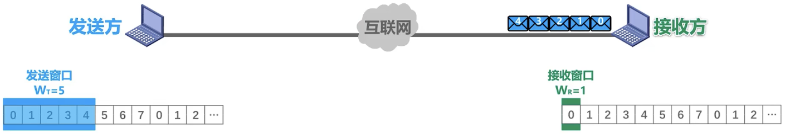
<!-- image-source: https://cdn.nlark.com/yuque/0/2026/png/67474974/1779165698807-9c74c2cc-abbc-43f1-9023-b450236b272d.png -->

3. 接收方每收到一个分组，接收窗口向前滑动一位，并发送对应的确认分组。

<!-- 这是一张图片，ocr 内容为：接收方 发送方 互联网 ACK ACK ACK 接收窗口 发送窗口 WT5 WR1 7 9 5 2 7 0 9 0 5 1 -->
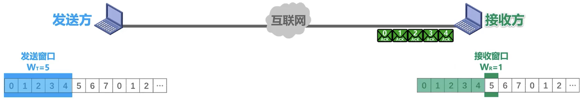
<!-- image-source: https://cdn.nlark.com/yuque/0/2026/png/67474974/1779165749567-6cc92201-ea66-4796-a402-08ea3699f0ab.png -->

4. 发送方收到确认后，发送窗口向前滑动，已确认的分组可从缓存中删除，新序号落入窗口，可继续发送。  

<!-- 这是一张图片，ocr 内容为：发送方 接收方 互联网 发送窗口 接收窗口 WT5 WR1 7 2 7 1 5 1 0 9 5 0 2 9 3 4 2 4 " 3 -->
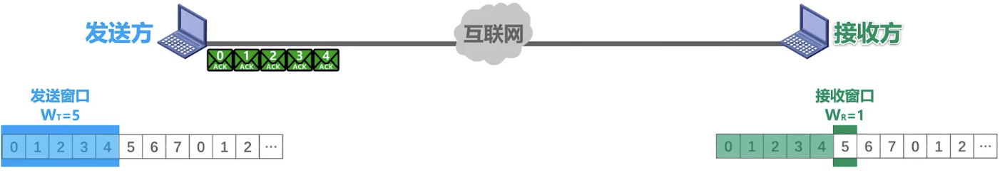
<!-- image-source: https://cdn.nlark.com/yuque/0/2026/png/67474974/1779165807473-4ab33eec-011f-48b0-a13d-b30aad0954ef.png -->

<!-- 这是一张图片，ocr 内容为：发送方 接收方 互联网 接收窗口 发送窗口 WT5 WR1 7 0 2 1 6 5 -->
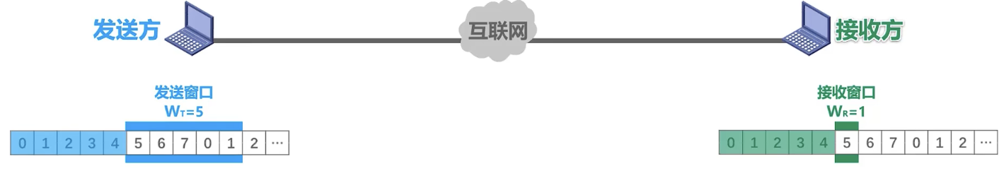
<!-- image-source: https://cdn.nlark.com/yuque/0/2026/png/67474974/1779165837567-15c935b2-02c0-41bc-ac87-4d71f779320b.png -->

<!-- 这是一张图片，ocr 内容为：发送方 接收方 互联网 发送窗口 接收窗口 WT5 WR1 7 0 1 6 5 2 2 1 3 67 0 4 4 -->

<!-- image-source: https://cdn.nlark.com/yuque/0/2026/png/67474974/1779166033441-450afc53-2462-429c-8daa-b09f4a23614a.png -->

5. 接收方在适当时机将已接收的分组按序交付上层。

<!-- 这是一张图片，ocr 内容为：接收方 发送方 互联网 接收窗口 发送窗口 WR1 WT5 67 7 2 1 6 5 0 2 3 1 4 5 -->

<!-- image-source: https://cdn.nlark.com/yuque/0/2026/png/67474974/1779166085831-8245c1f9-f378-4ad6-af19-412d9fca44bb.png -->

##### 累计确认机制
使用回退N帧协议的接收方可采用**累计确认**：接收方**不一定**要对收到的数据分组**逐个发送确认**，而是可以在收到几个数据分组后（由具体实现决定）,**对按序到达的最后一个数据分组发送确认**。

+ **ACK n** 表示序号为 **n 及之前** 的所有数据分组均已正确接收。

**示例**：

1. 发送方连续发送 0～4 号分组。
2. 接收方在正确接收 0、1 号后发送 ACK1；继续正确接收 2、3、4 号后发送 ACK4。

<!-- 这是一张图片，ocr 内容为：接收方 发送方 互联网 ACK 发送窗口 接收窗口 WR1 WT5 7 7 6 5 0 1 23 5 9 4 2 2 1 0 3 4 -->
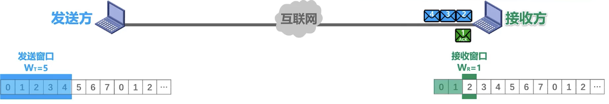
<!-- image-source: https://cdn.nlark.com/yuque/0/2026/png/67474974/1779166632432-7cb7071d-523f-48f0-b446-5f9485fa2343.png -->

<!-- 这是一张图片，ocr 内容为：发送方 接收方 互联网 ACK 发送窗口 接收窗口 WT5 WR1 7 9 7 2 3 5 5 0 1 O 9 4 -->
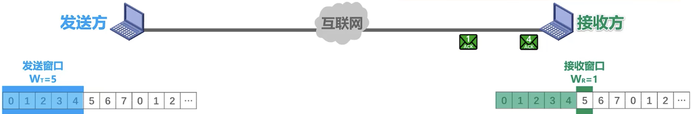
<!-- image-source: https://cdn.nlark.com/yuque/0/2026/png/67474974/1779166668754-0b6c486c-adc4-4764-9bd1-210246c8decd.png -->

3. 若 ACK1 在传输中丢失，但 ACK4 成功到达，发送方即可得知 4 号及之前全部分组均已成功接收，无需重传。

<!-- 这是一张图片，ocr 内容为：发送方 接收方 互联网 发送窗口 接收窗口 WT5 WR1 7 56 7 2 0 3 2 0 5 1 1 4 4 9 -->
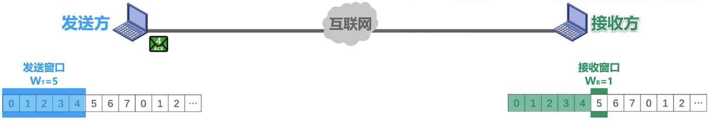
<!-- image-source: https://cdn.nlark.com/yuque/0/2026/png/67474974/1779166713794-aa72be0e-467f-4196-a742-14be1693c4a5.png -->

4. 发送方收到 ACK4 后，序号为4及之前的数据分组已被接收方正确接收，于是将发送窗口向前滑动5个位置，已确认的分组可从缓存中删除，新序号落入窗口，可继续发送。  

<!-- 这是一张图片，ocr 内容为：发送方 接收方 互联网 接收窗口 发送窗口 WT5 WR1 7 0 2 1 6 5 -->

<!-- image-source: https://cdn.nlark.com/yuque/0/2026/png/67474974/1779165837567-15c935b2-02c0-41bc-ac87-4d71f779320b.png -->

<!-- 这是一张图片，ocr 内容为：发送方 接收方 互联网 发送窗口 接收窗口 WT5 WR1 7 0 1 6 5 2 2 1 3 67 0 4 4 -->

<!-- image-source: https://cdn.nlark.com/yuque/0/2026/png/67474974/1779166033441-450afc53-2462-429c-8daa-b09f4a23614a.png -->

5. 接收方在适当时机将已接收的分组按序交付上层。

<!-- 这是一张图片，ocr 内容为：接收方 发送方 互联网 接收窗口 发送窗口 WR1 WT5 67 7 2 1 6 5 0 2 3 1 4 5 -->

<!-- image-source: https://cdn.nlark.com/yuque/0/2026/png/67474974/1779166085831-8245c1f9-f378-4ad6-af19-412d9fca44bb.png -->

**优点**：  

+ 即使某个确认分组丢失，后续确认仍可覆盖，可能避免不必要的重传。  
+ 减少接收方发送确认分组的开销，节约网络资源。

**缺点**：  

+ 不能及时向发送方反馈每一个分组的接收状态。

##### 差错处理与回退重传
1. 发送方将窗口内的分组（如 5、6、7、0、1）依次连续发出。  

<!-- 这是一张图片，ocr 内容为：发送方 接收方 互联网 接收窗口 发送窗口 WT5 WR1 7 2 9 0 5 2 3 4 3 5 6 1 4 -->

<!-- image-source: https://cdn.nlark.com/yuque/0/2026/png/67474974/1779167074082-d865e6dc-1d7a-4718-abee-f65958f3d25b.png -->

2. 若其中某号（如 5 号）分组出现误码，接收方通过检错码发现错误，丢弃该分组。 

<!-- 这是一张图片，ocr 内容为：发送方 接收方 互联网 接收窗口 发送窗口 WT5 WR1 7 2 5 9 7 2 0 1 2 6 3 3 5 4 4 0 2 -->
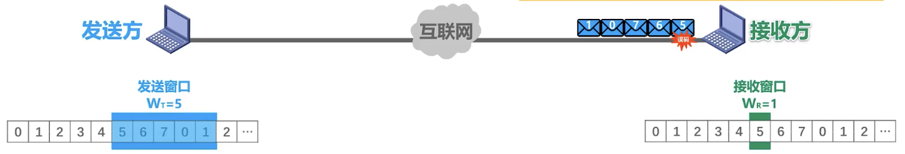
<!-- image-source: https://cdn.nlark.com/yuque/0/2026/png/67474974/1779167236295-9d5a8a00-fca5-485b-875a-552dc3e6ba1f.png -->

3. 后续到达的 6、7、0、1 号分组，因序号与接收窗口期望不符，**一律丢弃**。同时，接收方对最后按序正确接收的分组（如 4 号）重复发送确认（如 ACK4）。

<!-- 这是一张图片，ocr 内容为：发送方 接收方 互联网 发送窗口 接收窗口 序号不匹配 WT5 WR1 7 2 2 7 1 2 0 0 5 6 2 6 -->

<!-- image-source: https://cdn.nlark.com/yuque/0/2026/png/67474974/1779167571742-20771aa0-f559-4e0c-b915-44f84cb02bac.png -->

<!-- 这是一张图片，ocr 内容为：接收方 发送方 互联网 发送窗口 接收窗口 WT5 WR1 1 1 2 2 7 2 0 1 7 5 3 3 0 0 4 6 5 -->

<!-- image-source: https://cdn.nlark.com/yuque/0/2026/png/67474974/1779167520892-036862a8-9858-4b62-8580-c574fb0dcc60.png -->  

4. 发送方收到重复 ACK 后，判断出现差错。  

<!-- 这是一张图片，ocr 内容为：接收方 发送方 互联网 接收窗口 发送窗口 WR1 WT5 67 0 2 1 1 0 2 2 3 2 -->
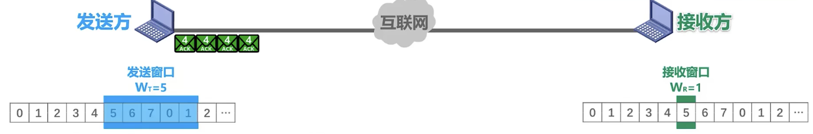
<!-- image-source: https://cdn.nlark.com/yuque/0/2026/png/67474974/1779167763367-432e1d0d-08aa-4e65-91ac-6952c506dd42.png -->

- 若累积收到多个重复 ACK，可由具体实现决定是否在超时前**立即重传**。  
- 否则，等待重传计时器超时。

5. 超时后，发送方将**发送窗口内所有已发送但未确认的分组**全部重传。即使某些分组已被正确接收，但因未按序到达窗口而一同被丢弃，仍会被牵连重传。

<!-- 这是一张图片，ocr 内容为：发送方 接收方 互联网 发送窗口 接收窗口 WT5 WR1 7 0 2 7 5 6 6 5 4 4 -->

<!-- image-source: https://cdn.nlark.com/yuque/0/2026/png/67474974/1779167837583-86565910-3935-4543-946b-69c9f8a3fb11.png -->

#####  “回退N帧”名称的由来
因接收方只按序接收，一旦某个分组出错，后续所有正确到达的分组都会被丢弃，发送方必须“回退”到出错序号，重新发送该序号及之后的所有分组，故称为Go-Back-N（回退N帧）

##### 信道利用率
当通信线路质量较差、误码率较高时，大量正确分组被连带重传，信道利用率可能并不优于停止等待协议。

##### 协议参数小结
| 项目 | 说明 |
| --- | --- |
| 发送窗口 $W_T$ | 1 < $W_T$ ≤ 2ⁿ − 1（n 为序号比特数） |
| 接收窗口 $W_R$ | 固定为 1 |
| 发送方式 | 窗口内分组可连续发送，无需等待确认 |
| 接收规则 | 仅接收期望序号的无误分组，按序交付上层 |
| 确认方式 | 累计确认（ACK n），或稍带确认 |
| 差错处理 | 丢弃失序分组，重复确认最后按序接收的分组 |
| 重传策略 | 超时后重传窗口内所有已发未确认分组；收到多个重复 ACK 可提前触发重传（取决于实现） |
| 窗口滑动 | 发送方收到确认后才可向前滑动发送窗口；接收方正确接收一个分组，接收窗口即向前滑动一位 |


---

##### 典型例题分析
###### 发送窗口尺寸超限的错误
采用 3 个比特编号，$W_T$的最大允许值为 2³ − 1 = 7。

1. 若故意将$W_T$设为 8，发送方可将 0～7 号全部分组连续发出。

<!-- 这是一张图片，ocr 内容为：接收方 发送方 互联网 接收窗口 发送窗口 WR1 WT8 67 7 5 0 6 0 0 2 1 3 2 2 4 3 4 -->

<!-- image-source: https://cdn.nlark.com/yuque/0/2026/png/67474974/1779168476976-6fa25971-3e82-4845-bd1d-44ef2461f543.png -->

2. 接收方正确接收后回送 ACK7，但 ACK7 在传输中丢失。

<!-- 这是一张图片，ocr 内容为：接收方 发送方 互联网 ACK 接收窗口 发送窗口 WT8 WR1 2 1 0 0 0 4 2 1 3 5 0 5 1 2 -->
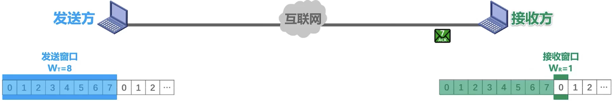
<!-- image-source: https://cdn.nlark.com/yuque/0/2026/png/67474974/1779168514021-7968b0f9-1049-4034-b7bc-318ec684eca1.png -->

3. 发送方超时重传 0～7 号分组。

<!-- 这是一张图片，ocr 内容为：接收方 发送方 互联网 发送窗口 接收窗口 WT8 WR1 7 2 4 3 0 5 1 0 9 3 2 2 4 5 -->
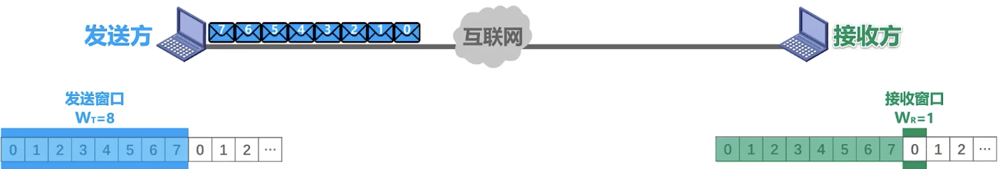
<!-- image-source: https://cdn.nlark.com/yuque/0/2026/png/67474974/1779168573132-701a51e3-c3b8-43b8-816e-842743562f92.png -->

4. 此时接收方接收窗口期望序号仍为 0，会把这些重传分组当作新分组按序接收，从而导致**分组重复**，接收方无法分辨新旧分组。

<!-- 这是一张图片，ocr 内容为：接收方 发送方 互联网 接收窗口 发送窗口 WT8 WR1 12 1 2 6 -->
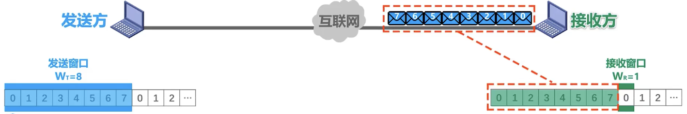
<!-- image-source: https://cdn.nlark.com/yuque/0/2026/png/67474974/1779168623518-cac6194a-163d-4b49-a905-164501ed82c9.png -->  


**结论**：发送窗口尺寸必须 **不超过 2ⁿ − 1**。

---

###### 考研真题（2009-35）
数据链路层使用后退N帧（GBN）协议，发送方已发送编号0~7的帧。计时器超时时，发送方只收到0、2、3号帧的确认。则发送方需要重发的帧数是	**C**

A. 2				B. 3				C. 4				D. 5

**分析**：  

+ 确认 ACK3 表示 0～3 号帧均已被正确接收（1 号帧的确认虽丢失，但被 ACK3 累计覆盖）。  
+ 因此，发送方应从 **4 号帧** 开始重传。  
+ 需要重传的帧为已发送但未被确认的 4、5、6、7 号帧，**共计 4 个帧**。

<!-- 这是一张图片，ocr 内容为：45678 2 0 0 3 6 8 1 10 15 14 12 13 11 丢失 超时 ACK1 ACK2 ACK3 ACKO -->
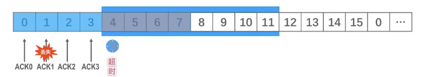
<!-- image-source: https://cdn.nlark.com/yuque/0/2026/png/67474974/1779169850502-3aadd2a9-ec37-4d60-926d-4b2b4d0a465e.png -->

---

##### 总结
+ 回退N帧协议是一种**连续 ARQ 协议**，基于流水线传输，通过发送窗口控制连续发送的数据分组数量。  
+ 发送窗口和接收窗口在工作过程中不断向前滑动，故该类协议也称为**滑动窗口协议**。  
+ 相比停止等待，回退N帧在低误码率下能显著提高信道利用率；但当线路质量不佳时，因正确分组可能被牵连重传，利用率改善有限。  

#### （3）选择重传协议
##### 引入与背景
在**回退N帧协议中**，接收窗口尺寸$W_R$**只能等于1**，接收方必须按序接收数据分组。只要有一个数据分组出现误码，即使后续多个数据分组没有误码，也会因为未按序到达而被丢弃。发送方不得不对这些被丢弃的分组进行超时重传，造成了通信资源的浪费。

为了进一步提高性能，可以设法**只重传出错的数据分组**，这就要求接收窗口$W_R > 1$。接收方可以先收下失序到达但无误码、且序号落在接收窗口内的数据分组，等所缺分组到齐后再一并递交给上层。这就是**选择重传（Selective Repeat）协议**的核心思想。

需要注意：为了让发送方仅重传出错的分组，接收方**不能采用累积确认**，而必须对每个正确接收到的数据分组进行**逐一确认**。

---

##### 举例说明工作原理
假设用 **3 比特** 给分组编号，序号范围 `0~7`（当序号增加到 7 时，下一个序号从 0 开始）。  
发送窗口$W_T$的取值范围是$1 < W_T \le 2^{3-1}$（其中 3 为序号比特数），本例取 $W_T = 4$。  
接收窗口$W_R$一般与$W_T$相同，本例$W_R = 4$。


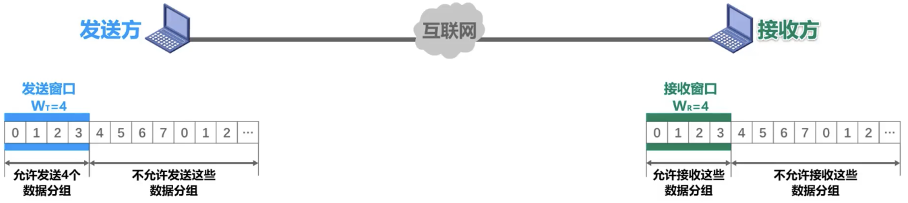
<!-- image-source: https://cdn.nlark.com/yuque/0/2026/png/67474974/1779178537844-5dad8ae8-04ab-4096-9f92-07f5c6a5e8d3.png -->

初始时，发送窗口包含序号 `0,1,2,3`，接收窗口同样包含 `0,1,2,3`。

**传输过程**

1. 发送方将窗口内 0~3 号数据分组依次发出，假设 **2 号数据分组丢失**。


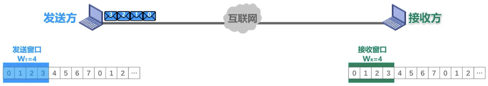
<!-- image-source: https://cdn.nlark.com/yuque/0/2026/png/67474974/1779178612477-446e8da6-0ef0-48d4-998c-116e72fc2a72.png -->


<!-- image-source: https://cdn.nlark.com/yuque/0/2026/png/67474974/1779178653834-ba166048-4017-4d7f-93f4-b78019f799ee.png -->

2. 接收方收到 0、1 号数据分组（无误码且落入窗口），立即发送 0、1 号确认分组，接收窗口向前滑动 2 位，新窗口变为 `2,3,4,5`。


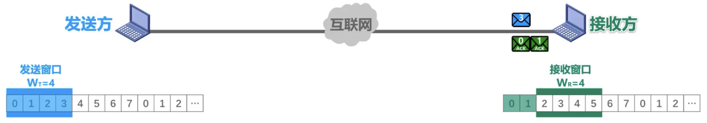
<!-- image-source: https://cdn.nlark.com/yuque/0/2026/png/67474974/1779178691744-c968d5d5-596c-4eca-b107-2b759ee162ee.png -->

3. 接收方收到 3 号数据分组，因未按序（缺少 2 号），只发送 3 号确认分组，接收窗口不滑动。


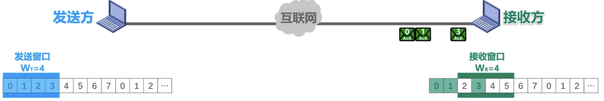
<!-- image-source: https://cdn.nlark.com/yuque/0/2026/png/67474974/1779178819723-d3c8d1ac-76b8-4354-a006-7b4a4b007718.png -->

4. 发送方依次收到 0、1 号确认分组，发送窗口向前滑动 2 位变为 `2,3,4,5`，随后发送 4、5 号数据分组，并从缓存中删除已确认的 0、1 号数据分组；接收方可择机将 0、1 号数据分组交付上层（数据链路层的上层）。


<!-- image-source: https://cdn.nlark.com/yuque/0/2026/png/67474974/1779178908847-36bf0ea6-0dd5-4054-969e-88c8f5dd0778.png -->


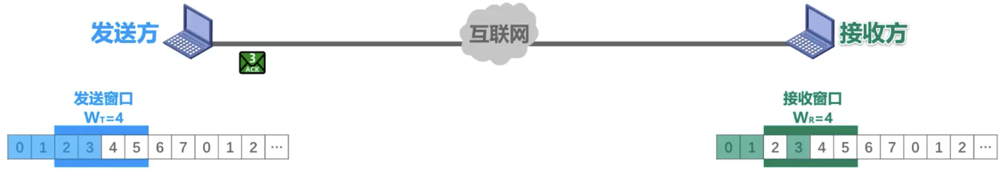
<!-- image-source: https://cdn.nlark.com/yuque/0/2026/png/67474974/1779178943267-d760d3e4-4f9f-42c3-938d-2adc6406518c.png -->


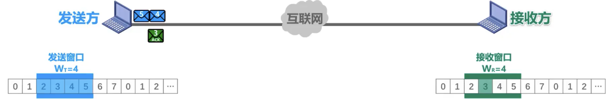
<!-- image-source: https://cdn.nlark.com/yuque/0/2026/png/67474974/1779179002626-cb47d920-42dc-433c-9c87-ee7bad07c4dd.png -->

5. 发送方收到 3 号确认分组，但因未按序（尚未收到 2 号确认），发送窗口不能滑动，只记录“3 号已确认”以防止超时重传。


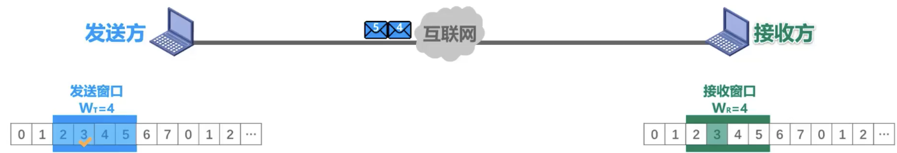
<!-- image-source: https://cdn.nlark.com/yuque/0/2026/png/67474974/1779179274593-d9c04fe7-4eb0-4007-8314-69945920d188.png -->

6. 4、5 号数据分组到达接收方，接收方发送 4、5 号确认分组，但接收窗口因仍缺少 2 号数据分组，接收窗口不滑动（4、5数据分组是未按序到达的数据分组）。


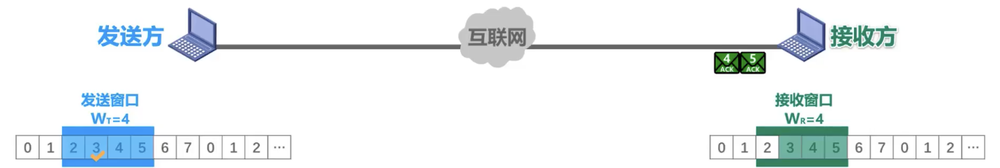
<!-- image-source: https://cdn.nlark.com/yuque/0/2026/png/67474974/1779179406179-0d4fc52c-cea8-4b27-9d13-8c485c1ecebe.png -->

7. 在 4、5 号确认分组传输期间，发送方对 2 号分组的重传计时器超时，重传 2 号数据分组。


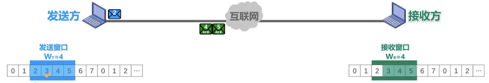
<!-- image-source: https://cdn.nlark.com/yuque/0/2026/png/67474974/1779179460153-c86374ae-0da4-48f2-bf69-f95e70a9ab78.png -->

8. 发送方收到 4、5 号确认分组，记录它们已确认（窗口仍不滑动，因为未按序，缺少 2 号确认分组，记录4、5数据分组收到确认是保证不会超时）。


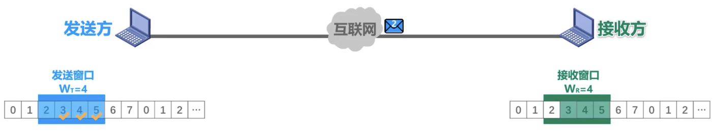
<!-- image-source: https://cdn.nlark.com/yuque/0/2026/png/67474974/1779179530689-284a79da-3f7d-483d-8491-f1a952c85bbb.png -->

9. 重传的 2 号分组到达接收方，接收方接收并发送 2 号确认。此时接收方已按序收齐 2、3、4、5 号分组，接收窗口滑动 4 位，新窗口为 `6,7,0,1`。


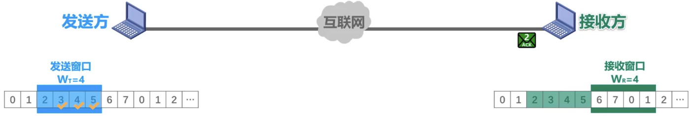
<!-- image-source: https://cdn.nlark.com/yuque/0/2026/png/67474974/1779179631265-f7f85916-3c5a-4529-adfe-140911d13f4e.png -->

10. 发送方收到 2 号确认后，发送窗口滑动 4 位至 `6,7,0,1`，可以继续发送这 4 个分组。 


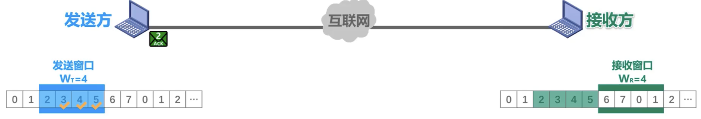
<!-- image-source: https://cdn.nlark.com/yuque/0/2026/png/67474974/1779179662843-ec63f661-9ddd-45fe-aa55-4d743072e6d8.png -->


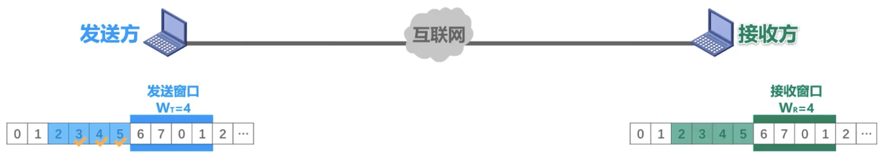
<!-- image-source: https://cdn.nlark.com/yuque/0/2026/png/67474974/1779179697445-402e70e0-157d-473f-a65d-e3c837cd0908.png -->

---

##### 窗口尺寸的限制与问题演示
+ **发送窗口**：$1 < W_T \le 2^{N-1}$，其中$N$为序号比特数。  
    - 若$W_T = 1$，则退化为停止等待协议；  
    - 若$W_T > 2^{N-1}$，接收方可能无法分辨新旧分组，导致重复接收。
+ **接收窗口**：$1 < W_R \le W_T$。  
    - 若$W_R = 1$，与回退N帧协议相同；  
    - 若$W_R > W_T$则没有意义。

##### 窗口越界的错误示例
仍使用 3 比特序号（0~7），正常的最大窗口应为$2^{3-1} = 4$。故意将$W_T = 5$、$W_R = 5$，观察问题：

1. 发送方发出 0~4 号分组。


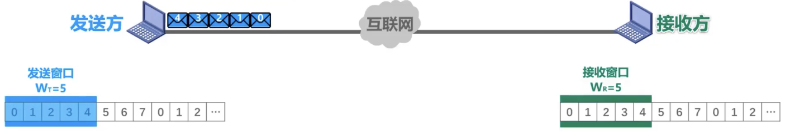
<!-- image-source: https://cdn.nlark.com/yuque/0/2026/png/67474974/1779180024091-8d275575-5fb7-49a3-8c73-03d964680d08.png -->

2. 接收方全部正确接收，发送 0~4 号确认，接收窗口滑动 5 位，变为 `5,6,7,0,1`。


<!-- image-source: https://cdn.nlark.com/yuque/0/2026/png/67474974/1779180051102-b5c21795-f18d-4172-85af-76412ee2d566.png -->


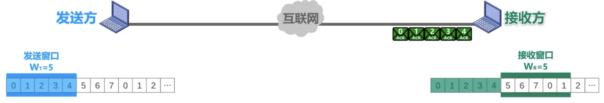
<!-- image-source: https://cdn.nlark.com/yuque/0/2026/png/67474974/1779180151775-218bc230-9963-4cc7-9b1d-1bab6478c7d6.png -->

3. 确认分组陆续到达发送方，但 **0 号确认丢失**。发送方收到 1~4 号确认并记录，发送窗口不滑动。


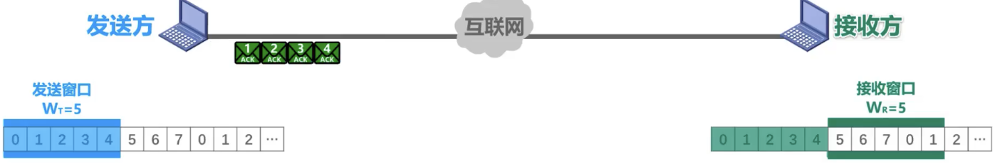
<!-- image-source: https://cdn.nlark.com/yuque/0/2026/png/67474974/1779180188910-9709f7d7-00bf-4cd5-b082-f31097f070aa.png -->


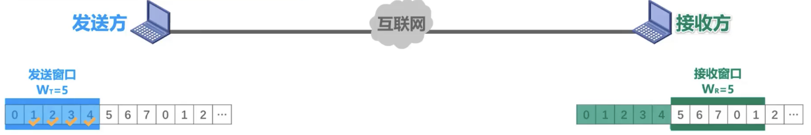
<!-- image-source: https://cdn.nlark.com/yuque/0/2026/png/67474974/1779180215326-5521ab96-5157-41d0-8303-c85c6260409f.png -->

4. 0 号数据分组的重传计时器超时，发送方重传 0 号数据分组。


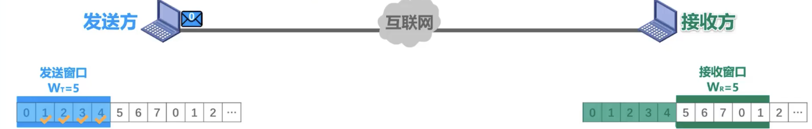
<!-- image-source: https://cdn.nlark.com/yuque/0/2026/png/67474974/1779180512790-c0cf2e46-8025-440a-89b5-82c9b163e10b.png -->

5. 重传的 0 号分组到达接收方时，其序号 0 仍在接收窗口 `5,6,7,0,1` 内，接收方会接收它。但接收方此前已正确接收过 0 号分组，于是出现**分组重复**的传输差错。


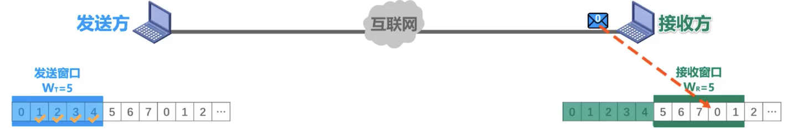
<!-- image-source: https://cdn.nlark.com/yuque/0/2026/png/67474974/1779180579766-82a22369-d445-4da5-bddc-2f97bd0a610d.png -->

**结论**：一旦$W_T$超过$2^{N-1}$，接收方就无法辨别新旧分组，导致重复接收。

---

##### 选择重传协议要点小结
+ 发送方可连续发送落在发送窗口内的所有数据分组，无需等待确认。
+ 接收方可接收**未按序但无误码**且序号在接收窗口内的分组。
    - 只重传出错分组 → **必须逐一分组确认**，不能使用累积确认。
+ 接收窗口**只有按序收齐分组后才能向前滑动**。
+ 发送窗口**只有按序收到确认分组后才能向前滑动**；若收到未按序确认，仅记录该分组已确认以防止超时重传，窗口不滑动。

---

##### 考研真题练习（2011 年统考 35 题）
数据链路层采用选择重传协议（SR) 传输数据，发送方已发送了0~3号数据帧，现已收到1号帧的确认，而0、2号帧依次超时，则此时需要重传的帧数是 **B**

A.1				B.2				 C.3 				D.4

> 与回退N帧协议不同，选择重传协议不支持累积确认，接收方每收到一个数据帧就立即发回相应的确认帧。  
题目已知：收到了 1 号帧的确认，而 0 号和 2 号帧的重传计时器依次超时，则需重传 **0 号和 2 号帧**。  
已发送的 3 号帧未给出任何线索，故无需考虑。
>

  
发送方将序号 0~3 的帧全部发出 → 收到 1 号确认 → 0 号和 2 号超时 → 重传 0 号、2 号。

---

### 4.补充
在计算机网络数据链路层协议中，并不是所有帧都有选择重传机制

**1.有 ACK、有重传（可靠的数据链路层）**

+ **代表协议**：**Wi-Fi（IEEE 802.11 MAC层）**、早期的 **HDLC**（高级数据链路控制，常用于老旧的专线）、蓝牙。
+ **工作机制**：发送方发一个数据帧，接收方校验 CRC 没问题后，**必须回复一个链路层的 ACK 帧**。如果发送方超时没收到 ACK，或者接收方校验 CRC 发现错了，**链路层硬件会自动重传这个帧**。
+ **上层感知**：对于上层的 IP 和 TCP 来说，这条链路是“绝对可靠”的，数据到了链路层就不会因为信号干扰而丢失。

**2.无 ACK、直接丢弃（不可靠的数据链路层）**

+ **代表协议**：**有线以太网（IEEE 802.3）**、**PPP 协议**、光纤链路。
+ **工作机制**：发送方发一个数据帧，接收方只做 CRC 校验。**如果校验正确，就收下交给上层；如果校验出错，直接把这个帧扔进垃圾桶，绝不回复任何 ACK，也绝不要求重传！**
+ **上层感知**：这条链路是“不可靠”的。如果数据因为物理干扰出错了，上层（TCP）根本不知道是哪条网线出了问题，它只知道自己发出的数据没收到回应，于是 **TCP 会在端到端层面发起重传**。

**核心结论：** 你脑海中“有 ACK 的链路层”是存在的（比如 Wi-Fi），但我前面提到的**以太网和 PPP，为了追求极致的转发速度，故意砍掉了链路层的 ACK 机制，选择了“错就丢弃”**。

> 重点：即使传输层中选择TCP协议，由于**透明传输**机制（数据链路层并不知道上层传输的内容），在**数据链路层中也不一定有选择重传机制**，TCP的可靠传输在运输层体现。
>

---

## 五、点对点协议PPP
### 1.协议概述与应用场景
点对点协议 PPP（**P**oint-to-**P**oint **P**rotocol）是目前使用最广泛的数据链路层协议之一，专门设计用于点对点链路。

**主要应用场景：**

+ **用户接入因特网：**  
普通用户通常需要连接到 **因特网服务提供者 (ISP)**，如中国电信、中国联通、中国移动，才能访问因特网。
    - 用户计算机必须从 ISP 获取到一个合法的 IP 地址，才能成为因特网上的主机。
    - 用户计算机与 ISP 通信时，数据链路层普遍采用 PPP 协议。
    - 在宽带接入中，广泛使用的是 **PPPoE (PPP over Ethernet)**，它于 1999 年公布，使得 ISP 能够通过 DSL、调制解调器、以太网等宽带技术，以以太网接口的形式为用户提供接入服务。


<!-- image-source: https://cdn.nlark.com/yuque/0/2026/png/67474974/1779287531367-9dbc1c4e-96b3-42a5-b336-7a7816ed3f6b.png -->

+ **广域网连接：**  
PPP 协议也广泛应用于广域网中路由器与路由器之间的专用点对点线路。


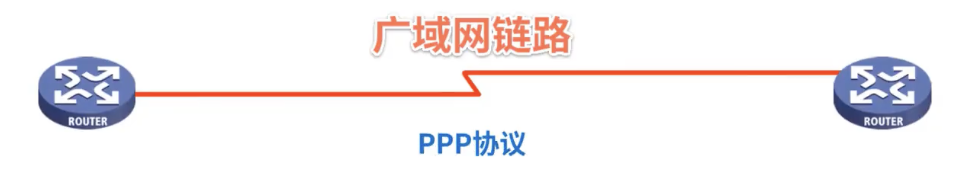
<!-- image-source: https://cdn.nlark.com/yuque/0/2026/png/67474974/1779287572440-bdbd4042-c010-4e16-987f-4a45bf33d0da.png -->

**标准化进程：**  
	PPP 协议由 **因特网工程任务组 (IETF)** 于 1992 年制定，并在 1993 年和 1994 年修订，现已成为因特网的正式标准。其详细规范记录在 RFC 文档中，可在 IETF 官网查阅。

---

### 2.协议的构成
PPP 协议为在点对点链路上传输多种网络层协议的数据报，提供了一个标准方法。它主要由以下三部分构成：

1. **封装方法：**  
	规定了如何将上层交付的协议数据单元（如 IP 数据报）封装成 PPP 帧（封装成帧）。
2. **链路控制协议 (LCP - Link Control Protocol)：**  
	用于建立、配置和测试数据链路连接。负责协商一些选项，如最大帧长度、是否进行身份鉴别等。
3. **一套网络控制协议 (NCPs - Network Control Protocols)：**  
NCP 包含了一族协议，每个协议为不同的网络层协议提供支持。
    - **IPCP (IP Control Protocol)**：用于配置和启用 IP 协议（即 TCP/IP 协议族中的 IP）。
    - **IPXCP (IPX Control Protocol)**：用于支持 Novell NetWare 网络操作系统的 IPX 协议。
    - **ATCP (AppleTalk Control Protocol)**：用于支持苹果公司的 AppleTalk 协议。


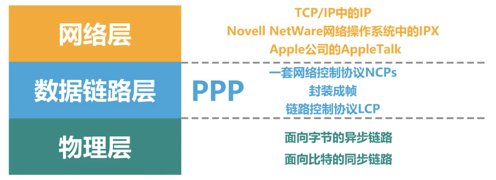
<!-- image-source: https://cdn.nlark.com/yuque/0/2026/png/67474974/1779287911948-1f4574ba-a90e-4c83-a6bf-232412c9a0c2.png -->

从网络体系结构的角度看，PPP 协议在数据链路层工作，通过 LCP 管理链路本身，通过 NCP 支持并适配多种网络层协议。

---

### 3.PPP 帧的格式
PPP 帧的格式首部有 4 个字段，尾部有 2 个字段。


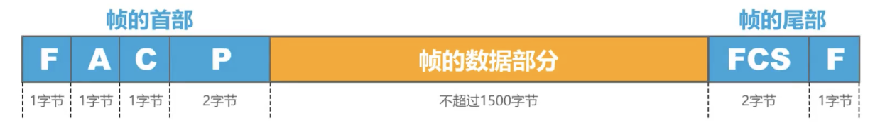
<!-- image-source: https://cdn.nlark.com/yuque/0/2026/png/67474974/1779287951334-04ce6ce0-a3ba-40ef-9aef-1558b0fd5f09.png -->

| 字段名 | 长度 (字节) | 取值 | 作用与说明 |
| :--- | :--- | :--- | :--- |
| **标志 (Flag)** | 1 | `0x7E` (`01111110`) | 帧的定界符，标识一帧的开始和结束。 |
| **地址 (Address)** | 1 | `0xFF` (`11111111`) | 广播地址。在点对点链路中，地址字段并无实质意义，保留此值。 |
| **控制 (Control)** | 1 | `0x03` (`00000011`) | 保留值，表示无编号帧。其含义至今未被重新定义。 |
| **协议 (Protocol)** | 1 或 2 | 见下文 | 指明封装在“数据”部分中的协议类型（应交由哪个协议处理）。 |
| **数据 (Data)** | 可变 | 协议数据 | 上层协议的数据报，最大长度默认通常为 1500 字节。 |
| **帧检验序列 (FCS：Frame Check Sequence)** | 2 (或 4) | CRC 校验值 | 用于检查帧在传输中是否产生误码。 |
| **标志 (Flag)** | 1 | `0x7E` | 帧的定界符，标识一帧的结束。 |


**帧中关键字段的典型取值：**

+ **协议字段：**
    - `0x0021`：数据部分是 **IP 数据报**。


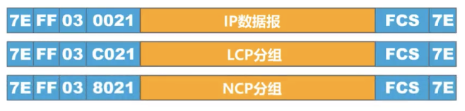
<!-- image-source: https://cdn.nlark.com/yuque/0/2026/png/67474974/1779288161689-d7e475ee-4012-425d-bfa1-314cedecffec.png -->

- `0xC021`：数据部分是 **LCP 分组**。


<!-- image-source: https://cdn.nlark.com/yuque/0/2026/png/67474974/1779288168017-3d8b7bd2-da94-4fe7-a392-b0af756bbcb3.png -->

- `0x8021`：数据部分是 **NCP 分组**。


<!-- image-source: https://cdn.nlark.com/yuque/0/2026/png/67474974/1779288174387-62726c37-d316-479d-8406-9f5408d711d9.png -->

+ **地址和控制字段：**  
虽然在帧格式中定义，但这两个字段实际上并没有携带真正的 PPP 帧信息。

---

### 4.透明传输：数据部分出现标志字段的解决方案
当 PPP 帧的数据部分出现了与标志字段 `0x7E` 相同的比特组合时，会造成接收方对帧边界的误判。为解决此问题，PPP **根据链路类型**采用不同的透明传输方法。


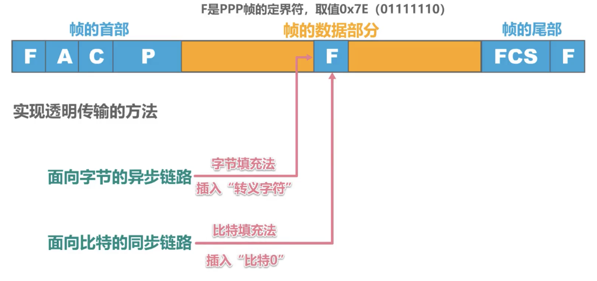
<!-- image-source: https://cdn.nlark.com/yuque/0/2026/png/67474974/1779288801461-6972bae1-2d5b-401d-acda-1a4aa8cc3248.png -->

**1. 面向字节的异步链路：字节填充法**  
以字节为单位处理，将特殊字符进行转义。

+ **关键转换规则：**
    - `0x7E`(PPP帧的定界符标志) → `0x7D 0x5E`
    - `0x7D` (转义字符本身) → `0x7D 0x5D`
    - 小于 `0x20` 的 ASCII 控制字符 → 先插入 `0x7D`，再将该字符编码加 `0x20`。
+ **接收方：** 执行**反向转换**即可恢复原始数据。


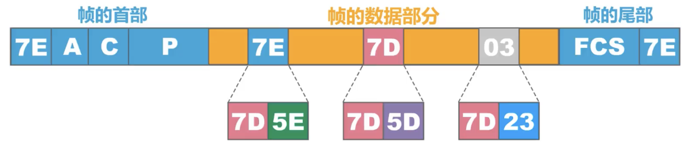
<!-- image-source: https://cdn.nlark.com/yuque/0/2026/png/67474974/1779289193813-92a6e781-b3a8-41f6-9124-dfec451a4b8c.png -->

**2. 面向比特的同步链路：零比特填充法**  
以比特为单位处理，防止数据部分出现 `0x7E` 的 `01111110` 模式。

+ **发送方规则：** 扫描数据部分，只要发现 5 个连续的比特 `1`，就立刻在其后**插入**一个比特 `0`。
+ **接收方规则：** 扫描数据部分，只要发现 5 个连续的比特 `1`，就立刻**删除**其后的比特 `0`。
+ **实施：** 此过程通常由硬件完成。

---

### 5.差错检测
PPP 协议通过帧尾部的 **帧检验序列 (FCS)** 字段进行差错检测。

+ **计算方法：** 使用循环冗余校验 **CRC**。


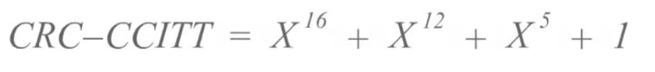
<!-- image-source: https://cdn.nlark.com/yuque/0/2026/png/67474974/1779289459823-dcb6c314-6776-4e60-8eb5-a24c67be925c.png -->

+ **生成多项式：** RFC 1662 文档中定义了具体的生成多项式，并提供了用 C 语言实现的查表法，以减少 CPU 开销。
+ **处理流程：**
    - **接收方**每收到一个 PPP 帧，就对其重新计算 CRC。
    - 若计算结果与 FCS 字段值**一致**（CRC 检验正确），则接受该帧。
    - 若**不一致**，则直接丢弃该帧。
+ **服务类型：** PPP 协议本身不向上层提供可靠传输服务，即它只负责检错，**不负责重传**

---

### 6.PPP 协议的工作状态 (以拨号接入为例)
PPP 链路从建立到拆除，经历一系列状态变迁，形成一个状态机。

1. **静止状态：**  
链路起点和终点。此时物理层连接不存在。
2. **建立状态：**  
当调制解调器检测到载波信号，物理层连接建立后，PPP 进入此状态。双方通过 **LCP** 协商配置选项。
    - **协商成功**：进入鉴别状态。
    - **协商失败**：返回静止状态。
    - _协商内容示例_：最大帧长度、所采用的鉴别协议等。
3. **鉴别状态 (可选)：**  
根据 LCP 协商结果，进行身份验证。协议可选 PAP 或 CHAP。
    - **无需鉴别或鉴别成功**：进入网络状态。
    - **鉴别失败**：进入终止状态。
4. **网络状态：**  
双方通过 **NCP** 为各自的网络层进行配置。如在 TCP/IP 环境下，使用 **IPCP** 为链路每一端分配或协商 IP 地址。
5. **打开状态：**  
NCP 配置完成后，链路进入打开状态，此时可以进行正常的网络层数据通信。
6. **终止状态：**  
出现链路故障、一方主动发出终止请求或物理层载波停止时，链路进入终止状态，释放所有资源，最终返回静止状态。


.png)
<!-- image-source: https://cdn.nlark.com/yuque/0/2026/png/67474974/1779289993220-d7a11178-adad-4f4e-8b7a-75da0491becb.png -->

---

### 7.总结
+ **协议定位：** PPP 是数据链路层协议，用于点对点通信。
+ **应用：** 广泛用于用户因特网接入（PPPoE）和广域网专线。
+ **体系构成：** 封装 + LCP（管理链路）+ NCP（支持多种网络层协议）。
+ **核心机制：**
    - **帧定界：** 使用 `0x7E` 标志字段。
    - **透明传输：** 异步链路用**字节填充**，同步链路用**零比特填充**。
    - **差错检测：** 使用 **CRC** 校验，仅检错，不重传。
+ **工作流程：** 遵循一个由 LCP 和 NCP 驱动的状态机，经历静止→建立→(鉴别)→网络→打开→终止→静止的过程。

#### 和MAC帧的对比
| 对比维度 | PPP 帧 (Point-to-Point Protocol) | 以太网 MAC 帧 (Ethernet / IEEE 802.3) |
| :--- | :--- | :--- |
| **应用场景** | **点对点链路**（如：路由器连路由器、早期拨号上网、光纤直连）。 | **局域网/广播信道**（如：办公室网线、电脑连交换机、校园网）。 |
| **节点数量** | 只有 **2 个** 节点（你和我）。 | 有 **多个** 节点（大家共享同一个网络）。 |
| **是否有 MAC 地址？** | **没有！**（不需要，因为对面只有唯一的一个接收者）。 | **必须有！**（6字节源MAC + 6字节目的MAC，用来在人群中精准找人）。 |
| **最小帧长限制** | **没有严格限制**。（因为点对点不会发生多人冲突）。 | **严格限制为 64 字节**。（为了在半双工下检测冲突 CSMA/CD）。 |
| **透明传输机制** | 需要处理（异步用**字符填充**，同步用**零比特填充**）。 | **不需要**（物理层的曼彻斯特等编码自带时钟同步，无标志位冲突问题）。 |
| **协议标识字段** | 叫 **“协议”字段**（如 0x0021 代表 IP 数据报）。 | 叫 **“类型”字段**（如 0x0800 代表 IPv4）。 |
| **帧定界（怎么判断帧结束）** | 有明确的**标志字段 (Flag, 0x7E)** 作为帧的开头和结尾。 | **没有专门的结束标志**。靠物理层信号中断或帧头部的“长度/类型”字段来判断结束。 |


---

## 六、媒体接入控制（MAC）
### 1.媒体接入控制基本概念
#### （1）共享信道与冲突问题
在总线型局域网中，多台主机通过一根同轴电缆等共享传输媒体连接在一起，各主机竞争使用总线，随机地在信道上发送数据。如果恰巧有两个或更多的站点在同一时刻发送数据，信号在共享媒体上就会产生碰撞（冲突），使得这些站点的发送都失败。


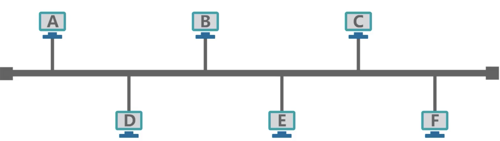
<!-- image-source: https://cdn.nlark.com/yuque/0/2026/png/67474974/1779340396305-e7adfb36-6817-4b0c-9457-dc15f60b1886.png -->

**示例**：主机C和主机D同时使用总线发送数据，必然会产生信号的碰撞。

共享信道需要解决的核心问题是：**如何协调多个发送和接收站点对一个共享传输媒体的占用**，这就是**媒体接入控制**（**M**edium **A**ccess **C**ontrol，MAC）。

#### （2）媒体接入控制技术分类  
MAC技术主要分为两大类：

**1.静态划分信道**

预先固定分配好信道资源，主要包括：

+ **频分多址（FDMA）**
+ **时分多址（TDMA）**
+ **码分多址（CDMA）**

**特点**：不灵活，对于突发性数据传输信道利用率很低。通常用于无线网络的物理层，而非数据链路层。

**2.动态接入控制**

进一步分为两类：

**（1）受控接入**

+ **集中控制**：采用多点轮询协议，存在一个主站以循环方式轮询各站点有无数据发送，只有被轮询到的站点才能发送数据。最大缺点：存在单点故障问题。
+ **分散控制**：采用令牌传递协议，各站点平等连接成环形网络。令牌（一种特殊的控制帧）沿环逐站传递，接收到令牌的站点才有权发送数据，发送完数据后将令牌传递给下一个站点。

> **历史网络案例**：IEEE 802.5令牌环网、IEEE 802.4令牌总线网、光纤分布式数据接口（FDDI）。这些网络因市场竞争已逐步退出历史舞台。
>

**（2）随机接入**

所有站点通过竞争随机地在信道上发送数据。如果恰巧有两个或更多站点同时发送，信号在共享媒体上产生碰撞（冲突），导致发送失败。

**核心问题**：如何尽量避免冲突，以及发生冲突后如何尽快恢复通信。

> **典型应用**：共享式以太网采用随机接入方式。
>

> **重要说明**：随着交换技术成熟和成本降低，使用点对点链路和链路层交换机的交换式局域网在有线领域已完全取代共享式局域网。但由于无线信道的广播天性，无线局域网仍使用共享媒体技术。
>

<!-- 这是一张图片，ocr 内容为：频分多址 静态划分信道 时分多址 码分多址 媒体接入控制 集中控制 受控接入 分散控制 动态接入控制 随机接入 -->
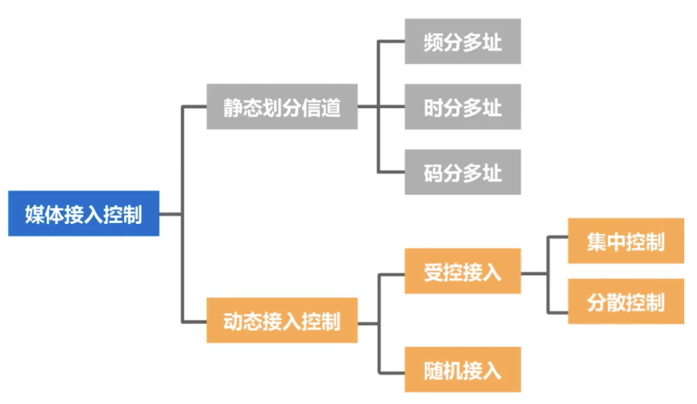
<!-- image-source: https://cdn.nlark.com/yuque/0/2026/png/67474974/1779340707924-60152ee7-a6f3-44b7-89e3-49973a03afeb.png -->

---

### 2.静态划分信道——信道复用技术
#### （1）信道复用基本概念
**复用（Multiplexing）**：通过一条物理线路同时传输多路用户的信号。当传输媒体的传输容量大于多条单一信道传输的总通信量时，可利用复用技术在一条物理线路上建立多条通信信道，充分利用传输媒体带宽。

**基本结构**：发送端使用复用器，接收端使用分用器，多对用户可共享一条物理线路通信。

<!-- 这是一张图片，ocr 内容为：分用 复用 三对用户各自使用一条独立的物理线路 三对用户共享一条物理线路 -->
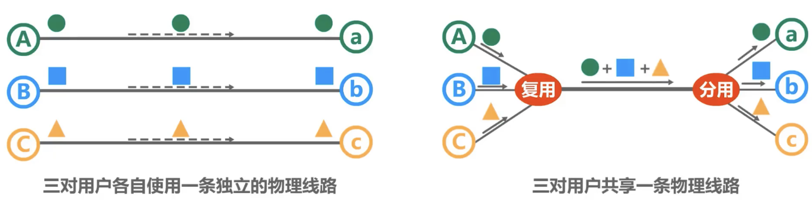
<!-- image-source: https://cdn.nlark.com/yuque/0/2026/png/67474974/1779341253297-b759fc84-3c5f-49c8-9b3d-57ca6e4a4c1c.png -->

#### （2）常见信道复用技术
##### 频分复用（FDM）
将传输线路的频带资源划分成多个子频带，形成多个子信道。各子信道之间需留出隔离频带，以免造成干扰。

<!-- 这是一张图片，ocr 内容为：隔离频带 子信道1 (子频带1 复用器 分用器 隔离频带 B 子信道2(子频带2) 隔离频带 子信道3 (子频带3) 隔离频带 -->
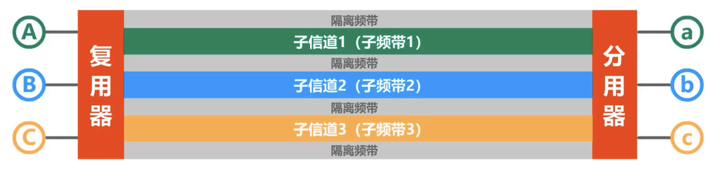
<!-- image-source: https://cdn.nlark.com/yuque/0/2026/png/67474974/1779341355108-b465c7af-0231-48c5-9385-34c1d38d5174.png -->

**工作原理**：多路信号输入复用器，复用器将每一路信号调制到不同频率的载波上。接收端分用器通过滤波将各路信号分开，恢复原始多路信号。

**特点**：所有用户**同时**占用**不同频带资源**并行通信。

##### 时分复用（TDM）
将时间划分成一个个时隙，将传输线路的带宽资源按时隙轮流分配给不同用户，每个用户只在所分配的时隙里使用线路传输数据。

<!-- 这是一张图片，ocr 内容为：TDM帧 TDM帧 TDM帧 TDM帧 TDM帧 A与A使用 C与C使用 B与B使用 A与A使用 B与B使用 A与A使用 A与A使用 B与B使用 A与A使用 B与B使用 C与C使用 C与C使用 C与C使用 C与C使用 B与B使用 频带宽度 时 时隙 时 时时 时时时时时时时时时 时 时间 隙隙隙隙隙隙隙隙隙隙 隙隙 隙隙 -->
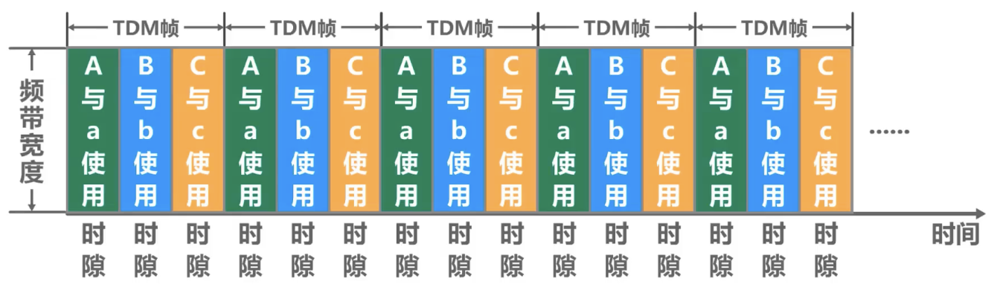
<!-- image-source: https://cdn.nlark.com/yuque/0/2026/png/67474974/1779341692350-8db22863-766b-4a5e-b4b2-ce2f87a6e3fc.png -->

**时分复用帧**：时间划分成一段段等长的时分复用帧，每一个用户在每一个时分复用帧中占用固定序号的时隙，周期性出现，周期即为时分复用帧长度。

**特点**：所有用户**不同时间**占用**同样频带宽度**。

##### 波分复用（WDM）
波分复用即光的频分复用。

<!-- 这是一张图片，ocr 内容为：光调制器 光解调器 1550NM 1550NM 1551.6NM 1551.6NM 120KM 光复用器 1553.2NM 光分用器 1553.2NM 多路光载波 乡路光载波 1554.8NM 1554.8NM 20GB/S 1556.4NM 1556.4NM 1558NM 1558NM 掺钒光纤放大器 掺钒光纤放大器 EDFA EDFA 1559.6NM 1559.6NM 1561.2NM 1561.2NM 每路(1310NM, 2.5GB/S) 每路(1310NM ,2.5GB/S) -->
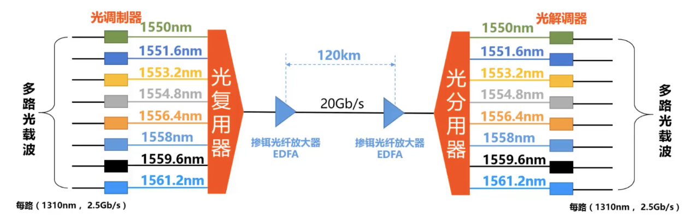
<!-- image-source: https://cdn.nlark.com/yuque/0/2026/png/67474974/1779341908188-d9c8e1b1-80a2-4816-88a6-ed4ec5aebf9d.png -->

**示例**：8路传输速率均为2.5Gbps的光载波（波长1310nm），经光调制后分别将波长变换到1550~1561.2nm（各光载波相隔1.6nm），经光复用器（合波器）在一根光纤中传输，总速率达8×2.5Gbps=20Gbps。

**掺铒光纤放大器（EDFA）**：对衰减的光信号进行放大（光信号传输一段时间会衰减），两个光纤放大器间光缆长度可达120km，光复用器和光分用器之间可放入四个掺铒光纤放大器，无光电转换距离可达600km。

##### 码分复用（CDM）与码分多址（CDMA）
码分复用是另一种共享信道方法，主要用于多址接入，更常用的名词是**码分多址（CDMA**：**C**ode **D**ivision **M**ultiple **A**ccess **）**。

> **复用与多址概念辨析**：
>
> + **复用**：将单一媒体的频带资源划分成多个相互独立、互不干扰的子信道，每个子信道只占用媒体频带资源的一部分；
> + **多址（多点接入）**：处理动态分配信道给用户，适用于用户仅暂时性占用信道的应用（如移动通信系统），而永久性分配信道的应用（如无线电广播）则不需要。频分多址（FDMA：**F**requency **D**ivision **M**ultiple **A**ccess）、时分多址（TDMA：**T**ime **D**ivision **M**ultiple **A**ccess）、码分多址可分别看成频分复用、时分复用、码分复用的应用。
>

**CDMA核心特点**：每一个用户可以在**同样的时间使用同样的频带进行通信**。由于**各用户使用经特殊挑选的不同码型**，因此各用户之间**不会造成干扰**。

**应用背景**：最初用于军事通信（信号抗干扰能力强，频谱类似白噪声不易被发现），随着技术进步，码分多址设备价格和体积大幅下降，现已广泛用于民用移动通信。

**码片序列**：

+ 每一个比特时间再划分为m个短的间隔，称为**码片**（chip）
+ m通常为64或128（为简单起见，常假设m=8）
+ 每个站被指派一个唯一的**m bit（比特）码片序列**（Chip Sequence）

**发送规则**：

+ 发送比特1：发送自己的**m比特码片序列**
+ 发送比特0：发送自己**m比特码片序列的二进制反码**

**示例**：站点码片序列00011011

+ 发送比特1：发送00011011
+ 发送比特0：发送11100100（二进制反码）

**书写惯例**：将码片序列中的0写为-1，1写为+1。上例码片序列写为：-1 -1 -1 +1 +1 -1 +1 +1

> 这种通信方式称为**直接序列扩频（DSSS）**。
>

**码片序列挑选原则**：

1. 分配给每个站的码片序列必须**各不相同**（实际常采用伪随机码序列）
2. 分配给每个站的码片序列必须**相互正交**（规格化内积为0）

**正交性公式**：向量S表示站S的码片序列，向量T表示其他任何站的码片序列。S和T的规格化内积为0：

<!-- 这是一张图片，ocr 内容为：S.T 三 M . S,T; 0 运1 -->
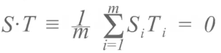
<!-- image-source: https://cdn.nlark.com/yuque/0/2026/png/67474974/1779342773540-8937bd86-fe6b-4360-82a8-57676853bf9f.png -->

**内积性质**：

+ 任何码片向量与自己的规格化内积：**1**
+ 任何码片向量与其他站码片反码向量的内积：**0**
+ 任何码片向量与该码片反码向量的内积：**-1**

**练习**：

例：站S码片序列01011101（向量S：-1 +1 -1 +1 +1 +1 -1 +1），站T码片序列10111000（向量T：+1 -1 +1 +1 +1 -1 -1 -1），分配正确吗？

码片序列各不相同，但计算S·T ≠ 0，不满足正交性要求，分配不正确。

**CDMA应用示例**：

假设A、B、C、D四个站点：

+ A发送比特1（发送向量A）
+ B发送比特0（发送向量B̄）
+ C未发送数据
+ D接收叠加信号

<!-- 这是一张图片，ocr 内容为：发送比特1 CDMA 发送A 发送比特0 B 发送B 接收到(A+B) 未发送 STOSTEO 参考公式 SSS三1SS三-1 -->
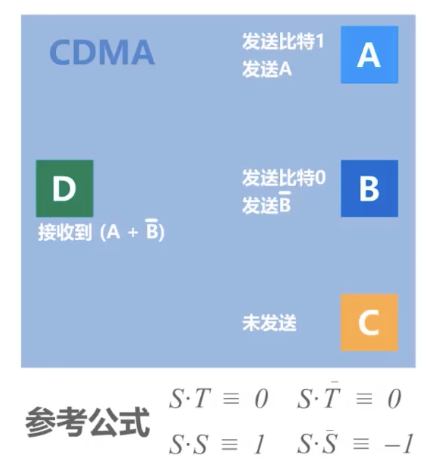
<!-- image-source: https://cdn.nlark.com/yuque/0/2026/png/67474974/1779343197793-e98aae15-168a-497e-8718-89b6ccbd7ef2.png -->

接收站D用各站码片向量进行规格化内积运算判断：

+ 与A的内积=1：A发送了比特1
+ 与B的内积=-1：B发送了比特0
+ 与C的内积=0：C未发送数据

<!-- 这是一张图片，ocr 内容为：计算结果为数值1, 发送比特1 B A CDMA 三1 (A+B)A 0 被判断方发送了比特1 发送A 计算结果为数值-1, 发送比特0 D (A+B)B)B +B B B 0二 (-1) 发送B 被判断方发送了比特0 接收到(A+B) 计算结果为数值0, B).C A C+B .B.C 未发送 (A 0+0- 被判断方未发送 -->
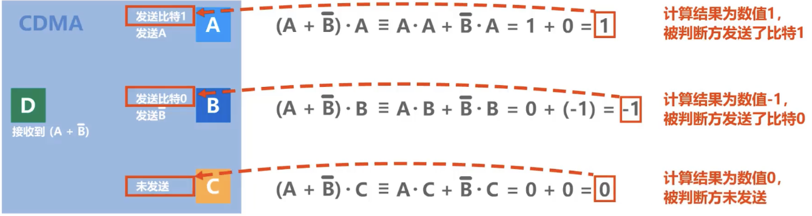
<!-- image-source: https://cdn.nlark.com/yuque/0/2026/png/67474974/1779343249471-52a7c8b7-6ad1-4965-83df-dc65849073f2.png -->

##### 练习
【习题】共有4个站进行CDMA通信，这4个站的码片序列分别为：

A: (-1 -1 -1 +1 +1 -1 +1 +1)  
B: (-1 -1 +1 -1 +1 +1 +1 -1)  
C: (-1 +1 -1 +1 +1 +1 -1 -1)  
D: (-1 +1 -1 -1 -1 -1 +1 -1)  

现收到码片序列(-1 +1 -3 +1 -1 -3 +1 +1)。问是哪些站发送了数据？发送的是比特1还是0？

【解析】用收到的码片序列分别与各站的码片序列进行求内积运算。若计算结果为数值1，则被判断的站发送了比特1；若计算结果为数值-1，则被判断的站发送了比特0；若计算结果为数值0，则被判断的站未发送数据。

---

**内积计算（归一化前）**

内积结果需除以码片长度8，得到归一化值（±1或0）。

1. **与A的内积**  
(-1)×(-1) + (-1)×(+1) + (-1)×(-3) + (+1)×(+1) + (+1)×(-1) + (-1)×(-3) + (+1)×(+1) + (+1)×(+1)  
= 1 + (-1) + 3 + 1 + (-1) + 3 + 1 + 1 = 8  
归一化：8/8 = 1 → **A发送了比特1**
2. **与B的内积**  
(-1)×(-1) + (-1)×(+1) + (+1)×(-3) + (-1)×(+1) + (+1)×(-1) + (+1)×(-3) + (+1)×(+1) + (-1)×(+1)  
= 1 + (-1) + (-3) + (-1) + (-1) + (-3) + 1 + (-1) = -8  
归一化：-8/8 = -1 → **B发送了比特0**
3. **与C的内积**  
(-1)×(-1) + (+1)×(+1) + (-1)×(-3) + (+1)×(+1) + (+1)×(-1) + (+1)×(-3) + (-1)×(+1) + (-1)×(+1)  
= 1 + 1 + 3 + 1 + (-1) + (-3) + (-1) + (-1) = 0  
归一化：0/8 = 0 → **C未发送数据**
4. **与D的内积**  
(-1)×(-1) + (+1)×(+1) + (-1)×(-3) + (-1)×(+1) + (-1)×(-1) + (-1)×(-3) + (+1)×(+1) + (-1)×(+1)  
= 1 + 1 + 3 + (-1) + 1 + 3 + 1 + (-1) = 8  
归一化：8/8 = 1 → **D发送了比特1**

---

【2014年 题37】站点A、B、C通过CDMA共享链路，A、B、C的码片序列（chipping sequence）分别是(1, 1, 1, 1)、(1, -1, 1, -1) 和 (1, 1, -1, -1)。若C从链路上收到的序列是 (2, 0, 2, 0, 0, -2, 0, -2, 0, 2, 0, 2)，则C收到A发送的数据是   **B**

A. 000 		B. 101		 C. 110 			D. 111  

【解析】  
由于题目所给各站的码片序列为4位，因此将站点C收到的序列分成三部分，每部分也由4位组成：  
(2, 0, 2, 0), (0, -2, 0, -2), (0, 2, 0, 2)  

将站点A的码片序列 (1, 1, 1, 1) 分别与上述三个部分进行内积运算，根据结果可判断出A发送的数据是  

(1, 1, 1, 1) · (2, 0, 2, 0) = (1×2 + 1×0 + 1×2 + 1×0) ÷ 4 = 1 → 发送比特1  
(1, 1, 1, 1) · (0, -2, 0, -2) = (1×0 + 1×(-2) + 1×0 + 1×(-2)) ÷ 4 = -1 → 发送比特0  
(1, 1, 1, 1) · (0, 2, 0, 2) = (1×0 + 1×2 + 1×0 + 1×2) ÷ 4 = 1 → 发送比特1  

因此A发送的数据为 101，选 B。

---

### 3.随机接入——CSMA/CD协议
以太网(Ethernet)协议名：**IEEE 802.3 以太网**（CSMA/CD协议包含于协议中）

#### （1）协议概述
<!-- 这是一张图片，ocr 内容为：碰撞 总线本身空闲,主机B和C同时发送数据,则传输信号发生碰撞(或称冲突) 碰撞 主机B正在占用总线传输数据,主机C也要发送数据,则传输信号发生碰撞 -->
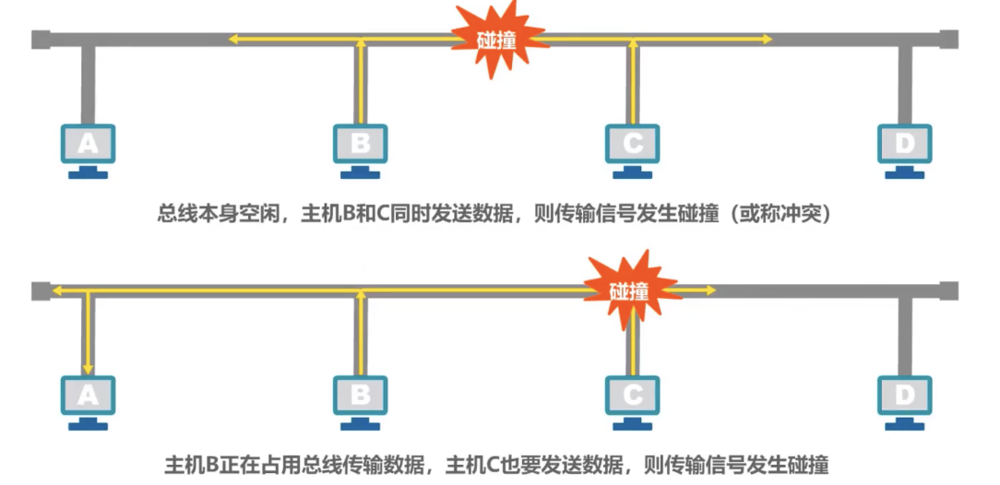
<!-- image-source: https://cdn.nlark.com/yuque/0/2026/png/67474974/1779346037550-eeb8b3e4-f91a-44c2-a2bb-ab97bb32ad32.png -->

早期共享式以太网采用**载波监听多址接入/碰撞检测（CSMA/CD**：**C**arrier **S**ense **M**ultiple **A**ccess/**C**ollision **D**etection **）** 协议来解决总线竞争问题。协议包含三个核心机制：

**多址接入（MA）**

多个主机（站点/站）连接在一条总线上，竞争使用总线。

**载波监听（CS）**

每一个站在发送帧之前，先检测总线上是否有其他站点在发送帧（可比喻为“**先听后说**”）：

+ 若检测到总线**空闲96比特时间**，则发送帧；
+ 若检测到总线**忙**，则继续检测，等待总线转为空闲96比特时间后再发送。

> **96比特时间**：发送96比特所耗费的时间，称为帧间最小间隔。作用：使接收方可以检测出一个帧的结束，同时使所有站点都能有机会平等竞争信道并发送帧。
>

**碰撞检测（CD）**

每一个正在发送帧的站**边发送边检测碰撞**（可比喻为“**边说边听**”）：

+ 一旦发现总线上出现碰撞，立即停止发送；
+ 退避一段随机时间后再次重新发送（可比喻为“一旦冲突，立即停说，等待时机重新再说”）。

#### （2）CSMA/CD工作过程示例

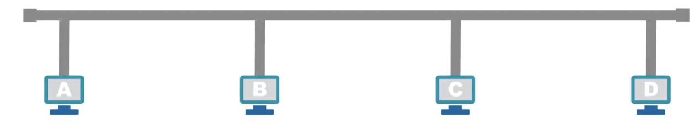
<!-- image-source: https://cdn.nlark.com/yuque/0/2026/png/67474974/1779346702590-b167df07-cb7b-4a7c-a072-ac15e486faad.png -->

**场景一：主机C发送帧**

主机C进行载波监听，检测到总线空闲96比特时间后发送帧。

**场景二：主机B在主机C发送过程中请求发送**

主机B进行载波监听，发现总线忙，持续检测。一旦发现总线空闲96比特时间，立即发送帧，**边发送边检测碰撞**。只要未检测到碰撞，继续发送帧的剩余部分。

<!-- 这是一张图片，ocr 内容为：奇 B 有帧要发送 信道空闲 96比特时间? 发送帧 检测到碰撞? -->
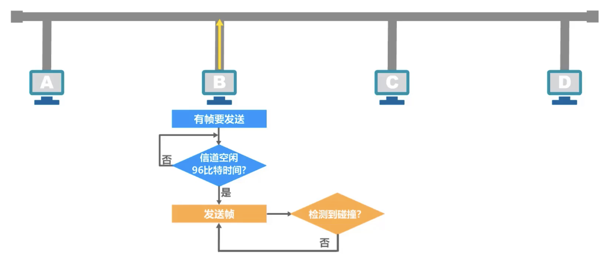
<!-- image-source: https://cdn.nlark.com/yuque/0/2026/png/67474974/1779346756702-d13a7b8c-62a4-4987-953f-ebcada6f43fb.png -->

**场景三：碰撞发生**

假设主机B发送帧过程中，主机C也要发送帧。主机C载波监听发现总线空闲96比特时间后立即发送帧，必然产生碰撞。在碰撞时刻，双方都在边发边检测，但暂时都检测不到碰撞。碰撞信号沿总线传播：

+ 主机C比主机B更早检测到碰撞，停止发送，退避随机时间后重发；
+ 主机B检测到碰撞后，立即停止发送，退避随机时间后重发。

<!-- 这是一张图片，ocr 内容为：碰撞 检测到碰撞 检测到碰撞 停止发送 停止发送 退避一段随机时间 退避一段随机时间 有帧要发送 信道空闲 退避一段随机时间 96比特时间? 是 发送帧 检测到碰撞? 否 -->
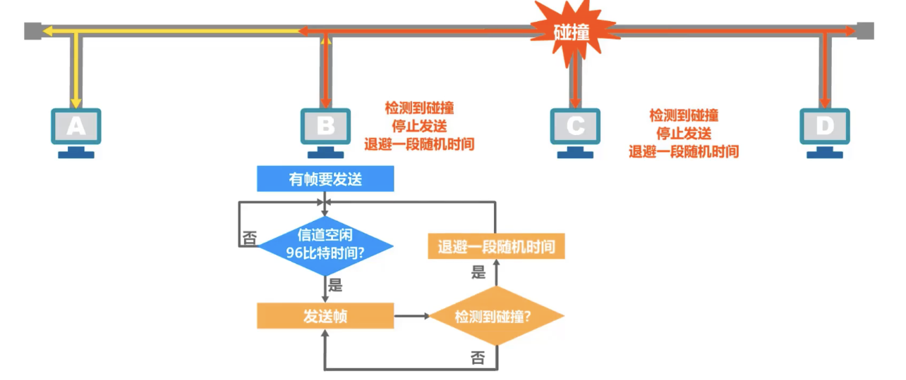
<!-- image-source: https://cdn.nlark.com/yuque/0/2026/png/67474974/1779346835484-201b08b0-8851-4fab-ba6e-9ea6a8dd15a8.png -->

**强化碰撞措施**

当发送帧的站点检测到碰撞时，除立即停止发送帧外，还要**再继续发送32比特或48比特的人为干扰信号**，以便有足够多的碰撞信号使所有站点都能检测出碰撞。

#### （3）争用期（碰撞窗口）概念
##### 争用期定义
<!-- 这是一张图片，ocr 内容为：以太网单程端到端传播时延T T0.A检测到信道空闲,发送数据-- T-8,D检测到信道空闲,发送数据 -T-8/2,发生碰撞 碰撞 -T,D检测到碰撞,停止发送 T2T-8,A检测到碰撞,停止发送-- T -->
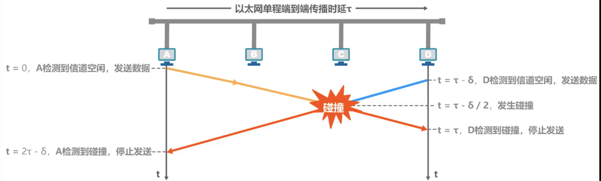
<!-- image-source: https://cdn.nlark.com/yuque/0/2026/png/67474974/1779347090240-f69fcc0a-9026-4e79-9682-f4f69667bb24.png -->

设主机A和D处于总线型以太网两端，以太网单程端到端传播时延为τ。

+ 时刻0：主机A检测到总线空闲96比特时间后发送帧；
+ 时刻(τ-δ)：主机D也要发送帧，检测到总线空闲96比特时间后立即发送（注意：主机D检测到总线空闲，但实际总线并不空闲，只是检测不出来），必然产生碰撞；
+ 碰撞时刻：τ-δ/2；
+ 主机D检测到碰撞时刻：τ；
+ 主机A检测到碰撞时刻：2τ-δ。

主机最多经过**2τ**（即δ趋近于0时）就可检测到本次发送是否遭受碰撞。因此，以太网的**端到端往返传播时延2τ**称为**争用期**或**碰撞窗口**。

发送帧的主机经过争用期这段时间还未检测到碰撞，才能肯定这次发送不会产生碰撞。每一主机在发送帧后的一小段时间内存在遭遇碰撞的可能，这段时间不确定，取决于另一个发送主机到本主机的距离，但不会超过争用期。

##### 争用期与网络规模限制
在以太网中，发送帧的主机越多，端到端往返传播时延越大，碰撞概率越大。因此**共享式以太网不能连接太多主机，总线不能太长**。

**10Mbps以太网参数**：

+ 争用期定为512比特发送时间，即51.2μs；
+ 总线长度不能超过5120m（考虑信号衰减等因素，规定不超过2500m）。

#### （4）最小帧长
<!-- 这是一张图片，ocr 内容为：碰撞 收到有差错的帧 发送完毕 不再针对该帧检测碰撞 丢弃 不知道已发送完毕的该 帧遭遇了碰撞, 不会重发该帧 -->
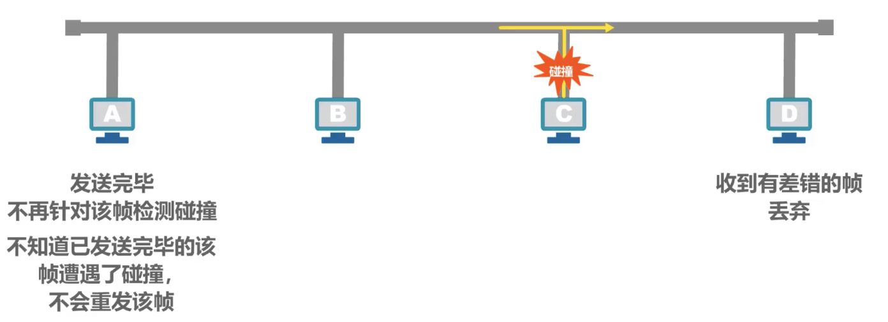
<!-- image-source: https://cdn.nlark.com/yuque/0/2026/png/67474974/1779347383218-345dc1fb-85cf-4df2-9d4c-448ca8d91b03.png -->

假设主机A给主机B发送一个很短的帧，边发送边检测碰撞。主机A很快发送完毕，之后不再针对该帧检测碰撞。若在该帧传输过程中，主机C检测到总线空闲96比特时间后立即发送帧（实际总线不空闲），必然产生碰撞。主机B最终收到遭遇碰撞的帧并丢弃，但主机A不知道已发送完毕的帧遭遇了碰撞，因此不会重发该帧。

为了确保 A 在发送完毕前能收到冲突信号，**A 发送整个数据帧的时间（传输时延）必须大于或等于 2τ**。如果帧太短，A 发完数据就停止监听了，此时远端传来的冲突信号 A 就收不到，A 会误以为数据发送成功，从而导致协议失效。

**最小帧长规定**

`最小帧长 = 数据传输速率 × 往返传播时延（争用期）`

由上例可知，使用CSMA/CD协议的以太网帧长不能太短。

+ **最小帧长**：64字节（512比特）
+ **512比特发送时间**即为争用期

如果要发送的数据非常少，必须加入填充字节使帧长不小于64字节。最小帧长确保主机可在帧发送完成前检测到该帧是否遭遇碰撞：

+ 如果在争用期（发送64字节所需时间）内未检测到碰撞，后续发送的数据一定不会发生碰撞；
+ 如果在争用期内检测到碰撞，立即终止发送，已发送的数据一定小于64字节。

> **结论**：凡长度小于64字节的帧，都是因碰撞而异常终止的无效帧。
>

---

##### 补充：传播速率、传输速率和发送速率的区别
**1. 传输速率 (Transmission Rate / Link Capacity)**

+ **别名**：链路带宽、物理速率、接口速率。
+ **定义**：物理介质（网线、光纤）和网卡硬件**理论上能支持的最大比特推送速度**。
+ **决定者**：由**硬件**决定（比如你买了一张千兆网卡，插了 Cat6 网线，传输速率就是 1Gbps）。
+ **特点**：它是一个**固定的物理上限**。

**2. 发送速率 (Sending Rate)**

+ **别名**：实际发送速率、应用层/传输层吞吐量。
+ **定义**：主机在一段时间内，**实际成功注入网络的数据量**。
+ **决定者**：由**软件协议（如 TCP 拥塞控制）、网络拥堵程度、接收方处理能力**共同决定。
+ **特点**：它是**动态变化**的，且**永远小于或等于**传输速率。

| 对比维度 | 传播速率 (Propagation Velocity) | 传输速率 (Transmission Rate / Bandwidth) | 发送速率 (Sending Rate) |
| :--- | :--- | :--- | :--- |
| **常见别名** | 传播速度、电磁波速度 | 带宽、接口速率、数据率、链路容量 | 实际发送速率、实际吞吐量 |
| **核心定义** | 电磁波（或光/电信号）在**物理介质中跑**的速度。 | 硬件接口在单位时间内能**往外推**的比特总数（物理极限）。 | 主机在单位时间内**实际成功注入**网络的数据量。 |
| **决定因素** | **传输介质的物理特性**（如折射率、材质）。   _(与带宽、数据量、网络拥堵完全无关！)_ | **硬件设备和协议标准**（如网卡、光纤、Wi-Fi标准）。 | **软件控制与网络环境**（如TCP拥塞控制、流量控制、网络拥堵情况）。 |
| **典型单位** | **米/秒 (m/s)** 或 千米/秒 (km/s) | **比特/秒 (bps, Mbps, Gbps)** | **比特/秒 (bps, Mbps, Gbps)** |
| **典型数值** | 光纤中约 $2.0 \times 10^8$ m/s   铜线中约 $2.3 \times 10^8$ m/s   真空中为光速 $3.0 \times 10^8$ m/s | 100 Mbps, 1 Gbps, 10 Gbps, Wi-Fi 6 的 9.6 Gbps 等 | 动态变化，通常 **小于或等于** 传输速率（带宽）。 |
| **影响的时延** | **传播时延** (Propagation Delay)   _(公式：距离 ÷ 传播速率)_ | **发送时延** (Transmission Delay)   _(公式：数据长度 ÷ 传输速率)_ | **信道利用率 / 实际吞吐量** |
| **通俗比喻** | **汽车在高速公路上行驶的极限车速**。（路修得再宽，光速/电磁波速度是物理死穴，无法突破）。 | **收费站闸机放行的速度**。（一秒钟能抬起杆子放行多少辆车，取决于闸机的性能）。 | **车队实际上路的速度**。（受限于路况拥堵、红绿灯，实际一小时开过去多少辆车）。 |


> 计算时传输速率和发送速率没有区别
>

---

##### 最小帧长例题
**【2009年题37】** 在一个采用CSMA/CD协议的网络中，传输介质是一根完整的电缆，传输速率为1Gbps，电缆中的信号传播速度是200 000km/s。若最小数据帧长度减少800比特，则最远的两个站点之间的距离至少需要  **D**

A. 增加160m  					B. 增加80m  

C. 减少160m  					D. 减少80m

最小帧长 = 争用期 × 数据传输速率，由题给条件推导出最远两个站点之间的距离为 $d(\text{m})$，最小帧长为$l(\text{bit})$  

$$
l = \left( \frac{d}{200000 \times 10^3} \times 2 \right) \times 10^9
$$

$$
d = \frac{l}{10}
$$

若最小帧长减少800比特，最远两站点距离至少减少80m。

---

#### （5）最大帧长与帧格式
**限制帧长的原因**

<!-- 这是一张图片，ocr 内容为：总线怎么还是忙啊 我正在给D发送 这个帧太长了 总线怎么还是忙啊 我的缓冲区快满了 我有帧要发,着急 我有帧要发,着急 一个很长的帧 边发送边检测碰撞 -->
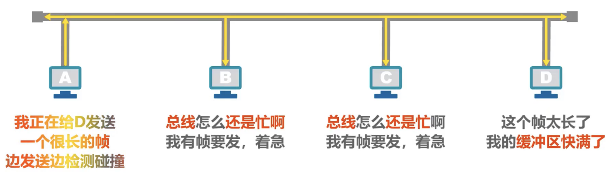
<!-- image-source: https://cdn.nlark.com/yuque/0/2026/png/67474974/1779347550948-d9029e4a-1861-4bde-afd0-ec3167630d34.png -->

+ 主机发送很长帧会长时间占用总线，其他主机迟迟拿不到总线使用权；
+ 帧过长可能导致接收方接收缓冲区溢出。

**以太网帧格式**

**以太网V2的MAC帧格式**：

<!-- 这是一张图片，ocr 内容为：以太网V2的MAC帧(最大长度为1518字节) 类型 数据载荷 源地址 FCS 目的地址 6 6 字节 2 46~1500字节 -->
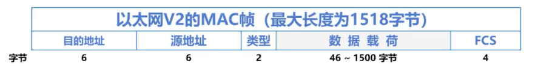
<!-- image-source: https://cdn.nlark.com/yuque/0/2026/png/67474974/1779347585375-7fb7268a-75ea-44a7-9e7c-f351099e1edb.png -->

+ 数据载荷最大长度：1500字节
+ 首部+尾部：18字节
+ 帧最大长度：**1518字节**
+ 数据载荷最小长度：46字节（加上首部尾部18字节，正好满足最小帧长64字节）

**插入VLAN标记字段后的802.1Q帧**：

<!-- 这是一张图片，ocr 内容为：插入VLAN标记后的802.1Q帧(最大长度为1522字节) 数据载荷 类型 源地址 FCS VLAN标记 目的地址 字节 42~1500字节 9 9 2 -->
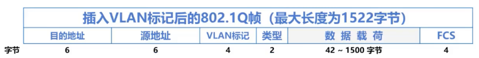
<!-- image-source: https://cdn.nlark.com/yuque/0/2026/png/67474974/1779347639923-85c96b46-5f9a-47ac-9ff3-5f499ed47850.png -->

+ 数据载荷最大长度：1500字节
+ 首部+尾部：22字节
+ 帧最大长度：**1522字节**
+ 数据载荷最小长度：42字节（加上首部尾部22字节，正好满足最小帧长64字节）

#### （6）退避算法——截断二进制指数退避
##### 算法公式
退避时间 = 基本退避时间 × 随机数r

+ 基本退避时间 = 争用期2τ
+ 随机数r：从离散整数集合${0, 1, ..., 2^k - 1}$中随机选出
+ $k = min(重传次数, 10)$

##### 计算示例
+ **第1次重传**：k = min(1, 10) = 1，集合{0, 1}，可能退避时间：0×2τ, 1×2τ
+ **第2次重传**：k = min(2, 10) = 2，集合{0, 1, 2, 3}，可能退避时间：0×2τ, 1×2τ, 2×2τ, 3×2τ
+ **第12次重传**：k = min(12, 10) = 10，集合{0, 1, ..., 1023}，可能退避时间：0×2τ ~ 1023×2τ

##### 算法特点
连续多次发生碰撞表明可能有较多主机参与竞争信道，退避算法**使重传需要推迟的平均时间随重传次数而增大**（**动态退避**），从而减**小碰撞概率**，有利于系统稳定。

当重传多达**16次**仍不能成功时，表明同时发送帧的主机太多以至于连续碰撞，则**丢弃该帧**并向高层报告。

#### （7）信道利用率分析
**极端情况**

<!-- 这是一张图片，ocr 内容为：可能发生多次碰撞,进行多次退避 争用期 发送成功 争用期 争用期 HE-辛 2TITI TO 发送一帧所需的平均时间 -->
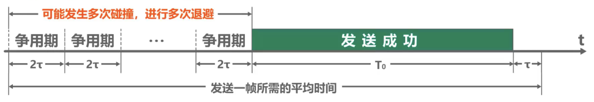
<!-- image-source: https://cdn.nlark.com/yuque/0/2026/png/67474974/1779348006451-f5f7c689-377e-42b0-9412-d25571e5ae63.png -->

设帧发送时延为T₀，单程端到端传播时延为τ（源主机和目的主机在总线的两端，相隔较远）。

发送一帧所需平均时间 = 多个争用期2τ + 一个帧发送时间T₀ + 一个单程端到端传播时延τ

**理想情况**

<!-- 这是一张图片，ocr 内容为：可能发生多次碰撞,进行多次退避 占用信道时间 发送成功 争用期 争用期 争用期 TRLI 21 TO 发送一帧所需的平均时间 -->
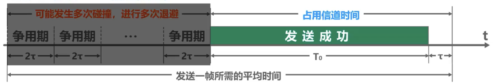
<!-- image-source: https://cdn.nlark.com/yuque/0/2026/png/67474974/1779348219750-b695f6ef-a802-43d1-aa64-e608114e41fc.png -->

各主机发送帧都不会产生碰撞，总线一旦空闲就有主机立即发送帧（争用期部分不存在）。

发送一帧占用总线时间 = $T₀ + τ$，帧本身发送时间为$T₀$。

极限信道利用率  $S_{max}=\frac{T₀}{T₀ + τ}$

参数$a = \frac{τ}{T₀}$,$S_{max}=\frac{1}{1 + a}$，为提高信道利用率，应使参数a尽量小：

+ $τ$尽量小：以太网端到端距离应受限，不应太长；
+ $T₀$尽量大：以太网帧长应尽量大一些。

#### （8）CSMA/CD协议流程
**帧发送流程**

<!-- 这是一张图片，ocr 内容为：封装成帧 重传次数C0 否 信道空闲 96比特时间? 检测到碰撞后的处理 载波监听 等待T时间 是 截断二进制指数算法 发送帧的第一比特 计算退避时间T 否 是 有碰撞? C15? 发送32或48比特干扰信号 C二C+1 否 是 继续发送帧的下一比特 达到最大重传次数 碰撞检测 发送完成? 放弃发送该帧并向高层报告 是 结束 -->
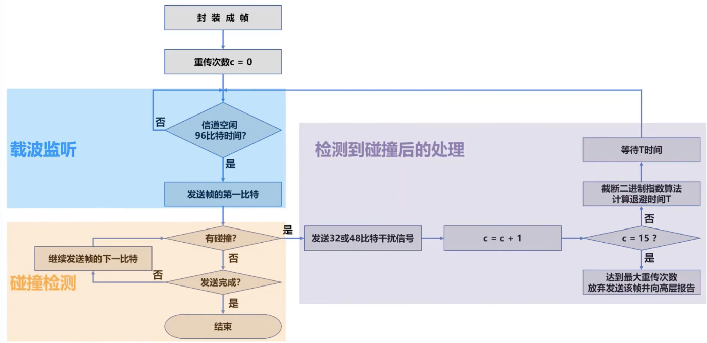
<!-- image-source: https://cdn.nlark.com/yuque/0/2026/png/67474974/1779348550912-e660bf34-28b8-4412-b99b-3ceb555906d4.png -->

**帧接收流程**

<!-- 这是一张图片，ocr 内容为：监听信道 否 信道活跃? 开始接收帧 否 接收完成? 是 是 小于最短帧长则认为遭遇了碰撞 帧太短? 否 帧的目的MAC地址与接收方的MAC地址 否 地址正确? 相同或是广播地址 是 否 使用CRC检查帧是否出现了误码 丢弃该帧 校验正确? 接收结束 接受该帧 -->
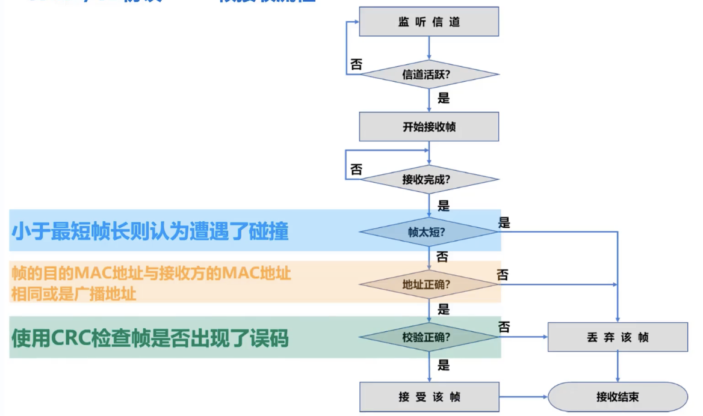
<!-- image-source: https://cdn.nlark.com/yuque/0/2026/png/67474974/1779348634654-2a3ca9e1-2557-40f1-a782-265bdba5f871.png -->

1. 若接收帧长度小于最短帧长（64字节），认为该帧遭遇碰撞，丢弃；
2. 检查目的MAC地址：若不匹配且非广播地址，丢弃；
3. 循环冗余校验（CRC）：若检测出误码，丢弃；
4. 通过上述三项检查，主机才能接受所收到的帧。

#### （9）练习题分析
**【2015年题36】** 下列关于CSMA/CD协议的叙述中，错误的是  **B**  

A. 边发送数据帧，边检测是否发生冲突  

B. 适用于无线网络，以实现无线链路共享  

C. 需要根据网络跨距和数据传输速率限定最小帧长  

D. 当信号传播延迟趋近于0时，信道利用率趋近100%

+ A ✓：碰撞检测是CSMA/CD协议的一部分
+ B ✗：CSMA/CD协议不适用于无线网络，无线网络使用CSMA/CA协议
+ C ✓：网络跨距给出端到端传播时延τ，进而得出争用期2τ，乘以数据速率即为最小帧长
+ D ✓：$S_{max}=\frac{1}{1 + \frac{τ}{T_0}}$当τ趋近于0时，信道利用率趋近于100%

---

**【2010年题47第一问】**

+ **最短冲突检测时间**：两主机同时发送数据时，信号传播到距离中点处的时间 + 碰撞信号传播回主机的时间，即单程传播时延<!-- 这是一张图片，ocr 内容为：2KM:20000 000KMLS 0.0LMS -->
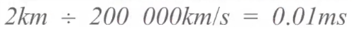
<!-- image-source: https://cdn.nlark.com/yuque/0/2026/png/67474974/1779349467166-94d64dab-c16b-46d7-8e1b-ddacdb6930ab.png -->

<!-- 这是一张图片，ocr 内容为：2KM 碰撞 主机乙 主机甲 碰撞信号 -->
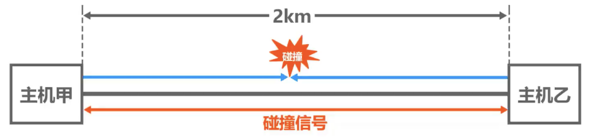
<!-- image-source: https://cdn.nlark.com/yuque/0/2026/png/67474974/1779349489173-3070edc4-4087-4e14-9f3b-61d5ced4c842.png -->

+ **最长冲突检测时间**：一主机发送数据信号传播到无限接近另一主机时，另一主机检测到信道空闲开始发送，主机甲检测到碰撞的最长时间为两台主机间信号往返时延（争用期2τ）<!-- 这是一张图片，ocr 内容为：(2KM - 200 000KMLS ) X 2 - 0.02MS -->
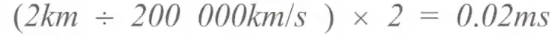
<!-- image-source: https://cdn.nlark.com/yuque/0/2026/png/67474974/1779349554746-209e7b91-3799-4b0d-82df-bccb320773be.png --> 

<!-- 这是一张图片，ocr 内容为：2KM 碰撞 主机甲 主机乙 碰撞信号 -->
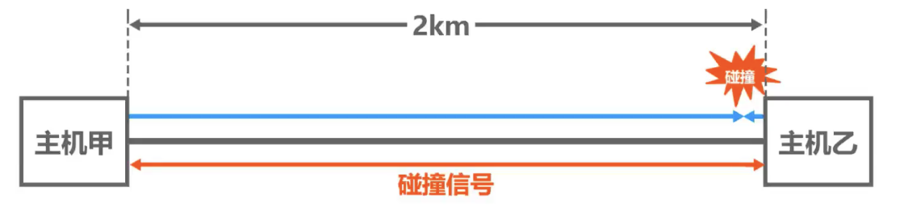
<!-- image-source: https://cdn.nlark.com/yuque/0/2026/png/67474974/1779349510568-af25201d-d860-4c97-8896-e50a57788807.png -->

> **注意**：CSMA/CD协议曾用于各种总线结构以太网和双绞线以太网的早期版本。现在的以太网基于交换机和全双工连接，不会有碰撞，因此没有必要使用CSMA/CD协议。
>

---

### 4.无线局域网MAC协议——CSMA/CA
无线局域网MAC协议名：**IEEE 802.11 Wi-Fi 协议**（CSMA/CA协议包含于IEEE 802.11 Wi-Fi 协议中）

#### （1）为什么无线局域网不能使用CSMA/CD？
在**无线局域网中仍可使用载波监听多址接入**（CSMA），即发送帧前先对传输媒体进行载波监听，若发现有其他站在发送帧则推迟发送以避免碰撞。

但**不能使用碰撞检测（CD）**，原因如下：

1. **信号强度差异巨大**：无线信道传输条件特殊，信号强度动态范围非常大。无线网卡接收到的信号强度往往远小于发送信号强度（可能相差百万倍），**实现碰撞检测对硬件要求极高**。
2. **隐蔽站问题**：即使硬件能实现碰撞检测，由于无线电波传播的特殊性（**隐蔽站问题**），**碰撞检测意义也不大**。

**隐蔽站问题示例**：


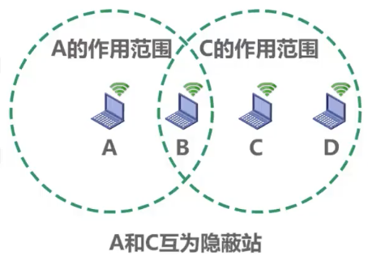
<!-- image-source: https://cdn.nlark.com/yuque/0/2026/png/67474974/1779520727588-1b572579-efde-4802-9c92-e8140db30917.png -->

+ A的信号覆盖B但不能覆盖C
+ C的信号覆盖B但不能覆盖A
+ A和C都检测不到对方信号
+ 当A和C同时给B发送帧时产生碰撞，但A和C都无法检测到碰撞

> 有线局域网不存在此问题：总线上信号最多经一个端到端传播时延就能被各主机接收，碰撞信号最多经一个往返传播时延也能传遍总线。
>

#### （2）802.11无线局域网解决方案
**802.11无线局域网**使用**CSMA/CA（载波监听多址接入/碰撞避免，C**arrier **S**ense **M**ultiple **A**ccess/**C**ollision **A**voidance **）** 协议，在CSMA基础上增加**CA（碰撞避免）** 功能，不再实现CD（碰撞检测）。

由于**不可能避免所有碰撞**，且**无线信道误码率较高**，802.11标准还使用**数据链路层确认机制（停止等待协议）** 来保证数据被正确接收。

#### （3）802.11 MAC层两种接入控制方式
**分布式协调功能（DCF：D**istributed **C**oordination **F**unction **）**

+ 没有中心控制站点
+ 每个站点使用CSMA/CA协议通过争用信道获取发送权
+ **802.11定义的默认方式**

**点协调功能（PCF）**

+ 使用集中控制的接入算法（一般在接入点AP实现集中控制）
+ 802.11定义的**可选方式**，实际中较少使用

#### （4）帧间间隔（IFS）
802.11标准规定所有**站点必须在持续检测到信道空闲一段指定时间后才能发送帧**，这段时间称为**帧间间隔（IFS：I**nter **F**rame **S**pace **）**。

帧间间隔长短取决于站点要发送帧的类型：

+ **高优先级帧**等待时间较短，可优先获得发送权
+ **低优先级帧**等待时间较长，若低优先级帧未发送而高优先级帧已发送到信道，则信道变忙，低优先级帧只能推迟发送，减少碰撞机会

**常用帧间间隔**：

| 类型 | 长度 | 用途 |
| --- | --- | --- |
| SIFS（短帧间间隔） | 28μs | 最短间隔，分隔属于一次对话的各帧（站点应从发送方式切换到接收方式）。用于：ACK帧、CTS帧、过长MAC帧分片后的数据帧、回答AP探寻的帧、PCF方式中AP发出的任何帧 |
| DIFS（DCF帧间间隔） | 128μs | 在DCF方式中用于发送数据帧和管理帧 |


#### （5）CSMA/CA协议工作原理

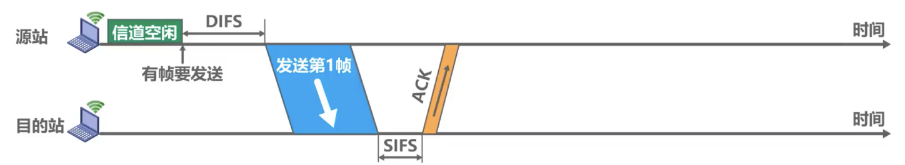
<!-- image-source: https://cdn.nlark.com/yuque/0/2026/png/67474974/1779521299790-48029042-d1c6-45ec-94a2-76a025cd4d63.png -->

**基本流程**：

1. 源站检测到信道空闲，等待DIFS后发送数据帧
2. 目的站正确收到数据帧，经过SIFS后向源站发送ACK确认帧
3. 若源站在规定时间（由重传计时器控制）内未收到ACK，必须重传数据帧，直到收到确认或经若干次重传失败后放弃发送

**设计考虑**：

+ 源站检测到信道空闲后等待DIFS才发送：考虑到可能有其他站有高优先级帧要发送
+ 目的站正确接收后等待SIFS才发送ACK：SIFS是最短帧间间隔，用于分隔一次对话的各帧，站点在此期间从发送方式切换到接收方式

#### （6）退避机制

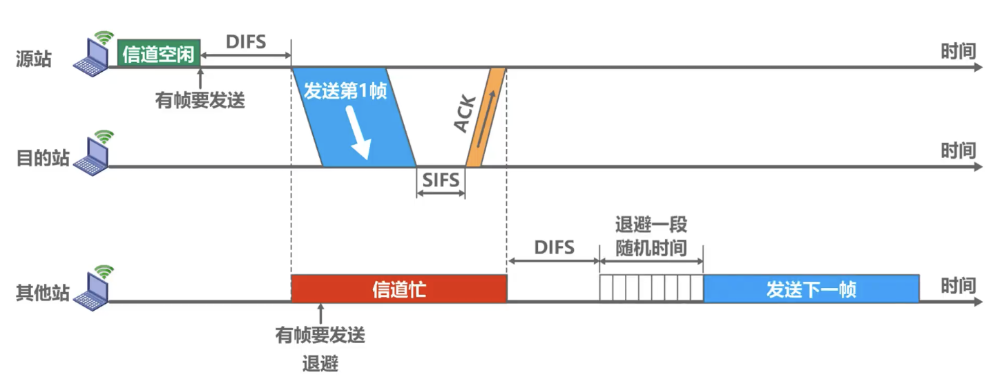
<!-- image-source: https://cdn.nlark.com/yuque/0/2026/png/67474974/1779521427748-30620267-f1bf-4d12-867a-01efd3b3d735.png -->

**为什么需要退避**：当信道从忙转为空闲并经过DIFS后，其他要发送数据的站点需退避一段随机时间才能发送，防止多个站点同时发送数据产生碰撞。

**不使用退避的情况**：站点检测到信道空闲，且所发送数据帧不是成功发送完上一个数据帧后立即连续发送的数据帧。

**必须使用退避的情况**：

1. 发送数据帧前检测到信道处于忙状态
2. 每一次重传数据帧时
3. 每一次成功发送后要连续发送下一个帧时（避免一个站点长时间占用信道）

**退避算法**：

+ 站点为退避计时器设置随机退避时间
+ 退避计时器减到0时开始发送数据
+ 退避计时器未到0而信道变忙时，**冻结**退避计时器数值
+ 重新等待信道空闲，经过DIFS后继续启动退避计时器（从冻结值继续倒计时）

**退避时间计算**：

+ 退避时间 = 时隙编号（$Random(0,1,… ,2^{2+i} - 1)$）× 时隙长度（基本退避时间）
+ i：第i次退避
+ 当$2^{2+i} - 1$达到255（对应第6次退避）时不再增加
+ 从较大范围随机选择使不同站点选择相同退避时间的概率减少

**退避过程示例**（A、B、C、D、E五个站点）：


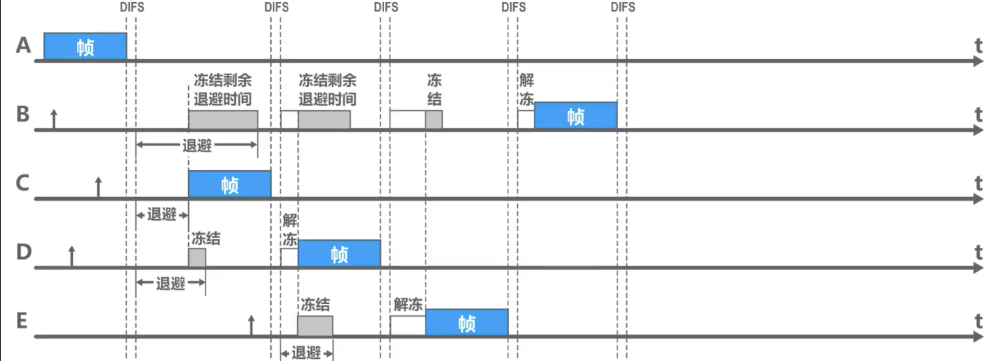
<!-- image-source: https://cdn.nlark.com/yuque/0/2026/png/67474974/1779522186322-1a0ec6ee-f63a-44a7-b811-28ea4bf0e6e0.png -->

1. A占用信道发送帧，B、C、D需要发送，检测信道忙，各自选择随机退避时间
2. 信道由忙转空闲，经DIFS后退避计时器开始倒计时
3. C退避时间最短，到时后立即发送帧，信道变忙
4. B和D检测到信道忙，冻结各自剩余退避时间
5. E也要发送帧，检测信道忙，选择随机退避时间
6. C发送完毕，信道空闲经DIFS后，B和D从冻结值继续倒计时
7. D的退避计时器先到时，D开始发送，B和E冻结
8. 依此类推，直至各站完成发送

> **注意**：若某站发送完一帧后还有帧要发送，检测信道空闲经DIFS后必须再退避一段随机时间才能发送。
>

#### （7）信道预约与虚拟载波监听
为**减少碰撞概率**和降低碰撞影响，802.11标准允许要发送数据的站点**对信道进行预约**。


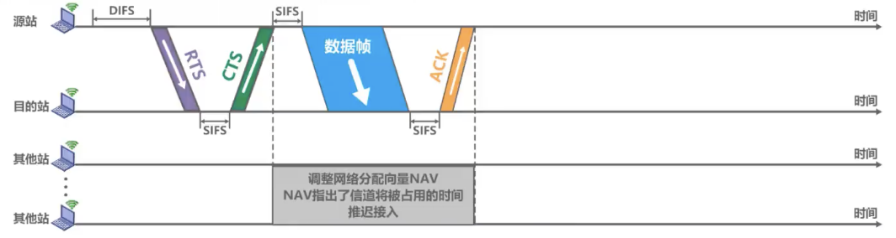
<!-- image-source: https://cdn.nlark.com/yuque/0/2026/png/67474974/1779523100098-693cdddc-b1be-472b-b137-d01aedc07665.png -->

**RTS/CTS机制**：

1. 源站发送数据帧前先发送**RTS（请求发送，R**equest **T**o **S**end **）** 短控制帧，包含源地址、目的地址及通信所需持续时间
2. 目的站正确收到RTS，经SIFS后发送**CTS（允许发送，C**lear **T**o **S**end **）** 响应控制帧，同样包含通信所需持续时间
3. 源站收到CTS，等待SIFS后发送数据帧
4. 目的站正确收到数据帧，等待SIFS后发送ACK确认帧

**作用**：除源站和目的站外的其他站，收到CTS帧或数据帧后推迟接入，保证源站和目的站通信不受干扰。

**RTS帧碰撞处理**：若RTS帧发生碰撞，源站收不到CTS帧，执行退避算法重传RTS帧。

**优势**：RTS帧和CTS帧很短，碰撞概率、碰撞开销及本身开销都很小。数据帧发送时延往往大于传播时延，碰撞概率大，一旦发生碰撞重发浪费很多时间。因此用很小代价预约信道往往是值得的。

**使用选择**（802.11规定三种情况供用户选择）：

1. 使用RTS帧和CTS帧
2. 不使用RTS帧和CTS帧
3. 仅当数据帧长度超过某一数值时才使用RTS帧和CTS帧

**虚拟载波监听**：

除RTS和CTS帧外，数据帧也能携带通信需要持续的时间。**站点只需监听到RTS帧、CTS帧或数据帧中的任何一个，就能知道信道被占用的持续时间**，不需要真正监听到信道上的信号，因此**虚拟载波监听解决隐蔽站带来的碰撞问题。**

**虚拟载波监听解决隐蔽站问题**：


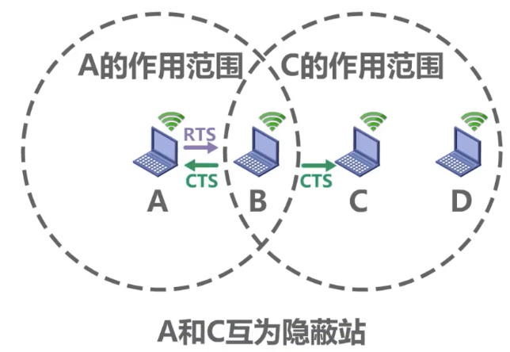
<!-- image-source: https://cdn.nlark.com/yuque/0/2026/png/67474974/1779523852586-21c87994-c749-4ee1-99f7-4206b6993170.png -->

A和C互为隐蔽站（A信号覆盖B不覆盖C，C信号覆盖B不覆盖A）。A给B发送数据前使用RTS帧预约信道：

+ C收不到RTS帧
+ 但C可收到B发送给A的CTS帧
+ C得知信道将被占用多长时间，在此期间不争用信道
+ 结果：A给B发送数据帧时不会受C干扰

#### （8）相关协议对比练习
**【2011年题36】** 下列选项中，对正确接收到的数据帧进行确认的MAC协议是  **D**

A.CSMA		 B.CDMA		 C.CSMA/CD 		D.CSMA/CA

| 协议 | 特点 | 确认机制 |
| --- | --- | --- |
| CSMA | 载波监听多址接入 | 不使用 |
| CSMA/CD | 载波监听多址接入/碰撞检测，早期共享总线以太网协议 | 不使用 |
| CSMA/CA | 载波监听多址接入/碰撞避免，802.11无线局域网协议 | 使用停止等待协议（无线信道通信质量远不如有线，每发完一个数据帧需收到确认才能继续发送下一帧） |
| CDMA | 码分多址，属于静态划分信道，物理层信道复用技术 | 不属于MAC协议 |


**【2013年题36】** 下列介质访问控制方法中，可能发 ,可能发生冲突的是	**B**

A.CDMA 		B.CSMA		 C.TDMA 		D.FDMA

+ CDMA（码分多址）、TDMA（时分多址）、FDMA（频分多址）：物理层信道复用技术，静态划分信道，多用户共享信道不会发生冲突
+ CSMA（载波监听多址接入）：争用型MAC协议，以竞争方式发送数据帧，可能出现冲突（碰撞）

**【2018年题35】** IEEE 802.11无线局域网的MAC协议CSMA/CA进行信道预约的方法是	**D**

A.发送确认帧 				B.采用二进制指数退避

C.使用多个MAC地址 			D.交换RTS与CTS帧

CSMA/CA协议使用RTS帧和CTS帧预约信道，它们都携带有通信需要持续的时间。此外数据帧也能携带通信需要持续时间，这是802.11的虚拟载波监听机制。

---

### 5.学习总结
#### （1）媒体接入控制技术体系
```plain
媒体接入控制（MAC）
├── 静态划分信道
│   ├── 频分多址（FDMA）
│   ├── 时分多址（TDMA）
│   └── 码分多址（CDMA）
└── 动态接入控制
    ├── 受控接入
    │   ├── 集中控制（轮询协议，有单点故障问题）
    │   └── 分散控制（令牌传递协议，如IEEE 802.5、802.4、FDDI）
    └── 随机接入
        ├── CSMA/CD（有线以太网早期使用，现已被交换式局域网取代）
        └── CSMA/CA（无线局域网802.11使用，配合停止等待确认机制）
```

#### （2）关键参数对比
| 参数/概念 | CSMA/CD（有线以太网） | CSMA/CA（无线局域网802.11） |
| --- | --- | --- |
| 核心机制 | 碰撞检测（CD） | 碰撞避免（CA）+ 确认重传 |
| 最小帧长 | 64字节 | — |
| 争用期 | 2τ（512比特时间@10Mbps） | — |
| 帧间间隔 | 96比特时间 | SIFS(28μs)/DIFS(128μs) |
| 退避算法 | 截断二进制指数退避 | 二进制指数退避（冻结机制） |
| 信道预约 | 无 | RTS/CTS + 虚拟载波监听 |
| 确认机制 | 无（CRC检错） | 停止等待协议（ACK确认） |
| 当前应用 | 已被全双工交换式以太网取代 | 无线局域网标准协议 |


#### （3）重要演变趋势
+ **有线局域网**：共享式以太网（CSMA/CD）→ 交换式以太网（全双工，无碰撞，无需CSMA/CD）
+ **无线局域网**：因广播特性和隐蔽站问题，仍使用共享媒体技术（CSMA/CA + 碰撞避免机制）

## 七、MAC地址、IP地址以及**ARP**协议
**概述**

+ **MAC地址**：是以太网MAC子层所使用的地址，属于**数据链路层**的范畴。
+ **IP地址**：是TCP/IP体系结构网际层所使用的地址，属于**网际层**的范畴。
+ **ARP协议**：属于TCP/IP体系结构的网际层，其作用是在已知设备IP地址的情况下，通过ARP协议获取到设备对应的MAC地址。

尽管IP地址和ARP协议属于TCP/IP体系结构的网际层，但它们与MAC地址存在紧密关系，且日常的网络应用都离不开这三者，因此将它们放在一起讨论。

---

### 1.MAC地址
#### （1）为什么需要MAC地址
+ **点对点信道**：连接在信道上的主机只有两个，不需要使用地址即可通信。


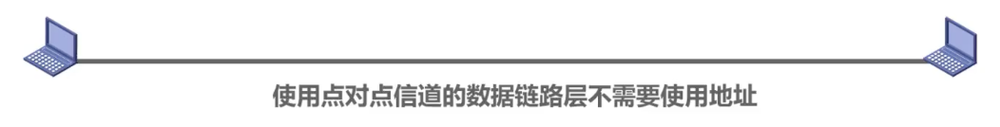
<!-- image-source: https://cdn.nlark.com/yuque/0/2026/png/67474974/1779780016053-436d40eb-46a0-460c-b2a1-42da4c435ac5.png -->

+ **广播信道（如总线型局域网）**：信号通过总线会传送到所有主机。为了判断帧是否是发送给自己的，必须使用地址来区分各主机。每个主机都必须有一个唯一的标识，即数据链路层地址。这类用于**媒体接入控制**的地址，英文缩写为MAC（**M**edia **A**ccess **C**ontrol）。


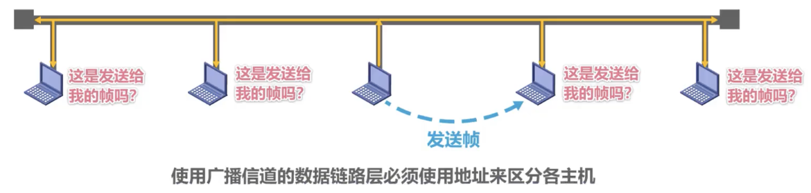
<!-- image-source: https://cdn.nlark.com/yuque/0/2026/png/67474974/1779780043368-7e8a726f-c92e-44ed-8d50-0b8f9ac2b757.png -->

#### （2）MAC地址的封装与识别
在发送帧时，**帧首部**需填入目的地址和源地址：

+ **目的地址**：接收主机的MAC地址。
+ **源地址**：发送主机的MAC地址。  
总线上其他主机收到帧后，根据帧首部中的目的地址是否与自己的MAC地址匹配，决定**接受**该帧还是**丢弃**该帧。


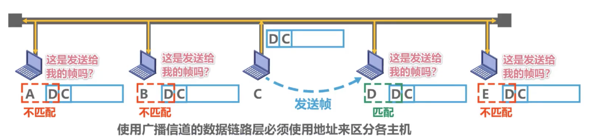
<!-- image-source: https://cdn.nlark.com/yuque/0/2026/png/67474974/1779780220985-3e089f95-9a92-43d3-aadf-bc6cfc6a8b80.png -->

#### （3）硬件实现与物理地址辨析
+ **固化位置**：MAC地址一般被固化在网卡的电可擦可编程只读存储器（EEPROM）中，因此也称为**硬件地址**。
    - _硬件示例_：以Realtek 8169SC千兆以太网卡为例，其EEPROM芯片（如93C46）用于存储MAC地址及网卡信息。


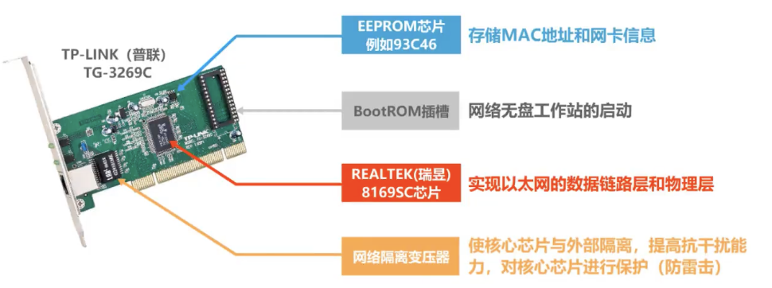
<!-- image-source: https://cdn.nlark.com/yuque/0/2026/png/67474974/1779780365360-36481075-2275-4b97-9926-1d0b8d6dc411.png -->

- _其他组件_：Boot ROM插槽（用于无盘工作站启动）、网络隔离变压器（防雷击与抗干扰）。
- MAC地址常被称为物理地址，但**绝不属于物理层**，而是属于**数据链路层**。切忌仅凭“物理”二字进行字面理解。


<!-- image-source: https://cdn.nlark.com/yuque/0/2026/png/67474974/1779780435503-d5052ebc-dec7-4e66-98e2-d2447045256a.png -->

#### （4）MAC地址的归属
+ 严格来说，MAC地址是**对网络上各接口的唯一标识**，而不是对网络上各设备的唯一标识。
+ 用户主机通常包含有线网卡和无线网卡，各自拥有一个全球唯一的MAC地址；交换机和路由器拥有更多接口，因此拥有更多MAC地址。

#### （5）MAC地址格式（IEEE 802标准）

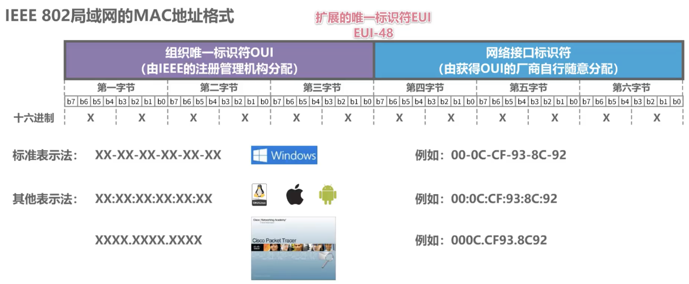
<!-- image-source: https://cdn.nlark.com/yuque/0/2026/png/67474974/1779780599667-784aed54-bee0-4ea1-bef7-f18e7abe60ab.png -->

+ **构成**：由**48个比特**（6个字节）构成，从左至右依次为第一到第六字节。
    - **前3个字节**：组织唯一标识符（OUI），厂商需向IEEE注册申请。
    - **后3个字节**：由获得OUI的厂商自行分配，称为扩展的唯一标识符（EUI-48）。
+ **表示方法**：
    - 每4个比特写成一个十六进制字符，共12个字符。
    - **短线分隔**（Windows风格）：每2个字符一组，用“-”连接。
    - **冒号分隔**（Linux/苹果/安卓风格）：每2个字符一组，用“:”连接。
    - **点分隔**（Packet Tracer风格）：每4个字符一组，用“.”连接。
+ **厂商查询**：已知MAC地址可通过IEEE官网或第三方查询网站获取设备的厂商信息。

#### （6）MAC地址的分类
第一个字节的特定比特位决定了地址类型：


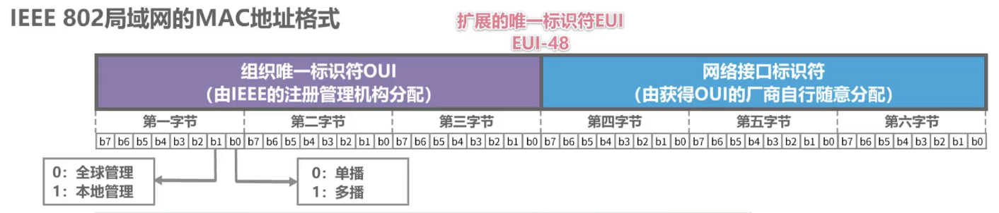
<!-- image-source: https://cdn.nlark.com/yuque/0/2026/png/67474974/1779781144897-92fae5a5-26c7-4551-8e63-71cc14cc63a9.png -->

+ **b0位**：0为单播地址，1为多播（组播）地址。
+ **b1位**：0为全球管理（全球唯一），1为本地管理。
+ **快速判断多播**：若第一个十六进制字符不能整除2（即为1, 3, 5, 7, 9, B, D, F），则是多播地址。

主要分为四类：


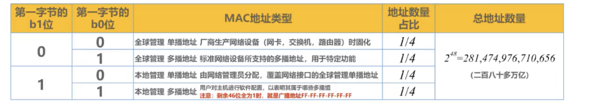
<!-- image-source: https://cdn.nlark.com/yuque/0/2026/png/67474974/1779781156615-89b084d0-9082-41c3-a2df-44da0c39fb5e.png -->

1. **全球单播**：厂商固化，接口唯一（笔记本、台式机、手机的以太网接口、Wi-Fi接口、蓝牙接口）。
2. **全球多播**：标准网络设备支持的特定功能地址（如生成树协议）。
3. **本地单播**：网络管理员分配，优先级高于全球单播。
4. **本地多播**：软件配置，表明主机属于哪些多播组。

**特别注意**：48比特全为1（即全F）是**广播地址**。

#### （7）发送顺序与工作示例
+ **发送顺序**：字节顺序为第1到第6字节；字节内比特顺序为b0到b7。


<!-- image-source: https://cdn.nlark.com/yuque/0/2026/png/67474974/1779781337420-c39ee7a3-3242-40e1-9ce4-aa01fe35cea0.png -->

+ **单播**：帧中填入目的单播地址（帧首部：目的地址字段（目的主机的MAC地址）+原地址字段（自己的MAC地址）），只有目的主机接受并处理（目的主机的网卡发现该单播帧的目的MAC地址与自己的MAC地址匹配），其他主机丢弃（其他主机的网卡发现该单播帧的目的MAC地址与自己的MAC地址不匹配）。


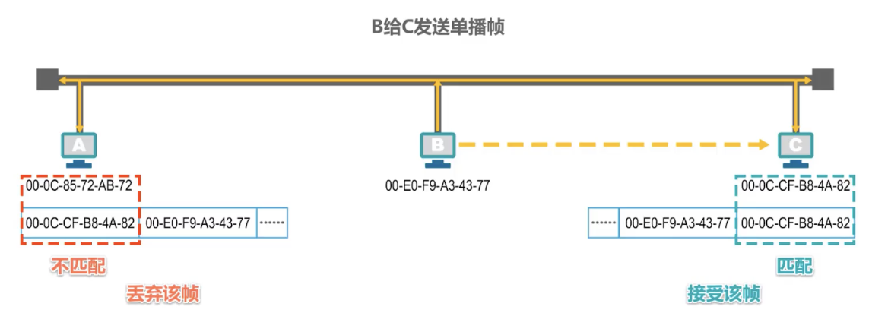
<!-- image-source: https://cdn.nlark.com/yuque/0/2026/png/67474974/1779781993513-cc07efa8-9e22-43db-9a31-1c9434f250df.png -->

+ **广播**：目的地址填入全F，网段内所有主机接受并处理（收到广播帧的主机的网卡发现帧首部的目的地址是广播地址）。


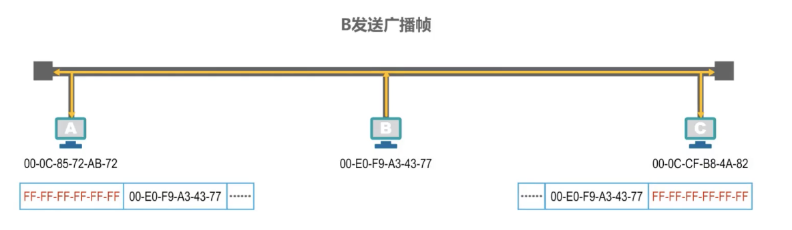
<!-- image-source: https://cdn.nlark.com/yuque/0/2026/png/67474974/1779782006997-05106f34-af82-4438-95a1-095460b817d3.png -->

+ **多播**：主机需配置多播组列表。只有列表中含有该多播地址的主机才接受帧。


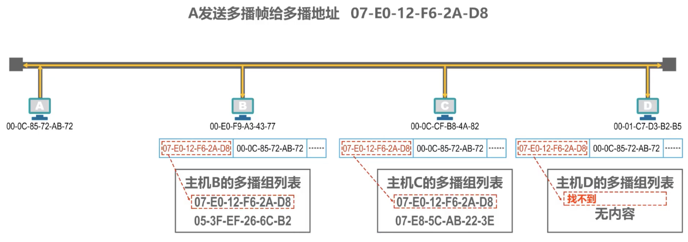
<!-- image-source: https://cdn.nlark.com/yuque/0/2026/png/67474974/1779782135222-820905da-79cb-439c-88aa-596827aca680.png -->

#### （8）随机MAC地址
出于隐私保护（防止通过Wi-Fi探针跟踪用户），自iOS、Windows 10及安卓6.0起，移动设备扫描网络时普遍采用**随机MAC地址**技术。

---

### 2.IP地址
####  （1）IP地址的作用
IP地址属于**网络层**的范畴，用于标识两部分信息：

+ **网络编号**：标识因特网上的特定网络。
+ **主机编号**：标识同一网络上的不同主机或路由器接口。


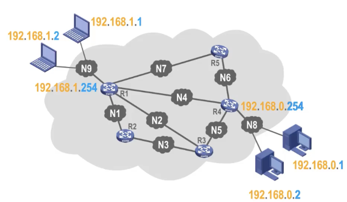
<!-- image-source: https://cdn.nlark.com/yuque/0/2026/png/67474974/1779782480054-2b831bd5-e248-4a58-90c2-9817f41a3e37.png -->

**核心特性**：同一个网络上所有接口的IP地址，**网络号部分必须相同，主机号部分必须互不相同**。  
MAC地址不具备区分不同网络的功能；若主机需接入因特网，则IP地址和MAC地址需同时使用。

#### （2）体系结构中的封装位置

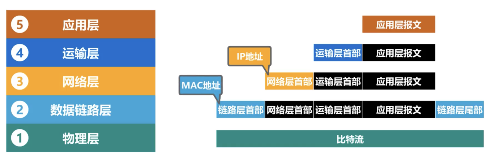
<!-- image-source: https://cdn.nlark.com/yuque/0/2026/png/67474974/1779782992370-4855136b-5db8-4ca9-9c8b-16a2df01f6ab.png -->

以五层原理体系结构为例：

+ **网络层首部**：封装有**源IP地址**和**目的IP地址**。
+ **数据链路层首部**：封装有**源MAC地址**和**目的MAC地址**。  
下层看不懂也无需看懂上层的内容，仅作为载荷进行封装。

#### （3）数据包转发中的地址变化规律
主机有完整的体系结构，而路由器最高工作到网络层。


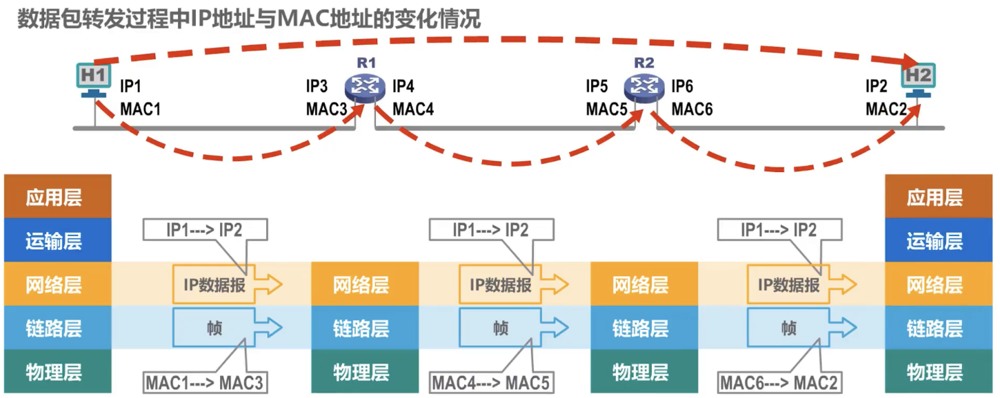
<!-- image-source: https://cdn.nlark.com/yuque/0/2026/png/67474974/1779783219153-bfdd4269-a6b2-43c8-aacb-c7bd9cb13120.png -->


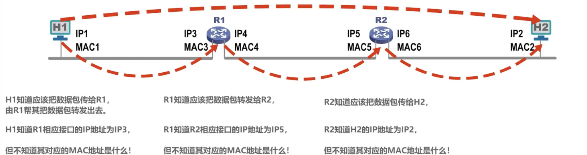
<!-- image-source: https://cdn.nlark.com/yuque/0/2026/png/67474974/1779783382406-304d4c4e-b13d-4367-bf5e-48354bd4dc11.png -->

+ **IP地址**：在数据包从源主机到目的主机的全过程中，**源IP地址和目的IP地址始终保持不变**。
+ **MAC地址**：每经过一段链路（或一个网络），**源MAC地址和目的MAC地址都会改变**，变为当前段两端接口的MAC地址。

---

【2018年 题37】路由器R通过以太网交换机S1和S2连接两个网络，R的接口、主机H1和H2的IP地址与MAC地址如下图所示。若H1向H2发送一个IP分组P，则H1发出的封装P的以太网帧的目的MAC地址、H2收到的封装P的以太网帧的源MAC地址分别是  **D**

A. 00-a1-b2-c3-d4-62  00-1a-2b-3c-d4-52  

B. 00-a1-b2-c3-d4-62  00-1a-2b-3c-d4-61  

C. 00-1a-2b-3c-d4-51  00-1a-2b-3c-d4-52  

D. 00-1a-2b-3c-d4-51  00-1a-2b-3c-d4-61


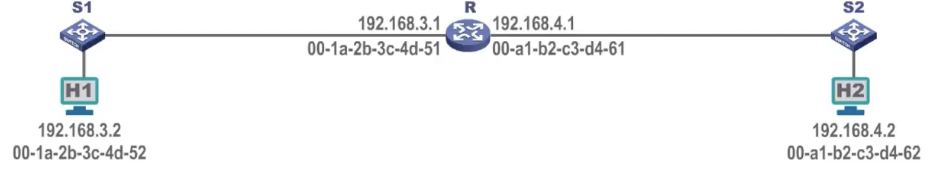
<!-- image-source: https://cdn.nlark.com/yuque/0/2026/png/67474974/1779783765336-10d73f40-3c19-4284-95d5-97935106e7b6.png --> 

在主机H1向H2发送数据的路径（H1 -> R -> H2）中：


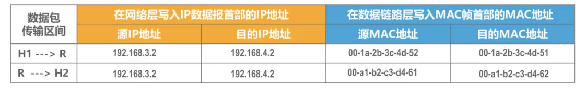
<!-- image-source: https://cdn.nlark.com/yuque/0/2026/png/67474974/1779783802828-db7fb774-a3c8-4ac9-8e49-3cc444031c1e.png -->

1. **H1到R**：目的IP填H2的IP，目的MAC填R接口的MAC。
2. **R到H2**：目的IP仍填H2的IP，目的MAC改填H2的MAC。原IP始终为H1。

---

### 3.ARP协议（地址解析协议）
#### （1）引入问题
主机在发送数据前，知道目标的IP地址，但不知道其对应的MAC地址，无法封装数据链路层帧。ARP协议的作用就是**根据IP地址解析出对应的MAC地址**。

#### （2）工作原理

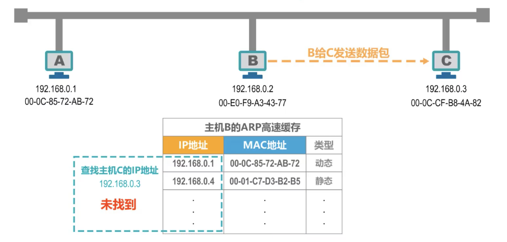
<!-- image-source: https://cdn.nlark.com/yuque/0/2026/png/67474974/1779784100726-c209f98b-8e96-42dd-be5a-220e9668e993.png -->

**场景**：主机B（IP: 192.168.0.2）要给主机C（IP: 192.168.0.3）发送数据。

1. **查表**：B首先查找自己的**ARP高速缓存表**。若未找到C的对应记录，则暂停发送数据。
2. **请求（广播）**：B发送ARP请求报文（封装在广播帧中）。


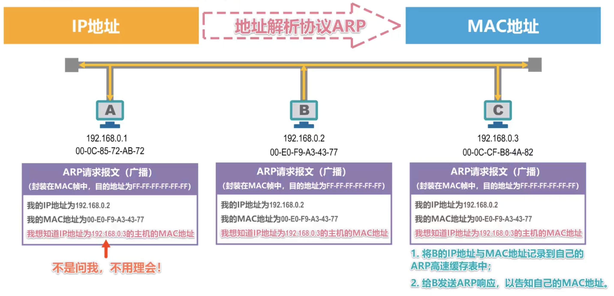
<!-- image-source: https://cdn.nlark.com/yuque/0/2026/png/67474974/1782546922116-16fb4ba9-3440-45d4-8935-84501f0641c0.png -->

- 询问内容：“谁是192.168.0.3？请把你的MAC地址告诉192.168.0.2。”
- 网络内所有主机收到此请求。

3. **应答（单播）**：C收到后，发现询问的是自己。


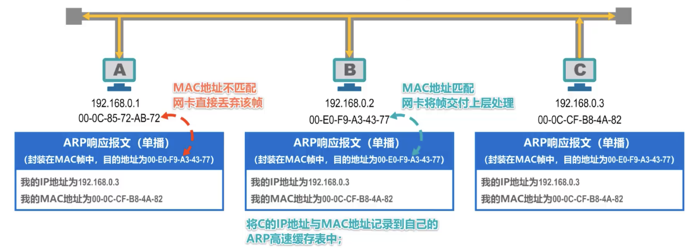
<!-- image-source: https://cdn.nlark.com/yuque/0/2026/png/67474974/1779784295963-a481194a-703c-45b2-89e6-0de2c779484f.png -->

- C先将B的IP和MAC映射存入自己的缓存表。
- C发送ARP响应报文（封装在单播帧中，目的MAC就是B的MAC）。
- B收到响应后，将C的IP和MAC映射存入缓存表。

4. **发送数据**：B此时有了C的MAC地址，即可发送此前积压的数据包。


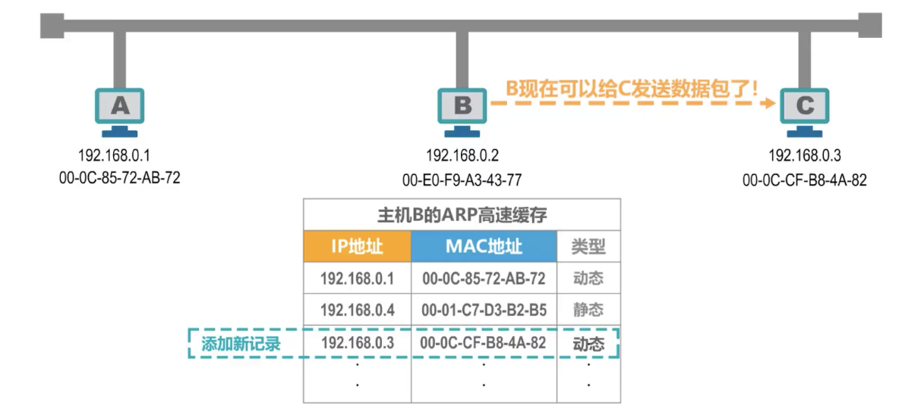
<!-- image-source: https://cdn.nlark.com/yuque/0/2026/png/67474974/1779784319995-7506d6c5-bf18-4dac-9a84-f07c017ed481.png -->

#### （3）ARP缓存表的条目类型
+ **动态**：自动获取，默认生命周期约**2分钟**，到期删除（应对网卡更换等变化）。
+ **静态**：手工配置，生命周期视操作系统而定。

#### （4）ARP协议的使用范围

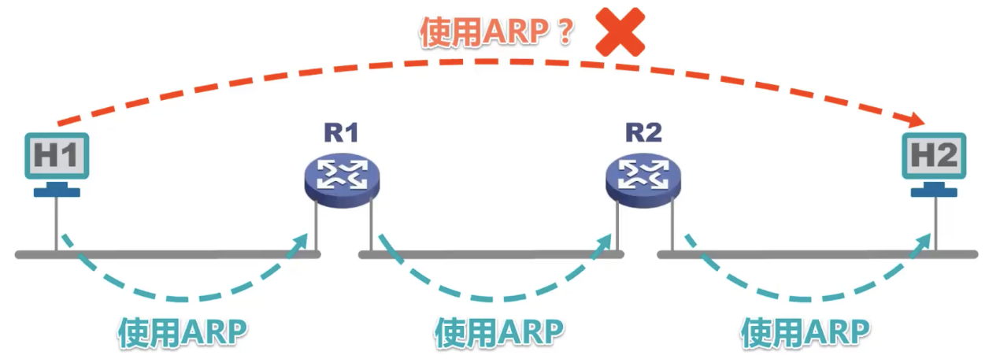
<!-- image-source: https://cdn.nlark.com/yuque/0/2026/png/67474974/1779784404757-b3ec893a-b96c-48e1-8c84-ac96956f0397.png -->

**ARP协议仅在当前网段有效，不能跨网络使用**。跨网络通信中，ARP解析是逐段链路进行的。

#### （5）扩展与安全
+ **无故ARP/免费ARP**：用于检测IP地址冲突。
+ **安全缺陷**：ARP协议没有安全验证机制，存在ARP欺骗或ARP攻击等风险。

##### 免费 ARP (Gratuitous ARP) 
**1.地址特征**

免费 ARP 是一种特殊的 ARP 报文，其最显著的特征是**源 IP 地址与目的 IP 地址完全相同**，均为发送方自身的 IP 地址。

+ **源 MAC 地址 (Source MAC)**：发送方自身的物理 MAC 地址。
+ **目的 MAC 地址 (Destination MAC)**：`FF:FF:FF:FF:FF:FF`（以太网广播地址，确保局域网内所有设备接收）。
+ **源 IP 地址 (Sender IP)**：发送方自身的 IP 地址。
+ **目的 IP 地址 (Target IP)**：**发送方自身的 IP 地址**。

**2.主要作用**

1. **IP 地址冲突检测 (Duplicate Address Detection, DAD)**  
	当主机配置新 IP 或网卡启动时，通过发送免费 ARP 探测局域网。若收到其他主机的 ARP 应答，则表明该 IP 已被占用，从而触发 IP 冲突警告。
2. **通知 MAC 地址变更 (高可用架构/VIP 漂移)**  
	在双机热备（如 VRRP/Keepalived）场景中，当备用节点接管虚拟 IP (VIP) 时，会主动发送免费 ARP。其目的是通知局域网内的交换机和其他主机，该 VIP 现已映射到新的物理 MAC 地址，从而实现网络流量的无缝切换。

**3.其他主机收到免费 ARP 的反应**

当网络中的其他主机或路由器收到免费 ARP 报文后，通常遵循以下处理逻辑：

1. **更新本地 ARP 缓存表**  
接收方会检查本地 ARP 缓存中是否已存在该源 IP 地址的映射记录：
    - **若存在旧记录**：接收方会将该 IP 对应的 MAC 地址**强制更新**为免费 ARP 报文中携带的源 MAC 地址。
    - **若不存在记录**：根据 RFC 标准，接收方通常会**忽略**该报文（不主动添加新条目）；但在部分操作系统实现中，也可能会将其作为新条目添加到 ARP 缓存中。
2. **不产生 ARP 应答**  
	由于报文的目的 IP 是发送方自身，其他主机识别出这并非针对自己的地址解析请求，因此**不会**向发送方回复 ARP Reply 报文（除非发生 IP 冲突，冲突方会回复以宣告所有权）。

### 4.协议关系总结
在 OSI 七层模型或 TCP/IP 模型中，它们的位置和包含关系如下：

```latex
【网络层 (Network Layer)】
   │
   ├── IP 协议 (负责逻辑寻址：IP地址)
   │
   └── ARP 协议 (跨层翻译官：把 IP 地址翻译成 MAC 地址)
         │
         ▼ (ARP 报文直接交给下层封装)
         
【数据链路层 (Data Link Layer)】
   │
   ├── 分支 A：广播型网络 (多台设备共享介质，需要 MAC 地址寻址)
   │    │
   │    ├── 1. Wi-Fi 标准 (IEEE 802.11) 
   │    │     └── 内部核心算法：CSMA/CA (碰撞避免)
   │    │
   │    └── 2. 以太网标准 (IEEE 802.3)
   │          └── 内部核心算法：CSMA/CD (碰撞检测)
   │
   └── 分支 B：点对点网络 (只有两台设备直连，不需要 MAC 地址)
        │
        └── 3. PPP 协议 (无 MAC 子层，无 CSMA 机制)
```

**1. “包含”关系：谁是壳，谁是核？**

+ **Wi-Fi (802.11)** 和 **以太网 (802.3)** 是**完整的协议外壳**（包含了物理层和 MAC 层的标准）。
+ **CSMA/CA** 和 **CSMA/CD** 协议只是寄生在壳里的**内部算法**。
    - Wi-Fi 包含 CSMA/CA。
    - 以太网包含 CSMA/CD。
    - **PPP** 是个特例，它是点对点专线，不需要抢信道，所以它**既不包含 CSMA/CA，也不包含 CSMA/CD**。

**2. “翻译”关系：ARP 是如何把它们串联起来的？**

**ARP（地址解析协议）** 是整个体系中的 **“跨层翻译官”**。

+ **痛点**：当你的电脑（网络层）想发一个 IP 数据报给路由器时，它只知道路由器的 **IP 地址**。但是，底层的 Wi-Fi 或以太网在打包 MAC 帧时，**必须**知道路由器的 **MAC 地址**才能发送。
+ **ARP 的作用**：ARP 站出来，在局域网里大吼一声（发送 ARP 广播请求）：“谁的 IP 是 192.168.1.1？请把你的 MAC 地址告诉我！” 路由器听到后，单播回复自己的 MAC 地址。
+ **层级归属**：ARP 报文**不需要封装在 IP 数据报里**，而是直接交给数据链路层，封装在 MAC 帧中发送。因此，ARP 通常被认为是工作在**网络层和数据链路层之间**的协议。

**3. “适用”关系：谁需要 ARP，谁不需要？（经典考点）**

这是考试中最爱挖坑的地方：**不是所有的数据链路层协议都需要 ARP！**

+ **Wi-Fi 和 以太网（需要 ARP）**：  
它们是**广播型网络**，局域网里有几十台设备。为了精准找到目标设备，必须使用 MAC 地址。既然需要 MAC 地址，就**必须使用 ARP 协议**把 IP 翻译成 MAC。同时，ARP 请求本身也是通过**广播 MAC 帧**（目的 MAC 为 `FF:FF:FF:FF:FF:FF`）发出去的。
+ **PPP（绝对不需要 ARP）**：  
PPP 是**点对点网络**（比如你的电脑通过光纤直连运营商的机房）。这条线上一头是你，另一头**只有唯一的一个接收者**。  
既然对面只有一个人，你发数据还需要写“收件人 MAC 地址”吗？完全不需要！  
既然 PPP 帧里**连 MAC 地址字段都没有**，自然也就**不需要 ARP 协议**来翻译 MAC 地址了。在 PPP 链路上，IP 数据报直接扔给 PPP 封装发走即可。

**4.对比总结表**

| 协议/机制名称 | 本质属性 | 工作层级 | 网络拓扑类型 | 是否有 MAC 地址？ | 是否需要 ARP 协议？ | 内部信道控制机制 |
| :--- | :--- | :--- | :--- | :---: | :---: | :--- |
| **Wi-Fi (802.11)** | 完整的协议标准 | 物理层 + 链路层(MAC) | 无线广播网 | 有 (最多4个) | **需要** | 包含 **CSMA/CA** |
| **以太网 (802.3)** | 完整的协议标准 | 物理层 + 链路层(MAC) | 有线广播网 | 有 (2个) | **需要** | 包含 **CSMA/CD** |
| **PPP** | 完整的协议标准 | 链路层 (无 MAC 子层) | 有线点对点 | 无 | **不需要** | 无 (不抢信道) |
| **CSMA/CA** | 内部协议<br/>(算法/机制) | 链路层 (MAC 子层) | - | - | - | 碰撞**避免** (带ACK) |
| **CSMA/CD** | 内部协议<br/>(算法/机制) | 链路层 (MAC 子层) | - | - | - | 碰撞**检测** (无ACK) |
| **ARP** | 独立协议 | 介于网络层与链路层之间 | 仅适用于广播网 | - | - | 通过广播 MAC 帧工作 |


---

## 八、集线器与交换机的区别
### 1.早期总线型以太网

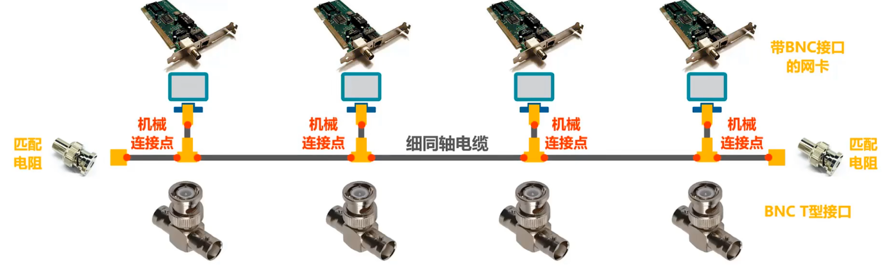
<!-- image-source: https://cdn.nlark.com/yuque/0/2026/png/67474974/1780238801204-86a3a836-7fb3-4d57-8fe0-24ccb6880742.png -->

+ 早期的以太网采用总线型结构，最初使用**粗同轴电缆**作为传输媒体，后来演进到价格相对便宜的**细同轴电缆**。
+ 当初认为使用无源电缆和大量机械接头的连接方法既简单又可靠（因为那个时代普遍认为有源元器件不可靠，无源电缆最可靠）。
+ 实践证明，这种使用无源电缆和大量机械接头的总线型以太网并不像想象的那么可靠。

### 2.集线器的引入与特点
+ 后来发展出使用大规模集成电路、可靠性非常高的设备——**集线器**，并使用更便宜、更灵活的双绞线作为传输媒体。
+ 主机网卡与集线器各接口使用 **RJ45 插座**，通过双绞线电缆连接，双绞线两端为 **RJ45 插头**。  
+ 使用双绞线和集线器比使用大量机械接头的无源电缆更可靠、更便宜、更方便，粗缆和细缆以太网因此被淘汰。


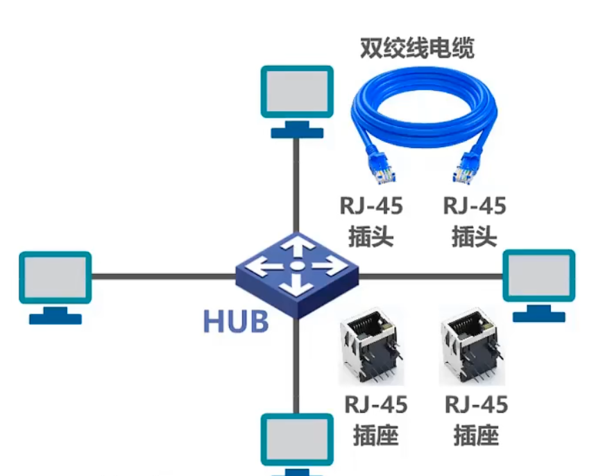
<!-- image-source: https://cdn.nlark.com/yuque/0/2026/png/67474974/1780238878813-87fff69d-35bc-4d6f-8726-3a1562199c58.png -->

+ 使用集线器的以太网在物理拓扑上是**星型**，但逻辑上仍是**总线网**，各站共享逻辑总线，使用 **CSMA/CD** 协议。
+ 集线器只工作在**物理层**，每个接口仅简单转发比特，不进行碰撞检测（碰撞检测由各站网卡负责）。分析时可将集线器简单看作一条总线。
+ 集线器一般具有少量容错能力和网络管理功能，例如：若某网卡故障并持续发送帧，集线器可检测到该问题，在内部断开与故障网卡的连接，使网络其余部分仍能正常工作。
+ 使用集线器扩展以太网，就是在**物理层**扩展以太网。

#### （1）使用集线器扩展以太网示例

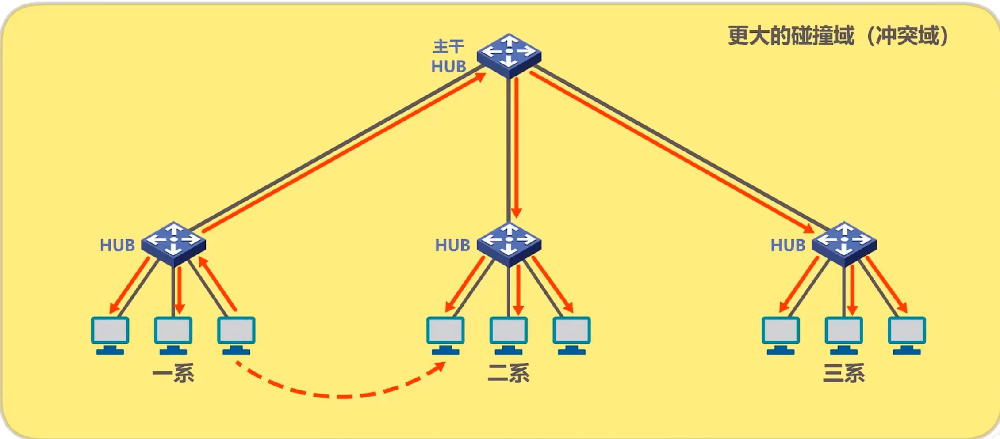
<!-- image-source: https://cdn.nlark.com/yuque/0/2026/png/67474974/1780239190501-daf6fbd6-2701-46cd-9266-731bba10ff5c.png -->

+ 假设某学院三个系部各有一个用集线器互联的以太网，各自独立，是三个独立的**碰撞域（冲突域）**。
+ 一系主机发送数据帧，信号会传到一系所有其他主机。
+ 二系多台主机同时发送则产生碰撞，碰撞后信号会传到二系所有主机。
+ 再用一个集线器将三个系部的以太网互连，原来三个独立的碰撞域合并成一个更大的碰撞域，形成更大的总线型以太网。此时，一系某主机发往二系某主机的数据帧信号会传输到整个网络的所有主机。

#### （2）以太网交换机的引入

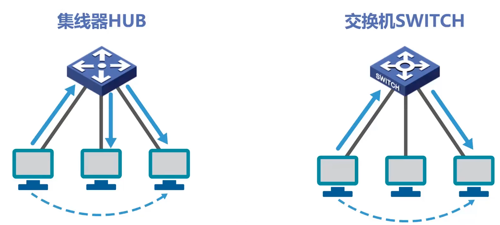
<!-- image-source: https://cdn.nlark.com/yuque/0/2026/png/67474974/1780239276764-d76e456b-44b1-40b1-bd8b-2b891aa96a68.png -->

+ 集线器之后出现了更先进的网络互联设备——**以太网交换机**。
+ 共享总线式以太网（集线器组网）：主机发送单播帧，该帧通过共享总线传输到所有其他主机。
+ 交换式以太网（交换机组网）：主机发送单播帧，交换机将其**仅转发给目的主机**，而非网络中其他各主机。交换机具有明显优势。
+ **说明**：本节课所有举例的前提条件是忽略 ARP 过程，并假设交换机的帧交换表已学习或配置好。

#### （3）交换机的工作特点

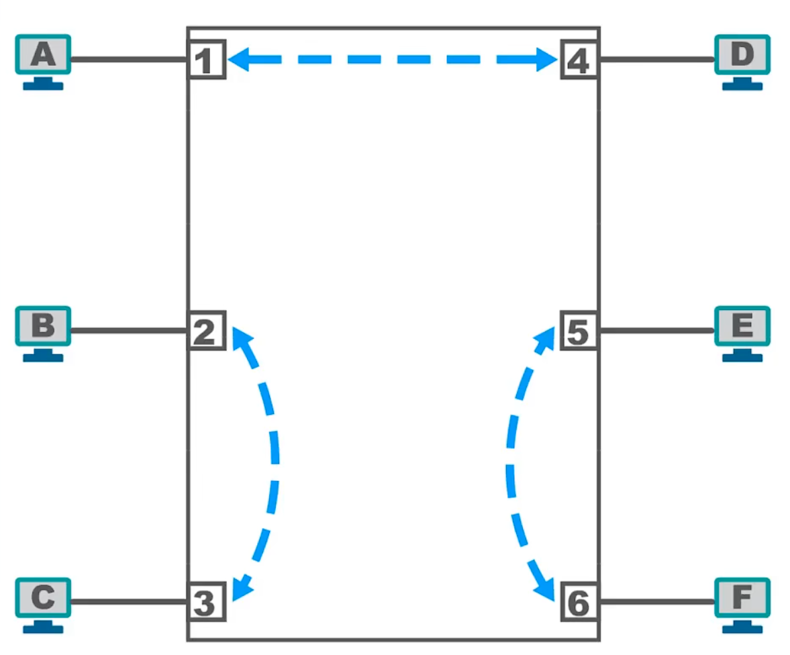
<!-- image-source: https://cdn.nlark.com/yuque/0/2026/png/67474974/1780239468554-eb2b3567-38da-42a5-91fb-9c468e0b36d4.png -->

+ 交换机通常有多个接口，每个接口可通过双绞线与主机或另一台交换机相连。一般都工作在**全双工**方式（发送和接收可同时进行）。
+ 注意：使用集线器的以太网逻辑上共享总线，需 CSMA/CD 协调，只能**半双工**（收发不能同时进行）。
+ 交换机具有并行性，能同时连通多对接口，使多对主机同时通信而无碰撞。接口一般支持多种速率（10Mbps、100Mbps、1Gbps、10Gbps等）。
+ 交换机工作在**数据链路层**（也包含物理层）。收到帧后，在**帧交换表**中查找目的 MAC 地址对应的接口号，然后从该接口转发帧。
    - 例如：主机A发帧给主机B，交换机查表得知目的MAC对应接口2，就从接口2转发出去。


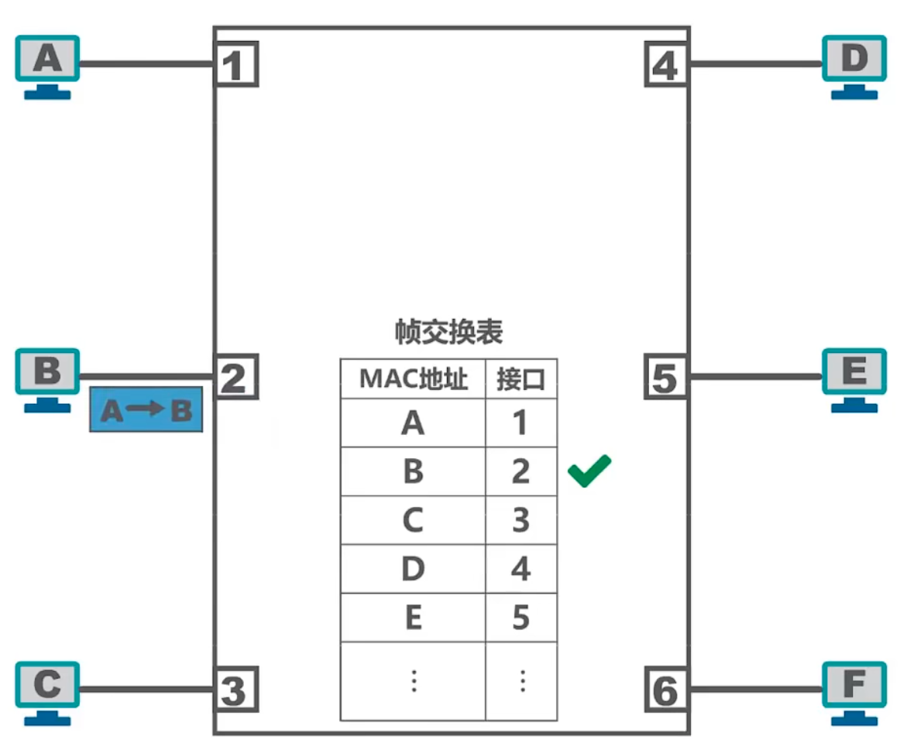
<!-- image-source: https://cdn.nlark.com/yuque/0/2026/png/67474974/1780239575956-ee496a4c-cc7a-4209-bda9-135516f94e3c.png -->

+ 交换机是**即插即用**设备，上电即工作，内部帧交换表通过**自学习算法**自动逐渐建立。
+ 帧转发方式：
    - **存储转发**：先缓存整个帧再处理转发。
    - **直通交换**：接收帧的同时就根据目的 MAC 地址决定转发接口，不缓存整个帧，转发速率高，交换时延非常小。一般采用基于硬件的交叉矩阵。但缺点是不检查帧是否有差错就直接转发。

### 3.集线器与交换机的详细对比
#### （1）主机发送单播帧
+ **集线器（共享总线型）**：单播帧会传播到总线上所有其他主机，各主机网卡根据目的 MAC 地址决定是否接受。


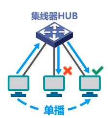
<!-- image-source: https://cdn.nlark.com/yuque/0/2026/png/67474974/1780294842933-ee5d9735-0d7f-4827-9ed7-cf3aea197bc7.png -->

+ **交换机（交换式）**：交换机收到单播帧后，根据目的 MAC 和帧交换表，仅将帧转发给目的主机，而不是其他主机。


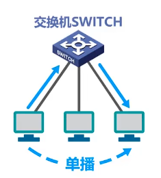
<!-- image-source: https://cdn.nlark.com/yuque/0/2026/png/67474974/1780294855676-3c6caad9-1f87-4b1c-8133-4117a178fe99.png -->

#### （2）发送广播帧
+ **集线器**：广播帧会传播到总线上的所有其他主机，各主机检测到广播地址后接受该帧。


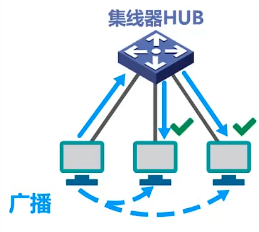
<!-- image-source: https://cdn.nlark.com/yuque/0/2026/png/67474974/1780294881493-e224ac78-5759-4e46-9cca-f496704558a9.png -->

+ **交换机**：交换机收到广播帧，检测到目的 MAC 是广播地址，则从除进入接口外的其他所有接口转发该帧。网络中除源主机外的其他主机收到广播帧后接受。


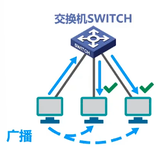
<!-- image-source: https://cdn.nlark.com/yuque/0/2026/png/67474974/1780294902567-2716a0d3-d71f-4b03-ada4-87262b4f054a.png -->

+ 结论：无论使用集线器还是交换机，网络中的各主机都属于**同一个广播域**。对于广播帧，效果上没有区别。

#### （3）多台主机同时给另一台主机发送单播帧
+ **集线器**：必然产生碰撞，遭遇碰撞的帧会传播到总线上的所有主机。


<!-- image-source: https://cdn.nlark.com/yuque/0/2026/png/67474974/1780294971286-9ae496f9-68d7-4fa2-927d-9bbdd0d416c3.png -->

+ **交换机**：交换机会将收到的多个帧缓存起来，然后逐个转发给目的主机，**不会产生碰撞**。


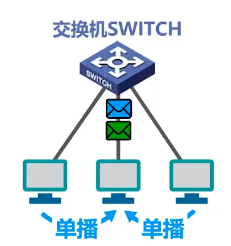
<!-- image-source: https://cdn.nlark.com/yuque/0/2026/png/67474974/1780294985349-a1653d71-9590-485f-bb8c-96a0fb883767.png -->

#### （4）扩展以太网的对比
+ **仅使用集线器扩展**：发送单播帧时，帧会传播到整个扩展后的总线网所有主机；发送广播帧亦然。扩展后的以太网在逻辑上仍是共享总线，形成**更大的碰撞域**，参与竞争总线的主机更多，容易产生碰撞。


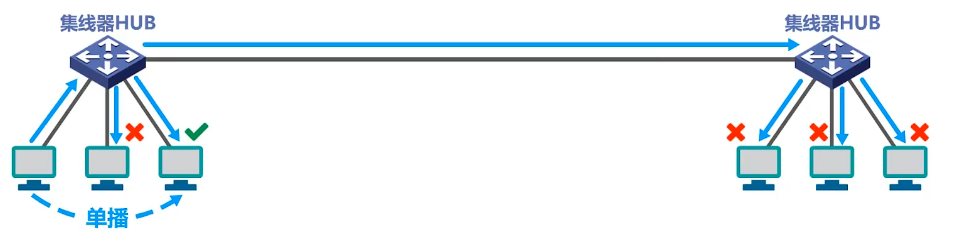
<!-- image-source: https://cdn.nlark.com/yuque/0/2026/png/67474974/1780295013204-0598b918-c631-41f0-9d3f-aac00bac6a8a.png -->


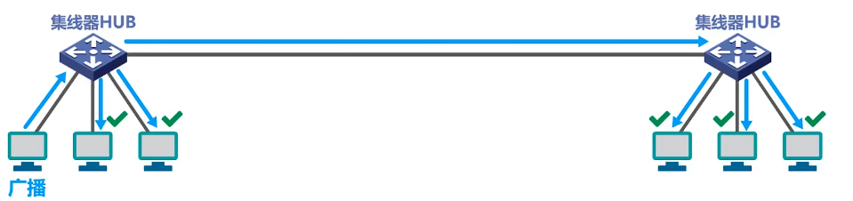
<!-- image-source: https://cdn.nlark.com/yuque/0/2026/png/67474974/1780295037938-bdaece35-e253-49c2-b20b-e0139aed7fab.png -->

+ **仅使用交换机扩展**：发送单播帧时，帧仅被转发到目的主机所在路径，不会泛洪到所有主机，因此同样的传输任务不会产生碰撞。发送广播帧时，效果与集线器扩展相同（所有主机都能收到）。


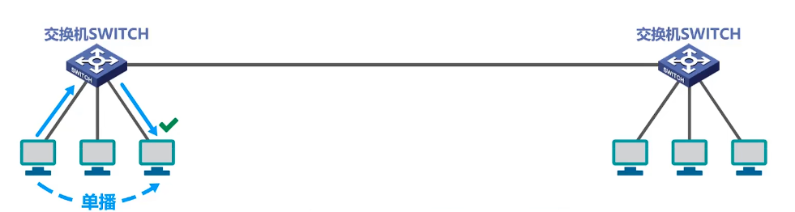
<!-- image-source: https://cdn.nlark.com/yuque/0/2026/png/67474974/1780295031031-c5e33575-f17d-4fa1-8ceb-e19e178514bd.png -->


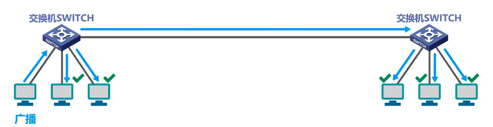
<!-- image-source: https://cdn.nlark.com/yuque/0/2026/png/67474974/1780295044547-feedf84f-917d-49b1-a906-680871ef69ae.png -->

+ 重要结论：仅使用集线器扩展以太网，会**同时扩大广播域和碰撞域**；使用交换机将各自独立的碰撞域连接起来，**只扩大广播域，而不会扩大碰撞域**，即交换机可以**隔离碰撞域**。

### 4.小结
+ 集线器工作在物理层，逻辑上为共享总线，所有接口属于同一碰撞域和同一广播域，使用 CSMA/CD，只能半双工，多主机同时发送会碰撞。
+ 交换机工作在数据链路层，基于帧交换表进行定向转发，可隔离碰撞域，各接口属于独立碰撞域，但默认所有接口仍属于同一广播域（划分VLAN后可分割广播域）。交换机支持全双工、多路同时通信无碰撞，性能远高于集线器。
+ 集线器在价格和性能上已被交换机全面超越，逐渐被市场淘汰，目前很难在市场上见到。

---

## 九、以太网交换机自学习和转发帧的流程
### 1.以太网交换机自学习和转发帧的流程
#### （1）交换机的基本工作方式
+ 以太网交换机工作在**数据链路层**（也包含物理层），是一种**即插即用**设备。刚上电启动时，内部的帧交换表为空。
+ 随着网络中各主机间通信，交换机通过**自学习算法**自动、逐渐地建立起帧交换表。
+ 收到帧后，在帧交换表中查找目的MAC地址所对应的接口号，若找到则从该接口转发，若找不到则进行**泛洪**（从除进入接口外的所有其他接口转发）。
+ 目前市场上也有包含网络层部分功能的交换机，称为三层交换机。

#### （2）举例说明：自学习与转发过程
+ 网络拓扑：两台以太网交换机相互连接，交换机1连接主机A、B、C，交换机2连接主机D、E、F。各主机网卡MAC地址分别以字母A~F表示且各不相同。
+ 假设各主机已知道网络中其他主机的MAC地址（无需ARP）。

##### 1. 主机A发送帧给主机B

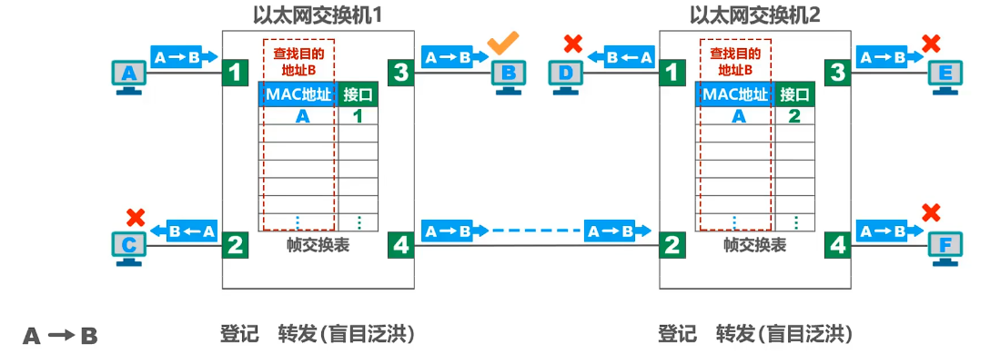
<!-- image-source: https://cdn.nlark.com/yuque/0/2026/png/67474974/1780296521877-9c309c9d-984e-4f10-a034-2573a6b25d65.png -->

+ 帧从交换机1的接口1进入。
+ **交换机1自学习**：将源MAC地址`A`及进入接口`1`登记到帧交换表中。
+ 查表转发：目的MAC`B`在帧交换表中找不到 → **泛洪**，从除接口1外的其他所有接口（包括连交换机2的接口）转发该帧。
+ 主机B收到帧，发现目的MAC是自己，**接受**；主机C收到，目的MAC不是自己，**丢弃**。
+ 帧从交换机2的接口2进入。
+ **交换机2自学习**：记录源MAC`A`对应接口`2`。
+ 查表转发：目的MAC`B`找不到 → **泛洪**，主机D、E、F均收到，目的MAC均不是自己，全部**丢弃**。

##### 2. 主机B发送帧给主机A

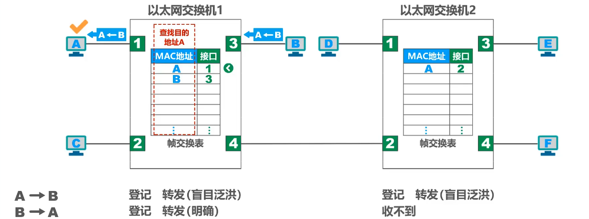
<!-- image-source: https://cdn.nlark.com/yuque/0/2026/png/67474974/1780296595053-61e7b37a-18f9-40c9-81a6-cb2cfce21feb.png -->


<!-- image-source: https://cdn.nlark.com/yuque/0/2026/png/67474974/1780296633083-806b4ba0-6b49-4cf3-ac28-b8f79687ec84.png -->

+ 帧从交换机1的接口3进入。
+ **交换机1自学习**：记录源MAC`B`对应接口`3`。
+ 查表转发：目的MAC`A`在表中可找到，对应接口`1` → **明确转发**，仅从接口1发出。
+ 主机A收到并**接受**，交换机2不会收到该帧。

##### 3. 主机E发送帧给主机A

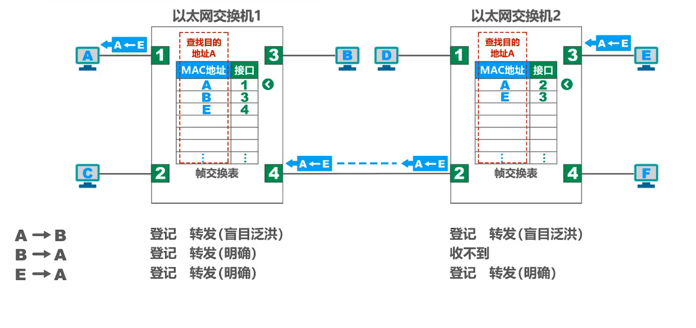
<!-- image-source: https://cdn.nlark.com/yuque/0/2026/png/67474974/1780296884252-b3bfa495-d48d-44ff-85da-a61e7e6c4832.png -->


<!-- image-source: https://cdn.nlark.com/yuque/0/2026/png/67474974/1780296902163-5ec809b3-3715-40d7-828b-6860ebd00fce.png -->

+ 帧从交换机2的接口3进入。
+ **交换机2自学习**：记录源MAC`E`对应接口`3`。
+ 查表转发：目的MAC`A`在表中找到，对应接口`2` → **明确转发**，从接口2发出。
+ 帧从交换机1连接交换机2的接口（假设接口4）进入。
+ **交换机1自学习**：记录源MAC`E`对应接口`4`。
+ 查表转发：目的MAC`A`找到对应接口`1` → **明确转发**，从接口1发出，主机A**接受**。

#### （3）交换机丢弃帧的情况

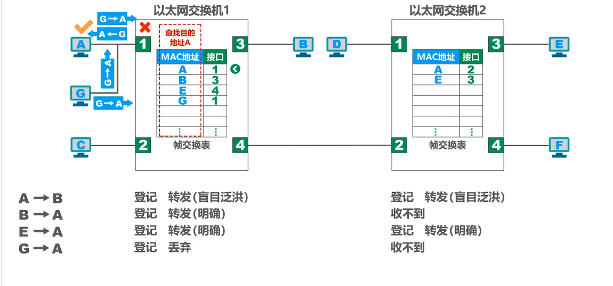
<!-- image-source: https://cdn.nlark.com/yuque/0/2026/png/67474974/1780297150113-614bc3c0-3d31-40f3-92bc-f47e9d1a7947.png -->


<!-- image-source: https://cdn.nlark.com/yuque/0/2026/png/67474974/1780297165028-be2c8675-69b0-4211-8929-d8e0ef9e0e51.png -->

+ 为演示丢弃，在交换机1的接口1所连总线上增加一台主机G（与主机A共享同一物理线路，例如通过集线器）。
+ 主机G发送帧给主机A，帧在总线上传输，主机A收到并**接受**；同时交换机1的接口1也收到该帧。
+ **交换机1自学习**：记录源MAC`G`对应接口`1`。
+ 查表转发：目的MAC`A`在表中查到对应接口`1`，但该帧正是从接口1进入的，交换机**不会从同一接口再转发出去**，于是**丢弃该帧**。交换机2不会收到。

#### （4）帧交换表记录的有效期
+ 帧交换表中的每条记录都有**有效时间**，到期自动删除。
+ 原因：MAC地址与交换机接口的对应关系**并非永久不变**。例如，接口所连主机被更换，或主机更换了新网卡，对应关系都会改变。
+ 类似的，ARP高速缓存表中的IP-MAC地址记录也会定期自动删除。

### 2.习题与考研题解析
#### 课堂习题

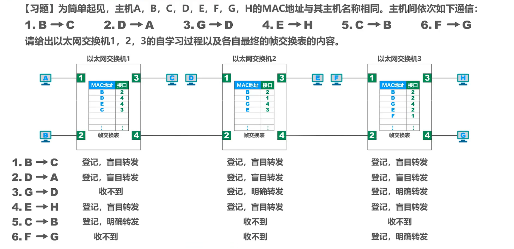
<!-- image-source: https://cdn.nlark.com/yuque/0/2026/png/67474974/1780297331944-c79b9f86-c5b2-4137-b2ea-11321378a499.png -->

#### 2009年统考真题 第36题
[2009年题36]以太网交换机进行转发决策时使用的PDU地址是     **A**

A.目的物理地址				 B.目的IP地址

C.源物理地址 		      		 D.源IP地址

+ **解析**：PDU指协议数据单元。以太网交换机工作在数据链路层，其接收并转发的PDU通常称为**帧**。帧的目的MAC地址（硬件地址/物理地址）在帧交换表中查找对应接口。虽然被称为“物理地址”，但它实际上属于**数据链路层**范畴，不要被“物理”二字误导。答案选A。

#### 2014年统考真题 第34题
[2014年题34]某以太网拓扑及交换机当前转发表如下图所示，主机00-e1-d5-00-23-a1向主机00-e1-d5-00-23-c1发送1个数据帧，主机00-e1-d5-00-23-c1收到该帧后，向主机00-e1-d5-00-23-a1发送1个确认帧，交换机对这两个帧的转发端口分别是

A.{3和1} 		B.{2,3}和{1} 		C.{2,3}和{1,2}		 D.{1,2,3}和{1}


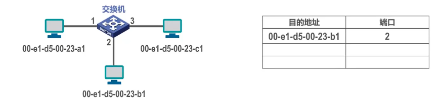
<!-- image-source: https://cdn.nlark.com/yuque/0/2026/png/67474974/1780297416054-7c340870-51bd-44ca-b22d-7e5750477ceb.png -->

+ **题目概要**：左侧主机发数据帧给右侧主机，右侧主机回复确认帧。问交换机转发这两个帧的端口。
+ **解析**：
    - 左侧主机发出的数据帧从交换机接口1进入，交换机登记源MAC后查目的MAC，找不到 → **泛洪**，从接口**2和3**转发。
    - 右侧主机从接口3收到后回复确认帧，该帧从接口3进入，交换机登记源MAC后查目的MAC（左侧主机）已存在（对应接口1） → **明确转发**，仅从接口**1**转发。
    - 因此，转发数据帧的端口为2和3，转发确认帧的端口为1。答案选B。

### 3.本节小结
+ 交换机通过**自学习**建立帧交换表：收到帧时记录其**源MAC地址**和**进入接口**。
+ **转发规则**：
    - 目的MAC在表中有对应接口，且该接口≠进入接口 → 从对应接口**明确转发**。
    - 目的MAC在表中找不到 → 从除进入接口外的所有接口**泛洪**。
    - 目的MAC对应接口恰为帧的进入接口 → **丢弃**，不转发。
+ 帧交换表条目有生存期，到期自动删除，以适应网络拓扑或主机网卡的变化。
+ 交换机能够隔离**碰撞域**，但默认情况下不隔离**广播域**（泛洪机制会扩散广播帧）。

---

## 十、以太网交换机的生成树协议STP
### 1.为什么需要生成树协议
#### （1）提高可靠性的需求

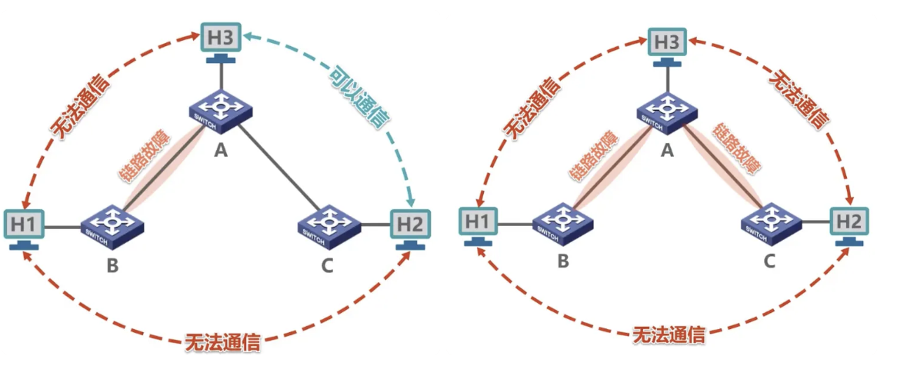
<!-- image-source: https://cdn.nlark.com/yuque/0/2026/png/67474974/1780379989001-255d6a38-514f-4910-a906-516fb271e52f.png -->

+ **问题提出**：如何提高以太网的可靠性？
+ **单链路故障影响**：
    - 两台交换机间链路故障，会导致其中一台交换机上的所有主机与网络中其他主机通信中断。
    - 多链路故障可能导致网络分裂成多个无法互相通信的独立小网络。
+ **解决方案**：添加**冗余链路**。


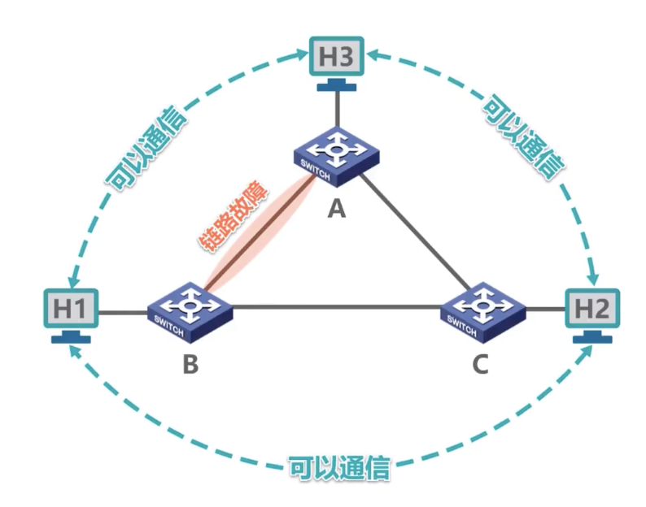
<!-- image-source: https://cdn.nlark.com/yuque/0/2026/png/67474974/1780380042469-614fef39-e6fb-4be0-b622-cd61d394e382.png -->

- 即使某条链路出现故障，冗余链路可提供备用路径，确保全网仍然联通。


#### （2）冗余链路带来的问题——网络环路
添加冗余链路提高可靠性的同时，会形成**网络环路**，带来两大问题：**广播风暴**和**MAC地址表震荡**。


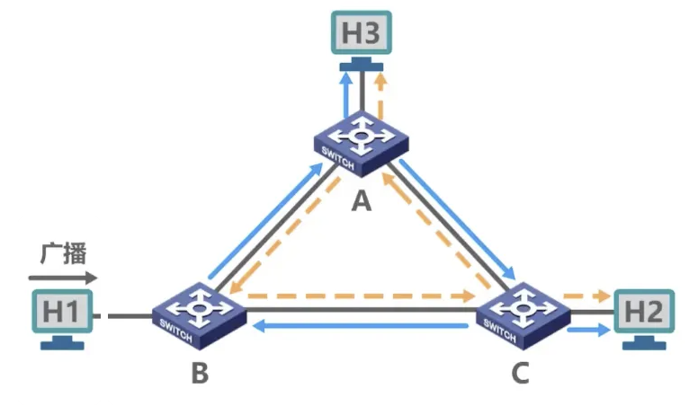
<!-- image-source: https://cdn.nlark.com/yuque/0/2026/png/67474974/1780381158749-d6175eee-b394-4dea-86fc-827586629f2e.png -->

**问题一：广播风暴**

+ **形成过程**（以三台交换机、一条冗余链路为例）：
    1. 主机H1发送一个广播帧。
    2. 交换机B收到后，从除接收口外的所有接口转发。
    3. 交换机A收到后同样泛洪转发，交换机C也收到并泛洪转发。
    4. 交换机C会从交换机A收到同一广播帧并再次转发，交换机A也会从交换机C收到并再次转发。
    5. 广播帧在交换机之间**反复转发**，按顺时针和逆时针方向同时“兜圈”，永无止境。
+ **危害**：
    - 大量消耗网络带宽，使正常数据帧无法转发。
    - 主机反复收到相同广播帧，大量消耗CPU资源。
    - 导致交换机的帧交换表（MAC地址表）震荡。

---

**问题二：MAC地址表震荡**


<!-- image-source: https://cdn.nlark.com/yuque/0/2026/png/67474974/1780381158749-d6175eee-b394-4dea-86fc-827586629f2e.png -->

+ **形成过程**：
    - **初始正确记录**：主机H1发送广播帧从接口1进入，交换机B记录 `MAC地址H1 → 接口1`（正确）。
    - **第一次错误更新**：交换机B从交换机C收到同一广播帧（源MAC仍是H1），误认为H1从接口2接入，将记录更新为 `MAC地址H1 → 接口2`（错误）。
    - **第二次错误更新**：交换机B从交换机A又收到同一广播帧，误认为H1从接口3接入，将记录更新为 `MAC地址H1 → 接口3`（错误）。
    - **反复震荡**：只要广播帧仍在环路中循环，上述两条错误记录就会不断相互覆盖，导致MAC地址表无法稳定。
+ **危害**：交换机无法正确学习设备位置，严重影响单播帧的正常转发。

---

### 2.生成树协议（STP）概述
#### （1）STP的核心思想
+ **全称**：**S**panning **T**ree **P**rotocol，生成树协议。
+ **目标**：在增加冗余链路提高可靠性的**同时**，自动避免网络环路带来的问题。
+ **工作原理**：
    - 不论交换机之间采用怎样的物理连接，运行STP的交换机都能通过交互参数、运行生成树算法，**自动计算并构建出一个逻辑上没有环路的网络**。
    - 最终逻辑拓扑结构必须是**树形**的，即无逻辑环路。

#### （2）端口状态与逻辑拓扑
+ **端口状态**：
    - **正常状态（转发状态）**：接口正常工作，可收发数据帧。
    - **阻塞状态**：接口在逻辑上被关闭，不转发用户数据帧（但可接收STP协议报文）。
+ **构建逻辑拓扑示例**：
    - 五台交换机之间存在多条冗余链路，物理上形成多个环路。
    - 各交换机运行STP后，自动协商判断哪些接口应该进入**阻塞状态**。
    - 阻塞部分接口后，物理有环的网络在逻辑上变为**无环的树形拓扑**，同时确保全网仍然联通。


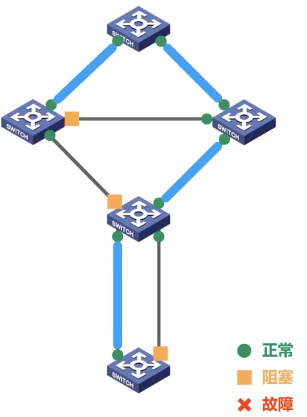
<!-- image-source: https://cdn.nlark.com/yuque/0/2026/png/67474974/1780381338336-3fecb04b-46a0-4703-b43b-785fdac2e1d2.png -->

#### （3）故障时的重新计算
+ **触发条件**：
    - 交换机首次连接。
    - 网络物理拓扑发生变化（人为改变或链路/设备故障）。
+ **重新计算过程**：
    - 相关交换机检测到拓扑变化后，重新运行生成树计算。
    - 可能将之前阻塞的接口**恢复为正常状态**，启用备用冗余链路。
    - 形成一个新的、逻辑无环的联通网络，实现故障自动恢复。

> **说明**：生成树协议的具体算法（如根桥选举、端口角色确定等）较为复杂，超出本基础课程大纲，感兴趣者可进一步学习相关进阶课程。
>

---

### 3.总结
| 知识点 | 核心内容 |
| :--- | :--- |
| **冗余链路的作用** | 提高以太网可靠性，避免单链路故障导致通信中断。 |
| **网络环路的两大危害** | **广播风暴**（广播帧在环路中无限循环）和 **MAC地址表震荡**（交换机反复错误学习主机位置）。 |
| **STP的目标** | 自动构建**逻辑无环**的树形拓扑，同时保留物理冗余以提高可靠性。 |
| **实现手段** | 交换机间交互参数，运行生成树算法，将部分接口置为**阻塞状态**以破除环路。 |
| **故障恢复** | 检测到拓扑变化后自动**重新计算**，将阻塞接口恢复为转发状态，启用备用链路。 |


## 十一、虚拟局域网VLAN
### 1.VLAN 基本概念
#### （1）背景与问题
+ **以太网交换机工作层次**：数据链路层（也涉及物理层）。
+ **交换式以太网**：由一台或多台交换机互连而成，默认情况下，所有站点都属于**同一个广播域**。


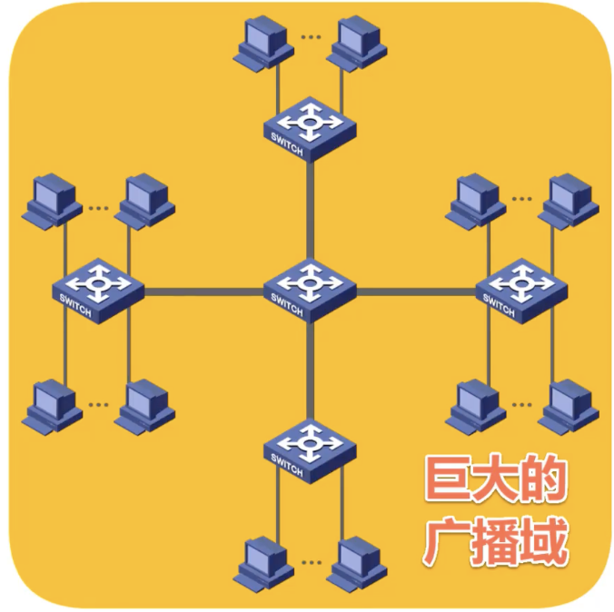
<!-- image-source: https://cdn.nlark.com/yuque/0/2026/png/67474974/1780382357017-7af3356a-8f75-45d6-90e8-ccf3725ea3e0.png -->

+ **广播域扩大的弊端**：
    - **广播风暴**：网络中一个主机发送广播（如 ARP 请求），所有主机都能收到，浪费网络资源和各主机 CPU 资源。
    - **难以管理和维护**。
    - **潜在的安全问题**。 

> **补充：网络中广播很频繁**  
TCP/IP 协议栈中的许多协议都依赖广播，如：
>
> + **ARP**（地址解析协议：已知IP地址，找到对应的MAC地址）
> + **RIP**（路由信息协议）
> + **DHCP**（动态主机配置协议：自动配置IP）
>

#### （2）如何分割广播域
+ **使用路由器**：
    - 路由器工作在网络层（第三层），默认**不转发广播包**，能自然隔离广播域。
    - **缺点**：路由器成本较高，局域网内部全部使用路由器隔离不现实。
+ **使用 VLAN 技术**：


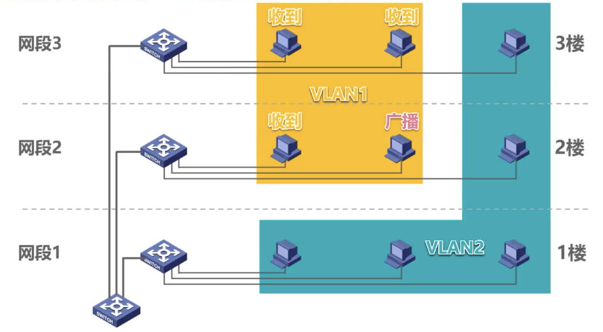
<!-- image-source: https://cdn.nlark.com/yuque/0/2026/png/67474974/1780382657973-c3e8af99-de06-4d94-8b19-b27077a1b1af.png -->

- **VLAN**（Virtual Local Area Network，虚拟局域网）是一种将局域网内的设备划分成**与物理位置无关的逻辑组**的技术。
- **核心作用**：同一个 VLAN 内部可以广播通信，**不同 VLAN 之间不能广播通信**，从而将较大的广播域分割成更小的广播域。


---

### 2.VLAN 的实现机制
#### （1）实现基础
VLAN 技术在交换机上实现，需要交换机具备两大功能：

1. **处理带有 VLAN 标记的帧**，即 **IEEE 802.1Q 帧**。
2. **支持不同的端口类型**，不同端口类型对帧的处理方式不同。

#### （2）IEEE 802.1Q 帧
+ **别名**：Dot One Q 帧。
+ **格式**：对以太网 MAC 帧格式进行扩展，**插入了 4 字节的 VLAN 标记**。


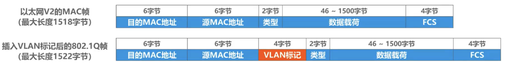
<!-- image-source: https://cdn.nlark.com/yuque/0/2026/png/67474974/1780382908551-6d9010ff-4ce9-40d1-bfe7-80caacc72ddf.png -->

+ **VLAN 标记字段关键信息**：
    - 最后 12 个比特是 **VLAN 标识符（VID）**，唯一标识该帧属于哪个 VLAN。
    - **VID 取值范围**：0 ~ 4095$(2^{12}-1)$。
        * **0** 和 **4095** 不使用。
        * **有效范围**：**1 ~ 4094**。
+ **帧处理的两个关键操作（由交换机完成）**：
    - **打标签**：收到普通以太网帧时，插入 4 字节 VLAN 标记，转变为 802.1Q 帧。
    - **去标签**：转发 802.1Q 帧时，可能删除 4 字节 VLAN 标记，转变为普通以太网帧。

#### （3）交换机的端口类型
交换机端口一般有三种类型：**Access**、**Trunk**、**Hybrid**（思科交换机无 Hybrid 端口）。

##### 核心概念：PVID（端口 VLAN ID）
+ 每个端口有且仅有一个 PVID。
+ 思科称为“本征 VLAN”（Native VLAN）。
+ 华为称为“端口 VLAN ID”（PVID）。
+ **默认情况**：交换机未配置时，所有端口默认属于 VLAN 1，PVID = 1。

---

**Access 端口**


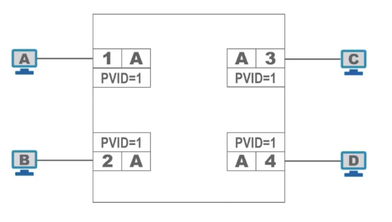
<!-- image-source: https://cdn.nlark.com/yuque/0/2026/png/67474974/1780383164553-5f67f485-afef-4f1e-a3f4-dd2950958d0d.png -->

+ **用途**：一般用于连接**用户计算机**。
+ **特点**：只能属于**一个** VLAN，其 PVID 值与所属 VLAN ID 相同。

| 处理阶段 | 规则 |
| :--- | :--- |
| **接收（入方向）** | 一般只接受**未打标签**的帧；根据端口的 PVID 值给帧**打标签**（插入 VLAN 标记，VID = PVID）。 |
| **发送（出方向）** | 若帧中的 VID **等于**端口的 PVID，则**去标签**后转发；否则，不转发。 |


**应用示例**：  
将主机 A 和 B 划入 VLAN 2，主机 C 和 D 划入 VLAN 3。端口 1、2 的 PVID=2，端口 3、4 的 PVID=3。

+ A 发广播帧，从端口 1 进入，被打上 VID=2 的标签。只有端口 2 的 PVID=2，所以只有 B 能收到（去标签后转发），C、D 收不到，实现了广播隔离。

**Trunk 端口**


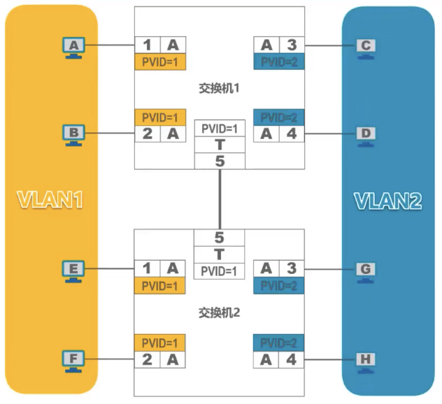
<!-- image-source: https://cdn.nlark.com/yuque/0/2026/png/67474974/1780383229415-7ff71189-8399-4bd4-a25a-eb99c63cd4ff.png -->

+ **用途**：一般用于**交换机之间**或**交换机与路由器之间**的互联。
+ **特点**：可以属于**多个** VLAN，能接收和发送多个 VLAN 的帧。默认 PVID=1。

| 处理阶段 | 规则 |
| :--- | :--- |
| **发送（出方向）** | 若帧中的 VID **等于**端口的 PVID，则**去标签**再转发；若 VID **不等于** PVID，则**直接转发**（保留标签）。 |
| **接收（入方向）** | 若收到**未打标签**的帧，根据 PVID 给帧**打标签**；若收到**已打标签**的帧，则直接接收。 |


**应用示例（跨交换机 VLAN）**：  
主机 A、B 和 E、F 在 VLAN 1，主机 C、D 和 G、H 在 VLAN 2。两台交换机互联的端口 5 设置为 Trunk 端口，PVID=1。

+ **VLAN 1 通信（A发广播）**：帧在交换机 1 端口 5 出去时，因 VID(1) 等于 PVID(1)，**去标签**转发。到交换机 2 端口 5 时，收到未打标签帧，根据 PVID(1) 重新**打上 VID=1 的标签**，最终转发给 E、F。
+ **VLAN 2 通信（C发广播）**：帧在交换机 1 端口 5 出去时，因 VID(2) 不等于 PVID(1)，**带标签**直接转发。到交换机 2 端口 5 时，收到已打标签的 802.1Q 帧，直接接收，并根据 VID=2 转发给 G、H。

**Hybrid 端口（华为私有）**

+ **用途**：兼具 Access 和 Trunk 的功能。既可用于连接交换机/路由器，也可用于连接用户计算机。
+ **特点**：绝大部分功能与 Trunk 端口相同，**主要区别在于发送处理机制**。

| 处理阶段 | 规则 |
| :--- | :--- |
| **发送（出方向）** | 查看帧的 VID 是否在端口的 **“去标签列表”** 中：   - 在列表中：**去标签**后再转发。   - 不在列表中：**直接转发**（保留标签）。 |


**应用示例（端口隔离）**：  
需求：A 和 B 都能与 C 通信，但 A 与 B 之间不能通信。

+ 端口 1 (A)：PVID=10，去标签列表 = [VLAN 10, VLAN 30]
+ 端口 2 (B)：PVID=20，去标签列表 = [VLAN 20, VLAN 30]
+ 端口 3 (C)：PVID=30，去标签列表 = [VLAN 10, VLAN 20, VLAN 30]
+ **A->C 通信**：A 发出的帧从端口 1 进入，打上 VID=10 的标签。从端口 3 发出时，因为 VID(10) 在端口 3 的去标签列表中，所以**去标签**转发，C 能正确收到。
+ **A->B 通信**：A 发出的帧打上 VID=10 标签。从端口 2 发出时，因为 VID(10) **不在**端口 2 的去标签列表中，所以**带标签**直接转发。B 作为普通主机无法识别 802.1Q 帧，会将其丢弃，从而实现了 A 与 B 的隔离。

---

### 3.总结
| 知识点 | 核心内容 |
| :--- | :--- |
| **VLAN 目的** | 在交换机上逻辑分割广播域，解决广播风暴和安全性问题。 |
| **802.1Q 帧** | 在标准以太帧中插入 4 字节 VLAN 标记，其中 12 位 VID（1-4094）标识 VLAN。 |
| **Access 端口** | 连接主机，收发**无标签帧**。进入时打标签（VID=PVID），发出时去标签（仅当 VID=PVID）。 |
| **Trunk 端口** | 连接交换机，允许多 VLAN 帧通过。仅当发出帧的 VID=PVID 时才去标签，否则保留标签转发。 |
| **Hybrid 端口** | 华为设备特有，可灵活设置“去标签列表”，实现更精细的 VLAN 转发控制，常用于端口隔离场景。 |


# 第四章 网络层
## 一、网络层概述
### 1.引言：网络层的核心任务
网络层是计算机网络体系结构中至关重要的一层，其主要任务可以概括为两大步：

1. **实现网络互联：** 将不同的异构型网络（这些网络可能使用不同的物理层和数据链路层技术）连接起来。
2. **实现数据包在各网络之间的传输：** 确保数据包能够跨越多个网络，从源主机成功到达目的主机。

要实现内部通信，单个网络只需物理层和数据链路层即可。但若要实现跨网络的互联，**路由器**这一网络层核心设备就不可或缺。


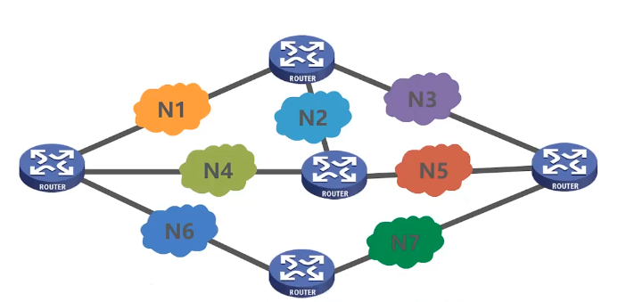
<!-- image-source: https://cdn.nlark.com/yuque/0/2026/png/67474974/1780476684346-f7964fee-2454-40ac-aa8c-84cc587f931c.png -->

> **补充注解：** 网络层是第一个真正实现端到端（源主机到目的主机）通信的层次。物理层和数据链路层解决的是相邻节点间的通信问题，而网络层则关注如何将数据从源端跨越多个“跳”传递到远端。
>

---

### 2.网络层需解决的三大核心问题
为了实现其任务，网络层必须解决以下三个关键问题：

#### （1）服务模型：提供怎样的服务？（可靠 vs. 不可靠）
网络层向上面的运输层提供的服务，主要分为两种模型：

+ **不可靠传输服务：**
    - **定义：** 网络层对于数据包在传输中可能出现的**误码、丢失（被路由器丢弃）、失序（不按序到达）** 等传输错误，**不采取任何纠正措施**。
    - **特点：** 尽最大努力交付，但不保证。简单、高效。
    - **典型代表：** 因特网使用的 TCP/IP 协议栈的网际层（IP协议）（无连接的，不可靠的数据报服务）。
+ **可靠传输服务：**
    - **定义：** 网络层设计相应机制，对这些传输错误采取措施进行纠正，最终使得接收方能正确、完整地接收数据包。
    - **特点：** 通信质量有保障，但实现复杂。
    - **典型代表：** ATM、帧中继、X.25 等网络体系结构的网络层，它们提供的是“虚电路服务”。

> **补充注解：** TCP/IP 模型选择“边缘智能，核心简单”的设计哲学。它将可靠性交给了端系统上的运输层（如TCP协议），而让网络层（IP协议）保持简洁高效，这也是因特网能够迅速扩展的关键之一。
>

#### （2）寻址问题：如何标识网络中的设备？
要实现全局通信，必须有一套统一的编址方式。在 TCP/IP 协议栈中，这套方式就是 **IP地址**。

+ **结构特点：** IP地址采用分层结构，由**网络编号**和**主机编号**两部分组成。
+ **举例分析：**


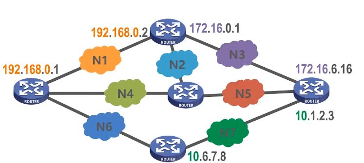
<!-- image-source: https://cdn.nlark.com/yuque/0/2026/png/67474974/1780476947388-eed4a1b5-dd23-4a9e-b85e-d4ce6da5e081.png -->

- **网络N1** 中的两个接口IP地址，前三个数字相同，可视为**网络编号**；最后一个数字不同，用于区分该网络内**不同的接口**。
- **网络N3** 中，前两个数字相同（网络编号），后两个数字不完全相同（区分接口）。
- **网络N7** 中，第一个数字相同（网络编号），后三个数字不完全相同（区分接口）。


> **关键洞察：** 这个例子生动地说明了 IP 地址设计之初的“分类寻址”思想。不同规模的网络，其“网络编号”部分长度不同，以适应不同数量的主机，这引出了后续将学习的 A、B、C 类地址。
>

#### （3）路由选择问题：数据包走哪条路？
这是网络层最核心、最动态的问题。数据包从源站到目的站，通常存在多条可能的路径。


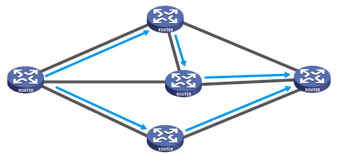
<!-- image-source: https://cdn.nlark.com/yuque/0/2026/png/67474974/1780477022870-bfce9458-e073-4906-a06a-dcce8faf0e8b.png -->

+ **决策依据：** 路由器收到数据包后，会检查数据包中的**目的地址**，并查询自己的**路由表**，来决定从哪个接口将其转发出去。
+ **路由表示例分析：**


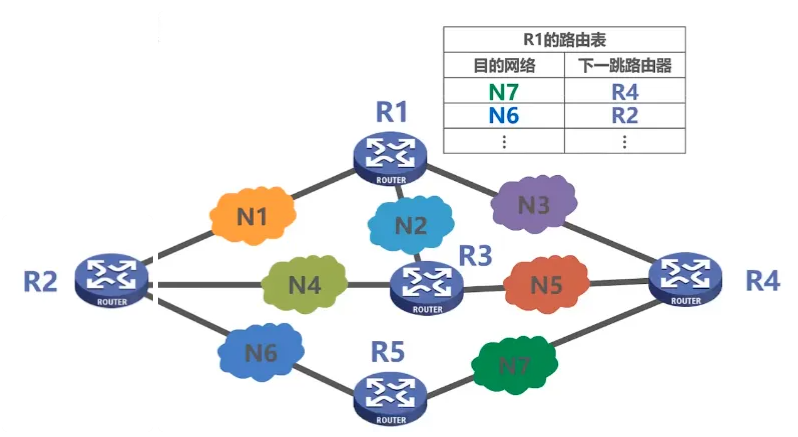
<!-- image-source: https://cdn.nlark.com/yuque/0/2026/png/67474974/1780477108287-e7af05c4-dc26-4287-b9d8-5213ada9a366.png -->

- 路由器R1的路由表中有记录：到达网络 N7，下一跳应转发给路由器 R4。
- 路由器R1的路由表中有记录：到达网络 N6，下一跳应转发给路由器 R2。

+ **路由记录的产生方式：**
    1. **人工配置（静态路由）：** 由管理员手动添加。适用于规模小、拓扑稳定的网络。
    2. **动态路由协议（动态路由）：** 路由器通过运行路由选择协议（如 RIP、OSPF），自动计算和更新路由表。适用于大规模、拓扑常变的互联网，这是因特网采用的主要方式。

> **补充说明：** 路由选择协议的核心是**路由选择算法**，它负责动态地发现网络、计算最优路径、并自适应网络拓扑的变化（如链路故障）。
>

---

### 3.TCP/IP 协议栈中的网络层
因特网（Internet）使用 TCP/IP 四层模型，其网络层通常被称为**网际层**。


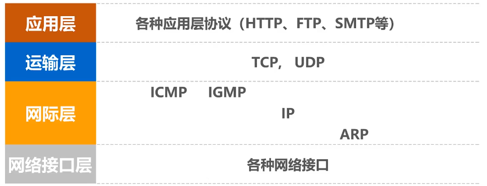
<!-- image-source: https://cdn.nlark.com/yuque/0/2026/png/67474974/1780477263805-4b99836b-ea7a-44a3-987c-c604c4e175fc.png -->

+ **核心协议——IP（网际协议）：** IP 是整个 TCP/IP 协议栈的核心，它提供的是**无连接的、不可靠的数据报服务**。它像一根细线，把所有不同的网络缝合成了一个巨大的互联网。
+ **网际层的其他重要协议（“网际层协议族”）：**
    - **ARP（地址解析协议）：** 已知目的IP地址，解析出对应的硬件（MAC）地址。这是跨网络通信必不可少的一步。
    - **ICMP（网际控制报文协议）：** 用于在网络设备之间传递错误报告和控制信息（例如常用的 `ping` 命令就基于此协议）。
    - **IGMP（网际组管理协议）：** 用于管理多播组成员，实现一对多的通信。

---

### 4.本节内容小结
1. **网络层的根本任务**是实现网络互联和数据包跨网络传输，核心设备是**路由器**。
2. 网络层必须解决**服务模型**（可靠/不可靠）、**寻址**（如IP地址）和**路由选择**三大问题。
3. 因特网的**网际层**采用**无连接的、不可靠的IP协议**作为核心，辅以ARP、ICMP、IGMP等协议协同工作，最终为上层提供全球范围的数据传输能力。
4. 路由表的建立分为**静态人工配置**和**动态路由协议**两种方式，后者是大规模网络的核心。

## 二、网络层提供的两种服务
### 1.引言：可靠通信由谁负责？
网络层需要向上面的运输层提供通信服务。但围绕“可靠通信该由网络自身来保证，还是由用户主机来保证”这个问题，存在两种截然不同的设计理念，也因此产生了网络层的两种核心服务模型：

1. **面向连接的虚电路服务**
2. **无连接的数据报服务**

---

### 2.面向连接的虚电路服务
这种服务模型的核心思想是：**可靠通信应由网络自身来保证**。


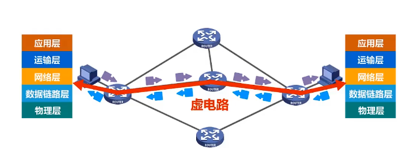
<!-- image-source: https://cdn.nlark.com/yuque/0/2026/png/67474974/1780498062674-ad924628-3ee8-4e97-af11-baea9c79da11.png -->

**1. 工作流程**  
它借鉴了传统电话网“先建立连接，再通信，最后释放连接”的思路，整个过程分为三个阶段：

+ **虚电路建立：** 两台计算机开始通信前，需先在网络层建立一条逻辑连接，即 **“虚电路” (Virtual Circuit)** 。建立过程中，双方协商好所需的一切网络资源。
+ **数据传输：** 一旦虚电路建立完毕，所有分组都会沿着这条既定的逻辑路径，以存储转发的方式依次传送。

> **关键理解：** 这仅仅是“逻辑上”的连接，而不是物理上独占了一条线路。分组交换的虚连接与电路交换的物理连接在本质上是不同的。
>

+ **虚电路拆除：** 通信完成后，需要释放（拆除）之前建立的虚电路，将占用的网络资源归还。

**2. 关键特征**

+ **使用虚电路编号，而非完整地址：** 每个分组的首部中，除了在连接建立阶段需要携带完整的目的主机地址外，后续的数据分组只需携带一个简短的**虚电路编号**即可。路由器根据这个编号就能知道该将分组发往何处。
+ **可靠性依赖：** 这种服务如果再配合使用可靠传输的网络协议，就能确保发送的分组最终正确、完整、按序地到达接收方。

**3. 实际应用**  
	历史上很多广域分组交换网都采用这种设计，例如 **X.25**、**帧中继**（Frame Relay）以及 **ATM**（异步传输模式）。这些技术目前大多已被更简单高效的IP网络取代。

---

### 3.无连接的数据报服务
因特网的先驱者们选择了一条完全不同的道路。这种服务模型的核心思想是：**可靠通信应由用户主机（端系统）自身来保证，网络层只提供尽可能简单的转发服务。**


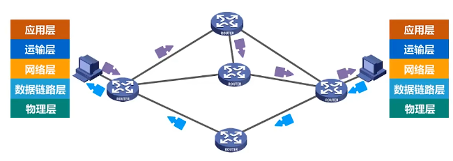
<!-- image-source: https://cdn.nlark.com/yuque/0/2026/png/67474974/1780498172742-9e81d8d4-94b3-42fc-a3ac-5551db82def0.png -->

**1. 工作流程**

+ **无需建立连接：** 两台计算机通信前，它们的网络层**不需要**预先建立任何连接。
+ **独立选路：** 每个分组都是一个独立的“数据报”，可以被网络独立地转发。这意味着，即使是同一个消息拆分出的不同分组，也**可以走不同的路径**到达目的地。

**2. 关键特征**

+ **必须携带完整目的地址：** 由于没有预先建好的“路径”，每个分组的首部都必须携带完整的目的主机地址，以供沿途每个路由器进行独立的路由选择决策。
+ **网络不保证可靠性：** 由于网络本身不提供端到端的可靠传输服务，数据报在传输中可能会出现**误码、丢失、重复以及失序**等差错。这些问题都将交由网络边缘的用户主机和其上的运输层（如TCP）去发现和纠正。

**3. 设计哲学与优势**

这种设计体现了一种“**边缘智能，核心简单**”的哲学，其好处是巨大的：

+ **降低网络造价：** 因为不承担复杂的可靠性保证工作，网络核心的路由器可以做得非常简洁、高效，这使其成本远低于早期电信网中那些笨重昂贵的交换机。
+ **运行方式灵活，适应性强：** 这种简单、尽最大努力交付的服务（Best-Effort Delivery）能够适应各种不同类型的上层应用（从文件传输到实时音视频），为因特网的快速创新铺平了道路。

因特网能够从一个小型的科研网络，发展到今日连接全球数十亿设备的空前规模，充分证明了当初选择这种**无连接数据报服务**设计思想的正确性。

> **补充注解：** 这两种模型的选择，本质上是将复杂性和智能放置在网络核心还是网络边缘的权衡。因特网的设计者们选择了“边缘智能，核心简单”，这使得因特网的核心网络能够专注于高速转发数据，而将可靠性、安全性等复杂功能“外包”给连接在网络边缘的智能主机。这种架构上的分工，是理解整个因特网体系的关键。
>

---

### 4.本课小结与本章学习导向
1. **两种服务模型对比**：


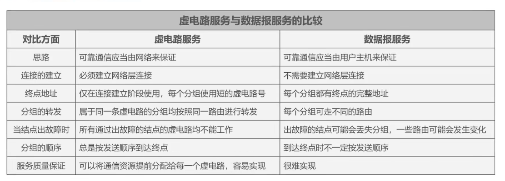
<!-- image-source: https://cdn.nlark.com/yuque/0/2026/png/67474974/1780498206822-290776fc-2c1f-4719-8a93-b925c5d23637.png -->

- **虚电路服务**：面向连接，网络负责保证可靠通信，分组使用虚电路编号，适用于X.25、ATM等早期网络。
- **数据报服务**：无连接，用户主机负责保证可靠通信，分组须带完整目的地址，这是因特网（IP协议）采用的方式。

2. **因特网的选择**：TCP/IP体系结构的网际层提供的是**简单灵活的、无连接的、尽最大努力交付的数据报服务**。
3. **本章后续学习的核心主题**：由于数据报服务是因特网网际层的基石，因此本章的所有内容都将围绕一个核心主题展开——**网际层是如何传送IP数据报的**。我们将逐步学习IP地址、子网划分、路由协议以及IP数据报的具体转发过程等内容。

## 三、IPv4地址
### 1.IPv4地址基本概念
#### （1）什么是IPv4地址
在TCP/IP体系中，**IP地址**是一个最基本的概念。

> **定义**：**IPv4地址**就是给因特网上的**每一台主机或路由器的每一个接口**，分配一个在全世界范围内**唯一的32比特标识符**。
>

#### （2）IP地址的分配机构
| 层级 | 机构 | 职责 |
| --- | --- | --- |
| 全球 | **ICANN**（因特网名字与数字分配机构，Internet Corporation for Assigned Names and Numbers） | 全球IP地址的总分配管理 |
| 区域 | **APNIC**（亚太网络信息中心，Asia-Pacific Network Information Centre） | 亚太地区用户可向其申请IPv4地址 |


> **补充说明**：
>
> + 申请IP地址需要缴纳费用，且一般**不接受个人申请**，通常由ISP或大型组织申请。
> + **2011年2月3日**，IANA（因特网号码分配管理局）宣布IPv4地址池已全部分配完毕。
> + 我国在**2014～2015年**也逐步停止向新用户和新应用分配IPv4地址，同时全面开展IPv6的商用部署。
>

#### （3）IPv4编址方法的三个历史阶段
IPv4地址的编址方法依次经历了以下三个阶段：

| 阶段 | 名称 | 特点 |
| --- | --- | --- |
| 第一阶段 | **分类编址的IP地址** | 将地址划分为A、B、C、D、E五类 |
| 第二阶段 | **划分子网的IP地址** | 从主机号中借用若干位作为子网号（三级结构） |
| 第三阶段 | **无分类编址的IP地址（CIDR）** | 消除分类概念，使用网络前缀 |


> 后续将依次对这三种编址方法进行详细讨论。
>

---

### 2.IPv4地址的表示方法与进制转换
#### （1）点分十进制表示法
32比特的IP地址不方便阅读、记录和输入，因此采用**点分十进制表示方法**。

**转换步骤：**

1. 将32比特IP地址每 **8个比特**分为一组，共 **4组**。
2. 将每组8比特所对应的**十进制数**写出。
3. 每个十进制数之间用**点（.）** 分隔。

**示例：**


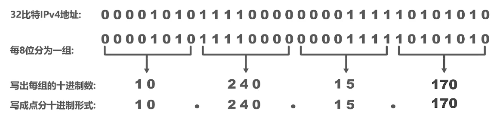
<!-- image-source: https://cdn.nlark.com/yuque/0/2026/png/67474974/1780903538031-594886fb-e71e-4ec8-ac1a-7acfae06ec41.png -->

#### （2）八位无符号二进制数转十进制数
**基本原理**

八位无符号二进制整数的一般形式：

$$
B_7 B_6 B_5 B_4 B_3 B_2 B_1 B_0 \quad (括号外的"2"表示二进制)
$$

+ $B_0$ 为**最低位**，$B_7$ 为**最高位**
+ 各位的**权值**由高到低依次为：

| $B_7$ | $B_6$ | $B_5$ | $B_4$ | $B_3$ | $B_2$ | $B_1$ | $B_0$ |
| :---: | :---: | :---: | :---: | :---: | :---: | :---: | :---: |
| **128** | **64** | **32** | **16** | **8** | **4** | **2** | **1** |


**转换方法**：将各位乘以其权值后相加。

---

**转换技巧与举例**

**方法一：逐位相乘（通用方法）**

> 例：$(10101010)_2 = 1 \times 128 + 0 \times 64 + 1 \times 32 + 0 \times 16 + 1 \times 8 + 0 \times 4 + 1 \times 2 + 0 \times 1 = 128+32+8+2 = \mathbf{170}$
>

**方法二：减法技巧（适用于0较少的情况）**

> 例：$(11111100)_2$  
0的位权值为2和1，因此：$255 - 2 - 1 = \mathbf{252}$
>

**方法三：直接加法（适用于1较少的情况）**

> 例：$(10000001)_2$  
只有最高位和最低位为1：$128 + 1 = \mathbf{129}$
>

> **练习**：$(11110000)_2 = 128 + 64 + 32 + 16 = \mathbf{240}$
>

#### （3）十进制正整数转八位无符号二进制数
**除2取余法（通用方法）**

**步骤**：反复除以2，记录余数，直到商为0；从下往上写出余数。

> 例：将十进制数 **130** 转换为二进制
>

| 步骤 | 除法 | 商 | 余数 |
| :---: | :--- | :---: | :---: |
| 1 | 130 ÷ 2 | 65 | **0** |
| 2 | 65 ÷ 2 | 32 | **1** |
| 3 | 32 ÷ 2 | 16 | **0** |
| 4 | 16 ÷ 2 | 8 | **0** |
| 5 | 8 ÷ 2 | 4 | **0** |
| 6 | 4 ÷ 2 | 2 | **0** |
| 7 | 2 ÷ 2 | 1 | **0** |
| 8 | 1 ÷ 2 | 0 | **1** |


从下往上读取余数：$(130)_{10} = \mathbf{(10000010)_2}$

**凑值法（快速方法）**

适用于IP地址点分十进制转二进制的场景。前提是熟悉各位权值（128、64、32、16、8、4、2、1）。

> 例：将十进制数 **171** 转换为二进制
>
> $171 = 128 + 32 + 8 + 2 + 1$
>
> 因此：$(171)_{10} = \mathbf{(10101011)_2}$
>

| 128 | 64 | 32 | 16 | 8 | 4 | 2 | 1 |
| :---: | :---: | :---: | :---: | :---: | :---: | :---: | :---: |
| 1 | 0 | 1 | 0 | 1 | 0 | 1 | 1 |


---

### 3.分类编址的IPv4地址
#### （1）五类地址概览
分类编址将IPv4地址划分为 **A、B、C、D、E** 五类：


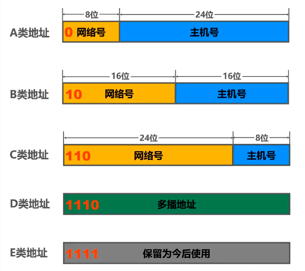
<!-- image-source: https://cdn.nlark.com/yuque/0/2026/png/67474974/1780903678036-e0bd2f24-7e35-4da8-abb2-9dfe3d692cf8.png -->

| 类别 | 网络号位数 | 主机号位数 | 最高位固定值 | 第一字节范围 | 默认子网掩码 | 用途 |
| :---: | :---: | :---: | :---: | :---: | :---: | :---: |
| **A** | 8 | 24 | `0` | 0～127 | 255.0.0.0 | 单播 |
| **B** | 16 | 16 | `10` | 128～191 | 255.255.0.0 | 单播 |
| **C** | 24 | 8 | `110` | 192～223 | 255.255.255.0 | 单播 |
| **D** | — | — | `1110` | 224～239 | 多播地址 | 多播 |
| **E** | — | — | `1111` | 240～255 | 保留地址 | 保留 |


> **重要规则**：
>
> + 只有 **A、B、C三类**地址可分配给主机或路由器的接口。
> + **主机号为全 0** 的地址是**网络地址**，不能分配给主机或路由器接口
> + **主机号为全 1** 的地址是**广播地址**，不能分配给主机或路由器接口。
>

#### （2）A类地址详解
**网络号**：8 位，最高位固定为 0，可变化位 7 位。


<!-- image-source: https://cdn.nlark.com/yuque/0/2026/png/67474974/1780903785165-1f2f0665-3ed4-4783-af2a-52edecf6b624.png -->

**结构**：`[0 | 7位网络号] [24位主机号]`

**特殊网络号**

| 网络号 | 十进制 | 用途 |
| :---: | :---: | :--- |
| `00000000` | **0** | 保留，不可指派 |
| `01111111` | **127** | 本地软件**环回测试**（Loopback） |


+ 第一个可指派网络号：**1**（`00000001`），网络地址：`1.0.0.0`


<!-- image-source: https://cdn.nlark.com/yuque/0/2026/png/67474974/1780903829069-b884631d-44cd-4c47-8fe4-b1d9a65e2a8c.png -->

+ 最后一个可指派网络号：**126**（`01111110`），网络地址：`126.0.0.0`


<!-- image-source: https://cdn.nlark.com/yuque/0/2026/png/67474974/1780903892056-1d684399-e1a7-4ae7-9828-e2f36b62134c.png -->

+ 最小环回测试地址：`127.0.0.1`


<!-- image-source: https://cdn.nlark.com/yuque/0/2026/png/67474974/1780903853308-ab9093be-8e66-4a61-bd8e-2e70129da7c1.png -->

+ 最大环回测试地址：`127.255.255.254`


<!-- image-source: https://cdn.nlark.com/yuque/0/2026/png/67474974/1780903872566-3a6231a7-b03f-46bc-91ea-31cd7d95fe1e.png -->

**A类地址的数量计算**

$$
\text{可指派A类网络数} = 2^{8-1} - 2 = 128 - 2 = \mathbf{126}
$$

> 减2是因为去掉了网络号0和网络号127。
>

$$
\text{每个A类网络可分配IP数} = 2^{24} - 2 = 16777216 - 2 = \mathbf{16777214}
$$

> 减2是因为去掉了网络地址（主机号全0）和广播地址（主机号全1）。
>

#### （3）B类地址详解
**网络号**：16 位，最高两位固定为 10。


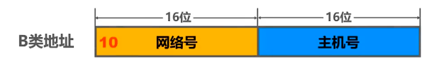
<!-- image-source: https://cdn.nlark.com/yuque/0/2026/png/67474974/1780903999766-47d1f5eb-df2d-4c3d-a67b-ac5a0da186a3.png -->

**结构**：`[10 | 14位网络号] [16位主机号]`

+ 最小网络号：`10000000 00000000` → **128.0**，网络地址：`128.0.0.0`


<!-- image-source: https://cdn.nlark.com/yuque/0/2026/png/67474974/1780904864270-8c37e594-6362-4bdf-a71a-ca158163f38d.png -->

+ 最大网络号：`10111111 11111111` → **191.255**，网络地址：`191.255.0.0`


<!-- image-source: https://cdn.nlark.com/yuque/0/2026/png/67474974/1780904874179-063793ea-bbac-46e7-b5be-22008cfa2534.png -->

**B类地址的数量计算**

$$
\text{可指派B类网络数} = 2^{16-2} = 2^{14} = \mathbf{16384}
$$

> **关于128.0的说明**：有些教材认为128.0是保留网络号，第一个可指派的为128.1。但根据2002年9月发表的 **RFC 3330**，128.0已经可以分配使用。
>

$$
\text{每个B类网络可分配IP数} = 2^{16} - 2 = 65536 - 2 = \mathbf{65534}
$$

#### （4）C类地址详解
**网络号**：16 位，最高两位固定为 10。


<!-- image-source: https://cdn.nlark.com/yuque/0/2026/png/67474974/1780904970309-95b01bcc-0b17-4e38-b2a3-1c70ab939d3b.png -->

**结构**：`[110 | 21位网络号] [8位主机号]`

+ 最小网络号：`11000000 00000000 00000000` → **192.0.0**，网络地址：`192.0.0.0`


<!-- image-source: https://cdn.nlark.com/yuque/0/2026/png/67474974/1780904987348-47c2d065-acf4-481f-ac0c-3f5023faf20e.png -->

+ 最大网络号：`11011111 11111111 11111111` → **223.255.255**，网络地址：`223.255.255.0`


<!-- image-source: https://cdn.nlark.com/yuque/0/2026/png/67474974/1780905001940-56f2adb2-caff-49b0-a017-35de8bfec006.png -->

**C类地址的数量计算**

$$
\text{可指派C类网络数} = 2^{24-3} = 2^{21} = \mathbf{2097152}
$$

> **关于192.0.0的说明**：有些教材认为192.0.0是保留网络号，第一个可指派的为192.0.1。但根据RFC 3330，192.0.0已经可以分配，只是目前尚未分配出去。
>

$$
\text{每个C类网络可分配IP数} = 2^{8} - 2 = 256 - 2 = \mathbf{254}
$$

#### （5）地址类别判定练习题

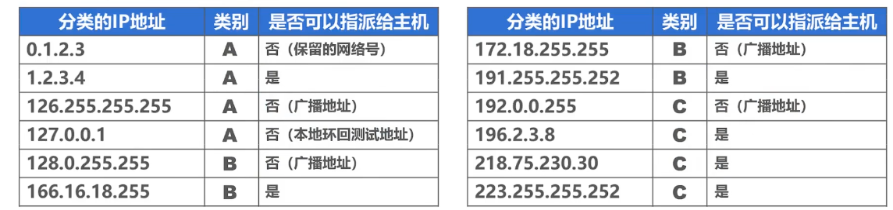
<!-- image-source: https://cdn.nlark.com/yuque/0/2026/png/67474974/1780905075961-d82896d5-8e67-483c-91d8-8f072111beae.png -->

**判定规则**：

+ 第一字节 < 127 → A类
+ 128 ≤ 第一字节 ≤ 191 → B类
+ 192 ≤ 第一字节 ≤ 223 → C类

**不可指派的三种情况**：

1. A类网络号 **0** 和 **127** 不能指派
2. 主机号**全0**（网络地址）不能指派
3. 主机号**全1**（广播地址）不能指派

#### （6）特殊IPv4地址汇总
| 特殊地址 | 说明 | 使用限制 |
| :--- | :--- | :--- |
| `0.0.0.0` | 表示"本网络上的本主机" | 只能作为**源地址**（如DHCP发现报文） |
| `127.x.x.x`（非全0/全1） | 环回测试地址 | 既可作**源地址**也可作**目的地址**，用于本地软件环回测试 |
| `255.255.255.255` | 受限广播地址 | 只能作为**目的地址**，仅在本网络广播，路由器不转发 |


#### （7）分类编址下的IP分配方案练习
**题目**：给定一个包含多个网络的拓扑图，按节约IP地址的原则为各网络分配IP地址。

**解题步骤**：

1. **识别所有网络**：
    - 每个广播域（包括交换机互连的以太网）算一个网络
    - 两台路由器直连的链路也算一个网络
2. **统计各网络所需IP数量**：
    - 需求 = 主机数 + 路由器接口数（还需预留网络地址和广播地址）
3. **按需分配网络类别**：


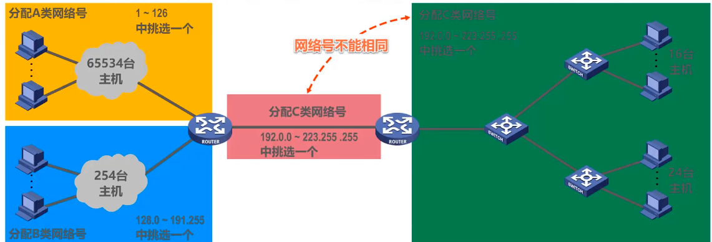
<!-- image-source: https://cdn.nlark.com/yuque/0/2026/png/67474974/1780905158038-fa80d1fd-20bd-44e8-9e14-bb660c2c499c.png -->

| 所需地址数 | 可分配类别 | 节约原则 |
| :---: | :--- | :--- |
| 65535 | A类（提供16777214个） | 只能选A类 |
| 255 | A类或B类（提供65534个） | **选B类** |
| 41 | A/B/C类均可 | **选C类** |
| 2 | A/B/C类均可 | **选C类** |


4. **分配网络号**：
    - A类：在 1～126 中选取
    - B类：在 128.0～191.255 中选取
    - C类：在 192.0.0～223.255.255 中选取
    - **不同网络的网络号不能相同**
5. **分配主机/接口IP**：
    - 各IP互不相同
    - 主机号**不能全0**（网络地址）
    - 主机号**不能全1**（广播地址）

---

### 4.划分子网的IPv4地址
#### （1）为什么需要划分子网
**场景**：某单位申请到一个B类网络（65534个可用IP），但实际只用了一小部分，剩余地址无法被其他单位使用。


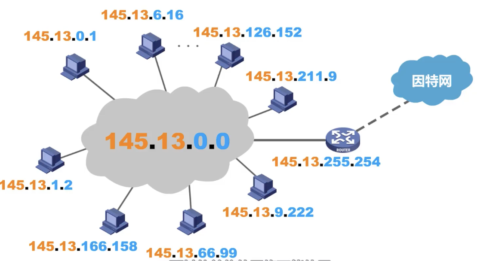
<!-- image-source: https://cdn.nlark.com/yuque/0/2026/png/67474974/1780990603160-df72498b-e01e-4a7c-83a9-b7c3db43f8e2.png -->

**问题**：

+ 新增子网需再申请新网络号 → 时间长、费用高
+ 新网络号使全球路由表膨胀
+ 原有网络中大量IP地址被浪费

**解决方案**：从主机号部分**借用若干位**作为**子网号**，将两级结构（网络号+主机号）变为三级结构（网络号+子网号+主机号）。


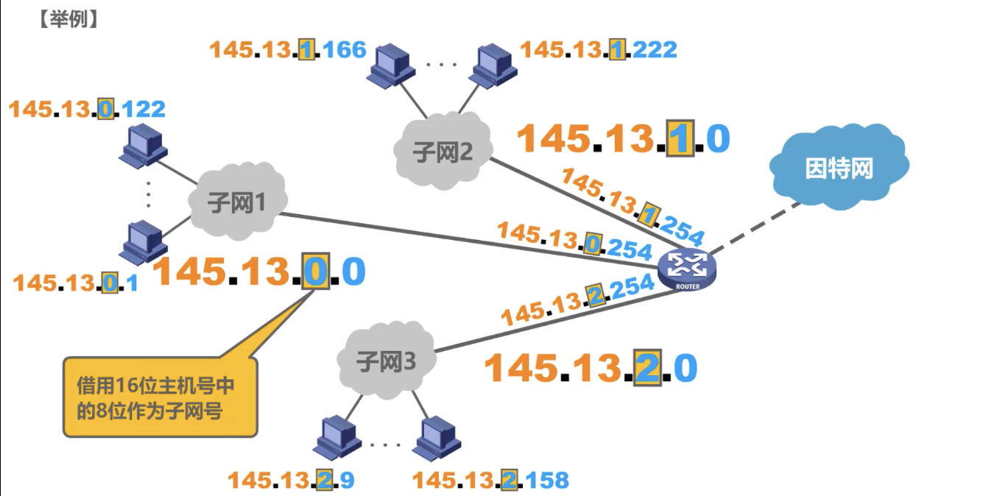
<!-- image-source: https://cdn.nlark.com/yuque/0/2026/png/67474974/1780990702535-7dc83285-3918-44d0-a429-0fee77e3db51.png -->

> **示例**：借用16位主机号中的8位作为子网号，可将一个B类网络划分为多个子网（子网号0、1、2...）。
>

#### （2）子网掩码
**核心问题**：外界如何知道主机号中有多少位被用作了子网号？

**答案**：使用**子网掩码（Subnet Mask）**。

+ 子网掩码为**32比特**
+ **连续的1** → 对应网络号和子网号
+ **连续的0** → 对应主机号

**核心运算**：

$$
\text{IP地址} \quad \textbf{AND} \quad \text{子网掩码} = \text{子网的网络地址}
$$

> 逻辑与运算：逐比特相与，网络号和子网号被保留，主机号被清零。
>


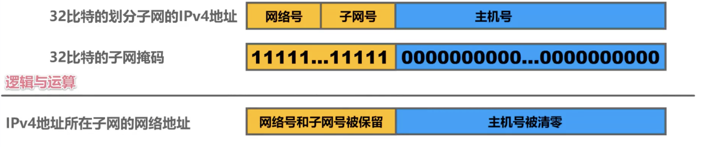
<!-- image-source: https://cdn.nlark.com/yuque/0/2026/png/67474974/1780990989628-42963cf0-33e9-405e-8cbd-fef14f8cc60b.png -->

#### （3）划分子网实例
**题目**：已知C类网络 `218.75.230.0`，使用子网掩码 `255.255.255.128` 划分子网。

**分析**：

1. **识别类别**：第一字节为218 → **C类**（网络号24位，主机号8位）
2. **解析子网掩码**：`128` = $(10000000)_2$→ 从主机号借用 **1位** 作为子网号

**计算**：

+ 可划分子网数：$2^1 = 2$ 个
+ 每个子网可用地址数：$2^{8-1} - 2 = 2^7 - 2 = 128 - 2 = \mathbf{126}$ 个

**原C类网络地址范围**：

| 地址 | 值 | 说明 |
| :--- | :--- | :--- |
| 网络地址 | `218.75.230.0` | 第一个地址（主机号全0） |
| 第一个可用地址 | `218.75.230.1` | 网络地址 + 1 |
| 最后一个可用地址 | `218.75.230.254` | 广播地址 - 1 |
| 广播地址 | `218.75.230.255` | 最后一个地址（主机号全1） |
| 总地址数 | 256 | 可用地址254个 |


**子网0**（子网号 = 0）：

| 地址类型 | 二进制（主机号7位） | 点分十进制 |
| :--- | :--- | :--- |
| 网络地址 | `0 0000000` | `218.75.230.0` |
| 最小可用 | `0 0000001` | `218.75.230.1` |
| 最大可用 | `0 1111110` | `218.75.230.126` |
| 广播地址 | `0 1111111` | `218.75.230.127` |


**子网1**（子网号 = 1）：

| 地址类型 | 二进制（主机号7位） | 点分十进制 |
| :--- | :--- | :--- |
| 网络地址 | `1 0000000` | `218.75.230.128` |
| 最小可用 | `1 0000001` | `218.75.230.129` |
| 最大可用 | `1 1111110` | `218.75.230.254` |
| 广播地址 | `1 1111111` | `218.75.230.255` |


> **结论**：使用子网掩码 `255.255.255.128` 可将C类网 `218.75.230.0` 均分为两个子网，每个子网可用126个IP地址。
>

#### （4）例题
**【习题1】** 已知某个网络的地址为218.75.230.0，使用子网掩码255.255.255.192对其进行子网划分，请给出划分细节。

【解析】

1. 根据所给网络地址可知其为C类网络地址，网络号占3个字节，主机号占1个字节；
2. 根据所给子网掩码可知从1字节主机号中借用2位作为子网号；

C类网218.75.230.0包含的全部IP地址（共256个）

划分出的子网数量 $2^2 = 4$  
每个子网可分配的地址数量 $2^{(8-2)} - 2 = 62$

**详细划分表：**

| 网络号 | 子网号 | 主机号 | 说明 | 结果 |
| :--- | :--- | :--- | :--- | :--- |
| 218.75.230. | 0 0 | 0 0 0 0 0 0 | 子网0的网络地址 | **218.75.230.0** |
| 218.75.230. | 0 0 | 0 0 0 0 0 1 | 可分配最小地址 | **218.75.230.1** |
| ... | ... | ... | ... | ... |
| 218.75.230. | 0 0 | 1 1 1 1 1 0 | 可分配最大地址 | **218.75.230.62** |
| 218.75.230. | 0 0 | 1 1 1 1 1 1 | 子网0的广播地址 | **218.75.230.63** |
|  |  |  |  |  |
| 218.75.230. | 0 1 | 0 0 0 0 0 0 | 子网1的网络地址 | **218.75.230.64** |
| 218.75.230. | 0 1 | 0 0 0 0 0 1 | 可分配最小地址 | **218.75.230.65** |
| ... | ... | ... | ... | ... |
| 218.75.230. | 0 1 | 1 1 1 1 1 0 | 可分配最大地址 | **218.75.230.126** |
| 218.75.230. | 0 1 | 1 1 1 1 1 1 | 子网1的广播地址 | **218.75.230.127** |
|  |  |  |  |  |
| 218.75.230. | 1 0 | 0 0 0 0 0 0 | 子网2的网络地址 | **218.75.230.128** |
| 218.75.230. | 1 0 | 0 0 0 0 0 1 | 可分配最小地址 | **218.75.230.129** |
| ... | ... | ... | ... | ... |
| 218.75.230. | 1 0 | 1 1 1 1 1 0 | 可分配最大地址 | **218.75.230.190** |
| 218.75.230. | 1 0 | 1 1 1 1 1 1 | 子网2的广播地址 | **218.75.230.191** |
|  |  |  |  |  |
| 218.75.230. | 1 1 | 0 0 0 0 0 0 | 子网3的网络地址 | **218.75.230.192** |
| 218.75.230. | 1 1 | 0 0 0 0 0 1 | 可分配最小地址 | **218.75.230.193** |
| ... | ... | ... | ... | ... |
| 218.75.230. | 1 1 | 1 1 1 1 1 0 | 可分配最大地址 | **218.75.230.254** |
| 218.75.230. | 1 1 | 1 1 1 1 1 1 | 子网3的广播地址 | **218.75.230.255** |


---


<!-- image-source: https://cdn.nlark.com/yuque/0/2026/png/67474974/1780991961631-5c2b704f-6852-47d0-a1d6-d531b642d517.png -->

已知B类IP地址和子网掩码 `255.255.252.0`，求主机所在子网的网络地址和广播地址。

**分析**：

+ B类地址：网络号16位，主机号16位
+ 子网掩码 `252.0` → `(11111100 00000000)_2` → 借用 **6位** 作为子网号

**解题**：

+ 将主机号转为二进制
+ 子网掩码中连续6个1对应的部分作为子网号
+ 保持网络号和子网号不变，主机号10位全0 → **网络地址**
+ 保持网络号和子网号不变，主机号10位全1 → **广播地址**


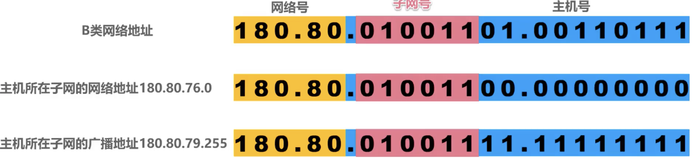
<!-- image-source: https://cdn.nlark.com/yuque/0/2026/png/67474974/1780992074767-8b78d295-ec66-46b4-bbe4-59de501c0212.png -->

> 例如得到：网络地址 `180.80.76.0`，广播地址 `180.80.79.255`
>

#### （5）默认子网掩码
**定义**：在未划分子网的情况下使用的子网掩码。

| 类别 | 网络号 | 主机号 | 默认子网掩码（二进制） | 默认子网掩码（点分十进制） |
| :---: | :---: | :---: | :--- | :---: |
| **A** | 8位 | 24位 | `11111111 00000000 00000000 00000000` | **255.0.0.0** |
| **B** | 16位 | 16位 | `11111111 11111111 00000000 00000000` | **255.255.0.0** |
| **C** | 24位 | 8位 | `11111111 11111111 11111111 00000000` | **255.255.255.0** |


---

### 5.无分类编址的IPv4地址（CIDR）
#### （1）**无分类编址（CIDR）**
**提出背景**

划分子网虽在一定程度上缓解了IP地址紧张问题，但：

+ 大量C类网络因地址空间太小未被充分利用
+ IPv4地址仍在加速消耗
+ 整个IPv4地址空间面临耗尽威胁

> **解决方案**：IETF提出**无分类编址（CIDR：C**lassless **I**nter **-D**omain **R**outing **）**，同时成立IPv6工作组研究下一代IP协议。
>
> 1993年，IETF发布了无分类域间路由选择（**CIDR**，读作 _sider_）的相关RFC文档。
>

---

**CIDR的核心特点**

+ **消除**了传统A、B、C类地址及划分子网的概念
+ 更加**有效**地分配IPv4地址空间
+ 在IPv6全面部署前，允许因特网规模继续增长

---

**CIDR记法（斜线记法）**

**格式**：`IP地址/网络前缀位数`（**斜线后面写上网络前缀所占的比特数量**）


<!-- image-source: https://cdn.nlark.com/yuque/0/2026/png/67474974/1780992556631-7f707aca-987f-4dae-b6c0-6f6d44601ab3.png -->

> **示例**：`128.14.35.7/20`  
表示该32位IP地址的前 **20个比特**为**网络前缀**，剩余 **12个比特**为主机号。
>

---

**CIDR地址块**

CIDR将**网络前缀相同**的连续IP地址组成一个**CIDR地址块**。已知块中任意一个地址，即可推导出该地址块的全部细节。

**地址块的全部细节包括**：

1. 最小地址
2. 最大地址
3. 地址数量
4. 聚合某类网络的数量
5. 地址掩码

---

**实例分析：** `**128.14.35.7/20**`

**步骤1：确定前缀和主机号**

+ 网络前缀：前20比特（第1字节 + 第2字节 + 第3字节的前4位）
+ 主机号：剩余12比特

**步骤2：将第3、4字节转为二进制**

```plain
第3字节 35 = 0010 0011
           ↑↑↑↑
        前4位属于前缀

第4字节  7 = 0000 0111
           全部属于主机号
```

**步骤3：计算地址块参数**


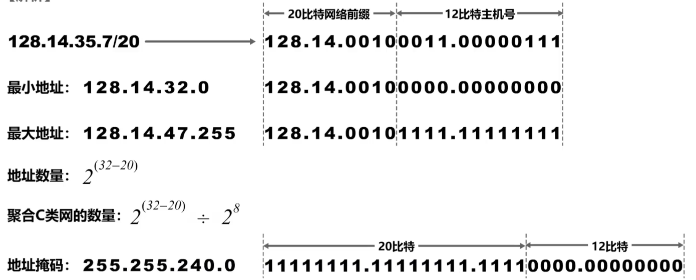
<!-- image-source: https://cdn.nlark.com/yuque/0/2026/png/67474974/1780992722283-52382de7-be6b-4513-98a8-579531df560c.png -->

| 参数 | 计算方法 | 结果 |
| :--- | :--- | :--- |
| **最小地址** | 前缀不变，主机号全0 | `128.14.32.0` |
| **最大地址** | 前缀不变，主机号全1 | `128.14.47.255` |
| **地址数量** | $2^{32-20} = 2^{12}$ | **4096** |
| **聚合C类网数量** | $2^{12} / 2^{8} = 2^4$ | **16个C类网** |
| **地址掩码** | 20个1 + 12个0 | `255.255.240.0` |


> 掩码推导：`11111111 11111111 11110000 00000000` → `255.255.240.0`
>

练习：


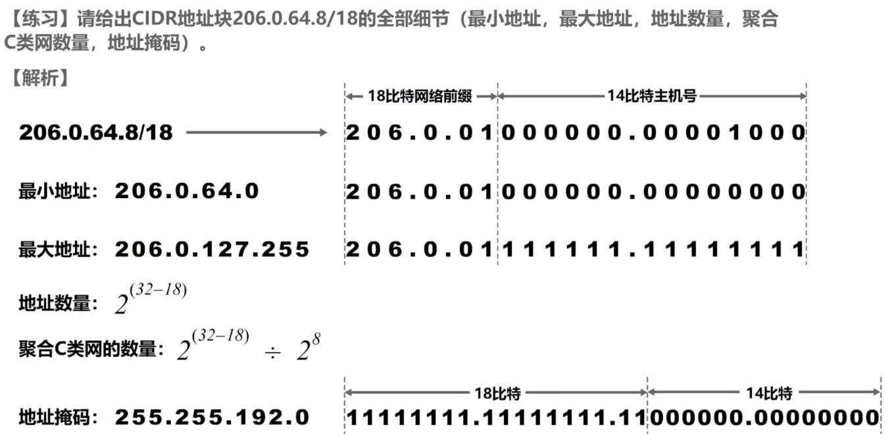
<!-- image-source: https://cdn.nlark.com/yuque/0/2026/png/67474974/1780992769161-dd7590f5-f628-408a-8cae-4b466498e5aa.png -->

#### （2）路由聚合（构造超网）
**目的**：减少路由表中的路由记录数量。

**方法**：找出多个目的网络地址的**共同前缀**。

**实例**


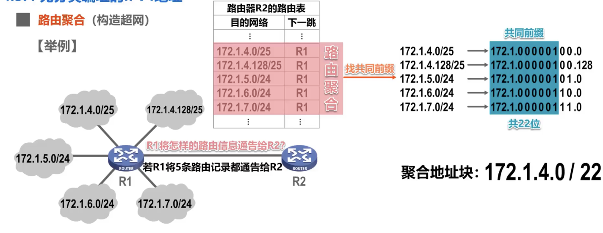
<!-- image-source: https://cdn.nlark.com/yuque/0/2026/png/67474974/1780992880347-83da27c2-d0ae-4e18-abc4-6227f9bd4b9e.png -->

假设路由器R1直连5个网络，需向相邻路由器R2通告路由信息。

+ 5个网络的前两个字节相同，从第三字节开始不同
+ 将第三字节转为二进制，找出共同前缀为 **22位**
+ 记为 `/22`
+ 共同前缀保持不变，剩余10位全0 → 得到聚合后的地址块（**超网**）

**重要原则 — 最长前缀匹配**：

> 若路由器查表转发分组时发现有多条路由可选，则选择**网络前缀最长**的那条路由。
>
> **原因**：网络前缀越长 → 地址块越小 → 路由越**具体**。
>

#### （3）考研真题解析
**2011年题38**


<!-- image-source: https://cdn.nlark.com/yuque/0/2026/png/67474974/1780992941868-788f2f9b-957e-49e1-9a6b-8eace59c24d2.png -->

**分析**：


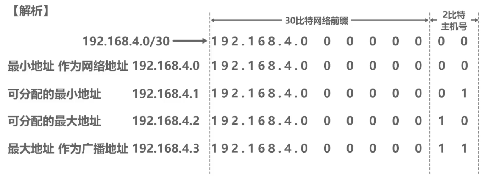
<!-- image-source: https://cdn.nlark.com/yuque/0/2026/png/67474974/1780993044578-d4ddff5f-f9ad-41a5-9a15-75f28d990f47.png -->

+ `/30` → 前缀30位，主机号仅 **2位**
+ 最小地址（网络地址）：`192.168.4.0`
+ 最大地址（广播地址）：`192.168.4.3`
+ 可分配地址：`192.168.4.1` 和 `192.168.4.2`（仅2个）
+ 目的地址 `192.168.4.3` 为**广播地址** → 所有主机都能收到
+ **答案**：最大主机数为 **2**

---

**2018年题38**

**题目**：对4个目的网络地址进行路由聚合。

**分析**：


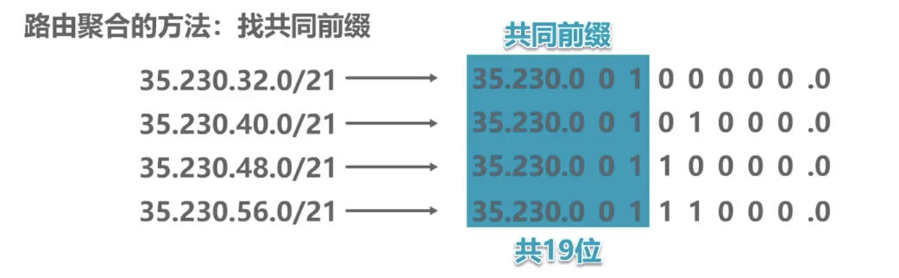
<!-- image-source: https://cdn.nlark.com/yuque/0/2026/png/67474974/1780993223349-5db59480-f02c-43ae-af80-840ff88bece6.png -->

+ 前两个字节相同，从第三字节开始不同
+ 将第三字节转为二进制，找出共同前缀为 **19位**
+ 记为 `/19`
+ 共同前缀不变，剩余13位全0 → 得到聚合后的目的网络地址

---

### 6.IPv4地址的应用规划（FLSM与VLSM）
#### （1）概述
给定一个IPv4地址块，需将其划分为若干更小的地址块并分配给不同网络，主要有两种方法：

| 方法 | 全称 | 特点 | 优缺点 |
| :--- | :--- | :--- | :--- |
| **FLSM** | 定长子网掩码 | 所有子网使用**同一个**子网掩码 | 每个子网分配IP数相同，**容易浪费** |
| **VLSM** | 变长子网掩码 | 不同子网使用**不同的**子网掩码 | 按需分配，**减少浪费** |


#### （2）FLSM（定长子网掩码）划分实例
**场景**：申请到C类网络 `218.75.230.0`，需划分为5个子网。

**各网络IP需求统计**：0


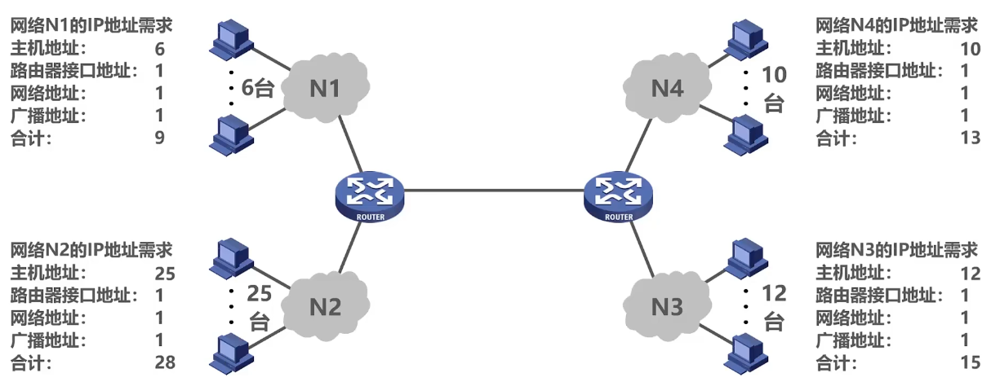
<!-- image-source: https://cdn.nlark.com/yuque/0/2026/png/67474974/1781016328644-3d8e429d-f837-482a-ba9f-9fe2b8535f15.png -->

| 网络 | 主机数 | 路由器接口 | 网络地址 | 广播地址 | 总需求 |
| :---: | :---: | :---: | :---: | :---: | :---: |
| N1 | 6 | 1 | 1 | 1 | **9** |
| N2 | 25 | 1 | 1 | 1 | **28** |
| N3 | — | — | — | — | （类似计算） |
| N4 | — | — | — | — | （类似计算） |
| N5 | 0 | 2 | 1 | 1 | **4** |


> N5为两台路由器直连链路，无主机，仅需2个接口地址。
>

**划分方案**：


<!-- image-source: https://cdn.nlark.com/yuque/0/2026/png/67474974/1781016367223-115d5f7d-d56f-4307-9dc0-b5176f9cd8a1.png -->

+ 从8位主机号中借用 **3位** 作为子网号
+ 可划分子网数：$2^3 = 8$ 个（≥ 5，满足需求）
+ 每个子网地址数：$2^{8-3} = 2^5 = 32$ 个（≥ 各网络最大需求28，满足）
+ 子网掩码：`11100000` → **224**
+ 完整子网掩码：**255.255.255.224**

**子网划分细节**（以子网1、2为例）：


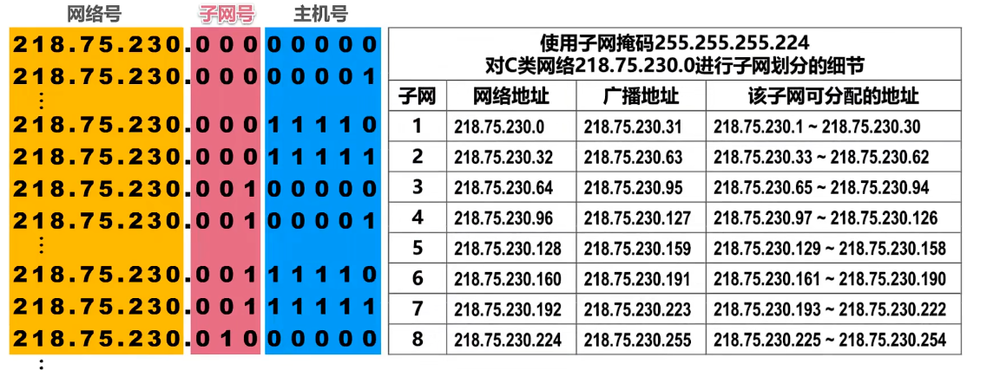
<!-- image-source: https://cdn.nlark.com/yuque/0/2026/png/67474974/1781016726295-11727929-f6cb-4fb5-b264-19b1a5c469d9.png -->

> 以此类推，可得到全部8个子网的地址范围，从中任选5个分配给N1～N5。
>

**FLSM的缺陷**：

+ 只能划分出 $2^N$ 个子网
+ 每个子网分配的IP数相同
+ N5仅需4个地址，却被分配32个 → **严重浪费**（浪费了28个地址）

#### （3）VLSM（变长子网掩码）划分实例
**场景**：同FLSM，但改用变长子网掩码。

**按需分配原则**：根据各网络实际需要的地址数，确定主机号位数。


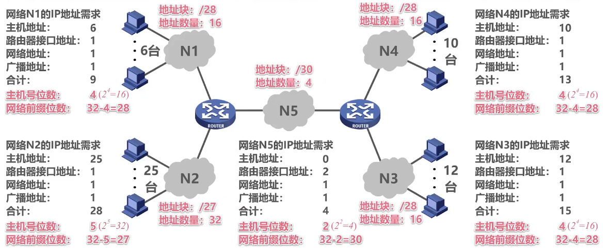
<!-- image-source: https://cdn.nlark.com/yuque/0/2026/png/67474974/1781016823100-3e939556-477e-4380-9a9e-39746a22e3fb.png -->

| 网络 | 需求 | 主机号位数 | 地址块大小 | 网络前缀位数 |
| :---: | :---: | :---: | :---: | :---: |
| N2 | 28 | 5位（$2^5=32 \geq 28$） | 32 | 27位 |
| N1 | 9 | 4位（$2^4=16 \geq 9$） | 16 | 28位 |
| N3 | — | — | 16 | 28位 |
| N4 | — | — | 16 | 28位 |
| N5 | 4 | 2位（$2^2=4 \geq 4$） | 4 | 30位 |


**分配原则**：

> 子块的**起点位置**不能随意选取，只能选取**块大小整数倍**的地址作为起点。
>
> **建议**：先给大的子块分配，再分配小的。
>

**分配过程**（基于地址块 `218.75.230.0/24`）：


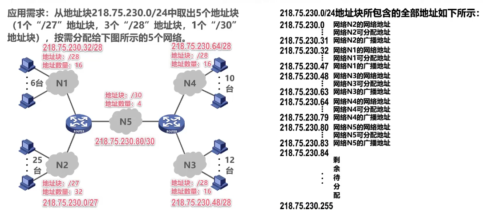
<!-- image-source: https://cdn.nlark.com/yuque/0/2026/png/67474974/1781017464841-8252e0da-c7ce-4cc3-a8b1-2d15cde7c200.png -->

| 网络 | 地址块大小 | 网络地址 | 广播地址 | 可用范围 |
| :---: | :---: | :--- | :--- | :--- |
| **N2** | 32 | `218.75.230.0` | `218.75.230.31` | `.1` ～ `.30` |
| **N1** | 16 | `218.75.230.32` | `218.75.230.47` | `.33` ～ `.46` |
| **N3** | 16 | `218.75.230.48` | `218.75.230.63` | `.49` ～ `.62` |
| **N4** | 16 | `218.75.230.64` | `218.75.230.79` | `.65` ～ `.78` |
| **N5** | 4 | `218.75.230.80` | `218.75.230.83` | `.81` ～ `.82` |


> 原地址块中 `.84` ～ `.255` 的地址可留作今后分配。
>

**VLSM的优势**：

+ 按需划分，子网数量灵活
+ 各子网分配的IP数可不同
+ N5仅需4个地址，精确分配4个 → **零浪费**

#### （4）FLSM 与 VLSM 对比总结
| 对比维度 | FLSM（定长子网掩码） | VLSM（变长子网掩码） |
| :--- | :--- | :--- |
| 子网掩码 | 所有子网**相同** | 各子网**可以不同** |
| 子网数量 | 只能为 $2^N$ 个 | 灵活，按需划分 |
| 每个子网IP数 | **相同** | **可以不同** |
| IP地址利用率 | 较低，易浪费 | 较高，浪费少 |
| 配置复杂度 | 简单 | 相对复杂 |
| 适用场景 | 各子网规模相近 | 各子网规模差异大 |


---

## 四、IP数据报的发送和转发过程
### 1. 引言与核心概念界定
在TCP/IP协议栈中，IP数据报的传输过程主要包含两个核心环节：

1. **主机发送IP数据报**：源主机将数据报交付给网络。
2. **路由器转发IP数据报**：中间路由器根据路由表将数据报向目的网络推进。

> **学习范围界定**：  
为了聚焦于**网际层（IP层）** 的发送与转发机制，本文档将忽略数据链路层的相关细节，包括：使用ARP协议获取目的主机或路由器接口MAC地址的过程，以及以太网交换机自学习与转发MAC帧的过程。
>

---

### 2.网络拓扑与交付方式判定
**网络拓扑与地址规划**

假设存在一个小型互联网，包含一台路由器和两个交换式以太网（网络1与网络2）。路由器接口0直连网络1，接口1直连网络2。各网络的主机与路由器接口均配置了相应的IP地址与子网掩码。


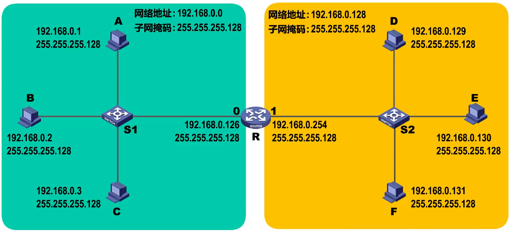
<!-- image-source: https://cdn.nlark.com/yuque/0/2026/png/67474974/1781076133623-30c35c59-482c-4875-ba4e-bd7a3d4e3d1e.png -->

**直接交付与间接交付**

+ **直接交付**：同一网络中的主机之间直接通信，无需路由器中转。
+ **间接交付**：不同网络中的主机之间通信，必须通过路由器进行中转。


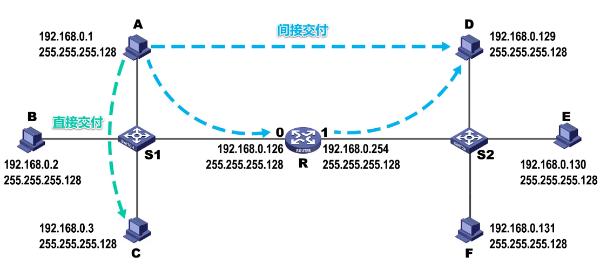
<!-- image-source: https://cdn.nlark.com/yuque/0/2026/png/67474974/1781076163420-6a024cfe-f501-4bc9-9aec-d39cae008bfa.png -->

**判定算法：源主机如何判断交付方式？**

源主机在发送数据报前，需判断目的主机是否与自己在同一网络。判定步骤如下：

1. **计算源网络地址**：将源主机自身的IP地址与其子网掩码进行**逻辑与（AND）** 运算。
2. **计算目的网络地址**：将目的主机的IP地址与**源主机的子网掩码**进行逻辑与运算。
3. **比对结果**：
    - 若两者**相等** $\rightarrow$ 在同一网络，执行**直接交付**。
    - 若两者**不等** $\rightarrow$ 不在同一网络，执行**间接交付**。


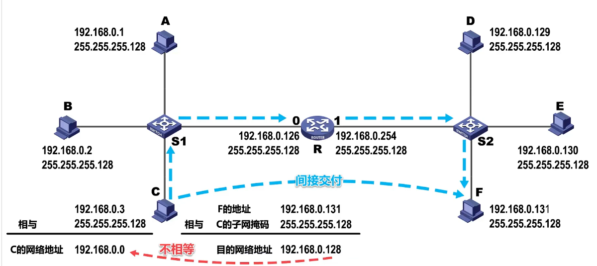
<!-- image-source: https://cdn.nlark.com/yuque/0/2026/png/67474974/1781076293396-8d1a9571-b7de-4345-8b3b-a3f151ca499e.png -->

> **示例**：主机C向主机F发送IP数据报。主机C将主机F的IP与自己的子网掩码相与，得到的目的网络地址与自身的网络地址不相等，因此判定为间接交付，需将数据报交由路由器处理。
>

---

### 3.默认网关（Default Gateway）机制
当源主机判定需要进行**间接交付**时，它需要知道应将IP数据报交给哪个路由器。

+ **定义**：默认网关是本网络中指定的一个路由器接口的IP地址，负责帮助本网络内的主机转发跨网数据报。
+ **配置原则**：主机必须将与其直连的路由器接口的IP地址配置为自己的默认网关。
+ **工作机制**：当主机需要与其他网络通信时，会在数据链路层将MAC帧发送给默认网关的MAC地址，由默认网关在网络层提取IP数据报并进行后续转发。


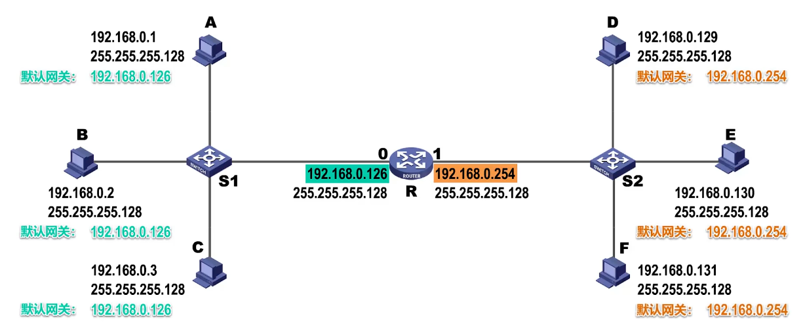
<!-- image-source: https://cdn.nlark.com/yuque/0/2026/png/67474974/1781076357570-624f0068-6a06-4813-bd0b-a0269f24b857.png -->

---

### 4.路由器转发IP数据报的核心机制
当路由器收到IP数据报后，其标准处理流程如下：


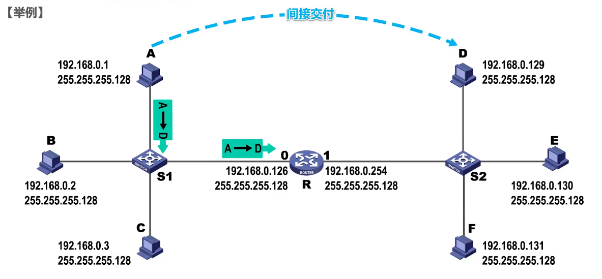
<!-- image-source: https://cdn.nlark.com/yuque/0/2026/png/67474974/1781076421581-f010e161-672a-4a8b-848f-001f9984acb4.png -->

**首部校验与差错处理**

1. 路由器首先检查IP数据报首部是否出错（如首部校验和错误）。
2. **若出错**：直接丢弃该数据报，并向源主机发送 **ICMP（Internet Control Message Protocol）差错报告报文**。
3. **若无错**：提取首部中的**源IP地址**和**目的IP地址**，进入查表转发阶段。

**路由表（Routing Table）的构成**

路由表是路由器进行转发决策的核心数据库，其条目主要来源包括：

| 路由类型 | 生成方式 | 特点 | 示例 |
| :--- | :--- | :--- | :--- |
| **直连路由** | 配置接口IP和掩码时**自动生成** | 无下一跳路由器，出接口明确 | 接口0直连 `192.168.0.0/25` |
| **静态路由** | 网络管理员**手工配置** | 适用于小型、拓扑稳定的网络 | 指向特定下一跳IP的固定路径 |
| **动态路由** | 路由器运行**路由协议**（如OSPF, BGP）自动学习 | 适用于大型、拓扑复杂的网络 | 根据网络状态动态更新 |


**查表转发算法**


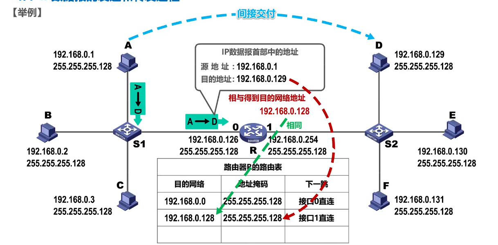
<!-- image-source: https://cdn.nlark.com/yuque/0/2026/png/67474974/1781077216566-bf72b480-1563-4183-b46f-aaa838ecb4ea.png -->

路由器根据目的IP地址，在路由表中逐条查找匹配的路由条目：

1. 取出路由条目中的**地址掩码**。
2. 将**目的IP地址**与该掩码进行逻辑与运算，得到计算出的目的网络地址。
3. 将计算结果与路由条目中的**目的网络地址**进行比对。
4. 若相同，则匹配成功，按照该条目指示的**下一跳IP**和**出接口**转发数据报；若遍历完所有条目均未匹配，则丢弃数据报并发送ICMP目的不可达报文。

> **后端开发视角补充：路由查找的数据结构优化**  
讲稿中提到的“逐条检查”仅为原理演示。在实际的高性能路由器研发或C++后端网关开发中，线性遍历无法满足线速转发（Line-rate）的需求。工程上通常采用高效的数据结构来加速最长前缀匹配（Longest Prefix Match），例如：
>
> + **Trie树（字典树）/ 多叉树**：利用IP地址的比特前缀特性进行树形检索。
> + **DIR-24-8 算法**：通过空间换时间，利用多级查表（TCAM或SRAM）实现 $O(1)$ 或 $O(2)$ 复杂度的硬件级路由查找。
>

---

### 5.广播域隔离与广播数据报处理
**广播地址的类型**

+ **直接广播地址**：主机号全为1的地址（如 `192.168.0.127` 对于 `/25` 网络）。
+ **受限广播地址**：`255.255.255.255`，仅在本网络内广播。


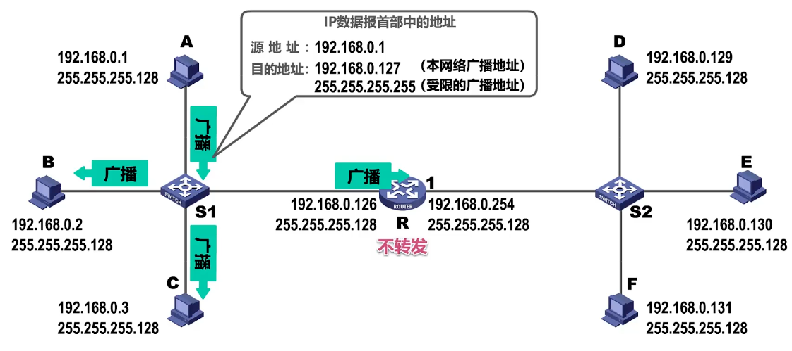
<!-- image-source: https://cdn.nlark.com/yuque/0/2026/png/67474974/1781077731227-fe8a7487-cc5a-485a-9812-5d478a195e86.png -->

**路由器对广播报的处理原则**

1. **本网络广播**：主机向本网络发送广播报（目的地址为本网络广播地址或受限广播地址），本网络所有设备接收。**路由器接收但不转发**。
2. **跨网络广播**：主机向其他网络发送广播报（目的地址为其他网络的直接广播地址），数据报到达路由器后，路由器识别其为广播地址，**拒绝转发**。

> **核心结论：路由器隔离广播域。**  
这一设计至关重要。若因特网中的路由器转发广播数据报，将引发全局性的**广播风暴（Broadcast Storm）**，导致网络拥塞甚至瘫痪。
>

---

### 6.历年考研真题深度解析

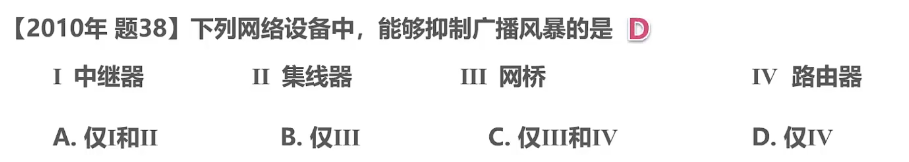
<!-- image-source: https://cdn.nlark.com/yuque/0/2026/png/67474974/1781077772605-8a87f055-b799-427b-89ba-c37dd651744b.png -->  
**解析**：

| 设备 | 工作层级 | 隔离冲突域 | 隔离广播域 |
| :--- | :--- | :---: | :---: |
| 中继器、集线器（Hub） | 物理层 | 不隔离 | 不隔离 |
| 网桥、交换机（Switch） | 数据链路层 | 隔离 | 不隔离 |
| **路由器（Router）** | **网络层** | **隔离** | **隔离** |


---


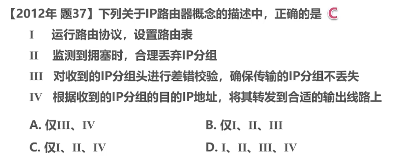
<!-- image-source: https://cdn.nlark.com/yuque/0/2026/png/67474974/1781077832632-88d20171-3fdc-41de-840b-d8646c1d2eb1.png -->

**题目考点**：TCP/IP网际层（IP层）的服务模型与路由器行为。  
**解析**：

+ IP协议提供的是**无连接、尽最大努力交付**的服务，**不保证可靠传输**（不保证IP分组不丢失、不重复、不乱序）。
+ 路由器仅对IP**首部**进行差错校验，不对数据部分校验。发现首部错误时，丢弃分组并发送 **ICMP** 差错报告。
+ 题目中描述“IP路由器负责可靠传输”是错误的。利用排除法可得正确选项。

---


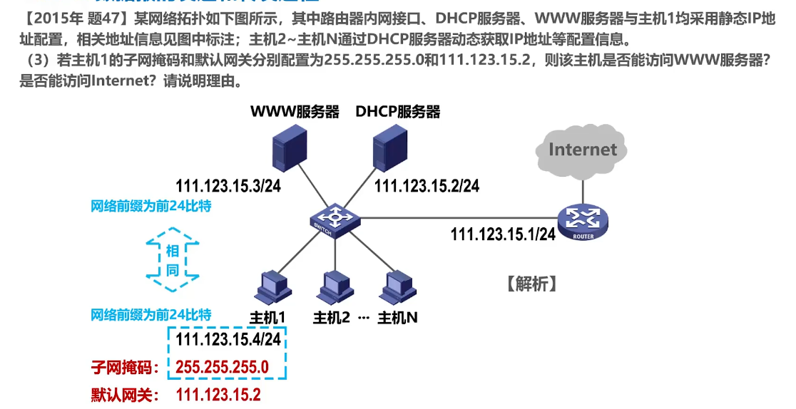
<!-- image-source: https://cdn.nlark.com/yuque/0/2026/png/67474974/1781077902320-32329c96-9140-489d-b49e-e513bc41883f.png -->

**题目场景**：主机1能访问同网段的Web服务器，但无法访问Internet。  
**解析**：

1. **同网段通信**：主机1与Web服务器的IP地址网络前缀相同（均为 `/24`），属于直接交付，物理连接与IP配置正常，故能访问Web服务器。
2. **跨网段通信故障**：主机1访问Internet属于间接交付，必须依赖默认网关。经排查，主机1的默认网关被**错误配置为DHCP服务器的IP地址**。
3. **根因**：DHCP服务器仅负责分配IP，不具备路由转发功能。正确的默认网关必须配置为**直连路由器的接口IP地址**。

---

### 7.全文总结
本文档系统梳理了IP数据报在TCP/IP网际层的发送与转发机制：

1. **交付判定**：通过IP与子网掩码的逻辑与运算，精确区分直接交付与间接交付。
2. **网关机制**：默认网关是主机跨网通信的唯一出口。
3. **路由转发**：路由器通过校验首部、查询路由表（直连/静态/动态），基于最长前缀匹配原则进行数据报转发。
4. **广播控制**：路由器严格隔离广播域，从根本上防止了广播风暴的发生。

> **学习建议**：对于致力于C++后端开发的同学，理解IP转发机制不仅有助于应对考试，更是后续学习**网络编程（Socket API）**、**分布式系统路由**以及**高性能网关设计**的底层理论基石。建议在掌握原理的基础上，尝试使用C++实现一个简易的基于Trie树的IP路由查找模块，以加深对数据结构与网络协议结合的理解。
>

---

## 五、静态路由配置及其可能产生的路由环路问题
### 1.静态路由概述
#### （1）定义与特点
**静态路由（Static Routing）** 是指由网络管理员或用户通过路由器的配置命令，人工手动维护和管理的路由表条目。

| 维度 | 特点说明 |
| :--- | :--- |
| **优点** | 配置简单、逻辑清晰；不占用网络带宽和路由器CPU资源（无需运行路由协议计算），**开销极小**。 |
| **缺点** | 缺乏灵活性，**无法自动适应网络拓扑和状态的变化**。 |
| **适用场景** | 拓扑结构稳定、规模较小的网络，或作为动态路由的补充（如默认出口路由）。 |


#### （2）静态路由引发路由环路的三大诱因
在静态路由配置中，若设计或操作不当，极易产生**路由环路（Routing Loop）**，导致IP数据报在网络中无限循环。主要诱因包括：

1. **人工配置错误**（如下一跳指向错误）。
2. **路由聚合不当**（聚合了实际不存在的子网）。
3. **网络故障**（直连链路Down掉后，默认路由兜底引发环路）。

---

### 2.路由表条目类型与匹配原则
在深入分析环路问题前，需明确路由器路由表中常见的四种路由条目类型及其生成方式。

#### （1）路由条目分类

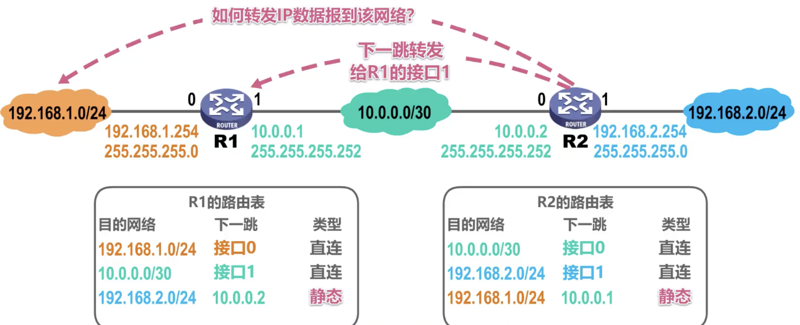
<!-- image-source: https://cdn.nlark.com/yuque/0/2026/png/67474974/1781162418092-67b4783b-a7af-419b-876d-355e2114abe3.png -->

| 路由类型 | 生成方式 | 目的网络与掩码示例 | 下一跳 (Next Hop) | 应用场景 |
| :--- | :--- | :--- | :--- | :--- |
| **直连路由** | 配置接口IP和掩码后**自动生成** | `192.168.1.0/24` | 指向本地出接口（无下一跳IP） | 路由器直连的网络 |
| **静态路由** | 管理员**人工配置** | `10.0.0.0/24` | 指向相邻路由器的接口IP | 明确目的网络的固定路径 |
| **默认路由** | 管理员**人工配置** | `0.0.0.0/0` (CIDR) | 指向出口网关IP | 替代大量明细路由，常用于连接Internet |
| **特定主机路由** | 管理员**人工配置** | `192.168.1.100/32` | 指向特定下一跳 | 网络测试、安全控制、精准流量调度 |


#### （2）最长前缀匹配原则 (Longest Prefix Match)
当路由器查表转发IP数据报时，若存在多条匹配的路由条目，将严格遵循**最长前缀匹配原则**：

+ **特定主机路由 (/32)**：前缀最长，路由**最具体**，优先级最高。
+ **明细网络路由 (如 /24)**：前缀居中。
+ **默认路由 (/0)**：前缀最短，路由**最模糊**，仅作为最后的“兜底”选项。

---

### 3.路由环路问题剖析与防御机制
#### 场景一：人工配置错误与 TTL 机制
**问题现象**：  
假设路由器 R2 需要转发数据报给网络 A，管理员错误地将 R2 的下一跳配置为 R3；而 R3 的路由表中，网络 A 的下一跳又指向了 R2。


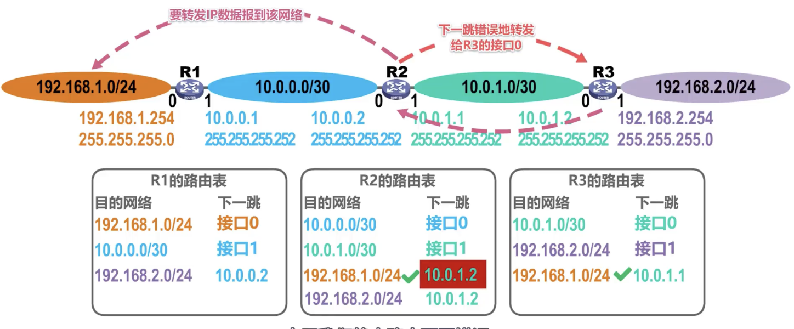
<!-- image-source: https://cdn.nlark.com/yuque/0/2026/png/67474974/1781162933729-ae31a010-4d72-48d0-babd-cde51363c42c.png -->

+ **结果**：数据报在 R2 和 R3 之间无限“踢皮球”，形成**路由环路**。

**防御机制：生存时间 (TTL, Time To Live)**  
	为了防止IP数据报在环路中永久兜圈导致网络拥塞，IP数据报首部设计了 **TTL 字段**（通常为8比特，初始值多为64或128）。

1. 数据报每进入一个路由器，TTL 值**减 1**。
2. 若 TTL > 0，路由器继续转发。
3. 若 TTL = 0，路由器**丢弃**该数据报，并向源主机发送 **ICMP 超时报文**。

> **💡 后端开发视角：TTL 思想的延伸**  
在C++后端开发与分布式系统设计中，TTL 思想被广泛应用于**防环与防雪崩**：
>
> + **消息队列 (MQ)**：为消息设置 TTL，防止死信队列无限堆积或消息在多个消费者间循环路由。
> + **RPC 调用/微服务**：在请求 Header 中传递 `X-Request-Depth` 或 `TraceID`，当调用深度超过阈值时直接熔断，防止微服务间的循环调用导致系统崩溃。
>

#### 场景二：路由聚合不当与黑洞路由 (Null0)
**问题现象**：


.png)
<!-- image-source: https://cdn.nlark.com/yuque/0/2026/png/67474974/1781163402789-c1b4f7f1-37cd-4e40-bf00-b75e468ddc4a.png -->


.png)
<!-- image-source: https://cdn.nlark.com/yuque/0/2026/png/67474974/1781163498393-c0e93c7a-9586-4594-8fac-93ffdcc18e4d.png -->

  
假设 R2 将 4 个连续的 `/26` 子网聚合为一个 `/24` 的超网，并将下一跳指向 R1。但实际上，这 4 个子网中**有 2 个是不存在的**。

1. 当发往“存在子网”的数据报到达 R1 时，R1 查表明细路由，正常转发。
2. 当发往“**不存在子网**”的数据报到达 R1 时，R1 找不到明细路由，只能匹配**默认路由**，将数据报又扔回给 R2。
3. R2 再次匹配聚合路由扔给 R1，形成 **R1 与 R2 之间的环路**。

**解决方案：配置黑洞路由 (Blackhole Route)**  
针对聚合后不存在的子网，在 R2 上配置一条指向 `Null0` **接口**的明细路由。


.png)
<!-- image-source: https://cdn.nlark.com/yuque/0/2026/png/67474974/1781163532216-3278e2a5-3914-457a-b5ea-4b0116af52dd.png -->

+ **Null0** 是路由器内部的虚拟接口，形象地称为“黑洞”。数据报进入 Null0 后会被**直接丢弃**（有去无回）。
+ **生效原理**：利用**最长前缀匹配原则**。发往不存在子网的数据报，会优先匹配前缀更长的 `Null0` 黑洞路由，从而被丢弃，避免了匹配聚合路由发往 R1，彻底打破环路。

#### 场景三：网络故障与黑洞路由的动态切换
**问题现象**：  
假设 R1 的接口 0 直连网络 A。R2 将发往网络 A 的数据报发给 R1。

1. **正常状态**：R1 存在网络 A 的直连路由，正常交付。
2. **故障状态**：网络 A 发生故障（链路 Down），R1 的**直连路由自动消失**。
3. **环路产生**：R2 继续发包给 R1，R1 查不到网络 A 的明细路由，触发**默认路由**，将包扔回给 R2，形成环路。

**解决方案：浮动黑洞路由 (Floating Static Route)**


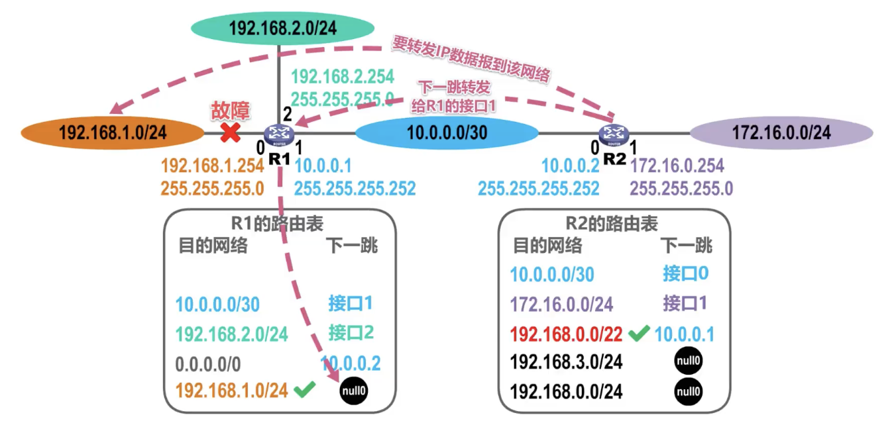
<!-- image-source: https://cdn.nlark.com/yuque/0/2026/png/67474974/1781163802213-ba02676e-f546-44e5-af52-0ebab26e4611.png -->

提前在 R1 上为网络 A 配置一条指向 `Null0` 的静态黑洞路由，并通过**路由优先级（Preference / Administrative Distance）** 实现动态切换：

+ **网络正常时**：直连路由的优先级最高（最优先），黑洞路由被**隐藏（失效状态）**，不影响正常通信。
+ **网络故障时**：直连路由消失，优先级较低的静态黑洞路由**浮现（生效状态）**。此时 R1 收到发往网络 A 的包，会匹配黑洞路由将其丢弃，防止环路。
+ **网络恢复时**：直连路由重新生成，黑洞路由再次隐藏。

---

### 4.全文总结
本文档系统梳理了静态路由的配置方法及其潜在的路由环路风险：

1. **基础配置**：掌握了直连路由、静态路由、默认路由（`0.0.0.0/0`）与特定主机路由（`/32`）的应用场景及**最长前缀匹配原则**。
2. **防环机制**：
    - 依赖 **TTL** 机制防止配置错误导致的物理环路无限循环。
    - 引入 **Null0 黑洞路由** 解决路由聚合包含无效子网，以及直连网络故障时默认路由兜底引发的逻辑环路。
3. **工程思维**：网络层的防环与流量控制思想（如 TTL、黑洞丢弃），可完美映射至后端分布式系统的超时控制、熔断降级与恶意流量拦截设计中。

> **学习建议**：在掌握理论的基础上，建议使用 GNS3 或 eNSP 等网络模拟器，亲手搭建拓扑并配置 `Null0` 路由，通过抓包（Wireshark）观察 TTL 递减和 ICMP 超时响应的真实过程，以加深对网络底层行为的理解。
>

## 六、路由选择协议
### 1.路由选择协议基本概念
#### （1）静态路由与动态路由
路由选择算法按照工作方式可分为 **静态路由选择** 与 **动态路由选择** 两类。

| 对比维度 | 静态路由选择 | 动态路由选择 |
| --- | --- | --- |
| 配置方式 | 人工配置 | 路由器通过协议自动获取 |
| 路由信息来源 | 管理员手工添加 | 路由选择协议自动交互 |
| 常见路由类型 | 网络路由、默认路由、特定主机路由、黑洞路由 | 由协议算法动态计算 |
| 复杂度 | 简单，开销小 | 复杂，开销较大 |
| 适应性 | 不能及时适应网络变化 | 能较好适应网络状态变化 |
| 适用场景 | 小规模网络 | 大规模网络 |


> **后端视角补充**：在 Linux 系统中，静态路由常通过 `ip route add` 命令配置，常用于开发环境中的网关、VPN 路由策略；而生产环境下的服务器路由通常由底层网络设备的动态路由协议自动维护。
>

#### （2）因特网路由选择协议的三大特点
因特网作为全球最大的互联网络，其路由选择协议具有以下三个核心特征：

1. **自适应（Adaptive）**  
采用动态路由选择机制，能根据网络拓扑、链路状态的变化自动调整路由。
2. **分布式（Distributed）**  
各路由器通过相互间的信息交互，**共同完成**路由信息的获取和更新，没有单一中心节点。
3. **分层次（Hierarchical）**  
将整个因特网划分为多个较小的 **自治系统（Autonomous System, AS）**，系统内部与外部采用不同类别的路由协议。

#### （3）自治系统（AS）与分层次路由
**自治系统（AS）的定义**

**自治系统（AS）** 是指在单一技术管理下的一组路由器和网络，例如一家大型 ISP（因特网服务提供商）可以构成一个 AS。AS 内部与外部采用不同的路由协议类别。


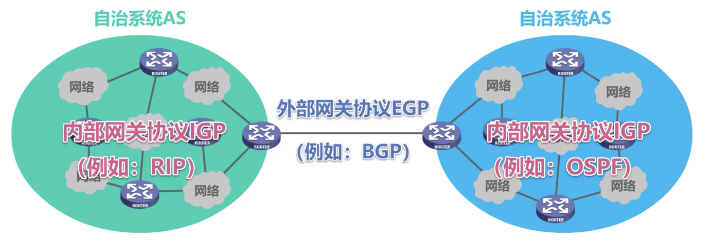
<!-- image-source: https://cdn.nlark.com/yuque/0/2026/png/67474974/1781164209619-603c024a-4f71-418d-aa76-6fc2f0db5aaa.png -->

**域内路由与域间路由**

| 类型 | 英文简称 | 使用协议类别 | 说明 |
| --- | --- | --- | --- |
| 域内路由选择 | Intra-AS Routing | **IGP**（内部网关协议） | AS 内部的路由选择 |
| 域间路由选择 | Inter-AS Routing | **EGP**（外部网关协议） | AS 之间的路由选择 |


> **术语说明**：
>
> + **IGP（Interior Gateway Protocol）** 与 **EGP（Exterior Gateway Protocol）** 是协议**类别名称**，不是具体的协议。
> + 早期 RFC 文档中使用"**网关（Gateway）**"一词指代路由器，新文档已改为"**路由器（Router）**"。因此 IGP/EGP 也可分别称为 IRP（内部路由协议）/ ERP（外部路由协议），但为便于查阅经典 RFC，课程仍沿用旧称。
>

**常见路由选择协议一览**


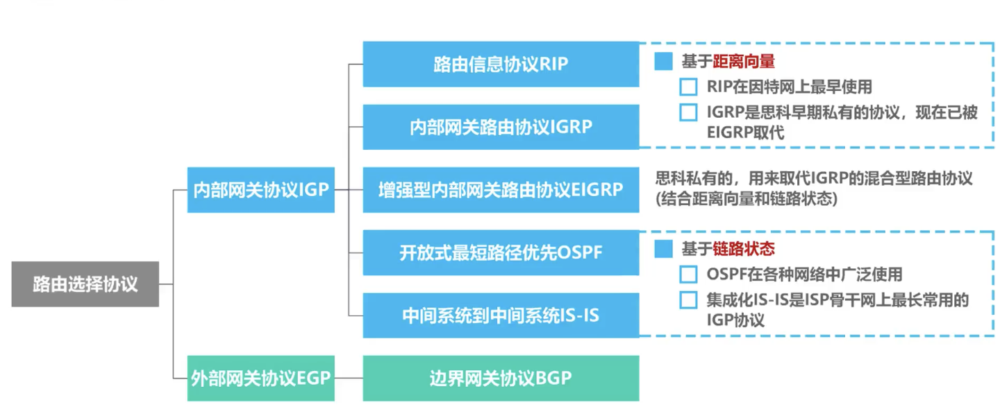
<!-- image-source: https://cdn.nlark.com/yuque/0/2026/png/67474974/1781164283412-0529c65f-4c0b-4a59-b9e2-90ce7d1bb68c.png -->

| 典型协议 | 协议类别 | 算法基础 | 特点与应用场景 |
| :--- | :--- | :--- | :--- |
| **RIP**, IGRP (Cisco 早期私有，已被 EIGRP 取代) | **IGP** | 距离向量（DV） | 基于跳数，适用于小型网络 |
| **OSPF**, IS-IS（ISP 骨干网常用） | **IGP** | 链路状态 | 基于带宽/代价，收敛快，OSPF广泛用于企业网，IS-IS多用于ISP骨干网 |
| EIGRP (Cisco 私有，结合距离向量与链路状态) | **IGP** | 混合型 | 结合距离向量与链路状态特性 |
| **BGP**（Border Gateway Protocol，边界网关协议） | **EGP** | 路径向量 | 基于策略路由，用于因特网核心AS间的互联 |


```plain
路由选择协议
├── IGP（内部网关协议，AS 内部使用）
│   ├── 基于距离向量：RIP、IGRP（Cisco 早期私有，已被 EIGRP 取代）
│   ├── 基于链路状态：OSPF、IS-IS（ISP 骨干网常用）
│   └── 混合型：EIGRP（Cisco 私有，结合距离向量与链路状态）
└── EGP（外部网关协议，AS 之间使用）
    └── BGP（Border Gateway Protocol，边界网关协议）
```

---

### 2.路由器的基本结构
路由器是一种具有**多个输入端口和输出端口**的专用计算机，核心任务是**转发分组**。其结构可分为两大部分：**路由选择部分** 与 **分组转发部分**。


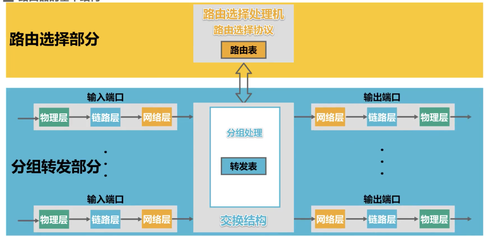
<!-- image-source: https://cdn.nlark.com/yuque/0/2026/png/67474974/1781164396569-5059e913-22f9-491f-abe6-31130b1d44e5.png -->

**路由选择部分（控制平面）**

+ **核心构件**：路由选择处理器（Routing Processor）
+ **主要任务**：
    - 运行路由选择协议
    - 周期性与其他路由器交换路由信息
    - 维护和更新**路由表（Routing Table）**
+ **路由表特点**：包含"目的网络 → 下一跳"的映射，针对**网络拓扑变化的计算**进行优化。

**分组转发部分（数据平面）**

由以下三部分构成：**交换结构（Switching Fabric）**、**输入端口组**、**输出端口组**。

---

**分组转发完整流程**

```plain
[输入物理链路]
    ↓
物理层：信号 → 比特流
    ↓
数据链路层：识别帧 → 去帧头帧尾 → 提取分组
    ↓
网络层：根据目的地址查【转发表】
    ├─ 匹配失败 → 丢弃分组
    └─ 匹配成功 → 按指示端口转发，更新 TTL（减 1）等字段
    ↓
数据链路层：重新封装成帧
    ↓
物理层：比特流 → 电信号 → 输出
```

**路由报文的特殊处理**

若进入网络层的分组是**路由协议报文**（如 RIP 更新、OSPF LSU），则送交**路由选择处理器**处理，用于更新路由表。同时路由选择处理器也会周期性向外发送本路由器的路由信息。

#### 路由表与转发表

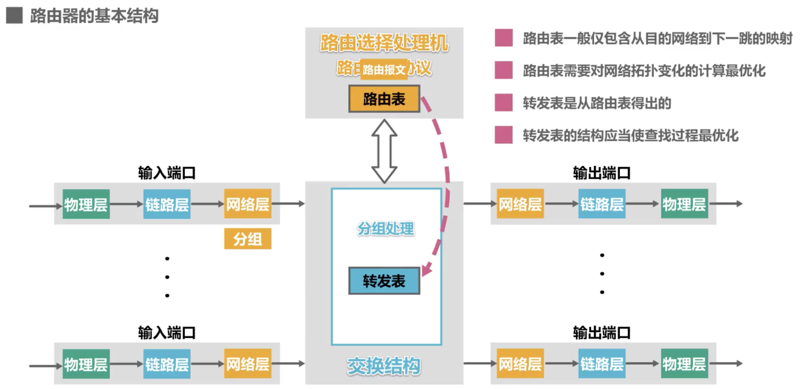
<!-- image-source: https://cdn.nlark.com/yuque/0/2026/png/67474974/1781164575465-c7057b02-e13d-4d91-a837-b223321b2960.png -->

| 项目 | 路由表（Routing Table） | 转发表（Forwarding Table） |
| --- | --- | --- |
| 来源 | 由路由协议算法计算得出 | 由路由表推导生成 |
| 优化目标 | 拓扑变化计算最优 | 查找过程最优（高速查表） |
| 工程实践 | 教学中常不严格区分两者 | 高性能路由器中分离实现 |


#### 输入/输出缓冲区

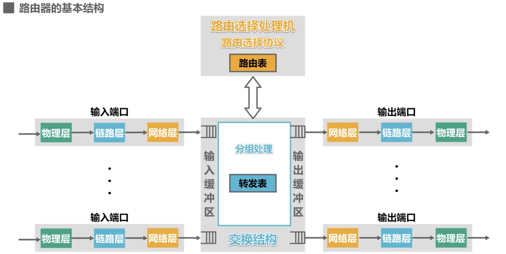
<!-- image-source: https://cdn.nlark.com/yuque/0/2026/png/67474974/1781164772299-c40f5e6d-b15d-4297-99ed-3520f02535fb.png -->

+ **输入缓冲区**：暂存进入路由器但尚未处理的分组
+ **输出缓冲区**：暂存已处理但尚未发送的分组
+ 路由器的每个物理端口通常同时具备输入与输出功能（全双工）

---

### 3.内部网关协议 IGP —— RIP
在计算机网络中，**DV算法** 的全称是 **距离向量路由算法（Distance Vector Routing Algorithm）**。它是互联网中用于计算数据包转发路径（即路由）的一种经典**分布式算法**。

DV 算法的每个路由器都不需要知道整个网络的拓扑结构，它只需要知道两件事：

+ **距离（Distance）**：到达目的网络的“代价”（Cost），通常是**跳数**（经过了多少个路由器）、延迟或带宽。
+ **向量（Vector）**：方向，即数据包应该发往的**下一跳路由器**（Next Hop）。

**RIP（Routing Information Protocol，路由信息协议）** 是最早被广泛使用的 IGP，相关标准为 **RFC 1058**。最著名的基于 DV 算法的路由协议是 **RIP**。

#### （1）基本工作原理
+ 要求 AS 内每个路由器维护**从自身到 AS 内其他每一个网络的距离记录**，这组距离称为**距离向量（Distance Vector）**。
+ **度量标准**：使用**跳数（Hop Count）** 衡量距离。
    - 到直连网络的距离 = **1**（Cisco 实现中为 0）
    - 到非直连网络的距离 = 经过的路由器数 + 1


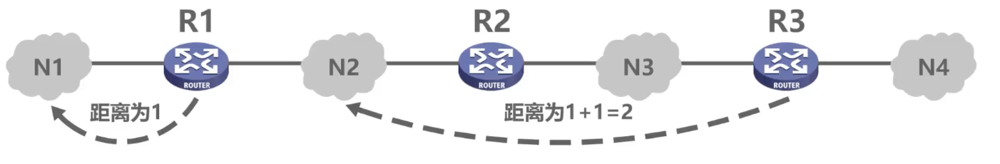
<!-- image-source: https://cdn.nlark.com/yuque/0/2026/png/67474974/1781166831483-25ceb788-d2d7-41f0-9885-0449e5678e1f.png -->

+ **最大跳数限制**：最多只能包含**15个**路由器，**跳数 = 16 表示不可达**
+ **适用范围**：小型互联网（受 15 跳限制）

> **工程思考**：RIP 认为"好的路由 = 距离短 = 跳数少"。这可能导致选出一条跳数少但带宽极低的链路，而忽略跳数多但带宽高的链路。这正是 RIP 在小规模简单网络之外被淘汰的核心原因。
>


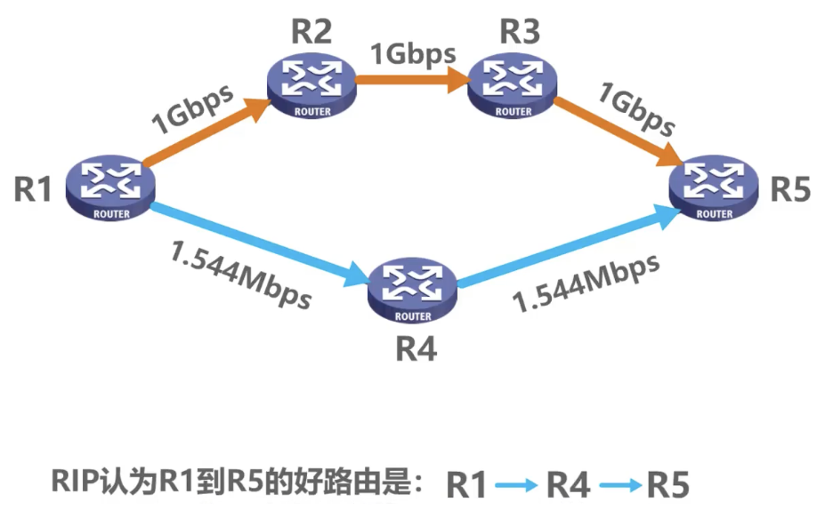
<!-- image-source: https://cdn.nlark.com/yuque/0/2026/png/67474974/1781166958864-c89e3339-44ef-4d89-a7a8-94e019ea9e5e.png -->

#### （2）等价负载均衡
当到达同一目的网络存在**多条距离相等**的路由时，RIP 支持**等价负载均衡（Equal-Cost Load Balancing）**，将流量均匀分布到多条路径上。

#### （3）RIP 的三个要点

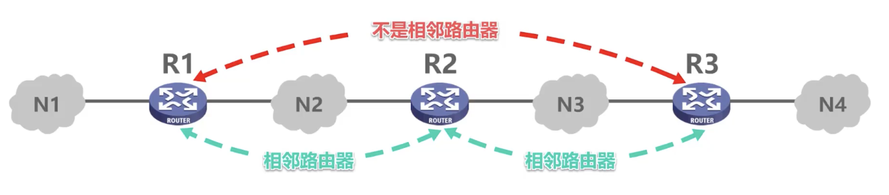
<!-- image-source: https://cdn.nlark.com/yuque/0/2026/png/67474974/1781167016190-ea76be2a-5d64-4996-8900-53a53f642bf7.png -->

| 要点 | 内容 | 说明 |
| --- | --- | --- |
| **和谁交换** | 仅与**相邻路由器**交换 | 相邻 = 直连、中间无其他路由器 |
| **交换什么** | 自己的**完整路由表** | 邻居收到后进行改造使用 |
| **何时交换** | **周期性交换** | 默认每 **30 秒**发送一次更新报文 |


#### （4）路由表更新规则

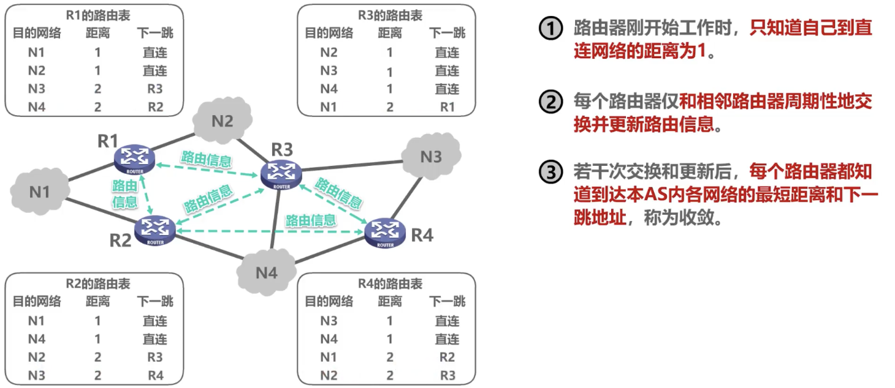
<!-- image-source: https://cdn.nlark.com/yuque/0/2026/png/67474974/1782208384731-b97f0157-311d-4fa8-82f8-e8aa2812f11c.png -->

**例子：**

路由器 D 收到相邻路由器 C 的 RIP 更新报文后，按以下步骤处理：


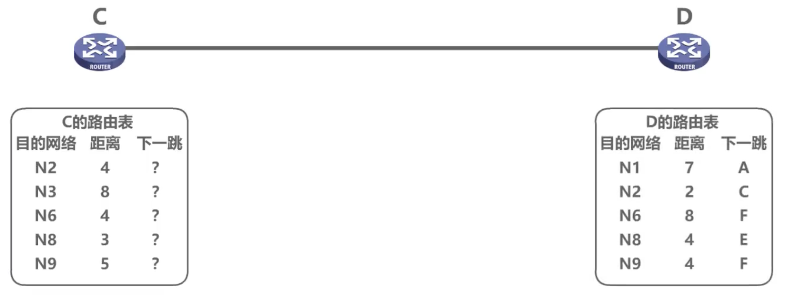
<!-- image-source: https://cdn.nlark.com/yuque/0/2026/png/67474974/1782209549666-b7557526-c7ec-4f59-85e8-cdd28f2598d1.png -->

**Step 1：改造收到的路由表**

+ 将所有条目的"下一跳"改为 **C**
+ 将所有条目的"距离" **+1**


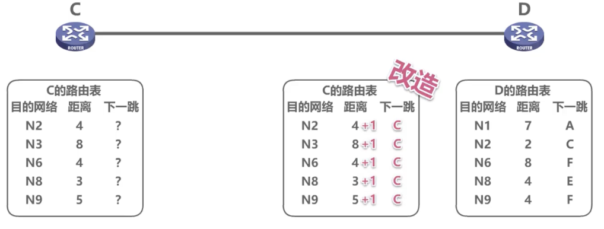
<!-- image-source: https://cdn.nlark.com/yuque/0/2026/png/67474974/1781167236408-c024a5dd-7436-4c30-ac7f-ba16feba9fdc.png -->

**Step 2：按规则更新自身路由表**


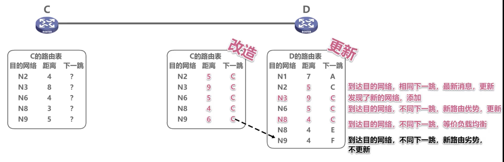
<!-- image-source: https://cdn.nlark.com/yuque/0/2026/png/67474974/1781167615802-d9c6db2e-7c63-400f-b5a1-3a4cfb76aae2.png -->

| 场景 | 处理策略 | 原则总结 |
| --- | --- | --- |
| 目的网络相同，下一跳相同 | 无论距离变大变小，**一律更新** | 下一跳相同，最新消息为准 |
| 发现新的目的网络 | **添加**到路由表 | 新网络，加入 |
| 目的网络相同，下一跳不同，新路由距离更短 | **替换**原有路由 | 新路由更有优势 |
| 目的网络相同，下一跳不同，距离相等 | **添加**为等价路由 | 等价负载均衡 |
| 目的网络相同，下一跳不同，新路由距离更长 | **忽略**，不更新 | 新路由处于劣势 |


#### （5）"坏消息传得慢"问题（路由环路）
这是**距离向量算法的固有缺陷**，也称为**无穷计数（Count to Infinity）** 问题。

**问题产生过程**

假设 R1 与 R2 相邻，N1 是 R1 的直连网络：

1. R1 检测到 N1 链路故障，将到 N1 距离设为 16（不可达），等待更新周期。
2. **R2 的更新周期先到**，向 R1 通告"我到 N1 距离为 2"。


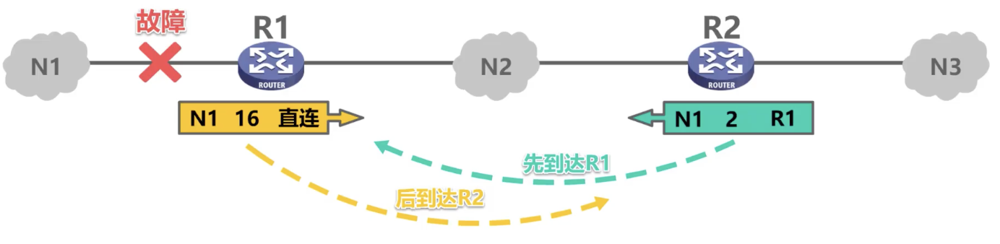
<!-- image-source: https://cdn.nlark.com/yuque/0/2026/png/67474974/1781167817620-352935aa-6cf9-4429-ba86-fdd7ad390033.png -->

3. R1 **被误导**，认为"经 R2 到 N1 距离为 3"，并更新路由表。
4. 下一个周期 R1 告诉 R2"我到 N1 距离为 3"，R2 更新为"经 R1 到 N1 距离为 4"。
5. 如此反复，距离持续增长直至 16 才收敛。


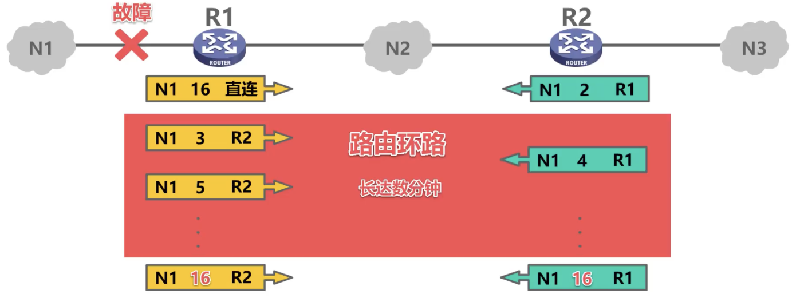
<!-- image-source: https://cdn.nlark.com/yuque/0/2026/png/67474974/1781167909949-faa50273-d389-41a8-8c7d-54702aa00a0e.png -->

期间 R1、R2 之间形成**路由环路**，耗时可达数分钟。

**缓解措施（不能彻底解决）**

| 措施 | 说明 |
| --- | --- |
| **最大距离限制** | 跳数 ≤ 15，限制环路持续时间 |
| **触发更新（Triggered Update）** | 路由变化时**立即**发送更新，不等周期 |
| **水平分割（Split Horizon）** | 记录收到路由信息的接口，**不从该接口回传**相同路由 |


> 这些措施只能**降低概率、减小危害**，无法从本质上消除距离向量算法的环路问题。
>

#### （6）RIP 协议版本
| 版本 | 特点 |
| --- | --- |
| **RIPv1** | 有类路由协议，不支持 VLSM、不携带子网掩码 |
| **RIPv2** | 无类路由协议，支持 VLSM、CIDR，使用组播 `224.0.0.9` |
| **RIPng** | 适用于 IPv6 的版本 |


---

### 4.内部网关协议 IGP —— OSPF
**OSPF（Open Shortest Path First，开放最短路径优先）** 于 1989 年为克服 RIP 缺陷而开发。

+ **Open（开放）**：非厂商私有，公开发表
+ **SPF**：基于 Dijkstra 最短路径算法
+ **基于链路状态**（区别于 RIP 的距离向量）
+ **算法保证无环路**、更新效率高、收敛速度快、不限制网络规模

#### （1）链路状态与代价（Cost）
**链路状态**包括：本路由器与哪些路由器相连、相应链路的**代价（Cost）**。

**代价计算**（以 Cisco 实现为例）：

$$
\text{Cost} = \frac{100 \text{ Mbps}}{\text{链路带宽}}
$$

+ 计算结果 < 1 时记为 **1**
+ 大于 1 时**取整数部分**（舍去小数）


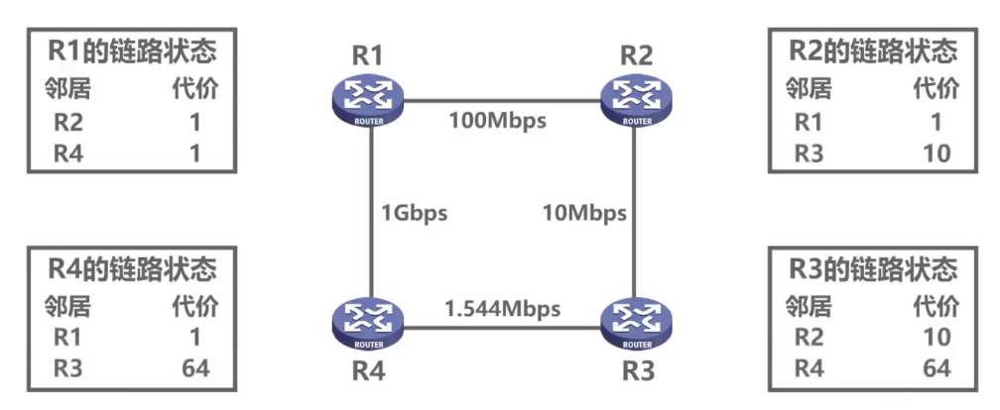
<!-- image-source: https://cdn.nlark.com/yuque/0/2026/png/67474974/1781333452857-50271b87-5590-454e-81fa-d585accf38d7.png -->

| 链路类型 | 带宽 | Cost |
| --- | --- | --- |
| 10 Mbps 以太网 | 10 Mbps | 10 |
| 100 Mbps 快速以太网 | 100 Mbps | 1 |
| 1 Gbps 千兆以太网 | 1000 Mbps | 1 |
| 10 Gbps 万兆以太网 | 10000 Mbps | 1 |


> **工程提示**：在高带宽网络中，默认公式会使千兆与万兆 Cost 相同，需手动调整参考带宽（`auto-cost reference-bandwidth`）。
>

#### （2）邻居关系的建立与维护
+ 通过 **Hello 分组**（问候分组）建立和维护邻居关系
+ Hello 封装在 **IP 数据报**中：


<!-- image-source: https://cdn.nlark.com/yuque/0/2026/png/67474974/1781333493372-754d8bf9-d956-47c2-ba4f-2cef9713dd6c.png -->

- 目的 IP：组播地址 `224.0.0.5`
- 协议号：**89**

+ 发送周期：**10 秒**
+ **Dead Interval（死亡倒计时）**：**40 秒**未收到 Hello 则认为邻居不可达
+ 每个路由器维护**邻居表（Neighbor Table）**


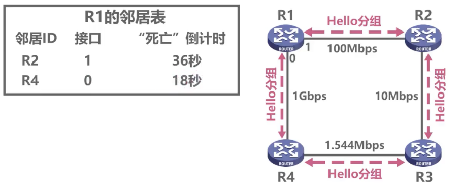
<!-- image-source: https://cdn.nlark.com/yuque/0/2026/png/67474974/1781333719026-1d78647a-987e-4fb9-8e18-d7b676ec9cf6.png -->

#### （3）链路状态数据库（LSDB）
每个路由器生成 **LSA（Link State Advertisement，链路状态通告）**，内容包括：

1. 直连网络的链路状态信息
2. 邻居路由器的链路状态信息


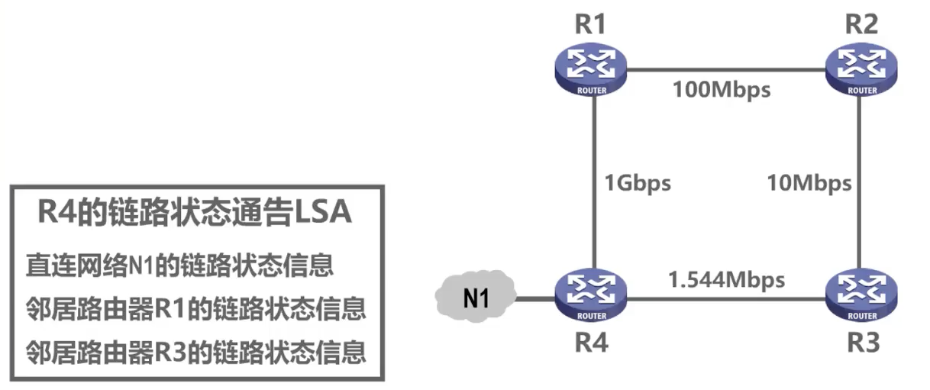
<!-- image-source: https://cdn.nlark.com/yuque/0/2026/png/67474974/1781333833538-927885ef-f546-483d-a137-21d31cfc8d9e.png -->

LSA 封装在 **LSU（Link State Update）** 分组中，采用**洪泛法（Flooding）** 向全网传播。最终，AS 内**所有路由器的 LSDB**（链路状态数据库，用于存储LSA） **达到一致**，形成对全网拓扑的统一视图。


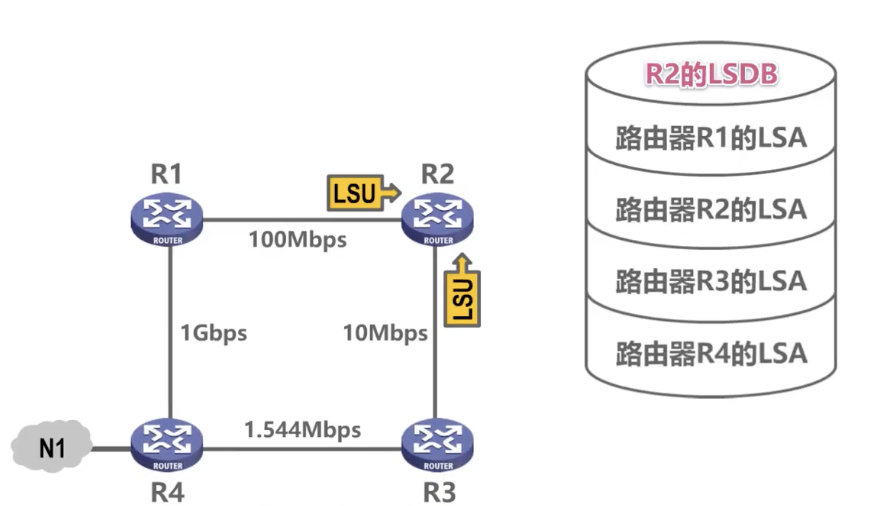
<!-- image-source: https://cdn.nlark.com/yuque/0/2026/png/67474974/1781334007862-7296d7d8-54d7-48bf-a0a1-840cf428f111.png -->

#### （4）最短路径树计算
每个路由器以自己为根，基于 LSDB 构造**带权有向图**，运行 **Dijkstra 算法**计算到所有目的网络的最短路径，生成路由表。


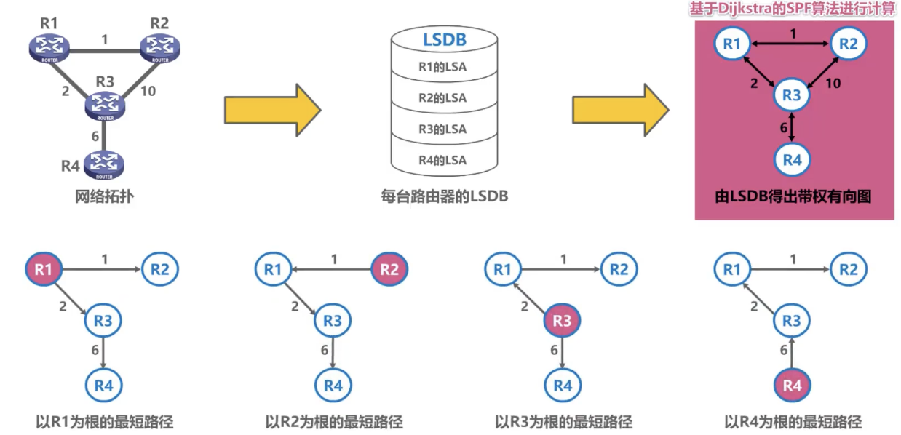
<!-- image-source: https://cdn.nlark.com/yuque/0/2026/png/67474974/1781334101394-ae10e785-0c98-4bdf-9f32-3a1f4228868b.png -->

#### （5）OSPF 的五种分组类型
| 类型 | 名称 | 作用 |
| --- | --- | --- |
| Type 1 | **Hello（问候）** | 发现、维护邻居关系 |
| Type 2 | **DBD（Database Description，数据库描述）** | 向邻居发送 LSDB（链路状态数据库）中所有链路状态的摘要信息 |
| Type 3 | **LSR（Link State Request，链路状态请求）** | 向邻居请求缺失的 LSA 详情 |
| Type 4 | **LSU（Link State Update，链路状态更新）** | 洪泛发送 LSA（承载路由信息） |
| Type 5 | **LSAck（链路状态确认）** | 对 LSU 进行确认，保证可靠性 |


#### （6）OSPF 工作过程（邻居建立与 LSDB 同步）
1. **Hello 阶段**：周期性发送 Hello，建立邻居关系
2. **DBD 交换**：互相发送 LSDB（数据库描述分组）摘要
3. **LSR 请求**：对比摘要，发现缺失条目则请求详情
4. **LSU 回复**：邻居发送缺失 LSA（链路状态通告）的完整信息
5. **LSAck 确认**：完成 LSDB 同步
6. **持续更新**：
    - 链路状态变化 → 立即洪泛 LSU
    - 周期性刷新：每 **30 分钟**发送一次 LSU


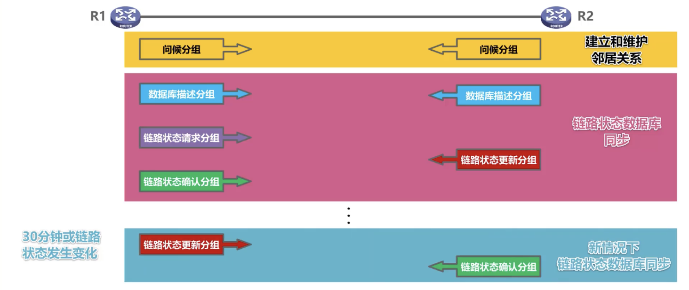
<!-- image-source: https://cdn.nlark.com/yuque/0/2026/png/67474974/1781334451838-21a1e2ae-d0f0-4f2a-8b48-637b537a2428.png -->

#### （7）DR 与 BDR 选举（多点接入网络优化）
在 **广播多路访问网络（如以太网）** 中，若所有路由器两两建立邻接关系：

$$
\text{邻接关系数} = \frac{N(N-1)}{2}
$$

将产生大量协议流量。OSPF 通过选举解决：

+ **DR（Designated Router，指定路由器）**
+ **BDR（Backup DR，备份指定路由器）**


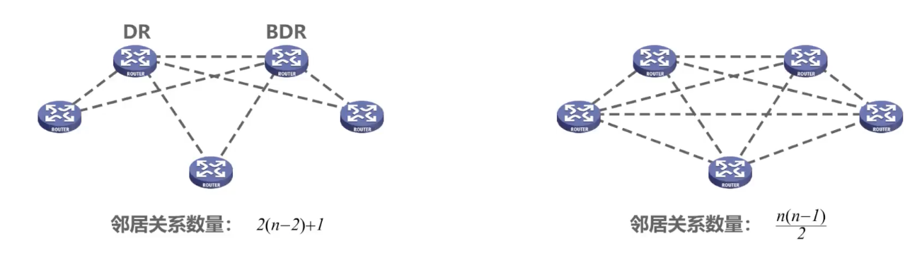
<!-- image-source: https://cdn.nlark.com/yuque/0/2026/png/67474974/1781334599994-5c23a5d9-51fa-4fd0-8354-e64e73224e04.png -->

**规则**：

+ 所有非 DR/BDR 路由器（DROther）**仅与 DR、BDR 建立邻接关系**
+ DROther 之间不直接交换信息，必须通过 DR/BDR 中转
+ DR 故障时，BDR 自动顶替

**选举参数**：路由器优先级、Router ID、接口 IP 地址（与交换机 STP 根桥选举类似）。

#### （8）OSPF 分层次区域划分
为使 OSPF 适用于**大规模网络**，引入**区域（Area）** 概念。

**区域划分规则**

+ 每个 AS 被划分为多个区域，每个区域有 **32 位区域 ID**（点分十进制表示）
+ **主干区域（Backbone Area）**：区域 ID 必须为 `0.0.0.0`（或简写为 `0`）
+ 主干区域用于**连通其他所有区域**
+ 单个区域规模建议 ≤ **200 台路由器**


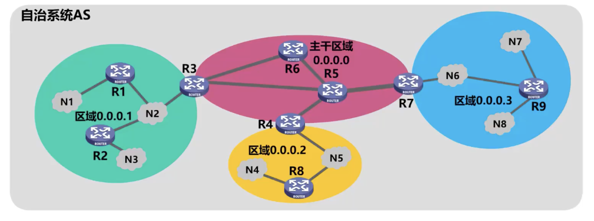
<!-- image-source: https://cdn.nlark.com/yuque/0/2026/png/67474974/1781334822851-e6190371-b198-4eb4-a50d-77c1fc247179.png -->

**划分区域的好处**

将**洪泛范围局限在区域内部**，大幅减少全网通信量和 LSDB 规模。

**路由器分类**


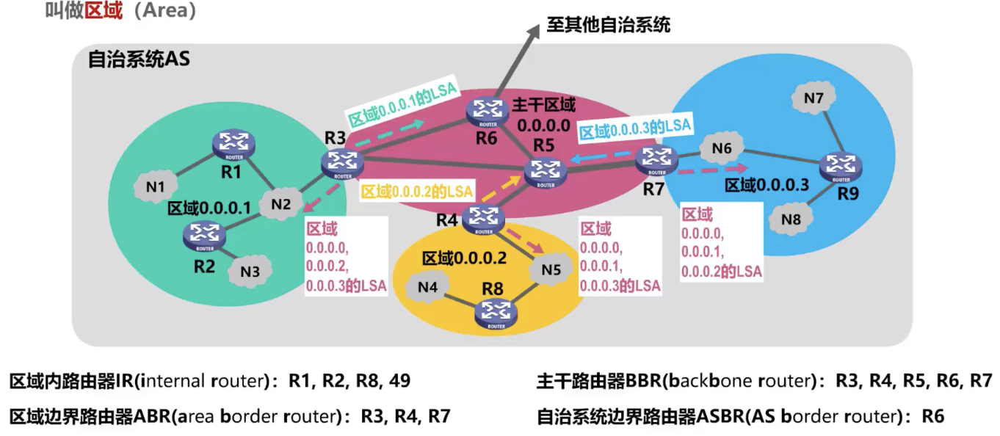
<!-- image-source: https://cdn.nlark.com/yuque/0/2026/png/67474974/1781334854701-2fd78eee-9d0d-4c8f-a672-eaf06bb66f78.png -->

| 类型 | 英文缩写 | 说明 |
| --- | --- | --- |
| 区域内路由器 | IR | 所有接口在同一区域内 |
| 区域边界路由器 | **ABR** | 连接本区域与主干区域（Area 0） |
| 主干路由器 | BR | 位于 Area 0 内（ABR 也属于 BR） |
| 自治系统边界路由器 | **ASBR** | 与本 AS 之外的 AS 交换路由信息 |


<!-- image-source: https://cdn.nlark.com/yuque/0/2026/png/67474974/1781334926738-d040a624-fb4f-4ff6-a09a-04274451e1ee.png -->

---

### 5.外部网关协议 EGP —— BGP
**BGP（Border Gateway Protocol，边界网关协议）** 是 AS（自治系统）之间使用的路由协议，典型代表是 **BGP-4**（RFC 4271）。

#### （1）为什么需要独立的 BGP？
AS 之间的路由选择**不能简单使用代价（Cost）作为度量**，原因有二：

1. **度量标准不统一**
    - AS1 可能用时延、AS2 用跳数、AS3 用带宽
    - 无统一度量，跨 AS 比较"代价"毫无意义


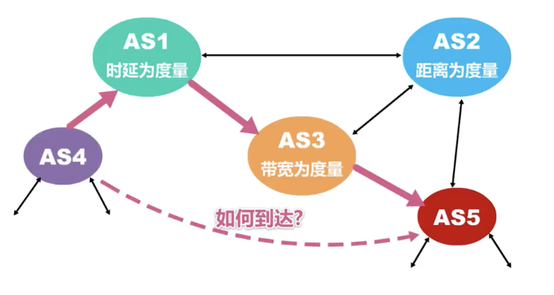
<!-- image-source: https://cdn.nlark.com/yuque/0/2026/png/67474974/1781335452696-e33b1a63-5823-4709-bea8-86db6bc05198.png -->

2. **必须考虑策略因素**
    - 政治、经济、安全策略（如国内流量不出境）
    - 商业策略（如只为付费邻居提供转接服务）


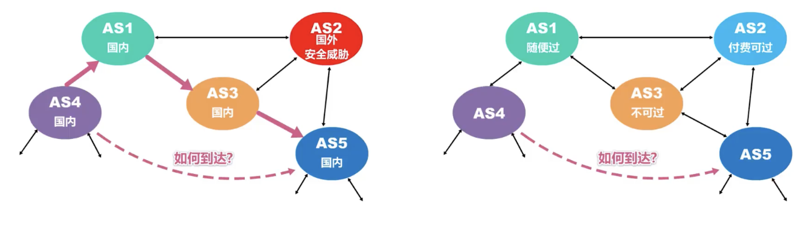
<!-- image-source: https://cdn.nlark.com/yuque/0/2026/png/67474974/1781335509588-c53e47a7-e9e4-44e2-b0fd-3abe7e140ba0.png -->

因此 BGP 的目标不是"寻找最佳路由"，而是**寻找一条到达目的网络、不兜圈子、满足策略的"较好路由"**，即**路径向量（Path Vector）** 协议。

#### （2）BGP 的基本工作原理
**BGP 发言人**

+ 每个 AS（自治系统）至少选出一个 **BGP 发言人（BGP Speaker）**，通常就是 **BGP 边界路由器**
+ BGP 发言人同时运行本 AS 内的 IGP（如 OSPF、RIP）

**邻站关系建立**

+ BGP 发言人之间通过 **TCP 连接**交换信息
    - 端口号：**179**
    - 利用 TCP 的可靠性，简化协议设计
+ 建立 TCP 连接后交换 BGP 报文，形成 **BGP 会话**
+ 互为**邻站（Peer）/ 对等站**


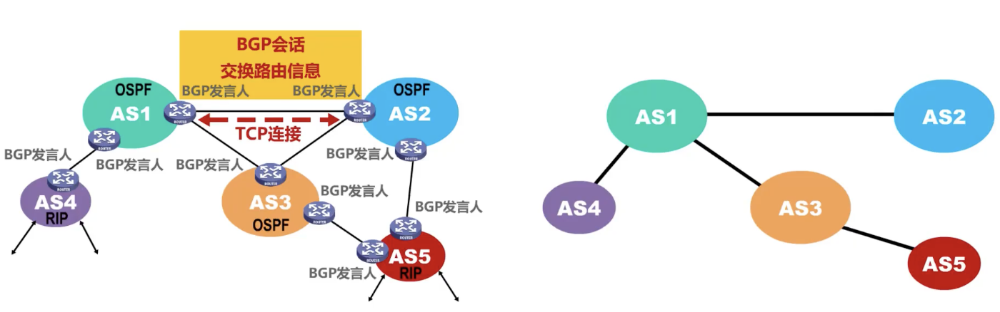
<!-- image-source: https://cdn.nlark.com/yuque/0/2026/png/67474974/1781336444767-48e0ce74-076a-439b-a9f7-a7bdd15c7f06.png -->

**路由信息交换**

BGP 发言人交换的是**网络可达性信息**，即到达某目的网络需经过的 **AS 序列（AS-Path）**。

**示例**：

+ AS2 发言人通知主干网："到达 N1、N2、N3、N4 可经过 AS2"
+ 主干网再通告："到达上述网络可沿路径 AS1 → AS2"
+ 这里的 AS 序列即为**路径向量**
+ 若 AS3 收到的路径向量中已包含自身，则**拒绝采用该路径**（防环机制）


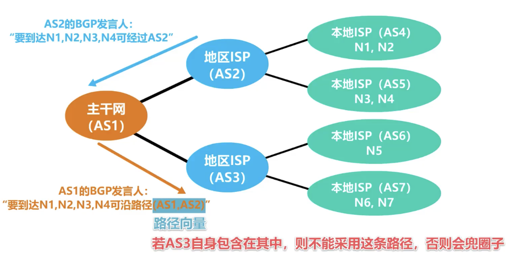
<!-- image-source: https://cdn.nlark.com/yuque/0/2026/png/67474974/1781336414518-f8ee3392-1d92-4fe2-bc8c-b5e77313c9cf.png -->

最终各 BGP 发言人根据策略构造出一棵**无环的 AS 连通树**。

#### （3）BGP-4 的四种报文
| 报文类型 | 作用 |
| --- | --- |
| **OPEN（打开报文）** | 与邻站建立关系，初始化通信 |
| **UPDATE（更新报文）** | 通告新路由、列出撤销的路由（核心报文） |
| **KEEPALIVE（保活报文）** | 周期性确认邻站连通性 |
| **NOTIFICATION（通知报文）** | 发送检测到的差错，关闭会话 |


> **效率设计**：BGP 初次建立会话时交换**完整路由表**，此后仅增量更新变化部分，显著节省带宽和处理开销。这一思想在 C++ 后端的数据同步、配置分发系统中也常被借鉴。
>

---

### 6.常见路由协议对比总结
| 特性 | **RIP** | **OSPF** | **BGP** |
| --- | --- | --- | --- |
| 协议类别 | IGP | IGP | EGP |
| 算法基础 | 距离向量（Bellman-Ford） | 链路状态（Dijkstra） | 路径向量 |
| 度量标准 | 跳数 | Cost（带宽相关） | 策略 + 路径属性 |
| 最大规模 | 15 跳，小型网络 | 大型网络（分区域） | 全球因特网 |
| 收敛速度 | 慢（分钟级） | 快（秒级） | 较慢 |
| 环路防范 | 不彻底（依赖跳数限制等） | 算法保证无环 | AS-Path 防环 |
| 传输方式 | UDP 520 | 直接封装在 IP（协议号 89） | TCP 179 |
| 典型标准 | RFC 1058 / RFC 2453 | RFC 2328 | RFC 4271 |


---

### 附录：关键考研真题索引
本章节涉及的典型考题：

+ **2010 年全国统考 题 35** —— RIP 距离 16 表示不可达


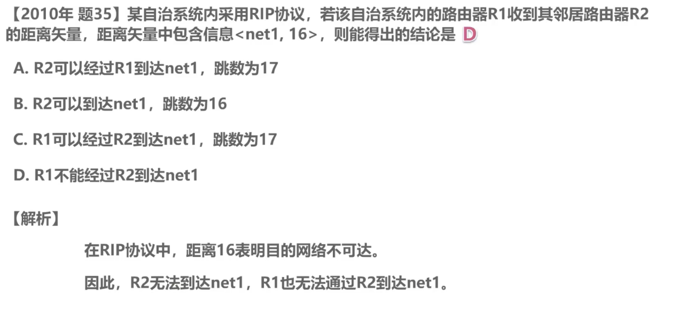
<!-- image-source: https://cdn.nlark.com/yuque/0/2026/png/67474974/1781167707272-7a7d17b9-1dcc-40f7-b777-47c0ac3c4734.png -->

+ **2013 年全国统考 题 47 (3)** —— BGP 报文封装在 TCP 中


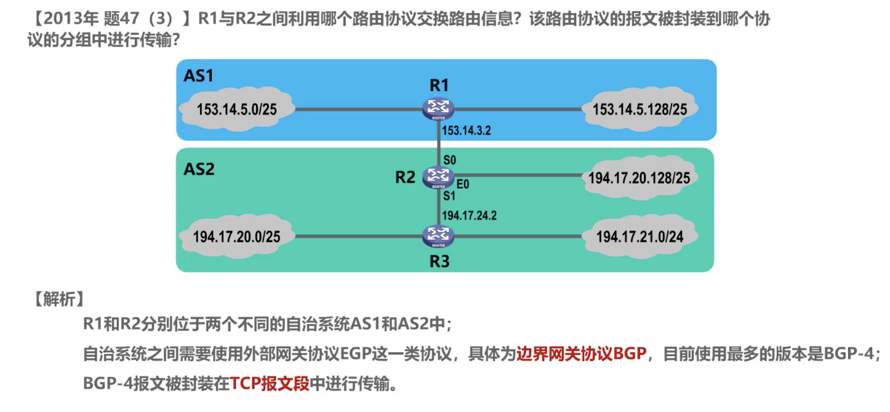
<!-- image-source: https://cdn.nlark.com/yuque/0/2026/png/67474974/1781336758016-8dca5602-1986-4ed0-a237-26e8cd427725.png -->

+ **2016 年全国统考 题 37** —— RIP "坏消息传得慢"场景分析


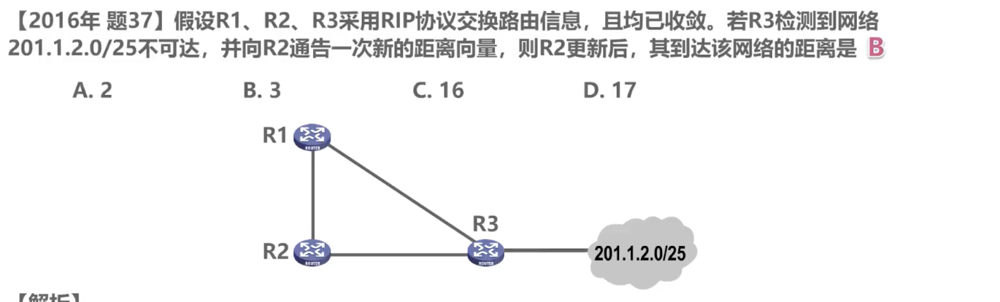
<!-- image-source: https://cdn.nlark.com/yuque/0/2026/png/67474974/1781168124518-22ee5d24-f861-44c1-8cff-670baa8f780b.png -->

+ **2017 年全国统考 题 37** —— 路由协议封装关系


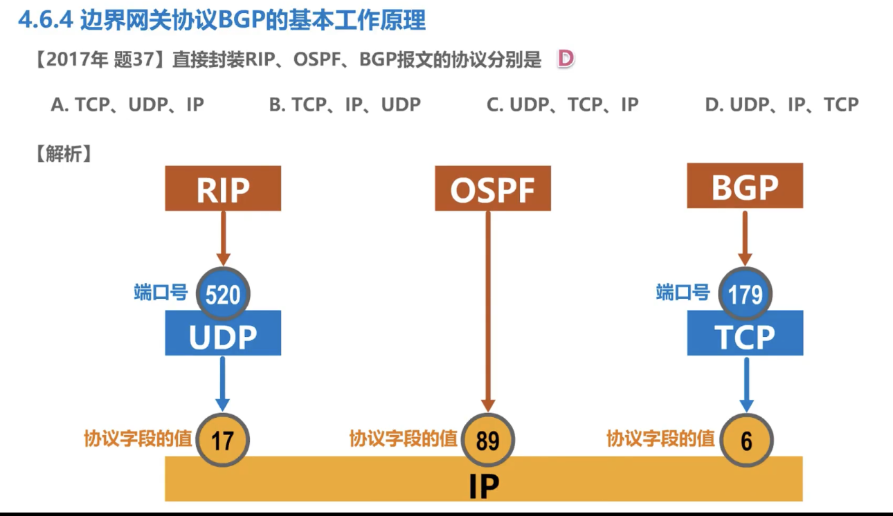
<!-- image-source: https://cdn.nlark.com/yuque/0/2026/png/67474974/1781336796139-eeab412a-0f62-47cb-8f5b-e43b6dd4b14f.png -->

---

> **学习建议**：
>
> 1. 重点理解 **RIP 的距离向量更新规则** 与 **"坏消息传得慢"** 的本质，这是算法题的高频考点。
> 2. 掌握 **OSPF 的五种分组类型、DR/BDR 选举、区域划分** 三大核心机制。
> 3. 理解 **BGP 使用 TCP 而非 UDP**、**路径向量防环** 的设计原因。
>

## 七、IPv4数据报的首部格式(重点)
### 1.IPv4数据报首部格式概述
IP数据报由**首部**和**数据载荷**两部分组成。其首部包含 **20字节的固定部分** 和 **最大40字节的可变部分（可选字段）**。

+ **固定部分**：所有IP数据报必须包含的基础字段。
+ **可变部分**：用于增强IP数据报功能的可选字段（实际网络中较少使用）。

IP数据报首部通常以 **32位（4字节）** 为单位进行描述和排版。每个独立的数据块称为“字段”或“域”，各字段协同工作以实现IP协议的各项功能。


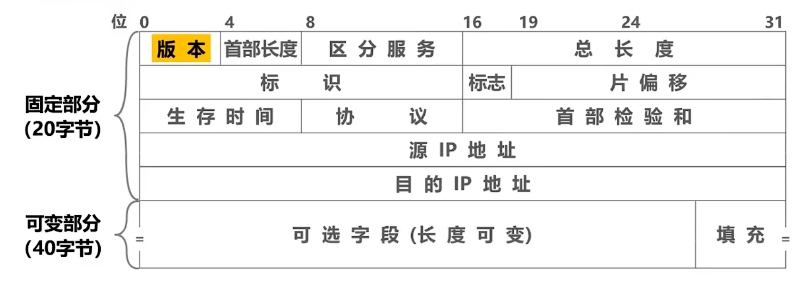
<!-- image-source: https://cdn.nlark.com/yuque/0/2026/png/67474974/1781440459766-3f1d25fe-43c6-4d4a-b2fa-d9388d34efda.png -->

---

### 2.首部固定字段详解
| 字段名称 | 长度 (比特) | 功能与说明 |
| :--- | :---: | :--- |
| **版本 (Version)** | 4 | 指示IP协议的版本号。通信双方必须使用相同的版本。目前广泛使用的版本为 IPv4，该字段值为 `4`。 |
| **首部长度 (IHL)** | 4 | 指示IP数据报首部的长度。**单位为4字节（32位）**。最小值为 `5`（即20字节固定首部），最大值为 `15`（即60字节，含40字节可变部分）。 |
| **区分服务 (DiffServ)** | 8 | 用于获取不同等级的服务质量（QoS）。旧标准中称为“服务类型（ToS）”，长期未被广泛使用，1998年IETF将其更名为“区分服务”。仅在配置了区分服务的网络中生效。 |
| **总长度 (Total Length)** | 16 | 指示IP数据报的总长度（**首部长度 + 数据载荷长度**）。**单位为字节**。最大值为 `65535` 字节。实际网络中受MTU限制，极少传输达到此极限长度的数据报。 |
| **生存时间 (TTL)** | 8 | 防止IP数据报在网络中无限循环（如路由环路）。现以**跳数（路由器跳数）** 为单位，每经过一个路由器减1。减至0时丢弃该数据报。最大值为 `255`。 |
| **协议 (Protocol)** | 8 | 指明数据载荷部分使用的上层协议类型，以便目的主机的IP层将数据正确上交。常见值：`1`=ICMP，`6`=TCP，`17`=UDP。 |
| **首部检验和 (Checksum)** | 16 | 检测IP数据报首部在传输过程中是否出现比特差错。采用互联网校验和算法。因TTL等字段每过一跳都会改变，**路由器必须重新计算此字段**。（注：IPv6中已取消此字段以提升转发效率）。 |
| **源 IP 地址** | 32 | 填写发送该IP数据报的源主机IPv4地址。 |
| **目的 IP 地址** | 32 | 填写接收该IP数据报的目的主机IPv4地址。 |


**案例说明**

**1.首部长度与总长度的区别与联系**

假设某IP数据报首部长度字段二进制值为 `0101`（十进制5），则首部长度为 $5 \times 4 = 20$ 字节。  
假设总长度字段二进制值为 `0000001111111100`（十进制1020），则总长度为 $1020$ 字节。  
**数据载荷长度** = 总长度 - 首部长度 = $1020 - 20 = 1000$ 字节。


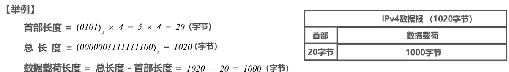
<!-- image-source: https://cdn.nlark.com/yuque/0/2026/png/67474974/1781440757200-85548bd8-b61e-4093-b1de-f71289e9fff9.png -->

**2.生存时间TTL字段的作用**


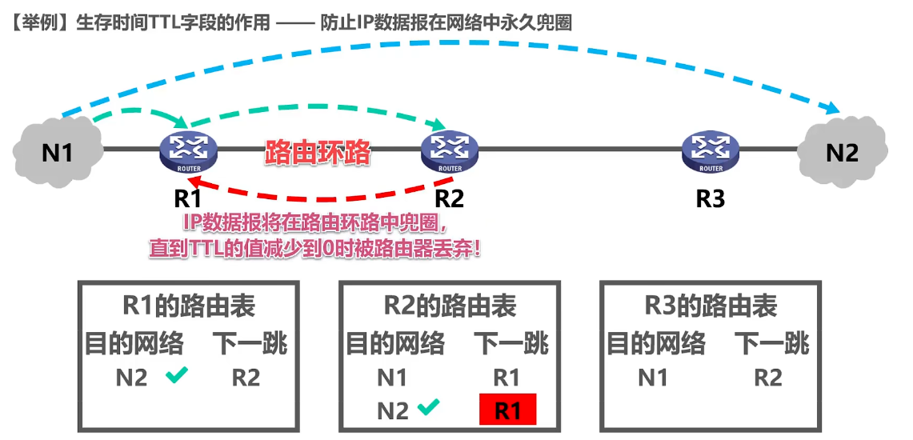
<!-- image-source: https://cdn.nlark.com/yuque/0/2026/png/67474974/1781441502556-6b62c8bd-16b4-4e9c-adf0-4e4f845da3f5.png -->

**3.协议字段**


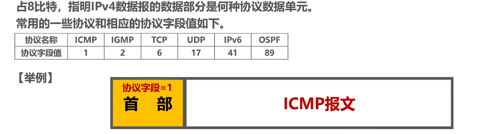
<!-- image-source: https://cdn.nlark.com/yuque/0/2026/png/67474974/1781441610594-87313c17-0c40-4026-8afc-c4f7c30c9e61.png -->

---

### 3.首部可变字段（可选字段与填充）
1. **可选字段 (Options)**
    - **长度**：1至40字节不等。
    - **功能**：支持网络测试、调试、安全控制等附加功能（如记录路由、时间戳）。
    - **缺点**：增加首部长度及路由器处理开销，实际应用中极少使用。
2. **填充字段 (Padding)**
    - **功能**：当包含可选字段导致首部长度不是4字节的整数倍时，使用全 `0` 进行填充，以确保首部长度满足4字节对齐要求。

---

### 4.IP数据报的分片机制
标识标志片偏移共同用于IP数据报分片


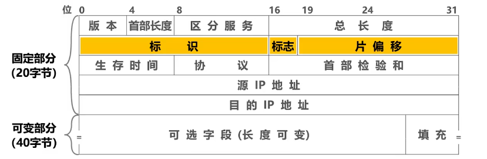
<!-- image-source: https://cdn.nlark.com/yuque/0/2026/png/67474974/1781440852667-64a39b0a-c64a-4abd-a076-d68df0f3e9e0.png -->

**MTU与分片触发条件**

在数据链路层，每种协议都规定了帧的数据载荷最大长度，称为**最大传输单元（MTU）**（例如以太网MTU为1500字节）。当IP数据报的总长度超过链路MTU时，必须将其**分片（Fragmentation）** 为更小的IP数据报，再分别封装成帧传输。


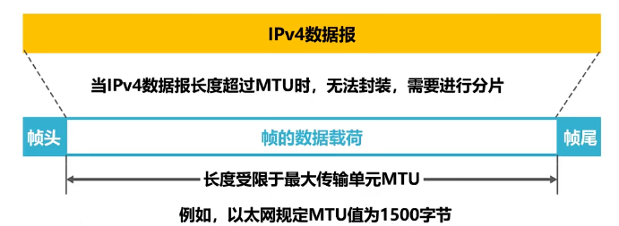
<!-- image-source: https://cdn.nlark.com/yuque/0/2026/png/67474974/1781440922201-4d7e7eae-4403-44cc-a1be-79eec6264c31.png -->

**分片相关核心字段**

| 字段名称 | 长度 (比特) | 功能与机制 |
| :--- | :---: | :--- |
| **标识 (Identification)** | 16 | IP软件维护计数器，每产生一个IP数据报加1并赋给该字段。属于同一原始数据报的所有分片具有**相同的标识值**，以便目的主机重组。 |
| **标志 (Flags)** | 3 | **保留位**：必须置 `0`。   **DF (Don't Fragment)**：置 `1` 表示不允许分片（若超MTU则丢弃并报错），置 `0` 表示允许分片。   **MF (More Fragments)**：置 `1` 表示**后续还有分片**，置 `0` 表示**当前为最后一个分片**。 |
| **片偏移 (Fragment Offset)** | 13 | 指出该分片的数据载荷在原始数据报数据载荷中的相对位置（从0开始）。**单位为8字节**。**除最后一个分片外，其他所有分片的数据载荷长度必须是8字节的整数倍**。 |


**分片计算案例演示**

**初始状态**：

+ 原始IP数据报：固定首部20字节，数据载荷3800字节，总长度3820字节。
+ 字段初始值：标识 = `12345`，MF = `0`，DF = `0`，片偏移 = `0`。
+ 传输链路：以太网（MTU = 1500字节）。


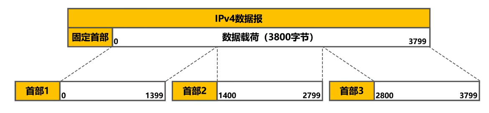
<!-- image-source: https://cdn.nlark.com/yuque/0/2026/png/67474974/1781441093470-a2f7490b-8ab1-480d-a5c4-9c9a56dfbcf0.png -->

**分片过程（MTU = 1500）**：  
	每个分片的最大总长度不能超过1500字节，即数据载荷最大为 $1500 - 20 = 1480$ 字节。  
为满足片偏移8字节对齐要求，我们设定每个分片的数据载荷为 **1400字节**（1400是8的整数倍，且小于1480）。

| 分片编号 | 数据载荷范围 (字节编号) | 数据载荷长度 | 总长度 | 标识 | MF | DF | 片偏移计算 (原始字节数 ÷ 8) |
| :---: | :--- | :---: | :---: | :---: | :---: | :---: | :--- |
| **分片 1** | 0 ~ 1399 | 1400 | 1420 | 12345 | 1 | 0 | $0 \div 8 = \mathbf{0}$ |
| **分片 2** | 1400 ~ 2799 | 1400 | 1420 | 12345 | 1 | 0 | $1400 \div 8 = \mathbf{175}$ |
| **分片 3** | 2800 ~ 3799 | 1000 | 1020 | 12345 | 0 | 0 | $2800 \div 8 = \mathbf{350}$ |


_若“分片2”在后续传输中遇到更小的MTU，需进行*二次分片_（例如分为800字节和600字节数据载荷）。二次分片时，各子分片继承“分片2”的标识，并根据其在原数据报中的绝对位置重新计算片偏移，同时更新MF标志位。*


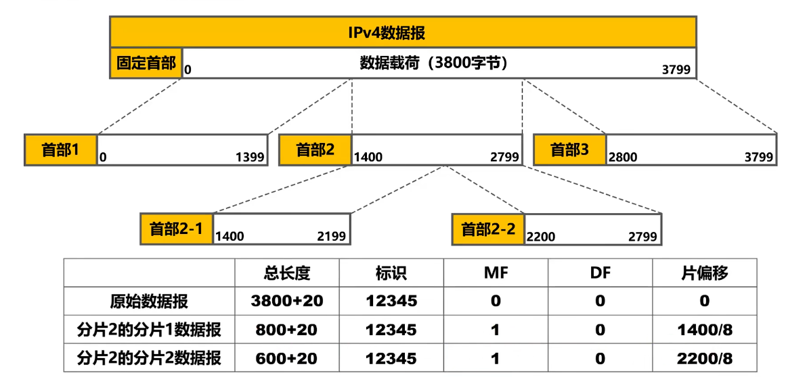
<!-- image-source: https://cdn.nlark.com/yuque/0/2026/png/67474974/1781441375691-c073057f-eb83-43c6-aaca-09c881f2536b.png -->

---

### 5.考研真题深度解析
#### （1）2018年全国统考（408）计算机网络 题47 第二问

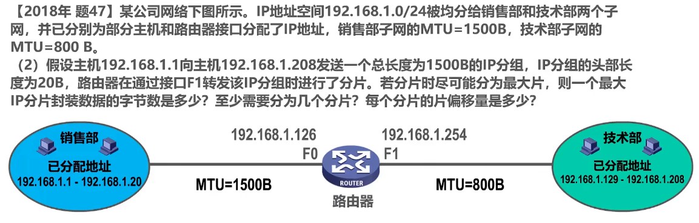
<!-- image-source: https://cdn.nlark.com/yuque/0/2026/png/67474974/1781441691771-0906c357-6d34-4db7-ab9c-1762999ee45c.png -->

+ **题目背景**：某销售部主机发送IP分组，总长度1500字节，首部长度20字节，数据载荷1480字节（编号0~1479）。经过路由器F1接口转发时，受网络MTU=800字节限制，需进行分片。
+ **解析与计算**：


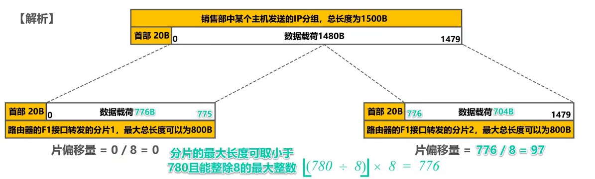
<!-- image-source: https://cdn.nlark.com/yuque/0/2026/png/67474974/1781441753999-f25f4fd6-38f1-40d3-8486-12ec4ef4bdba.png -->

1. 分片后每个IP数据报最大总长度为800字节，数据载荷最大为 $800 - 20 = 780$ 字节。
2. **对齐要求**：片偏移以8字节为单位，分片数据载荷长度必须是8的整数倍。
3. 寻找小于等于780且能被8整除的最大整数：$780 \div 8 = 97.5$，向下取整得97，$97 \times 8 = \mathbf{776}$
4. **分片 1**：
    * 数据载荷：776字节（编号 0~775）。
    * 总长度：$776 + 20 = \mathbf{796}$ 字节。
    * 片偏移：$0 \div 8 = \mathbf{0}$。
    * MF = 1。
5. **分片 2**：
    * 数据载荷：$1480 - 776 = \mathbf{704}$ 字节（编号 776~1479）。
    * 总长度：$704 + 20 = \mathbf{724}$ 字节。
    * 片偏移：$776 \div 8 = \mathbf{97}$。
    * MF = 0。


#### （2）2011年全国统考（408）计算机网络 题47 第一、四问

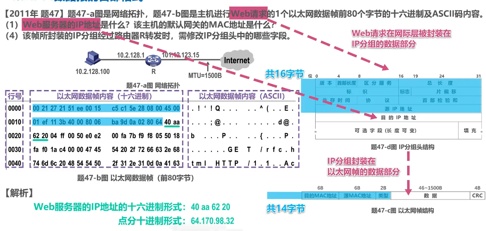
<!-- image-source: https://cdn.nlark.com/yuque/0/2026/png/67474974/1781441860362-ed54d79a-3b52-4694-8170-5b96365bfc0a.png -->

+ **题目背景**：通过抓取以太网数据帧十六进制数据分析Web请求。
+ **第一问解析（提取IP与MAC地址）**：
    - 以太网帧首部固定为14字节（目的MAC 6B + 源MAC 6B + 类型 2B）。
    - IP数据报首部前16字节包含版本、长度、TTL、协议及**源IP地址**。**目的IP地址**位于IP首部第17~20字节。
    - 因此，目的IP地址位于以太网帧的第 $14 + 16 = 30$ 字节之后，即**第31~34字节**。
    - 根据题目给出的十六进制抓包数据，第31~34字节转换为点分十进制即为Web服务器的IP地址（如：`64.170.98.32`）。
    - 主机发送给默认网关（路由器），因此以太网帧首部中的**目的MAC地址**（前6个字节）即为默认网关的MAC地址（如：`00-21-27-21-51-11`）。
+ **第四问解析（路由器处理机制）**：
    - IP分组经过路由器R时，以下字段必然发生变化：
        1. **TTL字段**：值减1。
        2. **首部检验和**：因TTL改变，必须重新计算。
        3. **分片处理**：若出接口MTU小于IP分组总长度，则进行分片，需修改**总长度**、**标志（MF）** 和**片偏移**字段。


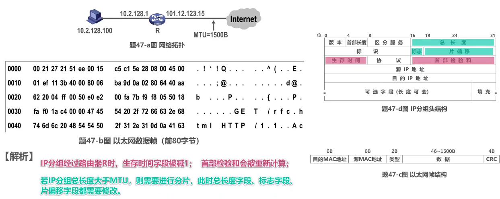
<!-- image-source: https://cdn.nlark.com/yuque/0/2026/png/67474974/1781441904648-bf2df326-9c37-407a-ac59-73455785e516.png -->

---

## 八、网际控制报文协议ICMP
### 1.ICMP 协议概述
为了更有效地转发 IP 数据报并提高交付成功的概率，网际层引入了 ICMP 协议。

+ **核心功能**：**发送差错报告报文和网络询问报文**。
+ **协议层级**：虽然 ICMP 报文在逻辑上属于网际层，但在物理传输时，**ICMP 报文被封装在 IP 数据报的数据载荷部分**（即 IP 首部之后）。
+ **报文分类**：主要分为两大类：**差错报告报文**（用于报告 IP 数据报处理过程中的错误）和 **询问报文**（用于网络诊断和状态查询）。


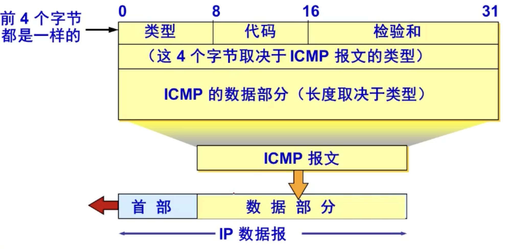
<!-- image-source: https://cdn.nlark.com/yuque/0/2026/png/67474974/1782548759679-c90dfe00-e94a-4ce0-82e7-c9da9ed35fbc.png -->

---

### 2.ICMP 差错报告报文 (5种核心类型)
当路由器或主机在处理 IP 数据报时遇到异常，会向**源点**（发送该数据报的源主机）发送差错报告报文。共有以下 5 种标准类型：

| 报文类型 | 触发条件与机制 | 典型案例说明 |
| :--- | :--- | :--- |
| **1. 终点不可达**   (Destination Unreachable) | 当路由器或主机无法将数据报交付给目的主机时发送。根据 ICMP 代码字段可细分为 13 种错误（如：目的网络/主机/协议/端口不可达等）。 | 主机 H1 发数据给 H2，交由路由器 R1 转发。若 R1 路由表中无目的网络 N3 的记录，且无默认路由或特定主机路由，R1 只能丢弃该数据报，并向 H1 发送“终点不可达”报文。 |


.png)
<!-- image-source: https://cdn.nlark.com/yuque/0/2026/png/67474974/1781442153299-237321d2-510b-47ce-91c6-93e8611b02a9.png -->

| **2. 源点抑制**   (Source Quench) | 当路由器或主机因网络拥塞而被迫丢弃数据报时发送，通知源点放慢发送速率。 | 数据报到达路由器 R2 或目的主机 H2 时，若设备缓冲区已满（拥塞），则丢弃数据报并向源点 H1 发送“源点抑制”报文。   _(注：现代网络中，拥塞控制主要由传输层如 TCP 负责，该 ICMP 报文现已极少使用并被 RFC 1812 废弃。)_ |
| :--- | :--- | :--- |


.png)
<!-- image-source: https://cdn.nlark.com/yuque/0/2026/png/67474974/1781442204601-718e46ba-4192-4fff-8aa5-15133cc7269e.png -->


.png)
<!-- image-source: https://cdn.nlark.com/yuque/0/2026/png/67474974/1781442222103-4c0878c9-8f8c-4529-9e01-fbb8d1227900.png -->

| **3. 时间超过**   (Time Exceeded) | **情况A**：路由器收到 TTL 不为 0 的数据报，将其 TTL 减 1 后结果为 0，则丢弃并发送。   **情况B**：目的主机在规定时间内未收齐该数据报的所有分片，丢弃已收分片并发送。 | 某数据报初始 TTL=2。到达 R1 时 TTL 减为 1，正常转发；到达 R2 时 TTL 减为 0，R2 丢弃数据报并向源点 H1 发送“时间超过”报文。 |
| :--- | :--- | :--- |


.png)
<!-- image-source: https://cdn.nlark.com/yuque/0/2026/png/67474974/1781442273739-7ee5421e-646d-4865-a719-f5a805bf441c.png -->

| **4. 参数问题**   (Parameter Problem) | 路由器或目的主机发现 IP 数据报首部字段存在无效值或传输误码，导致无法处理时发送。 | 数据报在传输中受干扰导致首部出现误码（或首部选项格式非法），路由器 R1 校验发现后丢弃数据报，并向源点 H1 发送“参数问题”报文。 |
| :--- | :--- | :--- |


.png)
<!-- image-source: https://cdn.nlark.com/yuque/0/2026/png/67474974/1781442325157-d6cb21a3-318f-4d31-a92f-1dc81c68ee3d.png -->

| **5. 改变路由**   (Redirect) | 路由器发现主机发送数据报的下一跳不是最优路径时发送，指导主机更新路由表。 | 主机 H1 的默认网关是 R1。当 R1 发现 H1 发往 N2 的数据报最佳路径应直接经过 R4 时，R1 向 H1 发送“改变路由”报文。H1 随后更新路由表，直接将数据报发给 R4。 |
| :--- | :--- | :--- |


.png)
<!-- image-source: https://cdn.nlark.com/yuque/0/2026/png/67474974/1781442346525-9fddece2-f35b-4c5e-8198-1a3682449bfa.png -->

---

### 3.不发送 ICMP 差错报告报文的特殊情况
为了避免引发“广播风暴”或无意义的网络开销，RFC 规定在以下 4 种情况下，**绝不发送** ICMP 差错报告报文：

1. **对 ICMP 差错报告报文本身**，不再发送 ICMP 差错报告报文（防止无限死循环）。
2. **对分片数据报**：仅对第一个分片发送差错报告，对第一个分片之后的**所有后续分片**均不发送。
3. **对多播数据报**：目的地址为多播地址（Multicast）的数据报不发送。
4. **对特殊地址数据报**：目的地址为特殊地址（如环回地址 `127.0.0.0/8` 或默认路由 `0.0.0.0`）的数据报不发送。

---

### 4.ICMP 询问报文 (2种核心类型)
询问报文主要用于网络诊断、连通性测试和时钟同步，通常成对出现（请求与回答）。

1. **回送请求与回答 (Echo Request / Echo Reply)**
    - **机制**：主机或路由器向特定目的主机发出“回送请求”，目的主机收到后必须返回“回送回答”。
    - **用途**：测试目的站是否可达，以及了解网络连通状态（即 `ping` 命令的底层基础）。
2. **时间戳请求与回答 (Timestamp Request / Reply)**
    - **机制**：请求对方回答当前的日期和时间。回答报文中包含一个 32 位字段，记录从 1900 年 1 月 1 日 00:00:00 到当前时刻的总秒数。
    - **用途**：用于网络节点间的时钟同步和测量传输延迟。

---

### 5.ICMP 的典型应用及底层原理
**1. 分组网间探测 (PING)**

+ **功能**：测试两台主机或路由器之间的连通性。
+ **协议栈特征**：`ping` 是一个应用层程序，但它**不经过传输层（TCP/UDP）**，而是直接调用网际层的 ICMP 协议。
+ **使用报文**：ICMP 回送请求 (Echo Request) 与 回送回答 (Echo Reply)。


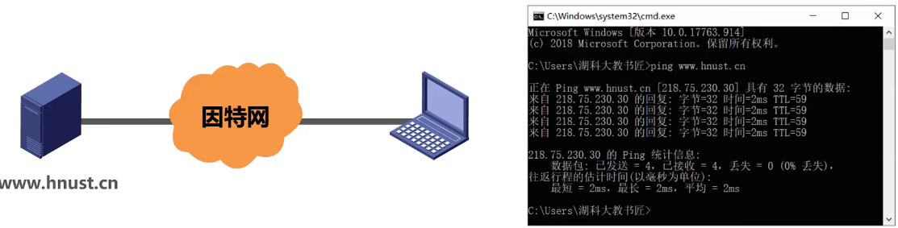
<!-- image-source: https://cdn.nlark.com/yuque/0/2026/png/67474974/1781442623691-4e2c5c56-9691-40d5-8c77-6e814d575048.png -->

**2. 跟踪路由 (Traceroute / tracert)**

+ **功能**：追踪 IP 数据报从源主机到目的主机所经过的所有路由器节点。


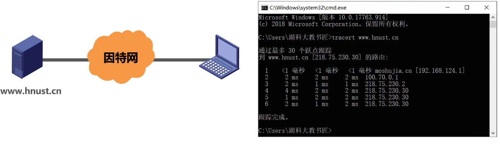
<!-- image-source: https://cdn.nlark.com/yuque/0/2026/png/67474974/1781442651676-7354692f-232e-412f-b716-09b333e6b885.png -->

+ **实现差异**：
    - **Windows (** `tracert` **)**：应用层直接调用 ICMP 协议，发送 **ICMP 回送请求** 报文。
    - **Unix/Linux (** `traceroute` **)**：在传输层使用 **UDP 协议**（向一个极大的、不可达的端口号发送数据），在网际层依赖 **ICMP 差错报告** 报文。
+ **核心原理 (TTL 递增探测法)**：  
假设源主机 H1 想探测到达目的主机 H2 的路径：
    1. **第一跳探测**：H1 发送 TTL=1 的探测报文。到达第一跳路由器 R1 时，TTL 减为 0。R1 丢弃报文，并向 H1 返回 **ICMP 时间超过** 报文。H1 借此获取 R1 的 IP。


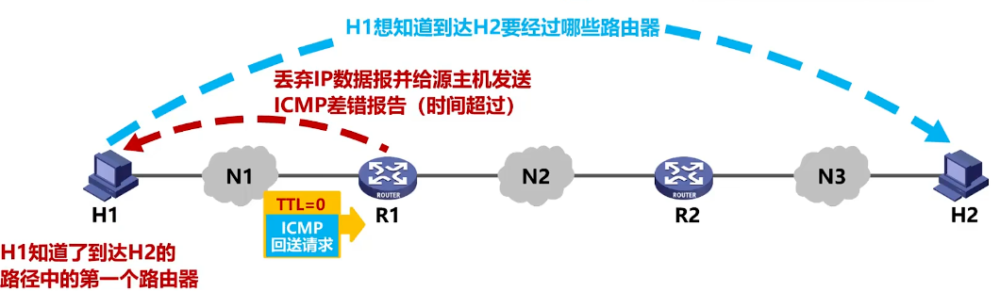
<!-- image-source: https://cdn.nlark.com/yuque/0/2026/png/67474974/1781442707607-ed6de8e8-779f-4cf3-a151-e0442247ebba.png -->

2. **第二跳探测**：H1 发送 TTL=2 的探测报文。经过 R1（TTL变1）到达 R2 时，TTL 减为 0。R2 丢弃报文，并向 H1 返回 **ICMP 时间超过** 报文。H1 获取 R2 的 IP。


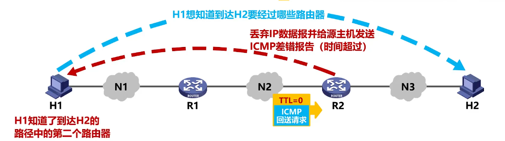
<!-- image-source: https://cdn.nlark.com/yuque/0/2026/png/67474974/1781442726138-398abdbe-3879-46a5-af90-7d061c5e8678.png -->

3. **到达终点**：H1 发送 TTL=N 的探测报文，成功到达目的主机 H2。
    * 若使用 Windows `tracert`（ICMP 请求）：H2 返回 **ICMP 回送回答** 报文。
    * 若使用 Unix `traceroute`（UDP 数据）：H2 发现端口不可达，返回 **ICMP 终点不可达（端口不可达）** 报文。  

H1 收到终点响应后，停止探测，完成路径追踪。


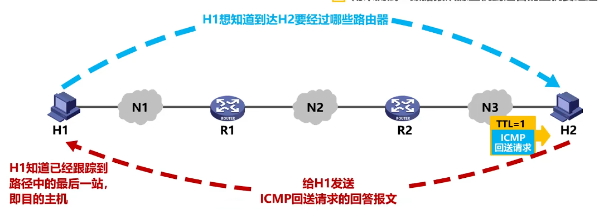
<!-- image-source: https://cdn.nlark.com/yuque/0/2026/png/67474974/1781442753488-fd4aba25-254b-4932-9f4b-8dacad5fe549.png -->

---

### 6.考研真题解析

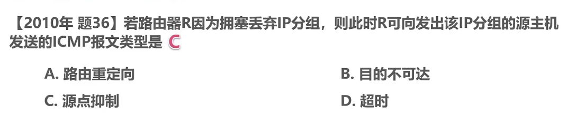
<!-- image-source: https://cdn.nlark.com/yuque/0/2026/png/67474974/1781442457734-cd665e2c-ee4b-4566-a603-811842874e55.png -->

+ **解析**：本题主要考察对 ICMP 差错报告报文和询问报文的区分，以及 ICMP 封装位置的理解。根据标准答案，正确选项为 **C**。_(注：具体题目选项请参考历年真题，核心在于牢记 ICMP 报文是封装在 IP 数据报的数据部分，且差错报告报文不针对分片的后续片发送。)_

---

## 九、虚拟专用网VPN与网络地址转换NAT
### 1.私有 IP 地址空间
由于 IPv4 地址紧缺，机构内部网络通常不申请昂贵的公有 IP，而是使用由因特网数字分配机构（IANA）保留的**私有地址（Private IP）**。私有地址无需申请，可由机构内部自由分配，但**严禁在公网（因特网）上路由**。

IANA 规定的三个 IPv4 私有地址块如下（补充）：

| 地址类别 | 私有网络号范围 | 可用 IP 数量 | 常见应用场景 |
| :--- | :--- | :--- | :--- |
| **A 类** | `10.0.0.0` ~ `10.255.255.255` | 约 1677 万 | 大型企业、校园网核心层 |
| **B 类** | `172.16.0.0` ~ `172.31.255.255` | 约 104 万 | 中型企业、Docker/K8s 容器网络 |
| **C 类** | `192.168.0.0` ~ `192.168.255.255` | 约 6.5 万 | 小型办公室、家庭路由器网络 |


_注：因特网中的所有路由器对目的地址为私有地址的 IP 数据报一律不予转发。因此，私有地址只能用作本地地址，不能用作全球地址。_

### 2.虚拟专用网 (VPN) 基本原理
#### （1）概念与应用场景
假设某机构有两个部门，部门 A 的局域网位于北京，部门 B 的局域网位于上海。为实现两个专用网络的通信，传统方法是租用电信公司的物理专线，此方法简单可靠但成本高昂。


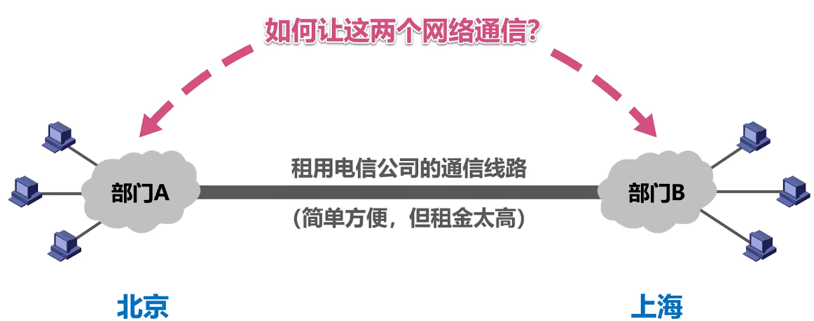
<!-- image-source: https://cdn.nlark.com/yuque/0/2026/png/67474974/1781442877974-10e0f57e-279c-451f-a478-525fb33ec7b8.png -->

**虚拟专用网 (Virtual Private Network, VPN)** 提供了一种高性价比的替代方案：利用公用的因特网（Internet）作为本机构各专用网之间的通信载体。通过逻辑上的隔离与加密，使得在公用网络上传输的私有数据具备与物理专线相当的安全性和专有性。

#### （2）VPN 通信机制与 IP 隧道技术
为了让使用私有地址的部门 A 和部门 B 通过因特网通信，双方网络边缘必须配备具有合法全球 IP 地址的 VPN 路由器（如 R1 和 R2）。其通信过程如下：


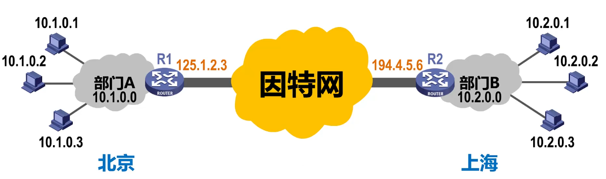
<!-- image-source: https://cdn.nlark.com/yuque/0/2026/png/67474974/1781443043178-5a7ea911-4f95-445f-8c7f-252117d105f6.png -->

1. **内部封装**：部门 A 的主机向部门 B 的主机发送数据，生成**内部 IP 数据报**（源 IP：A 主机**私有地址**，目的 IP：B 主机**私有地址**）。
2. **加密与外部封装（IP 隧道）**：数据报到达 VPN 路由器 R1。R1 对内部数据报进行**加密**，并为其重新添加一个**外部 IP 首部**（源 IP：R1 的全球地址，目的 IP：R2 的全球地址）。此时，原始数据报成为了新数据报的“数据载荷”。


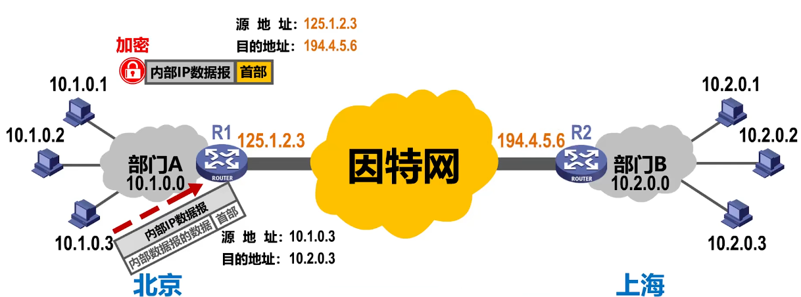
<!-- image-source: https://cdn.nlark.com/yuque/0/2026/png/67474974/1781443123294-f34f8fd5-7961-45c1-8846-b383575c82ba.png -->

3. **公网传输**：外部数据报在因特网中经过多个路由器转发。从逻辑上看，R1 和 R2 之间仿佛建立了一条直通的点对点链路，这被称为 **IP 隧道技术 (IP Tunneling)**。
4. **解密与解封装**：外部数据报到达 VPN 路由器 R2。R2 剥离外部 IP 首部，对数据部分进行**解密**，恢复出原始的内部 IP 数据报。
5. **内部交付**：R2 根据内部 IP 首部的目的地址，将数据报准确交付给部门 B 的目标主机。


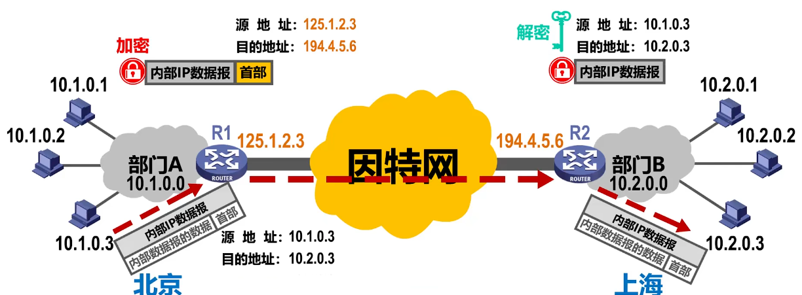
<!-- image-source: https://cdn.nlark.com/yuque/0/2026/png/67474974/1781443160435-ea3189e9-8736-426d-8384-b1c141442be7.png -->

#### （3）VPN 的主要分类
根据应用场景的不同，VPN 主要分为以下三类：

1. **内联网 VPN (Intranet VPN)**：同一机构内不同地域的分支机构（如北京部门 A 与上海部门 B）互联构成的 VPN。
2. **外联网 VPN (Extranet VPN)**：机构与其合作伙伴、供应商等外部机构共享部分资源而建立的 VPN。
3. **远程接入 VPN (Remote Access VPN)**：移动办公员工或异地人员（如寒暑假在家的学生）通过运行客户端软件，在个人 PC 与公司/校园网网关之间建立 VPN 隧道，从而安全访问内网资源。

---

### 3.网络地址转换 (NAT) 基本原理
#### （1）背景与核心作用
尽管无分类编址（CIDR）减缓了 IP 地址耗尽的速度，但随着小型网络和家庭网络的激增，IPv4 地址枯竭问题依然严峻。1994 年提出的 **网络地址转换 (Network Address Translation, NAT)** 技术，允许大量**使用内部私有地址**的主机**共享少量（甚至单个）外部全球 IP 地址**来访问因特网，极大缓解了地址危机。

#### （2）基本 NAT 工作机制
在专用网络连接到因特网的边界路由器上安装 NAT 软件，该路由器称为 **NAT 路由器**，它至少拥有一个有效的外部全球 IP 地址。

**通信流程示例**（假设内网主机 `192.168.0.2` 访问外网主机）：

1. **出站转换**：内网主机发送数据报（源 IP：`192.168.0.2`，目的 IP：外网全球 IP）。NAT 路由器收到后，从全球 IP 地址池中分配一个临时全球 IP（如 `172.38.1.5`），将数据报的**源 IP 替换**为该全球 IP，并在 **NAT 转换表**中记录映射关系，随后转发至因特网。


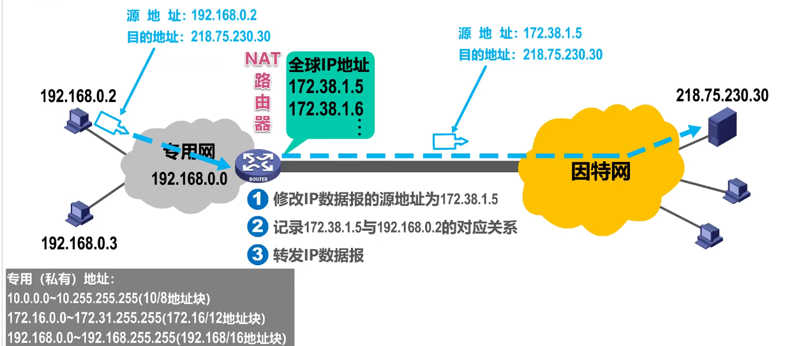
<!-- image-source: https://cdn.nlark.com/yuque/0/2026/png/67474974/1781443801907-ade5137b-c967-464a-9417-aee95e737386.png -->

2. **入站转换**：外网主机回传数据报（源 IP：外网全球 IP，目的 IP：`172.38.1.5`）。NAT 路由器收到后，查询 NAT 转换表，找到对应的私有 IP `192.168.0.2`，将数据报的**目的 IP 替换**为该私有 IP，并转发至内网。


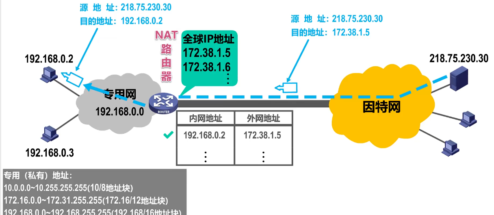
<!-- image-source: https://cdn.nlark.com/yuque/0/2026/png/67474974/1781443858111-a07f8bf3-db0f-4c76-a534-42cab3eb34ce.png -->

**基本 NAT 转换表示例**：


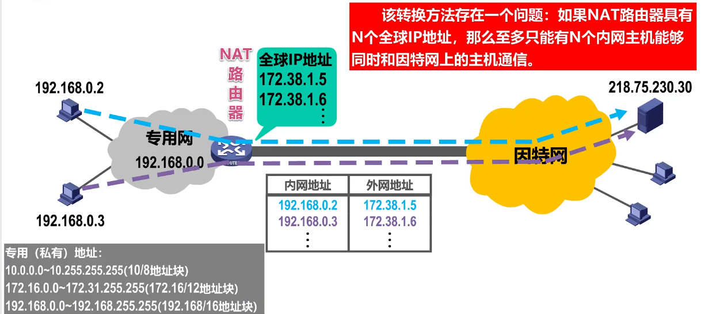
<!-- image-source: https://cdn.nlark.com/yuque/0/2026/png/67474974/1781443925867-5309dc7e-12ac-4da4-a0cc-93e1e6f3bd4d.png -->

| 内部私有 IP | 外部全球 IP |
| :--- | :--- |
| 192.168.0.2 | 172.38.1.5 |
| 192.168.0.3 | 172.38.1.6 |


**基本 NAT 的局限性**：如果 NAT 路由器拥有 $N$ 个全球 IP 地址，则**最多只能支持** $N$ **台内网主机同时与外网通信**。这在现代网络中远远不够。

#### （3）网络地址与端口转换 (NAPT)
为了突破基本 NAT 的限制，引入了 **NAPT (Network Address Port Translation)**，也称为 **PAT (Port Address Translation)**。

**NAPT 转换表示例**（补充传输层端口信息）：


.png)
<!-- image-source: https://cdn.nlark.com/yuque/0/2026/png/67474974/1781444012893-e0e5bd37-3c46-4584-abe4-ff4b390ac842.png -->

| 内部私有 IP | 内部源端口 | 外部全球 IP | 外部映射端口 | 协议 |
| :--- | :--- | :--- | :--- | :--- |
| 192.168.0.2 | 5001 | 172.38.1.5 | 2001 | TCP |
| 192.168.0.3 | 8080 | 172.38.1.5 | 2002 | TCP |
| 192.168.0.2 | 6000 | 172.38.1.5 | 2003 | UDP |


_注：当外网数据报到达 NAT 路由器时，路由器不仅检查目的 IP，还会检查*__目的端口号_，通过查表精准定位到内网的具体主机和具体应用程序进程。*

---

### 4.NAT 的特性、限制与实际影响
**1.通信方向的严格限制（核心痛点）**

**内网主机与外网主机间的通信，不能由外网主机首先发起。**


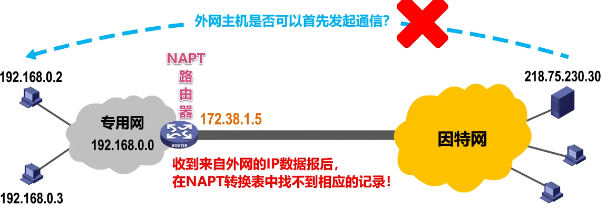
<!-- image-source: https://cdn.nlark.com/yuque/0/2026/png/67474974/1781444328844-8c634141-f316-4fde-8e2b-6f48e70d50ac.png -->

+ **原因**：NAT 转换表中的记录是由内网主机主动向外发送数据时动态创建的。如果外网主机主动向 NAT 路由器的全球 IP 发起连接，由于 NAT 表中没有对应的映射记录，路由器不知道该将数据报转发给哪台内网主机，只能将其丢弃。
+ **影响**：使用**私有地址**的内网主机**不能直接充当因特网服务器**（如 Web 服务器、游戏服务端）。若需对外提供服务，必须在 NAT 路由器上配置**端口映射（Port Forwarding / 静态 NAT）**。

**2.对 P2P 应用的影响与 NAT 穿透**

对于点对点（P2P）网络应用（如视频会议、多人联机游戏、BT 下载），双方可能都位于各自的 NAT 之后。由于双方都无法被外网主动访问，直接建立连接会失败。


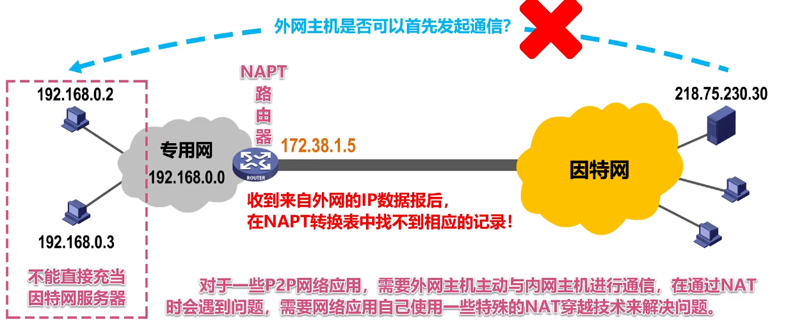
<!-- image-source: https://cdn.nlark.com/yuque/0/2026/png/67474974/1781444264090-0d8c84aa-9476-41e6-b900-d0f912156b70.png -->

+ **解决方案**：应用层需要引入 **NAT 穿透技术 (NAT Traversal)**，如 UDP 打洞 (UDP Hole Punching) 或借助具有公网 IP 的 TURN/STUN 中继服务器来协助建立连接。这是 C++ 后端开发（尤其是音视频和实时通信领域）必须掌握的进阶网络知识。

**3.安全性与网络诊断**

+ **安全隐藏**：NAT 对外网完全屏蔽了内网的拓扑结构和主机的真实私有 IP，相当于提供了一层天然的防火墙，提升了内网安全性。
+ **对网络诊断工具的影响**：在使用 `tracert` (Windows) 或 `traceroute` (Linux) 追踪路由时，有时会发现路径中出现了两个或多个相同的 IP 地址。这通常是因为路径中经过了多个使用 NAT 技术的边界路由器，或者内网中还存在使用私有 IP 的二级路由设备。此外，NAT 修改了 IP 首部，会导致 IP 首部检验和重新计算；若涉及 NAPT，还会修改 TCP/UDP 校验和。


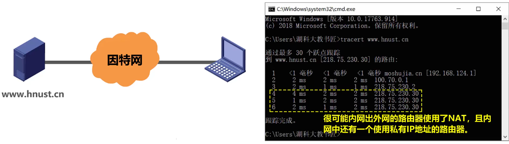
<!-- image-source: https://cdn.nlark.com/yuque/0/2026/png/67474974/1781444481514-cef1ff68-ff78-4796-8c1d-96fdddeca402.png -->

---

---

### 5.NAT 的内网 IP 和 VPN 的私有 IP比较
从 IP 地址的**数值范围**来看 **，** NAT 的内网 IP 和 VPN 的私有 IP**没有区别**（通常都是 RFC 1918 标准定义的 `10.x.x.x`、`172.16.x.x` 或 `192.168.x.x`）。 但是，从**网络拓扑、分配者、作用域以及路由逻辑**来看，它们有着本质的区别。

| 对比维度 | NAT 的内网主机 IP (Local LAN IP) | VPN 的私有 IP (Virtual Tunnel IP) |
| :--- | :--- | :--- |
| **网络性质** | **物理局域网 (Physical LAN)** | **虚拟局域网 (Virtual LAN / Tunnel)** |
| **分配者** | 你**本地**的路由器或 DHCP 服务器（如家里的 TP-Link）。 | **远端**的 VPN 服务器 / 企业 VPN 网关。 |
| **分配时机** | 设备连上本地 Wi-Fi 或插入网线时。 | 设备与 VPN 服务器成功建立加密隧道后。 |
| **主要作用** | 在**本地**局域网内互相通信；作为源 IP 经过 NAT 转换后访问公网。 | 在**加密隧道**内与企业内网资源通信；让远程设备“伪装”成企业本地设备。 |
| **跨网通信方式** | 必须依赖本地路由器的 **SNAT（源地址转换）** 才能上公网。 | 依赖 **隧道封装 (Encapsulation)** 和 VPN 网关的**路由转发**，通常不需要 NAT。 |
| **公网可见性** | 绝对不可见，被本地路由器的公网 IP 掩盖。 | 绝对不可见，被封装在加密的公网 IP 数据包内部。 |


---

### 6.总结与后端开发视角的延伸
本文档详细解析了 VPN 的隧道加密机制与 NAT 的地址/端口转换原理。对于致力于成为 C++ 后端开发工程师的同学而言，理解这两项技术具有极强的工程实践意义：

1. **服务部署与内网穿透**：在开发阶段，本地运行的 C++ 服务端程序通常处于 NAT 之后。若需让外部客户端或第三方 Webhook 回调访问本地服务，需熟练使用 `frp`、`ngrok` 等内网穿透工具（本质上是应用层的反向代理与隧道技术）。
2. **容器与微服务网络**：现代后端架构大量使用 Docker 和 Kubernetes。K8s 的 Pod 网络、Service 的 ClusterIP 本质上都是基于私有地址空间和类似 NAT/IPtables 的转发规则实现的。
3. **高并发连接管理**：理解 NAPT 的端口复用机制，有助于在编写高并发 C++ 网络程序（如使用 epoll）时，正确处理 TIME_WAIT 状态、端口耗尽问题以及 SO_REUSEADDR/SO_REUSEPORT 套接字选项。

---

## 十、IPV6地址
### 1.IPv6 的诞生背景与核心特点
#### （1）时代背景
+ **IPv4 的局限**：IPv4 协议诞生于 1981 年，采用 **32 位**地址空间，理论上仅提供约 42.9 亿个地址。随着互联网和个人设备的爆炸式增长，IPv4 地址已宣告枯竭。
+ **NAT 技术的妥协**：1994 年引入的网络地址转换（NAT）技术允许多台设备共享单一公网 IP，这极大缓解了地址危机，但破坏了端到端通信的纯粹性，且无法从根本上解决资源短缺。
+ **IPv6 的诞生**：1998 年，IETF 正式标准化 IPv6。其采用 **128 位**地址空间，地址总数高达 $2^{128}$（约 $3.4 \times 10^{38}$）。即使按全球 80 亿人口计算，每人也可分得约 $4.3 \times 10^{28}$ 个地址，足以支撑未来数百年的“万物互联”需求。

> _注：IPv5 曾作为实验性的流协议（Internet Stream Protocol）存在，但从未在全球范围内商用推广，因此版本号直接从 v4 跃升至 v6。_
>

#### （2）IPv6 数据报的主要特点（补充拓展）
除了地址空间的扩充，IPv6 在数据报首部设计上进行了大量优化，以提升路由器的转发效率：

1. **首部固定长度**：IPv6 基本首部固定为 **40 字节**，去除了 IPv4 中大量不常用的字段（如选项、首部长度等），简化了路由器处理逻辑。
2. **取消首部检验和**：由于数据链路层（如以太网 CRC）和传输层（TCP/UDP 校验和）已具备差错检测能力，IPv6 取消了首部校验和，**避免了路由器每跳都要重新计算校验和的开销**。
3. **扩展首部机制**：将分片、路由选项等功能移至“扩展首部”，仅在需要时由目的主机处理，实现了首部的灵活扩展。
4. **ICMPv6 的整合**：IPv6 将地址解析（ARP）和组管理（IGMP）等功能整合进 ICMPv6 协议中，使协议栈更加精简。

---

### 2.IPv6 地址的表示法与压缩规则
128 位的二进制地址对人类极不友好，因此 IPv6 采用了**冒号十六进制记法**及相应的**压缩规则**。

**冒号十六进制记法**

将 128 位地址每 16 位（4 个十六进制字符）划分为一段，共 **8 段**，段与段之间用冒号 `:` 分隔。

+ **示例**：`2001:0DB8:85A3:0000:0000:8A2E:0370:7334`

**压缩规则（核心考点）**

为了进一步简化书写，RFC 5952 规定了以下两种压缩技法（可叠加使用）：

1. **省略前导零**：每一段内的前导 `0` 可以省略。若某段全为 `0`，则至少保留一个 `0`。
    - _示例_：`0DB8` $\rightarrow$ `DB8`；`0000` $\rightarrow$ `0`；`0370` $\rightarrow$ `370`。
    - `2001:0DB8:85A3:0000:0000:8A2E:0370:7334`$\rightarrow$`2001:DB8:85A3:0:0:8A2E:370:7334`
2. **双冒号替代连续全零段**：地址中连续出现的**一个或多个**全零段（`0000`），可用双冒号 `::` 替代。
    - **严格限制**：**双冒号** `::` **在一个 IPv6 地址中只能出现一次**。若出现多次，解析时将无法确定每个 `::` 代表多少个全零段，导致地址歧义。
    - `2001:0DB8:85A3:0000:0000:8A2E:0370:7334`$\rightarrow$`2001:DB8:85A3::8A2E:370:7334`

**典型考题解析**


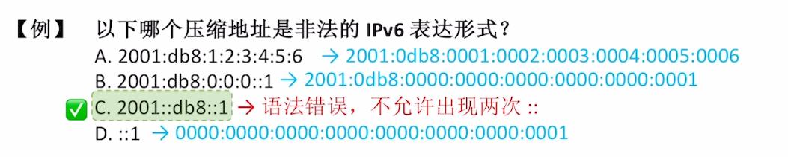
<!-- image-source: https://cdn.nlark.com/yuque/0/2026/png/67474974/1782561437022-83d91af5-7335-4e9a-b228-8fd805fe536f.png -->


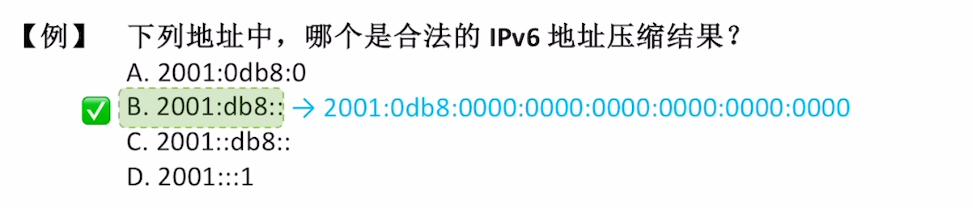
<!-- image-source: https://cdn.nlark.com/yuque/0/2026/png/67474974/1782561455088-2af6402f-53f8-428e-9197-94ce8e627a63.png -->

---

### 3.IPv6 地址分配与子网划分
IPv6 同样支持 **CIDR（无分类编址）**，允许灵活划分定长或不定长子网。由于地址空间极其庞大，IPv6 的层级分配更加扁平且充裕。

+ **分配层级**：ICANN（全球统筹） $\rightarrow$ RIR（区域互联网注册管理机构，如 APNIC） $\rightarrow$ 一级 ISP（如中国电信） $\rightarrow$ 二级 ISP / 企业局域网 $\rightarrow$ 终端主机。
+ **地址结构**：通常划分为 **网络前缀（n 位）** 和 **接口标识符（128-n 位）**。
    - 在实际企业或校园网部署中，ISP 通常会下发一个 **/64** 的网络前缀。这意味着留给局域网内部分配的接口标识符长达 64 位，这为 IPv6 的“即插即用”特性奠定了基础。

---

### 4.IPv6 的即插即用（地址自动配置）
在 IPv4 中，主机接入网络通常需要依赖 DHCP 服务器获取 IP。而在 IPv6 中，得益于 64 位接口标识符的庞大空间，引入了**无状态地址自动配置（SLAAC, Stateless Address Autoconfiguration）**。

**SLAAC 工作机制（“身份是自己给的”）**

1. **获取前缀**：主机接入网络后，通过 ICMPv6 路由器通告（RA）报文，获取本网络的 64 位网络前缀。
2. **生成接口标识符（补充：EUI-64 规范）**：主机利用自身全球唯一的 48 位 MAC 地址，通过 **EUI-64 规范** 生成 64 位的接口标识符。
    - _转换方法_：在 MAC 地址中间插入 `FFFE`，并将第 7 位（U/L 位）取反。
3. **拼接地址**：将 64 位网络前缀与 64 位接口标识符拼接，即可生成全球唯一的 IPv6 地址，无需 DHCP 服务器介入，极大提升了网络部署效率。

**DHCPv6（“身份是别人给的”）**

尽管 SLAAC 极其高效，但在需要严格网络审计、集中管理或分配 DNS 服务器地址的企业环境中，IPv6 依然支持 **DHCPv6（有状态地址自动配置）**，由服务器统一分配和管理地址。

---

### 5.IPv6 地址分类
IPv6 地址根据用途可分为以下几类，这是网络编程和路由配置的基础：

| 地址类型 | 前缀/特征 | 示例 / 压缩形式 | 功能说明 | 对应 IPv4 概念 |
| :--- | :--- | :--- | :--- | :--- |
| **未指明地址** | 128 位全 0 | `::/128` | 主机初始化时，尚未获取 IP 地址时使用。 | `0.0.0.0` |
| **环回地址** | 前 127 位为 0，末位为 1 | `::1/128` | 用于本机内部协议栈测试（Localhost）。 | `127.0.0.1` |
| **多播地址**   (Multicast) | 前 8 位全 1 (`FF00::/8`) | `FF02::1` | 一对多通信。数据报发往该地址，所有加入该多播组的主机均会接收（如视频会议、路由协议）。 | 多播地址 (`224.0.0.0/4`) |
| **本地链路单播**   (Link-Local) | 前 10 位为 `1111 1110 10`   (`FE80::/10`) | `FE80::1` | 仅限同一物理/逻辑链路（局域网）内通信。**路由器绝不转发**目的地址为 Link-Local 的数据报。 | `169.254.0.0/16` (APIPA) |
| **全球单播地址**   (Global Unicast) | 除上述特殊地址外的常规地址 | `2408:8456:...` | 全球唯一，可路由，用于端到端的常规互联网通信。 | 常规公网/私网 IP |
| **任播地址**   (Anycast) | 与单播地址格式相同，由路由协议区分 | (由 ISP 统一分配) | 分配给一组提供相同服务的主机。数据报仅交付给**拓扑距离最近**的一台。常用于 DNS 根服务器、CDN 调度。 | IPv4 中无原生支持，需靠 BGP 模拟 |


> **任播 (Anycast) 的通俗理解**：  
假设你在餐厅大喊“服务员”，虽然餐厅有多个服务员（共享同一个“服务员”的任播标识），但**离你物理距离最近**的那个服务员会最先响应你。在计算机网络中，当客户端向任播 IP（如 Google 的公共 DNS `2001:4860:4860::8888`）发送请求时，BGP 路由协议会自动将数据包导向网络拓扑中最近的服务器节点，从而实现极低的延迟和天然的负载均衡。
>

---

### 6.考点自测与解析
**【自测题】以下关于 IPv6 地址的描述，错误的是？**  
A. `::` 可以表示 128 位全 0 的未指明地址。  
B. `FE80::1` 是一个合法的本地链路单播地址，可用于跨互联网路由。  
C. IPv6 地址中允许出现 `:::`（连续三个冒号）。  
D. 任播地址在格式上与全球单播地址没有区别，主要依靠路由表的配置来区分。

**【答案与解析】**

+ **正确答案：B、C**（若为单选则选最明显错误，此处作多选解析）
+ **解析**：
    - A 正确：`::` 即 128 位全 0，是未指明地址。
    - B 错误：`FE80::/10` 是本地链路地址，**绝对不能**被路由器转发到互联网，仅限本地局域网通信。
    - C 错误：IPv6 语法中不允许出现连续三个冒号 `:::`，双冒号 `::` 已经是连续全零段的极限压缩。
    - D 正确：任播地址从字面上看就是一个普通的单播地址，它的“任播”属性是由 ISP 在骨干网路由器上通过 BGP 宣告相同的路由前缀来实现的。

---

### 7.总结
IPv6 不仅仅是 IPv4 地址空间的简单扩容，它在首部结构、自动配置（SLAAC）、邻居发现（NDP）以及任播路由等方面进行了全面的现代化重构。对于 C++ 后端开发者而言，在编写网络通信模块（如基于 `epoll` 的高并发服务器）时，必须确保套接字（Socket）API 同时兼容 `AF_INET` (IPv4) 和 `AF_INET6` (IPv6)，并妥善处理 IPv6 地址的字符串解析（如使用 `inet_pton`）与本地链路地址的 Zone ID（如 `fe80::1%eth0`）问题，这是构建下一代互联网应用的必备素养。

---

# 第五章 运输层
## 一、运输层概述
在计算机网络体系结构中，物理层、数据链路层以及网络层共同解决了异构网络互联的问题，实现了**主机到主机（Host-to-Host）** 的通信。然而，在实际的网络通信中，真正的通信实体并非主机本身，而是运行在通信两端主机上的**应用进程（Application Process, AP）**。


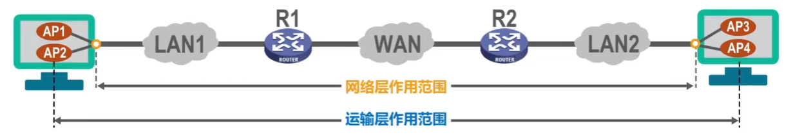
<!-- image-source: https://cdn.nlark.com/yuque/0/2026/png/67474974/1781616927845-f0d0024e-f8dd-48a1-a3d5-e6a296cb20e1.png -->

本文档将系统概述运输层（Transport Layer）的核心概念、功能及其在网络体系结构中的关键作用。

### 1. 运输层的核心任务：进程间通信
网络层的作用范围局限于主机到主机。例如，局域网 A 中的主机与局域网 B 中的主机通过广域网互联，网络层仅负责将数据报从源主机路由到目的主机。但一台主机通常同时运行多个网络应用进程（如主机 A 中的进程 AP1、AP2 与主机 B 中的进程 AP3、AP4）。**如何为运行在不同主机上的应用进程提供直接的通信服务，是运输层的核心任务。**


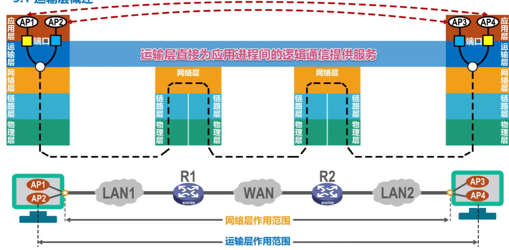
<!-- image-source: https://cdn.nlark.com/yuque/0/2026/png/67474974/1781617086118-12d98cb1-e276-4196-8d71-a929105f8d19.png -->

因此，运输层协议又被称为**端到端（End-to-End）协议**，其作用范围从“主机到主机”延伸到了“应用进程到应用进程”。

### 2. 端口与报文交付机制
在计算机网络体系结构中，假设源主机的应用进程 AP1 与目的主机的应用进程 AP4 进行通信，同时 AP2 与 AP3 进行通信。为了在运输层准确区分和交付数据，引入了**端口（Port）** 的概念。

+ **端口标识与分用**：运输层使用不同的端口号来映射和对应不同的应用进程。发送方将应用层报文封装后，通过网络层及其下层协议进行传输；接收方的运输层则通过解析报文首部中的目的端口号，将收到的应用层报文准确交付给应用层中相应的应用进程（这一过程在网络体系中称为**分用**，Demultiplexing）。
+ **逻辑端口与物理端口的区别**：需要特别强调的是，运输层中的“端口”并非指路由器或主机网卡上可见的物理硬件接口，而是指操作系统中用于区分不同应用进程的**软件层面的逻辑标识符**（通常为 16 位无符号整数，范围 0~65535）。在 C++ 而言中，进行 Socket 网络编程时，绑定的正是这种逻辑端口。

### 3. 逻辑通信与底层细节屏蔽
在学习和研究运输层时，通常认为运输层直接为应用进程间的**逻辑通信**提供服务。

+ **逻辑通信的本质**：从应用层的视角来看，两个运输层实体之间的数据传送似乎是沿水平方向直接进行的，仿佛两者之间存在一条端到端的逻辑通信信道。
+ **物理传输的实际路径**：事实上，这两个运输层实体之间并没有直接的水平物理连接。数据必须向下穿越网络层、数据链路层和物理层，经过网络核心中多个路由器的多次存储转发（即沿垂直方向多次传递），最终到达目的主机的运输层。
+ **屏蔽网络核心细节**：运输层向高层用户（应用层）完美屏蔽了底层网络核心的复杂细节（如网络拓扑结构、路由选择协议、节点交换机制等）。应用层只需调用运输层提供的接口，即可实现透明的端到端数据传输。

### 4. 运输层的两大核心协议
根据不同应用场景对可靠性、实时性及传输效率的需求差异，因特网的运输层为应用层提供了两种主流的运输层协议，这也是后续深入学习网络编程的核心内容：

1. **TCP（Transmission Control Protocol，传输控制协议）**：提供**面向连接的、可靠的字节流传输服务**。适用于要求数据绝对完整性的场景（如 Web 浏览、文件传输、C++ 后端微服务间的 RPC 调用及数据库交互）。
2. **UDP（User Datagram Protocol，用户数据报协议）**：提供**无连接的、尽最大努力交付的数据报传输服务**。适用于对实时性要求极高、允许少量丢包的场景（如实时音视频流、在线游戏状态同步、DNS 查询）。

---

## 二、运输层端口号、复用与分用的概念
### 1.运输层概述与端口号的引入
运输层的核心任务是为运行在不同主机上的**应用进程**提供直接的逻辑通信服务。在操作系统层面，本地进程通常使用进程标识符（PID）进行标志。然而，互联网中的计算机运行着不同的操作系统（如 Windows、Linux、macOS 等），其 PID 的格式和分配机制各不相同。

为了实现跨操作系统的应用进程网络通信，TCP/IP 体系结构在运输层引入了统一的**端口号（Port Number）** 来标识应用层的不同应用进程。

### 2.端口号的分类与特性
端口号使用 16 位（bit）表示，取值范围为 `0 ~ 65535`（2byte）。根据互联网号码分配局（IANA）的规定，端口号主要分为以下三类：

1. **熟知端口号（Well-Known Ports）**
    - **范围**：`0 ~ 1023`。
    - **说明**：IANA 将这些端口号指派给 TCP/IP 体系中最核心、最重要的应用层协议。
    - **示例**：HTTP（80）、DNS（53）、FTP（20、21）、SSH（22）。
2. **登记端口号（Registered Ports）**
    - **范围**：`1024 ~ 49151`。
    - **说明**：分配给没有熟知端口号的特定应用程序。使用此类端口必须在 IANA 按规定手续登记，以防止冲突。
    - **示例**：微软远程桌面（RDP）使用 3389。
3. **短暂端口号（Ephemeral/Dynamic Ports）**
    - **范围**：`49152 ~ 65535`。
    - **说明**：留给客户端进程在发起通信时临时使用。当服务器收到客户端报文时，即可获知客户端使用的短暂端口号。通信结束后，该端口号会被释放，供后续其他客户端进程使用。

**端口号的本地意义**：  
	端口号仅用于标识**本计算机**应用层中的各个进程。在互联网中，不同计算机上的相同端口号之间没有任何必然联系。

### 3.复用与分用机制
复用与分用是运输层实现多进程并发通信的核心机制。

**1.复用（Multiplexing）**

在发送方，不同的应用进程可以通过同一个运输层协议发送数据，最终交由网络层发送。

+ **运输层复用**：多个应用进程的数据交由 UDP 或 TCP 封装，分别称为 UDP 复用和 TCP 复用。
+ **网络层（IP）复用**：无论是 UDP 用户数据报还是 TCP 报文段，在网络层都被封装成 IP 数据报。IP 数据报首部中的**协议字段**用于标识上层协议（值为 `6` 表示 TCP，值为 `17` 表示 UDP）。

**分用（Demultiplexing）**

在接收方，数据从网络层逐层向上交付的过程。

+ **IP 分用**：接收方网络层收到 IP 数据报后，根据协议字段将其数据载荷上交至运输层（若值为 17 则上交 UDP，若值为 6 则上交 TCP）。
+ **运输层分用**：运输层根据报文首部中的**目的端口号**，将数据准确交付给上层对应的应用进程。


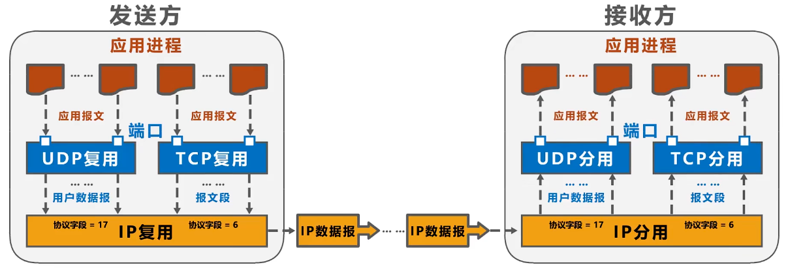
<!-- image-source: https://cdn.nlark.com/yuque/0/2026/png/67474974/1781617522475-546f29e8-2366-41a3-88e5-b8f322f2f8f9.png -->

### 4.常用应用层协议与熟知端口号
以下列举 TCP/IP 体系中常用应用层协议及其对应的运输层协议与熟知端口号：

| 应用层协议 | 运输层协议 | 熟知端口号 | 说明 |
| :--- | :---: | :---: | :--- |
| **DNS** | UDP / TCP | 53 | 域名解析（短查询用 UDP，区域传送用 TCP） |
| **HTTP** | TCP | 80 | 超文本传输协议 |
| **HTTPS** | TCP | 443 | 安全的超文本传输协议 |
| **FTP** | TCP | 20, 21 | 文件传输（20为数据端口，21为控制端口） |
| **SSH** | TCP | 22 | 安全外壳协议 |
| **SMTP** | TCP | 25 | 简单邮件传输协议 |
| **DHCP** | UDP | 67 | 动态主机配置协议 |


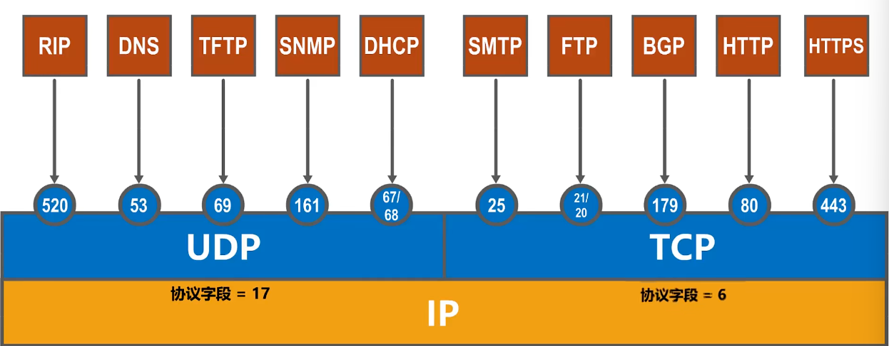
<!-- image-source: https://cdn.nlark.com/yuque/0/2026/png/67474974/1781617582630-17645ed1-01a3-423b-ab85-101037f99d1d.png -->

### 5.实例分析：DNS 与 HTTP 通信过程
假设用户 PC、DNS 服务器、Web 服务器处于同一以太网中。Web 服务器域名为 `www.porttest.com`，对应 IP 地址为 `192.168.0.3`。

#### DNS 解析阶段（基于 UDP）
+ **DNS 请求**：PC 上的 DNS 客户端进程发送查询报文。使用 UDP 封装，**源端口**选取短暂端口（如 `49152`），**目的端口**为 DNS 熟知端口 `53`。


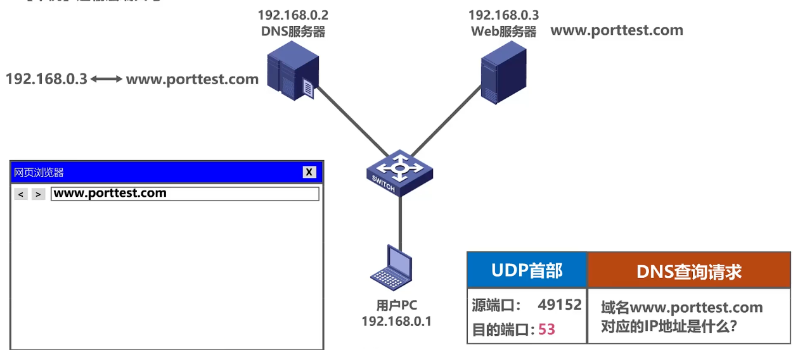
<!-- image-source: https://cdn.nlark.com/yuque/0/2026/png/67474974/1781617816424-30ff7c97-525f-4914-ae55-ad7c7636b2b3.png -->

+ **DNS 响应**：DNS 服务器收到报文后，根据目的端口 `53` 将数据交付给 DNS 服务端进程。解析后返回响应报文（包含 IP `192.168.0.3`）。使用 UDP 封装，**源端口**为 `53`，**目的端口**为 PC 的短暂端口 `49152`。


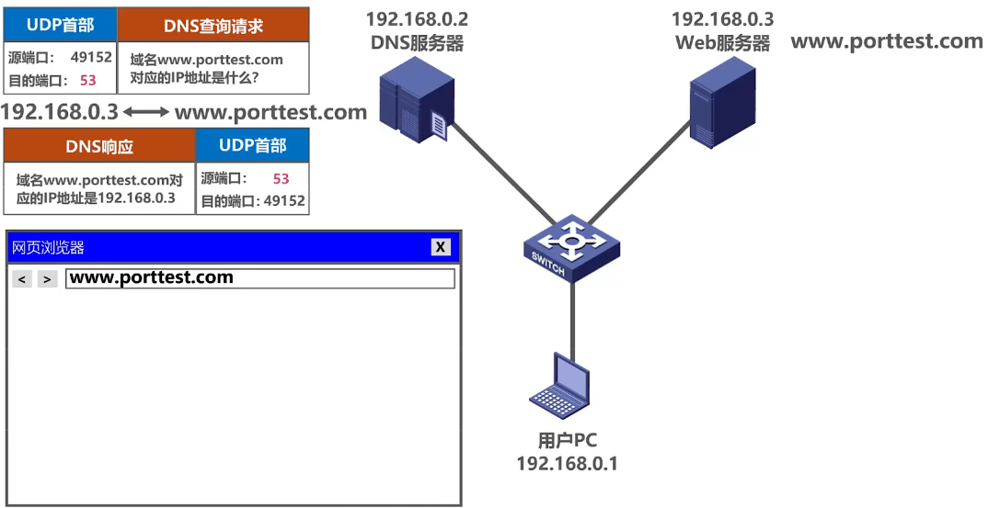
<!-- image-source: https://cdn.nlark.com/yuque/0/2026/png/67474974/1781617855774-2181f57d-654b-4fd9-80ae-42fb6bdf8e70.png -->

+ **PC 接收**：PC 收到报文后，根据目的端口 `49152` 将数据交付给 DNS 客户端进程，完成域名到 IP 的解析。

#### HTTP 访问阶段（基于 TCP）
+ **HTTP 请求**：PC 上的 HTTP 客户端进程（如浏览器）向 Web 服务器发起连接并请求首页。使用 TCP 封装，**源端口**选取一个新的短暂端口（如 `49153`，_注：TCP 与 UDP 端口空间独立，但操作系统通常会分配新的短暂端口_），**目的端口**为 HTTP 熟知端口 `80`。


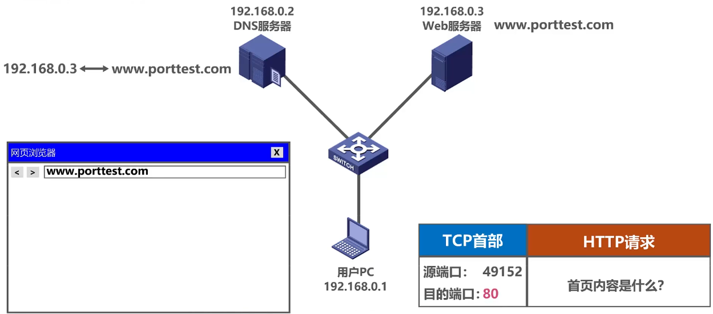
<!-- image-source: https://cdn.nlark.com/yuque/0/2026/png/67474974/1781617900536-a54e6540-682d-40b5-aa8d-9f675da551a7.png -->

+ **HTTP 响应**：Web 服务器收到报文后，根据目的端口 `80` 将数据交付给 HTTP 服务端进程。处理后返回响应报文（包含首页内容）。使用 TCP 封装，**源端口**为 `80`，**目的端口**为 PC 的短暂端口 `49153`。


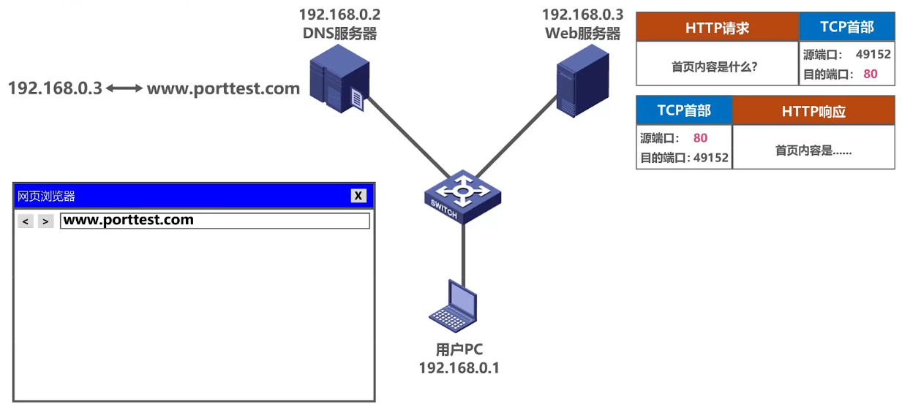
<!-- image-source: https://cdn.nlark.com/yuque/0/2026/png/67474974/1781617930569-248da5e6-71c6-444f-bb70-16c7f821a7f2.png -->

+ **PC 接收**：PC 收到报文后，根据目的端口 `49153` 将数据交付给 HTTP 客户端进程，浏览器渲染并显示首页内容。

---

### 6.补充：端口与网络编程
在C++中，进行 Socket 网络编程时，对端口号的理解将直接体现在 API 的调用中：

1. **服务端的端口绑定（Bind）**  
在服务端开发中，创建 Socket 后必须调用 `bind()` 函数，将 Socket 与特定的**IP 地址**和**熟知端口（或登记端口）** 进行绑定，随后调用 `listen()` 监听该端口。
    - _工程实践_：服务端重启时，由于 TCP 的 `TIME_WAIT` 状态，熟知端口可能无法立即被重新绑定。通常需要在 `bind()` 前通过 `setsockopt()` 设置 `SO_REUSEADDR` 选项以允许端口复用。
2. **客户端的隐式绑定**  
在客户端开发中，通常只需调用 `socket()` 和 `connect()`。在调用 `connect()` 发起三次握手时，操作系统内核会自动为其分配一个未被占用的**短暂端口**作为源端口，开发者无需手动调用 `bind()`。
3. **多路复用 I/O（I/O Multiplexing）**  
在后端高并发服务器开发中，常使用 `epoll`（Linux）或 `select/poll` 等 I/O 多路复用技术。需要注意的是，**I/O 多路复用**（监控多个 Socket 描述符的读写事件）与运输层的**复用/分用**（多个进程共享网络协议栈）是两个不同层面的概念，在系统设计与面试中需严格区分。

## 三、UDP和TCP对比（重点）
### 1.协议概述
UDP（User Datagram Protocol，用户数据报协议）与 TCP（Transmission Control Protocol，传输控制协议）是 TCP/IP 体系结构运输层的两个核心协议。在基于 TCP/IP 的网络通信中，二者的使用频率仅次于网际层的 IP 协议。应用层协议根据业务需求选择依赖 UDP 或 TCP 提供的传输服务。


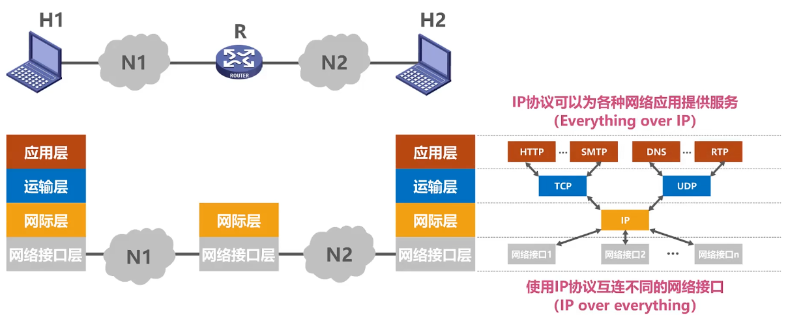
<!-- image-source: https://cdn.nlark.com/yuque/0/2026/png/67474974/1781618030767-3a854da8-6942-4ebf-937d-b06e655f9c41.png -->

### 2.核心特性对比
#### （1）连接特性
| 特性 | UDP | TCP |
| :--- | :--- | :--- |
| **连接模式** | 无连接 | 面向连接 |
| **通信前准备** | 无需建立连接，可随时发送数据 | 需通过**三次握手**建立逻辑连接 |
| **通信后释放** | 无需释放连接 | 需通过**四次挥手**释放连接 |
| **连接本质** | - | 逻辑连接（非物理链路），维护状态信息 |


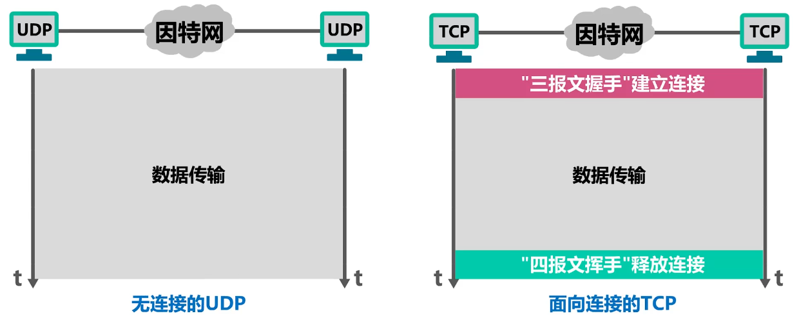
<!-- image-source: https://cdn.nlark.com/yuque/0/2026/png/67474974/1781618112134-27e7490a-e206-4f11-b3ce-fa7070ce3124.png -->

> **说明**：三次握手与四次挥手属于 TCP 的连接管理机制，过程较为复杂，涉及序列号同步、状态迁移等，将在后续课程中详细讲解。
>

#### （2）通信模式支持
| 通信模式 | UDP | TCP |
| :--- | :---: | :---: |
| **单播（一对一）** | ✓ | ✓ |
| **多播（一对多）** | ✓ | ✗ |
| **广播（一对全）** | ✓ | ✗ |


+ **UDP**：支持单播、多播与广播，适用于服务发现、实时媒体分发等场景。


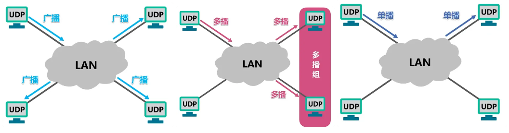
<!-- image-source: https://cdn.nlark.com/yuque/0/2026/png/67474974/1781618198534-6064ec93-6c5c-45d9-ac33-893965f98b8e.png -->

+ **TCP**：仅支持点对点单播通信，通信双方通过唯一的逻辑连接进行数据交换。


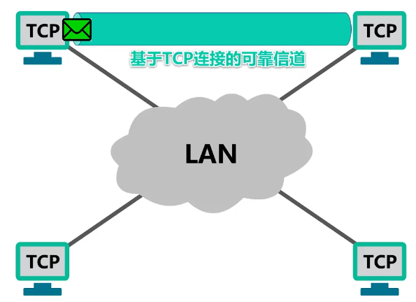
<!-- image-source: https://cdn.nlark.com/yuque/0/2026/png/67474974/1781618243859-0e20a653-3055-4072-8794-cf8df75c2e11.png -->


#### （3）应用层数据处理方式
| 特性 | UDP | TCP |
| :--- | :--- | :--- |
| **数据视图** | 面向**应用报文**（Message-Oriented） | 面向**字节流**（Stream-Oriented） |
| **报文边界** | 保留应用层报文边界，不合并、不拆分 | 不保留边界，视为无结构字节序列 |
| **交付保证** | 接收方应用进程收到的报文与发送方一一对应 | 接收方应用进程收到的字节流内容与发送方一致，但数据块划分可能不同 |


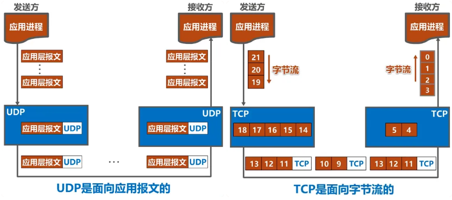
<!-- image-source: https://cdn.nlark.com/yuque/0/2026/png/67474974/1781618424218-8d4a6d7b-011b-4c2f-86b8-23944ecfa2e6.png -->

> **工程提示**：使用 TCP 时，应用层需设计协议帧格式（如长度字段、分隔符）以解决粘包/拆包问题；UDP 则天然保留消息边界，适用于定长或自带长度字段的协议设计。
>

#### （4）传输可靠性
| 特性 | UDP | TCP |
| :--- | :--- | :--- |
| **服务类型** | 无连接、不可靠传输 | 面向连接、可靠传输 |
| **差错处理** | 仅通过校验和检测误码，发现错误直接丢弃，无重传机制 | 通过确认应答、超时重传、序列号等机制保障数据不丢失、不重复、按序到达 |
| **流量控制** | 无 | 滑动窗口机制 |
| **拥塞控制** | 无 | 慢启动、拥塞避免、快重传、快恢复 |
| **适用场景** | 实时音视频、在线游戏、DNS 查询等容忍少量丢包、追求低延迟的场景 | 文件传输、网页浏览、邮件收发等要求数据完整可靠的场景 |


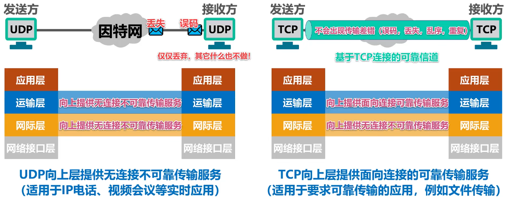
<!-- image-source: https://cdn.nlark.com/yuque/0/2026/png/67474974/1781618541044-2da21cc1-4a38-48da-b2ae-cea105fad4b2.png -->

> **补充**：尽管网际层 IP 协议本身提供不可靠服务，但 TCP 在运输层通过复杂的状态机与算法，向上层屏蔽了底层网络的不可靠性，实现了端到端的可靠传输。
>

#### （5）首部格式与开销
**UDP 用户数据报首部（固定 8 字节）**：


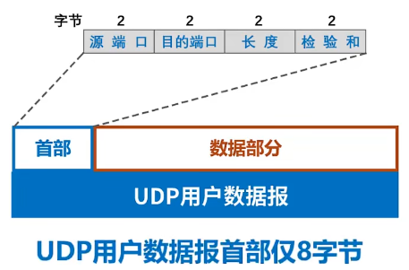
<!-- image-source: https://cdn.nlark.com/yuque/0/2026/png/67474974/1781618577418-934c7786-5ac2-43d4-952d-fe20403bc0a9.png -->

+ 字段简洁：源端口、目的端口、长度、校验和，各占 2 字节。
+ 开销低：适用于对头部开销敏感的高频小报文场景。

**TCP 报文段首部（最小 20 字节，最大 60 字节）**：


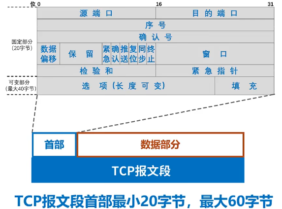
<!-- image-source: https://cdn.nlark.com/yuque/0/2026/png/67474974/1781618602000-e5a90143-8cc6-45e2-8bba-8954dff47f3b.png -->

+ 字段丰富：包含序列号、确认号、窗口大小、标志位（SYN/ACK/FIN 等）、选项等，支撑连接管理、可靠传输、流量与拥塞控制。
+ 开销较高：适用于对可靠性要求高于头部开销的场景。

### 3.协议选型建议
| 评估维度 | 优先选择 UDP | 优先选择 TCP |
| :--- | :--- | :--- |
| **数据可靠性要求** | 可容忍少量丢包（如实时监控） | 要求 100% 数据完整（如订单交易） |
| **时延敏感度** | 极低时延优先（如游戏同步） | 可接受适度延迟换取可靠性 |
| **通信模式** | 需广播/多播（如服务发现） | 仅需点对点通信 |
| **协议设计复杂度** | 应用层需自行实现重传、排序等逻辑 | 内核协议栈已实现可靠传输，开发成本低 |
| **连接管理开销** | 无连接状态，适合海量短连接 | 需维护连接状态，适合长连接或连接池 |


**C++ 网络编程实践提示**：

1. **Socket API 差异**：
    - UDP：`socket(AF_INET, SOCK_DGRAM, 0)` + `sendto()`/`recvfrom()`
    - TCP：`socket(AF_INET, SOCK_STREAM, 0)` + `connect()`/`listen()`/`accept()` + `send()`/`recv()`
2. **缓冲区管理**：
    - TCP 需注意发送/接收缓冲区的调优（`SO_SNDBUF`/`SO_RCVBUF`），避免缓冲区满导致阻塞。
    - UDP 需控制单次发送报文大小（通常 ≤ 1472 字节，避免 IP 分片）。
3. **并发模型**：
    - UDP 服务端通常采用单 Socket + 多线程/协程处理不同客户端报文。
    - TCP 服务端常结合 `epoll`/`IOCP` 实现高并发连接管理。

### 4.内容小结
| 对比项 | UDP | TCP |
| :--- | :--- | :--- |
| **连接性** | 无连接 | 面向连接 |
| **通信模式** | 单播/多播/广播 | 仅单播 |
| **数据视图** | 面向报文 | 面向字节流 |
| **可靠性** | 不可靠（尽力交付） | 可靠（确认重传、有序交付） |
| **流量/拥塞控制** | 无 | 有 |
| **首部开销** | 8 字节（固定） | 20~60 字节（可变） |
| **典型应用** | DNS、DHCP、音视频流、游戏 | HTTP、HTTPS、FTP、SMTP、SSH |


> **注**：TCP 的流量控制与拥塞控制机制较为复杂，涉及滑动窗口、慢启动、拥塞避免等算法，将在后续课程中专题讲解。
>

---

## 四、TCP的流量控制
### 1.流量控制的基本概念
在计算机网络通信中，若发送方的数据发送速率过快，接收方可能因处理能力不足或接收缓存溢出而来不及接收，从而导致数据丢失。**流量控制（Flow Control）** 的核心目的就是**抑制发送方的发送速率，确保接收方能够及时处理并接收数据**。

在 TCP 协议中，流量控制是通过**滑动窗口（Sliding Window）机制**来实现的。接收方通过在 TCP 报文段首部中的**窗口（Window）字段**（通常称为接收窗口，rwnd）告知发送方自己当前的剩余接收能力，发送方据此动态调整自己的发送窗口大小。

> **注**：TCP 发送方的实际发送窗口大小由接收窗口（rwnd）和拥塞窗口（cwnd）共同决定，公式为：`发送窗口 = min(rwnd, cwnd)`。本节主要聚焦于由接收方主导的流量控制（即 rwnd 的变化），暂不深入探讨拥塞控制。
>

---

### 2.基于滑动窗口的流量控制过程（实例解析）
假设主机 A（发送方）与主机 B（接收方）已建立 TCP 连接。主机 A 向主机 B 发送数据，每个 TCP 报文段携带 100 字节的数据。

#### 初始状态与数据发送
+ **初始窗口**：建立连接时，主机 B 告知主机 A 其接收窗口 `rwnd = 400`。主机 A 随即将自己的发送窗口设置为 400 字节。这意味着在未收到确认的情况下，A 最多可发送 400 字节的数据。
+ **数据发送**：
    - A 发送序号 `1~100` 的报文段（SEQ=1）。
    - A 发送序号 `101~200` 的报文段（SEQ=101）。
    - A 发送序号 `201~300` 的报文段（SEQ=201），**但该报文段在网络传输中丢失**。
    - 此时，A 的发送窗口内还有 100 字节的额度（301~400）可供发送。


<!-- image-source: https://cdn.nlark.com/yuque/0/2026/png/67474974/1781703250003-acb41362-46d6-457e-9712-7cbd8cce341a.png -->

#### 累积确认与窗口滑动
+ **接收方确认**：主机 B 收到了前两个报文段，发现序号 201 的报文段未到达。B 对 201 之前的数据进行**累积确认**，发送确认报文：
    - `ACK = 201`：表示序号 201 之前的数据（即 1~200）已全部正确接收，期望下次收到序号从 201 开始的数据。
    - `rwnd = 300`：B 根据自身缓存情况，将接收窗口调整为 300。
+ **发送方窗口滑动**：
    - A 收到确认后，将发送窗口向前滑动，移出已确认的 `1~200` 字节数据，并从发送缓存中删除这些数据。
    - A 根据 B 提供的 `rwnd = 300`，将发送窗口大小调整为 300 字节。
    - 此时，A 的发送窗口覆盖序号 `201~500`。其中 `201~300` 为已发送但未确认的数据（等待超时重传），`301~500` 为允许发送的新数据。
+ **继续发送与重传**：
    - A 继续发送 `301~400` 和 `401~500` 的报文段。此时发送窗口额度耗尽，暂停发送新数据。
    - 随后，`201~300` 报文段的重传计时器超时，A 重新发送该报文段。


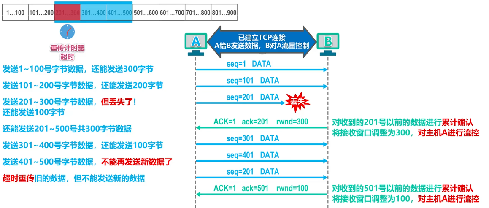
<!-- image-source: https://cdn.nlark.com/yuque/0/2026/png/67474974/1781703443814-bfddb8bf-561a-4b65-9bb1-6494edb05f57.png -->

#### 零窗口与发送暂停
+ **第二次确认**：B 收到重传的 `201~300` 报文段后，数据按序到达。B 发送累积确认：`ACK = 501`，并调整 `rwnd = 100`。
+ **窗口再次滑动**：A 收到确认，删除缓存中 `201~500` 的数据，发送窗口滑动至 `501~600`（大小为 100）。A 发送 `501~600` 的报文段后，窗口额度再次耗尽。
+ **零窗口通知**：B 收到 `501~600` 后，发送确认报文：`ACK = 601`，并调整 `rwnd = 0`。
+ **发送暂停**：A 收到零窗口通知，将发送窗口调整为 0。此时 A **不能再发送普通的 TCP 数据报文段**，流量控制生效，A 进入等待状态。


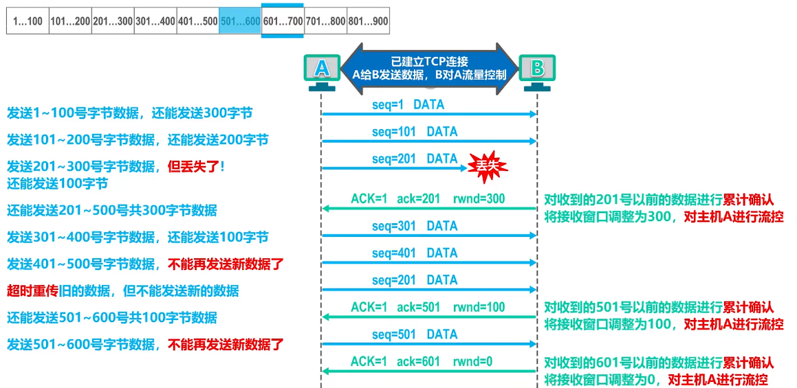
<!-- image-source: https://cdn.nlark.com/yuque/0/2026/png/67474974/1781703524780-4252749d-3c12-4164-a93b-2036e16eb0e0.png -->

---

### 3.零窗口死锁问题与持续计时器
#### 死锁的产生场景
当主机 B 发送 `rwnd = 0` 的报文后，若其应用层随后从接收缓存中读取了部分数据，腾出了存储空间，B 会向 A 发送一个窗口更新报文（如 `rwnd = 300`）。  
**风险**：如果这个窗口更新报文在网络中**丢失**，主机 A 将一直等待非零窗口通知而拒绝发送数据；主机 B 则一直等待 A 发送数据以触发新的确认。双方互相等待，形成**死锁（Deadlock）**。


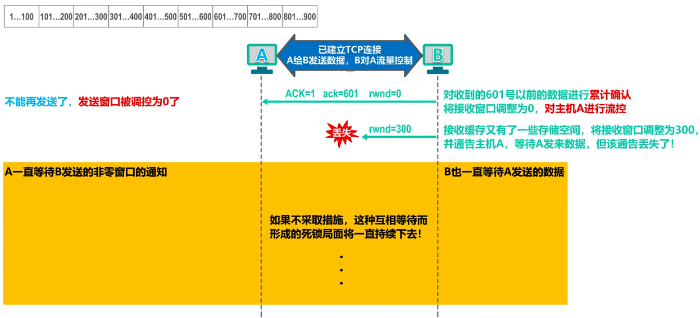
<!-- image-source: https://cdn.nlark.com/yuque/0/2026/png/67474974/1781703688609-f8922be2-76ec-418b-9df7-5f297fb79dd8.png -->

#### 持续计时器（Persist Timer）机制
为了防止死锁，TCP 为每个连接引入了**持续计时器**：

+ 当发送方（A）收到接收方（B）的**零窗口通知**时，立即启动持续计时器。
+ 若计时器超时，A 会向 B 发送一个**零窗口探测报文段（Zero-Window Probe）**，该报文段仅携带 **1 字节**的数据。
+ B 收到探测报文后，必须在确认报文中返回当前的 `rwnd` 值：
    - 若 `rwnd` 仍为 0，A 重启持续计时器，等待下次超时再探测。
    - 若 `rwnd` 大于 0，死锁被打破，A 恢复数据发送。


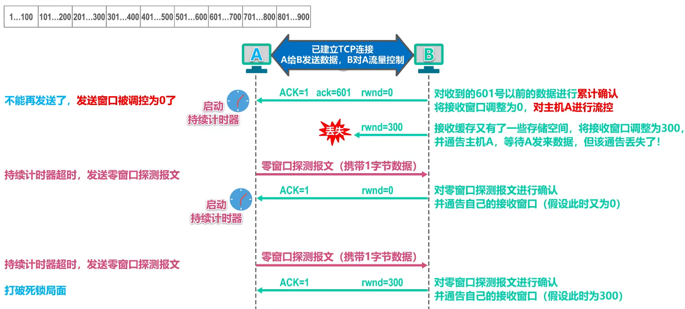
<!-- image-source: https://cdn.nlark.com/yuque/0/2026/png/67474974/1781703816957-126a63a6-24b4-4439-8b2e-00a2a48aad72.png -->

#### 零窗口探测报文的特殊规定与丢失处理
+ **强制接收规定**：TCP 协议明确规定，即使接收窗口为 0，接收方也**必须**接收并处理以下三类报文：
    1. 零窗口探测报文段
    2. 确认报文段（ACK）
    3. 携带紧急数据（Urgent Data）的报文段
+ **探测报文丢失处理**：如果零窗口探测报文段在网络中丢失，**持续计时器**会采用指数退避算法再次超时，并触发探测报文的重传，从而保证死锁最终能够被打破。（_注：此处由持续计时器本身控制重传，而非普通的数据重传计时器 RTO_）。

---

### 4.考研真题解析

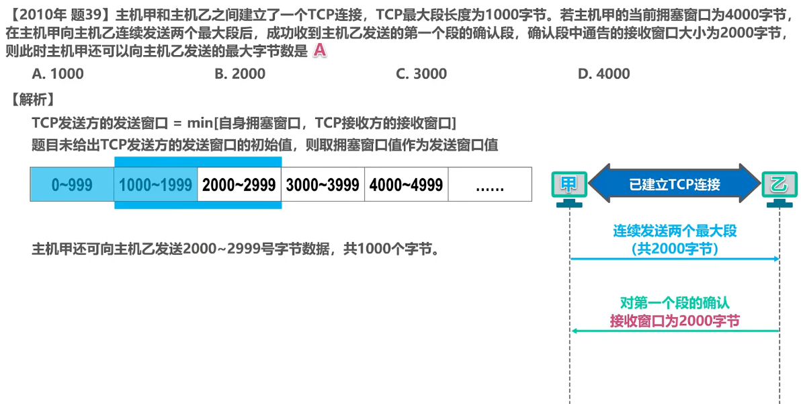
<!-- image-source: https://cdn.nlark.com/yuque/0/2026/png/67474974/1781703969197-04c8c194-2cf7-44d8-a897-27c57c597130.png -->  
主机甲向主机乙发送数据。甲的初始发送窗口为 4000 字节（本题假设忽略拥塞控制限制，或认为初始拥塞窗口足够大，发送窗口仅受限于初始设定）。甲连续发送两个最大报文段，共 2000 字节（序号 `0~999` 和 `1000~1999`）。乙对第一个报文段进行确认，并在确认报文中告知当前接收窗口 `rwnd = 2000` 字节。  
**问题**：甲此时还能向乙发送多少字节的数据？

**解析过程**：

1. **初始发送**：甲发送了序号 `0~1999` 的数据，共 2000 字节。
2. **确认与窗口滑动**：甲收到乙对第一个报文段（`0~999`）的累积确认（`ACK = 1000`）。甲的发送窗口左边界滑动至 1000。
3. **窗口大小更新**：根据乙返回的 `rwnd = 2000`，甲将发送窗口大小调整为 2000 字节（假设 cwnd 仍大于 2000）。
4. **计算剩余可发送量**：
    - 当前发送窗口覆盖的序号范围为：`1000 ~ 2999`（共 2000 字节）。
    - 窗口内**已发送但未确认**的数据为第二个报文段：`1000 ~ 1999`（共 1000 字节）。
    - **还能发送的数据量** = 窗口总大小 - 已发送未确认数据 = 2000 - 1000 = **1000 字节**（即序号 `2000 ~ 2999` 的数据）。

**答案**：1000 字节（对应原题选项 A）。

---

### 5.补充：后端开发视角下的流量控制实践
在实际的网络编程与系统调优中，理解 TCP 流量控制具有以下实战意义：

1. **接收缓冲区与** `rwnd` **的关系**
    - 操作系统内核为每个 TCP Socket 维护了一个**接收缓冲区（Receive Buffer）**。`rwnd` 的大小本质上反映了该缓冲区的剩余可用空间。
    - 当应用层（如你的 C++ 服务端程序）调用 `recv()` 或 `read()` 读取数据的速度**慢于**网络数据到达的速度时，接收缓冲区会被填满，内核会自动将 `rwnd` 缩减，甚至发送 `Zero Window` 报文。
    - **优化手段**：若发现服务端吞吐量上不去，可通过 `setsockopt()` 调整 `SO_RCVBUF` 增大接收缓冲区，或优化应用层业务逻辑，加快 Socket 数据的消费速度。
2. **网络抓包与故障排查**
    - 在生产环境中，若客户端反馈下载慢或请求延迟高，可使用 `tcpdump` 或 `Wireshark` 抓包。
    - 若过滤出大量的 `TCP ZeroWindow` 和随后的 `TCP Window Update` 报文，通常意味着**接收端的应用层处理出现了瓶颈**（如数据库查询慢、锁竞争导致读取 Socket 阻塞），而非网络本身的带宽问题。
3. **粘包/拆包与流量控制的关联**
    - 由于 TCP 是面向字节流的，且发送窗口大小动态变化，发送方可能会将多个应用层消息合并在一个 TCP 报文段中发送（粘包），或者将一个消息拆分到多个报文段中（拆包）。
    - **工程实践**：在 C++ 后端开发中，必须在应用层设计明确的**协议帧边界**（如 `Header(Length) + Body` 格式），并在接收端通过状态机或循环读取来正确拼装完整的业务消息，而不能依赖 TCP 报文段的边界。

---

## 五、TCP的拥塞控制
### 1.拥塞控制的基本概念
在计算机网络中，若在某段时间内对网络中某一资源的需求超过了该资源所能提供的可用部分，网络性能就会显著下降，这种情况称为**拥塞（Congestion）**。网络资源主要包括链路容量、交换节点的缓存和处理机等。若出现拥塞且不加以控制，整个网络的吞吐量将随输入负载的增大而急剧下降。

通过“吞吐量 vs 输入负载”曲线可以直观理解拥塞控制的作用：

+ **理想拥塞控制**：在吞吐量达到网络饱和之前，吞吐量等于输入负载（呈 45 度斜线）；达到饱和后，吞吐量维持在最大值（水平线），多余的输入负载被合理丢弃或限制。
+ **实际无控制网络**：随着输入负载增大，吞吐量增长率逐渐减小（轻度拥塞）；当负载达到某一临界值时，吞吐量反而随负载增大而下降（拥塞状态）；若负载继续增大，吞吐量可能降为零，导致网络**死锁**。


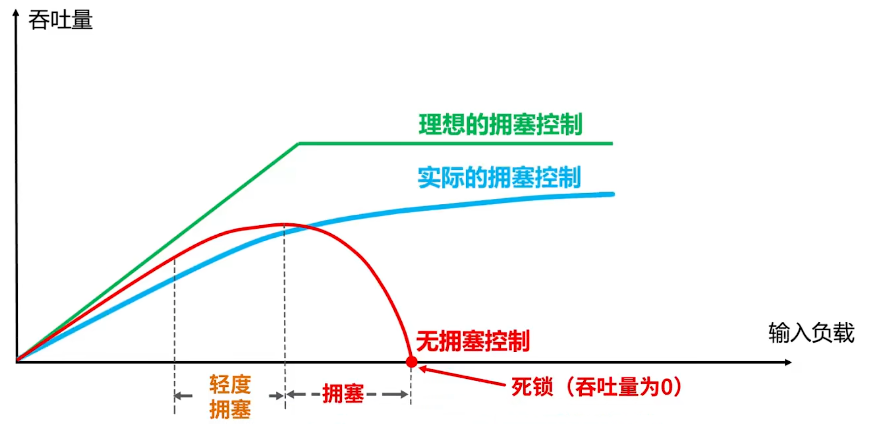
<!-- image-source: https://cdn.nlark.com/yuque/0/2026/png/67474974/1781704131764-e887befc-6602-449f-a166-d23684893c89.png -->

因此，拥塞控制的核心目的是使实际网络的吞吐量曲线尽量贴近理想曲线，防止网络崩溃。

---

### 2.拥塞控制算法的前提假设
为了聚焦于拥塞控制的核心机制，在理论分析时通常作以下简化假设：

1. **单向数据传输**：假设数据是单向传送的，反向链路仅传送确认报文（ACK）。
2. **接收方缓存无限大**：假设接收方总有足够大的缓存空间，即接收窗口（rwnd）不会成为瓶颈。此时，**发送方的发送窗口大小仅由拥塞窗口（cwnd）决定**（即 `发送窗口 = cwnd`）。
3. **以 MSS 为单位**：讨论问题时以 TCP 最大报文段（MSS）的个数为单位，而非字节。


<!-- image-source: https://cdn.nlark.com/yuque/0/2026/png/67474974/1781704260060-49017b13-0303-4b47-bdab-2e1579b96f79.png -->

> **核心状态变量**：
>
> + **拥塞窗口（cwnd）**：其值取决于网络的拥塞程度并动态变化。原则是：网络无拥塞则增大 cwnd，出现拥塞则减小 cwnd。判断拥塞的依据通常是**未按时收到确认（超时重传）** 或**收到重复确认**。
> + **慢开始门限（ssthresh）**：用于界定慢开始与拥塞避免算法的切换边界。
>

---

### 3.TCP 的四种拥塞控制算法
TCP 的拥塞控制主要包含四种算法：**慢开始（Slow Start）**、**拥塞避免（Congestion Avoidance）**、**快重传（Fast Retransmit）** 和**快恢复（Fast Recovery）**。

#### （1）慢开始与拥塞避免（Tahoe 版本，1988年）
+ **慢开始（Slow Start）**：
    - **触发条件**：`cwnd < ssthresh` 时执行。
    - **增长规则**：发送方每收到一个对新报文段的确认，就将 `cwnd` 加 1。这意味着在一个传输轮次（RTT）结束后，`cwnd` 的值会翻倍，呈**指数级增长**（1 -> 2 -> 4 -> 8...）。
    - **概念澄清**：“慢开始”并非指窗口增长速度慢，而是指在连接建立初期，向网络注入的报文段数量较少，避免瞬间冲垮网络。
+ **拥塞避免（Congestion Avoidance）**：
    - **触发条件**：`cwnd >= ssthresh` 时执行。
    - **增长规则**：每个传输轮次（RTT）结束后，`cwnd` 仅**线性加 1**。
    - **概念澄清**：“拥塞避免”并非指完全能避免拥塞，而是指在此阶段让窗口缓慢线性增长，使网络不至于过快进入拥塞状态。
+ **超时重传处理（严重拥塞判定）**：  
当发送方检测到超时重传时，认为网络发生了严重拥塞，采取以下措施：
    1. 将 `ssthresh` 更新为发生拥塞时 `cwnd` 值的一半（`ssthresh = cwnd / 2`）。
    2. 将 `cwnd` 重置为 1。
    3. 重新开始执行**慢开始**算法。


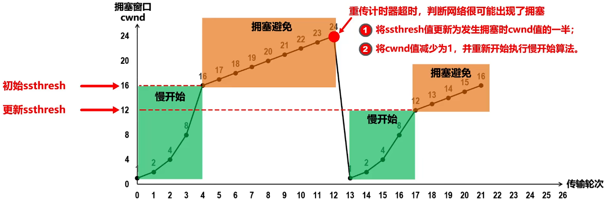
<!-- image-source: https://cdn.nlark.com/yuque/0/2026/png/67474974/1781704491788-a800b7e1-fa7e-44e3-989e-983ba09f5b96.png -->

#### （2）快重传与快恢复（Reno 版本，1990年）
在实际网络中，个别报文段的丢失可能只是因为链路偶发错误，而非全局拥塞。如果一律按超时重传处理并触发慢开始，会严重降低传输效率。

+ **快重传（Fast Retransmit）**：
    - **机制**：要求接收方在收到失序报文段时，**立即发送重复确认**（而不是等待发送数据时进行捎带确认）。
    - **触发**：发送方一旦连续收到 **3 个重复确认**，就认为该报文段丢失，**立即重传**丢失的报文段，而不等待重传计时器超时。


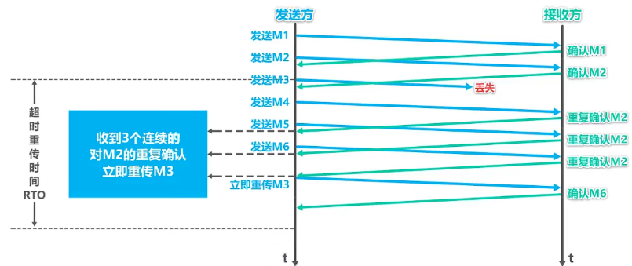
<!-- image-source: https://cdn.nlark.com/yuque/0/2026/png/67474974/1781704689101-a2622ac3-5cdb-4d16-91f6-8d3728e79152.png -->

- **收益**：可尽早发现丢包，使网络整体吞吐量提高约 20%。

+ **快恢复（Fast Recovery）**：
    - **机制**：发送方收到 3 个重复确认时，认为网络只是个别丢包，并未发生严重拥塞（因为有 3 个报文已经安全离开网络，缓存在接收方）。因此，**不启动慢开始**，而是执行快恢复。
    - **状态调整**：
        1. 将 `ssthresh` 更新为当前 `cwnd` 的一半（`ssthresh = cwnd / 2`）。
        2. 将 `cwnd` 设置为新的 `ssthresh` 值（部分实现如 NewReno 会设置为 `ssthresh + 3`）。
        3. 随后直接执行**拥塞避免**算法（线性增长）。


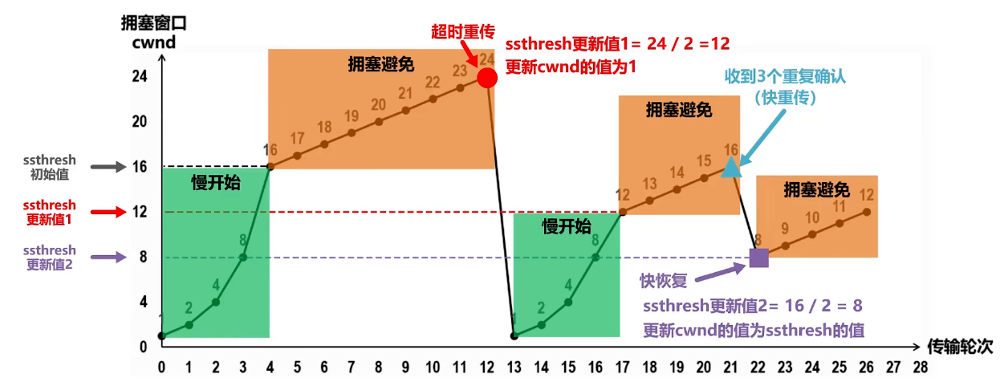
<!-- image-source: https://cdn.nlark.com/yuque/0/2026/png/67474974/1781704752124-38025258-b0d0-4329-9cab-7e4bd446e4e7.png -->

---

### 4.拥塞控制状态转换总结
| 触发事件 | 慢开始门限 (ssthresh) | 拥塞窗口 (cwnd) | 后续执行算法 |
| :--- | :--- | :--- | :--- |
| **连接初始化 / 超时重传** | `cwnd / 2` | `1` | 慢开始 |
| **收到 ACK (cwnd < ssthresh)** | 不变 | 每个 ACK 加 1 (指数增长) | 慢开始 |
| **收到 ACK (cwnd >= ssthresh)** | 不变 | 每个 RTT 加 1 (线性增长) | 拥塞避免 |
| **收到 3 个重复确认** | `cwnd / 2` | `ssthresh` (或 `ssthresh + 3`) | 拥塞避免 (快恢复) |


---

### 5.考研真题解析

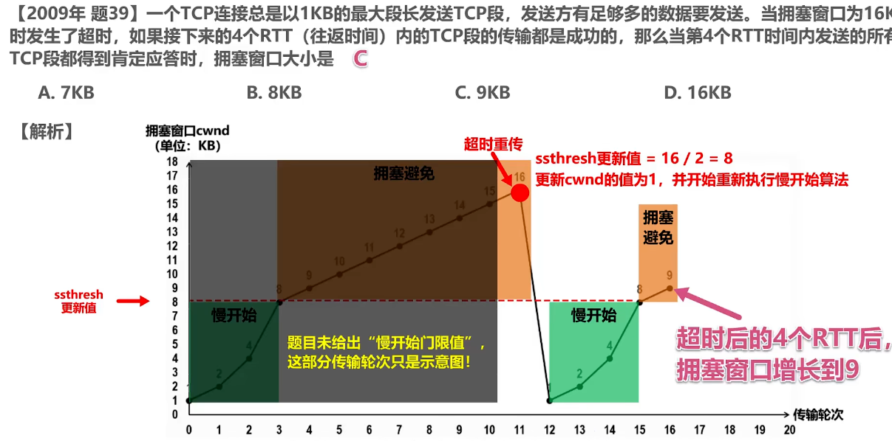
<!-- image-source: https://cdn.nlark.com/yuque/0/2026/png/67474974/1781704800471-311a5bfc-73f5-4079-a843-c683bc476e9d.png -->  
主机甲向主机乙发送数据，初始慢开始门限未知。当拥塞窗口增长到 `16 KB` 时，发生**超时重传**。问：在超时后的第 4 个往返时间（RTT/传输轮次）结束后，拥塞窗口的大小是多少？

**解析过程**：

1. **超时重传处理**：
    - 发生拥塞时的 `cwnd = 16 KB`。
    - 更新 `ssthresh = 16 / 2 = 8 KB`。
    - 重置 `cwnd = 1 KB`。
    - 开始执行**慢开始**算法。
2. **轮次推演**：
    - **第 1 个 RTT 结束**：`cwnd` 翻倍，变为 `2 KB`。（`2 < 8`，继续慢开始）
    - **第 2 个 RTT 结束**：`cwnd` 翻倍，变为 `4 KB`。（`4 < 8`，继续慢开始）
    - **第 3 个 RTT 结束**：`cwnd` 翻倍，变为 `8 KB`。（`8 == ssthresh`，下一轮转为拥塞避免）
    - **第 4 个 RTT 结束**：进入**拥塞避免**阶段，`cwnd` 线性加 1，变为 `8 + 1 = 9 KB`。

**答案**：`9 KB`（对应原题选项 C）。

---

### 6.补充：后端开发与系统调优视角下的拥塞控制
深入理解 TCP 拥塞控制对于高并发、大流量系统的网络调优至关重要。在实际生产环境中，需关注以下进阶知识：

**1. 拥塞控制算法的演进**

+ **CUBIC**：目前 Linux 内核默认的拥塞控制算法。它利用三次函数（Cubic Function）来调整窗口大小，在长肥网络（高带宽、高延迟）下比传统的 Reno 具有更好的带宽利用率。
+ **BBR (Bottleneck Bandwidth and Round-trip propagation time)**：由 Google 提出。传统的基于丢包的算法（如 CUBIC/Reno）在遇到随机丢包（如无线网络干扰）或浅缓存路由器时会误判为拥塞。BBR 不依赖丢包信号，而是通过探测网络的**最大带宽**和**最小 RTT** 来建立网络模型，从而在存在一定丢包率的网络中依然能跑满带宽，极大提升了吞吐量。

**2. 服务器内核参数调优**

在 Linux 后端服务器上，可以通过 `sysctl` 调整 TCP 拥塞控制相关参数：

+ **切换拥塞控制算法**：

```bash
# 查看当前系统支持的算法
sysctl net.ipv4.tcp_available_congestion_control
# 将默认算法修改为 BBR (需内核 >= 4.9)
sysctl -w net.ipv4.tcp_congestion_control=bbr
```

+ **初始拥塞窗口 (initcwnd)**：Linux 默认的初始 `cwnd` 为 10 个 MSS。对于短连接较多的 Web 服务（如 HTTP/HTTPS API），适当增大初始窗口（如通过 `ip route` 设置 `initcwnd 20`）可以显著减少首屏加载或首次请求的延迟。

**3. 丢包与拥塞的辩证看待**

在微服务架构或云原生环境中，跨机房通信可能会遇到偶发的网络抖动导致丢包。如果后端服务对延迟极其敏感（如实时竞价、高频交易），传统的 TCP 拥塞控制导致的窗口减半和重传等待可能无法满足 SLA。此时，部分核心系统会选择在 **UDP** 之上实现**应用层的可靠传输与自定义拥塞控制**（如 QUIC 协议），以绕过内核 TCP 协议栈的僵化限制，实现更精细的流量调度。

---

## 六、TCP的超时重传时间的选择
### 1.RTO 与 RTT 的基本关系
在 TCP 协议中，发送方发出数据后需要等待接收方的确认（ACK）。如果在一定时间内未收到确认，发送方就会重传该数据，这个等待时间被称为**超时重传时间（RTO, Retransmission Time-Out）**。而数据从发送方到达接收方，再由确认报文返回发送方所经历的时间，称为**往返时间（RTT, Round-Trip Time）**。

RTO 的设置大小直接影响 TCP 的传输效率：

+ **若 RTO < RTT**：会导致报文段在正常传输过程中被误判为丢失，引起**不必要的重传**，从而增大网络负荷。


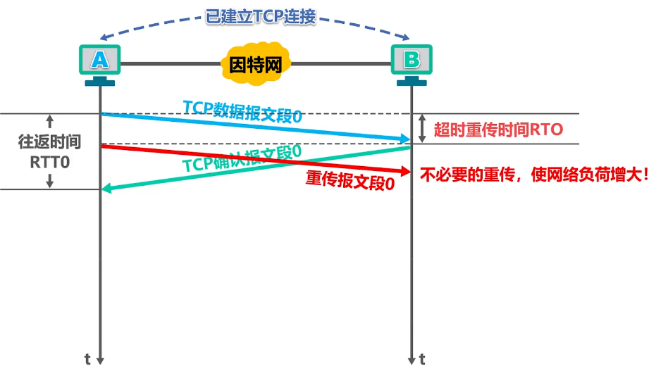
<!-- image-source: https://cdn.nlark.com/yuque/0/2026/png/67474974/1781792797156-78bf3570-b900-48c7-83ef-f310f22800f5.png -->

+ **若 RTO >> RTT**：当报文段真正丢失时，发送方需要等待很长时间才会触发重传，导致**重传推迟**，网络空闲时间增大，严重降低传输效率。


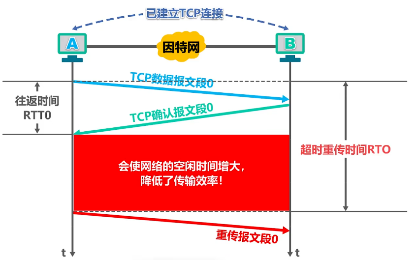
<!-- image-source: https://cdn.nlark.com/yuque/0/2026/png/67474974/1781792820930-cdc0c8a7-0965-437b-9225-5929b6cf645f.png -->

**基本结论**：RTO 的值应当**略大于** RTT 的值。然而，互联网环境极其复杂，报文段可能经过不同速率的链路和不同的路由，导致 RTT 是动态波动的。因此，不能直接使用单次测量的 RTT 样本，而需要通过算法计算平滑后的 RTT 值。

---

### 2.平滑往返时间（RTTs）与偏差（RTTd）的计算
为了得到平滑的往返时间，RFC 6298 标准推荐使用**指数加权移动平均（EWMA）** 算法来计算平滑往返时间（$RTT_S$）和 RTT 偏差的加权平均（$RTT_D$）。

**1. 平滑往返时间** $RTT_S$

+ **初始值**：当测量到第一个 RTT 样本时，$RTT_S = RTT_1$。
+ **更新公式**：以后每测量到一个新的 RTT 样本，按以下公式更新：

$$
RTT_S = (1 - \alpha) \times RTT_S + \alpha \times RTT_{new}
$$

- **参数说明**：$\alpha$ 的取值范围为 $0 \le \alpha < 1$。RFC 6298 推荐 $\alpha = 1/8 = 0.125$。
- **物理意义**：$\alpha$ 越小，新样本对 $RTT_S$ 的影响越小，结果越平滑；$\alpha$ 越接近 1，新样本的影响越大。


**2. RTT 偏差的加权平均** $RTT_D$

+ **初始值**：当测量到第一个 RTT 样本时，$RTT_D = RTT_1 / 2$。
+ **更新公式**：以后每测量到一个新的 RTT 样本，按以下公式更新：

$$
RTT_D = (1 - \beta) \times RTT_D + \beta \times |RTT_S - RTT_{new}|
$$

- **参数说明**：$\beta$ 的取值范围为 $0 \le \beta < 1$。RFC 6298 推荐 $\beta = 1/4 = 0.25$。


3. **超时重传时间 RTO 的计算**

得出 $RTT_S$ 和 $RTT_D$ 后，RTO 的计算公式为：

$$
RTO = RTT_S + 4 \times RTT_D
$$


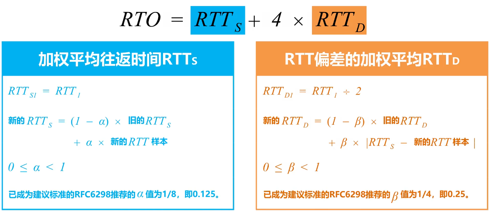
<!-- image-source: https://cdn.nlark.com/yuque/0/2026/png/67474974/1781793049212-f1933c53-69ef-4dd8-99c6-9b627bddd3bf.png -->

---

### 3.RTT 测量的二义性问题与 Karn 算法
在实际网络中，RTT 的测量并非总是准确的，尤其是在发生**超时重传**时，会产生**二义性问题**：

1. **场景一：报文段丢失导致重传**


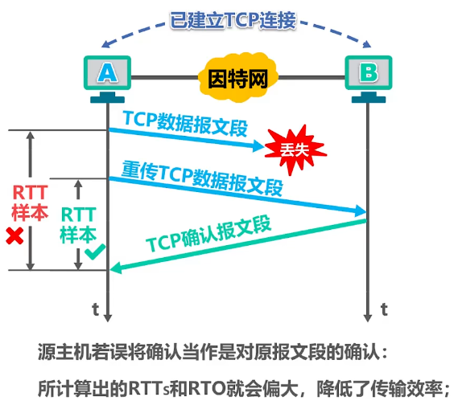
<!-- image-source: https://cdn.nlark.com/yuque/0/2026/png/67474974/1781793176249-cf39fa4b-9439-4564-9b0d-e14a1ba65ea6.png -->

- 发送方发送报文段 A，丢失后超时重传 A'。接收方收到 A' 后发送 ACK。
- 发送方收到 ACK 时，**无法判断这是对原报文 A 的确认，还是对重传报文 A' 的确认**。
- 若误认为是对 A 的确认，测得的 RTT 会包含超时等待时间，导致计算出的 RTT **偏大**，降低传输效率。

2. **场景二：ACK 迟到导致重传**


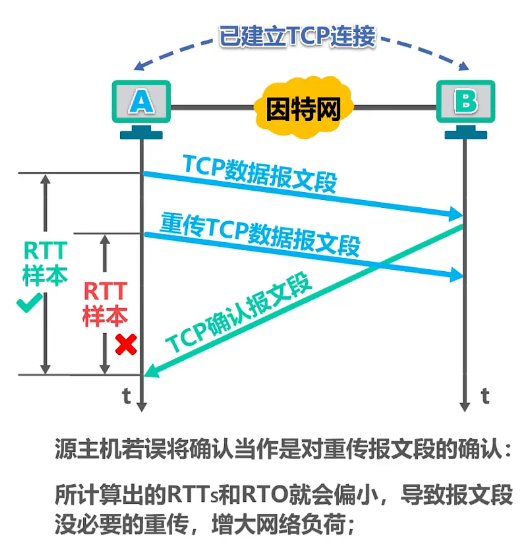
<!-- image-source: https://cdn.nlark.com/yuque/0/2026/png/67474974/1781793223325-ae956ba6-1ba6-47c9-b007-9bb18aa32769.png -->

- 发送方发送报文段 B，接收方发送 ACK，但 ACK 迟到导致发送方超时重传 B'。随后迟到的 ACK 到达。
- 发送方收到迟到的 ACK 时，若误认为这是对重传报文 B' 的确认，测得的 RTT 会**偏小**，导致后续 RTO 设置过小，引发不必要的重传。


**Karn 算法的解决方案**：  
	针对上述二义性问题，Karn 提出：**只要报文段发生了重传，就不采用其 RTT 样本**。即在计算 $RTT_S$ 和 $RTT_D$ 时，忽略重传报文段的 RTT，保持 RTO 不变。

---

### 4.指数退避机制（RTO 的修正）
Karn 算法虽然解决了二义性问题，但引入了新的缺陷：  
	如果网络延迟突然增大且持续（如网络拥堵），根据 Karn 算法，RTO 不会被更新。这会导致 RTO 始终小于实际的网络延迟，从而引发**反复超时重传**。

**修正方案（指数退避）**：  
为了应对网络延迟的突然增大，TCP 引入了**指数退避机制**：

+ 报文段每重传一次，就将 RTO 增大。
+ 典型做法是：**新 RTO = 旧 RTO × 2**。
+ 当收到有效的 ACK 后，退避机制取消，恢复正常的 RTO 计算逻辑。

---

### 5.RTO 计算实例推演
假设我们依次测量到 5 个 RTT 样本，计算过程如下：

1. **第 1 个样本 (**$RTT_1$**)**：
    - $RTT_{S1} = RTT_1$
    - $RTT_{D1} = RTT_1 / 2$
    - $RTO_1 = RTT_{S1} + 4 \times RTT_{D1}$
2. **第 2 个样本 (**$RTT_2$**)**：
    - $RTT_{S2} = (1 - 0.125) \times RTT_{S1} + 0.125 \times RTT_2$
    - $RTT_{D2} = (1 - 0.25) \times RTT_{D1} + 0.25 \times |RTT_{S2} - RTT_2|$
    - $RTO_2 = RTT_{S2} + 4 \times RTT_{D2}$
3. **第 3、4 个样本 (**$RTT_3, RTT_4$**)**：
    - 同理代入公式，依次计算出 $RTO_3$ 和 $RTO_4$。
4. **第 5 个样本 (**$RTT_5$**) 与超时重传**：
    - 假设在等待第 5 个样本的 ACK 时，基于 $RTO_4$ 的计时器超时，触发了重传。
    - 根据 **Karn 算法**，不采用 $RTT_5$ 更新 $RTT_S$ 和 $RTT_D$。
    - 根据 **指数退避机制**，新的超时时间直接翻倍：$RTO_5 = 2 \times RTO_4$。


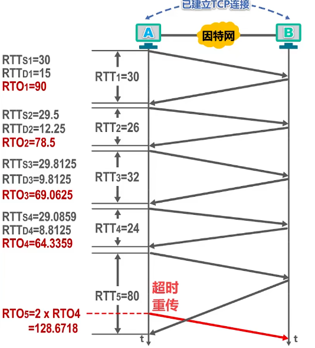
<!-- image-source: https://cdn.nlark.com/yuque/0/2026/png/67474974/1781793408262-677997cc-b51e-4cac-8584-2c0baa7071ca.png -->

---

### 6.补充：后端开发与系统底层视角下的超时重传
深入理解 TCP 超时重传机制对于排查线上网络抖动、优化弱网环境下的接口响应具有重要意义。在实际生产环境中，需关注以下进阶知识：

**1. TCP 时间戳选项（TCP Timestamps）**

Karn 算法的“忽略重传样本”是一种妥协方案。为了彻底解决 RTT 测量的二义性问题，现代 TCP 协议引入了 **TCP 时间戳选项（RFC 7323）**。

+ **原理**：发送方在 TCP 首部中记录发送时的时间戳，接收方在 ACK 报文中回显该时间戳。发送方收到 ACK 后，用当前时间减去回显时间戳，即可精确计算出该特定报文段的 RTT。
+ **优势**：即使发生重传，发送方也能准确区分是对原报文还是重传报文的确认，从而**在重传时依然可以更新 RTT 样本**，废弃了 Karn 算法的忽略策略。
+ **工程实践**：在 Linux 系统中，可通过 `sysctl net.ipv4.tcp_timestamps` 查看或开启此功能（通常默认开启）。

**2. RTO 的下限限制（TCP_RTO_MIN）**

在计算 $RTO = RTT_S + 4 \times RTT_D$ 时，如果网络极好（如局域网内），计算出的 RTO 可能非常小（如几毫秒）。但在广域网中，微小的网络抖动或接收方延迟发送 ACK（Delayed ACK）都可能导致误判超时。

+ **内核限制**：Linux 内核强制规定了 RTO 的最小值（`TCP_RTO_MIN`），通常为 **200ms**。这意味着即使计算出的 RTO 小于 200ms，内核也会将其限制在 200ms，以防止在轻微抖动时发生“伪超时”。
+ **优化手段**：在数据中心内部（同机房极低延迟环境），200ms 的超时时间显得过长。可以通过修改内核参数或应用层使用 DPDK/用户态协议栈来突破此限制。

**3. 现代重传优化：TLP 与 RACK**

传统的 RTO 超时重传（尤其是尾部丢包时）会导致长达 200ms 甚至更久的延迟。现代 Linux 内核（3.x/4.x 及以上）引入了更先进的机制来减少对 RTO 的依赖：

+ **TLP (Tail Loss Probe)**：在连接空闲或发送窗口末尾时，主动发送一个探测包，利用接收方返回的重复 ACK 来触发快速重传，避免陷入 RTO 超时。
+ **RACK (Recent ACK)**：基于时间而非单纯的 ACK 数量来判断丢包。如果某个报文段发送后经过了一定时间（基于 RTT 计算）仍未被确认，即使没有收到 3 个重复 ACK，也会判定其丢失并立即重传。
+ **后端启示**：在排查服务端接口偶尔出现的“毛刺”延迟时，若抓包发现大量 RTO 超时，可检查内核版本是否支持并开启了 TLP/RACK，这能显著改善弱网环境下的 P99 延迟。

---

## 七、TCP可靠传输的实现
### 1.基于字节流的滑动窗口机制
TCP 的可靠传输是基于**以字节为单位的滑动窗口**来实现的。为简化理论分析，通常假定数据在连接中进行单向传输（即发送方发送数据报文段，接收方返回确认报文段），这样讨论可聚焦于发送方的**发送窗口**与接收方的**接收窗口**。

---

### 2.发送窗口的构造与移动规则
**1.发送窗口的构造**

接收方通过 TCP 报文段首部中的字段向发送方反馈状态：

+ **确认号（ACK）**：例如值为 `31`，表示序号 `30` 及以前的数据已全部正确接收，期望收到下一个序号为 `31` 的数据。
+ **窗口（Window）**：例如值为 `20`，表示接收方当前的接收窗口尺寸为 20 字节。

发送方据此构造自己的发送窗口。在忽略网络拥塞控制（即假设拥塞窗口足够大）的前提下，发送方将**发送窗口尺寸设置为 20 字节**（序号 `31 ~ 50`）。在未收到新确认的情况下，发送方可将窗口内的数据依次全部发送。凡是已发送但未确认的数据，必须保留在发送缓存中以备超时重传。


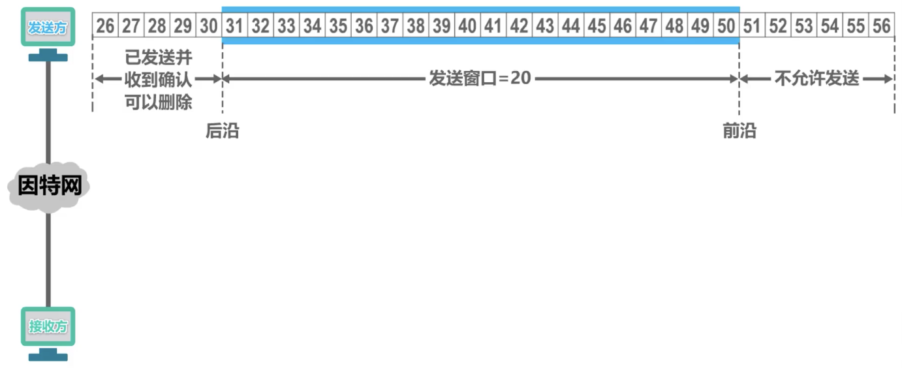
<!-- image-source: https://cdn.nlark.com/yuque/0/2026/png/67474974/1781842626070-33613874-b8e0-4dc2-b1b0-4bd91cd6919b.png -->

**2.发送窗口后沿的移动**

+ **不动**：未收到新的确认。
+ **向前移动**：收到了新的确认。
+ **不可能向后移动**：因为已收到的确认代表数据已被安全接收，不能被撤销。后沿后方的数据（已确认数据）可从发送缓存中删除。

**3. 发送窗口前沿的移动**

+ **向前移动**：收到新确认，且接收方通知的窗口大小未变或增大。
+ **不动**：未收到新确认且窗口大小未变；或收到新确认使窗口前移，但接收方通知的窗口缩小量恰好等于前移量。
+ **向后收缩**：接收方通知的窗口变小。**TCP 标准强烈不赞成窗口收缩**，因为发送方可能在收到缩小通知前，就已经发送了原窗口内的数据，强行收缩会导致协议状态混乱与错误。

---

### 3.发送窗口的状态维护
在底层网络协议栈或应用层模拟实现滑动窗口时，通常使用三个指针来精确维护发送窗口的状态：


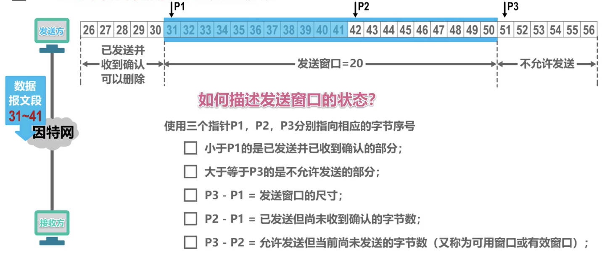
<!-- image-source: https://cdn.nlark.com/yuque/0/2026/png/67474974/1781842869012-f17d4fa9-e939-4b1e-b9a7-172af724e0ab.png -->

| 指针 | 含义 | 状态说明 |
| :--- | :--- | :--- |
| **P1** | 发送窗口后沿 | 指向已发送并收到确认的下一个字节（即未确认的最小序号）。`< P1` 的数据可从缓存删除。 |
| **P2** | 已发送未确认前沿 | 指向已发送但尚未收到确认的下一个字节（即允许发送但尚未发送的最小序号）。 |
| **P3** | 发送窗口前沿 | 指向当前允许发送的最后一个字节的下一个位置（即不允许发送的最小序号）。`>= P3` 的数据当前禁止发送。 |


**核心计算公式**：

+ **发送窗口尺寸** = `P3 - P1`
+ **已发送但未确认的字节数** = `P2 - P1`
+ **允许发送但尚未发送的字节数** = `P3 - P2`

---

### 4.接收窗口的处理与乱序数据管理
**1. 接收窗口的边界**

假设接收窗口尺寸为 20（序号 `31 ~ 50`）。


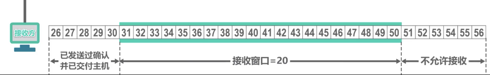
<!-- image-source: https://cdn.nlark.com/yuque/0/2026/png/67474974/1781843766674-1adec962-6f61-43ae-bba4-044bdffdff78.png -->

+ `<= 30` 的数据：已发送确认并交付给应用进程，从接收缓存中删除。
+ `31 ~ 50` 的数据：允许接收的窗口范围。
+ `>= 51` 的数据：超出接收窗口，当前不允许接收。

**2. 乱序数据的处理机制**

TCP 标准并未明确规定如何处理乱序到达的数据，但现代 TCP 实现通常选择**暂存而非丢弃**，以提高网络资源利用率，避免发送方不必要的重传。

+ **场景推演**：
    1. 接收方收到 `32`、`33` 号数据，但 `31` 号丢失或滞留。由于未按序到达，接收方将其**暂存于接收缓存**，并发送**重复确认**（确认号仍为 `31`，窗口仍为 `20`）。


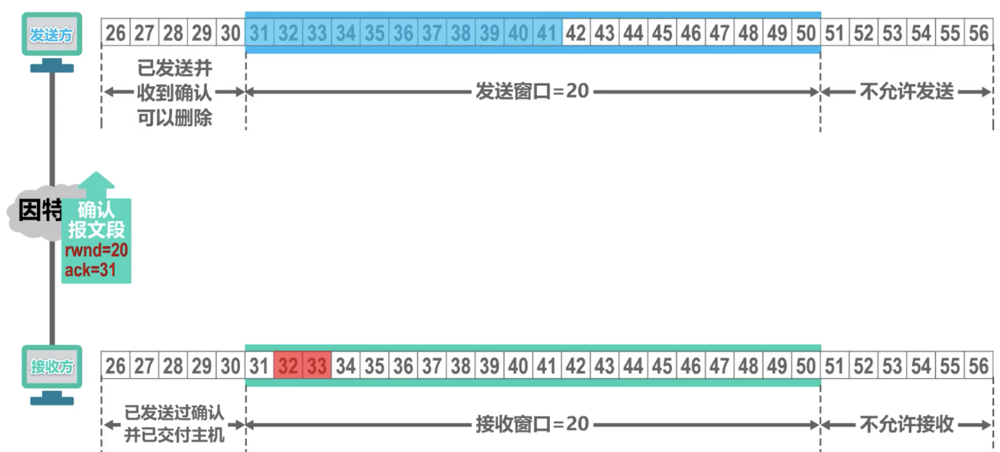
<!-- image-source: https://cdn.nlark.com/yuque/0/2026/png/67474974/1781843838737-1e95545d-cc08-42c1-9f2e-468da1921d3b.png -->

2. 当 `31` 号数据到达后，接收方将 `31 ~ 33` 号数据按序交付给应用进程，接收窗口向前滑动 3 个序号，并发送新的确认（确认号为 `34`）。


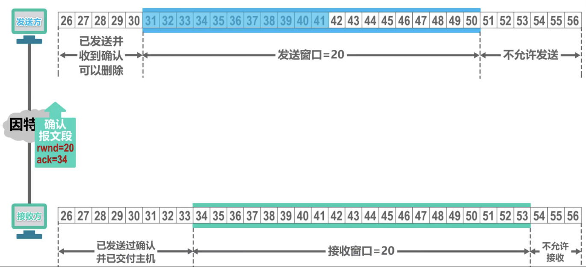
<!-- image-source: https://cdn.nlark.com/yuque/0/2026/png/67474974/1781848079655-2413f5f6-9505-4268-a275-305d05387070.png -->

3. 若后续收到 `37`、`38`、`40` 号等乱序数据，同样暂存于缓存，等待缺失的字节（如 `34~36`、`39`）到达后再一并交付。


---

### 5.TCP 可靠传输的核心补充说明
#### （1）发送窗口与接收窗口的差异
在同一时刻，发送方的发送窗口不一定等于接收方的接收窗口。原因包括：网络传输窗口值存在时间滞后；且发送方必须结合**拥塞窗口（cwnd）** 动态调整实际发送窗口（`发送窗口 = min(rwnd, cwnd)`）。

#### （2）TCP 的确认机制
TCP 的确认机制是其可靠传输的核心，主要包含以下三个层面的设计：

**1. 累积确认（Cumulative Acknowledgment）**

TCP 默认采用累积确认机制，即接收方仅对按序收到的最高序号进行确认，大幅减少确认报文的数量。接收方发送的确认号（ACK=N）表示：**序号 N-1 及之前的所有字节均已按序正确接收**，期望收到下一个序号为 N 的字节。

+ **特点**：即使接收方收到了 N 之后的乱序报文，只要 N 没到，ACK 依然停留在 N。

**2.乱序缓存与重复确认（Duplicate ACK）**

与理论上的 GBN 不同，**TCP 接收方不会丢弃乱序到达的报文段**，而是将其暂存在接收缓存中。

+ 当接收方收到一个乱序报文（例如期望 100，却收到了 200）时，它会缓存 200，并**再次发送 ACK=100**。
+ 发送方连续收到多个相同的 ACK（即**重复确认，Dup ACK**），就能敏锐地察觉到网络中可能发生了丢包或严重乱序。

**3.选择性确认（SACK, Selective Acknowledgment）**

纯粹的累积确认存在“盲点”：发送方只知道哪些数据没收到，但不知道哪些乱序数据已经安全到达接收方。

+ **SACK 机制**：接收方在 TCP 选项字段中附加 SACK 块，明确告知发送方“我已经收到了哪些不连续的字节区间”（例如：`ACK=100, SACK=[200-300], [400-500]`）。
+ **意义**：这使得发送方能够精确构建出接收方的“数据空洞”，从而避免不必要的重传。

**4.捎带确认（Piggybacking）**

接收方在发送自己的反向数据时，顺便将确认信息放入 TCP 首部。若无反向数据，可推迟发送确认（**延迟确认，Delayed ACK**），但**推迟时间不应超过 0.5 秒**，以免引发发送方不必要的超时重传。若收到一连串最大长度报文段，通常每隔一个报文段发送一次确认。

---

#### （3）TCP 的重传细节：重传所有还是指定重传？
针对“超时或丢包时，是重传 ACK 后的所有报文，还是指定某个报文重传”的问题，答案非常明确：**TCP 绝对不会盲目重传所有未确认报文，而是指定重传丢失或最早未确认的报文。**

**1. 超时重传（RTO 触发）**

+ **传统 TCP（无 SACK）**：当超时发生时，发送方**只重传发送窗口中最早未被确认的那个报文段**（即发送窗口后沿的第一个报文），而不是重传窗口内所有已发送的报文。
+ **现代 TCP（有 SACK）**：结合 SACK 信息，发送方知道哪些报文已经到达接收方。超时发生时，发送方会**重传 SACK 空洞中最前面的那个丢失报文**。

**2. 快速重传（Fast Retransmit 触发）**

+ 当发送方连续收到 **3 个重复的 ACK** 时，无需等待超时计时器到期，直接**指定重传该 ACK 所指示的那个丢失报文段**。
+ 若开启了 SACK，发送方甚至可以根据 SACK 块一次性重传多个确认丢失的报文段。

#### （4）全双工通信的独立性
TCP 是全双工协议，通信双方同时具备发送方和接收方的角色。因此，双方都独立维护各自的发送窗口和接收窗口，在分析网络行为时，必须明确窗口所属的主体。

---

### 6.数据链路层的可靠传输和传输层TCP可靠传输的区别
#### （1）数据链路层的可靠：相邻节点的“单跳交接”
+ **作用范围**：只负责**相邻两个节点**之间（比如：你的电脑 → 你的路由器，或者 路由器A → 路由器B）。
+ **主要应对**：物理线路上的干扰（如电磁干扰导致的比特翻转、信号衰减导致的帧丢失）。
+ **机制**：通常比较简单。发送方发一个“帧”，接收方校验（CRC）没问题就回一个“链路层 ACK”；如果超时没收到 ACK，或者校验出错，发送方就**立刻重传**这个帧。
+ **特点**：速度极快，延迟极低，因为它不需要跨越整个互联网，只在两个挨着的设备之间进行。

#### （2）传输层的 TCP：源到目的的“全程监控”
+ **作用范围**：负责**源主机到目的主机**的整个漫长路径（端到端）。它跨越了无数个路由器和不同类型的链路。
+ **主要应对**：网络层的不可靠性（如某个骨干路由器太忙了导致**拥塞丢包**、路由改变导致**数据包乱序**等）。
+ **机制**：极其复杂。除了确认和重传，TCP 还有**流量控制**（防止把接收方压垮）和**拥塞控制**（防止把整个互联网压垮）。
+ **特点**：视野是全局的，机制是复杂的，延迟相对较高。

#### （3）UDP 报文在数据链路层的可靠传输
当应用层发送一个 UDP 报文时，数据是这样往下走的：

1. **UDP** 给数据加上 UDP 首部。
2. **IP** 给 UDP 报文加上 IP 首部，变成 IP 数据报。
3. **数据链路层**（比如 Wi-Fi 网卡）给 IP 数据报加上 MAC 帧头和帧尾，变成 MAC 帧。

数据链路层的网卡在发送数据时，它**根本不看、也不认识**里面装的是 TCP 还是 UDP。在它眼里，这只是一个需要发送的“MAC 帧”。  
	如果你的电脑连着 Wi-Fi，Wi-Fi 协议（802.11）在链路层有重传机制。那么，**你的 UDP 报文在“电脑** $\rightarrow$ **路由器”这一跳，依然会享受 Wi-Fi 链路层的 ACK 和重传保护。** 如果这一跳因为信号不好丢了，Wi-Fi 网卡会自动帮你重传。

虽然链路层保护了 UDP 的“第一跳”，但链路层的保护是**有边界的**：

如果在路由器那里，因为网络太拥堵，路由器把你的 UDP 报文**直接丢弃了**。此时，**数据链路层无能为力**（因为报文已离开你的 Wi-Fi 链路了）。而 **UDP 协议本身又没有重传机制**，导致接收方永远收不到这个UDP报文，发送方也不知道。

#### （4）核心区别总结
| 对比维度 | 数据链路层可靠传输 (如 Wi-Fi MAC层) | 传输层 TCP |
| :--- | :--- | :--- |
| **保护范围** | **局部（单跳）**：只保证相邻两个设备间不丢。 | **全局（端到端）**：保证从源头到终点全程不丢。 |
| **应对的错误** | 物理信号干扰、单条链路偶尔丢帧。 | 路由器拥塞丢包、网络延迟导致乱序。 |
| **是否管“拥塞”** | **不管**。链路层不知道整个网络堵不堵。 | **管**。有复杂的拥塞控制算法（如慢启动）。 |
| **处理速度** | 极快（微秒/毫秒级），硬件直接处理。 | 较慢（毫秒/秒级），操作系统软件协议栈处理。 |


| 对比维度 | 回退 N 帧 (GBN) | 选择重传 (SR) | TCP 协议实际实现 |
| :--- | :--- | :--- | :--- |
| **接收方对乱序报文的处理** | **直接丢弃**，不缓存。 | **缓存**乱序报文，等待缺失报文到达后一并交付。 | **缓存**乱序报文（类似 SR）。 |
| **确认机制** | **累积确认**。只确认按序到达的最高序号。 | **独立确认**。对每个正确接收的报文单独发送 ACK。 | **累积确认 + SACK**。默认累积确认，通过 SACK 选项提供选择性确认信息。 |
| **超时重传策略** | **重传所有**已发送但未确认的报文（窗口内全量重传）。 | **仅重传**真正超时的单个报文。 | **仅重传**最早未确认的报文，或 SACK 指示丢失的报文（类似 SR）。 |
| **接收窗口限制** | 发送窗口 $\le 2^n - 1$。 | 发送窗口 + 接收窗口 $\le 2^n$。 | 窗口大小动态调整（受 rwnd 和 cwnd 限制），无严格的 $2^n$ 理论限制（通过时间戳防止序号绕回）。 |
| **协议本质** | 极端的保守策略，实现简单但带宽浪费大。 | 理想的精确策略，实现复杂（需维护大量定时器）。 | **GBN 与 SR 的工程折中与进化**。利用累积确认降低 ACK 开销，利用缓存和 SACK 实现精确重传。 |


TCP 在**确认方式**上偏向 GBN（累积确认减少了网络中的 ACK 报文数量），但在**接收方行为**和**重传策略**上高度偏向 SR（缓存乱序包、只重传丢失包）。引入 SACK 后，TCP 几乎完全具备了 SR 的精确重传能力。

> **注意：**
>
> 在现代的**有线以太网**（插网线）中，数据链路层其实**不做可靠传输**！它只做 CRC 校验，如果发现帧错了，**直接丢弃，绝不重传**。  
为什么？因为有线的误码率极低，如果让链路层去重传，反而会拖慢整个网络的速度。有线网络把“重传”的烂摊子全扔给了上层的 TCP。  
**但是**，在**无线网络（Wi-Fi、4G/5G）** 中，因为空气干扰大，误码率高，所以**链路层（MAC层）必须做可靠传输（有 ACK 和重传机制）**，否则网络根本没法用。
>

---

### 7.考研真题解析
#### 1. 2009年统考题 38

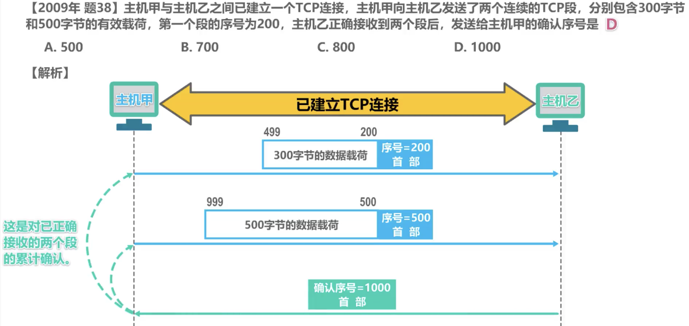
<!-- image-source: https://cdn.nlark.com/yuque/0/2026/png/67474974/1781850850497-5737c1a3-26c2-4674-9c63-bb6dd3cab158.png -->

**解析**：

+ 报文段 1：序号 200，数据 300 字节 $\rightarrow$ 字节范围 `200 ~ 499`。
+ 报文段 2：紧接其后，序号 500，数据 500 字节 $\rightarrow$ 字节范围 `500 ~ 999`。
+ 确认逻辑：乙对两个报文段进行累积确认，期望收到下一个字节 1000。  
**答案**：**确认号为 1000**（对应选项 D）。

#### 2. 2011年统考题 40

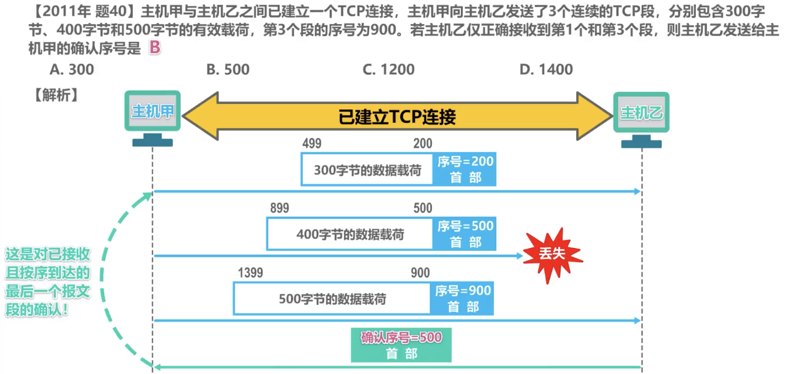
<!-- image-source: https://cdn.nlark.com/yuque/0/2026/png/67474974/1781851059185-718b5d03-cfa4-4833-a218-9a7a7b6d06e8.png -->

**解析**：

+ 报文段 3：序号 900，数据 500 字节 $\rightarrow$ 字节范围 `900 ~ 1399`。
+ 报文段 2：数据 400 字节，紧接在报文段 3 之前 $\rightarrow$ 序号 500，字节范围 `500 ~ 899`。
+ 报文段 1：数据 300 字节，紧接在报文段 2 之前 $\rightarrow$ 序号 200，字节范围 `200 ~ 499`。
+ 确认逻辑：乙收到了报文段 1 和 3，但报文段 2 丢失。TCP 只能对**按序到达**的最高序号进行累积确认。由于缺失 `500 ~ 899`，乙只能确认到报文段 1，期望收到的下一个字节是 500。  
**答案**：**确认号为 500**（对应选项 B）。

---

### 8.补充：后端开发视角下的可靠传输实践
深入理解 TCP 可靠传输的底层机制，对于优化高并发网络服务、排查线上延迟毛刺具有重要实战价值：

#### 1. 延迟确认（Delayed ACK）与 Nagle 算法的死锁陷阱
+ **Nagle 算法**：为了减少网络中的小报文，TCP 默认开启 Nagle 算法。其规则是：若发送缓存中有**已发送但未确认**的数据，则新产生的小数据必须积攒到一个 MSS（最大报文段长度）才能发送。
+ **冲突场景**：当应用层执行“写小块请求 -> 阻塞读响应”的交互逻辑时，写操作受限于 Nagle 算法无法发出（因为上一个包的 ACK 还没回来）；而服务端的读操作受限于**延迟确认**机制，没有反向数据时不立即发 ACK。这会导致客户端陷入长达 0.5 秒的等待，表现为接口偶发的高延迟。
+ **工程实践**：在交互式后端服务（如 RPC 框架、Redis、数据库连接）中，通常通过 `setsockopt` 设置 `TCP_NODELAY` 选项来**禁用 Nagle 算法**，确保小包立即发送。

#### 2. 乱序缓存（Out-of-Order Queue）与内存安全
+ 当接收端处理乱序数据时，内核需要分配额外的内存队列来暂存这些报文。
+ **安全风险**：在遭受恶意网络攻击（如攻击者故意发送大量乱序报文，但永远不发送缺失的“空洞”报文）时，可能导致接收端乱序队列膨胀，耗尽系统内存。现代 Linux 内核对此有严格的队列长度限制（如 `tcp_max_reordering`）和超时清理机制，后端开发者在调优内核参数时需权衡抗攻击能力与弱网环境下的吞吐量。

#### 3. 零拷贝（Zero-Copy）与发送窗口流转
+ 传统的 `send()` 系统调用需要将数据从用户态拷贝到内核态的 TCP 发送缓存（Send Buffer），再交由滑动窗口机制发送。
+ **性能优化**：在 C++ 高并发网关或文件服务器中，可结合 `sendfile`、`splice` 或 `io_uring` 等零拷贝技术，直接在内核态完成数据到 TCP 发送窗口的流转，极大降低 CPU 上下文切换与内存拷贝的开销。

---

## 八、TCP的运输连接管理（重点）
### 1.TCP 的运输连接管理概述
TCP 是面向连接的协议，基于运输连接来传送 TCP 报文段。TCP 运输连接的管理包含三个必不可少的阶段：

1. **连接建立**：通过“三次握手”建立逻辑连接。
2. **数据传送**：基于已建立的连接进行可靠的数据传输。
3. **连接释放**：数据传输结束后，通过“四次挥手”释放连接。


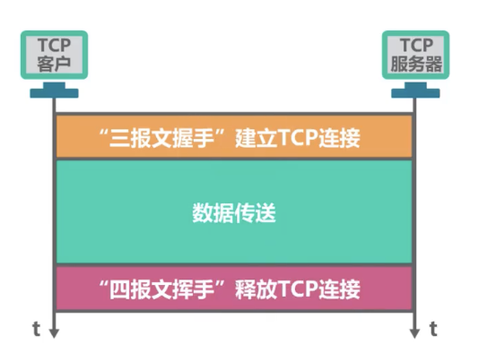
<!-- image-source: https://cdn.nlark.com/yuque/0/2026/png/67474974/1781851148533-0d85a9e7-38e1-4c49-9579-6aab0a2b66dc.png -->

TCP 连接管理的核心目标是确保连接的建立和释放都能正常、安全地进行，避免资源浪费与状态混乱。

---

### 2.TCP 连接的建立（三次握手）
#### （1）连接建立需解决的核心问题
在数据传输前，三次握手必须解决以下三个问题：

+ **确知对方的存在**：确保通信双方均在线且能够互相收发数据。
+ **协商通信参数**：协商最大窗口值、是否使用窗口扩大选项和时间戳选项、最大报文段长度（MSS）以及服务质量（QoS）等。
+ **分配运输实体资源**：双方为连接分配传输控制块（TCB）、发送/接收缓存、重传队列等系统资源。


<!-- image-source: https://cdn.nlark.com/yuque/0/2026/png/67474974/1781851252431-d50c1a90-3d07-4d7d-9675-1dd2d90d9694.png -->

#### （2）三次握手详细过程与状态变迁
假设主机 A（TCP 客户端）主动向主机 B（TCP 服务端）发起连接。


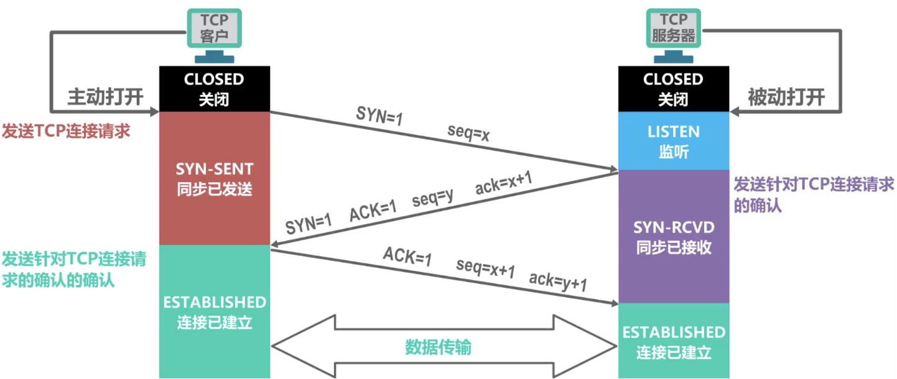
<!-- image-source: https://cdn.nlark.com/yuque/0/2026/png/67474974/1781851783322-883a87d7-2224-4516-a3f8-582dac83462b.png -->

| 步骤 | 发送方 | 接收方 | 报文段标志位与关键字段 | 状态变迁 |
| :---: | :--- | :--- | :--- | :--- |
| **准备** | - | 服务端 | 创建 TCB，准备接受请求。 | `CLOSED` $\rightarrow$ `LISTEN` (被动打开) |
| **第一次** | 客户端 | 服务端 | **SYN=1**, **seq=x**   _(连接请求，不携带数据但消耗1个序号)_ | 客户端: `CLOSED` $\rightarrow$ `SYN-SENT` (主动打开) |
| **第二次** | 服务端 | 客户端 | **SYN=1**, **ACK=1**, **seq=y**, **ack=x+1**   _(连接确认，不携带数据但消耗1个序号)_ | 服务端: `LISTEN` $\rightarrow$ `SYN-RCVD` |
| **第三次** | 客户端 | 服务端 | **ACK=1**, **seq=x+1**, **ack=y+1**   _(普通确认，若携带数据则消耗序号，否则不消耗)_ | 客户端: `SYN-SENT` $\rightarrow$ `ESTABLISHED`   服务端: `SYN-RCVD` $\rightarrow$ `ESTABLISHED` |


> **传输控制块（TCB, Transmission Control Block）**：  
在 TCP 连接建立前，双方均需创建 TCB 以存储连接的核心信息，包括：本地与远端 IP/端口、指向发送/接收缓存的指针、重传队列指针、当前发送/接收序号、窗口大小等。在 Linux 内核中，TCB 主要体现为 `struct tcp_sock` 结构体。
>

#### （3）为什么必须是“三次”握手？（防止历史连接干扰）
若简化为“两次握手”，将无法防止**已失效的历史连接请求**导致资源浪费。


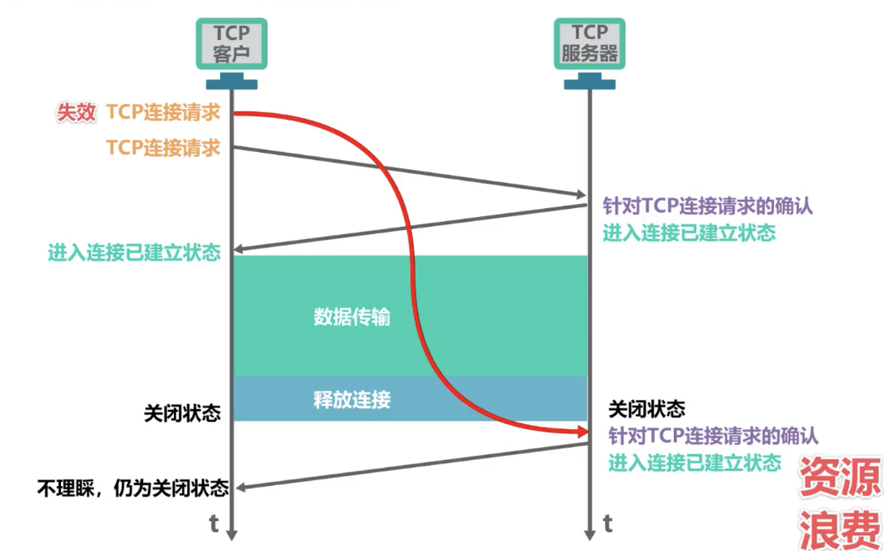
<!-- image-source: https://cdn.nlark.com/yuque/0/2026/png/67474974/1781851924067-939ef994-cf36-4f12-8024-74b694a51ebd.png -->

+ **异常场景**：客户端发送的连接请求报文在网络节点中长时间滞留，导致超时重传。重传的报文正常到达，双方完成两次握手并传输数据，随后正常释放连接。
+ **错误触发**：一段时间后，那个**滞留的历史请求报文**突然到达服务端。服务端误以为这是一个新的连接请求，于是发送确认报文并单方面进入 `ESTABLISHED` 状态，分配资源等待数据。
+ **结果**：由于是两次握手，客户端收到确认后不会再次回复，服务端将永远死等，白白浪费主机资源。**三次握手**要求客户端必须对服务端的确认进行最后一次回复，若客户端未发起新连接，则会忽略该历史确认，服务端超时后便会释放资源。

#### （4）考研真题解析（2011年题39）

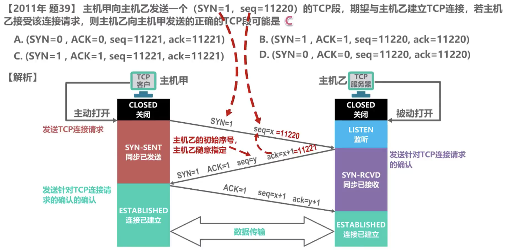
<!-- image-source: https://cdn.nlark.com/yuque/0/2026/png/67474974/1781852043034-0268e395-fcc3-44cc-8181-e9d3a0f8c552.png -->

**解析**：

+ 乙回复的是连接确认报文，必须包含 **SYN=1** 和 **ACK=1**。
+ **确认号（ack）**：对甲初始序号的确认，故 `ack = 11220 + 1 = 11221`。
+ **序号（seq）**：乙自己选择的初始序号，可由乙**随机指定**，与甲的序号无关。题目选项中若 `seq=11221` 仅为巧合或迷惑项。  
**答案**：正确选项为包含 `SYN=1, ACK=1, seq=任意值(如11221), ack=11221` 的选项（原题选项 C）。

---

### 3.TCP 连接的释放（四次挥手）
TCP 通信是全双工的，因此连接的释放需要双方各自独立关闭自己的发送通道，这需要四个报文段来完成。

#### （1）四次挥手详细过程与状态变迁
假设客户端主动发起连接释放（被动关闭方为服务端）。


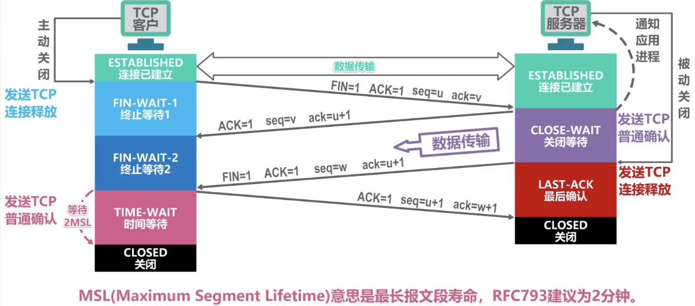
<!-- image-source: https://cdn.nlark.com/yuque/0/2026/png/67474974/1781852391942-c2f74b9e-9090-4dad-ac6d-e35e2b67117f.png -->

| 步骤 | 发送方 | 接收方 | 报文段标志位与关键字段 | 状态变迁 |
| :---: | :--- | :--- | :--- | :--- |
| **第一次** | 客户端 | 服务端 | **FIN=1**, **ACK=1**, **seq=u**, **ack=v**   _(释放请求，消耗1个序号)_ | 客户端: `ESTABLISHED` $\rightarrow$ `FIN-WAIT-1` |
| **第二次** | 服务端 | 客户端 | **ACK=1**, **seq=v**, **ack=u+1**   _(对 FIN 的确认)_ | 服务端: `ESTABLISHED` $\rightarrow$ `CLOSE-WAIT`   客户端: `FIN-WAIT-1` $\rightarrow$ `FIN-WAIT-2` |
| **第三次** | 服务端 | 客户端 | **FIN=1**, **ACK=1**, **seq=w**, **ack=u+1**   _(服务端数据发完，发送释放请求)_ | 服务端: `CLOSE-WAIT` $\rightarrow$ `LAST-ACK` |
| **第四次** | 客户端 | 服务端 | **ACK=1**, **seq=u+1**, **ack=w+1**   _(对服务端 FIN 的确认)_ | 客户端: `FIN-WAIT-2` $\rightarrow$ `TIME-WAIT`   服务端: `LAST-ACK` $\rightarrow$ `CLOSED` |
| **等待** | - | - | 客户端等待 **2MSL** 时间后关闭。 | 客户端: `TIME-WAIT` $\rightarrow$ `CLOSED` |


#### （2）半关闭状态（Half-Close）
在第二次挥手后，客户端进入 `FIN-WAIT-2`，服务端进入 `CLOSE-WAIT`。此时，**客户端到服务端的连接已释放（客户端不再发送数据），但服务端到客户端的连接依然保持**。  
	如果服务端还有剩余数据需要发送，客户端必须继续接收。这种状态称为“半关闭状态”，直到服务端数据发送完毕并发送自己的 FIN 报文（第三次挥手）为止。

#### （3）为什么需要 TIME-WAIT 状态（2MSL）？
客户端在发送最后一个 ACK 后，必须进入 `TIME-WAIT` 状态，等待 **2MSL**（Maximum Segment Lifetime，最长报文段寿命，RFC 793 建议为 2 分钟，现代系统常设置为 30s 或 60s）的时间才能进入 `CLOSED` 状态。其核心原因有二：

1. **确保最后一个 ACK 能够到达服务端**：若该 ACK 丢失，服务端会超时重传 FIN 报文。客户端在 `TIME-WAIT` 状态下可以再次接收 FIN 并重传 ACK。若直接进入 `CLOSED`，客户端将忽略重传的 FIN，导致服务端无法正常关闭。


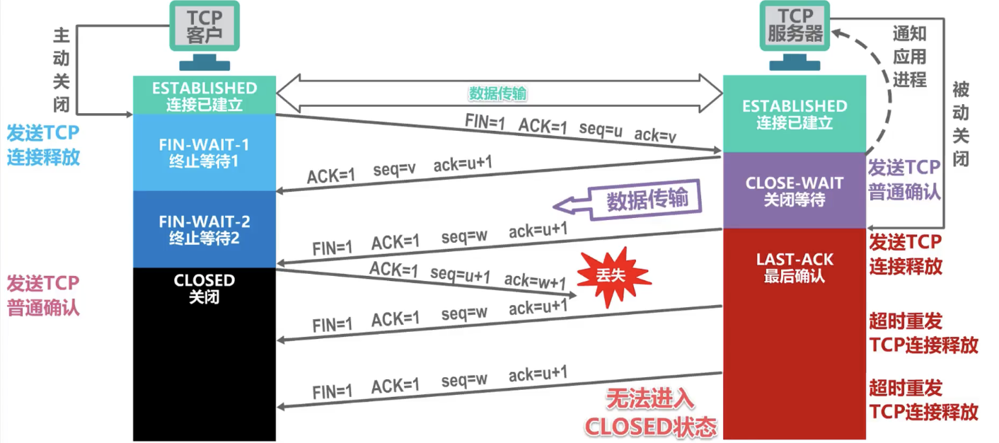
<!-- image-source: https://cdn.nlark.com/yuque/0/2026/png/67474974/1781852582951-a83aadb0-359d-4a14-8d63-8cc5feaa5d22.png -->

2. **让旧连接的报文在网络中消亡**：等待 2MSL 可确保本次连接产生的所有报文段都从网络中彻底消失，防止下一个复用相同四元组（源IP、源端口、目的IP、目的端口）的新连接收到属于旧连接的延迟报文，从而引发数据错乱。

---

### 4.TCP 保活计时器（Keepalive Timer）
若 TCP 双方建立连接后，客户端主机突然宕机或网络中断，服务端将永远收不到数据，导致连接资源被无效占用。为解决此问题，TCP 引入了**保活计时器** ：


<!-- image-source: https://cdn.nlark.com/yuque/0/2026/png/67474974/1781852692589-76cb1bd3-760f-4581-ae16-e98f35dd638b.png -->

+ **触发机制**：服务端每收到一次客户端的数据，就重置并启动保活计时器。
+ **探测过程**：若在定时周期内（默认通常为 2 小时）未收到任何数据，服务端将发送一个**探测报文段**。
+ **重试与关闭**：若未收到响应，则每隔 **75 秒**发送一次探测报文。若连续发送 **10 次**探测报文均无响应，服务端将判定对端主机故障，主动强制关闭该连接。

---

### 5.补充：后端开发视角下的连接管理实战
深入理解 TCP 连接管理的底层机制，对于排查线上故障、优化高并发网关具有决定性作用。以下是工程实践中的核心考点：

**1.半连接队列与全连接队列（SYN Flood 防御）**

在 Linux 内核中，服务端的三次握手状态变迁由两个队列管理：

+ **半连接队列（SYN Queue）**：处于 `SYN-RCVD` 状态的连接存放于此。大小由内核参数 `tcp_max_syn_backlog` 控制。
+ **全连接队列（Accept Queue）**：处于 `ESTABLISHED` 但尚未被应用层调用 `accept()` 取走的连接存放于此。大小由 `somaxconn` 和代码中 `listen(fd, backlog)` 的 `backlog` 参数共同决定（取两者较小值）。
+ **实战排障**：若高并发时客户端出现“连接超时”，但服务端 CPU/网络正常，通常是**全连接队列溢出**导致内核丢弃了第三次握手的 ACK。可通过 `netstat -s | grep overflowed` 查看溢出情况，并调大 `somaxconn` 解决。此外，开启 `tcp_syncookies` 可有效抵御 SYN Flood 恶意攻击。

**2.CLOSE_WAIT 堆积问题（代码级 Bug）**

+ **现象**：服务器出现大量 `CLOSE_WAIT` 状态的 Socket，最终导致文件描述符（FD）耗尽，服务拒绝新连接。
+ **根因**：`CLOSE_WAIT` 是内核在收到对端 FIN 并回复 ACK 后的状态。进入此状态后，**内核等待应用层调用** `close()` **来发送自己的 FIN**。如果代码中存在逻辑漏洞（如异常分支漏写 `close()`、连接池管理不当、死锁导致未能执行关闭逻辑），Socket 就会永远卡在 `CLOSE_WAIT`。
+ **解决**：排查代码逻辑，确保所有 Socket 生命周期结束时都能正确触发 `close()`。

**3. TIME_WAIT 过多的优化**

+ **现象**：高并发短连接场景（如 HTTP API 网关）下，服务端主动断开连接，产生海量 `TIME_WAIT`，耗尽本地可用端口（`ip_local_port_range`），导致无法向外部发起新请求。
+ **优化手段**：
    - 开启 `tcp_tw_reuse`：允许将 `TIME-WAIT` 状态的 Socket 重新用于新的 TCP 连接（需配合 TCP 时间戳选项使用），这是最安全的优化方式。
    - _避坑指南_：切勿盲目开启 `tcp_tw_recycle`。在 NAT（网络地址转换）环境下，`recycle` 会因时间戳校验失败而直接丢弃合法客户端的 SYN 报文（Linux 4.12 及以上内核已彻底移除此参数）。

**4. TCP Keepalive vs 应用层心跳包（Heartbeat）**

+ **局限性**：TCP 原生的 Keepalive 默认超时时间长达 2 小时，且无法区分“对端宕机”与“网络中间节点故障”，完全无法满足现代微服务对高可用和快速故障转移（Failover）的需求。
+ **工程实践**：在 C++ 后端开发中（如 RPC 框架、WebSocket、长连接网关），通常**关闭 TCP Keepalive**，转而在**应用层实现心跳机制（Ping/Pong 协议）**。应用层心跳可以在秒级甚至毫秒级发现死连接，并触发业务层的重连、节点剔除与流量调度。

---

## 九、TCP报文段的首部格式
### 1.TCP 报文段的基本结构
TCP 协议采用面向字节流的方式实现可靠传输。应用层交付的数据被视为无结构的字节流，存入 TCP 的发送缓存中。在发送数据时，TCP 从缓存中提取部分或全部字节，并附加一个 TCP 首部，封装成 **TCP 报文段（TCP Segment）** 后交由网络层发送。


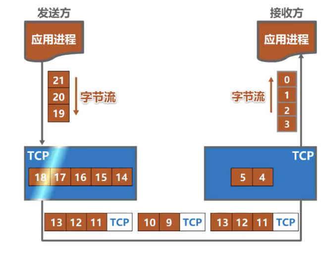
<!-- image-source: https://cdn.nlark.com/yuque/0/2026/png/67474974/1781852732782-aee1ba57-17ad-44b3-94ce-cceb91f175dc.png -->

一个完整的 TCP 报文段由**首部**和**数据载荷**两部分组成。TCP 协议的核心功能（如可靠传输、流量控制、拥塞控制、连接管理）均通过首部中的各个字段来实现。TCP 首部格式与 IP 数据报首部类似，包含 **20 字节的固定首部**和**最大 40 字节的可选首部**。

---

### 2.固定首部字段解析（20 字节）
TCP 固定首部包含以下核心字段，用于标识进程、维护字节流序号及实施流量控制：


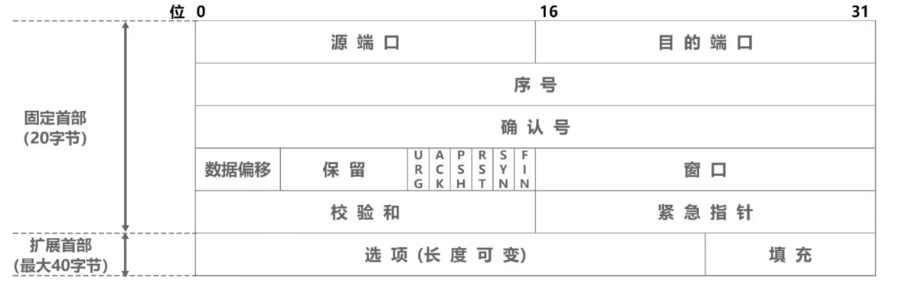
<!-- image-source: https://cdn.nlark.com/yuque/0/2026/png/67474974/1781852756949-a8e6244b-ac97-4892-b914-6e0162eff374.png -->

| 字段名称 | 长度 | 说明 |
| :--- | :---: | :--- |
| **源端口** | 16 bit | 标识发送该报文段的应用进程。 |
| **目的端口** | 16 bit | 标识接收该报文段的应用进程。 |


**端口号应用实例**：  
	当主机浏览器（客户端）访问 Web 服务器时，浏览器构建 TCP 报文段，**源端口**填写操作系统分配的短暂端口（如 `49152`），**目的端口**填写 HTTP 熟知端口 `80`。


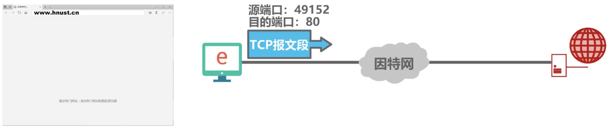
<!-- image-source: https://cdn.nlark.com/yuque/0/2026/png/67474974/1781852914188-636c1fc8-d342-4512-9b6e-d5b767ebfbb8.png -->

Web 服务器收到后，根据目的端口 `80` 将数据上交 Web 进程；响应时，Web 服务器将**源端口**设为 `80`，**目的端口**设为 `49152`，确保数据准确返回浏览器进程。


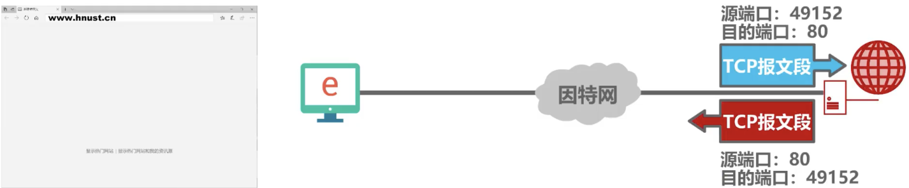
<!-- image-source: https://cdn.nlark.com/yuque/0/2026/png/67474974/1781853027379-0fa1de42-8ee7-4f6d-a9ed-21ad6e527eab.png -->

| 字段名称 | 长度 | 说明 |
| :--- | :---: | :--- |
| **序号 (SEQ)** | **32 bit** | **指出本报文段数据载荷的第一个字节的序号。取值范围为** $0 \sim 2^{32}-1$**，达到最大值后循环回 0。** |


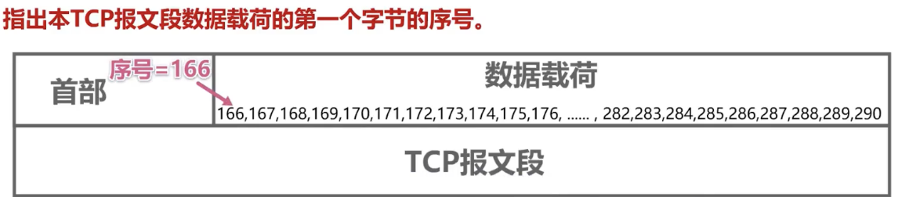
<!-- image-source: https://cdn.nlark.com/yuque/0/2026/png/67474974/1781853236808-37249fb9-83ab-4f83-974e-ae50ace2b75f.png -->

| 字段名称 | 长度 | 说明 |
| :--- | :---: | :--- |
| **确认号 (ACK)** | **32 bit** | **指出期望收到对方下一个报文段数据载荷的第一个字节序号。代表对之前所有数据的累积确认。若确认号为** $N$**，则表示序号** $N-1$ **及之前的数据已全部正确接收。** |


确认标志位ACK：取值为1时确认号字段才有效；取值为0时确认号字段无效。

TCP规定，在连接建立后所有传送的TCP报文段都必须把ACK置1.


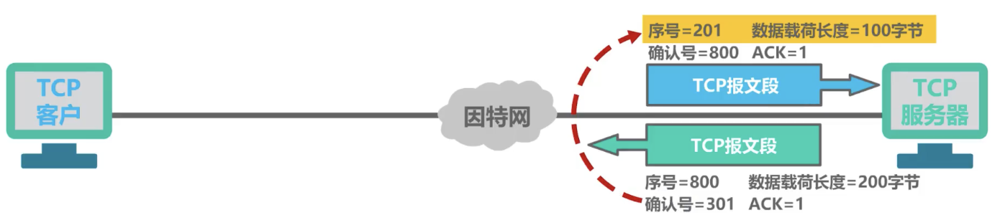
<!-- image-source: https://cdn.nlark.com/yuque/0/2026/png/67474974/1781853612171-4f6aa493-4588-482d-b81e-d906ff15b0a5.png -->

| 字段名称 | 长度 | 说明 |
| :--- | :---: | :--- |
| **数据偏移** | **4 bit** | **以 4 字节为单位**，指出数据载荷起始位置距离报文段起始位置的距离（即首部长度）。最小值为 5（**首部固定长度为 20（5*4）字节，数据偏移字段最小值为** `0101`），最大值为 15（**首部最大长度为 60（15*4）字节，数据偏移字段最大值为** `1111`）。 |


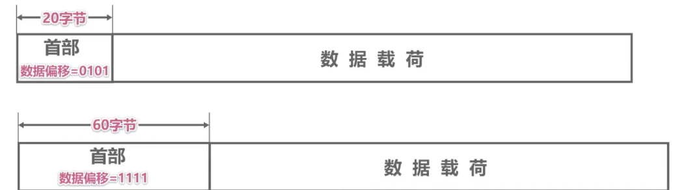
<!-- image-source: https://cdn.nlark.com/yuque/0/2026/png/67474974/1781854397325-b4668985-b120-44f2-bb42-b2dc9241ca1e.png -->

| 字段名称 | 长度 | 说明 |
| :--- | :---: | :--- |
| **保留字段** | **6 bit** | **保留为今后使用，通常置为 0。（**_注：现代 TCP 实现中，部分保留位已被用于显式拥塞通知 ECN_**）。** |
| **窗口** | **16 bit** | 以字节为单位，指出发送本报文段一方的接收窗口大小。用于流量控制。实际发送窗口大小由接收窗口和拥塞窗口共同决定 **（取两者较小值）。** |
| **校验和** | **16 bit** | 用于检查整个 TCP 报文段（含 12 字节的伪首部）在传输过程中是否出现误码。 |
| **紧急指针** | **16 bit** | 以字节为单位，配合 URG 标志位使用，指明本报文段数据载荷中紧急数据的长度。 |


---

### 3.控制标志位详解
TCP 首部中包含 6 个控制标志位，用于管理连接状态和控制数据传输行为：


<!-- image-source: https://cdn.nlark.com/yuque/0/2026/png/67474974/1781852756949-a8e6244b-ac97-4892-b914-6e0162eff374.png -->

| 标志位 | 全称 | 功能说明 |
| :---: | :--- | :--- |
| **URG** | Urgent | **紧急标志**。置 1 时，表明报文段包含紧急数据，紧急指针字段有效。接收方需优先处理并直接上交应用层，无需在缓存中排队。 |
| **ACK** | Acknowledgment | **确认标志**。置 1 时，确认号字段有效。TCP 规定，**连接建立后所有传送的报文段 ACK 必须置 1**。 |
| **PSH** | Push | **推送标志**。置 1 时，接收方 TCP 会尽快将数据上交应用进程，而不必等待接收缓存填满。 |
| **RST** | Reset | **复位标志**。置 1 时，表明 TCP 连接出现严重异常，必须释放并重建连接；也可用于拒绝非法的报文段或拒绝建立连接。 |
| **SYN** | Synchronize | **同步标志**。在连接建立时用于同步序号。SYN=1 表示这是一个连接请求或连接确认报文段。 |
| **FIN** | Finish | **终止标志**。置 1 时，表明发送方数据已发送完毕，要求释放 TCP 连接。 |


---

### 4.可选字段与填充（最大 40 字节）
TCP 允许在首部添加选项以扩展协议功能。由于“数据偏移”字段以 4 字节为单位，若选项长度加上 20 字节固定首部后不能被 4 整除，则必须使用**填充字段（Padding）**（全 0）补齐。

常用的 TCP 选项包括：

1. **最大报文段长度（MSS, Maximum Segment Size）**
    - 指明 TCP 报文段**数据载荷部分**的最大长度（不包含首部）。在连接建立时双方协商，通常根据底层网络的 MTU（最大传输单元）计算得出（如以太网下 MSS 通常为 1460 字节）。
2. **窗口扩大选项（Window Scale）**
    - 由于固定首部中的窗口字段仅 16 位（最大 65535 字节），在高速宽带网络中不足以维持高吞吐量。该选项允许将窗口值左移指定的位数，从而扩大接收窗口的上限。
3. **时间戳选项（Timestamps）**
    - **计算 RTT**：用于精确测量往返时间，避免 Karn 算法在重传时的二义性问题。
    - **防止序号绕回（PAWS）**：在高速网络中，32 位序号可能在报文段生命周期内循环使用。时间戳可用于区分当前报文段与延迟到达的旧报文段。
4. **选择确认选项（SACK, Selective Acknowledgment）**
    - 传统的累积确认在遇到非连续丢包时会导致大量不必要的重传。SACK 允许接收方告知发送方哪些不连续的字节块已成功接收，使发送方仅重传真正丢失的数据。

---

### 5.核心机制深度剖析（补充扩展）
#### （1）校验和与伪首部（Pseudo-Header）
TCP 的校验和计算不仅覆盖 TCP 首部和数据载荷，还包含一个 12 字节的**伪首部**。伪首部并不实际发送，仅用于计算校验和，其目的是确保 TCP 报文段确实到达了正确的目的 IP 地址。

+ **伪首部结构**：源 IP 地址（32 bit） + 目的 IP 地址（32 bit） + 全 0（8 bit） + 协议号 6（8 bit） + TCP 报文段总长度（16 bit）。

#### （2）序号绕回（Sequence Number Wrap-around）与 PAWS
TCP 序号为 32 位，最大值为 $2^{32}-1$（约 42.9 亿）。在千兆或万兆网络中，序号可能在极短时间内耗尽并回绕到 0。若网络中存在延迟极大的旧报文，其序号可能与新连接的序号重合，导致数据错乱。

+ **PAWS（Protect Against Wrapped Sequences）机制**：通过 TCP 时间戳选项，接收方会比较报文段的时间戳。若收到一个序号合法但时间戳明显“陈旧”的报文，接收方会将其判定为旧报文并直接丢弃。

#### （3）MSS 与 MTU 的关系
+ **MTU（Maximum Transmission Unit）**：数据链路层允许的最大帧大小（以太网通常为 1500 字节）。
+ **MSS 计算**：`MSS = MTU - IP 首部长度 (通常 20) - TCP 首部长度 (通常 20)`。因此，标准以太网下的 MSS 通常为 **1460 字节**。若网络中存在隧道封装（如 PPPoE、IPSec），MTU 会减小，MSS 也必须相应调小，以避免 IP 层分片。

---

### 6.C++ 后端开发视角下的 TCP 首部实践
深入理解 TCP 首部字段对于网络编程调优和线上故障排查至关重要：

#### （1）Socket API 与 TCP 标志位的映射
+ **PSH 标志位与 Nagle 算法**：默认情况下，TCP 启用 Nagle 算法以合并小数据包，这会延迟 PSH 标志位的发送。在对延迟敏感的 RPC 或实时通信服务中，需通过 `setsockopt` 设置 `TCP_NODELAY` 选项禁用 Nagle 算法，确保数据立即发送并置位 PSH。

```cpp
int flag = 1;
setsockopt(sockfd, IPPROTO_TCP, TCP_NODELAY, (char *)&flag, sizeof(int));
```

+ **MSS 调整**：在特殊网络环境（如存在 GRE 隧道）下，可通过 `TCP_MAXSEG` 选项手动限制发送的 MSS 值，防止中间路由器进行 IP 分片，从而降低丢包率和延迟。

#### （2）RST 报文段的触发场景与排查
在服务端日志中若发现连接被意外重置（Connection reset by peer），通常是因为收到了 RST 报文。常见触发原因包括：

+ 客户端在连接建立后未调用 `close()` 而是直接退出（进程崩溃），操作系统发送 RST。
+ 服务端向一个已经关闭的 Socket 继续写入数据（触发 `SIGPIPE` 信号并发送 RST）。
+ 接收方收到不属于任何已知连接的报文段（如服务器重启后丢失了 TCB 状态）。

#### （3）抓包分析与 SACK 的价值
在生产环境中排查网络吞吐量下降或延迟毛刺时，使用 `tcpdump` 或 Wireshark 抓包是标准操作。

+ 若抓包发现大量 **TCP Retransmission**，且伴随 **TCP Dup ACK**，需检查是否开启了 SACK。若未开启 SACK，发送方在遇到“空洞”（如丢包 2、4，收到 1、3、5）时，会盲目重传 2 及之后的所有数据；开启 SACK 后，发送方能精准重传丢失的 2 和 4，极大提升弱网环境下的传输效率。Linux 系统默认开启 SACK（`net.ipv4.tcp_sack = 1`）。

---

# 第六章 应用层
## 一、应用层概述
### 1. 计算机网络体系结构下层回顾
在进入应用层的学习之前，有必要对计算机网络体系结构中自底向上的前四层进行简要回顾：

+ **物理层 (Physical Layer)**：解决使用何种物理信号来传输比特流的问题。
+ **数据链路层 (Data Link Layer)**：解决数据分组在单一网络或单段链路上的传输问题。
+ **网络层 (Network Layer)**：解决数据分组在多个异构网络之间的传输与路由选择问题。
+ **运输层 (Transport Layer)**：解决端到端（即进程与进程之间）基于网络的通信问题。


<!-- image-source: https://cdn.nlark.com/yuque/0/2026/png/67474974/1781930804596-01913b85-23dd-4611-aa19-d999536b721a.png -->

### 2. 应用层的定位与核心功能
应用层（Application Layer）是计算机网络体系结构的最顶层。其核心定位与功能如下：

+ **服务调用**：应用层享受其下层（运输层、网络层等）提供的通信服务。
+ **功能实现**：通过应用进程之间的交互，实现特定的网络应用功能。
+ **终极目标**：应用层是设计和建立计算机网络的最终目的，直接面向终端用户，也是计算机网络中发展最快、创新最活跃的层次。

### 3. 网络应用的发展历程与驱动因素
网络应用伴随着底层网络技术的发展而不断演进：

+ **早期基于文本的应用**：如电子邮件（Email）、远程登录（Telnet）、文件传输（FTP）以及新闻组（Usenet）等。
+ **Web 时代的爆发**：20世纪90年代，万维网（World Wide Web, WWW）的出现将因特网带入千家万户，极大地推动了互联网的普及。
+ **现代多元化应用**：当今互联网充斥着即时通信（IM）、P2P（Peer-to-Peer）文件共享、各类音视频流媒体应用等。

**未来发展的驱动因素**：  
	计算设备的小型化与泛在化（如物联网设备）、宽带住宅接入以及无线接入技术（如 5G/Wi-Fi 6）的迅速普及，为未来涌现更多新型网络应用提供了广阔的基础设施舞台。

### 4. 经典网络应用及其核心协议
本章将以经典的网络应用为切入点，深入学习其工作原理、应用层协议及底层实现机制。

**1.万维网 (WWW) 与 HTTP 协议**

+ **应用场景**：用户在浏览器地址栏输入域名即可访问网站内容。万维网是推动互联网飞速发展的核心应用。
+ **核心协议**：超文本传输协议（HTTP / HTTPS）。
+ **后端延伸**：HTTP 是后端开发中最核心的应用层协议，深入理解其请求/响应模型、状态码、Header 设计及 Keep-Alive 机制，对于开发高性能 Web 服务器（如 Nginx 底层逻辑）或微服务接口至关重要。

**2.域名系统 (DNS)**


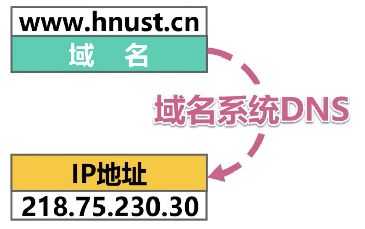
<!-- image-source: https://cdn.nlark.com/yuque/0/2026/png/67474974/1781930957074-f4d1ec30-ecaa-4b43-b831-3574bb85a2ae.png -->

+ **应用场景**：用户习惯使用具有语义的“域名”进行访问，而 TCP/IP 体系的网络层使用“IP 地址”来标识目的主机。
+ **核心功能**：DNS 属于应用层范畴，负责在后台自动完成从域名到 IP 地址的映射与解析工作，屏蔽底层网络细节，提升用户体验。
+ **后端延伸**：后端架构中常涉及 DNS 负载均衡、全局流量调度（GSLB）以及本地 DNS 缓存优化，是保障服务高可用性的关键组件。

**3.其他常见网络应用**

除上述核心应用外，本章后续课程还将深入剖析以下经典应用及其协议：

+ **动态主机配置协议 (DHCP)**：用于局域网内自动分配 IP 地址及相关网络配置参数。
+ **电子邮件系统**：涉及简单邮件传输协议（SMTP）以及邮局协议（POP3）/互联网邮件访问协议（IMAP）。
+ **文件传送协议 (FTP)**：用于在网络上进行可靠的文件双向传输。
+ **P2P 文件共享**：去中心化的分布式网络架构，探讨节点发现与数据传输机制。
+ **多媒体网络应用**：探讨实时传输协议（RTP）及流媒体传输机制，分析延迟、抖动对音视频质量的影响。


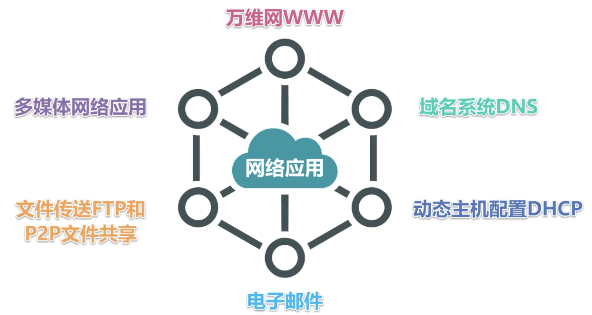
<!-- image-source: https://cdn.nlark.com/yuque/0/2026/png/67474974/1781930995292-eea2c114-101d-437a-bdad-8fab0e9bdd2d.png -->

### 5. 本章学习路线与目标
+ **掌握原理**：理解各类经典网络应用的基本工作原理及架构模式（如 C/S 架构与 P2P 架构）。
+ **剖析协议**：深入分析 HTTP、DNS、SMTP、FTP 等核心应用层协议的报文格式与交互流程。
+ **指导实践**：结合 C++ 网络编程（如 Socket 编程、Reactor 模型），将理论知识转化为实际的后端网络服务开发能力。

---

## 二、客户——服务器方式和对等方式
网络应用程序运行在处于网络边缘的不同端系统上，通过彼此间的通信来共同完成特定任务。因此，在开发一种新的网络应用时，首要考虑的问题便是网络应用程序在各种端系统上的**组织方式**以及**节点间的交互关系**。

目前，网络应用最主流的架构模式主要有两种：**客户-服务器方式 (Client-Server, C/S)** 与 **对等方式 (Peer-to-Peer, P2P)**。

---

### 1. 客户-服务器方式 (Client-Server, C/S)
**1.核心概念与角色定义**

在 C/S 架构中，“客户”和“服务器”本质上是指通信中所涉及的两个**应用进程**。该方式描述的是进程之间**服务与被服务**的关系。

+ **客户 (Client)**：
    - **进程层面**：运行在主机 A 上的客户程序称为**客户进程**（主动发起通信的一方）。
    - **主机层面**：运行客户进程的主机通常称为**客户机 (Client Host)**，在语境明确时也常简称为“客户”。
+ **服务器 (Server)**：
    - **进程层面**：运行在主机 B 上的服务器程序称为**服务器进程**（被动等待并处理请求的一方）。
    - **主机层面**：运行服务器进程的主机通常称为**服务器 (Server Host)**，有时也简称为“服务器”。


.png)
<!-- image-source: https://cdn.nlark.com/yuque/0/2026/png/67474974/1781931181278-ed5fbdca-cc14-4048-b511-3cdeb9f1aec9.png -->

**2.工作特征与网络要求**

+ **交互模式**：客户是**服务的请求方**，主动发起连接；服务器是**服务的提供方**，被动接受连接。
+ **运行状态**：服务器进程必须始终保持运行状态，随时准备处理客户的请求；而客户进程仅在需要服务时才运行。
+ **网络寻址**：
    - **服务器**：必须具有**固定的 IP 地址**和**固定的知名运输层端口号**（例如，HTTP 服务器默认使用 80 端口，HTTPS 使用 443 端口）。
    - **客户机**：通常使用动态分配的 IP 地址和临时的运输层端口号，无需对外提供固定的网络入口。

**3.架构特点与扩展方案**

C/S 方式是因特网上最传统、最成熟的架构模式，广泛应用于万维网 (WWW)、电子邮件 (SMTP/POP3/IMAP)、文件传输 (FTP) 等经典网络应用。

+ **服务集中型**：应用服务集中在网络中数量远少于客户机的服务器节点上。
+ **性能瓶颈**：由于单台服务器需要为海量客户机提供服务，极易出现计算资源或网络带宽的瓶颈，导致无法及时响应众多请求。
+ **扩展方案（后端视角补充）**：
    - **基础设施扩展**：采用**计算机集群 (Cluster)** 或**服务器农场 (Server Farm)**，通过硬件堆叠构建强大的虚拟服务器。
    - **架构优化**：在现代 C++ 后端开发中，通常结合**负载均衡 (Load Balancing)**、**反向代理**、**微服务架构**以及**CDN (内容分发网络)** 来分散单点压力，提升系统吞吐量与高可用性。

---

### 2. 对等方式 (Peer-to-Peer, P2P)
**1.核心概念与角色定义**

在 P2P 架构中，**不存在固定的服务请求者和服务提供者**。分布在网络边缘各端系统中的应用进程地位对等，被称为**对等方 (Peer)**。

+ **交互模式**：对等方之间直接进行通信。每个对等方既是服务的请求者（下载数据），又是服务的提供者（上传数据）。
+ **工作示例**：假设主机 C、D、E、F 均运行同一种 P2P 下载软件。


.png)
<!-- image-source: https://cdn.nlark.com/yuque/0/2026/png/67474974/1781931348662-3c7bd7b7-c947-4990-9b52-3df4b298b2c2.png -->

- E 和 F 互为对等方，C 和 D 互为对等方，同时 E 和 D 也互为对等方。
- 在实际运行中，节点 E 在从节点 F 下载文件片段的同时，也在为节点 D 提供已下载片段的上传服务。


**2.工作特征与应用场景**

+ **典型应用**：P2P 文件共享（如 BitTorrent）、部分即时通信工具、P2P 流媒体、分布式存储系统，以及近年来兴起的**区块链与 Web3 节点网络**。
+ **服务分散型**：服务不集中在少数数据中心，而是分散在大量对等计算机中。这些节点通常不属于服务提供商，而是由个人控制的桌面计算机、笔记本或边缘设备，广泛分布于住宅、校园和办公室网络中。

**3.架构优势与局限性**

+ **卓越的可扩展性 (Scalability)**：这是 P2P 最突出的特性。系统每增加一个对等方，不仅增加了一个服务请求者，同时增加了一个服务提供者。因此，系统的整体服务能力和性能不会因规模的增大而降低，反而可能增强。
+ **显著的成本优势**：P2P 充分利用了边缘设备的计算、存储和带宽资源，服务提供商无需投资庞大的数据中心设施和昂贵的服务器出口带宽。
+ **局限性（后端视角补充）**：
    - **网络穿透难题**：由于多数个人设备位于 NAT（网络地址转换）或防火墙之后，节点间的直接 P2P 通信需要复杂的**NAT 穿透技术**（如 STUN/TURN/ICE）。
    - **管理与安全**：缺乏集中控制导致节点管理困难、数据一致性难以保证，且容易面临版权争议和安全攻击（如恶意节点投毒）。

---

### 3. 架构对比与 C++ 开发启示
| 对比维度 | 客户-服务器方式 (C/S) | 对等方式 (P2P) |
| :--- | :--- | :--- |
| **角色划分** | 严格区分客户与服务器 | 无固定角色，均为对等方 (Peer) |
| **控制方式** | 集中式控制 | 分布式/去中心化控制 |
| **可扩展性** | 受限于服务器集群规模，扩展成本高 | 随节点增加自然扩展，扩展性极佳 |
| **单点故障** | 服务器宕机可能导致服务不可用 | 鲁棒性高，部分节点离线不影响全局 |
| **C++ 开发侧重点** | 侧重于**高并发服务器开发**（如 epoll、Reactor 模型、多线程/协程池、内存池优化）。 | 侧重于**分布式节点开发**（如 DHT 分布式哈希表、NAT 穿透、P2P 协议栈实现、节点状态机管理）。 |


在实际的复杂网络系统设计中，C/S 与 P2P 并非绝对互斥。现代大型网络应用（如大型多人在线游戏、现代流媒体分发）常采用**混合架构 (Hybrid Architecture)**：利用 C/S 架构进行用户认证、元数据管理与调度，同时利用 P2P 架构进行大体积数据块的高效分发，从而兼顾管理效率与传输性能。

---

## 三、动态主机配置协议DHCP
### 1. DHCP 的作用与应用场景
在构建计算机网络时，接入网络的每台主机都需要配置相关的网络参数，包括 **IP 地址、子网掩码、默认网关以及 DNS 服务器地址**。

+ **手工配置的痛点**：如果网络中的主机数量庞大，依赖网络管理员逐台手工配置不仅工作量巨大，而且极易出现 IP 地址冲突或配置错误，后期维护成本极高。
+ **DHCP 的自动化优势**：动态主机配置协议（Dynamic Host Configuration Protocol, DHCP）完美解决了这一问题。通过在局域网内部署一台 DHCP 服务器并预先配置好地址池和网络参数，网络中的各主机在开机时会自动启动 DHCP 客户端程序，向服务器请求并自动获取网络配置信息，全程无需人工干预。


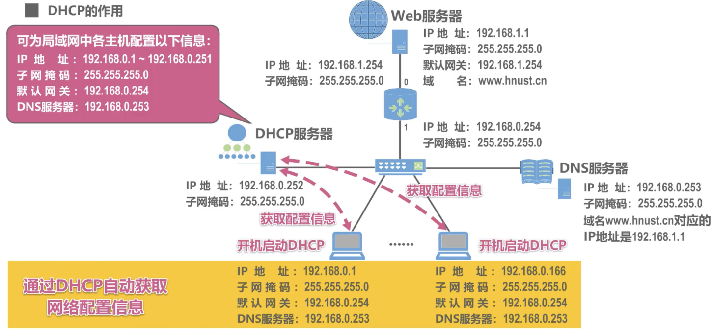
<!-- image-source: https://cdn.nlark.com/yuque/0/2026/png/67474974/1781931724392-c55da469-acb6-46a3-b207-797d52cda7ec.png -->

### 2. DHCP 协议基础与报文封装
DHCP 采用典型的**客户-服务器 (C/S) 架构**：

+ **DHCP 服务器**：运行在服务器端，负责管理和分配 IP 地址池，响应客户端的配置请求。
+ **DHCP 客户**：运行在用户主机上，负责发起配置请求并应用获取到的网络参数。

**协议栈封装过程**：  
DHCP 属于 TCP/IP 体系结构中的**应用层**协议，它依赖运输层的 **UDP** 提供服务。

+ **端口号**：DHCP 服务器监听熟知端口 **UDP 67**，DHCP 客户使用熟知端口 **UDP 68**。
+ **封装层级**：应用层的 DHCP 报文首先被封装为 UDP 用户数据报，接着在网络层被封装为 IP 数据报，最后在数据链路层被封装为相应的帧（如以太网帧）进行物理传输。

### 3. DHCP 的核心工作过程 (DORA 机制)
DHCP 的核心交互过程通常被称为 **DORA**（Discover, Offer, Request, ACK）。假设网络中存在多台 DHCP 服务器和一台新接入的用户主机，其完整交互流程如下：

**1.DHCP Discover (发现)**


.png)
<!-- image-source: https://cdn.nlark.com/yuque/0/2026/png/67474974/1781931994796-287490e1-efac-41d1-be99-ef3e059b7a9a.png -->

+ **触发条件**：主机启用 DHCP 且尚未获得 IP 地址。
+ **报文特征**：DHCP 客户以**广播**形式发送 Discover 报文。
    - **源 IP 地址**：`0.0.0.0`（因为客户尚未分配 IP）。
    - **目的 IP 地址**：`255.255.255.255`（受限广播地址）。
+ **核心字段**：报文中封装了随机生成的**事务 ID (Transaction ID)** 以及客户机的 **MAC 地址**。
+ **网络行为**：由于是广播报文，子网内所有设备都会收到。但只有监听 UDP 67 端口的 DHCP 服务器进程会接收并处理该报文，其他设备的非 DHCP 进程会将其丢弃。

**2.DHCP Offer (提供)**


.png)
<!-- image-source: https://cdn.nlark.com/yuque/0/2026/png/67474974/1781932386504-453cec8c-cfd2-4145-bf88-cb3b16452d2b.png -->

+ **触发条件**：DHCP 服务器收到 Discover 报文。
+ **处理逻辑**：服务器根据报文中的 MAC 地址查找本地数据库。若存在静态绑定记录，则使用指定配置；否则从动态地址池中挑选一个可用 IP。
    - _冲突检测_：服务器在分配 IP 前，通常会使用 ARP 或 ICMP Ping 探测该 IP 是否已被网络中其他主机占用，以确保分配的合法性。
+ **报文特征**：服务器以**广播**形式发送 Offer 报文（因为客户仍无 IP 地址，无法进行单播）。
    - **源 IP 地址**：DHCP 服务器的 IP 地址。
    - **目的 IP 地址**：`255.255.255.255`。
+ **核心字段**：包含事务 ID、提议的 IP 地址、子网掩码、租期、默认网关、DNS 服务器等配置信息。
+ **客户处理**：客户机收到多个 Offer 时，通过比对**事务 ID**确认是否为自己发起的请求。通常客户会选择**最先到达**的 Offer，并丢弃其他 Offer。

**3.DHCP Request (请求)**


.png)
<!-- image-source: https://cdn.nlark.com/yuque/0/2026/png/67474974/1781932487078-70994a9b-0d5c-40c6-ae72-103ed066354b.png -->

+ **触发条件**：客户机选定某个 DHCP 服务器的 Offer。
+ **报文特征**：客户机依然以**广播**形式发送 Request 报文。
    - **源 IP 地址**：`0.0.0.0`。
    - **目的 IP 地址**：`255.255.255.255`。
+ **设计意图**：采用广播而非单播的目的，是为了**同时通知网络中所有的 DHCP 服务器**。被选中的服务器将确认租约，而未被选中的服务器收到该报文后，会收回之前 Offer 的 IP 地址，以便分配给其他客户。
+ **核心字段**：包含事务 ID、客户 MAC 地址、接受的 IP 地址，以及**提供该租约的 DHCP 服务器的 IP 地址**。

**4.DHCP ACK (确认)**


.png)
<!-- image-source: https://cdn.nlark.com/yuque/0/2026/png/67474974/1781932558914-1b20398e-e6e3-4a67-8dca-5febd9545a8f.png -->

+ **触发条件**：被选中的 DHCP 服务器收到 Request 报文。
+ **报文特征**：服务器以**广播**形式发送 ACK (Acknowledgment) 确认报文。
+ **客户处理与冲突检测**：客户收到 ACK 后，在正式使用该 IP 之前，会发送**免费 ARP (Gratuitous ARP)** 探测网络，检测该 IP 是否真的未被占用。
    - **若发生冲突**：客户向服务器发送 **DHCP Decline (谢绝)** 报文，拒绝该租约，并重新发起 Discover 过程。
    - **若无冲突**：客户正式配置网络接口，开始与其他主机通信。

### 4. DHCP 租约管理与续约机制
DHCP 分配 IP 地址采用“租约 (Lease)”机制，客户机必须在租期到期前进行续约，以维持网络连接。

+ **T1 续约 (50% 租期)**：  
当租期过去一半时，客户机会向原 DHCP 服务器发送 **单播** 的 DHCP Request 报文（此时源 IP 为客户 IP，目的 IP 为服务器 IP）。
    - 若服务器同意，则回复 DHCP ACK 更新租期；
    - 若服务器不同意，则回复 **DHCP NAK (否认)**，客户机必须立即停止使用该 IP 并重新发起 Discover。


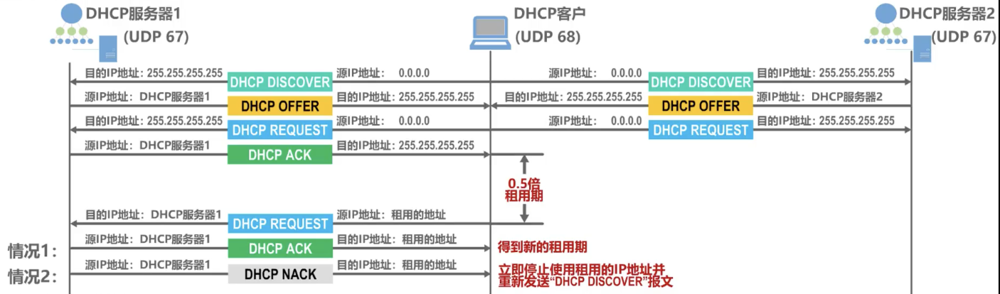
<!-- image-source: https://cdn.nlark.com/yuque/0/2026/png/67474974/1781932660260-846eb1da-1d4f-41b1-b071-8e3f482e90d8.png -->

+ **T2 重新绑定 (87.5% 租期)**：  
若服务器在 T1 阶段未响应，当租期达到 87.5% 时，客户机会以**广播**形式发送 DHCP Request 报文，尝试向网络中**任何可用**的 DHCP 服务器请求续约。
+ **租期到期**：  
若在 T2 阶段仍未得到响应，当租期 100% 到期时，客户机必须立即停止使用该 IP，并重新发起 Discover 申请新地址。
+ **提前释放**：  
客户机若主动关机或断开网络，可随时向服务器发送 **DHCP Release** 报文，提前终止租约，释放 IP 资源。


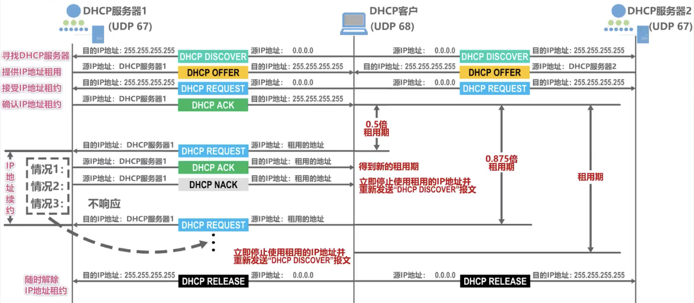
<!-- image-source: https://cdn.nlark.com/yuque/0/2026/png/67474974/1781932777473-c280f557-098a-4d3e-84f6-32a8bcadac94.png -->

### 5. 跨网段配置：DHCP 中继代理 (Relay Agent)
**问题背景**：


.png)
<!-- image-source: https://cdn.nlark.com/yuque/0/2026/png/67474974/1781932888125-abb2e6d8-b49d-4bcf-a360-b9c3049c0b8f.png -->

DHCP Discover 报文是链路层和网络层的广播报文，**路由器默认不会转发广播报文**。但是，如果每个子网都部署一台 DHCP 服务器，将导致硬件成本和管理成本急剧上升。

**解决方案**：引入 **DHCP 中继代理 (DHCP Relay Agent)**。

+ **工作原理**：在连接客户端所在子网的路由器上开启 DHCP 中继功能，并配置远端 DHCP 服务器的单播 IP 地址。
+ **交互过程**：当路由器收到客户端广播的 DHCP Discover 报文后，会将其修改为**单播**报文（源 IP 改为路由器接口 IP，目的 IP 改为指定的 DHCP 服务器 IP），并转发给远端服务器。后续的 Offer、Request、ACK 交互均通过该路由器进行单播中转。
+ **优势**：极大地减少了 DHCP 服务器的部署数量，实现了集中化管理。


.png)
<!-- image-source: https://cdn.nlark.com/yuque/0/2026/png/67474974/1781932950865-0b5f3d81-f048-4809-993b-9a23df063478.png -->

---

### 6. C+ 后端开发视角下的 DHCP 实现 (补充)
对于 C++ 后端开发工程师而言，若需开发自定义的 DHCP 服务器（如用于物联网设备管理、边缘计算网关或定制化网络准入控制），需重点关注以下底层技术细节：

#### 1.UDP Socket 编程与 MAC 地址获取
+ **端口绑定**：服务端需绑定 `0.0.0.0:67`，并设置 `SO_REUSEADDR` 和 `SO_BROADCAST` 选项以处理广播流量。
+ **获取客户端 MAC**：在标准的 UDP `recvfrom` 中只能获取客户端的 IP 地址。由于 DHCP Discover 时客户端 IP 为 `0.0.0.0`，服务端必须通过底层 API 获取数据链路层的源 MAC 地址。在 Linux 下，通常需要使用 `recvmsg` 结合 `IP_PKTINFO` 或 `PACKET_AUXDATA` 控制消息，或者直接使用 `AF_PACKET` 原始套接字来抓取以太网帧头。

#### 2.报文解析与构建 (网络字节序)
DHCP 报文基于早期的 BOOTP 协议，具有严格的定长结构（最小 576 字节）。

+ **结构体对齐**：在 C++ 中定义 DHCP 报文结构体时，必须使用 `#pragma pack(1)` 或 `__attribute__((packed))` 禁用编译器默认的内存对齐，确保报文长度与协议规范完全一致。
+ **字节序转换**：报文中的事务 ID (xid)、IP 地址等字段均采用**网络字节序 (大端)**，在解析和构建时务必使用 `ntohl`、`htonl` 等函数进行转换。

#### 3.Options 字段的 TLV 解析
DHCP 的扩展配置（如租期、路由、DNS）存放在报文尾部的 `Options` 字段中。该字段采用 **TLV (Type-Length-Value)** 格式编码，且必须以 Magic Cookie (`99.130.83.99`) 开头，以 `255` (End 选项) 结束。开发时需编写健壮的 TLV 状态机解析器，防范恶意构造的畸形报文导致的越界读取 (Buffer Overflow)。

#### 4.高并发与状态机管理
+ **租约状态机**：DHCP 服务器需要维护每个 IP 的状态（Free, Offered, Bound, Reserved）。在多核高并发场景下，需使用无锁队列或细粒度锁（如分段锁、读写锁）来保护 IP 地址池，避免超卖。
+ **持久化与容灾**：租约信息需定期持久化到磁盘或数据库（如 Redis/SQLite），防止服务器重启导致 IP 冲突或租约丢失。

---

## 四、域名系统DNS
### 1.域名系统 (DNS) 概述
#### （1）DNS 的核心作用
在计算机网络中，主机之间的通信最终依赖于 IP 地址进行寻址（如使用 `ping` 命令测试连通性时，底层实际使用的是 IP 地址）。然而，IP 地址（如 `192.0.2.1`）不便于人类记忆。因此，因特网引入了**域名系统 (Domain Name System, DNS)**，其核心作用是建立**人类可读的域名**与**机器可读的 IP 地址**之间的映射关系。


<!-- image-source: https://cdn.nlark.com/yuque/0/2026/png/67474974/1781934395536-488c13cc-2ec2-4882-b8b0-fef441ddd7d5.png -->


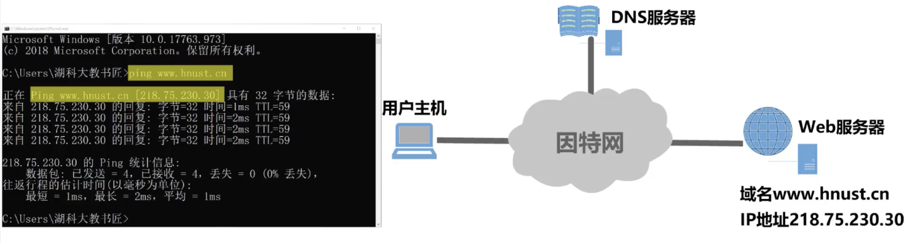
<!-- image-source: https://cdn.nlark.com/yuque/0/2026/png/67474974/1781934697409-0065f146-ee8f-4f2c-8636-6c71fe4367dd.png -->

当用户在浏览器中输入 Web 服务器的域名时，用户主机会首先查询本地 DNS 缓存；若未命中，则向网络中的 DNS 服务器发送查询报文。DNS 服务器在其数据库中查找对应的 IP 地址并返回给用户主机，随后浏览器即可通过该 IP 地址建立 TCP 连接并访问目标内容。


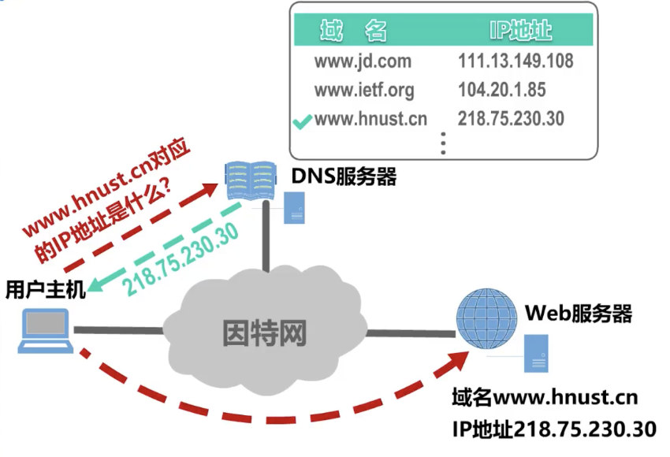
<!-- image-source: https://cdn.nlark.com/yuque/0/2026/png/67474974/1781934766114-bf52f1b7-db5c-4a3e-bc9e-73d9a4974110.png -->

#### （2）分布式架构的必然性
理论上，因特网可以只使用一台集中的 DNS 服务器来存储所有域名映射，但在工程实践中这种做法是不可取的：

+ **单点故障**：一旦该服务器宕机，整个因特网的域名解析将瘫痪。
+ **性能瓶颈**：全球海量的并发查询请求会轻易压垮单一服务器的计算与网络带宽。
+ **维护困难**：集中式数据库的更新和管理成本极高。

因此，自 1983 年起，因特网采用了**层次树状结构的命名机制**与**分布式域名系统**。这种设计使得大多数域名查询能够在本地或就近解析，仅少量查询需要在广域网上通信，极大地提高了系统效率与鲁棒性。

---

### 2.域名的层次树状结构
#### （1）域名命名规则
域名空间呈现为一棵倒置的树结构。域名的结构由若干个分量组成，各分量之间用点（`.`）隔开，分别代表不同级别的域名。


<!-- image-source: https://cdn.nlark.com/yuque/0/2026/png/67474974/1781935449962-7ef444dc-e813-4728-8f6d-f8945f7af5b5.png -->

+ **字符限制**：每一级域名由英文字母和数字组成，不区分大小写，单级长度不超过 **63 个字符**，完整域名总长度不超过 **255 个字符**。
+ **书写顺序**：级别最低的域名写在最左边，级别最高的顶级域名写在最右边


<!-- image-source: https://cdn.nlark.com/yuque/0/2026/png/67474974/1781935515097-51ee6412-00ec-4f27-b27a-d1be3d3bd259.png -->

+ **管理权限**：DNS 既不规定一个域名必须包含多少个下级域名，也不规定每一级域名的具体含义。各级域名由其上一级的域名管理机构管理，而最高的顶级域名由 **ICANN**（因特网名称与数字地址分配机构）统一管理。

#### （2）顶级域名 (TLD) 分类
顶级域名主要分为以下三类：

1. **国家顶级域名 (nTLD)**：采用 ISO 3166 标准，如 `.cn`（中国）、`.us`（美国）、`.uk`（英国）。
2. **通用顶级域名 (gTLD)**：最常见的早期通用顶级域名包括：
    - `.com`（公司企业）
    - `.net`（网络服务机构）
    - `.org`（非营利性组织）
    - `.int`（国际组织）
    - `.edu`（美国教育机构）
    - `.gov`（美国政府部门）
    - `.mil`（美国军事部门）
3. **反向域名 (arpa)**：用于反向域名解析，即将 IP 地址反向解析为域名。

#### （3）二级域名的划分（以中国为例）
在国家顶级域名（如 `.cn`）下注册的二级域名由该国自行确定。我国将 `.cn` 下的二级域名划分为两类：

+ **类别域名（7个）**：`.ac.cn`（科研机构）、`.com.cn`（工商金融企业）、`.edu.cn`（教育机构）、`.gov.cn`（政府部门）、`.net.cn`（网络服务机构）、`.mil.cn`（军事机构）、`.org.cn`（非营利性组织）。
+ **行政区域名（34个）**：对应各省、自治区、直辖市。如 `.bj.cn`（北京）、`.sh.cn`（上海）、`.js.cn`（江苏）等。

_注：名称相同的域名在不同层级下含义可能不同。例如 _`.com`_ 是通用顶级域名，但在 _`.cn`_ 下也有一个名为 _`.com.cn`_ 的二级域名。_

---

### 3.域名空间与域名服务器分类
域名空间是一棵倒置的树，最顶端是**根节点**（无对应名称），根节点下一级是顶级域名，依次向下划分为二级、三级、四级域名等。例如：


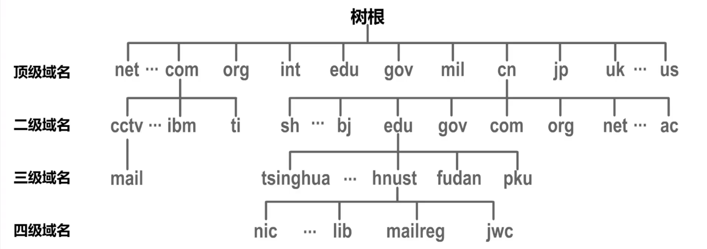
<!-- image-source: https://cdn.nlark.com/yuque/0/2026/png/67474974/1781936002779-e84109ef-955f-4462-ac00-d2f410e2542c.png -->

+ `cctv.com`、`ibm.com`、`mit.com` 属于 `.com` 顶级域名下的二级域名。
+ `tsinghua.edu.cn`、`hnust.edu.cn` 属于 `.edu.cn` 二级域名下的三级域名（分别代表清华大学、湖南科技大学）。
+ `nic.hnust.edu.cn` 则是湖南科技大学下属的四级域名（代表网络信息中心）。

为了实现高效的分布式解析，域名服务器被划分为以下四种类型：

| 服务器类型 | 职责与特点 |
| :--- | :--- |
| **根域名服务器** | 最高层次的服务器。全球共有 13 个逻辑根服务器（实际由分布在全球的集群构成，采用 **Anycast 任播技术**）。它们知道所有顶级域名服务器的 IP 地址，通常不直接解析最终 IP，而是返回顶级域名服务器的地址。 |
| **顶级域名服务器 (TLD)** | 负责管理在该顶级域名（如 `.com` 或 `.cn`）下注册的所有二级域名。返回权威域名服务器的 IP 地址或最终结果。 |
| **权威域名服务器**   _(部分教材称“权限域名服务器”)_ | 负责管理某个区（Zone）的域名。每个主机的域名必须在某台权威域名服务器处注册。它保存了该辖区内域名到 IP 地址的最终映射关系。 |
| **本地域名服务器**   _(默认域名服务器)_ | **不属于**上述层次结构。当主机发起 DNS 请求时，首先发送给本地域名服务器（通常由 ISP 提供）。它充当代理，负责向层次结构中的其他服务器发起查询。离用户较近，其 IP 地址需配置在用户主机的网络设置中。 |


---

### 4.域名解析过程与高速缓存
DNS 解析主要采用两种查询方式：**递归查询**与**迭代查询**。

#### （1）查询方式

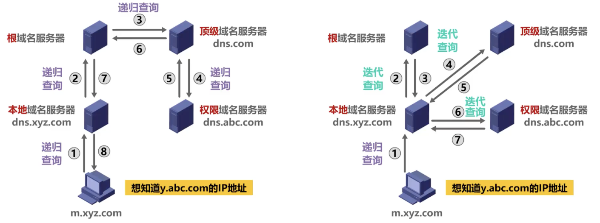
<!-- image-source: https://cdn.nlark.com/yuque/0/2026/png/67474974/1781937142889-09b0ce3e-4748-49c8-be87-d7bc5f46dfba.png -->

+ **递归查询 (Recursive Query)**：  
请求者要求被请求者必须给出最终答案（IP 地址或报错）。如果被请求者不知道，它必须自己去向其他服务器查询，直到获得结果。这种方式对被查询服务器的负担极大。
    - **应用场景**：通常仅用于 **用户主机** $\rightarrow$ **本地域名服务器** 之间的查询。
+ **迭代查询 (Iterative Query)**：  
被请求者如果不知道最终答案，会返回“下一步你应该去问谁”的提示（即下一级服务器的 IP 地址），由请求者自己去发起新的查询。
    - **应用场景**：通常用于 **本地域名服务器** $\rightarrow$ **根/顶级/权威域名服务器** 之间的查询。
    - **标准解析流程**：主机向本地 DNS 发起递归查询 $\rightarrow$ 本地 DNS 向根 DNS 发起迭代查询 $\rightarrow$ 根 DNS 返回 TLD DNS IP $\rightarrow$ 本地 DNS 向 TLD DNS 查询 $\rightarrow$ TLD DNS 返回权威 DNS IP $\rightarrow$ 本地 DNS 向权威 DNS 查询 $\rightarrow$ 获得最终 IP 并返回给主机。

#### （2）高速缓存 (DNS Cache)
为了提高查询效率并减轻根服务器负担，DNS 系统广泛使用了高速缓存机制。


.png)
<!-- image-source: https://cdn.nlark.com/yuque/0/2026/png/67474974/1781937276042-1ec81b2f-07b2-4269-97d1-f444c68c851c.png -->

+ **工作原理**：本地 DNS 服务器和主机操作系统都会缓存最近查询过的域名及其 IP 映射。
+ **TTL (生存时间)**：由于域名与 IP 的映射关系并非永久不变（如服务器迁移、负载均衡调度），缓存中的每条记录都带有一个 TTL 计时器。超过 TTL 的记录会被自动删除，以保证数据的最终一致性。

不但在本地域名服务器中需要高速缓存，在用户主机中也很需要。许多用户主机在启动时从本地域名服务器下载域名和ip地址的全部数据库，维护存放自己最近使用的域名的高速缓存，并且只在从缓存中找不到域名时才向域名服务器查询。同理，主机也需要保持高速缓存中内容的正确性。

#### （3）完整的 DNS 解析链路 (从输入 URL 到获取 IP)
当用户在浏览器输入 `www.example.com` 并按下回车时，完整的解析过程如下：

1. **浏览器缓存 (Browser Cache)**：浏览器首先检查自身的 DNS 缓存（如 Chrome 的 `chrome://net-internals/#dns`）。若命中，直接返回 IP。
2. **操作系统缓存 (OS Cache)**：若浏览器未命中，查询 OS 级别的缓存（如 Windows 的 DNS Client 服务或 Linux 的 `systemd-resolved`）。
3. **本地 Hosts 文件**：若 OS 缓存未命中，读取本地 Hosts 文件（Windows: `C:\Windows\System32\drivers\etc\hosts`，Linux: `/etc/hosts`）。若存在静态映射，直接返回。
4. **本地 DNS 服务器 (Local DNS)**：若以上均未命中，OS 将 DNS 请求发送给配置的本地 DNS 服务器（如 ISP 提供的 DNS 或 `114.114.114.11`）。**此步骤主机向本地 DNS 发起的是递归查询**。
5. **根域名服务器 (Root DNS)**：本地 DNS 若无缓存，向根服务器发起**迭代查询**。根服务器返回 `.com` TLD 服务器的 IP 地址。
6. **顶级域名服务器 (TLD DNS)**：本地 DNS 向 `.com` TLD 服务器发起**迭代查询**。TLD 服务器返回 `example.com` 权威 DNS 服务器的 IP 地址。
7. **权威域名服务器 (Authoritative DNS)**：本地 DNS 向权威服务器发起**迭代查询**。权威服务器查询其区域文件（Zone File），返回 `www.example.com` 的最终 IP 地址。
8. **结果返回与缓存**：本地 DNS 将最终 IP 返回给客户端 OS，OS 返回给浏览器。同时，本地 DNS 和客户端 OS 均根据 TTL 将该记录写入各自的高速缓存。

#### （4）特殊记录 (CNAME) 对解析过程的影响
在实际工程中，域名往往配置了 **CNAME (别名记录)**（常用于 CDN 调度或负载均衡）。

+ 如果权威服务器返回的不是 A 记录（IP 地址），而是 CNAME 记录（例如 `www.example.com` 别名指向 `cdn.example.com`），则本地 DNS 必须**重启解析流程**。
+ 本地 DNS 会对 `cdn.example.com` 再次从根服务器（或直接查询缓存）开始迭代查询，直到获取最终的 A 记录。这会增加额外的 RTT（往返时间）开销。

---

### 5.考研真题解析

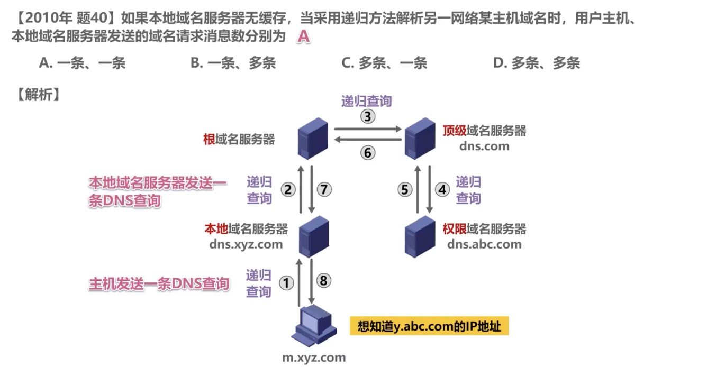
<!-- image-source: https://cdn.nlark.com/yuque/0/2026/png/67474974/1781937432389-5094e609-3992-495b-bc84-4031f3ba0288.png -->

+ **考点**：递归查询与迭代查询的流程区别。
+ **解析**：题目考察主机向本地 DNS 发送查询后，本地 DNS 无缓存时的行为。本地 DNS 收到主机的**递归查询**委托后，会向根 DNS 发送**迭代查询**（或代表主机继续向下查询）。理解“谁委托谁负责”是解题关键。
+ **答案**：选项 A。

---


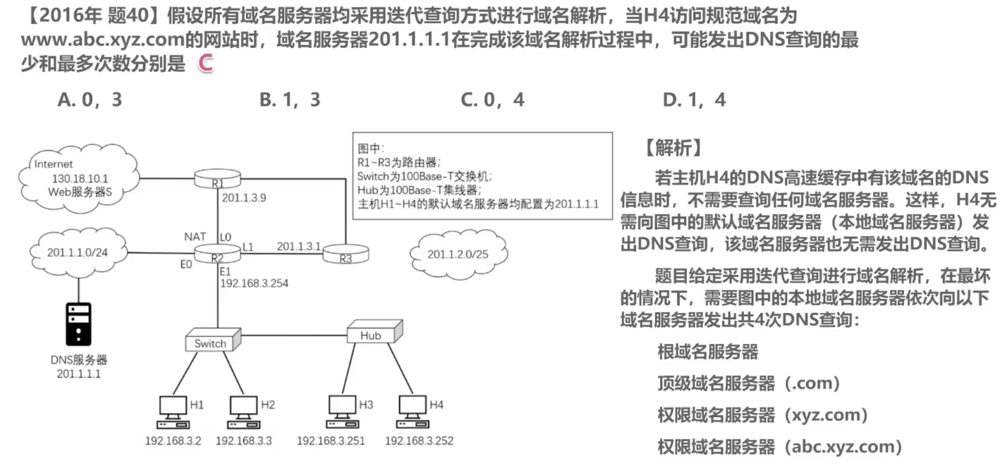
<!-- image-source: https://cdn.nlark.com/yuque/0/2026/png/67474974/1781937468000-5ad6f6b7-358a-4f4c-8eee-0a037c14cabb.png -->

+ **考点**：DNS 缓存的作用与迭代查询的最坏情况次数。
+ **解析**：
    1. 若主机 H4 本地缓存有该域名信息，则直接返回，无需向本地 DNS 和外部 DNS 发送任何查询报文。
    2. 若采用迭代查询，在最坏情况下（所有层级的 DNS 服务器均无缓存），本地 DNS 需要依次向：根 DNS $\rightarrow$ `.com` TLD DNS $\rightarrow$ `xyz.com` 权威 DNS $\rightarrow$ `abc.xyz.com` 权威 DNS 发出查询。共计 **4 次**外部 DNS 查询。
+ **答案**：选项 C。

---

### 6.DNS 协议基础与安全机制
**1.传输层协议与端口**

+ **默认协议**：DNS 报文主要使用运输层的 **UDP 协议**进行封装，熟知端口号为 **53**。UDP 的无连接特性使其具有极低的延迟，适合短小的查询请求。
+ **TCP 的使用场景**：当 DNS 响应报文长度超过 512 字节（UDP 限制），或者在进行**区域传送 (Zone Transfer)**（主从 DNS 服务器同步整个区域的数据库）时，DNS 会使用 **TCP 协议**（端口同样为 53）以保证数据的可靠传输。

**2. DNS 安全问题**

由于传统 DNS 协议基于明文 UDP 传输且缺乏源验证机制，容易遭受多种安全攻击：

+ **DNS 劫持/污染**：攻击者在网络链路中伪造 DNS 响应报文，将域名解析到恶意的 IP 地址，从而实现流量窃听或审查。
+ **防御机制**：现代网络引入了 **DNSSEC**（域名系统安全扩展）以验证响应的数字签名，以及 **DoT (DNS over TLS)** 和 **DoH (DNS over HTTPS)** 来加密 DNS 查询流量，防止中间人窃听与篡改。

---

### 7.DNS 技术实践 (补充拓展)
对于 C++ 后端开发工程师而言，DNS 解析不仅是网络通信的第一步，更是影响系统高并发性能与稳定性的关键环节。在实际开发中需重点关注以下技术细节：

**1. 同步阻塞 vs 异步非阻塞解析**

+ **传统 API 的缺陷**：C 标准库提供的 `gethostbyname` 和 POSIX 标准的 `getaddrinfo` 都是**同步阻塞**的。在高并发 C++ 服务器（如基于 `epoll` 的 Reactor 模型）中，如果在主工作线程中调用这些函数，一旦遇到 DNS 响应缓慢或超时，将直接阻塞整个事件循环，导致服务器吞吐量断崖式下跌。
+ **异步 DNS 解决方案**：在生产级 C++ 后端中，通常引入异步 DNS 解析库（如 **c-ares**、**libuv** 的 DNS 模块，或 Boost.Asio 的异步解析接口）。这些库通过非阻塞 Socket 和状态机在后台完成 UDP 交互，解析完成后通过回调函数通知主线程，彻底消除阻塞瓶颈。

**2. 本地 DNS 缓存与连接池优化**

+ **减少解析开销**：频繁调用系统 DNS 解析不仅耗时，还可能触发本地 DNS 服务器的限流。C++ 后端服务通常会在应用层维护一个**带 TTL 的本地 DNS 缓存 (Local DNS Cache)**。
+ **动态 IP 适配**：对于依赖域名访问的下游微服务或数据库，后端连接池需具备**DNS 重解析机制**。当缓存 TTL 过期或检测到连接异常断开时，触发后台异步重解析，平滑切换到新的 IP 地址，实现无感知的故障转移与负载均衡。

**3. UDP 截断与 TCP 降级处理**

+ **EDNS0 扩展**：传统的 DNS UDP 报文限制在 512 字节。现代 DNS 支持 EDNS0 扩展，允许 UDP 报文达到 1220 字节或更大。在 C++ 中自行实现 DNS 客户端时，必须在请求报文中附加 OPT 伪记录以声明支持大报文。
+ **TCP Fallback (降级)**：如果 UDP 响应报文的 `TC` (Truncated) 标志位被置 1，表示报文被截断。健壮的 C++ DNS 客户端必须能够自动捕获该标志，并立即**降级使用 TCP 协议**向同一服务器的 53 端口重新发起查询，以获取完整的 DNS 记录（如包含大量 IP 的 A 记录或复杂的 TXT 记录）。

---

## 五、文件传送协议FTP
### 1. FTP 协议概述与历史背景
文件传送协议（File Transfer Protocol, FTP）是因特网上使用最广泛的文件传送标准。作为一项基础的网络应用，它旨在解决将文件从一台计算机通过网络传送到另一台可能相距甚远的计算机中的问题。

**核心特性：**

+ **交互式访问**：FTP 允许客户指明文件的类型与格式（例如指定是否使用 ASCII 码或二进制模式传输）。
+ **存取权限控制**：支持身份验证机制，访问文件的用户通常需要经过授权并输入有效的口令（也支持匿名访问）。
+ **跨平台兼容性**：FTP 屏蔽了底层各计算机操作系统的细节差异，使其非常适用于在异构网络中的任意计算机之间进行文件传送。

**历史地位**：在因特网发展的早期阶段，FTP 产生的通信量曾占据整个因特网总通信量的三分之一，甚至超过了早期的电子邮件和域名系统（DNS）。直到 1995 年，随着万维网（WWW）的爆发式普及，HTTP 协议的通信量才首次超越 FTP。

### 2. FTP 的典型应用场景与访问方式
FTP 采用经典的**客户-服务器 (C/S) 架构**。FTP 客户机可将各种类型的文件上传（Upload）至 FTP 服务器，或从服务器下载（Download）文件。根据业务需求，FTP 服务器既可以是企业级的高性能、高可靠性集群，也可以是一台普通的个人计算机。


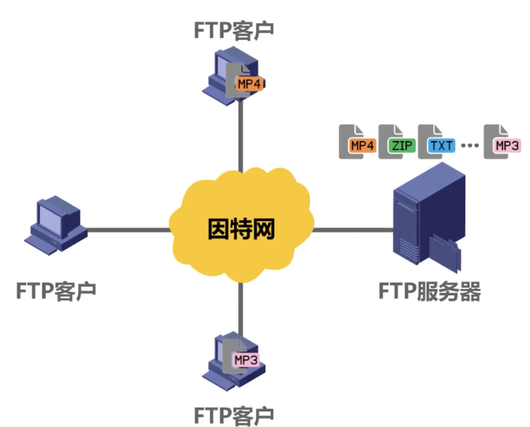
<!-- image-source: https://cdn.nlark.com/yuque/0/2026/png/67474974/1781938412681-c791d9e8-c063-4774-b21b-e249b2af5b23.png -->

**常见用途：**

+ 在计算机之间进行大批量文件的可靠传输。
+ 网站开发者将构成网站内容的大量静态资源（HTML、CSS、图片等）批量上传至 Web 服务器。

**客户端访问方式：**

1. **浏览器访问**：在浏览器地址栏输入 `ftp://[服务器IP]`。_(注：出于安全考虑，现代主流浏览器如 Chrome、Edge 已逐步移除对 FTP 协议的原生支持，目前多需借助插件或专用客户端。)_


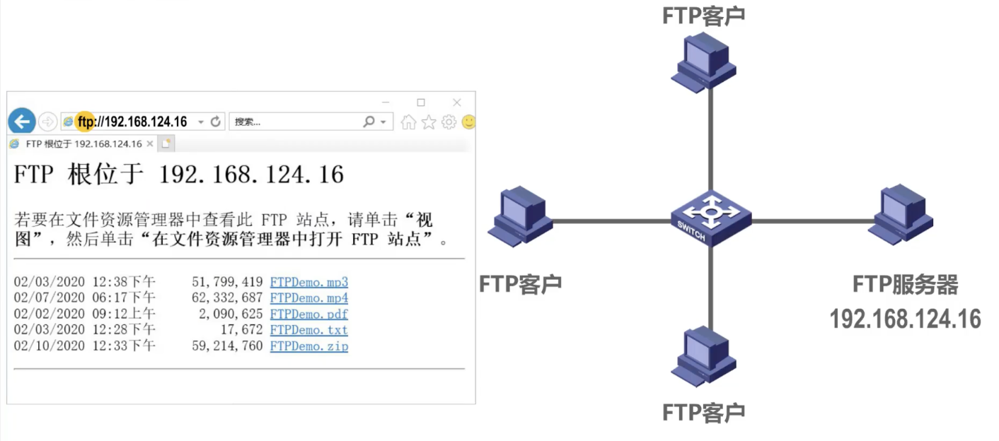
<!-- image-source: https://cdn.nlark.com/yuque/0/2026/png/67474974/1781938604596-420bfaf7-619d-4736-a3d7-a6c4aa8e3095.png -->

2. **命令行工具**：使用操作系统自带的 FTP 命令行客户端（如 Windows 的 `ftp` 命令或 Linux 的 `ftp`/`lftp`）。支持匿名登录（Anonymous）或账号登录，通过 `ls`、`get`、`put` 等指令进行操作。此方式对普通用户不够友好。


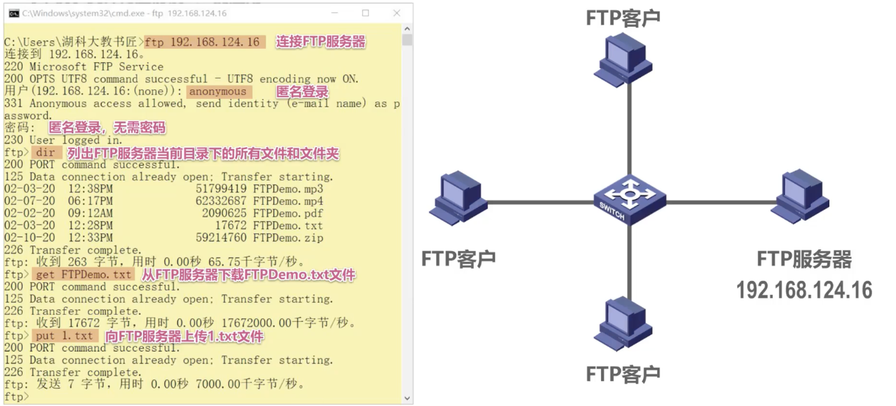
<!-- image-source: https://cdn.nlark.com/yuque/0/2026/png/67474974/1781938652440-f358fc84-2028-4818-b967-9842baaa165c.png -->

3. **第三方 GUI 客户端**：大多数用户使用如 FileZilla、WinSCP 等图形化工具，通过直观的拖拽界面完成登录、上传与下载。


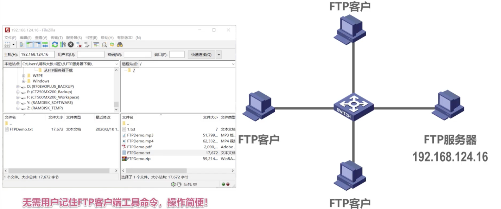
<!-- image-source: https://cdn.nlark.com/yuque/0/2026/png/67474974/1781938681421-611caded-e589-4131-bdd4-583592f96654.png -->

### 3. FTP 的核心工作原理 (双连接机制)
FTP 协议最显著的设计特点是使用了**两个并行的 TCP 连接**来完成文件传输：控制连接和数据连接。

**1.控制连接 (Control Connection)**


.png)
<!-- image-source: https://cdn.nlark.com/yuque/0/2026/png/67474974/1781938809796-1f56ccda-cf3c-4f6c-94dc-9cb23af8eb86.png -->

+ **建立方式**：FTP 服务器在熟知端口 **TCP 21** 监听。客户端随机选择一个临时端口，主动向服务器的 21 端口发起 TCP 连接。
+ **生命周期**：控制连接在整个 FTP 会话期间**始终保持打开状态**。
+ **功能**：专门用于在客户与服务器之间传送 FTP 控制命令（如 `USER`, `PASS`, `LIST`, `RETR`, `STOR` 等）以及服务器的响应状态码。

**2.数据连接 (Data Connection) 与传输模式**

数据连接专门用于实际的文件数据传输或目录列表的获取。它在每次需要传输数据时才建立，传输结束后立即关闭。根据数据连接建立方式的不同，FTP 分为**主动模式**和**被动模式**。

**主动模式 (Active Mode / PORT 命令)**


.png)
<!-- image-source: https://cdn.nlark.com/yuque/0/2026/png/67474974/1781938954398-584477af-ad31-42b3-9e49-53dc6bb1010b.png -->

+ **建立过程**：客户端通过控制连接发送 `PORT` 命令，告知服务器自己用于接收数据的临时端口号（如端口 X）。随后，**FTP 服务器主动**使用自己的熟知端口 **TCP 20** 作为源端口，向客户端的端口 X 发起 TCP 连接，从而建立数据通道。
+ **特点**：服务器主动连接客户端。在客户端处于 NAT（网络地址转换）或防火墙后时，服务器往往无法直接穿透连接到客户端的内部端口，导致主动模式 frequently 失败。

**被动模式 (Passive Mode / PASV 命令)**


.png)
<!-- image-source: https://cdn.nlark.com/yuque/0/2026/png/67474974/1781939021975-1066ab03-6e88-44ef-ab3f-15bf26d27f36.png -->

+ **建立过程**：客户端通过控制连接发送 `PASV` 命令。服务器收到后，开启一个协商好的临时高端口（如端口 Y），并通过控制连接将端口 Y 的号码告知客户端。随后，**FTP 客户端主动**发起 TCP 连接，连接到服务器的端口 Y，从而建立数据通道。
+ **特点**：服务器被动等待客户端连接。此模式完美解决了客户端位于 NAT/防火墙后无法接收外部连接的问题，是现代 FTP 客户端默认使用的模式。

### 4. 经典考研真题解析

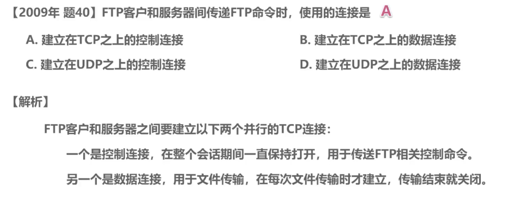
<!-- image-source: https://cdn.nlark.com/yuque/0/2026/png/67474974/1781939066872-705605ad-a4f2-4a1d-bbdf-a55ba19a93bf.png -->

+ **考点**：FTP 控制连接与数据连接的生命周期。
+ **解析**：FTP 客户和服务器之间建立两个并行的 TCP 连接。控制连接在整个会话期间一直保持打开，用于传送控制命令；数据连接仅在每次文件传输（或目录列表获取）时建立，传输结束即关闭。
+ **正确答案**：选项 A（控制连接在整个会话期间保持打开，数据连接在传输时建立，结束关闭）。

---


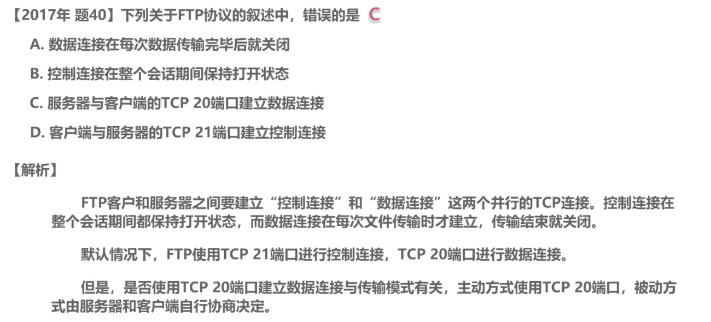
<!-- image-source: https://cdn.nlark.com/yuque/0/2026/png/67474974/1781939153385-934fad6c-d70d-447b-b539-deb88881805e.png -->

+ **考点**：FTP 默认端口号及传输模式对端口的影响。
+ **解析**：默认情况下，FTP 使用 TCP 21 号端口进行控制连接。对于数据连接，**只有在主动模式下**，服务器端才固定使用 TCP 20 号端口作为源端口；而在被动模式下，服务器端使用的是随机协商的高端口，并非 20 端口。
+ **正确答案**：选项 C（控制连接使用 TCP 21，数据连接是否使用 TCP 20 取决于传输模式，主动模式使用，被动模式协商）。

### 5. C++ 开发视角下的 FTP 协议 (补充拓展)
对若需开发自定义的 FTP 服务端（如用于内部日志收集、固件升级分发）或高性能 FTP 客户端，需深入理解以下底层技术细节：

#### 5.1 基于文本的命令交互与状态机
FTP 控制连接传输的是纯文本命令。服务端开发时，需要实现一个健壮的**协议状态机**来解析客户端发来的指令（如 `USER admin\r\n`）。必须严格处理 TCP 粘包/半包问题，以 `\r\n` 作为命令分隔符进行拆包，并返回标准的三位数字状态码（如 `220 Service ready`, `331 User name okay, need password`, `530 Login incorrect`）。

#### 5.2 NAT 穿透与防火墙配置 (核心痛点)
+ **主动模式的困境**：如果 C++ 服务端部署在公网，而客户端在内网，主动模式下服务端无法主动连接客户端的内网 IP 和端口。
+ **被动模式的 ALG 问题**：在被动模式下，客户端连接服务端的随机高端口。如果服务端部署在 NAT 网关后，服务端在 `PASV` 响应中返回的是其**内网 IP**，导致公网客户端无法连接。
+ **解决方案**：在后端架构中，通常需要在 FTP 服务端配置**被动模式端口范围 (Passive Port Range)**，并在云服务器的安全组/防火墙上放行该端口段；同时配置**公网 IP 映射 (Masquerade Address)**，强制服务端在 `PASV` 响应中返回公网 IP 而非内网 IP。

#### 5.3 高并发模型设计
在 C++ 中实现高性能 FTP 服务器时，不能为每个控制连接和数据连接都分配一个独立线程（Thread-per-connection），这会导致资源耗尽。

+ **Reactor 模型**：控制连接（长连接、小数据量）非常适合使用 `epoll` 等 I/O 多路复用技术进行非阻塞管理。
+ **异步数据传输**：数据连接（短连接、大数据量）在建立后，可将其注册到独立的线程池或使用异步 I/O（如 Linux 的 `io_uring` 或 `AIO`）来处理大文件的磁盘读写与网络发送，避免阻塞控制连接的事件循环。

---

## 六、电子邮件
### 1.电子邮件系统概述
电子邮件（Email）是因特网上最早流行且至今最重要、最实用的应用之一。与传统的实时电话通信相比，电子邮件具有显著的异步通信优势：它不要求主叫和被叫双方同时在场，也不会不必要地打断用户的工作与休息。

电子邮件的工作模式类似于邮政系统：发件人将邮件发送至自己的邮件服务器，该服务器根据目的地址将邮件转发至收件人的邮件服务器，收件人可在方便时登录服务器获取邮件。其具备使用方便、传递迅速、费用低廉的特点，且支持多媒体附件。由于电子邮件的普及，传统的电报业务已在世界多国（包括我国）逐渐退出历史舞台。

**系统架构与核心组件：**

电子邮件系统采用经典的**客户-服务器 (C/S) 架构**，主要由以下三个核心构件组成：


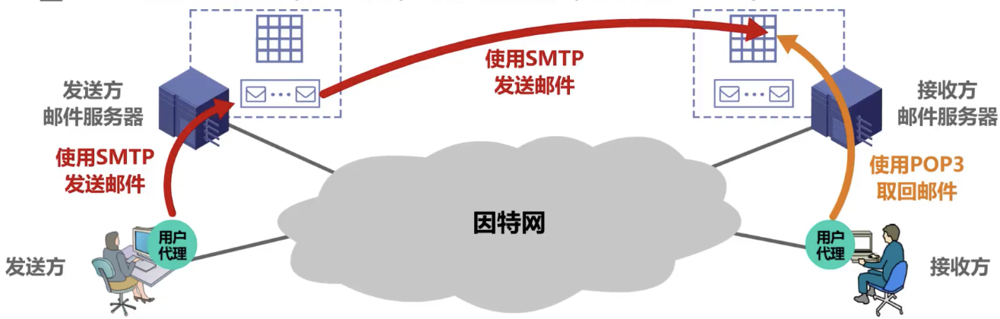
<!-- image-source: https://cdn.nlark.com/yuque/0/2026/png/67474974/1781939596470-971fd6a7-3823-47e0-a479-686acb2697e0.png -->

1. **用户代理 (User Agent, UA)**：
    - 即电子邮件客户端软件（如 Outlook、Foxmail、手机邮件 App）。
    - 它是用户与电子邮件系统的接口，负责邮件的撰写、编辑、发送、读取和管理。
2. **邮件服务器 (Mail Server)**：
    - 电子邮件系统的基础设施。因特网上的服务提供商（ISP）或企业均部署有邮件服务器。
    - 负责接收、发送、转发邮件，并持久化维护用户的邮箱数据。
3. **电子邮件协议**：
    - 规定了用户代理与邮件服务器之间、以及邮件服务器相互之间的通信规则。主要分为**邮件发送协议**（例如SMTP）和**邮件读取协议**（例如POP3、IMAP）两类。


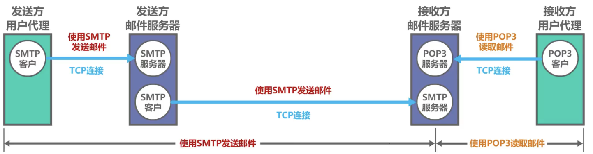
<!-- image-source: https://cdn.nlark.com/yuque/0/2026/png/67474974/1781939804608-d1c78513-4956-4cf0-98d6-5aa4e6781b39.png -->

---

### 2.邮件发送与接收的核心流程
电子邮件的传输过程严格区分了“推（Push）”和“拉（Pull）”的操作：

1. **发送方 UA** $\rightarrow$ **发送方邮件服务器**：使用**邮件发送协议**（如 SMTP）。
2. **发送方邮件服务器** $\rightarrow$ **接收方邮件服务器**：使用**邮件发送协议**（如 SMTP）。
3. **接收方邮件服务器** $\rightarrow$ **接收方 UA**：使用**邮件读取协议**（如 POP3 或 IMAP）。

_注：SMTP 用于将邮件“推”送到服务器，而 POP3/IMAP 用于将邮件从服务器“拉”取到本地客户端。_

---

### 3.简单邮件传送协议 (SMTP) 工作原理
SMTP (Simple Mail Transfer Protocol) 是因特网标准的邮件发送协议。它基于 **TCP 连接**，默认使用熟知端口 **25**。

**交互过程与命令响应：**

SMTP 采用基于文本的命令与应答交互机制。以下是一次典型的邮件发送会话流程：


-工作原理.png)
<!-- image-source: https://cdn.nlark.com/yuque/0/2026/png/67474974/1781941333704-38964036-6464-4d63-96f8-41393f616d30.png -->

+ **连接建立**：TCP 连接成功后，服务器主动发送就绪应答，代码 `220`（如 `220 smtp.163.com ESMTP`）。
+ **身份标识**：客户端发送 `HELO <域名>` 表明身份。服务器若认可，回复 `250 OK`。
+ **指定发件人**：客户端发送 `MAIL FROM:<sender@example.com>`。服务器回复 `250 OK`。
+ **指定收件人**：客户端发送 `RCPT TO:<recipient@example.com>`（可有多个）。服务器检查邮箱是否存在，存在则回复 `250 OK`。
+ **数据传输**：客户端发送 `DATA` 命令。服务器回复 `354 Start mail input; end with <CRLF>.<CRLF>`，表示准备好接收内容。
+ **发送邮件内容**：客户端发送邮件首部和主体，最后以单独一行的 `<CRLF>.<CRLF>`（即回车换行加一个点再加回车换行）作为结束符。服务器接收成功后回复 `250 OK`。
+ **断开连接**：客户端发送 `QUIT`，服务器回复 `221 Bye` 并主动断开 TCP 连接。

_补充：在实际的现代邮件系统中，为了防止滥用，通常在 _`HELO`_ 之后会加入身份认证过程（如 _`AUTH LOGIN`_），并使用 _`STARTTLS`_ 命令将明文连接升级为加密连接。_

---

### 4.电子邮件的信息格式与 MIME 扩展
#### （1）邮件格式标准 (RFC 5322)
电子邮件的信息格式由 RFC 822 定义（现已更新为 **RFC 5322**）。一封完整的电子邮件由**信封 (Envelope)** 和**内容 (Content)** 组成，而内容又分为**首部 (Header)** 和**主体 (Body)**。

+ **信封**：包含 SMTP 协议交互所需的底层路由信息（如 `MAIL FROM` 和 `RCPT TO`），由邮件系统自动提取并生成，用户无需手动填写。
+ **首部**：包含用户可见的元数据，关键字段包括：
    - `From`：发件人地址（通常由系统自动填入）。
    - `To`：主要收件人地址（必填）。
    - `Cc`：抄送人地址（Carbon Copy）。
    - `Subject`：邮件主题（必填，反映核心内容）。
    - `Date`：发送时间。
+ **主体**：用户撰写的核心文本信息。首部和主体之间必须用一个**空行**隔开。


.png)
<!-- image-source: https://cdn.nlark.com/yuque/0/2026/png/67474974/1781941445303-2e63c429-0aff-4cfa-b44a-d396ec775f0b.png -->

#### （2）MIME (多用途因特网邮件扩展)
**痛点**：早期的 SMTP 协议设计仅支持传送 **7位 ASCII 码文本数据**。它无法直接传输可执行文件、二进制对象（图片、音视频），甚至无法直接传输非英语字符（如中文、俄文或带重音符号的法文）。

**解决方案**：引入 **MIME (Multipurpose Internet Mail Extensions)** 协议。

+ **工作原理**：在发送端，MIME 将非 ASCII 数据（如二进制附件或 UTF-8 中文）通过特定的编码算法（如 **Base64** 或 **Quoted-Printable**）转换为合法的 ASCII 字符流，然后再通过 SMTP 传输。接收端收到后，再进行逆向解码还原。


.png)
<!-- image-source: https://cdn.nlark.com/yuque/0/2026/png/67474974/1781941645648-c4b65d1a-98ca-40c1-b489-4d68a79d36a2.png -->

+ **新增首部字段**：MIME 在邮件首部增加了 `MIME-Version`、`Content-Type`（定义数据类型，如 `text/html`, `image/jpeg`）、`Content-Transfer-Encoding`（定义编码方式）等字段，实现了多媒体邮件表示方法的标准化。
+ **跨界应用**：MIME 不仅用于电子邮件，后来也被广泛应用于 **HTTP 协议**中（如 HTTP 响应头中的 `Content-Type: application/json` 即源自 MIME 标准）。

---

### 5.邮件读取协议：POP3 与 IMAP
当邮件到达接收方服务器后，用户代理需要将其读取到本地。常用的读取协议有以下两种：

| 特性 | POP3 (邮局协议第3版) | IMAP4 (因特网邮件访问协议第4版) |
| :--- | :--- | :--- |
| **默认端口** | TCP 110 (加密: 995) | TCP 143 (加密: 993) |
| **工作模式** | 离线/下载模式 | 联机/同步模式 |
| **核心功能** | 功能简单。通常采用“下载并删除”或“下载并保留”方式将邮件拉取到本地。 | 功能强大。允许客户端直接操作服务器端的邮箱（如创建文件夹、移动邮件、标记已读）。 |
| **多端同步** | 极差。本地操作（如删除、已读）难以同步到服务器和其他设备。 | 极佳。所有操作直接作用于服务器，多设备登录状态完全一致。 |


**基于万维网的电子邮件 (Webmail)**

如今大量用户直接使用浏览器访问邮件网站（如网页版网易、Gmail）。

+ **协议差异**：在 Webmail 模式下，用户浏览器与邮件服务器之间使用的是 **HTTP/HTTPS 协议**，而非 SMTP 或 POP3/IMAP。


<!-- image-source: https://cdn.nlark.com/yuque/0/2026/png/67474974/1781941879179-3ba1b999-426e-486a-9369-6fcc80d455a7.png -->

+ **跨域发送**：如果网易用户发给 Gmail 用户，浏览器通过 HTTP 将邮件提交给网易服务器后，**网易服务器与 Gmail 服务器之间依然使用 SMTP 协议**进行跨域转发。


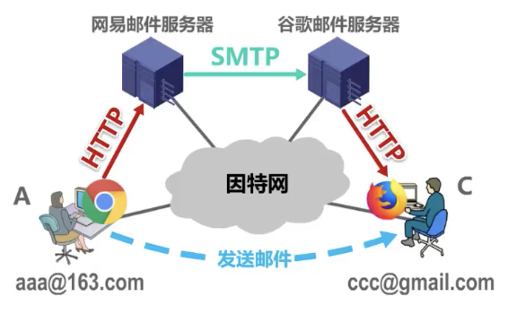
<!-- image-source: https://cdn.nlark.com/yuque/0/2026/png/67474974/1781941920609-724c37c9-5792-4789-ac81-e3b9efcc5efc.png -->

---

### 6.考研真题解析

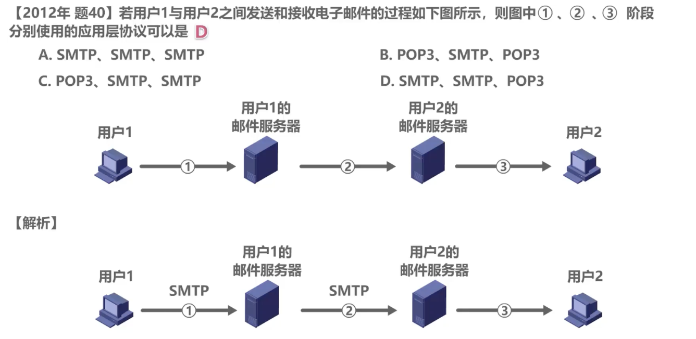
<!-- image-source: https://cdn.nlark.com/yuque/0/2026/png/67474974/1781941954210-d2c957b8-f4fd-4078-b7fe-903e008f820d.png -->

+ **考点**：邮件传输各阶段所使用的协议。
+ **解析**：
    1. 用户一 UA $\rightarrow$ 用户一邮件服务器：发送阶段，使用 **SMTP**。
    2. 用户一邮件服务器 $\rightarrow$ 用户二邮件服务器：转发阶段，使用 **SMTP**。
    3. 用户二邮件服务器 $\rightarrow$ 用户二 UA：读取阶段，使用 **POP3** (或 IMAP)。
+ **答案**：选项 D。

---


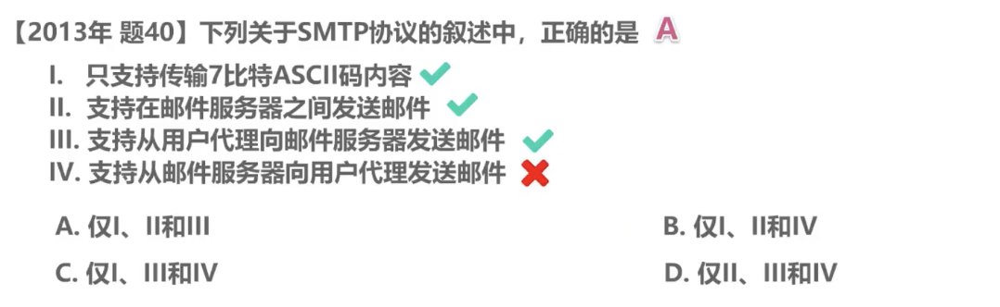
<!-- image-source: https://cdn.nlark.com/yuque/0/2026/png/67474974/1781942043517-d70b8468-8de8-4495-b200-9600005f3ee1.png -->

+ **考点**：SMTP 的局限性与 MIME 的作用。
+ **解析**：
    - 叙述一：SMTP 仅支持 ASCII，非 ASCII 数据需经 MIME 转换。**正确**。
    - 叙述二：邮件服务器之间使用 SMTP。**正确**。
    - 叙述三：UA 向服务器发送邮件使用 SMTP。**正确**。
    - 叙述四：UA 读取邮件只能使用 POP3。**错误**（还可以使用功能更强的 IMAP）。
+ **答案**：选项 A。

---


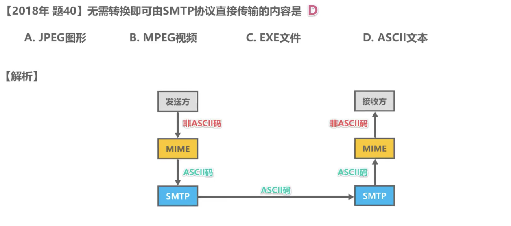
<!-- image-source: https://cdn.nlark.com/yuque/0/2026/png/67474974/1781942069196-682adf98-1fd8-4868-a2a0-b92496447bf3.png -->

+ **考点**：协议与端口的对应关系及工作模式。
+ **解析**：主要考察对 SMTP (25)、POP3 (110)、IMAP (143) 等基础概念的准确记忆与场景判断。
+ **答案**：选项 D。

---

### 7.邮件系统实现 (补充拓展)
对于 C++ 后端开发工程师而言，若需参与企业级邮件网关、高并发邮件推送系统或自定义邮件代理的开发，需深入掌握以下底层技术细节：

#### 1. 高并发网络模型与协议解析
+ **Reactor 模型**：SMTP 和 IMAP 都是基于文本的协议。在处理海量并发连接时，必须使用 `epoll` 等非阻塞 I/O 多路复用技术。
+ **粘包/半包处理**：协议指令以 `\r\n` (CRLF) 为分隔符。在 C++ 中需要实现高效的 Ring Buffer（环形缓冲区）和状态机，准确切割出完整的命令或数据块，防止 TCP 粘包导致解析错误。
+ **IMAP 的复杂性**：与 SMTP 的同步阻塞模型不同，IMAP 支持**带标签的并发命令**（Tagged Commands，如 `A001 FETCH...`），允许客户端在同一个 TCP 连接上同时发起多个请求。服务端必须实现精细的会话状态机和异步任务调度来处理这些并发指令。

#### 2. MIME 解析与二进制处理
+ **编解码性能**：处理邮件附件时，需要进行大量的 Base64 编解码。在 C++ 中应使用经过 SIMD 指令集（如 AVX2）优化的 Base64 库，以提升大文件的吞吐率。
+ **多部分表单 (Multipart)**：邮件常包含复杂的嵌套结构（如 `multipart/mixed` 嵌套 `multipart/alternative`）。需要编写健壮的树状解析器来提取 HTML 正文、纯文本备用正文以及各类附件，并严格处理内存，防止畸形邮件导致的内存泄漏或越界访问。

#### 3. 安全传输与加密 (TLS/SSL)
+ 现代邮件系统强制要求加密传输（SMTPS 465, Submission 587, IMAPS 993）。
+ 在 C++ 后端中，通常需要集成 **OpenSSL**、**mbedTLS** 或 **BoringSSL**。需要妥善处理 TLS 握手过程、证书链验证、SNI (Server Name Indication) 支持，以及在使用 `STARTTLS` 命令时，将明文 Socket 平滑升级为加密 Socket 的状态切换逻辑。

#### 4. 反垃圾邮件与防伪协议 (SPF/DKIM/DMARC)
+ 作为邮件发送网关，C++ 服务端必须实现邮件防伪机制以确保送达率。
+ **DKIM (DomainKeys Identified Mail)**：需要在 C++ 中对邮件首部和主体进行 canonicalization（标准化）处理，计算哈希值，并使用 RSA 或 Ed25519 算法生成数字签名，插入到邮件首部。这要求后端具备高效的密码学运算能力和异步 DNS 查询能力（用于验证公钥）。

---

## 七、万维网
### 1. 万维网概述与浏览器架构
**万维网 (World Wide Web, WWW)** 并非某种特殊的计算机网络，而是一个大规模的、联机式的信息储藏所，是运行在因特网上的一个分布式应用。它利用超链接 (Hyperlink) 将分布在全球不同服务器上的网页连接成一张逻辑上的信息网。

+ **发展历史**：万维网由欧洲核子研究中心 (CERN) 的 Tim Berners-Lee 于 1989 年提出；1993 年诞生了首个图形界面浏览器 Mosaic；1995 年 Netscape (网景) 浏览器上市，推动了 Web 的商业化普及。


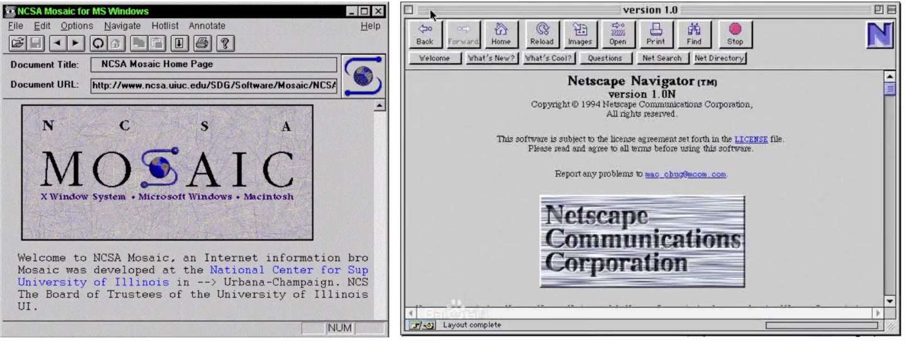
<!-- image-source: https://cdn.nlark.com/yuque/0/2026/png/67474974/1781942350308-c9c4a56b-f07d-46cd-989f-2431f940a7f0.png -->

+ **浏览器内核**：浏览器的核心是**渲染引擎**（即浏览器内核），负责对网页内容进行解析和渲染显示。主流内核包括 Blink (Chrome, Edge)、WebKit (Safari)、Gecko (Firefox) 等。由于不同内核对 Web 标准的解析存在差异，前端开发通常需要进行跨浏览器兼容性测试。

### 2. 统一资源定位符 (URL) 与万维网文档
**1.统一资源定位符 (URL)**

为了方便定位和访问全球范围内的资源，万维网使用 URL (Uniform Resource Locator) 来指明因特网上任何种类资源的位置。其标准格式由四部分组成：  
`<协议>://<主机>:<端口>/<路径>`  
_示例：_`http://www.hnust.edu.cn:80/index.html`

**2.万维网文档技术栈**

现代 Web 页面通常由前端“三剑客”协同构建，这些文档部署在服务器端（静态文件或后端动态生成），并通过网络传输至浏览器进行解析：


-与万维网文档.png)
<!-- image-source: https://cdn.nlark.com/yuque/0/2026/png/67474974/1781942698067-1e4131fb-a9c6-431a-bc29-90a47c23fd82.png -->

+ **HTML (超文本标记语言)**：使用标签定义网页的**结构与内容**（如 `<head>`, `<body>`, `<p>`, `<button>`）。


-与万维网文档.png)
<!-- image-source: https://cdn.nlark.com/yuque/0/2026/png/67474974/1781943046151-89c03059-354b-496b-b4a9-b502ca726536.png -->

+ **CSS (层叠样式表)**：从视觉角度定义网页的**样式与布局**（如颜色、字体大小、像素）。


-与万维网文档.png)
<!-- image-source: https://cdn.nlark.com/yuque/0/2026/png/67474974/1781943374493-fb23d605-98de-48e0-a23d-c759fa0acef0.png -->


-与万维网文档.png)
<!-- image-source: https://cdn.nlark.com/yuque/0/2026/png/67474974/1781943390391-b2131ce3-a169-422c-91ca-a800622d8110.png -->

+ **JavaScript (JS)**：一种脚本语言，用于控制网页的**动态行为与交互逻辑**（如响应点击事件、修改 DOM 元素）。


-与万维网文档.png)
<!-- image-source: https://cdn.nlark.com/yuque/0/2026/png/67474974/1781943328633-8059449b-6cc9-459d-b4b3-43187a3e2b85.png -->


-与万维网文档.png)
<!-- image-source: https://cdn.nlark.com/yuque/0/2026/png/67474974/1781943352013-9b9d9522-c802-420a-b11e-12f8b63e11b5.png -->

### 3. HTTP 协议基础与连接管理
**超文本传输协议 (HTTP)** 是 TCP/IP 体系应用层的核心协议，定义了浏览器（客户进程）如何向 Web 服务器请求文档，以及服务器如何传送文档。HTTP 基于 **TCP 连接**，默认使用熟知端口 **80**（HTTPS 使用 443）。


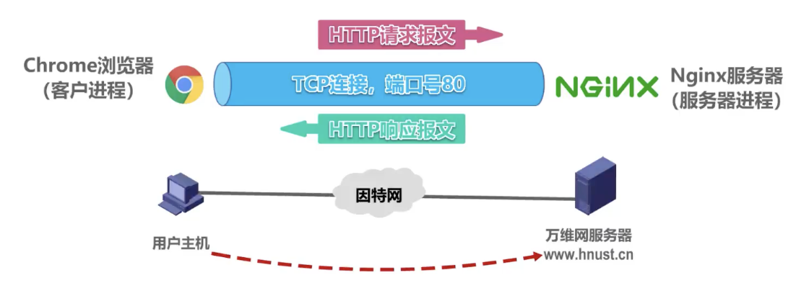
<!-- image-source: https://cdn.nlark.com/yuque/0/2026/png/67474974/1781943507618-f067c58e-f1a5-4739-bcac-44ef31ab9ad1.png -->

#### HTTP/1.0：非持续连接
在 HTTP/1.0 中，默认采用非持续连接方式。每请求一个对象（如 HTML 文件、图片）都需要经历以下步骤：

1. 建立 TCP 连接（1 个 RTT，往返时间）。
2. 发送 HTTP 请求并接收响应（1 个 RTT + 文档传输时延）。

**缺陷**：请求一个包含多个引用对象（如图片）的网页时，每个对象都需要额外花费 2 个 RTT 的开销。虽然浏览器可通过建立多个并行 TCP 连接来减少总时延，但这会大量消耗服务器的并发连接资源。


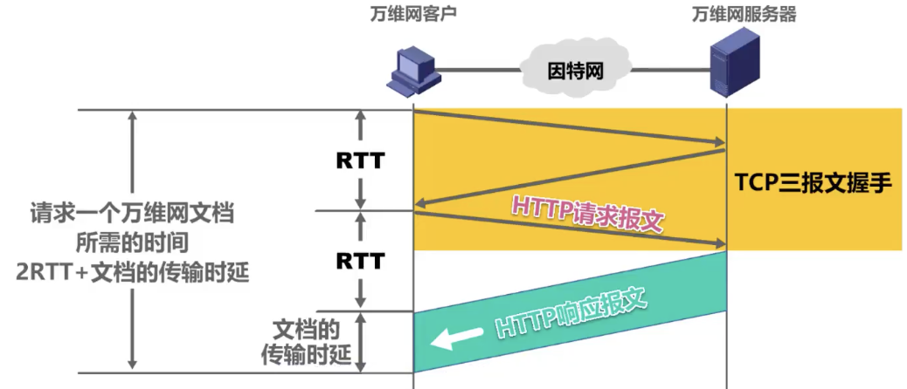
<!-- image-source: https://cdn.nlark.com/yuque/0/2026/png/67474974/1781943574060-74ac285b-e077-4984-9390-75ce5b98bff3.png -->

#### HTTP/1.1：持续连接
HTTP/1.1 默认采用**持续连接 (Persistent Connection)**。服务器在发送响应后保持 TCP 连接打开，后续对同一服务器的请求可复用该连接，省去了重复 TCP 握手的开销。持续连接分为两种工作模式：

+ **非流水线方式**：客户在收到前一个响应后，才能发送下一个请求。
+ **流水线方式 (Pipelining)**：客户每遇到一个对象引用就立即发出请求，无需等待响应。这进一步减少了 RTT 开销和 TCP 连接的空闲时间。（_注：由于存在“队头阻塞”问题，现代浏览器已基本弃用 HTTP/1.1 流水线，转而依赖 HTTP/2 的多路复用机制。_）

### 4. HTTP 报文格式解析
HTTP 是面向文本的协议，报文中的字段均为 ASCII 字符串，长度不固定，字段间以 `CRLF`（回车换行）分隔。

#### 请求报文 (Request)

.png)
<!-- image-source: https://cdn.nlark.com/yuque/0/2026/png/67474974/1781944331957-a61ac305-7fff-4d30-8310-159531858cbb.png -->

**请求行**：由**方法**（如 `GET`, `POST`）、**URL** 和 **HTTP 版本**组成。


.png)
<!-- image-source: https://cdn.nlark.com/yuque/0/2026/png/67474974/1781944349467-29db9774-39ea-4a4b-a300-0df055d3d1a9.png -->

**首部行**：包含多个键值对，如：

1. 基础与客户端信息

+ `Host`：目标服务器的域名及端口号（HTTP/1.1 必填）。用于支持虚拟主机技术，使一台物理服务器能够托管多个不同域名的网站。
+ `User-Agent`：发起请求的客户端软件名称、版本及操作系统信息（如 `Mozilla/5.0 (Windows NT 10.0; Win64; x64)...`）。服务器可据此进行设备适配或反爬虫拦截。
+ `Referer`：指示当前请求是从哪个页面链接跳转过来的（即来源 URL）。常用于访问统计分析、广告归因或服务器的防盗链校验。
+ `Date`：表示请求产生的日期和时间（GMT 格式）。普通浏览器发起的常规网页请求通常不包含此字段，但在后端服务间通信或调用外部 API 时，客户端常携带此字段用于服务器的安全校验（如防止重放攻击、生成签名）或日志审计

2. 内容协商 (Accept 系列)

客户端通过这些字段告知服务器自己“喜欢”或“能够处理”什么样的响应数据：

+ `Accept`：客户端能够接收的响应内容 MIME 类型（标识、描述和传输各种多媒体数据类型的通用基础标准，如 `text/html`, `application/json`, `*/*`）。
+ `Accept-Language`：客户端期望的响应语言优先级（如 `zh-CN,zh;q=0.9,en;q=0.8`，表示优先中文，其次英文）。
+ `Accept-Encoding`：客户端支持的内容压缩/编码算法（如 `gzip`, `deflate`, `br`）。服务器若支持，会对响应体进行压缩以节省网络带宽。

3. 连接与状态管理

+ `Connection`：控制底层 TCP 网络连接的状态。`keep-alive` 表示保持持续连接以复用 TCP 通道，`close` 表示当前请求/响应完成后立即关闭连接。
+ `Cookie`：客户端自动携带的、属于该域名的 Cookie 键值对。这是浏览器自动执行的机制，用于向服务器维持用户的会话状态（如登录态）。
+ `Authorization`：包含客户端访问受保护资源所需的认证凭据。常见格式包括 `Bearer <JWT Token>` 或 `Basic <Base64编码的账号密码>`。

4. 请求体 (实体主体) 描述

_主要用于 _`_POST_`_、_`_PUT_`_、_`_PATCH_`_ 等携带数据载荷的请求方法：_

+ `Content-Type`：指示客户端发送给服务器的请求体数据格式。常见值包括 `application/json`（JSON数据）、`application/x-www-form-urlencoded`（表单数据）、`multipart/form-data`（文件上传）。
+ `Content-Length`：指示请求体的确切字节长度，帮助服务器判断数据是否接收完整。

5. 条件请求 (缓存协商)

+ `If-Modified-Since` / `If-None-Match`：客户端携带本地缓存的资源最后修改时间或 ETag（哈希值），询问服务器资源自该时间/版本后是否发生过更新。若未更新，服务器可返回 `304 Not Modified` 以节省传输带宽。

**空行**：标志首部结束。

**实体主体**：通常用于 `POST` 方法携带提交的数据，`GET` 方法通常为空。

#### 响应报文 (Response)

.png)
<!-- image-source: https://cdn.nlark.com/yuque/0/2026/png/67474974/1782569032760-938d1cd9-6e72-4c12-91d6-e36e9f0885d3.png -->

+ **状态码**


.png)
<!-- image-source: https://cdn.nlark.com/yuque/0/2026/png/67474974/1781944726142-926332b4-8d10-4c6f-b9cf-a000e495d1d1.png -->

**状态行**：由 **HTTP 版本**、**状态码** 和 **状态短语** 组成。

+ `200 OK`：请求成功。
+ `304 Not Modified`：资源未修改（用于缓存协商）。
+ `400 Bad Request`：请求报文存在语法错误。
+ `404 Not Found`：服务器找不到请求的资源。

**首部行**：包含多个键值对，用于向客户端传递服务器的附加信息及实体主体的元数据。常见的首部字段包括：

1. 服务器信息

+ `Server`：处理该请求的服务器软件名称及版本（如 `nginx/1.24.0`, `Apache/2.4.54`）。出于安全考虑，生产环境通常会隐藏或修改此字段以防止版本漏洞被利用。
+ `Date`：表示服务器产生该响应的日期和时间（GMT 格式）。HTTP 规范要求服务器在大多数常规响应中必须包含此字段。客户端常利用此时间作为基准，结合 `Expires` 字段计算缓存的相对过期时间，或用于评估网络传输延迟。
+ `Connectio****n`：服务器告知客户端，本次响应完成后 TCP 连接的状态及逐跳控制。
    - **连接控制**：服务器回复 `keep-alive` 表示同意保持连接，回复 `close` 表示服务器在发送完当前响应后将主动关闭 TCP 连接（例如服务器负载过高、或处理完请求后认为无需保持连接时）。
    - **逐跳控制（进阶）**：与请求报文类似，服务器可通过 `Connection` 列出仅适用于当前连接的响应首部（如 `Connection: Keep-Alive` 或自定义的逐跳首部），代理服务器在转发响应给客户端时必须将其剥离。

2. 内容描述与编码

+ `Content-Type`：声明实体主体中数据的 MIME 媒体类型及字符集（标识、描述和传输各种多媒体数据类型的通用基础标准，如 `text/html; charset=utf-8` 或 `application/json`），指导浏览器或客户端如何正确解析和渲染数据。
+ `Content-Length`：指明实体主体的确切字节长度。对于没有明确长度的流式传输（如分块传输 `Transfer-Encoding: chunked`），此字段会被省略。
+ `Content-Encoding`：指示服务器对实体主体实际采用的压缩/编码方式（如 `gzip`）。它必须与客户端请求时提供的 `Accept-Encoding` 相匹配。

3. 缓存控制

+ `Cache-Control`：HTTP/1.1 引入的核心缓存控制指令，优先级高于 `Expires`。常见值包括：
    - `max-age=3600`：表示资源在 3600 秒内是新鲜的，可直接使用本地缓存。
    - `no-cache`：允许缓存，但在使用前必须向服务器发起条件请求验证是否过期。
    - `no-store`：禁止任何形式的缓存（常用于包含敏感信息的页面）。
+ `Expires`：资源的绝对过期时间（HTTP/1.0 遗留标准，如 `Wed, 21 Oct 2026 07:28:00 GMT`）。由于依赖客户端本地时间，易产生误差，现多被 `Cache-Control` 取代。
+ `Last-Modified`：资源在服务器上的最后修改时间，用于响应客户端的 `If-Modified-Since` 条件请求。
+ `ETag`：资源的特定版本标识符（通常是文件内容或元数据的 Hash 值）。比时间戳更精确，能解决“文件被修改但内容未变”或“一秒内多次修改”导致的缓存误判问题。

4. 状态与重定向

+ `Location`：通常配合 `301 Moved Permanently` 或 `302 Found` 等重定向状态码使用，指示客户端应当自动跳转到的新 URL 地址。
+ `Set-Cookie`：服务器用于在客户端浏览器中创建、更新或删除 Cookie 状态信息的指令。可附带 `HttpOnly`（防 XSS）、`Secure`（仅限 HTTPS）、`SameSite`（防 CSRF）等安全属性。

5. 安全与跨域 (CORS)

+ `Access-Control-Allow-Origin`：CORS（跨源资源共享）机制的核心首部。指示哪些外部域名（源）被允许跨域读取该响应资源。例如 `*` 表示允许所有源，`https://example.com` 表示仅允许特定源。
+ `Access-Control-Allow-Methods` / `Access-Control-Allow-Headers`：在 CORS 预检请求（OPTIONS）的响应中，告知客户端服务器允许的 HTTP 方法和自定义请求头。

**空行**：以一个独立的回车换行符（`CRLF`）构成，用于明确标志首部行的结束。它提示客户端解析器：接下来的数据流不再包含协议控制字段，而是纯粹的实体内容。

**实体主体**：包含服务器返回给客户端的实际业务数据（例如完整的 HTML 网页源码、RESTful API 返回的 JSON 字符串、或图片/音视频的二进制流）。需要注意的是，在某些特定的响应场景下（如客户端发起 `HEAD` 请求，或服务器返回 `304 Not Modified` 缓存命中状态时），响应报文**不包含**实体主体。

### 5. 状态管理：Cookie 机制
HTTP 协议本身是**无状态**的，服务器无法识别两次请求是否来自同一用户。为了支持电子商务、登录状态保持等复杂应用，引入了 **Cookie** 机制对 HTTP 进行状态化。

**工作流程**：


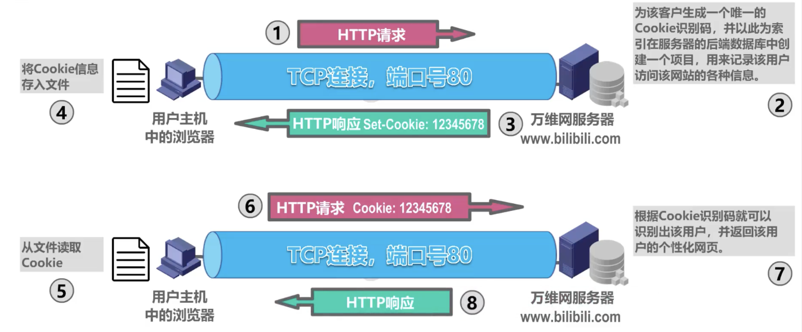
<!-- image-source: https://cdn.nlark.com/yuque/0/2026/png/67474974/1781945405395-6dae153a-5856-4b59-96cd-3d797552c03b.png -->

1. **生成**：用户首次访问时，服务器生成唯一的 Cookie 识别码，并在后端数据库（或 Session 存储）中创建关联记录。
2. **下发**：服务器在响应报文中添加 `Set-Cookie` 首部，将识别码发给浏览器。
3. **存储**：浏览器将其保存在本地的 Cookie 文件中。
4. **携带**：后续访问同一域名时，浏览器自动在请求报文中添加 `Cookie` 首部，携带该识别码。
5. **识别**：服务器根据识别码检索后端状态，返回个性化内容。

### 6. Web 缓存与代理服务器
**Web 缓存 (代理服务器)** 位于客户端与原始服务器之间，用于暂存最近的请求和响应，从而减少外部链路流量、降低访问延迟并减轻原始服务器负担。


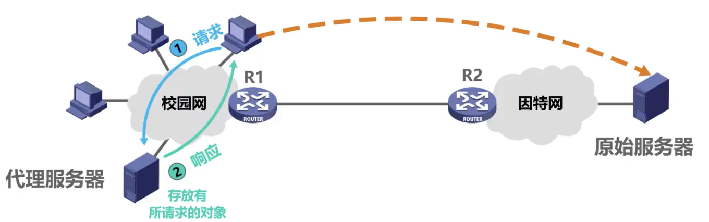
<!-- image-source: https://cdn.nlark.com/yuque/0/2026/png/67474974/1781945523829-f1627ca8-5156-4dea-887d-34e2204b40d1.png -->


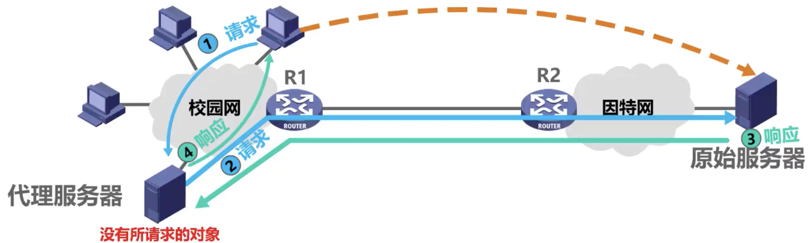
<!-- image-source: https://cdn.nlark.com/yuque/0/2026/png/67474974/1781945572337-165a1d59-624d-4331-8cf8-b80fd58cf6c5.png -->

**缓存一致性与条件请求**：  
为防止客户端获取到过期文档，HTTP 引入了条件请求机制：


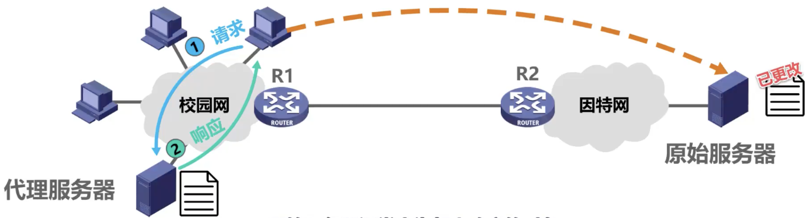
<!-- image-source: https://cdn.nlark.com/yuque/0/2026/png/67474974/1781945822994-f4d57935-665b-4266-99d5-1d90e4d0bd94.png -->

1. 原始服务器在响应中提供文档的**最后修改时间** (`Last-Modified`) 或 **过期时间** (`Expires`)。


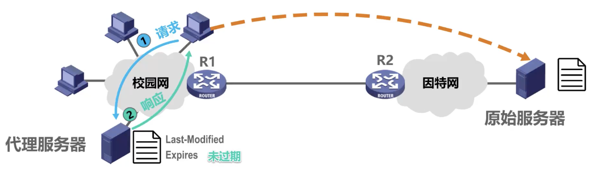
<!-- image-source: https://cdn.nlark.com/yuque/0/2026/png/67474974/1781945853846-8aac169f-abdd-4b81-9c9f-1c7517385236.png -->

2. 当代理服务器缓存的文档过期后，向原始服务器发送请求时，会附带 `If-Modified-Since` 首部（值为缓存文档的修改时间）。
3. **服务器判断**：
    - 若文档**未修改**：返回 `304 Not Modified` 状态码，**不包含实体主体**。代理服务器更新本地缓存的过期时间并返回给客户端。


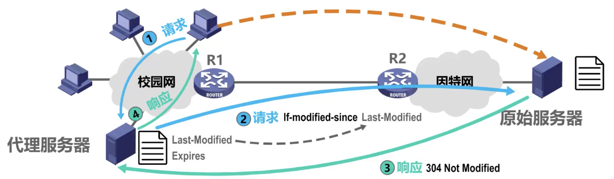
<!-- image-source: https://cdn.nlark.com/yuque/0/2026/png/67474974/1781945908320-56f04bf6-259c-4779-9952-1ee04a5ecc6a.png -->

- 若文档**已修改**：返回 `200 OK` 状态码及**新的实体主体**。代理服务器更新缓存并返回给客户端。


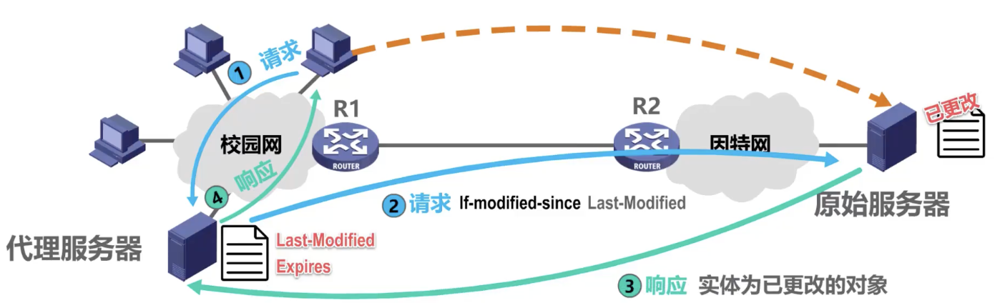
<!-- image-source: https://cdn.nlark.com/yuque/0/2026/png/67474974/1781945947951-09ae2aae-e75f-4a37-aad9-6158da0f5786.png -->

### 7. 考研真题解析 (408 计算机网络)

.png)
<!-- image-source: https://cdn.nlark.com/yuque/0/2026/png/67474974/1781945993260-fd42d081-dc49-46eb-b20d-219dfb074d13.png -->

+ **考点**：HTTP 请求报文首部字段的含义。
+ **解析**：
    - `Host` 字段指明目标域名（正确）。
    - `Connection: close` 告知服务器在发送完响应后关闭 TCP 连接，即采用**非持续连接**方式。若为持续连接，该值应为 `keep-alive`。因此，描述“采用持续连接方式”的选项错误。
    - `Cookie` 字段携带服务器之前下发的识别码（正确）。
+ **答案**：选项 C（描述错误的选项）。

---


.png)
<!-- image-source: https://cdn.nlark.com/yuque/0/2026/png/67474974/1781946026669-7578d29a-58dc-4d28-b52a-4b9bfa6b6a31.png -->

+ **场景**：浏览器请求 `rfc.html`，该页面引用了 2 个 JPEG 小图像。采用**持续连接**且**非流水线**方式。
+ **解析**：
    1. TCP 三次握手建立连接：消耗 **1 RTT**（第三个握手报文可直接携带 HTTP 请求）。
    2. 请求并接收 `rfc.html`：消耗 **1 RTT**。
    3. 解析 HTML 发现 2 个图片。由于是持续连接，无需重新握手；由于是非流水线，需依次请求。每个图片的请求与响应各消耗 **1 RTT**，共计 **2 RTT**。
    - **总耗时**：1 + 1 + 2 = **4 RTT**。

---

### 8. HTTP 与 Web 技术 (补充拓展)
对于 C++ 后端开发工程师而言，深入理解 HTTP 协议及其底层网络实现是构建高性能 Web 服务器（如 Nginx、Tengine）或微服务网关的核心能力。

#### 高并发 HTTP 服务器设计
+ **I/O 多路复用与状态机**：HTTP 是典型的请求-响应协议。在 C++ 中，通常使用 `epoll` (Reactor 模型) 监听海量并发连接。由于 TCP 粘包/半包现象，必须实现基于**有限状态机 (FSM)** 的 HTTP 报文解析器（如著名的 `http_parser` 或 `llhttp` 库），逐字节解析请求行、Header 和 Body，避免阻塞主线程。
+ **Keep-Alive 的底层管理**：维持大量长连接会消耗服务器的文件描述符和内存。后端需设计**定时器轮 (Timer Wheel)** 或**最小堆 (Min-Heap)** 来管理连接超时，及时清理空闲的 Keep-Alive 连接，防止资源耗尽。

#### 现代状态管理与安全
+ **Session 与 JWT**：传统的 Cookie-Session 机制在分布式集群中面临状态共享难题（需引入 Redis 集中存储）。现代 C++ 后端更倾向于使用无状态的 **JWT (JSON Web Token)**，将用户状态加密签名后直接下发给客户端，服务端仅做 CPU 校验，极大提升了水平扩展能力。
+ **Cookie 安全属性**：在设置 `Set-Cookie` 时，后端必须强制附加 `HttpOnly`（防 XSS 窃取）、`Secure`（仅限 HTTPS 传输）和 `SameSite`（防 CSRF 攻击）属性，以保障系统安全。

#### 协议演进：从 HTTP/1.1 到 HTTP/3
+ **HTTP/1.1 的局限**：虽然支持 Keep-Alive，但本质上是“队头阻塞”的（前一个请求未响应，后续请求只能等待）。
+ **HTTP/2 (多路复用)**：引入二进制分帧层和 Stream 概念，允许在单个 TCP 连接上并发交错传输多个请求/响应，彻底解决了应用层的队头阻塞问题。C++ 实现 HTTP/2 需处理复杂的 HPACK 首部压缩和流控逻辑。
+ **HTTP/3 (基于 QUIC)**：将底层传输协议从 TCP 替换为基于 UDP 的 **QUIC** 协议，解决了 TCP 层的队头阻塞问题，并实现了 0-RTT 的连接建立。目前许多现代 C++ 网络库（如基于 `ngtcp2` 或 `lsquic` 的库）已开始支持 HTTP/3 的服务端与客户端开发。

